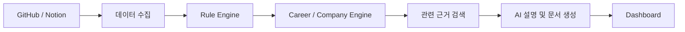

# DevPath

GitHub에 프로젝트는 쌓이는데, 정작 **내가 어떤 개발자로 성장하고 있는지** 확인하기는 어렵습니다.

커밋 수나 사용 언어 비율만으로는 프로젝트의 구조, 테스트 습관, 문서화 수준, 기술적인 고민을 설명하기 어렵기 때문입니다. DevPath는 이런 개발 기록을 분석해서 현재 역량과 부족한 부분을 보여주고, 목표 직무에 맞는 다음 학습 방향을 제안하는 서비스입니다.

아직 개발 중인 프로젝트이며, 현재는 GitHub 로그인과 사용자·세션 저장 기반까지 구현한 상태입니다.

## 왜 만들었나요?

취업을 준비하면서 GitHub를 꾸준히 관리해도 다음과 같은 질문에는 답하기 어려웠습니다.

- 이 프로젝트가 어떤 역량을 보여주는가?
- 단순히 기술을 사용한 것과 제대로 활용한 것은 어떻게 구분할 수 있을까?
- 백엔드 개발자를 목표로 할 때 무엇이 부족한가?
- 여러 프로젝트를 통해 실제로 성장하고 있는가?
- 포트폴리오에는 어떤 근거를 중심으로 작성해야 할까?

DevPath는 저장소의 활동량만 보여주는 대신, 코드와 문서에서 확인할 수 있는 근거를 모아 개발자의 성장 과정을 설명하는 것을 목표로 합니다.

## 가장 중요하게 생각한 원칙

### 점수는 AI가 계산하지 않습니다

LLM이 직접 점수를 만들면 실행할 때마다 결과가 달라질 수 있고, 왜 그런 점수가 나왔는지 설명하기도 어렵습니다.

그래서 DevPath에서는 역할을 다음과 같이 나눴습니다.

- **Rule Engine**이 점수와 Skill Matrix를 계산합니다.
- **Career Engine**이 목표 직무에 맞는 평가 기준을 선택합니다.
- **Company Engine**이 목표 기업에 맞는 추천 기준을 적용합니다.
- **AI**는 계산된 결과와 근거를 읽고 설명하거나 문서를 작성합니다.

즉, AI는 평가 기준을 만들거나 점수를 계산하지 않습니다.

## 만들고 있는 기능

- GitHub 저장소와 개발 활동 분석
- 언어, 프레임워크, 테스트, 문서화, 아키텍처 분석
- 프로젝트별 기술 역량 근거 정리
- 목표 직무에 따른 Skill Gap 분석
- 학습 로드맵 추천
- 포트폴리오와 이력서 초안 작성
- README 개선안 생성
- 프로젝트 기반 면접 질문 생성
- Notion 학습 노트와 회고 분석

현재 모든 기능이 구현된 것은 아닙니다. 기능별 요구사항과 설계를 먼저 정리한 뒤 작은 단위로 구현하고 있습니다.

## 동작 방식



1. GitHub와 Notion에서 사용자가 연결한 데이터를 가져옵니다.
2. Rule Engine이 저장소 구조와 개발 활동을 분석합니다.
3. 목표 직무와 기업에 맞게 필요한 역량을 비교합니다.
4. 분석 근거와 과거 기록 중 필요한 내용만 검색합니다.
5. AI가 결과를 설명하고 포트폴리오, 이력서 등의 초안을 작성합니다.

## 현재 구현 상태

지금은 서비스의 첫 번째 기반인 **Identity / Persistence 영역**을 작업하고 있습니다.

구현한 내용:

- GitHub OAuth2 로그인
- GitHub 계정과 내부 사용자 ID 분리
- 동일 GitHub 계정의 중복 사용자 생성 방지
- Spring Data JPA 기반 PostgreSQL 저장
- Flyway migration
- PostgreSQL 기반 Spring Session
- 현재 로그인 사용자 조회 API
- logout과 session 무효화
- CSRF 및 CORS 설정
- React Query 기반 frontend session 확인
- OpenAPI 계약
- domain, persistence, security, architecture 테스트 코드

Frontend 테스트 9개와 production build, OpenAPI 검증은 통과했습니다.

Java 21 환경에서 backend compile, 테스트, production build도 통과했습니다. 전체 backend 테스트 21개 중 일반 테스트 18개가 통과했고, PostgreSQL Testcontainers 테스트 3개는 현재 작업 환경에 Docker가 없어 건너뛴 상태입니다.

다음 작업은 PostgreSQL migration과 JPA 통합 테스트를 실제로 확인한 뒤 GitHub 저장소 연결과 동기화 기능을 구현하는 것입니다.

## 기술 스택

### Backend

- Java 21
- Spring Boot
- Spring Security
- Spring OAuth2 Client
- Spring Session JDBC
- Spring Data JPA
- PostgreSQL
- Flyway
- Gradle

### Frontend

- React
- TypeScript
- Vite
- React Query
- React Router
- Vitest
- React Testing Library

### AI / Knowledge

아직 구현 전이며 다음 구성을 기준으로 설계하고 있습니다.

- FastAPI
- Ollama
- OpenAI API 선택 연동
- pgvector
- RAG

## 프로젝트 구조

```text
DevPath/
├── backend/       # Spring Boot 애플리케이션
├── frontend/      # React 애플리케이션
├── contracts/     # OpenAPI 계약
├── docs/          # 요구사항과 아키텍처 문서
├── fixtures/      # 향후 분석 엔진 테스트 데이터
└── scripts/       # 프로젝트 검증 명령
```

Backend는 domain이 Spring과 JPA에 직접 의존하지 않도록 나눴습니다.

```text
Controller / OAuth Adapter
          ↓
    Application Use Case
          ↓
        Domain
          ↓
    Persistence Port
          ↓
      JPA Adapter
```

JPA Entity와 Domain Entity를 분리했고, Controller에서 JPA Repository를 직접 사용하지 않습니다. 이러한 의존성 규칙은 ArchUnit 테스트로 확인하도록 구성했습니다.

## 인증 방식

SPA에서 JWT를 관리하는 대신 서버가 session을 관리합니다.

- 브라우저에는 HttpOnly session cookie만 전달합니다.
- OAuth access token은 현재 단계에서 별도로 저장하지 않습니다.
- JavaScript에서 session ID를 읽거나 저장하지 않습니다.
- 상태를 변경하는 요청에는 CSRF token이 필요합니다.
- 허용된 frontend origin만 credential 요청을 보낼 수 있습니다.

## 로컬 실행

### 필요한 환경

- Java 21
- Node.js와 npm
- PostgreSQL
- GitHub OAuth App

GitHub OAuth callback URL:

```text
http://localhost:8080/login/oauth2/code/github
```

환경 변수 이름과 예시는 `backend/.env.example`에서 확인할 수 있습니다.

### Backend

```powershell
$env:SPRING_PROFILES_ACTIVE = "local"
cd backend
.\gradlew.bat bootRun
```

### Frontend

```powershell
cd frontend
npm ci
npm run dev
```

- Frontend: `http://localhost:5173`
- Backend: `http://localhost:8080`
- Health Check: `GET /internal/health`

## 테스트

```text
npm run backend:test
npm run backend:build
npm run frontend:test
npm run frontend:build
```

Backend 통합 테스트는 PostgreSQL Testcontainers를 사용하도록 작성했습니다.

## 문서

구현 전에 요구사항과 각 영역의 책임을 먼저 정리했습니다.

- `docs/01_SRS.md` — 요구사항 명세
- `docs/07_Domain_Model.md` — Domain Model
- `docs/09_Database_Design.md` — Database 설계
- `docs/10_API_Specification.md` — API 계약
- `docs/11_Backend_Architecture.md` — Backend 구조
- `docs/13_Security_Architecture.md` — 인증과 보안
- `docs/15_Test_Architecture.md` — 테스트 전략
- `docs/18_ADR.md` — 주요 기술 결정
- `docs/19_Roadmap.md` — 구현 순서와 현재 상태

전체 문서는 `docs/`에서 확인할 수 있습니다.

## 앞으로 할 일

- PostgreSQL 환경에서 migration과 JPA 통합 검증
- GitHub 저장소 연결 및 동기화
- 저장소 snapshot과 분석 데이터 수집
- Rule Engine 구현
- 직무별 Skill Gap과 학습 로드맵
- Notion 및 Knowledge 검색
- AI 설명과 포트폴리오 생성
- Dashboard

DevPath는 한 번의 분석 결과를 보여주는 도구보다, 프로젝트가 쌓일수록 개발자의 성장 과정을 함께 기록하는 서비스를 목표로 하고 있습니다.
