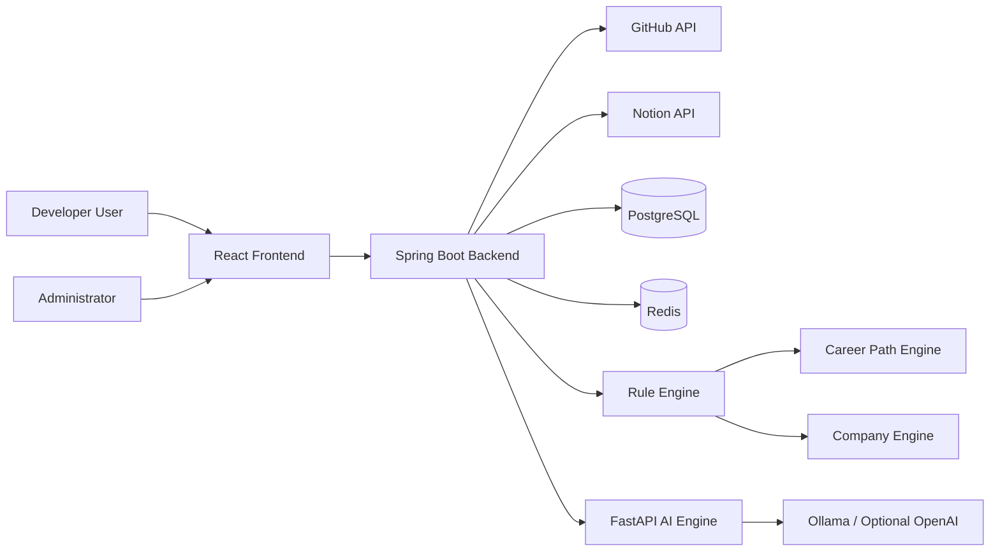


# DevPath Software Requirements Specification

- **Document ID:** DevPath-SRS-001
- **Version:** 1.0
- **Status:** Draft
- **Standard Alignment:** IEEE 29148-style Software Requirements Specification
- **Source of Truth:** `docs/00_Project_Context.md`
- **Date:** 2026-07-20

## Revision History

| Version | Date | Author | Description |
|---|---:|---|---|
| 1.0 | 2026-07-20 | Software Architecture Team | Initial enterprise SRS draft |

## 1. Introduction

### 1.1 Purpose

This Software Requirements Specification defines the functional, non-functional, interface, data, rule-engine, career-engine, AI, prompt-engineering, company-rule, operational, and acceptance requirements for DevPath. The document is intended for product owners, architects, backend engineers, frontend engineers, AI engineers, QA engineers, security reviewers, DevOps engineers, and administrators.

### 1.2 Scope

DevPath is an AI-powered Developer Career Intelligence Platform. It analyzes GitHub repositories and Notion workspaces, executes deterministic rule-based engineering analysis, and then uses AI only to explain results, generate recommendations, and produce career artifacts. DevPath does not permit LLMs to calculate scores.

### 1.3 Product Vision

DevPath shall become a long-term Developer Operating System for continuous career development by combining measurable engineering evidence, career-specific evaluation, company-specific readiness mapping, and AI-assisted coaching.

### 1.4 Definitions, Acronyms, and Abbreviations

| Term | Definition |
|---|---|
| AI Engine | Service layer responsible for prompt construction, LLM invocation, and natural-language generation. |
| Career Path Engine | Deterministic service that selects career-specific rule sets, prompts, and roadmap logic. |
| Company Engine | Deterministic service that applies company-specific weights and recommendation mappings. |
| Evidence | Measurable artifact collected from GitHub, Notion, normalized data, or Rule Engine output. |
| LLM | Large Language Model used only for explanation and generation, never score calculation. |
| Rule Engine | Deterministic component that calculates all scores and measurable skill outputs. |
| Skill Matrix | Structured representation of technical skills, evidence, maturity level, and score values. |

### 1.5 References

- ISO/IEC/IEEE 29148: Systems and software engineering — Life cycle processes — Requirements engineering
- OAuth 2.0 Authorization Framework
- GitHub REST and GraphQL API documentation
- Notion API documentation
- OWASP Application Security Verification Standard

### 1.6 Document Overview

The SRS describes context, stakeholders, system overview, requirements, external interfaces, data requirements, non-functional requirements, verification criteria, and traceability. Functional requirements use a mandatory record structure with ID, title, description, actors, preconditions, trigger, flows, postconditions, rules, validation, and acceptance criteria.

## 2. Overall Description

### 2.1 Product Perspective

DevPath is a web-based platform composed of a React frontend, Spring Boot backend, PostgreSQL database, Redis cache, deterministic Rule Engine, Career Path Engine, Company Engine, FastAPI-based AI service, optional OpenAI API integration, optional LangChain integration, and DevOps infrastructure using Docker, GitHub Actions, Nginx, and Oracle Cloud Free.

### 2.2 Product Functions

DevPath shall support user management, GitHub integration, Notion integration, data collection, deterministic rule analysis, career path evaluation, company readiness evaluation, AI explanation and artifact generation, dashboard visualization, search, and administration.

### 2.3 User Classes and Characteristics

| User Class | Characteristics | Primary Goals |
|---|---|---|
| Computer Science Student | Limited professional history, many learning projects | Understand skill gaps and portfolio readiness |
| Junior Developer | Some production or team experience | Improve engineering maturity and interview readiness |
| Career Changer | Mixed prior background | Map existing evidence to target developer role |
| Portfolio Builder | Focused on external presentation | Generate portfolio, resume, README improvements |
| Interview Candidate | Company-specific preparation need | Receive targeted interview questions and roadmap |
| Administrator | Internal operator | Manage rules, prompts, careers, companies, logs, and statistics |

### 2.4 Operating Environment

- Frontend: React, TypeScript, TailwindCSS, React Query
- Backend: Spring Boot, Spring Security
- Database: PostgreSQL and Redis
- AI: FastAPI, Ollama, optional OpenAI API, optional LangChain, pgvector
- DevOps: Docker, GitHub Actions, Nginx, Oracle Cloud Free

### 2.5 Design and Implementation Constraints

- The LLM shall never calculate scores.
- All scores shall be calculated by the Rule Engine.
- Every requirement shall be measurable and testable.
- Every requirement shall have a stable identifier.
- The system shall not invent unsupported project functionality.
- External provider limits shall be respected and surfaced through retry-safe workflows.

### 2.6 Assumptions and Dependencies

- Users grant GitHub and/or Notion OAuth permissions.
- Provider APIs may rate-limit or return partial data.
- Scoring rules are versioned and auditable.
- Company and career mappings are administratively configurable.
- AI output quality depends on available deterministic evidence.

## 3. System Context

## 4. External Interface Requirements

### 4.1 User Interfaces

- The UI shall provide authenticated dashboards, settings, integration connection screens, analysis views, generated artifact previews, search views, and administrative screens.
- All charts shall expose accessible text alternatives and keyboard-navigable controls.
- All forms shall provide field-level validation messages before submission when possible.

### 4.2 Hardware Interfaces

No dedicated hardware interfaces are required beyond standard browser-capable client devices and server infrastructure.

### 4.3 Software Interfaces

| Interface | Direction | Requirement |
|---|---|---|
| GitHub API | External inbound collection | OAuth, repositories, commits, branches, pull requests, issues, README, dependencies, directory tree |
| Notion API | External inbound collection | OAuth, workspace, pages, databases, documentation, retrospectives, notes |
| PostgreSQL | Internal persistence | User, integration, normalized, rule, AI, dashboard, search, audit data |
| Redis | Internal cache | Provider responses, dashboard snapshots, job state, rate-limit helpers |
| Ollama | Internal or local AI | Default LLM execution option |
| OpenAI API | Optional external AI | Optional hosted LLM execution option |

### 4.4 Communications Interfaces

- Backend APIs shall use HTTPS in non-local environments.
- OAuth redirects shall validate state parameters.
- Internal service communication shall use authenticated network paths in production.

## 5. Data Requirements

### 5.1 Data Entities

The system shall maintain entities for users, profiles, integrations, repositories, commits, branches, pull requests, issues, Notion workspaces, Notion pages, normalized evidence, technologies, rules, rule versions, scores, skill matrix entries, career profiles, company profiles, AI prompts, AI responses, generated artifacts, dashboard snapshots, search indexes, logs, metrics, and audit events.

### 5.2 Data Retention

- Raw provider data shall be retained according to administrator-configured retention policies.
- Derived scores shall retain rule version, input snapshot ID, and calculation timestamp.
- Audit logs shall be immutable to ordinary users.

### 5.3 Data Quality

- Normalized records shall include source provider, source ID, collected timestamp, and normalization version.
- Duplicate source records shall be detected using provider ID and content hash.
- Missing data shall be represented explicitly, not silently treated as zero unless a rule version defines that behavior.

## 6. Functional Requirements

Each functional requirement below is atomic, uniquely identified, measurable, and testable. No acceptance criterion permits AI-based score calculation.

## 6.1 User Management Requirements

### FR-001 — GitHub OAuth Login

- **Description:** The system shall provide github oauth login for the user management capability using measurable, persisted, and auditable behavior.
- **Actors:** Authenticated Developer, Guest User, System Administrator
- **Preconditions:** Valid application session or OAuth callback context.
- **Trigger:** User initiates account, profile, preference, career, company, or settings action.
- **Main Flow:** 1. Receive the request. 2. Validate permissions and required inputs. 3. Execute github oauth login. 4. Persist state or result when applicable. 5. Return a user-readable result with traceable identifiers.
- **Alternative Flow:** If optional filters, partial data, or cached data are available, the system shall use them only when the response clearly identifies the applied scope.
- **Exception Flow:** If validation, permission, provider, timeout, or persistence failure occurs, the system shall stop the operation, record an error code, and expose a non-sensitive failure message.
- **Postconditions:** GitHub OAuth Login result is available to authorized users or a failure state is recorded with retry guidance.
- **Business Rules:** All external and user data shall be processed according to authorization, privacy, and audit rules.
- **Validation Rules:** Required identifiers shall be valid UUIDs or provider IDs; numeric measurements shall use configured ranges; text outputs shall satisfy schema, length, and safety constraints.
- **Acceptance Criteria:** Given valid inputs, when github oauth login is requested, then the system completes the operation within the defined SLA, records an audit event, and returns deterministic identifiers or measurable results.

### FR-002 — OAuth Callback Handling

- **Description:** The system shall provide oauth callback handling for the user management capability using measurable, persisted, and auditable behavior.
- **Actors:** Authenticated Developer, Guest User, System Administrator
- **Preconditions:** Valid application session or OAuth callback context.
- **Trigger:** User initiates account, profile, preference, career, company, or settings action.
- **Main Flow:** 1. Receive the request. 2. Validate permissions and required inputs. 3. Execute oauth callback handling. 4. Persist state or result when applicable. 5. Return a user-readable result with traceable identifiers.
- **Alternative Flow:** If optional filters, partial data, or cached data are available, the system shall use them only when the response clearly identifies the applied scope.
- **Exception Flow:** If validation, permission, provider, timeout, or persistence failure occurs, the system shall stop the operation, record an error code, and expose a non-sensitive failure message.
- **Postconditions:** OAuth Callback Handling result is available to authorized users or a failure state is recorded with retry guidance.
- **Business Rules:** All external and user data shall be processed according to authorization, privacy, and audit rules.
- **Validation Rules:** Required identifiers shall be valid UUIDs or provider IDs; numeric measurements shall use configured ranges; text outputs shall satisfy schema, length, and safety constraints.
- **Acceptance Criteria:** Given valid inputs, when oauth callback handling is requested, then the system completes the operation within the defined SLA, records an audit event, and returns deterministic identifiers or measurable results.

### FR-003 — Account Provisioning

- **Description:** The system shall provide account provisioning for the user management capability using measurable, persisted, and auditable behavior.
- **Actors:** Authenticated Developer, Guest User, System Administrator
- **Preconditions:** Valid application session or OAuth callback context.
- **Trigger:** User initiates account, profile, preference, career, company, or settings action.
- **Main Flow:** 1. Receive the request. 2. Validate permissions and required inputs. 3. Execute account provisioning. 4. Persist state or result when applicable. 5. Return a user-readable result with traceable identifiers.
- **Alternative Flow:** If optional filters, partial data, or cached data are available, the system shall use them only when the response clearly identifies the applied scope.
- **Exception Flow:** If validation, permission, provider, timeout, or persistence failure occurs, the system shall stop the operation, record an error code, and expose a non-sensitive failure message.
- **Postconditions:** Account Provisioning result is available to authorized users or a failure state is recorded with retry guidance.
- **Business Rules:** All external and user data shall be processed according to authorization, privacy, and audit rules.
- **Validation Rules:** Required identifiers shall be valid UUIDs or provider IDs; numeric measurements shall use configured ranges; text outputs shall satisfy schema, length, and safety constraints.
- **Acceptance Criteria:** Given valid inputs, when account provisioning is requested, then the system completes the operation within the defined SLA, records an audit event, and returns deterministic identifiers or measurable results.

### FR-004 — User Session Management

- **Description:** The system shall provide user session management for the user management capability using measurable, persisted, and auditable behavior.
- **Actors:** Authenticated Developer, Guest User, System Administrator
- **Preconditions:** Valid application session or OAuth callback context.
- **Trigger:** User initiates account, profile, preference, career, company, or settings action.
- **Main Flow:** 1. Receive the request. 2. Validate permissions and required inputs. 3. Execute user session management. 4. Persist state or result when applicable. 5. Return a user-readable result with traceable identifiers.
- **Alternative Flow:** If optional filters, partial data, or cached data are available, the system shall use them only when the response clearly identifies the applied scope.
- **Exception Flow:** If validation, permission, provider, timeout, or persistence failure occurs, the system shall stop the operation, record an error code, and expose a non-sensitive failure message.
- **Postconditions:** User Session Management result is available to authorized users or a failure state is recorded with retry guidance.
- **Business Rules:** All external and user data shall be processed according to authorization, privacy, and audit rules.
- **Validation Rules:** Required identifiers shall be valid UUIDs or provider IDs; numeric measurements shall use configured ranges; text outputs shall satisfy schema, length, and safety constraints.
- **Acceptance Criteria:** Given valid inputs, when user session management is requested, then the system completes the operation within the defined SLA, records an audit event, and returns deterministic identifiers or measurable results.

### FR-005 — Logout

- **Description:** The system shall provide logout for the user management capability using measurable, persisted, and auditable behavior.
- **Actors:** Authenticated Developer, Guest User, System Administrator
- **Preconditions:** Valid application session or OAuth callback context.
- **Trigger:** User initiates account, profile, preference, career, company, or settings action.
- **Main Flow:** 1. Receive the request. 2. Validate permissions and required inputs. 3. Execute logout. 4. Persist state or result when applicable. 5. Return a user-readable result with traceable identifiers.
- **Alternative Flow:** If optional filters, partial data, or cached data are available, the system shall use them only when the response clearly identifies the applied scope.
- **Exception Flow:** If validation, permission, provider, timeout, or persistence failure occurs, the system shall stop the operation, record an error code, and expose a non-sensitive failure message.
- **Postconditions:** Logout result is available to authorized users or a failure state is recorded with retry guidance.
- **Business Rules:** All external and user data shall be processed according to authorization, privacy, and audit rules.
- **Validation Rules:** Required identifiers shall be valid UUIDs or provider IDs; numeric measurements shall use configured ranges; text outputs shall satisfy schema, length, and safety constraints.
- **Acceptance Criteria:** Given valid inputs, when logout is requested, then the system completes the operation within the defined SLA, records an audit event, and returns deterministic identifiers or measurable results.

### FR-006 — User Profile View

- **Description:** The system shall provide user profile view for the user management capability using measurable, persisted, and auditable behavior.
- **Actors:** Authenticated Developer, Guest User, System Administrator
- **Preconditions:** Valid application session or OAuth callback context.
- **Trigger:** User initiates account, profile, preference, career, company, or settings action.
- **Main Flow:** 1. Receive the request. 2. Validate permissions and required inputs. 3. Execute user profile view. 4. Persist state or result when applicable. 5. Return a user-readable result with traceable identifiers.
- **Alternative Flow:** If optional filters, partial data, or cached data are available, the system shall use them only when the response clearly identifies the applied scope.
- **Exception Flow:** If validation, permission, provider, timeout, or persistence failure occurs, the system shall stop the operation, record an error code, and expose a non-sensitive failure message.
- **Postconditions:** User Profile View result is available to authorized users or a failure state is recorded with retry guidance.
- **Business Rules:** All external and user data shall be processed according to authorization, privacy, and audit rules.
- **Validation Rules:** Required identifiers shall be valid UUIDs or provider IDs; numeric measurements shall use configured ranges; text outputs shall satisfy schema, length, and safety constraints.
- **Acceptance Criteria:** Given valid inputs, when user profile view is requested, then the system completes the operation within the defined SLA, records an audit event, and returns deterministic identifiers or measurable results.

### FR-007 — User Profile Update

- **Description:** The system shall provide user profile update for the user management capability using measurable, persisted, and auditable behavior.
- **Actors:** Authenticated Developer, Guest User, System Administrator
- **Preconditions:** Valid application session or OAuth callback context.
- **Trigger:** User initiates account, profile, preference, career, company, or settings action.
- **Main Flow:** 1. Receive the request. 2. Validate permissions and required inputs. 3. Execute user profile update. 4. Persist state or result when applicable. 5. Return a user-readable result with traceable identifiers.
- **Alternative Flow:** If optional filters, partial data, or cached data are available, the system shall use them only when the response clearly identifies the applied scope.
- **Exception Flow:** If validation, permission, provider, timeout, or persistence failure occurs, the system shall stop the operation, record an error code, and expose a non-sensitive failure message.
- **Postconditions:** User Profile Update result is available to authorized users or a failure state is recorded with retry guidance.
- **Business Rules:** All external and user data shall be processed according to authorization, privacy, and audit rules.
- **Validation Rules:** Required identifiers shall be valid UUIDs or provider IDs; numeric measurements shall use configured ranges; text outputs shall satisfy schema, length, and safety constraints.
- **Acceptance Criteria:** Given valid inputs, when user profile update is requested, then the system completes the operation within the defined SLA, records an audit event, and returns deterministic identifiers or measurable results.

### FR-008 — Career Selection

- **Description:** The system shall provide career selection for the user management capability using measurable, persisted, and auditable behavior.
- **Actors:** Authenticated Developer, Guest User, System Administrator
- **Preconditions:** Valid application session or OAuth callback context.
- **Trigger:** User initiates account, profile, preference, career, company, or settings action.
- **Main Flow:** 1. Receive the request. 2. Validate permissions and required inputs. 3. Execute career selection. 4. Persist state or result when applicable. 5. Return a user-readable result with traceable identifiers.
- **Alternative Flow:** If optional filters, partial data, or cached data are available, the system shall use them only when the response clearly identifies the applied scope.
- **Exception Flow:** If validation, permission, provider, timeout, or persistence failure occurs, the system shall stop the operation, record an error code, and expose a non-sensitive failure message.
- **Postconditions:** Career Selection result is available to authorized users or a failure state is recorded with retry guidance.
- **Business Rules:** All external and user data shall be processed according to authorization, privacy, and audit rules.
- **Validation Rules:** Required identifiers shall be valid UUIDs or provider IDs; numeric measurements shall use configured ranges; text outputs shall satisfy schema, length, and safety constraints.
- **Acceptance Criteria:** Given valid inputs, when career selection is requested, then the system completes the operation within the defined SLA, records an audit event, and returns deterministic identifiers or measurable results.

### FR-009 — Company Selection

- **Description:** The system shall provide company selection for the user management capability using measurable, persisted, and auditable behavior.
- **Actors:** Authenticated Developer, Guest User, System Administrator
- **Preconditions:** Valid application session or OAuth callback context.
- **Trigger:** User initiates account, profile, preference, career, company, or settings action.
- **Main Flow:** 1. Receive the request. 2. Validate permissions and required inputs. 3. Execute company selection. 4. Persist state or result when applicable. 5. Return a user-readable result with traceable identifiers.
- **Alternative Flow:** If optional filters, partial data, or cached data are available, the system shall use them only when the response clearly identifies the applied scope.
- **Exception Flow:** If validation, permission, provider, timeout, or persistence failure occurs, the system shall stop the operation, record an error code, and expose a non-sensitive failure message.
- **Postconditions:** Company Selection result is available to authorized users or a failure state is recorded with retry guidance.
- **Business Rules:** All external and user data shall be processed according to authorization, privacy, and audit rules.
- **Validation Rules:** Required identifiers shall be valid UUIDs or provider IDs; numeric measurements shall use configured ranges; text outputs shall satisfy schema, length, and safety constraints.
- **Acceptance Criteria:** Given valid inputs, when company selection is requested, then the system completes the operation within the defined SLA, records an audit event, and returns deterministic identifiers or measurable results.

### FR-010 — Settings View

- **Description:** The system shall provide settings view for the user management capability using measurable, persisted, and auditable behavior.
- **Actors:** Authenticated Developer, Guest User, System Administrator
- **Preconditions:** Valid application session or OAuth callback context.
- **Trigger:** User initiates account, profile, preference, career, company, or settings action.
- **Main Flow:** 1. Receive the request. 2. Validate permissions and required inputs. 3. Execute settings view. 4. Persist state or result when applicable. 5. Return a user-readable result with traceable identifiers.
- **Alternative Flow:** If optional filters, partial data, or cached data are available, the system shall use them only when the response clearly identifies the applied scope.
- **Exception Flow:** If validation, permission, provider, timeout, or persistence failure occurs, the system shall stop the operation, record an error code, and expose a non-sensitive failure message.
- **Postconditions:** Settings View result is available to authorized users or a failure state is recorded with retry guidance.
- **Business Rules:** All external and user data shall be processed according to authorization, privacy, and audit rules.
- **Validation Rules:** Required identifiers shall be valid UUIDs or provider IDs; numeric measurements shall use configured ranges; text outputs shall satisfy schema, length, and safety constraints.
- **Acceptance Criteria:** Given valid inputs, when settings view is requested, then the system completes the operation within the defined SLA, records an audit event, and returns deterministic identifiers or measurable results.

### FR-011 — Notification Preference Update

- **Description:** The system shall provide notification preference update for the user management capability using measurable, persisted, and auditable behavior.
- **Actors:** Authenticated Developer, Guest User, System Administrator
- **Preconditions:** Valid application session or OAuth callback context.
- **Trigger:** User initiates account, profile, preference, career, company, or settings action.
- **Main Flow:** 1. Receive the request. 2. Validate permissions and required inputs. 3. Execute notification preference update. 4. Persist state or result when applicable. 5. Return a user-readable result with traceable identifiers.
- **Alternative Flow:** If optional filters, partial data, or cached data are available, the system shall use them only when the response clearly identifies the applied scope.
- **Exception Flow:** If validation, permission, provider, timeout, or persistence failure occurs, the system shall stop the operation, record an error code, and expose a non-sensitive failure message.
- **Postconditions:** Notification Preference Update result is available to authorized users or a failure state is recorded with retry guidance.
- **Business Rules:** All external and user data shall be processed according to authorization, privacy, and audit rules.
- **Validation Rules:** Required identifiers shall be valid UUIDs or provider IDs; numeric measurements shall use configured ranges; text outputs shall satisfy schema, length, and safety constraints.
- **Acceptance Criteria:** Given valid inputs, when notification preference update is requested, then the system completes the operation within the defined SLA, records an audit event, and returns deterministic identifiers or measurable results.

### FR-012 — Data Privacy Preference Update

- **Description:** The system shall provide data privacy preference update for the user management capability using measurable, persisted, and auditable behavior.
- **Actors:** Authenticated Developer, Guest User, System Administrator
- **Preconditions:** Valid application session or OAuth callback context.
- **Trigger:** User initiates account, profile, preference, career, company, or settings action.
- **Main Flow:** 1. Receive the request. 2. Validate permissions and required inputs. 3. Execute data privacy preference update. 4. Persist state or result when applicable. 5. Return a user-readable result with traceable identifiers.
- **Alternative Flow:** If optional filters, partial data, or cached data are available, the system shall use them only when the response clearly identifies the applied scope.
- **Exception Flow:** If validation, permission, provider, timeout, or persistence failure occurs, the system shall stop the operation, record an error code, and expose a non-sensitive failure message.
- **Postconditions:** Data Privacy Preference Update result is available to authorized users or a failure state is recorded with retry guidance.
- **Business Rules:** All external and user data shall be processed according to authorization, privacy, and audit rules.
- **Validation Rules:** Required identifiers shall be valid UUIDs or provider IDs; numeric measurements shall use configured ranges; text outputs shall satisfy schema, length, and safety constraints.
- **Acceptance Criteria:** Given valid inputs, when data privacy preference update is requested, then the system completes the operation within the defined SLA, records an audit event, and returns deterministic identifiers or measurable results.

### FR-013 — Connected Account View

- **Description:** The system shall provide connected account view for the user management capability using measurable, persisted, and auditable behavior.
- **Actors:** Authenticated Developer, Guest User, System Administrator
- **Preconditions:** Valid application session or OAuth callback context.
- **Trigger:** User initiates account, profile, preference, career, company, or settings action.
- **Main Flow:** 1. Receive the request. 2. Validate permissions and required inputs. 3. Execute connected account view. 4. Persist state or result when applicable. 5. Return a user-readable result with traceable identifiers.
- **Alternative Flow:** If optional filters, partial data, or cached data are available, the system shall use them only when the response clearly identifies the applied scope.
- **Exception Flow:** If validation, permission, provider, timeout, or persistence failure occurs, the system shall stop the operation, record an error code, and expose a non-sensitive failure message.
- **Postconditions:** Connected Account View result is available to authorized users or a failure state is recorded with retry guidance.
- **Business Rules:** All external and user data shall be processed according to authorization, privacy, and audit rules.
- **Validation Rules:** Required identifiers shall be valid UUIDs or provider IDs; numeric measurements shall use configured ranges; text outputs shall satisfy schema, length, and safety constraints.
- **Acceptance Criteria:** Given valid inputs, when connected account view is requested, then the system completes the operation within the defined SLA, records an audit event, and returns deterministic identifiers or measurable results.

### FR-014 — Account Reconnection

- **Description:** The system shall provide account reconnection for the user management capability using measurable, persisted, and auditable behavior.
- **Actors:** Authenticated Developer, Guest User, System Administrator
- **Preconditions:** Valid application session or OAuth callback context.
- **Trigger:** User initiates account, profile, preference, career, company, or settings action.
- **Main Flow:** 1. Receive the request. 2. Validate permissions and required inputs. 3. Execute account reconnection. 4. Persist state or result when applicable. 5. Return a user-readable result with traceable identifiers.
- **Alternative Flow:** If optional filters, partial data, or cached data are available, the system shall use them only when the response clearly identifies the applied scope.
- **Exception Flow:** If validation, permission, provider, timeout, or persistence failure occurs, the system shall stop the operation, record an error code, and expose a non-sensitive failure message.
- **Postconditions:** Account Reconnection result is available to authorized users or a failure state is recorded with retry guidance.
- **Business Rules:** All external and user data shall be processed according to authorization, privacy, and audit rules.
- **Validation Rules:** Required identifiers shall be valid UUIDs or provider IDs; numeric measurements shall use configured ranges; text outputs shall satisfy schema, length, and safety constraints.
- **Acceptance Criteria:** Given valid inputs, when account reconnection is requested, then the system completes the operation within the defined SLA, records an audit event, and returns deterministic identifiers or measurable results.

### FR-015 — Account Deactivation

- **Description:** The system shall provide account deactivation for the user management capability using measurable, persisted, and auditable behavior.
- **Actors:** Authenticated Developer, Guest User, System Administrator
- **Preconditions:** Valid application session or OAuth callback context.
- **Trigger:** User initiates account, profile, preference, career, company, or settings action.
- **Main Flow:** 1. Receive the request. 2. Validate permissions and required inputs. 3. Execute account deactivation. 4. Persist state or result when applicable. 5. Return a user-readable result with traceable identifiers.
- **Alternative Flow:** If optional filters, partial data, or cached data are available, the system shall use them only when the response clearly identifies the applied scope.
- **Exception Flow:** If validation, permission, provider, timeout, or persistence failure occurs, the system shall stop the operation, record an error code, and expose a non-sensitive failure message.
- **Postconditions:** Account Deactivation result is available to authorized users or a failure state is recorded with retry guidance.
- **Business Rules:** All external and user data shall be processed according to authorization, privacy, and audit rules.
- **Validation Rules:** Required identifiers shall be valid UUIDs or provider IDs; numeric measurements shall use configured ranges; text outputs shall satisfy schema, length, and safety constraints.
- **Acceptance Criteria:** Given valid inputs, when account deactivation is requested, then the system completes the operation within the defined SLA, records an audit event, and returns deterministic identifiers or measurable results.

### FR-016 — Role Assignment

- **Description:** The system shall provide role assignment for the user management capability using measurable, persisted, and auditable behavior.
- **Actors:** Authenticated Developer, Guest User, System Administrator
- **Preconditions:** Valid application session or OAuth callback context.
- **Trigger:** User initiates account, profile, preference, career, company, or settings action.
- **Main Flow:** 1. Receive the request. 2. Validate permissions and required inputs. 3. Execute role assignment. 4. Persist state or result when applicable. 5. Return a user-readable result with traceable identifiers.
- **Alternative Flow:** If optional filters, partial data, or cached data are available, the system shall use them only when the response clearly identifies the applied scope.
- **Exception Flow:** If validation, permission, provider, timeout, or persistence failure occurs, the system shall stop the operation, record an error code, and expose a non-sensitive failure message.
- **Postconditions:** Role Assignment result is available to authorized users or a failure state is recorded with retry guidance.
- **Business Rules:** All external and user data shall be processed according to authorization, privacy, and audit rules.
- **Validation Rules:** Required identifiers shall be valid UUIDs or provider IDs; numeric measurements shall use configured ranges; text outputs shall satisfy schema, length, and safety constraints.
- **Acceptance Criteria:** Given valid inputs, when role assignment is requested, then the system completes the operation within the defined SLA, records an audit event, and returns deterministic identifiers or measurable results.

### FR-017 — Authorization Enforcement

- **Description:** The system shall provide authorization enforcement for the user management capability using measurable, persisted, and auditable behavior.
- **Actors:** Authenticated Developer, Guest User, System Administrator
- **Preconditions:** Valid application session or OAuth callback context.
- **Trigger:** User initiates account, profile, preference, career, company, or settings action.
- **Main Flow:** 1. Receive the request. 2. Validate permissions and required inputs. 3. Execute authorization enforcement. 4. Persist state or result when applicable. 5. Return a user-readable result with traceable identifiers.
- **Alternative Flow:** If optional filters, partial data, or cached data are available, the system shall use them only when the response clearly identifies the applied scope.
- **Exception Flow:** If validation, permission, provider, timeout, or persistence failure occurs, the system shall stop the operation, record an error code, and expose a non-sensitive failure message.
- **Postconditions:** Authorization Enforcement result is available to authorized users or a failure state is recorded with retry guidance.
- **Business Rules:** All external and user data shall be processed according to authorization, privacy, and audit rules.
- **Validation Rules:** Required identifiers shall be valid UUIDs or provider IDs; numeric measurements shall use configured ranges; text outputs shall satisfy schema, length, and safety constraints.
- **Acceptance Criteria:** Given valid inputs, when authorization enforcement is requested, then the system completes the operation within the defined SLA, records an audit event, and returns deterministic identifiers or measurable results.

### FR-018 — Profile Completeness Check

- **Description:** The system shall provide profile completeness check for the user management capability using measurable, persisted, and auditable behavior.
- **Actors:** Authenticated Developer, Guest User, System Administrator
- **Preconditions:** Valid application session or OAuth callback context.
- **Trigger:** User initiates account, profile, preference, career, company, or settings action.
- **Main Flow:** 1. Receive the request. 2. Validate permissions and required inputs. 3. Execute profile completeness check. 4. Persist state or result when applicable. 5. Return a user-readable result with traceable identifiers.
- **Alternative Flow:** If optional filters, partial data, or cached data are available, the system shall use them only when the response clearly identifies the applied scope.
- **Exception Flow:** If validation, permission, provider, timeout, or persistence failure occurs, the system shall stop the operation, record an error code, and expose a non-sensitive failure message.
- **Postconditions:** Profile Completeness Check result is available to authorized users or a failure state is recorded with retry guidance.
- **Business Rules:** All external and user data shall be processed according to authorization, privacy, and audit rules.
- **Validation Rules:** Required identifiers shall be valid UUIDs or provider IDs; numeric measurements shall use configured ranges; text outputs shall satisfy schema, length, and safety constraints.
- **Acceptance Criteria:** Given valid inputs, when profile completeness check is requested, then the system completes the operation within the defined SLA, records an audit event, and returns deterministic identifiers or measurable results.

### FR-019 — Onboarding Progress Tracking

- **Description:** The system shall provide onboarding progress tracking for the user management capability using measurable, persisted, and auditable behavior.
- **Actors:** Authenticated Developer, Guest User, System Administrator
- **Preconditions:** Valid application session or OAuth callback context.
- **Trigger:** User initiates account, profile, preference, career, company, or settings action.
- **Main Flow:** 1. Receive the request. 2. Validate permissions and required inputs. 3. Execute onboarding progress tracking. 4. Persist state or result when applicable. 5. Return a user-readable result with traceable identifiers.
- **Alternative Flow:** If optional filters, partial data, or cached data are available, the system shall use them only when the response clearly identifies the applied scope.
- **Exception Flow:** If validation, permission, provider, timeout, or persistence failure occurs, the system shall stop the operation, record an error code, and expose a non-sensitive failure message.
- **Postconditions:** Onboarding Progress Tracking result is available to authorized users or a failure state is recorded with retry guidance.
- **Business Rules:** All external and user data shall be processed according to authorization, privacy, and audit rules.
- **Validation Rules:** Required identifiers shall be valid UUIDs or provider IDs; numeric measurements shall use configured ranges; text outputs shall satisfy schema, length, and safety constraints.
- **Acceptance Criteria:** Given valid inputs, when onboarding progress tracking is requested, then the system completes the operation within the defined SLA, records an audit event, and returns deterministic identifiers or measurable results.

### FR-020 — User Audit Event Logging

- **Description:** The system shall provide user audit event logging for the user management capability using measurable, persisted, and auditable behavior.
- **Actors:** Authenticated Developer, Guest User, System Administrator
- **Preconditions:** Valid application session or OAuth callback context.
- **Trigger:** User initiates account, profile, preference, career, company, or settings action.
- **Main Flow:** 1. Receive the request. 2. Validate permissions and required inputs. 3. Execute user audit event logging. 4. Persist state or result when applicable. 5. Return a user-readable result with traceable identifiers.
- **Alternative Flow:** If optional filters, partial data, or cached data are available, the system shall use them only when the response clearly identifies the applied scope.
- **Exception Flow:** If validation, permission, provider, timeout, or persistence failure occurs, the system shall stop the operation, record an error code, and expose a non-sensitive failure message.
- **Postconditions:** User Audit Event Logging result is available to authorized users or a failure state is recorded with retry guidance.
- **Business Rules:** All external and user data shall be processed according to authorization, privacy, and audit rules.
- **Validation Rules:** Required identifiers shall be valid UUIDs or provider IDs; numeric measurements shall use configured ranges; text outputs shall satisfy schema, length, and safety constraints.
- **Acceptance Criteria:** Given valid inputs, when user audit event logging is requested, then the system completes the operation within the defined SLA, records an audit event, and returns deterministic identifiers or measurable results.

## 6.2 GitHub Integration Requirements

### FR-021 — GitHub OAuth Authorization

- **Description:** The system shall provide github oauth authorization for the github integration capability using measurable, persisted, and auditable behavior.
- **Actors:** Authenticated Developer, GitHub OAuth Provider, GitHub Collector
- **Preconditions:** User has connected or is connecting a GitHub account.
- **Trigger:** User requests repository discovery, synchronization, or repository analysis.
- **Main Flow:** 1. Receive the request. 2. Validate permissions and required inputs. 3. Execute github oauth authorization. 4. Persist state or result when applicable. 5. Return a user-readable result with traceable identifiers.
- **Alternative Flow:** If optional filters, partial data, or cached data are available, the system shall use them only when the response clearly identifies the applied scope.
- **Exception Flow:** If validation, permission, provider, timeout, or persistence failure occurs, the system shall stop the operation, record an error code, and expose a non-sensitive failure message.
- **Postconditions:** GitHub OAuth Authorization result is available to authorized users or a failure state is recorded with retry guidance.
- **Business Rules:** All external and user data shall be processed according to authorization, privacy, and audit rules.
- **Validation Rules:** Required identifiers shall be valid UUIDs or provider IDs; numeric measurements shall use configured ranges; text outputs shall satisfy schema, length, and safety constraints.
- **Acceptance Criteria:** Given valid inputs, when github oauth authorization is requested, then the system completes the operation within the defined SLA, records an audit event, and returns deterministic identifiers or measurable results.

### FR-022 — GitHub Token Storage

- **Description:** The system shall provide github token storage for the github integration capability using measurable, persisted, and auditable behavior.
- **Actors:** Authenticated Developer, GitHub OAuth Provider, GitHub Collector
- **Preconditions:** User has connected or is connecting a GitHub account.
- **Trigger:** User requests repository discovery, synchronization, or repository analysis.
- **Main Flow:** 1. Receive the request. 2. Validate permissions and required inputs. 3. Execute github token storage. 4. Persist state or result when applicable. 5. Return a user-readable result with traceable identifiers.
- **Alternative Flow:** If optional filters, partial data, or cached data are available, the system shall use them only when the response clearly identifies the applied scope.
- **Exception Flow:** If validation, permission, provider, timeout, or persistence failure occurs, the system shall stop the operation, record an error code, and expose a non-sensitive failure message.
- **Postconditions:** GitHub Token Storage result is available to authorized users or a failure state is recorded with retry guidance.
- **Business Rules:** All external and user data shall be processed according to authorization, privacy, and audit rules.
- **Validation Rules:** Required identifiers shall be valid UUIDs or provider IDs; numeric measurements shall use configured ranges; text outputs shall satisfy schema, length, and safety constraints.
- **Acceptance Criteria:** Given valid inputs, when github token storage is requested, then the system completes the operation within the defined SLA, records an audit event, and returns deterministic identifiers or measurable results.

### FR-023 — GitHub Token Refresh

- **Description:** The system shall provide github token refresh for the github integration capability using measurable, persisted, and auditable behavior.
- **Actors:** Authenticated Developer, GitHub OAuth Provider, GitHub Collector
- **Preconditions:** User has connected or is connecting a GitHub account.
- **Trigger:** User requests repository discovery, synchronization, or repository analysis.
- **Main Flow:** 1. Receive the request. 2. Validate permissions and required inputs. 3. Execute github token refresh. 4. Persist state or result when applicable. 5. Return a user-readable result with traceable identifiers.
- **Alternative Flow:** If optional filters, partial data, or cached data are available, the system shall use them only when the response clearly identifies the applied scope.
- **Exception Flow:** If validation, permission, provider, timeout, or persistence failure occurs, the system shall stop the operation, record an error code, and expose a non-sensitive failure message.
- **Postconditions:** GitHub Token Refresh result is available to authorized users or a failure state is recorded with retry guidance.
- **Business Rules:** All external and user data shall be processed according to authorization, privacy, and audit rules.
- **Validation Rules:** Required identifiers shall be valid UUIDs or provider IDs; numeric measurements shall use configured ranges; text outputs shall satisfy schema, length, and safety constraints.
- **Acceptance Criteria:** Given valid inputs, when github token refresh is requested, then the system completes the operation within the defined SLA, records an audit event, and returns deterministic identifiers or measurable results.

### FR-024 — Repository List Retrieval

- **Description:** The system shall provide repository list retrieval for the github integration capability using measurable, persisted, and auditable behavior.
- **Actors:** Authenticated Developer, GitHub OAuth Provider, GitHub Collector
- **Preconditions:** User has connected or is connecting a GitHub account.
- **Trigger:** User requests repository discovery, synchronization, or repository analysis.
- **Main Flow:** 1. Receive the request. 2. Validate permissions and required inputs. 3. Execute repository list retrieval. 4. Persist state or result when applicable. 5. Return a user-readable result with traceable identifiers.
- **Alternative Flow:** If optional filters, partial data, or cached data are available, the system shall use them only when the response clearly identifies the applied scope.
- **Exception Flow:** If validation, permission, provider, timeout, or persistence failure occurs, the system shall stop the operation, record an error code, and expose a non-sensitive failure message.
- **Postconditions:** Repository List Retrieval result is available to authorized users or a failure state is recorded with retry guidance.
- **Business Rules:** All external and user data shall be processed according to authorization, privacy, and audit rules.
- **Validation Rules:** Required identifiers shall be valid UUIDs or provider IDs; numeric measurements shall use configured ranges; text outputs shall satisfy schema, length, and safety constraints.
- **Acceptance Criteria:** Given valid inputs, when repository list retrieval is requested, then the system completes the operation within the defined SLA, records an audit event, and returns deterministic identifiers or measurable results.

### FR-025 — Repository Metadata Import

- **Description:** The system shall provide repository metadata import for the github integration capability using measurable, persisted, and auditable behavior.
- **Actors:** Authenticated Developer, GitHub OAuth Provider, GitHub Collector
- **Preconditions:** User has connected or is connecting a GitHub account.
- **Trigger:** User requests repository discovery, synchronization, or repository analysis.
- **Main Flow:** 1. Receive the request. 2. Validate permissions and required inputs. 3. Execute repository metadata import. 4. Persist state or result when applicable. 5. Return a user-readable result with traceable identifiers.
- **Alternative Flow:** If optional filters, partial data, or cached data are available, the system shall use them only when the response clearly identifies the applied scope.
- **Exception Flow:** If validation, permission, provider, timeout, or persistence failure occurs, the system shall stop the operation, record an error code, and expose a non-sensitive failure message.
- **Postconditions:** Repository Metadata Import result is available to authorized users or a failure state is recorded with retry guidance.
- **Business Rules:** All external and user data shall be processed according to authorization, privacy, and audit rules.
- **Validation Rules:** Required identifiers shall be valid UUIDs or provider IDs; numeric measurements shall use configured ranges; text outputs shall satisfy schema, length, and safety constraints.
- **Acceptance Criteria:** Given valid inputs, when repository metadata import is requested, then the system completes the operation within the defined SLA, records an audit event, and returns deterministic identifiers or measurable results.

### FR-026 — Repository Synchronization

- **Description:** The system shall provide repository synchronization for the github integration capability using measurable, persisted, and auditable behavior.
- **Actors:** Authenticated Developer, GitHub OAuth Provider, GitHub Collector
- **Preconditions:** User has connected or is connecting a GitHub account.
- **Trigger:** User requests repository discovery, synchronization, or repository analysis.
- **Main Flow:** 1. Receive the request. 2. Validate permissions and required inputs. 3. Execute repository synchronization. 4. Persist state or result when applicable. 5. Return a user-readable result with traceable identifiers.
- **Alternative Flow:** If optional filters, partial data, or cached data are available, the system shall use them only when the response clearly identifies the applied scope.
- **Exception Flow:** If validation, permission, provider, timeout, or persistence failure occurs, the system shall stop the operation, record an error code, and expose a non-sensitive failure message.
- **Postconditions:** Repository Synchronization result is available to authorized users or a failure state is recorded with retry guidance.
- **Business Rules:** All external and user data shall be processed according to authorization, privacy, and audit rules.
- **Validation Rules:** Required identifiers shall be valid UUIDs or provider IDs; numeric measurements shall use configured ranges; text outputs shall satisfy schema, length, and safety constraints.
- **Acceptance Criteria:** Given valid inputs, when repository synchronization is requested, then the system completes the operation within the defined SLA, records an audit event, and returns deterministic identifiers or measurable results.

### FR-027 — Commit History Collection

- **Description:** The system shall provide commit history collection for the github integration capability using measurable, persisted, and auditable behavior.
- **Actors:** Authenticated Developer, GitHub OAuth Provider, GitHub Collector
- **Preconditions:** User has connected or is connecting a GitHub account.
- **Trigger:** User requests repository discovery, synchronization, or repository analysis.
- **Main Flow:** 1. Receive the request. 2. Validate permissions and required inputs. 3. Execute commit history collection. 4. Persist state or result when applicable. 5. Return a user-readable result with traceable identifiers.
- **Alternative Flow:** If optional filters, partial data, or cached data are available, the system shall use them only when the response clearly identifies the applied scope.
- **Exception Flow:** If validation, permission, provider, timeout, or persistence failure occurs, the system shall stop the operation, record an error code, and expose a non-sensitive failure message.
- **Postconditions:** Commit History Collection result is available to authorized users or a failure state is recorded with retry guidance.
- **Business Rules:** All external and user data shall be processed according to authorization, privacy, and audit rules.
- **Validation Rules:** Required identifiers shall be valid UUIDs or provider IDs; numeric measurements shall use configured ranges; text outputs shall satisfy schema, length, and safety constraints.
- **Acceptance Criteria:** Given valid inputs, when commit history collection is requested, then the system completes the operation within the defined SLA, records an audit event, and returns deterministic identifiers or measurable results.

### FR-028 — Commit Frequency Analysis

- **Description:** The system shall provide commit frequency analysis for the github integration capability using measurable, persisted, and auditable behavior.
- **Actors:** Authenticated Developer, GitHub OAuth Provider, GitHub Collector
- **Preconditions:** User has connected or is connecting a GitHub account.
- **Trigger:** User requests repository discovery, synchronization, or repository analysis.
- **Main Flow:** 1. Receive the request. 2. Validate permissions and required inputs. 3. Execute commit frequency analysis. 4. Persist state or result when applicable. 5. Return a user-readable result with traceable identifiers.
- **Alternative Flow:** If optional filters, partial data, or cached data are available, the system shall use them only when the response clearly identifies the applied scope.
- **Exception Flow:** If validation, permission, provider, timeout, or persistence failure occurs, the system shall stop the operation, record an error code, and expose a non-sensitive failure message.
- **Postconditions:** Commit Frequency Analysis result is available to authorized users or a failure state is recorded with retry guidance.
- **Business Rules:** All external and user data shall be processed according to authorization, privacy, and audit rules.
- **Validation Rules:** Required identifiers shall be valid UUIDs or provider IDs; numeric measurements shall use configured ranges; text outputs shall satisfy schema, length, and safety constraints.
- **Acceptance Criteria:** Given valid inputs, when commit frequency analysis is requested, then the system completes the operation within the defined SLA, records an audit event, and returns deterministic identifiers or measurable results.

### FR-029 — Branch List Collection

- **Description:** The system shall provide branch list collection for the github integration capability using measurable, persisted, and auditable behavior.
- **Actors:** Authenticated Developer, GitHub OAuth Provider, GitHub Collector
- **Preconditions:** User has connected or is connecting a GitHub account.
- **Trigger:** User requests repository discovery, synchronization, or repository analysis.
- **Main Flow:** 1. Receive the request. 2. Validate permissions and required inputs. 3. Execute branch list collection. 4. Persist state or result when applicable. 5. Return a user-readable result with traceable identifiers.
- **Alternative Flow:** If optional filters, partial data, or cached data are available, the system shall use them only when the response clearly identifies the applied scope.
- **Exception Flow:** If validation, permission, provider, timeout, or persistence failure occurs, the system shall stop the operation, record an error code, and expose a non-sensitive failure message.
- **Postconditions:** Branch List Collection result is available to authorized users or a failure state is recorded with retry guidance.
- **Business Rules:** All external and user data shall be processed according to authorization, privacy, and audit rules.
- **Validation Rules:** Required identifiers shall be valid UUIDs or provider IDs; numeric measurements shall use configured ranges; text outputs shall satisfy schema, length, and safety constraints.
- **Acceptance Criteria:** Given valid inputs, when branch list collection is requested, then the system completes the operation within the defined SLA, records an audit event, and returns deterministic identifiers or measurable results.

### FR-030 — Default Branch Detection

- **Description:** The system shall provide default branch detection for the github integration capability using measurable, persisted, and auditable behavior.
- **Actors:** Authenticated Developer, GitHub OAuth Provider, GitHub Collector
- **Preconditions:** User has connected or is connecting a GitHub account.
- **Trigger:** User requests repository discovery, synchronization, or repository analysis.
- **Main Flow:** 1. Receive the request. 2. Validate permissions and required inputs. 3. Execute default branch detection. 4. Persist state or result when applicable. 5. Return a user-readable result with traceable identifiers.
- **Alternative Flow:** If optional filters, partial data, or cached data are available, the system shall use them only when the response clearly identifies the applied scope.
- **Exception Flow:** If validation, permission, provider, timeout, or persistence failure occurs, the system shall stop the operation, record an error code, and expose a non-sensitive failure message.
- **Postconditions:** Default Branch Detection result is available to authorized users or a failure state is recorded with retry guidance.
- **Business Rules:** All external and user data shall be processed according to authorization, privacy, and audit rules.
- **Validation Rules:** Required identifiers shall be valid UUIDs or provider IDs; numeric measurements shall use configured ranges; text outputs shall satisfy schema, length, and safety constraints.
- **Acceptance Criteria:** Given valid inputs, when default branch detection is requested, then the system completes the operation within the defined SLA, records an audit event, and returns deterministic identifiers or measurable results.

### FR-031 — Pull Request Collection

- **Description:** The system shall provide pull request collection for the github integration capability using measurable, persisted, and auditable behavior.
- **Actors:** Authenticated Developer, GitHub OAuth Provider, GitHub Collector
- **Preconditions:** User has connected or is connecting a GitHub account.
- **Trigger:** User requests repository discovery, synchronization, or repository analysis.
- **Main Flow:** 1. Receive the request. 2. Validate permissions and required inputs. 3. Execute pull request collection. 4. Persist state or result when applicable. 5. Return a user-readable result with traceable identifiers.
- **Alternative Flow:** If optional filters, partial data, or cached data are available, the system shall use them only when the response clearly identifies the applied scope.
- **Exception Flow:** If validation, permission, provider, timeout, or persistence failure occurs, the system shall stop the operation, record an error code, and expose a non-sensitive failure message.
- **Postconditions:** Pull Request Collection result is available to authorized users or a failure state is recorded with retry guidance.
- **Business Rules:** All external and user data shall be processed according to authorization, privacy, and audit rules.
- **Validation Rules:** Required identifiers shall be valid UUIDs or provider IDs; numeric measurements shall use configured ranges; text outputs shall satisfy schema, length, and safety constraints.
- **Acceptance Criteria:** Given valid inputs, when pull request collection is requested, then the system completes the operation within the defined SLA, records an audit event, and returns deterministic identifiers or measurable results.

### FR-032 — Pull Request Review Signal Extraction

- **Description:** The system shall provide pull request review signal extraction for the github integration capability using measurable, persisted, and auditable behavior.
- **Actors:** Authenticated Developer, GitHub OAuth Provider, GitHub Collector
- **Preconditions:** User has connected or is connecting a GitHub account.
- **Trigger:** User requests repository discovery, synchronization, or repository analysis.
- **Main Flow:** 1. Receive the request. 2. Validate permissions and required inputs. 3. Execute pull request review signal extraction. 4. Persist state or result when applicable. 5. Return a user-readable result with traceable identifiers.
- **Alternative Flow:** If optional filters, partial data, or cached data are available, the system shall use them only when the response clearly identifies the applied scope.
- **Exception Flow:** If validation, permission, provider, timeout, or persistence failure occurs, the system shall stop the operation, record an error code, and expose a non-sensitive failure message.
- **Postconditions:** Pull Request Review Signal Extraction result is available to authorized users or a failure state is recorded with retry guidance.
- **Business Rules:** All external and user data shall be processed according to authorization, privacy, and audit rules.
- **Validation Rules:** Required identifiers shall be valid UUIDs or provider IDs; numeric measurements shall use configured ranges; text outputs shall satisfy schema, length, and safety constraints.
- **Acceptance Criteria:** Given valid inputs, when pull request review signal extraction is requested, then the system completes the operation within the defined SLA, records an audit event, and returns deterministic identifiers or measurable results.

### FR-033 — Issue Collection

- **Description:** The system shall provide issue collection for the github integration capability using measurable, persisted, and auditable behavior.
- **Actors:** Authenticated Developer, GitHub OAuth Provider, GitHub Collector
- **Preconditions:** User has connected or is connecting a GitHub account.
- **Trigger:** User requests repository discovery, synchronization, or repository analysis.
- **Main Flow:** 1. Receive the request. 2. Validate permissions and required inputs. 3. Execute issue collection. 4. Persist state or result when applicable. 5. Return a user-readable result with traceable identifiers.
- **Alternative Flow:** If optional filters, partial data, or cached data are available, the system shall use them only when the response clearly identifies the applied scope.
- **Exception Flow:** If validation, permission, provider, timeout, or persistence failure occurs, the system shall stop the operation, record an error code, and expose a non-sensitive failure message.
- **Postconditions:** Issue Collection result is available to authorized users or a failure state is recorded with retry guidance.
- **Business Rules:** All external and user data shall be processed according to authorization, privacy, and audit rules.
- **Validation Rules:** Required identifiers shall be valid UUIDs or provider IDs; numeric measurements shall use configured ranges; text outputs shall satisfy schema, length, and safety constraints.
- **Acceptance Criteria:** Given valid inputs, when issue collection is requested, then the system completes the operation within the defined SLA, records an audit event, and returns deterministic identifiers or measurable results.

### FR-034 — Issue Collaboration Signal Extraction

- **Description:** The system shall provide issue collaboration signal extraction for the github integration capability using measurable, persisted, and auditable behavior.
- **Actors:** Authenticated Developer, GitHub OAuth Provider, GitHub Collector
- **Preconditions:** User has connected or is connecting a GitHub account.
- **Trigger:** User requests repository discovery, synchronization, or repository analysis.
- **Main Flow:** 1. Receive the request. 2. Validate permissions and required inputs. 3. Execute issue collaboration signal extraction. 4. Persist state or result when applicable. 5. Return a user-readable result with traceable identifiers.
- **Alternative Flow:** If optional filters, partial data, or cached data are available, the system shall use them only when the response clearly identifies the applied scope.
- **Exception Flow:** If validation, permission, provider, timeout, or persistence failure occurs, the system shall stop the operation, record an error code, and expose a non-sensitive failure message.
- **Postconditions:** Issue Collaboration Signal Extraction result is available to authorized users or a failure state is recorded with retry guidance.
- **Business Rules:** All external and user data shall be processed according to authorization, privacy, and audit rules.
- **Validation Rules:** Required identifiers shall be valid UUIDs or provider IDs; numeric measurements shall use configured ranges; text outputs shall satisfy schema, length, and safety constraints.
- **Acceptance Criteria:** Given valid inputs, when issue collaboration signal extraction is requested, then the system completes the operation within the defined SLA, records an audit event, and returns deterministic identifiers or measurable results.

### FR-035 — README Retrieval

- **Description:** The system shall provide readme retrieval for the github integration capability using measurable, persisted, and auditable behavior.
- **Actors:** Authenticated Developer, GitHub OAuth Provider, GitHub Collector
- **Preconditions:** User has connected or is connecting a GitHub account.
- **Trigger:** User requests repository discovery, synchronization, or repository analysis.
- **Main Flow:** 1. Receive the request. 2. Validate permissions and required inputs. 3. Execute readme retrieval. 4. Persist state or result when applicable. 5. Return a user-readable result with traceable identifiers.
- **Alternative Flow:** If optional filters, partial data, or cached data are available, the system shall use them only when the response clearly identifies the applied scope.
- **Exception Flow:** If validation, permission, provider, timeout, or persistence failure occurs, the system shall stop the operation, record an error code, and expose a non-sensitive failure message.
- **Postconditions:** README Retrieval result is available to authorized users or a failure state is recorded with retry guidance.
- **Business Rules:** All external and user data shall be processed according to authorization, privacy, and audit rules.
- **Validation Rules:** Required identifiers shall be valid UUIDs or provider IDs; numeric measurements shall use configured ranges; text outputs shall satisfy schema, length, and safety constraints.
- **Acceptance Criteria:** Given valid inputs, when readme retrieval is requested, then the system completes the operation within the defined SLA, records an audit event, and returns deterministic identifiers or measurable results.

### FR-036 — README Quality Signal Extraction

- **Description:** The system shall provide readme quality signal extraction for the github integration capability using measurable, persisted, and auditable behavior.
- **Actors:** Authenticated Developer, GitHub OAuth Provider, GitHub Collector
- **Preconditions:** User has connected or is connecting a GitHub account.
- **Trigger:** User requests repository discovery, synchronization, or repository analysis.
- **Main Flow:** 1. Receive the request. 2. Validate permissions and required inputs. 3. Execute readme quality signal extraction. 4. Persist state or result when applicable. 5. Return a user-readable result with traceable identifiers.
- **Alternative Flow:** If optional filters, partial data, or cached data are available, the system shall use them only when the response clearly identifies the applied scope.
- **Exception Flow:** If validation, permission, provider, timeout, or persistence failure occurs, the system shall stop the operation, record an error code, and expose a non-sensitive failure message.
- **Postconditions:** README Quality Signal Extraction result is available to authorized users or a failure state is recorded with retry guidance.
- **Business Rules:** All external and user data shall be processed according to authorization, privacy, and audit rules.
- **Validation Rules:** Required identifiers shall be valid UUIDs or provider IDs; numeric measurements shall use configured ranges; text outputs shall satisfy schema, length, and safety constraints.
- **Acceptance Criteria:** Given valid inputs, when readme quality signal extraction is requested, then the system completes the operation within the defined SLA, records an audit event, and returns deterministic identifiers or measurable results.

### FR-037 — Dependency Manifest Detection

- **Description:** The system shall provide dependency manifest detection for the github integration capability using measurable, persisted, and auditable behavior.
- **Actors:** Authenticated Developer, GitHub OAuth Provider, GitHub Collector
- **Preconditions:** User has connected or is connecting a GitHub account.
- **Trigger:** User requests repository discovery, synchronization, or repository analysis.
- **Main Flow:** 1. Receive the request. 2. Validate permissions and required inputs. 3. Execute dependency manifest detection. 4. Persist state or result when applicable. 5. Return a user-readable result with traceable identifiers.
- **Alternative Flow:** If optional filters, partial data, or cached data are available, the system shall use them only when the response clearly identifies the applied scope.
- **Exception Flow:** If validation, permission, provider, timeout, or persistence failure occurs, the system shall stop the operation, record an error code, and expose a non-sensitive failure message.
- **Postconditions:** Dependency Manifest Detection result is available to authorized users or a failure state is recorded with retry guidance.
- **Business Rules:** All external and user data shall be processed according to authorization, privacy, and audit rules.
- **Validation Rules:** Required identifiers shall be valid UUIDs or provider IDs; numeric measurements shall use configured ranges; text outputs shall satisfy schema, length, and safety constraints.
- **Acceptance Criteria:** Given valid inputs, when dependency manifest detection is requested, then the system completes the operation within the defined SLA, records an audit event, and returns deterministic identifiers or measurable results.

### FR-038 — Dependency Metadata Extraction

- **Description:** The system shall provide dependency metadata extraction for the github integration capability using measurable, persisted, and auditable behavior.
- **Actors:** Authenticated Developer, GitHub OAuth Provider, GitHub Collector
- **Preconditions:** User has connected or is connecting a GitHub account.
- **Trigger:** User requests repository discovery, synchronization, or repository analysis.
- **Main Flow:** 1. Receive the request. 2. Validate permissions and required inputs. 3. Execute dependency metadata extraction. 4. Persist state or result when applicable. 5. Return a user-readable result with traceable identifiers.
- **Alternative Flow:** If optional filters, partial data, or cached data are available, the system shall use them only when the response clearly identifies the applied scope.
- **Exception Flow:** If validation, permission, provider, timeout, or persistence failure occurs, the system shall stop the operation, record an error code, and expose a non-sensitive failure message.
- **Postconditions:** Dependency Metadata Extraction result is available to authorized users or a failure state is recorded with retry guidance.
- **Business Rules:** All external and user data shall be processed according to authorization, privacy, and audit rules.
- **Validation Rules:** Required identifiers shall be valid UUIDs or provider IDs; numeric measurements shall use configured ranges; text outputs shall satisfy schema, length, and safety constraints.
- **Acceptance Criteria:** Given valid inputs, when dependency metadata extraction is requested, then the system completes the operation within the defined SLA, records an audit event, and returns deterministic identifiers or measurable results.

### FR-039 — Directory Tree Collection

- **Description:** The system shall provide directory tree collection for the github integration capability using measurable, persisted, and auditable behavior.
- **Actors:** Authenticated Developer, GitHub OAuth Provider, GitHub Collector
- **Preconditions:** User has connected or is connecting a GitHub account.
- **Trigger:** User requests repository discovery, synchronization, or repository analysis.
- **Main Flow:** 1. Receive the request. 2. Validate permissions and required inputs. 3. Execute directory tree collection. 4. Persist state or result when applicable. 5. Return a user-readable result with traceable identifiers.
- **Alternative Flow:** If optional filters, partial data, or cached data are available, the system shall use them only when the response clearly identifies the applied scope.
- **Exception Flow:** If validation, permission, provider, timeout, or persistence failure occurs, the system shall stop the operation, record an error code, and expose a non-sensitive failure message.
- **Postconditions:** Directory Tree Collection result is available to authorized users or a failure state is recorded with retry guidance.
- **Business Rules:** All external and user data shall be processed according to authorization, privacy, and audit rules.
- **Validation Rules:** Required identifiers shall be valid UUIDs or provider IDs; numeric measurements shall use configured ranges; text outputs shall satisfy schema, length, and safety constraints.
- **Acceptance Criteria:** Given valid inputs, when directory tree collection is requested, then the system completes the operation within the defined SLA, records an audit event, and returns deterministic identifiers or measurable results.

### FR-040 — Architecture Directory Signal Extraction

- **Description:** The system shall provide architecture directory signal extraction for the github integration capability using measurable, persisted, and auditable behavior.
- **Actors:** Authenticated Developer, GitHub OAuth Provider, GitHub Collector
- **Preconditions:** User has connected or is connecting a GitHub account.
- **Trigger:** User requests repository discovery, synchronization, or repository analysis.
- **Main Flow:** 1. Receive the request. 2. Validate permissions and required inputs. 3. Execute architecture directory signal extraction. 4. Persist state or result when applicable. 5. Return a user-readable result with traceable identifiers.
- **Alternative Flow:** If optional filters, partial data, or cached data are available, the system shall use them only when the response clearly identifies the applied scope.
- **Exception Flow:** If validation, permission, provider, timeout, or persistence failure occurs, the system shall stop the operation, record an error code, and expose a non-sensitive failure message.
- **Postconditions:** Architecture Directory Signal Extraction result is available to authorized users or a failure state is recorded with retry guidance.
- **Business Rules:** All external and user data shall be processed according to authorization, privacy, and audit rules.
- **Validation Rules:** Required identifiers shall be valid UUIDs or provider IDs; numeric measurements shall use configured ranges; text outputs shall satisfy schema, length, and safety constraints.
- **Acceptance Criteria:** Given valid inputs, when architecture directory signal extraction is requested, then the system completes the operation within the defined SLA, records an audit event, and returns deterministic identifiers or measurable results.

### FR-041 — Language Statistics Collection

- **Description:** The system shall provide language statistics collection for the github integration capability using measurable, persisted, and auditable behavior.
- **Actors:** Authenticated Developer, GitHub OAuth Provider, GitHub Collector
- **Preconditions:** User has connected or is connecting a GitHub account.
- **Trigger:** User requests repository discovery, synchronization, or repository analysis.
- **Main Flow:** 1. Receive the request. 2. Validate permissions and required inputs. 3. Execute language statistics collection. 4. Persist state or result when applicable. 5. Return a user-readable result with traceable identifiers.
- **Alternative Flow:** If optional filters, partial data, or cached data are available, the system shall use them only when the response clearly identifies the applied scope.
- **Exception Flow:** If validation, permission, provider, timeout, or persistence failure occurs, the system shall stop the operation, record an error code, and expose a non-sensitive failure message.
- **Postconditions:** Language Statistics Collection result is available to authorized users or a failure state is recorded with retry guidance.
- **Business Rules:** All external and user data shall be processed according to authorization, privacy, and audit rules.
- **Validation Rules:** Required identifiers shall be valid UUIDs or provider IDs; numeric measurements shall use configured ranges; text outputs shall satisfy schema, length, and safety constraints.
- **Acceptance Criteria:** Given valid inputs, when language statistics collection is requested, then the system completes the operation within the defined SLA, records an audit event, and returns deterministic identifiers or measurable results.

### FR-042 — Framework Signal Extraction

- **Description:** The system shall provide framework signal extraction for the github integration capability using measurable, persisted, and auditable behavior.
- **Actors:** Authenticated Developer, GitHub OAuth Provider, GitHub Collector
- **Preconditions:** User has connected or is connecting a GitHub account.
- **Trigger:** User requests repository discovery, synchronization, or repository analysis.
- **Main Flow:** 1. Receive the request. 2. Validate permissions and required inputs. 3. Execute framework signal extraction. 4. Persist state or result when applicable. 5. Return a user-readable result with traceable identifiers.
- **Alternative Flow:** If optional filters, partial data, or cached data are available, the system shall use them only when the response clearly identifies the applied scope.
- **Exception Flow:** If validation, permission, provider, timeout, or persistence failure occurs, the system shall stop the operation, record an error code, and expose a non-sensitive failure message.
- **Postconditions:** Framework Signal Extraction result is available to authorized users or a failure state is recorded with retry guidance.
- **Business Rules:** All external and user data shall be processed according to authorization, privacy, and audit rules.
- **Validation Rules:** Required identifiers shall be valid UUIDs or provider IDs; numeric measurements shall use configured ranges; text outputs shall satisfy schema, length, and safety constraints.
- **Acceptance Criteria:** Given valid inputs, when framework signal extraction is requested, then the system completes the operation within the defined SLA, records an audit event, and returns deterministic identifiers or measurable results.

### FR-043 — Repository Activity Timeline

- **Description:** The system shall provide repository activity timeline for the github integration capability using measurable, persisted, and auditable behavior.
- **Actors:** Authenticated Developer, GitHub OAuth Provider, GitHub Collector
- **Preconditions:** User has connected or is connecting a GitHub account.
- **Trigger:** User requests repository discovery, synchronization, or repository analysis.
- **Main Flow:** 1. Receive the request. 2. Validate permissions and required inputs. 3. Execute repository activity timeline. 4. Persist state or result when applicable. 5. Return a user-readable result with traceable identifiers.
- **Alternative Flow:** If optional filters, partial data, or cached data are available, the system shall use them only when the response clearly identifies the applied scope.
- **Exception Flow:** If validation, permission, provider, timeout, or persistence failure occurs, the system shall stop the operation, record an error code, and expose a non-sensitive failure message.
- **Postconditions:** Repository Activity Timeline result is available to authorized users or a failure state is recorded with retry guidance.
- **Business Rules:** All external and user data shall be processed according to authorization, privacy, and audit rules.
- **Validation Rules:** Required identifiers shall be valid UUIDs or provider IDs; numeric measurements shall use configured ranges; text outputs shall satisfy schema, length, and safety constraints.
- **Acceptance Criteria:** Given valid inputs, when repository activity timeline is requested, then the system completes the operation within the defined SLA, records an audit event, and returns deterministic identifiers or measurable results.

### FR-044 — Repository Staleness Detection

- **Description:** The system shall provide repository staleness detection for the github integration capability using measurable, persisted, and auditable behavior.
- **Actors:** Authenticated Developer, GitHub OAuth Provider, GitHub Collector
- **Preconditions:** User has connected or is connecting a GitHub account.
- **Trigger:** User requests repository discovery, synchronization, or repository analysis.
- **Main Flow:** 1. Receive the request. 2. Validate permissions and required inputs. 3. Execute repository staleness detection. 4. Persist state or result when applicable. 5. Return a user-readable result with traceable identifiers.
- **Alternative Flow:** If optional filters, partial data, or cached data are available, the system shall use them only when the response clearly identifies the applied scope.
- **Exception Flow:** If validation, permission, provider, timeout, or persistence failure occurs, the system shall stop the operation, record an error code, and expose a non-sensitive failure message.
- **Postconditions:** Repository Staleness Detection result is available to authorized users or a failure state is recorded with retry guidance.
- **Business Rules:** All external and user data shall be processed according to authorization, privacy, and audit rules.
- **Validation Rules:** Required identifiers shall be valid UUIDs or provider IDs; numeric measurements shall use configured ranges; text outputs shall satisfy schema, length, and safety constraints.
- **Acceptance Criteria:** Given valid inputs, when repository staleness detection is requested, then the system completes the operation within the defined SLA, records an audit event, and returns deterministic identifiers or measurable results.

### FR-045 — Large Repository Handling

- **Description:** The system shall provide large repository handling for the github integration capability using measurable, persisted, and auditable behavior.
- **Actors:** Authenticated Developer, GitHub OAuth Provider, GitHub Collector
- **Preconditions:** User has connected or is connecting a GitHub account.
- **Trigger:** User requests repository discovery, synchronization, or repository analysis.
- **Main Flow:** 1. Receive the request. 2. Validate permissions and required inputs. 3. Execute large repository handling. 4. Persist state or result when applicable. 5. Return a user-readable result with traceable identifiers.
- **Alternative Flow:** If optional filters, partial data, or cached data are available, the system shall use them only when the response clearly identifies the applied scope.
- **Exception Flow:** If validation, permission, provider, timeout, or persistence failure occurs, the system shall stop the operation, record an error code, and expose a non-sensitive failure message.
- **Postconditions:** Large Repository Handling result is available to authorized users or a failure state is recorded with retry guidance.
- **Business Rules:** All external and user data shall be processed according to authorization, privacy, and audit rules.
- **Validation Rules:** Required identifiers shall be valid UUIDs or provider IDs; numeric measurements shall use configured ranges; text outputs shall satisfy schema, length, and safety constraints.
- **Acceptance Criteria:** Given valid inputs, when large repository handling is requested, then the system completes the operation within the defined SLA, records an audit event, and returns deterministic identifiers or measurable results.

### FR-046 — GitHub Rate Limit Handling

- **Description:** The system shall provide github rate limit handling for the github integration capability using measurable, persisted, and auditable behavior.
- **Actors:** Authenticated Developer, GitHub OAuth Provider, GitHub Collector
- **Preconditions:** User has connected or is connecting a GitHub account.
- **Trigger:** User requests repository discovery, synchronization, or repository analysis.
- **Main Flow:** 1. Receive the request. 2. Validate permissions and required inputs. 3. Execute github rate limit handling. 4. Persist state or result when applicable. 5. Return a user-readable result with traceable identifiers.
- **Alternative Flow:** If optional filters, partial data, or cached data are available, the system shall use them only when the response clearly identifies the applied scope.
- **Exception Flow:** If validation, permission, provider, timeout, or persistence failure occurs, the system shall stop the operation, record an error code, and expose a non-sensitive failure message.
- **Postconditions:** GitHub Rate Limit Handling result is available to authorized users or a failure state is recorded with retry guidance.
- **Business Rules:** All external and user data shall be processed according to authorization, privacy, and audit rules.
- **Validation Rules:** Required identifiers shall be valid UUIDs or provider IDs; numeric measurements shall use configured ranges; text outputs shall satisfy schema, length, and safety constraints.
- **Acceptance Criteria:** Given valid inputs, when github rate limit handling is requested, then the system completes the operation within the defined SLA, records an audit event, and returns deterministic identifiers or measurable results.

### FR-047 — Incremental Sync

- **Description:** The system shall provide incremental sync for the github integration capability using measurable, persisted, and auditable behavior.
- **Actors:** Authenticated Developer, GitHub OAuth Provider, GitHub Collector
- **Preconditions:** User has connected or is connecting a GitHub account.
- **Trigger:** User requests repository discovery, synchronization, or repository analysis.
- **Main Flow:** 1. Receive the request. 2. Validate permissions and required inputs. 3. Execute incremental sync. 4. Persist state or result when applicable. 5. Return a user-readable result with traceable identifiers.
- **Alternative Flow:** If optional filters, partial data, or cached data are available, the system shall use them only when the response clearly identifies the applied scope.
- **Exception Flow:** If validation, permission, provider, timeout, or persistence failure occurs, the system shall stop the operation, record an error code, and expose a non-sensitive failure message.
- **Postconditions:** Incremental Sync result is available to authorized users or a failure state is recorded with retry guidance.
- **Business Rules:** All external and user data shall be processed according to authorization, privacy, and audit rules.
- **Validation Rules:** Required identifiers shall be valid UUIDs or provider IDs; numeric measurements shall use configured ranges; text outputs shall satisfy schema, length, and safety constraints.
- **Acceptance Criteria:** Given valid inputs, when incremental sync is requested, then the system completes the operation within the defined SLA, records an audit event, and returns deterministic identifiers or measurable results.

### FR-048 — Manual Resync

- **Description:** The system shall provide manual resync for the github integration capability using measurable, persisted, and auditable behavior.
- **Actors:** Authenticated Developer, GitHub OAuth Provider, GitHub Collector
- **Preconditions:** User has connected or is connecting a GitHub account.
- **Trigger:** User requests repository discovery, synchronization, or repository analysis.
- **Main Flow:** 1. Receive the request. 2. Validate permissions and required inputs. 3. Execute manual resync. 4. Persist state or result when applicable. 5. Return a user-readable result with traceable identifiers.
- **Alternative Flow:** If optional filters, partial data, or cached data are available, the system shall use them only when the response clearly identifies the applied scope.
- **Exception Flow:** If validation, permission, provider, timeout, or persistence failure occurs, the system shall stop the operation, record an error code, and expose a non-sensitive failure message.
- **Postconditions:** Manual Resync result is available to authorized users or a failure state is recorded with retry guidance.
- **Business Rules:** All external and user data shall be processed according to authorization, privacy, and audit rules.
- **Validation Rules:** Required identifiers shall be valid UUIDs or provider IDs; numeric measurements shall use configured ranges; text outputs shall satisfy schema, length, and safety constraints.
- **Acceptance Criteria:** Given valid inputs, when manual resync is requested, then the system completes the operation within the defined SLA, records an audit event, and returns deterministic identifiers or measurable results.

### FR-049 — Sync Failure Reporting

- **Description:** The system shall provide sync failure reporting for the github integration capability using measurable, persisted, and auditable behavior.
- **Actors:** Authenticated Developer, GitHub OAuth Provider, GitHub Collector
- **Preconditions:** User has connected or is connecting a GitHub account.
- **Trigger:** User requests repository discovery, synchronization, or repository analysis.
- **Main Flow:** 1. Receive the request. 2. Validate permissions and required inputs. 3. Execute sync failure reporting. 4. Persist state or result when applicable. 5. Return a user-readable result with traceable identifiers.
- **Alternative Flow:** If optional filters, partial data, or cached data are available, the system shall use them only when the response clearly identifies the applied scope.
- **Exception Flow:** If validation, permission, provider, timeout, or persistence failure occurs, the system shall stop the operation, record an error code, and expose a non-sensitive failure message.
- **Postconditions:** Sync Failure Reporting result is available to authorized users or a failure state is recorded with retry guidance.
- **Business Rules:** All external and user data shall be processed according to authorization, privacy, and audit rules.
- **Validation Rules:** Required identifiers shall be valid UUIDs or provider IDs; numeric measurements shall use configured ranges; text outputs shall satisfy schema, length, and safety constraints.
- **Acceptance Criteria:** Given valid inputs, when sync failure reporting is requested, then the system completes the operation within the defined SLA, records an audit event, and returns deterministic identifiers or measurable results.

### FR-050 — GitHub Integration Audit Logging

- **Description:** The system shall provide github integration audit logging for the github integration capability using measurable, persisted, and auditable behavior.
- **Actors:** Authenticated Developer, GitHub OAuth Provider, GitHub Collector
- **Preconditions:** User has connected or is connecting a GitHub account.
- **Trigger:** User requests repository discovery, synchronization, or repository analysis.
- **Main Flow:** 1. Receive the request. 2. Validate permissions and required inputs. 3. Execute github integration audit logging. 4. Persist state or result when applicable. 5. Return a user-readable result with traceable identifiers.
- **Alternative Flow:** If optional filters, partial data, or cached data are available, the system shall use them only when the response clearly identifies the applied scope.
- **Exception Flow:** If validation, permission, provider, timeout, or persistence failure occurs, the system shall stop the operation, record an error code, and expose a non-sensitive failure message.
- **Postconditions:** GitHub Integration Audit Logging result is available to authorized users or a failure state is recorded with retry guidance.
- **Business Rules:** All external and user data shall be processed according to authorization, privacy, and audit rules.
- **Validation Rules:** Required identifiers shall be valid UUIDs or provider IDs; numeric measurements shall use configured ranges; text outputs shall satisfy schema, length, and safety constraints.
- **Acceptance Criteria:** Given valid inputs, when github integration audit logging is requested, then the system completes the operation within the defined SLA, records an audit event, and returns deterministic identifiers or measurable results.

## 6.3 Notion Integration Requirements

### FR-051 — Notion OAuth Authorization

- **Description:** The system shall provide notion oauth authorization for the notion integration capability using measurable, persisted, and auditable behavior.
- **Actors:** Authenticated Developer, Notion OAuth Provider, Notion Collector
- **Preconditions:** User has connected or is connecting a Notion workspace.
- **Trigger:** User requests workspace, page, documentation, or learning-note analysis.
- **Main Flow:** 1. Receive the request. 2. Validate permissions and required inputs. 3. Execute notion oauth authorization. 4. Persist state or result when applicable. 5. Return a user-readable result with traceable identifiers.
- **Alternative Flow:** If optional filters, partial data, or cached data are available, the system shall use them only when the response clearly identifies the applied scope.
- **Exception Flow:** If validation, permission, provider, timeout, or persistence failure occurs, the system shall stop the operation, record an error code, and expose a non-sensitive failure message.
- **Postconditions:** Notion OAuth Authorization result is available to authorized users or a failure state is recorded with retry guidance.
- **Business Rules:** All external and user data shall be processed according to authorization, privacy, and audit rules.
- **Validation Rules:** Required identifiers shall be valid UUIDs or provider IDs; numeric measurements shall use configured ranges; text outputs shall satisfy schema, length, and safety constraints.
- **Acceptance Criteria:** Given valid inputs, when notion oauth authorization is requested, then the system completes the operation within the defined SLA, records an audit event, and returns deterministic identifiers or measurable results.

### FR-052 — Notion Token Storage

- **Description:** The system shall provide notion token storage for the notion integration capability using measurable, persisted, and auditable behavior.
- **Actors:** Authenticated Developer, Notion OAuth Provider, Notion Collector
- **Preconditions:** User has connected or is connecting a Notion workspace.
- **Trigger:** User requests workspace, page, documentation, or learning-note analysis.
- **Main Flow:** 1. Receive the request. 2. Validate permissions and required inputs. 3. Execute notion token storage. 4. Persist state or result when applicable. 5. Return a user-readable result with traceable identifiers.
- **Alternative Flow:** If optional filters, partial data, or cached data are available, the system shall use them only when the response clearly identifies the applied scope.
- **Exception Flow:** If validation, permission, provider, timeout, or persistence failure occurs, the system shall stop the operation, record an error code, and expose a non-sensitive failure message.
- **Postconditions:** Notion Token Storage result is available to authorized users or a failure state is recorded with retry guidance.
- **Business Rules:** All external and user data shall be processed according to authorization, privacy, and audit rules.
- **Validation Rules:** Required identifiers shall be valid UUIDs or provider IDs; numeric measurements shall use configured ranges; text outputs shall satisfy schema, length, and safety constraints.
- **Acceptance Criteria:** Given valid inputs, when notion token storage is requested, then the system completes the operation within the defined SLA, records an audit event, and returns deterministic identifiers or measurable results.

### FR-053 — Workspace Connection

- **Description:** The system shall provide workspace connection for the notion integration capability using measurable, persisted, and auditable behavior.
- **Actors:** Authenticated Developer, Notion OAuth Provider, Notion Collector
- **Preconditions:** User has connected or is connecting a Notion workspace.
- **Trigger:** User requests workspace, page, documentation, or learning-note analysis.
- **Main Flow:** 1. Receive the request. 2. Validate permissions and required inputs. 3. Execute workspace connection. 4. Persist state or result when applicable. 5. Return a user-readable result with traceable identifiers.
- **Alternative Flow:** If optional filters, partial data, or cached data are available, the system shall use them only when the response clearly identifies the applied scope.
- **Exception Flow:** If validation, permission, provider, timeout, or persistence failure occurs, the system shall stop the operation, record an error code, and expose a non-sensitive failure message.
- **Postconditions:** Workspace Connection result is available to authorized users or a failure state is recorded with retry guidance.
- **Business Rules:** All external and user data shall be processed according to authorization, privacy, and audit rules.
- **Validation Rules:** Required identifiers shall be valid UUIDs or provider IDs; numeric measurements shall use configured ranges; text outputs shall satisfy schema, length, and safety constraints.
- **Acceptance Criteria:** Given valid inputs, when workspace connection is requested, then the system completes the operation within the defined SLA, records an audit event, and returns deterministic identifiers or measurable results.

### FR-054 — Workspace Metadata Import

- **Description:** The system shall provide workspace metadata import for the notion integration capability using measurable, persisted, and auditable behavior.
- **Actors:** Authenticated Developer, Notion OAuth Provider, Notion Collector
- **Preconditions:** User has connected or is connecting a Notion workspace.
- **Trigger:** User requests workspace, page, documentation, or learning-note analysis.
- **Main Flow:** 1. Receive the request. 2. Validate permissions and required inputs. 3. Execute workspace metadata import. 4. Persist state or result when applicable. 5. Return a user-readable result with traceable identifiers.
- **Alternative Flow:** If optional filters, partial data, or cached data are available, the system shall use them only when the response clearly identifies the applied scope.
- **Exception Flow:** If validation, permission, provider, timeout, or persistence failure occurs, the system shall stop the operation, record an error code, and expose a non-sensitive failure message.
- **Postconditions:** Workspace Metadata Import result is available to authorized users or a failure state is recorded with retry guidance.
- **Business Rules:** All external and user data shall be processed according to authorization, privacy, and audit rules.
- **Validation Rules:** Required identifiers shall be valid UUIDs or provider IDs; numeric measurements shall use configured ranges; text outputs shall satisfy schema, length, and safety constraints.
- **Acceptance Criteria:** Given valid inputs, when workspace metadata import is requested, then the system completes the operation within the defined SLA, records an audit event, and returns deterministic identifiers or measurable results.

### FR-055 — Page List Retrieval

- **Description:** The system shall provide page list retrieval for the notion integration capability using measurable, persisted, and auditable behavior.
- **Actors:** Authenticated Developer, Notion OAuth Provider, Notion Collector
- **Preconditions:** User has connected or is connecting a Notion workspace.
- **Trigger:** User requests workspace, page, documentation, or learning-note analysis.
- **Main Flow:** 1. Receive the request. 2. Validate permissions and required inputs. 3. Execute page list retrieval. 4. Persist state or result when applicable. 5. Return a user-readable result with traceable identifiers.
- **Alternative Flow:** If optional filters, partial data, or cached data are available, the system shall use them only when the response clearly identifies the applied scope.
- **Exception Flow:** If validation, permission, provider, timeout, or persistence failure occurs, the system shall stop the operation, record an error code, and expose a non-sensitive failure message.
- **Postconditions:** Page List Retrieval result is available to authorized users or a failure state is recorded with retry guidance.
- **Business Rules:** All external and user data shall be processed according to authorization, privacy, and audit rules.
- **Validation Rules:** Required identifiers shall be valid UUIDs or provider IDs; numeric measurements shall use configured ranges; text outputs shall satisfy schema, length, and safety constraints.
- **Acceptance Criteria:** Given valid inputs, when page list retrieval is requested, then the system completes the operation within the defined SLA, records an audit event, and returns deterministic identifiers or measurable results.

### FR-056 — Database List Retrieval

- **Description:** The system shall provide database list retrieval for the notion integration capability using measurable, persisted, and auditable behavior.
- **Actors:** Authenticated Developer, Notion OAuth Provider, Notion Collector
- **Preconditions:** User has connected or is connecting a Notion workspace.
- **Trigger:** User requests workspace, page, documentation, or learning-note analysis.
- **Main Flow:** 1. Receive the request. 2. Validate permissions and required inputs. 3. Execute database list retrieval. 4. Persist state or result when applicable. 5. Return a user-readable result with traceable identifiers.
- **Alternative Flow:** If optional filters, partial data, or cached data are available, the system shall use them only when the response clearly identifies the applied scope.
- **Exception Flow:** If validation, permission, provider, timeout, or persistence failure occurs, the system shall stop the operation, record an error code, and expose a non-sensitive failure message.
- **Postconditions:** Database List Retrieval result is available to authorized users or a failure state is recorded with retry guidance.
- **Business Rules:** All external and user data shall be processed according to authorization, privacy, and audit rules.
- **Validation Rules:** Required identifiers shall be valid UUIDs or provider IDs; numeric measurements shall use configured ranges; text outputs shall satisfy schema, length, and safety constraints.
- **Acceptance Criteria:** Given valid inputs, when database list retrieval is requested, then the system completes the operation within the defined SLA, records an audit event, and returns deterministic identifiers or measurable results.

### FR-057 — Retrospective Page Detection

- **Description:** The system shall provide retrospective page detection for the notion integration capability using measurable, persisted, and auditable behavior.
- **Actors:** Authenticated Developer, Notion OAuth Provider, Notion Collector
- **Preconditions:** User has connected or is connecting a Notion workspace.
- **Trigger:** User requests workspace, page, documentation, or learning-note analysis.
- **Main Flow:** 1. Receive the request. 2. Validate permissions and required inputs. 3. Execute retrospective page detection. 4. Persist state or result when applicable. 5. Return a user-readable result with traceable identifiers.
- **Alternative Flow:** If optional filters, partial data, or cached data are available, the system shall use them only when the response clearly identifies the applied scope.
- **Exception Flow:** If validation, permission, provider, timeout, or persistence failure occurs, the system shall stop the operation, record an error code, and expose a non-sensitive failure message.
- **Postconditions:** Retrospective Page Detection result is available to authorized users or a failure state is recorded with retry guidance.
- **Business Rules:** All external and user data shall be processed according to authorization, privacy, and audit rules.
- **Validation Rules:** Required identifiers shall be valid UUIDs or provider IDs; numeric measurements shall use configured ranges; text outputs shall satisfy schema, length, and safety constraints.
- **Acceptance Criteria:** Given valid inputs, when retrospective page detection is requested, then the system completes the operation within the defined SLA, records an audit event, and returns deterministic identifiers or measurable results.

### FR-058 — Retrospective Content Analysis

- **Description:** The system shall provide retrospective content analysis for the notion integration capability using measurable, persisted, and auditable behavior.
- **Actors:** Authenticated Developer, Notion OAuth Provider, Notion Collector
- **Preconditions:** User has connected or is connecting a Notion workspace.
- **Trigger:** User requests workspace, page, documentation, or learning-note analysis.
- **Main Flow:** 1. Receive the request. 2. Validate permissions and required inputs. 3. Execute retrospective content analysis. 4. Persist state or result when applicable. 5. Return a user-readable result with traceable identifiers.
- **Alternative Flow:** If optional filters, partial data, or cached data are available, the system shall use them only when the response clearly identifies the applied scope.
- **Exception Flow:** If validation, permission, provider, timeout, or persistence failure occurs, the system shall stop the operation, record an error code, and expose a non-sensitive failure message.
- **Postconditions:** Retrospective Content Analysis result is available to authorized users or a failure state is recorded with retry guidance.
- **Business Rules:** All external and user data shall be processed according to authorization, privacy, and audit rules.
- **Validation Rules:** Required identifiers shall be valid UUIDs or provider IDs; numeric measurements shall use configured ranges; text outputs shall satisfy schema, length, and safety constraints.
- **Acceptance Criteria:** Given valid inputs, when retrospective content analysis is requested, then the system completes the operation within the defined SLA, records an audit event, and returns deterministic identifiers or measurable results.

### FR-059 — Documentation Page Detection

- **Description:** The system shall provide documentation page detection for the notion integration capability using measurable, persisted, and auditable behavior.
- **Actors:** Authenticated Developer, Notion OAuth Provider, Notion Collector
- **Preconditions:** User has connected or is connecting a Notion workspace.
- **Trigger:** User requests workspace, page, documentation, or learning-note analysis.
- **Main Flow:** 1. Receive the request. 2. Validate permissions and required inputs. 3. Execute documentation page detection. 4. Persist state or result when applicable. 5. Return a user-readable result with traceable identifiers.
- **Alternative Flow:** If optional filters, partial data, or cached data are available, the system shall use them only when the response clearly identifies the applied scope.
- **Exception Flow:** If validation, permission, provider, timeout, or persistence failure occurs, the system shall stop the operation, record an error code, and expose a non-sensitive failure message.
- **Postconditions:** Documentation Page Detection result is available to authorized users or a failure state is recorded with retry guidance.
- **Business Rules:** All external and user data shall be processed according to authorization, privacy, and audit rules.
- **Validation Rules:** Required identifiers shall be valid UUIDs or provider IDs; numeric measurements shall use configured ranges; text outputs shall satisfy schema, length, and safety constraints.
- **Acceptance Criteria:** Given valid inputs, when documentation page detection is requested, then the system completes the operation within the defined SLA, records an audit event, and returns deterministic identifiers or measurable results.

### FR-060 — Documentation Quality Signal Extraction

- **Description:** The system shall provide documentation quality signal extraction for the notion integration capability using measurable, persisted, and auditable behavior.
- **Actors:** Authenticated Developer, Notion OAuth Provider, Notion Collector
- **Preconditions:** User has connected or is connecting a Notion workspace.
- **Trigger:** User requests workspace, page, documentation, or learning-note analysis.
- **Main Flow:** 1. Receive the request. 2. Validate permissions and required inputs. 3. Execute documentation quality signal extraction. 4. Persist state or result when applicable. 5. Return a user-readable result with traceable identifiers.
- **Alternative Flow:** If optional filters, partial data, or cached data are available, the system shall use them only when the response clearly identifies the applied scope.
- **Exception Flow:** If validation, permission, provider, timeout, or persistence failure occurs, the system shall stop the operation, record an error code, and expose a non-sensitive failure message.
- **Postconditions:** Documentation Quality Signal Extraction result is available to authorized users or a failure state is recorded with retry guidance.
- **Business Rules:** All external and user data shall be processed according to authorization, privacy, and audit rules.
- **Validation Rules:** Required identifiers shall be valid UUIDs or provider IDs; numeric measurements shall use configured ranges; text outputs shall satisfy schema, length, and safety constraints.
- **Acceptance Criteria:** Given valid inputs, when documentation quality signal extraction is requested, then the system completes the operation within the defined SLA, records an audit event, and returns deterministic identifiers or measurable results.

### FR-061 — Learning Note Detection

- **Description:** The system shall provide learning note detection for the notion integration capability using measurable, persisted, and auditable behavior.
- **Actors:** Authenticated Developer, Notion OAuth Provider, Notion Collector
- **Preconditions:** User has connected or is connecting a Notion workspace.
- **Trigger:** User requests workspace, page, documentation, or learning-note analysis.
- **Main Flow:** 1. Receive the request. 2. Validate permissions and required inputs. 3. Execute learning note detection. 4. Persist state or result when applicable. 5. Return a user-readable result with traceable identifiers.
- **Alternative Flow:** If optional filters, partial data, or cached data are available, the system shall use them only when the response clearly identifies the applied scope.
- **Exception Flow:** If validation, permission, provider, timeout, or persistence failure occurs, the system shall stop the operation, record an error code, and expose a non-sensitive failure message.
- **Postconditions:** Learning Note Detection result is available to authorized users or a failure state is recorded with retry guidance.
- **Business Rules:** All external and user data shall be processed according to authorization, privacy, and audit rules.
- **Validation Rules:** Required identifiers shall be valid UUIDs or provider IDs; numeric measurements shall use configured ranges; text outputs shall satisfy schema, length, and safety constraints.
- **Acceptance Criteria:** Given valid inputs, when learning note detection is requested, then the system completes the operation within the defined SLA, records an audit event, and returns deterministic identifiers or measurable results.

### FR-062 — Learning Note Topic Extraction

- **Description:** The system shall provide learning note topic extraction for the notion integration capability using measurable, persisted, and auditable behavior.
- **Actors:** Authenticated Developer, Notion OAuth Provider, Notion Collector
- **Preconditions:** User has connected or is connecting a Notion workspace.
- **Trigger:** User requests workspace, page, documentation, or learning-note analysis.
- **Main Flow:** 1. Receive the request. 2. Validate permissions and required inputs. 3. Execute learning note topic extraction. 4. Persist state or result when applicable. 5. Return a user-readable result with traceable identifiers.
- **Alternative Flow:** If optional filters, partial data, or cached data are available, the system shall use them only when the response clearly identifies the applied scope.
- **Exception Flow:** If validation, permission, provider, timeout, or persistence failure occurs, the system shall stop the operation, record an error code, and expose a non-sensitive failure message.
- **Postconditions:** Learning Note Topic Extraction result is available to authorized users or a failure state is recorded with retry guidance.
- **Business Rules:** All external and user data shall be processed according to authorization, privacy, and audit rules.
- **Validation Rules:** Required identifiers shall be valid UUIDs or provider IDs; numeric measurements shall use configured ranges; text outputs shall satisfy schema, length, and safety constraints.
- **Acceptance Criteria:** Given valid inputs, when learning note topic extraction is requested, then the system completes the operation within the defined SLA, records an audit event, and returns deterministic identifiers or measurable results.

### FR-063 — Project Note Detection

- **Description:** The system shall provide project note detection for the notion integration capability using measurable, persisted, and auditable behavior.
- **Actors:** Authenticated Developer, Notion OAuth Provider, Notion Collector
- **Preconditions:** User has connected or is connecting a Notion workspace.
- **Trigger:** User requests workspace, page, documentation, or learning-note analysis.
- **Main Flow:** 1. Receive the request. 2. Validate permissions and required inputs. 3. Execute project note detection. 4. Persist state or result when applicable. 5. Return a user-readable result with traceable identifiers.
- **Alternative Flow:** If optional filters, partial data, or cached data are available, the system shall use them only when the response clearly identifies the applied scope.
- **Exception Flow:** If validation, permission, provider, timeout, or persistence failure occurs, the system shall stop the operation, record an error code, and expose a non-sensitive failure message.
- **Postconditions:** Project Note Detection result is available to authorized users or a failure state is recorded with retry guidance.
- **Business Rules:** All external and user data shall be processed according to authorization, privacy, and audit rules.
- **Validation Rules:** Required identifiers shall be valid UUIDs or provider IDs; numeric measurements shall use configured ranges; text outputs shall satisfy schema, length, and safety constraints.
- **Acceptance Criteria:** Given valid inputs, when project note detection is requested, then the system completes the operation within the defined SLA, records an audit event, and returns deterministic identifiers or measurable results.

### FR-064 — Project Note Linkage

- **Description:** The system shall provide project note linkage for the notion integration capability using measurable, persisted, and auditable behavior.
- **Actors:** Authenticated Developer, Notion OAuth Provider, Notion Collector
- **Preconditions:** User has connected or is connecting a Notion workspace.
- **Trigger:** User requests workspace, page, documentation, or learning-note analysis.
- **Main Flow:** 1. Receive the request. 2. Validate permissions and required inputs. 3. Execute project note linkage. 4. Persist state or result when applicable. 5. Return a user-readable result with traceable identifiers.
- **Alternative Flow:** If optional filters, partial data, or cached data are available, the system shall use them only when the response clearly identifies the applied scope.
- **Exception Flow:** If validation, permission, provider, timeout, or persistence failure occurs, the system shall stop the operation, record an error code, and expose a non-sensitive failure message.
- **Postconditions:** Project Note Linkage result is available to authorized users or a failure state is recorded with retry guidance.
- **Business Rules:** All external and user data shall be processed according to authorization, privacy, and audit rules.
- **Validation Rules:** Required identifiers shall be valid UUIDs or provider IDs; numeric measurements shall use configured ranges; text outputs shall satisfy schema, length, and safety constraints.
- **Acceptance Criteria:** Given valid inputs, when project note linkage is requested, then the system completes the operation within the defined SLA, records an audit event, and returns deterministic identifiers or measurable results.

### FR-065 — Notion Incremental Sync

- **Description:** The system shall provide notion incremental sync for the notion integration capability using measurable, persisted, and auditable behavior.
- **Actors:** Authenticated Developer, Notion OAuth Provider, Notion Collector
- **Preconditions:** User has connected or is connecting a Notion workspace.
- **Trigger:** User requests workspace, page, documentation, or learning-note analysis.
- **Main Flow:** 1. Receive the request. 2. Validate permissions and required inputs. 3. Execute notion incremental sync. 4. Persist state or result when applicable. 5. Return a user-readable result with traceable identifiers.
- **Alternative Flow:** If optional filters, partial data, or cached data are available, the system shall use them only when the response clearly identifies the applied scope.
- **Exception Flow:** If validation, permission, provider, timeout, or persistence failure occurs, the system shall stop the operation, record an error code, and expose a non-sensitive failure message.
- **Postconditions:** Notion Incremental Sync result is available to authorized users or a failure state is recorded with retry guidance.
- **Business Rules:** All external and user data shall be processed according to authorization, privacy, and audit rules.
- **Validation Rules:** Required identifiers shall be valid UUIDs or provider IDs; numeric measurements shall use configured ranges; text outputs shall satisfy schema, length, and safety constraints.
- **Acceptance Criteria:** Given valid inputs, when notion incremental sync is requested, then the system completes the operation within the defined SLA, records an audit event, and returns deterministic identifiers or measurable results.

### FR-066 — Notion Permission Validation

- **Description:** The system shall provide notion permission validation for the notion integration capability using measurable, persisted, and auditable behavior.
- **Actors:** Authenticated Developer, Notion OAuth Provider, Notion Collector
- **Preconditions:** User has connected or is connecting a Notion workspace.
- **Trigger:** User requests workspace, page, documentation, or learning-note analysis.
- **Main Flow:** 1. Receive the request. 2. Validate permissions and required inputs. 3. Execute notion permission validation. 4. Persist state or result when applicable. 5. Return a user-readable result with traceable identifiers.
- **Alternative Flow:** If optional filters, partial data, or cached data are available, the system shall use them only when the response clearly identifies the applied scope.
- **Exception Flow:** If validation, permission, provider, timeout, or persistence failure occurs, the system shall stop the operation, record an error code, and expose a non-sensitive failure message.
- **Postconditions:** Notion Permission Validation result is available to authorized users or a failure state is recorded with retry guidance.
- **Business Rules:** All external and user data shall be processed according to authorization, privacy, and audit rules.
- **Validation Rules:** Required identifiers shall be valid UUIDs or provider IDs; numeric measurements shall use configured ranges; text outputs shall satisfy schema, length, and safety constraints.
- **Acceptance Criteria:** Given valid inputs, when notion permission validation is requested, then the system completes the operation within the defined SLA, records an audit event, and returns deterministic identifiers or measurable results.

### FR-067 — Notion Rate Limit Handling

- **Description:** The system shall provide notion rate limit handling for the notion integration capability using measurable, persisted, and auditable behavior.
- **Actors:** Authenticated Developer, Notion OAuth Provider, Notion Collector
- **Preconditions:** User has connected or is connecting a Notion workspace.
- **Trigger:** User requests workspace, page, documentation, or learning-note analysis.
- **Main Flow:** 1. Receive the request. 2. Validate permissions and required inputs. 3. Execute notion rate limit handling. 4. Persist state or result when applicable. 5. Return a user-readable result with traceable identifiers.
- **Alternative Flow:** If optional filters, partial data, or cached data are available, the system shall use them only when the response clearly identifies the applied scope.
- **Exception Flow:** If validation, permission, provider, timeout, or persistence failure occurs, the system shall stop the operation, record an error code, and expose a non-sensitive failure message.
- **Postconditions:** Notion Rate Limit Handling result is available to authorized users or a failure state is recorded with retry guidance.
- **Business Rules:** All external and user data shall be processed according to authorization, privacy, and audit rules.
- **Validation Rules:** Required identifiers shall be valid UUIDs or provider IDs; numeric measurements shall use configured ranges; text outputs shall satisfy schema, length, and safety constraints.
- **Acceptance Criteria:** Given valid inputs, when notion rate limit handling is requested, then the system completes the operation within the defined SLA, records an audit event, and returns deterministic identifiers or measurable results.

### FR-068 — Notion Sync Failure Reporting

- **Description:** The system shall provide notion sync failure reporting for the notion integration capability using measurable, persisted, and auditable behavior.
- **Actors:** Authenticated Developer, Notion OAuth Provider, Notion Collector
- **Preconditions:** User has connected or is connecting a Notion workspace.
- **Trigger:** User requests workspace, page, documentation, or learning-note analysis.
- **Main Flow:** 1. Receive the request. 2. Validate permissions and required inputs. 3. Execute notion sync failure reporting. 4. Persist state or result when applicable. 5. Return a user-readable result with traceable identifiers.
- **Alternative Flow:** If optional filters, partial data, or cached data are available, the system shall use them only when the response clearly identifies the applied scope.
- **Exception Flow:** If validation, permission, provider, timeout, or persistence failure occurs, the system shall stop the operation, record an error code, and expose a non-sensitive failure message.
- **Postconditions:** Notion Sync Failure Reporting result is available to authorized users or a failure state is recorded with retry guidance.
- **Business Rules:** All external and user data shall be processed according to authorization, privacy, and audit rules.
- **Validation Rules:** Required identifiers shall be valid UUIDs or provider IDs; numeric measurements shall use configured ranges; text outputs shall satisfy schema, length, and safety constraints.
- **Acceptance Criteria:** Given valid inputs, when notion sync failure reporting is requested, then the system completes the operation within the defined SLA, records an audit event, and returns deterministic identifiers or measurable results.

### FR-069 — Notion Disconnect

- **Description:** The system shall provide notion disconnect for the notion integration capability using measurable, persisted, and auditable behavior.
- **Actors:** Authenticated Developer, Notion OAuth Provider, Notion Collector
- **Preconditions:** User has connected or is connecting a Notion workspace.
- **Trigger:** User requests workspace, page, documentation, or learning-note analysis.
- **Main Flow:** 1. Receive the request. 2. Validate permissions and required inputs. 3. Execute notion disconnect. 4. Persist state or result when applicable. 5. Return a user-readable result with traceable identifiers.
- **Alternative Flow:** If optional filters, partial data, or cached data are available, the system shall use them only when the response clearly identifies the applied scope.
- **Exception Flow:** If validation, permission, provider, timeout, or persistence failure occurs, the system shall stop the operation, record an error code, and expose a non-sensitive failure message.
- **Postconditions:** Notion Disconnect result is available to authorized users or a failure state is recorded with retry guidance.
- **Business Rules:** All external and user data shall be processed according to authorization, privacy, and audit rules.
- **Validation Rules:** Required identifiers shall be valid UUIDs or provider IDs; numeric measurements shall use configured ranges; text outputs shall satisfy schema, length, and safety constraints.
- **Acceptance Criteria:** Given valid inputs, when notion disconnect is requested, then the system completes the operation within the defined SLA, records an audit event, and returns deterministic identifiers or measurable results.

### FR-070 — Notion Integration Audit Logging

- **Description:** The system shall provide notion integration audit logging for the notion integration capability using measurable, persisted, and auditable behavior.
- **Actors:** Authenticated Developer, Notion OAuth Provider, Notion Collector
- **Preconditions:** User has connected or is connecting a Notion workspace.
- **Trigger:** User requests workspace, page, documentation, or learning-note analysis.
- **Main Flow:** 1. Receive the request. 2. Validate permissions and required inputs. 3. Execute notion integration audit logging. 4. Persist state or result when applicable. 5. Return a user-readable result with traceable identifiers.
- **Alternative Flow:** If optional filters, partial data, or cached data are available, the system shall use them only when the response clearly identifies the applied scope.
- **Exception Flow:** If validation, permission, provider, timeout, or persistence failure occurs, the system shall stop the operation, record an error code, and expose a non-sensitive failure message.
- **Postconditions:** Notion Integration Audit Logging result is available to authorized users or a failure state is recorded with retry guidance.
- **Business Rules:** All external and user data shall be processed according to authorization, privacy, and audit rules.
- **Validation Rules:** Required identifiers shall be valid UUIDs or provider IDs; numeric measurements shall use configured ranges; text outputs shall satisfy schema, length, and safety constraints.
- **Acceptance Criteria:** Given valid inputs, when notion integration audit logging is requested, then the system completes the operation within the defined SLA, records an audit event, and returns deterministic identifiers or measurable results.

## 6.4 Data Collection Requirements

### FR-071 — Collection Job Creation

- **Description:** The system shall provide collection job creation for the data collection capability using measurable, persisted, and auditable behavior.
- **Actors:** Collector Service, Normalizer, Scheduler, Cache Service
- **Preconditions:** At least one external integration is authorized.
- **Trigger:** Scheduled or user-requested collection job starts.
- **Main Flow:** 1. Receive the request. 2. Validate permissions and required inputs. 3. Execute collection job creation. 4. Persist state or result when applicable. 5. Return a user-readable result with traceable identifiers.
- **Alternative Flow:** If optional filters, partial data, or cached data are available, the system shall use them only when the response clearly identifies the applied scope.
- **Exception Flow:** If validation, permission, provider, timeout, or persistence failure occurs, the system shall stop the operation, record an error code, and expose a non-sensitive failure message.
- **Postconditions:** Collection Job Creation result is available to authorized users or a failure state is recorded with retry guidance.
- **Business Rules:** All external and user data shall be processed according to authorization, privacy, and audit rules.
- **Validation Rules:** Required identifiers shall be valid UUIDs or provider IDs; numeric measurements shall use configured ranges; text outputs shall satisfy schema, length, and safety constraints.
- **Acceptance Criteria:** Given valid inputs, when collection job creation is requested, then the system completes the operation within the defined SLA, records an audit event, and returns deterministic identifiers or measurable results.

### FR-072 — Collection Job Queueing

- **Description:** The system shall provide collection job queueing for the data collection capability using measurable, persisted, and auditable behavior.
- **Actors:** Collector Service, Normalizer, Scheduler, Cache Service
- **Preconditions:** At least one external integration is authorized.
- **Trigger:** Scheduled or user-requested collection job starts.
- **Main Flow:** 1. Receive the request. 2. Validate permissions and required inputs. 3. Execute collection job queueing. 4. Persist state or result when applicable. 5. Return a user-readable result with traceable identifiers.
- **Alternative Flow:** If optional filters, partial data, or cached data are available, the system shall use them only when the response clearly identifies the applied scope.
- **Exception Flow:** If validation, permission, provider, timeout, or persistence failure occurs, the system shall stop the operation, record an error code, and expose a non-sensitive failure message.
- **Postconditions:** Collection Job Queueing result is available to authorized users or a failure state is recorded with retry guidance.
- **Business Rules:** All external and user data shall be processed according to authorization, privacy, and audit rules.
- **Validation Rules:** Required identifiers shall be valid UUIDs or provider IDs; numeric measurements shall use configured ranges; text outputs shall satisfy schema, length, and safety constraints.
- **Acceptance Criteria:** Given valid inputs, when collection job queueing is requested, then the system completes the operation within the defined SLA, records an audit event, and returns deterministic identifiers or measurable results.

### FR-073 — Collection Job Scheduling

- **Description:** The system shall provide collection job scheduling for the data collection capability using measurable, persisted, and auditable behavior.
- **Actors:** Collector Service, Normalizer, Scheduler, Cache Service
- **Preconditions:** At least one external integration is authorized.
- **Trigger:** Scheduled or user-requested collection job starts.
- **Main Flow:** 1. Receive the request. 2. Validate permissions and required inputs. 3. Execute collection job scheduling. 4. Persist state or result when applicable. 5. Return a user-readable result with traceable identifiers.
- **Alternative Flow:** If optional filters, partial data, or cached data are available, the system shall use them only when the response clearly identifies the applied scope.
- **Exception Flow:** If validation, permission, provider, timeout, or persistence failure occurs, the system shall stop the operation, record an error code, and expose a non-sensitive failure message.
- **Postconditions:** Collection Job Scheduling result is available to authorized users or a failure state is recorded with retry guidance.
- **Business Rules:** All external and user data shall be processed according to authorization, privacy, and audit rules.
- **Validation Rules:** Required identifiers shall be valid UUIDs or provider IDs; numeric measurements shall use configured ranges; text outputs shall satisfy schema, length, and safety constraints.
- **Acceptance Criteria:** Given valid inputs, when collection job scheduling is requested, then the system completes the operation within the defined SLA, records an audit event, and returns deterministic identifiers or measurable results.

### FR-074 — GitHub Collector Execution

- **Description:** The system shall provide github collector execution for the data collection capability using measurable, persisted, and auditable behavior.
- **Actors:** Collector Service, Normalizer, Scheduler, Cache Service
- **Preconditions:** At least one external integration is authorized.
- **Trigger:** Scheduled or user-requested collection job starts.
- **Main Flow:** 1. Receive the request. 2. Validate permissions and required inputs. 3. Execute github collector execution. 4. Persist state or result when applicable. 5. Return a user-readable result with traceable identifiers.
- **Alternative Flow:** If optional filters, partial data, or cached data are available, the system shall use them only when the response clearly identifies the applied scope.
- **Exception Flow:** If validation, permission, provider, timeout, or persistence failure occurs, the system shall stop the operation, record an error code, and expose a non-sensitive failure message.
- **Postconditions:** GitHub Collector Execution result is available to authorized users or a failure state is recorded with retry guidance.
- **Business Rules:** All external and user data shall be processed according to authorization, privacy, and audit rules.
- **Validation Rules:** Required identifiers shall be valid UUIDs or provider IDs; numeric measurements shall use configured ranges; text outputs shall satisfy schema, length, and safety constraints.
- **Acceptance Criteria:** Given valid inputs, when github collector execution is requested, then the system completes the operation within the defined SLA, records an audit event, and returns deterministic identifiers or measurable results.

### FR-075 — Notion Collector Execution

- **Description:** The system shall provide notion collector execution for the data collection capability using measurable, persisted, and auditable behavior.
- **Actors:** Collector Service, Normalizer, Scheduler, Cache Service
- **Preconditions:** At least one external integration is authorized.
- **Trigger:** Scheduled or user-requested collection job starts.
- **Main Flow:** 1. Receive the request. 2. Validate permissions and required inputs. 3. Execute notion collector execution. 4. Persist state or result when applicable. 5. Return a user-readable result with traceable identifiers.
- **Alternative Flow:** If optional filters, partial data, or cached data are available, the system shall use them only when the response clearly identifies the applied scope.
- **Exception Flow:** If validation, permission, provider, timeout, or persistence failure occurs, the system shall stop the operation, record an error code, and expose a non-sensitive failure message.
- **Postconditions:** Notion Collector Execution result is available to authorized users or a failure state is recorded with retry guidance.
- **Business Rules:** All external and user data shall be processed according to authorization, privacy, and audit rules.
- **Validation Rules:** Required identifiers shall be valid UUIDs or provider IDs; numeric measurements shall use configured ranges; text outputs shall satisfy schema, length, and safety constraints.
- **Acceptance Criteria:** Given valid inputs, when notion collector execution is requested, then the system completes the operation within the defined SLA, records an audit event, and returns deterministic identifiers or measurable results.

### FR-076 — Collector Retry Handling

- **Description:** The system shall provide collector retry handling for the data collection capability using measurable, persisted, and auditable behavior.
- **Actors:** Collector Service, Normalizer, Scheduler, Cache Service
- **Preconditions:** At least one external integration is authorized.
- **Trigger:** Scheduled or user-requested collection job starts.
- **Main Flow:** 1. Receive the request. 2. Validate permissions and required inputs. 3. Execute collector retry handling. 4. Persist state or result when applicable. 5. Return a user-readable result with traceable identifiers.
- **Alternative Flow:** If optional filters, partial data, or cached data are available, the system shall use them only when the response clearly identifies the applied scope.
- **Exception Flow:** If validation, permission, provider, timeout, or persistence failure occurs, the system shall stop the operation, record an error code, and expose a non-sensitive failure message.
- **Postconditions:** Collector Retry Handling result is available to authorized users or a failure state is recorded with retry guidance.
- **Business Rules:** All external and user data shall be processed according to authorization, privacy, and audit rules.
- **Validation Rules:** Required identifiers shall be valid UUIDs or provider IDs; numeric measurements shall use configured ranges; text outputs shall satisfy schema, length, and safety constraints.
- **Acceptance Criteria:** Given valid inputs, when collector retry handling is requested, then the system completes the operation within the defined SLA, records an audit event, and returns deterministic identifiers or measurable results.

### FR-077 — Raw Data Persistence

- **Description:** The system shall provide raw data persistence for the data collection capability using measurable, persisted, and auditable behavior.
- **Actors:** Collector Service, Normalizer, Scheduler, Cache Service
- **Preconditions:** At least one external integration is authorized.
- **Trigger:** Scheduled or user-requested collection job starts.
- **Main Flow:** 1. Receive the request. 2. Validate permissions and required inputs. 3. Execute raw data persistence. 4. Persist state or result when applicable. 5. Return a user-readable result with traceable identifiers.
- **Alternative Flow:** If optional filters, partial data, or cached data are available, the system shall use them only when the response clearly identifies the applied scope.
- **Exception Flow:** If validation, permission, provider, timeout, or persistence failure occurs, the system shall stop the operation, record an error code, and expose a non-sensitive failure message.
- **Postconditions:** Raw Data Persistence result is available to authorized users or a failure state is recorded with retry guidance.
- **Business Rules:** All external and user data shall be processed according to authorization, privacy, and audit rules.
- **Validation Rules:** Required identifiers shall be valid UUIDs or provider IDs; numeric measurements shall use configured ranges; text outputs shall satisfy schema, length, and safety constraints.
- **Acceptance Criteria:** Given valid inputs, when raw data persistence is requested, then the system completes the operation within the defined SLA, records an audit event, and returns deterministic identifiers or measurable results.

### FR-078 — Raw Data Versioning

- **Description:** The system shall provide raw data versioning for the data collection capability using measurable, persisted, and auditable behavior.
- **Actors:** Collector Service, Normalizer, Scheduler, Cache Service
- **Preconditions:** At least one external integration is authorized.
- **Trigger:** Scheduled or user-requested collection job starts.
- **Main Flow:** 1. Receive the request. 2. Validate permissions and required inputs. 3. Execute raw data versioning. 4. Persist state or result when applicable. 5. Return a user-readable result with traceable identifiers.
- **Alternative Flow:** If optional filters, partial data, or cached data are available, the system shall use them only when the response clearly identifies the applied scope.
- **Exception Flow:** If validation, permission, provider, timeout, or persistence failure occurs, the system shall stop the operation, record an error code, and expose a non-sensitive failure message.
- **Postconditions:** Raw Data Versioning result is available to authorized users or a failure state is recorded with retry guidance.
- **Business Rules:** All external and user data shall be processed according to authorization, privacy, and audit rules.
- **Validation Rules:** Required identifiers shall be valid UUIDs or provider IDs; numeric measurements shall use configured ranges; text outputs shall satisfy schema, length, and safety constraints.
- **Acceptance Criteria:** Given valid inputs, when raw data versioning is requested, then the system completes the operation within the defined SLA, records an audit event, and returns deterministic identifiers or measurable results.

### FR-079 — Data Normalization

- **Description:** The system shall provide data normalization for the data collection capability using measurable, persisted, and auditable behavior.
- **Actors:** Collector Service, Normalizer, Scheduler, Cache Service
- **Preconditions:** At least one external integration is authorized.
- **Trigger:** Scheduled or user-requested collection job starts.
- **Main Flow:** 1. Receive the request. 2. Validate permissions and required inputs. 3. Execute data normalization. 4. Persist state or result when applicable. 5. Return a user-readable result with traceable identifiers.
- **Alternative Flow:** If optional filters, partial data, or cached data are available, the system shall use them only when the response clearly identifies the applied scope.
- **Exception Flow:** If validation, permission, provider, timeout, or persistence failure occurs, the system shall stop the operation, record an error code, and expose a non-sensitive failure message.
- **Postconditions:** Data Normalization result is available to authorized users or a failure state is recorded with retry guidance.
- **Business Rules:** All external and user data shall be processed according to authorization, privacy, and audit rules.
- **Validation Rules:** Required identifiers shall be valid UUIDs or provider IDs; numeric measurements shall use configured ranges; text outputs shall satisfy schema, length, and safety constraints.
- **Acceptance Criteria:** Given valid inputs, when data normalization is requested, then the system completes the operation within the defined SLA, records an audit event, and returns deterministic identifiers or measurable results.

### FR-080 — Repository Entity Normalization

- **Description:** The system shall provide repository entity normalization for the data collection capability using measurable, persisted, and auditable behavior.
- **Actors:** Collector Service, Normalizer, Scheduler, Cache Service
- **Preconditions:** At least one external integration is authorized.
- **Trigger:** Scheduled or user-requested collection job starts.
- **Main Flow:** 1. Receive the request. 2. Validate permissions and required inputs. 3. Execute repository entity normalization. 4. Persist state or result when applicable. 5. Return a user-readable result with traceable identifiers.
- **Alternative Flow:** If optional filters, partial data, or cached data are available, the system shall use them only when the response clearly identifies the applied scope.
- **Exception Flow:** If validation, permission, provider, timeout, or persistence failure occurs, the system shall stop the operation, record an error code, and expose a non-sensitive failure message.
- **Postconditions:** Repository Entity Normalization result is available to authorized users or a failure state is recorded with retry guidance.
- **Business Rules:** All external and user data shall be processed according to authorization, privacy, and audit rules.
- **Validation Rules:** Required identifiers shall be valid UUIDs or provider IDs; numeric measurements shall use configured ranges; text outputs shall satisfy schema, length, and safety constraints.
- **Acceptance Criteria:** Given valid inputs, when repository entity normalization is requested, then the system completes the operation within the defined SLA, records an audit event, and returns deterministic identifiers or measurable results.

### FR-081 — Commit Entity Normalization

- **Description:** The system shall provide commit entity normalization for the data collection capability using measurable, persisted, and auditable behavior.
- **Actors:** Collector Service, Normalizer, Scheduler, Cache Service
- **Preconditions:** At least one external integration is authorized.
- **Trigger:** Scheduled or user-requested collection job starts.
- **Main Flow:** 1. Receive the request. 2. Validate permissions and required inputs. 3. Execute commit entity normalization. 4. Persist state or result when applicable. 5. Return a user-readable result with traceable identifiers.
- **Alternative Flow:** If optional filters, partial data, or cached data are available, the system shall use them only when the response clearly identifies the applied scope.
- **Exception Flow:** If validation, permission, provider, timeout, or persistence failure occurs, the system shall stop the operation, record an error code, and expose a non-sensitive failure message.
- **Postconditions:** Commit Entity Normalization result is available to authorized users or a failure state is recorded with retry guidance.
- **Business Rules:** All external and user data shall be processed according to authorization, privacy, and audit rules.
- **Validation Rules:** Required identifiers shall be valid UUIDs or provider IDs; numeric measurements shall use configured ranges; text outputs shall satisfy schema, length, and safety constraints.
- **Acceptance Criteria:** Given valid inputs, when commit entity normalization is requested, then the system completes the operation within the defined SLA, records an audit event, and returns deterministic identifiers or measurable results.

### FR-082 — Pull Request Entity Normalization

- **Description:** The system shall provide pull request entity normalization for the data collection capability using measurable, persisted, and auditable behavior.
- **Actors:** Collector Service, Normalizer, Scheduler, Cache Service
- **Preconditions:** At least one external integration is authorized.
- **Trigger:** Scheduled or user-requested collection job starts.
- **Main Flow:** 1. Receive the request. 2. Validate permissions and required inputs. 3. Execute pull request entity normalization. 4. Persist state or result when applicable. 5. Return a user-readable result with traceable identifiers.
- **Alternative Flow:** If optional filters, partial data, or cached data are available, the system shall use them only when the response clearly identifies the applied scope.
- **Exception Flow:** If validation, permission, provider, timeout, or persistence failure occurs, the system shall stop the operation, record an error code, and expose a non-sensitive failure message.
- **Postconditions:** Pull Request Entity Normalization result is available to authorized users or a failure state is recorded with retry guidance.
- **Business Rules:** All external and user data shall be processed according to authorization, privacy, and audit rules.
- **Validation Rules:** Required identifiers shall be valid UUIDs or provider IDs; numeric measurements shall use configured ranges; text outputs shall satisfy schema, length, and safety constraints.
- **Acceptance Criteria:** Given valid inputs, when pull request entity normalization is requested, then the system completes the operation within the defined SLA, records an audit event, and returns deterministic identifiers or measurable results.

### FR-083 — Issue Entity Normalization

- **Description:** The system shall provide issue entity normalization for the data collection capability using measurable, persisted, and auditable behavior.
- **Actors:** Collector Service, Normalizer, Scheduler, Cache Service
- **Preconditions:** At least one external integration is authorized.
- **Trigger:** Scheduled or user-requested collection job starts.
- **Main Flow:** 1. Receive the request. 2. Validate permissions and required inputs. 3. Execute issue entity normalization. 4. Persist state or result when applicable. 5. Return a user-readable result with traceable identifiers.
- **Alternative Flow:** If optional filters, partial data, or cached data are available, the system shall use them only when the response clearly identifies the applied scope.
- **Exception Flow:** If validation, permission, provider, timeout, or persistence failure occurs, the system shall stop the operation, record an error code, and expose a non-sensitive failure message.
- **Postconditions:** Issue Entity Normalization result is available to authorized users or a failure state is recorded with retry guidance.
- **Business Rules:** All external and user data shall be processed according to authorization, privacy, and audit rules.
- **Validation Rules:** Required identifiers shall be valid UUIDs or provider IDs; numeric measurements shall use configured ranges; text outputs shall satisfy schema, length, and safety constraints.
- **Acceptance Criteria:** Given valid inputs, when issue entity normalization is requested, then the system completes the operation within the defined SLA, records an audit event, and returns deterministic identifiers or measurable results.

### FR-084 — Notion Page Normalization

- **Description:** The system shall provide notion page normalization for the data collection capability using measurable, persisted, and auditable behavior.
- **Actors:** Collector Service, Normalizer, Scheduler, Cache Service
- **Preconditions:** At least one external integration is authorized.
- **Trigger:** Scheduled or user-requested collection job starts.
- **Main Flow:** 1. Receive the request. 2. Validate permissions and required inputs. 3. Execute notion page normalization. 4. Persist state or result when applicable. 5. Return a user-readable result with traceable identifiers.
- **Alternative Flow:** If optional filters, partial data, or cached data are available, the system shall use them only when the response clearly identifies the applied scope.
- **Exception Flow:** If validation, permission, provider, timeout, or persistence failure occurs, the system shall stop the operation, record an error code, and expose a non-sensitive failure message.
- **Postconditions:** Notion Page Normalization result is available to authorized users or a failure state is recorded with retry guidance.
- **Business Rules:** All external and user data shall be processed according to authorization, privacy, and audit rules.
- **Validation Rules:** Required identifiers shall be valid UUIDs or provider IDs; numeric measurements shall use configured ranges; text outputs shall satisfy schema, length, and safety constraints.
- **Acceptance Criteria:** Given valid inputs, when notion page normalization is requested, then the system completes the operation within the defined SLA, records an audit event, and returns deterministic identifiers or measurable results.

### FR-085 — Technology Entity Normalization

- **Description:** The system shall provide technology entity normalization for the data collection capability using measurable, persisted, and auditable behavior.
- **Actors:** Collector Service, Normalizer, Scheduler, Cache Service
- **Preconditions:** At least one external integration is authorized.
- **Trigger:** Scheduled or user-requested collection job starts.
- **Main Flow:** 1. Receive the request. 2. Validate permissions and required inputs. 3. Execute technology entity normalization. 4. Persist state or result when applicable. 5. Return a user-readable result with traceable identifiers.
- **Alternative Flow:** If optional filters, partial data, or cached data are available, the system shall use them only when the response clearly identifies the applied scope.
- **Exception Flow:** If validation, permission, provider, timeout, or persistence failure occurs, the system shall stop the operation, record an error code, and expose a non-sensitive failure message.
- **Postconditions:** Technology Entity Normalization result is available to authorized users or a failure state is recorded with retry guidance.
- **Business Rules:** All external and user data shall be processed according to authorization, privacy, and audit rules.
- **Validation Rules:** Required identifiers shall be valid UUIDs or provider IDs; numeric measurements shall use configured ranges; text outputs shall satisfy schema, length, and safety constraints.
- **Acceptance Criteria:** Given valid inputs, when technology entity normalization is requested, then the system completes the operation within the defined SLA, records an audit event, and returns deterministic identifiers or measurable results.

### FR-086 — Evidence Entity Normalization

- **Description:** The system shall provide evidence entity normalization for the data collection capability using measurable, persisted, and auditable behavior.
- **Actors:** Collector Service, Normalizer, Scheduler, Cache Service
- **Preconditions:** At least one external integration is authorized.
- **Trigger:** Scheduled or user-requested collection job starts.
- **Main Flow:** 1. Receive the request. 2. Validate permissions and required inputs. 3. Execute evidence entity normalization. 4. Persist state or result when applicable. 5. Return a user-readable result with traceable identifiers.
- **Alternative Flow:** If optional filters, partial data, or cached data are available, the system shall use them only when the response clearly identifies the applied scope.
- **Exception Flow:** If validation, permission, provider, timeout, or persistence failure occurs, the system shall stop the operation, record an error code, and expose a non-sensitive failure message.
- **Postconditions:** Evidence Entity Normalization result is available to authorized users or a failure state is recorded with retry guidance.
- **Business Rules:** All external and user data shall be processed according to authorization, privacy, and audit rules.
- **Validation Rules:** Required identifiers shall be valid UUIDs or provider IDs; numeric measurements shall use configured ranges; text outputs shall satisfy schema, length, and safety constraints.
- **Acceptance Criteria:** Given valid inputs, when evidence entity normalization is requested, then the system completes the operation within the defined SLA, records an audit event, and returns deterministic identifiers or measurable results.

### FR-087 — Duplicate Detection

- **Description:** The system shall provide duplicate detection for the data collection capability using measurable, persisted, and auditable behavior.
- **Actors:** Collector Service, Normalizer, Scheduler, Cache Service
- **Preconditions:** At least one external integration is authorized.
- **Trigger:** Scheduled or user-requested collection job starts.
- **Main Flow:** 1. Receive the request. 2. Validate permissions and required inputs. 3. Execute duplicate detection. 4. Persist state or result when applicable. 5. Return a user-readable result with traceable identifiers.
- **Alternative Flow:** If optional filters, partial data, or cached data are available, the system shall use them only when the response clearly identifies the applied scope.
- **Exception Flow:** If validation, permission, provider, timeout, or persistence failure occurs, the system shall stop the operation, record an error code, and expose a non-sensitive failure message.
- **Postconditions:** Duplicate Detection result is available to authorized users or a failure state is recorded with retry guidance.
- **Business Rules:** All external and user data shall be processed according to authorization, privacy, and audit rules.
- **Validation Rules:** Required identifiers shall be valid UUIDs or provider IDs; numeric measurements shall use configured ranges; text outputs shall satisfy schema, length, and safety constraints.
- **Acceptance Criteria:** Given valid inputs, when duplicate detection is requested, then the system completes the operation within the defined SLA, records an audit event, and returns deterministic identifiers or measurable results.

### FR-088 — Cache Read

- **Description:** The system shall provide cache read for the data collection capability using measurable, persisted, and auditable behavior.
- **Actors:** Collector Service, Normalizer, Scheduler, Cache Service
- **Preconditions:** At least one external integration is authorized.
- **Trigger:** Scheduled or user-requested collection job starts.
- **Main Flow:** 1. Receive the request. 2. Validate permissions and required inputs. 3. Execute cache read. 4. Persist state or result when applicable. 5. Return a user-readable result with traceable identifiers.
- **Alternative Flow:** If optional filters, partial data, or cached data are available, the system shall use them only when the response clearly identifies the applied scope.
- **Exception Flow:** If validation, permission, provider, timeout, or persistence failure occurs, the system shall stop the operation, record an error code, and expose a non-sensitive failure message.
- **Postconditions:** Cache Read result is available to authorized users or a failure state is recorded with retry guidance.
- **Business Rules:** All external and user data shall be processed according to authorization, privacy, and audit rules.
- **Validation Rules:** Required identifiers shall be valid UUIDs or provider IDs; numeric measurements shall use configured ranges; text outputs shall satisfy schema, length, and safety constraints.
- **Acceptance Criteria:** Given valid inputs, when cache read is requested, then the system completes the operation within the defined SLA, records an audit event, and returns deterministic identifiers or measurable results.

### FR-089 — Cache Write

- **Description:** The system shall provide cache write for the data collection capability using measurable, persisted, and auditable behavior.
- **Actors:** Collector Service, Normalizer, Scheduler, Cache Service
- **Preconditions:** At least one external integration is authorized.
- **Trigger:** Scheduled or user-requested collection job starts.
- **Main Flow:** 1. Receive the request. 2. Validate permissions and required inputs. 3. Execute cache write. 4. Persist state or result when applicable. 5. Return a user-readable result with traceable identifiers.
- **Alternative Flow:** If optional filters, partial data, or cached data are available, the system shall use them only when the response clearly identifies the applied scope.
- **Exception Flow:** If validation, permission, provider, timeout, or persistence failure occurs, the system shall stop the operation, record an error code, and expose a non-sensitive failure message.
- **Postconditions:** Cache Write result is available to authorized users or a failure state is recorded with retry guidance.
- **Business Rules:** All external and user data shall be processed according to authorization, privacy, and audit rules.
- **Validation Rules:** Required identifiers shall be valid UUIDs or provider IDs; numeric measurements shall use configured ranges; text outputs shall satisfy schema, length, and safety constraints.
- **Acceptance Criteria:** Given valid inputs, when cache write is requested, then the system completes the operation within the defined SLA, records an audit event, and returns deterministic identifiers or measurable results.

### FR-090 — Cache Invalidation

- **Description:** The system shall provide cache invalidation for the data collection capability using measurable, persisted, and auditable behavior.
- **Actors:** Collector Service, Normalizer, Scheduler, Cache Service
- **Preconditions:** At least one external integration is authorized.
- **Trigger:** Scheduled or user-requested collection job starts.
- **Main Flow:** 1. Receive the request. 2. Validate permissions and required inputs. 3. Execute cache invalidation. 4. Persist state or result when applicable. 5. Return a user-readable result with traceable identifiers.
- **Alternative Flow:** If optional filters, partial data, or cached data are available, the system shall use them only when the response clearly identifies the applied scope.
- **Exception Flow:** If validation, permission, provider, timeout, or persistence failure occurs, the system shall stop the operation, record an error code, and expose a non-sensitive failure message.
- **Postconditions:** Cache Invalidation result is available to authorized users or a failure state is recorded with retry guidance.
- **Business Rules:** All external and user data shall be processed according to authorization, privacy, and audit rules.
- **Validation Rules:** Required identifiers shall be valid UUIDs or provider IDs; numeric measurements shall use configured ranges; text outputs shall satisfy schema, length, and safety constraints.
- **Acceptance Criteria:** Given valid inputs, when cache invalidation is requested, then the system completes the operation within the defined SLA, records an audit event, and returns deterministic identifiers or measurable results.

### FR-091 — Sync State Tracking

- **Description:** The system shall provide sync state tracking for the data collection capability using measurable, persisted, and auditable behavior.
- **Actors:** Collector Service, Normalizer, Scheduler, Cache Service
- **Preconditions:** At least one external integration is authorized.
- **Trigger:** Scheduled or user-requested collection job starts.
- **Main Flow:** 1. Receive the request. 2. Validate permissions and required inputs. 3. Execute sync state tracking. 4. Persist state or result when applicable. 5. Return a user-readable result with traceable identifiers.
- **Alternative Flow:** If optional filters, partial data, or cached data are available, the system shall use them only when the response clearly identifies the applied scope.
- **Exception Flow:** If validation, permission, provider, timeout, or persistence failure occurs, the system shall stop the operation, record an error code, and expose a non-sensitive failure message.
- **Postconditions:** Sync State Tracking result is available to authorized users or a failure state is recorded with retry guidance.
- **Business Rules:** All external and user data shall be processed according to authorization, privacy, and audit rules.
- **Validation Rules:** Required identifiers shall be valid UUIDs or provider IDs; numeric measurements shall use configured ranges; text outputs shall satisfy schema, length, and safety constraints.
- **Acceptance Criteria:** Given valid inputs, when sync state tracking is requested, then the system completes the operation within the defined SLA, records an audit event, and returns deterministic identifiers or measurable results.

### FR-092 — Incremental Cursor Management

- **Description:** The system shall provide incremental cursor management for the data collection capability using measurable, persisted, and auditable behavior.
- **Actors:** Collector Service, Normalizer, Scheduler, Cache Service
- **Preconditions:** At least one external integration is authorized.
- **Trigger:** Scheduled or user-requested collection job starts.
- **Main Flow:** 1. Receive the request. 2. Validate permissions and required inputs. 3. Execute incremental cursor management. 4. Persist state or result when applicable. 5. Return a user-readable result with traceable identifiers.
- **Alternative Flow:** If optional filters, partial data, or cached data are available, the system shall use them only when the response clearly identifies the applied scope.
- **Exception Flow:** If validation, permission, provider, timeout, or persistence failure occurs, the system shall stop the operation, record an error code, and expose a non-sensitive failure message.
- **Postconditions:** Incremental Cursor Management result is available to authorized users or a failure state is recorded with retry guidance.
- **Business Rules:** All external and user data shall be processed according to authorization, privacy, and audit rules.
- **Validation Rules:** Required identifiers shall be valid UUIDs or provider IDs; numeric measurements shall use configured ranges; text outputs shall satisfy schema, length, and safety constraints.
- **Acceptance Criteria:** Given valid inputs, when incremental cursor management is requested, then the system completes the operation within the defined SLA, records an audit event, and returns deterministic identifiers or measurable results.

### FR-093 — Collection Progress Reporting

- **Description:** The system shall provide collection progress reporting for the data collection capability using measurable, persisted, and auditable behavior.
- **Actors:** Collector Service, Normalizer, Scheduler, Cache Service
- **Preconditions:** At least one external integration is authorized.
- **Trigger:** Scheduled or user-requested collection job starts.
- **Main Flow:** 1. Receive the request. 2. Validate permissions and required inputs. 3. Execute collection progress reporting. 4. Persist state or result when applicable. 5. Return a user-readable result with traceable identifiers.
- **Alternative Flow:** If optional filters, partial data, or cached data are available, the system shall use them only when the response clearly identifies the applied scope.
- **Exception Flow:** If validation, permission, provider, timeout, or persistence failure occurs, the system shall stop the operation, record an error code, and expose a non-sensitive failure message.
- **Postconditions:** Collection Progress Reporting result is available to authorized users or a failure state is recorded with retry guidance.
- **Business Rules:** All external and user data shall be processed according to authorization, privacy, and audit rules.
- **Validation Rules:** Required identifiers shall be valid UUIDs or provider IDs; numeric measurements shall use configured ranges; text outputs shall satisfy schema, length, and safety constraints.
- **Acceptance Criteria:** Given valid inputs, when collection progress reporting is requested, then the system completes the operation within the defined SLA, records an audit event, and returns deterministic identifiers or measurable results.

### FR-094 — Collection Cancellation

- **Description:** The system shall provide collection cancellation for the data collection capability using measurable, persisted, and auditable behavior.
- **Actors:** Collector Service, Normalizer, Scheduler, Cache Service
- **Preconditions:** At least one external integration is authorized.
- **Trigger:** Scheduled or user-requested collection job starts.
- **Main Flow:** 1. Receive the request. 2. Validate permissions and required inputs. 3. Execute collection cancellation. 4. Persist state or result when applicable. 5. Return a user-readable result with traceable identifiers.
- **Alternative Flow:** If optional filters, partial data, or cached data are available, the system shall use them only when the response clearly identifies the applied scope.
- **Exception Flow:** If validation, permission, provider, timeout, or persistence failure occurs, the system shall stop the operation, record an error code, and expose a non-sensitive failure message.
- **Postconditions:** Collection Cancellation result is available to authorized users or a failure state is recorded with retry guidance.
- **Business Rules:** All external and user data shall be processed according to authorization, privacy, and audit rules.
- **Validation Rules:** Required identifiers shall be valid UUIDs or provider IDs; numeric measurements shall use configured ranges; text outputs shall satisfy schema, length, and safety constraints.
- **Acceptance Criteria:** Given valid inputs, when collection cancellation is requested, then the system completes the operation within the defined SLA, records an audit event, and returns deterministic identifiers or measurable results.

### FR-095 — Collector Error Classification

- **Description:** The system shall provide collector error classification for the data collection capability using measurable, persisted, and auditable behavior.
- **Actors:** Collector Service, Normalizer, Scheduler, Cache Service
- **Preconditions:** At least one external integration is authorized.
- **Trigger:** Scheduled or user-requested collection job starts.
- **Main Flow:** 1. Receive the request. 2. Validate permissions and required inputs. 3. Execute collector error classification. 4. Persist state or result when applicable. 5. Return a user-readable result with traceable identifiers.
- **Alternative Flow:** If optional filters, partial data, or cached data are available, the system shall use them only when the response clearly identifies the applied scope.
- **Exception Flow:** If validation, permission, provider, timeout, or persistence failure occurs, the system shall stop the operation, record an error code, and expose a non-sensitive failure message.
- **Postconditions:** Collector Error Classification result is available to authorized users or a failure state is recorded with retry guidance.
- **Business Rules:** All external and user data shall be processed according to authorization, privacy, and audit rules.
- **Validation Rules:** Required identifiers shall be valid UUIDs or provider IDs; numeric measurements shall use configured ranges; text outputs shall satisfy schema, length, and safety constraints.
- **Acceptance Criteria:** Given valid inputs, when collector error classification is requested, then the system completes the operation within the defined SLA, records an audit event, and returns deterministic identifiers or measurable results.

### FR-096 — External API Timeout Handling

- **Description:** The system shall provide external api timeout handling for the data collection capability using measurable, persisted, and auditable behavior.
- **Actors:** Collector Service, Normalizer, Scheduler, Cache Service
- **Preconditions:** At least one external integration is authorized.
- **Trigger:** Scheduled or user-requested collection job starts.
- **Main Flow:** 1. Receive the request. 2. Validate permissions and required inputs. 3. Execute external api timeout handling. 4. Persist state or result when applicable. 5. Return a user-readable result with traceable identifiers.
- **Alternative Flow:** If optional filters, partial data, or cached data are available, the system shall use them only when the response clearly identifies the applied scope.
- **Exception Flow:** If validation, permission, provider, timeout, or persistence failure occurs, the system shall stop the operation, record an error code, and expose a non-sensitive failure message.
- **Postconditions:** External API Timeout Handling result is available to authorized users or a failure state is recorded with retry guidance.
- **Business Rules:** All external and user data shall be processed according to authorization, privacy, and audit rules.
- **Validation Rules:** Required identifiers shall be valid UUIDs or provider IDs; numeric measurements shall use configured ranges; text outputs shall satisfy schema, length, and safety constraints.
- **Acceptance Criteria:** Given valid inputs, when external api timeout handling is requested, then the system completes the operation within the defined SLA, records an audit event, and returns deterministic identifiers or measurable results.

### FR-097 — Data Retention Enforcement

- **Description:** The system shall provide data retention enforcement for the data collection capability using measurable, persisted, and auditable behavior.
- **Actors:** Collector Service, Normalizer, Scheduler, Cache Service
- **Preconditions:** At least one external integration is authorized.
- **Trigger:** Scheduled or user-requested collection job starts.
- **Main Flow:** 1. Receive the request. 2. Validate permissions and required inputs. 3. Execute data retention enforcement. 4. Persist state or result when applicable. 5. Return a user-readable result with traceable identifiers.
- **Alternative Flow:** If optional filters, partial data, or cached data are available, the system shall use them only when the response clearly identifies the applied scope.
- **Exception Flow:** If validation, permission, provider, timeout, or persistence failure occurs, the system shall stop the operation, record an error code, and expose a non-sensitive failure message.
- **Postconditions:** Data Retention Enforcement result is available to authorized users or a failure state is recorded with retry guidance.
- **Business Rules:** All external and user data shall be processed according to authorization, privacy, and audit rules.
- **Validation Rules:** Required identifiers shall be valid UUIDs or provider IDs; numeric measurements shall use configured ranges; text outputs shall satisfy schema, length, and safety constraints.
- **Acceptance Criteria:** Given valid inputs, when data retention enforcement is requested, then the system completes the operation within the defined SLA, records an audit event, and returns deterministic identifiers or measurable results.

### FR-098 — Sensitive Data Filtering

- **Description:** The system shall provide sensitive data filtering for the data collection capability using measurable, persisted, and auditable behavior.
- **Actors:** Collector Service, Normalizer, Scheduler, Cache Service
- **Preconditions:** At least one external integration is authorized.
- **Trigger:** Scheduled or user-requested collection job starts.
- **Main Flow:** 1. Receive the request. 2. Validate permissions and required inputs. 3. Execute sensitive data filtering. 4. Persist state or result when applicable. 5. Return a user-readable result with traceable identifiers.
- **Alternative Flow:** If optional filters, partial data, or cached data are available, the system shall use them only when the response clearly identifies the applied scope.
- **Exception Flow:** If validation, permission, provider, timeout, or persistence failure occurs, the system shall stop the operation, record an error code, and expose a non-sensitive failure message.
- **Postconditions:** Sensitive Data Filtering result is available to authorized users or a failure state is recorded with retry guidance.
- **Business Rules:** All external and user data shall be processed according to authorization, privacy, and audit rules.
- **Validation Rules:** Required identifiers shall be valid UUIDs or provider IDs; numeric measurements shall use configured ranges; text outputs shall satisfy schema, length, and safety constraints.
- **Acceptance Criteria:** Given valid inputs, when sensitive data filtering is requested, then the system completes the operation within the defined SLA, records an audit event, and returns deterministic identifiers or measurable results.

### FR-099 — Collection Metrics Recording

- **Description:** The system shall provide collection metrics recording for the data collection capability using measurable, persisted, and auditable behavior.
- **Actors:** Collector Service, Normalizer, Scheduler, Cache Service
- **Preconditions:** At least one external integration is authorized.
- **Trigger:** Scheduled or user-requested collection job starts.
- **Main Flow:** 1. Receive the request. 2. Validate permissions and required inputs. 3. Execute collection metrics recording. 4. Persist state or result when applicable. 5. Return a user-readable result with traceable identifiers.
- **Alternative Flow:** If optional filters, partial data, or cached data are available, the system shall use them only when the response clearly identifies the applied scope.
- **Exception Flow:** If validation, permission, provider, timeout, or persistence failure occurs, the system shall stop the operation, record an error code, and expose a non-sensitive failure message.
- **Postconditions:** Collection Metrics Recording result is available to authorized users or a failure state is recorded with retry guidance.
- **Business Rules:** All external and user data shall be processed according to authorization, privacy, and audit rules.
- **Validation Rules:** Required identifiers shall be valid UUIDs or provider IDs; numeric measurements shall use configured ranges; text outputs shall satisfy schema, length, and safety constraints.
- **Acceptance Criteria:** Given valid inputs, when collection metrics recording is requested, then the system completes the operation within the defined SLA, records an audit event, and returns deterministic identifiers or measurable results.

### FR-100 — Collection Audit Logging

- **Description:** The system shall provide collection audit logging for the data collection capability using measurable, persisted, and auditable behavior.
- **Actors:** Collector Service, Normalizer, Scheduler, Cache Service
- **Preconditions:** At least one external integration is authorized.
- **Trigger:** Scheduled or user-requested collection job starts.
- **Main Flow:** 1. Receive the request. 2. Validate permissions and required inputs. 3. Execute collection audit logging. 4. Persist state or result when applicable. 5. Return a user-readable result with traceable identifiers.
- **Alternative Flow:** If optional filters, partial data, or cached data are available, the system shall use them only when the response clearly identifies the applied scope.
- **Exception Flow:** If validation, permission, provider, timeout, or persistence failure occurs, the system shall stop the operation, record an error code, and expose a non-sensitive failure message.
- **Postconditions:** Collection Audit Logging result is available to authorized users or a failure state is recorded with retry guidance.
- **Business Rules:** All external and user data shall be processed according to authorization, privacy, and audit rules.
- **Validation Rules:** Required identifiers shall be valid UUIDs or provider IDs; numeric measurements shall use configured ranges; text outputs shall satisfy schema, length, and safety constraints.
- **Acceptance Criteria:** Given valid inputs, when collection audit logging is requested, then the system completes the operation within the defined SLA, records an audit event, and returns deterministic identifiers or measurable results.

## 6.5 Rule Engine Requirements

### FR-101 — Language Analysis

- **Description:** The system shall provide language analysis for the rule engine capability using measurable, persisted, and auditable behavior.
- **Actors:** Rule Engine, Collector Service, Career Path Engine, Administrator
- **Preconditions:** Normalized repository and workspace data is available.
- **Trigger:** Analysis job requests deterministic scoring or measurable evidence extraction.
- **Main Flow:** 1. Receive the request. 2. Validate permissions and required inputs. 3. Execute language analysis. 4. Persist state or result when applicable. 5. Return a user-readable result with traceable identifiers.
- **Alternative Flow:** If optional filters, partial data, or cached data are available, the system shall use them only when the response clearly identifies the applied scope.
- **Exception Flow:** If validation, permission, provider, timeout, or persistence failure occurs, the system shall stop the operation, record an error code, and expose a non-sensitive failure message.
- **Postconditions:** Language Analysis result is available to authorized users or a failure state is recorded with retry guidance.
- **Business Rules:** LLM components shall not calculate scores; score values shall originate from deterministic Rule Engine outputs only.
- **Validation Rules:** Required identifiers shall be valid UUIDs or provider IDs; numeric measurements shall use configured ranges; text outputs shall satisfy schema, length, and safety constraints.
- **Acceptance Criteria:** Given valid inputs, when language analysis is requested, then the system completes the operation within the defined SLA, records an audit event, and returns deterministic identifiers or measurable results.

### FR-102 — Primary Language Detection

- **Description:** The system shall provide primary language detection for the rule engine capability using measurable, persisted, and auditable behavior.
- **Actors:** Rule Engine, Collector Service, Career Path Engine, Administrator
- **Preconditions:** Normalized repository and workspace data is available.
- **Trigger:** Analysis job requests deterministic scoring or measurable evidence extraction.
- **Main Flow:** 1. Receive the request. 2. Validate permissions and required inputs. 3. Execute primary language detection. 4. Persist state or result when applicable. 5. Return a user-readable result with traceable identifiers.
- **Alternative Flow:** If optional filters, partial data, or cached data are available, the system shall use them only when the response clearly identifies the applied scope.
- **Exception Flow:** If validation, permission, provider, timeout, or persistence failure occurs, the system shall stop the operation, record an error code, and expose a non-sensitive failure message.
- **Postconditions:** Primary Language Detection result is available to authorized users or a failure state is recorded with retry guidance.
- **Business Rules:** LLM components shall not calculate scores; score values shall originate from deterministic Rule Engine outputs only.
- **Validation Rules:** Required identifiers shall be valid UUIDs or provider IDs; numeric measurements shall use configured ranges; text outputs shall satisfy schema, length, and safety constraints.
- **Acceptance Criteria:** Given valid inputs, when primary language detection is requested, then the system completes the operation within the defined SLA, records an audit event, and returns deterministic identifiers or measurable results.

### FR-103 — Language Diversity Measurement

- **Description:** The system shall provide language diversity measurement for the rule engine capability using measurable, persisted, and auditable behavior.
- **Actors:** Rule Engine, Collector Service, Career Path Engine, Administrator
- **Preconditions:** Normalized repository and workspace data is available.
- **Trigger:** Analysis job requests deterministic scoring or measurable evidence extraction.
- **Main Flow:** 1. Receive the request. 2. Validate permissions and required inputs. 3. Execute language diversity measurement. 4. Persist state or result when applicable. 5. Return a user-readable result with traceable identifiers.
- **Alternative Flow:** If optional filters, partial data, or cached data are available, the system shall use them only when the response clearly identifies the applied scope.
- **Exception Flow:** If validation, permission, provider, timeout, or persistence failure occurs, the system shall stop the operation, record an error code, and expose a non-sensitive failure message.
- **Postconditions:** Language Diversity Measurement result is available to authorized users or a failure state is recorded with retry guidance.
- **Business Rules:** LLM components shall not calculate scores; score values shall originate from deterministic Rule Engine outputs only.
- **Validation Rules:** Required identifiers shall be valid UUIDs or provider IDs; numeric measurements shall use configured ranges; text outputs shall satisfy schema, length, and safety constraints.
- **Acceptance Criteria:** Given valid inputs, when language diversity measurement is requested, then the system completes the operation within the defined SLA, records an audit event, and returns deterministic identifiers or measurable results.

### FR-104 — Framework Analysis

- **Description:** The system shall provide framework analysis for the rule engine capability using measurable, persisted, and auditable behavior.
- **Actors:** Rule Engine, Collector Service, Career Path Engine, Administrator
- **Preconditions:** Normalized repository and workspace data is available.
- **Trigger:** Analysis job requests deterministic scoring or measurable evidence extraction.
- **Main Flow:** 1. Receive the request. 2. Validate permissions and required inputs. 3. Execute framework analysis. 4. Persist state or result when applicable. 5. Return a user-readable result with traceable identifiers.
- **Alternative Flow:** If optional filters, partial data, or cached data are available, the system shall use them only when the response clearly identifies the applied scope.
- **Exception Flow:** If validation, permission, provider, timeout, or persistence failure occurs, the system shall stop the operation, record an error code, and expose a non-sensitive failure message.
- **Postconditions:** Framework Analysis result is available to authorized users or a failure state is recorded with retry guidance.
- **Business Rules:** LLM components shall not calculate scores; score values shall originate from deterministic Rule Engine outputs only.
- **Validation Rules:** Required identifiers shall be valid UUIDs or provider IDs; numeric measurements shall use configured ranges; text outputs shall satisfy schema, length, and safety constraints.
- **Acceptance Criteria:** Given valid inputs, when framework analysis is requested, then the system completes the operation within the defined SLA, records an audit event, and returns deterministic identifiers or measurable results.

### FR-105 — Frontend Framework Detection

- **Description:** The system shall provide frontend framework detection for the rule engine capability using measurable, persisted, and auditable behavior.
- **Actors:** Rule Engine, Collector Service, Career Path Engine, Administrator
- **Preconditions:** Normalized repository and workspace data is available.
- **Trigger:** Analysis job requests deterministic scoring or measurable evidence extraction.
- **Main Flow:** 1. Receive the request. 2. Validate permissions and required inputs. 3. Execute frontend framework detection. 4. Persist state or result when applicable. 5. Return a user-readable result with traceable identifiers.
- **Alternative Flow:** If optional filters, partial data, or cached data are available, the system shall use them only when the response clearly identifies the applied scope.
- **Exception Flow:** If validation, permission, provider, timeout, or persistence failure occurs, the system shall stop the operation, record an error code, and expose a non-sensitive failure message.
- **Postconditions:** Frontend Framework Detection result is available to authorized users or a failure state is recorded with retry guidance.
- **Business Rules:** LLM components shall not calculate scores; score values shall originate from deterministic Rule Engine outputs only.
- **Validation Rules:** Required identifiers shall be valid UUIDs or provider IDs; numeric measurements shall use configured ranges; text outputs shall satisfy schema, length, and safety constraints.
- **Acceptance Criteria:** Given valid inputs, when frontend framework detection is requested, then the system completes the operation within the defined SLA, records an audit event, and returns deterministic identifiers or measurable results.

### FR-106 — Backend Framework Detection

- **Description:** The system shall provide backend framework detection for the rule engine capability using measurable, persisted, and auditable behavior.
- **Actors:** Rule Engine, Collector Service, Career Path Engine, Administrator
- **Preconditions:** Normalized repository and workspace data is available.
- **Trigger:** Analysis job requests deterministic scoring or measurable evidence extraction.
- **Main Flow:** 1. Receive the request. 2. Validate permissions and required inputs. 3. Execute backend framework detection. 4. Persist state or result when applicable. 5. Return a user-readable result with traceable identifiers.
- **Alternative Flow:** If optional filters, partial data, or cached data are available, the system shall use them only when the response clearly identifies the applied scope.
- **Exception Flow:** If validation, permission, provider, timeout, or persistence failure occurs, the system shall stop the operation, record an error code, and expose a non-sensitive failure message.
- **Postconditions:** Backend Framework Detection result is available to authorized users or a failure state is recorded with retry guidance.
- **Business Rules:** LLM components shall not calculate scores; score values shall originate from deterministic Rule Engine outputs only.
- **Validation Rules:** Required identifiers shall be valid UUIDs or provider IDs; numeric measurements shall use configured ranges; text outputs shall satisfy schema, length, and safety constraints.
- **Acceptance Criteria:** Given valid inputs, when backend framework detection is requested, then the system completes the operation within the defined SLA, records an audit event, and returns deterministic identifiers or measurable results.

### FR-107 — AI Framework Detection

- **Description:** The system shall provide ai framework detection for the rule engine capability using measurable, persisted, and auditable behavior.
- **Actors:** Rule Engine, Collector Service, Career Path Engine, Administrator
- **Preconditions:** Normalized repository and workspace data is available.
- **Trigger:** Analysis job requests deterministic scoring or measurable evidence extraction.
- **Main Flow:** 1. Receive the request. 2. Validate permissions and required inputs. 3. Execute ai framework detection. 4. Persist state or result when applicable. 5. Return a user-readable result with traceable identifiers.
- **Alternative Flow:** If optional filters, partial data, or cached data are available, the system shall use them only when the response clearly identifies the applied scope.
- **Exception Flow:** If validation, permission, provider, timeout, or persistence failure occurs, the system shall stop the operation, record an error code, and expose a non-sensitive failure message.
- **Postconditions:** AI Framework Detection result is available to authorized users or a failure state is recorded with retry guidance.
- **Business Rules:** LLM components shall not calculate scores; score values shall originate from deterministic Rule Engine outputs only.
- **Validation Rules:** Required identifiers shall be valid UUIDs or provider IDs; numeric measurements shall use configured ranges; text outputs shall satisfy schema, length, and safety constraints.
- **Acceptance Criteria:** Given valid inputs, when ai framework detection is requested, then the system completes the operation within the defined SLA, records an audit event, and returns deterministic identifiers or measurable results.

### FR-108 — Mobile Framework Detection

- **Description:** The system shall provide mobile framework detection for the rule engine capability using measurable, persisted, and auditable behavior.
- **Actors:** Rule Engine, Collector Service, Career Path Engine, Administrator
- **Preconditions:** Normalized repository and workspace data is available.
- **Trigger:** Analysis job requests deterministic scoring or measurable evidence extraction.
- **Main Flow:** 1. Receive the request. 2. Validate permissions and required inputs. 3. Execute mobile framework detection. 4. Persist state or result when applicable. 5. Return a user-readable result with traceable identifiers.
- **Alternative Flow:** If optional filters, partial data, or cached data are available, the system shall use them only when the response clearly identifies the applied scope.
- **Exception Flow:** If validation, permission, provider, timeout, or persistence failure occurs, the system shall stop the operation, record an error code, and expose a non-sensitive failure message.
- **Postconditions:** Mobile Framework Detection result is available to authorized users or a failure state is recorded with retry guidance.
- **Business Rules:** LLM components shall not calculate scores; score values shall originate from deterministic Rule Engine outputs only.
- **Validation Rules:** Required identifiers shall be valid UUIDs or provider IDs; numeric measurements shall use configured ranges; text outputs shall satisfy schema, length, and safety constraints.
- **Acceptance Criteria:** Given valid inputs, when mobile framework detection is requested, then the system completes the operation within the defined SLA, records an audit event, and returns deterministic identifiers or measurable results.

### FR-109 — Game Framework Detection

- **Description:** The system shall provide game framework detection for the rule engine capability using measurable, persisted, and auditable behavior.
- **Actors:** Rule Engine, Collector Service, Career Path Engine, Administrator
- **Preconditions:** Normalized repository and workspace data is available.
- **Trigger:** Analysis job requests deterministic scoring or measurable evidence extraction.
- **Main Flow:** 1. Receive the request. 2. Validate permissions and required inputs. 3. Execute game framework detection. 4. Persist state or result when applicable. 5. Return a user-readable result with traceable identifiers.
- **Alternative Flow:** If optional filters, partial data, or cached data are available, the system shall use them only when the response clearly identifies the applied scope.
- **Exception Flow:** If validation, permission, provider, timeout, or persistence failure occurs, the system shall stop the operation, record an error code, and expose a non-sensitive failure message.
- **Postconditions:** Game Framework Detection result is available to authorized users or a failure state is recorded with retry guidance.
- **Business Rules:** LLM components shall not calculate scores; score values shall originate from deterministic Rule Engine outputs only.
- **Validation Rules:** Required identifiers shall be valid UUIDs or provider IDs; numeric measurements shall use configured ranges; text outputs shall satisfy schema, length, and safety constraints.
- **Acceptance Criteria:** Given valid inputs, when game framework detection is requested, then the system completes the operation within the defined SLA, records an audit event, and returns deterministic identifiers or measurable results.

### FR-110 — Embedded Framework Detection

- **Description:** The system shall provide embedded framework detection for the rule engine capability using measurable, persisted, and auditable behavior.
- **Actors:** Rule Engine, Collector Service, Career Path Engine, Administrator
- **Preconditions:** Normalized repository and workspace data is available.
- **Trigger:** Analysis job requests deterministic scoring or measurable evidence extraction.
- **Main Flow:** 1. Receive the request. 2. Validate permissions and required inputs. 3. Execute embedded framework detection. 4. Persist state or result when applicable. 5. Return a user-readable result with traceable identifiers.
- **Alternative Flow:** If optional filters, partial data, or cached data are available, the system shall use them only when the response clearly identifies the applied scope.
- **Exception Flow:** If validation, permission, provider, timeout, or persistence failure occurs, the system shall stop the operation, record an error code, and expose a non-sensitive failure message.
- **Postconditions:** Embedded Framework Detection result is available to authorized users or a failure state is recorded with retry guidance.
- **Business Rules:** LLM components shall not calculate scores; score values shall originate from deterministic Rule Engine outputs only.
- **Validation Rules:** Required identifiers shall be valid UUIDs or provider IDs; numeric measurements shall use configured ranges; text outputs shall satisfy schema, length, and safety constraints.
- **Acceptance Criteria:** Given valid inputs, when embedded framework detection is requested, then the system completes the operation within the defined SLA, records an audit event, and returns deterministic identifiers or measurable results.

### FR-111 — Database Analysis

- **Description:** The system shall provide database analysis for the rule engine capability using measurable, persisted, and auditable behavior.
- **Actors:** Rule Engine, Collector Service, Career Path Engine, Administrator
- **Preconditions:** Normalized repository and workspace data is available.
- **Trigger:** Analysis job requests deterministic scoring or measurable evidence extraction.
- **Main Flow:** 1. Receive the request. 2. Validate permissions and required inputs. 3. Execute database analysis. 4. Persist state or result when applicable. 5. Return a user-readable result with traceable identifiers.
- **Alternative Flow:** If optional filters, partial data, or cached data are available, the system shall use them only when the response clearly identifies the applied scope.
- **Exception Flow:** If validation, permission, provider, timeout, or persistence failure occurs, the system shall stop the operation, record an error code, and expose a non-sensitive failure message.
- **Postconditions:** Database Analysis result is available to authorized users or a failure state is recorded with retry guidance.
- **Business Rules:** LLM components shall not calculate scores; score values shall originate from deterministic Rule Engine outputs only.
- **Validation Rules:** Required identifiers shall be valid UUIDs or provider IDs; numeric measurements shall use configured ranges; text outputs shall satisfy schema, length, and safety constraints.
- **Acceptance Criteria:** Given valid inputs, when database analysis is requested, then the system completes the operation within the defined SLA, records an audit event, and returns deterministic identifiers or measurable results.

### FR-112 — Relational Database Detection

- **Description:** The system shall provide relational database detection for the rule engine capability using measurable, persisted, and auditable behavior.
- **Actors:** Rule Engine, Collector Service, Career Path Engine, Administrator
- **Preconditions:** Normalized repository and workspace data is available.
- **Trigger:** Analysis job requests deterministic scoring or measurable evidence extraction.
- **Main Flow:** 1. Receive the request. 2. Validate permissions and required inputs. 3. Execute relational database detection. 4. Persist state or result when applicable. 5. Return a user-readable result with traceable identifiers.
- **Alternative Flow:** If optional filters, partial data, or cached data are available, the system shall use them only when the response clearly identifies the applied scope.
- **Exception Flow:** If validation, permission, provider, timeout, or persistence failure occurs, the system shall stop the operation, record an error code, and expose a non-sensitive failure message.
- **Postconditions:** Relational Database Detection result is available to authorized users or a failure state is recorded with retry guidance.
- **Business Rules:** LLM components shall not calculate scores; score values shall originate from deterministic Rule Engine outputs only.
- **Validation Rules:** Required identifiers shall be valid UUIDs or provider IDs; numeric measurements shall use configured ranges; text outputs shall satisfy schema, length, and safety constraints.
- **Acceptance Criteria:** Given valid inputs, when relational database detection is requested, then the system completes the operation within the defined SLA, records an audit event, and returns deterministic identifiers or measurable results.

### FR-113 — NoSQL Database Detection

- **Description:** The system shall provide nosql database detection for the rule engine capability using measurable, persisted, and auditable behavior.
- **Actors:** Rule Engine, Collector Service, Career Path Engine, Administrator
- **Preconditions:** Normalized repository and workspace data is available.
- **Trigger:** Analysis job requests deterministic scoring or measurable evidence extraction.
- **Main Flow:** 1. Receive the request. 2. Validate permissions and required inputs. 3. Execute nosql database detection. 4. Persist state or result when applicable. 5. Return a user-readable result with traceable identifiers.
- **Alternative Flow:** If optional filters, partial data, or cached data are available, the system shall use them only when the response clearly identifies the applied scope.
- **Exception Flow:** If validation, permission, provider, timeout, or persistence failure occurs, the system shall stop the operation, record an error code, and expose a non-sensitive failure message.
- **Postconditions:** NoSQL Database Detection result is available to authorized users or a failure state is recorded with retry guidance.
- **Business Rules:** LLM components shall not calculate scores; score values shall originate from deterministic Rule Engine outputs only.
- **Validation Rules:** Required identifiers shall be valid UUIDs or provider IDs; numeric measurements shall use configured ranges; text outputs shall satisfy schema, length, and safety constraints.
- **Acceptance Criteria:** Given valid inputs, when nosql database detection is requested, then the system completes the operation within the defined SLA, records an audit event, and returns deterministic identifiers or measurable results.

### FR-114 — Vector Database Detection

- **Description:** The system shall provide vector database detection for the rule engine capability using measurable, persisted, and auditable behavior.
- **Actors:** Rule Engine, Collector Service, Career Path Engine, Administrator
- **Preconditions:** Normalized repository and workspace data is available.
- **Trigger:** Analysis job requests deterministic scoring or measurable evidence extraction.
- **Main Flow:** 1. Receive the request. 2. Validate permissions and required inputs. 3. Execute vector database detection. 4. Persist state or result when applicable. 5. Return a user-readable result with traceable identifiers.
- **Alternative Flow:** If optional filters, partial data, or cached data are available, the system shall use them only when the response clearly identifies the applied scope.
- **Exception Flow:** If validation, permission, provider, timeout, or persistence failure occurs, the system shall stop the operation, record an error code, and expose a non-sensitive failure message.
- **Postconditions:** Vector Database Detection result is available to authorized users or a failure state is recorded with retry guidance.
- **Business Rules:** LLM components shall not calculate scores; score values shall originate from deterministic Rule Engine outputs only.
- **Validation Rules:** Required identifiers shall be valid UUIDs or provider IDs; numeric measurements shall use configured ranges; text outputs shall satisfy schema, length, and safety constraints.
- **Acceptance Criteria:** Given valid inputs, when vector database detection is requested, then the system completes the operation within the defined SLA, records an audit event, and returns deterministic identifiers or measurable results.

### FR-115 — Architecture Analysis

- **Description:** The system shall provide architecture analysis for the rule engine capability using measurable, persisted, and auditable behavior.
- **Actors:** Rule Engine, Collector Service, Career Path Engine, Administrator
- **Preconditions:** Normalized repository and workspace data is available.
- **Trigger:** Analysis job requests deterministic scoring or measurable evidence extraction.
- **Main Flow:** 1. Receive the request. 2. Validate permissions and required inputs. 3. Execute architecture analysis. 4. Persist state or result when applicable. 5. Return a user-readable result with traceable identifiers.
- **Alternative Flow:** If optional filters, partial data, or cached data are available, the system shall use them only when the response clearly identifies the applied scope.
- **Exception Flow:** If validation, permission, provider, timeout, or persistence failure occurs, the system shall stop the operation, record an error code, and expose a non-sensitive failure message.
- **Postconditions:** Architecture Analysis result is available to authorized users or a failure state is recorded with retry guidance.
- **Business Rules:** LLM components shall not calculate scores; score values shall originate from deterministic Rule Engine outputs only.
- **Validation Rules:** Required identifiers shall be valid UUIDs or provider IDs; numeric measurements shall use configured ranges; text outputs shall satisfy schema, length, and safety constraints.
- **Acceptance Criteria:** Given valid inputs, when architecture analysis is requested, then the system completes the operation within the defined SLA, records an audit event, and returns deterministic identifiers or measurable results.

### FR-116 — Layered Architecture Detection

- **Description:** The system shall provide layered architecture detection for the rule engine capability using measurable, persisted, and auditable behavior.
- **Actors:** Rule Engine, Collector Service, Career Path Engine, Administrator
- **Preconditions:** Normalized repository and workspace data is available.
- **Trigger:** Analysis job requests deterministic scoring or measurable evidence extraction.
- **Main Flow:** 1. Receive the request. 2. Validate permissions and required inputs. 3. Execute layered architecture detection. 4. Persist state or result when applicable. 5. Return a user-readable result with traceable identifiers.
- **Alternative Flow:** If optional filters, partial data, or cached data are available, the system shall use them only when the response clearly identifies the applied scope.
- **Exception Flow:** If validation, permission, provider, timeout, or persistence failure occurs, the system shall stop the operation, record an error code, and expose a non-sensitive failure message.
- **Postconditions:** Layered Architecture Detection result is available to authorized users or a failure state is recorded with retry guidance.
- **Business Rules:** LLM components shall not calculate scores; score values shall originate from deterministic Rule Engine outputs only.
- **Validation Rules:** Required identifiers shall be valid UUIDs or provider IDs; numeric measurements shall use configured ranges; text outputs shall satisfy schema, length, and safety constraints.
- **Acceptance Criteria:** Given valid inputs, when layered architecture detection is requested, then the system completes the operation within the defined SLA, records an audit event, and returns deterministic identifiers or measurable results.

### FR-117 — Modular Structure Detection

- **Description:** The system shall provide modular structure detection for the rule engine capability using measurable, persisted, and auditable behavior.
- **Actors:** Rule Engine, Collector Service, Career Path Engine, Administrator
- **Preconditions:** Normalized repository and workspace data is available.
- **Trigger:** Analysis job requests deterministic scoring or measurable evidence extraction.
- **Main Flow:** 1. Receive the request. 2. Validate permissions and required inputs. 3. Execute modular structure detection. 4. Persist state or result when applicable. 5. Return a user-readable result with traceable identifiers.
- **Alternative Flow:** If optional filters, partial data, or cached data are available, the system shall use them only when the response clearly identifies the applied scope.
- **Exception Flow:** If validation, permission, provider, timeout, or persistence failure occurs, the system shall stop the operation, record an error code, and expose a non-sensitive failure message.
- **Postconditions:** Modular Structure Detection result is available to authorized users or a failure state is recorded with retry guidance.
- **Business Rules:** LLM components shall not calculate scores; score values shall originate from deterministic Rule Engine outputs only.
- **Validation Rules:** Required identifiers shall be valid UUIDs or provider IDs; numeric measurements shall use configured ranges; text outputs shall satisfy schema, length, and safety constraints.
- **Acceptance Criteria:** Given valid inputs, when modular structure detection is requested, then the system completes the operation within the defined SLA, records an audit event, and returns deterministic identifiers or measurable results.

### FR-118 — Clean Architecture Signal Detection

- **Description:** The system shall provide clean architecture signal detection for the rule engine capability using measurable, persisted, and auditable behavior.
- **Actors:** Rule Engine, Collector Service, Career Path Engine, Administrator
- **Preconditions:** Normalized repository and workspace data is available.
- **Trigger:** Analysis job requests deterministic scoring or measurable evidence extraction.
- **Main Flow:** 1. Receive the request. 2. Validate permissions and required inputs. 3. Execute clean architecture signal detection. 4. Persist state or result when applicable. 5. Return a user-readable result with traceable identifiers.
- **Alternative Flow:** If optional filters, partial data, or cached data are available, the system shall use them only when the response clearly identifies the applied scope.
- **Exception Flow:** If validation, permission, provider, timeout, or persistence failure occurs, the system shall stop the operation, record an error code, and expose a non-sensitive failure message.
- **Postconditions:** Clean Architecture Signal Detection result is available to authorized users or a failure state is recorded with retry guidance.
- **Business Rules:** LLM components shall not calculate scores; score values shall originate from deterministic Rule Engine outputs only.
- **Validation Rules:** Required identifiers shall be valid UUIDs or provider IDs; numeric measurements shall use configured ranges; text outputs shall satisfy schema, length, and safety constraints.
- **Acceptance Criteria:** Given valid inputs, when clean architecture signal detection is requested, then the system completes the operation within the defined SLA, records an audit event, and returns deterministic identifiers or measurable results.

### FR-119 — Microservice Signal Detection

- **Description:** The system shall provide microservice signal detection for the rule engine capability using measurable, persisted, and auditable behavior.
- **Actors:** Rule Engine, Collector Service, Career Path Engine, Administrator
- **Preconditions:** Normalized repository and workspace data is available.
- **Trigger:** Analysis job requests deterministic scoring or measurable evidence extraction.
- **Main Flow:** 1. Receive the request. 2. Validate permissions and required inputs. 3. Execute microservice signal detection. 4. Persist state or result when applicable. 5. Return a user-readable result with traceable identifiers.
- **Alternative Flow:** If optional filters, partial data, or cached data are available, the system shall use them only when the response clearly identifies the applied scope.
- **Exception Flow:** If validation, permission, provider, timeout, or persistence failure occurs, the system shall stop the operation, record an error code, and expose a non-sensitive failure message.
- **Postconditions:** Microservice Signal Detection result is available to authorized users or a failure state is recorded with retry guidance.
- **Business Rules:** LLM components shall not calculate scores; score values shall originate from deterministic Rule Engine outputs only.
- **Validation Rules:** Required identifiers shall be valid UUIDs or provider IDs; numeric measurements shall use configured ranges; text outputs shall satisfy schema, length, and safety constraints.
- **Acceptance Criteria:** Given valid inputs, when microservice signal detection is requested, then the system completes the operation within the defined SLA, records an audit event, and returns deterministic identifiers or measurable results.

### FR-120 — Monolith Signal Detection

- **Description:** The system shall provide monolith signal detection for the rule engine capability using measurable, persisted, and auditable behavior.
- **Actors:** Rule Engine, Collector Service, Career Path Engine, Administrator
- **Preconditions:** Normalized repository and workspace data is available.
- **Trigger:** Analysis job requests deterministic scoring or measurable evidence extraction.
- **Main Flow:** 1. Receive the request. 2. Validate permissions and required inputs. 3. Execute monolith signal detection. 4. Persist state or result when applicable. 5. Return a user-readable result with traceable identifiers.
- **Alternative Flow:** If optional filters, partial data, or cached data are available, the system shall use them only when the response clearly identifies the applied scope.
- **Exception Flow:** If validation, permission, provider, timeout, or persistence failure occurs, the system shall stop the operation, record an error code, and expose a non-sensitive failure message.
- **Postconditions:** Monolith Signal Detection result is available to authorized users or a failure state is recorded with retry guidance.
- **Business Rules:** LLM components shall not calculate scores; score values shall originate from deterministic Rule Engine outputs only.
- **Validation Rules:** Required identifiers shall be valid UUIDs or provider IDs; numeric measurements shall use configured ranges; text outputs shall satisfy schema, length, and safety constraints.
- **Acceptance Criteria:** Given valid inputs, when monolith signal detection is requested, then the system completes the operation within the defined SLA, records an audit event, and returns deterministic identifiers or measurable results.

### FR-121 — Testing Analysis

- **Description:** The system shall provide testing analysis for the rule engine capability using measurable, persisted, and auditable behavior.
- **Actors:** Rule Engine, Collector Service, Career Path Engine, Administrator
- **Preconditions:** Normalized repository and workspace data is available.
- **Trigger:** Analysis job requests deterministic scoring or measurable evidence extraction.
- **Main Flow:** 1. Receive the request. 2. Validate permissions and required inputs. 3. Execute testing analysis. 4. Persist state or result when applicable. 5. Return a user-readable result with traceable identifiers.
- **Alternative Flow:** If optional filters, partial data, or cached data are available, the system shall use them only when the response clearly identifies the applied scope.
- **Exception Flow:** If validation, permission, provider, timeout, or persistence failure occurs, the system shall stop the operation, record an error code, and expose a non-sensitive failure message.
- **Postconditions:** Testing Analysis result is available to authorized users or a failure state is recorded with retry guidance.
- **Business Rules:** LLM components shall not calculate scores; score values shall originate from deterministic Rule Engine outputs only.
- **Validation Rules:** Required identifiers shall be valid UUIDs or provider IDs; numeric measurements shall use configured ranges; text outputs shall satisfy schema, length, and safety constraints.
- **Acceptance Criteria:** Given valid inputs, when testing analysis is requested, then the system completes the operation within the defined SLA, records an audit event, and returns deterministic identifiers or measurable results.

### FR-122 — Unit Test Detection

- **Description:** The system shall provide unit test detection for the rule engine capability using measurable, persisted, and auditable behavior.
- **Actors:** Rule Engine, Collector Service, Career Path Engine, Administrator
- **Preconditions:** Normalized repository and workspace data is available.
- **Trigger:** Analysis job requests deterministic scoring or measurable evidence extraction.
- **Main Flow:** 1. Receive the request. 2. Validate permissions and required inputs. 3. Execute unit test detection. 4. Persist state or result when applicable. 5. Return a user-readable result with traceable identifiers.
- **Alternative Flow:** If optional filters, partial data, or cached data are available, the system shall use them only when the response clearly identifies the applied scope.
- **Exception Flow:** If validation, permission, provider, timeout, or persistence failure occurs, the system shall stop the operation, record an error code, and expose a non-sensitive failure message.
- **Postconditions:** Unit Test Detection result is available to authorized users or a failure state is recorded with retry guidance.
- **Business Rules:** LLM components shall not calculate scores; score values shall originate from deterministic Rule Engine outputs only.
- **Validation Rules:** Required identifiers shall be valid UUIDs or provider IDs; numeric measurements shall use configured ranges; text outputs shall satisfy schema, length, and safety constraints.
- **Acceptance Criteria:** Given valid inputs, when unit test detection is requested, then the system completes the operation within the defined SLA, records an audit event, and returns deterministic identifiers or measurable results.

### FR-123 — Integration Test Detection

- **Description:** The system shall provide integration test detection for the rule engine capability using measurable, persisted, and auditable behavior.
- **Actors:** Rule Engine, Collector Service, Career Path Engine, Administrator
- **Preconditions:** Normalized repository and workspace data is available.
- **Trigger:** Analysis job requests deterministic scoring or measurable evidence extraction.
- **Main Flow:** 1. Receive the request. 2. Validate permissions and required inputs. 3. Execute integration test detection. 4. Persist state or result when applicable. 5. Return a user-readable result with traceable identifiers.
- **Alternative Flow:** If optional filters, partial data, or cached data are available, the system shall use them only when the response clearly identifies the applied scope.
- **Exception Flow:** If validation, permission, provider, timeout, or persistence failure occurs, the system shall stop the operation, record an error code, and expose a non-sensitive failure message.
- **Postconditions:** Integration Test Detection result is available to authorized users or a failure state is recorded with retry guidance.
- **Business Rules:** LLM components shall not calculate scores; score values shall originate from deterministic Rule Engine outputs only.
- **Validation Rules:** Required identifiers shall be valid UUIDs or provider IDs; numeric measurements shall use configured ranges; text outputs shall satisfy schema, length, and safety constraints.
- **Acceptance Criteria:** Given valid inputs, when integration test detection is requested, then the system completes the operation within the defined SLA, records an audit event, and returns deterministic identifiers or measurable results.

### FR-124 — End-to-End Test Detection

- **Description:** The system shall provide end-to-end test detection for the rule engine capability using measurable, persisted, and auditable behavior.
- **Actors:** Rule Engine, Collector Service, Career Path Engine, Administrator
- **Preconditions:** Normalized repository and workspace data is available.
- **Trigger:** Analysis job requests deterministic scoring or measurable evidence extraction.
- **Main Flow:** 1. Receive the request. 2. Validate permissions and required inputs. 3. Execute end-to-end test detection. 4. Persist state or result when applicable. 5. Return a user-readable result with traceable identifiers.
- **Alternative Flow:** If optional filters, partial data, or cached data are available, the system shall use them only when the response clearly identifies the applied scope.
- **Exception Flow:** If validation, permission, provider, timeout, or persistence failure occurs, the system shall stop the operation, record an error code, and expose a non-sensitive failure message.
- **Postconditions:** End-to-End Test Detection result is available to authorized users or a failure state is recorded with retry guidance.
- **Business Rules:** LLM components shall not calculate scores; score values shall originate from deterministic Rule Engine outputs only.
- **Validation Rules:** Required identifiers shall be valid UUIDs or provider IDs; numeric measurements shall use configured ranges; text outputs shall satisfy schema, length, and safety constraints.
- **Acceptance Criteria:** Given valid inputs, when end-to-end test detection is requested, then the system completes the operation within the defined SLA, records an audit event, and returns deterministic identifiers or measurable results.

### FR-125 — Test Coverage Signal Extraction

- **Description:** The system shall provide test coverage signal extraction for the rule engine capability using measurable, persisted, and auditable behavior.
- **Actors:** Rule Engine, Collector Service, Career Path Engine, Administrator
- **Preconditions:** Normalized repository and workspace data is available.
- **Trigger:** Analysis job requests deterministic scoring or measurable evidence extraction.
- **Main Flow:** 1. Receive the request. 2. Validate permissions and required inputs. 3. Execute test coverage signal extraction. 4. Persist state or result when applicable. 5. Return a user-readable result with traceable identifiers.
- **Alternative Flow:** If optional filters, partial data, or cached data are available, the system shall use them only when the response clearly identifies the applied scope.
- **Exception Flow:** If validation, permission, provider, timeout, or persistence failure occurs, the system shall stop the operation, record an error code, and expose a non-sensitive failure message.
- **Postconditions:** Test Coverage Signal Extraction result is available to authorized users or a failure state is recorded with retry guidance.
- **Business Rules:** LLM components shall not calculate scores; score values shall originate from deterministic Rule Engine outputs only.
- **Validation Rules:** Required identifiers shall be valid UUIDs or provider IDs; numeric measurements shall use configured ranges; text outputs shall satisfy schema, length, and safety constraints.
- **Acceptance Criteria:** Given valid inputs, when test coverage signal extraction is requested, then the system completes the operation within the defined SLA, records an audit event, and returns deterministic identifiers or measurable results.

### FR-126 — Test Quality Scoring

- **Description:** The system shall provide test quality scoring for the rule engine capability using measurable, persisted, and auditable behavior.
- **Actors:** Rule Engine, Collector Service, Career Path Engine, Administrator
- **Preconditions:** Normalized repository and workspace data is available.
- **Trigger:** Analysis job requests deterministic scoring or measurable evidence extraction.
- **Main Flow:** 1. Receive the request. 2. Validate permissions and required inputs. 3. Execute test quality scoring. 4. Persist state or result when applicable. 5. Return a user-readable result with traceable identifiers.
- **Alternative Flow:** If optional filters, partial data, or cached data are available, the system shall use them only when the response clearly identifies the applied scope.
- **Exception Flow:** If validation, permission, provider, timeout, or persistence failure occurs, the system shall stop the operation, record an error code, and expose a non-sensitive failure message.
- **Postconditions:** Test Quality Scoring result is available to authorized users or a failure state is recorded with retry guidance.
- **Business Rules:** LLM components shall not calculate scores; score values shall originate from deterministic Rule Engine outputs only.
- **Validation Rules:** Required identifiers shall be valid UUIDs or provider IDs; numeric measurements shall use configured ranges; text outputs shall satisfy schema, length, and safety constraints.
- **Acceptance Criteria:** Given valid inputs, when test quality scoring is requested, then the system completes the operation within the defined SLA, records an audit event, and returns deterministic identifiers or measurable results.

### FR-127 — DevOps Analysis

- **Description:** The system shall provide devops analysis for the rule engine capability using measurable, persisted, and auditable behavior.
- **Actors:** Rule Engine, Collector Service, Career Path Engine, Administrator
- **Preconditions:** Normalized repository and workspace data is available.
- **Trigger:** Analysis job requests deterministic scoring or measurable evidence extraction.
- **Main Flow:** 1. Receive the request. 2. Validate permissions and required inputs. 3. Execute devops analysis. 4. Persist state or result when applicable. 5. Return a user-readable result with traceable identifiers.
- **Alternative Flow:** If optional filters, partial data, or cached data are available, the system shall use them only when the response clearly identifies the applied scope.
- **Exception Flow:** If validation, permission, provider, timeout, or persistence failure occurs, the system shall stop the operation, record an error code, and expose a non-sensitive failure message.
- **Postconditions:** DevOps Analysis result is available to authorized users or a failure state is recorded with retry guidance.
- **Business Rules:** LLM components shall not calculate scores; score values shall originate from deterministic Rule Engine outputs only.
- **Validation Rules:** Required identifiers shall be valid UUIDs or provider IDs; numeric measurements shall use configured ranges; text outputs shall satisfy schema, length, and safety constraints.
- **Acceptance Criteria:** Given valid inputs, when devops analysis is requested, then the system completes the operation within the defined SLA, records an audit event, and returns deterministic identifiers or measurable results.

### FR-128 — Docker Usage Detection

- **Description:** The system shall provide docker usage detection for the rule engine capability using measurable, persisted, and auditable behavior.
- **Actors:** Rule Engine, Collector Service, Career Path Engine, Administrator
- **Preconditions:** Normalized repository and workspace data is available.
- **Trigger:** Analysis job requests deterministic scoring or measurable evidence extraction.
- **Main Flow:** 1. Receive the request. 2. Validate permissions and required inputs. 3. Execute docker usage detection. 4. Persist state or result when applicable. 5. Return a user-readable result with traceable identifiers.
- **Alternative Flow:** If optional filters, partial data, or cached data are available, the system shall use them only when the response clearly identifies the applied scope.
- **Exception Flow:** If validation, permission, provider, timeout, or persistence failure occurs, the system shall stop the operation, record an error code, and expose a non-sensitive failure message.
- **Postconditions:** Docker Usage Detection result is available to authorized users or a failure state is recorded with retry guidance.
- **Business Rules:** LLM components shall not calculate scores; score values shall originate from deterministic Rule Engine outputs only.
- **Validation Rules:** Required identifiers shall be valid UUIDs or provider IDs; numeric measurements shall use configured ranges; text outputs shall satisfy schema, length, and safety constraints.
- **Acceptance Criteria:** Given valid inputs, when docker usage detection is requested, then the system completes the operation within the defined SLA, records an audit event, and returns deterministic identifiers or measurable results.

### FR-129 — CI Workflow Detection

- **Description:** The system shall provide ci workflow detection for the rule engine capability using measurable, persisted, and auditable behavior.
- **Actors:** Rule Engine, Collector Service, Career Path Engine, Administrator
- **Preconditions:** Normalized repository and workspace data is available.
- **Trigger:** Analysis job requests deterministic scoring or measurable evidence extraction.
- **Main Flow:** 1. Receive the request. 2. Validate permissions and required inputs. 3. Execute ci workflow detection. 4. Persist state or result when applicable. 5. Return a user-readable result with traceable identifiers.
- **Alternative Flow:** If optional filters, partial data, or cached data are available, the system shall use them only when the response clearly identifies the applied scope.
- **Exception Flow:** If validation, permission, provider, timeout, or persistence failure occurs, the system shall stop the operation, record an error code, and expose a non-sensitive failure message.
- **Postconditions:** CI Workflow Detection result is available to authorized users or a failure state is recorded with retry guidance.
- **Business Rules:** LLM components shall not calculate scores; score values shall originate from deterministic Rule Engine outputs only.
- **Validation Rules:** Required identifiers shall be valid UUIDs or provider IDs; numeric measurements shall use configured ranges; text outputs shall satisfy schema, length, and safety constraints.
- **Acceptance Criteria:** Given valid inputs, when ci workflow detection is requested, then the system completes the operation within the defined SLA, records an audit event, and returns deterministic identifiers or measurable results.

### FR-130 — Deployment Configuration Detection

- **Description:** The system shall provide deployment configuration detection for the rule engine capability using measurable, persisted, and auditable behavior.
- **Actors:** Rule Engine, Collector Service, Career Path Engine, Administrator
- **Preconditions:** Normalized repository and workspace data is available.
- **Trigger:** Analysis job requests deterministic scoring or measurable evidence extraction.
- **Main Flow:** 1. Receive the request. 2. Validate permissions and required inputs. 3. Execute deployment configuration detection. 4. Persist state or result when applicable. 5. Return a user-readable result with traceable identifiers.
- **Alternative Flow:** If optional filters, partial data, or cached data are available, the system shall use them only when the response clearly identifies the applied scope.
- **Exception Flow:** If validation, permission, provider, timeout, or persistence failure occurs, the system shall stop the operation, record an error code, and expose a non-sensitive failure message.
- **Postconditions:** Deployment Configuration Detection result is available to authorized users or a failure state is recorded with retry guidance.
- **Business Rules:** LLM components shall not calculate scores; score values shall originate from deterministic Rule Engine outputs only.
- **Validation Rules:** Required identifiers shall be valid UUIDs or provider IDs; numeric measurements shall use configured ranges; text outputs shall satisfy schema, length, and safety constraints.
- **Acceptance Criteria:** Given valid inputs, when deployment configuration detection is requested, then the system completes the operation within the defined SLA, records an audit event, and returns deterministic identifiers or measurable results.

### FR-131 — Infrastructure Signal Detection

- **Description:** The system shall provide infrastructure signal detection for the rule engine capability using measurable, persisted, and auditable behavior.
- **Actors:** Rule Engine, Collector Service, Career Path Engine, Administrator
- **Preconditions:** Normalized repository and workspace data is available.
- **Trigger:** Analysis job requests deterministic scoring or measurable evidence extraction.
- **Main Flow:** 1. Receive the request. 2. Validate permissions and required inputs. 3. Execute infrastructure signal detection. 4. Persist state or result when applicable. 5. Return a user-readable result with traceable identifiers.
- **Alternative Flow:** If optional filters, partial data, or cached data are available, the system shall use them only when the response clearly identifies the applied scope.
- **Exception Flow:** If validation, permission, provider, timeout, or persistence failure occurs, the system shall stop the operation, record an error code, and expose a non-sensitive failure message.
- **Postconditions:** Infrastructure Signal Detection result is available to authorized users or a failure state is recorded with retry guidance.
- **Business Rules:** LLM components shall not calculate scores; score values shall originate from deterministic Rule Engine outputs only.
- **Validation Rules:** Required identifiers shall be valid UUIDs or provider IDs; numeric measurements shall use configured ranges; text outputs shall satisfy schema, length, and safety constraints.
- **Acceptance Criteria:** Given valid inputs, when infrastructure signal detection is requested, then the system completes the operation within the defined SLA, records an audit event, and returns deterministic identifiers or measurable results.

### FR-132 — Documentation Analysis

- **Description:** The system shall provide documentation analysis for the rule engine capability using measurable, persisted, and auditable behavior.
- **Actors:** Rule Engine, Collector Service, Career Path Engine, Administrator
- **Preconditions:** Normalized repository and workspace data is available.
- **Trigger:** Analysis job requests deterministic scoring or measurable evidence extraction.
- **Main Flow:** 1. Receive the request. 2. Validate permissions and required inputs. 3. Execute documentation analysis. 4. Persist state or result when applicable. 5. Return a user-readable result with traceable identifiers.
- **Alternative Flow:** If optional filters, partial data, or cached data are available, the system shall use them only when the response clearly identifies the applied scope.
- **Exception Flow:** If validation, permission, provider, timeout, or persistence failure occurs, the system shall stop the operation, record an error code, and expose a non-sensitive failure message.
- **Postconditions:** Documentation Analysis result is available to authorized users or a failure state is recorded with retry guidance.
- **Business Rules:** LLM components shall not calculate scores; score values shall originate from deterministic Rule Engine outputs only.
- **Validation Rules:** Required identifiers shall be valid UUIDs or provider IDs; numeric measurements shall use configured ranges; text outputs shall satisfy schema, length, and safety constraints.
- **Acceptance Criteria:** Given valid inputs, when documentation analysis is requested, then the system completes the operation within the defined SLA, records an audit event, and returns deterministic identifiers or measurable results.

### FR-133 — README Completeness Scoring

- **Description:** The system shall provide readme completeness scoring for the rule engine capability using measurable, persisted, and auditable behavior.
- **Actors:** Rule Engine, Collector Service, Career Path Engine, Administrator
- **Preconditions:** Normalized repository and workspace data is available.
- **Trigger:** Analysis job requests deterministic scoring or measurable evidence extraction.
- **Main Flow:** 1. Receive the request. 2. Validate permissions and required inputs. 3. Execute readme completeness scoring. 4. Persist state or result when applicable. 5. Return a user-readable result with traceable identifiers.
- **Alternative Flow:** If optional filters, partial data, or cached data are available, the system shall use them only when the response clearly identifies the applied scope.
- **Exception Flow:** If validation, permission, provider, timeout, or persistence failure occurs, the system shall stop the operation, record an error code, and expose a non-sensitive failure message.
- **Postconditions:** README Completeness Scoring result is available to authorized users or a failure state is recorded with retry guidance.
- **Business Rules:** LLM components shall not calculate scores; score values shall originate from deterministic Rule Engine outputs only.
- **Validation Rules:** Required identifiers shall be valid UUIDs or provider IDs; numeric measurements shall use configured ranges; text outputs shall satisfy schema, length, and safety constraints.
- **Acceptance Criteria:** Given valid inputs, when readme completeness scoring is requested, then the system completes the operation within the defined SLA, records an audit event, and returns deterministic identifiers or measurable results.

### FR-134 — API Documentation Detection

- **Description:** The system shall provide api documentation detection for the rule engine capability using measurable, persisted, and auditable behavior.
- **Actors:** Rule Engine, Collector Service, Career Path Engine, Administrator
- **Preconditions:** Normalized repository and workspace data is available.
- **Trigger:** Analysis job requests deterministic scoring or measurable evidence extraction.
- **Main Flow:** 1. Receive the request. 2. Validate permissions and required inputs. 3. Execute api documentation detection. 4. Persist state or result when applicable. 5. Return a user-readable result with traceable identifiers.
- **Alternative Flow:** If optional filters, partial data, or cached data are available, the system shall use them only when the response clearly identifies the applied scope.
- **Exception Flow:** If validation, permission, provider, timeout, or persistence failure occurs, the system shall stop the operation, record an error code, and expose a non-sensitive failure message.
- **Postconditions:** API Documentation Detection result is available to authorized users or a failure state is recorded with retry guidance.
- **Business Rules:** LLM components shall not calculate scores; score values shall originate from deterministic Rule Engine outputs only.
- **Validation Rules:** Required identifiers shall be valid UUIDs or provider IDs; numeric measurements shall use configured ranges; text outputs shall satisfy schema, length, and safety constraints.
- **Acceptance Criteria:** Given valid inputs, when api documentation detection is requested, then the system completes the operation within the defined SLA, records an audit event, and returns deterministic identifiers or measurable results.

### FR-135 — Architecture Documentation Detection

- **Description:** The system shall provide architecture documentation detection for the rule engine capability using measurable, persisted, and auditable behavior.
- **Actors:** Rule Engine, Collector Service, Career Path Engine, Administrator
- **Preconditions:** Normalized repository and workspace data is available.
- **Trigger:** Analysis job requests deterministic scoring or measurable evidence extraction.
- **Main Flow:** 1. Receive the request. 2. Validate permissions and required inputs. 3. Execute architecture documentation detection. 4. Persist state or result when applicable. 5. Return a user-readable result with traceable identifiers.
- **Alternative Flow:** If optional filters, partial data, or cached data are available, the system shall use them only when the response clearly identifies the applied scope.
- **Exception Flow:** If validation, permission, provider, timeout, or persistence failure occurs, the system shall stop the operation, record an error code, and expose a non-sensitive failure message.
- **Postconditions:** Architecture Documentation Detection result is available to authorized users or a failure state is recorded with retry guidance.
- **Business Rules:** LLM components shall not calculate scores; score values shall originate from deterministic Rule Engine outputs only.
- **Validation Rules:** Required identifiers shall be valid UUIDs or provider IDs; numeric measurements shall use configured ranges; text outputs shall satisfy schema, length, and safety constraints.
- **Acceptance Criteria:** Given valid inputs, when architecture documentation detection is requested, then the system completes the operation within the defined SLA, records an audit event, and returns deterministic identifiers or measurable results.

### FR-136 — Learning Documentation Signal Detection

- **Description:** The system shall provide learning documentation signal detection for the rule engine capability using measurable, persisted, and auditable behavior.
- **Actors:** Rule Engine, Collector Service, Career Path Engine, Administrator
- **Preconditions:** Normalized repository and workspace data is available.
- **Trigger:** Analysis job requests deterministic scoring or measurable evidence extraction.
- **Main Flow:** 1. Receive the request. 2. Validate permissions and required inputs. 3. Execute learning documentation signal detection. 4. Persist state or result when applicable. 5. Return a user-readable result with traceable identifiers.
- **Alternative Flow:** If optional filters, partial data, or cached data are available, the system shall use them only when the response clearly identifies the applied scope.
- **Exception Flow:** If validation, permission, provider, timeout, or persistence failure occurs, the system shall stop the operation, record an error code, and expose a non-sensitive failure message.
- **Postconditions:** Learning Documentation Signal Detection result is available to authorized users or a failure state is recorded with retry guidance.
- **Business Rules:** LLM components shall not calculate scores; score values shall originate from deterministic Rule Engine outputs only.
- **Validation Rules:** Required identifiers shall be valid UUIDs or provider IDs; numeric measurements shall use configured ranges; text outputs shall satisfy schema, length, and safety constraints.
- **Acceptance Criteria:** Given valid inputs, when learning documentation signal detection is requested, then the system completes the operation within the defined SLA, records an audit event, and returns deterministic identifiers or measurable results.

### FR-137 — Collaboration Analysis

- **Description:** The system shall provide collaboration analysis for the rule engine capability using measurable, persisted, and auditable behavior.
- **Actors:** Rule Engine, Collector Service, Career Path Engine, Administrator
- **Preconditions:** Normalized repository and workspace data is available.
- **Trigger:** Analysis job requests deterministic scoring or measurable evidence extraction.
- **Main Flow:** 1. Receive the request. 2. Validate permissions and required inputs. 3. Execute collaboration analysis. 4. Persist state or result when applicable. 5. Return a user-readable result with traceable identifiers.
- **Alternative Flow:** If optional filters, partial data, or cached data are available, the system shall use them only when the response clearly identifies the applied scope.
- **Exception Flow:** If validation, permission, provider, timeout, or persistence failure occurs, the system shall stop the operation, record an error code, and expose a non-sensitive failure message.
- **Postconditions:** Collaboration Analysis result is available to authorized users or a failure state is recorded with retry guidance.
- **Business Rules:** LLM components shall not calculate scores; score values shall originate from deterministic Rule Engine outputs only.
- **Validation Rules:** Required identifiers shall be valid UUIDs or provider IDs; numeric measurements shall use configured ranges; text outputs shall satisfy schema, length, and safety constraints.
- **Acceptance Criteria:** Given valid inputs, when collaboration analysis is requested, then the system completes the operation within the defined SLA, records an audit event, and returns deterministic identifiers or measurable results.

### FR-138 — Pull Request Collaboration Scoring

- **Description:** The system shall provide pull request collaboration scoring for the rule engine capability using measurable, persisted, and auditable behavior.
- **Actors:** Rule Engine, Collector Service, Career Path Engine, Administrator
- **Preconditions:** Normalized repository and workspace data is available.
- **Trigger:** Analysis job requests deterministic scoring or measurable evidence extraction.
- **Main Flow:** 1. Receive the request. 2. Validate permissions and required inputs. 3. Execute pull request collaboration scoring. 4. Persist state or result when applicable. 5. Return a user-readable result with traceable identifiers.
- **Alternative Flow:** If optional filters, partial data, or cached data are available, the system shall use them only when the response clearly identifies the applied scope.
- **Exception Flow:** If validation, permission, provider, timeout, or persistence failure occurs, the system shall stop the operation, record an error code, and expose a non-sensitive failure message.
- **Postconditions:** Pull Request Collaboration Scoring result is available to authorized users or a failure state is recorded with retry guidance.
- **Business Rules:** LLM components shall not calculate scores; score values shall originate from deterministic Rule Engine outputs only.
- **Validation Rules:** Required identifiers shall be valid UUIDs or provider IDs; numeric measurements shall use configured ranges; text outputs shall satisfy schema, length, and safety constraints.
- **Acceptance Criteria:** Given valid inputs, when pull request collaboration scoring is requested, then the system completes the operation within the defined SLA, records an audit event, and returns deterministic identifiers or measurable results.

### FR-139 — Issue Management Scoring

- **Description:** The system shall provide issue management scoring for the rule engine capability using measurable, persisted, and auditable behavior.
- **Actors:** Rule Engine, Collector Service, Career Path Engine, Administrator
- **Preconditions:** Normalized repository and workspace data is available.
- **Trigger:** Analysis job requests deterministic scoring or measurable evidence extraction.
- **Main Flow:** 1. Receive the request. 2. Validate permissions and required inputs. 3. Execute issue management scoring. 4. Persist state or result when applicable. 5. Return a user-readable result with traceable identifiers.
- **Alternative Flow:** If optional filters, partial data, or cached data are available, the system shall use them only when the response clearly identifies the applied scope.
- **Exception Flow:** If validation, permission, provider, timeout, or persistence failure occurs, the system shall stop the operation, record an error code, and expose a non-sensitive failure message.
- **Postconditions:** Issue Management Scoring result is available to authorized users or a failure state is recorded with retry guidance.
- **Business Rules:** LLM components shall not calculate scores; score values shall originate from deterministic Rule Engine outputs only.
- **Validation Rules:** Required identifiers shall be valid UUIDs or provider IDs; numeric measurements shall use configured ranges; text outputs shall satisfy schema, length, and safety constraints.
- **Acceptance Criteria:** Given valid inputs, when issue management scoring is requested, then the system completes the operation within the defined SLA, records an audit event, and returns deterministic identifiers or measurable results.

### FR-140 — Review Activity Scoring

- **Description:** The system shall provide review activity scoring for the rule engine capability using measurable, persisted, and auditable behavior.
- **Actors:** Rule Engine, Collector Service, Career Path Engine, Administrator
- **Preconditions:** Normalized repository and workspace data is available.
- **Trigger:** Analysis job requests deterministic scoring or measurable evidence extraction.
- **Main Flow:** 1. Receive the request. 2. Validate permissions and required inputs. 3. Execute review activity scoring. 4. Persist state or result when applicable. 5. Return a user-readable result with traceable identifiers.
- **Alternative Flow:** If optional filters, partial data, or cached data are available, the system shall use them only when the response clearly identifies the applied scope.
- **Exception Flow:** If validation, permission, provider, timeout, or persistence failure occurs, the system shall stop the operation, record an error code, and expose a non-sensitive failure message.
- **Postconditions:** Review Activity Scoring result is available to authorized users or a failure state is recorded with retry guidance.
- **Business Rules:** LLM components shall not calculate scores; score values shall originate from deterministic Rule Engine outputs only.
- **Validation Rules:** Required identifiers shall be valid UUIDs or provider IDs; numeric measurements shall use configured ranges; text outputs shall satisfy schema, length, and safety constraints.
- **Acceptance Criteria:** Given valid inputs, when review activity scoring is requested, then the system completes the operation within the defined SLA, records an audit event, and returns deterministic identifiers or measurable results.

### FR-141 — Commit Message Quality Scoring

- **Description:** The system shall provide commit message quality scoring for the rule engine capability using measurable, persisted, and auditable behavior.
- **Actors:** Rule Engine, Collector Service, Career Path Engine, Administrator
- **Preconditions:** Normalized repository and workspace data is available.
- **Trigger:** Analysis job requests deterministic scoring or measurable evidence extraction.
- **Main Flow:** 1. Receive the request. 2. Validate permissions and required inputs. 3. Execute commit message quality scoring. 4. Persist state or result when applicable. 5. Return a user-readable result with traceable identifiers.
- **Alternative Flow:** If optional filters, partial data, or cached data are available, the system shall use them only when the response clearly identifies the applied scope.
- **Exception Flow:** If validation, permission, provider, timeout, or persistence failure occurs, the system shall stop the operation, record an error code, and expose a non-sensitive failure message.
- **Postconditions:** Commit Message Quality Scoring result is available to authorized users or a failure state is recorded with retry guidance.
- **Business Rules:** LLM components shall not calculate scores; score values shall originate from deterministic Rule Engine outputs only.
- **Validation Rules:** Required identifiers shall be valid UUIDs or provider IDs; numeric measurements shall use configured ranges; text outputs shall satisfy schema, length, and safety constraints.
- **Acceptance Criteria:** Given valid inputs, when commit message quality scoring is requested, then the system completes the operation within the defined SLA, records an audit event, and returns deterministic identifiers or measurable results.

### FR-142 — Skill Matrix Generation

- **Description:** The system shall provide skill matrix generation for the rule engine capability using measurable, persisted, and auditable behavior.
- **Actors:** Rule Engine, Collector Service, Career Path Engine, Administrator
- **Preconditions:** Normalized repository and workspace data is available.
- **Trigger:** Analysis job requests deterministic scoring or measurable evidence extraction.
- **Main Flow:** 1. Receive the request. 2. Validate permissions and required inputs. 3. Execute skill matrix generation. 4. Persist state or result when applicable. 5. Return a user-readable result with traceable identifiers.
- **Alternative Flow:** If optional filters, partial data, or cached data are available, the system shall use them only when the response clearly identifies the applied scope.
- **Exception Flow:** If validation, permission, provider, timeout, or persistence failure occurs, the system shall stop the operation, record an error code, and expose a non-sensitive failure message.
- **Postconditions:** Skill Matrix Generation result is available to authorized users or a failure state is recorded with retry guidance.
- **Business Rules:** LLM components shall not calculate scores; score values shall originate from deterministic Rule Engine outputs only.
- **Validation Rules:** Required identifiers shall be valid UUIDs or provider IDs; numeric measurements shall use configured ranges; text outputs shall satisfy schema, length, and safety constraints.
- **Acceptance Criteria:** Given valid inputs, when skill matrix generation is requested, then the system completes the operation within the defined SLA, records an audit event, and returns deterministic identifiers or measurable results.

### FR-143 — Skill Evidence Mapping

- **Description:** The system shall provide skill evidence mapping for the rule engine capability using measurable, persisted, and auditable behavior.
- **Actors:** Rule Engine, Collector Service, Career Path Engine, Administrator
- **Preconditions:** Normalized repository and workspace data is available.
- **Trigger:** Analysis job requests deterministic scoring or measurable evidence extraction.
- **Main Flow:** 1. Receive the request. 2. Validate permissions and required inputs. 3. Execute skill evidence mapping. 4. Persist state or result when applicable. 5. Return a user-readable result with traceable identifiers.
- **Alternative Flow:** If optional filters, partial data, or cached data are available, the system shall use them only when the response clearly identifies the applied scope.
- **Exception Flow:** If validation, permission, provider, timeout, or persistence failure occurs, the system shall stop the operation, record an error code, and expose a non-sensitive failure message.
- **Postconditions:** Skill Evidence Mapping result is available to authorized users or a failure state is recorded with retry guidance.
- **Business Rules:** LLM components shall not calculate scores; score values shall originate from deterministic Rule Engine outputs only.
- **Validation Rules:** Required identifiers shall be valid UUIDs or provider IDs; numeric measurements shall use configured ranges; text outputs shall satisfy schema, length, and safety constraints.
- **Acceptance Criteria:** Given valid inputs, when skill evidence mapping is requested, then the system completes the operation within the defined SLA, records an audit event, and returns deterministic identifiers or measurable results.

### FR-144 — Activity Score Calculation

- **Description:** The system shall provide activity score calculation for the rule engine capability using measurable, persisted, and auditable behavior.
- **Actors:** Rule Engine, Collector Service, Career Path Engine, Administrator
- **Preconditions:** Normalized repository and workspace data is available.
- **Trigger:** Analysis job requests deterministic scoring or measurable evidence extraction.
- **Main Flow:** 1. Receive the request. 2. Validate permissions and required inputs. 3. Execute activity score calculation. 4. Persist state or result when applicable. 5. Return a user-readable result with traceable identifiers.
- **Alternative Flow:** If optional filters, partial data, or cached data are available, the system shall use them only when the response clearly identifies the applied scope.
- **Exception Flow:** If validation, permission, provider, timeout, or persistence failure occurs, the system shall stop the operation, record an error code, and expose a non-sensitive failure message.
- **Postconditions:** Activity Score Calculation result is available to authorized users or a failure state is recorded with retry guidance.
- **Business Rules:** LLM components shall not calculate scores; score values shall originate from deterministic Rule Engine outputs only.
- **Validation Rules:** Required identifiers shall be valid UUIDs or provider IDs; numeric measurements shall use configured ranges; text outputs shall satisfy schema, length, and safety constraints.
- **Acceptance Criteria:** Given valid inputs, when activity score calculation is requested, then the system completes the operation within the defined SLA, records an audit event, and returns deterministic identifiers or measurable results.

### FR-145 — Growth Score Calculation

- **Description:** The system shall provide growth score calculation for the rule engine capability using measurable, persisted, and auditable behavior.
- **Actors:** Rule Engine, Collector Service, Career Path Engine, Administrator
- **Preconditions:** Normalized repository and workspace data is available.
- **Trigger:** Analysis job requests deterministic scoring or measurable evidence extraction.
- **Main Flow:** 1. Receive the request. 2. Validate permissions and required inputs. 3. Execute growth score calculation. 4. Persist state or result when applicable. 5. Return a user-readable result with traceable identifiers.
- **Alternative Flow:** If optional filters, partial data, or cached data are available, the system shall use them only when the response clearly identifies the applied scope.
- **Exception Flow:** If validation, permission, provider, timeout, or persistence failure occurs, the system shall stop the operation, record an error code, and expose a non-sensitive failure message.
- **Postconditions:** Growth Score Calculation result is available to authorized users or a failure state is recorded with retry guidance.
- **Business Rules:** LLM components shall not calculate scores; score values shall originate from deterministic Rule Engine outputs only.
- **Validation Rules:** Required identifiers shall be valid UUIDs or provider IDs; numeric measurements shall use configured ranges; text outputs shall satisfy schema, length, and safety constraints.
- **Acceptance Criteria:** Given valid inputs, when growth score calculation is requested, then the system completes the operation within the defined SLA, records an audit event, and returns deterministic identifiers or measurable results.

### FR-146 — Architecture Score Calculation

- **Description:** The system shall provide architecture score calculation for the rule engine capability using measurable, persisted, and auditable behavior.
- **Actors:** Rule Engine, Collector Service, Career Path Engine, Administrator
- **Preconditions:** Normalized repository and workspace data is available.
- **Trigger:** Analysis job requests deterministic scoring or measurable evidence extraction.
- **Main Flow:** 1. Receive the request. 2. Validate permissions and required inputs. 3. Execute architecture score calculation. 4. Persist state or result when applicable. 5. Return a user-readable result with traceable identifiers.
- **Alternative Flow:** If optional filters, partial data, or cached data are available, the system shall use them only when the response clearly identifies the applied scope.
- **Exception Flow:** If validation, permission, provider, timeout, or persistence failure occurs, the system shall stop the operation, record an error code, and expose a non-sensitive failure message.
- **Postconditions:** Architecture Score Calculation result is available to authorized users or a failure state is recorded with retry guidance.
- **Business Rules:** LLM components shall not calculate scores; score values shall originate from deterministic Rule Engine outputs only.
- **Validation Rules:** Required identifiers shall be valid UUIDs or provider IDs; numeric measurements shall use configured ranges; text outputs shall satisfy schema, length, and safety constraints.
- **Acceptance Criteria:** Given valid inputs, when architecture score calculation is requested, then the system completes the operation within the defined SLA, records an audit event, and returns deterministic identifiers or measurable results.

### FR-147 — Documentation Score Calculation

- **Description:** The system shall provide documentation score calculation for the rule engine capability using measurable, persisted, and auditable behavior.
- **Actors:** Rule Engine, Collector Service, Career Path Engine, Administrator
- **Preconditions:** Normalized repository and workspace data is available.
- **Trigger:** Analysis job requests deterministic scoring or measurable evidence extraction.
- **Main Flow:** 1. Receive the request. 2. Validate permissions and required inputs. 3. Execute documentation score calculation. 4. Persist state or result when applicable. 5. Return a user-readable result with traceable identifiers.
- **Alternative Flow:** If optional filters, partial data, or cached data are available, the system shall use them only when the response clearly identifies the applied scope.
- **Exception Flow:** If validation, permission, provider, timeout, or persistence failure occurs, the system shall stop the operation, record an error code, and expose a non-sensitive failure message.
- **Postconditions:** Documentation Score Calculation result is available to authorized users or a failure state is recorded with retry guidance.
- **Business Rules:** LLM components shall not calculate scores; score values shall originate from deterministic Rule Engine outputs only.
- **Validation Rules:** Required identifiers shall be valid UUIDs or provider IDs; numeric measurements shall use configured ranges; text outputs shall satisfy schema, length, and safety constraints.
- **Acceptance Criteria:** Given valid inputs, when documentation score calculation is requested, then the system completes the operation within the defined SLA, records an audit event, and returns deterministic identifiers or measurable results.

### FR-148 — Overall Score Calculation

- **Description:** The system shall provide overall score calculation for the rule engine capability using measurable, persisted, and auditable behavior.
- **Actors:** Rule Engine, Collector Service, Career Path Engine, Administrator
- **Preconditions:** Normalized repository and workspace data is available.
- **Trigger:** Analysis job requests deterministic scoring or measurable evidence extraction.
- **Main Flow:** 1. Receive the request. 2. Validate permissions and required inputs. 3. Execute overall score calculation. 4. Persist state or result when applicable. 5. Return a user-readable result with traceable identifiers.
- **Alternative Flow:** If optional filters, partial data, or cached data are available, the system shall use them only when the response clearly identifies the applied scope.
- **Exception Flow:** If validation, permission, provider, timeout, or persistence failure occurs, the system shall stop the operation, record an error code, and expose a non-sensitive failure message.
- **Postconditions:** Overall Score Calculation result is available to authorized users or a failure state is recorded with retry guidance.
- **Business Rules:** LLM components shall not calculate scores; score values shall originate from deterministic Rule Engine outputs only.
- **Validation Rules:** Required identifiers shall be valid UUIDs or provider IDs; numeric measurements shall use configured ranges; text outputs shall satisfy schema, length, and safety constraints.
- **Acceptance Criteria:** Given valid inputs, when overall score calculation is requested, then the system completes the operation within the defined SLA, records an audit event, and returns deterministic identifiers or measurable results.

### FR-149 — Rule Version Selection

- **Description:** The system shall provide rule version selection for the rule engine capability using measurable, persisted, and auditable behavior.
- **Actors:** Rule Engine, Collector Service, Career Path Engine, Administrator
- **Preconditions:** Normalized repository and workspace data is available.
- **Trigger:** Analysis job requests deterministic scoring or measurable evidence extraction.
- **Main Flow:** 1. Receive the request. 2. Validate permissions and required inputs. 3. Execute rule version selection. 4. Persist state or result when applicable. 5. Return a user-readable result with traceable identifiers.
- **Alternative Flow:** If optional filters, partial data, or cached data are available, the system shall use them only when the response clearly identifies the applied scope.
- **Exception Flow:** If validation, permission, provider, timeout, or persistence failure occurs, the system shall stop the operation, record an error code, and expose a non-sensitive failure message.
- **Postconditions:** Rule Version Selection result is available to authorized users or a failure state is recorded with retry guidance.
- **Business Rules:** LLM components shall not calculate scores; score values shall originate from deterministic Rule Engine outputs only.
- **Validation Rules:** Required identifiers shall be valid UUIDs or provider IDs; numeric measurements shall use configured ranges; text outputs shall satisfy schema, length, and safety constraints.
- **Acceptance Criteria:** Given valid inputs, when rule version selection is requested, then the system completes the operation within the defined SLA, records an audit event, and returns deterministic identifiers or measurable results.

### FR-150 — Rule Weight Application

- **Description:** The system shall provide rule weight application for the rule engine capability using measurable, persisted, and auditable behavior.
- **Actors:** Rule Engine, Collector Service, Career Path Engine, Administrator
- **Preconditions:** Normalized repository and workspace data is available.
- **Trigger:** Analysis job requests deterministic scoring or measurable evidence extraction.
- **Main Flow:** 1. Receive the request. 2. Validate permissions and required inputs. 3. Execute rule weight application. 4. Persist state or result when applicable. 5. Return a user-readable result with traceable identifiers.
- **Alternative Flow:** If optional filters, partial data, or cached data are available, the system shall use them only when the response clearly identifies the applied scope.
- **Exception Flow:** If validation, permission, provider, timeout, or persistence failure occurs, the system shall stop the operation, record an error code, and expose a non-sensitive failure message.
- **Postconditions:** Rule Weight Application result is available to authorized users or a failure state is recorded with retry guidance.
- **Business Rules:** LLM components shall not calculate scores; score values shall originate from deterministic Rule Engine outputs only.
- **Validation Rules:** Required identifiers shall be valid UUIDs or provider IDs; numeric measurements shall use configured ranges; text outputs shall satisfy schema, length, and safety constraints.
- **Acceptance Criteria:** Given valid inputs, when rule weight application is requested, then the system completes the operation within the defined SLA, records an audit event, and returns deterministic identifiers or measurable results.

### FR-151 — Career Weight Application

- **Description:** The system shall provide career weight application for the rule engine capability using measurable, persisted, and auditable behavior.
- **Actors:** Rule Engine, Collector Service, Career Path Engine, Administrator
- **Preconditions:** Normalized repository and workspace data is available.
- **Trigger:** Analysis job requests deterministic scoring or measurable evidence extraction.
- **Main Flow:** 1. Receive the request. 2. Validate permissions and required inputs. 3. Execute career weight application. 4. Persist state or result when applicable. 5. Return a user-readable result with traceable identifiers.
- **Alternative Flow:** If optional filters, partial data, or cached data are available, the system shall use them only when the response clearly identifies the applied scope.
- **Exception Flow:** If validation, permission, provider, timeout, or persistence failure occurs, the system shall stop the operation, record an error code, and expose a non-sensitive failure message.
- **Postconditions:** Career Weight Application result is available to authorized users or a failure state is recorded with retry guidance.
- **Business Rules:** LLM components shall not calculate scores; score values shall originate from deterministic Rule Engine outputs only.
- **Validation Rules:** Required identifiers shall be valid UUIDs or provider IDs; numeric measurements shall use configured ranges; text outputs shall satisfy schema, length, and safety constraints.
- **Acceptance Criteria:** Given valid inputs, when career weight application is requested, then the system completes the operation within the defined SLA, records an audit event, and returns deterministic identifiers or measurable results.

### FR-152 — Company Weight Application

- **Description:** The system shall provide company weight application for the rule engine capability using measurable, persisted, and auditable behavior.
- **Actors:** Rule Engine, Collector Service, Career Path Engine, Administrator
- **Preconditions:** Normalized repository and workspace data is available.
- **Trigger:** Analysis job requests deterministic scoring or measurable evidence extraction.
- **Main Flow:** 1. Receive the request. 2. Validate permissions and required inputs. 3. Execute company weight application. 4. Persist state or result when applicable. 5. Return a user-readable result with traceable identifiers.
- **Alternative Flow:** If optional filters, partial data, or cached data are available, the system shall use them only when the response clearly identifies the applied scope.
- **Exception Flow:** If validation, permission, provider, timeout, or persistence failure occurs, the system shall stop the operation, record an error code, and expose a non-sensitive failure message.
- **Postconditions:** Company Weight Application result is available to authorized users or a failure state is recorded with retry guidance.
- **Business Rules:** LLM components shall not calculate scores; score values shall originate from deterministic Rule Engine outputs only.
- **Validation Rules:** Required identifiers shall be valid UUIDs or provider IDs; numeric measurements shall use configured ranges; text outputs shall satisfy schema, length, and safety constraints.
- **Acceptance Criteria:** Given valid inputs, when company weight application is requested, then the system completes the operation within the defined SLA, records an audit event, and returns deterministic identifiers or measurable results.

### FR-153 — Score Explanation Evidence Packaging

- **Description:** The system shall provide score explanation evidence packaging for the rule engine capability using measurable, persisted, and auditable behavior.
- **Actors:** Rule Engine, Collector Service, Career Path Engine, Administrator
- **Preconditions:** Normalized repository and workspace data is available.
- **Trigger:** Analysis job requests deterministic scoring or measurable evidence extraction.
- **Main Flow:** 1. Receive the request. 2. Validate permissions and required inputs. 3. Execute score explanation evidence packaging. 4. Persist state or result when applicable. 5. Return a user-readable result with traceable identifiers.
- **Alternative Flow:** If optional filters, partial data, or cached data are available, the system shall use them only when the response clearly identifies the applied scope.
- **Exception Flow:** If validation, permission, provider, timeout, or persistence failure occurs, the system shall stop the operation, record an error code, and expose a non-sensitive failure message.
- **Postconditions:** Score Explanation Evidence Packaging result is available to authorized users or a failure state is recorded with retry guidance.
- **Business Rules:** LLM components shall not calculate scores; score values shall originate from deterministic Rule Engine outputs only.
- **Validation Rules:** Required identifiers shall be valid UUIDs or provider IDs; numeric measurements shall use configured ranges; text outputs shall satisfy schema, length, and safety constraints.
- **Acceptance Criteria:** Given valid inputs, when score explanation evidence packaging is requested, then the system completes the operation within the defined SLA, records an audit event, and returns deterministic identifiers or measurable results.

### FR-154 — Score Boundary Validation

- **Description:** The system shall provide score boundary validation for the rule engine capability using measurable, persisted, and auditable behavior.
- **Actors:** Rule Engine, Collector Service, Career Path Engine, Administrator
- **Preconditions:** Normalized repository and workspace data is available.
- **Trigger:** Analysis job requests deterministic scoring or measurable evidence extraction.
- **Main Flow:** 1. Receive the request. 2. Validate permissions and required inputs. 3. Execute score boundary validation. 4. Persist state or result when applicable. 5. Return a user-readable result with traceable identifiers.
- **Alternative Flow:** If optional filters, partial data, or cached data are available, the system shall use them only when the response clearly identifies the applied scope.
- **Exception Flow:** If validation, permission, provider, timeout, or persistence failure occurs, the system shall stop the operation, record an error code, and expose a non-sensitive failure message.
- **Postconditions:** Score Boundary Validation result is available to authorized users or a failure state is recorded with retry guidance.
- **Business Rules:** LLM components shall not calculate scores; score values shall originate from deterministic Rule Engine outputs only.
- **Validation Rules:** Required identifiers shall be valid UUIDs or provider IDs; numeric measurements shall use configured ranges; text outputs shall satisfy schema, length, and safety constraints.
- **Acceptance Criteria:** Given valid inputs, when score boundary validation is requested, then the system completes the operation within the defined SLA, records an audit event, and returns deterministic identifiers or measurable results.

### FR-155 — Missing Data Handling

- **Description:** The system shall provide missing data handling for the rule engine capability using measurable, persisted, and auditable behavior.
- **Actors:** Rule Engine, Collector Service, Career Path Engine, Administrator
- **Preconditions:** Normalized repository and workspace data is available.
- **Trigger:** Analysis job requests deterministic scoring or measurable evidence extraction.
- **Main Flow:** 1. Receive the request. 2. Validate permissions and required inputs. 3. Execute missing data handling. 4. Persist state or result when applicable. 5. Return a user-readable result with traceable identifiers.
- **Alternative Flow:** If optional filters, partial data, or cached data are available, the system shall use them only when the response clearly identifies the applied scope.
- **Exception Flow:** If validation, permission, provider, timeout, or persistence failure occurs, the system shall stop the operation, record an error code, and expose a non-sensitive failure message.
- **Postconditions:** Missing Data Handling result is available to authorized users or a failure state is recorded with retry guidance.
- **Business Rules:** LLM components shall not calculate scores; score values shall originate from deterministic Rule Engine outputs only.
- **Validation Rules:** Required identifiers shall be valid UUIDs or provider IDs; numeric measurements shall use configured ranges; text outputs shall satisfy schema, length, and safety constraints.
- **Acceptance Criteria:** Given valid inputs, when missing data handling is requested, then the system completes the operation within the defined SLA, records an audit event, and returns deterministic identifiers or measurable results.

### FR-156 — Rule Execution Trace Logging

- **Description:** The system shall provide rule execution trace logging for the rule engine capability using measurable, persisted, and auditable behavior.
- **Actors:** Rule Engine, Collector Service, Career Path Engine, Administrator
- **Preconditions:** Normalized repository and workspace data is available.
- **Trigger:** Analysis job requests deterministic scoring or measurable evidence extraction.
- **Main Flow:** 1. Receive the request. 2. Validate permissions and required inputs. 3. Execute rule execution trace logging. 4. Persist state or result when applicable. 5. Return a user-readable result with traceable identifiers.
- **Alternative Flow:** If optional filters, partial data, or cached data are available, the system shall use them only when the response clearly identifies the applied scope.
- **Exception Flow:** If validation, permission, provider, timeout, or persistence failure occurs, the system shall stop the operation, record an error code, and expose a non-sensitive failure message.
- **Postconditions:** Rule Execution Trace Logging result is available to authorized users or a failure state is recorded with retry guidance.
- **Business Rules:** LLM components shall not calculate scores; score values shall originate from deterministic Rule Engine outputs only.
- **Validation Rules:** Required identifiers shall be valid UUIDs or provider IDs; numeric measurements shall use configured ranges; text outputs shall satisfy schema, length, and safety constraints.
- **Acceptance Criteria:** Given valid inputs, when rule execution trace logging is requested, then the system completes the operation within the defined SLA, records an audit event, and returns deterministic identifiers or measurable results.

### FR-157 — Rule Regression Test Support

- **Description:** The system shall provide rule regression test support for the rule engine capability using measurable, persisted, and auditable behavior.
- **Actors:** Rule Engine, Collector Service, Career Path Engine, Administrator
- **Preconditions:** Normalized repository and workspace data is available.
- **Trigger:** Analysis job requests deterministic scoring or measurable evidence extraction.
- **Main Flow:** 1. Receive the request. 2. Validate permissions and required inputs. 3. Execute rule regression test support. 4. Persist state or result when applicable. 5. Return a user-readable result with traceable identifiers.
- **Alternative Flow:** If optional filters, partial data, or cached data are available, the system shall use them only when the response clearly identifies the applied scope.
- **Exception Flow:** If validation, permission, provider, timeout, or persistence failure occurs, the system shall stop the operation, record an error code, and expose a non-sensitive failure message.
- **Postconditions:** Rule Regression Test Support result is available to authorized users or a failure state is recorded with retry guidance.
- **Business Rules:** LLM components shall not calculate scores; score values shall originate from deterministic Rule Engine outputs only.
- **Validation Rules:** Required identifiers shall be valid UUIDs or provider IDs; numeric measurements shall use configured ranges; text outputs shall satisfy schema, length, and safety constraints.
- **Acceptance Criteria:** Given valid inputs, when rule regression test support is requested, then the system completes the operation within the defined SLA, records an audit event, and returns deterministic identifiers or measurable results.

### FR-158 — Rule Configuration Validation

- **Description:** The system shall provide rule configuration validation for the rule engine capability using measurable, persisted, and auditable behavior.
- **Actors:** Rule Engine, Collector Service, Career Path Engine, Administrator
- **Preconditions:** Normalized repository and workspace data is available.
- **Trigger:** Analysis job requests deterministic scoring or measurable evidence extraction.
- **Main Flow:** 1. Receive the request. 2. Validate permissions and required inputs. 3. Execute rule configuration validation. 4. Persist state or result when applicable. 5. Return a user-readable result with traceable identifiers.
- **Alternative Flow:** If optional filters, partial data, or cached data are available, the system shall use them only when the response clearly identifies the applied scope.
- **Exception Flow:** If validation, permission, provider, timeout, or persistence failure occurs, the system shall stop the operation, record an error code, and expose a non-sensitive failure message.
- **Postconditions:** Rule Configuration Validation result is available to authorized users or a failure state is recorded with retry guidance.
- **Business Rules:** LLM components shall not calculate scores; score values shall originate from deterministic Rule Engine outputs only.
- **Validation Rules:** Required identifiers shall be valid UUIDs or provider IDs; numeric measurements shall use configured ranges; text outputs shall satisfy schema, length, and safety constraints.
- **Acceptance Criteria:** Given valid inputs, when rule configuration validation is requested, then the system completes the operation within the defined SLA, records an audit event, and returns deterministic identifiers or measurable results.

### FR-159 — Rule Conflict Detection

- **Description:** The system shall provide rule conflict detection for the rule engine capability using measurable, persisted, and auditable behavior.
- **Actors:** Rule Engine, Collector Service, Career Path Engine, Administrator
- **Preconditions:** Normalized repository and workspace data is available.
- **Trigger:** Analysis job requests deterministic scoring or measurable evidence extraction.
- **Main Flow:** 1. Receive the request. 2. Validate permissions and required inputs. 3. Execute rule conflict detection. 4. Persist state or result when applicable. 5. Return a user-readable result with traceable identifiers.
- **Alternative Flow:** If optional filters, partial data, or cached data are available, the system shall use them only when the response clearly identifies the applied scope.
- **Exception Flow:** If validation, permission, provider, timeout, or persistence failure occurs, the system shall stop the operation, record an error code, and expose a non-sensitive failure message.
- **Postconditions:** Rule Conflict Detection result is available to authorized users or a failure state is recorded with retry guidance.
- **Business Rules:** LLM components shall not calculate scores; score values shall originate from deterministic Rule Engine outputs only.
- **Validation Rules:** Required identifiers shall be valid UUIDs or provider IDs; numeric measurements shall use configured ranges; text outputs shall satisfy schema, length, and safety constraints.
- **Acceptance Criteria:** Given valid inputs, when rule conflict detection is requested, then the system completes the operation within the defined SLA, records an audit event, and returns deterministic identifiers or measurable results.

### FR-160 — Rule Output Persistence

- **Description:** The system shall provide rule output persistence for the rule engine capability using measurable, persisted, and auditable behavior.
- **Actors:** Rule Engine, Collector Service, Career Path Engine, Administrator
- **Preconditions:** Normalized repository and workspace data is available.
- **Trigger:** Analysis job requests deterministic scoring or measurable evidence extraction.
- **Main Flow:** 1. Receive the request. 2. Validate permissions and required inputs. 3. Execute rule output persistence. 4. Persist state or result when applicable. 5. Return a user-readable result with traceable identifiers.
- **Alternative Flow:** If optional filters, partial data, or cached data are available, the system shall use them only when the response clearly identifies the applied scope.
- **Exception Flow:** If validation, permission, provider, timeout, or persistence failure occurs, the system shall stop the operation, record an error code, and expose a non-sensitive failure message.
- **Postconditions:** Rule Output Persistence result is available to authorized users or a failure state is recorded with retry guidance.
- **Business Rules:** LLM components shall not calculate scores; score values shall originate from deterministic Rule Engine outputs only.
- **Validation Rules:** Required identifiers shall be valid UUIDs or provider IDs; numeric measurements shall use configured ranges; text outputs shall satisfy schema, length, and safety constraints.
- **Acceptance Criteria:** Given valid inputs, when rule output persistence is requested, then the system completes the operation within the defined SLA, records an audit event, and returns deterministic identifiers or measurable results.

### FR-161 — Rule Output Versioning

- **Description:** The system shall provide rule output versioning for the rule engine capability using measurable, persisted, and auditable behavior.
- **Actors:** Rule Engine, Collector Service, Career Path Engine, Administrator
- **Preconditions:** Normalized repository and workspace data is available.
- **Trigger:** Analysis job requests deterministic scoring or measurable evidence extraction.
- **Main Flow:** 1. Receive the request. 2. Validate permissions and required inputs. 3. Execute rule output versioning. 4. Persist state or result when applicable. 5. Return a user-readable result with traceable identifiers.
- **Alternative Flow:** If optional filters, partial data, or cached data are available, the system shall use them only when the response clearly identifies the applied scope.
- **Exception Flow:** If validation, permission, provider, timeout, or persistence failure occurs, the system shall stop the operation, record an error code, and expose a non-sensitive failure message.
- **Postconditions:** Rule Output Versioning result is available to authorized users or a failure state is recorded with retry guidance.
- **Business Rules:** LLM components shall not calculate scores; score values shall originate from deterministic Rule Engine outputs only.
- **Validation Rules:** Required identifiers shall be valid UUIDs or provider IDs; numeric measurements shall use configured ranges; text outputs shall satisfy schema, length, and safety constraints.
- **Acceptance Criteria:** Given valid inputs, when rule output versioning is requested, then the system completes the operation within the defined SLA, records an audit event, and returns deterministic identifiers or measurable results.

### FR-162 — Rule Recalculation Trigger

- **Description:** The system shall provide rule recalculation trigger for the rule engine capability using measurable, persisted, and auditable behavior.
- **Actors:** Rule Engine, Collector Service, Career Path Engine, Administrator
- **Preconditions:** Normalized repository and workspace data is available.
- **Trigger:** Analysis job requests deterministic scoring or measurable evidence extraction.
- **Main Flow:** 1. Receive the request. 2. Validate permissions and required inputs. 3. Execute rule recalculation trigger. 4. Persist state or result when applicable. 5. Return a user-readable result with traceable identifiers.
- **Alternative Flow:** If optional filters, partial data, or cached data are available, the system shall use them only when the response clearly identifies the applied scope.
- **Exception Flow:** If validation, permission, provider, timeout, or persistence failure occurs, the system shall stop the operation, record an error code, and expose a non-sensitive failure message.
- **Postconditions:** Rule Recalculation Trigger result is available to authorized users or a failure state is recorded with retry guidance.
- **Business Rules:** LLM components shall not calculate scores; score values shall originate from deterministic Rule Engine outputs only.
- **Validation Rules:** Required identifiers shall be valid UUIDs or provider IDs; numeric measurements shall use configured ranges; text outputs shall satisfy schema, length, and safety constraints.
- **Acceptance Criteria:** Given valid inputs, when rule recalculation trigger is requested, then the system completes the operation within the defined SLA, records an audit event, and returns deterministic identifiers or measurable results.

### FR-163 — Rule Engine Performance Measurement

- **Description:** The system shall provide rule engine performance measurement for the rule engine capability using measurable, persisted, and auditable behavior.
- **Actors:** Rule Engine, Collector Service, Career Path Engine, Administrator
- **Preconditions:** Normalized repository and workspace data is available.
- **Trigger:** Analysis job requests deterministic scoring or measurable evidence extraction.
- **Main Flow:** 1. Receive the request. 2. Validate permissions and required inputs. 3. Execute rule engine performance measurement. 4. Persist state or result when applicable. 5. Return a user-readable result with traceable identifiers.
- **Alternative Flow:** If optional filters, partial data, or cached data are available, the system shall use them only when the response clearly identifies the applied scope.
- **Exception Flow:** If validation, permission, provider, timeout, or persistence failure occurs, the system shall stop the operation, record an error code, and expose a non-sensitive failure message.
- **Postconditions:** Rule Engine Performance Measurement result is available to authorized users or a failure state is recorded with retry guidance.
- **Business Rules:** LLM components shall not calculate scores; score values shall originate from deterministic Rule Engine outputs only.
- **Validation Rules:** Required identifiers shall be valid UUIDs or provider IDs; numeric measurements shall use configured ranges; text outputs shall satisfy schema, length, and safety constraints.
- **Acceptance Criteria:** Given valid inputs, when rule engine performance measurement is requested, then the system completes the operation within the defined SLA, records an audit event, and returns deterministic identifiers or measurable results.

### FR-164 — Rule Engine Error Reporting

- **Description:** The system shall provide rule engine error reporting for the rule engine capability using measurable, persisted, and auditable behavior.
- **Actors:** Rule Engine, Collector Service, Career Path Engine, Administrator
- **Preconditions:** Normalized repository and workspace data is available.
- **Trigger:** Analysis job requests deterministic scoring or measurable evidence extraction.
- **Main Flow:** 1. Receive the request. 2. Validate permissions and required inputs. 3. Execute rule engine error reporting. 4. Persist state or result when applicable. 5. Return a user-readable result with traceable identifiers.
- **Alternative Flow:** If optional filters, partial data, or cached data are available, the system shall use them only when the response clearly identifies the applied scope.
- **Exception Flow:** If validation, permission, provider, timeout, or persistence failure occurs, the system shall stop the operation, record an error code, and expose a non-sensitive failure message.
- **Postconditions:** Rule Engine Error Reporting result is available to authorized users or a failure state is recorded with retry guidance.
- **Business Rules:** LLM components shall not calculate scores; score values shall originate from deterministic Rule Engine outputs only.
- **Validation Rules:** Required identifiers shall be valid UUIDs or provider IDs; numeric measurements shall use configured ranges; text outputs shall satisfy schema, length, and safety constraints.
- **Acceptance Criteria:** Given valid inputs, when rule engine error reporting is requested, then the system completes the operation within the defined SLA, records an audit event, and returns deterministic identifiers or measurable results.

### FR-165 — Rule Engine Audit Logging

- **Description:** The system shall provide rule engine audit logging for the rule engine capability using measurable, persisted, and auditable behavior.
- **Actors:** Rule Engine, Collector Service, Career Path Engine, Administrator
- **Preconditions:** Normalized repository and workspace data is available.
- **Trigger:** Analysis job requests deterministic scoring or measurable evidence extraction.
- **Main Flow:** 1. Receive the request. 2. Validate permissions and required inputs. 3. Execute rule engine audit logging. 4. Persist state or result when applicable. 5. Return a user-readable result with traceable identifiers.
- **Alternative Flow:** If optional filters, partial data, or cached data are available, the system shall use them only when the response clearly identifies the applied scope.
- **Exception Flow:** If validation, permission, provider, timeout, or persistence failure occurs, the system shall stop the operation, record an error code, and expose a non-sensitive failure message.
- **Postconditions:** Rule Engine Audit Logging result is available to authorized users or a failure state is recorded with retry guidance.
- **Business Rules:** LLM components shall not calculate scores; score values shall originate from deterministic Rule Engine outputs only.
- **Validation Rules:** Required identifiers shall be valid UUIDs or provider IDs; numeric measurements shall use configured ranges; text outputs shall satisfy schema, length, and safety constraints.
- **Acceptance Criteria:** Given valid inputs, when rule engine audit logging is requested, then the system completes the operation within the defined SLA, records an audit event, and returns deterministic identifiers or measurable results.

### FR-166 — Rule Admin Preview

- **Description:** The system shall provide rule admin preview for the rule engine capability using measurable, persisted, and auditable behavior.
- **Actors:** Rule Engine, Collector Service, Career Path Engine, Administrator
- **Preconditions:** Normalized repository and workspace data is available.
- **Trigger:** Analysis job requests deterministic scoring or measurable evidence extraction.
- **Main Flow:** 1. Receive the request. 2. Validate permissions and required inputs. 3. Execute rule admin preview. 4. Persist state or result when applicable. 5. Return a user-readable result with traceable identifiers.
- **Alternative Flow:** If optional filters, partial data, or cached data are available, the system shall use them only when the response clearly identifies the applied scope.
- **Exception Flow:** If validation, permission, provider, timeout, or persistence failure occurs, the system shall stop the operation, record an error code, and expose a non-sensitive failure message.
- **Postconditions:** Rule Admin Preview result is available to authorized users or a failure state is recorded with retry guidance.
- **Business Rules:** LLM components shall not calculate scores; score values shall originate from deterministic Rule Engine outputs only.
- **Validation Rules:** Required identifiers shall be valid UUIDs or provider IDs; numeric measurements shall use configured ranges; text outputs shall satisfy schema, length, and safety constraints.
- **Acceptance Criteria:** Given valid inputs, when rule admin preview is requested, then the system completes the operation within the defined SLA, records an audit event, and returns deterministic identifiers or measurable results.

### FR-167 — Rule Threshold Management

- **Description:** The system shall provide rule threshold management for the rule engine capability using measurable, persisted, and auditable behavior.
- **Actors:** Rule Engine, Collector Service, Career Path Engine, Administrator
- **Preconditions:** Normalized repository and workspace data is available.
- **Trigger:** Analysis job requests deterministic scoring or measurable evidence extraction.
- **Main Flow:** 1. Receive the request. 2. Validate permissions and required inputs. 3. Execute rule threshold management. 4. Persist state or result when applicable. 5. Return a user-readable result with traceable identifiers.
- **Alternative Flow:** If optional filters, partial data, or cached data are available, the system shall use them only when the response clearly identifies the applied scope.
- **Exception Flow:** If validation, permission, provider, timeout, or persistence failure occurs, the system shall stop the operation, record an error code, and expose a non-sensitive failure message.
- **Postconditions:** Rule Threshold Management result is available to authorized users or a failure state is recorded with retry guidance.
- **Business Rules:** LLM components shall not calculate scores; score values shall originate from deterministic Rule Engine outputs only.
- **Validation Rules:** Required identifiers shall be valid UUIDs or provider IDs; numeric measurements shall use configured ranges; text outputs shall satisfy schema, length, and safety constraints.
- **Acceptance Criteria:** Given valid inputs, when rule threshold management is requested, then the system completes the operation within the defined SLA, records an audit event, and returns deterministic identifiers or measurable results.

### FR-168 — Rule Evidence Minimum Enforcement

- **Description:** The system shall provide rule evidence minimum enforcement for the rule engine capability using measurable, persisted, and auditable behavior.
- **Actors:** Rule Engine, Collector Service, Career Path Engine, Administrator
- **Preconditions:** Normalized repository and workspace data is available.
- **Trigger:** Analysis job requests deterministic scoring or measurable evidence extraction.
- **Main Flow:** 1. Receive the request. 2. Validate permissions and required inputs. 3. Execute rule evidence minimum enforcement. 4. Persist state or result when applicable. 5. Return a user-readable result with traceable identifiers.
- **Alternative Flow:** If optional filters, partial data, or cached data are available, the system shall use them only when the response clearly identifies the applied scope.
- **Exception Flow:** If validation, permission, provider, timeout, or persistence failure occurs, the system shall stop the operation, record an error code, and expose a non-sensitive failure message.
- **Postconditions:** Rule Evidence Minimum Enforcement result is available to authorized users or a failure state is recorded with retry guidance.
- **Business Rules:** LLM components shall not calculate scores; score values shall originate from deterministic Rule Engine outputs only.
- **Validation Rules:** Required identifiers shall be valid UUIDs or provider IDs; numeric measurements shall use configured ranges; text outputs shall satisfy schema, length, and safety constraints.
- **Acceptance Criteria:** Given valid inputs, when rule evidence minimum enforcement is requested, then the system completes the operation within the defined SLA, records an audit event, and returns deterministic identifiers or measurable results.

### FR-169 — Rule Result Export

- **Description:** The system shall provide rule result export for the rule engine capability using measurable, persisted, and auditable behavior.
- **Actors:** Rule Engine, Collector Service, Career Path Engine, Administrator
- **Preconditions:** Normalized repository and workspace data is available.
- **Trigger:** Analysis job requests deterministic scoring or measurable evidence extraction.
- **Main Flow:** 1. Receive the request. 2. Validate permissions and required inputs. 3. Execute rule result export. 4. Persist state or result when applicable. 5. Return a user-readable result with traceable identifiers.
- **Alternative Flow:** If optional filters, partial data, or cached data are available, the system shall use them only when the response clearly identifies the applied scope.
- **Exception Flow:** If validation, permission, provider, timeout, or persistence failure occurs, the system shall stop the operation, record an error code, and expose a non-sensitive failure message.
- **Postconditions:** Rule Result Export result is available to authorized users or a failure state is recorded with retry guidance.
- **Business Rules:** LLM components shall not calculate scores; score values shall originate from deterministic Rule Engine outputs only.
- **Validation Rules:** Required identifiers shall be valid UUIDs or provider IDs; numeric measurements shall use configured ranges; text outputs shall satisfy schema, length, and safety constraints.
- **Acceptance Criteria:** Given valid inputs, when rule result export is requested, then the system completes the operation within the defined SLA, records an audit event, and returns deterministic identifiers or measurable results.

### FR-170 — Rule Determinism Verification

- **Description:** The system shall provide rule determinism verification for the rule engine capability using measurable, persisted, and auditable behavior.
- **Actors:** Rule Engine, Collector Service, Career Path Engine, Administrator
- **Preconditions:** Normalized repository and workspace data is available.
- **Trigger:** Analysis job requests deterministic scoring or measurable evidence extraction.
- **Main Flow:** 1. Receive the request. 2. Validate permissions and required inputs. 3. Execute rule determinism verification. 4. Persist state or result when applicable. 5. Return a user-readable result with traceable identifiers.
- **Alternative Flow:** If optional filters, partial data, or cached data are available, the system shall use them only when the response clearly identifies the applied scope.
- **Exception Flow:** If validation, permission, provider, timeout, or persistence failure occurs, the system shall stop the operation, record an error code, and expose a non-sensitive failure message.
- **Postconditions:** Rule Determinism Verification result is available to authorized users or a failure state is recorded with retry guidance.
- **Business Rules:** LLM components shall not calculate scores; score values shall originate from deterministic Rule Engine outputs only.
- **Validation Rules:** Required identifiers shall be valid UUIDs or provider IDs; numeric measurements shall use configured ranges; text outputs shall satisfy schema, length, and safety constraints.
- **Acceptance Criteria:** Given valid inputs, when rule determinism verification is requested, then the system completes the operation within the defined SLA, records an audit event, and returns deterministic identifiers or measurable results.

### FR-171 — Rule Dependency Mapping

- **Description:** The system shall provide rule dependency mapping for the rule engine capability using measurable, persisted, and auditable behavior.
- **Actors:** Rule Engine, Collector Service, Career Path Engine, Administrator
- **Preconditions:** Normalized repository and workspace data is available.
- **Trigger:** Analysis job requests deterministic scoring or measurable evidence extraction.
- **Main Flow:** 1. Receive the request. 2. Validate permissions and required inputs. 3. Execute rule dependency mapping. 4. Persist state or result when applicable. 5. Return a user-readable result with traceable identifiers.
- **Alternative Flow:** If optional filters, partial data, or cached data are available, the system shall use them only when the response clearly identifies the applied scope.
- **Exception Flow:** If validation, permission, provider, timeout, or persistence failure occurs, the system shall stop the operation, record an error code, and expose a non-sensitive failure message.
- **Postconditions:** Rule Dependency Mapping result is available to authorized users or a failure state is recorded with retry guidance.
- **Business Rules:** LLM components shall not calculate scores; score values shall originate from deterministic Rule Engine outputs only.
- **Validation Rules:** Required identifiers shall be valid UUIDs or provider IDs; numeric measurements shall use configured ranges; text outputs shall satisfy schema, length, and safety constraints.
- **Acceptance Criteria:** Given valid inputs, when rule dependency mapping is requested, then the system completes the operation within the defined SLA, records an audit event, and returns deterministic identifiers or measurable results.

### FR-172 — Rule Deprecation Handling

- **Description:** The system shall provide rule deprecation handling for the rule engine capability using measurable, persisted, and auditable behavior.
- **Actors:** Rule Engine, Collector Service, Career Path Engine, Administrator
- **Preconditions:** Normalized repository and workspace data is available.
- **Trigger:** Analysis job requests deterministic scoring or measurable evidence extraction.
- **Main Flow:** 1. Receive the request. 2. Validate permissions and required inputs. 3. Execute rule deprecation handling. 4. Persist state or result when applicable. 5. Return a user-readable result with traceable identifiers.
- **Alternative Flow:** If optional filters, partial data, or cached data are available, the system shall use them only when the response clearly identifies the applied scope.
- **Exception Flow:** If validation, permission, provider, timeout, or persistence failure occurs, the system shall stop the operation, record an error code, and expose a non-sensitive failure message.
- **Postconditions:** Rule Deprecation Handling result is available to authorized users or a failure state is recorded with retry guidance.
- **Business Rules:** LLM components shall not calculate scores; score values shall originate from deterministic Rule Engine outputs only.
- **Validation Rules:** Required identifiers shall be valid UUIDs or provider IDs; numeric measurements shall use configured ranges; text outputs shall satisfy schema, length, and safety constraints.
- **Acceptance Criteria:** Given valid inputs, when rule deprecation handling is requested, then the system completes the operation within the defined SLA, records an audit event, and returns deterministic identifiers or measurable results.

### FR-173 — Rule Impact Simulation

- **Description:** The system shall provide rule impact simulation for the rule engine capability using measurable, persisted, and auditable behavior.
- **Actors:** Rule Engine, Collector Service, Career Path Engine, Administrator
- **Preconditions:** Normalized repository and workspace data is available.
- **Trigger:** Analysis job requests deterministic scoring or measurable evidence extraction.
- **Main Flow:** 1. Receive the request. 2. Validate permissions and required inputs. 3. Execute rule impact simulation. 4. Persist state or result when applicable. 5. Return a user-readable result with traceable identifiers.
- **Alternative Flow:** If optional filters, partial data, or cached data are available, the system shall use them only when the response clearly identifies the applied scope.
- **Exception Flow:** If validation, permission, provider, timeout, or persistence failure occurs, the system shall stop the operation, record an error code, and expose a non-sensitive failure message.
- **Postconditions:** Rule Impact Simulation result is available to authorized users or a failure state is recorded with retry guidance.
- **Business Rules:** LLM components shall not calculate scores; score values shall originate from deterministic Rule Engine outputs only.
- **Validation Rules:** Required identifiers shall be valid UUIDs or provider IDs; numeric measurements shall use configured ranges; text outputs shall satisfy schema, length, and safety constraints.
- **Acceptance Criteria:** Given valid inputs, when rule impact simulation is requested, then the system completes the operation within the defined SLA, records an audit event, and returns deterministic identifiers or measurable results.

### FR-174 — Technology Taxonomy Management

- **Description:** The system shall provide technology taxonomy management for the rule engine capability using measurable, persisted, and auditable behavior.
- **Actors:** Rule Engine, Collector Service, Career Path Engine, Administrator
- **Preconditions:** Normalized repository and workspace data is available.
- **Trigger:** Analysis job requests deterministic scoring or measurable evidence extraction.
- **Main Flow:** 1. Receive the request. 2. Validate permissions and required inputs. 3. Execute technology taxonomy management. 4. Persist state or result when applicable. 5. Return a user-readable result with traceable identifiers.
- **Alternative Flow:** If optional filters, partial data, or cached data are available, the system shall use them only when the response clearly identifies the applied scope.
- **Exception Flow:** If validation, permission, provider, timeout, or persistence failure occurs, the system shall stop the operation, record an error code, and expose a non-sensitive failure message.
- **Postconditions:** Technology Taxonomy Management result is available to authorized users or a failure state is recorded with retry guidance.
- **Business Rules:** LLM components shall not calculate scores; score values shall originate from deterministic Rule Engine outputs only.
- **Validation Rules:** Required identifiers shall be valid UUIDs or provider IDs; numeric measurements shall use configured ranges; text outputs shall satisfy schema, length, and safety constraints.
- **Acceptance Criteria:** Given valid inputs, when technology taxonomy management is requested, then the system completes the operation within the defined SLA, records an audit event, and returns deterministic identifiers or measurable results.

### FR-175 — Score Normalization

- **Description:** The system shall provide score normalization for the rule engine capability using measurable, persisted, and auditable behavior.
- **Actors:** Rule Engine, Collector Service, Career Path Engine, Administrator
- **Preconditions:** Normalized repository and workspace data is available.
- **Trigger:** Analysis job requests deterministic scoring or measurable evidence extraction.
- **Main Flow:** 1. Receive the request. 2. Validate permissions and required inputs. 3. Execute score normalization. 4. Persist state or result when applicable. 5. Return a user-readable result with traceable identifiers.
- **Alternative Flow:** If optional filters, partial data, or cached data are available, the system shall use them only when the response clearly identifies the applied scope.
- **Exception Flow:** If validation, permission, provider, timeout, or persistence failure occurs, the system shall stop the operation, record an error code, and expose a non-sensitive failure message.
- **Postconditions:** Score Normalization result is available to authorized users or a failure state is recorded with retry guidance.
- **Business Rules:** LLM components shall not calculate scores; score values shall originate from deterministic Rule Engine outputs only.
- **Validation Rules:** Required identifiers shall be valid UUIDs or provider IDs; numeric measurements shall use configured ranges; text outputs shall satisfy schema, length, and safety constraints.
- **Acceptance Criteria:** Given valid inputs, when score normalization is requested, then the system completes the operation within the defined SLA, records an audit event, and returns deterministic identifiers or measurable results.

### FR-176 — Evidence Freshness Weighting

- **Description:** The system shall provide evidence freshness weighting for the rule engine capability using measurable, persisted, and auditable behavior.
- **Actors:** Rule Engine, Collector Service, Career Path Engine, Administrator
- **Preconditions:** Normalized repository and workspace data is available.
- **Trigger:** Analysis job requests deterministic scoring or measurable evidence extraction.
- **Main Flow:** 1. Receive the request. 2. Validate permissions and required inputs. 3. Execute evidence freshness weighting. 4. Persist state or result when applicable. 5. Return a user-readable result with traceable identifiers.
- **Alternative Flow:** If optional filters, partial data, or cached data are available, the system shall use them only when the response clearly identifies the applied scope.
- **Exception Flow:** If validation, permission, provider, timeout, or persistence failure occurs, the system shall stop the operation, record an error code, and expose a non-sensitive failure message.
- **Postconditions:** Evidence Freshness Weighting result is available to authorized users or a failure state is recorded with retry guidance.
- **Business Rules:** LLM components shall not calculate scores; score values shall originate from deterministic Rule Engine outputs only.
- **Validation Rules:** Required identifiers shall be valid UUIDs or provider IDs; numeric measurements shall use configured ranges; text outputs shall satisfy schema, length, and safety constraints.
- **Acceptance Criteria:** Given valid inputs, when evidence freshness weighting is requested, then the system completes the operation within the defined SLA, records an audit event, and returns deterministic identifiers or measurable results.

### FR-177 — Multi Repository Aggregation

- **Description:** The system shall provide multi repository aggregation for the rule engine capability using measurable, persisted, and auditable behavior.
- **Actors:** Rule Engine, Collector Service, Career Path Engine, Administrator
- **Preconditions:** Normalized repository and workspace data is available.
- **Trigger:** Analysis job requests deterministic scoring or measurable evidence extraction.
- **Main Flow:** 1. Receive the request. 2. Validate permissions and required inputs. 3. Execute multi repository aggregation. 4. Persist state or result when applicable. 5. Return a user-readable result with traceable identifiers.
- **Alternative Flow:** If optional filters, partial data, or cached data are available, the system shall use them only when the response clearly identifies the applied scope.
- **Exception Flow:** If validation, permission, provider, timeout, or persistence failure occurs, the system shall stop the operation, record an error code, and expose a non-sensitive failure message.
- **Postconditions:** Multi Repository Aggregation result is available to authorized users or a failure state is recorded with retry guidance.
- **Business Rules:** LLM components shall not calculate scores; score values shall originate from deterministic Rule Engine outputs only.
- **Validation Rules:** Required identifiers shall be valid UUIDs or provider IDs; numeric measurements shall use configured ranges; text outputs shall satisfy schema, length, and safety constraints.
- **Acceptance Criteria:** Given valid inputs, when multi repository aggregation is requested, then the system completes the operation within the defined SLA, records an audit event, and returns deterministic identifiers or measurable results.

### FR-178 — Rule Set Rollback

- **Description:** The system shall provide rule set rollback for the rule engine capability using measurable, persisted, and auditable behavior.
- **Actors:** Rule Engine, Collector Service, Career Path Engine, Administrator
- **Preconditions:** Normalized repository and workspace data is available.
- **Trigger:** Analysis job requests deterministic scoring or measurable evidence extraction.
- **Main Flow:** 1. Receive the request. 2. Validate permissions and required inputs. 3. Execute rule set rollback. 4. Persist state or result when applicable. 5. Return a user-readable result with traceable identifiers.
- **Alternative Flow:** If optional filters, partial data, or cached data are available, the system shall use them only when the response clearly identifies the applied scope.
- **Exception Flow:** If validation, permission, provider, timeout, or persistence failure occurs, the system shall stop the operation, record an error code, and expose a non-sensitive failure message.
- **Postconditions:** Rule Set Rollback result is available to authorized users or a failure state is recorded with retry guidance.
- **Business Rules:** LLM components shall not calculate scores; score values shall originate from deterministic Rule Engine outputs only.
- **Validation Rules:** Required identifiers shall be valid UUIDs or provider IDs; numeric measurements shall use configured ranges; text outputs shall satisfy schema, length, and safety constraints.
- **Acceptance Criteria:** Given valid inputs, when rule set rollback is requested, then the system completes the operation within the defined SLA, records an audit event, and returns deterministic identifiers or measurable results.

### FR-179 — Rule Benchmark Reporting

- **Description:** The system shall provide rule benchmark reporting for the rule engine capability using measurable, persisted, and auditable behavior.
- **Actors:** Rule Engine, Collector Service, Career Path Engine, Administrator
- **Preconditions:** Normalized repository and workspace data is available.
- **Trigger:** Analysis job requests deterministic scoring or measurable evidence extraction.
- **Main Flow:** 1. Receive the request. 2. Validate permissions and required inputs. 3. Execute rule benchmark reporting. 4. Persist state or result when applicable. 5. Return a user-readable result with traceable identifiers.
- **Alternative Flow:** If optional filters, partial data, or cached data are available, the system shall use them only when the response clearly identifies the applied scope.
- **Exception Flow:** If validation, permission, provider, timeout, or persistence failure occurs, the system shall stop the operation, record an error code, and expose a non-sensitive failure message.
- **Postconditions:** Rule Benchmark Reporting result is available to authorized users or a failure state is recorded with retry guidance.
- **Business Rules:** LLM components shall not calculate scores; score values shall originate from deterministic Rule Engine outputs only.
- **Validation Rules:** Required identifiers shall be valid UUIDs or provider IDs; numeric measurements shall use configured ranges; text outputs shall satisfy schema, length, and safety constraints.
- **Acceptance Criteria:** Given valid inputs, when rule benchmark reporting is requested, then the system completes the operation within the defined SLA, records an audit event, and returns deterministic identifiers or measurable results.

### FR-180 — Rule Coverage Reporting

- **Description:** The system shall provide rule coverage reporting for the rule engine capability using measurable, persisted, and auditable behavior.
- **Actors:** Rule Engine, Collector Service, Career Path Engine, Administrator
- **Preconditions:** Normalized repository and workspace data is available.
- **Trigger:** Analysis job requests deterministic scoring or measurable evidence extraction.
- **Main Flow:** 1. Receive the request. 2. Validate permissions and required inputs. 3. Execute rule coverage reporting. 4. Persist state or result when applicable. 5. Return a user-readable result with traceable identifiers.
- **Alternative Flow:** If optional filters, partial data, or cached data are available, the system shall use them only when the response clearly identifies the applied scope.
- **Exception Flow:** If validation, permission, provider, timeout, or persistence failure occurs, the system shall stop the operation, record an error code, and expose a non-sensitive failure message.
- **Postconditions:** Rule Coverage Reporting result is available to authorized users or a failure state is recorded with retry guidance.
- **Business Rules:** LLM components shall not calculate scores; score values shall originate from deterministic Rule Engine outputs only.
- **Validation Rules:** Required identifiers shall be valid UUIDs or provider IDs; numeric measurements shall use configured ranges; text outputs shall satisfy schema, length, and safety constraints.
- **Acceptance Criteria:** Given valid inputs, when rule coverage reporting is requested, then the system completes the operation within the defined SLA, records an audit event, and returns deterministic identifiers or measurable results.

## 6.6 Career Path Engine Requirements

### FR-181 — Career Selection

- **Description:** The system shall provide career selection for the career path engine capability using measurable, persisted, and auditable behavior.
- **Actors:** Authenticated Developer, Career Path Engine, Rule Engine
- **Preconditions:** User profile and latest rule outputs exist.
- **Trigger:** User selects career, company, or requests roadmap analysis.
- **Main Flow:** 1. Receive the request. 2. Validate permissions and required inputs. 3. Execute career selection. 4. Persist state or result when applicable. 5. Return a user-readable result with traceable identifiers.
- **Alternative Flow:** If optional filters, partial data, or cached data are available, the system shall use them only when the response clearly identifies the applied scope.
- **Exception Flow:** If validation, permission, provider, timeout, or persistence failure occurs, the system shall stop the operation, record an error code, and expose a non-sensitive failure message.
- **Postconditions:** Career Selection result is available to authorized users or a failure state is recorded with retry guidance.
- **Business Rules:** LLM components shall not calculate scores; score values shall originate from deterministic Rule Engine outputs only.
- **Validation Rules:** Required identifiers shall be valid UUIDs or provider IDs; numeric measurements shall use configured ranges; text outputs shall satisfy schema, length, and safety constraints.
- **Acceptance Criteria:** Given valid inputs, when career selection is requested, then the system completes the operation within the defined SLA, records an audit event, and returns deterministic identifiers or measurable results.

### FR-182 — Career Profile Persistence

- **Description:** The system shall provide career profile persistence for the career path engine capability using measurable, persisted, and auditable behavior.
- **Actors:** Authenticated Developer, Career Path Engine, Rule Engine
- **Preconditions:** User profile and latest rule outputs exist.
- **Trigger:** User selects career, company, or requests roadmap analysis.
- **Main Flow:** 1. Receive the request. 2. Validate permissions and required inputs. 3. Execute career profile persistence. 4. Persist state or result when applicable. 5. Return a user-readable result with traceable identifiers.
- **Alternative Flow:** If optional filters, partial data, or cached data are available, the system shall use them only when the response clearly identifies the applied scope.
- **Exception Flow:** If validation, permission, provider, timeout, or persistence failure occurs, the system shall stop the operation, record an error code, and expose a non-sensitive failure message.
- **Postconditions:** Career Profile Persistence result is available to authorized users or a failure state is recorded with retry guidance.
- **Business Rules:** LLM components shall not calculate scores; score values shall originate from deterministic Rule Engine outputs only.
- **Validation Rules:** Required identifiers shall be valid UUIDs or provider IDs; numeric measurements shall use configured ranges; text outputs shall satisfy schema, length, and safety constraints.
- **Acceptance Criteria:** Given valid inputs, when career profile persistence is requested, then the system completes the operation within the defined SLA, records an audit event, and returns deterministic identifiers or measurable results.

### FR-183 — Career Rule Set Selection

- **Description:** The system shall provide career rule set selection for the career path engine capability using measurable, persisted, and auditable behavior.
- **Actors:** Authenticated Developer, Career Path Engine, Rule Engine
- **Preconditions:** User profile and latest rule outputs exist.
- **Trigger:** User selects career, company, or requests roadmap analysis.
- **Main Flow:** 1. Receive the request. 2. Validate permissions and required inputs. 3. Execute career rule set selection. 4. Persist state or result when applicable. 5. Return a user-readable result with traceable identifiers.
- **Alternative Flow:** If optional filters, partial data, or cached data are available, the system shall use them only when the response clearly identifies the applied scope.
- **Exception Flow:** If validation, permission, provider, timeout, or persistence failure occurs, the system shall stop the operation, record an error code, and expose a non-sensitive failure message.
- **Postconditions:** Career Rule Set Selection result is available to authorized users or a failure state is recorded with retry guidance.
- **Business Rules:** LLM components shall not calculate scores; score values shall originate from deterministic Rule Engine outputs only.
- **Validation Rules:** Required identifiers shall be valid UUIDs or provider IDs; numeric measurements shall use configured ranges; text outputs shall satisfy schema, length, and safety constraints.
- **Acceptance Criteria:** Given valid inputs, when career rule set selection is requested, then the system completes the operation within the defined SLA, records an audit event, and returns deterministic identifiers or measurable results.

### FR-184 — Career Prompt Selection

- **Description:** The system shall provide career prompt selection for the career path engine capability using measurable, persisted, and auditable behavior.
- **Actors:** Authenticated Developer, Career Path Engine, Rule Engine
- **Preconditions:** User profile and latest rule outputs exist.
- **Trigger:** User selects career, company, or requests roadmap analysis.
- **Main Flow:** 1. Receive the request. 2. Validate permissions and required inputs. 3. Execute career prompt selection. 4. Persist state or result when applicable. 5. Return a user-readable result with traceable identifiers.
- **Alternative Flow:** If optional filters, partial data, or cached data are available, the system shall use them only when the response clearly identifies the applied scope.
- **Exception Flow:** If validation, permission, provider, timeout, or persistence failure occurs, the system shall stop the operation, record an error code, and expose a non-sensitive failure message.
- **Postconditions:** Career Prompt Selection result is available to authorized users or a failure state is recorded with retry guidance.
- **Business Rules:** LLM components shall not calculate scores; score values shall originate from deterministic Rule Engine outputs only.
- **Validation Rules:** Required identifiers shall be valid UUIDs or provider IDs; numeric measurements shall use configured ranges; text outputs shall satisfy schema, length, and safety constraints.
- **Acceptance Criteria:** Given valid inputs, when career prompt selection is requested, then the system completes the operation within the defined SLA, records an audit event, and returns deterministic identifiers or measurable results.

### FR-185 — Career Recommendation Selection

- **Description:** The system shall provide career recommendation selection for the career path engine capability using measurable, persisted, and auditable behavior.
- **Actors:** Authenticated Developer, Career Path Engine, Rule Engine
- **Preconditions:** User profile and latest rule outputs exist.
- **Trigger:** User selects career, company, or requests roadmap analysis.
- **Main Flow:** 1. Receive the request. 2. Validate permissions and required inputs. 3. Execute career recommendation selection. 4. Persist state or result when applicable. 5. Return a user-readable result with traceable identifiers.
- **Alternative Flow:** If optional filters, partial data, or cached data are available, the system shall use them only when the response clearly identifies the applied scope.
- **Exception Flow:** If validation, permission, provider, timeout, or persistence failure occurs, the system shall stop the operation, record an error code, and expose a non-sensitive failure message.
- **Postconditions:** Career Recommendation Selection result is available to authorized users or a failure state is recorded with retry guidance.
- **Business Rules:** LLM components shall not calculate scores; score values shall originate from deterministic Rule Engine outputs only.
- **Validation Rules:** Required identifiers shall be valid UUIDs or provider IDs; numeric measurements shall use configured ranges; text outputs shall satisfy schema, length, and safety constraints.
- **Acceptance Criteria:** Given valid inputs, when career recommendation selection is requested, then the system completes the operation within the defined SLA, records an audit event, and returns deterministic identifiers or measurable results.

### FR-186 — Backend Career Evaluation

- **Description:** The system shall provide backend career evaluation for the career path engine capability using measurable, persisted, and auditable behavior.
- **Actors:** Authenticated Developer, Career Path Engine, Rule Engine
- **Preconditions:** User profile and latest rule outputs exist.
- **Trigger:** User selects career, company, or requests roadmap analysis.
- **Main Flow:** 1. Receive the request. 2. Validate permissions and required inputs. 3. Execute backend career evaluation. 4. Persist state or result when applicable. 5. Return a user-readable result with traceable identifiers.
- **Alternative Flow:** If optional filters, partial data, or cached data are available, the system shall use them only when the response clearly identifies the applied scope.
- **Exception Flow:** If validation, permission, provider, timeout, or persistence failure occurs, the system shall stop the operation, record an error code, and expose a non-sensitive failure message.
- **Postconditions:** Backend Career Evaluation result is available to authorized users or a failure state is recorded with retry guidance.
- **Business Rules:** LLM components shall not calculate scores; score values shall originate from deterministic Rule Engine outputs only.
- **Validation Rules:** Required identifiers shall be valid UUIDs or provider IDs; numeric measurements shall use configured ranges; text outputs shall satisfy schema, length, and safety constraints.
- **Acceptance Criteria:** Given valid inputs, when backend career evaluation is requested, then the system completes the operation within the defined SLA, records an audit event, and returns deterministic identifiers or measurable results.

### FR-187 — Frontend Career Evaluation

- **Description:** The system shall provide frontend career evaluation for the career path engine capability using measurable, persisted, and auditable behavior.
- **Actors:** Authenticated Developer, Career Path Engine, Rule Engine
- **Preconditions:** User profile and latest rule outputs exist.
- **Trigger:** User selects career, company, or requests roadmap analysis.
- **Main Flow:** 1. Receive the request. 2. Validate permissions and required inputs. 3. Execute frontend career evaluation. 4. Persist state or result when applicable. 5. Return a user-readable result with traceable identifiers.
- **Alternative Flow:** If optional filters, partial data, or cached data are available, the system shall use them only when the response clearly identifies the applied scope.
- **Exception Flow:** If validation, permission, provider, timeout, or persistence failure occurs, the system shall stop the operation, record an error code, and expose a non-sensitive failure message.
- **Postconditions:** Frontend Career Evaluation result is available to authorized users or a failure state is recorded with retry guidance.
- **Business Rules:** LLM components shall not calculate scores; score values shall originate from deterministic Rule Engine outputs only.
- **Validation Rules:** Required identifiers shall be valid UUIDs or provider IDs; numeric measurements shall use configured ranges; text outputs shall satisfy schema, length, and safety constraints.
- **Acceptance Criteria:** Given valid inputs, when frontend career evaluation is requested, then the system completes the operation within the defined SLA, records an audit event, and returns deterministic identifiers or measurable results.

### FR-188 — AI Engineer Career Evaluation

- **Description:** The system shall provide ai engineer career evaluation for the career path engine capability using measurable, persisted, and auditable behavior.
- **Actors:** Authenticated Developer, Career Path Engine, Rule Engine
- **Preconditions:** User profile and latest rule outputs exist.
- **Trigger:** User selects career, company, or requests roadmap analysis.
- **Main Flow:** 1. Receive the request. 2. Validate permissions and required inputs. 3. Execute ai engineer career evaluation. 4. Persist state or result when applicable. 5. Return a user-readable result with traceable identifiers.
- **Alternative Flow:** If optional filters, partial data, or cached data are available, the system shall use them only when the response clearly identifies the applied scope.
- **Exception Flow:** If validation, permission, provider, timeout, or persistence failure occurs, the system shall stop the operation, record an error code, and expose a non-sensitive failure message.
- **Postconditions:** AI Engineer Career Evaluation result is available to authorized users or a failure state is recorded with retry guidance.
- **Business Rules:** LLM components shall not calculate scores; score values shall originate from deterministic Rule Engine outputs only.
- **Validation Rules:** Required identifiers shall be valid UUIDs or provider IDs; numeric measurements shall use configured ranges; text outputs shall satisfy schema, length, and safety constraints.
- **Acceptance Criteria:** Given valid inputs, when ai engineer career evaluation is requested, then the system completes the operation within the defined SLA, records an audit event, and returns deterministic identifiers or measurable results.

### FR-189 — DevOps Career Evaluation

- **Description:** The system shall provide devops career evaluation for the career path engine capability using measurable, persisted, and auditable behavior.
- **Actors:** Authenticated Developer, Career Path Engine, Rule Engine
- **Preconditions:** User profile and latest rule outputs exist.
- **Trigger:** User selects career, company, or requests roadmap analysis.
- **Main Flow:** 1. Receive the request. 2. Validate permissions and required inputs. 3. Execute devops career evaluation. 4. Persist state or result when applicable. 5. Return a user-readable result with traceable identifiers.
- **Alternative Flow:** If optional filters, partial data, or cached data are available, the system shall use them only when the response clearly identifies the applied scope.
- **Exception Flow:** If validation, permission, provider, timeout, or persistence failure occurs, the system shall stop the operation, record an error code, and expose a non-sensitive failure message.
- **Postconditions:** DevOps Career Evaluation result is available to authorized users or a failure state is recorded with retry guidance.
- **Business Rules:** LLM components shall not calculate scores; score values shall originate from deterministic Rule Engine outputs only.
- **Validation Rules:** Required identifiers shall be valid UUIDs or provider IDs; numeric measurements shall use configured ranges; text outputs shall satisfy schema, length, and safety constraints.
- **Acceptance Criteria:** Given valid inputs, when devops career evaluation is requested, then the system completes the operation within the defined SLA, records an audit event, and returns deterministic identifiers or measurable results.

### FR-190 — Security Career Evaluation

- **Description:** The system shall provide security career evaluation for the career path engine capability using measurable, persisted, and auditable behavior.
- **Actors:** Authenticated Developer, Career Path Engine, Rule Engine
- **Preconditions:** User profile and latest rule outputs exist.
- **Trigger:** User selects career, company, or requests roadmap analysis.
- **Main Flow:** 1. Receive the request. 2. Validate permissions and required inputs. 3. Execute security career evaluation. 4. Persist state or result when applicable. 5. Return a user-readable result with traceable identifiers.
- **Alternative Flow:** If optional filters, partial data, or cached data are available, the system shall use them only when the response clearly identifies the applied scope.
- **Exception Flow:** If validation, permission, provider, timeout, or persistence failure occurs, the system shall stop the operation, record an error code, and expose a non-sensitive failure message.
- **Postconditions:** Security Career Evaluation result is available to authorized users or a failure state is recorded with retry guidance.
- **Business Rules:** LLM components shall not calculate scores; score values shall originate from deterministic Rule Engine outputs only.
- **Validation Rules:** Required identifiers shall be valid UUIDs or provider IDs; numeric measurements shall use configured ranges; text outputs shall satisfy schema, length, and safety constraints.
- **Acceptance Criteria:** Given valid inputs, when security career evaluation is requested, then the system completes the operation within the defined SLA, records an audit event, and returns deterministic identifiers or measurable results.

### FR-191 — Game Career Evaluation

- **Description:** The system shall provide game career evaluation for the career path engine capability using measurable, persisted, and auditable behavior.
- **Actors:** Authenticated Developer, Career Path Engine, Rule Engine
- **Preconditions:** User profile and latest rule outputs exist.
- **Trigger:** User selects career, company, or requests roadmap analysis.
- **Main Flow:** 1. Receive the request. 2. Validate permissions and required inputs. 3. Execute game career evaluation. 4. Persist state or result when applicable. 5. Return a user-readable result with traceable identifiers.
- **Alternative Flow:** If optional filters, partial data, or cached data are available, the system shall use them only when the response clearly identifies the applied scope.
- **Exception Flow:** If validation, permission, provider, timeout, or persistence failure occurs, the system shall stop the operation, record an error code, and expose a non-sensitive failure message.
- **Postconditions:** Game Career Evaluation result is available to authorized users or a failure state is recorded with retry guidance.
- **Business Rules:** LLM components shall not calculate scores; score values shall originate from deterministic Rule Engine outputs only.
- **Validation Rules:** Required identifiers shall be valid UUIDs or provider IDs; numeric measurements shall use configured ranges; text outputs shall satisfy schema, length, and safety constraints.
- **Acceptance Criteria:** Given valid inputs, when game career evaluation is requested, then the system completes the operation within the defined SLA, records an audit event, and returns deterministic identifiers or measurable results.

### FR-192 — Embedded Career Evaluation

- **Description:** The system shall provide embedded career evaluation for the career path engine capability using measurable, persisted, and auditable behavior.
- **Actors:** Authenticated Developer, Career Path Engine, Rule Engine
- **Preconditions:** User profile and latest rule outputs exist.
- **Trigger:** User selects career, company, or requests roadmap analysis.
- **Main Flow:** 1. Receive the request. 2. Validate permissions and required inputs. 3. Execute embedded career evaluation. 4. Persist state or result when applicable. 5. Return a user-readable result with traceable identifiers.
- **Alternative Flow:** If optional filters, partial data, or cached data are available, the system shall use them only when the response clearly identifies the applied scope.
- **Exception Flow:** If validation, permission, provider, timeout, or persistence failure occurs, the system shall stop the operation, record an error code, and expose a non-sensitive failure message.
- **Postconditions:** Embedded Career Evaluation result is available to authorized users or a failure state is recorded with retry guidance.
- **Business Rules:** LLM components shall not calculate scores; score values shall originate from deterministic Rule Engine outputs only.
- **Validation Rules:** Required identifiers shall be valid UUIDs or provider IDs; numeric measurements shall use configured ranges; text outputs shall satisfy schema, length, and safety constraints.
- **Acceptance Criteria:** Given valid inputs, when embedded career evaluation is requested, then the system completes the operation within the defined SLA, records an audit event, and returns deterministic identifiers or measurable results.

### FR-193 — Mobile Career Evaluation

- **Description:** The system shall provide mobile career evaluation for the career path engine capability using measurable, persisted, and auditable behavior.
- **Actors:** Authenticated Developer, Career Path Engine, Rule Engine
- **Preconditions:** User profile and latest rule outputs exist.
- **Trigger:** User selects career, company, or requests roadmap analysis.
- **Main Flow:** 1. Receive the request. 2. Validate permissions and required inputs. 3. Execute mobile career evaluation. 4. Persist state or result when applicable. 5. Return a user-readable result with traceable identifiers.
- **Alternative Flow:** If optional filters, partial data, or cached data are available, the system shall use them only when the response clearly identifies the applied scope.
- **Exception Flow:** If validation, permission, provider, timeout, or persistence failure occurs, the system shall stop the operation, record an error code, and expose a non-sensitive failure message.
- **Postconditions:** Mobile Career Evaluation result is available to authorized users or a failure state is recorded with retry guidance.
- **Business Rules:** LLM components shall not calculate scores; score values shall originate from deterministic Rule Engine outputs only.
- **Validation Rules:** Required identifiers shall be valid UUIDs or provider IDs; numeric measurements shall use configured ranges; text outputs shall satisfy schema, length, and safety constraints.
- **Acceptance Criteria:** Given valid inputs, when mobile career evaluation is requested, then the system completes the operation within the defined SLA, records an audit event, and returns deterministic identifiers or measurable results.

### FR-194 — Data Engineer Career Evaluation

- **Description:** The system shall provide data engineer career evaluation for the career path engine capability using measurable, persisted, and auditable behavior.
- **Actors:** Authenticated Developer, Career Path Engine, Rule Engine
- **Preconditions:** User profile and latest rule outputs exist.
- **Trigger:** User selects career, company, or requests roadmap analysis.
- **Main Flow:** 1. Receive the request. 2. Validate permissions and required inputs. 3. Execute data engineer career evaluation. 4. Persist state or result when applicable. 5. Return a user-readable result with traceable identifiers.
- **Alternative Flow:** If optional filters, partial data, or cached data are available, the system shall use them only when the response clearly identifies the applied scope.
- **Exception Flow:** If validation, permission, provider, timeout, or persistence failure occurs, the system shall stop the operation, record an error code, and expose a non-sensitive failure message.
- **Postconditions:** Data Engineer Career Evaluation result is available to authorized users or a failure state is recorded with retry guidance.
- **Business Rules:** LLM components shall not calculate scores; score values shall originate from deterministic Rule Engine outputs only.
- **Validation Rules:** Required identifiers shall be valid UUIDs or provider IDs; numeric measurements shall use configured ranges; text outputs shall satisfy schema, length, and safety constraints.
- **Acceptance Criteria:** Given valid inputs, when data engineer career evaluation is requested, then the system completes the operation within the defined SLA, records an audit event, and returns deterministic identifiers or measurable results.

### FR-195 — Skill Gap Analysis

- **Description:** The system shall provide skill gap analysis for the career path engine capability using measurable, persisted, and auditable behavior.
- **Actors:** Authenticated Developer, Career Path Engine, Rule Engine
- **Preconditions:** User profile and latest rule outputs exist.
- **Trigger:** User selects career, company, or requests roadmap analysis.
- **Main Flow:** 1. Receive the request. 2. Validate permissions and required inputs. 3. Execute skill gap analysis. 4. Persist state or result when applicable. 5. Return a user-readable result with traceable identifiers.
- **Alternative Flow:** If optional filters, partial data, or cached data are available, the system shall use them only when the response clearly identifies the applied scope.
- **Exception Flow:** If validation, permission, provider, timeout, or persistence failure occurs, the system shall stop the operation, record an error code, and expose a non-sensitive failure message.
- **Postconditions:** Skill Gap Analysis result is available to authorized users or a failure state is recorded with retry guidance.
- **Business Rules:** LLM components shall not calculate scores; score values shall originate from deterministic Rule Engine outputs only.
- **Validation Rules:** Required identifiers shall be valid UUIDs or provider IDs; numeric measurements shall use configured ranges; text outputs shall satisfy schema, length, and safety constraints.
- **Acceptance Criteria:** Given valid inputs, when skill gap analysis is requested, then the system completes the operation within the defined SLA, records an audit event, and returns deterministic identifiers or measurable results.

### FR-196 — Career Readiness Calculation

- **Description:** The system shall provide career readiness calculation for the career path engine capability using measurable, persisted, and auditable behavior.
- **Actors:** Authenticated Developer, Career Path Engine, Rule Engine
- **Preconditions:** User profile and latest rule outputs exist.
- **Trigger:** User selects career, company, or requests roadmap analysis.
- **Main Flow:** 1. Receive the request. 2. Validate permissions and required inputs. 3. Execute career readiness calculation. 4. Persist state or result when applicable. 5. Return a user-readable result with traceable identifiers.
- **Alternative Flow:** If optional filters, partial data, or cached data are available, the system shall use them only when the response clearly identifies the applied scope.
- **Exception Flow:** If validation, permission, provider, timeout, or persistence failure occurs, the system shall stop the operation, record an error code, and expose a non-sensitive failure message.
- **Postconditions:** Career Readiness Calculation result is available to authorized users or a failure state is recorded with retry guidance.
- **Business Rules:** LLM components shall not calculate scores; score values shall originate from deterministic Rule Engine outputs only.
- **Validation Rules:** Required identifiers shall be valid UUIDs or provider IDs; numeric measurements shall use configured ranges; text outputs shall satisfy schema, length, and safety constraints.
- **Acceptance Criteria:** Given valid inputs, when career readiness calculation is requested, then the system completes the operation within the defined SLA, records an audit event, and returns deterministic identifiers or measurable results.

### FR-197 — Career Roadmap Generation

- **Description:** The system shall provide career roadmap generation for the career path engine capability using measurable, persisted, and auditable behavior.
- **Actors:** Authenticated Developer, Career Path Engine, Rule Engine
- **Preconditions:** User profile and latest rule outputs exist.
- **Trigger:** User selects career, company, or requests roadmap analysis.
- **Main Flow:** 1. Receive the request. 2. Validate permissions and required inputs. 3. Execute career roadmap generation. 4. Persist state or result when applicable. 5. Return a user-readable result with traceable identifiers.
- **Alternative Flow:** If optional filters, partial data, or cached data are available, the system shall use them only when the response clearly identifies the applied scope.
- **Exception Flow:** If validation, permission, provider, timeout, or persistence failure occurs, the system shall stop the operation, record an error code, and expose a non-sensitive failure message.
- **Postconditions:** Career Roadmap Generation result is available to authorized users or a failure state is recorded with retry guidance.
- **Business Rules:** LLM components shall not calculate scores; score values shall originate from deterministic Rule Engine outputs only.
- **Validation Rules:** Required identifiers shall be valid UUIDs or provider IDs; numeric measurements shall use configured ranges; text outputs shall satisfy schema, length, and safety constraints.
- **Acceptance Criteria:** Given valid inputs, when career roadmap generation is requested, then the system completes the operation within the defined SLA, records an audit event, and returns deterministic identifiers or measurable results.

### FR-198 — Learning Priority Ranking

- **Description:** The system shall provide learning priority ranking for the career path engine capability using measurable, persisted, and auditable behavior.
- **Actors:** Authenticated Developer, Career Path Engine, Rule Engine
- **Preconditions:** User profile and latest rule outputs exist.
- **Trigger:** User selects career, company, or requests roadmap analysis.
- **Main Flow:** 1. Receive the request. 2. Validate permissions and required inputs. 3. Execute learning priority ranking. 4. Persist state or result when applicable. 5. Return a user-readable result with traceable identifiers.
- **Alternative Flow:** If optional filters, partial data, or cached data are available, the system shall use them only when the response clearly identifies the applied scope.
- **Exception Flow:** If validation, permission, provider, timeout, or persistence failure occurs, the system shall stop the operation, record an error code, and expose a non-sensitive failure message.
- **Postconditions:** Learning Priority Ranking result is available to authorized users or a failure state is recorded with retry guidance.
- **Business Rules:** LLM components shall not calculate scores; score values shall originate from deterministic Rule Engine outputs only.
- **Validation Rules:** Required identifiers shall be valid UUIDs or provider IDs; numeric measurements shall use configured ranges; text outputs shall satisfy schema, length, and safety constraints.
- **Acceptance Criteria:** Given valid inputs, when learning priority ranking is requested, then the system completes the operation within the defined SLA, records an audit event, and returns deterministic identifiers or measurable results.

### FR-199 — Milestone Definition

- **Description:** The system shall provide milestone definition for the career path engine capability using measurable, persisted, and auditable behavior.
- **Actors:** Authenticated Developer, Career Path Engine, Rule Engine
- **Preconditions:** User profile and latest rule outputs exist.
- **Trigger:** User selects career, company, or requests roadmap analysis.
- **Main Flow:** 1. Receive the request. 2. Validate permissions and required inputs. 3. Execute milestone definition. 4. Persist state or result when applicable. 5. Return a user-readable result with traceable identifiers.
- **Alternative Flow:** If optional filters, partial data, or cached data are available, the system shall use them only when the response clearly identifies the applied scope.
- **Exception Flow:** If validation, permission, provider, timeout, or persistence failure occurs, the system shall stop the operation, record an error code, and expose a non-sensitive failure message.
- **Postconditions:** Milestone Definition result is available to authorized users or a failure state is recorded with retry guidance.
- **Business Rules:** LLM components shall not calculate scores; score values shall originate from deterministic Rule Engine outputs only.
- **Validation Rules:** Required identifiers shall be valid UUIDs or provider IDs; numeric measurements shall use configured ranges; text outputs shall satisfy schema, length, and safety constraints.
- **Acceptance Criteria:** Given valid inputs, when milestone definition is requested, then the system completes the operation within the defined SLA, records an audit event, and returns deterministic identifiers or measurable results.

### FR-200 — Career Progress Tracking

- **Description:** The system shall provide career progress tracking for the career path engine capability using measurable, persisted, and auditable behavior.
- **Actors:** Authenticated Developer, Career Path Engine, Rule Engine
- **Preconditions:** User profile and latest rule outputs exist.
- **Trigger:** User selects career, company, or requests roadmap analysis.
- **Main Flow:** 1. Receive the request. 2. Validate permissions and required inputs. 3. Execute career progress tracking. 4. Persist state or result when applicable. 5. Return a user-readable result with traceable identifiers.
- **Alternative Flow:** If optional filters, partial data, or cached data are available, the system shall use them only when the response clearly identifies the applied scope.
- **Exception Flow:** If validation, permission, provider, timeout, or persistence failure occurs, the system shall stop the operation, record an error code, and expose a non-sensitive failure message.
- **Postconditions:** Career Progress Tracking result is available to authorized users or a failure state is recorded with retry guidance.
- **Business Rules:** LLM components shall not calculate scores; score values shall originate from deterministic Rule Engine outputs only.
- **Validation Rules:** Required identifiers shall be valid UUIDs or provider IDs; numeric measurements shall use configured ranges; text outputs shall satisfy schema, length, and safety constraints.
- **Acceptance Criteria:** Given valid inputs, when career progress tracking is requested, then the system completes the operation within the defined SLA, records an audit event, and returns deterministic identifiers or measurable results.

### FR-201 — Career Change Recalculation

- **Description:** The system shall provide career change recalculation for the career path engine capability using measurable, persisted, and auditable behavior.
- **Actors:** Authenticated Developer, Career Path Engine, Rule Engine
- **Preconditions:** User profile and latest rule outputs exist.
- **Trigger:** User selects career, company, or requests roadmap analysis.
- **Main Flow:** 1. Receive the request. 2. Validate permissions and required inputs. 3. Execute career change recalculation. 4. Persist state or result when applicable. 5. Return a user-readable result with traceable identifiers.
- **Alternative Flow:** If optional filters, partial data, or cached data are available, the system shall use them only when the response clearly identifies the applied scope.
- **Exception Flow:** If validation, permission, provider, timeout, or persistence failure occurs, the system shall stop the operation, record an error code, and expose a non-sensitive failure message.
- **Postconditions:** Career Change Recalculation result is available to authorized users or a failure state is recorded with retry guidance.
- **Business Rules:** LLM components shall not calculate scores; score values shall originate from deterministic Rule Engine outputs only.
- **Validation Rules:** Required identifiers shall be valid UUIDs or provider IDs; numeric measurements shall use configured ranges; text outputs shall satisfy schema, length, and safety constraints.
- **Acceptance Criteria:** Given valid inputs, when career change recalculation is requested, then the system completes the operation within the defined SLA, records an audit event, and returns deterministic identifiers or measurable results.

### FR-202 — Career Comparison

- **Description:** The system shall provide career comparison for the career path engine capability using measurable, persisted, and auditable behavior.
- **Actors:** Authenticated Developer, Career Path Engine, Rule Engine
- **Preconditions:** User profile and latest rule outputs exist.
- **Trigger:** User selects career, company, or requests roadmap analysis.
- **Main Flow:** 1. Receive the request. 2. Validate permissions and required inputs. 3. Execute career comparison. 4. Persist state or result when applicable. 5. Return a user-readable result with traceable identifiers.
- **Alternative Flow:** If optional filters, partial data, or cached data are available, the system shall use them only when the response clearly identifies the applied scope.
- **Exception Flow:** If validation, permission, provider, timeout, or persistence failure occurs, the system shall stop the operation, record an error code, and expose a non-sensitive failure message.
- **Postconditions:** Career Comparison result is available to authorized users or a failure state is recorded with retry guidance.
- **Business Rules:** LLM components shall not calculate scores; score values shall originate from deterministic Rule Engine outputs only.
- **Validation Rules:** Required identifiers shall be valid UUIDs or provider IDs; numeric measurements shall use configured ranges; text outputs shall satisfy schema, length, and safety constraints.
- **Acceptance Criteria:** Given valid inputs, when career comparison is requested, then the system completes the operation within the defined SLA, records an audit event, and returns deterministic identifiers or measurable results.

### FR-203 — Career Evidence Mapping

- **Description:** The system shall provide career evidence mapping for the career path engine capability using measurable, persisted, and auditable behavior.
- **Actors:** Authenticated Developer, Career Path Engine, Rule Engine
- **Preconditions:** User profile and latest rule outputs exist.
- **Trigger:** User selects career, company, or requests roadmap analysis.
- **Main Flow:** 1. Receive the request. 2. Validate permissions and required inputs. 3. Execute career evidence mapping. 4. Persist state or result when applicable. 5. Return a user-readable result with traceable identifiers.
- **Alternative Flow:** If optional filters, partial data, or cached data are available, the system shall use them only when the response clearly identifies the applied scope.
- **Exception Flow:** If validation, permission, provider, timeout, or persistence failure occurs, the system shall stop the operation, record an error code, and expose a non-sensitive failure message.
- **Postconditions:** Career Evidence Mapping result is available to authorized users or a failure state is recorded with retry guidance.
- **Business Rules:** LLM components shall not calculate scores; score values shall originate from deterministic Rule Engine outputs only.
- **Validation Rules:** Required identifiers shall be valid UUIDs or provider IDs; numeric measurements shall use configured ranges; text outputs shall satisfy schema, length, and safety constraints.
- **Acceptance Criteria:** Given valid inputs, when career evidence mapping is requested, then the system completes the operation within the defined SLA, records an audit event, and returns deterministic identifiers or measurable results.

### FR-204 — Career Weakness Identification

- **Description:** The system shall provide career weakness identification for the career path engine capability using measurable, persisted, and auditable behavior.
- **Actors:** Authenticated Developer, Career Path Engine, Rule Engine
- **Preconditions:** User profile and latest rule outputs exist.
- **Trigger:** User selects career, company, or requests roadmap analysis.
- **Main Flow:** 1. Receive the request. 2. Validate permissions and required inputs. 3. Execute career weakness identification. 4. Persist state or result when applicable. 5. Return a user-readable result with traceable identifiers.
- **Alternative Flow:** If optional filters, partial data, or cached data are available, the system shall use them only when the response clearly identifies the applied scope.
- **Exception Flow:** If validation, permission, provider, timeout, or persistence failure occurs, the system shall stop the operation, record an error code, and expose a non-sensitive failure message.
- **Postconditions:** Career Weakness Identification result is available to authorized users or a failure state is recorded with retry guidance.
- **Business Rules:** LLM components shall not calculate scores; score values shall originate from deterministic Rule Engine outputs only.
- **Validation Rules:** Required identifiers shall be valid UUIDs or provider IDs; numeric measurements shall use configured ranges; text outputs shall satisfy schema, length, and safety constraints.
- **Acceptance Criteria:** Given valid inputs, when career weakness identification is requested, then the system completes the operation within the defined SLA, records an audit event, and returns deterministic identifiers or measurable results.

### FR-205 — Career Strength Identification

- **Description:** The system shall provide career strength identification for the career path engine capability using measurable, persisted, and auditable behavior.
- **Actors:** Authenticated Developer, Career Path Engine, Rule Engine
- **Preconditions:** User profile and latest rule outputs exist.
- **Trigger:** User selects career, company, or requests roadmap analysis.
- **Main Flow:** 1. Receive the request. 2. Validate permissions and required inputs. 3. Execute career strength identification. 4. Persist state or result when applicable. 5. Return a user-readable result with traceable identifiers.
- **Alternative Flow:** If optional filters, partial data, or cached data are available, the system shall use them only when the response clearly identifies the applied scope.
- **Exception Flow:** If validation, permission, provider, timeout, or persistence failure occurs, the system shall stop the operation, record an error code, and expose a non-sensitive failure message.
- **Postconditions:** Career Strength Identification result is available to authorized users or a failure state is recorded with retry guidance.
- **Business Rules:** LLM components shall not calculate scores; score values shall originate from deterministic Rule Engine outputs only.
- **Validation Rules:** Required identifiers shall be valid UUIDs or provider IDs; numeric measurements shall use configured ranges; text outputs shall satisfy schema, length, and safety constraints.
- **Acceptance Criteria:** Given valid inputs, when career strength identification is requested, then the system completes the operation within the defined SLA, records an audit event, and returns deterministic identifiers or measurable results.

### FR-206 — Career Recommendation Traceability

- **Description:** The system shall provide career recommendation traceability for the career path engine capability using measurable, persisted, and auditable behavior.
- **Actors:** Authenticated Developer, Career Path Engine, Rule Engine
- **Preconditions:** User profile and latest rule outputs exist.
- **Trigger:** User selects career, company, or requests roadmap analysis.
- **Main Flow:** 1. Receive the request. 2. Validate permissions and required inputs. 3. Execute career recommendation traceability. 4. Persist state or result when applicable. 5. Return a user-readable result with traceable identifiers.
- **Alternative Flow:** If optional filters, partial data, or cached data are available, the system shall use them only when the response clearly identifies the applied scope.
- **Exception Flow:** If validation, permission, provider, timeout, or persistence failure occurs, the system shall stop the operation, record an error code, and expose a non-sensitive failure message.
- **Postconditions:** Career Recommendation Traceability result is available to authorized users or a failure state is recorded with retry guidance.
- **Business Rules:** LLM components shall not calculate scores; score values shall originate from deterministic Rule Engine outputs only.
- **Validation Rules:** Required identifiers shall be valid UUIDs or provider IDs; numeric measurements shall use configured ranges; text outputs shall satisfy schema, length, and safety constraints.
- **Acceptance Criteria:** Given valid inputs, when career recommendation traceability is requested, then the system completes the operation within the defined SLA, records an audit event, and returns deterministic identifiers or measurable results.

### FR-207 — Company Selection

- **Description:** The system shall provide company selection for the career path engine capability using measurable, persisted, and auditable behavior.
- **Actors:** Authenticated Developer, Career Path Engine, Rule Engine
- **Preconditions:** User profile and latest rule outputs exist.
- **Trigger:** User selects career, company, or requests roadmap analysis.
- **Main Flow:** 1. Receive the request. 2. Validate permissions and required inputs. 3. Execute company selection. 4. Persist state or result when applicable. 5. Return a user-readable result with traceable identifiers.
- **Alternative Flow:** If optional filters, partial data, or cached data are available, the system shall use them only when the response clearly identifies the applied scope.
- **Exception Flow:** If validation, permission, provider, timeout, or persistence failure occurs, the system shall stop the operation, record an error code, and expose a non-sensitive failure message.
- **Postconditions:** Company Selection result is available to authorized users or a failure state is recorded with retry guidance.
- **Business Rules:** LLM components shall not calculate scores; score values shall originate from deterministic Rule Engine outputs only.
- **Validation Rules:** Required identifiers shall be valid UUIDs or provider IDs; numeric measurements shall use configured ranges; text outputs shall satisfy schema, length, and safety constraints.
- **Acceptance Criteria:** Given valid inputs, when company selection is requested, then the system completes the operation within the defined SLA, records an audit event, and returns deterministic identifiers or measurable results.

### FR-208 — Company Profile Persistence

- **Description:** The system shall provide company profile persistence for the career path engine capability using measurable, persisted, and auditable behavior.
- **Actors:** Authenticated Developer, Career Path Engine, Rule Engine
- **Preconditions:** User profile and latest rule outputs exist.
- **Trigger:** User selects career, company, or requests roadmap analysis.
- **Main Flow:** 1. Receive the request. 2. Validate permissions and required inputs. 3. Execute company profile persistence. 4. Persist state or result when applicable. 5. Return a user-readable result with traceable identifiers.
- **Alternative Flow:** If optional filters, partial data, or cached data are available, the system shall use them only when the response clearly identifies the applied scope.
- **Exception Flow:** If validation, permission, provider, timeout, or persistence failure occurs, the system shall stop the operation, record an error code, and expose a non-sensitive failure message.
- **Postconditions:** Company Profile Persistence result is available to authorized users or a failure state is recorded with retry guidance.
- **Business Rules:** LLM components shall not calculate scores; score values shall originate from deterministic Rule Engine outputs only.
- **Validation Rules:** Required identifiers shall be valid UUIDs or provider IDs; numeric measurements shall use configured ranges; text outputs shall satisfy schema, length, and safety constraints.
- **Acceptance Criteria:** Given valid inputs, when company profile persistence is requested, then the system completes the operation within the defined SLA, records an audit event, and returns deterministic identifiers or measurable results.

### FR-209 — Company Rule Set Selection

- **Description:** The system shall provide company rule set selection for the career path engine capability using measurable, persisted, and auditable behavior.
- **Actors:** Authenticated Developer, Career Path Engine, Rule Engine
- **Preconditions:** User profile and latest rule outputs exist.
- **Trigger:** User selects career, company, or requests roadmap analysis.
- **Main Flow:** 1. Receive the request. 2. Validate permissions and required inputs. 3. Execute company rule set selection. 4. Persist state or result when applicable. 5. Return a user-readable result with traceable identifiers.
- **Alternative Flow:** If optional filters, partial data, or cached data are available, the system shall use them only when the response clearly identifies the applied scope.
- **Exception Flow:** If validation, permission, provider, timeout, or persistence failure occurs, the system shall stop the operation, record an error code, and expose a non-sensitive failure message.
- **Postconditions:** Company Rule Set Selection result is available to authorized users or a failure state is recorded with retry guidance.
- **Business Rules:** LLM components shall not calculate scores; score values shall originate from deterministic Rule Engine outputs only.
- **Validation Rules:** Required identifiers shall be valid UUIDs or provider IDs; numeric measurements shall use configured ranges; text outputs shall satisfy schema, length, and safety constraints.
- **Acceptance Criteria:** Given valid inputs, when company rule set selection is requested, then the system completes the operation within the defined SLA, records an audit event, and returns deterministic identifiers or measurable results.

### FR-210 — Company Weight Application

- **Description:** The system shall provide company weight application for the career path engine capability using measurable, persisted, and auditable behavior.
- **Actors:** Authenticated Developer, Career Path Engine, Rule Engine
- **Preconditions:** User profile and latest rule outputs exist.
- **Trigger:** User selects career, company, or requests roadmap analysis.
- **Main Flow:** 1. Receive the request. 2. Validate permissions and required inputs. 3. Execute company weight application. 4. Persist state or result when applicable. 5. Return a user-readable result with traceable identifiers.
- **Alternative Flow:** If optional filters, partial data, or cached data are available, the system shall use them only when the response clearly identifies the applied scope.
- **Exception Flow:** If validation, permission, provider, timeout, or persistence failure occurs, the system shall stop the operation, record an error code, and expose a non-sensitive failure message.
- **Postconditions:** Company Weight Application result is available to authorized users or a failure state is recorded with retry guidance.
- **Business Rules:** LLM components shall not calculate scores; score values shall originate from deterministic Rule Engine outputs only.
- **Validation Rules:** Required identifiers shall be valid UUIDs or provider IDs; numeric measurements shall use configured ranges; text outputs shall satisfy schema, length, and safety constraints.
- **Acceptance Criteria:** Given valid inputs, when company weight application is requested, then the system completes the operation within the defined SLA, records an audit event, and returns deterministic identifiers or measurable results.

### FR-211 — Google Readiness Mapping

- **Description:** The system shall provide google readiness mapping for the career path engine capability using measurable, persisted, and auditable behavior.
- **Actors:** Authenticated Developer, Career Path Engine, Rule Engine
- **Preconditions:** User profile and latest rule outputs exist.
- **Trigger:** User selects career, company, or requests roadmap analysis.
- **Main Flow:** 1. Receive the request. 2. Validate permissions and required inputs. 3. Execute google readiness mapping. 4. Persist state or result when applicable. 5. Return a user-readable result with traceable identifiers.
- **Alternative Flow:** If optional filters, partial data, or cached data are available, the system shall use them only when the response clearly identifies the applied scope.
- **Exception Flow:** If validation, permission, provider, timeout, or persistence failure occurs, the system shall stop the operation, record an error code, and expose a non-sensitive failure message.
- **Postconditions:** Google Readiness Mapping result is available to authorized users or a failure state is recorded with retry guidance.
- **Business Rules:** LLM components shall not calculate scores; score values shall originate from deterministic Rule Engine outputs only.
- **Validation Rules:** Required identifiers shall be valid UUIDs or provider IDs; numeric measurements shall use configured ranges; text outputs shall satisfy schema, length, and safety constraints.
- **Acceptance Criteria:** Given valid inputs, when google readiness mapping is requested, then the system completes the operation within the defined SLA, records an audit event, and returns deterministic identifiers or measurable results.

### FR-212 — Amazon Readiness Mapping

- **Description:** The system shall provide amazon readiness mapping for the career path engine capability using measurable, persisted, and auditable behavior.
- **Actors:** Authenticated Developer, Career Path Engine, Rule Engine
- **Preconditions:** User profile and latest rule outputs exist.
- **Trigger:** User selects career, company, or requests roadmap analysis.
- **Main Flow:** 1. Receive the request. 2. Validate permissions and required inputs. 3. Execute amazon readiness mapping. 4. Persist state or result when applicable. 5. Return a user-readable result with traceable identifiers.
- **Alternative Flow:** If optional filters, partial data, or cached data are available, the system shall use them only when the response clearly identifies the applied scope.
- **Exception Flow:** If validation, permission, provider, timeout, or persistence failure occurs, the system shall stop the operation, record an error code, and expose a non-sensitive failure message.
- **Postconditions:** Amazon Readiness Mapping result is available to authorized users or a failure state is recorded with retry guidance.
- **Business Rules:** LLM components shall not calculate scores; score values shall originate from deterministic Rule Engine outputs only.
- **Validation Rules:** Required identifiers shall be valid UUIDs or provider IDs; numeric measurements shall use configured ranges; text outputs shall satisfy schema, length, and safety constraints.
- **Acceptance Criteria:** Given valid inputs, when amazon readiness mapping is requested, then the system completes the operation within the defined SLA, records an audit event, and returns deterministic identifiers or measurable results.

### FR-213 — Naver Readiness Mapping

- **Description:** The system shall provide naver readiness mapping for the career path engine capability using measurable, persisted, and auditable behavior.
- **Actors:** Authenticated Developer, Career Path Engine, Rule Engine
- **Preconditions:** User profile and latest rule outputs exist.
- **Trigger:** User selects career, company, or requests roadmap analysis.
- **Main Flow:** 1. Receive the request. 2. Validate permissions and required inputs. 3. Execute naver readiness mapping. 4. Persist state or result when applicable. 5. Return a user-readable result with traceable identifiers.
- **Alternative Flow:** If optional filters, partial data, or cached data are available, the system shall use them only when the response clearly identifies the applied scope.
- **Exception Flow:** If validation, permission, provider, timeout, or persistence failure occurs, the system shall stop the operation, record an error code, and expose a non-sensitive failure message.
- **Postconditions:** Naver Readiness Mapping result is available to authorized users or a failure state is recorded with retry guidance.
- **Business Rules:** LLM components shall not calculate scores; score values shall originate from deterministic Rule Engine outputs only.
- **Validation Rules:** Required identifiers shall be valid UUIDs or provider IDs; numeric measurements shall use configured ranges; text outputs shall satisfy schema, length, and safety constraints.
- **Acceptance Criteria:** Given valid inputs, when naver readiness mapping is requested, then the system completes the operation within the defined SLA, records an audit event, and returns deterministic identifiers or measurable results.

### FR-214 — Kakao Readiness Mapping

- **Description:** The system shall provide kakao readiness mapping for the career path engine capability using measurable, persisted, and auditable behavior.
- **Actors:** Authenticated Developer, Career Path Engine, Rule Engine
- **Preconditions:** User profile and latest rule outputs exist.
- **Trigger:** User selects career, company, or requests roadmap analysis.
- **Main Flow:** 1. Receive the request. 2. Validate permissions and required inputs. 3. Execute kakao readiness mapping. 4. Persist state or result when applicable. 5. Return a user-readable result with traceable identifiers.
- **Alternative Flow:** If optional filters, partial data, or cached data are available, the system shall use them only when the response clearly identifies the applied scope.
- **Exception Flow:** If validation, permission, provider, timeout, or persistence failure occurs, the system shall stop the operation, record an error code, and expose a non-sensitive failure message.
- **Postconditions:** Kakao Readiness Mapping result is available to authorized users or a failure state is recorded with retry guidance.
- **Business Rules:** LLM components shall not calculate scores; score values shall originate from deterministic Rule Engine outputs only.
- **Validation Rules:** Required identifiers shall be valid UUIDs or provider IDs; numeric measurements shall use configured ranges; text outputs shall satisfy schema, length, and safety constraints.
- **Acceptance Criteria:** Given valid inputs, when kakao readiness mapping is requested, then the system completes the operation within the defined SLA, records an audit event, and returns deterministic identifiers or measurable results.

### FR-215 — Toss Readiness Mapping

- **Description:** The system shall provide toss readiness mapping for the career path engine capability using measurable, persisted, and auditable behavior.
- **Actors:** Authenticated Developer, Career Path Engine, Rule Engine
- **Preconditions:** User profile and latest rule outputs exist.
- **Trigger:** User selects career, company, or requests roadmap analysis.
- **Main Flow:** 1. Receive the request. 2. Validate permissions and required inputs. 3. Execute toss readiness mapping. 4. Persist state or result when applicable. 5. Return a user-readable result with traceable identifiers.
- **Alternative Flow:** If optional filters, partial data, or cached data are available, the system shall use them only when the response clearly identifies the applied scope.
- **Exception Flow:** If validation, permission, provider, timeout, or persistence failure occurs, the system shall stop the operation, record an error code, and expose a non-sensitive failure message.
- **Postconditions:** Toss Readiness Mapping result is available to authorized users or a failure state is recorded with retry guidance.
- **Business Rules:** LLM components shall not calculate scores; score values shall originate from deterministic Rule Engine outputs only.
- **Validation Rules:** Required identifiers shall be valid UUIDs or provider IDs; numeric measurements shall use configured ranges; text outputs shall satisfy schema, length, and safety constraints.
- **Acceptance Criteria:** Given valid inputs, when toss readiness mapping is requested, then the system completes the operation within the defined SLA, records an audit event, and returns deterministic identifiers or measurable results.

### FR-216 — Coupang Readiness Mapping

- **Description:** The system shall provide coupang readiness mapping for the career path engine capability using measurable, persisted, and auditable behavior.
- **Actors:** Authenticated Developer, Career Path Engine, Rule Engine
- **Preconditions:** User profile and latest rule outputs exist.
- **Trigger:** User selects career, company, or requests roadmap analysis.
- **Main Flow:** 1. Receive the request. 2. Validate permissions and required inputs. 3. Execute coupang readiness mapping. 4. Persist state or result when applicable. 5. Return a user-readable result with traceable identifiers.
- **Alternative Flow:** If optional filters, partial data, or cached data are available, the system shall use them only when the response clearly identifies the applied scope.
- **Exception Flow:** If validation, permission, provider, timeout, or persistence failure occurs, the system shall stop the operation, record an error code, and expose a non-sensitive failure message.
- **Postconditions:** Coupang Readiness Mapping result is available to authorized users or a failure state is recorded with retry guidance.
- **Business Rules:** LLM components shall not calculate scores; score values shall originate from deterministic Rule Engine outputs only.
- **Validation Rules:** Required identifiers shall be valid UUIDs or provider IDs; numeric measurements shall use configured ranges; text outputs shall satisfy schema, length, and safety constraints.
- **Acceptance Criteria:** Given valid inputs, when coupang readiness mapping is requested, then the system completes the operation within the defined SLA, records an audit event, and returns deterministic identifiers or measurable results.

### FR-217 — Company Interview Focus Mapping

- **Description:** The system shall provide company interview focus mapping for the career path engine capability using measurable, persisted, and auditable behavior.
- **Actors:** Authenticated Developer, Career Path Engine, Rule Engine
- **Preconditions:** User profile and latest rule outputs exist.
- **Trigger:** User selects career, company, or requests roadmap analysis.
- **Main Flow:** 1. Receive the request. 2. Validate permissions and required inputs. 3. Execute company interview focus mapping. 4. Persist state or result when applicable. 5. Return a user-readable result with traceable identifiers.
- **Alternative Flow:** If optional filters, partial data, or cached data are available, the system shall use them only when the response clearly identifies the applied scope.
- **Exception Flow:** If validation, permission, provider, timeout, or persistence failure occurs, the system shall stop the operation, record an error code, and expose a non-sensitive failure message.
- **Postconditions:** Company Interview Focus Mapping result is available to authorized users or a failure state is recorded with retry guidance.
- **Business Rules:** LLM components shall not calculate scores; score values shall originate from deterministic Rule Engine outputs only.
- **Validation Rules:** Required identifiers shall be valid UUIDs or provider IDs; numeric measurements shall use configured ranges; text outputs shall satisfy schema, length, and safety constraints.
- **Acceptance Criteria:** Given valid inputs, when company interview focus mapping is requested, then the system completes the operation within the defined SLA, records an audit event, and returns deterministic identifiers or measurable results.

### FR-218 — Company Recommendation Generation

- **Description:** The system shall provide company recommendation generation for the career path engine capability using measurable, persisted, and auditable behavior.
- **Actors:** Authenticated Developer, Career Path Engine, Rule Engine
- **Preconditions:** User profile and latest rule outputs exist.
- **Trigger:** User selects career, company, or requests roadmap analysis.
- **Main Flow:** 1. Receive the request. 2. Validate permissions and required inputs. 3. Execute company recommendation generation. 4. Persist state or result when applicable. 5. Return a user-readable result with traceable identifiers.
- **Alternative Flow:** If optional filters, partial data, or cached data are available, the system shall use them only when the response clearly identifies the applied scope.
- **Exception Flow:** If validation, permission, provider, timeout, or persistence failure occurs, the system shall stop the operation, record an error code, and expose a non-sensitive failure message.
- **Postconditions:** Company Recommendation Generation result is available to authorized users or a failure state is recorded with retry guidance.
- **Business Rules:** LLM components shall not calculate scores; score values shall originate from deterministic Rule Engine outputs only.
- **Validation Rules:** Required identifiers shall be valid UUIDs or provider IDs; numeric measurements shall use configured ranges; text outputs shall satisfy schema, length, and safety constraints.
- **Acceptance Criteria:** Given valid inputs, when company recommendation generation is requested, then the system completes the operation within the defined SLA, records an audit event, and returns deterministic identifiers or measurable results.

### FR-219 — Career Engine Audit Logging

- **Description:** The system shall provide career engine audit logging for the career path engine capability using measurable, persisted, and auditable behavior.
- **Actors:** Authenticated Developer, Career Path Engine, Rule Engine
- **Preconditions:** User profile and latest rule outputs exist.
- **Trigger:** User selects career, company, or requests roadmap analysis.
- **Main Flow:** 1. Receive the request. 2. Validate permissions and required inputs. 3. Execute career engine audit logging. 4. Persist state or result when applicable. 5. Return a user-readable result with traceable identifiers.
- **Alternative Flow:** If optional filters, partial data, or cached data are available, the system shall use them only when the response clearly identifies the applied scope.
- **Exception Flow:** If validation, permission, provider, timeout, or persistence failure occurs, the system shall stop the operation, record an error code, and expose a non-sensitive failure message.
- **Postconditions:** Career Engine Audit Logging result is available to authorized users or a failure state is recorded with retry guidance.
- **Business Rules:** LLM components shall not calculate scores; score values shall originate from deterministic Rule Engine outputs only.
- **Validation Rules:** Required identifiers shall be valid UUIDs or provider IDs; numeric measurements shall use configured ranges; text outputs shall satisfy schema, length, and safety constraints.
- **Acceptance Criteria:** Given valid inputs, when career engine audit logging is requested, then the system completes the operation within the defined SLA, records an audit event, and returns deterministic identifiers or measurable results.

### FR-220 — Career Engine Error Reporting

- **Description:** The system shall provide career engine error reporting for the career path engine capability using measurable, persisted, and auditable behavior.
- **Actors:** Authenticated Developer, Career Path Engine, Rule Engine
- **Preconditions:** User profile and latest rule outputs exist.
- **Trigger:** User selects career, company, or requests roadmap analysis.
- **Main Flow:** 1. Receive the request. 2. Validate permissions and required inputs. 3. Execute career engine error reporting. 4. Persist state or result when applicable. 5. Return a user-readable result with traceable identifiers.
- **Alternative Flow:** If optional filters, partial data, or cached data are available, the system shall use them only when the response clearly identifies the applied scope.
- **Exception Flow:** If validation, permission, provider, timeout, or persistence failure occurs, the system shall stop the operation, record an error code, and expose a non-sensitive failure message.
- **Postconditions:** Career Engine Error Reporting result is available to authorized users or a failure state is recorded with retry guidance.
- **Business Rules:** LLM components shall not calculate scores; score values shall originate from deterministic Rule Engine outputs only.
- **Validation Rules:** Required identifiers shall be valid UUIDs or provider IDs; numeric measurements shall use configured ranges; text outputs shall satisfy schema, length, and safety constraints.
- **Acceptance Criteria:** Given valid inputs, when career engine error reporting is requested, then the system completes the operation within the defined SLA, records an audit event, and returns deterministic identifiers or measurable results.

## 6.7 AI Engine Requirements

### FR-221 — Prompt Builder

- **Description:** The system shall provide prompt builder for the ai engine capability using measurable, persisted, and auditable behavior.
- **Actors:** Authenticated Developer, AI Engine, Prompt Builder, LLM Provider
- **Preconditions:** Rule Engine outputs and permitted context are available.
- **Trigger:** User requests explanation, coaching, generated artifact, or review.
- **Main Flow:** 1. Receive the request. 2. Validate permissions and required inputs. 3. Execute prompt builder. 4. Persist state or result when applicable. 5. Return a user-readable result with traceable identifiers.
- **Alternative Flow:** If optional filters, partial data, or cached data are available, the system shall use them only when the response clearly identifies the applied scope.
- **Exception Flow:** If validation, permission, provider, timeout, or persistence failure occurs, the system shall stop the operation, record an error code, and expose a non-sensitive failure message.
- **Postconditions:** Prompt Builder result is available to authorized users or a failure state is recorded with retry guidance.
- **Business Rules:** LLM components shall not calculate scores; score values shall originate from deterministic Rule Engine outputs only.
- **Validation Rules:** Required identifiers shall be valid UUIDs or provider IDs; numeric measurements shall use configured ranges; text outputs shall satisfy schema, length, and safety constraints.
- **Acceptance Criteria:** Given valid inputs, when prompt builder is requested, then the system completes the operation within the defined SLA, records an audit event, and returns deterministic identifiers or measurable results.

### FR-222 — System Prompt Composition

- **Description:** The system shall provide system prompt composition for the ai engine capability using measurable, persisted, and auditable behavior.
- **Actors:** Authenticated Developer, AI Engine, Prompt Builder, LLM Provider
- **Preconditions:** Rule Engine outputs and permitted context are available.
- **Trigger:** User requests explanation, coaching, generated artifact, or review.
- **Main Flow:** 1. Receive the request. 2. Validate permissions and required inputs. 3. Execute system prompt composition. 4. Persist state or result when applicable. 5. Return a user-readable result with traceable identifiers.
- **Alternative Flow:** If optional filters, partial data, or cached data are available, the system shall use them only when the response clearly identifies the applied scope.
- **Exception Flow:** If validation, permission, provider, timeout, or persistence failure occurs, the system shall stop the operation, record an error code, and expose a non-sensitive failure message.
- **Postconditions:** System Prompt Composition result is available to authorized users or a failure state is recorded with retry guidance.
- **Business Rules:** LLM components shall not calculate scores; score values shall originate from deterministic Rule Engine outputs only.
- **Validation Rules:** Required identifiers shall be valid UUIDs or provider IDs; numeric measurements shall use configured ranges; text outputs shall satisfy schema, length, and safety constraints.
- **Acceptance Criteria:** Given valid inputs, when system prompt composition is requested, then the system completes the operation within the defined SLA, records an audit event, and returns deterministic identifiers or measurable results.

### FR-223 — Career Prompt Composition

- **Description:** The system shall provide career prompt composition for the ai engine capability using measurable, persisted, and auditable behavior.
- **Actors:** Authenticated Developer, AI Engine, Prompt Builder, LLM Provider
- **Preconditions:** Rule Engine outputs and permitted context are available.
- **Trigger:** User requests explanation, coaching, generated artifact, or review.
- **Main Flow:** 1. Receive the request. 2. Validate permissions and required inputs. 3. Execute career prompt composition. 4. Persist state or result when applicable. 5. Return a user-readable result with traceable identifiers.
- **Alternative Flow:** If optional filters, partial data, or cached data are available, the system shall use them only when the response clearly identifies the applied scope.
- **Exception Flow:** If validation, permission, provider, timeout, or persistence failure occurs, the system shall stop the operation, record an error code, and expose a non-sensitive failure message.
- **Postconditions:** Career Prompt Composition result is available to authorized users or a failure state is recorded with retry guidance.
- **Business Rules:** LLM components shall not calculate scores; score values shall originate from deterministic Rule Engine outputs only.
- **Validation Rules:** Required identifiers shall be valid UUIDs or provider IDs; numeric measurements shall use configured ranges; text outputs shall satisfy schema, length, and safety constraints.
- **Acceptance Criteria:** Given valid inputs, when career prompt composition is requested, then the system completes the operation within the defined SLA, records an audit event, and returns deterministic identifiers or measurable results.

### FR-224 — Company Prompt Composition

- **Description:** The system shall provide company prompt composition for the ai engine capability using measurable, persisted, and auditable behavior.
- **Actors:** Authenticated Developer, AI Engine, Prompt Builder, LLM Provider
- **Preconditions:** Rule Engine outputs and permitted context are available.
- **Trigger:** User requests explanation, coaching, generated artifact, or review.
- **Main Flow:** 1. Receive the request. 2. Validate permissions and required inputs. 3. Execute company prompt composition. 4. Persist state or result when applicable. 5. Return a user-readable result with traceable identifiers.
- **Alternative Flow:** If optional filters, partial data, or cached data are available, the system shall use them only when the response clearly identifies the applied scope.
- **Exception Flow:** If validation, permission, provider, timeout, or persistence failure occurs, the system shall stop the operation, record an error code, and expose a non-sensitive failure message.
- **Postconditions:** Company Prompt Composition result is available to authorized users or a failure state is recorded with retry guidance.
- **Business Rules:** LLM components shall not calculate scores; score values shall originate from deterministic Rule Engine outputs only.
- **Validation Rules:** Required identifiers shall be valid UUIDs or provider IDs; numeric measurements shall use configured ranges; text outputs shall satisfy schema, length, and safety constraints.
- **Acceptance Criteria:** Given valid inputs, when company prompt composition is requested, then the system completes the operation within the defined SLA, records an audit event, and returns deterministic identifiers or measurable results.

### FR-225 — Rule Prompt Composition

- **Description:** The system shall provide rule prompt composition for the ai engine capability using measurable, persisted, and auditable behavior.
- **Actors:** Authenticated Developer, AI Engine, Prompt Builder, LLM Provider
- **Preconditions:** Rule Engine outputs and permitted context are available.
- **Trigger:** User requests explanation, coaching, generated artifact, or review.
- **Main Flow:** 1. Receive the request. 2. Validate permissions and required inputs. 3. Execute rule prompt composition. 4. Persist state or result when applicable. 5. Return a user-readable result with traceable identifiers.
- **Alternative Flow:** If optional filters, partial data, or cached data are available, the system shall use them only when the response clearly identifies the applied scope.
- **Exception Flow:** If validation, permission, provider, timeout, or persistence failure occurs, the system shall stop the operation, record an error code, and expose a non-sensitive failure message.
- **Postconditions:** Rule Prompt Composition result is available to authorized users or a failure state is recorded with retry guidance.
- **Business Rules:** LLM components shall not calculate scores; score values shall originate from deterministic Rule Engine outputs only.
- **Validation Rules:** Required identifiers shall be valid UUIDs or provider IDs; numeric measurements shall use configured ranges; text outputs shall satisfy schema, length, and safety constraints.
- **Acceptance Criteria:** Given valid inputs, when rule prompt composition is requested, then the system completes the operation within the defined SLA, records an audit event, and returns deterministic identifiers or measurable results.

### FR-226 — Output Format Prompt Composition

- **Description:** The system shall provide output format prompt composition for the ai engine capability using measurable, persisted, and auditable behavior.
- **Actors:** Authenticated Developer, AI Engine, Prompt Builder, LLM Provider
- **Preconditions:** Rule Engine outputs and permitted context are available.
- **Trigger:** User requests explanation, coaching, generated artifact, or review.
- **Main Flow:** 1. Receive the request. 2. Validate permissions and required inputs. 3. Execute output format prompt composition. 4. Persist state or result when applicable. 5. Return a user-readable result with traceable identifiers.
- **Alternative Flow:** If optional filters, partial data, or cached data are available, the system shall use them only when the response clearly identifies the applied scope.
- **Exception Flow:** If validation, permission, provider, timeout, or persistence failure occurs, the system shall stop the operation, record an error code, and expose a non-sensitive failure message.
- **Postconditions:** Output Format Prompt Composition result is available to authorized users or a failure state is recorded with retry guidance.
- **Business Rules:** LLM components shall not calculate scores; score values shall originate from deterministic Rule Engine outputs only.
- **Validation Rules:** Required identifiers shall be valid UUIDs or provider IDs; numeric measurements shall use configured ranges; text outputs shall satisfy schema, length, and safety constraints.
- **Acceptance Criteria:** Given valid inputs, when output format prompt composition is requested, then the system completes the operation within the defined SLA, records an audit event, and returns deterministic identifiers or measurable results.

### FR-227 — Prompt Safety Guardrails

- **Description:** The system shall provide prompt safety guardrails for the ai engine capability using measurable, persisted, and auditable behavior.
- **Actors:** Authenticated Developer, AI Engine, Prompt Builder, LLM Provider
- **Preconditions:** Rule Engine outputs and permitted context are available.
- **Trigger:** User requests explanation, coaching, generated artifact, or review.
- **Main Flow:** 1. Receive the request. 2. Validate permissions and required inputs. 3. Execute prompt safety guardrails. 4. Persist state or result when applicable. 5. Return a user-readable result with traceable identifiers.
- **Alternative Flow:** If optional filters, partial data, or cached data are available, the system shall use them only when the response clearly identifies the applied scope.
- **Exception Flow:** If validation, permission, provider, timeout, or persistence failure occurs, the system shall stop the operation, record an error code, and expose a non-sensitive failure message.
- **Postconditions:** Prompt Safety Guardrails result is available to authorized users or a failure state is recorded with retry guidance.
- **Business Rules:** LLM components shall not calculate scores; score values shall originate from deterministic Rule Engine outputs only.
- **Validation Rules:** Required identifiers shall be valid UUIDs or provider IDs; numeric measurements shall use configured ranges; text outputs shall satisfy schema, length, and safety constraints.
- **Acceptance Criteria:** Given valid inputs, when prompt safety guardrails is requested, then the system completes the operation within the defined SLA, records an audit event, and returns deterministic identifiers or measurable results.

### FR-228 — Prompt Context Assembly

- **Description:** The system shall provide prompt context assembly for the ai engine capability using measurable, persisted, and auditable behavior.
- **Actors:** Authenticated Developer, AI Engine, Prompt Builder, LLM Provider
- **Preconditions:** Rule Engine outputs and permitted context are available.
- **Trigger:** User requests explanation, coaching, generated artifact, or review.
- **Main Flow:** 1. Receive the request. 2. Validate permissions and required inputs. 3. Execute prompt context assembly. 4. Persist state or result when applicable. 5. Return a user-readable result with traceable identifiers.
- **Alternative Flow:** If optional filters, partial data, or cached data are available, the system shall use them only when the response clearly identifies the applied scope.
- **Exception Flow:** If validation, permission, provider, timeout, or persistence failure occurs, the system shall stop the operation, record an error code, and expose a non-sensitive failure message.
- **Postconditions:** Prompt Context Assembly result is available to authorized users or a failure state is recorded with retry guidance.
- **Business Rules:** LLM components shall not calculate scores; score values shall originate from deterministic Rule Engine outputs only.
- **Validation Rules:** Required identifiers shall be valid UUIDs or provider IDs; numeric measurements shall use configured ranges; text outputs shall satisfy schema, length, and safety constraints.
- **Acceptance Criteria:** Given valid inputs, when prompt context assembly is requested, then the system completes the operation within the defined SLA, records an audit event, and returns deterministic identifiers or measurable results.

### FR-229 — Rule Output Injection

- **Description:** The system shall provide rule output injection for the ai engine capability using measurable, persisted, and auditable behavior.
- **Actors:** Authenticated Developer, AI Engine, Prompt Builder, LLM Provider
- **Preconditions:** Rule Engine outputs and permitted context are available.
- **Trigger:** User requests explanation, coaching, generated artifact, or review.
- **Main Flow:** 1. Receive the request. 2. Validate permissions and required inputs. 3. Execute rule output injection. 4. Persist state or result when applicable. 5. Return a user-readable result with traceable identifiers.
- **Alternative Flow:** If optional filters, partial data, or cached data are available, the system shall use them only when the response clearly identifies the applied scope.
- **Exception Flow:** If validation, permission, provider, timeout, or persistence failure occurs, the system shall stop the operation, record an error code, and expose a non-sensitive failure message.
- **Postconditions:** Rule Output Injection result is available to authorized users or a failure state is recorded with retry guidance.
- **Business Rules:** LLM components shall not calculate scores; score values shall originate from deterministic Rule Engine outputs only.
- **Validation Rules:** Required identifiers shall be valid UUIDs or provider IDs; numeric measurements shall use configured ranges; text outputs shall satisfy schema, length, and safety constraints.
- **Acceptance Criteria:** Given valid inputs, when rule output injection is requested, then the system completes the operation within the defined SLA, records an audit event, and returns deterministic identifiers or measurable results.

### FR-230 — Repository Summary Generation

- **Description:** The system shall provide repository summary generation for the ai engine capability using measurable, persisted, and auditable behavior.
- **Actors:** Authenticated Developer, AI Engine, Prompt Builder, LLM Provider
- **Preconditions:** Rule Engine outputs and permitted context are available.
- **Trigger:** User requests explanation, coaching, generated artifact, or review.
- **Main Flow:** 1. Receive the request. 2. Validate permissions and required inputs. 3. Execute repository summary generation. 4. Persist state or result when applicable. 5. Return a user-readable result with traceable identifiers.
- **Alternative Flow:** If optional filters, partial data, or cached data are available, the system shall use them only when the response clearly identifies the applied scope.
- **Exception Flow:** If validation, permission, provider, timeout, or persistence failure occurs, the system shall stop the operation, record an error code, and expose a non-sensitive failure message.
- **Postconditions:** Repository Summary Generation result is available to authorized users or a failure state is recorded with retry guidance.
- **Business Rules:** LLM components shall not calculate scores; score values shall originate from deterministic Rule Engine outputs only.
- **Validation Rules:** Required identifiers shall be valid UUIDs or provider IDs; numeric measurements shall use configured ranges; text outputs shall satisfy schema, length, and safety constraints.
- **Acceptance Criteria:** Given valid inputs, when repository summary generation is requested, then the system completes the operation within the defined SLA, records an audit event, and returns deterministic identifiers or measurable results.

### FR-231 — Skill Analysis Explanation

- **Description:** The system shall provide skill analysis explanation for the ai engine capability using measurable, persisted, and auditable behavior.
- **Actors:** Authenticated Developer, AI Engine, Prompt Builder, LLM Provider
- **Preconditions:** Rule Engine outputs and permitted context are available.
- **Trigger:** User requests explanation, coaching, generated artifact, or review.
- **Main Flow:** 1. Receive the request. 2. Validate permissions and required inputs. 3. Execute skill analysis explanation. 4. Persist state or result when applicable. 5. Return a user-readable result with traceable identifiers.
- **Alternative Flow:** If optional filters, partial data, or cached data are available, the system shall use them only when the response clearly identifies the applied scope.
- **Exception Flow:** If validation, permission, provider, timeout, or persistence failure occurs, the system shall stop the operation, record an error code, and expose a non-sensitive failure message.
- **Postconditions:** Skill Analysis Explanation result is available to authorized users or a failure state is recorded with retry guidance.
- **Business Rules:** LLM components shall not calculate scores; score values shall originate from deterministic Rule Engine outputs only.
- **Validation Rules:** Required identifiers shall be valid UUIDs or provider IDs; numeric measurements shall use configured ranges; text outputs shall satisfy schema, length, and safety constraints.
- **Acceptance Criteria:** Given valid inputs, when skill analysis explanation is requested, then the system completes the operation within the defined SLA, records an audit event, and returns deterministic identifiers or measurable results.

### FR-232 — Repository Review Generation

- **Description:** The system shall provide repository review generation for the ai engine capability using measurable, persisted, and auditable behavior.
- **Actors:** Authenticated Developer, AI Engine, Prompt Builder, LLM Provider
- **Preconditions:** Rule Engine outputs and permitted context are available.
- **Trigger:** User requests explanation, coaching, generated artifact, or review.
- **Main Flow:** 1. Receive the request. 2. Validate permissions and required inputs. 3. Execute repository review generation. 4. Persist state or result when applicable. 5. Return a user-readable result with traceable identifiers.
- **Alternative Flow:** If optional filters, partial data, or cached data are available, the system shall use them only when the response clearly identifies the applied scope.
- **Exception Flow:** If validation, permission, provider, timeout, or persistence failure occurs, the system shall stop the operation, record an error code, and expose a non-sensitive failure message.
- **Postconditions:** Repository Review Generation result is available to authorized users or a failure state is recorded with retry guidance.
- **Business Rules:** LLM components shall not calculate scores; score values shall originate from deterministic Rule Engine outputs only.
- **Validation Rules:** Required identifiers shall be valid UUIDs or provider IDs; numeric measurements shall use configured ranges; text outputs shall satisfy schema, length, and safety constraints.
- **Acceptance Criteria:** Given valid inputs, when repository review generation is requested, then the system completes the operation within the defined SLA, records an audit event, and returns deterministic identifiers or measurable results.

### FR-233 — Career Coach Response

- **Description:** The system shall provide career coach response for the ai engine capability using measurable, persisted, and auditable behavior.
- **Actors:** Authenticated Developer, AI Engine, Prompt Builder, LLM Provider
- **Preconditions:** Rule Engine outputs and permitted context are available.
- **Trigger:** User requests explanation, coaching, generated artifact, or review.
- **Main Flow:** 1. Receive the request. 2. Validate permissions and required inputs. 3. Execute career coach response. 4. Persist state or result when applicable. 5. Return a user-readable result with traceable identifiers.
- **Alternative Flow:** If optional filters, partial data, or cached data are available, the system shall use them only when the response clearly identifies the applied scope.
- **Exception Flow:** If validation, permission, provider, timeout, or persistence failure occurs, the system shall stop the operation, record an error code, and expose a non-sensitive failure message.
- **Postconditions:** Career Coach Response result is available to authorized users or a failure state is recorded with retry guidance.
- **Business Rules:** LLM components shall not calculate scores; score values shall originate from deterministic Rule Engine outputs only.
- **Validation Rules:** Required identifiers shall be valid UUIDs or provider IDs; numeric measurements shall use configured ranges; text outputs shall satisfy schema, length, and safety constraints.
- **Acceptance Criteria:** Given valid inputs, when career coach response is requested, then the system completes the operation within the defined SLA, records an audit event, and returns deterministic identifiers or measurable results.

### FR-234 — Portfolio Generation

- **Description:** The system shall provide portfolio generation for the ai engine capability using measurable, persisted, and auditable behavior.
- **Actors:** Authenticated Developer, AI Engine, Prompt Builder, LLM Provider
- **Preconditions:** Rule Engine outputs and permitted context are available.
- **Trigger:** User requests explanation, coaching, generated artifact, or review.
- **Main Flow:** 1. Receive the request. 2. Validate permissions and required inputs. 3. Execute portfolio generation. 4. Persist state or result when applicable. 5. Return a user-readable result with traceable identifiers.
- **Alternative Flow:** If optional filters, partial data, or cached data are available, the system shall use them only when the response clearly identifies the applied scope.
- **Exception Flow:** If validation, permission, provider, timeout, or persistence failure occurs, the system shall stop the operation, record an error code, and expose a non-sensitive failure message.
- **Postconditions:** Portfolio Generation result is available to authorized users or a failure state is recorded with retry guidance.
- **Business Rules:** LLM components shall not calculate scores; score values shall originate from deterministic Rule Engine outputs only.
- **Validation Rules:** Required identifiers shall be valid UUIDs or provider IDs; numeric measurements shall use configured ranges; text outputs shall satisfy schema, length, and safety constraints.
- **Acceptance Criteria:** Given valid inputs, when portfolio generation is requested, then the system completes the operation within the defined SLA, records an audit event, and returns deterministic identifiers or measurable results.

### FR-235 — Resume Generation

- **Description:** The system shall provide resume generation for the ai engine capability using measurable, persisted, and auditable behavior.
- **Actors:** Authenticated Developer, AI Engine, Prompt Builder, LLM Provider
- **Preconditions:** Rule Engine outputs and permitted context are available.
- **Trigger:** User requests explanation, coaching, generated artifact, or review.
- **Main Flow:** 1. Receive the request. 2. Validate permissions and required inputs. 3. Execute resume generation. 4. Persist state or result when applicable. 5. Return a user-readable result with traceable identifiers.
- **Alternative Flow:** If optional filters, partial data, or cached data are available, the system shall use them only when the response clearly identifies the applied scope.
- **Exception Flow:** If validation, permission, provider, timeout, or persistence failure occurs, the system shall stop the operation, record an error code, and expose a non-sensitive failure message.
- **Postconditions:** Resume Generation result is available to authorized users or a failure state is recorded with retry guidance.
- **Business Rules:** LLM components shall not calculate scores; score values shall originate from deterministic Rule Engine outputs only.
- **Validation Rules:** Required identifiers shall be valid UUIDs or provider IDs; numeric measurements shall use configured ranges; text outputs shall satisfy schema, length, and safety constraints.
- **Acceptance Criteria:** Given valid inputs, when resume generation is requested, then the system completes the operation within the defined SLA, records an audit event, and returns deterministic identifiers or measurable results.

### FR-236 — README Improvement Generation

- **Description:** The system shall provide readme improvement generation for the ai engine capability using measurable, persisted, and auditable behavior.
- **Actors:** Authenticated Developer, AI Engine, Prompt Builder, LLM Provider
- **Preconditions:** Rule Engine outputs and permitted context are available.
- **Trigger:** User requests explanation, coaching, generated artifact, or review.
- **Main Flow:** 1. Receive the request. 2. Validate permissions and required inputs. 3. Execute readme improvement generation. 4. Persist state or result when applicable. 5. Return a user-readable result with traceable identifiers.
- **Alternative Flow:** If optional filters, partial data, or cached data are available, the system shall use them only when the response clearly identifies the applied scope.
- **Exception Flow:** If validation, permission, provider, timeout, or persistence failure occurs, the system shall stop the operation, record an error code, and expose a non-sensitive failure message.
- **Postconditions:** README Improvement Generation result is available to authorized users or a failure state is recorded with retry guidance.
- **Business Rules:** LLM components shall not calculate scores; score values shall originate from deterministic Rule Engine outputs only.
- **Validation Rules:** Required identifiers shall be valid UUIDs or provider IDs; numeric measurements shall use configured ranges; text outputs shall satisfy schema, length, and safety constraints.
- **Acceptance Criteria:** Given valid inputs, when readme improvement generation is requested, then the system completes the operation within the defined SLA, records an audit event, and returns deterministic identifiers or measurable results.

### FR-237 — Interview Question Generation

- **Description:** The system shall provide interview question generation for the ai engine capability using measurable, persisted, and auditable behavior.
- **Actors:** Authenticated Developer, AI Engine, Prompt Builder, LLM Provider
- **Preconditions:** Rule Engine outputs and permitted context are available.
- **Trigger:** User requests explanation, coaching, generated artifact, or review.
- **Main Flow:** 1. Receive the request. 2. Validate permissions and required inputs. 3. Execute interview question generation. 4. Persist state or result when applicable. 5. Return a user-readable result with traceable identifiers.
- **Alternative Flow:** If optional filters, partial data, or cached data are available, the system shall use them only when the response clearly identifies the applied scope.
- **Exception Flow:** If validation, permission, provider, timeout, or persistence failure occurs, the system shall stop the operation, record an error code, and expose a non-sensitive failure message.
- **Postconditions:** Interview Question Generation result is available to authorized users or a failure state is recorded with retry guidance.
- **Business Rules:** LLM components shall not calculate scores; score values shall originate from deterministic Rule Engine outputs only.
- **Validation Rules:** Required identifiers shall be valid UUIDs or provider IDs; numeric measurements shall use configured ranges; text outputs shall satisfy schema, length, and safety constraints.
- **Acceptance Criteria:** Given valid inputs, when interview question generation is requested, then the system completes the operation within the defined SLA, records an audit event, and returns deterministic identifiers or measurable results.

### FR-238 — Learning Planner Generation

- **Description:** The system shall provide learning planner generation for the ai engine capability using measurable, persisted, and auditable behavior.
- **Actors:** Authenticated Developer, AI Engine, Prompt Builder, LLM Provider
- **Preconditions:** Rule Engine outputs and permitted context are available.
- **Trigger:** User requests explanation, coaching, generated artifact, or review.
- **Main Flow:** 1. Receive the request. 2. Validate permissions and required inputs. 3. Execute learning planner generation. 4. Persist state or result when applicable. 5. Return a user-readable result with traceable identifiers.
- **Alternative Flow:** If optional filters, partial data, or cached data are available, the system shall use them only when the response clearly identifies the applied scope.
- **Exception Flow:** If validation, permission, provider, timeout, or persistence failure occurs, the system shall stop the operation, record an error code, and expose a non-sensitive failure message.
- **Postconditions:** Learning Planner Generation result is available to authorized users or a failure state is recorded with retry guidance.
- **Business Rules:** LLM components shall not calculate scores; score values shall originate from deterministic Rule Engine outputs only.
- **Validation Rules:** Required identifiers shall be valid UUIDs or provider IDs; numeric measurements shall use configured ranges; text outputs shall satisfy schema, length, and safety constraints.
- **Acceptance Criteria:** Given valid inputs, when learning planner generation is requested, then the system completes the operation within the defined SLA, records an audit event, and returns deterministic identifiers or measurable results.

### FR-239 — Weak Area Explanation

- **Description:** The system shall provide weak area explanation for the ai engine capability using measurable, persisted, and auditable behavior.
- **Actors:** Authenticated Developer, AI Engine, Prompt Builder, LLM Provider
- **Preconditions:** Rule Engine outputs and permitted context are available.
- **Trigger:** User requests explanation, coaching, generated artifact, or review.
- **Main Flow:** 1. Receive the request. 2. Validate permissions and required inputs. 3. Execute weak area explanation. 4. Persist state or result when applicable. 5. Return a user-readable result with traceable identifiers.
- **Alternative Flow:** If optional filters, partial data, or cached data are available, the system shall use them only when the response clearly identifies the applied scope.
- **Exception Flow:** If validation, permission, provider, timeout, or persistence failure occurs, the system shall stop the operation, record an error code, and expose a non-sensitive failure message.
- **Postconditions:** Weak Area Explanation result is available to authorized users or a failure state is recorded with retry guidance.
- **Business Rules:** LLM components shall not calculate scores; score values shall originate from deterministic Rule Engine outputs only.
- **Validation Rules:** Required identifiers shall be valid UUIDs or provider IDs; numeric measurements shall use configured ranges; text outputs shall satisfy schema, length, and safety constraints.
- **Acceptance Criteria:** Given valid inputs, when weak area explanation is requested, then the system completes the operation within the defined SLA, records an audit event, and returns deterministic identifiers or measurable results.

### FR-240 — Growth Trend Explanation

- **Description:** The system shall provide growth trend explanation for the ai engine capability using measurable, persisted, and auditable behavior.
- **Actors:** Authenticated Developer, AI Engine, Prompt Builder, LLM Provider
- **Preconditions:** Rule Engine outputs and permitted context are available.
- **Trigger:** User requests explanation, coaching, generated artifact, or review.
- **Main Flow:** 1. Receive the request. 2. Validate permissions and required inputs. 3. Execute growth trend explanation. 4. Persist state or result when applicable. 5. Return a user-readable result with traceable identifiers.
- **Alternative Flow:** If optional filters, partial data, or cached data are available, the system shall use them only when the response clearly identifies the applied scope.
- **Exception Flow:** If validation, permission, provider, timeout, or persistence failure occurs, the system shall stop the operation, record an error code, and expose a non-sensitive failure message.
- **Postconditions:** Growth Trend Explanation result is available to authorized users or a failure state is recorded with retry guidance.
- **Business Rules:** LLM components shall not calculate scores; score values shall originate from deterministic Rule Engine outputs only.
- **Validation Rules:** Required identifiers shall be valid UUIDs or provider IDs; numeric measurements shall use configured ranges; text outputs shall satisfy schema, length, and safety constraints.
- **Acceptance Criteria:** Given valid inputs, when growth trend explanation is requested, then the system completes the operation within the defined SLA, records an audit event, and returns deterministic identifiers or measurable results.

### FR-241 — Company Readiness Explanation

- **Description:** The system shall provide company readiness explanation for the ai engine capability using measurable, persisted, and auditable behavior.
- **Actors:** Authenticated Developer, AI Engine, Prompt Builder, LLM Provider
- **Preconditions:** Rule Engine outputs and permitted context are available.
- **Trigger:** User requests explanation, coaching, generated artifact, or review.
- **Main Flow:** 1. Receive the request. 2. Validate permissions and required inputs. 3. Execute company readiness explanation. 4. Persist state or result when applicable. 5. Return a user-readable result with traceable identifiers.
- **Alternative Flow:** If optional filters, partial data, or cached data are available, the system shall use them only when the response clearly identifies the applied scope.
- **Exception Flow:** If validation, permission, provider, timeout, or persistence failure occurs, the system shall stop the operation, record an error code, and expose a non-sensitive failure message.
- **Postconditions:** Company Readiness Explanation result is available to authorized users or a failure state is recorded with retry guidance.
- **Business Rules:** LLM components shall not calculate scores; score values shall originate from deterministic Rule Engine outputs only.
- **Validation Rules:** Required identifiers shall be valid UUIDs or provider IDs; numeric measurements shall use configured ranges; text outputs shall satisfy schema, length, and safety constraints.
- **Acceptance Criteria:** Given valid inputs, when company readiness explanation is requested, then the system completes the operation within the defined SLA, records an audit event, and returns deterministic identifiers or measurable results.

### FR-242 — Career Roadmap Explanation

- **Description:** The system shall provide career roadmap explanation for the ai engine capability using measurable, persisted, and auditable behavior.
- **Actors:** Authenticated Developer, AI Engine, Prompt Builder, LLM Provider
- **Preconditions:** Rule Engine outputs and permitted context are available.
- **Trigger:** User requests explanation, coaching, generated artifact, or review.
- **Main Flow:** 1. Receive the request. 2. Validate permissions and required inputs. 3. Execute career roadmap explanation. 4. Persist state or result when applicable. 5. Return a user-readable result with traceable identifiers.
- **Alternative Flow:** If optional filters, partial data, or cached data are available, the system shall use them only when the response clearly identifies the applied scope.
- **Exception Flow:** If validation, permission, provider, timeout, or persistence failure occurs, the system shall stop the operation, record an error code, and expose a non-sensitive failure message.
- **Postconditions:** Career Roadmap Explanation result is available to authorized users or a failure state is recorded with retry guidance.
- **Business Rules:** LLM components shall not calculate scores; score values shall originate from deterministic Rule Engine outputs only.
- **Validation Rules:** Required identifiers shall be valid UUIDs or provider IDs; numeric measurements shall use configured ranges; text outputs shall satisfy schema, length, and safety constraints.
- **Acceptance Criteria:** Given valid inputs, when career roadmap explanation is requested, then the system completes the operation within the defined SLA, records an audit event, and returns deterministic identifiers or measurable results.

### FR-243 — Recommendation Card Generation

- **Description:** The system shall provide recommendation card generation for the ai engine capability using measurable, persisted, and auditable behavior.
- **Actors:** Authenticated Developer, AI Engine, Prompt Builder, LLM Provider
- **Preconditions:** Rule Engine outputs and permitted context are available.
- **Trigger:** User requests explanation, coaching, generated artifact, or review.
- **Main Flow:** 1. Receive the request. 2. Validate permissions and required inputs. 3. Execute recommendation card generation. 4. Persist state or result when applicable. 5. Return a user-readable result with traceable identifiers.
- **Alternative Flow:** If optional filters, partial data, or cached data are available, the system shall use them only when the response clearly identifies the applied scope.
- **Exception Flow:** If validation, permission, provider, timeout, or persistence failure occurs, the system shall stop the operation, record an error code, and expose a non-sensitive failure message.
- **Postconditions:** Recommendation Card Generation result is available to authorized users or a failure state is recorded with retry guidance.
- **Business Rules:** LLM components shall not calculate scores; score values shall originate from deterministic Rule Engine outputs only.
- **Validation Rules:** Required identifiers shall be valid UUIDs or provider IDs; numeric measurements shall use configured ranges; text outputs shall satisfy schema, length, and safety constraints.
- **Acceptance Criteria:** Given valid inputs, when recommendation card generation is requested, then the system completes the operation within the defined SLA, records an audit event, and returns deterministic identifiers or measurable results.

### FR-244 — AI Response Grounding

- **Description:** The system shall provide ai response grounding for the ai engine capability using measurable, persisted, and auditable behavior.
- **Actors:** Authenticated Developer, AI Engine, Prompt Builder, LLM Provider
- **Preconditions:** Rule Engine outputs and permitted context are available.
- **Trigger:** User requests explanation, coaching, generated artifact, or review.
- **Main Flow:** 1. Receive the request. 2. Validate permissions and required inputs. 3. Execute ai response grounding. 4. Persist state or result when applicable. 5. Return a user-readable result with traceable identifiers.
- **Alternative Flow:** If optional filters, partial data, or cached data are available, the system shall use them only when the response clearly identifies the applied scope.
- **Exception Flow:** If validation, permission, provider, timeout, or persistence failure occurs, the system shall stop the operation, record an error code, and expose a non-sensitive failure message.
- **Postconditions:** AI Response Grounding result is available to authorized users or a failure state is recorded with retry guidance.
- **Business Rules:** LLM components shall not calculate scores; score values shall originate from deterministic Rule Engine outputs only.
- **Validation Rules:** Required identifiers shall be valid UUIDs or provider IDs; numeric measurements shall use configured ranges; text outputs shall satisfy schema, length, and safety constraints.
- **Acceptance Criteria:** Given valid inputs, when ai response grounding is requested, then the system completes the operation within the defined SLA, records an audit event, and returns deterministic identifiers or measurable results.

### FR-245 — AI Hallucination Guardrail

- **Description:** The system shall provide ai hallucination guardrail for the ai engine capability using measurable, persisted, and auditable behavior.
- **Actors:** Authenticated Developer, AI Engine, Prompt Builder, LLM Provider
- **Preconditions:** Rule Engine outputs and permitted context are available.
- **Trigger:** User requests explanation, coaching, generated artifact, or review.
- **Main Flow:** 1. Receive the request. 2. Validate permissions and required inputs. 3. Execute ai hallucination guardrail. 4. Persist state or result when applicable. 5. Return a user-readable result with traceable identifiers.
- **Alternative Flow:** If optional filters, partial data, or cached data are available, the system shall use them only when the response clearly identifies the applied scope.
- **Exception Flow:** If validation, permission, provider, timeout, or persistence failure occurs, the system shall stop the operation, record an error code, and expose a non-sensitive failure message.
- **Postconditions:** AI Hallucination Guardrail result is available to authorized users or a failure state is recorded with retry guidance.
- **Business Rules:** LLM components shall not calculate scores; score values shall originate from deterministic Rule Engine outputs only.
- **Validation Rules:** Required identifiers shall be valid UUIDs or provider IDs; numeric measurements shall use configured ranges; text outputs shall satisfy schema, length, and safety constraints.
- **Acceptance Criteria:** Given valid inputs, when ai hallucination guardrail is requested, then the system completes the operation within the defined SLA, records an audit event, and returns deterministic identifiers or measurable results.

### FR-246 — AI Score Calculation Prohibition

- **Description:** The system shall provide ai score calculation prohibition for the ai engine capability using measurable, persisted, and auditable behavior.
- **Actors:** Authenticated Developer, AI Engine, Prompt Builder, LLM Provider
- **Preconditions:** Rule Engine outputs and permitted context are available.
- **Trigger:** User requests explanation, coaching, generated artifact, or review.
- **Main Flow:** 1. Receive the request. 2. Validate permissions and required inputs. 3. Execute ai score calculation prohibition. 4. Persist state or result when applicable. 5. Return a user-readable result with traceable identifiers.
- **Alternative Flow:** If optional filters, partial data, or cached data are available, the system shall use them only when the response clearly identifies the applied scope.
- **Exception Flow:** If validation, permission, provider, timeout, or persistence failure occurs, the system shall stop the operation, record an error code, and expose a non-sensitive failure message.
- **Postconditions:** AI Score Calculation Prohibition result is available to authorized users or a failure state is recorded with retry guidance.
- **Business Rules:** LLM components shall not calculate scores; score values shall originate from deterministic Rule Engine outputs only.
- **Validation Rules:** Required identifiers shall be valid UUIDs or provider IDs; numeric measurements shall use configured ranges; text outputs shall satisfy schema, length, and safety constraints.
- **Acceptance Criteria:** Given valid inputs, when ai score calculation prohibition is requested, then the system completes the operation within the defined SLA, records an audit event, and returns deterministic identifiers or measurable results.

### FR-247 — AI Evidence Citation

- **Description:** The system shall provide ai evidence citation for the ai engine capability using measurable, persisted, and auditable behavior.
- **Actors:** Authenticated Developer, AI Engine, Prompt Builder, LLM Provider
- **Preconditions:** Rule Engine outputs and permitted context are available.
- **Trigger:** User requests explanation, coaching, generated artifact, or review.
- **Main Flow:** 1. Receive the request. 2. Validate permissions and required inputs. 3. Execute ai evidence citation. 4. Persist state or result when applicable. 5. Return a user-readable result with traceable identifiers.
- **Alternative Flow:** If optional filters, partial data, or cached data are available, the system shall use them only when the response clearly identifies the applied scope.
- **Exception Flow:** If validation, permission, provider, timeout, or persistence failure occurs, the system shall stop the operation, record an error code, and expose a non-sensitive failure message.
- **Postconditions:** AI Evidence Citation result is available to authorized users or a failure state is recorded with retry guidance.
- **Business Rules:** LLM components shall not calculate scores; score values shall originate from deterministic Rule Engine outputs only.
- **Validation Rules:** Required identifiers shall be valid UUIDs or provider IDs; numeric measurements shall use configured ranges; text outputs shall satisfy schema, length, and safety constraints.
- **Acceptance Criteria:** Given valid inputs, when ai evidence citation is requested, then the system completes the operation within the defined SLA, records an audit event, and returns deterministic identifiers or measurable results.

### FR-248 — AI Output Schema Validation

- **Description:** The system shall provide ai output schema validation for the ai engine capability using measurable, persisted, and auditable behavior.
- **Actors:** Authenticated Developer, AI Engine, Prompt Builder, LLM Provider
- **Preconditions:** Rule Engine outputs and permitted context are available.
- **Trigger:** User requests explanation, coaching, generated artifact, or review.
- **Main Flow:** 1. Receive the request. 2. Validate permissions and required inputs. 3. Execute ai output schema validation. 4. Persist state or result when applicable. 5. Return a user-readable result with traceable identifiers.
- **Alternative Flow:** If optional filters, partial data, or cached data are available, the system shall use them only when the response clearly identifies the applied scope.
- **Exception Flow:** If validation, permission, provider, timeout, or persistence failure occurs, the system shall stop the operation, record an error code, and expose a non-sensitive failure message.
- **Postconditions:** AI Output Schema Validation result is available to authorized users or a failure state is recorded with retry guidance.
- **Business Rules:** LLM components shall not calculate scores; score values shall originate from deterministic Rule Engine outputs only.
- **Validation Rules:** Required identifiers shall be valid UUIDs or provider IDs; numeric measurements shall use configured ranges; text outputs shall satisfy schema, length, and safety constraints.
- **Acceptance Criteria:** Given valid inputs, when ai output schema validation is requested, then the system completes the operation within the defined SLA, records an audit event, and returns deterministic identifiers or measurable results.

### FR-249 — AI Provider Selection

- **Description:** The system shall provide ai provider selection for the ai engine capability using measurable, persisted, and auditable behavior.
- **Actors:** Authenticated Developer, AI Engine, Prompt Builder, LLM Provider
- **Preconditions:** Rule Engine outputs and permitted context are available.
- **Trigger:** User requests explanation, coaching, generated artifact, or review.
- **Main Flow:** 1. Receive the request. 2. Validate permissions and required inputs. 3. Execute ai provider selection. 4. Persist state or result when applicable. 5. Return a user-readable result with traceable identifiers.
- **Alternative Flow:** If optional filters, partial data, or cached data are available, the system shall use them only when the response clearly identifies the applied scope.
- **Exception Flow:** If validation, permission, provider, timeout, or persistence failure occurs, the system shall stop the operation, record an error code, and expose a non-sensitive failure message.
- **Postconditions:** AI Provider Selection result is available to authorized users or a failure state is recorded with retry guidance.
- **Business Rules:** LLM components shall not calculate scores; score values shall originate from deterministic Rule Engine outputs only.
- **Validation Rules:** Required identifiers shall be valid UUIDs or provider IDs; numeric measurements shall use configured ranges; text outputs shall satisfy schema, length, and safety constraints.
- **Acceptance Criteria:** Given valid inputs, when ai provider selection is requested, then the system completes the operation within the defined SLA, records an audit event, and returns deterministic identifiers or measurable results.

### FR-250 — Ollama Invocation

- **Description:** The system shall provide ollama invocation for the ai engine capability using measurable, persisted, and auditable behavior.
- **Actors:** Authenticated Developer, AI Engine, Prompt Builder, LLM Provider
- **Preconditions:** Rule Engine outputs and permitted context are available.
- **Trigger:** User requests explanation, coaching, generated artifact, or review.
- **Main Flow:** 1. Receive the request. 2. Validate permissions and required inputs. 3. Execute ollama invocation. 4. Persist state or result when applicable. 5. Return a user-readable result with traceable identifiers.
- **Alternative Flow:** If optional filters, partial data, or cached data are available, the system shall use them only when the response clearly identifies the applied scope.
- **Exception Flow:** If validation, permission, provider, timeout, or persistence failure occurs, the system shall stop the operation, record an error code, and expose a non-sensitive failure message.
- **Postconditions:** Ollama Invocation result is available to authorized users or a failure state is recorded with retry guidance.
- **Business Rules:** LLM components shall not calculate scores; score values shall originate from deterministic Rule Engine outputs only.
- **Validation Rules:** Required identifiers shall be valid UUIDs or provider IDs; numeric measurements shall use configured ranges; text outputs shall satisfy schema, length, and safety constraints.
- **Acceptance Criteria:** Given valid inputs, when ollama invocation is requested, then the system completes the operation within the defined SLA, records an audit event, and returns deterministic identifiers or measurable results.

### FR-251 — OpenAI API Invocation

- **Description:** The system shall provide openai api invocation for the ai engine capability using measurable, persisted, and auditable behavior.
- **Actors:** Authenticated Developer, AI Engine, Prompt Builder, LLM Provider
- **Preconditions:** Rule Engine outputs and permitted context are available.
- **Trigger:** User requests explanation, coaching, generated artifact, or review.
- **Main Flow:** 1. Receive the request. 2. Validate permissions and required inputs. 3. Execute openai api invocation. 4. Persist state or result when applicable. 5. Return a user-readable result with traceable identifiers.
- **Alternative Flow:** If optional filters, partial data, or cached data are available, the system shall use them only when the response clearly identifies the applied scope.
- **Exception Flow:** If validation, permission, provider, timeout, or persistence failure occurs, the system shall stop the operation, record an error code, and expose a non-sensitive failure message.
- **Postconditions:** OpenAI API Invocation result is available to authorized users or a failure state is recorded with retry guidance.
- **Business Rules:** LLM components shall not calculate scores; score values shall originate from deterministic Rule Engine outputs only.
- **Validation Rules:** Required identifiers shall be valid UUIDs or provider IDs; numeric measurements shall use configured ranges; text outputs shall satisfy schema, length, and safety constraints.
- **Acceptance Criteria:** Given valid inputs, when openai api invocation is requested, then the system completes the operation within the defined SLA, records an audit event, and returns deterministic identifiers or measurable results.

### FR-252 — AI Timeout Handling

- **Description:** The system shall provide ai timeout handling for the ai engine capability using measurable, persisted, and auditable behavior.
- **Actors:** Authenticated Developer, AI Engine, Prompt Builder, LLM Provider
- **Preconditions:** Rule Engine outputs and permitted context are available.
- **Trigger:** User requests explanation, coaching, generated artifact, or review.
- **Main Flow:** 1. Receive the request. 2. Validate permissions and required inputs. 3. Execute ai timeout handling. 4. Persist state or result when applicable. 5. Return a user-readable result with traceable identifiers.
- **Alternative Flow:** If optional filters, partial data, or cached data are available, the system shall use them only when the response clearly identifies the applied scope.
- **Exception Flow:** If validation, permission, provider, timeout, or persistence failure occurs, the system shall stop the operation, record an error code, and expose a non-sensitive failure message.
- **Postconditions:** AI Timeout Handling result is available to authorized users or a failure state is recorded with retry guidance.
- **Business Rules:** LLM components shall not calculate scores; score values shall originate from deterministic Rule Engine outputs only.
- **Validation Rules:** Required identifiers shall be valid UUIDs or provider IDs; numeric measurements shall use configured ranges; text outputs shall satisfy schema, length, and safety constraints.
- **Acceptance Criteria:** Given valid inputs, when ai timeout handling is requested, then the system completes the operation within the defined SLA, records an audit event, and returns deterministic identifiers or measurable results.

### FR-253 — AI Retry Handling

- **Description:** The system shall provide ai retry handling for the ai engine capability using measurable, persisted, and auditable behavior.
- **Actors:** Authenticated Developer, AI Engine, Prompt Builder, LLM Provider
- **Preconditions:** Rule Engine outputs and permitted context are available.
- **Trigger:** User requests explanation, coaching, generated artifact, or review.
- **Main Flow:** 1. Receive the request. 2. Validate permissions and required inputs. 3. Execute ai retry handling. 4. Persist state or result when applicable. 5. Return a user-readable result with traceable identifiers.
- **Alternative Flow:** If optional filters, partial data, or cached data are available, the system shall use them only when the response clearly identifies the applied scope.
- **Exception Flow:** If validation, permission, provider, timeout, or persistence failure occurs, the system shall stop the operation, record an error code, and expose a non-sensitive failure message.
- **Postconditions:** AI Retry Handling result is available to authorized users or a failure state is recorded with retry guidance.
- **Business Rules:** LLM components shall not calculate scores; score values shall originate from deterministic Rule Engine outputs only.
- **Validation Rules:** Required identifiers shall be valid UUIDs or provider IDs; numeric measurements shall use configured ranges; text outputs shall satisfy schema, length, and safety constraints.
- **Acceptance Criteria:** Given valid inputs, when ai retry handling is requested, then the system completes the operation within the defined SLA, records an audit event, and returns deterministic identifiers or measurable results.

### FR-254 — AI Error Reporting

- **Description:** The system shall provide ai error reporting for the ai engine capability using measurable, persisted, and auditable behavior.
- **Actors:** Authenticated Developer, AI Engine, Prompt Builder, LLM Provider
- **Preconditions:** Rule Engine outputs and permitted context are available.
- **Trigger:** User requests explanation, coaching, generated artifact, or review.
- **Main Flow:** 1. Receive the request. 2. Validate permissions and required inputs. 3. Execute ai error reporting. 4. Persist state or result when applicable. 5. Return a user-readable result with traceable identifiers.
- **Alternative Flow:** If optional filters, partial data, or cached data are available, the system shall use them only when the response clearly identifies the applied scope.
- **Exception Flow:** If validation, permission, provider, timeout, or persistence failure occurs, the system shall stop the operation, record an error code, and expose a non-sensitive failure message.
- **Postconditions:** AI Error Reporting result is available to authorized users or a failure state is recorded with retry guidance.
- **Business Rules:** LLM components shall not calculate scores; score values shall originate from deterministic Rule Engine outputs only.
- **Validation Rules:** Required identifiers shall be valid UUIDs or provider IDs; numeric measurements shall use configured ranges; text outputs shall satisfy schema, length, and safety constraints.
- **Acceptance Criteria:** Given valid inputs, when ai error reporting is requested, then the system completes the operation within the defined SLA, records an audit event, and returns deterministic identifiers or measurable results.

### FR-255 — AI Usage Logging

- **Description:** The system shall provide ai usage logging for the ai engine capability using measurable, persisted, and auditable behavior.
- **Actors:** Authenticated Developer, AI Engine, Prompt Builder, LLM Provider
- **Preconditions:** Rule Engine outputs and permitted context are available.
- **Trigger:** User requests explanation, coaching, generated artifact, or review.
- **Main Flow:** 1. Receive the request. 2. Validate permissions and required inputs. 3. Execute ai usage logging. 4. Persist state or result when applicable. 5. Return a user-readable result with traceable identifiers.
- **Alternative Flow:** If optional filters, partial data, or cached data are available, the system shall use them only when the response clearly identifies the applied scope.
- **Exception Flow:** If validation, permission, provider, timeout, or persistence failure occurs, the system shall stop the operation, record an error code, and expose a non-sensitive failure message.
- **Postconditions:** AI Usage Logging result is available to authorized users or a failure state is recorded with retry guidance.
- **Business Rules:** LLM components shall not calculate scores; score values shall originate from deterministic Rule Engine outputs only.
- **Validation Rules:** Required identifiers shall be valid UUIDs or provider IDs; numeric measurements shall use configured ranges; text outputs shall satisfy schema, length, and safety constraints.
- **Acceptance Criteria:** Given valid inputs, when ai usage logging is requested, then the system completes the operation within the defined SLA, records an audit event, and returns deterministic identifiers or measurable results.

### FR-256 — AI Cost Logging

- **Description:** The system shall provide ai cost logging for the ai engine capability using measurable, persisted, and auditable behavior.
- **Actors:** Authenticated Developer, AI Engine, Prompt Builder, LLM Provider
- **Preconditions:** Rule Engine outputs and permitted context are available.
- **Trigger:** User requests explanation, coaching, generated artifact, or review.
- **Main Flow:** 1. Receive the request. 2. Validate permissions and required inputs. 3. Execute ai cost logging. 4. Persist state or result when applicable. 5. Return a user-readable result with traceable identifiers.
- **Alternative Flow:** If optional filters, partial data, or cached data are available, the system shall use them only when the response clearly identifies the applied scope.
- **Exception Flow:** If validation, permission, provider, timeout, or persistence failure occurs, the system shall stop the operation, record an error code, and expose a non-sensitive failure message.
- **Postconditions:** AI Cost Logging result is available to authorized users or a failure state is recorded with retry guidance.
- **Business Rules:** LLM components shall not calculate scores; score values shall originate from deterministic Rule Engine outputs only.
- **Validation Rules:** Required identifiers shall be valid UUIDs or provider IDs; numeric measurements shall use configured ranges; text outputs shall satisfy schema, length, and safety constraints.
- **Acceptance Criteria:** Given valid inputs, when ai cost logging is requested, then the system completes the operation within the defined SLA, records an audit event, and returns deterministic identifiers or measurable results.

### FR-257 — AI Prompt Version Logging

- **Description:** The system shall provide ai prompt version logging for the ai engine capability using measurable, persisted, and auditable behavior.
- **Actors:** Authenticated Developer, AI Engine, Prompt Builder, LLM Provider
- **Preconditions:** Rule Engine outputs and permitted context are available.
- **Trigger:** User requests explanation, coaching, generated artifact, or review.
- **Main Flow:** 1. Receive the request. 2. Validate permissions and required inputs. 3. Execute ai prompt version logging. 4. Persist state or result when applicable. 5. Return a user-readable result with traceable identifiers.
- **Alternative Flow:** If optional filters, partial data, or cached data are available, the system shall use them only when the response clearly identifies the applied scope.
- **Exception Flow:** If validation, permission, provider, timeout, or persistence failure occurs, the system shall stop the operation, record an error code, and expose a non-sensitive failure message.
- **Postconditions:** AI Prompt Version Logging result is available to authorized users or a failure state is recorded with retry guidance.
- **Business Rules:** LLM components shall not calculate scores; score values shall originate from deterministic Rule Engine outputs only.
- **Validation Rules:** Required identifiers shall be valid UUIDs or provider IDs; numeric measurements shall use configured ranges; text outputs shall satisfy schema, length, and safety constraints.
- **Acceptance Criteria:** Given valid inputs, when ai prompt version logging is requested, then the system completes the operation within the defined SLA, records an audit event, and returns deterministic identifiers or measurable results.

### FR-258 — AI Response Versioning

- **Description:** The system shall provide ai response versioning for the ai engine capability using measurable, persisted, and auditable behavior.
- **Actors:** Authenticated Developer, AI Engine, Prompt Builder, LLM Provider
- **Preconditions:** Rule Engine outputs and permitted context are available.
- **Trigger:** User requests explanation, coaching, generated artifact, or review.
- **Main Flow:** 1. Receive the request. 2. Validate permissions and required inputs. 3. Execute ai response versioning. 4. Persist state or result when applicable. 5. Return a user-readable result with traceable identifiers.
- **Alternative Flow:** If optional filters, partial data, or cached data are available, the system shall use them only when the response clearly identifies the applied scope.
- **Exception Flow:** If validation, permission, provider, timeout, or persistence failure occurs, the system shall stop the operation, record an error code, and expose a non-sensitive failure message.
- **Postconditions:** AI Response Versioning result is available to authorized users or a failure state is recorded with retry guidance.
- **Business Rules:** LLM components shall not calculate scores; score values shall originate from deterministic Rule Engine outputs only.
- **Validation Rules:** Required identifiers shall be valid UUIDs or provider IDs; numeric measurements shall use configured ranges; text outputs shall satisfy schema, length, and safety constraints.
- **Acceptance Criteria:** Given valid inputs, when ai response versioning is requested, then the system completes the operation within the defined SLA, records an audit event, and returns deterministic identifiers or measurable results.

### FR-259 — AI Content Moderation

- **Description:** The system shall provide ai content moderation for the ai engine capability using measurable, persisted, and auditable behavior.
- **Actors:** Authenticated Developer, AI Engine, Prompt Builder, LLM Provider
- **Preconditions:** Rule Engine outputs and permitted context are available.
- **Trigger:** User requests explanation, coaching, generated artifact, or review.
- **Main Flow:** 1. Receive the request. 2. Validate permissions and required inputs. 3. Execute ai content moderation. 4. Persist state or result when applicable. 5. Return a user-readable result with traceable identifiers.
- **Alternative Flow:** If optional filters, partial data, or cached data are available, the system shall use them only when the response clearly identifies the applied scope.
- **Exception Flow:** If validation, permission, provider, timeout, or persistence failure occurs, the system shall stop the operation, record an error code, and expose a non-sensitive failure message.
- **Postconditions:** AI Content Moderation result is available to authorized users or a failure state is recorded with retry guidance.
- **Business Rules:** LLM components shall not calculate scores; score values shall originate from deterministic Rule Engine outputs only.
- **Validation Rules:** Required identifiers shall be valid UUIDs or provider IDs; numeric measurements shall use configured ranges; text outputs shall satisfy schema, length, and safety constraints.
- **Acceptance Criteria:** Given valid inputs, when ai content moderation is requested, then the system completes the operation within the defined SLA, records an audit event, and returns deterministic identifiers or measurable results.

### FR-260 — AI Privacy Filtering

- **Description:** The system shall provide ai privacy filtering for the ai engine capability using measurable, persisted, and auditable behavior.
- **Actors:** Authenticated Developer, AI Engine, Prompt Builder, LLM Provider
- **Preconditions:** Rule Engine outputs and permitted context are available.
- **Trigger:** User requests explanation, coaching, generated artifact, or review.
- **Main Flow:** 1. Receive the request. 2. Validate permissions and required inputs. 3. Execute ai privacy filtering. 4. Persist state or result when applicable. 5. Return a user-readable result with traceable identifiers.
- **Alternative Flow:** If optional filters, partial data, or cached data are available, the system shall use them only when the response clearly identifies the applied scope.
- **Exception Flow:** If validation, permission, provider, timeout, or persistence failure occurs, the system shall stop the operation, record an error code, and expose a non-sensitive failure message.
- **Postconditions:** AI Privacy Filtering result is available to authorized users or a failure state is recorded with retry guidance.
- **Business Rules:** LLM components shall not calculate scores; score values shall originate from deterministic Rule Engine outputs only.
- **Validation Rules:** Required identifiers shall be valid UUIDs or provider IDs; numeric measurements shall use configured ranges; text outputs shall satisfy schema, length, and safety constraints.
- **Acceptance Criteria:** Given valid inputs, when ai privacy filtering is requested, then the system completes the operation within the defined SLA, records an audit event, and returns deterministic identifiers or measurable results.

### FR-261 — AI Cache Lookup

- **Description:** The system shall provide ai cache lookup for the ai engine capability using measurable, persisted, and auditable behavior.
- **Actors:** Authenticated Developer, AI Engine, Prompt Builder, LLM Provider
- **Preconditions:** Rule Engine outputs and permitted context are available.
- **Trigger:** User requests explanation, coaching, generated artifact, or review.
- **Main Flow:** 1. Receive the request. 2. Validate permissions and required inputs. 3. Execute ai cache lookup. 4. Persist state or result when applicable. 5. Return a user-readable result with traceable identifiers.
- **Alternative Flow:** If optional filters, partial data, or cached data are available, the system shall use them only when the response clearly identifies the applied scope.
- **Exception Flow:** If validation, permission, provider, timeout, or persistence failure occurs, the system shall stop the operation, record an error code, and expose a non-sensitive failure message.
- **Postconditions:** AI Cache Lookup result is available to authorized users or a failure state is recorded with retry guidance.
- **Business Rules:** LLM components shall not calculate scores; score values shall originate from deterministic Rule Engine outputs only.
- **Validation Rules:** Required identifiers shall be valid UUIDs or provider IDs; numeric measurements shall use configured ranges; text outputs shall satisfy schema, length, and safety constraints.
- **Acceptance Criteria:** Given valid inputs, when ai cache lookup is requested, then the system completes the operation within the defined SLA, records an audit event, and returns deterministic identifiers or measurable results.

### FR-262 — AI Cache Write

- **Description:** The system shall provide ai cache write for the ai engine capability using measurable, persisted, and auditable behavior.
- **Actors:** Authenticated Developer, AI Engine, Prompt Builder, LLM Provider
- **Preconditions:** Rule Engine outputs and permitted context are available.
- **Trigger:** User requests explanation, coaching, generated artifact, or review.
- **Main Flow:** 1. Receive the request. 2. Validate permissions and required inputs. 3. Execute ai cache write. 4. Persist state or result when applicable. 5. Return a user-readable result with traceable identifiers.
- **Alternative Flow:** If optional filters, partial data, or cached data are available, the system shall use them only when the response clearly identifies the applied scope.
- **Exception Flow:** If validation, permission, provider, timeout, or persistence failure occurs, the system shall stop the operation, record an error code, and expose a non-sensitive failure message.
- **Postconditions:** AI Cache Write result is available to authorized users or a failure state is recorded with retry guidance.
- **Business Rules:** LLM components shall not calculate scores; score values shall originate from deterministic Rule Engine outputs only.
- **Validation Rules:** Required identifiers shall be valid UUIDs or provider IDs; numeric measurements shall use configured ranges; text outputs shall satisfy schema, length, and safety constraints.
- **Acceptance Criteria:** Given valid inputs, when ai cache write is requested, then the system completes the operation within the defined SLA, records an audit event, and returns deterministic identifiers or measurable results.

### FR-263 — AI Conversation Context Handling

- **Description:** The system shall provide ai conversation context handling for the ai engine capability using measurable, persisted, and auditable behavior.
- **Actors:** Authenticated Developer, AI Engine, Prompt Builder, LLM Provider
- **Preconditions:** Rule Engine outputs and permitted context are available.
- **Trigger:** User requests explanation, coaching, generated artifact, or review.
- **Main Flow:** 1. Receive the request. 2. Validate permissions and required inputs. 3. Execute ai conversation context handling. 4. Persist state or result when applicable. 5. Return a user-readable result with traceable identifiers.
- **Alternative Flow:** If optional filters, partial data, or cached data are available, the system shall use them only when the response clearly identifies the applied scope.
- **Exception Flow:** If validation, permission, provider, timeout, or persistence failure occurs, the system shall stop the operation, record an error code, and expose a non-sensitive failure message.
- **Postconditions:** AI Conversation Context Handling result is available to authorized users or a failure state is recorded with retry guidance.
- **Business Rules:** LLM components shall not calculate scores; score values shall originate from deterministic Rule Engine outputs only.
- **Validation Rules:** Required identifiers shall be valid UUIDs or provider IDs; numeric measurements shall use configured ranges; text outputs shall satisfy schema, length, and safety constraints.
- **Acceptance Criteria:** Given valid inputs, when ai conversation context handling is requested, then the system completes the operation within the defined SLA, records an audit event, and returns deterministic identifiers or measurable results.

### FR-264 — AI Feedback Capture

- **Description:** The system shall provide ai feedback capture for the ai engine capability using measurable, persisted, and auditable behavior.
- **Actors:** Authenticated Developer, AI Engine, Prompt Builder, LLM Provider
- **Preconditions:** Rule Engine outputs and permitted context are available.
- **Trigger:** User requests explanation, coaching, generated artifact, or review.
- **Main Flow:** 1. Receive the request. 2. Validate permissions and required inputs. 3. Execute ai feedback capture. 4. Persist state or result when applicable. 5. Return a user-readable result with traceable identifiers.
- **Alternative Flow:** If optional filters, partial data, or cached data are available, the system shall use them only when the response clearly identifies the applied scope.
- **Exception Flow:** If validation, permission, provider, timeout, or persistence failure occurs, the system shall stop the operation, record an error code, and expose a non-sensitive failure message.
- **Postconditions:** AI Feedback Capture result is available to authorized users or a failure state is recorded with retry guidance.
- **Business Rules:** LLM components shall not calculate scores; score values shall originate from deterministic Rule Engine outputs only.
- **Validation Rules:** Required identifiers shall be valid UUIDs or provider IDs; numeric measurements shall use configured ranges; text outputs shall satisfy schema, length, and safety constraints.
- **Acceptance Criteria:** Given valid inputs, when ai feedback capture is requested, then the system completes the operation within the defined SLA, records an audit event, and returns deterministic identifiers or measurable results.

### FR-265 — AI Recommendation Regeneration

- **Description:** The system shall provide ai recommendation regeneration for the ai engine capability using measurable, persisted, and auditable behavior.
- **Actors:** Authenticated Developer, AI Engine, Prompt Builder, LLM Provider
- **Preconditions:** Rule Engine outputs and permitted context are available.
- **Trigger:** User requests explanation, coaching, generated artifact, or review.
- **Main Flow:** 1. Receive the request. 2. Validate permissions and required inputs. 3. Execute ai recommendation regeneration. 4. Persist state or result when applicable. 5. Return a user-readable result with traceable identifiers.
- **Alternative Flow:** If optional filters, partial data, or cached data are available, the system shall use them only when the response clearly identifies the applied scope.
- **Exception Flow:** If validation, permission, provider, timeout, or persistence failure occurs, the system shall stop the operation, record an error code, and expose a non-sensitive failure message.
- **Postconditions:** AI Recommendation Regeneration result is available to authorized users or a failure state is recorded with retry guidance.
- **Business Rules:** LLM components shall not calculate scores; score values shall originate from deterministic Rule Engine outputs only.
- **Validation Rules:** Required identifiers shall be valid UUIDs or provider IDs; numeric measurements shall use configured ranges; text outputs shall satisfy schema, length, and safety constraints.
- **Acceptance Criteria:** Given valid inputs, when ai recommendation regeneration is requested, then the system completes the operation within the defined SLA, records an audit event, and returns deterministic identifiers or measurable results.

### FR-266 — AI Report Export Text

- **Description:** The system shall provide ai report export text for the ai engine capability using measurable, persisted, and auditable behavior.
- **Actors:** Authenticated Developer, AI Engine, Prompt Builder, LLM Provider
- **Preconditions:** Rule Engine outputs and permitted context are available.
- **Trigger:** User requests explanation, coaching, generated artifact, or review.
- **Main Flow:** 1. Receive the request. 2. Validate permissions and required inputs. 3. Execute ai report export text. 4. Persist state or result when applicable. 5. Return a user-readable result with traceable identifiers.
- **Alternative Flow:** If optional filters, partial data, or cached data are available, the system shall use them only when the response clearly identifies the applied scope.
- **Exception Flow:** If validation, permission, provider, timeout, or persistence failure occurs, the system shall stop the operation, record an error code, and expose a non-sensitive failure message.
- **Postconditions:** AI Report Export Text result is available to authorized users or a failure state is recorded with retry guidance.
- **Business Rules:** LLM components shall not calculate scores; score values shall originate from deterministic Rule Engine outputs only.
- **Validation Rules:** Required identifiers shall be valid UUIDs or provider IDs; numeric measurements shall use configured ranges; text outputs shall satisfy schema, length, and safety constraints.
- **Acceptance Criteria:** Given valid inputs, when ai report export text is requested, then the system completes the operation within the defined SLA, records an audit event, and returns deterministic identifiers or measurable results.

### FR-267 — AI Report Export Markdown

- **Description:** The system shall provide ai report export markdown for the ai engine capability using measurable, persisted, and auditable behavior.
- **Actors:** Authenticated Developer, AI Engine, Prompt Builder, LLM Provider
- **Preconditions:** Rule Engine outputs and permitted context are available.
- **Trigger:** User requests explanation, coaching, generated artifact, or review.
- **Main Flow:** 1. Receive the request. 2. Validate permissions and required inputs. 3. Execute ai report export markdown. 4. Persist state or result when applicable. 5. Return a user-readable result with traceable identifiers.
- **Alternative Flow:** If optional filters, partial data, or cached data are available, the system shall use them only when the response clearly identifies the applied scope.
- **Exception Flow:** If validation, permission, provider, timeout, or persistence failure occurs, the system shall stop the operation, record an error code, and expose a non-sensitive failure message.
- **Postconditions:** AI Report Export Markdown result is available to authorized users or a failure state is recorded with retry guidance.
- **Business Rules:** LLM components shall not calculate scores; score values shall originate from deterministic Rule Engine outputs only.
- **Validation Rules:** Required identifiers shall be valid UUIDs or provider IDs; numeric measurements shall use configured ranges; text outputs shall satisfy schema, length, and safety constraints.
- **Acceptance Criteria:** Given valid inputs, when ai report export markdown is requested, then the system completes the operation within the defined SLA, records an audit event, and returns deterministic identifiers or measurable results.

### FR-268 — AI Korean Output Support

- **Description:** The system shall provide ai korean output support for the ai engine capability using measurable, persisted, and auditable behavior.
- **Actors:** Authenticated Developer, AI Engine, Prompt Builder, LLM Provider
- **Preconditions:** Rule Engine outputs and permitted context are available.
- **Trigger:** User requests explanation, coaching, generated artifact, or review.
- **Main Flow:** 1. Receive the request. 2. Validate permissions and required inputs. 3. Execute ai korean output support. 4. Persist state or result when applicable. 5. Return a user-readable result with traceable identifiers.
- **Alternative Flow:** If optional filters, partial data, or cached data are available, the system shall use them only when the response clearly identifies the applied scope.
- **Exception Flow:** If validation, permission, provider, timeout, or persistence failure occurs, the system shall stop the operation, record an error code, and expose a non-sensitive failure message.
- **Postconditions:** AI Korean Output Support result is available to authorized users or a failure state is recorded with retry guidance.
- **Business Rules:** LLM components shall not calculate scores; score values shall originate from deterministic Rule Engine outputs only.
- **Validation Rules:** Required identifiers shall be valid UUIDs or provider IDs; numeric measurements shall use configured ranges; text outputs shall satisfy schema, length, and safety constraints.
- **Acceptance Criteria:** Given valid inputs, when ai korean output support is requested, then the system completes the operation within the defined SLA, records an audit event, and returns deterministic identifiers or measurable results.

### FR-269 — AI English Output Support

- **Description:** The system shall provide ai english output support for the ai engine capability using measurable, persisted, and auditable behavior.
- **Actors:** Authenticated Developer, AI Engine, Prompt Builder, LLM Provider
- **Preconditions:** Rule Engine outputs and permitted context are available.
- **Trigger:** User requests explanation, coaching, generated artifact, or review.
- **Main Flow:** 1. Receive the request. 2. Validate permissions and required inputs. 3. Execute ai english output support. 4. Persist state or result when applicable. 5. Return a user-readable result with traceable identifiers.
- **Alternative Flow:** If optional filters, partial data, or cached data are available, the system shall use them only when the response clearly identifies the applied scope.
- **Exception Flow:** If validation, permission, provider, timeout, or persistence failure occurs, the system shall stop the operation, record an error code, and expose a non-sensitive failure message.
- **Postconditions:** AI English Output Support result is available to authorized users or a failure state is recorded with retry guidance.
- **Business Rules:** LLM components shall not calculate scores; score values shall originate from deterministic Rule Engine outputs only.
- **Validation Rules:** Required identifiers shall be valid UUIDs or provider IDs; numeric measurements shall use configured ranges; text outputs shall satisfy schema, length, and safety constraints.
- **Acceptance Criteria:** Given valid inputs, when ai english output support is requested, then the system completes the operation within the defined SLA, records an audit event, and returns deterministic identifiers or measurable results.

### FR-270 — AI Tone Control

- **Description:** The system shall provide ai tone control for the ai engine capability using measurable, persisted, and auditable behavior.
- **Actors:** Authenticated Developer, AI Engine, Prompt Builder, LLM Provider
- **Preconditions:** Rule Engine outputs and permitted context are available.
- **Trigger:** User requests explanation, coaching, generated artifact, or review.
- **Main Flow:** 1. Receive the request. 2. Validate permissions and required inputs. 3. Execute ai tone control. 4. Persist state or result when applicable. 5. Return a user-readable result with traceable identifiers.
- **Alternative Flow:** If optional filters, partial data, or cached data are available, the system shall use them only when the response clearly identifies the applied scope.
- **Exception Flow:** If validation, permission, provider, timeout, or persistence failure occurs, the system shall stop the operation, record an error code, and expose a non-sensitive failure message.
- **Postconditions:** AI Tone Control result is available to authorized users or a failure state is recorded with retry guidance.
- **Business Rules:** LLM components shall not calculate scores; score values shall originate from deterministic Rule Engine outputs only.
- **Validation Rules:** Required identifiers shall be valid UUIDs or provider IDs; numeric measurements shall use configured ranges; text outputs shall satisfy schema, length, and safety constraints.
- **Acceptance Criteria:** Given valid inputs, when ai tone control is requested, then the system completes the operation within the defined SLA, records an audit event, and returns deterministic identifiers or measurable results.

### FR-271 — AI Length Control

- **Description:** The system shall provide ai length control for the ai engine capability using measurable, persisted, and auditable behavior.
- **Actors:** Authenticated Developer, AI Engine, Prompt Builder, LLM Provider
- **Preconditions:** Rule Engine outputs and permitted context are available.
- **Trigger:** User requests explanation, coaching, generated artifact, or review.
- **Main Flow:** 1. Receive the request. 2. Validate permissions and required inputs. 3. Execute ai length control. 4. Persist state or result when applicable. 5. Return a user-readable result with traceable identifiers.
- **Alternative Flow:** If optional filters, partial data, or cached data are available, the system shall use them only when the response clearly identifies the applied scope.
- **Exception Flow:** If validation, permission, provider, timeout, or persistence failure occurs, the system shall stop the operation, record an error code, and expose a non-sensitive failure message.
- **Postconditions:** AI Length Control result is available to authorized users or a failure state is recorded with retry guidance.
- **Business Rules:** LLM components shall not calculate scores; score values shall originate from deterministic Rule Engine outputs only.
- **Validation Rules:** Required identifiers shall be valid UUIDs or provider IDs; numeric measurements shall use configured ranges; text outputs shall satisfy schema, length, and safety constraints.
- **Acceptance Criteria:** Given valid inputs, when ai length control is requested, then the system completes the operation within the defined SLA, records an audit event, and returns deterministic identifiers or measurable results.

### FR-272 — AI Interview Difficulty Control

- **Description:** The system shall provide ai interview difficulty control for the ai engine capability using measurable, persisted, and auditable behavior.
- **Actors:** Authenticated Developer, AI Engine, Prompt Builder, LLM Provider
- **Preconditions:** Rule Engine outputs and permitted context are available.
- **Trigger:** User requests explanation, coaching, generated artifact, or review.
- **Main Flow:** 1. Receive the request. 2. Validate permissions and required inputs. 3. Execute ai interview difficulty control. 4. Persist state or result when applicable. 5. Return a user-readable result with traceable identifiers.
- **Alternative Flow:** If optional filters, partial data, or cached data are available, the system shall use them only when the response clearly identifies the applied scope.
- **Exception Flow:** If validation, permission, provider, timeout, or persistence failure occurs, the system shall stop the operation, record an error code, and expose a non-sensitive failure message.
- **Postconditions:** AI Interview Difficulty Control result is available to authorized users or a failure state is recorded with retry guidance.
- **Business Rules:** LLM components shall not calculate scores; score values shall originate from deterministic Rule Engine outputs only.
- **Validation Rules:** Required identifiers shall be valid UUIDs or provider IDs; numeric measurements shall use configured ranges; text outputs shall satisfy schema, length, and safety constraints.
- **Acceptance Criteria:** Given valid inputs, when ai interview difficulty control is requested, then the system completes the operation within the defined SLA, records an audit event, and returns deterministic identifiers or measurable results.

### FR-273 — AI Resume Role Targeting

- **Description:** The system shall provide ai resume role targeting for the ai engine capability using measurable, persisted, and auditable behavior.
- **Actors:** Authenticated Developer, AI Engine, Prompt Builder, LLM Provider
- **Preconditions:** Rule Engine outputs and permitted context are available.
- **Trigger:** User requests explanation, coaching, generated artifact, or review.
- **Main Flow:** 1. Receive the request. 2. Validate permissions and required inputs. 3. Execute ai resume role targeting. 4. Persist state or result when applicable. 5. Return a user-readable result with traceable identifiers.
- **Alternative Flow:** If optional filters, partial data, or cached data are available, the system shall use them only when the response clearly identifies the applied scope.
- **Exception Flow:** If validation, permission, provider, timeout, or persistence failure occurs, the system shall stop the operation, record an error code, and expose a non-sensitive failure message.
- **Postconditions:** AI Resume Role Targeting result is available to authorized users or a failure state is recorded with retry guidance.
- **Business Rules:** LLM components shall not calculate scores; score values shall originate from deterministic Rule Engine outputs only.
- **Validation Rules:** Required identifiers shall be valid UUIDs or provider IDs; numeric measurements shall use configured ranges; text outputs shall satisfy schema, length, and safety constraints.
- **Acceptance Criteria:** Given valid inputs, when ai resume role targeting is requested, then the system completes the operation within the defined SLA, records an audit event, and returns deterministic identifiers or measurable results.

### FR-274 — AI Portfolio Project Selection

- **Description:** The system shall provide ai portfolio project selection for the ai engine capability using measurable, persisted, and auditable behavior.
- **Actors:** Authenticated Developer, AI Engine, Prompt Builder, LLM Provider
- **Preconditions:** Rule Engine outputs and permitted context are available.
- **Trigger:** User requests explanation, coaching, generated artifact, or review.
- **Main Flow:** 1. Receive the request. 2. Validate permissions and required inputs. 3. Execute ai portfolio project selection. 4. Persist state or result when applicable. 5. Return a user-readable result with traceable identifiers.
- **Alternative Flow:** If optional filters, partial data, or cached data are available, the system shall use them only when the response clearly identifies the applied scope.
- **Exception Flow:** If validation, permission, provider, timeout, or persistence failure occurs, the system shall stop the operation, record an error code, and expose a non-sensitive failure message.
- **Postconditions:** AI Portfolio Project Selection result is available to authorized users or a failure state is recorded with retry guidance.
- **Business Rules:** LLM components shall not calculate scores; score values shall originate from deterministic Rule Engine outputs only.
- **Validation Rules:** Required identifiers shall be valid UUIDs or provider IDs; numeric measurements shall use configured ranges; text outputs shall satisfy schema, length, and safety constraints.
- **Acceptance Criteria:** Given valid inputs, when ai portfolio project selection is requested, then the system completes the operation within the defined SLA, records an audit event, and returns deterministic identifiers or measurable results.

### FR-275 — AI README Section Generation

- **Description:** The system shall provide ai readme section generation for the ai engine capability using measurable, persisted, and auditable behavior.
- **Actors:** Authenticated Developer, AI Engine, Prompt Builder, LLM Provider
- **Preconditions:** Rule Engine outputs and permitted context are available.
- **Trigger:** User requests explanation, coaching, generated artifact, or review.
- **Main Flow:** 1. Receive the request. 2. Validate permissions and required inputs. 3. Execute ai readme section generation. 4. Persist state or result when applicable. 5. Return a user-readable result with traceable identifiers.
- **Alternative Flow:** If optional filters, partial data, or cached data are available, the system shall use them only when the response clearly identifies the applied scope.
- **Exception Flow:** If validation, permission, provider, timeout, or persistence failure occurs, the system shall stop the operation, record an error code, and expose a non-sensitive failure message.
- **Postconditions:** AI README Section Generation result is available to authorized users or a failure state is recorded with retry guidance.
- **Business Rules:** LLM components shall not calculate scores; score values shall originate from deterministic Rule Engine outputs only.
- **Validation Rules:** Required identifiers shall be valid UUIDs or provider IDs; numeric measurements shall use configured ranges; text outputs shall satisfy schema, length, and safety constraints.
- **Acceptance Criteria:** Given valid inputs, when ai readme section generation is requested, then the system completes the operation within the defined SLA, records an audit event, and returns deterministic identifiers or measurable results.

### FR-276 — AI Learning Resource Structuring

- **Description:** The system shall provide ai learning resource structuring for the ai engine capability using measurable, persisted, and auditable behavior.
- **Actors:** Authenticated Developer, AI Engine, Prompt Builder, LLM Provider
- **Preconditions:** Rule Engine outputs and permitted context are available.
- **Trigger:** User requests explanation, coaching, generated artifact, or review.
- **Main Flow:** 1. Receive the request. 2. Validate permissions and required inputs. 3. Execute ai learning resource structuring. 4. Persist state or result when applicable. 5. Return a user-readable result with traceable identifiers.
- **Alternative Flow:** If optional filters, partial data, or cached data are available, the system shall use them only when the response clearly identifies the applied scope.
- **Exception Flow:** If validation, permission, provider, timeout, or persistence failure occurs, the system shall stop the operation, record an error code, and expose a non-sensitive failure message.
- **Postconditions:** AI Learning Resource Structuring result is available to authorized users or a failure state is recorded with retry guidance.
- **Business Rules:** LLM components shall not calculate scores; score values shall originate from deterministic Rule Engine outputs only.
- **Validation Rules:** Required identifiers shall be valid UUIDs or provider IDs; numeric measurements shall use configured ranges; text outputs shall satisfy schema, length, and safety constraints.
- **Acceptance Criteria:** Given valid inputs, when ai learning resource structuring is requested, then the system completes the operation within the defined SLA, records an audit event, and returns deterministic identifiers or measurable results.

### FR-277 — AI Engine Audit Logging

- **Description:** The system shall provide ai engine audit logging for the ai engine capability using measurable, persisted, and auditable behavior.
- **Actors:** Authenticated Developer, AI Engine, Prompt Builder, LLM Provider
- **Preconditions:** Rule Engine outputs and permitted context are available.
- **Trigger:** User requests explanation, coaching, generated artifact, or review.
- **Main Flow:** 1. Receive the request. 2. Validate permissions and required inputs. 3. Execute ai engine audit logging. 4. Persist state or result when applicable. 5. Return a user-readable result with traceable identifiers.
- **Alternative Flow:** If optional filters, partial data, or cached data are available, the system shall use them only when the response clearly identifies the applied scope.
- **Exception Flow:** If validation, permission, provider, timeout, or persistence failure occurs, the system shall stop the operation, record an error code, and expose a non-sensitive failure message.
- **Postconditions:** AI Engine Audit Logging result is available to authorized users or a failure state is recorded with retry guidance.
- **Business Rules:** LLM components shall not calculate scores; score values shall originate from deterministic Rule Engine outputs only.
- **Validation Rules:** Required identifiers shall be valid UUIDs or provider IDs; numeric measurements shall use configured ranges; text outputs shall satisfy schema, length, and safety constraints.
- **Acceptance Criteria:** Given valid inputs, when ai engine audit logging is requested, then the system completes the operation within the defined SLA, records an audit event, and returns deterministic identifiers or measurable results.

### FR-278 — AI Source Limitation Enforcement

- **Description:** The system shall provide ai source limitation enforcement for the ai engine capability using measurable, persisted, and auditable behavior.
- **Actors:** Authenticated Developer, AI Engine, Prompt Builder, LLM Provider
- **Preconditions:** Rule Engine outputs and permitted context are available.
- **Trigger:** User requests explanation, coaching, generated artifact, or review.
- **Main Flow:** 1. Receive the request. 2. Validate permissions and required inputs. 3. Execute ai source limitation enforcement. 4. Persist state or result when applicable. 5. Return a user-readable result with traceable identifiers.
- **Alternative Flow:** If optional filters, partial data, or cached data are available, the system shall use them only when the response clearly identifies the applied scope.
- **Exception Flow:** If validation, permission, provider, timeout, or persistence failure occurs, the system shall stop the operation, record an error code, and expose a non-sensitive failure message.
- **Postconditions:** AI Source Limitation Enforcement result is available to authorized users or a failure state is recorded with retry guidance.
- **Business Rules:** LLM components shall not calculate scores; score values shall originate from deterministic Rule Engine outputs only.
- **Validation Rules:** Required identifiers shall be valid UUIDs or provider IDs; numeric measurements shall use configured ranges; text outputs shall satisfy schema, length, and safety constraints.
- **Acceptance Criteria:** Given valid inputs, when ai source limitation enforcement is requested, then the system completes the operation within the defined SLA, records an audit event, and returns deterministic identifiers or measurable results.

### FR-279 — AI Prompt Injection Resistance

- **Description:** The system shall provide ai prompt injection resistance for the ai engine capability using measurable, persisted, and auditable behavior.
- **Actors:** Authenticated Developer, AI Engine, Prompt Builder, LLM Provider
- **Preconditions:** Rule Engine outputs and permitted context are available.
- **Trigger:** User requests explanation, coaching, generated artifact, or review.
- **Main Flow:** 1. Receive the request. 2. Validate permissions and required inputs. 3. Execute ai prompt injection resistance. 4. Persist state or result when applicable. 5. Return a user-readable result with traceable identifiers.
- **Alternative Flow:** If optional filters, partial data, or cached data are available, the system shall use them only when the response clearly identifies the applied scope.
- **Exception Flow:** If validation, permission, provider, timeout, or persistence failure occurs, the system shall stop the operation, record an error code, and expose a non-sensitive failure message.
- **Postconditions:** AI Prompt Injection Resistance result is available to authorized users or a failure state is recorded with retry guidance.
- **Business Rules:** LLM components shall not calculate scores; score values shall originate from deterministic Rule Engine outputs only.
- **Validation Rules:** Required identifiers shall be valid UUIDs or provider IDs; numeric measurements shall use configured ranges; text outputs shall satisfy schema, length, and safety constraints.
- **Acceptance Criteria:** Given valid inputs, when ai prompt injection resistance is requested, then the system completes the operation within the defined SLA, records an audit event, and returns deterministic identifiers or measurable results.

### FR-280 — AI Generated Artifact Persistence

- **Description:** The system shall provide ai generated artifact persistence for the ai engine capability using measurable, persisted, and auditable behavior.
- **Actors:** Authenticated Developer, AI Engine, Prompt Builder, LLM Provider
- **Preconditions:** Rule Engine outputs and permitted context are available.
- **Trigger:** User requests explanation, coaching, generated artifact, or review.
- **Main Flow:** 1. Receive the request. 2. Validate permissions and required inputs. 3. Execute ai generated artifact persistence. 4. Persist state or result when applicable. 5. Return a user-readable result with traceable identifiers.
- **Alternative Flow:** If optional filters, partial data, or cached data are available, the system shall use them only when the response clearly identifies the applied scope.
- **Exception Flow:** If validation, permission, provider, timeout, or persistence failure occurs, the system shall stop the operation, record an error code, and expose a non-sensitive failure message.
- **Postconditions:** AI Generated Artifact Persistence result is available to authorized users or a failure state is recorded with retry guidance.
- **Business Rules:** LLM components shall not calculate scores; score values shall originate from deterministic Rule Engine outputs only.
- **Validation Rules:** Required identifiers shall be valid UUIDs or provider IDs; numeric measurements shall use configured ranges; text outputs shall satisfy schema, length, and safety constraints.
- **Acceptance Criteria:** Given valid inputs, when ai generated artifact persistence is requested, then the system completes the operation within the defined SLA, records an audit event, and returns deterministic identifiers or measurable results.

## 6.8 Dashboard Requirements

### FR-281 — Dashboard Home View

- **Description:** The system shall provide dashboard home view for the dashboard capability using measurable, persisted, and auditable behavior.
- **Actors:** Authenticated Developer, Dashboard UI, Backend API
- **Preconditions:** User is authenticated and analysis data exists or is being prepared.
- **Trigger:** User opens dashboard, report, graph, card, or readiness view.
- **Main Flow:** 1. Receive the request. 2. Validate permissions and required inputs. 3. Execute dashboard home view. 4. Persist state or result when applicable. 5. Return a user-readable result with traceable identifiers.
- **Alternative Flow:** If optional filters, partial data, or cached data are available, the system shall use them only when the response clearly identifies the applied scope.
- **Exception Flow:** If validation, permission, provider, timeout, or persistence failure occurs, the system shall stop the operation, record an error code, and expose a non-sensitive failure message.
- **Postconditions:** Dashboard Home View result is available to authorized users or a failure state is recorded with retry guidance.
- **Business Rules:** LLM components shall not calculate scores; score values shall originate from deterministic Rule Engine outputs only.
- **Validation Rules:** Required identifiers shall be valid UUIDs or provider IDs; numeric measurements shall use configured ranges; text outputs shall satisfy schema, length, and safety constraints.
- **Acceptance Criteria:** Given valid inputs, when dashboard home view is requested, then the system completes the operation within the defined SLA, records an audit event, and returns deterministic identifiers or measurable results.

### FR-282 — Skill Matrix View

- **Description:** The system shall provide skill matrix view for the dashboard capability using measurable, persisted, and auditable behavior.
- **Actors:** Authenticated Developer, Dashboard UI, Backend API
- **Preconditions:** User is authenticated and analysis data exists or is being prepared.
- **Trigger:** User opens dashboard, report, graph, card, or readiness view.
- **Main Flow:** 1. Receive the request. 2. Validate permissions and required inputs. 3. Execute skill matrix view. 4. Persist state or result when applicable. 5. Return a user-readable result with traceable identifiers.
- **Alternative Flow:** If optional filters, partial data, or cached data are available, the system shall use them only when the response clearly identifies the applied scope.
- **Exception Flow:** If validation, permission, provider, timeout, or persistence failure occurs, the system shall stop the operation, record an error code, and expose a non-sensitive failure message.
- **Postconditions:** Skill Matrix View result is available to authorized users or a failure state is recorded with retry guidance.
- **Business Rules:** LLM components shall not calculate scores; score values shall originate from deterministic Rule Engine outputs only.
- **Validation Rules:** Required identifiers shall be valid UUIDs or provider IDs; numeric measurements shall use configured ranges; text outputs shall satisfy schema, length, and safety constraints.
- **Acceptance Criteria:** Given valid inputs, when skill matrix view is requested, then the system completes the operation within the defined SLA, records an audit event, and returns deterministic identifiers or measurable results.

### FR-283 — Skill Matrix Detail Drilldown

- **Description:** The system shall provide skill matrix detail drilldown for the dashboard capability using measurable, persisted, and auditable behavior.
- **Actors:** Authenticated Developer, Dashboard UI, Backend API
- **Preconditions:** User is authenticated and analysis data exists or is being prepared.
- **Trigger:** User opens dashboard, report, graph, card, or readiness view.
- **Main Flow:** 1. Receive the request. 2. Validate permissions and required inputs. 3. Execute skill matrix detail drilldown. 4. Persist state or result when applicable. 5. Return a user-readable result with traceable identifiers.
- **Alternative Flow:** If optional filters, partial data, or cached data are available, the system shall use them only when the response clearly identifies the applied scope.
- **Exception Flow:** If validation, permission, provider, timeout, or persistence failure occurs, the system shall stop the operation, record an error code, and expose a non-sensitive failure message.
- **Postconditions:** Skill Matrix Detail Drilldown result is available to authorized users or a failure state is recorded with retry guidance.
- **Business Rules:** LLM components shall not calculate scores; score values shall originate from deterministic Rule Engine outputs only.
- **Validation Rules:** Required identifiers shall be valid UUIDs or provider IDs; numeric measurements shall use configured ranges; text outputs shall satisfy schema, length, and safety constraints.
- **Acceptance Criteria:** Given valid inputs, when skill matrix detail drilldown is requested, then the system completes the operation within the defined SLA, records an audit event, and returns deterministic identifiers or measurable results.

### FR-284 — Growth Graph View

- **Description:** The system shall provide growth graph view for the dashboard capability using measurable, persisted, and auditable behavior.
- **Actors:** Authenticated Developer, Dashboard UI, Backend API
- **Preconditions:** User is authenticated and analysis data exists or is being prepared.
- **Trigger:** User opens dashboard, report, graph, card, or readiness view.
- **Main Flow:** 1. Receive the request. 2. Validate permissions and required inputs. 3. Execute growth graph view. 4. Persist state or result when applicable. 5. Return a user-readable result with traceable identifiers.
- **Alternative Flow:** If optional filters, partial data, or cached data are available, the system shall use them only when the response clearly identifies the applied scope.
- **Exception Flow:** If validation, permission, provider, timeout, or persistence failure occurs, the system shall stop the operation, record an error code, and expose a non-sensitive failure message.
- **Postconditions:** Growth Graph View result is available to authorized users or a failure state is recorded with retry guidance.
- **Business Rules:** LLM components shall not calculate scores; score values shall originate from deterministic Rule Engine outputs only.
- **Validation Rules:** Required identifiers shall be valid UUIDs or provider IDs; numeric measurements shall use configured ranges; text outputs shall satisfy schema, length, and safety constraints.
- **Acceptance Criteria:** Given valid inputs, when growth graph view is requested, then the system completes the operation within the defined SLA, records an audit event, and returns deterministic identifiers or measurable results.

### FR-285 — Activity Graph View

- **Description:** The system shall provide activity graph view for the dashboard capability using measurable, persisted, and auditable behavior.
- **Actors:** Authenticated Developer, Dashboard UI, Backend API
- **Preconditions:** User is authenticated and analysis data exists or is being prepared.
- **Trigger:** User opens dashboard, report, graph, card, or readiness view.
- **Main Flow:** 1. Receive the request. 2. Validate permissions and required inputs. 3. Execute activity graph view. 4. Persist state or result when applicable. 5. Return a user-readable result with traceable identifiers.
- **Alternative Flow:** If optional filters, partial data, or cached data are available, the system shall use them only when the response clearly identifies the applied scope.
- **Exception Flow:** If validation, permission, provider, timeout, or persistence failure occurs, the system shall stop the operation, record an error code, and expose a non-sensitive failure message.
- **Postconditions:** Activity Graph View result is available to authorized users or a failure state is recorded with retry guidance.
- **Business Rules:** LLM components shall not calculate scores; score values shall originate from deterministic Rule Engine outputs only.
- **Validation Rules:** Required identifiers shall be valid UUIDs or provider IDs; numeric measurements shall use configured ranges; text outputs shall satisfy schema, length, and safety constraints.
- **Acceptance Criteria:** Given valid inputs, when activity graph view is requested, then the system completes the operation within the defined SLA, records an audit event, and returns deterministic identifiers or measurable results.

### FR-286 — Technology Distribution View

- **Description:** The system shall provide technology distribution view for the dashboard capability using measurable, persisted, and auditable behavior.
- **Actors:** Authenticated Developer, Dashboard UI, Backend API
- **Preconditions:** User is authenticated and analysis data exists or is being prepared.
- **Trigger:** User opens dashboard, report, graph, card, or readiness view.
- **Main Flow:** 1. Receive the request. 2. Validate permissions and required inputs. 3. Execute technology distribution view. 4. Persist state or result when applicable. 5. Return a user-readable result with traceable identifiers.
- **Alternative Flow:** If optional filters, partial data, or cached data are available, the system shall use them only when the response clearly identifies the applied scope.
- **Exception Flow:** If validation, permission, provider, timeout, or persistence failure occurs, the system shall stop the operation, record an error code, and expose a non-sensitive failure message.
- **Postconditions:** Technology Distribution View result is available to authorized users or a failure state is recorded with retry guidance.
- **Business Rules:** LLM components shall not calculate scores; score values shall originate from deterministic Rule Engine outputs only.
- **Validation Rules:** Required identifiers shall be valid UUIDs or provider IDs; numeric measurements shall use configured ranges; text outputs shall satisfy schema, length, and safety constraints.
- **Acceptance Criteria:** Given valid inputs, when technology distribution view is requested, then the system completes the operation within the defined SLA, records an audit event, and returns deterministic identifiers or measurable results.

### FR-287 — AI Recommendation Card View

- **Description:** The system shall provide ai recommendation card view for the dashboard capability using measurable, persisted, and auditable behavior.
- **Actors:** Authenticated Developer, Dashboard UI, Backend API
- **Preconditions:** User is authenticated and analysis data exists or is being prepared.
- **Trigger:** User opens dashboard, report, graph, card, or readiness view.
- **Main Flow:** 1. Receive the request. 2. Validate permissions and required inputs. 3. Execute ai recommendation card view. 4. Persist state or result when applicable. 5. Return a user-readable result with traceable identifiers.
- **Alternative Flow:** If optional filters, partial data, or cached data are available, the system shall use them only when the response clearly identifies the applied scope.
- **Exception Flow:** If validation, permission, provider, timeout, or persistence failure occurs, the system shall stop the operation, record an error code, and expose a non-sensitive failure message.
- **Postconditions:** AI Recommendation Card View result is available to authorized users or a failure state is recorded with retry guidance.
- **Business Rules:** LLM components shall not calculate scores; score values shall originate from deterministic Rule Engine outputs only.
- **Validation Rules:** Required identifiers shall be valid UUIDs or provider IDs; numeric measurements shall use configured ranges; text outputs shall satisfy schema, length, and safety constraints.
- **Acceptance Criteria:** Given valid inputs, when ai recommendation card view is requested, then the system completes the operation within the defined SLA, records an audit event, and returns deterministic identifiers or measurable results.

### FR-288 — Career Progress View

- **Description:** The system shall provide career progress view for the dashboard capability using measurable, persisted, and auditable behavior.
- **Actors:** Authenticated Developer, Dashboard UI, Backend API
- **Preconditions:** User is authenticated and analysis data exists or is being prepared.
- **Trigger:** User opens dashboard, report, graph, card, or readiness view.
- **Main Flow:** 1. Receive the request. 2. Validate permissions and required inputs. 3. Execute career progress view. 4. Persist state or result when applicable. 5. Return a user-readable result with traceable identifiers.
- **Alternative Flow:** If optional filters, partial data, or cached data are available, the system shall use them only when the response clearly identifies the applied scope.
- **Exception Flow:** If validation, permission, provider, timeout, or persistence failure occurs, the system shall stop the operation, record an error code, and expose a non-sensitive failure message.
- **Postconditions:** Career Progress View result is available to authorized users or a failure state is recorded with retry guidance.
- **Business Rules:** LLM components shall not calculate scores; score values shall originate from deterministic Rule Engine outputs only.
- **Validation Rules:** Required identifiers shall be valid UUIDs or provider IDs; numeric measurements shall use configured ranges; text outputs shall satisfy schema, length, and safety constraints.
- **Acceptance Criteria:** Given valid inputs, when career progress view is requested, then the system completes the operation within the defined SLA, records an audit event, and returns deterministic identifiers or measurable results.

### FR-289 — Company Readiness View

- **Description:** The system shall provide company readiness view for the dashboard capability using measurable, persisted, and auditable behavior.
- **Actors:** Authenticated Developer, Dashboard UI, Backend API
- **Preconditions:** User is authenticated and analysis data exists or is being prepared.
- **Trigger:** User opens dashboard, report, graph, card, or readiness view.
- **Main Flow:** 1. Receive the request. 2. Validate permissions and required inputs. 3. Execute company readiness view. 4. Persist state or result when applicable. 5. Return a user-readable result with traceable identifiers.
- **Alternative Flow:** If optional filters, partial data, or cached data are available, the system shall use them only when the response clearly identifies the applied scope.
- **Exception Flow:** If validation, permission, provider, timeout, or persistence failure occurs, the system shall stop the operation, record an error code, and expose a non-sensitive failure message.
- **Postconditions:** Company Readiness View result is available to authorized users or a failure state is recorded with retry guidance.
- **Business Rules:** LLM components shall not calculate scores; score values shall originate from deterministic Rule Engine outputs only.
- **Validation Rules:** Required identifiers shall be valid UUIDs or provider IDs; numeric measurements shall use configured ranges; text outputs shall satisfy schema, length, and safety constraints.
- **Acceptance Criteria:** Given valid inputs, when company readiness view is requested, then the system completes the operation within the defined SLA, records an audit event, and returns deterministic identifiers or measurable results.

### FR-290 — Repository Detail View

- **Description:** The system shall provide repository detail view for the dashboard capability using measurable, persisted, and auditable behavior.
- **Actors:** Authenticated Developer, Dashboard UI, Backend API
- **Preconditions:** User is authenticated and analysis data exists or is being prepared.
- **Trigger:** User opens dashboard, report, graph, card, or readiness view.
- **Main Flow:** 1. Receive the request. 2. Validate permissions and required inputs. 3. Execute repository detail view. 4. Persist state or result when applicable. 5. Return a user-readable result with traceable identifiers.
- **Alternative Flow:** If optional filters, partial data, or cached data are available, the system shall use them only when the response clearly identifies the applied scope.
- **Exception Flow:** If validation, permission, provider, timeout, or persistence failure occurs, the system shall stop the operation, record an error code, and expose a non-sensitive failure message.
- **Postconditions:** Repository Detail View result is available to authorized users or a failure state is recorded with retry guidance.
- **Business Rules:** LLM components shall not calculate scores; score values shall originate from deterministic Rule Engine outputs only.
- **Validation Rules:** Required identifiers shall be valid UUIDs or provider IDs; numeric measurements shall use configured ranges; text outputs shall satisfy schema, length, and safety constraints.
- **Acceptance Criteria:** Given valid inputs, when repository detail view is requested, then the system completes the operation within the defined SLA, records an audit event, and returns deterministic identifiers or measurable results.

### FR-291 — Repository Score Breakdown

- **Description:** The system shall provide repository score breakdown for the dashboard capability using measurable, persisted, and auditable behavior.
- **Actors:** Authenticated Developer, Dashboard UI, Backend API
- **Preconditions:** User is authenticated and analysis data exists or is being prepared.
- **Trigger:** User opens dashboard, report, graph, card, or readiness view.
- **Main Flow:** 1. Receive the request. 2. Validate permissions and required inputs. 3. Execute repository score breakdown. 4. Persist state or result when applicable. 5. Return a user-readable result with traceable identifiers.
- **Alternative Flow:** If optional filters, partial data, or cached data are available, the system shall use them only when the response clearly identifies the applied scope.
- **Exception Flow:** If validation, permission, provider, timeout, or persistence failure occurs, the system shall stop the operation, record an error code, and expose a non-sensitive failure message.
- **Postconditions:** Repository Score Breakdown result is available to authorized users or a failure state is recorded with retry guidance.
- **Business Rules:** LLM components shall not calculate scores; score values shall originate from deterministic Rule Engine outputs only.
- **Validation Rules:** Required identifiers shall be valid UUIDs or provider IDs; numeric measurements shall use configured ranges; text outputs shall satisfy schema, length, and safety constraints.
- **Acceptance Criteria:** Given valid inputs, when repository score breakdown is requested, then the system completes the operation within the defined SLA, records an audit event, and returns deterministic identifiers or measurable results.

### FR-292 — Documentation Score View

- **Description:** The system shall provide documentation score view for the dashboard capability using measurable, persisted, and auditable behavior.
- **Actors:** Authenticated Developer, Dashboard UI, Backend API
- **Preconditions:** User is authenticated and analysis data exists or is being prepared.
- **Trigger:** User opens dashboard, report, graph, card, or readiness view.
- **Main Flow:** 1. Receive the request. 2. Validate permissions and required inputs. 3. Execute documentation score view. 4. Persist state or result when applicable. 5. Return a user-readable result with traceable identifiers.
- **Alternative Flow:** If optional filters, partial data, or cached data are available, the system shall use them only when the response clearly identifies the applied scope.
- **Exception Flow:** If validation, permission, provider, timeout, or persistence failure occurs, the system shall stop the operation, record an error code, and expose a non-sensitive failure message.
- **Postconditions:** Documentation Score View result is available to authorized users or a failure state is recorded with retry guidance.
- **Business Rules:** LLM components shall not calculate scores; score values shall originate from deterministic Rule Engine outputs only.
- **Validation Rules:** Required identifiers shall be valid UUIDs or provider IDs; numeric measurements shall use configured ranges; text outputs shall satisfy schema, length, and safety constraints.
- **Acceptance Criteria:** Given valid inputs, when documentation score view is requested, then the system completes the operation within the defined SLA, records an audit event, and returns deterministic identifiers or measurable results.

### FR-293 — Architecture Score View

- **Description:** The system shall provide architecture score view for the dashboard capability using measurable, persisted, and auditable behavior.
- **Actors:** Authenticated Developer, Dashboard UI, Backend API
- **Preconditions:** User is authenticated and analysis data exists or is being prepared.
- **Trigger:** User opens dashboard, report, graph, card, or readiness view.
- **Main Flow:** 1. Receive the request. 2. Validate permissions and required inputs. 3. Execute architecture score view. 4. Persist state or result when applicable. 5. Return a user-readable result with traceable identifiers.
- **Alternative Flow:** If optional filters, partial data, or cached data are available, the system shall use them only when the response clearly identifies the applied scope.
- **Exception Flow:** If validation, permission, provider, timeout, or persistence failure occurs, the system shall stop the operation, record an error code, and expose a non-sensitive failure message.
- **Postconditions:** Architecture Score View result is available to authorized users or a failure state is recorded with retry guidance.
- **Business Rules:** LLM components shall not calculate scores; score values shall originate from deterministic Rule Engine outputs only.
- **Validation Rules:** Required identifiers shall be valid UUIDs or provider IDs; numeric measurements shall use configured ranges; text outputs shall satisfy schema, length, and safety constraints.
- **Acceptance Criteria:** Given valid inputs, when architecture score view is requested, then the system completes the operation within the defined SLA, records an audit event, and returns deterministic identifiers or measurable results.

### FR-294 — Testing Score View

- **Description:** The system shall provide testing score view for the dashboard capability using measurable, persisted, and auditable behavior.
- **Actors:** Authenticated Developer, Dashboard UI, Backend API
- **Preconditions:** User is authenticated and analysis data exists or is being prepared.
- **Trigger:** User opens dashboard, report, graph, card, or readiness view.
- **Main Flow:** 1. Receive the request. 2. Validate permissions and required inputs. 3. Execute testing score view. 4. Persist state or result when applicable. 5. Return a user-readable result with traceable identifiers.
- **Alternative Flow:** If optional filters, partial data, or cached data are available, the system shall use them only when the response clearly identifies the applied scope.
- **Exception Flow:** If validation, permission, provider, timeout, or persistence failure occurs, the system shall stop the operation, record an error code, and expose a non-sensitive failure message.
- **Postconditions:** Testing Score View result is available to authorized users or a failure state is recorded with retry guidance.
- **Business Rules:** LLM components shall not calculate scores; score values shall originate from deterministic Rule Engine outputs only.
- **Validation Rules:** Required identifiers shall be valid UUIDs or provider IDs; numeric measurements shall use configured ranges; text outputs shall satisfy schema, length, and safety constraints.
- **Acceptance Criteria:** Given valid inputs, when testing score view is requested, then the system completes the operation within the defined SLA, records an audit event, and returns deterministic identifiers or measurable results.

### FR-295 — DevOps Score View

- **Description:** The system shall provide devops score view for the dashboard capability using measurable, persisted, and auditable behavior.
- **Actors:** Authenticated Developer, Dashboard UI, Backend API
- **Preconditions:** User is authenticated and analysis data exists or is being prepared.
- **Trigger:** User opens dashboard, report, graph, card, or readiness view.
- **Main Flow:** 1. Receive the request. 2. Validate permissions and required inputs. 3. Execute devops score view. 4. Persist state or result when applicable. 5. Return a user-readable result with traceable identifiers.
- **Alternative Flow:** If optional filters, partial data, or cached data are available, the system shall use them only when the response clearly identifies the applied scope.
- **Exception Flow:** If validation, permission, provider, timeout, or persistence failure occurs, the system shall stop the operation, record an error code, and expose a non-sensitive failure message.
- **Postconditions:** DevOps Score View result is available to authorized users or a failure state is recorded with retry guidance.
- **Business Rules:** LLM components shall not calculate scores; score values shall originate from deterministic Rule Engine outputs only.
- **Validation Rules:** Required identifiers shall be valid UUIDs or provider IDs; numeric measurements shall use configured ranges; text outputs shall satisfy schema, length, and safety constraints.
- **Acceptance Criteria:** Given valid inputs, when devops score view is requested, then the system completes the operation within the defined SLA, records an audit event, and returns deterministic identifiers or measurable results.

### FR-296 — Collaboration Score View

- **Description:** The system shall provide collaboration score view for the dashboard capability using measurable, persisted, and auditable behavior.
- **Actors:** Authenticated Developer, Dashboard UI, Backend API
- **Preconditions:** User is authenticated and analysis data exists or is being prepared.
- **Trigger:** User opens dashboard, report, graph, card, or readiness view.
- **Main Flow:** 1. Receive the request. 2. Validate permissions and required inputs. 3. Execute collaboration score view. 4. Persist state or result when applicable. 5. Return a user-readable result with traceable identifiers.
- **Alternative Flow:** If optional filters, partial data, or cached data are available, the system shall use them only when the response clearly identifies the applied scope.
- **Exception Flow:** If validation, permission, provider, timeout, or persistence failure occurs, the system shall stop the operation, record an error code, and expose a non-sensitive failure message.
- **Postconditions:** Collaboration Score View result is available to authorized users or a failure state is recorded with retry guidance.
- **Business Rules:** LLM components shall not calculate scores; score values shall originate from deterministic Rule Engine outputs only.
- **Validation Rules:** Required identifiers shall be valid UUIDs or provider IDs; numeric measurements shall use configured ranges; text outputs shall satisfy schema, length, and safety constraints.
- **Acceptance Criteria:** Given valid inputs, when collaboration score view is requested, then the system completes the operation within the defined SLA, records an audit event, and returns deterministic identifiers or measurable results.

### FR-297 — Weak Area View

- **Description:** The system shall provide weak area view for the dashboard capability using measurable, persisted, and auditable behavior.
- **Actors:** Authenticated Developer, Dashboard UI, Backend API
- **Preconditions:** User is authenticated and analysis data exists or is being prepared.
- **Trigger:** User opens dashboard, report, graph, card, or readiness view.
- **Main Flow:** 1. Receive the request. 2. Validate permissions and required inputs. 3. Execute weak area view. 4. Persist state or result when applicable. 5. Return a user-readable result with traceable identifiers.
- **Alternative Flow:** If optional filters, partial data, or cached data are available, the system shall use them only when the response clearly identifies the applied scope.
- **Exception Flow:** If validation, permission, provider, timeout, or persistence failure occurs, the system shall stop the operation, record an error code, and expose a non-sensitive failure message.
- **Postconditions:** Weak Area View result is available to authorized users or a failure state is recorded with retry guidance.
- **Business Rules:** LLM components shall not calculate scores; score values shall originate from deterministic Rule Engine outputs only.
- **Validation Rules:** Required identifiers shall be valid UUIDs or provider IDs; numeric measurements shall use configured ranges; text outputs shall satisfy schema, length, and safety constraints.
- **Acceptance Criteria:** Given valid inputs, when weak area view is requested, then the system completes the operation within the defined SLA, records an audit event, and returns deterministic identifiers or measurable results.

### FR-298 — Strength Area View

- **Description:** The system shall provide strength area view for the dashboard capability using measurable, persisted, and auditable behavior.
- **Actors:** Authenticated Developer, Dashboard UI, Backend API
- **Preconditions:** User is authenticated and analysis data exists or is being prepared.
- **Trigger:** User opens dashboard, report, graph, card, or readiness view.
- **Main Flow:** 1. Receive the request. 2. Validate permissions and required inputs. 3. Execute strength area view. 4. Persist state or result when applicable. 5. Return a user-readable result with traceable identifiers.
- **Alternative Flow:** If optional filters, partial data, or cached data are available, the system shall use them only when the response clearly identifies the applied scope.
- **Exception Flow:** If validation, permission, provider, timeout, or persistence failure occurs, the system shall stop the operation, record an error code, and expose a non-sensitive failure message.
- **Postconditions:** Strength Area View result is available to authorized users or a failure state is recorded with retry guidance.
- **Business Rules:** LLM components shall not calculate scores; score values shall originate from deterministic Rule Engine outputs only.
- **Validation Rules:** Required identifiers shall be valid UUIDs or provider IDs; numeric measurements shall use configured ranges; text outputs shall satisfy schema, length, and safety constraints.
- **Acceptance Criteria:** Given valid inputs, when strength area view is requested, then the system completes the operation within the defined SLA, records an audit event, and returns deterministic identifiers or measurable results.

### FR-299 — Learning Roadmap View

- **Description:** The system shall provide learning roadmap view for the dashboard capability using measurable, persisted, and auditable behavior.
- **Actors:** Authenticated Developer, Dashboard UI, Backend API
- **Preconditions:** User is authenticated and analysis data exists or is being prepared.
- **Trigger:** User opens dashboard, report, graph, card, or readiness view.
- **Main Flow:** 1. Receive the request. 2. Validate permissions and required inputs. 3. Execute learning roadmap view. 4. Persist state or result when applicable. 5. Return a user-readable result with traceable identifiers.
- **Alternative Flow:** If optional filters, partial data, or cached data are available, the system shall use them only when the response clearly identifies the applied scope.
- **Exception Flow:** If validation, permission, provider, timeout, or persistence failure occurs, the system shall stop the operation, record an error code, and expose a non-sensitive failure message.
- **Postconditions:** Learning Roadmap View result is available to authorized users or a failure state is recorded with retry guidance.
- **Business Rules:** LLM components shall not calculate scores; score values shall originate from deterministic Rule Engine outputs only.
- **Validation Rules:** Required identifiers shall be valid UUIDs or provider IDs; numeric measurements shall use configured ranges; text outputs shall satisfy schema, length, and safety constraints.
- **Acceptance Criteria:** Given valid inputs, when learning roadmap view is requested, then the system completes the operation within the defined SLA, records an audit event, and returns deterministic identifiers or measurable results.

### FR-300 — Portfolio Preview View

- **Description:** The system shall provide portfolio preview view for the dashboard capability using measurable, persisted, and auditable behavior.
- **Actors:** Authenticated Developer, Dashboard UI, Backend API
- **Preconditions:** User is authenticated and analysis data exists or is being prepared.
- **Trigger:** User opens dashboard, report, graph, card, or readiness view.
- **Main Flow:** 1. Receive the request. 2. Validate permissions and required inputs. 3. Execute portfolio preview view. 4. Persist state or result when applicable. 5. Return a user-readable result with traceable identifiers.
- **Alternative Flow:** If optional filters, partial data, or cached data are available, the system shall use them only when the response clearly identifies the applied scope.
- **Exception Flow:** If validation, permission, provider, timeout, or persistence failure occurs, the system shall stop the operation, record an error code, and expose a non-sensitive failure message.
- **Postconditions:** Portfolio Preview View result is available to authorized users or a failure state is recorded with retry guidance.
- **Business Rules:** LLM components shall not calculate scores; score values shall originate from deterministic Rule Engine outputs only.
- **Validation Rules:** Required identifiers shall be valid UUIDs or provider IDs; numeric measurements shall use configured ranges; text outputs shall satisfy schema, length, and safety constraints.
- **Acceptance Criteria:** Given valid inputs, when portfolio preview view is requested, then the system completes the operation within the defined SLA, records an audit event, and returns deterministic identifiers or measurable results.

### FR-301 — Resume Preview View

- **Description:** The system shall provide resume preview view for the dashboard capability using measurable, persisted, and auditable behavior.
- **Actors:** Authenticated Developer, Dashboard UI, Backend API
- **Preconditions:** User is authenticated and analysis data exists or is being prepared.
- **Trigger:** User opens dashboard, report, graph, card, or readiness view.
- **Main Flow:** 1. Receive the request. 2. Validate permissions and required inputs. 3. Execute resume preview view. 4. Persist state or result when applicable. 5. Return a user-readable result with traceable identifiers.
- **Alternative Flow:** If optional filters, partial data, or cached data are available, the system shall use them only when the response clearly identifies the applied scope.
- **Exception Flow:** If validation, permission, provider, timeout, or persistence failure occurs, the system shall stop the operation, record an error code, and expose a non-sensitive failure message.
- **Postconditions:** Resume Preview View result is available to authorized users or a failure state is recorded with retry guidance.
- **Business Rules:** LLM components shall not calculate scores; score values shall originate from deterministic Rule Engine outputs only.
- **Validation Rules:** Required identifiers shall be valid UUIDs or provider IDs; numeric measurements shall use configured ranges; text outputs shall satisfy schema, length, and safety constraints.
- **Acceptance Criteria:** Given valid inputs, when resume preview view is requested, then the system completes the operation within the defined SLA, records an audit event, and returns deterministic identifiers or measurable results.

### FR-302 — README Improvement View

- **Description:** The system shall provide readme improvement view for the dashboard capability using measurable, persisted, and auditable behavior.
- **Actors:** Authenticated Developer, Dashboard UI, Backend API
- **Preconditions:** User is authenticated and analysis data exists or is being prepared.
- **Trigger:** User opens dashboard, report, graph, card, or readiness view.
- **Main Flow:** 1. Receive the request. 2. Validate permissions and required inputs. 3. Execute readme improvement view. 4. Persist state or result when applicable. 5. Return a user-readable result with traceable identifiers.
- **Alternative Flow:** If optional filters, partial data, or cached data are available, the system shall use them only when the response clearly identifies the applied scope.
- **Exception Flow:** If validation, permission, provider, timeout, or persistence failure occurs, the system shall stop the operation, record an error code, and expose a non-sensitive failure message.
- **Postconditions:** README Improvement View result is available to authorized users or a failure state is recorded with retry guidance.
- **Business Rules:** LLM components shall not calculate scores; score values shall originate from deterministic Rule Engine outputs only.
- **Validation Rules:** Required identifiers shall be valid UUIDs or provider IDs; numeric measurements shall use configured ranges; text outputs shall satisfy schema, length, and safety constraints.
- **Acceptance Criteria:** Given valid inputs, when readme improvement view is requested, then the system completes the operation within the defined SLA, records an audit event, and returns deterministic identifiers or measurable results.

### FR-303 — Interview Question View

- **Description:** The system shall provide interview question view for the dashboard capability using measurable, persisted, and auditable behavior.
- **Actors:** Authenticated Developer, Dashboard UI, Backend API
- **Preconditions:** User is authenticated and analysis data exists or is being prepared.
- **Trigger:** User opens dashboard, report, graph, card, or readiness view.
- **Main Flow:** 1. Receive the request. 2. Validate permissions and required inputs. 3. Execute interview question view. 4. Persist state or result when applicable. 5. Return a user-readable result with traceable identifiers.
- **Alternative Flow:** If optional filters, partial data, or cached data are available, the system shall use them only when the response clearly identifies the applied scope.
- **Exception Flow:** If validation, permission, provider, timeout, or persistence failure occurs, the system shall stop the operation, record an error code, and expose a non-sensitive failure message.
- **Postconditions:** Interview Question View result is available to authorized users or a failure state is recorded with retry guidance.
- **Business Rules:** LLM components shall not calculate scores; score values shall originate from deterministic Rule Engine outputs only.
- **Validation Rules:** Required identifiers shall be valid UUIDs or provider IDs; numeric measurements shall use configured ranges; text outputs shall satisfy schema, length, and safety constraints.
- **Acceptance Criteria:** Given valid inputs, when interview question view is requested, then the system completes the operation within the defined SLA, records an audit event, and returns deterministic identifiers or measurable results.

### FR-304 — Sync Status View

- **Description:** The system shall provide sync status view for the dashboard capability using measurable, persisted, and auditable behavior.
- **Actors:** Authenticated Developer, Dashboard UI, Backend API
- **Preconditions:** User is authenticated and analysis data exists or is being prepared.
- **Trigger:** User opens dashboard, report, graph, card, or readiness view.
- **Main Flow:** 1. Receive the request. 2. Validate permissions and required inputs. 3. Execute sync status view. 4. Persist state or result when applicable. 5. Return a user-readable result with traceable identifiers.
- **Alternative Flow:** If optional filters, partial data, or cached data are available, the system shall use them only when the response clearly identifies the applied scope.
- **Exception Flow:** If validation, permission, provider, timeout, or persistence failure occurs, the system shall stop the operation, record an error code, and expose a non-sensitive failure message.
- **Postconditions:** Sync Status View result is available to authorized users or a failure state is recorded with retry guidance.
- **Business Rules:** LLM components shall not calculate scores; score values shall originate from deterministic Rule Engine outputs only.
- **Validation Rules:** Required identifiers shall be valid UUIDs or provider IDs; numeric measurements shall use configured ranges; text outputs shall satisfy schema, length, and safety constraints.
- **Acceptance Criteria:** Given valid inputs, when sync status view is requested, then the system completes the operation within the defined SLA, records an audit event, and returns deterministic identifiers or measurable results.

### FR-305 — Analysis History View

- **Description:** The system shall provide analysis history view for the dashboard capability using measurable, persisted, and auditable behavior.
- **Actors:** Authenticated Developer, Dashboard UI, Backend API
- **Preconditions:** User is authenticated and analysis data exists or is being prepared.
- **Trigger:** User opens dashboard, report, graph, card, or readiness view.
- **Main Flow:** 1. Receive the request. 2. Validate permissions and required inputs. 3. Execute analysis history view. 4. Persist state or result when applicable. 5. Return a user-readable result with traceable identifiers.
- **Alternative Flow:** If optional filters, partial data, or cached data are available, the system shall use them only when the response clearly identifies the applied scope.
- **Exception Flow:** If validation, permission, provider, timeout, or persistence failure occurs, the system shall stop the operation, record an error code, and expose a non-sensitive failure message.
- **Postconditions:** Analysis History View result is available to authorized users or a failure state is recorded with retry guidance.
- **Business Rules:** LLM components shall not calculate scores; score values shall originate from deterministic Rule Engine outputs only.
- **Validation Rules:** Required identifiers shall be valid UUIDs or provider IDs; numeric measurements shall use configured ranges; text outputs shall satisfy schema, length, and safety constraints.
- **Acceptance Criteria:** Given valid inputs, when analysis history view is requested, then the system completes the operation within the defined SLA, records an audit event, and returns deterministic identifiers or measurable results.

### FR-306 — Comparison View

- **Description:** The system shall provide comparison view for the dashboard capability using measurable, persisted, and auditable behavior.
- **Actors:** Authenticated Developer, Dashboard UI, Backend API
- **Preconditions:** User is authenticated and analysis data exists or is being prepared.
- **Trigger:** User opens dashboard, report, graph, card, or readiness view.
- **Main Flow:** 1. Receive the request. 2. Validate permissions and required inputs. 3. Execute comparison view. 4. Persist state or result when applicable. 5. Return a user-readable result with traceable identifiers.
- **Alternative Flow:** If optional filters, partial data, or cached data are available, the system shall use them only when the response clearly identifies the applied scope.
- **Exception Flow:** If validation, permission, provider, timeout, or persistence failure occurs, the system shall stop the operation, record an error code, and expose a non-sensitive failure message.
- **Postconditions:** Comparison View result is available to authorized users or a failure state is recorded with retry guidance.
- **Business Rules:** LLM components shall not calculate scores; score values shall originate from deterministic Rule Engine outputs only.
- **Validation Rules:** Required identifiers shall be valid UUIDs or provider IDs; numeric measurements shall use configured ranges; text outputs shall satisfy schema, length, and safety constraints.
- **Acceptance Criteria:** Given valid inputs, when comparison view is requested, then the system completes the operation within the defined SLA, records an audit event, and returns deterministic identifiers or measurable results.

### FR-307 — Filter by Repository

- **Description:** The system shall provide filter by repository for the dashboard capability using measurable, persisted, and auditable behavior.
- **Actors:** Authenticated Developer, Dashboard UI, Backend API
- **Preconditions:** User is authenticated and analysis data exists or is being prepared.
- **Trigger:** User opens dashboard, report, graph, card, or readiness view.
- **Main Flow:** 1. Receive the request. 2. Validate permissions and required inputs. 3. Execute filter by repository. 4. Persist state or result when applicable. 5. Return a user-readable result with traceable identifiers.
- **Alternative Flow:** If optional filters, partial data, or cached data are available, the system shall use them only when the response clearly identifies the applied scope.
- **Exception Flow:** If validation, permission, provider, timeout, or persistence failure occurs, the system shall stop the operation, record an error code, and expose a non-sensitive failure message.
- **Postconditions:** Filter by Repository result is available to authorized users or a failure state is recorded with retry guidance.
- **Business Rules:** LLM components shall not calculate scores; score values shall originate from deterministic Rule Engine outputs only.
- **Validation Rules:** Required identifiers shall be valid UUIDs or provider IDs; numeric measurements shall use configured ranges; text outputs shall satisfy schema, length, and safety constraints.
- **Acceptance Criteria:** Given valid inputs, when filter by repository is requested, then the system completes the operation within the defined SLA, records an audit event, and returns deterministic identifiers or measurable results.

### FR-308 — Filter by Time Range

- **Description:** The system shall provide filter by time range for the dashboard capability using measurable, persisted, and auditable behavior.
- **Actors:** Authenticated Developer, Dashboard UI, Backend API
- **Preconditions:** User is authenticated and analysis data exists or is being prepared.
- **Trigger:** User opens dashboard, report, graph, card, or readiness view.
- **Main Flow:** 1. Receive the request. 2. Validate permissions and required inputs. 3. Execute filter by time range. 4. Persist state or result when applicable. 5. Return a user-readable result with traceable identifiers.
- **Alternative Flow:** If optional filters, partial data, or cached data are available, the system shall use them only when the response clearly identifies the applied scope.
- **Exception Flow:** If validation, permission, provider, timeout, or persistence failure occurs, the system shall stop the operation, record an error code, and expose a non-sensitive failure message.
- **Postconditions:** Filter by Time Range result is available to authorized users or a failure state is recorded with retry guidance.
- **Business Rules:** LLM components shall not calculate scores; score values shall originate from deterministic Rule Engine outputs only.
- **Validation Rules:** Required identifiers shall be valid UUIDs or provider IDs; numeric measurements shall use configured ranges; text outputs shall satisfy schema, length, and safety constraints.
- **Acceptance Criteria:** Given valid inputs, when filter by time range is requested, then the system completes the operation within the defined SLA, records an audit event, and returns deterministic identifiers or measurable results.

### FR-309 — Filter by Career

- **Description:** The system shall provide filter by career for the dashboard capability using measurable, persisted, and auditable behavior.
- **Actors:** Authenticated Developer, Dashboard UI, Backend API
- **Preconditions:** User is authenticated and analysis data exists or is being prepared.
- **Trigger:** User opens dashboard, report, graph, card, or readiness view.
- **Main Flow:** 1. Receive the request. 2. Validate permissions and required inputs. 3. Execute filter by career. 4. Persist state or result when applicable. 5. Return a user-readable result with traceable identifiers.
- **Alternative Flow:** If optional filters, partial data, or cached data are available, the system shall use them only when the response clearly identifies the applied scope.
- **Exception Flow:** If validation, permission, provider, timeout, or persistence failure occurs, the system shall stop the operation, record an error code, and expose a non-sensitive failure message.
- **Postconditions:** Filter by Career result is available to authorized users or a failure state is recorded with retry guidance.
- **Business Rules:** LLM components shall not calculate scores; score values shall originate from deterministic Rule Engine outputs only.
- **Validation Rules:** Required identifiers shall be valid UUIDs or provider IDs; numeric measurements shall use configured ranges; text outputs shall satisfy schema, length, and safety constraints.
- **Acceptance Criteria:** Given valid inputs, when filter by career is requested, then the system completes the operation within the defined SLA, records an audit event, and returns deterministic identifiers or measurable results.

### FR-310 — Filter by Company

- **Description:** The system shall provide filter by company for the dashboard capability using measurable, persisted, and auditable behavior.
- **Actors:** Authenticated Developer, Dashboard UI, Backend API
- **Preconditions:** User is authenticated and analysis data exists or is being prepared.
- **Trigger:** User opens dashboard, report, graph, card, or readiness view.
- **Main Flow:** 1. Receive the request. 2. Validate permissions and required inputs. 3. Execute filter by company. 4. Persist state or result when applicable. 5. Return a user-readable result with traceable identifiers.
- **Alternative Flow:** If optional filters, partial data, or cached data are available, the system shall use them only when the response clearly identifies the applied scope.
- **Exception Flow:** If validation, permission, provider, timeout, or persistence failure occurs, the system shall stop the operation, record an error code, and expose a non-sensitive failure message.
- **Postconditions:** Filter by Company result is available to authorized users or a failure state is recorded with retry guidance.
- **Business Rules:** LLM components shall not calculate scores; score values shall originate from deterministic Rule Engine outputs only.
- **Validation Rules:** Required identifiers shall be valid UUIDs or provider IDs; numeric measurements shall use configured ranges; text outputs shall satisfy schema, length, and safety constraints.
- **Acceptance Criteria:** Given valid inputs, when filter by company is requested, then the system completes the operation within the defined SLA, records an audit event, and returns deterministic identifiers or measurable results.

### FR-311 — Dashboard Loading State

- **Description:** The system shall provide dashboard loading state for the dashboard capability using measurable, persisted, and auditable behavior.
- **Actors:** Authenticated Developer, Dashboard UI, Backend API
- **Preconditions:** User is authenticated and analysis data exists or is being prepared.
- **Trigger:** User opens dashboard, report, graph, card, or readiness view.
- **Main Flow:** 1. Receive the request. 2. Validate permissions and required inputs. 3. Execute dashboard loading state. 4. Persist state or result when applicable. 5. Return a user-readable result with traceable identifiers.
- **Alternative Flow:** If optional filters, partial data, or cached data are available, the system shall use them only when the response clearly identifies the applied scope.
- **Exception Flow:** If validation, permission, provider, timeout, or persistence failure occurs, the system shall stop the operation, record an error code, and expose a non-sensitive failure message.
- **Postconditions:** Dashboard Loading State result is available to authorized users or a failure state is recorded with retry guidance.
- **Business Rules:** LLM components shall not calculate scores; score values shall originate from deterministic Rule Engine outputs only.
- **Validation Rules:** Required identifiers shall be valid UUIDs or provider IDs; numeric measurements shall use configured ranges; text outputs shall satisfy schema, length, and safety constraints.
- **Acceptance Criteria:** Given valid inputs, when dashboard loading state is requested, then the system completes the operation within the defined SLA, records an audit event, and returns deterministic identifiers or measurable results.

### FR-312 — Dashboard Empty State

- **Description:** The system shall provide dashboard empty state for the dashboard capability using measurable, persisted, and auditable behavior.
- **Actors:** Authenticated Developer, Dashboard UI, Backend API
- **Preconditions:** User is authenticated and analysis data exists or is being prepared.
- **Trigger:** User opens dashboard, report, graph, card, or readiness view.
- **Main Flow:** 1. Receive the request. 2. Validate permissions and required inputs. 3. Execute dashboard empty state. 4. Persist state or result when applicable. 5. Return a user-readable result with traceable identifiers.
- **Alternative Flow:** If optional filters, partial data, or cached data are available, the system shall use them only when the response clearly identifies the applied scope.
- **Exception Flow:** If validation, permission, provider, timeout, or persistence failure occurs, the system shall stop the operation, record an error code, and expose a non-sensitive failure message.
- **Postconditions:** Dashboard Empty State result is available to authorized users or a failure state is recorded with retry guidance.
- **Business Rules:** LLM components shall not calculate scores; score values shall originate from deterministic Rule Engine outputs only.
- **Validation Rules:** Required identifiers shall be valid UUIDs or provider IDs; numeric measurements shall use configured ranges; text outputs shall satisfy schema, length, and safety constraints.
- **Acceptance Criteria:** Given valid inputs, when dashboard empty state is requested, then the system completes the operation within the defined SLA, records an audit event, and returns deterministic identifiers or measurable results.

### FR-313 — Dashboard Error State

- **Description:** The system shall provide dashboard error state for the dashboard capability using measurable, persisted, and auditable behavior.
- **Actors:** Authenticated Developer, Dashboard UI, Backend API
- **Preconditions:** User is authenticated and analysis data exists or is being prepared.
- **Trigger:** User opens dashboard, report, graph, card, or readiness view.
- **Main Flow:** 1. Receive the request. 2. Validate permissions and required inputs. 3. Execute dashboard error state. 4. Persist state or result when applicable. 5. Return a user-readable result with traceable identifiers.
- **Alternative Flow:** If optional filters, partial data, or cached data are available, the system shall use them only when the response clearly identifies the applied scope.
- **Exception Flow:** If validation, permission, provider, timeout, or persistence failure occurs, the system shall stop the operation, record an error code, and expose a non-sensitive failure message.
- **Postconditions:** Dashboard Error State result is available to authorized users or a failure state is recorded with retry guidance.
- **Business Rules:** LLM components shall not calculate scores; score values shall originate from deterministic Rule Engine outputs only.
- **Validation Rules:** Required identifiers shall be valid UUIDs or provider IDs; numeric measurements shall use configured ranges; text outputs shall satisfy schema, length, and safety constraints.
- **Acceptance Criteria:** Given valid inputs, when dashboard error state is requested, then the system completes the operation within the defined SLA, records an audit event, and returns deterministic identifiers or measurable results.

### FR-314 — Dashboard Export

- **Description:** The system shall provide dashboard export for the dashboard capability using measurable, persisted, and auditable behavior.
- **Actors:** Authenticated Developer, Dashboard UI, Backend API
- **Preconditions:** User is authenticated and analysis data exists or is being prepared.
- **Trigger:** User opens dashboard, report, graph, card, or readiness view.
- **Main Flow:** 1. Receive the request. 2. Validate permissions and required inputs. 3. Execute dashboard export. 4. Persist state or result when applicable. 5. Return a user-readable result with traceable identifiers.
- **Alternative Flow:** If optional filters, partial data, or cached data are available, the system shall use them only when the response clearly identifies the applied scope.
- **Exception Flow:** If validation, permission, provider, timeout, or persistence failure occurs, the system shall stop the operation, record an error code, and expose a non-sensitive failure message.
- **Postconditions:** Dashboard Export result is available to authorized users or a failure state is recorded with retry guidance.
- **Business Rules:** LLM components shall not calculate scores; score values shall originate from deterministic Rule Engine outputs only.
- **Validation Rules:** Required identifiers shall be valid UUIDs or provider IDs; numeric measurements shall use configured ranges; text outputs shall satisfy schema, length, and safety constraints.
- **Acceptance Criteria:** Given valid inputs, when dashboard export is requested, then the system completes the operation within the defined SLA, records an audit event, and returns deterministic identifiers or measurable results.

### FR-315 — Responsive Dashboard Layout

- **Description:** The system shall provide responsive dashboard layout for the dashboard capability using measurable, persisted, and auditable behavior.
- **Actors:** Authenticated Developer, Dashboard UI, Backend API
- **Preconditions:** User is authenticated and analysis data exists or is being prepared.
- **Trigger:** User opens dashboard, report, graph, card, or readiness view.
- **Main Flow:** 1. Receive the request. 2. Validate permissions and required inputs. 3. Execute responsive dashboard layout. 4. Persist state or result when applicable. 5. Return a user-readable result with traceable identifiers.
- **Alternative Flow:** If optional filters, partial data, or cached data are available, the system shall use them only when the response clearly identifies the applied scope.
- **Exception Flow:** If validation, permission, provider, timeout, or persistence failure occurs, the system shall stop the operation, record an error code, and expose a non-sensitive failure message.
- **Postconditions:** Responsive Dashboard Layout result is available to authorized users or a failure state is recorded with retry guidance.
- **Business Rules:** LLM components shall not calculate scores; score values shall originate from deterministic Rule Engine outputs only.
- **Validation Rules:** Required identifiers shall be valid UUIDs or provider IDs; numeric measurements shall use configured ranges; text outputs shall satisfy schema, length, and safety constraints.
- **Acceptance Criteria:** Given valid inputs, when responsive dashboard layout is requested, then the system completes the operation within the defined SLA, records an audit event, and returns deterministic identifiers or measurable results.

### FR-316 — Accessible Chart Text

- **Description:** The system shall provide accessible chart text for the dashboard capability using measurable, persisted, and auditable behavior.
- **Actors:** Authenticated Developer, Dashboard UI, Backend API
- **Preconditions:** User is authenticated and analysis data exists or is being prepared.
- **Trigger:** User opens dashboard, report, graph, card, or readiness view.
- **Main Flow:** 1. Receive the request. 2. Validate permissions and required inputs. 3. Execute accessible chart text. 4. Persist state or result when applicable. 5. Return a user-readable result with traceable identifiers.
- **Alternative Flow:** If optional filters, partial data, or cached data are available, the system shall use them only when the response clearly identifies the applied scope.
- **Exception Flow:** If validation, permission, provider, timeout, or persistence failure occurs, the system shall stop the operation, record an error code, and expose a non-sensitive failure message.
- **Postconditions:** Accessible Chart Text result is available to authorized users or a failure state is recorded with retry guidance.
- **Business Rules:** LLM components shall not calculate scores; score values shall originate from deterministic Rule Engine outputs only.
- **Validation Rules:** Required identifiers shall be valid UUIDs or provider IDs; numeric measurements shall use configured ranges; text outputs shall satisfy schema, length, and safety constraints.
- **Acceptance Criteria:** Given valid inputs, when accessible chart text is requested, then the system completes the operation within the defined SLA, records an audit event, and returns deterministic identifiers or measurable results.

### FR-317 — Dashboard Data Refresh

- **Description:** The system shall provide dashboard data refresh for the dashboard capability using measurable, persisted, and auditable behavior.
- **Actors:** Authenticated Developer, Dashboard UI, Backend API
- **Preconditions:** User is authenticated and analysis data exists or is being prepared.
- **Trigger:** User opens dashboard, report, graph, card, or readiness view.
- **Main Flow:** 1. Receive the request. 2. Validate permissions and required inputs. 3. Execute dashboard data refresh. 4. Persist state or result when applicable. 5. Return a user-readable result with traceable identifiers.
- **Alternative Flow:** If optional filters, partial data, or cached data are available, the system shall use them only when the response clearly identifies the applied scope.
- **Exception Flow:** If validation, permission, provider, timeout, or persistence failure occurs, the system shall stop the operation, record an error code, and expose a non-sensitive failure message.
- **Postconditions:** Dashboard Data Refresh result is available to authorized users or a failure state is recorded with retry guidance.
- **Business Rules:** LLM components shall not calculate scores; score values shall originate from deterministic Rule Engine outputs only.
- **Validation Rules:** Required identifiers shall be valid UUIDs or provider IDs; numeric measurements shall use configured ranges; text outputs shall satisfy schema, length, and safety constraints.
- **Acceptance Criteria:** Given valid inputs, when dashboard data refresh is requested, then the system completes the operation within the defined SLA, records an audit event, and returns deterministic identifiers or measurable results.

### FR-318 — Dashboard Cache Usage

- **Description:** The system shall provide dashboard cache usage for the dashboard capability using measurable, persisted, and auditable behavior.
- **Actors:** Authenticated Developer, Dashboard UI, Backend API
- **Preconditions:** User is authenticated and analysis data exists or is being prepared.
- **Trigger:** User opens dashboard, report, graph, card, or readiness view.
- **Main Flow:** 1. Receive the request. 2. Validate permissions and required inputs. 3. Execute dashboard cache usage. 4. Persist state or result when applicable. 5. Return a user-readable result with traceable identifiers.
- **Alternative Flow:** If optional filters, partial data, or cached data are available, the system shall use them only when the response clearly identifies the applied scope.
- **Exception Flow:** If validation, permission, provider, timeout, or persistence failure occurs, the system shall stop the operation, record an error code, and expose a non-sensitive failure message.
- **Postconditions:** Dashboard Cache Usage result is available to authorized users or a failure state is recorded with retry guidance.
- **Business Rules:** LLM components shall not calculate scores; score values shall originate from deterministic Rule Engine outputs only.
- **Validation Rules:** Required identifiers shall be valid UUIDs or provider IDs; numeric measurements shall use configured ranges; text outputs shall satisfy schema, length, and safety constraints.
- **Acceptance Criteria:** Given valid inputs, when dashboard cache usage is requested, then the system completes the operation within the defined SLA, records an audit event, and returns deterministic identifiers or measurable results.

### FR-319 — Dashboard Permission Enforcement

- **Description:** The system shall provide dashboard permission enforcement for the dashboard capability using measurable, persisted, and auditable behavior.
- **Actors:** Authenticated Developer, Dashboard UI, Backend API
- **Preconditions:** User is authenticated and analysis data exists or is being prepared.
- **Trigger:** User opens dashboard, report, graph, card, or readiness view.
- **Main Flow:** 1. Receive the request. 2. Validate permissions and required inputs. 3. Execute dashboard permission enforcement. 4. Persist state or result when applicable. 5. Return a user-readable result with traceable identifiers.
- **Alternative Flow:** If optional filters, partial data, or cached data are available, the system shall use them only when the response clearly identifies the applied scope.
- **Exception Flow:** If validation, permission, provider, timeout, or persistence failure occurs, the system shall stop the operation, record an error code, and expose a non-sensitive failure message.
- **Postconditions:** Dashboard Permission Enforcement result is available to authorized users or a failure state is recorded with retry guidance.
- **Business Rules:** LLM components shall not calculate scores; score values shall originate from deterministic Rule Engine outputs only.
- **Validation Rules:** Required identifiers shall be valid UUIDs or provider IDs; numeric measurements shall use configured ranges; text outputs shall satisfy schema, length, and safety constraints.
- **Acceptance Criteria:** Given valid inputs, when dashboard permission enforcement is requested, then the system completes the operation within the defined SLA, records an audit event, and returns deterministic identifiers or measurable results.

### FR-320 — Dashboard Audit Event Logging

- **Description:** The system shall provide dashboard audit event logging for the dashboard capability using measurable, persisted, and auditable behavior.
- **Actors:** Authenticated Developer, Dashboard UI, Backend API
- **Preconditions:** User is authenticated and analysis data exists or is being prepared.
- **Trigger:** User opens dashboard, report, graph, card, or readiness view.
- **Main Flow:** 1. Receive the request. 2. Validate permissions and required inputs. 3. Execute dashboard audit event logging. 4. Persist state or result when applicable. 5. Return a user-readable result with traceable identifiers.
- **Alternative Flow:** If optional filters, partial data, or cached data are available, the system shall use them only when the response clearly identifies the applied scope.
- **Exception Flow:** If validation, permission, provider, timeout, or persistence failure occurs, the system shall stop the operation, record an error code, and expose a non-sensitive failure message.
- **Postconditions:** Dashboard Audit Event Logging result is available to authorized users or a failure state is recorded with retry guidance.
- **Business Rules:** LLM components shall not calculate scores; score values shall originate from deterministic Rule Engine outputs only.
- **Validation Rules:** Required identifiers shall be valid UUIDs or provider IDs; numeric measurements shall use configured ranges; text outputs shall satisfy schema, length, and safety constraints.
- **Acceptance Criteria:** Given valid inputs, when dashboard audit event logging is requested, then the system completes the operation within the defined SLA, records an audit event, and returns deterministic identifiers or measurable results.

## 6.9 Search Requirements

### FR-321 — Global Search

- **Description:** The system shall provide global search for the search capability using measurable, persisted, and auditable behavior.
- **Actors:** Authenticated Developer, Search Service, Backend API
- **Preconditions:** Indexed repositories, reports, recommendations, and documentation are available.
- **Trigger:** User submits keyword, filter, or semantic search request.
- **Main Flow:** 1. Receive the request. 2. Validate permissions and required inputs. 3. Execute global search. 4. Persist state or result when applicable. 5. Return a user-readable result with traceable identifiers.
- **Alternative Flow:** If optional filters, partial data, or cached data are available, the system shall use them only when the response clearly identifies the applied scope.
- **Exception Flow:** If validation, permission, provider, timeout, or persistence failure occurs, the system shall stop the operation, record an error code, and expose a non-sensitive failure message.
- **Postconditions:** Global Search result is available to authorized users or a failure state is recorded with retry guidance.
- **Business Rules:** All external and user data shall be processed according to authorization, privacy, and audit rules.
- **Validation Rules:** Required identifiers shall be valid UUIDs or provider IDs; numeric measurements shall use configured ranges; text outputs shall satisfy schema, length, and safety constraints.
- **Acceptance Criteria:** Given valid inputs, when global search is requested, then the system completes the operation within the defined SLA, records an audit event, and returns deterministic identifiers or measurable results.

### FR-322 — Repository Search

- **Description:** The system shall provide repository search for the search capability using measurable, persisted, and auditable behavior.
- **Actors:** Authenticated Developer, Search Service, Backend API
- **Preconditions:** Indexed repositories, reports, recommendations, and documentation are available.
- **Trigger:** User submits keyword, filter, or semantic search request.
- **Main Flow:** 1. Receive the request. 2. Validate permissions and required inputs. 3. Execute repository search. 4. Persist state or result when applicable. 5. Return a user-readable result with traceable identifiers.
- **Alternative Flow:** If optional filters, partial data, or cached data are available, the system shall use them only when the response clearly identifies the applied scope.
- **Exception Flow:** If validation, permission, provider, timeout, or persistence failure occurs, the system shall stop the operation, record an error code, and expose a non-sensitive failure message.
- **Postconditions:** Repository Search result is available to authorized users or a failure state is recorded with retry guidance.
- **Business Rules:** All external and user data shall be processed according to authorization, privacy, and audit rules.
- **Validation Rules:** Required identifiers shall be valid UUIDs or provider IDs; numeric measurements shall use configured ranges; text outputs shall satisfy schema, length, and safety constraints.
- **Acceptance Criteria:** Given valid inputs, when repository search is requested, then the system completes the operation within the defined SLA, records an audit event, and returns deterministic identifiers or measurable results.

### FR-323 — Recommendation Search

- **Description:** The system shall provide recommendation search for the search capability using measurable, persisted, and auditable behavior.
- **Actors:** Authenticated Developer, Search Service, Backend API
- **Preconditions:** Indexed repositories, reports, recommendations, and documentation are available.
- **Trigger:** User submits keyword, filter, or semantic search request.
- **Main Flow:** 1. Receive the request. 2. Validate permissions and required inputs. 3. Execute recommendation search. 4. Persist state or result when applicable. 5. Return a user-readable result with traceable identifiers.
- **Alternative Flow:** If optional filters, partial data, or cached data are available, the system shall use them only when the response clearly identifies the applied scope.
- **Exception Flow:** If validation, permission, provider, timeout, or persistence failure occurs, the system shall stop the operation, record an error code, and expose a non-sensitive failure message.
- **Postconditions:** Recommendation Search result is available to authorized users or a failure state is recorded with retry guidance.
- **Business Rules:** All external and user data shall be processed according to authorization, privacy, and audit rules.
- **Validation Rules:** Required identifiers shall be valid UUIDs or provider IDs; numeric measurements shall use configured ranges; text outputs shall satisfy schema, length, and safety constraints.
- **Acceptance Criteria:** Given valid inputs, when recommendation search is requested, then the system completes the operation within the defined SLA, records an audit event, and returns deterministic identifiers or measurable results.

### FR-324 — Report Search

- **Description:** The system shall provide report search for the search capability using measurable, persisted, and auditable behavior.
- **Actors:** Authenticated Developer, Search Service, Backend API
- **Preconditions:** Indexed repositories, reports, recommendations, and documentation are available.
- **Trigger:** User submits keyword, filter, or semantic search request.
- **Main Flow:** 1. Receive the request. 2. Validate permissions and required inputs. 3. Execute report search. 4. Persist state or result when applicable. 5. Return a user-readable result with traceable identifiers.
- **Alternative Flow:** If optional filters, partial data, or cached data are available, the system shall use them only when the response clearly identifies the applied scope.
- **Exception Flow:** If validation, permission, provider, timeout, or persistence failure occurs, the system shall stop the operation, record an error code, and expose a non-sensitive failure message.
- **Postconditions:** Report Search result is available to authorized users or a failure state is recorded with retry guidance.
- **Business Rules:** All external and user data shall be processed according to authorization, privacy, and audit rules.
- **Validation Rules:** Required identifiers shall be valid UUIDs or provider IDs; numeric measurements shall use configured ranges; text outputs shall satisfy schema, length, and safety constraints.
- **Acceptance Criteria:** Given valid inputs, when report search is requested, then the system completes the operation within the defined SLA, records an audit event, and returns deterministic identifiers or measurable results.

### FR-325 — Skill Search

- **Description:** The system shall provide skill search for the search capability using measurable, persisted, and auditable behavior.
- **Actors:** Authenticated Developer, Search Service, Backend API
- **Preconditions:** Indexed repositories, reports, recommendations, and documentation are available.
- **Trigger:** User submits keyword, filter, or semantic search request.
- **Main Flow:** 1. Receive the request. 2. Validate permissions and required inputs. 3. Execute skill search. 4. Persist state or result when applicable. 5. Return a user-readable result with traceable identifiers.
- **Alternative Flow:** If optional filters, partial data, or cached data are available, the system shall use them only when the response clearly identifies the applied scope.
- **Exception Flow:** If validation, permission, provider, timeout, or persistence failure occurs, the system shall stop the operation, record an error code, and expose a non-sensitive failure message.
- **Postconditions:** Skill Search result is available to authorized users or a failure state is recorded with retry guidance.
- **Business Rules:** All external and user data shall be processed according to authorization, privacy, and audit rules.
- **Validation Rules:** Required identifiers shall be valid UUIDs or provider IDs; numeric measurements shall use configured ranges; text outputs shall satisfy schema, length, and safety constraints.
- **Acceptance Criteria:** Given valid inputs, when skill search is requested, then the system completes the operation within the defined SLA, records an audit event, and returns deterministic identifiers or measurable results.

### FR-326 — Technology Search

- **Description:** The system shall provide technology search for the search capability using measurable, persisted, and auditable behavior.
- **Actors:** Authenticated Developer, Search Service, Backend API
- **Preconditions:** Indexed repositories, reports, recommendations, and documentation are available.
- **Trigger:** User submits keyword, filter, or semantic search request.
- **Main Flow:** 1. Receive the request. 2. Validate permissions and required inputs. 3. Execute technology search. 4. Persist state or result when applicable. 5. Return a user-readable result with traceable identifiers.
- **Alternative Flow:** If optional filters, partial data, or cached data are available, the system shall use them only when the response clearly identifies the applied scope.
- **Exception Flow:** If validation, permission, provider, timeout, or persistence failure occurs, the system shall stop the operation, record an error code, and expose a non-sensitive failure message.
- **Postconditions:** Technology Search result is available to authorized users or a failure state is recorded with retry guidance.
- **Business Rules:** All external and user data shall be processed according to authorization, privacy, and audit rules.
- **Validation Rules:** Required identifiers shall be valid UUIDs or provider IDs; numeric measurements shall use configured ranges; text outputs shall satisfy schema, length, and safety constraints.
- **Acceptance Criteria:** Given valid inputs, when technology search is requested, then the system completes the operation within the defined SLA, records an audit event, and returns deterministic identifiers or measurable results.

### FR-327 — Notion Document Search

- **Description:** The system shall provide notion document search for the search capability using measurable, persisted, and auditable behavior.
- **Actors:** Authenticated Developer, Search Service, Backend API
- **Preconditions:** Indexed repositories, reports, recommendations, and documentation are available.
- **Trigger:** User submits keyword, filter, or semantic search request.
- **Main Flow:** 1. Receive the request. 2. Validate permissions and required inputs. 3. Execute notion document search. 4. Persist state or result when applicable. 5. Return a user-readable result with traceable identifiers.
- **Alternative Flow:** If optional filters, partial data, or cached data are available, the system shall use them only when the response clearly identifies the applied scope.
- **Exception Flow:** If validation, permission, provider, timeout, or persistence failure occurs, the system shall stop the operation, record an error code, and expose a non-sensitive failure message.
- **Postconditions:** Notion Document Search result is available to authorized users or a failure state is recorded with retry guidance.
- **Business Rules:** All external and user data shall be processed according to authorization, privacy, and audit rules.
- **Validation Rules:** Required identifiers shall be valid UUIDs or provider IDs; numeric measurements shall use configured ranges; text outputs shall satisfy schema, length, and safety constraints.
- **Acceptance Criteria:** Given valid inputs, when notion document search is requested, then the system completes the operation within the defined SLA, records an audit event, and returns deterministic identifiers or measurable results.

### FR-328 — Learning Note Search

- **Description:** The system shall provide learning note search for the search capability using measurable, persisted, and auditable behavior.
- **Actors:** Authenticated Developer, Search Service, Backend API
- **Preconditions:** Indexed repositories, reports, recommendations, and documentation are available.
- **Trigger:** User submits keyword, filter, or semantic search request.
- **Main Flow:** 1. Receive the request. 2. Validate permissions and required inputs. 3. Execute learning note search. 4. Persist state or result when applicable. 5. Return a user-readable result with traceable identifiers.
- **Alternative Flow:** If optional filters, partial data, or cached data are available, the system shall use them only when the response clearly identifies the applied scope.
- **Exception Flow:** If validation, permission, provider, timeout, or persistence failure occurs, the system shall stop the operation, record an error code, and expose a non-sensitive failure message.
- **Postconditions:** Learning Note Search result is available to authorized users or a failure state is recorded with retry guidance.
- **Business Rules:** All external and user data shall be processed according to authorization, privacy, and audit rules.
- **Validation Rules:** Required identifiers shall be valid UUIDs or provider IDs; numeric measurements shall use configured ranges; text outputs shall satisfy schema, length, and safety constraints.
- **Acceptance Criteria:** Given valid inputs, when learning note search is requested, then the system completes the operation within the defined SLA, records an audit event, and returns deterministic identifiers or measurable results.

### FR-329 — Interview Question Search

- **Description:** The system shall provide interview question search for the search capability using measurable, persisted, and auditable behavior.
- **Actors:** Authenticated Developer, Search Service, Backend API
- **Preconditions:** Indexed repositories, reports, recommendations, and documentation are available.
- **Trigger:** User submits keyword, filter, or semantic search request.
- **Main Flow:** 1. Receive the request. 2. Validate permissions and required inputs. 3. Execute interview question search. 4. Persist state or result when applicable. 5. Return a user-readable result with traceable identifiers.
- **Alternative Flow:** If optional filters, partial data, or cached data are available, the system shall use them only when the response clearly identifies the applied scope.
- **Exception Flow:** If validation, permission, provider, timeout, or persistence failure occurs, the system shall stop the operation, record an error code, and expose a non-sensitive failure message.
- **Postconditions:** Interview Question Search result is available to authorized users or a failure state is recorded with retry guidance.
- **Business Rules:** All external and user data shall be processed according to authorization, privacy, and audit rules.
- **Validation Rules:** Required identifiers shall be valid UUIDs or provider IDs; numeric measurements shall use configured ranges; text outputs shall satisfy schema, length, and safety constraints.
- **Acceptance Criteria:** Given valid inputs, when interview question search is requested, then the system completes the operation within the defined SLA, records an audit event, and returns deterministic identifiers or measurable results.

### FR-330 — Portfolio Content Search

- **Description:** The system shall provide portfolio content search for the search capability using measurable, persisted, and auditable behavior.
- **Actors:** Authenticated Developer, Search Service, Backend API
- **Preconditions:** Indexed repositories, reports, recommendations, and documentation are available.
- **Trigger:** User submits keyword, filter, or semantic search request.
- **Main Flow:** 1. Receive the request. 2. Validate permissions and required inputs. 3. Execute portfolio content search. 4. Persist state or result when applicable. 5. Return a user-readable result with traceable identifiers.
- **Alternative Flow:** If optional filters, partial data, or cached data are available, the system shall use them only when the response clearly identifies the applied scope.
- **Exception Flow:** If validation, permission, provider, timeout, or persistence failure occurs, the system shall stop the operation, record an error code, and expose a non-sensitive failure message.
- **Postconditions:** Portfolio Content Search result is available to authorized users or a failure state is recorded with retry guidance.
- **Business Rules:** All external and user data shall be processed according to authorization, privacy, and audit rules.
- **Validation Rules:** Required identifiers shall be valid UUIDs or provider IDs; numeric measurements shall use configured ranges; text outputs shall satisfy schema, length, and safety constraints.
- **Acceptance Criteria:** Given valid inputs, when portfolio content search is requested, then the system completes the operation within the defined SLA, records an audit event, and returns deterministic identifiers or measurable results.

### FR-331 — Resume Content Search

- **Description:** The system shall provide resume content search for the search capability using measurable, persisted, and auditable behavior.
- **Actors:** Authenticated Developer, Search Service, Backend API
- **Preconditions:** Indexed repositories, reports, recommendations, and documentation are available.
- **Trigger:** User submits keyword, filter, or semantic search request.
- **Main Flow:** 1. Receive the request. 2. Validate permissions and required inputs. 3. Execute resume content search. 4. Persist state or result when applicable. 5. Return a user-readable result with traceable identifiers.
- **Alternative Flow:** If optional filters, partial data, or cached data are available, the system shall use them only when the response clearly identifies the applied scope.
- **Exception Flow:** If validation, permission, provider, timeout, or persistence failure occurs, the system shall stop the operation, record an error code, and expose a non-sensitive failure message.
- **Postconditions:** Resume Content Search result is available to authorized users or a failure state is recorded with retry guidance.
- **Business Rules:** All external and user data shall be processed according to authorization, privacy, and audit rules.
- **Validation Rules:** Required identifiers shall be valid UUIDs or provider IDs; numeric measurements shall use configured ranges; text outputs shall satisfy schema, length, and safety constraints.
- **Acceptance Criteria:** Given valid inputs, when resume content search is requested, then the system completes the operation within the defined SLA, records an audit event, and returns deterministic identifiers or measurable results.

### FR-332 — Search Filter by Date

- **Description:** The system shall provide search filter by date for the search capability using measurable, persisted, and auditable behavior.
- **Actors:** Authenticated Developer, Search Service, Backend API
- **Preconditions:** Indexed repositories, reports, recommendations, and documentation are available.
- **Trigger:** User submits keyword, filter, or semantic search request.
- **Main Flow:** 1. Receive the request. 2. Validate permissions and required inputs. 3. Execute search filter by date. 4. Persist state or result when applicable. 5. Return a user-readable result with traceable identifiers.
- **Alternative Flow:** If optional filters, partial data, or cached data are available, the system shall use them only when the response clearly identifies the applied scope.
- **Exception Flow:** If validation, permission, provider, timeout, or persistence failure occurs, the system shall stop the operation, record an error code, and expose a non-sensitive failure message.
- **Postconditions:** Search Filter by Date result is available to authorized users or a failure state is recorded with retry guidance.
- **Business Rules:** All external and user data shall be processed according to authorization, privacy, and audit rules.
- **Validation Rules:** Required identifiers shall be valid UUIDs or provider IDs; numeric measurements shall use configured ranges; text outputs shall satisfy schema, length, and safety constraints.
- **Acceptance Criteria:** Given valid inputs, when search filter by date is requested, then the system completes the operation within the defined SLA, records an audit event, and returns deterministic identifiers or measurable results.

### FR-333 — Search Filter by Career

- **Description:** The system shall provide search filter by career for the search capability using measurable, persisted, and auditable behavior.
- **Actors:** Authenticated Developer, Search Service, Backend API
- **Preconditions:** Indexed repositories, reports, recommendations, and documentation are available.
- **Trigger:** User submits keyword, filter, or semantic search request.
- **Main Flow:** 1. Receive the request. 2. Validate permissions and required inputs. 3. Execute search filter by career. 4. Persist state or result when applicable. 5. Return a user-readable result with traceable identifiers.
- **Alternative Flow:** If optional filters, partial data, or cached data are available, the system shall use them only when the response clearly identifies the applied scope.
- **Exception Flow:** If validation, permission, provider, timeout, or persistence failure occurs, the system shall stop the operation, record an error code, and expose a non-sensitive failure message.
- **Postconditions:** Search Filter by Career result is available to authorized users or a failure state is recorded with retry guidance.
- **Business Rules:** All external and user data shall be processed according to authorization, privacy, and audit rules.
- **Validation Rules:** Required identifiers shall be valid UUIDs or provider IDs; numeric measurements shall use configured ranges; text outputs shall satisfy schema, length, and safety constraints.
- **Acceptance Criteria:** Given valid inputs, when search filter by career is requested, then the system completes the operation within the defined SLA, records an audit event, and returns deterministic identifiers or measurable results.

### FR-334 — Search Filter by Company

- **Description:** The system shall provide search filter by company for the search capability using measurable, persisted, and auditable behavior.
- **Actors:** Authenticated Developer, Search Service, Backend API
- **Preconditions:** Indexed repositories, reports, recommendations, and documentation are available.
- **Trigger:** User submits keyword, filter, or semantic search request.
- **Main Flow:** 1. Receive the request. 2. Validate permissions and required inputs. 3. Execute search filter by company. 4. Persist state or result when applicable. 5. Return a user-readable result with traceable identifiers.
- **Alternative Flow:** If optional filters, partial data, or cached data are available, the system shall use them only when the response clearly identifies the applied scope.
- **Exception Flow:** If validation, permission, provider, timeout, or persistence failure occurs, the system shall stop the operation, record an error code, and expose a non-sensitive failure message.
- **Postconditions:** Search Filter by Company result is available to authorized users or a failure state is recorded with retry guidance.
- **Business Rules:** All external and user data shall be processed according to authorization, privacy, and audit rules.
- **Validation Rules:** Required identifiers shall be valid UUIDs or provider IDs; numeric measurements shall use configured ranges; text outputs shall satisfy schema, length, and safety constraints.
- **Acceptance Criteria:** Given valid inputs, when search filter by company is requested, then the system completes the operation within the defined SLA, records an audit event, and returns deterministic identifiers or measurable results.

### FR-335 — Search Filter by Repository

- **Description:** The system shall provide search filter by repository for the search capability using measurable, persisted, and auditable behavior.
- **Actors:** Authenticated Developer, Search Service, Backend API
- **Preconditions:** Indexed repositories, reports, recommendations, and documentation are available.
- **Trigger:** User submits keyword, filter, or semantic search request.
- **Main Flow:** 1. Receive the request. 2. Validate permissions and required inputs. 3. Execute search filter by repository. 4. Persist state or result when applicable. 5. Return a user-readable result with traceable identifiers.
- **Alternative Flow:** If optional filters, partial data, or cached data are available, the system shall use them only when the response clearly identifies the applied scope.
- **Exception Flow:** If validation, permission, provider, timeout, or persistence failure occurs, the system shall stop the operation, record an error code, and expose a non-sensitive failure message.
- **Postconditions:** Search Filter by Repository result is available to authorized users or a failure state is recorded with retry guidance.
- **Business Rules:** All external and user data shall be processed according to authorization, privacy, and audit rules.
- **Validation Rules:** Required identifiers shall be valid UUIDs or provider IDs; numeric measurements shall use configured ranges; text outputs shall satisfy schema, length, and safety constraints.
- **Acceptance Criteria:** Given valid inputs, when search filter by repository is requested, then the system completes the operation within the defined SLA, records an audit event, and returns deterministic identifiers or measurable results.

### FR-336 — Search Result Ranking

- **Description:** The system shall provide search result ranking for the search capability using measurable, persisted, and auditable behavior.
- **Actors:** Authenticated Developer, Search Service, Backend API
- **Preconditions:** Indexed repositories, reports, recommendations, and documentation are available.
- **Trigger:** User submits keyword, filter, or semantic search request.
- **Main Flow:** 1. Receive the request. 2. Validate permissions and required inputs. 3. Execute search result ranking. 4. Persist state or result when applicable. 5. Return a user-readable result with traceable identifiers.
- **Alternative Flow:** If optional filters, partial data, or cached data are available, the system shall use them only when the response clearly identifies the applied scope.
- **Exception Flow:** If validation, permission, provider, timeout, or persistence failure occurs, the system shall stop the operation, record an error code, and expose a non-sensitive failure message.
- **Postconditions:** Search Result Ranking result is available to authorized users or a failure state is recorded with retry guidance.
- **Business Rules:** All external and user data shall be processed according to authorization, privacy, and audit rules.
- **Validation Rules:** Required identifiers shall be valid UUIDs or provider IDs; numeric measurements shall use configured ranges; text outputs shall satisfy schema, length, and safety constraints.
- **Acceptance Criteria:** Given valid inputs, when search result ranking is requested, then the system completes the operation within the defined SLA, records an audit event, and returns deterministic identifiers or measurable results.

### FR-337 — Search Result Highlighting

- **Description:** The system shall provide search result highlighting for the search capability using measurable, persisted, and auditable behavior.
- **Actors:** Authenticated Developer, Search Service, Backend API
- **Preconditions:** Indexed repositories, reports, recommendations, and documentation are available.
- **Trigger:** User submits keyword, filter, or semantic search request.
- **Main Flow:** 1. Receive the request. 2. Validate permissions and required inputs. 3. Execute search result highlighting. 4. Persist state or result when applicable. 5. Return a user-readable result with traceable identifiers.
- **Alternative Flow:** If optional filters, partial data, or cached data are available, the system shall use them only when the response clearly identifies the applied scope.
- **Exception Flow:** If validation, permission, provider, timeout, or persistence failure occurs, the system shall stop the operation, record an error code, and expose a non-sensitive failure message.
- **Postconditions:** Search Result Highlighting result is available to authorized users or a failure state is recorded with retry guidance.
- **Business Rules:** All external and user data shall be processed according to authorization, privacy, and audit rules.
- **Validation Rules:** Required identifiers shall be valid UUIDs or provider IDs; numeric measurements shall use configured ranges; text outputs shall satisfy schema, length, and safety constraints.
- **Acceptance Criteria:** Given valid inputs, when search result highlighting is requested, then the system completes the operation within the defined SLA, records an audit event, and returns deterministic identifiers or measurable results.

### FR-338 — Search Empty State

- **Description:** The system shall provide search empty state for the search capability using measurable, persisted, and auditable behavior.
- **Actors:** Authenticated Developer, Search Service, Backend API
- **Preconditions:** Indexed repositories, reports, recommendations, and documentation are available.
- **Trigger:** User submits keyword, filter, or semantic search request.
- **Main Flow:** 1. Receive the request. 2. Validate permissions and required inputs. 3. Execute search empty state. 4. Persist state or result when applicable. 5. Return a user-readable result with traceable identifiers.
- **Alternative Flow:** If optional filters, partial data, or cached data are available, the system shall use them only when the response clearly identifies the applied scope.
- **Exception Flow:** If validation, permission, provider, timeout, or persistence failure occurs, the system shall stop the operation, record an error code, and expose a non-sensitive failure message.
- **Postconditions:** Search Empty State result is available to authorized users or a failure state is recorded with retry guidance.
- **Business Rules:** All external and user data shall be processed according to authorization, privacy, and audit rules.
- **Validation Rules:** Required identifiers shall be valid UUIDs or provider IDs; numeric measurements shall use configured ranges; text outputs shall satisfy schema, length, and safety constraints.
- **Acceptance Criteria:** Given valid inputs, when search empty state is requested, then the system completes the operation within the defined SLA, records an audit event, and returns deterministic identifiers or measurable results.

### FR-339 — Search Permission Enforcement

- **Description:** The system shall provide search permission enforcement for the search capability using measurable, persisted, and auditable behavior.
- **Actors:** Authenticated Developer, Search Service, Backend API
- **Preconditions:** Indexed repositories, reports, recommendations, and documentation are available.
- **Trigger:** User submits keyword, filter, or semantic search request.
- **Main Flow:** 1. Receive the request. 2. Validate permissions and required inputs. 3. Execute search permission enforcement. 4. Persist state or result when applicable. 5. Return a user-readable result with traceable identifiers.
- **Alternative Flow:** If optional filters, partial data, or cached data are available, the system shall use them only when the response clearly identifies the applied scope.
- **Exception Flow:** If validation, permission, provider, timeout, or persistence failure occurs, the system shall stop the operation, record an error code, and expose a non-sensitive failure message.
- **Postconditions:** Search Permission Enforcement result is available to authorized users or a failure state is recorded with retry guidance.
- **Business Rules:** All external and user data shall be processed according to authorization, privacy, and audit rules.
- **Validation Rules:** Required identifiers shall be valid UUIDs or provider IDs; numeric measurements shall use configured ranges; text outputs shall satisfy schema, length, and safety constraints.
- **Acceptance Criteria:** Given valid inputs, when search permission enforcement is requested, then the system completes the operation within the defined SLA, records an audit event, and returns deterministic identifiers or measurable results.

### FR-340 — Search Audit Logging

- **Description:** The system shall provide search audit logging for the search capability using measurable, persisted, and auditable behavior.
- **Actors:** Authenticated Developer, Search Service, Backend API
- **Preconditions:** Indexed repositories, reports, recommendations, and documentation are available.
- **Trigger:** User submits keyword, filter, or semantic search request.
- **Main Flow:** 1. Receive the request. 2. Validate permissions and required inputs. 3. Execute search audit logging. 4. Persist state or result when applicable. 5. Return a user-readable result with traceable identifiers.
- **Alternative Flow:** If optional filters, partial data, or cached data are available, the system shall use them only when the response clearly identifies the applied scope.
- **Exception Flow:** If validation, permission, provider, timeout, or persistence failure occurs, the system shall stop the operation, record an error code, and expose a non-sensitive failure message.
- **Postconditions:** Search Audit Logging result is available to authorized users or a failure state is recorded with retry guidance.
- **Business Rules:** All external and user data shall be processed according to authorization, privacy, and audit rules.
- **Validation Rules:** Required identifiers shall be valid UUIDs or provider IDs; numeric measurements shall use configured ranges; text outputs shall satisfy schema, length, and safety constraints.
- **Acceptance Criteria:** Given valid inputs, when search audit logging is requested, then the system completes the operation within the defined SLA, records an audit event, and returns deterministic identifiers or measurable results.

## 6.10 Administration Requirements

### FR-341 — Admin Login Authorization

- **Description:** The system shall provide admin login authorization for the administration capability using measurable, persisted, and auditable behavior.
- **Actors:** System Administrator, Admin UI, Audit Logger
- **Preconditions:** Administrator is authenticated with required role.
- **Trigger:** Administrator manages rules, prompts, careers, companies, logs, or statistics.
- **Main Flow:** 1. Receive the request. 2. Validate permissions and required inputs. 3. Execute admin login authorization. 4. Persist state or result when applicable. 5. Return a user-readable result with traceable identifiers.
- **Alternative Flow:** If optional filters, partial data, or cached data are available, the system shall use them only when the response clearly identifies the applied scope.
- **Exception Flow:** If validation, permission, provider, timeout, or persistence failure occurs, the system shall stop the operation, record an error code, and expose a non-sensitive failure message.
- **Postconditions:** Admin Login Authorization result is available to authorized users or a failure state is recorded with retry guidance.
- **Business Rules:** All external and user data shall be processed according to authorization, privacy, and audit rules.
- **Validation Rules:** Required identifiers shall be valid UUIDs or provider IDs; numeric measurements shall use configured ranges; text outputs shall satisfy schema, length, and safety constraints.
- **Acceptance Criteria:** Given valid inputs, when admin login authorization is requested, then the system completes the operation within the defined SLA, records an audit event, and returns deterministic identifiers or measurable results.

### FR-342 — Rule Management View

- **Description:** The system shall provide rule management view for the administration capability using measurable, persisted, and auditable behavior.
- **Actors:** System Administrator, Admin UI, Audit Logger
- **Preconditions:** Administrator is authenticated with required role.
- **Trigger:** Administrator manages rules, prompts, careers, companies, logs, or statistics.
- **Main Flow:** 1. Receive the request. 2. Validate permissions and required inputs. 3. Execute rule management view. 4. Persist state or result when applicable. 5. Return a user-readable result with traceable identifiers.
- **Alternative Flow:** If optional filters, partial data, or cached data are available, the system shall use them only when the response clearly identifies the applied scope.
- **Exception Flow:** If validation, permission, provider, timeout, or persistence failure occurs, the system shall stop the operation, record an error code, and expose a non-sensitive failure message.
- **Postconditions:** Rule Management View result is available to authorized users or a failure state is recorded with retry guidance.
- **Business Rules:** All external and user data shall be processed according to authorization, privacy, and audit rules.
- **Validation Rules:** Required identifiers shall be valid UUIDs or provider IDs; numeric measurements shall use configured ranges; text outputs shall satisfy schema, length, and safety constraints.
- **Acceptance Criteria:** Given valid inputs, when rule management view is requested, then the system completes the operation within the defined SLA, records an audit event, and returns deterministic identifiers or measurable results.

### FR-343 — Rule Create

- **Description:** The system shall provide rule create for the administration capability using measurable, persisted, and auditable behavior.
- **Actors:** System Administrator, Admin UI, Audit Logger
- **Preconditions:** Administrator is authenticated with required role.
- **Trigger:** Administrator manages rules, prompts, careers, companies, logs, or statistics.
- **Main Flow:** 1. Receive the request. 2. Validate permissions and required inputs. 3. Execute rule create. 4. Persist state or result when applicable. 5. Return a user-readable result with traceable identifiers.
- **Alternative Flow:** If optional filters, partial data, or cached data are available, the system shall use them only when the response clearly identifies the applied scope.
- **Exception Flow:** If validation, permission, provider, timeout, or persistence failure occurs, the system shall stop the operation, record an error code, and expose a non-sensitive failure message.
- **Postconditions:** Rule Create result is available to authorized users or a failure state is recorded with retry guidance.
- **Business Rules:** All external and user data shall be processed according to authorization, privacy, and audit rules.
- **Validation Rules:** Required identifiers shall be valid UUIDs or provider IDs; numeric measurements shall use configured ranges; text outputs shall satisfy schema, length, and safety constraints.
- **Acceptance Criteria:** Given valid inputs, when rule create is requested, then the system completes the operation within the defined SLA, records an audit event, and returns deterministic identifiers or measurable results.

### FR-344 — Rule Update

- **Description:** The system shall provide rule update for the administration capability using measurable, persisted, and auditable behavior.
- **Actors:** System Administrator, Admin UI, Audit Logger
- **Preconditions:** Administrator is authenticated with required role.
- **Trigger:** Administrator manages rules, prompts, careers, companies, logs, or statistics.
- **Main Flow:** 1. Receive the request. 2. Validate permissions and required inputs. 3. Execute rule update. 4. Persist state or result when applicable. 5. Return a user-readable result with traceable identifiers.
- **Alternative Flow:** If optional filters, partial data, or cached data are available, the system shall use them only when the response clearly identifies the applied scope.
- **Exception Flow:** If validation, permission, provider, timeout, or persistence failure occurs, the system shall stop the operation, record an error code, and expose a non-sensitive failure message.
- **Postconditions:** Rule Update result is available to authorized users or a failure state is recorded with retry guidance.
- **Business Rules:** All external and user data shall be processed according to authorization, privacy, and audit rules.
- **Validation Rules:** Required identifiers shall be valid UUIDs or provider IDs; numeric measurements shall use configured ranges; text outputs shall satisfy schema, length, and safety constraints.
- **Acceptance Criteria:** Given valid inputs, when rule update is requested, then the system completes the operation within the defined SLA, records an audit event, and returns deterministic identifiers or measurable results.

### FR-345 — Rule Disable

- **Description:** The system shall provide rule disable for the administration capability using measurable, persisted, and auditable behavior.
- **Actors:** System Administrator, Admin UI, Audit Logger
- **Preconditions:** Administrator is authenticated with required role.
- **Trigger:** Administrator manages rules, prompts, careers, companies, logs, or statistics.
- **Main Flow:** 1. Receive the request. 2. Validate permissions and required inputs. 3. Execute rule disable. 4. Persist state or result when applicable. 5. Return a user-readable result with traceable identifiers.
- **Alternative Flow:** If optional filters, partial data, or cached data are available, the system shall use them only when the response clearly identifies the applied scope.
- **Exception Flow:** If validation, permission, provider, timeout, or persistence failure occurs, the system shall stop the operation, record an error code, and expose a non-sensitive failure message.
- **Postconditions:** Rule Disable result is available to authorized users or a failure state is recorded with retry guidance.
- **Business Rules:** All external and user data shall be processed according to authorization, privacy, and audit rules.
- **Validation Rules:** Required identifiers shall be valid UUIDs or provider IDs; numeric measurements shall use configured ranges; text outputs shall satisfy schema, length, and safety constraints.
- **Acceptance Criteria:** Given valid inputs, when rule disable is requested, then the system completes the operation within the defined SLA, records an audit event, and returns deterministic identifiers or measurable results.

### FR-346 — Rule Version Publish

- **Description:** The system shall provide rule version publish for the administration capability using measurable, persisted, and auditable behavior.
- **Actors:** System Administrator, Admin UI, Audit Logger
- **Preconditions:** Administrator is authenticated with required role.
- **Trigger:** Administrator manages rules, prompts, careers, companies, logs, or statistics.
- **Main Flow:** 1. Receive the request. 2. Validate permissions and required inputs. 3. Execute rule version publish. 4. Persist state or result when applicable. 5. Return a user-readable result with traceable identifiers.
- **Alternative Flow:** If optional filters, partial data, or cached data are available, the system shall use them only when the response clearly identifies the applied scope.
- **Exception Flow:** If validation, permission, provider, timeout, or persistence failure occurs, the system shall stop the operation, record an error code, and expose a non-sensitive failure message.
- **Postconditions:** Rule Version Publish result is available to authorized users or a failure state is recorded with retry guidance.
- **Business Rules:** All external and user data shall be processed according to authorization, privacy, and audit rules.
- **Validation Rules:** Required identifiers shall be valid UUIDs or provider IDs; numeric measurements shall use configured ranges; text outputs shall satisfy schema, length, and safety constraints.
- **Acceptance Criteria:** Given valid inputs, when rule version publish is requested, then the system completes the operation within the defined SLA, records an audit event, and returns deterministic identifiers or measurable results.

### FR-347 — Career Management View

- **Description:** The system shall provide career management view for the administration capability using measurable, persisted, and auditable behavior.
- **Actors:** System Administrator, Admin UI, Audit Logger
- **Preconditions:** Administrator is authenticated with required role.
- **Trigger:** Administrator manages rules, prompts, careers, companies, logs, or statistics.
- **Main Flow:** 1. Receive the request. 2. Validate permissions and required inputs. 3. Execute career management view. 4. Persist state or result when applicable. 5. Return a user-readable result with traceable identifiers.
- **Alternative Flow:** If optional filters, partial data, or cached data are available, the system shall use them only when the response clearly identifies the applied scope.
- **Exception Flow:** If validation, permission, provider, timeout, or persistence failure occurs, the system shall stop the operation, record an error code, and expose a non-sensitive failure message.
- **Postconditions:** Career Management View result is available to authorized users or a failure state is recorded with retry guidance.
- **Business Rules:** All external and user data shall be processed according to authorization, privacy, and audit rules.
- **Validation Rules:** Required identifiers shall be valid UUIDs or provider IDs; numeric measurements shall use configured ranges; text outputs shall satisfy schema, length, and safety constraints.
- **Acceptance Criteria:** Given valid inputs, when career management view is requested, then the system completes the operation within the defined SLA, records an audit event, and returns deterministic identifiers or measurable results.

### FR-348 — Career Rule Mapping Update

- **Description:** The system shall provide career rule mapping update for the administration capability using measurable, persisted, and auditable behavior.
- **Actors:** System Administrator, Admin UI, Audit Logger
- **Preconditions:** Administrator is authenticated with required role.
- **Trigger:** Administrator manages rules, prompts, careers, companies, logs, or statistics.
- **Main Flow:** 1. Receive the request. 2. Validate permissions and required inputs. 3. Execute career rule mapping update. 4. Persist state or result when applicable. 5. Return a user-readable result with traceable identifiers.
- **Alternative Flow:** If optional filters, partial data, or cached data are available, the system shall use them only when the response clearly identifies the applied scope.
- **Exception Flow:** If validation, permission, provider, timeout, or persistence failure occurs, the system shall stop the operation, record an error code, and expose a non-sensitive failure message.
- **Postconditions:** Career Rule Mapping Update result is available to authorized users or a failure state is recorded with retry guidance.
- **Business Rules:** All external and user data shall be processed according to authorization, privacy, and audit rules.
- **Validation Rules:** Required identifiers shall be valid UUIDs or provider IDs; numeric measurements shall use configured ranges; text outputs shall satisfy schema, length, and safety constraints.
- **Acceptance Criteria:** Given valid inputs, when career rule mapping update is requested, then the system completes the operation within the defined SLA, records an audit event, and returns deterministic identifiers or measurable results.

### FR-349 — Company Rule Management View

- **Description:** The system shall provide company rule management view for the administration capability using measurable, persisted, and auditable behavior.
- **Actors:** System Administrator, Admin UI, Audit Logger
- **Preconditions:** Administrator is authenticated with required role.
- **Trigger:** Administrator manages rules, prompts, careers, companies, logs, or statistics.
- **Main Flow:** 1. Receive the request. 2. Validate permissions and required inputs. 3. Execute company rule management view. 4. Persist state or result when applicable. 5. Return a user-readable result with traceable identifiers.
- **Alternative Flow:** If optional filters, partial data, or cached data are available, the system shall use them only when the response clearly identifies the applied scope.
- **Exception Flow:** If validation, permission, provider, timeout, or persistence failure occurs, the system shall stop the operation, record an error code, and expose a non-sensitive failure message.
- **Postconditions:** Company Rule Management View result is available to authorized users or a failure state is recorded with retry guidance.
- **Business Rules:** All external and user data shall be processed according to authorization, privacy, and audit rules.
- **Validation Rules:** Required identifiers shall be valid UUIDs or provider IDs; numeric measurements shall use configured ranges; text outputs shall satisfy schema, length, and safety constraints.
- **Acceptance Criteria:** Given valid inputs, when company rule management view is requested, then the system completes the operation within the defined SLA, records an audit event, and returns deterministic identifiers or measurable results.

### FR-350 — Company Weight Update

- **Description:** The system shall provide company weight update for the administration capability using measurable, persisted, and auditable behavior.
- **Actors:** System Administrator, Admin UI, Audit Logger
- **Preconditions:** Administrator is authenticated with required role.
- **Trigger:** Administrator manages rules, prompts, careers, companies, logs, or statistics.
- **Main Flow:** 1. Receive the request. 2. Validate permissions and required inputs. 3. Execute company weight update. 4. Persist state or result when applicable. 5. Return a user-readable result with traceable identifiers.
- **Alternative Flow:** If optional filters, partial data, or cached data are available, the system shall use them only when the response clearly identifies the applied scope.
- **Exception Flow:** If validation, permission, provider, timeout, or persistence failure occurs, the system shall stop the operation, record an error code, and expose a non-sensitive failure message.
- **Postconditions:** Company Weight Update result is available to authorized users or a failure state is recorded with retry guidance.
- **Business Rules:** All external and user data shall be processed according to authorization, privacy, and audit rules.
- **Validation Rules:** Required identifiers shall be valid UUIDs or provider IDs; numeric measurements shall use configured ranges; text outputs shall satisfy schema, length, and safety constraints.
- **Acceptance Criteria:** Given valid inputs, when company weight update is requested, then the system completes the operation within the defined SLA, records an audit event, and returns deterministic identifiers or measurable results.

### FR-351 — Prompt Management View

- **Description:** The system shall provide prompt management view for the administration capability using measurable, persisted, and auditable behavior.
- **Actors:** System Administrator, Admin UI, Audit Logger
- **Preconditions:** Administrator is authenticated with required role.
- **Trigger:** Administrator manages rules, prompts, careers, companies, logs, or statistics.
- **Main Flow:** 1. Receive the request. 2. Validate permissions and required inputs. 3. Execute prompt management view. 4. Persist state or result when applicable. 5. Return a user-readable result with traceable identifiers.
- **Alternative Flow:** If optional filters, partial data, or cached data are available, the system shall use them only when the response clearly identifies the applied scope.
- **Exception Flow:** If validation, permission, provider, timeout, or persistence failure occurs, the system shall stop the operation, record an error code, and expose a non-sensitive failure message.
- **Postconditions:** Prompt Management View result is available to authorized users or a failure state is recorded with retry guidance.
- **Business Rules:** All external and user data shall be processed according to authorization, privacy, and audit rules.
- **Validation Rules:** Required identifiers shall be valid UUIDs or provider IDs; numeric measurements shall use configured ranges; text outputs shall satisfy schema, length, and safety constraints.
- **Acceptance Criteria:** Given valid inputs, when prompt management view is requested, then the system completes the operation within the defined SLA, records an audit event, and returns deterministic identifiers or measurable results.

### FR-352 — Prompt Create

- **Description:** The system shall provide prompt create for the administration capability using measurable, persisted, and auditable behavior.
- **Actors:** System Administrator, Admin UI, Audit Logger
- **Preconditions:** Administrator is authenticated with required role.
- **Trigger:** Administrator manages rules, prompts, careers, companies, logs, or statistics.
- **Main Flow:** 1. Receive the request. 2. Validate permissions and required inputs. 3. Execute prompt create. 4. Persist state or result when applicable. 5. Return a user-readable result with traceable identifiers.
- **Alternative Flow:** If optional filters, partial data, or cached data are available, the system shall use them only when the response clearly identifies the applied scope.
- **Exception Flow:** If validation, permission, provider, timeout, or persistence failure occurs, the system shall stop the operation, record an error code, and expose a non-sensitive failure message.
- **Postconditions:** Prompt Create result is available to authorized users or a failure state is recorded with retry guidance.
- **Business Rules:** All external and user data shall be processed according to authorization, privacy, and audit rules.
- **Validation Rules:** Required identifiers shall be valid UUIDs or provider IDs; numeric measurements shall use configured ranges; text outputs shall satisfy schema, length, and safety constraints.
- **Acceptance Criteria:** Given valid inputs, when prompt create is requested, then the system completes the operation within the defined SLA, records an audit event, and returns deterministic identifiers or measurable results.

### FR-353 — Prompt Update

- **Description:** The system shall provide prompt update for the administration capability using measurable, persisted, and auditable behavior.
- **Actors:** System Administrator, Admin UI, Audit Logger
- **Preconditions:** Administrator is authenticated with required role.
- **Trigger:** Administrator manages rules, prompts, careers, companies, logs, or statistics.
- **Main Flow:** 1. Receive the request. 2. Validate permissions and required inputs. 3. Execute prompt update. 4. Persist state or result when applicable. 5. Return a user-readable result with traceable identifiers.
- **Alternative Flow:** If optional filters, partial data, or cached data are available, the system shall use them only when the response clearly identifies the applied scope.
- **Exception Flow:** If validation, permission, provider, timeout, or persistence failure occurs, the system shall stop the operation, record an error code, and expose a non-sensitive failure message.
- **Postconditions:** Prompt Update result is available to authorized users or a failure state is recorded with retry guidance.
- **Business Rules:** All external and user data shall be processed according to authorization, privacy, and audit rules.
- **Validation Rules:** Required identifiers shall be valid UUIDs or provider IDs; numeric measurements shall use configured ranges; text outputs shall satisfy schema, length, and safety constraints.
- **Acceptance Criteria:** Given valid inputs, when prompt update is requested, then the system completes the operation within the defined SLA, records an audit event, and returns deterministic identifiers or measurable results.

### FR-354 — Prompt Version Publish

- **Description:** The system shall provide prompt version publish for the administration capability using measurable, persisted, and auditable behavior.
- **Actors:** System Administrator, Admin UI, Audit Logger
- **Preconditions:** Administrator is authenticated with required role.
- **Trigger:** Administrator manages rules, prompts, careers, companies, logs, or statistics.
- **Main Flow:** 1. Receive the request. 2. Validate permissions and required inputs. 3. Execute prompt version publish. 4. Persist state or result when applicable. 5. Return a user-readable result with traceable identifiers.
- **Alternative Flow:** If optional filters, partial data, or cached data are available, the system shall use them only when the response clearly identifies the applied scope.
- **Exception Flow:** If validation, permission, provider, timeout, or persistence failure occurs, the system shall stop the operation, record an error code, and expose a non-sensitive failure message.
- **Postconditions:** Prompt Version Publish result is available to authorized users or a failure state is recorded with retry guidance.
- **Business Rules:** All external and user data shall be processed according to authorization, privacy, and audit rules.
- **Validation Rules:** Required identifiers shall be valid UUIDs or provider IDs; numeric measurements shall use configured ranges; text outputs shall satisfy schema, length, and safety constraints.
- **Acceptance Criteria:** Given valid inputs, when prompt version publish is requested, then the system completes the operation within the defined SLA, records an audit event, and returns deterministic identifiers or measurable results.

### FR-355 — Log View

- **Description:** The system shall provide log view for the administration capability using measurable, persisted, and auditable behavior.
- **Actors:** System Administrator, Admin UI, Audit Logger
- **Preconditions:** Administrator is authenticated with required role.
- **Trigger:** Administrator manages rules, prompts, careers, companies, logs, or statistics.
- **Main Flow:** 1. Receive the request. 2. Validate permissions and required inputs. 3. Execute log view. 4. Persist state or result when applicable. 5. Return a user-readable result with traceable identifiers.
- **Alternative Flow:** If optional filters, partial data, or cached data are available, the system shall use them only when the response clearly identifies the applied scope.
- **Exception Flow:** If validation, permission, provider, timeout, or persistence failure occurs, the system shall stop the operation, record an error code, and expose a non-sensitive failure message.
- **Postconditions:** Log View result is available to authorized users or a failure state is recorded with retry guidance.
- **Business Rules:** All external and user data shall be processed according to authorization, privacy, and audit rules.
- **Validation Rules:** Required identifiers shall be valid UUIDs or provider IDs; numeric measurements shall use configured ranges; text outputs shall satisfy schema, length, and safety constraints.
- **Acceptance Criteria:** Given valid inputs, when log view is requested, then the system completes the operation within the defined SLA, records an audit event, and returns deterministic identifiers or measurable results.

### FR-356 — Audit Log Search

- **Description:** The system shall provide audit log search for the administration capability using measurable, persisted, and auditable behavior.
- **Actors:** System Administrator, Admin UI, Audit Logger
- **Preconditions:** Administrator is authenticated with required role.
- **Trigger:** Administrator manages rules, prompts, careers, companies, logs, or statistics.
- **Main Flow:** 1. Receive the request. 2. Validate permissions and required inputs. 3. Execute audit log search. 4. Persist state or result when applicable. 5. Return a user-readable result with traceable identifiers.
- **Alternative Flow:** If optional filters, partial data, or cached data are available, the system shall use them only when the response clearly identifies the applied scope.
- **Exception Flow:** If validation, permission, provider, timeout, or persistence failure occurs, the system shall stop the operation, record an error code, and expose a non-sensitive failure message.
- **Postconditions:** Audit Log Search result is available to authorized users or a failure state is recorded with retry guidance.
- **Business Rules:** All external and user data shall be processed according to authorization, privacy, and audit rules.
- **Validation Rules:** Required identifiers shall be valid UUIDs or provider IDs; numeric measurements shall use configured ranges; text outputs shall satisfy schema, length, and safety constraints.
- **Acceptance Criteria:** Given valid inputs, when audit log search is requested, then the system completes the operation within the defined SLA, records an audit event, and returns deterministic identifiers or measurable results.

### FR-357 — Statistics View

- **Description:** The system shall provide statistics view for the administration capability using measurable, persisted, and auditable behavior.
- **Actors:** System Administrator, Admin UI, Audit Logger
- **Preconditions:** Administrator is authenticated with required role.
- **Trigger:** Administrator manages rules, prompts, careers, companies, logs, or statistics.
- **Main Flow:** 1. Receive the request. 2. Validate permissions and required inputs. 3. Execute statistics view. 4. Persist state or result when applicable. 5. Return a user-readable result with traceable identifiers.
- **Alternative Flow:** If optional filters, partial data, or cached data are available, the system shall use them only when the response clearly identifies the applied scope.
- **Exception Flow:** If validation, permission, provider, timeout, or persistence failure occurs, the system shall stop the operation, record an error code, and expose a non-sensitive failure message.
- **Postconditions:** Statistics View result is available to authorized users or a failure state is recorded with retry guidance.
- **Business Rules:** All external and user data shall be processed according to authorization, privacy, and audit rules.
- **Validation Rules:** Required identifiers shall be valid UUIDs or provider IDs; numeric measurements shall use configured ranges; text outputs shall satisfy schema, length, and safety constraints.
- **Acceptance Criteria:** Given valid inputs, when statistics view is requested, then the system completes the operation within the defined SLA, records an audit event, and returns deterministic identifiers or measurable results.

### FR-358 — System Health View

- **Description:** The system shall provide system health view for the administration capability using measurable, persisted, and auditable behavior.
- **Actors:** System Administrator, Admin UI, Audit Logger
- **Preconditions:** Administrator is authenticated with required role.
- **Trigger:** Administrator manages rules, prompts, careers, companies, logs, or statistics.
- **Main Flow:** 1. Receive the request. 2. Validate permissions and required inputs. 3. Execute system health view. 4. Persist state or result when applicable. 5. Return a user-readable result with traceable identifiers.
- **Alternative Flow:** If optional filters, partial data, or cached data are available, the system shall use them only when the response clearly identifies the applied scope.
- **Exception Flow:** If validation, permission, provider, timeout, or persistence failure occurs, the system shall stop the operation, record an error code, and expose a non-sensitive failure message.
- **Postconditions:** System Health View result is available to authorized users or a failure state is recorded with retry guidance.
- **Business Rules:** All external and user data shall be processed according to authorization, privacy, and audit rules.
- **Validation Rules:** Required identifiers shall be valid UUIDs or provider IDs; numeric measurements shall use configured ranges; text outputs shall satisfy schema, length, and safety constraints.
- **Acceptance Criteria:** Given valid inputs, when system health view is requested, then the system completes the operation within the defined SLA, records an audit event, and returns deterministic identifiers or measurable results.

### FR-359 — Admin Permission Enforcement

- **Description:** The system shall provide admin permission enforcement for the administration capability using measurable, persisted, and auditable behavior.
- **Actors:** System Administrator, Admin UI, Audit Logger
- **Preconditions:** Administrator is authenticated with required role.
- **Trigger:** Administrator manages rules, prompts, careers, companies, logs, or statistics.
- **Main Flow:** 1. Receive the request. 2. Validate permissions and required inputs. 3. Execute admin permission enforcement. 4. Persist state or result when applicable. 5. Return a user-readable result with traceable identifiers.
- **Alternative Flow:** If optional filters, partial data, or cached data are available, the system shall use them only when the response clearly identifies the applied scope.
- **Exception Flow:** If validation, permission, provider, timeout, or persistence failure occurs, the system shall stop the operation, record an error code, and expose a non-sensitive failure message.
- **Postconditions:** Admin Permission Enforcement result is available to authorized users or a failure state is recorded with retry guidance.
- **Business Rules:** All external and user data shall be processed according to authorization, privacy, and audit rules.
- **Validation Rules:** Required identifiers shall be valid UUIDs or provider IDs; numeric measurements shall use configured ranges; text outputs shall satisfy schema, length, and safety constraints.
- **Acceptance Criteria:** Given valid inputs, when admin permission enforcement is requested, then the system completes the operation within the defined SLA, records an audit event, and returns deterministic identifiers or measurable results.

### FR-360 — Admin Audit Logging

- **Description:** The system shall provide admin audit logging for the administration capability using measurable, persisted, and auditable behavior.
- **Actors:** System Administrator, Admin UI, Audit Logger
- **Preconditions:** Administrator is authenticated with required role.
- **Trigger:** Administrator manages rules, prompts, careers, companies, logs, or statistics.
- **Main Flow:** 1. Receive the request. 2. Validate permissions and required inputs. 3. Execute admin audit logging. 4. Persist state or result when applicable. 5. Return a user-readable result with traceable identifiers.
- **Alternative Flow:** If optional filters, partial data, or cached data are available, the system shall use them only when the response clearly identifies the applied scope.
- **Exception Flow:** If validation, permission, provider, timeout, or persistence failure occurs, the system shall stop the operation, record an error code, and expose a non-sensitive failure message.
- **Postconditions:** Admin Audit Logging result is available to authorized users or a failure state is recorded with retry guidance.
- **Business Rules:** All external and user data shall be processed according to authorization, privacy, and audit rules.
- **Validation Rules:** Required identifiers shall be valid UUIDs or provider IDs; numeric measurements shall use configured ranges; text outputs shall satisfy schema, length, and safety constraints.
- **Acceptance Criteria:** Given valid inputs, when admin audit logging is requested, then the system completes the operation within the defined SLA, records an audit event, and returns deterministic identifiers or measurable results.

### FR-361 — Repository Archive and Restore

- **Description:** The system shall allow an authenticated repository owner to archive an imported repository from active workspace views and restore a locally archived repository without deleting canonical metadata or immutable historical snapshots.
- **Actors:** Authenticated Developer
- **Preconditions:** The repository is registered in DevPath and belongs to the authenticated user.
- **Trigger:** The owner requests repository archive or restore.
- **Main Flow:** 1. Verify authenticated ownership before retrieval. 2. Apply the requested lifecycle transition. 3. Persist the updated lifecycle with optimistic concurrency control. 4. Record a durable audit event. 5. Return the canonical repository resource.
- **Alternative Flow:** Repeating archive for an archived repository or restore for a non-archived repository returns the current resource without another state-change audit event. Archived repositories are excluded from the default list and included only when `includeArchived=true`.
- **Exception Flow:** A missing or non-owned repository returns the same non-disclosing not-found response. A repository archived or deleted at the provider cannot be restored locally. Concurrent state changes return a conflict response.
- **Postconditions:** Repository metadata and historical references remain intact; only the mutable repository lifecycle and update timestamp change.
- **Business Rules:** Local archive is reversible and is distinct from provider archive or deletion. Archive and restore never initiate provider synchronization, analysis, scoring, or AI behavior.
- **Validation Rules:** Repository identifiers shall be valid UUIDs. Restore is valid only when provider archive is false and the repository is not deleted externally.
- **Acceptance Criteria:** Given an owned imported repository, archive and restore are owner-scoped, CSRF-protected, idempotent, auditable on actual state change, reproducible, and reflected in filtered list and detail responses.

## 7. Dedicated Rule Engine Requirements

| ID | Title | Requirement | Measurement |
|---|---|---|---|
| RR-001 | Language Analysis | The Rule Engine shall identify repository programming languages from provider statistics and file evidence. | Language percentages sum to 100% 짹 0.5% per repository snapshot. |
| RR-002 | Framework Analysis | The Rule Engine shall detect frameworks from dependencies, file structure, and configuration files. | Detection result includes framework name, version when available, evidence source, and confidence bucket. |
| RR-003 | Database Analysis | The Rule Engine shall detect relational, NoSQL, cache, and vector database usage. | Each detected database includes evidence path, dependency, or configuration reference. |
| RR-004 | Architecture Analysis | The Rule Engine shall evaluate architecture signals from directory structure, module boundaries, naming, and configuration. | Architecture score is reproducible for the same normalized snapshot and rule version. |
| RR-005 | Testing Analysis | The Rule Engine shall evaluate test presence, test types, test density signals, and CI test execution evidence. | Testing output includes at least test count, test framework, and evidence category when available. |
| RR-006 | DevOps Analysis | The Rule Engine shall evaluate Docker, CI/CD, deployment, infrastructure, and environment management signals. | DevOps output includes binary yes/no indicators plus weighted score components. |
| RR-007 | Documentation Analysis | The Rule Engine shall evaluate README, API documentation, architecture documentation, and learning notes. | Documentation score includes measurable completeness checks and evidence references. |
| RR-008 | Collaboration Analysis | The Rule Engine shall evaluate pull requests, review activity, issues, commit message quality, and team signals. | Collaboration output includes counts, ratios, and time-window metadata. |
| RR-009 | Skill Matrix Generation | The Rule Engine shall generate a skill matrix from deterministic evidence and configured scoring rules. | Every skill matrix entry includes score, level, evidence IDs, rule version, and timestamp. |
| RR-010 | Overall Score Calculation | The Rule Engine shall calculate overall score using configured component weights. | Overall score equals weighted component formula within exact decimal precision defined by the rule version. |

## 8. Career Path Engine Requirements

| ID | Title | Requirement | Measurement |
|---|---|---|---|
| CR-001 | Career Selection | Users shall select one target career from the supported career list. | Selection persists and is reflected in subsequent analysis requests. |
| CR-002 | Career-specific Rules | The engine shall select career-specific rule sets for Backend, Frontend, AI Engineer, DevOps, Security, Game, Embedded, Mobile, and Data Engineer. | Selected rule set ID is stored with every career evaluation. |
| CR-003 | Company Selection | Users shall select one target company from Google, Amazon, Naver, Kakao, Toss, and Coupang. | Selection persists and affects company readiness views. |
| CR-004 | Company-specific Rules | The engine shall apply company-specific weights and recommendation mappings. | Company weight version is traceable in readiness output. |
| CR-005 | Skill Gap Analysis | The engine shall compare current skill matrix with target career and company expectations. | Gap report includes missing, weak, sufficient, and strong categories. |
| CR-006 | Learning Roadmap | The engine shall generate a measurable learning roadmap from deterministic gaps and configured templates. | Roadmap includes milestones, priority, rationale, and completion criteria. |

The approved MVP Career Readiness policy evaluates Backend and Frontend careers only; company readiness remains
post-MVP. `readiness-v1` uses the current immutable Skill Matrix, a versioned career profile, and an approved versioned
readiness policy. Every evaluated category expects a minimum score of 60. Category states are Missing at 0, Weak from
1 through 39.99, Partial from 40 through 59.99, Sufficient from 60 through 79.99, and Strong from 80 through 100.
Readiness score and confidence are separate career-weighted averages. Unsupported required input produces
`INSUFFICIENT_EVIDENCE` and no readiness score. Gap ordering is state severity, then approved career weight descending,
then category key. Recommendation priority remains outside this policy and belongs to CR-009 and later work.

The approved MVP recommendation policy `recommendation-v1` evaluates Backend and Frontend career gaps only and does
not apply company modifiers. It generates one structured recommendation for each Missing, Weak, or Partial category;
Sufficient and Strong categories do not generate recommendations. Missing maps to Critical, Weak to High, and Partial
to Medium. Low is reserved for future optional competencies. Ordering uses priority, configured prerequisite order,
career weight descending, effort ascending, and category key. Recommendation types are Study for Language, Project for
Framework, Database, Testing, and DevOps, Architecture for Architecture, and Portfolio for Documentation.

The approved `roadmap-v1` orders Backend categories Language, Framework, Database, Architecture, Testing, DevOps and
Frontend categories Language, Framework, Testing, Documentation. Completion requires a later official category score
of at least 60 and the configured measurable evidence. Recommendation and roadmap results are immutable by readiness
and policy version; only explicit user lifecycle state may change. AI explanation, company modifiers, and external
course, book, or certification selection are excluded from this MVP policy.

## 9. AI Requirements

| ID | Title | Requirement | Measurement |
|---|---|---|---|
| AI-001 | Prompt Builder | The AI Engine shall build prompts from system, career, company, rule, and output-format prompt components. | Prompt log includes component IDs and prompt version. |
| AI-002 | Repository Summary | The AI Engine shall summarize repositories using Rule Engine outputs and collected evidence only. | Summary references at least one evidence or rule-output ID when available. |
| AI-003 | Skill Analysis | The AI Engine shall explain skill matrix results without calculating scores. | Output contains no untraceable score values. |
| AI-004 | Repository Review | The AI Engine shall produce repository review text based on measurable findings. | Review sections map to architecture, testing, DevOps, documentation, and collaboration evidence. |
| AI-005 | Portfolio Generation | The AI Engine shall generate portfolio content from selected repositories and evidence. | Portfolio output includes project title, role, stack, impact, and evidence references. |
| AI-006 | Resume Generation | The AI Engine shall generate resume-ready content from verified user and project data. | Resume output omits unsupported claims and flags missing user profile data. |
| AI-007 | Interview Generation | The AI Engine shall generate career- and company-specific interview questions. | Questions include difficulty level, topic, expected signal, and source rationale. |
| AI-008 | Learning Planner | The AI Engine shall explain the deterministic roadmap in actionable language. | Plan includes sequence, objective, practice task, and measurable completion signal. |

## 10. Prompt Engineering Requirements

| ID | Title | Requirement | Measurement |
|---|---|---|---|
| PR-001 | System Prompt | System prompts shall enforce DevPath philosophy, safety limits, and no-score-calculation policy. | Prompt validation rejects prompts missing the no-score-calculation rule. |
| PR-002 | Career Prompt | Career prompts shall inject selected career context and allowed recommendation boundaries. | Career prompt component ID matches selected career. |
| PR-003 | Company Prompt | Company prompts shall inject selected company context and interview focus. | Company prompt component ID matches selected company. |
| PR-004 | Rule Prompt | Rule prompts shall inject deterministic Rule Engine outputs and evidence summaries. | Rule prompt contains rule output IDs and excludes raw secrets. |
| PR-005 | Output Format | Output format prompts shall constrain AI responses to approved schemas. | AI response validates against the selected schema before persistence. |

## 11. Company Rule Requirements

| Company | Requirement | Measurement |
|---|---|---|
| Google | The Company Engine shall emphasize algorithmic depth, system design, testing maturity, and scalable architecture signals. | Readiness output includes weighted components and interview focus tags. |
| Amazon | The Company Engine shall emphasize ownership, operational excellence, backend reliability, and scalable service design signals. | Readiness output includes operational and architecture evidence references. |
| Naver | The Company Engine shall emphasize web service engineering, search/data familiarity, backend/frontend depth, and documentation. | Readiness output includes localized recommendation templates when configured. |
| Kakao | The Company Engine shall emphasize product engineering, collaboration, service reliability, and user-facing delivery evidence. | Readiness output includes collaboration and product-readiness evidence. |
| Toss | The Company Engine shall emphasize fintech reliability, fast iteration, test discipline, backend/frontend quality, and impact clarity. | Readiness output includes reliability, testing, and impact-focused recommendations. |
| Coupang | The Company Engine shall emphasize large-scale commerce, data-driven systems, DevOps, reliability, and operational growth. | Readiness output includes scalability, DevOps, and data evidence references. |

## 12. Non-functional Requirements

| ID | Category | Requirement | Measurement |
|---|---|---|---|
| NFR-001 | Security | The system shall protect OAuth tokens using encrypted storage. | No plaintext OAuth token appears in database inspection or logs. |
| NFR-002 | Security | The system shall enforce role-based access control for user and admin APIs. | Unauthorized requests return 401 or 403 in automated tests. |
| NFR-003 | Privacy | The system shall filter secrets and sensitive content before AI prompt assembly. | Prompt validation blocks configured secret patterns. |
| NFR-004 | Performance | Dashboard summary APIs shall respond within 2 seconds for cached results under normal load. | 95th percentile latency is ≤ 2 seconds in performance tests. |
| NFR-005 | Scalability | Collection jobs shall be processed asynchronously. | At least 100 queued jobs can be accepted without blocking user requests. |
| NFR-006 | Reliability | Failed provider calls shall support retry with bounded backoff. | Retry count and final status are recorded per job. |
| NFR-007 | Maintainability | Rule, prompt, career, and company configurations shall be versioned. | Outputs reference the exact version used. |
| NFR-008 | Monitoring | The system shall expose health, metrics, and error indicators. | Health endpoint and metrics are available to authorized operators. |
| NFR-009 | Logging | Security, integration, scoring, AI, and admin operations shall emit audit events. | Audit event includes actor, action, timestamp, target, and result. |
| NFR-010 | Backup | Persistent data shall support scheduled backup and restoration procedures. | Restore drill verifies target recovery point and recovery time objectives. |
| NFR-011 | Accessibility | User-facing pages shall support keyboard operation and accessible chart descriptions. | Accessibility checks pass configured WCAG 2.1 AA criteria where applicable. |

## 13. Verification and Validation

- Each functional requirement shall have automated or manual test cases mapped by requirement ID.
- Rule Engine calculations shall be verified with deterministic fixture snapshots.
- AI Engine tests shall verify schema compliance, evidence grounding, and score-calculation prohibition.
- Integration tests shall use provider mocks for success, partial data, rate limit, timeout, and authorization failure cases.
- Dashboard tests shall verify loading, empty, success, and error states.
- Administration tests shall verify role enforcement, audit logging, and version traceability.

## 14. Traceability Matrix

| Source Area | Requirement IDs |
|---|---|
| User Management | FR-001–FR-020 |
| GitHub Integration | FR-021–FR-050 |
| Notion Integration | FR-051–FR-070 |
| Data Collection | FR-071–FR-100 |
| Rule Engine | FR-101–FR-180, RR-001–RR-010 |
| Career Path Engine | FR-181–FR-220, CR-001–CR-006 |
| Company Engine | FR-027, FR-029–FR-038, CR-003–CR-004, Company Rule Requirements |
| AI Engine | FR-221–FR-280, AI-001–AI-008, PR-001–PR-005 |
| Dashboard | FR-281–FR-320 |
| Search | FR-321–FR-340 |
| Administration | FR-341–FR-360 |

## 15. Appendices

### 15.1 Score Governance

All scores are deterministic Rule Engine outputs. AI components may explain, reformat, summarize, and recommend based on scores but shall not create, modify, infer, or recalculate score values.

### 15.2 Measurability Principle

Every requirement shall be considered incomplete until its implementation exposes a measurable result, validation condition, acceptance criterion, or audit trail.

### 15.3 Future Documents

The following documents shall elaborate architecture and implementation design without contradicting this SRS:

- `docs/02_Rule_Engine.md`
- `docs/03_Career_Path_Engine.md`
- `docs/04_AI_Architecture.md`
- `docs/05_Database_Design.md`
- `docs/06_API_Specification.md`
- `docs/07_Backend_Architecture.md`
- `docs/08_Frontend_Architecture.md`
- `docs/09_UI_UX.md`
- `docs/10_Deployment.md`
- `docs/11_Test_Plan.md`

