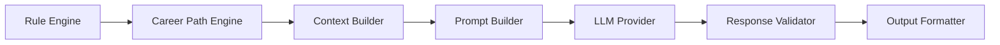

# DevPath AI Architecture

- **Document ID:** DevPath-ARCH-AI-001
- **Version:** 1.0
- **Status:** Draft
- **Related Documents:** `docs/00_Project_Context.md`, `docs/01_SRS.md`, `docs/02_Rule_Engine.md`, `docs/03_Career_Path_Engine.md`
- **Date:** 2026-07-20

## 1. Purpose

The purpose of this document is to define the complete AI Architecture for DevPath. The AI layer transforms structured outputs from the Rule Engine and Career Path Engine into explainable, user-facing responses and generated career artifacts.

The AI Architecture is responsible for prompt construction, context assembly, LLM invocation, response validation, and output formatting. It is not responsible for technical score calculation, career evaluation, recommendation priority calculation, weight calculation, or business rule execution.

The governing principle is:

> Rule Engine calculates. Career Path Engine structures career decisions. AI explains and generates language.

## 2. Scope

### 2.1 In Scope

This document defines:

- AI design principles
- AI service architecture
- AI processing pipeline
- Input and output models
- Context assembly strategy
- Prompt Builder architecture
- Prompt template management
- Supported AI task types
- Response generation and validation
- Hallucination prevention
- Token and context-window management
- Model provider strategy
- AI configuration
- Security and privacy controls
- Prompt versioning
- AI logging, monitoring, and error handling
- AI functional and non-functional requirements
- Future AI expansion strategy

### 2.2 Out of Scope

This document does not define:

- Source code implementation
- API specifications
- Database ERD
- UML diagrams
- Rule Engine formulas
- Career Path Engine readiness logic
- Recommendation priority logic
- Frontend rendering behavior
- Actual prompt text

### 2.3 Assumptions

| ID | Assumption |
|---|---|
| AI-AS-001 | The Rule Engine provides deterministic scores, Skill Matrix entries, evidence references, confidence, and completeness metadata. |
| AI-AS-002 | The Career Path Engine provides structured career readiness, company readiness, skill gaps, learning roadmap, recommendation objects, and Prompt Context facts. |
| AI-AS-003 | The AI layer may use Ollama and optionally OpenAI API as defined by the SRS; additional providers are extension adapters unless formally enabled. |
| AI-AS-004 | AI output may be stored and versioned, but persisted output shall preserve the source context and prompt version used. |

## 3. AI Design Principles

| Principle | Description | Architectural Implication |
|---|---|---|
| No score calculation | AI shall never calculate, infer, adjust, or invent scores. | Prompts and validators block ungrounded score generation. |
| No business rule execution | AI shall never execute rules, weights, readiness logic, or recommendation priority logic. | Business outputs must come from Rule Engine and Career Path Engine. |
| Grounded generation | AI responses shall be grounded in structured context and evidence references. | Context Builder supplies facts; Response Validator checks citations and unsupported claims. |
| Structured-first architecture | AI input and output shall use typed task objects and schemas. | Free-form prompt assembly is prohibited. |
| Provider abstraction | LLM providers shall be accessed through provider adapters. | Model switching does not affect business logic. |
| Prompt versioning | Prompt behavior shall be traceable to versioned prompt templates and variables. | Stored outputs include prompt version and template IDs. |
| Privacy by design | Sensitive data shall be filtered before prompt assembly. | Context Builder applies privacy and secret filtering. |
| Fail-safe output | Invalid or ungrounded AI responses shall not be persisted as successful outputs. | Response Validator can reject, retry, or degrade gracefully. |
| Cost-aware generation | Model selection shall consider task complexity, latency, context size, and cost. | Model Router applies configurable policies. |

## 4. AI Architecture Overview

### 4.1 Architectural Role

The AI layer is a downstream consumer of structured technical and career intelligence. It converts machine-readable evaluation results into human-readable explanations, documents, summaries, and coaching content.

### 4.2 Logical Components

| Component | Responsibility |
|---|---|
| AI Invocation Facade | Receives AI task requests and validates task type, user permission, and source result references. |
| Context Builder | Assembles scoped, grounded, size-bounded context from Rule Engine and Career Path Engine outputs. |
| Evidence Selector | Selects relevant evidence references and snippets for the requested AI task. |
| Privacy Filter | Removes secrets, tokens, private sensitive values, and disallowed content before prompt construction. |
| Context Compressor | Summarizes or ranks structured facts to fit model context limits without changing scores. |
| Prompt Builder | Composes system, task, career, company, repository, and output-format prompt components. |
| Prompt Template Manager | Manages versioned prompt components, variables, priorities, and validation rules. |
| Model Router | Selects an LLM provider and model based on task policy, cost, latency, privacy, and availability. |
| Provider Adapter | Encapsulates provider-specific request and response formats. |
| Response Validator | Validates schema, grounding, forbidden score calculation, citations, and safety constraints. |
| Output Formatter | Converts validated responses into structured AI output objects and display-ready formats. |
| AI Cache | Stores safe reusable responses keyed by task, context hash, prompt version, and model policy. |
| Audit and Metrics Emitter | Emits usage, cost, latency, validation, failure, and safety metrics. |

### 4.3 Pipeline Position

### 4.4 Dependency Boundaries

| Dependency | Direction | AI Layer Usage |
|---|---|---|
| Rule Engine Outputs | Read | Source technical scores, Skill Matrix, evidence, confidence, and completeness. |
| Career Path Engine Outputs | Read | Source career readiness, company readiness, roadmap, gaps, and recommendation objects. |
| Prompt Template Store | Read | Load versioned prompt components and output schemas. |
| AI Output Store | Write | Persist generated outputs with trace metadata. |
| LLM Providers | External/Internal | Generate natural-language responses from prompts. |
| Rule Engine | No write, no execution | AI shall not trigger rule calculation except through normal backend workflows outside AI task execution. |
| Career Path Engine | No write, no execution | AI shall not calculate career readiness or recommendation priority. |

## 5. AI Processing Pipeline

### 5.1 Standard Pipeline

| Step | Stage | Description | Output |
|---:|---|---|---|
| 1 | Task Validation | Validate requested AI task, user authorization, source result IDs, and output schema. | Accepted task request. |
| 2 | Source Loading | Load Rule Engine and Career Path Engine structured outputs. | Source context package. |
| 3 | Context Scoping | Select only facts relevant to the AI task. | Scoped context. |
| 4 | Privacy Filtering | Remove secrets, sensitive values, and disallowed raw data. | Safe context. |
| 5 | Evidence Selection | Attach evidence IDs, repository IDs, and confidence markers. | Grounded context. |
| 6 | Token Budgeting | Estimate context size and apply compression or prioritization. | Model-ready context. |
| 7 | Prompt Composition | Compose versioned prompt components and variables. | Prompt package. |
| 8 | Model Selection | Select provider/model based on task policy and availability. | Model invocation plan. |
| 9 | LLM Invocation | Send prompt package to selected provider. | Raw model response. |
| 10 | Response Validation | Validate schema, grounding, safety, and no-score-calculation policy. | Accepted or rejected response. |
| 11 | Output Formatting | Convert response into structured output object and optional Markdown. | AI output package. |
| 12 | Persistence and Logging | Store output, trace, prompt version, provider metadata, and metrics. | AI output ID. |

### 5.2 Pipeline Guardrails

- AI task execution shall fail if required structured context is missing.
- AI responses shall fail validation if they contain unsupported score calculations.
- AI shall not transform recommendation priority unless priority is already supplied by the Career Path Engine.
- AI shall not claim evidence that is not present in provided context.
- AI shall not expose private raw data unless explicitly allowed by task policy and user permission.

## 6. Input Models

### 6.1 AI Task Request

| Field | Description | Required |
|---|---|---|
| Task ID | Unique request identifier. | Yes |
| User ID | Owner of the AI task. | Yes |
| Task Type | Repository review, skill explanation, resume writing, etc. | Yes |
| Rule Evaluation Result ID | Source technical evaluation reference. | Conditional |
| Career Evaluation Result ID | Source career evaluation reference. | Conditional |
| Repository Scope | One or more repository IDs. | Conditional |
| Output Language | Korean, English, or configured supported language. | Optional |
| Tone Policy | Professional, concise, coaching, or configured style. | Optional |
| Length Policy | Short, standard, detailed, or task-specific. | Optional |
| Model Policy | Preferred provider, cost tier, privacy tier, latency tier. | Optional |

### 6.2 Structured Source Inputs

| Source | Data Used by AI |
|---|---|
| GitHub Analysis | Repository metadata, language/framework/database evidence, README analysis, dependency evidence, activity timeline. |
| Notion Analysis | Documentation evidence, retrospectives, learning notes, project notes. |
| Skill Matrix | Skill scores, levels, confidence, strengths, weaknesses, evidence IDs. |
| Career Readiness | Readiness level, gap categories, required competency status. |
| Company Readiness | Company readiness level, company-specific missing skills, recommended project objects. |
| Learning Roadmap | Milestones, prerequisites, difficulty, estimated duration, completion criteria. |
| Project History | Repository chronology, growth trend, project complexity, activity evidence. |
| Repository Metadata | Name, description, topics, visibility, timestamps, default branch, README state. |

### 6.3 Prohibited Inputs

The AI layer shall not accept:

- Raw OAuth tokens
- Secrets detected in repository content
- Unvalidated user-provided score values
- Unverified external claims
- Prompt text from untrusted users as system instructions
- Business rule definitions for execution by the LLM

## 7. Context Assembly

### 7.1 Context Builder Responsibilities

The Context Builder assembles safe, relevant, grounded context for each AI task. It transforms structured source outputs into a bounded context package without changing scores, priorities, readiness, or rule results.

### 7.2 Context Assembly Layers

| Layer | Description | Priority |
|---|---|---|
| Safety Constraints | Non-negotiable instructions such as no score calculation and evidence-only explanation. | Highest |
| Task Scope | Requested task type, target artifact, output language, tone, and length. | High |
| Career Facts | Career readiness, skill gaps, learning roadmap, recommendation objects. | High |
| Company Facts | Company readiness, company emphasis, missing competencies. | High when company task is requested |
| Skill Facts | Skill Matrix entries, strengths, weaknesses, confidence. | High |
| Repository Facts | Repository metadata, category findings, activity, README, technologies. | Medium to High |
| Evidence References | Evidence IDs and concise evidence descriptions. | Medium |
| Notion Facts | Documentation, retrospectives, learning notes, project notes. | Medium |
| Historical Context | Growth trend and development history. | Medium |
| Optional Detail | Low-priority details used only when token budget allows. | Low |

### 7.3 Context Selection by Task

| Task Type | Required Context | Optional Context |
|---|---|---|
| Repository Review | Repository metadata, Rule Engine category scores, evidence, README findings. | Career target, company target, Notion project notes. |
| Skill Explanation | Skill Matrix entries, evidence, confidence, strengths, weaknesses. | Growth trend, learning roadmap. |
| Career Coaching | Career readiness, skill gaps, roadmap, recommendations. | Company readiness, repository examples. |
| Portfolio Writing | Selected repositories, project evidence, skill strengths, impact facts. | Career target, company target. |
| Resume Writing | Verified profile/project facts, Skill Matrix, career target. | Company target and selected style. |
| README Improvement | README analysis, repository metadata, missing sections, project facts. | Portfolio expectations. |
| Interview Generation | Career readiness, company readiness, gaps, technology priorities. | Repository examples and difficulty policy. |
| Learning Recommendation | Skill gaps, learning roadmap, prerequisites, difficulty. | Notion learning notes. |
| Technology Explanation | Technology priority, evidence, related repositories, skill level. | Career/company relevance. |
| Architecture Review | Architecture score, architecture evidence, directory signals, documentation signals. | Company emphasis. |

### 7.4 Context Budgeting

When context exceeds model limits, the Context Builder shall reduce context in this order:

1. Remove optional low-priority details.
2. Replace long evidence excerpts with evidence summaries and IDs.
3. Limit repository count by requested scope and relevance.
4. Use structured summaries from prior validated outputs.
5. Split task into smaller sub-tasks when allowed.
6. Reject task with token-limit error when required facts cannot fit safely.

## 8. Prompt Builder Architecture

### 8.1 Prompt Builder Role

The Prompt Builder composes versioned prompt components into a provider-neutral prompt package. It does not invent business logic, calculate scores, select recommendation priority, or execute rules.

### 8.2 Prompt Component Types

| Component | Purpose |
|---|---|
| System Prompt | Defines AI boundaries, safety constraints, no-score-calculation policy, output discipline. |
| Career Prompt | Provides selected career facts and allowed explanation boundaries. |
| Company Prompt | Provides company readiness facts and generic competency emphasis. |
| Repository Prompt | Provides repository facts, evidence references, and review task structure. |
| Learning Prompt | Provides roadmap, prerequisites, milestones, and learning recommendation context. |
| Interview Prompt | Provides topic coverage, difficulty, evidence, and company/career context. |
| Portfolio Prompt | Provides project facts, role, stack, evidence, and artifact structure. |
| README Prompt | Provides README analysis facts and desired section structure. |
| Resume Prompt | Provides verified resume facts and target role context. |
| Output Format Prompt | Defines required response schema and formatting constraints. |

### 8.3 Prompt Composition

Prompt composition shall follow this priority order:

1. System safety and role constraints
2. Task definition
3. Output schema
4. Source-of-truth constraints
5. Career and company context
6. Repository and evidence context
7. Style, language, tone, and length policy
8. Validation reminders

### 8.4 Prompt Variables

Prompt variables may include:

- Task type
- Output language
- Tone policy
- Length policy
- Career facts
- Company facts
- Repository facts
- Skill Matrix facts
- Evidence references
- Recommendation objects
- Roadmap milestones
- Safety constraints
- Output schema

Prompt variables shall be typed, validated, and escaped before composition.

### 8.5 Prompt Validation

Prompt validation shall check:

- Required components exist.
- Prompt version is active.
- Required variables are present.
- No untrusted user content is injected into system-level instructions.
- No raw secrets are included.
- No task asks the LLM to calculate scores.
- Output schema is attached.

## 9. Prompt Template Management

### 9.1 Template Catalog

Prompt templates shall be managed as versioned configuration. Templates may be stored in a prompt catalog and selected by task type, career, company, language, and output format.

### 9.2 Template Metadata

| Field | Description |
|---|---|
| Template ID | Stable identifier. |
| Template Type | System, career, company, repository, learning, interview, portfolio, README, resume, output format. |
| Version | Template version. |
| Status | Draft, active, deprecated, archived. |
| Priority | Composition priority. |
| Required Variables | Variables required for prompt assembly. |
| Output Schema ID | Expected response schema. |
| Safety Policy ID | Safety constraints applied. |
| Supported Tasks | Task types that may use the template. |
| Change Reason | Administrative reason for version update. |

### 9.3 Template Lifecycle

| State | Meaning |
|---|---|
| Draft | Editable and not used in production. |
| Active | Available for production task execution. |
| Deprecated | Not used for new tasks but retained for historical output traceability. |
| Archived | Retained for audit only. |

### 9.4 Prompt Priority

Higher-priority prompt components shall not be overridden by lower-priority components. User-provided text shall never override system safety prompts.

## 10. AI Task Types

### 10.1 Supported Task Matrix

| Task Type | Purpose | Required Source | Primary Output |
|---|---|---|---|
| Repository Review | Explain repository quality, strengths, weaknesses, and improvement areas. | Rule Engine repository/category outputs. | Repository Review object. |
| Skill Explanation | Explain Skill Matrix results and evidence. | Rule Engine Skill Matrix. | Skill Explanation object. |
| Career Coaching | Explain career readiness and next steps. | Career Path Engine outputs. | Career Advice object. |
| Portfolio Writing | Generate portfolio-ready project descriptions. | Career outputs and repository evidence. | Portfolio Draft object. |
| Resume Writing | Generate resume-ready content from verified facts. | Skill Matrix and selected project facts. | Resume Draft object. |
| README Improvement | Generate improved README draft or section suggestions. | README analysis and repository facts. | README Draft object. |
| Project Description | Explain project purpose, stack, architecture, and impact. | Repository metadata and evidence. | Project Description object. |
| Interview Question Generation | Generate interview questions from gaps and target context. | Career/company readiness and technology priorities. | Interview Question Set. |
| Learning Recommendation | Explain roadmap and learning priorities. | Learning roadmap and recommendation objects. | Learning Recommendation object. |
| Technology Recommendation | Explain why specific technologies matter. | Career technology priorities. | Technology Explanation object. |
| Architecture Review | Explain architecture signals and improvement direction. | Architecture category output and evidence. | Architecture Review object. |

### 10.2 Task Constraints

Every AI task shall:

- Reference source context IDs.
- Use a registered output schema.
- Preserve score provenance.
- Avoid unsupported claims.
- Declare when context is insufficient.

## 11. Response Generation

### 11.1 Generation Strategy

Response generation converts prompt packages into model outputs through provider adapters. The AI layer shall request structured responses where supported by the selected provider and validate all responses after generation.

### 11.2 Response Lifecycle

| Stage | Description |
|---|---|
| Raw Response | Provider-native response payload. |
| Parsed Response | Extracted model text or structured response. |
| Schema Validation | Check required fields, types, and allowed enumerations. |
| Grounding Validation | Check that claims reference provided evidence or structured context. |
| Policy Validation | Check no score calculation, no business rule execution, no disallowed content. |
| Formatting | Convert validated output to Markdown, JSON-like structured object, or UI-ready sections. |
| Persistence | Store final output with trace metadata. |

### 11.3 Retry Rules

Retries may occur for:

- Provider timeout
- Transient provider failure
- Invalid schema response
- Minor formatting failure

Retries shall not occur indefinitely and shall not change business facts. Retry prompts may clarify output schema but shall not add unsupported context.

## 12. Output Models

### 12.1 Common AI Output Envelope

| Field | Description |
|---|---|
| AI Output ID | Stable output identifier. |
| Task Type | AI task executed. |
| User ID | Owner. |
| Source Rule Result ID | Rule Engine source reference when used. |
| Source Career Result ID | Career Path Engine source reference when used. |
| Prompt Version | Prompt template versions used. |
| Model Provider | Selected provider. |
| Model Name | Selected model. |
| Context Hash | Hash of sanitized context. |
| Validation Status | Passed, failed, partial, or rejected. |
| Output Payload | Structured task-specific output. |
| Evidence References | Evidence IDs used. |
| Safety Flags | Unsupported, low-confidence, redacted, or truncated flags. |
| Created Timestamp | Generation timestamp. |

### 12.2 Repository Summary

| Field | Description |
|---|---|
| Repository ID | Source repository. |
| Summary | Generated summary grounded in repository evidence. |
| Strengths | Evidence-backed strengths. |
| Improvement Areas | Evidence-backed improvement areas. |
| Technologies | Technologies from Rule Engine output. |
| Evidence References | Supporting IDs. |

### 12.3 Portfolio Draft

| Field | Description |
|---|---|
| Project Title | Verified or repository-derived title. |
| Role | User role if verified or inferred only from structured project facts. |
| Problem | Project problem statement based on context. |
| Solution | Technical solution explanation. |
| Stack | Technologies from Rule Engine evidence. |
| Impact | Evidence-backed impact or marked unavailable. |
| Highlights | Portfolio bullets grounded in facts. |

### 12.4 Resume Draft

| Field | Description |
|---|---|
| Target Role | Selected career or user-provided role. |
| Summary Section | Generated professional summary using verified facts. |
| Skills Section | Skills from Skill Matrix. |
| Project Bullets | Evidence-backed project bullets. |
| Missing Fact Warnings | Required resume facts not available. |

### 12.5 Interview Question Set

| Field | Description |
|---|---|
| Target Career | Selected career. |
| Target Company | Selected company when applicable. |
| Difficulty | Requested or configured difficulty. |
| Questions | Generated questions. |
| Topic Tags | Technology, architecture, testing, DevOps, or career tags. |
| Expected Signal | Competency the question evaluates. |
| Source Rationale | Gap or evidence reference. |

### 12.6 Learning Recommendation

| Field | Description |
|---|---|
| Roadmap Reference | Source roadmap ID. |
| Recommendation Summary | Explanation of learning order. |
| Milestones | Human-readable milestone explanation. |
| Practice Tasks | Evidence-producing tasks derived from Career Path Engine objects. |
| Completion Criteria | Measurable criteria from roadmap context. |

### 12.7 Career Advice

| Field | Description |
|---|---|
| Readiness Summary | Explanation of career readiness level. |
| Strength Explanation | Evidence-backed strengths. |
| Gap Explanation | Evidence-backed gaps. |
| Next Steps | Generated explanation of structured recommendations. |
| Confidence Notice | Notes about low confidence or missing data. |

### 12.8 README Draft

| Field | Description |
|---|---|
| Repository ID | Source repository. |
| Proposed Sections | Generated README sections. |
| Setup Instructions | Generated only if context supports setup facts. |
| Architecture Section | Grounded in architecture evidence. |
| Missing Information | Facts needed from user or repository. |

### 12.9 Technology Explanation

| Field | Description |
|---|---|
| Technology ID | Source technology. |
| Explanation | Career-relevant explanation. |
| Current Evidence | Existing evidence summary. |
| Why It Matters | Explanation based on career/company profile. |
| Practice Direction | Based on structured recommendation objects. |

## 13. Hallucination Prevention

### 13.1 Prevention Mechanisms

| Mechanism | Description |
|---|---|
| Grounded Context | Prompts include only validated structured source data. |
| Evidence References | Outputs shall reference evidence IDs when making project or skill claims. |
| Confidence Scores | AI must communicate low confidence or missing evidence when context indicates it. |
| Response Validation | Validator rejects unsupported claims, schema violations, and invented score values. |
| Unsupported Question Detection | AI task layer rejects requests requiring unavailable or out-of-scope data. |
| Context Verification | Context Builder verifies source IDs and profile versions before prompt assembly. |
| Score Guardrail | Prompts and validators prohibit score calculation or score modification. |
| Claim Classification | Claims are classified as supported, unsupported, missing-context, or prohibited. |

### 13.2 Unsupported Claim Handling

If the user asks for something not supported by context:

- The AI output shall state that available context is insufficient.
- The output may ask for missing facts if task policy allows.
- The output shall not invent project history, scores, company process, or experience.
- The output shall preserve any known structured facts.

### 13.3 Score Safety

AI may repeat scores supplied by the Rule Engine or readiness values supplied by the Career Path Engine. AI shall not create new numeric scores, adjust existing scores, average scores, rank users by invented metrics, or convert qualitative statements into scores.

## 14. Token Optimization

### 14.1 Optimization Goals

Token optimization ensures cost, latency, and context-window safety without losing critical evidence.

### 14.2 Techniques

| Technique | Usage |
|---|---|
| Context Scoping | Include only task-relevant repositories, skills, and evidence. |
| Evidence Summarization | Replace long raw text with evidence summaries and IDs. |
| Priority Ranking | Preserve high-priority gaps and required competencies first. |
| Deduplication | Remove repeated technologies, repositories, and evidence statements. |
| Structured Compression | Use compact tables or key-value facts instead of long prose. |
| Chunked Generation | Split large tasks such as portfolio generation by repository. |
| Cache Reuse | Reuse validated summaries when source context hash matches. |

### 14.3 Token Budget Policy

Token budget shall reserve capacity for:

- System safety constraints
- Output schema
- Required source facts
- Evidence references
- User task instruction
- Model response

## 15. Context Window Strategy

### 15.1 Context Window Tiers

| Tier | Usage |
|---|---|
| Small Context | Single repository explanation, short skill explanation, brief README section. |
| Medium Context | Career coaching, learning roadmap explanation, multi-skill summary. |
| Large Context | Portfolio generation, resume generation, multi-repository review. |

### 15.2 Context Splitting

Large context tasks may be split by:

- Repository
- Skill category
- Roadmap milestone
- Artifact section
- Time window

The final output may merge validated sub-results only if the merge does not create new scores or unsupported conclusions.

### 15.3 Context Freshness

AI output shall indicate if source context is stale when freshness metadata is available. Stale context shall reduce confidence language but shall not cause AI to invent updated facts.

## 16. Model Selection Strategy

### 16.1 Provider Support Model

| Provider | Status | Use Case |
|---|---|---|
| Ollama | Active SRS-supported local option. | Local/private generation and development. |
| OpenAI | Optional SRS-supported hosted option. | Higher-quality hosted generation when configured. |
| Anthropic | Extension provider adapter. | Future hosted model option after configuration approval. |
| Google Gemini | Extension provider adapter. | Future hosted model option after configuration approval. |
| Qwen | Extension local/open model option. | Future local or hosted model option. |
| Llama | Extension local/open model option. | Future local model option through Ollama or adapter. |
| Mistral | Extension local/hosted model option. | Future local or hosted model option. |

### 16.2 Model Selection Criteria

| Criterion | Description |
|---|---|
| Task Type | Resume and portfolio may require stronger writing models than short explanations. |
| Privacy Tier | Sensitive context may require local model execution. |
| Context Size | Large tasks require models with adequate context windows. |
| Cost Tier | Low-value or repeated tasks may prefer cheaper models. |
| Latency Target | Interactive UI tasks may prefer faster models. |
| Availability | Router may fallback when preferred provider is unavailable. |
| Output Schema Support | Structured-output tasks prefer models/providers with reliable schema adherence. |

### 16.3 Fallback Strategy

Fallback shall occur only when:

- The original provider is unavailable.
- Rate limits are reached.
- Timeout occurs.
- Policy allows fallback.
- Privacy constraints remain satisfied.

Fallback shall preserve the same source context, prompt version, task type, and output schema.

### 16.4 Cost and Latency Optimization

| Strategy | Description |
|---|---|
| Task-based routing | Use smaller models for simple summaries and larger models for complex artifacts. |
| Context caching | Reuse previously validated context packages. |
| Output caching | Reuse AI outputs when context hash, prompt version, and model policy match. |
| Batch processing | Generate non-interactive artifacts asynchronously. |
| Streaming | Use streaming for user-facing long outputs when supported. |

## 17. AI Configuration

### 17.1 Configuration Areas

| Configuration | Description |
|---|---|
| Provider Configuration | Provider endpoint, model list, timeout, retry, rate limit, privacy tier. |
| Model Policy | Task-to-model routing, fallback rules, cost tier, context window. |
| Prompt Policy | Active prompt templates, output schemas, safety policies. |
| Context Policy | Token budget, evidence limits, repository limits, compression policy. |
| Validation Policy | Schema validation, grounding thresholds, unsupported-claim handling. |
| Cache Policy | Cache keys, TTL, invalidation rules. |
| Logging Policy | Redaction, event fields, retention. |

### 17.2 Configuration Governance

AI configuration shall be versioned, auditable, and environment-specific. Production changes shall preserve output traceability by recording configuration versions.

## 18. Security

### 18.1 Security Controls

| Control | Description |
|---|---|
| Access Control | User can only generate AI outputs from authorized source data. |
| Provider Credential Protection | API keys and provider credentials are stored securely and never included in prompts. |
| Prompt Injection Defense | Untrusted repository or Notion content is treated as data, not instructions. |
| Output Validation | Responses are checked for unsafe or unsupported content. |
| Audit Logging | AI task execution is logged with actor, source IDs, provider, and status. |
| Network Policy | External provider calls follow approved network and environment policies. |

### 18.2 Prompt Injection Handling

Repository README, Notion notes, commit messages, and user-provided text may contain malicious instructions. The AI layer shall:

- Treat external content as quoted evidence or data.
- Prevent external content from overriding system prompts.
- Delimit untrusted content.
- Remove or flag suspicious prompt-injection patterns.
- Validate outputs against source facts.

## 19. Privacy

### 19.1 Privacy Principles

| Principle | Description |
|---|---|
| Data minimization | Include only context required for the task. |
| Redaction | Remove secrets, tokens, credentials, private keys, and sensitive values. |
| Provider-aware routing | Sensitive tasks may require local model execution. |
| User ownership | AI outputs are scoped to the authenticated user. |
| Traceability | Stored outputs reference sanitized context hash and source IDs. |

### 19.2 Sensitive Data Handling

The Privacy Filter shall block:

- OAuth tokens
- API keys
- Passwords
- Private keys
- Secret environment variables
- Personal data not required for the task
- Raw private content beyond configured policy limits

## 20. Prompt Versioning

### 20.1 Versioned Prompt Artifacts

| Artifact | Versioned When |
|---|---|
| System Prompt | Safety or role constraints change. |
| Career Prompt | Career context presentation changes. |
| Company Prompt | Company context presentation changes. |
| Repository Prompt | Repository review structure changes. |
| Learning Prompt | Roadmap explanation structure changes. |
| Interview Prompt | Question generation structure changes. |
| Portfolio Prompt | Portfolio artifact structure changes. |
| README Prompt | README section strategy changes. |
| Resume Prompt | Resume format or wording strategy changes. |
| Output Format Prompt | Response schema changes. |

### 20.2 Version Traceability

Every AI output shall store:

- Prompt template IDs
- Prompt template versions
- Output schema version
- Safety policy version
- Context policy version
- Model policy version

## 21. AI Logging

### 21.1 Log Categories

| Category | Logged Fields |
|---|---|
| Task Lifecycle | Requested, started, completed, failed, cancelled. |
| Context Assembly | Source IDs, context size, token estimate, redaction count. |
| Prompt Composition | Template IDs, versions, schema ID, safety policy ID. |
| Model Invocation | Provider, model, latency, token usage, retry count. |
| Validation | Schema status, grounding status, safety status, rejection reason. |
| Output Persistence | Output ID, context hash, validation status. |
| Error Handling | Error code, severity, fallback status, recoverability. |

### 21.2 Logging Constraints

- Logs shall not contain provider API keys.
- Logs shall not contain raw secrets.
- Logs shall not store full prompts unless explicitly permitted by secure audit policy.
- Logs shall prefer hashes, IDs, counts, and summaries.

## 22. Monitoring

### 22.1 Metrics

| Metric | Purpose |
|---|---|
| AI task count | Track usage by task type. |
| Provider latency | Monitor model/provider performance. |
| Token usage | Monitor cost and context efficiency. |
| Validation failure rate | Detect prompt or model quality issues. |
| Hallucination rejection rate | Detect grounding failures. |
| Fallback rate | Detect provider reliability issues. |
| Rate-limit rate | Detect capacity constraints. |
| Cache hit rate | Monitor optimization effectiveness. |
| Redaction count | Monitor sensitive data filtering. |
| Output generation failure rate | Track reliability. |

### 22.2 Alerts

Alerts should be configured for:

- Provider outage
- Latency SLA breach
- Token usage spike
- Validation failure spike
- Prompt injection detection spike
- Rate-limit spike
- Privacy redaction anomaly
- Cache malfunction

## 23. Error Handling

### 23.1 Error Scenarios

| Scenario | Handling |
|---|---|
| LLM timeout | Retry within policy, fallback if allowed, otherwise return retryable error. |
| LLM unavailable | Route to fallback provider if policy allows; otherwise fail gracefully. |
| Token limit exceeded | Compress context, reduce optional facts, split task, or reject if required facts cannot fit. |
| Missing context | Reject task or produce insufficient-context output when allowed by task policy. |
| Prompt generation failure | Stop before provider call, log prompt validation error. |
| Model switching | Preserve same prompt version, context hash, and output schema. |
| Rate limits | Apply backoff, queue asynchronous task, or fallback if policy allows. |
| Invalid responses | Retry with schema correction instruction, then reject if still invalid. |
| Ungrounded claims | Reject response and mark hallucination validation failure. |
| Privacy filter failure | Stop task and produce fatal privacy error. |

### 23.2 Severity Model

| Severity | Meaning | Behavior |
|---|---|---|
| Info | Non-blocking condition. | Continue and log. |
| Warning | Output can be produced with caveat. | Continue with safety flag. |
| Recoverable Error | Retry or fallback may succeed. | Retry/fallback within policy. |
| Fatal Error | Output cannot be trusted or privacy is at risk. | Stop and persist failure state. |

## 24. Functional Requirements

### AI-001 — Prompt Builder

| Field | Specification |
|---|---|
| Description | The AI layer shall compose prompts from versioned prompt components and validated variables. |
| Inputs | AI task request, prompt templates, structured context, output schema. |
| Outputs | Prompt package. |
| Business Rules | Prompt Builder shall not ask the LLM to calculate scores or execute business rules. |
| Validation Rules | Required templates, variables, schema, and safety policy shall be present. |
| Acceptance Criteria | Given valid task context, Prompt Builder produces a prompt package with template IDs and versions. |
| Dependencies | Prompt Template Store, Context Builder. |

### AI-002 — Repository Summary

| Field | Specification |
|---|---|
| Description | The AI layer shall generate repository summaries using repository metadata, Rule Engine outputs, and evidence references. |
| Inputs | Repository facts, category scores from Rule Engine, README analysis, evidence IDs. |
| Outputs | Repository Summary object. |
| Business Rules | AI may repeat Rule Engine scores but shall not create new repository scores. |
| Validation Rules | Claims about technology, quality, or activity shall reference provided context. |
| Acceptance Criteria | A generated summary includes technologies and evidence-backed strengths without unsupported claims. |
| Dependencies | Rule Engine output, Context Builder, Response Validator. |

### AI-003 — Skill Analysis Explanation

| Field | Specification |
|---|---|
| Description | The AI layer shall explain Skill Matrix entries, confidence, strengths, and weaknesses. |
| Inputs | Skill Matrix, evidence references, confidence, career context. |
| Outputs | Skill Explanation object. |
| Business Rules | Skill scores shall be sourced only from Rule Engine outputs. |
| Validation Rules | Every explained skill with a score shall reference source Skill Matrix data. |
| Acceptance Criteria | The explanation describes why a skill is strong or weak using supplied evidence. |
| Dependencies | Rule Engine Skill Matrix, Career Path Engine context. |

### AI-004 — Repository Review

| Field | Specification |
|---|---|
| Description | The AI layer shall generate repository review content based on measurable findings. |
| Inputs | Repository metadata, architecture, testing, DevOps, documentation, collaboration outputs. |
| Outputs | Repository Review object. |
| Business Rules | AI shall not execute review rules or recalculate repository quality. |
| Validation Rules | Review sections shall map to provided category findings. |
| Acceptance Criteria | Review includes evidence-backed observations and does not invent missing features. |
| Dependencies | Rule Engine repository/category outputs. |

### AI-005 — Portfolio Generation

| Field | Specification |
|---|---|
| Description | The AI layer shall generate portfolio draft content from verified repository and career facts. |
| Inputs | Selected repositories, project evidence, Skill Matrix strengths, career target. |
| Outputs | Portfolio Draft object. |
| Business Rules | Portfolio claims shall be grounded in evidence or marked as unavailable. |
| Validation Rules | Stack, role, and impact fields shall not include unsupported claims. |
| Acceptance Criteria | Portfolio draft references actual repositories and verified technology evidence. |
| Dependencies | Rule Engine output, Career Path Engine output. |

### AI-006 — Resume Generation

| Field | Specification |
|---|---|
| Description | The AI layer shall generate resume-ready sections from verified profile, skill, and project facts. |
| Inputs | Skill Matrix, selected repositories, career target, verified user profile facts. |
| Outputs | Resume Draft object. |
| Business Rules | AI shall not invent work experience, education, scores, or company outcomes. |
| Validation Rules | Missing resume facts shall be flagged rather than invented. |
| Acceptance Criteria | Resume draft includes only supported skills and project bullets. |
| Dependencies | User Profile Store, Rule Engine output, Career Path Engine output. |

### AI-007 — Interview Generation

| Field | Specification |
|---|---|
| Description | The AI layer shall generate interview question sets from career gaps, company context, and technology priorities. |
| Inputs | Career readiness, company readiness, gaps, recommendation objects, difficulty policy. |
| Outputs | Interview Question Set. |
| Business Rules | AI shall not claim company confidential hiring practices. |
| Validation Rules | Each question shall include topic, difficulty, expected signal, and source rationale. |
| Acceptance Criteria | Generated questions align with supplied career/company competencies and gaps. |
| Dependencies | Career Path Engine output, Prompt Builder. |

### AI-008 — Learning Planner

| Field | Specification |
|---|---|
| Description | The AI layer shall explain structured learning roadmap milestones in user-facing language. |
| Inputs | Learning roadmap, skill gaps, prerequisites, estimated durations, recommendation objects. |
| Outputs | Learning Recommendation object. |
| Business Rules | AI shall not reorder roadmap priority unless order is already supplied by Career Path Engine. |
| Validation Rules | Milestone explanations shall preserve supplied prerequisites and completion criteria. |
| Acceptance Criteria | Output explains learning order without changing roadmap sequence or priority. |
| Dependencies | Career Path Engine roadmap output. |

### AI-009 — README Improvement

| Field | Specification |
|---|---|
| Description | The AI layer shall generate README improvement suggestions or drafts from README analysis and repository facts. |
| Inputs | Existing README findings, repository metadata, architecture/documentation evidence. |
| Outputs | README Draft object. |
| Business Rules | AI shall not invent setup commands, deployment links, or architecture claims not present in context. |
| Validation Rules | Missing facts shall be explicitly marked. |
| Acceptance Criteria | README draft improves structure while preserving verified project facts. |
| Dependencies | Rule Engine documentation outputs. |

### AI-010 — Career Coaching

| Field | Specification |
|---|---|
| Description | The AI layer shall explain Career Path Engine outputs as coaching content. |
| Inputs | Career readiness, skill gaps, learning roadmap, recommendations. |
| Outputs | Career Advice object. |
| Business Rules | Coaching shall explain structured recommendations and shall not create new priority decisions. |
| Validation Rules | Advice shall reference career output IDs and avoid unsupported claims. |
| Acceptance Criteria | Coaching output explains strengths, gaps, and next steps from structured context. |
| Dependencies | Career Path Engine output. |

### AI-011 — Technology Explanation

| Field | Specification |
|---|---|
| Description | The AI layer shall explain technology relevance using career and company context. |
| Inputs | Technology priority object, Skill Matrix evidence, career/company facts. |
| Outputs | Technology Explanation object. |
| Business Rules | AI shall explain relevance but shall not change technology priority. |
| Validation Rules | Technology name shall exist in supplied context or taxonomy-derived facts. |
| Acceptance Criteria | Explanation states why a technology matters for the target career using provided facts. |
| Dependencies | Career Path Engine technology priorities. |

### AI-012 — Context Assembly

| Field | Specification |
|---|---|
| Description | The AI layer shall assemble task-specific context from structured source outputs within token limits. |
| Inputs | Rule Engine output, Career Path Engine output, task request, context policy. |
| Outputs | Safe Context Package. |
| Business Rules | Context Builder shall not modify scores, priorities, readiness, or rule results. |
| Validation Rules | Required context facts shall be present or task shall fail safely. |
| Acceptance Criteria | Context package contains relevant facts, evidence IDs, safety constraints, and token estimate. |
| Dependencies | Rule Engine output, Career Path Engine output. |

### AI-013 — Response Validation

| Field | Specification |
|---|---|
| Description | The AI layer shall validate generated responses for schema compliance, grounding, safety, and score policy. |
| Inputs | Raw LLM response, output schema, source context, safety policy. |
| Outputs | Validated response or rejection. |
| Business Rules | Responses containing invented scores or unsupported business decisions shall be rejected. |
| Validation Rules | Required fields, evidence references, and allowed enumerations shall be checked. |
| Acceptance Criteria | Invalid responses are not persisted as successful outputs. |
| Dependencies | Response Validator, output schemas. |

### AI-014 — Model Routing

| Field | Specification |
|---|---|
| Description | The AI layer shall select LLM provider and model according to task, privacy, cost, latency, and availability policies. |
| Inputs | Task request, model policy, provider health, context size. |
| Outputs | Model invocation plan. |
| Business Rules | Model routing shall not alter business facts or source context. |
| Validation Rules | Selected provider shall satisfy privacy and context-window constraints. |
| Acceptance Criteria | Sensitive tasks route to allowed providers only. |
| Dependencies | Model Router, Provider Adapters. |

### AI-015 — AI Output Persistence

| Field | Specification |
|---|---|
| Description | The AI layer shall persist validated outputs with source, prompt, model, and validation metadata. |
| Inputs | Validated AI response, prompt metadata, context hash, provider metadata. |
| Outputs | AI Output ID. |
| Business Rules | Failed or rejected responses shall not be stored as successful outputs. |
| Validation Rules | Required trace metadata shall be present. |
| Acceptance Criteria | Persisted output can be traced to source results, prompt versions, model provider, and validation status. |
| Dependencies | AI Output Store, Audit Logger. |

## 25. Non-functional Requirements

| ID | Category | Requirement | Measurement |
|---|---|---|---|
| AI-NFR-001 | Performance | Interactive AI tasks shall respond within configured latency targets by task type. | 95th percentile latency is tracked per task and provider. |
| AI-NFR-002 | Scalability | Long-running generation tasks shall support asynchronous execution. | Portfolio/resume generation can be queued. |
| AI-NFR-003 | Availability | AI layer shall support fallback providers when configured and policy-compliant. | Fallback success rate is monitored. |
| AI-NFR-004 | Reliability | Invalid model responses shall be detected and handled safely. | Validation failure rate and rejection handling are measured. |
| AI-NFR-005 | Security | Provider credentials and source secrets shall never appear in prompts or logs. | Secret scanning verifies redaction controls. |
| AI-NFR-006 | Privacy | Context shall be minimized and provider routing shall respect privacy tier. | Context package includes privacy policy metadata. |
| AI-NFR-007 | Maintainability | Prompt templates and model policies shall be versioned configuration. | Prompt changes do not require service code changes unless schema capabilities change. |
| AI-NFR-008 | Observability | AI tasks shall emit metrics for latency, tokens, cost, validation, and failures. | Metrics are queryable by task, provider, and model. |
| AI-NFR-009 | Logging | AI lifecycle events shall be logged with redaction. | Logs include task ID, source IDs, prompt version, model, status. |
| AI-NFR-010 | Monitoring | Alerts shall detect provider failures, validation spikes, rate limits, and privacy anomalies. | Alert rules are configured for production. |

## 26. Future AI Expansion

Future AI expansion may include:

- Dedicated RAG index over user-approved Notion and repository documentation.
- Embedding-based retrieval for long-term learning notes and project history.
- Multi-provider evaluation harness for model quality comparison.
- Automated prompt regression testing.
- User feedback loops for AI output usefulness.
- Artifact-specific editors for resume, portfolio, and README drafts.
- Multilingual output quality profiles.
- Local-only privacy mode for sensitive users.
- AI-generated comparison explanations between career paths using Career Path Engine outputs.
- Advanced citation rendering with evidence previews.

Any future expansion shall preserve the core constraints: AI shall never calculate scores, never execute business rules, never replace the Rule Engine or Career Path Engine, and shall only generate explainable responses from structured source outputs.
