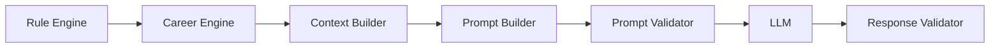

# DevPath Prompt Engineering Architecture

- **Document ID:** DevPath-ARCH-PE-001
- **Version:** 1.0
- **Status:** Draft
- **Related Documents:** `docs/00_Project_Context.md`, `docs/01_SRS.md`, `docs/02_Rule_Engine.md`, `docs/03_Career_Path_Engine.md`, `docs/04_AI_Architecture.md`
- **Date:** 2026-07-20

## 1. Purpose

The purpose of this document is to define the official Prompt Engineering Architecture for DevPath. The Prompt Engineering layer transforms structured outputs from the Rule Engine, Career Path Engine, and Context Builder into validated, versioned, provider-ready prompt packages for LLM execution.

This document does not define actual prompt text. It defines how prompts are designed, composed, versioned, validated, optimized, secured, logged, and monitored.

The Prompt Builder has one responsibility:

> Assemble prompts from structured context and versioned templates.

It shall not calculate scores, execute business rules, evaluate careers, determine recommendation priority, or invent project functionality.

## 2. Scope

### 2.1 In Scope

This document defines:

- Prompt engineering principles
- Prompt architecture
- Prompt composition pipeline
- Context assembly strategy for prompts
- Prompt template structure
- Prompt variable injection
- Prompt metadata
- Prompt versioning
- Prompt categories
- Prompt validation
- Prompt optimization
- Token budget strategy
- Context prioritization
- Prompt security
- Prompt logging and monitoring
- Prompt error handling
- Prompt functional and non-functional requirements
- Future extension strategy

### 2.2 Out of Scope

This document does not define:

- Actual prompt text
- Source code implementation
- API specifications
- Database ERD
- UML diagrams
- Rule Engine scoring logic
- Career Path Engine readiness logic
- LLM provider implementation details
- Response content generation logic beyond validation contracts

### 2.3 Assumptions

| ID | Assumption |
|---|---|
| PE-AS-001 | Rule Engine outputs provide the authoritative technical scores, Skill Matrix, evidence references, and confidence data. |
| PE-AS-002 | Career Path Engine outputs provide structured career readiness, company readiness, gaps, roadmap, and recommendation objects. |
| PE-AS-003 | Context Builder provides safe, scoped, token-budgeted context packages for Prompt Builder consumption. |
| PE-AS-004 | Response Validator validates LLM outputs after generation according to output schemas and grounding rules. |

## 3. Prompt Engineering Principles

| Principle | Description | Design Implication |
|---|---|---|
| Assembly only | Prompt Builder assembles prompts from validated templates and context. | No business logic or scoring logic in prompt composition. |
| Structured inputs | Prompts are built from typed variables and structured context packages. | Free-form context concatenation is prohibited. |
| Versioned templates | Prompt templates are versioned, traceable, and lifecycle-managed. | AI outputs store prompt template versions. |
| Provider neutrality | Prompt packages should be adaptable across supported LLM providers. | Provider adapters handle provider-specific formatting. |
| Grounded generation | Prompts must include evidence constraints and source references where required. | Output claims must be checkable by Response Validator. |
| Safety hierarchy | System and safety prompts outrank task, context, and user-supplied data. | Untrusted content cannot override system constraints. |
| Token discipline | Prompt composition must fit model context windows. | Token estimation and context prioritization are mandatory. |
| Reusable templates | Templates are modular and reusable across task types. | Shared components reduce drift and maintenance cost. |
| Validation before execution | Prompt packages must be validated before LLM invocation. | Invalid prompts fail before provider call. |

## 4. Prompt Architecture

### 4.1 Architectural Role

Prompt Engineering is a sub-layer of the AI Architecture. It receives safe context from Context Builder and produces prompt packages for LLM providers.

### 4.2 Logical Components

| Component | Responsibility |
|---|---|
| Prompt Request Resolver | Resolves task type, output schema, language, tone, length, and provider policy. |
| Template Selector | Selects active prompt templates by task, category, career, company, language, and output schema. |
| Variable Binder | Injects validated variables into templates. |
| Prompt Composer | Orders prompt components by priority and assembles the prompt package. |
| Prompt Validator | Validates completeness, safety, variable coverage, token budget, and template compatibility. |
| Token Estimator | Estimates token usage before model invocation. |
| Prompt Metadata Builder | Attaches template IDs, versions, context hash, schema ID, and safety policy metadata. |
| Prompt Audit Logger | Records prompt assembly lifecycle without leaking secrets. |

### 4.3 Prompt Package

| Field | Description |
|---|---|
| Prompt Package ID | Unique identifier for the assembled prompt package. |
| Task Type | AI task that will use the prompt. |
| Template Versions | Template IDs and versions included in composition. |
| Context Package ID | Source context package reference. |
| Output Schema ID | Expected response schema. |
| Safety Policy ID | Safety constraints applied. |
| Provider Policy | Model/provider compatibility metadata. |
| Prompt Sections | Ordered prompt components. |
| Token Estimate | Estimated input and expected output tokens. |
| Validation Status | Passed, failed, or warning state. |

## 5. Prompt Composition Pipeline

### 5.1 Pipeline

### 5.2 Pipeline Stages

| Step | Stage | Description | Output |
|---:|---|---|---|
| 1 | Task Resolution | Identify AI task, output type, language, tone, length, and provider policy. | Prompt request profile. |
| 2 | Context Intake | Receive safe Context Builder package. | Context package reference. |
| 3 | Template Selection | Select active templates required by the task. | Template set. |
| 4 | Variable Binding | Bind validated structured variables to template slots. | Bound template components. |
| 5 | Prompt Composition | Assemble components according to priority and hierarchy. | Draft prompt package. |
| 6 | Token Estimation | Estimate prompt and response token budget. | Token budget report. |
| 7 | Prompt Validation | Validate completeness, safety, compatibility, and token limits. | Validated prompt package. |
| 8 | LLM Dispatch | Forward package to Model Router and Provider Adapter. | Provider-ready request. |
| 9 | Response Validation | Validate LLM response against schema, grounding, and safety rules. | Validated response or rejection. |

### 5.3 Pipeline Constraints

- Prompt Builder shall not request the LLM to calculate scores.
- Prompt Builder shall not request the LLM to execute rules.
- Prompt Builder shall not request the LLM to decide career readiness.
- Prompt Builder shall preserve all structured score and readiness provenance.
- Prompt Builder shall fail safely when required context is missing.

## 6. Context Assembly Strategy

### 6.1 Context Sources

| Source | Usage in Prompt Engineering |
|---|---|
| GitHub | Repository facts, metadata, activity, README, dependencies, directory evidence. |
| Notion | Documentation, retrospectives, learning notes, project notes. |
| Skill Matrix | Skill levels, scores, confidence, evidence, strengths, weaknesses. |
| Career Readiness | Readiness level and gap facts from Career Path Engine. |
| Company Readiness | Company-specific missing competencies and readiness facts. |
| Learning Roadmap | Milestones, prerequisites, difficulty, duration, completion criteria. |
| Repository Metadata | Name, description, topics, visibility, timestamps. |
| Project History | Project chronology, growth trend, activity evidence. |
| Technology Stack | Technologies from Rule Engine taxonomy and evidence. |
| Evaluation Results | Rule Engine and Career Path Engine output references. |

### 6.2 Context Selection Rules

Context shall be selected according to:

1. Task type relevance
2. Required output schema fields
3. Source-of-truth priority
4. Evidence strength
5. Confidence level
6. User-selected repository scope
7. Career and company target
8. Token budget
9. Privacy constraints

### 6.3 Context Exclusion Rules

Prompt Builder shall exclude:

- Raw secrets
- OAuth tokens
- Provider credentials
- Untrusted instructions from README, Notion, commits, or user text
- Irrelevant repository details
- Unsupported technologies not needed for the task
- Historical data outside task scope unless required

### 6.4 Context Transformation

Context may be transformed for prompt efficiency by:

- Selecting evidence summaries instead of raw content
- Converting repeated facts into compact lists
- Grouping skills by category
- Replacing long histories with validated trend summaries
- Preserving evidence IDs even when raw evidence text is compressed

The transformation shall not change scores, readiness values, priority values, or business decisions.

## 7. Prompt Templates

### 7.1 Template Structure

| Template Section | Purpose |
|---|---|
| Template Header | Template ID, version, category, supported task, schema reference. |
| Instruction Block | Task-level instruction structure without business calculation logic. |
| Constraint Block | No-score-calculation, no-business-rule, no-invention, and evidence-only constraints. |
| Context Block | Slots for structured context variables. |
| Evidence Block | Evidence IDs and citation requirements. |
| Output Format Block | Required response shape and formatting rules. |
| Safety Block | Privacy, unsupported claim, and prompt injection handling rules. |
| Compatibility Block | Provider, model, language, and task compatibility metadata. |

### 7.2 Template Component Types

| Component | Purpose |
|---|---|
| System Prompt | Defines non-negotiable AI boundaries and hierarchy. |
| Task Prompt | Defines requested AI task and task-specific behavior. |
| Role Prompt | Defines generation persona or style boundary when required. |
| Constraint Prompt | Defines prohibited behavior and source-of-truth restrictions. |
| Output Format Prompt | Defines response schema and expected sections. |
| Evidence Prompt | Defines evidence usage and citation behavior. |
| Safety Prompt | Defines privacy, injection, and unsupported-claim handling. |
| Few-shot Prompt | Optional pattern examples for output shape only, never business logic. |

### 7.3 Template Governance

Templates shall:

- Be reusable across compatible tasks.
- Be versioned and auditable.
- Declare required variables.
- Declare output schema compatibility.
- Declare provider compatibility.
- Be validated before activation.
- Avoid embedding business logic.

## 8. Prompt Variables

### 8.1 Variable Injection

Prompt variables are typed values injected into template slots. They are produced from structured context and validated before composition.

### 8.2 Variable Types

| Variable | Description | Source |
|---|---|---|
| Career | Selected career and readiness facts. | Career Path Engine. |
| Company | Selected company and company readiness facts. | Career Path Engine. |
| Repository | Repository metadata and selected scope. | Rule Engine / GitHub normalized data. |
| Technologies | Technology stack and evidence references. | Rule Engine Skill Matrix. |
| Weak Skills | Weakness facts and gaps. | Rule Engine / Career Path Engine. |
| Strong Skills | Strength facts and evidence. | Rule Engine Skill Matrix. |
| Learning Goals | Roadmap milestones and target competencies. | Career Path Engine. |
| Target Output | Requested artifact type and output schema. | AI task request. |
| Evidence References | Evidence IDs and descriptions. | Rule Engine / Career Path Engine. |
| Output Language | Requested language. | AI task request. |
| Tone Policy | Allowed style constraints. | AI task request / configuration. |
| Length Policy | Output length bounds. | AI task request / configuration. |

### 8.3 Variable Validation

Variables shall be validated for:

- Required presence
- Correct data type
- Allowed enumeration values
- Source provenance
- Sanitized content
- Token estimate
- Compatibility with selected template
- No unsafe instruction injection

## 9. Prompt Metadata

### 9.1 Metadata Fields

| Field | Description |
|---|---|
| Prompt Package ID | Unique prompt assembly identifier. |
| Task Type | AI task category. |
| Template IDs | Templates included in the package. |
| Template Versions | Exact template versions used. |
| Context Package ID | Source context reference. |
| Context Hash | Hash of sanitized context. |
| Output Schema ID | Expected response schema. |
| Safety Policy ID | Safety policy applied. |
| Token Estimate | Estimated prompt and response tokens. |
| Provider Compatibility | Supported provider/model constraints. |
| Created Timestamp | Prompt assembly time. |
| Validation Result | Prompt validation status. |

### 9.2 Metadata Uses

Prompt metadata supports:

- Auditability
- Debugging
- Prompt regression testing
- Output traceability
- Rollback analysis
- Cost attribution
- Provider compatibility checks

## 10. Prompt Versioning

### 10.1 Versioned Artifacts

| Artifact | Versioned When |
|---|---|
| Template | Instruction, variable, constraint, or output format changes. |
| Variable Schema | Required fields, types, or compatibility rules change. |
| Output Schema | Response structure changes. |
| Safety Policy | Prompt safety constraints change. |
| Composition Policy | Prompt component ordering or priority changes. |
| Token Policy | Budgeting, compression, or truncation rules change. |

### 10.2 Compatibility

Template compatibility shall declare:

- Supported task types
- Supported output schemas
- Required context package version
- Supported languages
- Supported provider capabilities
- Deprecated variable names
- Migration requirements

### 10.3 Deprecation

Deprecated templates shall not be used for new prompts but shall remain available for historical traceability.

### 10.4 Rollback

Rollback shall restore a previously active template version and record:

- Rollback reason
- Previous active version
- Restored version
- Affected task types
- Validation status

### 10.5 Migration

Template migration shall define how existing variables or schemas map to new versions. Migration shall not rewrite historical AI outputs.

## 11. Prompt Categories

### 11.1 Category Matrix

| Prompt Category | Purpose | Required Context | Output Schema |
|---|---|---|---|
| Repository Review | Explain repository quality and improvement areas. | Repository facts, category outputs, evidence. | Repository Review. |
| Skill Analysis | Explain Skill Matrix results. | Skill entries, evidence, confidence. | Skill Explanation. |
| Career Coaching | Explain career readiness and next steps. | Career readiness, gaps, roadmap. | Career Advice. |
| Portfolio Generation | Generate portfolio draft sections. | Selected projects, stack, evidence, strengths. | Portfolio Draft. |
| Resume Generation | Generate resume-ready sections. | Verified profile facts, skills, projects. | Resume Draft. |
| README Generation | Generate README draft or improvements. | README analysis, repository facts. | README Draft. |
| Interview Question Generation | Generate grounded interview questions. | Career/company gaps, technology priorities. | Interview Question Set. |
| Learning Recommendation | Explain roadmap and learning plan. | Learning roadmap, gaps, milestones. | Learning Recommendation. |
| Technology Recommendation | Explain technology relevance. | Technology priorities, skill evidence. | Technology Explanation. |
| Architecture Review | Explain architecture findings. | Architecture category output and evidence. | Architecture Review. |
| Project Explanation | Explain project purpose, stack, and impact. | Repository metadata, project history, evidence. | Project Description. |

### 11.2 Category Constraints

Each prompt category shall:

- Use only task-relevant context.
- Use an approved output schema.
- Include no-score-calculation constraints.
- Include evidence requirements when claims are made.
- Preserve source IDs for response validation.

## 12. Prompt Validation

### 12.1 Validation Rules

| Validation Area | Rule |
|---|---|
| Prompt completeness | Required template components must be present. |
| Missing variables | Required variables must be bound before composition. |
| Unsupported context | Context source versions must be compatible with templates. |
| Token overflow | Prompt package must fit selected model context window. |
| Invalid template | Template must be active and schema-valid. |
| Unsafe instructions | Prompt must not contain instructions to calculate scores or execute business rules. |
| Injection risk | Untrusted content must be delimited and treated as data. |
| Output schema | Prompt must reference a valid output schema. |

### 12.2 Validation Outcomes

| Outcome | Meaning | Behavior |
|---|---|---|
| Passed | Prompt is safe and complete. | Send to Model Router. |
| Warning | Prompt is valid but has non-blocking caveats. | Send with warning metadata. |
| Failed | Prompt is incomplete or invalid. | Stop before LLM call. |
| Fatal | Prompt risks privacy, security, or business-rule violation. | Stop and record fatal error. |

## 13. Prompt Optimization

### 13.1 Optimization Goals

Prompt optimization improves quality, reliability, latency, and cost without changing business facts.

### 13.2 Optimization Techniques

| Technique | Description |
|---|---|
| Template modularity | Reuse high-quality components across tasks. |
| Variable compaction | Convert verbose facts into compact structured variables. |
| Evidence selection | Include strongest and most relevant evidence first. |
| Schema-first prompting | Make output expectations explicit through output schemas. |
| Task-specific constraints | Avoid unnecessary instructions unrelated to the task. |
| Provider-aware formatting | Adjust packaging for model capabilities without changing meaning. |
| Prompt regression testing | Compare outputs across template versions and fixtures. |

## 14. Token Budget Strategy

### 14.1 Token Budget Components

| Component | Budget Priority |
|---|---|
| System and safety constraints | Mandatory |
| Output schema | Mandatory |
| Task instruction | Mandatory |
| Required structured context | Mandatory |
| Evidence references | High |
| Optional context details | Medium |
| Few-shot examples | Low and optional |
| Response reserve | Mandatory |

### 14.2 Maximum Context Size

Maximum context size shall be determined by:

- Selected model context window
- Required response size
- Task type
- Output schema complexity
- Provider-specific overhead
- Safety margin

### 14.3 Compression Strategy

Compression may use:

- Evidence summaries
- Ranked skill lists
- Repository-level summaries
- Deduplicated technology lists
- Compact milestone tables
- Source IDs instead of long excerpts

Compression shall preserve score values, readiness labels, priorities, and evidence IDs exactly.

### 14.4 Summarization Strategy

Summarization may use previously validated summaries or deterministic structured summaries. If an LLM-generated summary is reused as context, it shall be linked to the original source context and validation metadata.

### 14.5 Chunking Strategy

Chunking may split large prompt tasks by:

- Repository
- Skill category
- Roadmap milestone
- Output artifact section
- Time window

Merged outputs shall not introduce new conclusions beyond validated sub-results.

### 14.6 Context Truncation

Truncation is permitted only for optional low-priority context. Required safety constraints, output schema, score provenance, and evidence IDs shall not be truncated.

## 15. Context Prioritization

### 15.1 Priority Tiers

| Priority | Context Type |
|---|---|
| P0 Mandatory | Safety constraints, task type, output schema, source IDs. |
| P1 Critical | Career/company facts required by task, Skill Matrix facts, gaps, recommendations. |
| P2 Important | Repository evidence, technology stack, roadmap milestones, confidence. |
| P3 Useful | Notion notes, project history, growth context, optional examples. |
| P4 Optional | Low-relevance details, long raw excerpts, repeated metadata. |

### 15.2 Selection Rules

The Context Builder and Prompt Builder shall:

- Include P0 context for every prompt.
- Include P1 context when required by task type.
- Include P2 context when evidence-backed claims are expected.
- Include P3 context when token budget allows.
- Exclude P4 context when token budget is constrained.

## 16. Prompt Security

### 16.1 Security Threats

| Threat | Mitigation |
|---|---|
| Prompt injection | Treat repository, Notion, and user content as data, not instructions. |
| Secret leakage | Redact secrets before prompt assembly. |
| System prompt override | Enforce prompt hierarchy and component priority. |
| Business logic injection | Reject prompts asking LLM to calculate scores or execute rules. |
| Data overexposure | Apply data minimization and provider privacy policy. |
| Unsafe template activation | Require validation before template activation. |

### 16.2 Prompt Hierarchy

Prompt priority shall be:

1. System and safety constraints
2. Output schema constraints
3. Task constraints
4. Source-of-truth constraints
5. Structured context
6. User style preferences
7. Untrusted raw content as delimited data

Lower-priority content shall never override higher-priority content.

## 17. Prompt Logging

### 17.1 Logged Events

| Event | Logged Data |
|---|---|
| Prompt requested | Task ID, user ID, task type, source IDs. |
| Template selected | Template IDs, versions, compatibility status. |
| Variables bound | Variable names, source IDs, redaction count, not raw secrets. |
| Token estimated | Prompt tokens, response reserve, overflow status. |
| Prompt validated | Validation result, warnings, failure reasons. |
| Prompt dispatched | Provider policy, model route ID, prompt package ID. |

### 17.2 Logging Constraints

- Logs shall not contain secrets.
- Logs shall not contain provider credentials.
- Logs shall avoid full prompt text unless a secure audit policy explicitly allows it.
- Logs shall include enough metadata for debugging and traceability.

## 18. Monitoring

### 18.1 Metrics

| Metric | Purpose |
|---|---|
| Prompt build count | Track usage by task and template. |
| Prompt validation failure rate | Detect template or context issues. |
| Missing variable rate | Identify broken context/template contracts. |
| Token overflow rate | Tune context and model policies. |
| Template usage distribution | Track active template adoption. |
| Prompt generation latency | Monitor Prompt Builder performance. |
| Prompt rejection by LLM provider | Detect provider compatibility issues. |
| Response validation failure rate | Detect prompt quality issues. |

### 18.2 Alerts

Alerts should be configured for:

- Sudden prompt validation failure spike
- Token overflow spike
- Missing variable spike
- Unsafe instruction detection spike
- LLM prompt rejection spike
- Deprecated template usage in production

## 19. Error Handling

### 19.1 Error Scenarios

| Scenario | Handling |
|---|---|
| Missing context | Fail prompt generation if required context is missing; optionally request source recalculation. |
| Prompt generation failure | Stop before LLM call and record prompt build failure. |
| Missing variables | Reject prompt package and report missing variable names. |
| Unsupported template | Reject template selection and use fallback only if compatible active template exists. |
| Context overflow | Compress, chunk, remove optional context, or fail if required context still exceeds limit. |
| Token overflow | Select larger compatible model or fail according to model policy. |
| LLM prompt rejection | Log provider rejection and retry with compatible formatting if policy allows. |
| Invalid template version | Stop and require template catalog correction. |
| Unsafe instructions | Reject prompt package with fatal validation status. |

### 19.2 Severity Model

| Severity | Meaning | Behavior |
|---|---|---|
| Info | Non-blocking event. | Continue and log. |
| Warning | Prompt is usable with caveat. | Continue with warning metadata. |
| Recoverable Error | Retry, fallback, compression, or template substitution may fix issue. | Apply configured recovery. |
| Fatal Error | Privacy, safety, or business-boundary violation. | Stop and persist failure state. |

## 20. Functional Requirements

### PR-001 — System Prompt Management

| Field | Specification |
|---|---|
| Description | The Prompt Engineering layer shall manage versioned system prompt templates that enforce DevPath AI boundaries. |
| Inputs | System prompt template metadata, safety policy, task type. |
| Outputs | Selected system prompt component reference. |
| Business Rules | System prompt templates shall prohibit score calculation and business rule execution. |
| Validation Rules | Active system prompt template shall include required safety policy reference. |
| Acceptance Criteria | A prompt package cannot be validated without an active system prompt component. |
| Dependencies | Prompt Template Store, Safety Policy Catalog. |

### PR-002 — Career Prompt Management

| Field | Specification |
|---|---|
| Description | The layer shall select career prompt components using structured career facts from the Career Path Engine. |
| Inputs | Career context, career profile version, task type. |
| Outputs | Career prompt component reference and bound variables. |
| Business Rules | Career prompt components shall not evaluate careers or modify readiness. |
| Validation Rules | Career variables shall reference Career Path Engine output IDs. |
| Acceptance Criteria | Career Coaching prompts include career readiness facts without recalculating readiness. |
| Dependencies | Career Path Engine output, Prompt Template Store. |

### PR-003 — Company Prompt Management

| Field | Specification |
|---|---|
| Description | The layer shall select company prompt components using structured company readiness facts. |
| Inputs | Company context, company profile version, task type. |
| Outputs | Company prompt component reference and bound variables. |
| Business Rules | Company prompt components shall use generic competency facts and shall not claim confidential hiring practices. |
| Validation Rules | Company variables shall reference active or explicitly supported company context. |
| Acceptance Criteria | Interview prompts include company emphasis facts without inventing company hiring rules. |
| Dependencies | Career Path Engine company readiness output. |

### PR-004 — Rule Output Prompt Context

| Field | Specification |
|---|---|
| Description | The layer shall include Rule Engine outputs as immutable source facts for prompt composition. |
| Inputs | Rule Engine result ID, Skill Matrix, evidence references, confidence data. |
| Outputs | Bound rule-output variables. |
| Business Rules | Prompt Builder shall not change Rule Engine scores or formulas. |
| Validation Rules | Score variables shall include source result ID and rule version. |
| Acceptance Criteria | Skill Analysis prompt variables preserve original scores and evidence IDs. |
| Dependencies | Rule Engine output, Context Builder. |

### PR-005 — Output Format Prompt Management

| Field | Specification |
|---|---|
| Description | The layer shall attach output format prompt components and schema references for each task. |
| Inputs | Task type, output schema ID, template catalog. |
| Outputs | Output format component and schema metadata. |
| Business Rules | Output format prompts shall constrain structure but shall not define business decisions. |
| Validation Rules | Every prompt package shall include a valid output schema reference. |
| Acceptance Criteria | Repository Review prompt package includes the Repository Review schema ID. |
| Dependencies | Output Schema Catalog, Prompt Template Store. |

### PR-006 — Prompt Composition

| Field | Specification |
|---|---|
| Description | The layer shall assemble prompt components according to configured hierarchy and priority. |
| Inputs | Selected templates, bound variables, composition policy. |
| Outputs | Draft prompt package. |
| Business Rules | Lower-priority content shall not override system or safety constraints. |
| Validation Rules | Composition order shall match active composition policy. |
| Acceptance Criteria | System and safety components appear before task and context components. |
| Dependencies | Composition Policy, Template Selector. |

### PR-007 — Prompt Variable Binding

| Field | Specification |
|---|---|
| Description | The layer shall bind typed variables into template slots after validation and sanitization. |
| Inputs | Context package, variable schema, templates. |
| Outputs | Bound prompt components. |
| Business Rules | Untrusted content shall be escaped or delimited as data. |
| Validation Rules | Required variables shall be present, typed, and compatible. |
| Acceptance Criteria | Missing required repository variable fails Repository Review prompt generation. |
| Dependencies | Context Builder, Variable Schema Catalog. |

### PR-008 — Prompt Validation

| Field | Specification |
|---|---|
| Description | The layer shall validate prompt completeness, variables, safety, compatibility, and token limits before LLM invocation. |
| Inputs | Draft prompt package, validation policy, model policy. |
| Outputs | Validated prompt package or validation failure. |
| Business Rules | Invalid prompts shall not be sent to LLM providers. |
| Validation Rules | Validation shall check missing variables, unsafe instructions, invalid templates, and token overflow. |
| Acceptance Criteria | A prompt asking the LLM to calculate scores is rejected before provider dispatch. |
| Dependencies | Prompt Validator, Safety Policy Catalog. |

### PR-009 — Prompt Versioning

| Field | Specification |
|---|---|
| Description | The layer shall version templates, variable schemas, output schemas, safety policies, and composition policies. |
| Inputs | Template metadata, schema metadata, policy metadata. |
| Outputs | Versioned prompt artifact records. |
| Business Rules | Historical AI outputs shall remain traceable to prompt versions. |
| Validation Rules | Active templates shall pass compatibility validation. |
| Acceptance Criteria | AI output metadata can identify every prompt template version used. |
| Dependencies | Prompt Template Store, AI Output Store. |

### PR-010 — Token Budget Validation

| Field | Specification |
|---|---|
| Description | The layer shall estimate token usage and enforce model context limits before dispatch. |
| Inputs | Prompt package, model policy, token budget policy. |
| Outputs | Token budget report. |
| Business Rules | Required safety, schema, and source provenance content shall not be removed to fit budget. |
| Validation Rules | Prompt plus response reserve shall fit selected model context window. |
| Acceptance Criteria | Oversized prompt either compresses optional context or fails safely. |
| Dependencies | Token Estimator, Model Policy. |

### PR-011 — Prompt Security Enforcement

| Field | Specification |
|---|---|
| Description | The layer shall enforce prompt injection defenses, data redaction, and prompt hierarchy rules. |
| Inputs | Context package, safety policy, prompt templates. |
| Outputs | Secure prompt package or fatal validation failure. |
| Business Rules | User, GitHub, and Notion content shall never override system constraints. |
| Validation Rules | Prompt package shall be scanned for unsafe instructions and unredacted secrets. |
| Acceptance Criteria | Prompt-injection text from README is treated as data and cannot change system instructions. |
| Dependencies | Privacy Filter, Safety Policy Catalog. |

### PR-012 — Prompt Logging

| Field | Specification |
|---|---|
| Description | The layer shall log prompt lifecycle events with redacted metadata. |
| Inputs | Prompt request, selected templates, validation results, token estimates. |
| Outputs | Prompt audit events. |
| Business Rules | Logs shall not contain secrets or provider credentials. |
| Validation Rules | Required audit fields shall include task ID, template versions, validation status, and source IDs. |
| Acceptance Criteria | Prompt generation failure is traceable without exposing sensitive prompt content. |
| Dependencies | Audit Logger, Monitoring System. |

### PR-013 — Template Lifecycle Management

| Field | Specification |
|---|---|
| Description | The layer shall support draft, active, deprecated, and archived template lifecycle states. |
| Inputs | Template metadata and administrator publication action. |
| Outputs | Template lifecycle state. |
| Business Rules | Deprecated templates shall not be used for new prompt packages. |
| Validation Rules | Active templates shall pass schema, variable, safety, and compatibility checks. |
| Acceptance Criteria | Publishing an invalid template is blocked. |
| Dependencies | Prompt Template Store, Admin Configuration Workflow. |

### PR-014 — Prompt Optimization

| Field | Specification |
|---|---|
| Description | The layer shall optimize prompts using approved compaction, prioritization, and chunking strategies. |
| Inputs | Context package, token policy, task type. |
| Outputs | Optimized prompt package. |
| Business Rules | Optimization shall not change scores, priorities, readiness, or source facts. |
| Validation Rules | Optimized prompt shall preserve required context and evidence references. |
| Acceptance Criteria | Large portfolio prompt is chunked by repository while preserving source IDs. |
| Dependencies | Context Builder, Token Policy. |

### PR-015 — Provider Compatibility

| Field | Specification |
|---|---|
| Description | The layer shall produce prompt packages compatible with multiple LLM providers through provider-neutral metadata and adapter requirements. |
| Inputs | Model policy, provider capabilities, prompt package. |
| Outputs | Provider-compatible prompt package metadata. |
| Business Rules | Provider formatting shall not alter business facts or safety constraints. |
| Validation Rules | Selected provider shall support required context size and output format mode. |
| Acceptance Criteria | The same task can be routed to an approved alternate provider when policy allows. |
| Dependencies | Model Router, Provider Adapter Layer. |

## 21. Non-functional Requirements

| ID | Category | Requirement | Measurement |
|---|---|---|---|
| PE-NFR-001 | Performance | Prompt assembly shall complete within configured latency targets for interactive tasks. | 95th percentile prompt build latency is monitored. |
| PE-NFR-002 | Scalability | Prompt Builder shall handle concurrent AI task requests through stateless composition where possible. | Throughput is measured by prompt packages per minute. |
| PE-NFR-003 | Maintainability | Templates, schemas, and policies shall be externalized and versioned. | Template changes do not require code changes unless new component types are introduced. |
| PE-NFR-004 | Extensibility | New prompt categories shall be added through template and schema catalogs. | Existing categories remain compatible after extension. |
| PE-NFR-005 | Observability | Prompt lifecycle metrics shall be emitted for build, validation, token, and failure events. | Metrics are queryable by task and template version. |
| PE-NFR-006 | Logging | Prompt logging shall use redacted metadata and preserve traceability. | Logs include task ID, source IDs, template versions, and validation result. |
| PE-NFR-007 | Monitoring | Monitoring shall detect validation failures, token overflow, unsafe instructions, and provider rejection. | Alert thresholds are configured. |
| PE-NFR-008 | Reliability | Invalid prompts shall fail before LLM invocation. | Provider calls with invalid prompts are zero in validation tests. |
| PE-NFR-009 | Security | Prompt Builder shall prevent prompt injection and secret leakage. | Security tests verify redaction and hierarchy enforcement. |
| PE-NFR-010 | Provider Support | Prompt packages shall support multiple provider adapters. | Provider compatibility validation exists per model policy. |

## 22. Future Extension

Future Prompt Engineering extensions may include:

- Prompt regression test suites with fixture-based output comparison.
- Template quality scoring performed by offline evaluation tools, not runtime LLM scoring.
- RAG-specific retrieval prompt components.
- Multilingual template variants.
- Task-specific few-shot example catalogs.
- Prompt simulation tools for administrators.
- Automated diff review for prompt template changes.
- Provider-specific prompt packaging profiles.
- User feedback signals for prompt improvement analysis.
- Advanced prompt injection classifiers.

All future extensions shall preserve the core constraints: Prompt Builder shall only assemble prompts, shall never calculate scores, shall never execute business logic, shall never evaluate careers, and shall always use versioned reusable templates.
