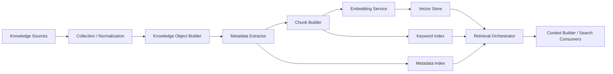

# DevPath Knowledge Architecture

- **Document ID:** DevPath-ARCH-KA-001
- **Version:** 1.0
- **Status:** Draft
- **Related Documents:** `docs/00_Project_Context.md`, `docs/01_SRS.md`, `docs/02_Rule_Engine.md`, `docs/03_Career_Path_Engine.md`, `docs/04_AI_Architecture.md`, `docs/05_Prompt_Engineering.md`
- **Date:** 2026-07-20

## 1. Purpose

The purpose of this document is to define the complete Knowledge Architecture for DevPath. The Knowledge Architecture governs how developer knowledge is collected, normalized, stored, indexed, retrieved, secured, monitored, and supplied to AI and search workflows.

The Knowledge System is the long-term memory layer for DevPath. The LLM must never memorize user history. Long-term user knowledge shall be stored in controlled knowledge stores and retrieved only when authorized, relevant, and necessary.

The Knowledge System shall never generate user-facing responses, calculate scores, execute business rules, evaluate careers, or determine recommendation priorities. It only retrieves knowledge and supplies evidence-backed context to downstream components.

## 2. Scope

### 2.1 In Scope

This document defines:

- Knowledge architecture principles
- Overall knowledge architecture
- Supported and future data sources
- Knowledge collection pipelines
- Data normalization
- Metadata extraction
- Chunking strategy
- Embedding strategy
- Vector storage
- Index strategy
- Retrieval strategy
- Context assembly for retrieval results
- Knowledge freshness and synchronization
- Versioning
- Security and privacy
- Logging and monitoring
- Knowledge functional and non-functional requirements
- Future extension strategy

### 2.2 Out of Scope

This document does not define:

- Source code implementation
- API specifications
- Database ERD
- UML diagrams
- LLM prompt text
- Rule Engine scoring formulas
- Career Path Engine readiness logic
- AI response generation
- Dashboard UI rendering

### 2.3 Design Constraints

| Constraint | Requirement |
|---|---|
| No response generation | Knowledge System shall retrieve and supply knowledge only. |
| No score calculation | Scores are calculated only by the Rule Engine. |
| No business logic execution | Business rules belong to Rule Engine and Career Path Engine. |
| No LLM memory dependency | LLMs shall not be treated as persistent memory. |
| Multi-provider embeddings | Embedding generation shall support multiple providers through adapters. |
| Future source readiness | Knowledge ingestion shall support future connectors without changing retrieval contracts. |

## 3. Knowledge Architecture Principles

| Principle | Description | Implication |
|---|---|---|
| Knowledge is persisted, not memorized | Long-term information is stored in managed knowledge repositories. | LLM context is temporary and reconstructed by retrieval. |
| Retrieval is evidence-based | Retrieved content must reference source objects and metadata. | AI outputs can cite or trace retrieved evidence. |
| User isolation | User knowledge shall be isolated by owner and permissions. | Cross-user retrieval is prohibited unless explicitly authorized by future enterprise policy. |
| Source traceability | Every knowledge object and chunk shall reference original source, source ID, and ingestion version. | Deletion, refresh, and audit are possible. |
| Freshness-aware retrieval | Retrieval ranking shall consider recency and sync state where applicable. | Stale content can be deprioritized or flagged. |
| Hybrid retrieval readiness | Semantic, keyword, metadata, time-aware, career-aware, and company-aware retrieval shall coexist. | Retrieval can serve search, RAG, and context assembly. |
| No business evaluation | Knowledge retrieval shall not calculate readiness, scores, or recommendation priority. | Retrieved data is input, not decision output. |
| Privacy by design | Sensitive and private data shall be protected before indexing and retrieval. | Private repositories and Notion content require strict access control. |

## 4. Overall Architecture

### 4.1 Architectural Role

The Knowledge Architecture supports search, RAG, AI context assembly, evidence retrieval, and long-term developer memory. It consumes normalized data and generated artifacts, transforms them into knowledge objects and chunks, indexes them, and retrieves relevant knowledge for authorized tasks.

### 4.2 Logical Components

| Component | Responsibility |
|---|---|
| Knowledge Source Adapter | Receives normalized records or generated artifacts from supported sources. |
| Ingestion Orchestrator | Coordinates collection, normalization handoff, chunking, embedding, indexing, and versioning. |
| Knowledge Object Builder | Converts source data into canonical knowledge objects. |
| Metadata Extractor | Extracts repository, technology, career, company, evidence, timestamps, tags, and confidence metadata. |
| Chunk Builder | Splits knowledge content into retrievable chunks with overlap and source links. |
| Embedding Service | Generates vector embeddings through provider adapters. |
| Vector Store | Stores embeddings, vector metadata, and retrieval payload references. |
| Keyword Index | Supports exact, lexical, and filtered search. |
| Metadata Index | Supports filtering by user, source, repository, technology, career, company, date, and category. |
| Retrieval Orchestrator | Executes semantic, keyword, hybrid, and filtered retrieval strategies. |
| Ranking Service | Ranks retrieved chunks by relevance, freshness, confidence, permission, and task fit. |
| Context Result Assembler | Produces retrieval result packages for Context Builder and Search. |
| Freshness Manager | Tracks source sync state, stale objects, deletes, and incremental updates. |
| Security Gate | Enforces authorization, repository permissions, and privacy constraints. |
| Observability Emitter | Emits logs, metrics, traces, and indexing health events. |

### 4.3 High-level Flow

### 4.4 Consumer Systems

| Consumer | Knowledge Usage |
|---|---|
| Search Service | Global, repository, skill, technology, document, portfolio, and resume search. |
| Context Builder | Retrieves relevant context for AI tasks. |
| Prompt Builder | Receives context through Context Builder, not directly from raw knowledge stores. |
| AI Engine | Consumes retrieved context through prompt packages and never treats LLM memory as persistent. |
| Dashboard | May display evidence references, search results, and freshness indicators. |

## 5. Data Sources

### 5.1 Active Source Categories

| Source Category | Source Items | Purpose |
|---|---|---|
| GitHub | Repositories, commits, branches, issues, pull requests, releases, README, source code metadata, directory structure, dependencies. | Developer activity, project history, technical evidence, collaboration evidence. |
| Notion | Learning notes, retrospectives, project documents, architecture documents. | Learning history, documentation maturity, project reasoning, reflective growth. |
| Generated Artifacts | Portfolio, resume, generated reports, README drafts, interview question sets. | User-facing artifacts and AI output search. |
| Rule Engine Outputs | Skill Matrix, evidence references, category scores, confidence metadata. | Searchable structured evaluation results. |
| Career Path Engine Outputs | Career goals, company targets, learning progress, recommendations, roadmap. | Searchable career intelligence outputs. |

### 5.2 Future Integration Sources

| Source | Status | Potential Knowledge |
|---|---|---|
| Jira | Future extension | Issues, epics, delivery history, collaboration evidence. |
| Slack | Future extension | Team collaboration context subject to privacy controls. |
| Figma | Future extension | Design assets and UI/UX project evidence. |
| Blog | Future extension | Technical writing, learning records, portfolio evidence. |

Future integrations require explicit product and security approval before activation.

## 6. Knowledge Collection

### 6.1 Collection Pipeline

| Step | Stage | Description |
|---:|---|---|
| 1 | Source Event Detection | Detect new sync, updated source object, deletion, or generated artifact. |
| 2 | Permission Check | Verify user authorization and source access. |
| 3 | Normalized Record Intake | Receive normalized records from collectors or output producers. |
| 4 | Knowledge Object Mapping | Map records to canonical knowledge object types. |
| 5 | Metadata Extraction | Extract source, evidence, category, technology, career, company, and timestamps. |
| 6 | Chunking | Split content into retrieval-friendly chunks. |
| 7 | Embedding | Generate embeddings for eligible chunks. |
| 8 | Indexing | Update vector, keyword, and metadata indexes. |
| 9 | Freshness Update | Mark source version and sync state. |
| 10 | Audit and Metrics | Emit ingestion logs and monitoring metrics. |

### 6.2 Knowledge Objects

| Knowledge Object | Description | Primary Sources |
|---|---|---|
| Repository | Repository-level project knowledge. | GitHub repository metadata, README, directory structure. |
| Technology | Technology usage and evidence. | Rule Engine, dependencies, source metadata. |
| Project | Project identity, purpose, stack, history, documentation, and outputs. | GitHub, Notion, generated artifacts. |
| Skill | Skill evidence, level, confidence, and related projects. | Skill Matrix. |
| Architecture | Architecture decisions, structure, and documentation. | Rule Engine, README, Notion docs. |
| Learning Note | Learning records and topic progression. | Notion learning notes. |
| Interview Experience | Interview prep outputs and question sets. | Generated interview artifacts. |
| Portfolio | Portfolio drafts and selected project content. | AI generated artifacts and project evidence. |
| Company Target | Selected company and company readiness facts. | Career Path Engine outputs. |
| Career Goal | Selected career, readiness, gaps, and roadmap. | Career Path Engine outputs. |
| Learning Progress | Roadmap milestones, completion evidence, and learning history. | Career Path Engine, Notion. |
| Project History | Time-series project activity and growth context. | GitHub commits, PRs, issues, releases. |

### 6.3 Collection Eligibility

Content shall be collected only when:

- The user has authorized the source.
- The source object is within configured retention policy.
- The object type is supported or safely stored as unsupported metadata.
- Privacy and security filters allow indexing.
- The source has a stable identifier.

## 7. Data Normalization

### 7.1 Normalization Goals

Normalization ensures that source-specific data can be searched and retrieved consistently. The Knowledge System consumes normalized records where possible and shall not duplicate Rule Engine normalization responsibilities.

### 7.2 Normalization Rules

| Area | Rule |
|---|---|
| IDs | Preserve source ID, normalized object ID, user ID, and tenant boundary when applicable. |
| Timestamps | Normalize created, updated, synced, indexed, and deleted timestamps. |
| Text | Normalize Markdown, plain text, headings, code blocks, links, and tables into retrievable text representations. |
| Source Paths | Normalize repository-relative paths and Notion page paths. |
| Technology Names | Use controlled technology taxonomy from Rule Engine context where available. |
| Categories | Map knowledge to controlled categories such as repository, skill, architecture, learning, portfolio, resume. |
| Empty Content | Represent missing, empty, inaccessible, unsupported, and deleted states distinctly. |
| Duplicates | Deduplicate by source ID, content hash, source version, and normalized object type. |

### 7.3 Unsupported Data

Unsupported documents shall be stored as metadata-only records when safe. They shall not be embedded until a parser and privacy policy exist.

## 8. Metadata Extraction

### 8.1 Metadata Fields

| Metadata | Description |
|---|---|
| Knowledge Object ID | Canonical object identifier. |
| Chunk ID | Chunk-level identifier. |
| User ID | Owner of the knowledge. |
| Source | GitHub, Notion, Rule Engine, Career Path Engine, Generated Artifact, or future source. |
| Source Object ID | Provider or system source identifier. |
| Repository ID | Related repository when applicable. |
| Technology | Related technology taxonomy entry. |
| Created Date | Source creation date. |
| Updated Date | Source update date. |
| Synced Date | Collection sync timestamp. |
| Indexed Date | Index update timestamp. |
| Confidence | Source or extraction confidence. |
| Evidence | Evidence ID or evidence reference. |
| Tags | Topic, technology, project, or user-defined tags. |
| Category | Knowledge category. |
| Career | Related selected career when applicable. |
| Company | Related target company when applicable. |
| Visibility | Public, private, internal, inaccessible, deleted. |
| Version | Knowledge object, chunk, embedding, and source version metadata. |

### 8.2 Metadata Extraction Rules

- Metadata extraction shall not calculate scores.
- Metadata extraction shall not infer unsupported career readiness.
- Metadata confidence shall describe extraction reliability, not technical skill strength.
- Metadata shall preserve enough source linkage for deletion and reindexing.
- Sensitive metadata shall be redacted or excluded from indexes.

## 9. Chunking Strategy

### 9.1 Chunking Objectives

Chunking splits source content into retrieval units that preserve semantic coherence, source traceability, and token efficiency.

### 9.2 Chunk Types

| Chunk Type | Source | Strategy |
|---|---|---|
| Repository Chunk | Repository metadata and overview. | One compact repository summary chunk plus linked evidence chunks. |
| README Chunk | README sections. | Split by heading and section boundaries. |
| Commit Chunk | Commit groups. | Aggregate by time window, repository, and topic rather than one chunk per trivial commit. |
| Pull Request Chunk | PR title, description, review, and status. | One chunk per meaningful PR or grouped small PRs. |
| Issue Chunk | Issue title, body, labels, comments summary. | One chunk per issue or grouped topic. |
| Documentation Chunk | Notion/project docs. | Split by page heading hierarchy. |
| Learning Note Chunk | Notion learning notes. | Split by note topic, date, and heading. |
| Architecture Chunk | Architecture docs and directory findings. | Split by component, decision, or architecture topic. |
| Generated Report Chunk | AI outputs and reports. | Split by artifact section and output type. |

### 9.3 Chunk Size and Overlap

| Content Type | Target Size | Overlap | Notes |
|---|---:|---:|---|
| README sections | 300–800 tokens | 50–100 tokens | Preserve heading context. |
| Notion documentation | 400–1,000 tokens | 75–150 tokens | Preserve page hierarchy. |
| Learning notes | 250–700 tokens | 50–100 tokens | Preserve topic and date. |
| Architecture docs | 400–1,000 tokens | 100–150 tokens | Preserve decision context. |
| Commit groups | 200–600 tokens | 0–50 tokens | Prefer aggregation by time/topic. |
| Generated artifacts | 300–900 tokens | 50–100 tokens | Preserve artifact section boundaries. |

### 9.4 Chunking Rules

- Chunks shall include source object ID and chunk position.
- Chunks shall preserve parent-child relationships.
- Chunks shall include metadata sufficient for filtering.
- Chunks shall avoid mixing unrelated repositories.
- Chunks shall not include secrets or unsupported private content.

## 10. Embedding Strategy

### 10.1 Embedding Goals

Embeddings support semantic retrieval over user-authorized knowledge. Embeddings shall not be treated as a replacement for metadata filters, permissions, or source-of-truth records.

### 10.2 Embedding Provider Model

| Provider Type | Usage |
|---|---|
| Local Embedding Provider | Privacy-sensitive indexing and offline development. |
| Hosted Embedding Provider | Optional high-quality embeddings when policy allows. |
| Future Provider Adapter | Supports additional embedding models through configuration. |

### 10.3 Embedding Metadata

| Metadata | Description |
|---|---|
| Embedding ID | Stable embedding identifier. |
| Chunk ID | Source chunk reference. |
| Model Provider | Embedding provider. |
| Model Name | Embedding model. |
| Embedding Version | Model and preprocessing version. |
| Dimension | Vector dimension. |
| Content Hash | Hash of embedded sanitized text. |
| Created Date | Embedding generation timestamp. |
| Refresh Reason | Initial, source update, model migration, policy change. |

### 10.4 Embedding Refresh

Embeddings shall be refreshed when:

- Source content changes.
- Chunking policy changes.
- Embedding model changes.
- Privacy policy requires redaction update.
- Metadata affecting retrieval changes.

### 10.5 Embedding Cache

Embedding cache keys shall include:

- Sanitized content hash
- Embedding model version
- Chunking policy version
- Language or normalization version
- Privacy redaction version

### 10.6 Hybrid Search Readiness

Embeddings shall be paired with keyword and metadata indexes so retrieval can combine semantic similarity, lexical match, filters, freshness, and confidence.

## 11. Vector Storage

### 11.1 Vector Store Role

The Vector Store stores embeddings and retrieval metadata. The SRS identifies `pgvector` as part of the AI technical stack; therefore PostgreSQL with pgvector is the baseline architecture option.

### 11.2 Stored Elements

| Element | Description |
|---|---|
| Vector | Embedding vector. |
| Chunk Reference | Reference to chunk content record. |
| User Scope | Owner and permission boundary. |
| Source Metadata | Source, object ID, repository ID, category. |
| Retrieval Metadata | Tags, technologies, career, company, timestamps, confidence. |
| Version Metadata | Embedding, chunking, normalization, and index versions. |

### 11.3 Vector Store Rules

- Vector retrieval shall enforce user isolation.
- Deleted or inaccessible chunks shall not be returned.
- Vector indexes shall be rebuildable from canonical knowledge chunks.
- Vector corruption shall trigger index quarantine and rebuild workflows.

## 12. Index Strategy

### 12.1 Index Types

| Index | Purpose |
|---|---|
| Vector Index | Semantic similarity retrieval. |
| Keyword Index | Exact and lexical search. |
| Metadata Index | Filtering by source, user, repository, technology, date, career, company, category. |
| Freshness Index | Time-aware retrieval and stale-data detection. |
| Permission Index | Fast access-control filtering. |
| Artifact Index | Search generated reports, portfolio, resume, README drafts, interview questions. |

### 12.2 Index Build Strategy

Indexes shall support:

- Initial full build
- Incremental update
- Delete propagation
- Rebuild by user
- Rebuild by source
- Rebuild by embedding version
- Rebuild by chunking version

### 12.3 Index Consistency

Every index entry shall reference canonical knowledge object and chunk identifiers. Search results shall not return orphaned index entries.

## 13. Retrieval Strategy

### 13.1 Retrieval Methods

| Retrieval Method | Description | Use Case |
|---|---|---|
| Semantic Search | Retrieves chunks by vector similarity. | Conceptual repository, learning, and documentation search. |
| Metadata Filtering | Restricts retrieval by structured metadata. | Career/company/repository-specific context. |
| Hybrid Search | Combines semantic and keyword retrieval. | Accurate search over technical terms and conceptual queries. |
| Similarity Search | Finds chunks similar to a query or reference chunk. | Related learning notes or project docs. |
| Career-aware Retrieval | Filters and ranks by selected career context. | Career coaching context assembly. |
| Company-aware Retrieval | Filters and ranks by target company context. | Company readiness explanation context. |
| Time-aware Retrieval | Considers created, updated, synced, and freshness dates. | Growth and recent activity context. |

### 13.2 Retrieval Pipeline

| Step | Stage | Description |
|---:|---|---|
| 1 | Query Intake | Receive search or context retrieval request. |
| 2 | Authorization | Enforce user, repository, and source permissions. |
| 3 | Query Understanding | Classify requested source, category, career/company scope, and time window. |
| 4 | Candidate Retrieval | Run semantic, keyword, metadata, or hybrid retrieval. |
| 5 | Permission Filtering | Remove unauthorized or deleted results. |
| 6 | Ranking | Rank by relevance, freshness, confidence, source priority, and task fit. |
| 7 | Deduplication | Remove duplicate or near-duplicate chunks. |
| 8 | Evidence Packaging | Attach source IDs, metadata, and evidence references. |
| 9 | Result Assembly | Return retrieval result package to Search or Context Builder. |

### 13.3 Ranking Factors

| Factor | Meaning |
|---|---|
| Semantic similarity | Vector closeness to query or task context. |
| Keyword match | Exact or lexical match quality. |
| Metadata match | Match to repository, technology, career, company, category, or time filters. |
| Freshness | Recency and sync status. |
| Confidence | Extraction and source reliability. |
| Evidence strength | Linkage to Rule Engine evidence or validated source. |
| User scope | Explicit user-selected repository or artifact scope. |

## 14. Context Assembly

### 14.1 Context Assembly Role

Knowledge retrieval results are assembled into context packages for AI Context Builder and Search Service. Context assembly shall not generate responses or calculate scores.

### 14.2 Assembly Steps

| Step | Description |
|---:|---|
| 1 | Select top-ranked authorized chunks. |
| 2 | Deduplicate repeated source content. |
| 3 | Preserve source IDs and metadata. |
| 4 | Select evidence-bearing chunks before generic chunks. |
| 5 | Compress long chunks where allowed. |
| 6 | Prioritize by task, career, company, and token budget. |
| 7 | Return structured retrieval result package. |

### 14.3 Context Prioritization

| Priority | Content |
|---|---|
| P0 | Permission, source IDs, evidence IDs, task-required facts. |
| P1 | Skill Matrix facts, career/company facts, selected repository chunks. |
| P2 | README, architecture, learning notes, project history. |
| P3 | Generated artifacts and historical reports. |
| P4 | Low-relevance raw excerpts and duplicated content. |

### 14.4 Token Budget Handling

The assembler shall:

- Estimate token size of retrieved context.
- Include source and evidence identifiers.
- Compress optional chunks before required chunks.
- Exclude low-priority chunks when budget is constrained.
- Return overflow warnings when required context cannot fit.

## 15. Knowledge Freshness

### 15.1 Freshness Dimensions

| Dimension | Description |
|---|---|
| Source Freshness | Last update timestamp from source provider. |
| Sync Freshness | Last successful collection timestamp. |
| Index Freshness | Last successful index update timestamp. |
| Embedding Freshness | Embedding generation timestamp and model version. |
| Retrieval Freshness | Whether retrieved data is current, stale, deleted, or partially synced. |

### 15.2 Freshness States

| State | Meaning |
|---|---|
| Fresh | Source, normalized record, chunk, embedding, and index are current. |
| Stale | Source changed but index has not been refreshed. |
| Partial | Some chunks or embeddings failed to update. |
| Deleted | Source object was deleted and should not be retrieved. |
| Unknown | Freshness cannot be determined. |

### 15.3 Freshness Use

Freshness may affect retrieval ranking and context warnings. It shall not alter Rule Engine scores or Career Path Engine readiness values.

## 16. Synchronization

### 16.1 Synchronization Types

| Type | Description |
|---|---|
| Full Sync | Reprocess all authorized source objects for a user or source. |
| Incremental Sync | Process only changed, new, or deleted objects. |
| Artifact Sync | Index generated reports, resumes, portfolios, README drafts, and interview outputs. |
| Metadata-only Sync | Update metadata without re-embedding content. |
| Reindex Sync | Rebuild indexes from existing canonical chunks. |

### 16.2 Repository Changes

Repository changes shall trigger:

- Metadata refresh
- Chunk update for changed files/docs
- Embedding refresh for changed chunks
- Delete propagation for removed content
- Freshness update

### 16.3 Deleted Data

Deleted or revoked data shall:

- Be marked deleted in canonical knowledge records.
- Be removed from active vector and keyword retrieval.
- Retain minimal audit metadata only when policy allows.
- Be excluded from AI context assembly.

### 16.4 Conflict Resolution

Conflicts may occur when the same content exists in GitHub, Notion, and generated artifacts. The system shall preserve source identity and avoid merging conflicting claims unless a downstream component explicitly handles comparison.

## 17. Versioning

### 17.1 Versioned Artifacts

| Artifact | Versioned When |
|---|---|
| Knowledge Object | Source content, metadata, or source state changes. |
| Chunk | Chunking policy or source content changes. |
| Embedding | Embedding model, content hash, or preprocessing changes. |
| Metadata Extraction | Extraction rules or taxonomy mappings change. |
| Index | Index configuration or rebuild changes. |
| Retrieval Policy | Ranking or filtering policy changes. |

### 17.2 Version Traceability

Every retrieval result shall be traceable to:

- Source object version
- Knowledge object version
- Chunk version
- Embedding version when semantic search is used
- Index version
- Retrieval policy version

## 18. Security

### 18.1 Security Controls

| Control | Description |
|---|---|
| User Isolation | Knowledge objects, chunks, embeddings, and indexes are scoped by user. |
| Repository Permissions | Private repository content is retrievable only for authorized users. |
| Private Repository Protection | Private content shall not be exposed in cross-user search or public contexts. |
| Encryption | Sensitive stored knowledge and provider credentials shall be encrypted according to platform policy. |
| Access Control | Retrieval requires authorization before candidate results are returned. |
| Deletion Enforcement | Revoked or deleted sources shall be removed from active retrieval. |
| Audit Logging | Collection, indexing, retrieval, and deletion are auditable. |

### 18.2 Permission Enforcement

Permission filtering shall occur before and after candidate retrieval. Post-retrieval filtering protects against index leakage and stale permission entries.

## 19. Privacy

### 19.1 Privacy Rules

| Rule | Description |
|---|---|
| Data minimization | Index only data needed for search, retrieval, and AI context. |
| Sensitive content filtering | Secrets and private credentials shall not be embedded. |
| Provider-aware embeddings | Hosted embedding providers may be disabled for sensitive content. |
| User consent | Only authorized integrations are collected. |
| Right to deletion | Deleted or disconnected source content shall be removed from active retrieval. |

### 19.2 LLM Memory Boundary

The LLM shall not be considered a memory store. Relevant user history shall be retrieved from the Knowledge Base and supplied as temporary context only.

## 20. Logging

### 20.1 Log Categories

| Category | Logged Data |
|---|---|
| Ingestion | Source, object count, status, duration, errors. |
| Normalization | Record count, unsupported count, duplicate count. |
| Chunking | Chunk count, policy version, failures. |
| Embedding | Provider, model, token/character count, success/failure. |
| Indexing | Index type, updated entries, deleted entries, rebuild status. |
| Retrieval | Query type, filters, result count, latency, policy version. |
| Security | Authorization failures, deleted-data access attempts. |
| Freshness | Stale objects, partial sync, reindex needs. |

### 20.2 Logging Constraints

- Logs shall not include raw secrets.
- Logs shall not include provider credentials.
- Logs shall avoid storing full private content.
- Logs shall include enough metadata for troubleshooting and audit.

## 21. Monitoring

### 21.1 Metrics

| Metric | Purpose |
|---|---|
| Ingestion throughput | Track source processing volume. |
| Ingestion failure rate | Detect collection or parsing problems. |
| Chunk count by source | Monitor index size and growth. |
| Embedding latency | Track embedding provider performance. |
| Embedding failure rate | Detect provider or model issues. |
| Vector index size | Monitor storage and scalability. |
| Retrieval latency | Monitor search and RAG performance. |
| Retrieval zero-result rate | Detect poor indexing or query issues. |
| Stale knowledge count | Detect synchronization lag. |
| Permission filter rejection count | Monitor access-control effectiveness. |
| Index rebuild duration | Track operational maintenance. |

### 21.2 Alerts

Alerts should be configured for:

- Embedding failure spike
- Retrieval latency SLA breach
- Vector corruption detection
- Index rebuild failure
- Synchronization failure spike
- Deleted data appearing in retrieval
- Permission filtering anomaly
- Stale knowledge threshold breach

## 22. Functional Requirements

### KR-001 — Knowledge Source Ingestion

| Field | Specification |
|---|---|
| Description | The Knowledge System shall ingest authorized normalized knowledge sources from GitHub, Notion, generated artifacts, Rule Engine outputs, and Career Path Engine outputs. |
| Inputs | Normalized source records, source metadata, user authorization state. |
| Outputs | Ingestion job result and knowledge object candidates. |
| Business Rules | The system shall ingest only authorized user data and shall not generate responses. |
| Validation Rules | Source records shall include source ID, user ID, source type, and sync timestamp. |
| Acceptance Criteria | Authorized repository and Notion records are accepted for knowledge object creation. |
| Dependencies | Data Collection, Normalizer, User Authorization. |

### KR-002 — Knowledge Object Creation

| Field | Specification |
|---|---|
| Description | The system shall map source records into canonical knowledge objects. |
| Inputs | Normalized records and metadata. |
| Outputs | Repository, Technology, Project, Skill, Architecture, Learning Note, Portfolio, Company Target, Career Goal, Learning Progress, or Project History objects. |
| Business Rules | Object creation shall not calculate technical scores or career readiness. |
| Validation Rules | Every object shall include source, source object ID, user ID, category, and version. |
| Acceptance Criteria | A GitHub repository record creates a Repository knowledge object with source traceability. |
| Dependencies | Knowledge Object Builder. |

### KR-003 — Metadata Extraction

| Field | Specification |
|---|---|
| Description | The system shall extract searchable metadata from knowledge objects. |
| Inputs | Knowledge objects, source metadata, taxonomy mappings. |
| Outputs | Metadata records. |
| Business Rules | Metadata extraction shall not infer unsupported skills or scores. |
| Validation Rules | Metadata shall include source, category, timestamps, visibility, and object references. |
| Acceptance Criteria | Repository metadata includes repository ID, technologies when available, created date, updated date, and source. |
| Dependencies | Metadata Extractor, Technology Taxonomy. |

### KR-004 — Chunk Generation

| Field | Specification |
|---|---|
| Description | The system shall split eligible knowledge content into retrieval chunks. |
| Inputs | Knowledge objects, chunking policy. |
| Outputs | Versioned chunks with metadata. |
| Business Rules | Chunks shall preserve source identity and shall not mix unrelated repositories. |
| Validation Rules | Chunks shall include chunk ID, object ID, source ID, position, and content hash. |
| Acceptance Criteria | README content is chunked by section with heading context and source references. |
| Dependencies | Chunk Builder. |

### KR-005 — Embedding Generation

| Field | Specification |
|---|---|
| Description | The system shall generate embeddings for eligible sanitized chunks using configured embedding providers. |
| Inputs | Sanitized chunks, embedding policy, provider configuration. |
| Outputs | Embedding records and vector entries. |
| Business Rules | Embeddings shall not be generated for content blocked by privacy policy. |
| Validation Rules | Embedding records shall include model, version, dimension, chunk ID, and content hash. |
| Acceptance Criteria | Eligible documentation chunks receive embeddings with provider and version metadata. |
| Dependencies | Embedding Service, Provider Adapter, Privacy Filter. |

### KR-006 — Vector Storage

| Field | Specification |
|---|---|
| Description | The system shall store embeddings and vector metadata in a vector-capable store. |
| Inputs | Embedding vectors and metadata. |
| Outputs | Stored vector entries. |
| Business Rules | Vector entries shall enforce user isolation and deletion state. |
| Validation Rules | Vector dimension shall match embedding model configuration. |
| Acceptance Criteria | Stored vectors can be retrieved only within authorized user scope. |
| Dependencies | Vector Store, pgvector baseline. |

### KR-007 — Keyword and Metadata Indexing

| Field | Specification |
|---|---|
| Description | The system shall maintain keyword and metadata indexes for hybrid search. |
| Inputs | Chunks, metadata records, index policy. |
| Outputs | Keyword and metadata index entries. |
| Business Rules | Index entries shall reference canonical chunks and shall not expose deleted content. |
| Validation Rules | Index entries shall include object ID, chunk ID, user scope, source, and category. |
| Acceptance Criteria | Repository and technology searches can filter by repository, technology, and date. |
| Dependencies | Keyword Index, Metadata Index. |

### KR-008 — Semantic Retrieval

| Field | Specification |
|---|---|
| Description | The system shall retrieve authorized chunks using semantic similarity. |
| Inputs | Query embedding, user scope, retrieval policy, filters. |
| Outputs | Ranked semantic retrieval results. |
| Business Rules | Retrieval shall not generate answers or calculate scores. |
| Validation Rules | Results shall pass authorization and deletion filters. |
| Acceptance Criteria | A career-related query retrieves relevant learning notes and project documentation for the requesting user only. |
| Dependencies | Vector Store, Retrieval Orchestrator, Security Gate. |

### KR-009 — Hybrid Retrieval

| Field | Specification |
|---|---|
| Description | The system shall combine semantic, keyword, metadata, freshness, and permission-aware retrieval. |
| Inputs | Query text, filters, vector candidates, keyword candidates, metadata candidates. |
| Outputs | Ranked hybrid retrieval results. |
| Business Rules | Ranking may order retrieval results but shall not determine recommendation priority. |
| Validation Rules | Ranking factors shall be traceable and configured. |
| Acceptance Criteria | A technology search combines exact framework names with semantically related documentation. |
| Dependencies | Vector Index, Keyword Index, Metadata Index, Ranking Service. |

### KR-010 — Career-aware Retrieval

| Field | Specification |
|---|---|
| Description | The system shall support retrieval filtered or ranked by selected career context. |
| Inputs | Career metadata, query, user scope, retrieval policy. |
| Outputs | Career-aware retrieval results. |
| Business Rules | Career-aware retrieval shall use Career Path Engine facts and shall not evaluate careers. |
| Validation Rules | Career metadata shall reference a valid career context when used. |
| Acceptance Criteria | Backend career context prioritizes backend-relevant repository and learning chunks. |
| Dependencies | Career Path Engine output, Metadata Index. |

### KR-011 — Company-aware Retrieval

| Field | Specification |
|---|---|
| Description | The system shall support retrieval filtered or ranked by selected company context. |
| Inputs | Company metadata, query, user scope, retrieval policy. |
| Outputs | Company-aware retrieval results. |
| Business Rules | Company-aware retrieval shall not claim confidential company hiring practices. |
| Validation Rules | Company metadata shall reference supported company context. |
| Acceptance Criteria | Toss context retrieves testing and reliability-related chunks when relevant. |
| Dependencies | Career Path Engine company context, Metadata Index. |

### KR-012 — Time-aware Retrieval

| Field | Specification |
|---|---|
| Description | The system shall support retrieval using freshness, created date, updated date, and activity time windows. |
| Inputs | Query, time filters, freshness metadata. |
| Outputs | Time-aware retrieval results. |
| Business Rules | Time-aware retrieval shall not alter growth scores calculated by Rule Engine. |
| Validation Rules | Time filters shall use normalized timestamps. |
| Acceptance Criteria | Recent project history retrieval returns current repository updates before stale chunks when policy requires recency. |
| Dependencies | Freshness Index, Metadata Index. |

### KR-013 — Context Result Assembly

| Field | Specification |
|---|---|
| Description | The system shall assemble retrieval results into structured context packages for Search and AI Context Builder. |
| Inputs | Ranked retrieval results, token budget, task scope. |
| Outputs | Retrieval context package. |
| Business Rules | Context assembly shall not generate responses or business decisions. |
| Validation Rules | Context packages shall include source IDs, chunk IDs, metadata, and freshness flags. |
| Acceptance Criteria | Context package contains deduplicated, authorized, evidence-bearing chunks with token estimate. |
| Dependencies | Retrieval Orchestrator, Context Result Assembler. |

### KR-014 — Knowledge Freshness Tracking

| Field | Specification |
|---|---|
| Description | The system shall track source, sync, index, and embedding freshness. |
| Inputs | Source update events, sync timestamps, index timestamps, embedding metadata. |
| Outputs | Freshness state. |
| Business Rules | Freshness affects retrieval ranking and warnings but shall not alter scores. |
| Validation Rules | Freshness state shall be one of fresh, stale, partial, deleted, or unknown. |
| Acceptance Criteria | Updated repository content is marked stale until reindexed. |
| Dependencies | Freshness Manager, Synchronization Jobs. |

### KR-015 — Incremental Synchronization

| Field | Specification |
|---|---|
| Description | The system shall update knowledge objects, chunks, embeddings, and indexes incrementally when source data changes. |
| Inputs | Source change event, prior knowledge object version. |
| Outputs | Updated objects, chunks, embeddings, indexes, and freshness metadata. |
| Business Rules | Incremental sync shall preserve historical traceability. |
| Validation Rules | Changed content shall update content hash and version metadata. |
| Acceptance Criteria | Updating a README refreshes affected chunks and embeddings only. |
| Dependencies | Ingestion Orchestrator, Embedding Service, Indexes. |

### KR-016 — Deleted Data Handling

| Field | Specification |
|---|---|
| Description | The system shall remove deleted, revoked, or disconnected source data from active retrieval. |
| Inputs | Delete event, permission revocation, source disconnect. |
| Outputs | Deleted state and index removal result. |
| Business Rules | Deleted data shall not appear in AI context or search results. |
| Validation Rules | Delete propagation shall update vector, keyword, and metadata indexes. |
| Acceptance Criteria | A disconnected private repository is no longer retrievable. |
| Dependencies | Freshness Manager, Security Gate, Index Manager. |

### KR-017 — Permission Enforcement

| Field | Specification |
|---|---|
| Description | The system shall enforce user isolation and repository permissions during indexing and retrieval. |
| Inputs | User identity, source permissions, repository visibility, retrieval request. |
| Outputs | Authorized result set or access denial. |
| Business Rules | Private repository knowledge shall not be exposed to unauthorized users. |
| Validation Rules | Retrieval shall apply permission checks before and after candidate retrieval. |
| Acceptance Criteria | A user cannot retrieve chunks from another user's private repository. |
| Dependencies | Security Gate, User Management, Integration Permissions. |

### KR-018 — Index Rebuild

| Field | Specification |
|---|---|
| Description | The system shall support rebuilding indexes from canonical knowledge objects and chunks. |
| Inputs | Rebuild scope, index type, version policy. |
| Outputs | Rebuilt index and rebuild report. |
| Business Rules | Rebuild shall not modify canonical source facts. |
| Validation Rules | Rebuilt indexes shall not contain orphaned or deleted entries. |
| Acceptance Criteria | Vector index can be rebuilt after embedding model migration. |
| Dependencies | Canonical Knowledge Store, Index Manager. |

### KR-019 — Embedding Provider Management

| Field | Specification |
|---|---|
| Description | The system shall support multiple embedding providers through provider configuration and adapters. |
| Inputs | Embedding policy, provider configuration, chunk payload. |
| Outputs | Provider-specific embedding result. |
| Business Rules | Provider selection shall respect privacy and security policy. |
| Validation Rules | Provider output dimension shall match configured model metadata. |
| Acceptance Criteria | A local provider can be selected for private repository chunks when policy requires it. |
| Dependencies | Embedding Service, Provider Adapters, Privacy Policy. |

### KR-020 — Retrieval Audit Logging

| Field | Specification |
|---|---|
| Description | The system shall log retrieval, indexing, synchronization, and deletion operations. |
| Inputs | Operation metadata, user ID, source IDs, status. |
| Outputs | Audit log entries. |
| Business Rules | Logs shall not contain raw secrets or unauthorized private content. |
| Validation Rules | Audit events shall include actor, action, target, timestamp, and result. |
| Acceptance Criteria | A semantic retrieval request produces an audit event with filters, result count, and policy version. |
| Dependencies | Audit Logger, Monitoring System. |

## 23. Non-functional Requirements

| ID | Category | Requirement | Measurement |
|---|---|---|---|
| KA-NFR-001 | Performance | Retrieval shall complete within configured latency targets for common search and AI context tasks. | 95th percentile retrieval latency is monitored by method. |
| KA-NFR-002 | Availability | Knowledge retrieval shall remain available when optional embedding providers are unavailable if indexed data exists. | Search degradation mode is tested. |
| KA-NFR-003 | Scalability | The architecture shall support growth in repositories, chunks, embeddings, and generated artifacts. | Storage and index growth metrics are monitored. |
| KA-NFR-004 | Reliability | Failed embedding or indexing jobs shall be retryable and traceable. | Retry status and failure reason are persisted. |
| KA-NFR-005 | Maintainability | Chunking, embedding, indexing, and retrieval policies shall be versioned configuration. | Policy changes do not require source data mutation. |
| KA-NFR-006 | Extensibility | New knowledge sources shall be added through source adapters and mapping rules. | Future source integration preserves canonical object model. |
| KA-NFR-007 | Logging | Ingestion, indexing, retrieval, deletion, and permission decisions shall be logged. | Logs include source IDs, policy versions, and status. |
| KA-NFR-008 | Monitoring | Metrics and alerts shall detect stale data, index failures, retrieval failures, and permission anomalies. | Alerts exist for critical operational states. |
| KA-NFR-009 | Security | User isolation and private repository protection shall be enforced at storage and retrieval layers. | Access-control tests prevent cross-user retrieval. |
| KA-NFR-010 | Privacy | Secrets and sensitive data shall not be embedded or exposed through retrieval. | Redaction tests and embedding payload audits pass. |

## 24. Future Extensions

Future Knowledge Architecture extensions may include:

- Jira ingestion for issue and delivery knowledge.
- Slack ingestion for collaboration knowledge with strict consent and privacy controls.
- Figma ingestion for design and UI/UX evidence.
- Blog ingestion for technical writing and public learning evidence.
- Knowledge graph relationships between repositories, skills, technologies, careers, and companies.
- Advanced hybrid ranking using query intent classification.
- Cross-artifact lineage views for portfolio, resume, and README generation.
- Longitudinal learning progress retrieval.
- Organization or team-level knowledge spaces after explicit enterprise access-control design.
- Embedding model evaluation and migration tooling.
- Retrieval quality benchmarking and regression tests.

All future extensions shall preserve the core constraints: the Knowledge System shall never generate responses, never calculate scores, never execute business logic, and shall only retrieve authorized knowledge for downstream consumers.
