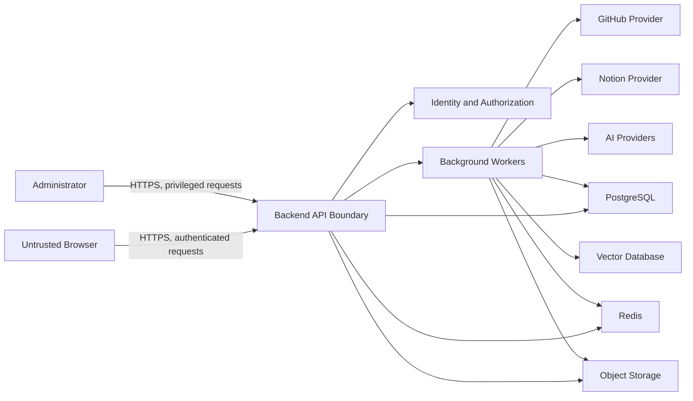
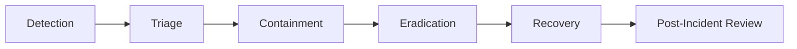

# DevPath Security Architecture

## 1. Purpose and Scope

### 1.1 Document Purpose

This document defines the authoritative security architecture for DevPath. It specifies the security objectives, protected assets, trust boundaries, threat model, authentication and authorization architecture, AI security controls, privacy controls, auditability, incident response expectations, and security verification requirements for the platform.

DevPath analyzes developer repositories, Notion workspaces, deterministic rule outputs, career readiness outputs, knowledge objects, prompts, AI responses, and generated career artifacts. Therefore, the security architecture MUST protect source evidence, user privacy, deterministic analysis integrity, AI provider boundaries, generated artifacts, and administrative changes across the full lifecycle.

### 1.2 Scope

This document applies to:

| Area | Included Scope |
|---|---|
| Users | Login, account ownership, profile security, career and company selections, account deletion |
| Administrators | Administrative authentication, rule and prompt management, auditability, least privilege |
| Frontend | Browser security, route protection expectations, XSS and CSRF controls, safe error behavior |
| Backend API | Authentication, authorization, validation, rate limiting, audit, secure error responses |
| Workers | Repository sync, Notion sync, rule evaluation, AI generation jobs, retries, dead-letter handling |
| Integrations | GitHub OAuth/API, Notion OAuth/API, future webhooks, future OAuth providers |
| Data Stores | PostgreSQL, Redis, Vector Database, Object Storage, backups |
| Knowledge | Ingestion, normalization, chunking, embedding, retrieval, deletion, authorization |
| AI | Context assembly, prompt construction, provider invocation, response validation, generated outputs |
| Operations | Logging, monitoring, incident response, retention, deletion, vulnerability management |

### 1.3 Excluded Topics

This document MUST NOT define production source code, cryptographic implementation code, framework annotations, cloud-vendor-specific IAM policies, firewall rule files, Kubernetes manifests, Terraform, exploit scripts, malware samples, detailed legal advice, or unsupported compliance certification claims.

### 1.4 Intended Audience

| Audience | Expected Use |
|---|---|
| Backend Engineers | Implement security controls in API, services, workers, adapters, and persistence boundaries |
| Frontend Engineers | Implement safe client behavior while relying on backend authority |
| AI Engineers | Protect prompts, context, provider requests, and AI outputs |
| Data Engineers | Protect data stores, embeddings, retrieval indexes, and backups |
| QA Engineers | Derive security verification and regression coverage |
| Operators | Configure secrets, monitoring, audit review, incident response, and recovery |
| Product Owners | Understand privacy, publication, retention, and risk tradeoffs |

### 1.5 Authority and Relationship to Previous Documents

This document references and does not replace:

| Document | Security Dependency |
|---|---|
| `00_Project_Context.md` | Product vision, philosophy, non-negotiable score ownership |
| `01_SRS.md` | Functional and non-functional requirements baseline |
| `02_Rule_Engine.md` | Deterministic scoring authority and evidence model |
| `03_Career_Path_Engine.md` | Career and company readiness authority |
| `04_AI_Architecture.md` | AI pipeline, model strategy, hallucination prevention |
| `05_Prompt_Engineering.md` | Prompt construction, validation, versioning, token controls |
| `06_Knowledge_Architecture.md` | Knowledge retrieval, vector storage, freshness, deletion |
| `07_Domain_Model.md` | Business concepts, aggregates, events, invariants |
| `08_System_Data_Model.md` | Logical data model and data ownership |
| `09_Database_Design.md` | Database storage design and persistence concerns |
| `10_API_Specification.md` | API contract, endpoint categories, request/response boundaries |
| `11_Backend_Architecture.md` | Backend modules, service boundaries, worker responsibilities |
| `12_Frontend_Architecture.md` | Frontend routes, feature boundaries, client state architecture |

### 1.6 Normative Language

The terms MUST, MUST NOT, SHOULD, SHOULD NOT, and MAY are used as normative requirement terms. MUST and MUST NOT indicate mandatory security controls.

## 2. Security Goals and Risk Posture

### 2.1 Security Goals

| Goal | Definition | Measurable Outcome |
|---|---|---|
| Confidentiality | Protect private repositories, Notion content, tokens, prompts, embeddings, artifacts, logs, and backups | Unauthorized users cannot access another user's protected data through API, retrieval, storage, cache, export, or logs |
| Integrity | Preserve deterministic Rule Engine and Career Engine outputs | AI output cannot modify scores, readiness values, evidence records, snapshots, or historical results |
| Availability | Keep critical user and analysis operations resilient | Abuse controls, rate limits, retries, and graceful degradation protect core platform workflows |
| Authenticity | Verify user, administrator, provider, webhook, and worker identities | Every protected operation has an authenticated actor or verified system identity |
| Accountability | Record security-sensitive actions with minimal audit metadata | Administrative and sensitive user actions are traceable by actor, action, target, outcome, timestamp, and correlation ID |
| Privacy | Minimize collection, processing, disclosure, and retention of personal and private developer data | Users can understand provider connections, exports, publication state, and deletion effects |
| Non-Repudiation | Preserve evidence for administrative and security-sensitive actions where applicable | Immutable audit records exist for rule activation, prompt activation, artifact publication, exports, and admin changes |
| Resilience | Recover safely from provider outages, credential compromise, and data-processing failures | Security failures fail closed unless explicitly defined safe degradation exists |
| Traceability | Map controls to assets, threats, API areas, modules, and verification methods | High-risk threats have preventive, detective, recovery, owner, and verification coverage |

### 2.2 Risk Posture

DevPath is treated as a graduation project evolving toward a production SaaS platform. The architecture SHOULD prioritize high-impact controls that protect private source data, identity, OAuth tokens, deterministic analysis integrity, AI context, and generated public artifacts. The platform MUST NOT claim formal compliance certifications until independent legal and compliance review confirms scope, controls, evidence, and operating maturity.

| Risk Class | Meaning | Required Treatment |
|---|---|---|
| Critical | Likely or severe compromise of user data, tokens, cross-user isolation, or deterministic results | Must block release until mitigated or formally accepted by accountable owner |
| High | Serious compromise of private data, admin authority, AI leakage, or availability | Must have preventive, detective, recovery, and verification controls |
| Medium | Limited impact, constrained exploitability, or recoverable exposure | Should be mitigated with documented residual risk |
| Low | Minimal security impact or defense-in-depth improvement | May be tracked as backlog |

## 3. Security Context and Assumptions

### 3.1 Actors and Trust

| Actor | Trust Level | Security Expectation |
|---|---|---|
| Anonymous Visitor | Untrusted | May access only public routes and public artifacts explicitly published by owners |
| Authenticated User | Partially trusted | May access only owned data and explicitly authorized published data |
| Administrator | Highly privileged but not implicitly trusted | Must use audited administrative functions with least privilege |
| Background Worker | Trusted runtime component with scoped authority | Must validate job ownership and operate through internal service boundaries |
| GitHub | Partially trusted provider | Provider data and tokens must be protected and normalized before use |
| Notion | Partially trusted provider | Workspace content must remain user-scoped and authorization-filtered |
| AI Provider | Partially trusted processing provider | Receives minimized context only; must not become data owner |
| Browser | Untrusted client | Must not hold provider secrets or authoritative state |
| Attacker | Untrusted | May attempt account takeover, prompt injection, IDOR, upload abuse, token theft, and data exfiltration |

### 3.2 Environmental Assumptions

| ID | Assumption | Verification Need |
|---|---|---|
| SA-ASM-001 | Production traffic terminates over HTTPS | Deployment architecture must verify TLS enforcement |
| SA-ASM-002 | Backend services run in an isolated server-side environment | Deployment documentation must verify runtime network and secret isolation |
| SA-ASM-003 | PostgreSQL, Redis, Vector Database, and Object Storage are not directly public | Deployment and network review must confirm exposure controls |
| SA-ASM-004 | OAuth providers support secure redirect URI registration and token revocation semantics | Provider integration review must confirm behavior |
| SA-ASM-005 | AI provider terms and retention policies can be reviewed before production enablement | Provider selection ADR must record data usage constraints |
| SA-ASM-006 | Detailed retention periods remain product and legal decisions | Retention ADR must define final durations |

## 4. Asset Classification

### 4.1 Classification Model

| Classification | Meaning | Default Protection |
|---|---|---|
| Public | Intended for unauthenticated access after explicit publication | Integrity protection, abuse controls, safe caching |
| Internal | Operational or non-sensitive platform information | Authenticated access, least privilege, logging |
| Confidential | User-owned private or business-sensitive data | Owner authorization, encryption expectations, redaction from logs |
| Restricted | Secrets, credentials, hidden prompts, private source content, embeddings, audit records, administrative controls | Strong access control, no public API exposure, strict audit, minimal retention |

### 4.2 Protected Asset Catalog

| Asset | Owner | Class | Integrity | Availability | Retention Category | Allowed Consumers | Prohibited Exposure | Required Protection |
|---|---|---:|---:|---:|---|---|---|---|
| User identity data | User / Identity Context | Confidential | High | High | Active account | Owner, authorized admin | Other users, public logs | Backend authorization, minimal display, audit on changes |
| User profile data | User | Confidential | Medium | Medium | Active account | Owner, authorized admin | Other users unless published | Owner checks, redaction |
| OAuth tokens | User / Integration Context | Restricted | High | High | Active connection | Server-side adapters only | Browser, logs, AI providers | Server-side storage, rotation, revocation, audit |
| Provider credentials | Platform | Restricted | High | High | Operational secret | Backend runtime only | Client bundles, logs, repositories | Secret manager, rotation, scanning |
| Private repository data | User | Restricted | High | Medium | Active source / deletion propagated | Repository, Rule, Knowledge, AI with minimized context | Other users, public artifacts without approval | Owner isolation, retrieval filtering, redaction |
| Notion content | User | Restricted | High | Medium | Active source / deletion propagated | Notion, Knowledge, AI with minimized context | Other users, logs, public artifacts without approval | Owner isolation, source labels |
| Repository snapshots | User / Repository Context | Confidential | Critical | Medium | Historical analysis | Rule Engine, Career Engine, audit review | AI mutation, cross-user access | Immutability, integrity checks |
| Analysis evidence | Rule Context | Confidential | Critical | Medium | Historical analysis | Rule, Career, AI explanation | Fabrication, unauthenticated access | Evidence references, immutable linkage |
| Rule Engine outputs | Rule Context | Confidential | Critical | High | Historical analysis | Career, Dashboard, AI explanation | AI overwrite, client overwrite | Deterministic authority, immutable results |
| Career Engine outputs | Career Context | Confidential | Critical | High | Active target / historical | Dashboard, AI explanation, recommendation | AI overwrite, client overwrite | Deterministic authority, versioning |
| Skill matrices | Rule Context | Confidential | Critical | High | Historical analysis | Owner, Career, AI explanation | Cross-user access, AI mutation | Owner checks, immutable result references |
| Readiness results | Career / Company Context | Confidential | Critical | High | Historical analysis | Owner, Dashboard, AI explanation | AI recalculation, user-supplied authority | Backend-calculated only |
| Knowledge documents | Knowledge Context | Restricted | High | Medium | Source-derived | Owner-scoped retriever | Cross-user retrieval | Metadata authorization, deletion propagation |
| Embeddings | Knowledge Context | Restricted | High | Medium | Derived knowledge | Retriever only | Public API, raw export | No raw vector exposure, metadata filtering |
| Prompt templates | Prompt Context | Restricted | High | Medium | Versioned platform config | Prompt Builder, authorized admin | Normal users, generated output | Versioning, admin audit |
| Prompt contexts | Prompt Context | Restricted | Critical | Medium | AI generation record | Prompt Builder, AI Engine, audit with limits | User tampering, hidden prompt disclosure | Immutable after creation, redacted logs |
| AI provider requests | AI Context | Restricted | High | Medium | Operational trace with minimization | AI adapter, limited audit | Logs, public APIs | Context minimization, provider isolation |
| AI outputs | AI Context | Confidential | Medium | Medium | Generated result | Owner, validators, artifact services | Treated as authoritative scores | Validation, labeling as generated |
| Generated artifacts | User / Portfolio Context | Confidential by default | High | Medium | Draft or published | Owner, authorized public if published | Private source leakage | Publication approval, versioning, redaction |
| Published portfolios | User | Public | High | Medium | Published artifact | Public readers | Hidden source evidence unless approved | Explicit publish state, tamper detection |
| Resumes | User | Confidential | High | Medium | Generated artifact | Owner, export recipients chosen by user | Public access by default | Private draft, expiring exports |
| Interview answers | User | Confidential | Medium | Low | Generated artifact | Owner | Logs by default, other users | Minimal logging, private storage |
| Audit records | Platform | Restricted | Critical | High | Audit retention TBD | Authorized admin/security owner | Mutation, broad export | Append-only expectation, access audit |
| Operational logs | Platform | Internal / Confidential | Medium | High | Log retention TBD | Operators | Tokens, source content, hidden prompts | Redaction, correlation IDs |
| Configuration | Platform | Internal | High | High | Current config | Operators | Secrets, public clients | Separation from secrets, change audit |
| Administrative actions | Platform | Restricted | Critical | High | Audit retention TBD | Security and admin review | Unlogged changes | Strong auth, least privilege, immutable audit |
| Backups | Platform / Data Owners | Restricted | Critical | Medium | Backup retention TBD | Restore operators only | Public storage, normal APIs | Encryption, access control, restore validation |

### 4.3 Asset Count by Classification

| Classification | Count |
|---|---:|
| Public | 1 |
| Internal | 2 |
| Confidential | 14 |
| Restricted | 13 |

## 5. Trust Boundaries

### 5.1 High-Level Trust-Boundary Diagram

### 5.2 Trust-Boundary Catalog

| Boundary ID | Boundary | Data Crossing | Authentication | Authorization | Validation | Encryption Expectation | Logging | Failure Behavior |
|---|---|---|---|---|---|---|---|---|
| TB-001 | Browser to Backend | API requests, tokens/session identifiers, user inputs | User session or public access | Backend-enforced | Schema, payload, route | HTTPS | Correlation ID, auth outcome | Fail closed for protected routes |
| TB-002 | Public to Authenticated Routes | Route navigation, public artifact reads | None or session | Route and API level | Publication state | HTTPS | Access category | Deny private resources |
| TB-003 | User to Admin Functions | Admin actions | Admin authentication | Admin role and action permission | Admin command schema | HTTPS | Immutable audit | Deny by default |
| TB-004 | API to Worker | Jobs, events, task metadata | Internal worker identity | Job scope and owner | Job schema, idempotency key | Internal encrypted channel where available | Job lifecycle | Reject invalid jobs |
| TB-005 | Backend to GitHub | OAuth tokens, repo metadata, commits | Provider token | Provider scopes | Provider response normalization | Provider HTTPS | Provider call metadata only | Retry/circuit break; no token leak |
| TB-006 | Backend to Notion | OAuth tokens, pages, databases | Provider token | Provider scopes | Provider response normalization | Provider HTTPS | Provider call metadata only | Retry/circuit break; no content leak |
| TB-007 | Backend to AI Providers | Minimized prompt context | Server-side provider key | Provider policy and task permission | Prompt and output schemas | Provider HTTPS or local isolated channel | Redacted request metadata | Fallback or fail safe |
| TB-008 | Backend to PostgreSQL | Domain data, results, audit | Service credentials | Application ownership checks | Query parameterization and invariants | Encrypted in transit where supported | Sensitive operation audit | Rollback transaction |
| TB-009 | Backend to Redis | Cache, locks, rate limits | Service credentials | Key namespace isolation | TTL and value constraints | Internal protected network | Cache operation category | Treat cache miss as safe |
| TB-010 | Backend to Vector DB | Chunks, embeddings, metadata | Service credentials | User metadata filters | Metadata completeness | Internal protected network | Retrieval metadata only | Return no context |
| TB-011 | Backend to Object Storage | Uploads, exports, artifacts | Service credentials / signed URLs | Owner and publication checks | MIME, size, content type | HTTPS | Upload/download metadata | Expire or revoke URL |
| TB-012 | Upload Pipeline to Runtime | User files and generated exports | Authenticated upload | Owner and task permission | Scan, quarantine, allowlist | Internal protected path | Scan status | Quarantine or reject |
| TB-013 | Public Artifact to Private Source | Published portfolio/readme views | Public or owner | Publication approval | Redaction and reference checks | HTTPS | Publication/read metadata | Hide private source details |
| TB-014 | Internal Module Boundaries | Rule outputs, career outputs, prompt context | Service-level invocation | Module ownership | DTO/schema/domain invariant checks | Internal | Domain event/audit where sensitive | Preserve immutable state |

## 6. Threat Modeling Method

DevPath uses STRIDE-based practical threat modeling for major system flows. Threats are evaluated by likelihood, impact, risk level, controls, residual risk, and owner. Complete elimination is not claimed; controls reduce likelihood, impact, or detection time.

| STRIDE Category | DevPath Interpretation |
|---|---|
| Spoofing | Actor impersonates user, administrator, worker, webhook, or provider |
| Tampering | Actor modifies snapshots, scores, prompts, artifacts, jobs, or storage references |
| Repudiation | Actor denies sensitive action due to missing audit evidence |
| Information Disclosure | Actor accesses private repository, Notion, prompts, embeddings, tokens, or logs |
| Denial of Service | Actor exhausts login, API, sync, ingestion, search, AI, export, or storage resources |
| Elevation of Privilege | Actor gains unauthorized user, admin, worker, provider, or publication authority |

## 7. Primary Threat Scenarios

### 7.1 Threat Catalog

| Threat ID | Scenario | Asset | Attacker | Surface | STRIDE | Likelihood | Impact | Risk | Preventive Control | Detective Control | Recovery Control | Residual Risk | Owner |
|---|---|---|---|---|---|---|---|---|---|---|---|---|---|
| TH-001 | Account takeover | User account | External attacker | Login/session | Spoofing | Medium | High | High | Secure session, suspicious-session handling, future MFA | Login anomaly logs | Session revocation | Medium | Identity |
| TH-002 | Session hijacking | Session | Network/browser attacker | Browser/API | Spoofing | Medium | High | High | Secure cookies/token storage, CSRF/XSS controls | Session anomaly detection | Revoke sessions | Medium | Frontend/Identity |
| TH-003 | OAuth callback manipulation | OAuth connection | External attacker | Callback | Spoofing/Tampering | Medium | High | High | State validation, redirect restrictions, PKCE where applicable | OAuth audit | Disconnect provider | Low | Integration |
| TH-004 | OAuth token theft | OAuth tokens | Insider/external | Storage/logs | Information Disclosure | Low | Critical | Critical | Server-side secret storage, log redaction | Secret scanning, audit | Revoke tokens | Medium | Integration/Security |
| TH-005 | Cross-user repository access | Private repos | Authenticated attacker | API/retrieval | Information Disclosure | Medium | Critical | Critical | Ownership checks, metadata filters | IDOR tests, access logs | Revoke exposure, notify review | Low | Backend/Knowledge |
| TH-006 | IDOR | User resources | Authenticated attacker | API IDs | Elevation/Disclosure | Medium | High | High | Resource owner authorization | Authorization failure metrics | Patch and audit affected access | Medium | Backend |
| TH-007 | Privilege escalation | Admin functions | Authenticated user | Admin API | Elevation | Low | Critical | Critical | Deny-by-default RBAC, admin route isolation | Admin access audit | Remove role, invalidate sessions | Low | Identity/Admin |
| TH-008 | Administrator abuse | All sensitive assets | Malicious admin | Admin UI/API | Tampering/Disclosure | Low | Critical | High | Least privilege, dual review for critical changes where defined | Immutable audit | Disable admin, restore state | Medium | Security/Admin |
| TH-009 | Malicious file upload | Upload pipeline | Authenticated attacker | Upload APIs | Tampering/DoS | Medium | High | High | Allowlist, scan, quarantine, size limits | Scan logs | Delete/quarantine | Medium | Backend |
| TH-010 | Dependency compromise | Runtime | Supply-chain attacker | Build/runtime | Tampering | Medium | Critical | Critical | Dependency scanning, trusted sources, SBOM | Vulnerability alerts | Patch/rollback | Medium | Engineering |
| TH-011 | Webhook spoofing | Future webhooks | External attacker | Webhook endpoint | Spoofing/Replay | Medium | High | High | Signature and timestamp validation | Webhook failure metrics | Rotate secret | Low | Integration |
| TH-012 | Replay attacks | API/callback/webhook | External attacker | Network/API | Spoofing | Medium | Medium | Medium | Nonce/state/idempotency/timestamp | Duplicate request logs | Invalidate tokens | Low | Backend |
| TH-013 | API abuse | Availability | External attacker | Public/API | DoS | High | Medium | High | Rate limits, quotas, payload limits | Abuse metrics | Throttle/block | Medium | Backend/Ops |
| TH-014 | Rate-limit bypass | Availability/cost | Authenticated attacker | API/workers | DoS | Medium | High | High | User/IP/task quotas, dedupe | Quota anomaly monitoring | Suspend abusive jobs | Medium | Backend/Ops |
| TH-015 | Direct prompt injection | AI output | User | AI task input | Tampering | High | Medium | High | Instruction/data separation, response validation | Prompt-injection test logs | Regenerate/flag output | Medium | AI/Prompt |
| TH-016 | Indirect prompt injection | AI context | Malicious repo/Notion content | Knowledge ingestion | Tampering/Disclosure | High | High | High | Source labeling, allowed context filtering | Output forbidden-claim detection | Remove poisoned context | Medium | AI/Knowledge |
| TH-017 | AI data leakage | Private content | Provider/model/output | AI invocation | Disclosure | Medium | Critical | Critical | Context minimization, provider policy review, redaction | AI request audit | Disable provider, notify review | Medium | AI/Security |
| TH-018 | Hidden prompt disclosure | Prompt templates | User/prompt injection | AI response | Disclosure | Medium | High | High | Hidden prompt separation, response validation | Forbidden content checks | Rotate templates if exposed | Medium | Prompt |
| TH-019 | Generated artifact tampering | Portfolio/resume | User/attacker | Artifact API/storage | Tampering | Medium | Medium | Medium | Versioning, ownership, integrity metadata | Artifact audit | Restore previous version | Low | Portfolio |
| TH-020 | Object URL leakage | Exports/artifacts | Recipient/attacker | Signed URL | Disclosure | Medium | High | High | Scoped expiring URLs, no broad listing | Download audit | Revoke URL | Medium | Storage |
| TH-021 | Log leakage | Logs | Insider/attacker | Logging stack | Disclosure | Medium | High | High | Redaction policy, minimal logs | Log scanning | Purge and rotate secrets | Medium | Ops |
| TH-022 | Cache leakage | Redis cache | Authenticated attacker | Cache/API | Disclosure | Low | High | High | Key namespace isolation, TTL, no source of truth | Cache access anomalies | Flush affected keys | Low | Backend/Ops |
| TH-023 | Job duplication/tampering | Worker jobs | Authenticated attacker | Job queue | Tampering/DoS | Medium | Medium | Medium | Idempotency, owner validation | Duplicate job metrics | Cancel/requeue | Low | Worker |
| TH-024 | Stale authorization | Provider/user permissions | User/provider state | Cached permissions | Disclosure | Medium | High | High | Permission refresh, deny on uncertainty | Authorization mismatch logs | Re-sync/revoke | Medium | Integration |
| TH-025 | Data deletion failure | Deleted data | User/admin error | Deletion workflows | Disclosure | Medium | High | High | Deletion propagation tracking | Deletion reconciliation | Re-run erasure jobs | Medium | Data |
| TH-026 | Backup exposure | Backups | Insider/external | Backup storage | Disclosure | Low | Critical | Critical | Restricted backup access, encryption, audit | Backup access logs | Revoke, rotate, restore clean | Medium | Ops |
| TH-027 | Denial of service | Platform | External attacker | Login/API/AI/search | DoS | High | High | High | Limits, circuit breakers, graceful degradation | Availability monitoring | Scale/degrade/recover | Medium | Ops |

### 7.2 Threat Count by Risk Level

| Risk Level | Count |
|---|---:|
| Critical | 6 |
| High | 18 |
| Medium | 3 |
| Low | 0 |

## 8. Identity and Authentication Architecture

### 8.1 Authentication Behavior

ADR-026 establishes GitHub as the initial Spring Security OAuth2 Login provider and an opaque server-managed application session. Internal User identity remains provider-independent. Notion authorization and GitHub API authorization tokens are integration credentials, not DevPath application sessions.

| Flow | Required Security Behavior |
|---|---|
| User login | MUST authenticate through supported login mechanisms and create only server-recognized authenticated state |
| OAuth login | MUST validate provider response, account linking, state, and redirect URI before session creation |
| Access token/session use | MUST bind protected API access to authenticated identity and intended audience |
| Refresh/session renewal | SHOULD renew only valid, unrevoked sessions and SHOULD rotate refresh material where applicable |
| Token expiration | MUST enforce expiration server-side |
| Token revocation | MUST invalidate active sessions or tokens when logout, suspension, compromise, or deletion occurs |
| Logout | MUST remove client session state and revoke server-side active session state where applicable |
| Account suspension | MUST deny protected operations and invalidate active sessions |
| Account deletion | MUST begin retention/deletion workflow and revoke provider tokens |
| Administrator authentication | MUST require separate authorization checks for admin operations |
| Future service-to-service auth | MUST use scoped service identities, not shared user credentials |

| Accepted Authentication Element | Security Requirement |
|---|---|
| Session transport | Production uses a Secure, HttpOnly, SameSite=Lax, host-only cookie with a non-default name. |
| Session fixation | Session identifier MUST rotate after successful authentication and privilege-sensitive transitions. |
| Session store | Local single-instance development MAY use memory; MVP uses JDBC-backed PostgreSQL sessions. Redis is not required initially. |
| Expiration assumption | Default idle timeout is 30 minutes and absolute lifetime is 12 hours, both externally configurable and subject to production review. |
| Renewal | Authenticated activity MAY extend idle expiry but MUST NOT extend the absolute lifetime. |
| Concurrent sessions | Multiple sessions are allowed initially and MUST be individually revocable; security events MAY revoke all sessions. |
| Login provisioning | Provider identity resolution and first User creation/linking MUST be atomic and protected by a unique provider-subject constraint. |

### 8.2 Token and Session Expectations

| Control | Requirement |
|---|---|
| Storage | Provider tokens and AI keys MUST remain server-side; browser storage MUST NOT contain provider credentials |
| Audience | Tokens MUST be scoped to intended API or provider audience |
| Scope | Tokens MUST use minimum required provider and platform scopes |
| Replay prevention | Callback state, token lifetime, secure transport, and idempotency SHOULD reduce replay risk |
| Rotation | Secrets and long-lived credentials MUST support rotation |
| Failed-login handling | Repeated failures SHOULD trigger rate limiting and suspicious event logging |
| Suspicious-session handling | Suspicious sessions SHOULD be revocable without deleting account data |
| Session invalidation | Passwordless/OAuth account changes, suspension, deletion, and compromise MUST invalidate affected sessions |
| Browser token model | The initial SPA MUST NOT receive DevPath bearer access tokens or refresh tokens. |
| Provider-token encryption | GitHub and Notion API tokens MUST be encrypted at application level with externally managed key material in addition to storage encryption. |

## 9. OAuth and External Account Security

| OAuth Control | Requirement |
|---|---|
| Authorization initiation | MUST originate from backend-controlled flow with anti-CSRF state |
| State validation | MUST reject missing, reused, expired, or mismatched state |
| PKCE | SHOULD be used where provider and flow support it |
| Callback validation | MUST validate provider, redirect URI, state, code, and account-linking context |
| Redirect URI | MUST use registered allowlisted redirect URIs only |
| Scope minimization | MUST request only required GitHub/Notion scopes |
| Token storage | MUST store provider tokens only in server-side restricted storage |
| Token refresh | MUST refresh only for active connected accounts and record failures safely |
| Token revocation | MUST revoke or discard tokens on disconnect, deletion, compromise, or scope withdrawal |
| Provider disconnection | MUST stop sync jobs and remove active provider access |
| Permission changes | SHOULD detect provider permission changes and re-authorize or degrade safely |
| Account-linking conflict | MUST prevent one provider identity from silently attaching to the wrong user |
| Callback replay | MUST reject reused authorization codes or state |
| Audit logging | MUST audit connect, disconnect, refresh failure, and permission-change events without logging tokens |

The implemented GitHub recovery flow enforces these controls at the credential boundary. Disconnect and provider
permission withdrawal persist `REVOKED`; an unusable refresh path persists `EXPIRED`. Both transitions overwrite the
encrypted access-token payload with a random encrypted tombstone, clear refresh-token material and scopes, retain only
non-secret connection history, and prevent provider reads until a successful owner-bound reauthorization rotates the
same connection back to `ACTIVE`. Permission and refresh failures emit durable audit events without token content.

## 10. Authorization Architecture

### 10.1 Authorization Principles

All authorization decisions MUST be enforced by the backend. The frontend MAY hide or show UI capabilities but MUST NOT be treated as authoritative. Authorization MUST be deny-by-default, ownership-aware, and applied at API, application service, repository query, worker job, object storage, knowledge retrieval, generated artifact, and administrative boundaries.

### 10.2 Role and Ownership Model

| Principal | Authority | Restrictions |
|---|---|---|
| Anonymous | Public pages and explicitly published artifacts only | Cannot access private APIs, private artifacts, or internal metadata |
| Authenticated User | Own account, connected providers, owned repositories, owned analyses, owned artifacts | Cannot access other users' private data or admin functions |
| Resource Owner | Same as authenticated user for owned resources | Ownership MUST be verified server-side |
| Administrator | Scoped administrative functions | Cannot bypass audit; SHOULD not access raw private content without explicit operational reason |
| Internal Worker | Scoped job execution | Must validate job owner and task type |
| Provider Callback | OAuth/webhook completion only | Must be verified before any state change |
| Future Organization Member | Organization-owned resources according to future role | TBD authorization model |
| Future Organization Admin | Organization administration according to future role | TBD separation from platform admin |
| Future Read-Only Role | Read-only authorized resources | No mutation, export, token, or admin authority |

### 10.3 Authorization Matrix

| Operation Area | Anonymous | User Owner | Administrator | Worker | Provider Callback |
|---|---:|---:|---:|---:|---:|
| Public portfolio view | Allow if published | Allow own | Allow audited | Deny | Deny |
| Private repository data | Deny | Allow own | Restricted audited | Job-scoped | Deny |
| Repository sync | Deny | Request own | Audited support action | Execute scoped | Deny |
| Rule result read | Deny | Allow own | Restricted audited | Job-scoped | Deny |
| Rule result mutation | Deny | Deny | Deny except controlled admin rule config | Generate only via Rule Engine | Deny |
| Career target change | Deny | Allow own | Restricted audited | Deny | Deny |
| Knowledge retrieval | Deny | Allow owner-scoped | Restricted audited | Job-scoped | Deny |
| Prompt template management | Deny | Deny | Allow audited | Read active version only | Deny |
| AI generation | Deny | Request own | Restricted audited | Execute scoped | Deny |
| Artifact publication | Deny | Approve own | Restricted audited | Deny | Deny |
| Temporary export download | Deny unless signed public | Allow scoped expiring | Audited | Deny | Deny |
| Admin settings | Deny | Deny | Allow scoped | Deny | Deny |
| OAuth callback | Deny direct mutation | Initiate own flow | Audited support only | Deny | Allow verified |

## 11. Session and Client Security

| Control Area | Requirement |
|---|---|
| Token handling | Client MUST NOT store GitHub, Notion, AI provider, database, storage, or signing secrets |
| Secure cookies/session | Session material MUST use secure, HTTP-only, same-site protections in production according to ADR-026 |
| Session renewal | Renewal MUST require valid current session and server-side checks |
| CSRF | State-changing browser requests MUST include CSRF protections appropriate to the session model |
| XSS | Frontend MUST escape untrusted content, including AI output, repository text, Notion text, README content, and artifact previews |
| Content Security Policy | CSP SHOULD restrict script sources and reduce injection impact |
| Clickjacking | Protected pages SHOULD prevent framing unless explicitly allowed |
| Open redirect | Redirect targets MUST be allowlisted or relative-safe |
| Secure logout | Logout MUST clear client state and invalidate server session state where applicable |
| Cached private data | Client caches MUST be user-scoped and cleared on logout/account switch |
| Browser history | Sensitive one-time URLs and callback codes SHOULD NOT remain exposed in URLs longer than required |
| Clipboard | Copy interactions SHOULD warn or limit accidental exposure for sensitive exports |
| Third-party scripts | Third-party scripts SHOULD be minimized and reviewed |
| Error messages | Client errors MUST NOT reveal tokens, hidden prompts, raw provider responses, or private content |
| Browser storage | Session credentials and provider tokens MUST NOT be stored in localStorage, sessionStorage, IndexedDB, URLs, or frontend application state |
| CORS | Credentialed CORS MUST use explicit origins and MUST NOT use a wildcard origin |
| Cross-domain exception | `SameSite=None` or a broad cookie Domain requires explicit security review, HTTPS, and verified CSRF/CORS controls |

## 12. API Security

### 12.1 API Controls

| API Control | Requirement |
|---|---|
| HTTPS | Production APIs MUST require HTTPS |
| Authentication | Protected endpoints MUST require authenticated identity |
| Authorization | Resource ownership and role checks MUST occur server-side |
| Request validation | Requests MUST be validated against expected schemas and constraints |
| Payload limits | APIs MUST enforce maximum body, page, upload, and query sizes |
| Rate limiting | APIs SHOULD apply user/IP/task-specific rate limits |
| Idempotency | Long-running or retryable operations SHOULD use idempotency keys |
| Replay protection | Callback, webhook, and sensitive mutation flows MUST prevent replay |
| Correlation IDs | Requests SHOULD carry or receive correlation IDs for tracing |
| Pagination | List endpoints MUST enforce bounded pagination |
| File upload | Upload endpoints MUST isolate scanning and validation |
| Error responses | Errors MUST be safe, consistent, and non-secret-bearing |
| Versioning | Deprecated endpoints SHOULD have sunset and compatibility handling |
| Admin endpoints | Admin endpoints MUST require admin authorization and audit logging |

### 12.2 API Contract Mapping

| API Category from `10_API_Specification.md` | Security Expectations |
|---|---|
| Identity/User APIs | Auth, ownership, session revocation, safe profile exposure |
| GitHub/Notion APIs | OAuth state, provider scopes, token secrecy, sync job ownership |
| Repository/Analysis APIs | Owner checks, immutable result reads, job dedupe, rate limits |
| Rule/Career/Company APIs | Deterministic result protection, admin audit for rule/config changes |
| Knowledge APIs | Retrieval authorization, metadata filters, no raw embeddings |
| Prompt/AI APIs | Prompt validation, AI output validation, hidden prompt protection |
| Artifact APIs | Draft privacy, publication approval, expiring downloads |
| Admin APIs | Least privilege, immutable audit, strong validation |
| Search APIs | Query limits, owner filters, expensive-query controls |

## 13. Backend and Worker Security

| Component | Required Controls |
|---|---|
| Controllers | Authenticate, authorize, validate, rate-limit, and return safe errors |
| Application Services | Enforce use-case authorization, transaction boundaries, and idempotency |
| Domain Services | Preserve invariants and reject client-supplied authority for scores/readiness |
| Persistence Adapters | Apply owner-scoped queries and avoid unsafe query construction |
| Background Workers | Validate job owner, job type, retry state, and idempotency before processing |
| Schedulers | Use least privilege and avoid uncontrolled fan-out |
| Event Handlers | Treat event payloads as untrusted until validated |
| Job Queues | Protect against tampering, duplication, replay, and stale authorization |
| Retry Processing | Preserve idempotency and avoid repeated destructive side effects |
| Dead-Letter Processing | Restrict visibility and prevent sensitive payload leakage |
| Internal Admin Commands | Require explicit authorization and immutable audit |

## 14. Data Protection Architecture

| Data State | Requirement |
|---|---|
| In transit | Sensitive platform traffic MUST use protected transport such as HTTPS or equivalent internal protection |
| At rest | Confidential and Restricted data SHOULD be protected using approved industry-standard encryption mechanisms |
| In use | Services MUST minimize sensitive data loaded into memory and avoid unnecessary propagation |
| Backups | Backups MUST inherit or exceed source data classification protections |
| Caches | Redis MUST NOT become source of truth and SHOULD store minimal sensitive data with TTL |
| Logs | Logs MUST redact secrets, tokens, private source content, hidden prompts, and sensitive headers |
| Exports | Exports MUST require authorization and use expiring scoped access |
| Temporary files | Temporary files MUST be isolated, time-limited, and removed after processing |

### 14.1 Protection Rules

| Rule | Requirement |
|---|---|
| Data minimization | Only data required for the use case SHOULD be collected, stored, retrieved, or sent to providers |
| Integrity checks | Immutable analysis and prompt context records SHOULD include integrity metadata or equivalent tamper evidence |
| Field-level protection candidates | OAuth tokens, API keys, signing secrets, hidden prompts, and sensitive provider metadata are candidates |
| Mandatory field-level protection | Stored GitHub and Notion provider access/refresh tokens require application-level encryption and key-version metadata |
| User isolation | Every user-owned object MUST have enforceable ownership or access metadata |
| Retention | Retention MUST be defined by category and unresolved durations marked TBD |
| Deletion | Deletion MUST propagate to PostgreSQL, Redis, Vector Database, Object Storage, tokens, derived artifacts, and backups according to policy |
| Restore validation | Restores MUST validate data integrity and access boundaries before service use |

## 15. Storage Security

### 15.1 PostgreSQL

| Control | Requirement |
|---|---|
| Access control | Service accounts SHOULD have least privilege for required schemas and operations |
| Schema ownership | Administrative schema changes MUST be controlled and auditable |
| Restricted admin access | Direct database access SHOULD be limited to authorized operators |
| Query isolation | Queries MUST enforce user/resource ownership in application logic and query scope |
| Backup protection | Backups MUST be restricted and protected according to Restricted classification |
| Audit-sensitive operations | Rule activation, prompt activation, admin changes, exports, and deletion jobs MUST be auditable |

### 15.2 Redis

| Control | Requirement |
|---|---|
| Source of truth | Redis MUST NOT be authoritative for durable user data |
| Sensitive minimization | Sensitive values SHOULD be avoided; if unavoidable, use minimal TTL and restricted keys |
| TTL | Session/cache/lock keys SHOULD define expiration |
| Access isolation | Key namespaces SHOULD separate users, tasks, and security functions |
| Cache poisoning prevention | Cached values MUST be derived from authorized sources and invalidated on permission changes |

Initial authentication does not require Redis. If a future scaling review adopts Redis-backed sessions, those sessions remain revocable operational state and do not replace PostgreSQL User identity or external-account ownership.

### 15.3 Vector Database

| Control | Requirement |
|---|---|
| Retrieval filtering | Every retrieval MUST include user ownership and allowed-source filters |
| Metadata authorization | Missing or invalid authorization metadata MUST cause retrieval denial |
| Raw vector exposure | Raw embeddings MUST NOT be returned through public APIs |
| Index isolation | Indexes SHOULD support user-level or metadata-level isolation |
| Deletion/re-index | Deletion and re-indexing MUST remove stale chunks and embeddings from retrieval scope |

### 15.4 Object Storage

| Control | Requirement |
|---|---|
| Private by default | Objects MUST be private unless explicitly published |
| Scoped upload | Uploads MUST be scoped to owner, artifact type, and allowed content |
| Temporary URL | Downloads MUST use scoped, expiring URLs where direct storage access is needed |
| Content type | Content type MUST be validated and not trusted from client declaration alone |
| Publication boundary | Publication MUST create a deliberate public/private state transition |
| Deletion | Object deletion MUST be tracked and reconciled with metadata |
| Export isolation | Exports MUST not allow object listing or cross-user access |

## 16. File Upload and Content Security

| Upload Area | Required Controls |
|---|---|
| Knowledge documents | Allowlisted type, size limit, scan/quarantine, owner metadata |
| Future repository archives | Archive traversal prevention, decompression limits, isolated processing |
| Resume inputs | Private by default, content sanitization, restricted retention |
| Portfolio assets | MIME validation, safe rendering, publication approval |
| Generated exports | Owner authorization, integrity metadata, expiring download links |

Upload validation MUST occur server-side. The platform SHOULD validate extension, MIME, magic bytes where feasible, size, decompression ratio, filename normalization, malware scan status, and content safety before use. Rejected uploads SHOULD record safe rejection metadata without retaining malicious content longer than required for investigation.

## 17. Integration and Webhook Security

| Integration | Security Requirements |
|---|---|
| GitHub API | Use server-side OAuth tokens, minimum scopes, response normalization, timeout and retry controls |
| Notion API | Use server-side OAuth tokens, minimum scopes, workspace ownership checks, response normalization |
| OAuth callbacks | Validate state, redirect URI, provider, account linking, and replay protections |
| Future GitHub webhooks | Verify signature, timestamp, event type, delivery ID, replay, and idempotency |
| Future Notion events | Verify provider authenticity when supported and degrade safely otherwise |
| AI provider APIs | Use server-side keys, minimized context, provider policy review, timeout and fallback |
| Notification providers | Minimize payloads and avoid private source content unless explicitly required |

The implemented GitHub adapter treats quota exhaustion as an availability condition rather than permission loss.

For FR-031~FR-036, provider PR, review, issue, and README reads remain server-side and owner-scoped through the active
GitHub credential. Provider payloads are normalized before persistence. README bodies are used transiently to compute
SHA-256 and section-presence signals, then discarded; only metadata is stored, so private source content is neither
returned to the browser nor placed in logs, LLM context, or an unapproved object store.
Provider response bodies are discarded, only validated retry/reset headers cross the adapter boundary, the active
credential is retained, and direct API responses use a safe `429 RATE_LIMIT_EXCEEDED`. Durable synchronization jobs wait
until the normalized reset time instead of creating an immediate retry storm. A restricted audit record identifies the
owner connection and event category without recording tokens, repository content, or raw provider diagnostics.

Provider-specific data MUST remain behind adapters. Provider errors returned to users MUST be normalized and MUST NOT expose tokens, raw provider headers, or internal request details.

## 18. Knowledge and Retrieval Security

Knowledge retrieval MUST enforce authorization before returning context. Relevance MUST never override access control.

| Stage | Required Controls |
|---|---|
| Document ownership | Each document MUST be associated with owner, source, authorization metadata, and retention category |
| Source authorization | Source access MUST be verified before ingestion and re-verified when permissions change |
| Normalization | Normalized content MUST preserve source labels and evidence references |
| Chunking | Chunks MUST inherit owner, source, classification, and deletion state |
| Embedding | Embeddings MUST be treated as Restricted derived data |
| Vector indexing | Index entries MUST include authorization metadata and embedding version metadata |
| Semantic retrieval | Queries MUST include owner and allowed-source filters |
| Source citation | Returned context SHOULD include evidence references without leaking hidden metadata |
| Re-indexing | Re-index jobs MUST invalidate stale chunks before new context becomes retrievable |
| Deletion | Deleted documents and chunks MUST be removed from retrieval scope |
| Archived documents | Archived content SHOULD be excluded from active retrieval unless explicitly permitted |
| Cross-user isolation | Cross-user retrieval MUST be denied even if semantic similarity is high |

## 19. AI and Prompt Security

### 19.1 AI Security Boundaries

| Boundary | Rule |
|---|---|
| Deterministic source data | MUST remain distinct from AI-generated explanations |
| Retrieved knowledge | MUST be authorized, labeled, and bounded by token budget |
| System instruction | MUST NOT be disclosed to normal users |
| Prompt template | MUST be versioned and admin-managed |
| User input | MUST be treated as untrusted |
| Provider request | MUST contain minimized, task-relevant context |
| AI response | MUST be treated as untrusted input until validated |
| Response validation | MUST verify structure, forbidden claims, evidence references, and score consistency |
| Generated artifact | MUST preserve draft privacy and publication approval |

### 19.2 AI-Specific Controls

| Risk | Required Control |
|---|---|
| Direct prompt injection | Separate instructions from user input and validate output |
| Indirect prompt injection | Label repository/Notion content as untrusted source data |
| Malicious repository content | Sanitize and isolate context; never execute content |
| Malicious Notion content | Treat pages as data, not instruction |
| Hidden instruction extraction | Detect and reject requests to reveal prompts, policies, or internal context |
| Provider data retention | Select providers based on data usage and retention review |
| Sensitive disclosure | Minimize context and validate outputs for private data leakage |
| Tool misuse | AI layer MUST NOT execute business rules or privileged actions |
| Hallucinated authority | AI outputs MUST NOT claim to calculate scores or override engines |
| Output-schema bypass | Response Validator MUST reject invalid structures |
| Model substitution | Model selection MUST follow configured provider policy |
| Excessive token usage | Enforce token budget, context priority, and truncation rules |
| Prompt-context poisoning | Use source labels, evidence validation, and retrieval filtering |

## 20. Prompt Injection Defense

Prompt-injection defense is risk reduction, not guaranteed prevention. DevPath MUST apply layered defenses.

| Layer | Defense |
|---|---|
| Source labeling | Repository, Notion, upload, and user text MUST be labeled as untrusted source content |
| Instruction/data separation | System, task, constraints, evidence, and source data MUST be structurally separated |
| Strict prompt structure | Prompt Builder MUST compose only validated templates and variables |
| Allowed-context filtering | Context Builder MUST include only authorized and relevant context |
| Retrieval authorization | Retriever MUST enforce owner and source permissions before ranking |
| Content sanitization | Rendered outputs MUST escape untrusted content where displayed |
| Model constraints | Prompts MUST state that scores are deterministic and not calculated by the model |
| Structured outputs | AI tasks SHOULD request structured outputs where supported |
| Response validation | Validator MUST reject unsupported claims, invalid schemas, and score mutations |
| Forbidden-claim detection | Outputs MUST NOT claim hidden authority, invented evidence, or unsupported features |
| Score consistency | AI explanations MUST reference Rule/Career outputs without altering values |
| Evidence validation | Recommendations SHOULD reference available evidence or mark insufficient context |
| Output escaping | Frontend MUST safely render AI-generated Markdown or text |
| Human review | Publication-sensitive artifacts SHOULD support user review before publishing |

## 21. AI Provider Security and Privacy

### 21.1 Provider Criteria

| Criterion | Requirement |
|---|---|
| Data usage policy | MUST be reviewed before production use |
| Retention policy | MUST be known and documented; unknown retention increases risk |
| Regional processing | SHOULD be considered where user or organization policy requires it |
| Model capability | MUST support required task quality and validation constraints |
| Structured output | SHOULD support structured response formats for high-risk tasks |
| Security certifications | MAY be considered but MUST NOT be represented as DevPath compliance |
| Incident notification | SHOULD be available for production providers |
| Access controls | Provider console access MUST be restricted |
| Key rotation | Provider keys MUST be rotatable |
| Usage limits | Provider usage MUST have quotas or monitoring |
| Auditability | Requests SHOULD be traceable without storing sensitive prompt bodies in logs |

### 21.2 Supported Provider Classes

| Provider Class | Examples | Additional Controls |
|---|---|---|
| Commercial API | OpenAI, Anthropic, Google Gemini | Server-side keys, data retention review, cost/rate monitoring |
| Local Runtime | Ollama | Runtime isolation, model provenance, resource limits |
| Local/Open Models | Qwen, Llama, Mistral | Model-file provenance, sandboxing, update scanning, no implicit internet access |

Provider-specific secrets and raw provider responses MUST NOT be exposed through public APIs.

## 22. Generated Artifact Security

| Artifact | Security Controls |
|---|---|
| Portfolio | Private draft by default, source-reference integrity, explicit publication approval |
| Resume | Owner-only by default, export authorization, redaction controls |
| README | Repository ownership validation, generated-content labeling where applicable |
| Interview Questions | Owner-scoped access, no default logging of full answers |
| AI Reviews | Evidence references, no deterministic score mutation |
| Exports | Expiring scoped download URLs, no object listing, deletion support |

Private source data MUST NOT appear in public artifacts without explicit user approval. Generated artifacts SHOULD preserve version history and publication state. Artifact tampering SHOULD be detectable through version metadata, audit events, or equivalent integrity controls.

## 23. Secrets and Configuration Security

### 23.1 Secret Categories

| Secret Category | Exposure Rule |
|---|---|
| OAuth client secrets | Server-side only |
| Provider access tokens | Server-side only, user-scoped |
| AI API keys | Server-side only, provider-scoped |
| Database credentials | Runtime only |
| Cache credentials | Runtime only |
| Storage credentials | Runtime only |
| Signing secrets | Restricted runtime access |
| Webhook secrets | Restricted integration access |
| Encryption keys | Restricted operational access |
| Administrative bootstrap credentials | Time-limited and audited |

### 23.2 Secret Controls

Secrets MUST NOT be stored in source control, logs, public configuration, frontend bundles, generated artifacts, or support screenshots. Secret storage MUST support environment separation, access ownership, rotation, revocation, audit, backup restrictions, local-development handling, and secret scanning.

## 24. Logging, Audit, and Privacy

### 24.1 Security Logging

| Event Category | Logging Requirement |
|---|---|
| Authentication events | Success, failure, logout, session revocation, suspicious session |
| Identity-link events | First-user provisioning, provider link success, link conflict, unlink, duplicate-prevention conflict |
| Authorization failures | Actor, target category, outcome, correlation ID |
| OAuth changes | Connect, disconnect, refresh failure, scope change |
| Repository access | Sync request, analysis request, export/publication access category |
| Analysis requests | Job creation, completion, failure, retry, owner |
| Target changes | Career and company changes |
| Artifact publication | Draft to public transition, unpublish, export |
| Administrative changes | Rule, prompt, company, career, user, settings changes |
| Security-control failures | Validation failures, upload scan failures, webhook verification failures |
| Suspicious activity | Rate-limit violations, IDOR attempts, injection attempts |

### 24.2 Audit Record Fields

| Field | Requirement |
|---|---|
| Actor | User, admin, worker, provider callback, or system |
| Action | Normalized action name |
| Target | Target type and identifier or safe reference |
| Outcome | Success, denied, failed, partial |
| Timestamp | Server-side timestamp |
| Correlation ID | Request or job correlation ID |
| Source category | API, worker, admin, provider callback |
| Minimal metadata | Non-sensitive metadata only |

### 24.3 Data That MUST NOT Be Logged

Passwords, OAuth tokens, API keys, raw private repository contents, raw Notion pages, hidden system prompts, unnecessary generated content, full interview answers by default, sensitive headers, raw embeddings, and provider credentials MUST NOT be logged.

Operational logs, security logs, and immutable audit records MUST be distinguished by purpose, retention, access control, and mutability expectation.

## 25. Abuse Prevention and Availability Security

| Abuse Area | Required Controls |
|---|---|
| Login abuse | Rate limits, suspicious-session monitoring, safe error messages |
| API scraping | Pagination limits, per-user/IP quotas, anomaly detection |
| Repository sync abuse | Sync quotas, dedupe, provider rate-limit handling |
| Analysis job flooding | Job quotas, concurrency limits, idempotency |
| Knowledge ingestion flooding | Upload limits, chunk/index budgets, queue limits |
| AI generation abuse | Task quotas, token budgets, provider cost controls |
| Export abuse | Export quotas, expiring URLs, owner checks |
| File-upload abuse | Size/type limits, scan/quarantine, decompression limits |
| Expensive search | Query limits, timeout, result caps |
| Admin endpoint abuse | Admin rate limits, strong audit, role checks |

Availability controls MUST NOT leak sensitive usage details. Error responses SHOULD be user-safe and operationally traceable.

## 26. Vulnerability and Supply-Chain Management

| Area | Security Expectation |
|---|---|
| Dependency inventory | Maintain inventory for frontend, backend, AI, and operational dependencies |
| Dependency scanning | Scan for known vulnerabilities before release and on updates |
| License review | Review dependencies for acceptable project use |
| Secret scanning | Scan source and configuration for accidental secrets |
| Static analysis | Use static analysis where practical |
| Runtime/container scanning | SHOULD scan runtime images or deployment artifacts where applicable |
| SBOM | SHOULD maintain a software bill of materials for production maturity |
| Update policy | Critical patches SHOULD be prioritized by severity and exploitability |
| Compromised dependency | Support rollback, pinning, replacement, and incident review |
| Build integrity | Use trusted package sources and reproducible release metadata where feasible |
| AI model provenance | Local models and model files MUST have documented source and integrity review |

No unsupported scanning vendor or tool is mandated by this document.

## 27. Security Verification and Testing

### 27.1 Verification Methods

| Verification Area | Expected Coverage |
|---|---|
| Authentication tests | Login, logout, expiration, revocation, suspension |
| Authorization matrix tests | User/admin/worker/provider callback permissions |
| IDOR tests | Cross-user object access denial |
| OAuth tests | State, redirect URI, replay, account linking, disconnect |
| Session tests | Session fixation, cookie attributes, idle and absolute expiration, CSRF, secure logout, JDBC persistence, cache clearing, concurrent-session revocation |
| API validation tests | Schema, payload limits, pagination, safe errors |
| Rate-limit tests | Login, API, sync, AI generation, export |
| Upload tests | Type, MIME, size, malware scan status, archive traversal |
| Webhook tests | Signature, timestamp, idempotency, replay |
| Data-isolation tests | PostgreSQL, Redis, Vector DB, Object Storage |
| Log-redaction tests | Tokens, prompts, private content, headers |
| Prompt-injection tests | Direct and indirect injection scenarios |
| Retrieval authorization tests | Metadata filters and deleted/archived exclusion |
| AI-output validation tests | Schema, forbidden claims, score consistency |
| Secret scanning | Source, configuration, build artifacts |
| Dependency scanning | Known vulnerabilities and critical patch tracking |
| Penetration testing | Release readiness and high-risk flows |
| Backup restoration tests | Restore integrity and access boundary validation |
| Incident exercises | Credential leak, AI leak, cross-user exposure, dependency compromise |

### 27.2 Threat-to-Verification Mapping

| Threat IDs | Verification Methods |
|---|---|
| TH-001, TH-002 | Authentication tests, session tests, rate-limit tests |
| TH-003, TH-004, TH-011, TH-012 | OAuth tests, webhook tests, log-redaction tests |
| TH-005, TH-006, TH-024 | Authorization matrix tests, IDOR tests, data-isolation tests |
| TH-007, TH-008 | Admin authorization tests, audit review, penetration testing |
| TH-009 | Upload tests, malware scan workflow tests |
| TH-010 | Dependency scanning, SBOM review, compromised dependency exercise |
| TH-013, TH-014, TH-027 | Rate-limit tests, load/abuse simulations, provider quota tests |
| TH-015, TH-016, TH-017, TH-018 | Prompt-injection tests, AI-output validation tests, log-redaction tests |
| TH-019, TH-020 | Artifact authorization tests, expiring URL tests |
| TH-021, TH-022 | Log-redaction tests, cache isolation tests |
| TH-023 | Job idempotency and tamper tests |
| TH-025 | Deletion propagation tests |
| TH-026 | Backup restoration and access review |

Detailed test cases belong to the future test architecture document.

## 28. Incident Response and Recovery

### 28.1 Response Lifecycle

### 28.2 Incident Categories

| Incident | Severity | Owner | Containment | Credential Rotation | Notification Consideration | Evidence Preservation | Recovery Validation | Follow-Up |
|---|---|---|---|---|---|---|---|---|
| Credential leak | Critical | Security/Ops | Disable leaked secret | Required | Affected users/providers if exposed | Preserve logs and scans | Verify new secret only | Improve scanning |
| OAuth token compromise | Critical | Integration | Revoke tokens | Required | Affected users | OAuth audit | Reconnect safely | Scope review |
| Account takeover | High | Identity | Revoke sessions | Maybe | Affected user | Login/session logs | Confirm ownership | Session controls |
| Cross-user data exposure | Critical | Backend/Data | Disable route/query | Maybe | Affected users after review | Access logs | Verify isolation | Add regression tests |
| Provider breach | High | AI/Integration | Disable provider | Provider keys if needed | Affected users if data involved | Provider notices/logs | Switch/fallback safely | Provider ADR review |
| Malicious upload | High | Backend | Quarantine/delete | No unless related | User if needed | Upload metadata | Scan clean state | Upload controls |
| Prompt injection incident | High | AI/Prompt | Disable template/task | Maybe | If private data exposed | Prompt/output records redacted | Validator update | Add tests |
| AI data leakage | Critical | AI/Security | Stop provider/task | Provider keys if needed | Affected users after review | AI request metadata | Confirm no further leak | Context minimization |
| Public artifact exposure | High | Portfolio | Unpublish/revoke URLs | No unless credentials | Affected owner | Artifact versions | Confirm removal | Publication UX |
| Audit-log tampering | Critical | Security/Ops | Freeze admin access | Maybe | Leadership/security review | Backup/audit copies | Integrity verification | Audit hardening |
| Dependency compromise | Critical | Engineering | Pin/rollback/remove | Maybe | If user data affected | Build logs/SBOM | Clean build | Supply-chain policy |
| Database/backup exposure | Critical | Data/Ops | Isolate store/backup | Required if secrets exposed | Affected users after review | Access logs/snapshots | Restore clean state | Access review |

Legal notification requirements MUST be reviewed by qualified counsel for applicable jurisdictions and are not asserted by this document.

## 29. Privacy, Retention, and Deletion

### 29.1 Privacy Controls

| Area | Requirement |
|---|---|
| Consent | Provider connections and AI provider usage SHOULD be visible to users |
| Provider connection visibility | Users SHOULD see connected GitHub/Notion state and disconnect options |
| Repository privacy | Private repositories MUST remain private unless explicitly published in artifact form |
| Knowledge-source visibility | Users SHOULD understand what sources are used for AI context |
| AI provider disclosure | Production UI SHOULD disclose external AI provider processing where applicable |
| Data export | Exports MUST require owner authorization |
| Account deletion | MUST revoke provider tokens and initiate deletion propagation |
| Provider disconnection | MUST stop future sync and remove active provider access |
| Published artifacts | Publication state MUST be explicit and reversible where supported |
| Analytics | Analytics SHOULD avoid private source content and unnecessary identifiers |
| Administrative access | Admin access to private data MUST be restricted and audited |

### 29.2 Retention Categories

| Category | Default Policy |
|---|---|
| Active user data | Retained while account is active and source remains connected |
| Archived data | Retention duration TBD |
| Audit data | Retention duration TBD and access restricted |
| Logs | Retention duration TBD with redaction |
| Failed jobs | Retention duration TBD; payload minimization required |
| Generated artifacts | Retained until user deletion, account deletion, or retention policy |
| Temporary exports | Short-lived; exact duration TBD |
| Deleted-account grace period | TBD |
| Backups | Backup retention duration TBD |

### 29.3 Deletion Propagation

| Store/Derived Area | Deletion Requirement |
|---|---|
| PostgreSQL | Delete or anonymize according to retention category and audit constraints |
| Redis | Remove cache/session/job keys or allow short TTL expiry where appropriate |
| Vector Database | Remove chunks and embeddings from retrieval scope |
| Object Storage | Delete private objects and revoke temporary URLs |
| Provider tokens | Revoke or delete stored tokens |
| Read models | Rebuild or purge stale projections |
| Derived artifacts | Delete private generated artifacts unless explicitly retained by user policy |
| Backups | Delete according to backup lifecycle; mark unresolved exact timing TBD |

## 30. Security Ownership and Responsibility Matrix

| Responsibility | Owning Module/Role | Implementation Owner | Verification Owner | Operational Owner | Approval Owner |
|---|---|---|---|---|---|
| Authentication | Identity Context | Backend | QA/Security | Ops | Security Lead |
| Authorization | Backend/Application Services | Backend | QA/Security | Ops | Security Lead |
| API security | API Layer | Backend | QA | Ops | Backend Lead |
| Frontend security | Frontend App | Frontend | QA/Security | Ops | Frontend Lead |
| Backend security | Backend Services | Backend | QA/Security | Ops | Backend Lead |
| Data protection | Data Layer | Backend/Data | QA/Security | Ops | Data Lead |
| Storage security | Data/Ops | Data/Ops | Security | Ops | Security Lead |
| OAuth integrations | Integration Context | Backend | QA/Security | Ops | Backend Lead |
| AI security | AI Context | AI/Backend | QA/Security | Ops | AI Lead |
| Prompt security | Prompt Context | AI/Prompt | QA/Security | Ops | AI Lead |
| Secrets | Ops/Security | Ops | Security | Ops | Security Lead |
| Logging | Observability | Backend/Ops | QA/Security | Ops | Ops Lead |
| Audit | Audit/Admin | Backend | QA/Security | Ops | Security Lead |
| Vulnerability management | Engineering | Engineering | Security | Ops | Engineering Lead |
| Incident response | Security/Ops | All teams | Security | Ops | Security Lead |
| Privacy | Product/Data | Backend/Data | QA/Security | Ops | Product Owner |
| Security testing | QA/Security | QA | Security | CI/Ops | QA Lead |

## 31. Security Requirements Traceability

### 31.1 Control Traceability

| Control ID | Security Control | Source Requirement Area | API/Module Area | Data Classification | Threat IDs | Verification |
|---|---|---|---|---|---|---|
| SEC-001 | Backend-enforced authentication | User Management, API | Identity/API | Confidential | TH-001, TH-002 | Auth tests |
| SEC-002 | Backend-enforced ownership authorization | GitHub, Notion, Knowledge, Artifacts | Backend/API/Knowledge | Confidential/Restricted | TH-005, TH-006 | IDOR tests |
| SEC-003 | OAuth state and scope controls | GitHub/Notion Integration | Integration | Restricted | TH-003, TH-004 | OAuth tests |
| SEC-004 | Deterministic score integrity | Rule/Career Engines | Rule/Career/AI | Confidential | TH-015, TH-016 | AI validation tests |
| SEC-005 | Prompt context immutability | Prompt/AI Architecture | Prompt/AI | Restricted | TH-016, TH-018 | Prompt tests |
| SEC-006 | Retrieval authorization filters | Knowledge Architecture | Knowledge/Vector DB | Restricted | TH-005, TH-017 | Retrieval tests |
| SEC-007 | No raw embeddings exposure | Knowledge Architecture | Knowledge/API | Restricted | TH-017 | API/knowledge tests |
| SEC-008 | Secret server-side storage | Security/Operations | Backend/Ops | Restricted | TH-004, TH-026 | Secret scans |
| SEC-009 | Safe upload pipeline | Knowledge/Artifacts | Upload/Worker | Confidential | TH-009 | Upload tests |
| SEC-010 | Expiring scoped downloads | Artifact APIs | Object Storage/API | Confidential/Public | TH-020 | Export tests |
| SEC-011 | Log redaction | Observability | Backend/Ops | Restricted | TH-021 | Log-redaction tests |
| SEC-012 | Immutable audit records | Admin/Security | Admin/Audit | Restricted | TH-008 | Audit tests |
| SEC-013 | Rate limits and quotas | API/Workers/AI | API/Workers | Internal | TH-013, TH-014, TH-027 | Abuse tests |
| SEC-014 | Dependency and secret scanning | Supply Chain | Build/Ops | Internal | TH-010 | Scanning |
| SEC-015 | Deletion propagation | Privacy/Data | Data/Knowledge/Storage | Confidential/Restricted | TH-025 | Deletion tests |
| SEC-016 | Backup protection | Data/Ops | Storage/Ops | Restricted | TH-026 | Restore/access tests |

### 31.2 Security-Sensitive API Expectations

| API Area | Authentication | Authorization | Validation | Logging | Rate Limit |
|---|---|---|---|---|---|
| Identity/session | Required except public login initiation | Session owner | Request/session schema | Auth event logs | Login/session limits |
| OAuth connect/callback | Required for initiation; provider verified callback | Account-link context | State, code, redirect, provider | OAuth audit | Callback limits |
| Repository sync | Required | Repository owner | Sync request schema | Job audit | Sync quotas |
| Analysis generation | Required | Owner | Job schema, idempotency | Job audit | Job quotas |
| Knowledge retrieval | Required | Owner/source filters | Query limits | Retrieval metadata | Search limits |
| AI generation | Required | Owner/task permission | Prompt/task schema | Redacted AI metadata | Token/task quotas |
| Artifact export | Required | Owner/publication state | Export request | Export audit | Export quotas |
| Admin changes | Required admin | Admin permission | Admin command schema | Immutable audit | Admin limits |

## 32. Open Issues and ADR Candidates

| Issue ID | Context | Risk | Options | Recommendation | Owner | Status | ADR Candidate |
|---|---|---|---|---|---|---|---|
| SEC-OI-001 | Identity provider selection | Medium | Custom OAuth, managed identity provider | GitHub via Spring Security OAuth2 Login accepted for MVP by ADR-026 | Backend/Security | Resolved | ADR-026 |
| SEC-OI-002 | Token format | Medium | Server session, JWT, opaque token | Opaque server-managed application session accepted by ADR-026 | Backend | Resolved | ADR-026 |
| SEC-OI-003 | Session storage model | Medium | Cookie session, token-based, hybrid | HttpOnly cookie with local-memory development and JDBC-backed MVP storage accepted by ADR-026 | Backend/Frontend | Resolved | ADR-026 |
| SEC-OI-004 | MFA scope | High | Admin-only, optional user, mandatory production | Require for admins before production | Security | Open | Yes |
| SEC-OI-005 | Organization authorization model | High | RBAC, ABAC, hybrid | Design with future organization domain | Product/Security | Open | Yes |
| SEC-OI-006 | Field-level encryption | Medium | Token-only, broader sensitive fields | Provider-token application encryption accepted by ADR-026; broader sensitive fields remain open | Data/Security | Partially Resolved | ADR-026 |
| SEC-OI-007 | Secrets manager | High | Cloud-managed, self-hosted, environment-only dev | Use managed or hardened secret storage for production | Ops | Open | Yes |
| SEC-OI-008 | Webhook support | Medium | Polling only, GitHub webhook, Notion events | Add only with signature verification design | Integration | Open | Yes |
| SEC-OI-009 | CSP details | Medium | Strict CSP, report-only rollout | Define during frontend implementation | Frontend/Security | Open | Yes |
| SEC-OI-010 | WAF/API gateway | Medium | None, reverse proxy controls, managed gateway | Evaluate before public beta | Ops | Open | Yes |
| SEC-OI-011 | AI provider retention | High | Provider-specific settings, local-only for sensitive tasks | Record provider policy before enablement | AI/Security | Open | Yes |
| SEC-OI-012 | Local model isolation | Medium | Same host, isolated runtime, dedicated worker | Prefer isolated runtime for production | AI/Ops | Open | Yes |
| SEC-OI-013 | Audit retention | Medium | 90 days, 1 year, custom | Legal/product review required | Security/Product | Open | Yes |
| SEC-OI-014 | Backup encryption | High | Platform default, managed keys, customer-managed keys future | Require industry-standard protected backups | Ops/Data | Open | Yes |
| SEC-OI-015 | Public portfolio security | Medium | Public by link, indexed, private link | Explicit publication model required | Product/Frontend | Open | Yes |
| SEC-OI-016 | Vulnerability scanning tools | Medium | GitHub-native, commercial, OSS tools | Select practical baseline first | Engineering | Open | Yes |

## 33. Final Consistency Review

### 33.1 Completeness Checklist

| Check | Result |
|---|---|
| Every sensitive asset has a classification | Complete |
| Every trust boundary has controls | Complete |
| Every high-risk threat has mitigation | Complete |
| Authorization is backend-enforced | Complete |
| User ownership is validated | Complete |
| OAuth scopes are minimized | Complete |
| Provider tokens are never exposed to the client | Complete |
| Private data is isolated by user | Complete |
| RepositorySnapshot integrity is protected | Complete |
| PromptContext integrity is protected | Complete |
| Historical results remain immutable | Complete |
| AI output is treated as untrusted | Complete |
| Prompt injection controls are layered | Complete |
| Deterministic scores cannot be overwritten by AI | Complete |
| Raw embeddings are not exposed | Complete |
| Public artifacts require explicit publication | Complete |
| Temporary downloads expire | Complete |
| Uploads are validated and scanned | Complete |
| Secrets are not stored in source code | Complete |
| Sensitive data is excluded from logs | Complete |
| Administrative actions are audited | Complete |
| Retention and deletion are defined with TBD durations where unresolved | Complete |
| High-risk controls have verification methods | Complete |
| Terminology matches previous documents | Complete |
| Unsupported compliance claims were not introduced | Complete |
| Unsupported product features were not introduced | Complete |

### 33.2 Final Metrics

| Metric | Count |
|---|---:|
| Asset count by classification | Public 1, Internal 2, Confidential 14, Restricted 13 |
| Trust-boundary count | 14 |
| Threat count by risk level | Critical 6, High 18, Medium 3, Low 0 |
| Control count by category | Authentication 8, Authorization 12, API 14, Storage 20, AI/Prompt 22, Logging/Audit 13, Verification 18 |
| High-risk threat coverage summary | 24 high-or-critical threats have preventive, detective, recovery, owner, and verification mapping |
| Security verification coverage summary | 18 verification areas cover identity, authorization, OAuth, API, storage, AI, logs, supply chain, backup, and incidents |
| Unresolved issue count | 13, including the partially resolved broader field-encryption scope |

### 33.3 Final Architectural Assertion

DevPath security is based on server-side authority, user ownership, deterministic engine integrity, least privilege, provider isolation, restricted prompt and knowledge access, validated AI output, explicit artifact publication, auditable administration, and privacy-by-design retention. The frontend is untrusted, AI output is untrusted, and deterministic Rule Engine and Career Path Engine results remain the authoritative source for all measurable scores and readiness evaluations.

## 34. Identity Foundation Implementation Evidence

| Control | Actual Evidence | Status |
|---|---|---|
| Opaque session | Spring Session JDBC with `DEVPATH_SESSION` | PostgreSQL runtime, backend-restart persistence, logout invalidation, and post-expiration 401 passed locally |
| Cookie policy | HttpOnly, Secure by default, SameSite=Lax, explicit path | Configured; local profile disables Secure for HTTP only |
| CSRF | Cookie token repository and explicit `X-CSRF-TOKEN` header | Enabled; logout protected |
| CORS | Configured frontend origin only, credentialed requests, minimal methods/headers | Implemented |
| Session fixation | Spring Security `migrateSession` | Implemented |
| Absolute timeout | `AbsoluteSessionTimeoutFilter`, default 12 hours | Exact-boundary tests and a temporary 10-second live expiration passed; session and SecurityContext are invalidated before authorization and a durable audit event is recorded |
| Idle timeout | Spring Session JDBC, default 30 minutes | A temporary 10-second live expiration returned 401 and removed the expired row; JDBC cleanup does not publish a user-attributed expiration event, so durable idle-timeout audit remains open |
| Provider-token isolation | `NonPersistingOAuth2AuthorizedClientRepository` | Provider token is not persisted or returned |
| Disabled accounts | Domain authentication invariant | Implemented |
| Audit | `AuthenticationAuditPort` with append-only PostgreSQL adapter | Login, logout, and absolute-timeout records are durable; user-attributed idle-timeout audit remains open |

Active-session bulk revocation on a future account status change remains deferred because this slice does not implement suspension or deletion commands.
