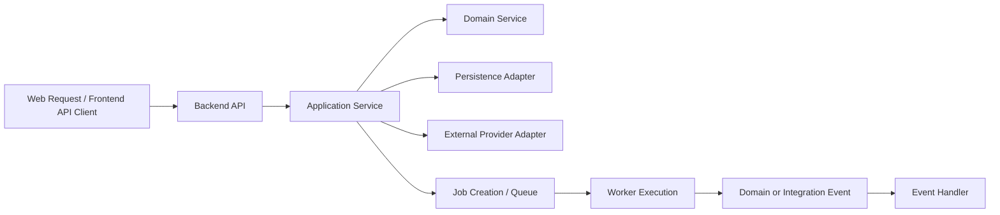

# DevPath Observability Architecture

## 1. Purpose and Scope

### 1.1 Document Purpose

This document defines the authoritative observability architecture for DevPath. It specifies how the platform observes, diagnoses, measures, and explains runtime behavior across the frontend, backend API, background workers, deterministic domain engines, knowledge pipeline, AI pipeline, external providers, data stores, generated artifacts, and administrative operations.

Observability MUST support reliable diagnosis without becoming a source of business truth. Telemetry MUST help engineers and operators understand system behavior, but it MUST NOT calculate scores, replace Rule Engine outputs, replace Career Path Engine outputs, alter AI behavior, or expose sensitive content.

### 1.2 Scope

| Area | Included Observability Scope |
|---|---|
| Frontend | Route navigation, page failures, API failures, authentication expiration, web vitals, user-visible retries |
| Backend API | Request volume, latency, validation failures, authorization denials, correlation, safe errors |
| Background Workers | Job lifecycle, queue delay, duration, retries, dead letters, stale jobs, worker saturation |
| Deterministic Engines | Repository snapshots, feature extraction, Rule Engine, Skill Matrix, Career Engine, Company Readiness |
| Knowledge Pipeline | Source import, normalization, chunking, embedding, vector indexing, retrieval, deletion propagation |
| AI Pipeline | PromptContext creation, prompt composition, validation, provider invocation, response validation, artifacts |
| External Providers | GitHub, Notion, AI providers, Object Storage, notification providers |
| Data Stores | PostgreSQL, Redis, Vector Database, Object Storage, backup and restore observability |
| Security Signals | Authentication failures, authorization denials, suspicious uploads, rate limits, control failures |
| Operations | Dashboards, alerts, SLI/SLO model, runbook inputs, retention, cost controls, verification |

### 1.3 Excluded Topics

This document MUST NOT define production source code, monitoring-agent configuration, vendor-specific alert syntax, dashboard JSON, Prometheus query files, log-pipeline configuration, OpenTelemetry implementation code, cloud deployment manifests, runbook shell commands, complete incident-response policy, complete security architecture, detailed test cases, or contractual SLA guarantees.

### 1.4 Intended Audience

| Audience | Expected Use |
|---|---|
| Backend Engineers | Instrument API, service, domain, persistence, worker, and integration operations |
| Frontend Engineers | Capture safe user-visible errors and correlate browser activity with backend requests |
| AI Engineers | Observe AI reliability, validation outcomes, provider usage, and quality signals safely |
| Data Engineers | Observe ingestion, vector retrieval, database health, cache behavior, and storage operations |
| Operators | Manage dashboards, alerts, incident diagnosis, retention, and telemetry cost |
| QA Engineers | Verify logs, metrics, traces, context propagation, redaction, and alert behavior |
| Security Reviewers | Confirm telemetry redaction, audit separation, and security signal visibility |
| Administrators | Understand administrative operation outcomes without accessing unsafe telemetry |

### 1.5 Authority and References

This document follows the security constraints in `13_Security_Architecture.md` and references prior architecture documents rather than duplicating them. If conflicts exist, the precedence order defined in the task source applies, with `01_SRS.md` and deterministic engine documents taking priority over observability convenience.

## 2. Observability Goals

### 2.1 Goals

| Goal | Description | Measurable Outcome |
|---|---|---|
| System health visibility | Show whether critical runtime components are functioning | Operators can identify API, worker, database, cache, storage, provider, and AI health |
| User-impact detection | Detect failures affecting user journeys before or during user reports | Dashboards and alerts map symptoms to affected journeys |
| Failure diagnosis | Reconstruct failure context across requests, jobs, providers, and stores | Correlation IDs and traces connect frontend, API, workers, and providers |
| Performance analysis | Measure latency and throughput by bounded operation categories | Histograms and traces expose slow operations without sensitive payloads |
| Capacity analysis | Identify saturation in API, workers, queues, databases, storage, providers, and AI usage | Gauges and trends support scaling decisions without unsupported capacity claims |
| Dependency monitoring | Observe GitHub, Notion, AI providers, storage, PostgreSQL, Redis, and Vector DB | Provider failures normalize into stable categories |
| Asynchronous-work visibility | Track job state, queue delay, retries, failures, and result references | Every job exposes status, duration, retry count, failure category, and result reference |
| AI pipeline visibility | Observe AI reliability, token usage, provider latency, validation outcomes, and artifact persistence | Every generation maps to PromptContext, template version, provider, model, validator, and artifact |
| Security-event support | Support investigation of authentication, authorization, upload, rate-limit, and suspicious events | Security logs and audit records remain separate and redacted |
| Incident response | Provide dashboards, alerts, runbook inputs, and correlation references | Each alert has owner, action, recovery condition, and linked runbook |
| Traceability | Preserve deterministic and AI pipeline provenance | Rule/Career/AI outputs are traceable to versions and inputs |
| Cost awareness | Control telemetry volume, AI usage telemetry, and high-cardinality metrics | Retention, sampling, and cardinality budgets are defined |

### 2.2 Concept Distinctions

| Concept | Purpose | Source of Truth? | Storage Responsibility |
|---|---|---:|---|
| Monitoring | Detect known symptoms through metrics, health checks, and alerts | No | Metrics and alerting systems |
| Observability | Diagnose unknown failures using logs, metrics, traces, and context | No | Telemetry platforms |
| Auditing | Preserve authoritative records of sensitive actions | Yes for audit facts only | Audit store with security controls |
| Analytics | Understand product usage patterns | No for business calculations | Product analytics store with privacy controls |
| Debugging | Investigate specific defects or incidents | No | Temporary diagnostic workflows with redaction |

## 3. Observability System Context

### 3.1 Telemetry Producers

| Producer | Telemetry Produced | Sensitive-Data Considerations |
|---|---|---|
| Web Frontend | Route events, user-visible errors, web vitals, API failure references | MUST NOT capture private source content, prompts, generated artifacts, or secrets |
| API Runtime | Request logs, latency metrics, validation failures, traces | MUST avoid request bodies by default |
| Worker Runtime | Job lifecycle logs, queue metrics, execution spans | MUST avoid private payloads and provider tokens |
| Scheduler Runtime | Schedule execution, overlap prevention, missed schedule signals | MUST avoid excessive noise |
| Domain Modules | Operation outcomes, result provenance, expected domain rejections | MUST NOT recalculate or replace business results |
| Integration Adapters | Provider request outcomes, latency, rate limits, normalized errors | MUST redact provider tokens and sensitive provider payloads |
| PostgreSQL | Connection, latency, transaction, rollback, backup/restore signals | MUST not expose query parameters containing sensitive values |
| Redis | Cache latency, hit/miss, memory, eviction, TTL behavior | MUST not expose raw cache values |
| Vector Database | Retrieval latency, indexing status, empty result, metadata filter failure | MUST not expose raw embeddings |
| Object Storage | Upload/download/export/signed URL/deletion results | MUST not log full storage URLs |
| External Providers | GitHub, Notion, storage, notification health and errors | MUST normalize provider errors |
| AI Providers | Latency, timeout, rate limit, token usage, validation outcomes | MUST not log hidden prompts or private context by default |

### 3.2 Telemetry Consumers

| Consumer | Use Case | Access Limitation |
|---|---|---|
| Developers | Debug application behavior and regressions | Redacted operational telemetry only |
| Operators | Monitor health, capacity, cost, and incidents | Operational and security signals as authorized |
| Security Reviewers | Investigate suspicious behavior and redaction compliance | Security logs and audit metadata |
| Administrators | Review admin operation outcomes | Audit summaries, not raw private content |
| Incident Responders | Diagnose and recover from incidents | Need-to-know telemetry access |
| Future Product Analysts | Understand aggregate usage patterns | Privacy-reviewed analytics only |

### 3.3 Trust and Privacy Boundaries

Telemetry crosses trust boundaries from untrusted browsers, provider adapters, AI providers, background workers, and storage systems into observability platforms. All telemetry MUST follow `13_Security_Architecture.md`: secrets, OAuth tokens, authorization headers, raw private repository content, raw Notion content, hidden prompts, raw embeddings, and sensitive generated content MUST NOT be logged by default.

## 4. Telemetry Model

### 4.1 Primary Signals

| Signal | Used For | Not Used For |
|---|---|---|
| Logs | Detailed events, failures, diagnostic context, state transitions | Metric aggregation when bounded metrics exist; audit authority |
| Metrics | Trends, rates, latency, saturation, capacity, availability | Debugging private payloads; per-user behavior tracking |
| Traces | Request causality, cross-component latency, dependency analysis, async continuation | Storing business data or sensitive payloads |

### 4.2 Related Signal Types

| Signal | Purpose | Separation Rule |
|---|---|---|
| Audit Events | Authoritative record of sensitive business or administrative action | MUST be separate from operational logs |
| Security Events | Security-control failures and suspicious behavior | SHOULD feed security review and alerting with redaction |
| Product Analytics | Aggregate usage and funnel analysis | MUST NOT contain private source content or become business authority |

## 5. Common Observability Context

| Context Field | Origin | Propagation | Logs | Metrics | Traces | Audit | Privacy/Cardinality Rule |
|---|---|---|---:|---:|---:|---:|---|
| trace_id | Trace entry point | All spans | Yes | No | Yes | Reference only | Not user-facing by default |
| span_id | Trace span | Current component | No | No | Yes | No | Internal only |
| request_id | API gateway/backend | Request lifecycle | Yes | No | Yes | Maybe | May be safe support reference |
| correlation_id | Frontend/API/job root | Request, job, event | Yes | No | Yes | Yes | User-safe if opaque |
| user_reference | Identity service | Authenticated operations | Pseudonymized | No label | Attribute if needed | Yes | No raw email as metric label |
| session_reference | Identity/session layer | Session lifecycle | Pseudonymized | No label | Attribute if needed | Maybe | Must not be session token |
| job_id | Job creation | Queue and worker | Yes | No label | Yes | Maybe | Avoid high-cardinality metric label |
| event_id | Event publisher | Event consumers | Yes | No label | Yes | Maybe | Opaque reference only |
| repository_id | Repository context | Repo operations | Maybe | No label | Attribute if needed | Maybe | Avoid metrics label |
| repository_snapshot_id | Snapshot creation | Analysis pipeline | Yes | No label | Yes | Maybe | No public exposure unless safe |
| analysis_id | Analysis creation | Domain and dashboard | Yes | No label | Yes | Maybe | Opaque reference |
| prompt_context_id | PromptContext creation | AI pipeline | Yes | No label | Yes | Maybe | MUST NOT expose hidden prompt |
| generation_id | AI request | AI and artifact pipeline | Yes | No label | Yes | Maybe | Opaque reference |
| artifact_id | Artifact creation | Artifact operations | Yes | No label | Yes | Yes for publication | Public only if artifact is public |
| provider_reference | Adapter | Provider operations | Normalized | Bounded provider label | Yes | Maybe | No raw URL/token |
| application_version | Build/release | All runtimes | Yes | Yes | Yes | Yes | Bounded |
| environment | Runtime config | All telemetry | Yes | Yes | Yes | Yes | Bounded |
| module | Runtime/module | All telemetry | Yes | Yes | Yes | Yes | Bounded |
| operation | Component | All telemetry | Yes | Yes | Yes | Yes | Bounded |
| result_status | Operation end | All telemetry | Yes | Yes | Yes | Yes | Bounded |
| error_category | Error handler | Failures | Yes | Yes | Yes | Maybe | Stable enum only |

## 6. Correlation and Context Propagation

### 6.1 Correlation Flow

### 6.2 Propagation Requirements

| Propagation Area | Requirement |
|---|---|
| Synchronous propagation | HTTP requests MUST carry or receive a request/correlation context and attach it to logs and traces |
| Asynchronous propagation | Job creation MUST persist correlation context, causation reference, job type, retry attempt, and owner reference |
| Parent-child traces | Synchronous child spans SHOULD link to the parent request span |
| Correlation continuation | Worker traces SHOULD link to the original request or scheduled root |
| Event causation | Events SHOULD include causation and correlation references without sensitive payloads |
| Retry context | Retries MUST include retry attempt and original job reference |
| Batch context | Batch jobs SHOULD include batch reference and bounded item counts |
| Scheduled context | Scheduled jobs SHOULD include schedule name and execution window |
| User-safe support reference | User-facing errors SHOULD expose a safe support reference derived from request or correlation context |

## 7. Structured Logging Architecture

### 7.1 Standard Log Record

| Field | Requirement |
|---|---|
| timestamp | Server-side event time |
| severity | TRACE, DEBUG, INFO, WARN, ERROR, or CRITICAL |
| service/runtime | Frontend, API, worker, scheduler, adapter, or provider category |
| module | Bounded module name |
| operation | Stable operation name |
| message | Human-readable summary without secrets |
| trace_id | Present when trace context exists |
| correlation_id | Present for request, job, or event workflows |
| request_id or job_id | Present based on execution mode |
| result | Success, expected_failure, system_failure, denied, rejected, cancelled, timeout |
| duration | Included for completed operations where relevant |
| error_category | Stable enum for failures |
| retry_attempt | Included for retryable work |
| application_version | Current application version |
| environment | Local, test, staging, production, or equivalent bounded value |

### 7.2 Log Categories

| Category | Purpose | Owner |
|---|---|---|
| Request Log | API request outcome, status, duration, correlation | Backend |
| Application Log | Use-case execution outcome and system failures | Backend |
| Domain-Operation Log | Significant domain operation completion and expected rejection | Domain module owner |
| Worker Log | Job lifecycle, retry, dead-letter, cancellation | Worker owner |
| Integration Log | Provider request outcome and normalized error | Integration owner |
| Database Log | Slow operations, transaction errors, connection issues | Data/Ops |
| AI-Operation Log | AI generation lifecycle and validation outcome | AI owner |
| Security Log | Authentication, authorization, suspicious activity | Security |
| Startup/Shutdown Log | Runtime lifecycle and configuration activation summary | Ops |

Controllers MUST NOT log sensitive request bodies. Domain services SHOULD log significant operation outcomes, not every branch. Duplicate logging of the same failure at every layer SHOULD be avoided by logging at ownership boundaries.

## 8. Log Severity and Event Policy

### 8.1 Severity Policy

| Severity | Intended Use | Production Expectation | Example | Alert Eligibility | Retention Category |
|---|---|---|---|---|---|
| TRACE | Deep local diagnostics | Disabled by default in production | Internal branch timing | No | Short/debug TBD |
| DEBUG | Developer diagnostics | Restricted and sampled in production | Sanitized adapter details | No | Short/debug TBD |
| INFO | Significant normal outcome | Enabled for important state transitions | Repository sync completed | Rarely | Operational TBD |
| WARN | Recoverable or degraded condition | Enabled | Provider rate limit, retry scheduled | Sometimes | Operational/security TBD |
| ERROR | Failed operation requiring investigation | Enabled | Analysis job failed unexpectedly | Yes when symptomatic | Operational TBD |
| CRITICAL | Severe service, security, or data-integrity incident | Enabled and routed | Cross-user isolation failure | Yes | Security/incident TBD |

### 8.2 Significant Events

| Event | Log Category | Severity Baseline | Notes |
|---|---|---|---|
| Authentication failure | Security Log | WARN | Avoid revealing account existence |
| Authorization denial | Security Log | WARN | Include safe target category |
| Repository synchronization start/completion | Worker Log | INFO | Include job and repository references |
| Analysis start/completion | Worker/Domain Log | INFO | Include analysis and snapshot references |
| Rule Engine execution completion | Domain Log | INFO | Include rule version and input snapshot reference |
| Career Engine execution completion | Domain Log | INFO | Include career/company profile versions |
| Knowledge ingestion completion | Worker Log | INFO | Include counts, not content |
| AI provider invocation outcome | AI Log | INFO/WARN/ERROR | Include provider/model and outcome |
| Response validation rejection | AI Log | WARN | Include validator version and category |
| Artifact publication | Audit + App Log | INFO | Audit is authoritative |
| Worker retry exhaustion | Worker Log | ERROR | Include dead-letter reference |
| Scheduler overlap prevention | Scheduler Log | WARN | Include schedule and window |
| Dependency circuit opening | Integration Log | WARN/ERROR | Include provider category |
| Configuration activation | Audit + Startup Log | INFO | Audit for sensitive config |

## 9. Sensitive Data and Redaction

### 9.1 Telemetry Data Handling

| Data Category | Allowed | Masked | Hashed/Pseudonymized | Prohibited | Explicit Approval Sampling |
|---|---|---|---|---|---|
| OAuth tokens | No | No | No | Always | Not allowed |
| API keys | No | No | No | Always | Not allowed |
| Authorization headers | No | No | No | Always | Not allowed |
| Cookies | No | No | No | Always | Not allowed |
| Private repository content | Counts/status only | Snippets prohibited by default | Repo reference only | Raw content | Security-approved incident only |
| Notion page content | Counts/status only | Snippets prohibited by default | Page reference only | Raw content | Security-approved incident only |
| Source-code fragments | Metadata only | No default snippets | File reference if safe | Raw fragments | Security-approved incident only |
| Prompts | Template version and context ID | No hidden prompt body | PromptContext reference | Hidden/raw prompt | Prompt-team approved debug only |
| PromptContext | ID and validation status | No full context | Context reference | Raw context | Prompt-team approved debug only |
| AI responses | Status/category only by default | Redacted excerpts if approved | Generation reference | Full response by default | Owner/security approved only |
| Generated artifacts | Status and artifact ID | No content by default | Artifact reference | Full artifact by default | Owner-approved debug only |
| Resumes | Metadata only | No full content | Artifact reference | Full content | Owner-approved debug only |
| Interview answers | Metadata only | No full content | Generation reference | Full content by default | Owner-approved debug only |
| User email | Avoid | Partial mask | User reference | Metric label | Security-approved support only |
| IP address | Security logs only where needed | Truncated where possible | Region/category preferred | Product analytics by default | Security-approved only |
| File names | Safe normalized name if needed | Mask sensitive segments | File reference | Raw suspicious paths | Support-approved only |
| Storage URLs | Object category only | Short prefix prohibited if sensitive | Object reference | Full signed URL | Not allowed |

### 9.2 Redaction Requirements

Request logging, exception logging, provider logging, frontend telemetry, audit records, and debugging sessions MUST apply redaction before telemetry leaves the runtime boundary. Redaction failures MUST be treated as security-control failures and SHOULD be observable through security signals without reproducing the sensitive data.

## 10. Metrics Architecture

### 10.1 Metric Types

| Metric Type | Use | DevPath Examples |
|---|---|---|
| Counter | Monotonic event count | Requests, failures, jobs completed, provider calls |
| Gauge | Current value | Queue depth, active workers, open circuits |
| Histogram | Distribution | Request latency, job duration, provider latency, payload size |
| Summary | Client-side distribution if supported | Optional latency summaries where platform supports it |
| Derived Rate | Events over time | Error rate, timeout rate, retry rate |
| Ratio | Relationship between counts | Success ratio, validation rejection ratio |

### 10.2 Naming and Labeling Principles

Metrics MUST use stable names, bounded labels, environment and operation dimensions, and separate success, expected failure, and system failure. Metrics MUST avoid user IDs, repository IDs, raw URLs, prompt IDs, artifact IDs, and unbounded exception messages as labels. High-cardinality references MAY appear in logs or traces, not metric labels.

### 10.3 Common Metric Dimensions

| Dimension | Cardinality | Allowed Use |
|---|---:|---|
| environment | Low | All metric groups |
| service | Low | Runtime grouping |
| module | Low/Medium | Backend, worker, AI, knowledge |
| operation | Low/Medium | Stable operation names |
| result_status | Low | success, expected_failure, system_failure, timeout, rejected |
| error_category | Low/Medium | Stable categories only |
| provider | Low | GitHub, Notion, OpenAI, Anthropic, Gemini, local_model, storage |
| model_family | Low/Medium | AI metrics without raw model IDs if unbounded |
| job_type | Low/Medium | Sync, analysis, ingestion, embedding, generation, export |
| route_group | Low/Medium | API category, not raw URL with IDs |

## 11. Platform and API Metrics

| Metric Group | Purpose | Labels | Cardinality Constraint | Dashboard Usage | Alert Suitability | Owner |
|---|---|---|---|---|---|---|
| Request count | Track traffic volume | environment, route_group, method, result_status | No raw path IDs | Platform Health | Indirect | Backend |
| Request latency | Detect slow APIs | environment, route_group, method | Bounded route group | Platform/User Journey | Yes | Backend |
| Response status category | Detect API errors | environment, route_group, status_category | 2xx/3xx/4xx/5xx only | Platform Health | Yes | Backend |
| Authentication failure rate | Detect login issues/abuse | environment, auth_flow, error_category | No email/user label | Security Signals | Yes | Identity/Security |
| Authorization denial rate | Detect IDOR/permission issues | environment, operation, denial_category | Bounded category | Security Signals | Yes | Backend/Security |
| Validation failure rate | Detect client/API contract issues | environment, route_group, validation_category | Bounded | API Quality | Sometimes | Backend |
| API timeout rate | Detect availability degradation | environment, route_group | Bounded | Platform Health | Yes | Backend/Ops |
| Rate-limit rejection rate | Detect abuse and quota friction | environment, limiter_category | Bounded | Security/Abuse | Yes | Backend/Ops |
| Concurrent requests | Observe saturation | environment, service | Low | Platform Health | Yes | Ops |
| Payload-size distribution | Detect abuse and tuning needs | environment, route_group | Bounded | API Diagnostics | Sometimes | Backend |
| Active sessions | Capacity and auth health | environment | No user labels | Identity Health | Rare | Identity |
| Deprecated API usage | Migration visibility | environment, api_version, route_group | Bounded | API Governance | Rare | Backend |

## 12. Background Job and Scheduler Metrics

| Metric Group | Job Types Covered | Purpose | Labels | Owner |
|---|---|---|---|---|
| Queued jobs | Sync, analysis, ingestion, embedding, AI generation, portfolio, resume, export | Backlog visibility | environment, job_type, priority | Worker |
| Running jobs | All worker jobs | Worker utilization | environment, job_type | Worker/Ops |
| Succeeded jobs | All worker jobs | Throughput and completion | environment, job_type | Worker |
| Failed jobs | All worker jobs | Failure trend | environment, job_type, error_category | Worker |
| Cancelled/expired jobs | Long-running jobs | User/system cancellation visibility | environment, job_type, reason_category | Worker |
| Queue delay | All queued jobs | User wait time | environment, job_type | Worker/Ops |
| Execution duration | All worker jobs | Performance and stuck jobs | environment, job_type, result_status | Worker |
| Retry count | Provider/worker jobs | Dependency instability | environment, job_type, error_category | Worker/Integration |
| Timeout count | Provider/AI/search jobs | Dependency and resource failures | environment, job_type | Worker/Ops |
| Dead-letter count | Retry-exhausted jobs | Manual review need | environment, job_type, error_category | Worker |
| Deduplicated jobs | Sync/analysis/generation/export | Idempotency effectiveness | environment, job_type | Worker |
| Stale jobs | Long-running jobs | Operational cleanup | environment, job_type | Worker/Ops |
| Worker concurrency | All workers | Capacity | environment, worker_pool | Ops |
| Scheduler execution | Scheduled jobs | Scheduler health | environment, schedule_name, result_status | Ops |
| Scheduler overlap prevention | Scheduled jobs | Safety behavior | environment, schedule_name | Ops |
| Missed schedule | Scheduled jobs | Reliability | environment, schedule_name | Ops |
| Job age | All queued/running jobs | Stuck work detection | environment, job_type | Worker/Ops |

## 13. Domain Pipeline Metrics

The deterministic domain pipeline is:

RepositorySnapshot → Feature Extraction → Rule Engine → Skill Matrix → Career Engine → Company Readiness → Skill Gap → Learning Roadmap → Recommendation

Metrics MUST NOT recalculate, replace, or reinterpret authoritative scores. They only observe execution behavior and traceability.

| Stage | Count | Duration | Success | Expected Domain Rejection | Unexpected Failure | Version References | Additional Indicators | Owner |
|---|---:|---:|---:|---:|---:|---|---|---|
| RepositorySnapshot | Yes | Yes | Yes | Missing provider permission | Sync failure | snapshot version | repository count, changed files count | Repository |
| Feature Extraction | Yes | Yes | Yes | Unsupported file/source | Parser failure | extractor version, snapshot ID | missing-data indicator | Repository/Rule |
| Rule Engine | Yes | Yes | Yes | Insufficient evidence | Rule execution failure | rule version, snapshot ID | evidence count | Rule |
| Skill Matrix | Yes | Yes | Yes | Insufficient source data | Matrix generation failure | rule version, matrix version | skill count | Rule |
| Career Engine | Yes | Yes | Yes | Missing career profile | Career evaluation failure | career profile version | target career | Career |
| Company Readiness | Yes | Yes | Yes | Missing company profile | Company evaluation failure | company profile version | company target | Company |
| Skill Gap | Yes | Yes | Yes | No applicable gap | Gap analysis failure | matrix/career versions | gap count | Career |
| Learning Roadmap | Yes | Yes | Yes | No roadmap generated | Roadmap failure | roadmap rule version | step count | Learning |
| Recommendation | Yes | Yes | Yes | Insufficient evidence | Recommendation failure | recommendation version | recommendation count | Recommendation |

Fallback behavior MUST be logged as a bounded result status and MUST NOT silently change deterministic results.

## 14. Knowledge Pipeline Metrics

The knowledge pipeline is:

Source Import → Normalization → Chunking → Embedding → Vector Indexing → Retrieval

| Metric | Purpose | Labels | Cardinality Rule | Owner |
|---|---|---|---|---|
| Imported documents | Source ingestion volume | source_type, result_status | No document IDs | Knowledge |
| Rejected documents | Validation and security insight | source_type, rejection_category | Bounded category | Knowledge/Security |
| Normalized documents | Normalization throughput | source_type, result_status | Bounded | Knowledge |
| Chunks created | Chunking volume | source_type, chunk_strategy_version | Bounded version | Knowledge |
| Duplicate chunks | Deduplication behavior | source_type, duplicate_category | Bounded | Knowledge |
| Embedding requests | Embedding workload | provider, model_family, result_status | Bounded provider/model family | AI/Knowledge |
| Embedding failures | Provider/data issues | provider, error_category | Bounded | AI/Knowledge |
| Indexing duration | Vector indexing latency | source_type, index_operation | Bounded | Knowledge |
| Indexed-document count | Index coverage | source_type, result_status | Bounded | Knowledge |
| Retrieval latency | User-facing search/context performance | retrieval_type, result_status | Bounded | Knowledge |
| Result count | Retrieval usefulness | retrieval_type, bucketed_result_count | Bucketed only | Knowledge |
| Empty retrieval | Missing context detection | retrieval_type, reason_category | Bounded | Knowledge |
| Authorization-filter rejection | Access-control visibility | source_type, denial_category | No user IDs | Knowledge/Security |
| Re-indexing | Freshness operations | source_type, result_status | Bounded | Knowledge |
| Source deletion propagation | Privacy/deletion assurance | source_type, result_status | Bounded | Knowledge/Data |

Raw document content and embeddings MUST NOT appear in telemetry.

## 15. AI Pipeline Observability

### 15.1 AI Pipeline Stages

PromptContext Creation → Prompt Composition → Prompt Validation → Provider Selection → LLM Invocation → Response Validation → Artifact Persistence

| Stage | Required Observability |
|---|---|
| PromptContext Creation | generation request, PromptContext ID, context source categories, token budget category, validation outcome |
| Prompt Composition | prompt template version, variable completeness, composition result, token estimate bucket |
| Prompt Validation | validation version, rejection category, unsafe instruction category |
| Provider Selection | provider, model, fallback eligibility, reason category |
| LLM Invocation | provider latency, timeout, rate limit, provider error category, input/output token count |
| Response Validation | schema validation, grounding warning, forbidden-claim detection, score consistency outcome |
| Artifact Persistence | artifact ID, artifact type, persistence result, publication state |

### 15.2 AI Metrics and Traceability

| Signal | Requirement |
|---|---|
| Generation requests | Count by task type, provider, model family, result status |
| Generation success/failure | Separate provider failure, validation failure, user cancellation, and persistence failure |
| Provider latency | Histogram by provider and task type |
| Token usage | Input/output token counts MAY be measured by task type and provider |
| Retry count | Include retry/fallback attempts without raw prompt content |
| Fallback provider usage | Track fallback reason and outcome |
| Validation rejection | Track validator version and rejection category |
| Artifact failure | Track artifact type and failure category |

Every generation MUST be traceable to PromptContext, prompt template version, provider, model, response validation version, and artifact result. Hidden prompts and private context MUST NOT be stored in metrics.

## 16. AI Quality and Reliability Separation

| Category | Signals | Interpretation | Authority Limit |
|---|---|---|---|
| System Reliability | Provider success, latency, timeout, schema validity, job completion, artifact persistence | Measures whether AI pipeline executed reliably | Does not evaluate career readiness |
| Output Quality | Evidence coverage, grounding validation, forbidden-claim detection, user feedback, review acceptance, regeneration rate | Measures perceived or validated usefulness | Not a repository, skill, or career score |

| Quality Signal | Type | Use |
|---|---|---|
| Evidence coverage | Automated | Detect whether output references available evidence |
| Grounding validation | Automated/heuristic | Detect unsupported claims |
| Forbidden-claim detection | Automated | Detect score calculation or hidden-authority claims |
| User feedback | User-reported | Product improvement only |
| Review acceptance | Administrator-reviewed where applicable | Prompt/version quality review |
| Regeneration rate | Heuristic | Usability signal, not business score |

Subjective AI quality metrics MUST NOT become authoritative career, repository, skill, readiness, or portfolio scores.

## 17. External Provider Observability

| Provider Category | Examples | Required Signals | User Impact Mapping |
|---|---|---|---|
| GitHub | GitHub API/OAuth | request count, latency, timeout, rate limit, auth failure, permission failure, invalid response, circuit state, retry count | Repository sync and analysis freshness |
| Notion | Notion API/OAuth | request count, latency, timeout, rate limit, auth failure, permission failure, invalid response, retry count | Documentation and learning-note freshness |
| Commercial AI | OpenAI, Anthropic, Gemini | request count, latency, timeout, rate limit, provider error, quota usage, fallback usage | AI generation and artifact creation |
| Local AI | Ollama, Qwen, Llama, Mistral | runtime health, latency, timeout, model load failure, resource saturation | Local generation availability |
| Object Storage | Storage provider | upload/download success, signed URL creation, unavailable object, deletion failure | Export and artifact availability |
| Notification Provider | Future notification adapter | delivery count, failure, latency, rate limit | User/admin notification delivery |

Provider-specific errors MUST be normalized into stable internal categories such as authentication_failure, permission_denied, rate_limited, timeout, invalid_response, provider_unavailable, quota_exceeded, and unknown_provider_failure.

## 18. Database, Cache, and Storage Observability

### 18.1 PostgreSQL

| Signal | Purpose |
|---|---|
| Connection usage | Detect pool saturation |
| Query latency | Identify slow operations |
| Slow operation count | Track performance regressions |
| Transaction duration | Identify long-running transactions |
| Rollback count | Detect application or data issues |
| Lock wait | Identify contention |
| Deadlock | Detect concurrency faults |
| Storage growth | Capacity planning |
| Backup result | Operational reliability |
| Restore verification | Recovery confidence |

### 18.2 Redis

| Signal | Purpose |
|---|---|
| Operation latency | Cache performance |
| Cache hit/miss | Cache effectiveness |
| Memory usage | Capacity and eviction risk |
| Eviction | Data pressure or TTL issues |
| Connection failure | Availability |
| Stale cache | Authorization or freshness risk |
| Key-expiration behavior | TTL policy validation |

### 18.3 Vector Database

| Signal | Purpose |
|---|---|
| Query latency | Retrieval performance |
| Indexing latency | Ingestion performance |
| Index size | Capacity and growth |
| Retrieval failure | User-facing context failure |
| Empty result | Relevance/source availability |
| Metadata-filter failure | Authorization and metadata quality |
| Re-index status | Freshness and deletion propagation |

### 18.4 Object Storage

| Signal | Purpose |
|---|---|
| Upload success | Artifact and import reliability |
| Download success | User export availability |
| Signed-URL generation | Temporary access reliability |
| Expired access | Expected expiration behavior |
| Storage growth | Capacity and cost |
| Deletion failure | Privacy and retention risk |
| Unavailable object | Broken artifact/export detection |
| Export duration | User-facing export performance |

## 19. Frontend Observability

| Frontend Signal | Purpose | Privacy Restriction |
|---|---|---|
| Route navigation | Understand journey completion and load failures | No private route parameters as labels |
| Route loading failure | Detect broken UI bundles/routes | No source content |
| API failure | Link user-visible error to backend request | Use safe correlation reference |
| Authentication expiration | Diagnose session friction | No tokens |
| Form submission failure | Detect validation and UX issues | No full form bodies |
| Unhandled exception | Detect runtime defects | Redact user content |
| Page performance | Track user-visible latency | Aggregate only |
| Web vitals | Understand browser performance | No private content |
| Async-job abandonment | Identify long-running job UX issues | Job type only |
| Generation abandonment | Identify AI wait-time friction | Task type only |
| User-visible retry | Detect recoverability | Operation category only |
| Download failure | Diagnose export/artifact access | No full signed URL |
| Accessibility diagnostics | Improve accessibility reliability | No private user content |

Frontend telemetry SHOULD carry session correlation and backend trace-link references where safe. Source-map access SHOULD be restricted to authorized debugging users. Sampling SHOULD be more conservative in production than local development.

## 20. Distributed Tracing Architecture

### 20.1 Trace Span Catalog

| Operation | Span Requirement | Sensitive Attribute Rule |
|---|---|---|
| HTTP request | Root or server span with route group and result | No raw URL IDs if sensitive |
| Authentication | Auth span with flow and result | No credentials |
| Authorization | Authz span with decision category | No private policy details |
| Application service | Use-case span | No request bodies |
| Domain service | Domain operation span | Reference versions, not source content |
| Repository operation | Persistence span | No raw query parameters |
| Cache operation | Cache span | No cache values |
| External provider request | Adapter span | No tokens or raw provider response |
| Job enqueue | Producer span | Include job type and correlation |
| Job execution | Worker span linked to original context | Include retry attempt |
| Event publication | Event span | Include event type only |
| Event consumption | Consumer span linked to event | Include result |
| AI provider invocation | Provider span | No hidden prompt/private context |
| Response validation | Validator span | Include validator version and category |
| Artifact persistence | Storage span | No full storage URL |

### 20.2 Tracing Rules

Span names SHOULD be stable and operation-oriented. Span attributes MUST use bounded values. Error status MUST distinguish expected domain rejection, validation rejection, provider failure, timeout, cancellation, and unexpected system failure. Long-running jobs SHOULD use linked traces or persisted correlation context. Retry attempts SHOULD be represented as attempts under the same job correlation. Trace retention categories are TBD and MUST respect sensitive-data constraints.

## 21. Audit and Observability Separation

| Signal Type | Purpose | Mutability | Examples | Retention Relationship |
|---|---|---|---|---|
| Operational Log | Debugging, diagnosis, runtime understanding | Mutable by log lifecycle | Request outcomes, job failures, provider timeouts | Standard telemetry retention TBD |
| Security Log | Suspicious behavior and security-control failures | Restricted | Auth failures, authz denials, upload rejections | Security retention TBD |
| Audit Record | Authoritative record of sensitive business/admin action | Append-only expectation | Rule activation, prompt activation, artifact publication | Must not follow normal log deletion |

Audit records are required for provider connection changes, repository archive/restore, career-target changes, company-target changes, rule-version activation, prompt-template activation, artifact publication, and administrative changes. Audit records MUST NOT be deleted or modified through normal log-retention processes.

## 22. SLI, SLO, and Error Budget Model

### 22.1 Initial SLI Catalog

| SLI | Successful Event | Failed Event | Measurement Window | Exclusions | Data Source | User Impact | Target Category |
|---|---|---|---|---|---|---|---|
| Login availability | Login completes and session established | Login system failure | TBD | Invalid credentials, user cancellation | Auth metrics/logs | User cannot access platform | Baseline |
| API availability | Protected API returns expected non-5xx outcome | 5xx/timeout | TBD | Client validation failures | API metrics | Platform operation blocked | Baseline |
| Repository sync completion | Sync job completes with result reference | Sync job system failure/timeout | TBD | Provider permission revoked | Job/provider metrics | Analysis data stale | Baseline |
| Analysis completion | Analysis job completes with Rule output | Unexpected analysis failure | TBD | Insufficient source data expected rejection | Domain/job metrics | Dashboard incomplete | Baseline |
| Dashboard loading | Dashboard data loads successfully | Dashboard API failure/timeout | TBD | Browser offline | Frontend/API metrics | User cannot view progress | Baseline |
| Knowledge ingestion completion | Ingestion/indexing completes | System failure/timeout | TBD | Unsupported document expected rejection | Knowledge/job metrics | AI context incomplete | Experimental |
| AI generation completion | Generation validates and persists result | Provider/system/validation failure | TBD | User cancellation, unsupported request | AI metrics | AI features unavailable | Experimental |
| Artifact download availability | Authorized download succeeds | Storage/API failure or expired incorrectly | TBD | Expected expired URL | Storage/API metrics | Export unavailable | Baseline |

### 22.2 Error Budget Principles

Error budgets are conceptual until SLO targets are approved. Error-budget review SHOULD guide release risk, reliability investment, provider fallback priority, and incident follow-up. This document does not define contractual SLA guarantees.

## 23. Dashboard Architecture

| Dashboard | Audience | Purpose | Owner | Refresh Expectation | Primary Signals | Drill-Down Path |
|---|---|---|---|---|---|---|
| Platform Health | Operators, backend engineers | API, workers, database, cache health | Ops | Near-real-time TBD | API latency, error rate, active workers, DB/cache health | API traces, worker logs, DB metrics |
| User Journey | Product, engineering, support | Detect user-visible journey failures | Product/Backend | Near-real-time TBD | Login, sync, analysis, dashboard, AI, export SLIs | Journey traces and correlated logs |
| Background Work | Worker owners, operators | Queue and job health | Worker | Near-real-time TBD | Queue depth, delay, failures, retries, stale jobs | Job traces and worker logs |
| External Dependencies | Integration owners | Provider health and impact | Integration/Ops | Near-real-time TBD | GitHub, Notion, AI, storage latency/errors | Provider traces/logs |
| AI Operations | AI engineers, operators | AI reliability, usage, validation | AI | Near-real-time TBD | Provider usage, latency, token usage, validation rejection | Generation trace by ID |
| Security Signals | Security reviewers, operators | Suspicious and security-control failures | Security | Near-real-time TBD | Auth failures, authz denials, rate limits, upload rejections | Security logs and audit references |

Dashboards MUST have owners and drill-down paths. Vendor-specific dashboard JSON is out of scope.

## 24. Alerting Architecture

| Alert Category | Signal | Condition Category | Severity | User Impact | Owner | Notification Route | Response Action | Escalation | Suppression | Recovery Condition | Runbook |
|---|---|---|---|---|---|---|---|---|---|---|---|
| Availability | API 5xx/timeout ratio | Symptom | High | Platform unavailable | Ops | TBD | Check platform dashboard | Ops lead | Maintenance window | Error rate normal | API availability |
| Latency | API/job/provider latency | Symptom | Medium/High | Slow user journeys | Backend/Ops | TBD | Identify slow dependency | Backend lead | Known provider incident | Latency normal | Latency diagnosis |
| Error rate | Unexpected failures | Symptom | High | Feature failures | Backend | TBD | Inspect traces/logs | Engineering lead | Release rollback window | Failure ratio normal | Error spike |
| Job backlog | Queue delay/depth | Symptom | Medium/High | Delayed sync/AI/export | Worker | TBD | Scale/triage workers | Ops lead | Planned batch | Queue drains | Job backlog |
| Job failure | Failed/dead-letter jobs | Symptom | Medium/High | Missing results | Worker | TBD | Inspect error categories | Worker lead | Known bad input | Dead letters stop | Job failures |
| Provider outage | Provider timeout/unavailable | Dependency | High | Sync/AI/storage degraded | Integration/Ops | TBD | Open circuit/fallback | Ops lead | Provider status known | Provider recovers | Provider outage |
| Database saturation | Connections/latency/locks | Dependency | High | Broad degradation | Data/Ops | TBD | Triage DB pressure | Data lead | Maintenance | DB metrics normal | DB saturation |
| Cache failure | Redis connection/latency | Dependency | Medium | Slower operations | Backend/Ops | TBD | Degrade to source of truth | Ops lead | Cache maintenance | Cache healthy | Cache failure |
| Vector-store failure | Retrieval/index failures | Dependency | Medium/High | AI context missing | Knowledge | TBD | Disable affected retrieval | AI/Knowledge lead | Re-index planned | Retrieval normal | Vector failure |
| Storage failure | Upload/download/delete failure | Dependency | High | Export/artifact unavailable | Ops | TBD | Inspect storage health | Ops lead | Maintenance | Storage operations normal | Storage failure |
| AI validation spike | Validation rejection ratio | Symptom/Quality | Medium | AI features degraded | AI | TBD | Inspect prompt/template/provider | AI lead | Template rollout | Rejection normal | AI validation |
| Security anomaly | Authz denial/upload/rate-limit spike | Security | High/Critical | Potential attack | Security | TBD | Investigate and contain | Security lead | Known test | Signal normal | Security anomaly |
| Telemetry failure | Log/metric/trace pipeline unavailable | Operational | Medium/High | Reduced diagnosis | Ops | TBD | Restore telemetry pipeline | Ops lead | Planned outage | Telemetry healthy | Telemetry failure |

Alerts MUST be actionable and owned. The platform SHOULD avoid alerting on isolated expected failures.

## 25. Incident Diagnosis and Runbook Requirements

| Incident Category | First Dashboard | Key Metrics | Relevant Logs | Required Trace | Correlation IDs | Likely Causes | Containment | Recovery Validation | Escalation Owner |
|---|---|---|---|---|---|---|---|---|---|
| User cannot log in | User Journey/Security | login failure rate, auth latency | auth/security logs | Login request trace | request_id, correlation_id | Provider issue, session bug, rate limit | Disable broken flow if possible | Successful login test | Identity |
| Repository sync stuck | Background Work | queue delay, job age, provider latency | worker/integration logs | Sync job trace | job_id, repository_id | GitHub issue, token revoked, worker backlog | Pause/retry jobs | Sync completes or expected rejection | Integration |
| Analysis failed | Background Work/Domain | analysis failures, Rule Engine duration | worker/domain logs | Analysis trace | analysis_id, snapshot_id | Missing data, parser failure, rule error | Stop duplicate jobs | Result or expected rejection exists | Rule/Backend |
| Rule Engine result missing | Domain Pipeline | Rule execution count/failure | domain logs | Rule stage trace | analysis_id, snapshot_id | Rule version issue, missing snapshot | Block dependent career job | SkillMatrix generated | Rule |
| Knowledge ingestion failed | Knowledge Pipeline | rejected docs, embedding failures | knowledge/worker logs | Ingestion trace | job_id, document reference | Unsupported doc, provider failure | Quarantine source | Index updated or rejection visible | Knowledge |
| Retrieval returns no results | Knowledge Pipeline | empty retrieval, filter rejection | retrieval logs | Retrieval trace | correlation_id | Authorization filters, missing index | Re-index or explain no context | Expected result or empty reason | Knowledge |
| AI generation timed out | AI Operations | provider timeout, latency, retries | AI/provider logs | Generation trace | generation_id, prompt_context_id | Provider outage, token size | Fallback/cancel | Validated response or safe failure | AI |
| AI output validation failed | AI Operations | validation rejection | AI validator logs | Response validation trace | generation_id | Schema mismatch, injection, grounding issue | Reject output | Safe user error or regenerated output | AI/Prompt |
| Artifact unavailable | User Journey/Storage | download failure, unavailable object | storage/artifact logs | Artifact trace | artifact_id | Deleted object, URL expiry, storage issue | Recreate/revoke URL | Authorized download works | Portfolio/Ops |
| Dashboard partially broken | User Journey/API | dashboard API failures | API/frontend logs | Dashboard API trace | request_id | API regression, partial data failure | Hide broken card safely | Dashboard loads partial/complete | Frontend/Backend |
| Database latency increased | Platform Health | query latency, lock wait | DB/backend logs | Slow request traces | trace_id | Slow query, contention, pool saturation | Reduce load | Latency normal | Data/Ops |
| Provider rate limit exceeded | External Dependencies | rate-limit count, retries | integration logs | Provider span | provider reference, job_id | Quota exhaustion, burst sync | Backoff/circuit | Calls succeed or queued | Integration |
| Worker backlog growing | Background Work | queue depth, job age | worker logs | Job traces | job_id | Worker down, provider slow, job flood | Scale/pause enqueue | Backlog drains | Worker/Ops |

Vendor-specific operational commands are out of scope.

## 26. Sampling, Retention, and Cost Control

| Control | Requirement |
|---|---|
| Trace sampling | SHOULD sample normal traffic and retain higher-value traces for failures and critical journeys |
| Error-biased sampling | SHOULD retain failed, slow, and security-relevant traces at higher rates |
| High-value journey sampling | Login, sync, analysis, AI generation, and export SHOULD receive higher observability priority |
| Log-level control | Production DEBUG/TRACE MUST be restricted and time-limited |
| Debug logging restrictions | Debug sessions MUST follow sensitive-data approval and redaction rules |
| Metric cardinality budgets | Metric labels MUST remain bounded and reviewed |
| Telemetry retention | Retention categories are TBD and MUST differ by operational, security, audit, and debug needs |
| Cold archival | MAY be used for lower-access historical telemetry after privacy review |
| Deletion | Telemetry deletion MUST follow privacy, retention, and audit constraints |
| Cost review | Telemetry volume and AI usage metrics SHOULD be reviewed periodically |
| Environment-specific behavior | Local/test may use shorter retention and more verbose logs than production |

Security logs and audit records MAY require different retention from application telemetry. Exact periods remain TBD.

## 27. Telemetry Failure and Degraded Mode

| Failure Mode | Expected Behavior |
|---|---|
| Log pipeline unavailable | Buffer locally within safe limits or drop low-priority logs; expose telemetry health signal |
| Metrics collection fails | Continue core operations; report metrics exporter health when possible |
| Tracing exporter fails | Continue requests; drop traces before blocking user operations |
| Dashboard backend unavailable | Do not affect core product; expose operator-visible degraded state |
| Telemetry storage saturated | Apply sampling/drop priority and alert operators |
| Time synchronization incorrect | Mark timestamp consistency issue and avoid misleading SLO calculations |
| Correlation context missing | Generate new context and log missing_context category |

Observability failures SHOULD NOT block user requests. Audit-integrity requirements MAY fail closed where explicitly required by `13_Security_Architecture.md`.

## 28. Verification and Testing

### 28.1 Verification Areas

| Verification Area | Expected Validation |
|---|---|
| Structured log schema | Required fields, severity, result, redaction |
| Context propagation | Request to service to provider context continuity |
| Trace continuity | Root and child span relationships |
| Async trace linkage | API request to job to worker to event linkage |
| Metric emission | Required metrics emitted for critical workflows |
| Metric cardinality | Labels remain bounded and do not include IDs |
| Sensitive-data redaction | Tokens, prompts, source content, artifacts are excluded |
| Alert firing | Alert triggers under simulated actionable condition |
| Alert recovery | Alert resolves when condition clears |
| Dashboard data | Dashboards show expected primary signals |
| Job-state visibility | Jobs expose status, duration, retry, failure, result reference |
| Provider failure visibility | Provider timeout/rate-limit/auth failure categories appear |
| AI validation visibility | Validation rejection and grounding warnings observable |
| Telemetry failure handling | Exporter/pipeline failures degrade safely |
| Clock/timestamp consistency | Time skew is detected or flagged |

### 28.2 Critical Workflow Mapping

| Workflow | Logs | Metrics | Traces | Alerts |
|---|---|---|---|---|
| Login | Auth/security logs | Login success/failure/latency | Login request trace | Login availability/security anomaly |
| Repository sync | Worker/integration logs | Queue, provider, sync completion | Sync job trace | Job backlog/provider outage |
| Analysis | Worker/domain logs | Domain stage metrics | Analysis trace | Job failure/domain failure |
| Knowledge ingestion | Knowledge/worker logs | Ingestion, embedding, indexing | Ingestion trace | Knowledge failure/provider outage |
| AI generation | AI/provider logs | Provider, token, validation metrics | Generation trace | AI timeout/validation spike |
| Artifact export | Artifact/storage logs | Download/export metrics | Export trace | Storage failure |
| Admin operation | Audit/security logs | Admin operation category counts | Admin request trace | Security anomaly |

Detailed tests belong to the future test architecture document.

## 29. Responsibility and Ownership Matrix

| Responsibility | Implementation Owner | Operational Owner | Alert Owner | Review Owner | Escalation Owner |
|---|---|---|---|---|---|
| Instrumentation | Engineering leads | Ops | Module owner | Architecture | Engineering Lead |
| Log schema | Backend/Ops | Ops | Ops | Security | Ops Lead |
| Metric schema | Backend/Ops | Ops | Module owner | Architecture | Ops Lead |
| Trace propagation | Backend/Frontend/Worker | Ops | Backend | Architecture | Backend Lead |
| Frontend telemetry | Frontend | Ops | Frontend | Privacy/Security | Frontend Lead |
| Backend telemetry | Backend | Ops | Backend | Security | Backend Lead |
| Worker telemetry | Worker/Backend | Ops | Worker | Architecture | Worker Lead |
| Database monitoring | Data/Ops | Ops | Data/Ops | Security | Data Lead |
| Provider monitoring | Integration/AI | Ops | Integration/AI | Architecture | Integration Lead |
| AI monitoring | AI | Ops | AI | Security/Prompt | AI Lead |
| Dashboards | Owning module | Ops | Dashboard owner | Product/Ops | Ops Lead |
| Alerts | Owning module | Ops | Alert owner | Ops/Security | Alert owner lead |
| Runbooks | Owning module | Ops | Alert owner | Ops | Module Lead |
| Retention | Ops/Data | Ops | Ops | Security/Privacy | Ops Lead |
| Privacy review | Product/Security | Security | Security | Privacy owner | Product Owner |
| Incident response | Security/Ops | Ops | Incident owner | Security | Security Lead |
| Telemetry cost | Ops | Ops | Ops | Product/Engineering | Ops Lead |

No alert or dashboard MAY exist without an owner.

## 30. Traceability, Open Issues, and Final Review

### 30.1 Requirement to Observability Traceability

| Requirement Area | User Journey | Log Requirement | Metric Requirement | Trace Requirement | Dashboard | Alert | Owner |
|---|---|---|---|---|---|---|---|
| User Management | Login/session | Auth logs | Login availability/failure | Login trace | User Journey/Security | Login availability | Identity |
| GitHub Integration | Repository sync | Integration/worker logs | Provider/sync/job metrics | Sync job trace | External Dependencies/Background Work | Provider outage/job backlog | Integration |
| Notion Integration | Notion import | Integration/knowledge logs | Provider/ingestion metrics | Import trace | External Dependencies/Knowledge | Provider outage | Integration |
| Rule Engine | Analysis | Domain logs | Rule execution metrics | Domain pipeline trace | Domain Pipeline | Analysis failure | Rule |
| Career Engine | Readiness/roadmap | Domain logs | Career stage metrics | Career trace | Domain Pipeline | Domain failure | Career |
| Knowledge | RAG context | Knowledge logs | Retrieval/index metrics | Retrieval trace | Knowledge Pipeline | Vector-store failure | Knowledge |
| AI | Generation | AI logs | Provider/token/validation metrics | Generation trace | AI Operations | AI validation spike | AI |
| Portfolio/Artifacts | Export/publication | Artifact/storage logs and audit | Export/download metrics | Artifact trace | User Journey/Storage | Storage failure | Portfolio |
| Administration | Config/rule/prompt changes | Audit/security logs | Admin operation counts | Admin request trace | Security Signals | Security anomaly | Admin/Security |

### 30.2 Backend Operation to Telemetry Mapping

| Module | Application Service | Operation | Correlation Context | Metrics | Logs | Spans | Failure Visibility |
|---|---|---|---|---|---|---|---|
| Identity | Auth service | Login/session restore/logout | request_id, correlation_id | auth success/failure/latency | auth/security logs | auth span | Login dashboard and alert |
| Repository | Sync service | Sync repositories | job_id, repository_id | sync count/duration/failure | worker/integration logs | sync/job/provider spans | Job/provider dashboards |
| Rule | Analysis service | Execute rule analysis | analysis_id, snapshot_id | stage count/duration/failure | domain logs | rule stage span | Domain dashboard |
| Career | Readiness service | Generate readiness/roadmap | analysis_id | career stage metrics | domain logs | career stage span | Domain dashboard |
| Knowledge | Ingestion/retrieval service | Ingest/retrieve context | job_id/correlation_id | ingestion/retrieval metrics | knowledge logs | ingestion/retrieval spans | Knowledge dashboard |
| Prompt | Prompt service | Compose/validate prompt | prompt_context_id | prompt validation metrics | AI/prompt logs | prompt spans | AI dashboard |
| AI | Generation service | Invoke provider/validate response | generation_id | provider/token/validation metrics | AI logs | provider/validator spans | AI dashboard |
| Artifact | Artifact service | Persist/export/publish | artifact_id | artifact/download metrics | artifact logs/audit | artifact/storage spans | User Journey dashboard |
| Admin | Admin service | Activate config/rule/prompt | request_id | admin operation metrics | audit/security logs | admin span | Security dashboard |

### 30.3 Security Control to Telemetry Mapping

| Security Control | Event | Log or Audit Signal | Alert | Retention Category | Owner |
|---|---|---|---|---|---|
| Backend authentication | Login failure/success | Security log | Login anomaly | Security TBD | Identity/Security |
| Backend authorization | Authorization denial | Security log | Security anomaly | Security TBD | Backend/Security |
| OAuth token protection | Connect/disconnect/refresh failure | Audit/security log | OAuth failure spike | Audit/security TBD | Integration |
| Retrieval authorization | Filter rejection | Knowledge/security log | Retrieval denial anomaly | Security TBD | Knowledge |
| Prompt injection defense | Validation rejection/forbidden claim | AI/security log | AI validation spike | Security/AI TBD | AI/Prompt |
| Upload security | Scan rejection | Security log | Suspicious upload spike | Security TBD | Backend/Security |
| Artifact publication approval | Publish/unpublish | Audit record | Publication anomaly if needed | Audit TBD | Portfolio |
| Secret redaction | Redaction failure | Security log | Telemetry security failure | Security TBD | Ops/Security |
| Admin change audit | Rule/prompt/config activation | Audit record | Admin anomaly if needed | Audit TBD | Admin/Security |

### 30.4 Open Issues and ADR Candidates

| Issue ID | Context | Options | Recommendation | Impact | Owner | Status | ADR Candidate |
|---|---|---|---|---|---|---|---|
| OBS-OI-001 | Telemetry platform | Open-source stack, managed platform, hybrid | Decide before production deployment | Tooling and cost | Ops | Open | Yes |
| OBS-OI-002 | OpenTelemetry adoption | Full, partial, later adoption | Prefer vendor-neutral tracing model | Instrumentation consistency | Architecture/Ops | Open | Yes |
| OBS-OI-003 | Log storage | Local/dev only, centralized, managed | Centralized for production maturity | Incident diagnosis | Ops | Open | Yes |
| OBS-OI-004 | Metric storage | Self-hosted, managed, hybrid | Select with retention/cost review | Alerting and dashboards | Ops | Open | Yes |
| OBS-OI-005 | Trace backend | None, sampled tracing, full tracing | Sampled tracing for critical paths | Diagnosis quality | Ops | Open | Yes |
| OBS-OI-006 | Frontend error monitoring | Custom, managed, open-source | Choose privacy-reviewed option | UX diagnosis | Frontend/Ops | Open | Yes |
| OBS-OI-007 | Sampling policy | Fixed, adaptive, error-biased | Error-biased and journey-aware | Cost and fidelity | Ops | Open | Yes |
| OBS-OI-008 | Retention periods | Short, medium, long, mixed | Define by telemetry category | Cost/privacy | Ops/Security | Open | Yes |
| OBS-OI-009 | Alert channels | Email, chat, incident platform | TBD by operations model | Response time | Ops | Open | Yes |
| OBS-OI-010 | On-call model | Best-effort, rotating, formal | Define before production SaaS | Incident ownership | Ops/Product | Open | Yes |
| OBS-OI-011 | SLO targets | Experimental, baseline, mature | Start baseline, refine with data | Reliability planning | Product/Ops | Open | Yes |
| OBS-OI-012 | AI cost measurement | Provider reports, internal estimates, hybrid | Track provider-reported plus estimates | Cost control | AI/Ops | Open | Yes |
| OBS-OI-013 | Long-term audit storage | Same store, separate store, archive | Separate audit retention strategy | Security and governance | Security/Ops | Open | Yes |

### 30.5 Final Completeness Checklist

| Check | Result |
|---|---|
| Every critical user journey has logs, metrics, and trace expectations | Complete |
| Every async job exposes state, duration, retry, and failure | Complete |
| Every external provider has health and error signals | Complete |
| Rule Engine results are traceable to rule version and snapshot | Complete |
| Career Engine results are traceable to profile versions | Complete |
| AI generations are traceable to context, template, provider, model, and validator | Complete |
| Private content is excluded from telemetry | Complete |
| Secrets are redacted | Complete |
| Metrics use bounded cardinality | Complete |
| Audit records are separate from logs | Complete |
| Alerts are actionable and owned | Complete |
| Dashboards have owners and drill-down paths | Complete |
| Frontend and backend correlation is defined | Complete |
| Partial failures are observable | Complete |
| Telemetry failure behavior is defined | Complete |
| SLI and SLO concepts are defined without unsupported guarantees | Complete |
| Terminology matches prior documents | Complete |
| Unsupported features were not introduced | Complete |

### 30.6 Final Metrics

| Metric | Count |
|---|---:|
| Critical user journey count | 8 |
| Log-event category count | 9 |
| Metric group count | 58 |
| Traced-operation count | 15 |
| Dashboard count | 6 |
| Alert category count | 13 |
| SLI count | 8 |
| Unresolved issue count | 13 |
| Sensitive-data protection summary | 18 sensitive categories restricted, masked, pseudonymized, or prohibited from default telemetry |

### 30.7 Final Architectural Assertion

DevPath observability is designed to make user-visible outcomes, deterministic pipeline execution, asynchronous jobs, external dependencies, knowledge retrieval, AI generation, security events, and operational degradation diagnosable without exposing sensitive content or altering business authority. Logs provide detail, metrics provide trends, traces provide causality, audit records provide authoritative action history, and none of these telemetry signals replace the Rule Engine, Career Path Engine, Knowledge Architecture, Security Architecture, or AI validation boundaries.
