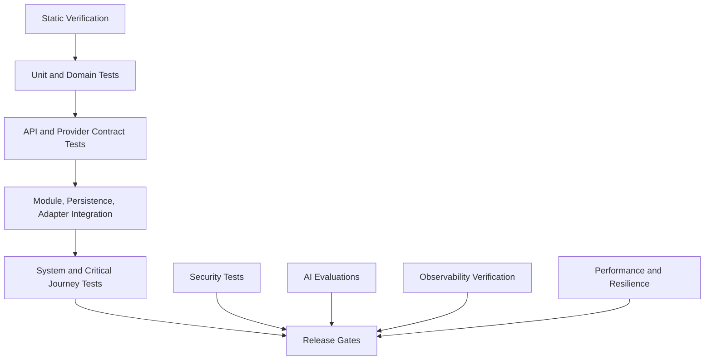
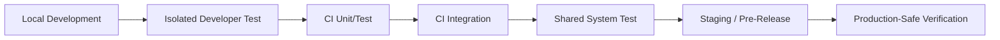

# DevPath Test Architecture

## 1. Purpose and Scope

### 1.1 Document Purpose

This document defines the authoritative test architecture for DevPath. It specifies how the platform verifies deterministic domain behavior, repository analysis, Rule Engine calculations, Career Path Engine calculations, API contracts, backend modules, persistence, frontend behavior, asynchronous jobs, external integrations, knowledge retrieval, prompt construction, AI response validation, security controls, observability behavior, performance, resilience, and release readiness.

Testing MUST verify behavior against the authoritative architecture documents. Tests MUST NOT become the source of business truth, MUST NOT recalculate authoritative scores outside the Rule Engine, and MUST NOT rely on AI to prove deterministic correctness.

### 1.2 Scope

| Area | Included Test Scope |
|---|---|
| Domain | Entities, value objects, aggregates, invariants, lifecycle transitions, events |
| Rule Engine | Deterministic scoring, rule categories, thresholds, evidence, versioning, reproducibility |
| Career Path Engine | Career/company readiness, skill gaps, roadmaps, recommendations, target changes |
| Repository Analysis | Synchronization, snapshots, feature extraction, evidence persistence, historical analysis |
| API | Contract, authentication, authorization, errors, async jobs, uploads, downloads, compatibility |
| Backend | Application services, transactions, module boundaries, ports, events, error mapping |
| Persistence | PostgreSQL, Redis, Vector Database, Object Storage behavior |
| Async Work | Job lifecycle, retries, cancellation, timeouts, deduplication, dead letters |
| Integrations | GitHub, Notion, AI providers, Object Storage, notification providers through adapters |
| Knowledge | Import, normalization, chunking, embedding, indexing, retrieval, authorization, deletion |
| Prompt and AI | Context assembly, prompt composition, provider abstraction, validation, AI evaluation |
| Frontend | Routes, states, auth flows, accessibility, API integration, AI/deterministic labeling |
| Security | Identity, authorization, IDOR, OAuth, uploads, prompt injection, data isolation |
| Observability | Logs, metrics, traces, correlation, alerts, audit separation |
| Release | Quality gates, reporting, coverage, regression, flaky-test policy |

### 1.3 Excluded Topics

This document MUST NOT define production source code, executable test suites, framework-specific test files, CI/CD pipeline files, mock-server implementations, benchmark scripts, penetration-test exploit code, production secrets, full test-case catalogs, manual QA scripts for every screen, or contractual quality guarantees.

### 1.4 Intended Audience

| Audience | Expected Use |
|---|---|
| Backend Engineers | Implement and maintain backend, domain, persistence, API, and worker tests |
| Frontend Engineers | Implement route, feature, state, accessibility, and browser-level tests |
| AI Engineers | Implement prompt, context, provider, validator, and AI evaluation tests |
| QA Engineers | Own system testing, regression strategy, release gates, coverage evidence |
| Security Reviewers | Validate threat-to-test mapping and security test coverage |
| Operators | Validate observability, resilience, deployment readiness, and failure diagnosis |
| Product Owners | Review critical user journey coverage and release risk |

### 1.5 Authority and References

This document references `00_Project_Context.md` through `14_Observability.md`. It uses `01_SRS.md`, `02_Rule_Engine.md`, `03_Career_Path_Engine.md`, `10_API_Specification.md`, `11_Backend_Architecture.md`, `12_Frontend_Architecture.md`, `13_Security_Architecture.md`, and `14_Observability.md` as primary sources for test expectations.

### 1.6 Current Scaffold Test Evidence

The initial scaffold contains only foundation tests. These tests prove wiring, routing, provider wrapping, health response shape, and architectural guardrails; they do not validate business features, deterministic scoring, career readiness, persistence, OAuth, provider adapters, AI responses, or production deployment.

| Test Area | Evidence Path or Command | Status |
|---|---|---|
| Backend health controller | `backend/src/test/java/com/devpath/platform/health/InternalHealthControllerTest.java` | Passed under Java 21 |
| Backend boundary tests | `backend/src/test/java/com/devpath/architecture/` | Passed under Java 21 |
| Frontend shell and routing tests | `frontend/src/app/App.test.tsx` | Passed |
| Frontend test helper | `frontend/src/test/renderWithProviders.tsx` | Created |
| Frontend verification command | `node scripts/run-frontend.mjs run test -- --run` | Passed with sandbox escalation |
| Frontend build command | `node scripts/run-frontend.mjs run build` | Passed with sandbox escalation |

## 2. Quality Goals and Risk Model

### 2.1 Quality Goals

| Goal | Test Objective |
|---|---|
| Correctness | Deterministic scores, readiness values, roadmaps, recommendations, and domain invariants are correct |
| Reliability | Critical journeys complete consistently under normal and expected-degraded conditions |
| Security | Access control, token protection, prompt injection defenses, and isolation controls work |
| Privacy | Tests verify private data is not exposed through APIs, logs, telemetry, AI, artifacts, or fixtures |
| Performance | Critical workflows meet approved thresholds or remain marked TBD until approved |
| Resilience | Provider, storage, worker, queue, and telemetry failures degrade safely |
| Accessibility | Frontend behavior targets WCAG 2.2 AA unless superseded by approved requirements |
| Usability | User-visible errors, empty states, partial states, and retry paths are understandable |
| Maintainability | Tests are owned, layered, diagnosable, stable, and aligned with architecture boundaries |
| Compatibility | API contracts, database changes, prompt versions, model changes, and provider adapters preserve compatibility |
| Explainability | AI outputs and deterministic results are traceable to evidence, inputs, and versions |
| Auditability | Sensitive actions produce verifiable audit records distinct from logs |

### 2.2 Risk Dimensions

| Dimension | Higher Risk Indicator |
|---|---|
| Business impact | Blocks analysis, dashboard, roadmap, portfolio, resume, or recommendation outcomes |
| Security impact | Can expose private data, tokens, prompts, embeddings, or cross-user data |
| Data sensitivity | Handles Restricted or Confidential data |
| Change frequency | Rules, profiles, prompts, provider adapters, API contracts, and schema evolve often |
| Implementation complexity | Async workflows, retries, vector retrieval, provider fallback, AI validation |
| External dependency | GitHub, Notion, AI providers, Object Storage, notification providers |
| User visibility | Login, sync, analysis, dashboard, AI generation, exports |
| Reversibility | Historical analysis, audit records, publication, deletion, and token operations are hard to undo |

### 2.3 Risk Levels and Test Depth

| Risk Level | Definition | Expected Test Depth |
|---|---|---|
| Critical | Failure can corrupt deterministic results, expose private data, break auth, or invalidate release | Static, unit/domain, integration, security, regression, observability, and system/E2E coverage |
| High | Failure significantly impacts critical journeys or sensitive data | Unit/domain, contract, integration, failure-path, and system-level coverage |
| Medium | Failure affects bounded feature behavior with recoverable impact | Unit/component and selected integration coverage |
| Low | Low-impact UI, display, or internal behavior | Focused unit/component coverage and exploratory review |

## 3. Test Strategy Overview

DevPath uses a balanced test portfolio. The deterministic core receives the deepest and fastest automated verification. Cross-boundary behavior is verified with contract and integration tests. End-to-end tests are reserved for high-value user journeys. AI output is evaluated by structure, grounding, safety, and evidence consistency rather than exact generated wording.

| Test Family | Appropriate Use |
|---|---|
| Static verification | Fast detection of type, style, dependency, secret, contract drift, and boundary issues |
| Unit tests | Pure functions, validators, mappers, value objects, utility behavior |
| Domain tests | Aggregates, invariants, lifecycle, domain services, deterministic business rules |
| Component tests | Isolated frontend/backend components with controlled dependencies |
| Contract tests | API, adapter, consumer/provider compatibility, response/error schema stability |
| Integration tests | Persistence, module boundaries, adapters, queue behavior, storage behavior |
| Module tests | Backend application-service orchestration within bounded modules |
| System tests | Deployed platform behavior across multiple real or production-compatible components |
| End-to-end tests | Critical user journeys only, with minimal fragile assertions |
| Security tests | Authentication, authorization, IDOR, prompt injection, leakage, upload, dependency risks |
| Performance tests | Baseline, load, stress, endurance, spike, large-data behavior |
| Resilience tests | Failure injection for providers, stores, workers, queues, telemetry |
| AI evaluations | Generated output validity, grounding, consistency, safety, privacy, usefulness signals |
| Exploratory testing | Human review of high-risk workflows, UX, accessibility, and AI outputs |

### 3.1 Accepted Test Toolchain Baseline

| Area | Accepted Baseline | Governing ADR |
|---|---|---|
| Backend Unit and Integration | JUnit 5 and Spring Boot Test categories | ADR-032 |
| Architecture Boundary | ArchUnit-style dependency and layer tests | ADR-032 |
| Persistence Integration | Testcontainers-style production-compatible dependencies where practical | ADR-032 |
| API Contract | OpenAPI contract validation owned by API/backend/frontend integration workflow | ADR-005, ADR-032 |
| Frontend Unit and Component | Vitest with React Testing Library | ADR-032 |
| Browser E2E | Playwright for critical journey tests | ADR-032 |
| Accessibility | Automated axe-style checks plus manual assistive-technology review for critical paths | ADR-032 |
| Golden Dataset | Versioned structured fixture files for deterministic Rule and Career engine tests | ADR-019, ADR-032 |
| AI Evaluation | Schema, grounding, safety, and consistency evaluations; no exact-string assertions for generative output | ADR-015, ADR-032 |

### 3.2 Current Browser Journey Baseline

The frontend quality baseline uses Vite 8, Vitest 4, Playwright Chromium, and `@axe-core/playwright`. It runs the browser
against the Vite application with a controlled, contract-shaped API substitute for deterministic local execution. The
critical success journey verifies repository evidence, a CSRF-protected and idempotent analysis request, completed
analysis history/detail, Skill Matrix, Career Readiness, recommendations, and the learning roadmap. A separate anonymous
failure journey verifies actionable authentication recovery. Both journeys run automated WCAG 2.0 A/AA and WCAG 2.1 AA
axe checks. These tests do not replace system tests with PostgreSQL, live GitHub OAuth/provider verification, backend
authorization tests, or manual assistive-technology review.

Run the complete frontend gate from the repository root with `npm run frontend:quality`, or run browser checks only with
`npm run frontend:e2e`. Install the pinned browser once with
`cd frontend` followed by `npx playwright install chromium`.

## 4. Test Levels and Boundaries

| Level | Purpose | System Under Test | Real Dependencies | Test Doubles | Speed | Isolation | Owner | Stage | Diagnosis Expectation |
|---|---|---|---|---|---|---|---|---|---|
| Static Analysis | Detect structural issues before runtime | Source/config/contracts | None | None | Very fast | Full | Engineering | Pre-commit/PR | Precise file/rule failure |
| Unit Test | Verify isolated logic | Function/class/module unit | None | Stubs if needed | Very fast | Full | Module owner | Local/PR | Single behavior failure |
| Domain Test | Verify business invariants | Domain model/services | None | Data builders | Fast | Full | Domain owner | Local/PR | Invariant/rule failure |
| Component Test | Verify bounded component behavior | UI/backend component | Minimal | Fakes/mocks | Fast | High | Component owner | PR | Component state failure |
| API Contract Test | Verify contract compatibility | API schemas/operations | Contract artifact | Contract stubs | Fast/Medium | High | API owner | PR/Merge | Schema/compat failure |
| Module Integration Test | Verify backend module orchestration | Application module | Controlled module deps | Adapter fakes | Medium | Medium | Backend owner | PR/Merge | Boundary/transaction failure |
| Persistence Integration Test | Verify storage behavior | Repositories/stores | Test DB/cache/storage | Limited | Medium | Medium | Data owner | Merge | Mapping/transaction failure |
| External Adapter Test | Verify provider adapter behavior | Adapter | Controlled provider substitute | Simulators/fixtures | Medium | High | Integration owner | PR/Merge | Normalized provider error |
| Frontend Feature Test | Verify user-facing feature | Route/feature slice | API substitute | Contract stub | Medium | High | Frontend owner | PR/Merge | UI state/error failure |
| System Test | Verify deployed subsystems | Integrated environment | Production-compatible deps | Limited | Slow | Medium | QA/Ops | Pre-release | Cross-component diagnosis |
| End-to-End Test | Verify critical journey | Full user workflow | Approved environment | Minimal | Slow | Low | QA/Product | Pre-release | Journey failure with correlation |
| Security Test | Verify security controls | App/security boundary | Controlled env | Adversarial data | Medium/Slow | Medium | Security | PR/Pre-release | Threat/control failure |
| Performance Test | Verify workload behavior | System/component | Production-like where needed | Provider latency simulators | Slow | Medium | Performance/Ops | Scheduled/Pre-release | Bottleneck and threshold status |
| Resilience Test | Verify safe degradation | System/module | Controlled env | Failure simulators | Slow | Medium | Ops/QA | Scheduled/Pre-release | Failure mode and recovery |
| AI Evaluation | Verify generated output quality/safety | AI pipeline/output | Controlled providers/responses | Synthetic/recorded responses | Medium/Slow | Medium | AI/Prompt | PR/Scheduled/Pre-release | Validator/evaluator result |

## 5. Test Ownership Model

| Test Area | Implementation Owner | Review Owner | Execution Owner | Failure-Triage Owner | Approval Owner |
|---|---|---|---|---|---|
| Rule Engine tests | Rule Engine owner | Architecture/QA | CI/Rule owner | Rule owner | Engineering Lead |
| Career Engine tests | Career owner | Product/QA | CI/Career owner | Career owner | Product Lead |
| Domain tests | Domain module owners | Architecture | CI/module owners | Module owner | Architecture Lead |
| API tests | Backend/API owner | Frontend/QA | CI/API owner | API owner | Backend Lead |
| Backend module tests | Backend owners | Architecture/QA | CI/backend | Backend owner | Backend Lead |
| Persistence tests | Data/backend owner | Data architect | CI/data owner | Data owner | Data Lead |
| Frontend tests | Frontend owner | QA/Accessibility | CI/frontend | Frontend owner | Frontend Lead |
| AI tests | AI/Prompt owner | QA/Security | CI/AI owner | AI owner | AI Lead |
| Security tests | Security owner | Architecture | CI/Security | Security owner | Security Lead |
| Performance tests | Performance/Ops owner | Architecture | Scheduled/Ops | Ops owner | Ops Lead |
| Observability tests | Ops/Backend owner | Observability owner | CI/Ops | Ops owner | Ops Lead |
| Release tests | QA owner | Product/Engineering | Release manager | QA owner | Release Approver |

No critical test area MAY have undefined ownership.

## 6. Test Environment Strategy

| Environment | Purpose | Permitted Data | External Dependency Policy | Persistence Lifecycle | Isolation | Reset | Access Control | Observability | Similarity | Prohibited Usage |
|---|---|---|---|---|---|---|---|---|---|---|
| Local development | Fast developer feedback | Synthetic only | Substitutes by default | Developer-owned | Per developer | Manual/automated | Developer | Local logs | Low/Medium | Production secrets |
| Isolated developer test | Validate integration locally | Synthetic/anonymized approved | Local substitutes | Ephemeral | Per developer | Automated | Developer | Local telemetry | Medium | Shared mutable state |
| CI unit-test | Fast PR verification | Synthetic fixtures | No real providers | Ephemeral | Per run | Full reset | CI only | Test artifacts | Low | Network dependence |
| CI integration | Storage/module/adapter checks | Synthetic/golden | Controlled substitutes | Ephemeral | Per run | Full reset | CI only | Logs/traces where supported | Medium | Real private data |
| Shared system-test | Cross-component behavior | Synthetic and approved datasets | Controlled, limited real-like substitutes | Reset schedule TBD | Shared but controlled | Scheduled reset | QA/engineering | Full test telemetry | Medium/High | Uncontrolled state |
| Staging/pre-release | Release validation | Sanitized/approved | Approved provider sandboxes only | Release lifecycle | Controlled | Release reset | Restricted | Production-like telemetry | High | Production user data without approval |
| Production-safe verification | Smoke after deployment | No synthetic mutation unless safe | Real production dependencies | Non-destructive | Production | No destructive reset | Restricted | Production telemetry | Full | Load tests, destructive tests |

## 7. Test Data Architecture

| Data Category | Ownership | Versioning | Seeding | Cleanup | Determinism | Privacy | Size | Mutation Rules | Reuse |
|---|---|---|---|---|---|---|---|---|---|
| Synthetic fixtures | Module owner | Versioned with tests | Automated | Automatic | Required | Safe | Small/medium | Immutable per test | High |
| Generated domain data | Domain owner | Generator version | Automated | Automatic | Seeded | Safe | Variable | Controlled by builder | Medium |
| Golden datasets | Rule/Career/AI owner | Strictly versioned | Controlled | Rarely deleted | Required | Sanitized | Medium | Changes require review | High |
| Anonymized samples | Data/Security owner | Dataset version | Controlled | Policy-based | Preferred | Approval required | Medium/large | Restricted | Limited |
| Provider-response fixtures | Integration owner | Provider schema version | Test fixture load | Automatic | Required | Redacted | Small/medium | Update on provider change | High |
| Malformed/adversarial data | Security/QA owner | Versioned | Automated | Automatic | Required | Safe | Small | Immutable examples | Medium |
| Performance datasets | Performance owner | Dataset version | Controlled | Controlled | Repeatable | Synthetic | Large | No private data | Medium |
| Migration datasets | Data owner | Schema version | Controlled | Controlled | Repeatable | Synthetic/sanitized | Medium | Backward compatibility | Medium |

Real private repository or Notion content MUST NOT be used without explicit approval, sanitization, and documented retention. Test fixtures MUST NOT contain real secrets.

## 8. Test Doubles and Simulation Strategy

| Double Type | Appropriate Use | Avoid |
|---|---|---|
| Stub | Fixed responses for simple dependencies | Complex behavior that affects correctness |
| Mock | Verify interaction with a boundary | Domain behavior over-specification |
| Fake | Lightweight working implementation | Diverging from critical persistence semantics |
| Spy | Capture calls for assertions | Replacing behavior under test |
| Simulator | Model provider failure, latency, rate limits | Claiming complete provider compatibility |
| Contract Stub | Consumer/provider schema compatibility | Business correctness |
| Local Service Substitute | CI-compatible storage/provider substitute | Masking production-only behavior |

| Dependency | Preferred Strategy | Real Dependency Required When |
|---|---|---|
| GitHub | Adapter fixtures, contract stubs, provider simulator | Approved provider compatibility checks |
| Notion | Adapter fixtures, contract stubs, provider simulator | Approved provider compatibility checks |
| AI providers | Synthetic/recorded responses, provider abstraction tests | Approved model behavior and latency checks |
| Object Storage | Local compatible substitute and integration checks | Pre-release storage compatibility |
| Notification providers | Stub/simulator | Provider delivery compatibility |
| Redis | Local compatible instance for integration | Cache semantics matter |
| Vector Database | Local/test vector store with metadata filtering | Retrieval/index behavior matters |

Domain behavior and persistence semantics SHOULD NOT be over-mocked.

## 9. Static Verification

| Static Area | Expected Failure Severity | Execution Stage |
|---|---|---|
| Type safety | Blocking | Local/PR |
| Linting | Blocking or conditionally blocking | Local/PR |
| Formatting | Blocking if formatter approved | Local/PR |
| Dependency rules | Blocking for architecture violations | PR/Merge |
| Package boundaries | Blocking for module-boundary violations | PR/Merge |
| Architecture constraints | Blocking for forbidden dependencies | PR/Merge |
| Nullability | Blocking for unsafe critical paths | PR |
| Dead code | Advisory/conditionally blocking | Scheduled/PR |
| Secret scanning | Blocking | PR/Merge |
| Dependency vulnerability scanning | Blocking by severity policy | PR/Scheduled |
| License policy | Conditionally blocking | PR/Scheduled |
| API-schema consistency | Blocking | PR/Merge |
| Generated-contract drift | Blocking | PR/Merge |

No specific static-analysis vendor or framework is mandated unless approved elsewhere.

## 10. Domain Model Testing

Domain tests use `07_Domain_Model.md` as source of truth and SHOULD avoid infrastructure dependencies.

| Domain Test Area | Required Verification |
|---|---|
| Entity invariants | Required identity, ownership, lifecycle, and consistency rules hold |
| Value-object validation | Score, weight, confidence, priority, duration, version, reference validation |
| Aggregate boundaries | Mutations occur through aggregate root and preserve consistency |
| Lifecycle transitions | Valid transitions succeed and invalid transitions fail |
| Domain services | Business responsibilities execute without infrastructure assumptions |
| Domain events | Events are emitted for meaningful state changes and not emitted for failed changes |
| Immutable history | Snapshots, PromptContext, historical AnalysisResult cannot be mutated |
| Version compatibility | Versioned rules, profiles, prompts, and datasets remain reproducible |
| Invalid state transitions | Archived/deleted/published states prevent invalid operations |
| Ownership rules | User-owned resources cannot be accessed or mutated across users |

## 11. Rule Engine Test Architecture

Rule Engine tests MUST be deterministic, independently executable, and free of LLM calls.

| Rule Category | Required Coverage |
|---|---|
| Language | Detection, weighting, evidence, missing/unsupported files |
| Framework | Framework identification, conflicting evidence, versioned rules |
| Database | Database technology evidence, unsupported patterns, aggregation |
| Architecture | Directory and structural signals, boundary thresholds |
| Testing | Test presence, coverage signals if available, test-quality evidence |
| DevOps | CI/CD, Docker, deployment, infrastructure evidence |
| Documentation | README, docs, Notion-derived evidence where applicable |
| Collaboration | PRs, issues, branches, commit behavior |
| Repository Quality | Structure, maintainability signals, generated files handling |
| Growth | Historical trends and time-based evidence |
| Activity | Commit/activity scoring boundaries |
| Complexity | Complexity indicators and threshold behavior |

| Test Concern | Requirement |
|---|---|
| Rule activation/versioning | Active rule versions determine calculation behavior |
| Threshold boundaries | Boundary values just below/at/above thresholds are tested |
| Exact score calculation | Expected scores come from reviewed golden expectations, not LLMs |
| Aggregation/weighting | Weights and aggregation rules are verified directly |
| Missing/conflicting evidence | Expected fallback or rejection behavior is tested |
| Invalid configuration | Invalid rule config fails safely |
| Deterministic repeatability | Same input and rule version produce same output |
| Historical reproducibility | Historical result can be reproduced with stored versions and snapshots |

### 11.1 Golden Dataset Coverage

| Dataset | Purpose |
|---|---|
| Backend roles | Backend language, framework, database, architecture, testing signals |
| Frontend roles | Frontend framework, UI structure, accessibility/documentation signals |
| AI and ML roles | AI/ML technology, notebooks, model-related repository signals |
| DevOps and Cloud roles | CI/CD, Docker, deployment, cloud/devops signals |
| Security | Security tooling, secure coding, dependency/security documentation signals |
| Mobile | Mobile framework and platform-specific repository signals |
| Embedded | Low-level language, hardware-adjacent structure signals |
| QA | Testing strategy, automation, coverage, quality signals |
| Data | Data engineering technologies, pipelines, storage signals |
| Game | Game engine, asset, performance, platform signals |

## 12. Career Path Engine Test Architecture

Career Path Engine correctness tests MUST NOT call AI.

| Stage | Required Tests |
|---|---|
| Skill Matrix input | Matrix compatibility, missing skill data, invalid skill references |
| Career Rules | Supported career selection and career-specific requirements |
| Company Rules | Supported company profile selection and company-specific weights |
| Skill Gap | Gap detection, no-gap conditions, missing evidence |
| Learning Roadmap | Roadmap step generation, duration/difficulty boundaries, ordering |
| Recommendation | Priority, evidence linkage, unsupported target handling |

| Supported Target Area | Coverage |
|---|---|
| Careers | Backend, Frontend, AI Engineer, DevOps, Security, Game, Embedded, Mobile, Data Engineer |
| Companies | Google, Amazon, Naver, Kakao, Toss, Coupang |
| Target changes | Career/company change recalculates deterministic outputs with version trace |
| Readiness calculation | Expected values verified by rule/profile golden datasets |
| Versioning | Profile version changes trigger regression |
| Historical reproducibility | Prior outputs can be explained by stored versions |

## 13. Repository Synchronization and Analysis Tests

| Test Area | Required Coverage |
|---|---|
| Repository registration | Valid/invalid repository ownership and metadata |
| Provider authorization | Valid token, revoked token, insufficient scope |
| Full synchronization | Complete initial import and normalized data |
| Incremental synchronization | Delta behavior and unchanged repository handling |
| Retries/rate limits | Retry policy, provider backoff, safe failure |
| Partial provider responses | Missing fields and partial success |
| Deleted branches | Removal or archival behavior |
| Renamed repositories | Stable ownership and identity behavior |
| Archived repositories | Analysis and display rules |
| Snapshot creation | Snapshot completeness and version linkage |
| Snapshot immutability | Mutation attempts fail |
| Duplicate synchronization | Idempotency and deduplication |
| Analysis request | Job creation and owner validation |
| Feature extraction | File, directory, dependency, README, issue/PR evidence |
| Evidence persistence | Evidence references persist and link to analysis |
| Historical analysis | Historical snapshots remain reproducible |
| Failure recovery | Provider timeout, worker crash, retry exhaustion |

Edge cases MUST include empty repositories, very large repositories, unsupported file types, binary content, generated files, malformed metadata, provider timeout, and revoked permission.

## 14. API Contract Testing

`10_API_Specification.md` is the authoritative API contract. Tests MUST NOT repeat the complete endpoint catalog but MUST verify contract behavior by operation category.

| API Contract Area | Required Verification |
|---|---|
| Request schemas | Valid, missing, malformed, boundary payloads |
| Response schemas | Successful and partial response shapes |
| Error schemas | Consistent error structure and safe messages |
| Authentication | Protected endpoints require identity |
| Authorization | Resource owner, admin, worker, callback policies |
| Pagination/filtering/sorting | Bounds, defaults, invalid values |
| Idempotency | Retryable mutations and async job creation |
| Versioning | Backward compatibility and deprecated endpoint behavior |
| File upload/download | Type, size, signed URL, ownership |
| Async-job contracts | Job status, result reference, failure category |
| Webhook contracts | Future callback/event contract compatibility |
| Deprecated endpoints | Sunset behavior and compatibility |

Provider-side and consumer-side contract tests SHOULD detect schema drift, breaking changes, and error-response inconsistency.

## 15. Backend Module and Application Service Tests

| Test Type | Scope | Required Coverage |
|---|---|---|
| Isolated application-service tests | Single use case with controlled ports | Command handling, query handling, authorization, validation, error mapping |
| Module integration tests | Module with real domain and persistence substitute/real test store | Transactions, repository ports, events, idempotency |
| Cross-module workflow tests | Multiple modules across use-case boundary | Sync→analysis→career→AI/artifact workflow contracts |

Backend tests MUST respect module boundaries from `11_Backend_Architecture.md`. Module dependency restrictions SHOULD be verified through static checks and module integration tests.

## 16. Persistence and Storage Tests

| Store | Required Tests |
|---|---|
| PostgreSQL | Mapping, constraints, transactions, rollback, isolation, behaviorally relevant indexes, versioning, immutable history, deletion propagation |
| Redis | Cache hit/miss, TTL, invalidation, stale data, serialization, fallback behavior |
| Vector Database | Metadata filtering, user isolation, retrieval, deletion, re-indexing, no raw vector exposure |
| Object Storage | Upload, download, temporary URLs, expiration, ownership, deletion, private-by-default behavior |

Production-compatible storage behavior SHOULD be used where practical, especially for transaction behavior, TTL semantics, metadata filtering, and signed URL expiration.

ADR-024/025 require the following focused persistence gates:

| Area | Required Verification |
|---|---|
| Domain isolation | Architecture tests prove domain packages do not depend on JPA, Hibernate, Spring Data, or persistence models. |
| JPA mapping | Explicit domain/persistence mappings, ownership filters, optimistic locking, immutable-history rejection, deterministic pagination, and critical-query count behavior. |
| Transactions | Application-service boundaries, rollback, conflict handling, and exclusion of provider calls from long transactions. |
| Flyway empty schema | Every migration applies from an empty production-compatible PostgreSQL database. |
| Flyway upgrade path | Supported prior schema baselines upgrade successfully and remain application-compatible. |
| Migration integrity | Editing an applied migration fails checksum validation; out-of-order and silent repair/baseline behavior are rejected. |
| Test cleanup | Each integration run uses an isolated schema/database and deterministic fixture ownership. |

## 17. Asynchronous Job and Event Testing

| Job Type | Required State Coverage |
|---|---|
| Repository synchronization | queued, running, succeeded, failed, cancelled, expired |
| Analysis | queued, running, succeeded, failed, cancelled, expired |
| Knowledge ingestion | queued, running, succeeded, failed, cancelled, expired |
| Embedding | queued, running, succeeded, failed, cancelled, expired |
| AI generation | queued, running, succeeded, failed, cancelled, expired |
| Portfolio generation | queued, running, succeeded, failed, cancelled, expired |
| Resume generation | queued, running, succeeded, failed, cancelled, expired |
| Export | queued, running, succeeded, failed, cancelled, expired |

| Behavior | Required Tests |
|---|---|
| Enqueue | Owner and payload validation |
| Deduplication | Duplicate job prevention |
| Idempotency | Safe repeated execution |
| Retries | Retry count and backoff category |
| Retry exhaustion | Dead-letter and user-visible failure |
| Timeout/cancellation | Safe termination and result state |
| Stale-job detection | Aging and recovery behavior |
| Worker crash | Partial progress and retry safety |
| Duplicate delivery | Idempotent handling |
| Out-of-order events | Event ordering resilience |
| Result linking | Job result references correct artifact/result |
| Observability context | Correlation propagated through queue and worker |

## 18. External Integration Testing

| Adapter | Required Failure/Behavior Coverage |
|---|---|
| GitHub | Authentication, permission failure, timeout, rate limit, malformed response, partial response, outage, retry, circuit breaker, schema change, redaction |
| Notion | Authentication, permission failure, timeout, rate limit, malformed response, partial response, outage, retry, circuit breaker, schema change, redaction |
| AI providers | Provider selection, timeout, rate limit, invalid response, fallback, token limits, redaction, normalized errors |
| Object Storage | Upload/download failure, expiration, invalid content type, unavailable object, deletion failure |
| Notification providers | Delivery failure, timeout, rate limit, payload minimization |

CI SHOULD use controlled substitutes. Real-provider tests MAY run only in isolated, explicitly approved environments.

The implemented GitHub rate-limit suite simulates provider `403` plus zero remaining quota, verifies reset-header
normalization, distinguishes permission withdrawal from quota exhaustion, preserves the active credential, records a
safe audit event, schedules durable synchronization retry at the reset time, returns contract-compliant HTTP 429, and
checks that the browser does not issue automatic retry bursts.

## 19. Knowledge Pipeline and Retrieval Tests

| Stage | Required Tests |
|---|---|
| Source Import | Accepted/rejected formats, permission checks, unsupported document handling |
| Normalization | Source labels, metadata extraction, content safety |
| Chunking | Deterministic chunking, overlap behavior, duplicate detection |
| Embedding | Provider failure, retry, embedding version, cache behavior |
| Indexing | Index update, re-indexing, deletion propagation |
| Retrieval | Semantic retrieval, metadata filtering, cross-user isolation, empty retrieval, citations, threshold behavior |

Retrieval relevance MUST never bypass authorization. Archived document behavior and deleted source behavior MUST be verified explicitly.

## 20. Prompt and Context Builder Testing

Prompt Builder tests verify composition only. They MUST NOT validate business-score correctness.

| Test Area | Required Verification |
|---|---|
| PromptContext creation | Immutable context reference, source categories, validation outcome |
| Context selection | Relevant, authorized, token-bounded context |
| Evidence inclusion | Evidence references included where required |
| Source-reference integrity | References resolve to allowed sources |
| Token-budget handling | Overflow, prioritization, truncation, compression behavior |
| Prompt-template versioning | Active version selection and rollback compatibility |
| Provider-independent assembly | Prompt composition not coupled to a provider unless configured |
| Prohibited field exclusion | Secrets, raw tokens, hidden metadata, raw embeddings excluded |
| Hidden instruction separation | System/task/source data separation |
| Invalid context/missing evidence | Safe rejection or degraded prompt behavior |
| Deterministic structure | Stable prompt sections and variables where applicable |

## 21. AI Provider and Response Validation Testing

| Test Area | Required Verification |
|---|---|
| Provider selection | Configured provider/model selection and fallback eligibility |
| Timeout/rate limit | Safe failure, retry, fallback, user-safe message |
| Invalid/empty response | Rejection and diagnostic metadata |
| Malformed structured output | Validator rejects invalid schema |
| Provider fallback | Fallback records provider chain and outcome |
| Cancellation | Job and generation state reflect cancellation |
| Token limit | Prompt overflow and truncation behavior |
| Response persistence | Only validated response persists |
| Validator rejection | Unsupported claims, grounding failures, schema failures |
| Score inconsistency | AI cannot alter deterministic values |
| Unsupported references | Invalid source references rejected |
| Private-data leakage | Sensitive output detection and blocking |

Recorded or synthetic provider responses SHOULD be used where appropriate. Tests MUST NOT assert exact generated prose.

## 22. AI Evaluation Architecture

### 22.1 Evaluation Dimensions

| Dimension | Meaning |
|---|---|
| Schema validity | Output matches expected structure |
| Source grounding | Claims align with provided context |
| Evidence coverage | Required evidence references are present |
| Factual consistency | Output matches deterministic Rule/Career data |
| Prohibited-claim absence | No AI-calculated scores or unsupported authority |
| Score consistency | Deterministic values are preserved exactly |
| Source-reference validity | References point to allowed evidence |
| Completeness | Required sections are present |
| Relevance | Output addresses requested task |
| Clarity | Output is understandable |
| Safety | Unsafe or policy-violating content is rejected |
| Privacy | Private data is not exposed beyond authorization |
| Reproducibility category | Output variability remains within accepted bounds |

### 22.2 Evaluation Methods

| Method | Role | Limitation |
|---|---|---|
| Deterministic validators | Schema, references, forbidden claims, score consistency | Cannot judge all prose quality |
| Rule-based heuristics | Grounding and completeness checks | May produce false positives |
| Golden examples | Regression and prompt version comparison | Must be maintained |
| Human review | Publication-sensitive and nuanced quality review | Slower and subjective |
| Pairwise comparison | Compare output versions | Requires stable evaluation criteria |
| Model-assisted evaluation | Isolated quality assessment | MUST NOT be sole authority |
| User feedback | Product quality signal | Not correctness authority |

Accepted tolerance for non-deterministic wording MUST be defined per task; exact prose matching SHOULD be avoided.

## 23. Prompt Injection and AI Security Testing

| Adversarial Scenario | Required Verification |
|---|---|
| Direct prompt injection | Instruction hierarchy is preserved and unsafe instruction rejected |
| Repository-content injection | Source content treated as data, not instruction |
| Notion-content injection | Notion text cannot override system/task constraints |
| Hidden prompt extraction | Hidden prompts and policies are not disclosed |
| Data-exfiltration requests | Private context and cross-user data blocked |
| Instruction hierarchy override | System and constraint prompts remain authoritative |
| Fake system messages | Source-labeled fake messages ignored |
| Malicious source references | Unsupported references rejected |
| Output-schema bypass | Validator rejects invalid or evasive output |
| Provider-specific attacks | Provider adapter applies consistent validation |
| Cross-user context leakage | Retrieval authorization and response validation prevent leakage |

Tests MUST verify retrieval authorization, instruction-data separation, validator behavior, sensitive-data blocking, deterministic-score protection, safe failure, and audit/observability events. Exploit code MUST NOT be generated.

## 24. Frontend Test Architecture

| Test Type | Scope | Required Coverage |
|---|---|---|
| View-model tests | Data shaping and state mapping | Loading, empty, partial, stale, error states |
| Component tests | Reusable UI components | Forms, cards, tables, charts, labels, error display |
| Feature tests | Feature slices | Auth-aware UI, dashboard, analysis, AI generation, artifacts |
| Route tests | Route-level behavior | Navigation, guards, params, async job status |
| Browser-level tests | Critical flows | Login, sync, analysis, dashboard, generation, export |

Frontend tests MUST cover routes, navigation, authentication flow, authorization-aware UI, API integration, loading/empty/partial/stale/error states, forms, drafts, optimistic-update restrictions, async-job status, deterministic-result labeling, AI-output labeling, evidence access, responsive behavior, and accessibility. Frontend tests MUST NOT recalculate authoritative scores.

## 25. Accessibility Testing

DevPath targets WCAG 2.2 AA unless another requirement is explicitly approved.

| Accessibility Area | Verification |
|---|---|
| Semantic structure | Headings, landmarks, meaningful elements |
| Keyboard navigation | All interactive paths usable by keyboard |
| Focus order/restoration | Logical focus sequence and restoration after modal/route changes |
| Screen-reader labels | Accessible names and descriptions |
| Form errors | Programmatic error association and visible messages |
| Color contrast | Meets approved contrast expectations |
| Non-color indicators | Status not conveyed only by color |
| Reduced motion | Motion-sensitive experiences respect preference |
| Modal behavior | Focus trap and dismissal behavior |
| Table navigation | Tables support accessible headers/context |
| Chart alternatives | Text summary or alternative data access |
| Live regions | Async job and generation status announced appropriately |
| Zoom | Layout remains usable at approved zoom levels |
| Mobile touch targets | Touch targets are usable on mobile |

Automated checks, manual checks, assistive-technology checks, and regression expectations are required. Automated tools alone are insufficient.

## 26. Security Testing

Security tests align with `13_Security_Architecture.md`.

| Security Area | Required Verification |
|---|---|
| Authentication/session | GitHub login, first-user provisioning, existing-user resolution, logout, idle/absolute expiration, revocation, suspension/deletion invalidation, suspicious session |
| Authorization/IDOR | Cross-user access denial for every sensitive resource category |
| Privilege escalation | User cannot access admin, worker, or provider-callback authority |
| CSRF/XSS/open redirect | CSRF allow/deny for cookie-authenticated mutations, browser-facing controls, safe rendering, allowlisted redirects |
| OAuth callback | State, PKCE where supported, redirect, account-linking, replay, session fixation, token secrecy |
| Session cookie | Secure/HttpOnly/SameSite/host/path attributes, rotation after login, credentialed CORS allowlist, concurrent-session behavior |
| Token leakage | No session identifiers or provider tokens in logs, telemetry, API responses, URLs, localStorage, sessionStorage, or frontend state |
| Provider credentials | Application-level encryption, key-version handling, adapter-only access, rotation/revocation, deletion |
| Rate limiting | Abuse controls and safe responses |
| File uploads | Type, size, malware scan status, path traversal, quarantine |
| Temporary URLs | Scope, expiration, ownership |
| Logging redaction | Secrets and private content excluded |
| Secret exposure | Scanning and configuration checks |
| Cross-user isolation | API, persistence, cache, vector retrieval, object storage |
| Duplicate account prevention | Concurrent first-login attempts resolve one internal User per unique provider subject without account enumeration |
| Administrative actions | Authorization and audit records |
| Prompt injection | Direct/indirect attacks and validator behavior |
| AI data leakage | Context minimization and output blocking |
| Dependency vulnerabilities | Dependency and model provenance scanning expectations |

| High-Risk Threat Group | Test Category |
|---|---|
| Account/session compromise | Authentication/session/security tests |
| OAuth manipulation/token theft | OAuth and secret leakage tests |
| Cross-user data access/IDOR | Authorization and isolation tests |
| Privilege escalation/admin abuse | Admin authorization and audit tests |
| Prompt injection/AI leakage | AI security and response validation tests |
| Upload/object URL exposure | Upload and storage security tests |
| Dependency/backup/log exposure | Supply-chain, redaction, backup-access verification |

## 27. Performance and Capacity Testing

Unapproved thresholds and durations are TBD. Tests MUST NOT claim production capacity guarantees.

| Category | Purpose |
|---|---|
| Baseline performance | Establish normal latency and throughput for critical paths |
| Load | Validate expected concurrent usage model once approved |
| Stress | Identify degradation point safely in non-production |
| Endurance | Detect leaks and slow degradation over time |
| Spike | Observe sudden burst behavior |
| Scalability | Understand scaling behavior conceptually |
| Large-data behavior | Test large repositories, documents, chunks, dashboards |
| Provider-latency simulation | Validate provider slowness and timeout handling |

| Workflow | Performance Coverage |
|---|---|
| API latency | Request latency and error rates |
| Dashboard loading | Aggregated data loading behavior |
| Repository synchronization | Queue delay, provider latency, processing duration |
| Analysis | Rule and feature extraction duration |
| Rule/Career Engine | Deterministic execution time |
| Knowledge ingestion/retrieval | Chunking, embedding, indexing, retrieval latency |
| AI generation | Provider latency, token usage, timeout |
| Job queues | Backlog, concurrency, stale jobs |
| Database/cache/storage | Query/cache/object operation behavior |
| Exports | Generation and download behavior |

## 28. Resilience and Failure Testing

| Failure Mode | Required Verification |
|---|---|
| Database outage | Safe failure, transaction integrity, user messaging, recovery |
| Redis outage | Source-of-truth fallback and degraded cache behavior |
| Vector Database outage | Retrieval failure handled safely |
| Object Storage outage | Upload/download/export failure and recovery |
| GitHub outage | Sync degradation, retry/circuit behavior |
| Notion outage | Import degradation, retry/circuit behavior |
| AI provider outage | Fallback or safe generation failure |
| Slow provider | Timeout and cancellation behavior |
| Worker crash | Idempotency and retry safety |
| Scheduler overlap | Overlap prevention and observability |
| Queue backlog | Backpressure and user messaging |
| Network partition | Timeout and retry limits |
| Retry storm | Circuit breaker and rate limiting |
| Stale cache | Invalidation and authorization safety |
| Telemetry failure | Business operations continue unless audit integrity requires fail-closed |

Tests MUST verify fail-safe behavior, retry limits, circuit breaker behavior, graceful degradation, user messaging, data integrity, recovery, and observability.

## 29. Observability Verification

Observability tests align with `14_Observability.md` and MUST NOT treat telemetry as business truth.

| Verification Area | Required Tests |
|---|---|
| Structured log schema | Required fields, severity, result, safe message |
| Correlation propagation | Frontend/API/job/provider context continuity |
| Trace continuity | Parent-child and async links |
| Required metrics | Critical metrics emitted with bounded labels |
| Bounded cardinality | IDs and raw URLs excluded from metric labels |
| Sensitive-data redaction | Tokens, prompts, private content, artifacts excluded |
| Alert conditions/recovery | Alerts trigger and recover for actionable conditions |
| Dashboard data | Required signals appear in dashboard inputs |
| Job-state visibility | Status, duration, retry, failure, result reference visible |
| Provider-failure visibility | Timeout, rate-limit, auth, permission categories visible |
| AI-validation visibility | Validation rejection and grounding warning visible |
| User-safe support references | Errors include safe correlation reference |
| Audit separation | Audit records distinct from logs |

## 30. End-to-End Critical User Journeys

| Journey | Preconditions | Participating Systems | Critical Assertions | Failure Paths | Required Telemetry | Cleanup | Environment |
|---|---|---|---|---|---|---|---|
| New User Journey | Synthetic user, provider substitute | Frontend, Identity, GitHub, Repository, Rule, Dashboard | User selects career, connects GitHub, syncs repo, sees dashboard | OAuth failure, sync failure, analysis failure | Request/job/analysis correlation | Delete user/test data | System/Staging |
| Analysis Journey | Existing user and repository | Frontend, API, Worker, Rule, Career | Analysis completes, Skill Matrix and readiness shown | Job timeout, missing data, expected rejection | analysis_id and job_id | Remove test repo data | System/Staging |
| Knowledge and AI Journey | Imported synthetic knowledge | Knowledge, Vector DB, Prompt, AI, Artifact | Ingestion, retrieval, generation, validation, artifact persistence | Empty retrieval, provider timeout, validation failure | prompt_context_id, generation_id | Delete docs/artifacts | System/Staging |
| Portfolio Journey | Analyzed project exists | Portfolio, AI, Storage, Frontend | Draft generated, reviewed, published explicitly | Generation failure, storage failure, publication denial | artifact_id and audit record | Unpublish/delete artifact | Staging |
| Resume Journey | Career/company target exists | Resume, AI, Storage, Frontend | Resume generated, editable, exportable | Validation failure, export URL expiry | generation_id and artifact_id | Delete export/artifact | Staging |
| Security Isolation Journey | Two synthetic users | API, Data, Knowledge, Storage | User A cannot access User B data | IDOR, retrieval leakage, object URL leakage | security log/correlation | Delete both users | CI/System |
| Admin Configuration Journey | Admin test account | Admin, Rule/Prompt config, Audit | Config activation audited and visible | Unauthorized admin attempt, invalid config | audit/correlation | Rollback config | Staging |

End-to-end tests SHOULD remain focused on high-value integration paths and avoid fragile low-level assertions.

## 31. Regression and Change-Based Testing

| Change Type | Required Regression |
|---|---|
| Rules | Golden dataset regression and historical reproducibility tests |
| Career profiles | Career target and roadmap regression |
| Company profiles | Company readiness and recommendation regression |
| API schemas | Consumer/provider contract tests and breaking-change detection |
| Database schema | Migration, persistence, rollback, deletion propagation tests |
| Backend modules | Module tests, dependency-boundary checks, workflow tests |
| Frontend features | State, error path, accessibility, route tests |
| Prompt templates | Prompt composition, validation, AI evaluation regression |
| AI models | Provider abstraction and response validation regression |
| Response validators | Validator golden examples and adversarial tests |
| Provider adapters | Contract fixtures, failure normalization, redaction |
| Security controls | Threat-mapped security regression |
| Deployment configuration | Smoke, health, observability, secret checks |

Impact-based test selection SHOULD prioritize changed areas plus dependent critical journeys.

## 32. Release Quality Gates

| Gate | Classification | Required Evidence |
|---|---|---|
| Static verification | Blocking | Type/lint/boundary/secret/contract drift checks pass |
| Deterministic-core tests | Blocking | Rule/Career/domain golden tests pass |
| Contract tests | Blocking | API consumer/provider compatibility passes |
| Integration tests | Blocking | Persistence, adapter, module critical tests pass |
| Frontend tests | Blocking for critical routes | Feature, route, state, and critical accessibility checks pass |
| Security checks | Blocking for high-risk failures | Auth, authorization, IDOR, secret, prompt injection coverage |
| AI validation suite | Conditionally blocking | Schema, grounding, forbidden claim, score consistency checks |
| Accessibility checks | Conditionally blocking | Automated and required manual evidence for critical flows |
| Performance smoke tests | Advisory/conditionally blocking | Baseline smoke without approved threshold claims |
| Migration verification | Blocking when schema changes | Migration and rollback behavior verified |
| Observability verification | Conditionally blocking | Required logs/metrics/traces/correlation present |
| Critical E2E journeys | Blocking for release candidate | High-value journeys pass or approved exception exists |

Exceptions MUST record approver, reason, expiry, follow-up action, and audit record. This document does not define CI implementation.

## 33. Defect, Flaky Test, and Quarantine Policy

| Policy Area | Requirement |
|---|---|
| Defect severity | Severity SHOULD reflect user impact, security impact, data integrity, and release risk |
| Failure triage | Every failed critical test requires owner review |
| Flaky identification | Repeated nondeterministic failure is a defect |
| Quarantine conditions | Allowed only when test blocks unrelated work and has owner/expiry |
| Quarantine owner | Must be named |
| Expiry | Must be time-bound or release-bound |
| Root cause | Required before reactivation or deletion |
| Retry restrictions | Silent indefinite retries are prohibited |
| Reactivation criteria | Test passes reliably after fix and root cause is addressed |
| Escaped defect analysis | Escaped critical defects require coverage review |

Quarantine MUST be temporary and visible.

## 34. Test Result Reporting

| Report Area | Required Content |
|---|---|
| Execution summary | Suites, stages, environment, application version |
| Failure categories | Deterministic, contract, integration, security, AI, flaky, environment |
| Requirement coverage | SRS and architecture coverage status |
| Risk coverage | Critical/high-risk areas covered and gaps |
| Security coverage | Threat/control coverage and unresolved risks |
| AI evaluation coverage | Validation, grounding, score consistency, privacy, safety |
| Accessibility coverage | Automated/manual/assistive checks |
| Performance results | Workload model, threshold status TBD where unapproved |
| Flaky/quarantined/skipped tests | Owner, reason, expiry, impact |
| Versions | Rule versions, career/company profile versions, prompt versions, model/provider references |

Reports MUST support release decisions and diagnosis. Vanity metrics based only on test counts SHOULD be avoided.

## 35. Coverage Model

| Coverage Dimension | Purpose |
|---|---|
| Requirement coverage | Map SRS/architecture requirements to verification |
| Domain-invariant coverage | Ensure core business invariants are tested |
| Rule coverage | Verify all Rule Engine categories and thresholds |
| Career-profile coverage | Verify supported careers and companies |
| API operation coverage | Verify contract and auth expectations |
| Authorization-policy coverage | Ensure each protected resource denies unauthorized access |
| Threat coverage | Map high-risk threats to security tests |
| Critical-journey coverage | Ensure user-visible workflows are tested |
| Platform-component coverage | Backend, frontend, stores, workers, providers |
| Failure-mode coverage | Resilience and degraded-mode behavior |
| AI-evaluation coverage | Validation and qualitative dimensions |
| Accessibility coverage | Automated/manual/assistive technology checks |

Code coverage MAY be used as a supporting signal but MUST NOT be the sole quality measure. Mandatory percentages remain TBD unless approved elsewhere.

## 36. Test Automation and Execution Model

| Execution Category | Test Levels | Duration Category | Environment | Blocking Behavior | Artifacts | Ownership |
|---|---|---|---|---|---|---|
| Developer pre-commit | Static, focused unit/domain | Very fast | Local | Developer-controlled | Local output | Developer |
| Local verification | Unit, domain, component, selected integration | Fast/medium | Local/isolated | Developer-controlled | Local reports | Developer |
| Pull-request verification | Static, unit, domain, contract, component | Fast/medium | CI | Blocking | CI test report | Module owner |
| Merge verification | Integration, persistence, adapter, broader regression | Medium | CI integration | Blocking/conditional | CI artifacts | QA/Engineering |
| Scheduled regression | Golden, security, AI eval, resilience subsets | Medium/slow | CI/shared | Advisory/blocking by severity | Regression report | QA |
| Pre-release verification | System, critical E2E, performance smoke, security | Slow | Staging | Blocking/conditional | Release report | Release manager |
| Post-deployment smoke | Non-destructive health and critical smoke | Fast | Production-safe | Conditional | Smoke report | Ops |

No pipeline configuration is defined by this document.

## 37. Test Traceability

### 37.1 Requirements to Tests

| Requirement Area | Risk Level | Test Levels | Primary Suite | Owner | Release Gate |
|---|---|---|---|---|---|
| User Management | High | Contract, integration, frontend, security, E2E | Identity suite | Identity | Static/contract/security/E2E |
| GitHub Integration | High | Adapter, worker, system | GitHub integration suite | Integration | Integration/E2E |
| Notion Integration | High | Adapter, knowledge, system | Notion integration suite | Integration | Integration |
| Rule Engine | Critical | Domain, golden, regression | Rule golden suite | Rule | Deterministic-core |
| Career Engine | Critical | Domain, golden, regression | Career golden suite | Career | Deterministic-core |
| Knowledge Architecture | High | Integration, retrieval, security | Knowledge suite | Knowledge | Integration/security |
| Prompt Engineering | High | Prompt composition, security, AI eval | Prompt suite | AI/Prompt | AI validation |
| AI Architecture | High | Provider, validator, AI eval, resilience | AI suite | AI | AI validation |
| Security Architecture | Critical | Security, integration, observability | Security suite | Security | Security checks |
| Observability | Medium/High | Observability verification | Observability suite | Ops | Observability gate |

### 37.2 Domain and Rules to Tests

| Concept or Rule | Invariant | Test Level | Dataset | Expected Determinism | Version Coverage |
|---|---|---|---|---|---|
| RepositorySnapshot | Immutable after creation | Domain/integration | Repository fixtures | Required | Snapshot version |
| AnalysisResult | Historical result immutable | Domain/persistence | Analysis fixtures | Required | Rule version |
| SkillMatrix | Generated from Rule Engine only | Domain/rule | Golden datasets | Required | Matrix/rule version |
| Career Readiness | Requires SkillMatrix | Career/domain | Career golden | Required | Career profile version |
| PromptContext | Immutable after creation | Prompt/security | Prompt fixtures | Required | Prompt template version |
| Recommendation | References evidence | Career/domain | Career golden | Required | Recommendation version |
| KnowledgeChunk | Belongs to one document | Knowledge/integration | Knowledge fixtures | Required | Embedding/index version |

### 37.3 API to Tests

| API Operation Area | Contract Test | Authorization Test | Integration Test | Frontend Test | E2E Journey |
|---|---|---|---|---|---|
| Identity/session | Required | Required | Required | Required | New User |
| Repository/sync | Required | Required | Required | Required | New User/Analysis |
| Analysis/results | Required | Required | Required | Required | Analysis |
| Knowledge | Required | Required | Required | Selected | Knowledge and AI |
| AI generation | Required | Required | Required | Required | Knowledge and AI |
| Artifacts/export | Required | Required | Required | Required | Portfolio/Resume |
| Admin | Required | Required | Required | Selected | Admin Configuration |

### 37.4 Threats to Tests

| Threat Group | Preventive Control | Security Test | Observability Verification | Owner |
|---|---|---|---|---|
| Account/session compromise | Secure session and revocation | Auth/session tests | Auth failure logs/alerts | Identity/Security |
| OAuth/token theft | State, scope, server-side tokens | OAuth/secret tests | OAuth audit/redaction | Integration/Security |
| Cross-user access | Ownership authorization | IDOR/isolation tests | Authorization denial signal | Backend/Security |
| Privilege escalation | RBAC/admin checks | Admin access tests | Admin audit | Security |
| Prompt injection | Instruction/data separation, validators | AI adversarial tests | Validation rejection telemetry | AI/Security |
| AI data leakage | Context minimization, output validation | Leakage tests | AI security logs | AI/Security |
| Upload/storage exposure | Upload scan and scoped URLs | Upload/storage tests | Upload rejection/export logs | Backend/Ops |
| Dependency compromise | Dependency scanning | Supply-chain checks | Vulnerability report | Engineering/Security |

### 37.5 User Journeys to Tests

| Journey | Component Tests | Integration Tests | End-to-End Test | Accessibility Check | Failure-Path Coverage |
|---|---|---|---|---|---|
| New User | Auth/connect components | OAuth/sync/analysis | Required | Required | OAuth/sync/analysis failure |
| Analysis | Dashboard/result components | Analysis/rule/career | Required | Required | Job failure/missing data |
| Knowledge and AI | Import/generation components | Knowledge/AI/provider | Required | Selected | Empty retrieval/AI timeout |
| Portfolio | Artifact/editor components | AI/storage/publication | Required | Required | Generation/storage/publication failure |
| Resume | Resume/editor/export components | AI/storage/export | Required | Required | Validation/export failure |
| Security Isolation | Error/denial UI | Authz/storage/retrieval | Required | Selected | IDOR/retrieval/object URL denial |
| Admin Configuration | Admin form components | Config/audit | Required for release | Required | Unauthorized/invalid config |

## 38. Open Issues and ADR Candidates

| Issue ID | Context | Options | Recommendation | Impact | Owner | Status | ADR Candidate |
|---|---|---|---|---|---|---|---|
| TEST-OI-001 | Test frameworks | Spring/React ecosystem options | JUnit 5, Spring Boot Test, Vitest, React Testing Library accepted by ADR-032. | Tooling consistency | Engineering | Resolved | ADR-032 |
| TEST-OI-002 | Browser automation tool | Playwright, Cypress, other | Playwright accepted by ADR-032. | Frontend E2E strategy | Frontend/QA | Resolved | ADR-032 |
| TEST-OI-003 | Contract-testing tool | OpenAPI validation, Pact-style, custom | OpenAPI contract validation accepted by ADR-032. | API compatibility | Backend/Frontend | Resolved | ADR-032 |
| TEST-OI-004 | Test-container strategy | Local containers, managed CI services, substitutes | Testcontainers-style production-compatible dependencies accepted where practical. | Integration reliability | Backend/Ops | Resolved | ADR-032 |
| TEST-OI-005 | Mock-server strategy | Static stubs, simulators, contract stubs | Prefer contract-aware substitutes | Provider test quality | Integration | Open | Yes |
| TEST-OI-006 | AI evaluation dataset format | JSON, Markdown cases, database fixtures | Versioned structured fixture files accepted by ADR-032. | AI regression | AI/QA | Resolved | ADR-032 |
| TEST-OI-007 | Human-review process | Ad hoc, rubric-based, release gate | Use rubric for high-risk AI outputs | AI quality | AI/Product | Open | Yes |
| TEST-OI-008 | Model-assisted evaluation policy | Prohibit, advisory, isolated | Allow only isolated advisory use | AI quality governance | AI/Security | Open | Yes |
| TEST-OI-009 | Performance environment | Shared, staging, dedicated | Dedicated or controlled staging preferred | Reliable results | Ops | Open | Yes |
| TEST-OI-010 | Security testing tools | OSS, managed, manual | Select baseline toolset later | Security coverage | Security | Open | Yes |
| TEST-OI-011 | Accessibility tooling | Automated plus manual tools | Axe-style automated checks plus manual review accepted by ADR-032. | Accessibility quality | Frontend/QA | Resolved | ADR-032 |
| TEST-OI-012 | Test-reporting platform | CI-native, external, custom | Start simple, expand if needed | Release decisions | QA | Open | Yes |
| TEST-OI-013 | Flaky-test thresholds | Count-based, duration-based, severity-based | Define threshold after baseline data | Stability | QA | Open | Yes |
| TEST-OI-014 | Coverage thresholds | None, advisory, blocking | Avoid percentages until baseline | Quality governance | QA/Engineering | Open | Yes |
| TEST-OI-015 | Staging ownership | QA, Ops, shared engineering | Assign explicit owner before release | Environment reliability | Ops/QA | Open | Yes |

## 39. Final Consistency Review

### 39.1 Completeness Checklist

| Check | Result |
|---|---|
| Every critical domain invariant has a test strategy | Complete |
| Every Rule Engine category has deterministic coverage | Complete |
| Every career and company target has regression coverage | Complete |
| AI is excluded from deterministic correctness tests | Complete |
| Every user-facing API has contract and authorization coverage | Complete |
| Every backend module has defined test boundaries | Complete |
| Every frontend feature has state and error-path coverage | Complete |
| Every async job has lifecycle, retry, and failure tests | Complete |
| Every external provider has adapter failure tests | Complete |
| Knowledge retrieval enforces authorization in tests | Complete |
| Prompt injection has adversarial coverage | Complete |
| AI output is evaluated without exact-text dependence | Complete |
| Private data and secrets are excluded from fixtures and reports | Complete |
| Every high-risk threat maps to verification | Complete |
| Every critical user journey has system-level coverage | Complete |
| Accessibility testing includes manual verification | Complete |
| Performance thresholds remain TBD where unapproved | Complete |
| Observability behavior is verified | Complete |
| Release gates are defined | Complete |
| Flaky-test ownership is defined | Complete |
| Terminology matches all previous documents | Complete |
| Unsupported features or guarantees were not introduced | Complete |

### 39.2 Final Metrics

| Metric | Count or Summary |
|---|---|
| Test-level count | 15 |
| Critical domain-invariant coverage summary | RepositorySnapshot, AnalysisResult, SkillMatrix, Career Readiness, PromptContext, Recommendation, KnowledgeChunk covered |
| Rule Engine dataset coverage summary | 10 role-oriented golden datasets defined |
| Career and company target coverage summary | 9 careers and 6 companies covered |
| API operation coverage summary | 7 API operation areas mapped to contract, authorization, integration, frontend, and E2E tests |
| High-risk threat coverage summary | 8 high-risk threat groups mapped to security tests and observability verification |
| Critical user journey count | 7 |
| Release-gate count | 12 |
| Unresolved issue count | 9 |

### 39.3 Final Architectural Assertion

DevPath testing prioritizes deterministic correctness, security, privacy, traceability, and diagnosability. The Rule Engine and Career Path Engine are verified independently from AI. API contracts are verified against the authoritative API specification. Backend, frontend, persistence, async, knowledge, AI, security, performance, resilience, and observability tests are layered by risk. AI output is evaluated for structure, grounding, safety, privacy, and deterministic consistency without exact-text dependence. No test, telemetry signal, AI model, or frontend calculation becomes the source of business truth.

## 40. Identity Foundation Test Evidence

| Test Group | Actual Path | Execution Status |
|---|---|---|
| Domain | `backend/src/test/java/com/devpath/identity/domain` | Passed under Java 21 |
| Application | `backend/src/test/java/com/devpath/identity/application` | Passed under Java 21 |
| PostgreSQL/Flyway/JPA | PostgreSQL persistence and migration integration suites | Testcontainers suites passed with Docker API compatibility 1.44; 3 separate explicit-`DEVPATH_DB_URL` tests remain skipped |
| Security | `IdentitySecurityIntegrationTest`, `AbsoluteSessionTimeoutFilterTest` | Mock OAuth boundary, current user, CSRF, logout, CORS, pre-deadline retention, exact-deadline invalidation, SecurityContext clearing, and absolute-timeout audit tests passed |
| Architecture | `ArchitectureBoundaryTest` | Expanded and passed under Java 21 |
| Frontend | `frontend/src/app/App.test.tsx`, `frontend/src/features/session` | 9 tests passed |
| OpenAPI | `contracts/openapi/devpath-openapi.yaml` | Redocly validation passed with advisory warnings |

The latest Java 21 backend run reports 132 tests: 130 passed, 0 failed, and 2 explicit-`DEVPATH_DB_URL` skips.
PostgreSQL Testcontainers migration and JPA suites passed with Docker API compatibility 1.44. Separate local browser
evidence covers backend-restart persistence, logout, absolute timeout, idle timeout, and OAuth recovery.
The latest frontend quality run reports 35 Vitest files and 83 tests passed, 6 Playwright Chromium journeys with axe
passed, the production build passed, and `npm audit` reported 0 vulnerabilities. Manual Chrome evidence additionally
covers the skip link, visible keyboard focus, route focus restoration, accessibility-tree semantics, and 200% reflow;
spoken screen-reader output and a physical OS-settings reduced-motion exercise remain unverified. Automated Chromium
media emulation verifies the reduced-motion CSS path, skip-link keyboard flow, route focus, primary action availability,
and axe semantics.
The RR-009 per-skill history slice verifies canonical analysis-history and immutable-Matrix request composition,
newest-first stored assessment rendering, cursor-based older-page loading, explicit no-delta/no-trend content, and
partial failure isolation that keeps the current skill detail usable while historical reads are retried.
The FR-026 synchronization-to-snapshot traceability slice verifies URL-restored owner-scoped job polling, exact
job-result-to-snapshot route conversion, API-REP-008 request composition, full immutable provenance/count rendering,
uniform missing/cross-owner states, route focus, responsive layout, and axe accessibility checks.
Snapshot-to-analysis tests additionally verify exact `snapshotId` selection from API-REP-012, older cursor-page
discovery, stored score/version rendering without recalculation, links to official evidence detail, and partial failure
isolation that preserves API-REP-008 provenance.
The FR-361 repository-lifecycle journey verifies CSRF-backed archive and restore from the owner workspace, default-list
exclusion, URL-restorable archived inclusion, explicit impact confirmation, provider-state recovery guidance, retained
historical access, and disabled new sync/analysis commands. The analysis-job browser journey additionally verifies that
owner-scoped polling resumes from `analysisJobId` after navigation or refresh and links only a canonical result path.
The FR-031~FR-036 test slice stubs GitHub pull, review, issue, tree, and blob responses; verifies PR filtering from the
issues endpoint and deterministic README section extraction; validates the V20 schema and JPA round trip against
PostgreSQL Testcontainers; and renders collaboration/document signals in the repository detail UI. Official
baseline-v2 tests additionally verify that the newer read-model signals do not change the rule extractor version.

The FR-043 test slice verifies deterministic newest-first ordering and tie-breakers, bounded 100-event output with the
complete measured count, snapshot-relative elapsed days without staleness classification, authenticated HTTP contract
shape, application audit-time propagation, and repository-detail rendering. The timeline fixtures contain only
normalized references and timestamps. Existing baseline-v2 regression tests remain the guard that this additive read
model does not alter official Rule Engine results.

The FR-045 test slice verifies provider-tree truncation is translated into a dedicated collection-limit exception,
the worker selects the terminal path before the generic provider retry path, the durable job fails on attempt one with
no result snapshot and `retryable=false`, and the browser announces that no partial snapshot was created. Existing
transient-provider and rate-limit tests remain separate regression guards.

The platform-neutral M34 security gate has three detector tests and scans tracked plus non-ignored worktree files for
sensitive key containers, high-confidence provider credentials, prohibited JPA schema mutation, browser credential
storage, and browser-to-provider calls. It is part of `verify:mvp`; selection of a hosted CI service remains unresolved.
The same command fails before backend execution when no Docker-compatible server is reachable, preventing the portable
PostgreSQL Testcontainers suites from being silently treated as an acceptable MVP verification skip.

## 41. M49-M50 Reliability and Performance Baseline Evidence

NFR-005 is covered at two levels: an application transaction test accepts 100 distinct owner-scoped repository jobs,
and a PostgreSQL Testcontainers test persists 100 jobs through the Flyway/JPA schema. The persistence test also proves
that an expired `RUNNING` lease becomes claimable while later queued work remains ineligible. Request-thread tests
verify that acceptance has no GitHub call.

NFR-006 domain tests cover repository-sync and analysis lease recovery, three-attempt exhaustion, persisted final
status/error, increasing jittered backoff, and the five-minute upper bound. Provider-client configuration tests reject
zero/unbounded timeout values. Existing worker tests continue to distinguish provider reset timing, transient retry,
and terminal collection-limit failure.

A PostgreSQL concurrency integration test releases two repository-sync requests and two analysis requests at the same
instant with different idempotency keys. Each pair returns one shared durable job ID and the database contains one row
per repository/snapshot basis. Worker tests verify that context shutdown blocks new claims for both job types. The
dedicated scheduler test verifies two worker lanes, rejects shutdown windows outside the lease, and proves an already
running task is allowed to finish during scheduler destruction.

The NFR-004 test records 100 warmed application-service samples over cached/in-memory source responses and asserts the
95th percentile is below the SRS two-second threshold; the latest 2026-08-27 local run measured 1.025 ms. This is a local
component baseline only. It does not include
network, production database volume, shared-cache behavior, or deployment contention and therefore is not evidence of
production capacity or milestone approval. A production-like workload model remains required for M50 completion.

The 2026-08-27 Java 21 `clean test` run with Docker API compatibility 1.44 reports 146 tests: 144 passed, 0 failed,
and 2 explicit-`DEVPATH_DB_URL` skips. Fourteen PostgreSQL Testcontainers integration tests passed.
