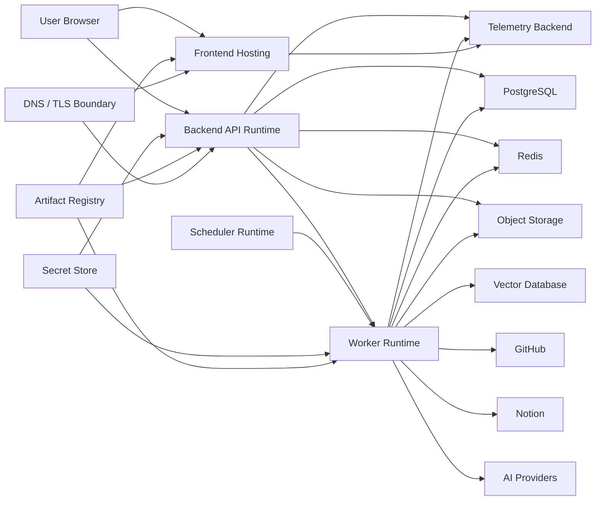
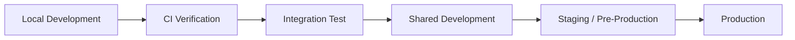
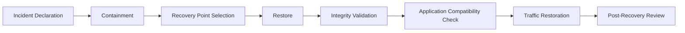

# DevPath Deployment Guide

## 1. Purpose and Scope

### 1.1 Purpose

This document defines the authoritative deployment guide for DevPath. It describes how DevPath is built, packaged, configured, deployed, verified, operated, rolled back, backed up, restored, and handed off across supported environments.

Deployment MUST preserve deterministic business authority. Deployment mechanisms MUST NOT silently change Rule Engine calculations, Career Path Engine readiness logic, prompt behavior, AI routing, security controls, observability expectations, or historical analysis integrity.

### 1.2 Scope

| Area | Deployment Scope |
|---|---|
| Frontend | Web application artifact, static/application hosting, public configuration, API endpoints, source-map handling |
| Backend API | Modular monolith runtime, configuration, health/readiness, traffic admission, graceful shutdown |
| Workers | Repository sync, analysis, knowledge ingestion, embedding, AI generation, portfolio/resume/export workers |
| Scheduler | Periodic synchronization, cleanup, re-index, retention, maintenance tasks |
| Data Stores | PostgreSQL, Redis, Vector Database, Object Storage |
| Configuration | Application settings, feature flags, provider routing, rule/profile/prompt activation |
| Secrets | OAuth secrets, provider keys, database/cache/storage credentials, signing/webhook/encryption secrets |
| AI | Provider configuration, model routing, prompt-template versions, validators, fallback policies |
| Knowledge | Index deployment, embedding model transitions, re-indexing, deletion propagation |
| Operations | Release strategy, rollback, backups, restore, deployment telemetry, operational handoff |

### 1.3 Excluded Topics

This document MUST NOT define executable CI/CD files, Dockerfiles, Kubernetes manifests, Terraform, shell commands, cloud-console procedures, firewall or IAM policy files, vendor-specific infrastructure configuration, production source code, detailed test cases, complete incident-response policy, or unsupported SLA, RTO, or RPO guarantees.

### 1.4 Intended Audience

| Audience | Expected Use |
|---|---|
| Platform Engineers | Implement deployment workflows and runtime packaging |
| Backend Engineers | Prepare API, worker, scheduler, migration, and compatibility behavior |
| Frontend Engineers | Prepare frontend artifacts, public config, cache behavior, and rollback |
| AI Engineers | Deploy prompt, validator, provider, model, and AI configuration changes |
| Data Engineers | Manage schema migration, backup, restore, indexes, and storage evolution |
| Security Reviewers | Validate secrets, access, deployment authorization, and release audit |
| Operators | Execute releases, monitor deployments, handle rollback, and perform handoff |
| QA Engineers | Verify deployment gates, smoke checks, and release readiness |

## 2. Deployment Goals and Constraints

### 2.1 Deployment Goals

| Goal | Requirement |
|---|---|
| Repeatability | Deployments SHOULD be reproducible from versioned artifacts and release records |
| Safety | Deployments MUST define pre-checks, stop conditions, rollback criteria, and post-checks |
| Recoverability | Backup and restore verification MUST be defined for source-of-truth data |
| Traceability | Each release MUST identify source revision, artifact versions, configuration versions, schema version, rule/profile/prompt versions |
| Security | Secrets MUST remain outside artifacts; deployment access MUST follow least privilege |
| Observability | Deployment phases, versions, health checks, smoke tests, and rollback actions SHOULD be observable |
| Portability | Architecture SHOULD avoid cloud-vendor lock-in until approved |
| Cost awareness | Runtime units and telemetry SHOULD support small-team and limited-budget operation |
| Scalability | Deployment model SHOULD allow future scale-out without unsupported guarantees |
| Operational simplicity | Initial deployment SHOULD favor clear ownership and minimal manual steps |
| Developer usability | Local and CI deployment models SHOULD support deterministic testing without production data |

### 2.2 Project Constraints

| Constraint | Deployment Impact |
|---|---|
| Graduation-project scope | Prefer pragmatic, understandable release workflows |
| Small initial team | Avoid operational complexity that exceeds ownership capacity |
| Limited infrastructure budget | Prefer replaceable, cost-aware deployment units |
| Future SaaS evolution | Preserve security, observability, audit, and compatibility foundations |
| Multiple AI providers | Provider routing and secrets must be configurable |
| Asynchronous workloads | Worker deployment must preserve job ownership and retry safety |
| Private GitHub/Notion data | Environment isolation and secret/data policies are mandatory |
| Structured and vector storage | PostgreSQL, Redis, Vector DB, and Object Storage require separate deployment treatment |

These constraints MUST NOT be converted into unsupported availability, capacity, or compliance guarantees.

## 3. Deployment System Context

| Component | Deployment Role |
|---|---|
| User browser | Consumes frontend artifact and API responses; untrusted client |
| Frontend hosting | Serves versioned frontend assets and public runtime configuration |
| Backend runtime | Hosts authenticated API, application services, modular monolith components |
| Worker runtime | Processes asynchronous jobs and provider/data pipelines |
| Scheduler runtime | Initiates periodic and maintenance workflows |
| PostgreSQL | Source-of-truth relational data store |
| Redis | Non-authoritative cache, locks, rate limits, and transient coordination |
| Vector Database | Knowledge embeddings and retrieval indexes |
| Object Storage | Generated artifacts, exports, uploaded/derived objects |
| GitHub/Notion | External data providers through controlled integrations |
| AI providers | LLM and embedding providers or local model runtime |
| Telemetry backend | Logs, metrics, traces, and deployment visibility |
| Secret store | Runtime secret delivery and rotation boundary |
| Artifact registry | Immutable artifact and package storage |
| DNS/TLS boundary | Public routing and secure transport boundary conceptually |

## 4. Deployment Unit Model

Initial architecture MAY use one backend build artifact with multiple runtime modes for API, worker, and scheduler if approved. Separate build artifacts MAY be introduced later as an ADR when operational complexity or scaling requires it.

| Unit | Responsibility | Runtime Type | Independent Deployability | Version ID | Dependencies | Startup Order | Shutdown | Health | Rollback | Scaling | Prohibited Responsibilities |
|---|---|---|---|---|---|---|---|---|---|---|---|
| Frontend Application | Serve web UI | Static/application host | Yes | frontend_build_version | API public URL | After compatible API | N/A | Asset availability | Fast artifact rollback | CDN/host scale | Server secrets, score calculation |
| Backend API | Serve API and application services | Server runtime | Yes | backend_api_version | DB, cache, storage, config | After compatible schema | Drain requests | Liveness/readiness | Version rollback if schema compatible | Horizontal/vertical | Worker-only long jobs |
| Background Worker | Process async jobs | Worker runtime | Yes | worker_version | Queue/store, DB, providers | After compatible schema/API | Finish/release jobs | Worker readiness | Version rollback if jobs compatible | Queue-based | Direct user traffic |
| Scheduler | Start scheduled jobs | Scheduler runtime | Yes | scheduler_version | Job store, config | After API/worker ready | Stop scheduling | Schedule readiness | Version rollback | Usually singleton/controlled | Processing job payloads directly |
| Database Migration Unit | Apply schema/data migrations | Migration task | Yes | schema_version | PostgreSQL, backup | Before dependent runtimes | Stop on failure | Migration result | Limited; recovery plan | N/A | Application serving |
| Rule/Profile Package | Deploy rules and profiles | Configuration package | Yes | rule/profile_version | Validation suite | After tests, before activation | N/A | Activation status | Config rollback | N/A | Retroactive result mutation |
| Prompt Template Package | Deploy prompt templates | Configuration package | Yes | prompt_template_version | Prompt validation/eval | After tests, before activation | N/A | Activation status | Prompt rollback | N/A | Business logic |
| Response Validator Package | Validate AI output | Configuration/library package | Yes | validator_version | AI pipeline | With/after compatible API | N/A | Validator health | Validator rollback | N/A | Score calculation |
| Knowledge Re-index Task | Rebuild/transition indexes | Controlled task | Yes | knowledge_index_version | Vector DB, source data | After compatible metadata | Pause/resume | Re-index status | Active-index switchback | Worker scale | Authorization bypass |
| Administrative Migration Task | Controlled admin data change | Admin task | Yes | admin_task_version | Audit, DB/config | Approved window | Stop on failure | Task status | Recovery plan | N/A | Unapproved business change |

## 5. Environment Strategy

| Environment | Purpose | Users | Data Policy | Provider Policy | Secret Source | Deployment Method | Observability | Availability | Reset Policy | Access | Prohibited Activities |
|---|---|---|---|---|---|---|---|---|---|---|---|
| Local Development | Developer feedback | Developers | Synthetic only | Stubs/sandboxes | Local dev secrets only | Manual/local category | Local logs | None | Developer reset | Developer | Production data/secrets |
| CI Verification | Automated verification | CI | Synthetic fixtures | Controlled substitutes | CI-scoped test secrets | Automated category | Test artifacts | CI only | Per run | CI | Real private data |
| Integration Test | Cross-component tests | Engineers/QA | Synthetic/golden | Sandboxes/substitutes | Test secret store | Automated/semi-automated | Test telemetry | Best effort | Scheduled/per run | Restricted | Production credentials |
| Shared Development | Collaborative validation | Team | Synthetic/sanitized approved | Sandboxes | Dev secret store | Controlled | Moderate | Best effort | Scheduled | Team | Long-lived uncontrolled state |
| Staging/Pre-Production | Release validation | QA/Ops/Product | Sanitized/approved | Approved sandboxes | Staging secret store | Release category | Production-like | Best effort/TBD | Release reset | Restricted | Unapproved production data |
| Production | User service | End users/admins | Production data | Production providers | Production secret store | Approved release | Full | Target TBD | No destructive reset | Least privilege | Testing that mutates user data unsafely |

Production data MUST NOT be copied into lower environments without sanitization and approval.

## 6. Environment Isolation

| Resource | Isolation Requirement |
|---|---|
| Databases | Separate database or strict logical isolation per environment |
| Caches | Separate Redis instance/database/namespace per environment |
| Vector indexes | Separate index or namespace per environment and embedding version |
| Object storage | Separate bucket or namespace with environment prefix and access boundary |
| OAuth applications | Separate OAuth app/client where practical; redirect URIs environment-specific |
| AI credentials | Separate provider keys or scoped credentials per environment |
| Encryption keys | Separate keys or key scopes per environment |
| Telemetry | Environment-labeled and access-controlled; production telemetry restricted |
| DNS | Environment-specific domains or subdomains |
| Generated artifacts | Environment-isolated storage and public URL boundary |
| Webhook endpoints | Environment-specific endpoints and secrets |
| Administrative access | Separate access policy and audit per environment |

Shared mutable state between environments SHOULD be avoided. If unavoidable, strict logical isolation, scoped credentials, labels/namespaces, and documented risk acceptance are required.

## 7. Build and Artifact Architecture

### 7.1 Build Flow

Source → Static Verification → Tests → Build → Artifact Packaging → Security Scanning → Artifact Registration → Environment Promotion

The accepted scaffolding baseline uses a monorepo with stack-native builds. Backend build assumptions follow Java 21 LTS, Spring Boot, and Gradle Wrapper from ADR-020 and ADR-023. Frontend build assumptions follow React, TypeScript, npm, and Vite from ADR-021 and ADR-023. This guide still does not select a deployment platform, CI/CD service, artifact registry, or cloud provider.

### 7.2 Artifact Properties

| Property | Requirement |
|---|---|
| Immutable | Artifact contents MUST NOT change after registration |
| Versioned | Artifact MUST have stable version identifier |
| Checksummed | Artifact SHOULD have integrity checksum |
| Source traceable | Artifact MUST reference source revision |
| Dependency traceable | Artifact SHOULD reference dependency set |
| Build traceable | Artifact SHOULD reference build environment and build time |
| Signed | Signing SHOULD be used where appropriate and supported |
| Reproducible | Reproducibility SHOULD be pursued where practical |

### 7.3 Artifact Categories

| Category | Content |
|---|---|
| Frontend artifact | Built frontend assets and public config placeholders |
| Backend artifact | Spring Boot backend API runtime or shared backend binary |
| Worker artifact | Worker runtime or shared Spring Boot backend binary runtime mode |
| Migration artifact | Versioned migration definitions and metadata |
| Rule package | Rule Engine rule definitions and weights |
| Career/company profile package | Career profiles, company profiles, roadmap/recommendation rules |
| Prompt-template package | Prompt templates and metadata |
| Validator package | AI response and safety validator definitions |

No pipeline syntax is defined by this document.

## 8. Versioning Model

| Version Identifier | Meaning |
|---|---|
| application_release | Overall release record identifier |
| frontend_build_version | Frontend artifact version |
| backend_api_version | Backend API runtime version |
| worker_version | Worker runtime version |
| scheduler_version | Scheduler runtime version |
| database_schema_version | PostgreSQL schema version |
| rule_version | Active Rule Engine configuration version |
| career_profile_version | Active career profile version |
| company_profile_version | Active company profile version |
| prompt_template_version | Active prompt template package version |
| prompt_context_schema_version | PromptContext schema version |
| ai_response_validator_version | Response validator version |
| knowledge_index_version | Active vector index/embedding space version |
| generated_artifact_version | Artifact format/content version |
| release_record_version | Deployment manifest or release record version |

### 8.1 Version Compatibility Matrix

| Producer | Consumer | Compatibility Expectation |
|---|---|---|
| Frontend build | Backend API | Old frontend clients SHOULD remain safe with compatible API versions |
| Backend API | Database schema | API MUST start only with compatible schema |
| Worker | Database schema | Worker MUST process jobs only with compatible schema |
| Scheduler | Worker/job schema | Scheduler MUST enqueue jobs compatible with active workers |
| Rule package | Rule Engine | Rule package MUST pass validation before activation |
| Career/company profiles | Career Engine | Profiles MUST be compatible with Skill Matrix schema |
| Prompt template | Prompt Builder | Template variables MUST match PromptContext schema |
| Validator package | AI responses | Validator MUST match response schema and task type |
| Knowledge index | Retriever | Retriever MUST query compatible index and embedding version |
| Generated artifacts | Frontend/export services | Artifact format MUST remain readable or migrated |
| Serialized jobs/events | Workers/handlers | Versioned payloads MUST be backward-compatible during rollout |

## 9. Configuration Architecture

Configuration MUST NOT contain secrets unless represented as managed secret references.

| Category | Owner | Source | Scope | Mutability | Validation | Default | Approval | Restart | Audit |
|---|---|---|---|---|---|---|---|---|---|
| Application behavior | Backend | Config store/file/env category | Environment | Controlled | Schema validation | Safe default | Backend lead | Maybe | For sensitive changes |
| Endpoint locations | Platform | Environment config | Environment | Controlled | URL/origin validation | Deny unknown | Platform | Maybe | Yes for production |
| Feature flags | Product/Platform | Flag config | Environment/user cohort | Dynamic/controlled | Type/owner/expiry | Off unless approved | Owner | No/Maybe | Yes |
| Provider selection | AI/Integration | Config | Environment | Controlled | Provider availability | Safe disabled | AI/Integration | Maybe | Yes |
| Timeout/retry policy | Backend/Ops | Config | Environment | Controlled | Bounds | Conservative | Ops | Maybe | Yes if production |
| Rate limits | Security/Ops | Config | Environment | Controlled | Bounds | Deny abuse | Security/Ops | Maybe | Yes |
| Job concurrency | Worker/Ops | Config | Environment | Controlled | Capacity bounds | Safe low | Ops | Maybe | Yes |
| Cache policy | Backend/Ops | Config | Environment | Controlled | TTL bounds | Safe miss | Backend/Ops | Maybe | No/Maybe |
| File limits | Security/Backend | Config | Environment | Controlled | Size/type bounds | Restrictive | Security | Maybe | Yes |
| Logging level | Ops | Config | Environment | Controlled | Allowed levels | INFO | Ops | Maybe | Yes for debug prod |
| Telemetry endpoints | Ops | Config | Environment | Controlled | Endpoint validation | Disabled safe | Ops | Maybe | Yes |
| Allowed origins | Security/Frontend | Config | Environment | Controlled | Origin allowlist | Deny unknown | Security | Maybe | Yes |
| Session policy | Security/Backend | Config | Environment | Controlled | Idle/absolute bounds, cookie mode, cleanup | ADR-026 defaults | Security | Maybe | Yes |
| CSRF policy | Security/Backend | Config | Environment | Controlled | Header/cookie compatibility | Enabled for mutations | Security | Maybe | Yes |
| Public URLs | Platform | Config | Environment | Controlled | URL validation | None | Platform | Maybe | Yes |
| Rule activation | Rule/Admin | Admin config | Environment | Controlled | Rule validation | Previous active | Admin/Rule | No/Maybe | Required |
| Career/company activation | Career/Admin | Admin config | Environment | Controlled | Profile validation | Previous active | Admin/Career | No/Maybe | Required |
| Prompt-template activation | AI/Admin | Admin config | Environment | Controlled | Prompt validation | Previous active | AI/Admin | No/Maybe | Required |

## 10. Secrets Management

Secrets MUST NOT appear in artifacts, logs, frontend bundles, or deployment documentation examples.

| Secret | Secure Storage | Runtime Injection | Owner | Rotation/Revocation | Environment Separation | Local Handling | Emergency Replacement | Audit |
|---|---|---|---|---|---|---|---|---|
| OAuth client secrets | Secret store | Backend runtime | Integration/Security | Required | Required | Dev-only separate | Required | Yes |
| GitHub/Notion tokens | Application-encrypted restricted data store with external key material | Owning adapter runtime only | Integration | Revoke on disconnect/compromise | Required | Sandbox only | Required | Yes |
| AI-provider keys | Secret store | AI adapter/worker | AI/Security | Required | Required | Stub/local key | Required | Yes |
| Database credentials | Secret store | API/worker/migration | Data/Ops | Required | Required | Local-only | Required | Yes |
| Redis credentials | Secret store | API/worker | Ops | Required | Required | Local-only | Required | Yes |
| Vector DB credentials | Secret store | Knowledge workers/API | Knowledge/Ops | Required | Required | Local-only | Required | Yes |
| Object Storage credentials | Secret store | API/worker | Ops | Required | Required | Local substitute | Required | Yes |
| Signing secrets | Secret store | Backend runtime | Security | Required | Required | Dev-only separate | Required | Yes |
| Webhook secrets | Secret store | Provider callback runtime | Integration/Security | Required | Required | Sandbox only | Required | Yes |
| Encryption keys | Key/secret management | Runtime/key service | Security/Ops | Required | Required | Dev key only | Required | Yes |
| Admin bootstrap credentials | Restricted secret | One-time bootstrap | Security | Rotate/remove after bootstrap | Required | Dev-only | Required | Required |

Leak response MUST follow `13_Security_Architecture.md`.

## 11. Network and Access Boundaries

| Path | Direction | Authentication | Authorization | Encryption | Exposure | Prohibited Access |
|---|---|---|---|---|---|---|
| Browser to frontend | Public inbound | None for public assets | Public artifact rules | HTTPS expected | Public | Server secrets |
| Browser to backend API | Public inbound | User/session where required | Backend-enforced | HTTPS expected | Public API | Direct DB/cache/storage |
| Backend to storage systems | Internal outbound | Service credentials | Least privilege | Protected transport | Private/internal | Public direct DB access |
| Backend to external providers | Outbound | Provider credentials | Provider scopes | Provider HTTPS | External | Token exposure to client |
| Workers to storage systems | Internal outbound | Worker credentials | Job-scoped logic | Protected transport | Private/internal | Cross-environment data |
| Scheduler to app/job store | Internal | Service identity | Scheduler scope | Protected transport | Private/internal | User data browsing |
| Admin users to operational interfaces | Restricted inbound | Admin auth | Least privilege | HTTPS expected | Restricted | Unaudited production changes |
| Telemetry producers to collectors | Outbound/internal | Runtime credentials if required | Telemetry scope | Protected transport | Internal/external | Secrets/private payloads |

Vendor-specific security groups or firewall syntax are out of scope.

## 12. Frontend Deployment

| Area | Requirement |
|---|---|
| Artifact publishing | Frontend artifact MUST be immutable and versioned |
| Hosting model | Static or application hosting MAY be used; choice remains ADR |
| Environment configuration | Only public runtime configuration MAY be exposed |
| API base URL | MUST be environment-specific and validated |
| OAuth redirect URLs | MUST match provider-registered environment URLs |
| Session cookie | Production host/name/path/Secure/HttpOnly/SameSite settings MUST be environment-validated and must not be emitted into frontend configuration |
| CSRF/CORS | CSRF token transport and credentialed origin allowlist MUST be environment-specific and fail closed |
| Cache headers | SHOULD allow asset caching while enabling version rollback |
| Asset versioning | Asset names or references SHOULD include build version |
| CSP integration | CSP settings SHOULD align with `13_Security_Architecture.md` |
| Source maps | Production source-map access MUST be restricted if generated |
| Rollback | Prior frontend artifact SHOULD be restorable if API-compatible |
| Stale-client behavior | Old clients MUST fail safely with compatible API/error handling |
| Browser compatibility | Supported browser policy remains TBD |
| Maintenance communication | User-facing notices MAY be used for disruptive releases |

Frontend bundles MUST NOT expose server-only configuration, OAuth client secrets, provider keys, database credentials, or hidden prompts.

## 13. Backend API Deployment

| Deployment Aspect | Requirement |
|---|---|
| Startup sequence | Load config, validate secrets, verify schema compatibility, initialize dependencies, expose readiness |
| Configuration validation | Invalid required config MUST prevent readiness |
| Secret validation | Missing required secrets MUST prevent affected capability readiness |
| Dependency readiness | Required dependencies determine readiness; optional providers may degrade safely |
| Migration compatibility | API MUST run only against compatible schema |
| Session store | MVP runtime requires PostgreSQL JDBC session schema and cleanup; Redis availability does not determine authentication readiness |
| Health endpoints | Liveness and readiness MUST be distinct conceptually |
| Graceful shutdown | Runtime SHOULD stop accepting traffic and drain active requests |
| Request draining | In-flight requests SHOULD complete within configured bounds TBD |
| Traffic admission | Traffic SHOULD route only to ready instances |
| Rollback | API rollback requires schema and serialized data compatibility |
| Concurrent versions | Rolling/canary deployment requires backward-compatible API/schema behavior |
| API version behavior | Deprecated/compatible API behavior follows `10_API_Specification.md` |

Deployment expectations assume a modular monolith and do not imply microservice deployment.

## 14. Worker and Scheduler Deployment

| Area | Requirement |
|---|---|
| Worker types | Repository sync, analysis, knowledge ingestion, embedding, AI generation, export, portfolio/resume generation |
| Concurrency | Concurrency MUST be configurable and bounded |
| Job leasing/claiming | Workers MUST claim jobs safely and preserve ownership |
| Graceful shutdown | Workers SHOULD finish, release, or checkpoint in-flight jobs safely |
| In-flight handling | Deployment MUST define whether active jobs complete, retry, or requeue |
| Duplicate delivery | Jobs MUST be idempotent or duplicate-safe |
| Retry | Retry policy MUST be bounded and observable |
| Stale recovery | Stale jobs MUST be detectable and recoverable |
| Scheduler overlap | Scheduler MUST prevent unsafe overlapping executions |
| Version compatibility | Workers MUST process only compatible job payload versions |
| Scale-out | Additional workers MAY be added by job type and capacity |
| Scale-in | Scale-in MUST not silently lose job ownership |
| Active workloads | Deployment during active workloads MUST preserve job state and result links |

## 15. Database Deployment and Migration

### 15.1 Migration Principles

Flyway is the accepted migration tool under ADR-025. Migration files are immutable versioned SQL, and Flyway schema history/checksums are the authoritative record of applied schema evolution.

| Principle | Requirement |
|---|---|
| Forward-only by default | Migrations SHOULD be forward-only unless explicit rollback is safe |
| Versioned migrations | Every migration MUST have a version identifier |
| Transactional execution | Use transactions where supported and safe |
| Repeatability | Migration execution MUST be repeatable or idempotency-safe where applicable |
| Pre-deployment validation | Migration risk and compatibility MUST be reviewed before deployment |
| Backup requirement | Backup readiness MUST be verified before risky migrations |
| Compatibility window | App/schema compatibility MUST support deployment sequence |
| Rollback limitations | Irreversible migrations MUST document recovery limitations |
| Expand-and-contract | Breaking changes SHOULD use multi-step compatible rollout |
| Data migration separation | Long data backfills SHOULD be separated from schema changes |
| Lock-risk assessment | Migrations SHOULD assess lock and duration risk |
| Observability | Migration progress and result MUST be observable |
| ORM separation | Hibernate schema create/update MUST be disabled outside disposable tests; runtime may validate schema compatibility only |
| Startup policy | Local/tests MAY migrate on startup; production application startup MUST NOT silently migrate, baseline, repair, or mutate schema history |
| Production ownership | A privileged deployment migration unit runs before dependent API/worker runtimes and records outcome |
| Failure handling | Failed migration blocks incompatible runtime readiness and requires an explicit recovery or forward-fix decision |
| History integrity | Applied migration files are immutable; repair and baseline are exceptional, approved, and audited |
| Ordering | Out-of-order execution is disabled by default |

### 15.2 Migration Classes

| Class | Description | Review Requirement | Deployment Requirement |
|---|---|---|---|
| Additive | Adds compatible tables/fields/indexes | Standard review | May deploy before app |
| Compatible | Changes that preserve old/new compatibility | Compatibility review | Requires compatibility evidence |
| Data backfill | Populates or transforms data | Data review | May require background task and progress tracking |
| Performance-related | Index/tuning change | Data/Ops review | Requires lock/performance risk review |
| Destructive | Drops/renames/removes data | Explicit architecture/security/data approval | Requires recovery and compatibility plan |
| Emergency | Urgent production fix | Emergency approval | Must create retrospective release record |

SQL is not generated by this document.

Production rollback is forward-fix by default. Application rollback is permitted only while schema compatibility is preserved; destructive changes require expand-and-contract and recovery evidence rather than blind reverse migrations.

## 16. Schema Compatibility Strategy

| Compatibility Area | Requirement |
|---|---|
| Old app/new schema | New schema SHOULD support previous app during rollout |
| New app/old schema | New app MUST verify required schema before readiness |
| API and worker runtime | API and workers MUST agree on job/result schema versions |
| Read models | Read model changes SHOULD be additive or rebuildable |
| Cache entries | Cache serialization versions SHOULD prevent unsafe reads |
| Serialized jobs | Jobs MUST include payload version or equivalent compatibility marker |
| Domain events | Events SHOULD be versioned and backward-compatible |
| Integration events | Provider event changes MUST be normalized |
| PromptContext | PromptContext schema changes MUST preserve validator/template compatibility |
| Generated artifacts | Artifact format changes MUST preserve read/export behavior or provide migration |
| Additive fields | Preferred compatible change pattern |
| Nullable transitions | Multi-step transition SHOULD be used |
| Field renaming/removal | Requires expand-and-contract and compatibility plan |
| Enum evolution | Unknown values MUST fail safely or be compatible |
| Stale cache | Cache invalidation or namespace versioning required |
| Rollback | Rollback compatibility MUST be assessed before deployment |

Destructive changes require explicit compatibility and recovery plans.

## 17. Cache Deployment Considerations

| Concern | Requirement |
|---|---|
| Cache versioning | Key namespaces SHOULD include version or compatibility markers |
| Key namespace | Environment and module namespaces MUST prevent collision |
| Serialization changes | Changes MUST avoid unsafe deserialization of old values |
| TTL changes | TTL changes SHOULD be validated against freshness and load behavior |
| Invalidation | Deployment SHOULD define invalidation for changed derived data |
| Warm-up | Warm-up MAY be used for high-value caches |
| Stale entries | Stale cache MUST NOT bypass authorization or source-of-truth state |
| Cache flush | Broad flushes require operational approval and impact assessment |
| Fallback | Redis unavailable behavior MUST degrade to source of truth where safe |
| Environment isolation | Cache data MUST be environment-isolated |

Redis remains non-authoritative.

## 18. Vector Database and Knowledge Index Deployment

| Concern | Requirement |
|---|---|
| Index creation | New indexes MUST include metadata schema and authorization fields |
| Index versioning | Active index version MUST be explicit |
| Metadata schema changes | Retrieval filters MUST remain compatible |
| Embedding-model changes | Incompatible vector spaces MUST NOT be silently mixed |
| Full re-index | Requires job plan, progress visibility, and fallback behavior |
| Incremental re-index | Must update stale chunks and preserve deletion propagation |
| Dual-index migration | SHOULD be used for embedding/index transitions where practical |
| Rollback | Active index switchback MUST be possible if old index retained |
| Authorization validation | Index activation requires authorization-filter verification |
| Deletion propagation | Deleted sources MUST be removed from retrieval scope |
| Stale-index detection | Retrieval should surface stale-index conditions safely |
| Active index switch | Switch MUST be explicit, audited where production-sensitive, and verifiable |

## 19. Object Storage Deployment

| Concern | Requirement |
|---|---|
| Namespace creation | Bucket/namespace must be environment-isolated |
| Private by default | Objects MUST be private unless explicitly published |
| Upload policy | Uploads MUST follow type, size, and ownership constraints |
| Temporary download URLs | URLs MUST be scoped and expiring |
| Lifecycle rules | Retention durations remain TBD unless approved |
| Generated exports | Exports MUST be owner-scoped and cleanup-aware |
| Artifact publication | Public publication MUST be explicit |
| Retention/deletion | Deletion propagation and reconciliation MUST be defined |
| Cross-environment isolation | Production artifacts MUST NOT appear in lower environments unsafely |
| Backup/replication | Expectations remain TBD and must align with backup architecture |
| Endpoint changes | API/frontend config must be updated compatibly |

## 20. Rule, Career Profile, and Company Profile Deployment

| Package | Deployment Requirement |
|---|---|
| Rule Engine rules | Versioned, validated, tested with golden datasets, explicitly activated |
| Scoring weights | Reviewed and versioned; activation audited |
| Career profiles | Versioned, compatible with Skill Matrix, regression tested |
| Company profiles | Versioned, company readiness regression tested |
| Learning-roadmap rules | Versioned and tested for target careers |
| Recommendation rules | Evidence linkage and priority behavior tested |

Activation MUST include validation, approval, staging activation, production activation, rollback path, audit, compatibility review, and historical-result reproducibility. Deployment MUST NOT retroactively mutate historical analysis results.

## 21. Prompt Template and AI Configuration Deployment

| Area | Deployment Requirement |
|---|---|
| Prompt templates | Versioned, validated, evaluated, staged, and explicitly activated |
| PromptContext schema | Compatible with templates and validators |
| Provider routing | Versioned and auditable for production changes |
| Model selection | Explicit; deterministic calculations unaffected |
| Token budgets | Validated per task and provider |
| Response schemas | Compatible with validators and output formatters |
| Response validators | Versioned and regression tested |
| Safety validators | Tested against adversarial cases |
| Fallback policy | Explicit and observable |
| Provider outage handling | Safe degradation or fallback defined |
| Model deprecation | Requires migration/compatibility plan |
| Local-model configuration | Requires isolation and provenance review |

AI configuration changes MUST NOT alter deterministic calculations.

## 22. Feature Flag Deployment

| Flag Type | Owner | Default | Scope | Approval | Expiration | Audit | Rollback Use | Cleanup |
|---|---|---|---|---|---|---|---|---|
| Release flag | Product/Engineering | Off | Environment/cohort | Required | Required | Yes | Gradual enable/disable | Required |
| Operational flag | Ops | Safe default | Environment | Ops approval | Review TBD | Yes if production | Degrade/fallback | Required |
| Provider flag | AI/Integration | Disabled unless approved | Environment/provider | AI/Ops | Required | Yes | Disable provider | Required |
| Experiment flag | Product | Off | Cohort | Product | Required | Maybe | Stop experiment | Required |
| Emergency-disable flag | Ops/Security | Off | Environment/global | Emergency owner | Review required | Yes | Immediate disable | Required |
| Migration flag | Engineering/Data | Compatibility-safe | Environment | Engineering/Data | Required | Yes | Migration phase control | Required |

Feature flags MUST NOT permanently replace proper versioning or migration. Security-critical controls MUST NOT be disabled through ordinary user-facing flags.

## 23. Release Strategy

| Strategy | Benefits | Risks | Complexity | Rollback | Data Compatibility | Initial Suitability | Future Suitability |
|---|---|---|---|---|---|---|---|
| Recreate | Simple and low cost | Downtime and job interruption risk | Low | Replace with prior version | Must handle downtime/jobs | Suitable for early non-critical deployment | Limited |
| Rolling | Gradual runtime replacement | Requires concurrent compatibility | Medium | Roll back instances | Strong schema/job compatibility | Suitable after compatibility maturity | Good |
| Blue-green | Clear switch between environments | Higher infrastructure cost | High | Switch traffic back | Requires shared/compatible data plan | Maybe too complex initially | Strong |
| Canary | Limited exposure | Requires traffic controls and observability | High | Stop expansion | Strong compatibility | Not initial default | Strong for SaaS |
| Feature-flagged | Decouple deploy and release | Flag debt and complexity | Medium | Disable flag | Config compatibility | Useful for risky features | Strong |

Initial DevPath SHOULD use a simple recreate or controlled rolling approach depending on environment maturity, without unsupported zero-downtime claims.

## 24. Deployment Sequence

| Phase | Dependencies | Stop Conditions |
|---|---|---|
| Release Approval | Test gates and approvals | Missing owner, unresolved blocking risk |
| Artifact Verification | Registered artifacts and checksums | Artifact mismatch or scan failure |
| Environment Validation | Environment readiness | Missing secrets/config/capacity |
| Backup/Migration Readiness | Backup status and migration review | No rollback/recovery plan |
| Compatible Schema Changes | Migration unit | Migration failure or unsafe lock risk |
| Backend/Worker Deployment | Schema compatibility | Readiness failure or job incompatibility |
| Frontend Deployment | API compatibility | Public config or asset failure |
| Configuration Activation | Validated config packages | Validation/audit failure |
| Smoke Verification | Runtime ready | Smoke failure |
| Traffic Expansion | Monitoring healthy | Error/latency/security signal |
| Post-Deployment Monitoring | Observability ready | Regression signal |
| Release Completion | Handoff recorded | Missing release record |

## 25. Pre-Deployment Checks

| Check | Requirement |
|---|---|
| Approved release | Release owner and approver recorded |
| Artifact integrity | Versions and checksums verified |
| Test-gate completion | Required gates from `15_Test_Architecture.md` complete |
| Vulnerability status | Blocking vulnerabilities resolved or accepted |
| Secret availability | Required secrets present without exposure |
| Configuration validity | Config schema and environment scope validated |
| Environment capacity | Capacity status reviewed; thresholds TBD |
| Backup status | Required backup readiness verified |
| Migration risk | Migration class and recovery plan reviewed |
| Provider availability | Critical providers checked or safe degradation documented |
| Rollback readiness | Rollback criteria and prior versions identified |
| Observability readiness | Logs, metrics, traces, dashboards available where required |
| Incident ownership | On-call/owner path identified |
| Communication | Maintenance or user communication prepared where applicable |

No deployment SHOULD begin without explicit rollback criteria.

## 26. Health, Readiness, and Startup Validation

| Check Type | Meaning | Examples |
|---|---|---|
| Liveness | Runtime process is functioning | Process event loop/thread pool responsive |
| Readiness | Runtime may accept traffic or work | Compatible schema, required dependencies, config valid |
| Startup Validation | Initial configuration and dependency validation succeeded | Required secrets, schema, config, storage access |

| Dependency | Readiness Role |
|---|---|
| Application startup | Required |
| Configuration schema | Required |
| Required secrets | Required for affected runtime |
| Database compatibility | Required for API/workers |
| Cache availability | Optional or degraded depending on feature |
| Vector Database availability | Required for retrieval; optional for non-AI core paths |
| Object Storage availability | Required for uploads/exports/artifacts |
| External providers | Should not always make entire app unready |
| Telemetry exporter | Usually optional; audit exceptions may fail closed |
| Job-processing capability | Required for worker readiness |

## 27. Post-Deployment Verification

| Verification | Requirement |
|---|---|
| Application version | Exposed to observability |
| Configuration version | Exposed and matches release record |
| Schema version | Compatible and recorded |
| Rule version | Active version verified |
| Career/company profile versions | Active versions verified |
| Prompt-template version | Active version verified |
| API health | Liveness/readiness and smoke API pass |
| Worker health | Worker ready and can process safe test job |
| Scheduler health | Scheduler state verified |
| Authentication | Login/session smoke verified |
| Repository access | Provider access smoke or safe substitute verified |
| Job execution | Queue/job lifecycle smoke verified |
| Database connectivity | Read/write safe check verified |
| Cache behavior | Cache hit/miss or safe fallback verified |
| Knowledge retrieval | Authorized retrieval smoke verified |
| AI invocation | Provider or stubbed generation smoke verified |
| Artifact access | Generated-artifact access/export smoke verified |
| Logging/metrics/tracing | Deployment telemetry visible |
| Security controls | Authz/redaction/security smoke verified |

Smoke tests reference `15_Test_Architecture.md`.

## 28. Rollback Architecture

| Rollback Path | Trigger | Prerequisites | Safety Checks | Data Implications | Compatibility | Observability | Verification | Approval |
|---|---|---|---|---|---|---|---|---|
| Frontend rollback | UI regression | Prior artifact | API compatibility | Usually none | API compatible | Asset/version signal | UI smoke | Release owner |
| Backend rollback | API/runtime regression | Prior artifact | Schema/job compatibility | May be unsafe after data change | Required | Error/health signal | API smoke | Release owner |
| Worker rollback | Job failures | Prior worker | Job payload compatibility | In-flight handling | Required | Job metrics | Worker smoke | Worker owner |
| Configuration rollback | Bad config | Prior config | Config validation | Depends on setting | Required | Config activation signal | Config smoke | Config owner |
| Rule rollback | Rule regression | Prior rule package | Historical reproducibility | No historical mutation | Required | Rule version signal | Golden smoke | Rule owner |
| Profile rollback | Career/company regression | Prior profile | Profile compatibility | No historical mutation | Required | Profile version signal | Career smoke | Career owner |
| Prompt rollback | AI output regression | Prior prompt package | Validator compatibility | Generated artifacts unchanged | Required | Prompt version signal | AI eval smoke | AI owner |
| Provider routing rollback | Provider issue | Alternate provider/config | Data/privacy review | AI generation only | Required | Provider metrics | Generation smoke | AI/Ops |
| Database recovery | Data/schema issue | Backup/recovery point | Data integrity review | High impact | App compatibility | Incident telemetry | Restore validation | Data/Security |
| Index rollback | Retrieval regression | Prior active index | Authorization filters | Retrieval freshness impact | Required | Index version signal | Retrieval smoke | Knowledge owner |

Application rollback MAY be unsafe after irreversible data changes.

## 29. Failed and Partial Deployment Handling

| Scenario | Containment | Traffic Behavior | Rollback/Forward-Fix | User Impact | Data Integrity | Communication | Release Status |
|---|---|---|---|---|---|---|---|
| Frontend succeeded, backend failed | Keep compatible old/new API path | Serve prior frontend if needed | Frontend rollback | UI/API mismatch risk | Low | Internal/user if visible | Partial failed |
| Backend succeeded, worker failed | Stop affected job intake | API may degrade async features | Worker rollback/forward fix | Delayed jobs | Verify job ownership | Internal | Partial failed |
| Migration succeeded, app failed | Block traffic if incompatible | Do not admit bad app | App rollback if compatible or forward fix | Service unavailable/degraded | Verify schema/data | Incident path if prod | Failed |
| App succeeded, config activation failed | Keep prior config | Continue prior behavior | Config rollback/fix | Feature not enabled | Low | Release note | Partial failed |
| Prompt activation failed | Keep prior prompt | AI continues prior behavior | Prompt rollback/fix | AI feature unchanged | Low | AI owner | Partial failed |
| One AI provider unavailable | Disable/fallback provider | Non-AI core available | Provider routing rollback | AI degraded | No score impact | User-safe message | Degraded |
| Vector re-index failed | Keep old active index | Retrieval uses previous index | Retry/rollback index task | Stale retrieval | Verify deletion scope | Knowledge owner | Partial failed |
| Telemetry backend unavailable | Continue core operations unless audit exception | Deploy may pause by policy | Restore telemetry/continue with risk approval | Reduced diagnosis | Audit constraints reviewed | Ops | Degraded/blocked |
| Smoke test failed | Stop traffic expansion | Roll back or hold | Depends on failure | Potential outage/degradation | Verify affected data | Release owner | Failed |

The system MUST NOT report incomplete deployment as successful.

## 30. Backup Architecture

| Backup Scope | Frequency Category | Retention Category | Encryption | Access | Integrity Verification | Restore Dependency | Environment Separation | Owner |
|---|---|---|---|---|---|---|---|---|
| PostgreSQL | TBD | TBD | Required | Restricted | Required | Database runtime/schema | Required | Data/Ops |
| Object Storage | TBD | TBD | Required for restricted data | Restricted | Required | Storage service/metadata | Required | Ops |
| Vector DB metadata/rebuild inputs | TBD | TBD | Required | Restricted | Required | Source documents/embedding config | Required | Knowledge/Ops |
| Rule/profile packages | On change + TBD | TBD | Required where sensitive | Restricted | Checksum/version validation | Rule/Career runtime | Required | Rule/Career |
| Prompt templates | On change + TBD | TBD | Required | Restricted | Version validation | Prompt Builder | Required | AI/Prompt |
| Configuration | On change + TBD | TBD | Required if sensitive | Restricted | Version validation | Runtime config | Required | Ops |
| Audit records | TBD | TBD | Required | Highly restricted | Required | Audit store | Required | Security/Ops |
| Release records | On release | TBD | Required | Restricted | Required | Release system | Required | Ops |

Redis cache need not be backed up as a source of truth.

## 31. Restore and Disaster Recovery

| Scenario | Recovery Owner | RPO Category | RTO Category | Dependencies | Validation | Communication | Audit |
|---|---|---|---|---|---|---|---|
| Accidental data deletion | Data/Ops | TBD | TBD | Backups, audit records | Ownership/data integrity | Affected users if needed | Required |
| Corrupted deployment | Release/Ops | TBD | TBD | Prior artifacts/config | Smoke and version checks | Release stakeholders | Required |
| Database failure | Data/Ops | TBD | TBD | DB backup, schema version | Restore validation | Users if impacted | Required |
| Object-storage loss | Ops | TBD | TBD | Object backup/metadata | Artifact access | Affected users | Required |
| Vector DB loss | Knowledge/Ops | TBD | TBD | Source docs, embedding config | Re-index/retrieval tests | AI feature notice if needed | Required |
| Credential compromise | Security/Ops | TBD | TBD | Secret rotation | Access and leak checks | Affected users if needed | Required |
| AI-provider outage | AI/Ops | TBD | TBD | Fallback provider/local model | Generation smoke | AI feature notice | Required if production |
| Environment outage | Ops | TBD | TBD | Backups, artifacts, DNS/TLS | Full smoke | Users/stakeholders | Required |
| Rule/prompt misconfiguration | Rule/AI | TBD | TBD | Prior packages | Golden/eval smoke | Product/affected users if needed | Required |
| Malicious admin action | Security/Ops | TBD | TBD | Audit, backups | Integrity/audit review | Security process | Required |

Contractual RPO/RTO values are not defined.

## 32. Scaling and Capacity Deployment

| Area | Scaling Considerations |
|---|---|
| API runtime | Horizontal/vertical scaling, connection pools, statelessness where practical |
| Synchronization workers | Queue-based scale, provider rate limits, duplicate-safe jobs |
| Analysis workers | CPU/memory needs, deterministic throughput, queue concurrency |
| Knowledge workers | Chunking/embedding/indexing concurrency and provider quotas |
| AI-generation workers | Provider quotas, token budgets, fallback capacity, cost controls |
| Database connections | Pool sizing, worker/API concurrency, migration impact |
| Redis | Memory, eviction, lock/rate-limit safety |
| Vector Database | Index size, query latency, re-index cost |
| Object Storage | Upload/download throughput, export growth |
| External provider quotas | Backpressure, rate-limit awareness, retry safety |

Concrete capacity guarantees are not defined. Scaling decisions SHOULD consider horizontal scaling, vertical scaling, concurrency control, queue-based scaling, rate-limit awareness, provider quotas, backpressure, scale-down safety, and cost implications.

## 33. Security During Deployment

| Control | Requirement |
|---|---|
| Deployment authorization | Production deployments require authorized actor/automation |
| Artifact integrity | Artifact checksum/signature where available MUST be verified |
| Secret access | Deployment actors receive least-privilege secret access |
| Privileged operations | Migrations, secret rotation, and admin activation require audit |
| Production access | Restricted to approved roles |
| Migration execution | Reviewed and recorded |
| Emergency deployment | Requires emergency owner, reason, and retrospective record |
| Audit | Sensitive deployment actions MUST be auditable |
| Environment separation | Credentials and data MUST remain environment-scoped |
| Source-map protection | Production source maps restricted if produced |
| Temporary credentials | Time-limited and revoked after use |
| Break-glass access | Restricted, audited, and reviewed |
| Dependency provenance | Artifacts SHOULD be traceable to dependencies and source |

Deployment mechanisms MUST follow least privilege and `13_Security_Architecture.md`.

## 34. Observability During Deployment

| Telemetry | Requirement |
|---|---|
| Deployment start | Release ID, environment, actor/automation identity |
| Deployment phase | Current phase, status, timestamp |
| Artifact version | Frontend/backend/worker/config versions |
| Environment | Target environment |
| Migration status | Schema version, result, duration category |
| Rollout status | Runtime version and readiness |
| Health-check result | Liveness/readiness result |
| Smoke-test result | Pass/fail and safe correlation reference |
| Rollback | Trigger, owner, target version, result |
| Configuration activation | Config/rule/profile/prompt versions |
| Deployment completion | Completion status and handoff reference |

Deployment dashboards and alerts SHOULD show release progress, failed phases, version mismatch, readiness failure, migration failure, smoke failure, rollback, and post-deployment error spikes. This aligns with `14_Observability.md`.

## 35. Operational Handoff

| Handoff Item | Requirement |
|---|---|
| Release identifier | Recorded and linked to release record |
| Deployed versions | Application, schema, config, rule, profile, prompt, validator, index versions |
| Migration summary | Migration class, result, known limitations |
| Configuration changes | Activated values/categories and owners |
| Rule changes | Rule package/version and approval |
| Prompt changes | Prompt/validator versions and evaluation status |
| Known issues | Residual risks, mitigations, expiry |
| Monitoring focus | Dashboards and alert categories to watch |
| Rollback criteria | Explicit rollback triggers and owners |
| Ownership | Operational owner after release |
| Support references | User-safe correlation/support references |
| Maintenance follow-up | Post-release tasks and review items |

A deployment is not complete until ownership is transferred and verification is recorded.

## 36. Local Development Deployment

| Local Area | Conceptual Requirement |
|---|---|
| Frontend | Runs against local/stubbed backend config |
| Backend | Runs with local configuration and no production secrets |
| Worker | Processes synthetic jobs |
| Scheduler | Optional local mode with safe schedules |
| PostgreSQL | Local or isolated test database |
| Redis | Local or isolated cache substitute |
| Authentication session | In-memory session is allowed only for local single-instance development; restart logout is expected and documented |
| Migration | Local/test startup may apply Flyway to an isolated PostgreSQL database; production execution behavior must not be simulated as silent runtime migration |
| Vector Database | Local/test vector store or substitute |
| Object Storage substitute | Local/test storage compatible with required behavior |
| GitHub/Notion sandbox | Sandbox credentials only when needed |
| AI stubs/local models | Prefer stubs for deterministic local tests; local models optional |
| Test data | Synthetic/golden fixtures only |
| Configuration | Local defaults with explicit overrides |
| Secrets | Development-only, never production |

Local setup modes SHOULD include minimal setup, full integration setup, offline/stubbed setup, safe reset, and deterministic local testing. Setup commands are not generated.

## 37. Deployment Verification and Testing

| Verification Area | Required Coverage |
|---|---|
| Artifact promotion | Same artifact promoted without rebuild |
| Configuration loading | Environment config validates and loads |
| Secret injection | Required secrets available and not exposed |
| Startup behavior | Startup validation succeeds or fails safely |
| Readiness | Required dependencies and compatibility verified |
| Migration execution | Versioned migration result recorded |
| Backward compatibility | Old/new runtime/schema/job compatibility verified |
| Worker restart | Jobs survive or recover safely |
| Active-job preservation | In-flight job policy verified |
| Rollback | Rollback path rehearsed or verified conceptually |
| Backup | Backup existence and integrity checked |
| Restore | Restore verification defined |
| Re-index | Knowledge index switch and authorization verified |
| Feature-flag activation | Flag owner, state, expiry, audit verified |
| Rule/prompt activation | Version, test evidence, audit verified |
| Telemetry | Deployment logs/metrics/traces visible |
| Security controls | Auth, secrets, environment separation, redaction verified |

Detailed test cases remain in `15_Test_Architecture.md`.

## 38. Deployment Responsibility Matrix

| Responsibility | Responsible Role | Approver | Verifier | Operational Owner | Backup Owner |
|---|---|---|---|---|---|
| Source release | Engineering lead | Release approver | QA | Engineering | Backend lead |
| Artifact build | Platform/CI owner | Engineering lead | QA/Platform | Platform | Ops |
| Artifact approval | Release manager | Engineering/Product | QA | Release manager | Engineering lead |
| Environment configuration | Platform/Ops | Ops lead | QA/Ops | Ops | Platform |
| Secrets | Security/Ops | Security lead | Security | Ops | Security |
| Frontend deployment | Frontend/Platform | Frontend lead | QA | Frontend/Ops | Platform |
| Backend deployment | Backend/Platform | Backend lead | QA/Ops | Backend/Ops | Platform |
| Worker deployment | Backend/Worker owner | Backend lead | QA/Ops | Worker/Ops | Platform |
| Scheduler deployment | Ops/Backend | Ops lead | QA/Ops | Ops | Backend |
| Database migration | Data/Backend | Data lead | QA/Data | Data/Ops | Data |
| Rule activation | Rule/Admin | Rule owner | QA/Rule | Rule owner | Admin |
| Prompt activation | AI/Prompt | AI lead | QA/AI | AI owner | Prompt owner |
| Provider configuration | Integration/AI | Integration/AI lead | QA/Ops | Integration/Ops | Ops |
| Smoke verification | QA | Release manager | QA/Ops | QA | Module owners |
| Rollback | Release manager | Release approver | QA/Ops | Ops | Module owners |
| Backup | Data/Ops | Ops lead | Data/Ops | Ops | Data |
| Restore | Data/Ops | Security/Ops | QA/Data | Ops | Data |
| Incident escalation | Ops/Security | Security lead | Ops | Incident owner | Ops |
| Operational handoff | Release manager | Ops lead | QA/Ops | Ops | Release manager |

No production-sensitive action MAY have ambiguous ownership.

## 39. Deployment Records and Audit

| Release Record Field | Requirement |
|---|---|
| Release ID | Unique release identifier |
| Source revision | Source state used to build artifacts |
| Artifact versions | Frontend, backend, worker, scheduler, migration, packages |
| Deployment environment | Target environment |
| Start/end | Deployment start and end timestamps |
| Actor | Human or automation identity |
| Approval | Release approval reference |
| Schema version | Database schema version |
| Configuration version | Active configuration version |
| Rule version | Active Rule Engine package |
| Profile versions | Career and company profile versions |
| Prompt-template version | Active prompt package |
| AI-provider routing version | Active provider/model routing config |
| Migration results | Migration status and references |
| Verification results | Pre/post checks and smoke results |
| Rollback status | Rollback readiness or execution status |
| Known issues | Accepted risks and follow-ups |
| Incident references | Related incident IDs if any |

Release records MUST be immutable through normal application workflows.

## 40. Open Issues and ADR Candidates

| Issue ID | Context | Options | Recommendation | Impact | Owner | Status | ADR |
|---|---|---|---|---|---|---|---|
| DEP-OI-001 | Cloud provider | Oracle Cloud, other cloud, self-hosted | Decide before production | Cost and ops | Platform | Open | Yes |
| DEP-OI-002 | Containerization | Containerized, non-containerized | Containerization likely useful but TBD | Portability | Platform | Open | Yes |
| DEP-OI-003 | Orchestration platform | Simple host, compose-like, Kubernetes, managed | Start simple unless scale requires | Complexity | Platform/Ops | Open | Yes |
| DEP-OI-004 | Frontend hosting | Static host, app server, CDN-backed | Static hosting likely suitable | Cost/performance | Frontend/Ops | Open | Yes |
| DEP-OI-005 | PostgreSQL deployment | Managed, self-hosted | Managed if budget permits | Reliability/ops | Data/Ops | Open | Yes |
| DEP-OI-006 | Redis deployment | Managed, self-hosted, embedded dev | Decide per environment; not required for initial authentication under ADR-026 | Cache ops | Ops | Open | Yes |
| DEP-OI-020 | Persistence and migration tooling | JPA/jOOQ/JDBC; Flyway/Liquibase | JPA/Hibernate and Flyway accepted by ADR-024/025 | Data deployment | Data/Ops | Resolved | ADR-024, ADR-025 |
| DEP-OI-021 | Authentication session deployment | Memory, JDBC, Redis | Local memory and MVP JDBC-backed PostgreSQL accepted; Redis deferred by ADR-026 | Identity deployment | Security/Ops | Resolved | ADR-026 |
| DEP-OI-007 | Vector DB selection | pgvector, dedicated vector DB, managed | Align with DB/knowledge strategy | Retrieval | Knowledge/Data | Open | Yes |
| DEP-OI-008 | Object Storage | Cloud object storage, self-hosted | Choose with cost/security review | Artifacts/backup | Ops | Open | Yes |
| DEP-OI-009 | Secret manager | Managed, self-hosted, env-only dev | Managed/restricted for production | Security | Security/Ops | Open | Yes |
| DEP-OI-010 | Artifact registry | CI-native, container registry, package registry | Select with build approach | Release traceability | Platform | Open | Yes |
| DEP-OI-011 | CI/CD platform | GitHub Actions, other | TBD | Automation | Platform | Open | Yes |
| DEP-OI-012 | Deployment strategy | Recreate, rolling, blue-green, canary | Recreate/controlled rolling initially | Safety/cost | Ops | Open | Yes |
| DEP-OI-013 | Infrastructure as code | None initially, Terraform, other | Use only after platform choice | Reproducibility | Platform | Open | Yes |
| DEP-OI-014 | Environment count | Minimal, full lifecycle | Use defined six as target model; implement gradually | Cost | Product/Ops | Open | Yes |
| DEP-OI-015 | Backup frequency | TBD | Define by data criticality | Recovery | Data/Ops | Open | Yes |
| DEP-OI-016 | RPO/RTO targets | TBD categories | Define before production SaaS | Recovery expectations | Product/Ops | Open | Yes |
| DEP-OI-017 | Local-model deployment | Same host, isolated runtime, managed GPU | Isolate if production | AI security/cost | AI/Ops | Open | Yes |
| DEP-OI-018 | Observability backend | OSS, managed, hybrid | Align with `14_Observability.md` | Operations | Ops | Open | Yes |
| DEP-OI-019 | Feature-flag system | Config-only, library, service | Start simple with expiry/audit | Release safety | Platform/Product | Open | Yes |

## 41. Final Consistency Review

### 41.1 Completeness Checklist

| Check | Result |
|---|---|
| Every deployable runtime has an owner | Complete |
| Every environment has a purpose and isolation policy | Complete |
| Build artifacts are immutable | Complete |
| Same artifact is promotable across environments | Complete |
| Secrets are external to artifacts | Complete |
| Frontend bundles contain no server secrets | Complete |
| Schema migrations are versioned and reviewed | Complete |
| Destructive migrations have recovery plans | Complete |
| Backend and worker compatibility is defined | Complete |
| Serialized jobs and events have compatibility rules | Complete |
| Rule, profile, prompt, and validator versions are explicit | Complete |
| AI configuration cannot overwrite deterministic behavior | Complete |
| Active jobs survive or safely recover from worker deployment | Complete |
| Health and readiness checks are distinct | Complete |
| Optional dependency failures are handled safely | Complete |
| Every deployment has pre-checks and post-checks | Complete |
| Every release has rollback criteria | Complete |
| Partial-deployment handling is defined | Complete |
| Backup scope is defined | Complete |
| Restore verification is defined | Complete |
| Production data does not flow into lower environments unsafely | Complete |
| Deployment telemetry is defined | Complete |
| Operational handoff is required | Complete |
| Security and observability requirements are preserved | Complete |
| Terminology matches previous documents | Complete |
| Unsupported infrastructure or guarantees were not introduced | Complete |

### 41.2 Final Metrics

| Metric | Count or Summary |
|---|---|
| Deployment-unit count | 10 |
| Environment count | 6 |
| Versioned-artifact category count | 8 |
| Migration category count | 6 |
| Rollback-path count | 10 |
| Backup-scope count | 8 |
| Critical deployment verification count | 17 |
| Unresolved issue count | 19 |
| Deployment-readiness summary | Release approval, artifacts, config, secrets, schema, runtime, jobs, storage, AI, observability, security, rollback, backup, handoff covered |

### 41.3 Final Architectural Assertion

DevPath deployment is based on immutable artifacts, explicit versioning, environment separation, externalized configuration and secrets, reviewed migrations, safe worker job handling, controlled rule/profile/prompt activation, observable release execution, explicit rollback criteria, verified backups and restores, and auditable operational handoff. Deployment MUST NOT silently change deterministic business results, expose secrets, bypass security controls, or claim unsupported infrastructure guarantees.

## 42. Identity Foundation Runtime Configuration

The implemented slice requires Java 21, PostgreSQL, and the environment variables listed in `backend/.env.example`. Shared environments use PostgreSQL-backed Spring Session JDBC and default the session cookie to Secure. Flyway exclusively owns both identity and session tables.

The local GitHub OAuth callback is `http://localhost:8080/login/oauth2/code/github`; production values must be externally configured. No deployment infrastructure, production secret manager, backup verification, or release automation was added by this slice.
