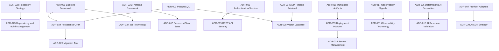

# DevPath Architecture Decision Record Catalog

## 1. Purpose and Scope

### 1.1 Purpose

This document is the authoritative Architecture Decision Record catalog for DevPath. It records significant architectural decisions that are not fully determined by the SRS or architecture specifications, consolidates unresolved decisions from prior documents, and defines how decisions are proposed, accepted, reviewed, superseded, and traced into implementation.

This catalog MUST NOT replace `00_Project_Context.md` through `17_Coding_Standards.md`. Requirements belong in the SRS, architecture structures belong in architecture documents, implementation conventions belong in Coding Standards, and significant choices between viable alternatives belong in ADRs.

### 1.2 Scope

| Included | Excluded |
|---|---|
| ADR governance, statuses, templates, register, accepted architecture decisions, proposed technology decisions, dependencies, priorities, lifecycle, traceability | New product requirements, complete architecture specifications, source code, framework configuration, package manifests, SQL, deployment manifests, CI/CD pipelines, cloud resources, detailed implementation tasks, detailed test cases |

### 1.3 Intended Audience

| Role | Use |
|---|---|
| Project Owner | Approves scope, product-impacting decisions, and deferred choices |
| Architecture Owner | Maintains ADR integrity and architecture consistency |
| Implementation Owner | Uses ADRs to scaffold and implement without silent decisions |
| Security Reviewer | Reviews security-sensitive decisions and secrets/privacy impacts |
| Test Reviewer | Ensures validation and regression requirements are decision-aware |
| Operations Reviewer | Reviews deployment, observability, rollback, and recovery implications |

### 1.4 ADR Qualification

| Qualifies as ADR | Does Not Qualify as ADR |
|---|---|
| Technology choice, architecture style, persistent data strategy, API style, runtime packaging, security model, deployment strategy, irreversible or difficult-to-reverse decision | Requirement text, simple coding preference, routine refactor, local naming convention, implementation detail already mandated by prior documents |

## 2. ADR Governance

| Governance Topic | Rule |
|---|---|
| Proposal | Any contributor may propose an ADR when implementation would otherwise make a silent architecture decision |
| Review | Architecture Owner reviews all ADRs; Security/Test/Ops reviewers participate when impacted |
| Approval | Project Owner or delegated Architecture Owner approves accepted decisions |
| Evidence | Evidence MUST include context, alternatives, tradeoffs, affected documents, risks, and validation criteria |
| Disagreement | Disagreements MUST be recorded as rejected alternatives or open questions |
| Communication | Accepted ADRs MUST be linked from affected implementation work and documents |
| Blocking | Implementation MUST NOT proceed when a blocking ADR remains Proposed or Deferred |
| Emergency | Emergency decisions MAY be temporary but MUST be recorded and reviewed after the incident |
| Expiry | Temporary decisions MUST include a review date or trigger |

One person may hold multiple roles, but responsibilities remain explicit.

## 3. ADR Identification and Naming

| Rule | Standard |
|---|---|
| Identifier | `ADR-001`, `ADR-002`, sequential and never reused |
| Title | Decision-oriented, e.g., `ADR-003: Use PostgreSQL as the Primary Structured Data Store` |
| Ordering | Foundational architecture first, then data/API/backend/frontend/AI/deployment/tooling |
| Organization | This catalog is a single Markdown document; future split files MAY preserve same IDs |
| Supersession | Superseded ADRs remain in history and reference the replacing ADR |

## 4. Standard ADR Template

Every full ADR MUST contain:

| Field | Required Meaning |
|---|---|
| ADR ID / Title / Status | Unique identifier, decision title, and one valid status |
| Decision Date / Last Review Date | Accepted/proposed date and latest review date; TBD if not scheduled |
| Owners / Reviewers | Accountable owner and required reviewers |
| Related Requirements / Documents | SRS and architecture references |
| Context / Problem Statement | Why the decision exists and what problem it solves |
| Decision Drivers / Constraints | Evaluation criteria and non-negotiable constraints |
| Considered Options | At least two realistic options when alternatives exist |
| Decision / Rationale | Selected or proposed direction and why |
| Positive / Negative Consequences | Benefits and costs; negative consequences MUST NOT be omitted |
| Risks / Mitigations | Known risks and controls |
| Security/Data/API/Frontend/Backend/Test/Deployment/Observability Impact | Impact by architecture area; use N/A only when genuinely inapplicable |
| Migration or Adoption Plan | How adoption proceeds |
| Rollback or Reversal Strategy | How decision can be reversed or superseded |
| Validation Criteria / Review Triggers | Evidence needed and conditions for review |
| Supersedes / Superseded By / Related ADRs / Open Questions | Decision history and unresolved questions |

## 5. Decision Classification

| Classification Axis | Values |
|---|---|
| Category | Product Architecture, Backend, Frontend, Data, Integration, AI, Security, Observability, Testing, Deployment, Development Workflow, Governance |
| Reversibility | Easily Reversible, Reversible with Migration, Difficult to Reverse, Effectively Irreversible |
| Urgency | Blocking, Required Before MVP Completion, Required Before Production, Future Decision |
| Status | Proposed, Accepted, Deferred, Rejected, Deprecated, Superseded |

### 5.1 ADR Status Model

| Status | Definition |
|---|---|
| Proposed | Documented but not approved; implementation MUST NOT treat it as authoritative |
| Accepted | Approved and authoritative |
| Deferred | Intentionally postponed because it is not required now or lacks evidence |
| Rejected | Explicitly declined |
| Deprecated | Historically relevant but should not be used for new implementation |
| Superseded | Replaced by a newer ADR |

Ambiguous statuses such as Draft Complete, Almost Accepted, Temporarily Final, and In Progress MUST NOT be used.

## 6. Decision Evaluation Model

ADRs use qualitative criteria, not unsupported numerical scoring.

| Criterion | Meaning |
|---|---|
| Requirement fit | Satisfies SRS and architecture constraints |
| Architectural consistency | Aligns with modular monolith, DDD, security, observability, testing, deployment |
| Complexity | Implementation and operational complexity |
| Security/privacy | Ability to protect users, providers, prompts, embeddings, and generated artifacts |
| Performance/scalability/reliability | Fit for expected workloads without inventing guarantees |
| Testability/observability | Ability to validate and diagnose |
| Maintainability/familiarity/ecosystem | Long-term development practicality |
| Vendor lock-in/cost | Cost and portability risk |
| Migration difficulty/reversibility | Effort to change later |
| Time to MVP | Practicality for graduation-project delivery |

| Scale | Meaning |
|---|---|
| Strong Advantage | Clearly better for current constraints |
| Advantage | Better with manageable tradeoffs |
| Neutral | No decisive difference or context-dependent |
| Disadvantage | Meaningful drawback |
| Strong Disadvantage | Conflicts with major requirement or constraint |
| Unknown | Evidence missing |

## 7. Consolidated Decision Register

| ADR ID | Title | Category | Status | Urgency | Reversibility | Owner | Affected Documents | Target Decision | Dependency | Related ADRs |
|---|---|---|---|---|---|---|---|---|---|---|
| ADR-001 | Adopt a Modular Monolith for the Initial Backend | Backend | Accepted | Blocking | Reversible with Migration | Architecture | 11,16,17 | Accepted | None | ADR-002 |
| ADR-002 | Apply Hexagonal and Clean Architecture Boundaries | Backend | Accepted | Blocking | Difficult to Reverse | Architecture | 07,11,17 | Accepted | ADR-001 | ADR-007 |
| ADR-003 | Use PostgreSQL as the Primary Structured Data Store | Data | Accepted | Blocking | Difficult to Reverse | Data | 08,09,16 | Accepted | ADR-001 | ADR-004, ADR-024 |
| ADR-004 | Use Redis Only for Non-Authoritative Cache and Coordination | Data | Accepted | Required Before MVP | Easily Reversible | Backend/Ops | 09,13,16,17 | Accepted | ADR-003 | ADR-028 |
| ADR-005 | Use Contract-First REST APIs | Backend | Accepted | Blocking | Reversible with Migration | API | 10,12,15,17 | Accepted | ADR-020 | ADR-021 |
| ADR-006 | Separate Deterministic Engines from AI Generation | AI | Accepted | Blocking | Effectively Irreversible | Architecture/AI | 00,02,03,04,17 | Accepted | None | ADR-015 |
| ADR-007 | Use Provider Ports and Adapters for External Services | Integration | Accepted | Blocking | Reversible with Migration | Backend | 04,06,11,17 | Accepted | ADR-002 | ADR-030 |
| ADR-008 | Version Rules, Profiles, Prompts, and Validators Independently | Governance | Accepted | Blocking | Difficult to Reverse | Architecture | 02,03,05,16 | Accepted | ADR-006 | ADR-015 |
| ADR-009 | Treat Repository Snapshots and Historical Analysis Results as Immutable | Data | Accepted | Blocking | Effectively Irreversible | Data/Rule | 07,08,09,13,17 | Accepted | ADR-003 | ADR-006 |
| ADR-010 | Use Asynchronous Jobs for Long-Running Workflows | Backend | Accepted | Blocking | Reversible with Migration | Backend/Ops | 10,11,14,15,16 | Accepted | ADR-001 | ADR-028 |
| ADR-011 | Separate API, Worker, and Scheduler Runtime Responsibilities | Deployment | Accepted | Required Before MVP | Reversible with Migration | Platform | 11,16 | Accepted | ADR-010 | ADR-027 |
| ADR-012 | Use Feature-Oriented Frontend Architecture | Frontend | Accepted | Blocking | Reversible with Migration | Frontend | 12,17 | Accepted | ADR-021 | ADR-013 |
| ADR-013 | Separate Server State from Client State in the Frontend | Frontend | Accepted | Blocking | Reversible with Migration | Frontend | 12,17 | Accepted | ADR-012 | ADR-034 |
| ADR-014 | Use Authorization-Filtered Knowledge Retrieval | Security/Data | Accepted | Blocking | Difficult to Reverse | Knowledge/Security | 06,13,15,17 | Accepted | ADR-003, ADR-029 | ADR-006 |
| ADR-015 | Treat AI Responses as Untrusted Until Validated | AI/Security | Accepted | Blocking | Difficult to Reverse | AI/Security | 04,05,13,15,17 | Accepted | ADR-006 | ADR-030 |
| ADR-016 | Build Once and Promote Immutable Artifacts | Deployment | Accepted | Required Before MVP | Reversible with Migration | Platform | 16 | Accepted | ADR-020, ADR-021 | ADR-032 |
| ADR-017 | Use Structured Logs, Metrics, and Distributed Tracing as Separate Signals | Observability | Accepted | Required Before MVP | Reversible with Migration | Ops | 14,15,17 | Accepted | None | ADR-031 |
| ADR-018 | Keep Audit Records Separate from Operational Logs | Security/Observability | Accepted | Required Before MVP | Difficult to Reverse | Security/Ops | 13,14,16 | Accepted | ADR-017 | ADR-015 |
| ADR-019 | Use Layered Test Strategy with Deterministic Golden Datasets | Testing | Accepted | Blocking | Reversible with Migration | QA | 15,17 | Accepted | ADR-006 | ADR-035 |
| ADR-020 | Backend Language and Framework | Backend | Accepted | Blocking | Difficult to Reverse | Backend | 11,17 | Accepted | ADR-001 | ADR-024 |
| ADR-021 | Frontend Framework | Frontend | Accepted | Blocking | Difficult to Reverse | Frontend | 12,17 | Accepted | ADR-012 | ADR-034 |
| ADR-022 | Repository Strategy | Development Workflow | Accepted | Blocking | Reversible with Migration | Architecture | 16,17 | Accepted | None | ADR-023 |
| ADR-023 | Dependency and Build Management | Development Workflow | Accepted | Blocking | Difficult to Reverse | Platform | 16,17 | Accepted | ADR-020, ADR-021, ADR-022 | ADR-016 |
| ADR-024 | Persistence and ORM Approach | Data | Accepted | Blocking | Difficult to Reverse | Data/Backend | 00,08,09,11,15,17,19 | Accepted | ADR-003, ADR-020 | ADR-025 |
| ADR-025 | Database Migration Tool | Data/Deployment | Accepted | Blocking | Reversible with Migration | Data/Ops | 00,09,11,15,16,17,19 | Accepted | ADR-020, ADR-024 | ADR-003 |
| ADR-026 | Authentication and Session Model | Security | Accepted | Blocking | Difficult to Reverse | Security/Backend | 00,08,09,10,11,12,13,15,16,17,19 | Accepted | ADR-020, ADR-021 | ADR-005, ADR-034 |
| ADR-027 | Background Job Technology | Backend/Deployment | Proposed | Blocking | Difficult to Reverse | Backend/Ops | 11,16 | Before job implementation | ADR-010, ADR-020, ADR-003 | ADR-004 |
| ADR-028 | Vector Database | Data/AI | Proposed | Blocking | Difficult to Reverse | Knowledge/Data | 06,09,11,16 | Before knowledge implementation | ADR-003, ADR-014 | ADR-029 |
| ADR-029 | Object Storage | Data/Deployment | Proposed | Blocking | Reversible with Migration | Ops/Data | 09,13,16 | Before artifact implementation | ADR-016 | ADR-014 |
| ADR-030 | AI Provider SDK Strategy | AI/Integration | Proposed | Required Before MVP | Reversible with Migration | AI | 04,05,17 | Before AI adapter implementation | ADR-007, ADR-015 | ADR-006 |
| ADR-031 | Observability Technology | Observability | Proposed | Required Before MVP | Reversible with Migration | Ops | 14,16 | Before production readiness | ADR-017 | ADR-018 |
| ADR-032 | Testing Toolchain | Testing | Accepted | Blocking | Reversible with Migration | QA | 15,17 | Accepted | ADR-020, ADR-021 | ADR-019 |
| ADR-033 | Deployment Platform | Deployment | Proposed | Required Before MVP | Difficult to Reverse | Platform | 16 | Before staging | ADR-016, ADR-023 | ADR-031 |
| ADR-034 | Secrets Management | Security/Deployment | Proposed | Required Before MVP | Difficult to Reverse | Security/Ops | 13,16 | Before environment setup | ADR-033 | ADR-026 |
| ADR-035 | Git Workflow | Development Workflow | Accepted | Blocking | Easily Reversible | Engineering | 17 | Accepted | ADR-022 | ADR-023 |

## 8. Implementation-Blocking Decisions

| Decision | Why Blocking | Minimum Information Required | Affected Modules | Consequence of Delay |
|---|---|---|---|---|
| Repository strategy | Determines source layout and build boundaries | Monorepo vs split repo decision | All | Scaffolding churn |
| Backend language/framework | Determines backend structure, tests, dependencies | Confirm Spring Boot stack/version/language | Backend, workers, migrations | Rework package structure |
| Frontend framework | Determines routing, state, component patterns | Confirm React stack/version | Frontend | Rework UI scaffolding |
| API implementation approach | Contract generation and controller conventions | REST/OpenAPI tooling decision | API/frontend | Contract drift |
| Persistence/ORM approach | Accepted by ADR-024; implementation must follow explicit adapter mapping | Spring Data JPA/Hibernate with separate persistence models | Data/backend | No remaining decision delay |
| Migration tool category | Accepted by ADR-025; schema evolution is Flyway-owned | Flyway versioned SQL policy | Data/deployment | No remaining decision delay |
| Authentication/session model | Accepted by ADR-026; implementation must follow server-managed session controls | GitHub OAuth2 Login plus opaque server session | Identity/API/frontend | No remaining decision delay |
| Background job execution model | Sync, analysis, AI, export depend on it | Queue/store/runtime strategy | Workers/schedulers | Lost or duplicated jobs |
| Vector Database choice | Knowledge indexing/retrieval depends on it | pgvector vs dedicated vector store | Knowledge/AI/data | Re-index migration |
| Object Storage choice | Artifact and export delivery depend on it | S3-compatible/cloud/local-dev strategy | Portfolio/export/storage | Storage migration |
| AI SDK/provider abstraction | AI adapters and validators depend on it | SDK vs abstraction strategy | AI/prompt | Adapter rewrite |
| Test framework categories | Quality gates depend on framework choices | Backend/frontend/E2E toolchain | All | Delayed CI |
| Local-development execution model | Developer setup and fixtures depend on it | Runtime/storage/substitute strategy | All | Slow onboarding |
| Package/module structure | Architecture tests and code ownership depend on it | Final package convention | Backend/frontend | Boundary drift |
| Build/dependency management | Artifact and CI depend on it | Build tools and lock strategy | All | Non-reproducible builds |

## 9. Decisions That Should Be Deferred

| Deferred Decision | Reason for Deferral | Reconsideration Trigger | Safe Current Assumption | Future Option Preserved |
|---|---|---|---|---|
| Microservice extraction | MVP does not require distributed services | Module scale, team scale, independent deployment need | Modular monolith with clear boundaries | Extract by module |
| Multi-region deployment | Unsupported operational complexity | Production SaaS with regional resilience needs | Single-region/environment deployment TBD | Portable deployment model |
| Organization-level tenancy | Future product scope | Organization beta requirements | User-only ownership with tenant-ready references | Add organization context |
| Enterprise SSO | Not required for target MVP users | Enterprise customer requirement | OAuth user login | External identity integration |
| Advanced event streaming | Current workflows can use jobs/events | High throughput or event integration need | DB-backed/outbox first | Broker/event platform |
| Dedicated workflow engine | Current workflows are bounded | Complex orchestration or long-running sagas | Job state model | Workflow engine integration |
| Multi-cloud deployment | Cost and complexity too high | Business resilience/vendor requirements | Cloud-neutral concepts | Provider abstraction |
| Complex autoscaling | No approved capacity target | Load testing shows need | Bounded workers and queues | Autoscaling later |
| Full DR topology | RPO/RTO values TBD | Production SaaS transition | Backup/restore verification | DR architecture |
| Advanced model-routing optimization | AI MVP needs safe routing first | Cost/latency optimization pressure | Explicit provider routing | Optimization layer |
| Production-grade experimentation platform | Product experiments not MVP-critical | Product analytics and A/B testing need | Feature flags with owner/expiry | Experiment platform |

## 10. Accepted ADR Entries

### 10.1 ADR-001: Adopt a Modular Monolith for the Initial Backend

| Field | Entry |
|---|---|
| Status | Accepted |
| Decision Date / Last Review Date | 2026-07-26 / 2026-07-26 |
| Owners / Reviewers | Architecture Owner / Backend, Test, Operations Reviewers |
| Related Requirements / Documents | `11_Backend_Architecture.md`, `16_Deployment_Guide.md`, `17_Coding_Standards.md` |
| Context | DevPath has many domain modules but a small initial team and graduation-project constraints. |
| Problem Statement | Choose backend architecture that supports DDD boundaries without microservice operational burden. |
| Decision Drivers / Constraints | Module boundaries, testability, deployment simplicity, transaction handling, future extraction. |
| Considered Options | Modular Monolith; Microservices; Serverless Functions as Primary Architecture; Traditional Layered Monolith. |
| Decision / Rationale | Use a modular monolith initially. It balances clear boundaries with operational simplicity and future extraction options. |
| Positive Consequences | Simpler deployment, easier transactions, lower cost, strong module ownership. |
| Negative Consequences | Requires discipline to prevent boundary erosion; independent scaling is limited. |
| Risks / Mitigations | Risk: monolith becomes tangled. Mitigation: module contracts, architecture tests, code review. |
| Security/Data/API/Frontend/Backend/Test/Deployment/Observability Impact | Backend modules stay in one deployable; API and data boundaries remain explicit; tests enforce dependencies; deployment simpler; observability labels by module. |
| Migration or Adoption Plan | Scaffold backend by bounded module with domain/application/infrastructure/API layers. |
| Rollback or Reversal Strategy | Extract modules later by trigger and ADR; do not prematurely distribute. |
| Validation Criteria / Review Triggers | Module dependency tests pass; review if team/scale requires independent deployment. |
| Supersedes / Superseded By / Related ADRs / Open Questions | Supersedes N/A; Superseded By N/A; Related ADR-002, ADR-011; Open Questions: exact package layout under ADR-020/023. |

### 10.2 ADR-002: Apply Hexagonal and Clean Architecture Boundaries

| Field | Entry |
|---|---|
| Status | Accepted |
| Decision Date / Last Review Date | 2026-07-26 / 2026-07-26 |
| Owners / Reviewers | Architecture Owner / Backend, Test Reviewers |
| Related Requirements / Documents | `07_Domain_Model.md`, `11_Backend_Architecture.md`, `17_Coding_Standards.md` |
| Context | Domain rules, deterministic engines, providers, and persistence must remain separated. |
| Problem Statement | Prevent framework, provider, and storage concerns from leaking into business logic. |
| Decision Drivers / Constraints | Domain isolation, ports/adapters, testability, provider isolation, implementation overhead. |
| Considered Options | Hexagonal Architecture; Traditional Layered Architecture; Active Record-Centered Architecture; Framework-Centric Architecture. |
| Decision / Rationale | Apply pragmatic Hexagonal/Clean boundaries without purity theater. |
| Positive Consequences | Better testability, provider isolation, clearer dependency direction. |
| Negative Consequences | More mapping code and initial structure. |
| Risks / Mitigations | Risk: excessive abstraction. Mitigation: only introduce ports where boundaries matter. |
| Security/Data/API/Frontend/Backend/Test/Deployment/Observability Impact | Security checks stay in backend use cases; provider data is isolated; tests can use ports; observability names module operations. |
| Migration or Adoption Plan | Define module layers and dependency checks during scaffolding. |
| Rollback or Reversal Strategy | Can simplify internal adapters if over-engineered, while preserving domain isolation. |
| Validation Criteria / Review Triggers | Domain has no framework/ORM/SDK dependency; review if boundary overhead blocks MVP. |
| Supersedes / Superseded By / Related ADRs / Open Questions | Related ADR-001, ADR-007, ADR-024. |

### 10.3 ADR-003: Use PostgreSQL as the Primary Structured Data Store

| Field | Entry |
|---|---|
| Status | Accepted |
| Decision Date / Last Review Date | 2026-07-26 / 2026-07-26 |
| Owners / Reviewers | Data Owner / Backend, Security, Operations Reviewers |
| Related Requirements / Documents | `08_System_Data_Model.md`, `09_Database_Design.md`, `16_Deployment_Guide.md` |
| Context | DevPath requires relational ownership, audit, immutable results, configuration versions, and transactional consistency. |
| Problem Statement | Select primary structured data store. |
| Decision Drivers / Constraints | Relational domain model, transactions, migrations, local development, operational maturity. |
| Considered Options | PostgreSQL; MySQL-compatible relational database; Document database; Distributed SQL database. |
| Decision / Rationale | Use PostgreSQL as primary structured-data Source of Truth. |
| Positive Consequences | Mature transactions, relational integrity, JSON support where needed, strong ecosystem. |
| Negative Consequences | Requires schema discipline and migrations; horizontal scaling is not automatic. |
| Risks / Mitigations | Risk: schema evolution complexity. Mitigation: migration ADR and expand-contract strategy. |
| Security/Data/API/Frontend/Backend/Test/Deployment/Observability Impact | Data ownership and immutability are enforced; APIs read/write through backend; tests use persistence integration; deployment must migrate safely. |
| Migration or Adoption Plan | Implement versioned schema and repository adapters. |
| Rollback or Reversal Strategy | Difficult; future migration requires data export/import and dual-write planning. |
| Validation Criteria / Review Triggers | Schema supports core aggregates; review if scale or data model changes significantly. |
| Supersedes / Superseded By / Related ADRs / Open Questions | Related ADR-024, ADR-025, ADR-028. |

### 10.4 ADR-004: Use Redis Only for Non-Authoritative Cache and Coordination

| Field | Entry |
|---|---|
| Status | Accepted |
| Decision Date / Last Review Date | 2026-07-26 / 2026-07-26 |
| Owners / Reviewers | Backend/Ops / Security Reviewer |
| Related Requirements / Documents | `09_Database_Design.md`, `13_Security_Architecture.md`, `16_Deployment_Guide.md` |
| Context | Redis is useful for cache, locks, rate limits, and transient coordination. |
| Problem Statement | Decide Redis authority level. |
| Decision Drivers / Constraints | TTL, cache failure, coordination, source-of-truth protection. |
| Considered Options | Redis; in-process cache only; database-backed coordination; alternative distributed cache. |
| Decision / Rationale | Use Redis only for non-authoritative cache and coordination. |
| Positive Consequences | Fast transient state and simpler coordination. |
| Negative Consequences | Adds operational dependency and serialization/versioning concerns. |
| Risks / Mitigations | Risk: accidental source-of-truth use. Mitigation: coding standards and tests prohibit it. |
| Security/Data/API/Frontend/Backend/Test/Deployment/Observability Impact | Cache data must be redacted and TTL-bound; API cannot rely on cache for authority; deployment treats Redis as recoverable. |
| Migration or Adoption Plan | Add Redis only behind cache/coordination ports. |
| Rollback or Reversal Strategy | Fall back to PostgreSQL/source-of-truth paths where safe. |
| Validation Criteria / Review Triggers | Tests prove cache outage does not corrupt business state. |
| Supersedes / Superseded By / Related ADRs / Open Questions | Related ADR-027. |

### 10.5 ADR-005: Use Contract-First REST APIs

| Field | Entry |
|---|---|
| Status | Accepted |
| Decision Date / Last Review Date | 2026-07-26 / 2026-07-26 |
| Owners / Reviewers | API Owner / Frontend, QA Reviewers |
| Related Requirements / Documents | `10_API_Specification.md`, `12_Frontend_Architecture.md`, `15_Test_Architecture.md` |
| Context | Frontend/backend integration and async job APIs require stable contracts. |
| Problem Statement | Select API style for MVP. |
| Decision Drivers / Constraints | Compatibility, documentation, generated clients, async jobs, uploads, versioning. |
| Considered Options | REST with OpenAPI or equivalent; GraphQL; RPC; BFF-only contracts. |
| Decision / Rationale | Use contract-first REST APIs for v1. |
| Positive Consequences | Clear documentation, contract testing, easier frontend integration. |
| Negative Consequences | Dashboard composition may require multiple endpoints; GraphQL remains future option. |
| Risks / Mitigations | Risk: contract drift. Mitigation: contract tests and generated/client validation policy. |
| Security/Data/API/Frontend/Backend/Test/Deployment/Observability Impact | API security and DTO rules map to contract; frontend consumes stable API; tests enforce schemas. |
| Migration or Adoption Plan | Maintain API spec before implementation changes. |
| Rollback or Reversal Strategy | Add GraphQL/BFF later only through ADR; do not replace v1 silently. |
| Validation Criteria / Review Triggers | API contract tests pass; review if dashboard read complexity becomes high. |
| Supersedes / Superseded By / Related ADRs / Open Questions | Related ADR-021, ADR-032. |

### 10.6 ADR-006: Separate Deterministic Engines from AI Generation

| Field | Entry |
|---|---|
| Status | Accepted |
| Decision Date / Last Review Date | 2026-07-26 / 2026-07-26 |
| Owners / Reviewers | Architecture/AI / Rule, Career, Security Reviewers |
| Related Requirements / Documents | `00_Project_Context.md`, `02_Rule_Engine.md`, `03_Career_Path_Engine.md`, `04_AI_Architecture.md` |
| Context | DevPath philosophy states Rule Engine calculates and AI explains. |
| Problem Statement | Decide whether LLMs can influence authoritative scores. |
| Decision Drivers / Constraints | Measurability, reproducibility, trust, explainability, security. |
| Considered Options | Strict separation; LLM-assisted scoring; LLM-first analysis; hybrid AI overrides. |
| Decision / Rationale | Rule Engine and Career Engine are authoritative deterministic calculators; LLMs explain and generate only. |
| Positive Consequences | Reproducible scores, testable rules, clear trust boundary. |
| Negative Consequences | More rule-engine work; AI cannot fill scoring gaps automatically. |
| Risks / Mitigations | Risk: AI text implies scoring authority. Mitigation: prompt constraints and response validation. |
| Security/Data/API/Frontend/Backend/Test/Deployment/Observability Impact | AI outputs are untrusted; frontend cannot calculate scores; deterministic golden datasets are required. |
| Migration or Adoption Plan | Implement separate modules and validation gates. |
| Rollback or Reversal Strategy | Effectively irreversible without changing SRS/project philosophy. |
| Validation Criteria / Review Triggers | Tests show no LLM call in deterministic engines; review only if SRS changes. |
| Supersedes / Superseded By / Related ADRs / Open Questions | Related ADR-008, ADR-015, ADR-019. |

### 10.7 ADR-007: Use Provider Ports and Adapters for External Services

| Field | Entry |
|---|---|
| Status | Accepted |
| Decision Date / Last Review Date | 2026-07-26 / 2026-07-26 |
| Owners / Reviewers | Backend/Integration / AI, Security Reviewers |
| Related Requirements / Documents | `04_AI_Architecture.md`, `06_Knowledge_Architecture.md`, `11_Backend_Architecture.md`, `17_Coding_Standards.md` |
| Context | GitHub, Notion, AI providers, object storage, notifications, and vector stores may vary. |
| Problem Statement | Prevent provider-specific models and errors from leaking into domain/application code. |
| Decision Drivers / Constraints | Vendor isolation, testability, error normalization, feature differences. |
| Considered Options | Ports/adapters; direct SDK usage; provider-specific application modules; generic HTTP calls. |
| Decision / Rationale | Use provider ports and adapters for external services. |
| Positive Consequences | Testable boundaries, normalized errors, easier provider replacement. |
| Negative Consequences | Adapter mapping overhead and possible abstraction leakage. |
| Risks / Mitigations | Risk: lowest-common-denominator abstraction. Mitigation: capability-specific ports. |
| Security/Data/API/Frontend/Backend/Test/Deployment/Observability Impact | Secrets stay server-side; provider telemetry is normalized; contract adapter tests are required. |
| Migration or Adoption Plan | Define ports before adapter implementation. |
| Rollback or Reversal Strategy | Adapter internals can change without domain changes. |
| Validation Criteria / Review Triggers | No provider SDK type crosses adapter boundary. |
| Supersedes / Superseded By / Related ADRs / Open Questions | Related ADR-030. |

### 10.8 ADR-008: Version Rules, Profiles, Prompts, and Validators Independently

| Field | Entry |
|---|---|
| Status | Accepted |
| Decision Date / Last Review Date | 2026-07-26 / 2026-07-26 |
| Owners / Reviewers | Architecture / Rule, Career, AI, Ops Reviewers |
| Related Requirements / Documents | `02_Rule_Engine.md`, `03_Career_Path_Engine.md`, `05_Prompt_Engineering.md`, `16_Deployment_Guide.md` |
| Context | Rules, career/company profiles, prompts, validators, and provider routing evolve at different rates. |
| Problem Statement | Decide whether configuration changes are tied to application releases. |
| Decision Drivers / Constraints | Reproducibility, rollback, audit, historical results. |
| Considered Options | Independent versioning; app-release-only versioning; mutable config without history; DB-current-state-only config. |
| Decision / Rationale | Version rules, profiles, prompts, validators, PromptContext schema, and provider routing independently. |
| Positive Consequences | Historical reproducibility and safer rollback. |
| Negative Consequences | More version metadata and activation governance. |
| Risks / Mitigations | Risk: version sprawl. Mitigation: release records and audit. |
| Security/Data/API/Frontend/Backend/Test/Deployment/Observability Impact | Deployment exposes active versions; tests use golden datasets; audit records activation. |
| Migration or Adoption Plan | Add version fields and activation workflow during implementation. |
| Rollback or Reversal Strategy | Re-activate previous version when compatible. |
| Validation Criteria / Review Triggers | Historical result can identify versions used. |
| Supersedes / Superseded By / Related ADRs / Open Questions | Related ADR-006, ADR-016. |

### 10.9 ADR-009: Treat Repository Snapshots and Historical Analysis Results as Immutable

| Field | Entry |
|---|---|
| Status | Accepted |
| Decision Date / Last Review Date | 2026-07-26 / 2026-07-26 |
| Owners / Reviewers | Data/Rule / Security, Test Reviewers |
| Related Requirements / Documents | `07_Domain_Model.md`, `08_System_Data_Model.md`, `09_Database_Design.md`, `13_Security_Architecture.md` |
| Context | Growth and historical readiness depend on reproducible analysis. |
| Problem Statement | Decide whether snapshots/results can be overwritten. |
| Decision Drivers / Constraints | Reproducibility, auditability, storage cost, correction strategy. |
| Considered Options | Immutable snapshots/results; mutable latest-state records; overwrite-in-place analysis; event-sourced storage. |
| Decision / Rationale | RepositorySnapshot and historical AnalysisResult are immutable. Corrections create new versions/results. |
| Positive Consequences | Trustworthy history and explainability. |
| Negative Consequences | Higher storage and retention management. |
| Risks / Mitigations | Risk: storage growth. Mitigation: retention categories and archival policies. |
| Security/Data/API/Frontend/Backend/Test/Deployment/Observability Impact | API exposes history safely; DB enforces immutability; tests verify mutation rejection. |
| Migration or Adoption Plan | Model append-only records and result references. |
| Rollback or Reversal Strategy | New correction records rather than editing history. |
| Validation Criteria / Review Triggers | Mutation attempts fail; review retention cost. |
| Supersedes / Superseded By / Related ADRs / Open Questions | Related ADR-003, ADR-006. |

### 10.10 ADR-010: Use Asynchronous Jobs for Long-Running Workflows

| Field | Entry |
|---|---|
| Status | Accepted |
| Decision Date / Last Review Date | 2026-07-26 / 2026-07-26 |
| Owners / Reviewers | Backend/Ops / API, QA Reviewers |
| Related Requirements / Documents | `10_API_Specification.md`, `11_Backend_Architecture.md`, `14_Observability.md`, `15_Test_Architecture.md` |
| Context | Repository sync, analysis, ingestion, embedding, AI generation, and export can be slow. |
| Problem Statement | Decide execution model for long-running workflows. |
| Decision Drivers / Constraints | Status, retries, idempotency, progress, user experience, worker deployment. |
| Considered Options | Persistent async jobs; synchronous HTTP; in-memory background tasks; external workflow engine. |
| Decision / Rationale | Use persistent asynchronous jobs for long-running work. |
| Positive Consequences | Better UX, retry handling, progress visibility, operational control. |
| Negative Consequences | Requires job state model and worker operations. |
| Risks / Mitigations | Risk: duplicate execution. Mitigation: idempotency and deduplication standards. |
| Security/Data/API/Frontend/Backend/Test/Deployment/Observability Impact | API returns job status; frontend polls/observes; workers propagate correlation; tests cover job lifecycle. |
| Migration or Adoption Plan | Implement job model before long-running feature implementation. |
| Rollback or Reversal Strategy | Queue technology can change under job abstraction. |
| Validation Criteria / Review Triggers | Each job type has state, retry, failure, and result references. |
| Supersedes / Superseded By / Related ADRs / Open Questions | Technology choice remains ADR-027. |

### 10.11 ADR-011: Separate API, Worker, and Scheduler Runtime Responsibilities

| Field | Entry |
|---|---|
| Status | Accepted |
| Decision Date / Last Review Date | 2026-07-26 / 2026-07-26 |
| Owners / Reviewers | Platform / Backend, Ops Reviewers |
| Related Requirements / Documents | `11_Backend_Architecture.md`, `16_Deployment_Guide.md` |
| Context | API request handling, background jobs, and scheduling have different lifecycle needs. |
| Problem Statement | Decide runtime responsibility separation. |
| Decision Drivers / Constraints | Deployment, scaling, shutdown, job safety, shared code, simplicity. |
| Considered Options | One build artifact with runtime modes; independent artifacts; one process for all; serverless per task. |
| Decision / Rationale | Separate runtime responsibilities. Exact packaging remains technology-dependent. |
| Positive Consequences | Safer shutdown, clearer scaling, reduced API/job interference. |
| Negative Consequences | More deployment units and version compatibility concerns. |
| Risks / Mitigations | Risk: packaging complexity. Mitigation: shared artifact with modes may be used initially. |
| Security/Data/API/Frontend/Backend/Test/Deployment/Observability Impact | Worker identity and readiness are distinct; deployment checks each runtime. |
| Migration or Adoption Plan | Define API/worker/scheduler modes during scaffolding. |
| Rollback or Reversal Strategy | Runtime packaging can evolve through ADR-023/033. |
| Validation Criteria / Review Triggers | Active jobs survive deployment; API readiness separate from worker readiness. |
| Supersedes / Superseded By / Related ADRs / Open Questions | Related ADR-010, ADR-016. |

### 10.12 ADR-012: Use Feature-Oriented Frontend Architecture

| Field | Entry |
|---|---|
| Status | Accepted |
| Decision Date / Last Review Date | 2026-07-26 / 2026-07-26 |
| Owners / Reviewers | Frontend / Product, QA Reviewers |
| Related Requirements / Documents | `12_Frontend_Architecture.md`, `17_Coding_Standards.md` |
| Context | DevPath frontend contains dashboard, analysis, AI, portfolio, resume, admin, and integration features. |
| Problem Statement | Choose frontend source organization. |
| Decision Drivers / Constraints | Feature ownership, API integration, shared components, scalability, simplicity. |
| Considered Options | Feature-oriented architecture; technical-layer-only; atomic-design-only; route-only. |
| Decision / Rationale | Use feature-oriented frontend architecture with shared/platform areas. |
| Positive Consequences | Clear feature ownership and easier scaling. |
| Negative Consequences | Requires boundaries between feature internals. |
| Risks / Mitigations | Risk: shared folder sprawl. Mitigation: public exports and review. |
| Security/Data/API/Frontend/Backend/Test/Deployment/Observability Impact | Feature tests and route ownership become clearer; frontend still avoids authoritative calculations. |
| Migration or Adoption Plan | Scaffold features and public APIs. |
| Rollback or Reversal Strategy | Can reorganize features with compatibility tests if early. |
| Validation Criteria / Review Triggers | Feature modules do not import other feature internals. |
| Supersedes / Superseded By / Related ADRs / Open Questions | Related ADR-013, ADR-021. |

### 10.13 ADR-013: Separate Server State from Client State in the Frontend

| Field | Entry |
|---|---|
| Status | Accepted |
| Decision Date / Last Review Date | 2026-07-26 / 2026-07-26 |
| Owners / Reviewers | Frontend / API, QA Reviewers |
| Related Requirements / Documents | `12_Frontend_Architecture.md`, `17_Coding_Standards.md` |
| Context | DevPath uses API data, async jobs, cached dashboards, forms, and local UI state. |
| Problem Statement | Avoid mixing server cache, session, route, form, and client UI state. |
| Decision Drivers / Constraints | Cache invalidation, async jobs, stale data, testing, framework dependency. |
| Considered Options | Explicit server-state library/abstraction; global store for all state; component-local fetching only; direct API calls in components. |
| Decision / Rationale | Separate server state from client state; exact library remains ADR-021/032 dependent. |
| Positive Consequences | Better cache/invalidation behavior and testability. |
| Negative Consequences | Requires state ownership conventions. |
| Risks / Mitigations | Risk: duplicate state. Mitigation: frontend coding standards. |
| Security/Data/API/Frontend/Backend/Test/Deployment/Observability Impact | Frontend avoids direct provider/header handling; job polling is consistent. |
| Migration or Adoption Plan | Define query keys and view models during implementation. |
| Rollback or Reversal Strategy | Library can change behind abstraction. |
| Validation Criteria / Review Triggers | No authoritative score recalculation in frontend state. |
| Supersedes / Superseded By / Related ADRs / Open Questions | Related ADR-012, ADR-021. |

### 10.14 ADR-014: Use Authorization-Filtered Knowledge Retrieval

| Field | Entry |
|---|---|
| Status | Accepted |
| Decision Date / Last Review Date | 2026-07-26 / 2026-07-26 |
| Owners / Reviewers | Knowledge/Security / AI, Data Reviewers |
| Related Requirements / Documents | `06_Knowledge_Architecture.md`, `13_Security_Architecture.md`, `15_Test_Architecture.md` |
| Context | Knowledge retrieval may search private repository and Notion-derived content. |
| Problem Statement | Ensure semantic relevance never bypasses access control. |
| Decision Drivers / Constraints | User isolation, metadata filtering, deletion, re-indexing, defense in depth. |
| Considered Options | Authorization before returning results; retrieve first/filter later; index-per-user only; shared unfiltered semantic index. |
| Decision / Rationale | Retrieval MUST apply authorization filters before returning context. Relevance cannot override authorization. |
| Positive Consequences | Strong privacy and security boundary. |
| Negative Consequences | More metadata and filtering complexity; possible performance cost. |
| Risks / Mitigations | Risk: missing metadata. Mitigation: deny retrieval when authorization metadata is missing. |
| Security/Data/API/Frontend/Backend/Test/Deployment/Observability Impact | Vector DB must store ownership metadata; tests cover cross-user retrieval; observability tracks filter rejection. |
| Migration or Adoption Plan | Include owner/source metadata in chunk/index schema. |
| Rollback or Reversal Strategy | Cannot roll back without security architecture change. |
| Validation Criteria / Review Triggers | Cross-user retrieval tests fail closed. |
| Supersedes / Superseded By / Related ADRs / Open Questions | Related ADR-028. |

### 10.15 ADR-015: Treat AI Responses as Untrusted Until Validated

| Field | Entry |
|---|---|
| Status | Accepted |
| Decision Date / Last Review Date | 2026-07-26 / 2026-07-26 |
| Owners / Reviewers | AI/Security / Prompt, QA Reviewers |
| Related Requirements / Documents | `04_AI_Architecture.md`, `05_Prompt_Engineering.md`, `13_Security_Architecture.md`, `15_Test_Architecture.md` |
| Context | LLM outputs can be malformed, hallucinated, injected, or unsafe. |
| Problem Statement | Decide trust boundary for AI responses. |
| Decision Drivers / Constraints | Schema validation, grounding, forbidden claims, score consistency, output escaping. |
| Considered Options | Mandatory response validation; provider structured-output trust; manual review only; raw response persistence/rendering. |
| Decision / Rationale | AI responses are untrusted until response validation succeeds. |
| Positive Consequences | Prevents score mutation, hidden prompt leakage, and unsafe artifacts. |
| Negative Consequences | More validator work and possible rejection of useful output. |
| Risks / Mitigations | Risk: validator gaps. Mitigation: adversarial tests and validator versioning. |
| Security/Data/API/Frontend/Backend/Test/Deployment/Observability Impact | Validated artifacts only; frontend escapes output; tests cover prompt injection and schema rejection. |
| Migration or Adoption Plan | Implement validators before AI persistence. |
| Rollback or Reversal Strategy | Validators can be updated/rolled back by version. |
| Validation Criteria / Review Triggers | Raw AI responses cannot bypass validator. |
| Supersedes / Superseded By / Related ADRs / Open Questions | Related ADR-006, ADR-008, ADR-030. |

### 10.16 ADR-016: Build Once and Promote Immutable Artifacts

| Field | Entry |
|---|---|
| Status | Accepted |
| Decision Date / Last Review Date | 2026-07-26 / 2026-07-26 |
| Owners / Reviewers | Platform / Security, QA Reviewers |
| Related Requirements / Documents | `16_Deployment_Guide.md` |
| Context | DevPath needs reproducible deployments across environments. |
| Problem Statement | Decide artifact promotion model. |
| Decision Drivers / Constraints | Environment consistency, traceability, rollback, secrets outside artifacts. |
| Considered Options | Build once/promote; rebuild per environment; mutable server deployment; source deployment. |
| Decision / Rationale | Build once and promote immutable artifacts. |
| Positive Consequences | Better traceability, repeatability, rollback. |
| Negative Consequences | Requires artifact registry and externalized config. |
| Risks / Mitigations | Risk: environment-specific config leakage. Mitigation: config outside artifacts. |
| Security/Data/API/Frontend/Backend/Test/Deployment/Observability Impact | Deployment records include artifact and config versions; secrets never embedded. |
| Migration or Adoption Plan | Define artifacts for frontend/backend/worker/config packages. |
| Rollback or Reversal Strategy | Promote prior artifact if data-compatible. |
| Validation Criteria / Review Triggers | Same artifact runs in multiple environments with external config. |
| Supersedes / Superseded By / Related ADRs / Open Questions | Related ADR-023, ADR-033. |

### 10.17 ADR-017: Use Structured Logs, Metrics, and Distributed Tracing as Separate Signals

| Field | Entry |
|---|---|
| Status | Accepted |
| Decision Date / Last Review Date | 2026-07-26 / 2026-07-26 |
| Owners / Reviewers | Ops / Backend, Security Reviewers |
| Related Requirements / Documents | `14_Observability.md`, `17_Coding_Standards.md` |
| Context | DevPath has synchronous requests, async jobs, AI calls, and provider dependencies. |
| Problem Statement | Decide observability signal model. |
| Decision Drivers / Constraints | Diagnosis, async correlation, cost, privacy, MVP scope. |
| Considered Options | Logs/metrics/traces; logs only; metrics/logs without tracing; vendor-specific monitoring as architecture. |
| Decision / Rationale | Use structured logs, metrics, and distributed tracing as distinct signals. |
| Positive Consequences | Better incident diagnosis and cross-boundary causality. |
| Negative Consequences | More instrumentation and telemetry cost. |
| Risks / Mitigations | Risk: sensitive telemetry. Mitigation: redaction and bounded labels. |
| Security/Data/API/Frontend/Backend/Test/Deployment/Observability Impact | Telemetry follows privacy rules; tests verify observability behavior. |
| Migration or Adoption Plan | Add context propagation and signal schemas during implementation. |
| Rollback or Reversal Strategy | Tooling can change if signal model remains. |
| Validation Criteria / Review Triggers | Critical journeys produce logs, metrics, traces. |
| Supersedes / Superseded By / Related ADRs / Open Questions | Technology choice remains ADR-031. |

### 10.18 ADR-018: Keep Audit Records Separate from Operational Logs

| Field | Entry |
|---|---|
| Status | Accepted |
| Decision Date / Last Review Date | 2026-07-26 / 2026-07-26 |
| Owners / Reviewers | Security/Ops / Backend Reviewers |
| Related Requirements / Documents | `13_Security_Architecture.md`, `14_Observability.md` |
| Context | Administrative and sensitive actions require authoritative history. |
| Problem Statement | Decide whether operational logs can serve audit needs. |
| Decision Drivers / Constraints | Integrity, retention, sensitive operations, implementation cost. |
| Considered Options | Dedicated audit records; operational logs as audit; database timestamps only; external audit service. |
| Decision / Rationale | Keep audit records separate from operational logs. |
| Positive Consequences | Clear accountability and retention rules. |
| Negative Consequences | Additional schema/storage and governance. |
| Risks / Mitigations | Risk: duplicate information. Mitigation: define audit fields and event ownership. |
| Security/Data/API/Frontend/Backend/Test/Deployment/Observability Impact | Admin changes and activations produce audit records; log retention cannot delete audit. |
| Migration or Adoption Plan | Implement audit model with restricted access. |
| Rollback or Reversal Strategy | Audit storage can evolve; records remain preserved. |
| Validation Criteria / Review Triggers | Sensitive actions create audit records distinct from logs. |
| Supersedes / Superseded By / Related ADRs / Open Questions | Related ADR-017. |

### 10.19 ADR-019: Use Layered Test Strategy with Deterministic Golden Datasets

| Field | Entry |
|---|---|
| Status | Accepted |
| Decision Date / Last Review Date | 2026-07-26 / 2026-07-26 |
| Owners / Reviewers | QA / Rule, Career, AI Reviewers |
| Related Requirements / Documents | `15_Test_Architecture.md`, `17_Coding_Standards.md` |
| Context | DevPath combines deterministic engines, API contracts, integrations, frontend, and AI output. |
| Problem Statement | Decide test portfolio and deterministic regression strategy. |
| Decision Drivers / Constraints | Feedback speed, reproducibility, maintenance, confidence, cost. |
| Considered Options | Layered testing; E2E-first; unit-tests-only; manual verification. |
| Decision / Rationale | Use layered tests and deterministic golden datasets for Rule/Career engines. |
| Positive Consequences | Fast confidence in core calculations and clear release gates. |
| Negative Consequences | Requires dataset maintenance and test ownership. |
| Risks / Mitigations | Risk: stale golden datasets. Mitigation: version datasets and review rule/profile changes. |
| Security/Data/API/Frontend/Backend/Test/Deployment/Observability Impact | Deterministic correctness is independent of AI; release gates require coverage. |
| Migration or Adoption Plan | Create golden datasets before implementing rule/profile changes. |
| Rollback or Reversal Strategy | Test toolchain can change while preserving strategy. |
| Validation Criteria / Review Triggers | Rule/Career tests run without LLMs and cover supported targets. |
| Supersedes / Superseded By / Related ADRs / Open Questions | Tool choice remains ADR-032. |

## 11. Scaffolding and Technology ADR Entries

### 11.1 ADR-020: Backend Language and Framework

| Field | Entry |
|---|---|
| Status | Accepted |
| Decision Date / Last Review Date | 2026-07-26 / 2026-07-26 |
| Owners / Reviewers | Backend / Architecture, QA, Ops |
| Related Documents | `00_Project_Context.md`, `11_Backend_Architecture.md`, `17_Coding_Standards.md` |
| Problem Statement | Confirm backend language/framework before scaffolding. |
| Considered Options | Java with Spring Boot; Kotlin with Spring Boot; TypeScript with NestJS; Python with FastAPI. |
| Evaluation Criteria | DDD support, modular monolith, type safety, async jobs, AI SDK ecosystem, testing, familiarity, speed, deployment footprint. |
| Decision / Rationale | Use Java with Spring Boot for the initial modular-monolith backend. The Project Context already names Spring Boot, repository evidence shows no incompatible implementation foundation, and Java provides the lowest-risk Spring Boot baseline without inventing undocumented Kotlin familiarity. |
| Version Policy | Use Java 21 LTS as the initial language baseline. Use a supported Spring Boot 3.x line at scaffolding time with exact versions pinned in build files. Patch/minor upgrades require successful tests and dependency review. |
| Application Style | One modular-monolith backend application with explicit bounded-context modules, API/worker/scheduler runtime modes where needed, and framework dependencies kept outside domain code. |
| Module Strategy | Domain-first backend package structure with domain/application/adapter/API boundaries inside each bounded module. |
| Dependency Injection Boundary | Spring dependency injection is allowed in API, application, and infrastructure layers; domain model and deterministic engines must not depend on Spring annotations. |
| Configuration / Validation / Serialization | Externalized configuration by environment; framework-supported request validation at boundaries; JSON serialization through the API layer only. |
| Positive Consequences | Aligns with the source stack, supports Spring Security, transactions, scheduling, observability, architecture tests, and broad AI-agent familiarity. |
| Negative Consequences | Java is more verbose than Kotlin and less uniform with the TypeScript frontend; Spring Boot footprint is larger than lightweight frameworks. |
| Risks / Mitigations | Risk: framework leakage into domain. Mitigation: ArchUnit-style boundary tests, code review, and coding standards. |
| Implementation May Proceed? | Backend scaffolding may proceed after ADR-022/023/032/035 are reflected in the repository plan. |
| Validation / Review Triggers | Local build, module-boundary test, minimal Spring context test, API contract validation, and package-boundary review. |
| Open Questions | Exact patch versions are implementation-time reproducibility details, not ADR blockers. |

### 11.2 ADR-021: Frontend Framework

| Field | Entry |
|---|---|
| Status | Accepted |
| Decision Date / Last Review Date | 2026-07-26 / 2026-07-26 |
| Owners / Reviewers | Frontend / Architecture, QA |
| Related Documents | `00_Project_Context.md`, `12_Frontend_Architecture.md`, `17_Coding_Standards.md` |
| Problem Statement | Confirm frontend framework and major frontend libraries. |
| Considered Options | React; Vue; another documented framework. |
| Evaluation Criteria | Ecosystem, type safety, feature architecture, server-state support, accessibility, testing, AI coding-agent support. |
| Decision / Rationale | Use React with TypeScript as a single-page authenticated web application. The Project Context already names React, TypeScript, TailwindCSS, and React Query, and the Frontend Architecture is feature-oriented around those assumptions. |
| Version Policy | Use actively supported React and TypeScript releases at scaffolding time with exact versions pinned in package lock files. |
| Rendering Model | Client-rendered SPA for the authenticated product. SSR and public SEO optimization remain future decisions. |
| Routing / Component Model | Frontend owns browser routing and route composition using a React Router-compatible routing baseline; React components are organized by feature with shared accessible primitives. |
| Build Tool / Package Relationship | Use a lightweight Vite-based frontend build category coordinated by ADR-023. |
| Browser Support Source | Browser support is defined by the selected frontend build configuration and accessibility requirements, not by ad hoc component choices. |
| Positive Consequences | Aligns with existing stack, TypeScript contracts, React Query server-state model, Tailwind styling, and mature testing ecosystem. |
| Negative Consequences | SPA behavior requires careful loading/error states; React ecosystem choices can sprawl without standards. |
| Risks / Mitigations | Risk: hidden business logic in components. Mitigation: API-driven view models, frontend standards, and contract tests. |
| Implementation May Proceed? | Frontend scaffolding may proceed after repository/build/test workflow decisions are synchronized. |
| Open Questions | Form, chart, rich-text editor, and analytics libraries remain non-scaffolding decisions. |

### 11.3 ADR-022: Repository Strategy

| Field | Entry |
|---|---|
| Status | Accepted |
| Decision Date / Last Review Date | 2026-07-26 / 2026-07-26 |
| Owners / Reviewers | Architecture / Backend, Frontend, Platform |
| Related Documents | `16_Deployment_Guide.md`, `17_Coding_Standards.md` |
| Problem Statement | Decide monorepo or multi-repo before source layout is created. |
| Considered Options | Monorepo; separate backend/frontend repositories; hybrid. |
| Evaluation Criteria | Documentation, shared contracts, atomic changes, build complexity, permissions, project management. |
| Decision / Rationale | Use a single monorepo for the initial DevPath project. It supports atomic backend/frontend/API/documentation changes, keeps architecture documents with implementation, simplifies graduation-project submission, and improves AI coding-agent context. |
| Top-Level Ownership | `docs/` owns specifications; `backend/` owns Spring Boot backend; `frontend/` owns React application; `contracts/` owns API contracts and generated-client sources; `scripts/` owns developer helpers; `tests/` may hold shared fixtures. |
| Generated Code Policy | Generated code must live in clearly marked generated directories under the owning side and must not be edited manually or imported across forbidden boundaries. |
| Artifact Exclusion Policy | Build outputs, caches, local secrets, generated reports, and export artifacts remain out of version control unless explicitly approved as documentation evidence. |
| Positive Consequences | Simplifies cross-cutting changes, contract synchronization, documentation review, and local onboarding. |
| Negative Consequences | Requires stronger boundary discipline because physical repository separation does not enforce frontend/backend isolation. |
| Risks / Mitigations | Risk: accidental cross-imports. Mitigation: directory ownership, dependency rules, generated-code rules, and review gates. |
| Implementation May Proceed? | Source scaffolding may use the accepted monorepo layout after ADR-023/032/035 are synchronized. |
| Boundary Rule | Monorepo does not permit frontend and backend to import each other's source code. Communication occurs through API contracts and generated clients only. |

### 11.4 ADR-023: Dependency and Build Management

| Field | Entry |
|---|---|
| Status | Accepted |
| Decision Date / Last Review Date | 2026-07-26 / 2026-07-26 |
| Owners / Reviewers | Platform / Backend, Frontend |
| Problem Statement | Choose build/dependency tools after language/framework decisions. |
| Considered Options | Stack-native build tools; monorepo orchestrator; separate builds per project. |
| Evaluation Criteria | Reproducibility, dependency locking, multi-module support, tests, caching, packaging. |
| Decision / Rationale | Use stack-native build tools with a simple root command strategy. Backend builds use Gradle with the Gradle Wrapper; frontend builds use npm with Vite and lock files. No heavyweight monorepo orchestrator is adopted for MVP. |
| Dependencies | ADR-020, ADR-021, ADR-022. |
| Lock / Version Policy | Backend and frontend dependency versions must be pinned through build files and lock files. Wrapper/runtime versions are committed when scaffolding is created. |
| Root Command Strategy | Repository root may provide documented convenience commands or scripts that delegate to backend/frontend commands; root scripts must not hide business logic. |
| Generated Client Ordering | API contract validation precedes generated client use; generated clients are refreshed from contract sources before frontend contract-dependent tests. |
| Build Cache Stance | Local cache is allowed; reproducibility must not depend on cache state. Clean builds remain mandatory for verification. |
| Dependency Update Policy | Updates are explicit reviewable changes with test evidence and vulnerability review. |
| Positive Consequences | Keeps tooling understandable for a small team, supports reproducible builds, and avoids premature monorepo platform complexity. |
| Negative Consequences | Cross-project orchestration remains manual/simple until CI matures. |
| Implementation May Proceed? | Project scaffolding may proceed using these build ownership rules. |

### 11.5 ADR-024: Persistence and ORM Approach

| Field | Entry |
|---|---|
| Status | Accepted |
| Decision Date / Last Review Date | 2026-07-26 / 2026-07-26 |
| Owners / Reviewers | Data/Backend / Architecture |
| Related Documents | `00_Project_Context.md`, `08_System_Data_Model.md`, `09_Database_Design.md`, `11_Backend_Architecture.md`, `15_Test_Architecture.md`, `17_Coding_Standards.md`, `19_Roadmap.md` |
| Problem Statement | Select a PostgreSQL persistence approach for the Java 21 Spring Boot modular monolith without coupling domain types to ORM concerns or weakening immutable-history, ownership, and transaction invariants. |
| Context and Constraints | PostgreSQL is authoritative; domain and deterministic-engine code remain framework-independent; RepositorySnapshot and completed AnalysisResult are immutable; application use cases own transactions; provider calls remain outside database transactions; the project favors graduation-project feasibility and explicit module ownership. |
| Considered Options | Spring Data JPA with Hibernate and explicit adapter mapping; jOOQ; Spring Data JDBC; a deliberate JPA/jOOQ hybrid. Active Record is excluded because it conflicts with domain isolation. |
| Qualitative Comparison | **JPA/Hibernate:** productivity Strong Advantage, aggregate persistence Advantage, complex SQL Disadvantage, coupling risk manageable with separate models. **jOOQ:** SQL control Strong Advantage, complex reads Strong Advantage, setup/code generation and aggregate write productivity Disadvantage. **Spring Data JDBC:** explicit aggregate behavior Advantage, lower ORM complexity Advantage, mature query/projection flexibility Neutral to Disadvantage. **Hybrid:** flexibility Advantage, initial complexity and duplicated conventions Strong Disadvantage. |
| Decision / Rationale | Use Spring Data JPA with Hibernate as the primary write-side persistence technology, confined to outbound persistence adapters. Use separate persistence models and explicit mapping to framework-independent domain objects. This is the lowest-complexity option that fits Spring Boot transactions, optimistic locking, audit metadata, pagination, and aggregate persistence while preserving hexagonal boundaries. |
| Domain and Persistence Model Policy | Domain entities carry no JPA, Hibernate, or Spring persistence annotations. Persistence entities are adapter-owned storage representations and never become API models. Mapping is explicit and owned by the persistence adapter of the owning module. |
| Repository Ownership | Repository ports are defined by application use-case needs in the owning module. Spring Data repositories and adapter implementations remain infrastructure details inside that module. Ports must not be created merely to mirror every table. |
| Transaction Ownership | Application use cases own transaction boundaries. Repository adapters participate in the caller's transaction and do not open hidden business transactions. External provider, LLM, embedding, and object-storage calls do not execute inside long database transactions. |
| Read Model Strategy | Aggregate repositories serve authoritative writes and aggregate reads. Complex dashboards, history, search, and reporting may use module-owned projection/read ports with JPQL, native SQL, or an approved query builder. jOOQ is not part of the initial baseline and requires a later ADR amendment if introduced. |
| Loading and Fetch Policy | Open Session in View is disabled. Lazy associations are not traversed outside persistence adapters. Queries use explicit fetch plans, projections, entity graphs, or bounded follow-up queries. Uncontrolled eager loading and uncontrolled lazy loading are prohibited. |
| Concurrency and Versioning | Mutable aggregate roots use optimistic locking where lost updates matter. Immutable historical records reject updates after finalization. Conflicts surface as domain/API conflict outcomes rather than silent last-write-wins behavior. |
| Identifier and Audit Policy | Use application-assigned opaque identifiers appropriate to the domain; database-generated surrogate keys may exist only inside persistence models when justified. Auditable mutable records carry actor/correlation/time metadata as required by Security and Database Architecture. |
| Pagination and Batch Policy | Public/application pagination is cursor-based for large collections with deterministic ordering. Offset pagination is limited to bounded administrative or internal queries. Batch writes use bounded chunks, explicit flush/clear behavior where needed, idempotency, and ownership validation. |
| Schema Ownership | Hibernate schema auto-creation/update is prohibited outside disposable tests. Flyway under ADR-025 owns schema evolution. Runtime validation may verify compatibility but must not mutate production schema. |
| Positive Consequences | Fast Spring Boot delivery; strong transaction integration; mature optimistic locking, pagination, projections, and test support; explicit adapters preserve domain isolation; Flyway remains authoritative for schema evolution. |
| Negative Consequences | Persistence mapping duplication is intentional; Hibernate adds N+1, proxy, and persistence-context risks; complex SQL may require native projections; disciplined adapter tests and fetch review are mandatory. |
| Risks / Mitigations | N+1 and lazy-loading risk: disable OSIV and test query behavior. Domain leakage risk: architecture tests prohibit ORM dependencies in domain packages. Complex-query risk: use read ports and explicit projections. Batch-memory risk: bound batch size and persistence-context lifetime. |
| Security Implications | Every owner-scoped query must include authorization scope; persistence entities and provider credentials never cross API boundaries; sensitive fields follow encryption controls from ADR-026 and Security Architecture. |
| Testing Implications | Unit-test domain mapping; integration-test JPA mappings, constraints, optimistic conflicts, transaction rollback, ownership filters, immutable-history rejection, pagination ordering, and relevant query counts against production-compatible PostgreSQL. |
| Migration / Rollback Implications | Persistence mappings must remain compatible with Flyway-managed schema versions. Rollback is application/schema compatibility management, not ORM auto-reversal. Mapping changes require forward/backward compatibility evidence when deployments overlap. |
| Adoption Plan | Add dependencies only in the implementation task; create module-owned persistence models and mappers; disable OSIV and schema mutation; implement one Identity aggregate adapter; add PostgreSQL integration tests; expand module by module. |
| Validation Criteria | No ORM dependency from domain packages; no ORM entity in controller/API output; application-owned transactions verified; Flyway owns schema; ownership and immutability tests pass; no unexpected lazy loading in critical queries. |
| Prohibited Practices | Persistence entities in APIs; controllers returning ORM entities; persistence annotations in domain types; business logic in repositories; unapproved cross-module table access; OSIV; uncontrolled lazy/eager loading; `ddl-auto=update/create` outside disposable tests; table-mirroring repository proliferation. |
| Review Triggers | Repeated complex-query friction, measured JPA performance failure, need for large SQL-heavy analytics, module extraction, or evidence that code generation/query tooling materially lowers risk. |
| Open Questions | Exact UUID generation implementation and optional mapper library are implementation details; neither changes the accepted boundary. |
| Urgency | Blocking decision resolved; implementation pending. |
| Dependencies | ADR-003, ADR-020. |
| Implementation May Proceed? | Yes, after ADR-025 documentation synchronization; no persistence implementation is performed by this ADR task. |

### 11.6 ADR-025: Database Migration Tool

| Field | Entry |
|---|---|
| Status | Accepted |
| Decision Date / Last Review Date | 2026-07-26 / 2026-07-26 |
| Owners / Reviewers | Data/Ops / Backend |
| Related Documents | `00_Project_Context.md`, `09_Database_Design.md`, `11_Backend_Architecture.md`, `15_Test_Architecture.md`, `16_Deployment_Guide.md`, `17_Coding_Standards.md`, `19_Roadmap.md` |
| Problem Statement | Select a migration tool and operating policy compatible with Java, Spring Boot, Gradle, PostgreSQL, immutable build artifacts, and ADR-024. |
| Context and Constraints | Schema evolution must be explicit, reviewable, promotable, checksum-protected, forward-compatible, and safe for PostgreSQL. ORM schema generation cannot compete with migration ownership. |
| Considered Options | Flyway with SQL-first migrations; Liquibase with changelog-driven migrations. Manual SQL without migration history is excluded as unsafe. |
| Qualitative Comparison | **Flyway:** SQL-first workflow Strong Advantage, operational transparency Strong Advantage, PostgreSQL fit Strong Advantage, complex declarative rollback Neutral. **Liquibase:** structured changelogs and rollback metadata Advantage, abstraction/verbosity and learning cost Disadvantage, raw PostgreSQL transparency Neutral. |
| Decision / Rationale | Use Flyway with immutable versioned SQL migrations. DevPath's PostgreSQL-first design benefits from reviewable native SQL, simple ordering, checksum integrity, Gradle/Spring integration, and low operational complexity. |
| Migration Format and Location | Use SQL migration files under the backend runtime's standard Flyway migration location. Versioned migrations follow `V<version>__<lower_snake_case_description>.sql`; repeatable migrations follow `R__<lower_snake_case_description>.sql` only for approved replaceable database objects or reference views. |
| Immutability and Checksum Policy | Applied versioned migrations are immutable. Checksum mismatch fails validation. Corrections are new migrations. `repair` is an exceptional audited operation allowed only after confirming schema/history truth; it is not a routine way to hide edits. |
| Ordering and Baseline Policy | Versions are monotonically ordered by the repository's migration sequence. Out-of-order execution is disabled by default. Baseline is permitted only when adopting a verified pre-existing schema and requires recorded approval; new environments start from migration history. |
| Destructive Change Policy | Drops, renames, narrowing changes, and irreversible transformations require explicit data/security review, backup or recovery evidence, and expand-and-contract sequencing. Long backfills are separated from schema DDL when lock or duration risk exists. |
| Rollback Philosophy | Production migrations are forward-fix by default. Database rollback does not mean blindly reversing every migration. Application rollback is allowed only while schema compatibility is preserved; otherwise deploy a reviewed corrective migration or restore under disaster-recovery procedure. |
| Schema and Module Ownership | One migration history governs the modular monolith deployment. Each migration declares or clearly indicates the owning module/schema. Modules do not alter another module's authoritative tables without owner approval and documented compatibility. |
| Data and Seed Policy | Small deterministic reference-data changes may be versioned migrations. Large data transformations use resumable, observable application/admin tasks or dedicated reviewed scripts. Production user/sample seed data is prohibited; test fixtures remain test-owned. |
| Startup and Production Execution | Local development and automated tests may run Flyway at application/test startup. Production migration runs as an explicit privileged deployment step before dependent runtimes; application startup validates schema compatibility and does not silently repair or mutate history. |
| Failure Handling | Migration failure stops the migration phase and blocks incompatible runtime readiness. The owner records the failed version, safe diagnostics, lock/transaction state, and recovery action without exposing credentials or private data. |
| Positive Consequences | Native PostgreSQL changes remain transparent; migration ordering and checksums are simple; CI and local tests can reproduce schema creation; deployment ownership is explicit. |
| Negative Consequences | Rollback definitions are not automatic; SQL portability is intentionally limited; careful PostgreSQL lock and compatibility review remains necessary. |
| Risks / Mitigations | Risky DDL: classify and review migrations. History tampering: immutable files and checksum validation. Long backfills: separate resumable jobs. Environment drift: run validation in CI and startup readiness. |
| Security Implications | Migration credentials are least-privileged but may exceed runtime privileges; production execution is restricted and audited; migration output must redact secrets and user data. |
| Testing Implications | CI creates an empty PostgreSQL schema from all migrations, validates checksums, runs upgrade-path tests from supported baselines, verifies repeatable migrations, and tests failure/compatibility behavior. |
| Adoption Plan | Add Flyway only during persistence implementation; establish naming/location rules; create initial schema migration then; integrate validation into tests and deployment; document privileged production ownership. |
| Validation Criteria | Empty-schema migration passes; supported upgrade path passes; checksum mutation fails; out-of-order is rejected; ORM schema mutation is disabled; production sequence and failure stop conditions are documented. |
| Prohibited Practices | Manual untracked production DDL; editing applied migrations; routine `repair`; `outOfOrder=true` by default; production auto-baselining; destructive migration without recovery plan; ORM `ddl-auto` schema ownership; production sample-user seed data. |
| Review Triggers | Need for multi-service independent migration histories, repeated complex cross-module migrations, managed-database restrictions, or a deployment platform that requires a different execution model. |
| Open Questions | Exact migration version numbering width and production runner technology are implementation/deployment details; Flyway ownership and policy are accepted. |
| Urgency | Blocking decision resolved; implementation pending. |
| Dependencies | ADR-003, ADR-020, ADR-024. |
| Implementation May Proceed? | Yes; migration files and dependencies belong to the next implementation task, not this ADR task. |

### 11.7 ADR-026: Authentication and Session Model

| Field | Entry |
|---|---|
| Status | Accepted |
| Decision Date / Last Review Date | 2026-07-26 / 2026-07-26 |
| Owners / Reviewers | Security/Backend / Frontend |
| Related Documents | `00_Project_Context.md`, `08_System_Data_Model.md`, `09_Database_Design.md`, `10_API_Specification.md`, `11_Backend_Architecture.md`, `12_Frontend_Architecture.md`, `13_Security_Architecture.md`, `15_Test_Architecture.md`, `16_Deployment_Guide.md`, `17_Coding_Standards.md`, `19_Roadmap.md` |
| Problem Statement | Define the smallest secure browser authentication and session model supporting GitHub OAuth login, internal user identity, logout/revocation, private data, account linking, and an authenticated React SPA. |
| Context and Constraints | Authentication is distinct from authorization; backend authorization is authoritative; provider identities must link to provider-independent User identity; provider tokens and session credentials cannot be exposed to frontend JavaScript; security transitions are auditable; Redis remains non-authoritative. |
| Considered Options | Spring Security OAuth2 Login with server-managed opaque session; custom access/refresh token model; stateless JWT-only; hybrid bearer/cookie model. |
| Qualitative Comparison | **OAuth2 Login + server session:** browser security Strong Advantage, logout/revocation Strong Advantage, frontend simplicity Strong Advantage, horizontal scaling Neutral with shared store. **Access/refresh tokens:** multi-client flexibility Advantage, browser/XSS and rotation complexity Disadvantage. **JWT-only:** stateless scaling Advantage, revocation/logout and browser storage Strong Disadvantage. **Hybrid:** flexibility Advantage, initial complexity Strong Disadvantage. |
| Decision / Rationale | Use Spring Security OAuth2 Login with GitHub as the initial login provider and a server-managed opaque application session conveyed only by a secure HttpOnly cookie. The provider OAuth identity establishes or links an internal DevPath User; it does not become the User primary identity and its provider token is not the DevPath session. |
| Internal and External Identity | DevPath generates a stable provider-independent User ID. A provider identity is uniquely namespaced by provider and provider subject/account ID and links to exactly one User under supported policy. First successful login creates a User and link atomically when no conflict exists; subsequent login resolves the existing link. |
| Provider Scope | GitHub is the initial authentication provider. Notion OAuth is an integration authorization flow, not an application login provider. Additional login providers, passwords, enterprise SSO, and mobile-native auth require later product evidence and ADR review. |
| Authentication Flow | Backend initiates OAuth authorization with state and PKCE where supported; backend validates callback, resolves/creates the internal User, records audit outcome, rotates the application session identifier, and redirects only to an allowlisted relative frontend destination. |
| Session and Client Credential | The browser receives an opaque session identifier cookie; JavaScript never reads it. API calls use same-origin credentials or explicitly allowlisted credentialed origins. No bearer access token or refresh token is issued to the SPA for the initial model. |
| Cookie Policy | Production cookie is `Secure`, `HttpOnly`, `SameSite=Lax`, host-only by default, scoped to the application path, and uses a non-default production name. Cross-site deployment requiring `SameSite=None` or a broad `Domain` attribute requires security review, HTTPS, and explicit CORS/CSRF validation. |
| Expiration and Renewal | Initial implementation assumption: configurable 30-minute idle timeout and 12-hour absolute session lifetime. Renewal may extend idle expiry after authenticated activity but never the absolute limit. Expired, revoked, suspended, or deleted-account sessions require reauthentication. Review these values before production based on threat and UX evidence. |
| Session Storage Stages | Local single-instance development may use in-memory sessions with restart logout. MVP demonstration and initial persistent deployment use JDBC-backed server sessions in PostgreSQL so logout/revocation and restart behavior are testable. Redis is not required for initial authentication; Redis-backed sessions are a future scaling option requiring operational justification and must remain non-authoritative. |
| Logout and Revocation | Logout invalidates the server session, expires the cookie, clears frontend private caches, and records an audit event. Suspension, account deletion, compromise response, and security-sensitive account-link changes invalidate all affected sessions. |
| Concurrent Sessions | Multiple concurrent sessions are permitted initially and individually revocable; security events may revoke all sessions. A hard device/session limit is not a product requirement and requires later evidence. |
| Account Linking and Duplicate Prevention | Authenticated account-linking requires an existing valid session plus a fresh OAuth state bound to that User. A provider identity already linked to another User is rejected without revealing account details. Email alone is not sufficient for automatic merging. Login provisioning uses a unique provider-subject constraint and one atomic transaction. |
| Credential Ownership | Application session: Identity/Security, opaque server-side state. GitHub login identity: Identity. GitHub API token: Integration adapter, encrypted server-side, user-scoped. Notion API token: Integration adapter, encrypted server-side, user/workspace-scoped. AI provider credentials: AI/Ops secret configuration, server-side. Service credentials: Platform/Ops, scoped and non-user. |
| Provider-Token Protection | Provider access/refresh tokens are encrypted at application level using externally managed key material in addition to storage encryption, accessible only to owning adapters, never returned by API, never logged, and revoked/deleted on disconnect or account deletion. |
| CSRF and CORS | OAuth initiation/callback uses state and PKCE where supported. State-changing cookie-authenticated requests require a server-issued CSRF token using Spring Security's supported cookie/header or equivalent pattern; the CSRF value is not an authentication credential. CORS is deny-by-default and allows credentials only for explicit frontend origins. Same-origin deployment is preferred. |
| Frontend Session Bootstrap | On startup and after OAuth redirect, the SPA calls the current-user endpoint with credentials included. `200` establishes frontend session view state; `401` clears private caches and shows login/session-expired UX; `403` preserves authentication but shows authorization denial. |
| Error and Audit Behavior | Authentication failures return safe categories without account enumeration or raw provider errors. Audit records cover login success/failure, first provisioning, link conflict, logout, expiration/revocation, suspicious session, provider connection changes, and administrative session invalidation without recording credentials. |
| Positive Consequences | Strong browser credential protection; simple SPA behavior; immediate logout/revocation; clear separation of provider tokens from app session; no initial Redis dependency; direct alignment with Spring Security and documented security controls. |
| Negative Consequences | Cookie sessions require CSRF controls; shared durable session storage is needed for restart/multi-instance continuity; browser-centric model does not directly serve native/mobile or third-party clients. |
| Risks / Mitigations | Session fixation: rotate ID after login. CSRF: token validation plus SameSite. XSS: HttpOnly credential and output escaping/CSP. Duplicate users: unique provider identity and atomic provisioning. Database session growth: TTL cleanup and bounded retention. |
| Security Testing Implications | Test state/PKCE validation, callback replay, session fixation, cookie attributes, CSRF allow/deny, CORS credentials, idle/absolute expiry, logout/revocation, suspension/deletion invalidation, concurrent sessions, duplicate-account races, 401/403 behavior, token encryption, redaction, and cross-user isolation. |
| Persistence / Migration Implications | User, external identity, encrypted provider credential reference/material, audit, and JDBC session structures are PostgreSQL-backed under ADR-024/025. Session rows are operational and expirable; internal User and external-account links are authoritative business data. |
| Deployment Implications | Production requires HTTPS, stable encryption-key injection, registered environment-specific redirect URIs, host/cookie configuration, CSRF/CORS configuration, session cleanup, and PostgreSQL availability. Multi-instance rollout must share the JDBC session store or adopt a reviewed future store. |
| Adoption Plan | Add security/session dependencies only in the implementation task; implement GitHub login boundary; add internal User/external identity persistence; configure cookie/CSRF/CORS; implement session bootstrap/logout semantics; add security and isolation tests. |
| Validation Criteria | SPA stores no session/provider token; protected API authenticates by opaque cookie; logout and account deletion invalidate server state; GitHub identity links without duplicate users; provider tokens remain encrypted server-side; Redis absence does not block authentication; required security tests pass. |
| Prohibited Practices | Session credentials or provider tokens in `localStorage`, `sessionStorage`, URLs, logs, or API responses; provider account ID as internal User ID; email-only account merging; stateless JWT as the initial browser session; Redis as authoritative identity storage; wildcard credentialed CORS; disabled CSRF for cookie-authenticated mutations; raw provider error exposure. |
| Review Triggers | Native mobile or third-party API clients, cross-site frontend/backend domains, immediate multi-instance scale, enterprise SSO/MFA requirements, unacceptable JDBC session load, or production timeout policy review. |
| Open Questions | Password login, additional login providers, hard concurrent-session limits, mobile clients, and cross-domain cookies are not required for MVP. They remain future product decisions and do not block the accepted reversible baseline. |
| Urgency | Blocking decision resolved; implementation pending. |
| Dependencies | ADR-020, ADR-021. |
| Implementation May Proceed? | Yes after synchronized documentation; no authentication implementation is performed by this ADR task. |

### 11.8 ADR-027: Background Job Technology

| Field | Entry |
|---|---|
| Status | Proposed |
| Owners / Reviewers | Backend/Ops / QA |
| Problem Statement | Select persistent job technology. |
| Considered Options | Database-backed job system; Redis-backed queue; dedicated broker; in-process executor; external workflow engine. |
| Evaluation Criteria | Persistence, retries, idempotency, scheduling, local dev, operations, MVP fit, future scaling. |
| Recommendation | DB-backed jobs/outbox first unless workload evidence justifies broker; in-memory-only not acceptable for critical work. |
| Dependencies | ADR-010, ADR-020, ADR-003. |
| Implementation May Proceed? | Job abstractions can be designed; concrete processing waits. |

### 11.9 ADR-028: Vector Database

| Field | Entry |
|---|---|
| Status | Proposed |
| Owners / Reviewers | Knowledge/Data / AI, Security |
| Problem Statement | Select vector storage/retrieval technology. |
| Considered Options | PostgreSQL vector extension; dedicated managed vector DB; self-hosted vector DB; embedded local vector index for development only. |
| Evaluation Criteria | Authorization metadata filtering, operations, cost, local dev, re-indexing, scale, backup, lock-in. |
| Recommendation | Evaluate PostgreSQL vector extension first for MVP simplicity; dedicated vector DB remains future option. |
| Dependencies | ADR-003, ADR-014. |
| Implementation May Proceed? | Knowledge implementation waits for accepted retrieval store. |

### 11.10 ADR-029: Object Storage

| Field | Entry |
|---|---|
| Status | Proposed |
| Owners / Reviewers | Ops/Data / Security |
| Problem Statement | Select artifact/export storage. |
| Considered Options | S3-compatible storage; cloud-vendor-managed object storage; local filesystem for dev only; database binary storage. |
| Evaluation Criteria | Private default, signed URLs, local dev, portability, cost, backup, generated artifacts. |
| Recommendation | Use S3-compatible abstraction; local filesystem only for development substitute. |
| Dependencies | ADR-016, ADR-033. |
| Implementation May Proceed? | Artifact API design can proceed; production storage waits. |

### 11.11 ADR-030: AI Provider SDK Strategy

| Field | Entry |
|---|---|
| Status | Proposed |
| Owners / Reviewers | AI / Security, Backend |
| Problem Statement | Decide how AI providers are integrated. |
| Considered Options | Official SDKs behind adapters; multi-provider abstraction library; generic HTTP adapters; hybrid approach. |
| Evaluation Criteria | Provider feature differences, structured output, streaming, error handling, config, dependency risk, testability. |
| Recommendation | Use provider-specific adapters with official SDKs or HTTP where practical; avoid lowest-common-denominator abstraction. |
| Dependencies | ADR-007, ADR-015. |
| Implementation May Proceed? | Prompt/validator design can proceed; adapters wait. |

### 11.12 ADR-031: Observability Technology

| Field | Entry |
|---|---|
| Status | Proposed |
| Owners / Reviewers | Ops / Backend, Security |
| Problem Statement | Select logging, metrics, tracing, frontend monitoring, and telemetry backend categories. |
| Considered Options | Open-standard stack; managed platform; hybrid; logs-only. |
| Evaluation Criteria | Signal model fit, privacy, cost, local dev, dashboarding, retention, vendor lock-in. |
| Recommendation | Prefer open standards and defer vendor selection until deployment platform is known. |
| Dependencies | ADR-017, ADR-033. |
| Implementation May Proceed? | Instrumentation schema can proceed; backend choice waits before production. |

### 11.13 ADR-032: Testing Toolchain

| Field | Entry |
|---|---|
| Status | Accepted |
| Decision Date / Last Review Date | 2026-07-26 / 2026-07-26 |
| Owners / Reviewers | QA / Backend, Frontend, Security |
| Problem Statement | Select test frameworks and evaluation tools. |
| Considered Options | Stack-native unit/integration tools, contract tools, browser E2E tools, accessibility tools, security scanners, AI evaluation harness. |
| Evaluation Criteria | Stack alignment, CI fit, deterministic datasets, contract testing, AI evaluation, developer familiarity. |
| Decision / Rationale | Adopt a layered stack-native test toolchain aligned with Java/Spring Boot and React/TypeScript. Backend unit and integration tests use JUnit 5 and Spring Boot Test categories; architecture boundaries use ArchUnit-style tests; persistence/integration tests use Testcontainers-style production-compatible dependencies where practical; frontend unit/component tests use Vitest with React Testing Library; browser E2E uses Playwright; accessibility checks use automated axe-style checks plus manual review for critical flows. |
| Contract / Golden Dataset Strategy | API contract tests validate OpenAPI compatibility. Rule and Career golden datasets use versioned structured fixture files and must avoid exact-string assertions for generative AI outputs. |
| Security / Dependency Scanning | Security and dependency scanning are mandatory categories; exact scanner products may be selected during CI/deployment implementation. |
| Minimum Scaffolding Verification Suite | Backend compile/unit smoke, frontend typecheck/unit smoke, API contract validation placeholder, architecture-boundary smoke, and one documented golden-dataset harness location. |
| Positive Consequences | Gives every critical boundary an executable verification path and aligns with ADR-019. |
| Negative Consequences | Multiple test layers add setup overhead and require disciplined fixture ownership. |
| Implementation May Proceed? | Scaffolding may include test directories and configuration consistent with this ADR, but this document does not create them. |

### 11.14 ADR-033: Deployment Platform

| Field | Entry |
|---|---|
| Status | Proposed |
| Owners / Reviewers | Platform/Ops / Security |
| Problem Statement | Select deployment platform approach. |
| Considered Options | Simple managed app platform; container-based managed service; self-managed VM; Kubernetes; serverless; hybrid. |
| Evaluation Criteria | Scope, cost, operations, workers, scheduler, data stores, observability, portability. |
| Recommendation | Prefer simplest platform supporting API, workers, scheduler, PostgreSQL, Redis, object storage, and secrets; do not choose Kubernetes for prestige. |
| Dependencies | ADR-016, ADR-023. |
| Implementation May Proceed? | Local/dev can proceed; staging/prod waits. |

### 11.15 ADR-034: Secrets Management

| Field | Entry |
|---|---|
| Status | Proposed |
| Owners / Reviewers | Security/Ops / Platform |
| Problem Statement | Select production secret storage and injection model. |
| Considered Options | Deployment-platform secret management; dedicated secret manager; environment files for local only; application database storage. |
| Evaluation Criteria | Security, rotation, audit, environment isolation, local dev, deployment integration. |
| Recommendation | Use deployment-platform or dedicated secret manager for production; env files only for local development. |
| Dependencies | ADR-033. |
| Implementation May Proceed? | Production environment setup waits. |

### 11.16 ADR-035: Git Workflow

| Field | Entry |
|---|---|
| Status | Accepted |
| Decision Date / Last Review Date | 2026-07-26 / 2026-07-26 |
| Owners / Reviewers | Engineering / QA, Platform |
| Problem Statement | Select branch/review/release workflow. |
| Considered Options | Trunk-based development; GitHub Flow; Git Flow; simplified feature-branch workflow. |
| Evaluation Criteria | Small team, review, release cadence, CI, branch lifetime, graduation practicality. |
| Decision / Rationale | Use a simplified GitHub Flow. `main` is the protected integration branch; work happens on short-lived feature, fix, docs, adr, chore, or codex branches; changes merge through pull requests except documented emergency fixes. |
| Dependencies | ADR-022. |
| Branch Naming | Use `feature/<topic>`, `fix/<topic>`, `docs/<topic>`, `adr/<topic>`, `chore/<topic>`, and `codex/<topic>` for AI-assisted work. |
| Review / Direct Push Policy | Direct pushes to `main` are prohibited for normal work. At least one human review is required for code, security, dependency, generated-code, and ADR-impacting changes. Solo work may self-review only with explicit checklist evidence. |
| Commit / Merge Policy | Use concise Conventional Commit-style messages where practical. Prefer squash merge for feature branches to keep history readable; rebase may be used before merge but history rewriting of shared branches is prohibited. |
| AI-Generated Change Policy | AI-generated changes must be small, reviewable, attributed through normal commit/PR context, and must not bypass tests or architecture review. |
| Release Tag Policy | Release tags are created only for accepted release candidates or demonstration baselines and must map to release notes or roadmap evidence. |
| Positive Consequences | Keeps workflow simple for a small team, preserves review gates, and supports AI-assisted work without adding Git Flow overhead. |
| Negative Consequences | Less formal release-branch structure than Git Flow; disciplined PR hygiene is required to avoid large long-lived branches. |
| Risks / Mitigations | Risk: solo development bypasses review. Mitigation: self-review checklist, tests, and explicit documentation for emergency changes. |
| Prohibited Practices | No force-push to protected branches, no committing secrets, no unreviewed generated bulk changes, no rewriting published release tags. |
| Implementation May Proceed? | Collaboration and scaffolding may proceed under this workflow. |

## 12. Decision Dependency Model

| Dependency | Cannot Finalize Before |
|---|---|
| Dependency/build management | Repository strategy and backend/frontend framework |
| ORM and migration tooling | Accepted: ADR-024 depends on backend/PostgreSQL; ADR-025 depends on ADR-024 |
| Job technology | Backend framework and async job model |
| Testing toolchain | Backend and frontend framework choices |
| Deployment platform | Artifact/build and runtime packaging choices |
| Secrets management | Deployment platform strategy |
| Frontend server-state tooling | Frontend framework decision |
| Vector DB | PostgreSQL/vector strategy and authorization-filter model |

## 13. Decision Prioritization

| Priority | ADR | Prerequisites | Implementation Impact | Urgency | Target Status Before Implementation | Owner | Evidence Required |
|---:|---|---|---|---|---|---|---|
| 1 | ADR-022 Repository Strategy | None | Source layout | Blocking | Accepted | Architecture | Repo layout comparison |
| 2 | ADR-020 Backend Framework | ADR-022 optional | Backend scaffold | Blocking | Accepted | Backend | Stack confirmation |
| 3 | ADR-021 Frontend Framework | ADR-022 optional | Frontend scaffold | Blocking | Accepted | Frontend | Stack confirmation |
| 4 | ADR-023 Build Management | 20,21,22 | Builds/artifacts | Blocking | Accepted | Platform | Build proof |
| 5 | ADR-005 API Contract Tooling Extension | 20,21 | API implementation | Blocking | Accepted/covered | API | Contract workflow |
| 6 | ADR-024/025 Persistence and Migration | 20,03 | Data layer | Blocking resolved | Accepted | Data | Mapping/migration policy synchronized; implementation tests pending |
| 7 | ADR-026 Auth/Session | 20,21 | Security | Blocking resolved | Accepted | Security | Flow/security policy synchronized; implementation tests pending |
| 8 | ADR-027 Job Technology | 20,03,10 | Workers | Blocking | Accepted | Backend/Ops | Retry/idempotency proof |
| 9 | ADR-028 Vector Database | 03,14 | Knowledge | Blocking | Accepted | Knowledge | Metadata filter proof |
| 10 | ADR-029 Object Storage | 16,33 | Artifacts | Blocking | Accepted | Ops | Signed URL/storage proof |
| 11 | ADR-030 AI SDK Strategy | 07,15 | AI adapters | MVP | Accepted | AI | Provider adapter prototype |
| 12 | ADR-032 Testing Toolchain | 20,21 | CI quality | Blocking | Accepted | QA | Test baseline |
| 13 | ADR-031 Observability Technology | 17,33 | Production readiness | MVP | Accepted | Ops | Telemetry path |
| 14 | ADR-033 Deployment Platform | 16,23 | Environments | MVP | Accepted | Platform | Deployment proof |
| 15 | ADR-034 Secrets Management | 33 | Security | MVP | Accepted | Security/Ops | Secret injection proof |
| 16 | ADR-035 Git Workflow | 22 | Collaboration | Blocking | Accepted | Engineering | Team agreement |

## 14. Decision Review and Lifecycle

| Lifecycle Rule | Requirement |
|---|---|
| Review triggers | Requirement change, scale change, security incident, provider deprecation, technology end of life, operational burden, recurring failure, high migration cost, major cost increase, new platform constraint, production SaaS transition |
| Periodic review | Proposed and Deferred ADRs SHOULD be reviewed before major implementation phases |
| Supersession | New ADR supersedes old ADR; old text remains historically intact |
| Deprecation | Deprecated ADRs remain visible and identify why new work should not use them |
| Reversal | Reversal requires migration/recovery plan proportional to reversibility |
| Code/document updates | Accepted decisions require affected code and documents to align |
| Historical retention | ADR history MUST NOT be deleted to hide prior decisions |

Accepted ADR text MUST NOT be silently rewritten to describe a new decision.

## 15. Document Update Requirements

| Adoption State | Meaning |
|---|---|
| Decision Accepted | ADR status is Accepted |
| Documentation Update Pending | Affected docs require synchronization |
| Implementation Pending | Code/config not yet aligned |
| Implemented | Implementation reflects decision |
| Verified | Tests/observability/release evidence confirm decision |

| Accepted ADR Group | Required Document Updates |
|---|---|
| ADR-001/002 | Backend Architecture, Coding Standards if package structure changes |
| ADR-003/004/009 | Database Design, Deployment Guide, Test Architecture |
| ADR-005 | API Specification, Frontend Architecture, Test Architecture |
| ADR-006/008/015 | Rule, Career, AI, Prompt, Test, Coding docs |
| ADR-010/011 | Backend, Observability, Deployment, Test docs |
| ADR-012/013 | Frontend and Coding Standards |
| ADR-014 | Knowledge, Security, Test docs |
| ADR-016 | Deployment Guide |
| ADR-017/018 | Observability and Security docs |
| ADR-019 | Test Architecture |
| ADR-020/021/022/023/032/035 | Project Context, Backend, Frontend, Deployment, Test, Coding, Roadmap scaffold sections |
| ADR-024/025 | System Data Model, Database, Backend, Test, Deployment, Coding, Roadmap persistence sections |
| ADR-026 | System Data Model, Database, API, Backend, Frontend, Security, Test, Deployment, Coding, Roadmap identity/session sections |

A decision is not fully adopted until affected documents are synchronized.

## 16. Traceability

### 16.1 Open Issue to ADR

| Source Document | Issue or TBD | Consolidated ADR | Status | Resolution |
|---|---|---|---|---|
| `10_API_Specification.md` | GraphQL/dashboard reads, public API, real-time, streaming, client IDs | ADR-005 plus future deferred decisions | Accepted/Deferred | REST private/authenticated v1; GraphQL/realtime deferred |
| `11_Backend_Architecture.md` | Backend framework, jobs, broker, outbox, vector DB, streaming, encryption, multi-tenancy, service extraction | ADR-020,027,028 plus deferred table | Accepted/Proposed/Deferred | Java/Spring Boot accepted; later backend technology decisions remain visible |
| `12_Frontend_Architecture.md` | React, SPA, routing, server-state, forms, design system, charts, streaming, mobile, analytics | ADR-021,012,013 plus deferred table | Accepted/Deferred | React/TypeScript SPA accepted; optional UI tooling remains deferred/open |
| `13_Security_Architecture.md` | Identity provider, token format, MFA, org auth, secrets manager, CSP, WAF, retention | ADR-026,034 plus deferred/future security decisions | Accepted/Proposed/Deferred | Auth/session accepted; production secrets and enterprise security remain phase-specific |
| `14_Observability.md` | Telemetry platform, OpenTelemetry, storage, sampling, retention, alert channels, SLOs | ADR-017,031 | Accepted/Proposed | Signal model accepted; tooling proposed |
| `15_Test_Architecture.md` | Test frameworks, browser automation, contract testing, AI eval, performance env, tools | ADR-032 | Accepted | Scaffolding test toolchain accepted; later tool details remain open where non-blocking |
| `16_Deployment_Guide.md` | Cloud provider, containerization, orchestration, storage, CI/CD, deployment strategy, RPO/RTO | ADR-033,034 plus deferred DR decisions | Proposed/Deferred | Platform/secrets pending |
| `17_Coding_Standards.md` | Languages, frameworks, formatter, linter, ORM, migration, authentication, Git workflow, generated code | ADR-020,021,024,025,026,032,035 | Accepted/Proposed | Language/framework/persistence/migration/auth/test/Git workflow accepted; later tooling choices remain open |

### 16.2 ADR to Architecture

| ADR ID | Affected Document | Affected Chapter | Required Update | Owner |
|---|---|---|---|---|
| ADR-020 | Backend/Coding/Test/Deployment | Stack-specific sections | Update when accepted | Backend |
| ADR-021 | Frontend/Coding/Test | Framework/tool sections | Update when accepted | Frontend |
| ADR-024/025 | Database/Backend/Deployment | Persistence/migration | Update tooling and mapping rules | Data |
| ADR-026 | API/Security/Frontend | Auth/session | Update flow and DTO/security rules | Security |
| ADR-027 | Backend/Deployment/Test/Observability | Jobs/workers | Update queue/runtime behavior | Backend/Ops |
| ADR-028 | Knowledge/Database/Deployment | Vector storage | Update index and retrieval design | Knowledge |
| ADR-029 | Database/Security/Deployment | Object storage | Update artifact storage design | Ops |
| ADR-031 | Observability/Deployment | Telemetry backend | Update retention/dashboards/tooling | Ops |
| ADR-033/034 | Deployment/Security | Platform/secrets | Update environment and secret controls | Platform/Security |

### 16.3 ADR to Implementation

| ADR ID | Affected Modules | Implementation Dependency | Blocking Status | Required Verification |
|---|---|---|---|---|
| ADR-001/002 | Backend all modules | Module boundaries | Blocking accepted | Architecture tests |
| ADR-003/024/025 | Persistence | Data access/migrations | Blocking decisions accepted; implementation pending | Persistence and migration tests |
| ADR-026 | Identity/API/frontend | OAuth login and application session | Blocking decision accepted; implementation pending | Authentication, session, CSRF, and isolation tests |
| ADR-005 | API/frontend | Contract workflow | Accepted | Contract tests |
| ADR-006/019 | Rule/Career | Deterministic tests | Accepted | Golden datasets |
| ADR-010/027 | Workers/jobs | Queue/job technology | Blocking proposed | Job lifecycle tests |
| ADR-014/028 | Knowledge | Vector store/filtering | Blocking proposed | Retrieval auth tests |
| ADR-015/030 | AI | Provider adapters/validators | MVP proposed | AI validation tests |
| ADR-016/033/034 | Deployment | Platform/secrets | MVP proposed | Deployment smoke |

### 16.4 ADR to Risk

| ADR ID | Primary Risk | Mitigation | Review Trigger | Reversibility |
|---|---|---|---|---|
| ADR-001 | Boundary erosion | Architecture tests | Module coupling | Reversible with migration |
| ADR-003 | Data migration cost | Versioned schema | Scale/data model change | Difficult |
| ADR-006 | AI pressure to score | Validator/tests | SRS change only | Effectively irreversible |
| ADR-014 | Cross-user retrieval leak | Auth metadata filters | Security incident | Difficult |
| ADR-015 | Unsafe AI output | Response validation | Validation incident | Difficult |
| ADR-020 | Wrong stack choice | Prototype and team review | Implementation friction | Difficult |
| ADR-027 | Lost jobs | Persistent job model | Worker failures | Difficult |
| ADR-033 | Operational burden | Simple platform bias | Cost/ops issues | Difficult |

### 16.5 ADR to Testing

| ADR ID | Validation Method | Test Level | Acceptance Evidence | Owner |
|---|---|---|---|---|
| ADR-006 | No LLM in deterministic engines | Unit/domain/golden | Rule/Career tests pass | Rule/Career |
| ADR-009 | Mutation rejection | Domain/persistence | Immutability tests | Data |
| ADR-010 | Job lifecycle | Integration/system | Retry/idempotency tests | Backend |
| ADR-014 | Cross-user retrieval denial | Security/integration | Retrieval auth tests | Knowledge |
| ADR-015 | Invalid AI response rejection | AI/security | Validator tests | AI |
| ADR-016 | Same artifact promotion | Deployment verification | Release record | Platform |
| ADR-017 | Logs/metrics/traces present | Observability verification | Critical journey telemetry | Ops |
| ADR-019 | Golden datasets | Domain/regression | Dataset coverage report | QA |

## 17. Open Issues

| Issue ID | Related ADR | Missing Evidence | Decision Owner | Target Decision Point | Consequence of Delay | Safe Temporary Assumption | Status |
|---|---|---|---|---|---|---|---|
| ADR-OI-001 | ADR-020 | Team language preference and Spring version | Backend | Before scaffolding | Backend rework | Java 21 LTS + Spring Boot baseline accepted | Resolved |
| ADR-OI-002 | ADR-021 | Frontend library details | Frontend | Before scaffolding | UI rework | React + TypeScript SPA baseline accepted | Resolved |
| ADR-OI-003 | ADR-022 | Repo build/permission needs | Architecture | Before scaffolding | Layout churn | Monorepo accepted | Resolved |
| ADR-OI-004 | ADR-024 | ORM/query complexity proof | Data | Before persistence | Mapping rework | JPA/Hibernate with explicit domain mapping accepted | Resolved |
| ADR-OI-005 | ADR-026 | Session/token security tradeoff | Security | Before auth | Security rework | GitHub OAuth2 Login plus opaque server session accepted | Resolved |
| ADR-OI-006 | ADR-027 | Queue persistence and retry needs | Backend/Ops | Before workers | Job migration | Persistent job abstraction | Open |
| ADR-OI-007 | ADR-028 | Vector metadata filter proof | Knowledge | Before RAG | Re-index migration | Authorization metadata required | Open |
| ADR-OI-008 | ADR-029 | Storage provider/cost | Ops | Before artifacts | Object migration | S3-compatible abstraction | Open |
| ADR-OI-009 | ADR-031 | Telemetry backend budget | Ops | Before staging | Observability gaps | Open-standard signal model | Open |
| ADR-OI-010 | ADR-033 | Cloud/platform budget | Platform | Before staging | Deployment rework | Vendor-neutral deployment units | Open |
| ADR-OI-011 | ADR-034 | Secret manager/platform | Security/Ops | Before environment setup | Secret exposure risk | No production secrets in code | Open |
| ADR-OI-012 | ADR-035 | Team collaboration workflow | Engineering | Before feature work | Review friction | Simplified GitHub Flow accepted | Resolved |

## 18. Final Consistency Review

| Check | Result |
|---|---|
| All Open Issues from prior documents were inspected | Complete |
| Duplicate issues were consolidated | Complete |
| Every implementation-blocking decision has an ADR | Complete |
| Accepted architectural principles are not reopened without cause | Complete |
| Proposed technology choices are not mislabeled as accepted | Complete |
| Every ADR contains context, alternatives, decision, and consequences | Complete |
| Negative consequences are documented | Complete |
| Deferred decisions have reconsideration triggers | Complete |
| Rejected alternatives have reasons | Complete |
| Supersession rules are defined | Complete |
| Decision dependencies are mapped | Complete |
| ADR priorities are defined | Complete |
| Affected documents are identified | Complete |
| Implementation blocking status is explicit | Complete |
| Rule Engine determinism remains protected | Complete |
| Career Engine determinism remains protected | Complete |
| AI does not become authoritative for scoring | Complete |
| PostgreSQL remains structured-data Source of Truth | Complete |
| Redis remains non-authoritative | Complete |
| Retrieval authorization remains mandatory | Complete |
| AI output validation remains mandatory | Complete |
| Historical-result integrity remains protected | Complete |
| Technology choices are aligned with Project Context | Complete |
| Unsupported features or guarantees were not introduced | Complete |
| Unresolved decisions remain visible | Complete |
| ADR governance is practical for a small project team | Complete |

### 18.1 Final ADR Metrics

| Metric | Count |
|---|---:|
| Total ADR count | 35 |
| Accepted count | 28 |
| Proposed count | 7 |
| Deferred count | 0 formal ADRs; 11 deferred decision topics |
| Rejected count | 0 formal ADRs; rejected alternatives documented inside ADRs |
| Deprecated count | 0 |
| Superseded count | 0 |
| Implementation-blocking urgency count | 26 total ADRs marked Blocking; 3 remain Proposed |
| Decisions required before project scaffolding | 0 unresolved scaffolding ADRs |
| Decisions required before MVP completion | 7 proposed ADRs remain for later implementation phases |
| Unresolved decision count | 6 consolidated open issues |
| Architecture-document update count | 12 documents synchronized for ADR-024/025/026 |

### 18.2 Final ADR Completeness Checklist

| Completeness Item | Result |
|---|---|
| ADR governance defined | Complete |
| ADR template defined | Complete |
| Decision register complete | Complete |
| Required accepted ADRs included | Complete |
| Required proposed technology ADRs included | Complete |
| Dependency map included | Complete |
| Priority sequence included | Complete |
| Lifecycle and review rules included | Complete |
| Adoption states defined | Complete |
| Traceability included | Complete |
| Open issues visible | Complete |
