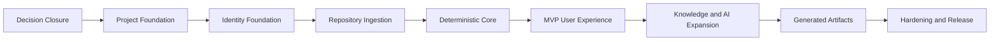
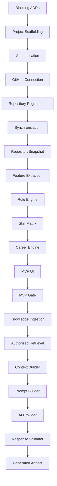

# DevPath Implementation Roadmap

## 1. Purpose and Scope

This document defines the implementation roadmap for DevPath from completed architecture documentation to a demonstrable and releasable platform. It defines phases, milestones, vertical slices, workstreams, dependencies, gates, deliverables, evidence, risk controls, and scope boundaries.

This roadmap defines dependency and completion logic, not contractual delivery dates. It MUST NOT treat Proposed ADRs as accepted decisions and MUST NOT introduce new product requirements.

| Area | Included |
|---|---|
| Planning scope | Decision closure, foundation, identity, repository ingestion, deterministic analysis, career intelligence, MVP UI, knowledge, AI, artifacts, hardening, deployment, demonstration |
| Audience | Project owner, implementation owner, backend/frontend/AI/data/security/test/deployment contributors, AI coding agents |
| Authority | Uses SRS, deterministic engine specs, and Accepted ADRs as controlling sources |
| Maintenance | Updated whenever ADRs change, scope changes, implementation evidence contradicts plan, or milestones are completed |

## 2. Current Project State

| Area | State | Evidence |
|---|---|---|
| Requirements | Specified | `01_SRS.md` exists |
| Domain architecture | Specified | `07_Domain_Model.md` exists |
| Data architecture | Specified | `08_System_Data_Model.md`, `09_Database_Design.md` exist |
| API contracts | Specified | `10_API_Specification.md` exists |
| Backend architecture | Specified | `11_Backend_Architecture.md` exists |
| Frontend architecture | Specified | `12_Frontend_Architecture.md` exists |
| Security | Specified | `13_Security_Architecture.md` exists |
| Observability | Specified | `14_Observability.md` exists |
| Testing | Specified | `15_Test_Architecture.md` exists |
| Deployment | Specified | `16_Deployment_Guide.md` exists |
| Coding standards | Specified | `17_Coding_Standards.md` exists |
| ADR status | Foundation and Job Decisions Accepted | ADR-024 through ADR-027 are accepted; knowledge, artifact, AI, observability, deployment, and secrets decisions remain phase-specific |
| Implementation status | Deterministic MVP Core In Review | Identity, GitHub connection, repository synchronization/snapshots, baseline rule analysis, Skill Matrix, career/company catalogs, and composed frontend views exist; M05 readiness policy and response contracts remain unresolved |

## 3. Roadmap Assumptions and Constraints

| Assumption | Status | Impact if False |
|---|---|---|
| Small team or single primary developer | TBD | Scope must shrink and AI/artifacts may move later |
| Graduation-project deadline exists | TBD | MVP must stay deterministic-core focused |
| Infrastructure budget is limited | TBD | Prefer local/dev substitutes and simple deployment |
| GitHub account/API access is available | TBD | Prepared repository fixtures become demonstration fallback |
| Notion access is available later | TBD | Notion shifts post-MVP |
| AI API or local model access is available later | TBD | AI features remain post-MVP/demonstration optional |
| Deployment environment is available | TBD | Demonstration uses local/staging environment |
| Supported browsers are modern evergreen browsers | TBD | Browser compatibility testing remains limited |
| Test environment can run storage substitutes | TBD | Integration scope adjusted |

No exact deadlines, staffing levels, or budgets are assumed.

## 4. Scope Classification

| Capability | Classification | Rationale | Dependency | References | Risk | Reconsideration Trigger |
|---|---|---|---|---|---|---|
| Authentication | MVP Required | Required for private data | ADR-026 | SRS, Security | High | Demo-only mode considered only if OAuth unavailable |
| Career target selection | MVP Required | Needed for career readiness | Career specs | SRS, Career | Medium | None |
| GitHub repository registration/sync | MVP Required | Core product input | ADR-027 | SRS, API | High | Provider unavailable |
| RepositorySnapshot | MVP Required | Reproducibility | ADR-009 | Domain/Data | Critical | None |
| Feature extraction | MVP Required | Rule Engine input | Snapshot | Rule Engine | High | Scope to subset if large |
| Rule Engine | MVP Required | Authoritative scoring | Feature extraction | Rule Engine | Critical | None |
| Skill Matrix | MVP Required | Dashboard/career input | Rule Engine | SRS | Critical | None |
| Career readiness/gaps | MVP Required | Career intelligence | Skill Matrix | Career | Critical | None |
| Recommendations/roadmap | MVP Required | User value | Career Engine | Career | High | Recommendation scope may be simplified |
| MVP frontend | MVP Required | Demonstrability | API | Frontend | High | Use minimal UI |
| Knowledge ingestion/retrieval | Post-MVP | Needed for richer AI context | Vector ADR | Knowledge | High | Include only if MVP stable |
| AI explanations | MVP Optional/Post-MVP | Valuable but not needed for deterministic proof | AI validators | AI/Prompt | High | Demo value requires one AI slice |
| Portfolio/resume/interview | Post-MVP | Artifact expansion | AI/artifact foundation | SRS | Medium | Graduation demo extension |
| Security hardening | Production Readiness | Required before public service | MVP | Security | Critical | Before release |
| Deployment/backup/restore | Production Readiness | Required for real operation | ADR-033/034 | Deployment | High | Before public demo/release |
| Enterprise org/SSO/multi-region | Deferred | Future scale | Future ADR | ADR | Medium | Production SaaS transition |

## 5. Recommended MVP Definition

The smallest coherent MVP is:

`Authentication → Career Target Selection → GitHub Repository Registration → Repository Synchronization → RepositorySnapshot → Feature Extraction → Rule Engine → Skill Matrix → Career Readiness → Recommendations → Analysis Result UI`

The MVP proves repository data can be collected safely, deterministic analysis can be reproduced, evidence can be linked to scores, career gaps can be calculated, recommendations can be presented, and the user can complete the primary journey in the frontend.

| MVP Inclusion | MVP Exclusion |
|---|---|
| One authenticated user journey, GitHub sync, immutable snapshot, deterministic analysis, career readiness, recommendations, dashboard/result UI, critical tests, baseline telemetry | Notion, full AI generation, all companies/roles, portfolio/resume/interview artifacts, multi-provider AI, enterprise tenancy, real-time updates, production-scale infrastructure |

AI generation SHOULD NOT be mandatory for proving deterministic core correctness.

## 6. Delivery Strategy



This order minimizes risk because blocking technology decisions close first, security and observability start early, deterministic analysis precedes AI, and the frontend integrates through vertical slices rather than waiting for all backend work.

## 7. Workstream Model

| Workstream | Responsibility | Major Outputs | Dependencies | Owner | Quality Obligations | Milestones |
|---|---|---|---|---|---|---|
| Architecture and ADR | Resolve decisions and drift | Accepted ADRs, doc updates | All | Architecture | No silent decisions | 8-10, 59 |
| Backend | API, services, modules | Use cases, contracts | ADRs/API | Backend | Tests/auth/telemetry | 11-34 |
| Frontend | User journeys | Routes/features | API contracts | Frontend | Accessibility/tests | 16-34 |
| Data and Persistence | Schema/storage | Repositories, migrations | ADR-024/025 | Data | Integrity/tests | 14,21,25 |
| Deterministic Engines | Rules/career | Scores, matrix, readiness | Snapshots | Rule/Career | Golden tests | 22-31 |
| Integrations | GitHub/providers | Adapters | ADR-007/027 | Integration | Redaction/retry | 18-20 |
| Knowledge | Ingestion/retrieval | Indexes/context | ADR-028 | Knowledge | Auth filters | 35-37 |
| AI | Context/prompt/validation | AI explanations | Deterministic outputs | AI | Validation/evals | 38-43 |
| Security | Controls/tests | Authz, redaction | All | Security | Threat coverage | continuous, 48 |
| Observability | Logs/metrics/traces | Telemetry | Foundation | Ops | Correlation | 15,52 |
| Testing | Gates/evidence | Test reports | Features | QA | Risk coverage | all |
| Deployment | Env/release | Deployments/rollback | ADR-033 | Platform | Smoke/records | 53-56 |
| Documentation | Synchronization | Updated docs | ADRs/changes | Architecture | Traceability | 10,59 |
| Demonstration | Project proof | Demo script/evidence | MVP | Project Owner | Fallbacks | 57-58 |

## 8. Phase 0 Purpose

Phase 0 finalizes implementation-blocking decisions, synchronizes architecture documents, eliminates silent technology assumptions, and establishes an executable implementation baseline.

## 9. Required ADR Closure

| ADR | Required Status | Dependencies | Required Evidence | Approver | Affected Docs | Delay Consequence |
|---|---|---|---|---|---|---|
| ADR-022 Repository Strategy | Accepted | None | Source layout decision | Architecture | 16,17 | Scaffolding churn |
| ADR-020 Backend Framework | Accepted | 022 | Stack/version decision | Backend/Architecture | 11,17 | Backend rework |
| ADR-021 Frontend Framework | Accepted | 022 | Stack/version decision | Frontend/Architecture | 12,17 | UI rework |
| ADR-023 Build/Dependencies | Accepted | 020,021,022 | Build/dependency plan | Platform | 16,17 | Non-reproducible build |
| API contract tooling | Accepted or documented under ADR-005/032 | 020,021 | Contract validation path | API/QA | 10,15 | Contract drift |
| ADR-024 Persistence/ORM | Accepted | 020,003 | JPA/Hibernate adapter mapping policy | Data | 08,09,11,15,17,19 | Resolved; implementation pending |
| ADR-025 Migration Tool | Accepted | 024 | Flyway SQL migration policy | Data/Ops | 09,11,15,16,17,19 | Resolved; implementation pending |
| ADR-026 Auth/Session | Accepted | 020,021 | GitHub OAuth2 Login and opaque server session | Security | 08,09,10,11,12,13,15,16,17,19 | Resolved; implementation pending |
| ADR-027 Job Technology | Accepted before job implementation | 010,020,003 | Persistent job plan | Backend/Ops | 11,16 | Workflow rework |
| ADR-028 Vector Database | Accepted | 014,003 | PostgreSQL pgvector and filter proof | Knowledge | 06,09,11,16 | Decision resolved; implementation proof pending |
| ADR-029 Object Storage | Accepted | 016,033 | S3-compatible port; production provider deferred to ADR-033 | Ops | 09,13,16 | Decision resolved; provider activation pending |
| ADR-030 AI SDK Strategy | Accepted | 007,015 | Capability-specific provider adapters using official SDK or HTTP | AI | 04,05,17 | Decision resolved; provider/model configuration pending |
| ADR-032 Testing Toolchain | Accepted | 020,021 | Test baseline | QA | 15 | CI/test delay |
| ADR-031 Observability Tech | Accepted before release | 017 | Telemetry path | Ops | 14 | Release risk |
| ADR-033 Deployment Platform | Accepted before staging | 016,023 | Environment choice | Platform | 16 | Deploy rework |
| ADR-034 Secrets Management | Accepted before env setup | 033 | Secret injection model | Security/Ops | 13,16 | Secret risk |
| ADR-035 Git Workflow | Accepted | 022 | Branch/review convention | Engineering | 17 | Review friction |

### 9.1 Identity and Persistence Blocked-Milestone Register

| Milestone | Previous Decision Blocker | Current State | Remaining Entry Gate | Unrelated Work May Continue |
|---|---|---|---|---|
| Database and Storage Foundation | ADR-024 and ADR-025 | Decision blocker resolved | Java 21 execution environment; implementation dependencies, migrations, PostgreSQL integration tests, and Flyway validation are still pending | Yes |
| Authentication Vertical Slice | ADR-026 | Decision blocker resolved | Java 21 execution environment; security/session implementation and tests are still pending | Yes |
| First Authenticated Vertical Slice | ADR-024, ADR-025, ADR-026 | Decision blocker resolved | Backend compile/test/startup must be verified under Java 21 and the scoped implementation must satisfy persistence, migration, CSRF, session, and isolation gates | Yes |

## 10. Architecture Synchronization Milestone

| Item | Exit Criteria |
|---|---|
| ADR status | No blocking ADR remains Proposed before affected work |
| Document updates | Affected docs reflect accepted ADRs |
| Stack | Implementation stack is explicit |
| Repository strategy | Source layout is explicit |
| Local development | Local execution model is explicit |
| Package boundaries | Backend/frontend boundaries are explicit |
| Evidence | Updated docs, ADR register, implementation-start checklist |

## 11. Project Scaffolding Milestone

| Field | Definition |
|---|---|
| Entry Criteria | Phase 0 complete; blocking ADRs accepted |
| Deliverables | Repository structure, backend project, frontend project, module skeletons, dependency-boundary rules, configuration model, local setup, test foundations, static checks, basic CI verification, environment templates without secrets, documentation index |
| Exit Criteria | Project can run frontend baseline checks locally; backend checks are configured but require Java 21; no secrets; module boundaries visible |
| Evidence | `README.md`, `backend/`, `frontend/`, `contracts/`, `fixtures/`, `scripts/`, frontend test/build output, backend Java 21 toolchain failure output |
| Risks | Tooling churn, over-scaffolding |
| Affected ADRs | 020,021,022,023,032,035 |

### 11.1 Current Scaffold Completion Evidence

| Evidence Item | Path or Command | Result |
|---|---|---|
| Root command surface | `package.json` | Created |
| Backend scaffold | `backend/` | Created with Spring Boot, Gradle, health endpoint, and module placeholders |
| Frontend scaffold | `frontend/` | Created with React, TypeScript, Vite, React Query, routing, shell, and tests |
| Contract scaffold | `contracts/openapi/devpath-openapi.yaml` | Created for `/internal/health` only |
| Fixture scaffold | `fixtures/` | Created with placeholder README files only |
| Frontend tests | `node scripts/run-frontend.mjs run test -- --run` | Passed with sandbox escalation |
| Frontend build | `node scripts/run-frontend.mjs run build` | Passed with sandbox escalation |
| Backend tests | `node scripts/run-gradle.mjs test` | Not passed locally because Java 21 is not installed |

## 12. Architecture Enforcement Milestone

| Control | Exit Evidence |
|---|---|
| Backend dependency direction | Boundary check or review checklist |
| Module-boundary checks | Violations detectable |
| Frontend feature boundaries | Feature internal imports controlled |
| Generated-code boundaries | Generated directories identified |
| Static validation | Baseline static checks run |
| API contract drift | Drift detection path defined |
| Secret scanning | Secret check baseline exists |
| Baseline security checks | Auth/security gates prepared |

Tools not covered by accepted ADR-024/025/026 remain TBD until their owning phase requires them.

## 13. Shared Platform Foundations

| Foundation | Timing | Rule |
|---|---|---|
| Identifiers/version identifiers | Immediate | Needed by domain, API, jobs, artifacts |
| Clock abstraction | Immediate | Needed for deterministic tests |
| Error taxonomy | Immediate | Needed by APIs/jobs |
| Authorization context | Immediate | Needed before private data |
| Correlation context | Immediate | Needed before pipelines |
| Structured logging | Immediate | Needed from first slice |
| API error mapping | Immediate | Needed by frontend |
| Pagination primitives | Early | Needed by repo/API lists |
| Async job primitives | Early | Needed by sync/analysis |
| Configuration validation | Immediate | Needed by deployment |
| Health/readiness | Early | Needed by release |

Shared foundations MUST remain small and must not become a dumping ground.

## 14. Database and Storage Foundation

| Scope | Initial Implementation Rule |
|---|---|
| PostgreSQL connectivity | Required before identity/repository persistence |
| Migration execution | Required before schema changes |
| Transactions | Required before use cases with mutations |
| Repository adapter pattern | Required before persistence adapters |
| Audit fields | Required for security-sensitive changes |
| Redis boundary | Define before caching/jobs use it |
| Vector Database boundary | Define before knowledge phase |
| Object Storage boundary | Define before artifacts phase |
| Local substitutes | Required for integration tests where practical |
| Environment isolation | Required before staging/release |

Only storage needed by immediate milestones SHOULD be implemented.

Persistence foundation entry criteria are now satisfied at the decision/documentation level. Implementation must add JPA/Hibernate and Flyway only in the next scoped task, establish an isolated PostgreSQL test path, keep domain types annotation-free, and prove migration and transaction behavior before feature persistence expands.

## 15. Observability Baseline Milestone

| Telemetry | Exit Criteria |
|---|---|
| Application version/environment | Present in logs/health |
| Request ID/correlation ID | Propagated through first API slice |
| Structured logs | Safe fields and error category |
| Request duration | Captured for API calls |
| Job identifiers | Available before async workflows |
| Health status | Liveness/readiness exposed conceptually |
| Deployment version | Visible after deployment milestone |
| Privacy check | No secrets/private content in baseline logs |

## 16. Authentication Vertical Slice

| Area | Scope |
|---|---|
| API operations | Login initiation/callback or selected flow, current user, logout |
| Backend modules | Identity, session, auth context |
| Frontend routes | Login, callback/status, authenticated shell |
| Persistence | User/account/session records as accepted by ADR-026 |
| Security | State validation, session revocation, safe errors, logs |
| Observability | Auth events, correlation, failure category |
| Tests | Auth flow, invalid/revoked session, logout, redaction |
| Failure paths | Provider failure, invalid callback, expired session |

Provider permissions not yet needed MUST NOT be requested.

Identity slice entry criteria are now satisfied at the decision/documentation level. The slice must use GitHub OAuth2 Login, a provider-independent User, a secure HttpOnly opaque session, local-memory sessions only for single-instance development, JDBC-backed PostgreSQL sessions for MVP, CSRF protection, and no browser-stored credentials.

### 16.1 Current Next Implementation Task

Implement the Identity and Persistence foundation as the first authenticated vertical slice. This roadmap statement authorizes sequencing only; it does not mark Identity, Persistence, schema, migration, or authentication implementation complete.

## 17. User Profile and Career Target Slice

The visible settings capability now separates `/settings/profile` and `/settings/integrations` behind a shared
`/settings` workspace. Profile, supported career/company targets, GitHub connection/reconnection/disconnection, and
provider-authorized repository registration continue to use the canonical identity and integration APIs through React
Query. The home route no longer duplicates these forms, while onboarding composes the same feature components. Loading,
anonymous/provider-safe error recovery, responsive navigation, explicit form labels, and automated axe coverage are
included. Privacy preference and account-deletion routes remain outside this slice because their implemented API and
state-transition contracts are not yet available.

| Scope | Exit Criteria |
|---|---|
| User profile retrieval | Authenticated user can view own profile |
| Career target selection | Supported target persisted and validated |
| Company target | Supported company selected where required |
| Frontend forms | Loading/error/empty/validation states |
| Backend authorization | User can mutate only own preferences |
| Audit/observability | Target changes logged/audited as required |
| Tests | API, frontend, validation, authorization |

Supported roles and companies MUST follow deterministic specifications; unsupported targets fail safely.

## 18. GitHub Connection Slice

The implemented recovery capability now preserves an owner-scoped, non-secret connection state across `ACTIVE`,
`EXPIRED`, and `REVOKED`. Disconnect, detected provider permission withdrawal, and unusable refresh expiry discard the
actual encrypted provider secrets and scopes, stop future provider reads, and expose an actionable reconnect state in
`/settings/integrations`. Successful reauthorization rotates the existing connection back to active instead of creating
a duplicate record. Automated backend and frontend tests cover transition, secret discard, status projection, and the
inactive UI path. A live provider revocation exercise remains owner verification work.

FR-046 rate-limit recovery is also implemented across provider discovery, repository registration, and background
synchronization. Quota exhaustion no longer revokes a valid credential or becomes a generic 503: direct requests return
safe 429 timing, durable jobs wait until the provider reset, audit records contain no raw provider data, and the Korean
UI presents the reset and manual retry path without an automatic retry storm.

| Scope | Exit Criteria |
|---|---|
| Account connection | User connects GitHub using minimum required scope |
| Token storage | Server-side only |
| Repository listing | Owned/accessible repos listed safely |
| Permission handling | Revoked/insufficient permissions handled |
| Disconnect | Future access stops |
| Frontend states | Connected, disconnected, error, loading |
| Security tests | Token non-exposure and owner checks |

Private repository content MUST NOT be exposed before ownership checks.

## 19. Repository Registration Slice

| Scope | Exit Criteria |
|---|---|
| Repository selection | User selects accessible repository |
| Registration | Repository metadata persisted |
| Duplicate handling | Duplicate registration is idempotent or conflict-safe |
| Archived/unavailable | Safe state displayed |
| API/frontend | Contract and UI states implemented |
| Audit/tests | Registration events and authorization tested |

Repository registration and synchronization remain separate concepts.

## 20. Repository Synchronization Slice

Workflow: `User Request ??Sync Command ??Async Job Creation ??GitHub Adapter ??Metadata and Content Collection ??Normalization ??Snapshot Creation ??Job Completion ??Frontend Status Update`

| Concern | Exit Criteria |
|---|---|
| Full sync | Creates synchronized result for selected repository |
| Incremental sync | Implement only if MVP requires; otherwise post-MVP |
| Rate limits/timeouts | Normalized failure and retry |
| Idempotency | Duplicate requests do not corrupt state |
| Partial failure/cancellation | Job status reflects outcome |
| Progress | Frontend can show job status |
| Correlation | Request/job/provider correlation exists |
| Tests | Job lifecycle, provider failures, owner checks |

## 21. RepositorySnapshot Milestone

| Scope | Exit Criteria |
|---|---|
| Snapshot identity/association | Snapshot belongs to repository/user |
| Source revision/timestamp | Captured with sync version |
| Immutable references | Subsequent sync creates new snapshot |
| Status/retrieval | Historical snapshot can be read by owner |
| Retention/deletion | Policy hooks exist |
| Tests | Immutability and authorization tests pass |

Historical snapshots MUST NOT be overwritten.

The repository synchronization journey now retains its opaque owner-scoped job ID in the route query, resumes polling
after refresh, and links a successful result to the matching immutable snapshot. API-REP-007 history cards and the job
result both open an API-REP-008 detail route showing the full source revision, content hash, measured collection counts,
status, and current-versus-historical context. The browser does not expose historical content or recalculate evidence,
scores, or freshness. Missing and cross-owner resources share the same unavailable state.
The detail route also traverses cursor-paginated API-REP-012 repository history to connect that immutable input to each
completed official analysis and its evidence/Skill Matrix detail. Only stored score, confidence, version, and current
labels are rendered; history loading, empty, pagination, and error states do not hide snapshot provenance.

## 22. Feature Extraction Milestone

| Feature Area | Scope |
|---|---|
| Languages/frameworks/databases | Extract deterministic evidence |
| Architecture/testing/DevOps/docs | Extract repository signals |
| Collaboration/activity/growth | Include where data is available |
| Repository quality/complexity | Extract scoped subset first |
| Contracts/versioning | Input snapshot and extractor version recorded |
| Unsupported/malformed/generated files | Handled deterministically |
| Tests | Golden fixtures and malformed input tests |

Feature extraction MUST NOT invoke an LLM.

The current API-REP-011 extraction slice includes versioned database, collaboration, documentation, and activity read
models. Engineering evidence exposes measured presence/count/path facts through `engineering-evidence-extractor-v3`,
while the active `baseline-v2` Rule Engine remains deliberately bound to `engineering-evidence-extractor-v2`. Therefore,
additive read-model signals cannot change an official score, weight, readiness result, or recommendation.

FR-043 implementation evidence also includes an owner-scoped current-snapshot activity timeline in API-REP-011 and the
repository-detail journey. Commit, pull-request, and issue lifecycle timestamps are normalized, sorted newest-first,
bounded to 100 returned events, and accompanied by the total measured count and snapshot-relative elapsed days. The
browser presents unsynchronized, empty, success, error, and truncation states without calculating a score. FR-044
staleness classification remains pending because an approved threshold policy is not yet defined; measured days MUST
NOT be presented as a policy judgment. This evidence does not mark the repository milestone complete.

FR-045 implementation evidence now distinguishes deterministic collection-ceiling breaches from transient GitHub
outages. Branch/commit pagination, recursive trees, files/manifests, pull requests/reviews, and issues fail as terminal
`COLLECTION_LIMIT_EXCEEDED` jobs on the first attempt, create no partial snapshot, retain safe audit/outbox traceability,
and present an actionable non-retryable state in the repository UI. This capability does not add partial synchronization
or change the configured ceilings.

## 23. Rule Engine Foundation Milestone

| Component | Exit Criteria |
|---|---|
| Rule model/config | Versioned rules load and validate |
| Evidence evaluation | Evidence linked to rule outcomes |
| Score calculation | Deterministic and tested |
| Weighting/aggregation | Boundary behavior verified |
| Result explanation data | Non-AI explanation data available |
| Golden datasets | First subset passes |
| Historical reproducibility | Result identifies input/rule versions |

First working subset SHOULD include Language, Framework, Documentation, Testing, and Activity where evidence is available.

Implementation evidence now exists for the independent Rule Engine foundation subset: PostgreSQL-backed
`REPOSITORY_BASELINE/baseline-v1`, catalog validation, deterministic `formula-v1` execution, category and overall
weighted aggregation, confidence separation, per-rule trace metadata, repository-snapshot evidence mapping, and the
`fixtures/rule-engine/baseline-v1.json` golden dataset. The later repository-baseline analysis slice now invokes this
engine through durable jobs, but career/company-specific policies and the remaining analysis history/compare scope are
not implied complete by this foundation.

The completed-result persistence subset now stores immutable Evaluation headers, category scores, rule execution
traces, warnings, missing-evidence states, normalized evidence records, and score-evidence links. Owner-aligned database
foreign keys and owner-filtered API-ANA-004/005/006 reads protect private results. PostgreSQL-backed API-ANA-001/002
jobs now invoke this persistence path, API-ANA-003 exposes immutable result references, and API-ANA-007/API-REP-012
provide cursor-paginated owner-scoped history with official persisted score metadata. The Korean `/analyses` and
`/analyses/:analysisId` routes expose history, rule traces, evidence, and the historical Skill Matrix without browser
recalculation. Repeated requests with the same snapshot, scope, and active rule basis reuse the completed job/result;
history and detail reads derive the newest completed result per repository as current while retaining older immutable
results. The detail UI adds Korean rule labels and explanations of persisted observation, formula, weight, and score
without calculating an official value. API-ANA-008 and the Korean `/analyses/compare` workspace now allow two
owner-scoped immutable results to be selected from history and displayed side by side with their official category
scores, confidence, rule/formula/extractor versions, and evidence counts. No delta or improvement score is calculated.
Career/company policy selection and broader milestone evidence remain pending; this note
does not mark the Rule Engine or AnalysisResult milestone complete.

The Skill Matrix foundation now includes a PostgreSQL-authoritative `skill-matrix-v1` policy, stable category-to-skill
mappings, deterministic level/strength/weakness classification, immutable assessments, evaluation/evidence/repository
traceability, structured downstream facts, current/historical owner reads through API-SKL-001/002, and exact boundary
tests. Completed RuleEvaluation persistence now invokes idempotent Skill Matrix generation, and the Korean `/skills`
view presents current scores, levels, confidence, versions, evidence counts, responsive layout, and distinct loading,
empty, anonymous, and transport-error states. Repository detail now requests and polls durable baseline analysis jobs,
then refreshes the current matrix. API-SKL-003 and the Korean `/skills/compare` workspace now compare two owner-scoped
immutable matrices selected through analysis history, including stored scores, levels, confidence, evidence counts,
policy/rule versions, strengths, and weaknesses. No delta, replacement level, or growth trend is calculated. API-SKL-004/005
and `/skills/:skillId` now provide current owner-scoped skill drilldown, Matrix reproduction metadata, and normalized
evidence navigation with durable read audits. The same detail journey now composes cursor-paginated API-ANA-007 history
with API-SKL-002 to show newest-first stored assessments for that stable skill, with isolated loading/error/retry states
and links back to each analysis and repository. No browser delta or trend is derived. Technology/framework proficiency
APIs remain pending; this evidence does not mark the Skill Matrix milestone complete.

## 24. Rule Category Delivery Plan

| Category | Prerequisites | Evidence | Complexity | Risk | Tests | Roles | Milestone | Completion Evidence |
|---|---|---|---|---|---|---|---|---|
| Language | Snapshot files | File metadata/content | Low | Low | Golden | All | 23 | Language results |
| Framework | Dependencies/files | Dependency evidence | Medium | Medium | Golden | Backend/Frontend | 23/25 | Framework results |
| Database | Config/deps | DB libs/config | Medium | Medium | Golden | Backend/Data | 25 | DB results |
| Architecture | Directory structure | Structure evidence | Medium | Medium | Fixtures | Backend/Frontend | 25 | Architecture score |
| Testing | Test files/config | Test evidence | Medium | Low | Fixtures | All | 23/25 | Testing score |
| DevOps | CI/Docker/deploy files | DevOps evidence | Medium | Low | Fixtures | DevOps | 25 | DevOps score |
| Documentation | README/docs | Documentation evidence | Low | Low | Fixtures | All | 23 | Documentation score |
| Collaboration | PR/issues/branches | Provider metadata | High | Medium | Provider fixtures | All | Post-MVP/MVP optional | Collaboration result |
| Repository Quality | Multiple signals | Structure/metadata | High | Medium | Golden | All | 25 | Quality score |
| Growth | Historical snapshots | Time series | High | Medium | Historical fixtures | All | Post-MVP/MVP optional | Growth score |
| Activity | Commits | Commit metadata | Medium | Low | Fixtures | All | 23/25 | Activity score |
| Complexity | Code metrics | Parsed metadata | High | High | Fixtures | All | Post-MVP | Complexity score |

Scoring rules are not invented here; `02_Rule_Engine.md` is authoritative.

## 25. AnalysisResult Milestone

| Scope | Exit Criteria |
|---|---|
| Analysis request/job | Owner can request analysis for snapshot |
| Version capture | Snapshot, extractor, rule versions recorded |
| Deterministic results | Results persisted immutably |
| Evidence links | Evidence resolves to snapshot data |
| Failure state | Expected/system failures represented |
| Retrieval/API | Owner can retrieve result |
| Observability/tests | Correlated job and version tests pass |

## 26. Skill Matrix Milestone

| Scope | Exit Criteria |
|---|---|
| Skill dimensions | Derived from Rule Engine outputs |
| Levels/scores | Deterministic values returned |
| Evidence linkage | Each skill links to evidence or missing evidence |
| Historical comparison | Include only if required and data exists |
| API/frontend | Matrix represented and labeled authoritative |
| Tests | Matrix generation and frontend display tests |

Frontend MUST display authoritative result without recalculation.

## 27. Career Path Engine Foundation

The initial CR-001/CR-002 catalog slice now persists the nine SRS-supported career identities and immutable active
`career-v1` profiles, exposes authenticated API-CAR-001/002 reads, and uses the same catalog to validate target-career
selection. The Korean `/careers` and `/careers/:careerId` routes display configured technologies, competencies,
priority labels, and roadmap-template order without calculating readiness or recommendations. Numeric competency
thresholds and the `CareerReadinessResponse` detail contract remain unresolved, so readiness, gaps, company policy,
recommendations, and roadmap generation are not implied complete by this slice.

The CR-003/CR-004 catalog slice now similarly persists six SRS-supported companies and immutable active `company-v1`
profiles, exposes API-CMP-001/002, validates target-company selection from the same catalog, and provides Korean
`/companies` and `/companies/:companyId` views. These profiles are explicitly generic competency emphasis only;
company readiness and confidential hiring knowledge are excluded.

Pipeline: `Rule Results ??Skill Matrix ??Career Rules ??Company Rules ??Skill Gap ??Learning Roadmap ??Recommendation`

| Scope | Exit Criteria |
|---|---|
| Deterministic inputs/outputs | SkillMatrix and target profiles produce versioned results |
| Profile versions | Career/company versions captured |
| Unsupported targets | Safe validation failure |
| Evidence traceability | Gaps/recommendations link to skill evidence |
| Golden datasets | Supported MVP targets tested |
| API integration | Results available to frontend |

No AI provider is required.

## 28. Supported Career Delivery Plan

| Career | Priority | Dependency | Profile Readiness | Dataset Readiness | Validation | MVP | Post-MVP |
|---|---|---|---|---|---|---:|---:|
| Backend | High | Language/framework/db | Required | Required | Golden | Yes | Yes |
| Frontend | High | Framework/UI evidence | Required | Required | Golden | Yes | Yes |
| AI | Medium | AI/ML evidence | Required | Partial | Golden | Optional | Yes |
| ML | Medium | AI/ML evidence | TBD | TBD | Golden | No | Yes |
| DevOps | Medium | DevOps evidence | Required | Partial | Golden | Optional | Yes |
| Security | Medium | Security evidence | Required | Partial | Golden | No | Yes |
| Android | Low | Mobile evidence | TBD | TBD | Fixtures | No | Yes |
| iOS | Low | Mobile evidence | TBD | TBD | Fixtures | No | Yes |
| Embedded | Low | Embedded evidence | TBD | TBD | Fixtures | No | Yes |
| Cloud | Medium | DevOps/cloud evidence | TBD | TBD | Golden | No | Yes |
| QA | Medium | Testing evidence | TBD | TBD | Golden | No | Yes |
| Data | Medium | Data evidence | Required | Partial | Golden | Optional | Yes |
| Game | Low | Game evidence | TBD | TBD | Fixtures | No | Yes |

MVP SHOULD include Backend and Frontend first, with architecture support for all.

## 29. Supported Company Delivery Plan

Only companies defined in `03_Career_Path_Engine.md` are MVP candidates.

| Company | Profile Availability | Rule Dependency | Validation Evidence | MVP | Post-MVP | Risk |
|---|---|---|---|---:|---:|---|
| Google | Defined | Strong fundamentals | Golden | Optional | Yes | Avoid invented criteria |
| Amazon | Defined | Backend/system signals | Golden | Optional | Yes | Avoid invented criteria |
| Naver | Defined | Korean tech market profile | Golden | Optional | Yes | Profile quality |
| Kakao | Defined | Backend/frontend profile | Golden | Optional | Yes | Profile quality |
| Toss | Defined | Quality/backend/product profile | Golden | Optional | Yes | Profile quality |
| Coupang | Defined | Scale/backend profile | Golden | Optional | Yes | Profile quality |
| Microsoft | Not defined in source | N/A | N/A | No | Only after spec update | Unsupported |
| Meta | Not defined in source | N/A | N/A | No | Only after spec update | Unsupported |
| Netflix | Not defined in source | N/A | N/A | No | Only after spec update | Unsupported |
| Line | Not defined in source | N/A | N/A | No | Only after spec update | Unsupported |

## 30. Skill Gap and Readiness Slice

The approved MVP scope evaluates Backend and Frontend careers first. Company readiness remains post-MVP. The approved
`baseline-v2`, `skill-matrix-v2`, Backend/Frontend `career-v2`, and `readiness-v1` policies now cover the required
categories. Unsupported required categories are represented as `INSUFFICIENT_EVIDENCE` with null readiness score and
level; confidence remains separately weighted. The deterministic calculation, immutable PostgreSQL persistence,
owner-scoped APIs, and frontend result view are implemented for owner/coordinator review.

| Element | Exit Criteria |
|---|---|
| Selected targets | Career and optional company target validated |
| Current Skill Matrix | Loaded from analysis result |
| Target profile | Versioned profile selected |
| Gap/readiness calculation | Deterministic output generated |
| Evidence | Gaps linked to observed/missing evidence |
| API/frontend | Displays observed skill, readiness, missing evidence, recommendation separately |
| Tests | Golden target tests pass |

AI explanation remains separate.

The Korean career-growth workspace now connects current readiness, immutable historical readiness detail,
API-CAR-006 Skill Gap lists, current skill/evidence drilldown, recommendation-set history, and the active learning
roadmap. Historical readiness is entered through the recommendation set that references it and displays stored
score/level/confidence, policy/profile/rule versions, all category gaps, and evidence counts without deriving a new
readiness or recommendation priority.

## 31. Recommendation and Learning Roadmap Slice

The owner approved MVP `recommendation-v1` and `roadmap-v1` for Backend and Frontend. Missing, Weak, and Partial gaps
map to Critical, High, and Medium respectively; one configured structured recommendation is produced per eligible
gap. Company modifiers, AI prose, and external resource selection remain excluded. Roadmap steps use the approved
career-specific prerequisite order and require a later official category score of at least 60 plus configured evidence.

| Scope | Exit Criteria |
|---|---|
| Recommendation priority/category | Deterministic and versioned |
| Gap relationship | Recommendation links to skill gap |
| Roadmap steps | Ordered with prerequisites where defined |
| Evidence/rationale | Non-AI rationale exists |
| API/frontend | Empty/unsupported states handled |
| Persistence/tests | Results stored/retrieved and tested |

The visible roadmap workspace now includes the current plan, complete owner-scoped history, lifecycle labels, and a
CSRF-protected idempotent archive action. API-LRN-003/004/009, durable `ROADMAP_ARCHIVED` audit evidence, and matching
frontend/server-state invalidation are implemented without changing generated steps or official progress. Step progress
controls remain deferred until the deterministic progress formula and allowed status transitions are approved.

The visible recommendation workspace now separates deterministic recommendations from the learning plan and exposes
owner-scoped recommendation-set history, individual completion criteria, rationale codes, expected evidence, and linked
observed evidence through API-REC-003/004/008. Recommendation priority and generated content remain immutable. User
accept/dismiss/complete controls remain deferred until the allowed recommendation-status transition contract is approved.

AI prose is not required for completion.

## 32. Repository Analysis User Journey

The visible first-analysis capability now begins at `/onboarding`: the server projects eight ordered setup steps from
persisted owner-scoped profile, target, active GitHub connection, repository, synchronization, and analysis resources,
selects the next recommended action, and appends a durable progress-view audit record. The route connects existing
target forms and GitHub repository registration to repository sync/analysis workspaces, then hands a completed journey
to dashboard, Skill Matrix, readiness, and recommendation workspaces. Company selection remains explicitly optional,
and neither the server projection nor the browser derives an official score or readiness value.

| Screen/Route | API | Server State | Client State | States | Auth | Accessibility | Test Level |
|---|---|---|---|---|---|---|---|
| Dashboard | Dashboard summary | Latest repos/jobs/results | View filters | Loading/empty/error/stale | Required | Landmarks/status | Feature/E2E |
| Repository List | Repository list | Repos/sync status | Selection | Loading/empty/error | Owner | Keyboard table/list | Feature |
| Repository Detail | Repository detail | Repo/snapshots | Active tab | Loading/stale/error | Owner | Headings | Feature |
| Synchronization | Sync job | Job status | Polling state | Progress/fail/cancel | Owner | Live status | Integration/E2E |
| Analysis Request | Analysis job | Snapshot/result | Button state | Progress/fail | Owner | Status | Integration/E2E |
| Analysis Result | Result API | Analysis/skills/evidence | Display prefs | Missing evidence/error | Owner | Tables/charts alt | Feature/E2E |
| Career Readiness | Readiness API | Gaps/recommendations | Target display | Empty/unsupported | Owner | Labels | Feature |

The implemented browser-journey evidence uses Playwright and a contract-shaped controlled API substitute to verify the
repository detail, CSRF-protected idempotent analysis request, completed job, analysis history/detail, Skill Matrix,
Career Readiness, recommendation, and learning-roadmap route sequence. An anonymous readiness failure path verifies an
actionable recovery link. Automated axe checks cover WCAG 2.0 A/AA and WCAG 2.1 AA rules on the critical success screens
and anonymous error screen. These are deterministic frontend browser E2E tests, not deployed-system or live GitHub OAuth
tests. Separate local live-provider/system evidence is recorded in `docs/20_MVP_Release_Evidence.md`; keyboard-only
navigation, visible skip/focus behavior, asynchronous route-focus restoration, accessibility-tree semantics, and 200%
zoom/reflow have also passed locally. M32 still requires owner review, provider permission/revocation edge-case evidence,
spoken screen-reader output, and an OS-level reduced-motion exercise before its milestone gate can be approved.

## 33. Dashboard MVP Milestone

| Dashboard Item | Data Source | Evidence |
|---|---|---|
| Connected repositories | Repository registration | API and UI test |
| Latest sync status | Job/snapshot | Job status test |
| Latest analysis status | AnalysisResult | Analysis API test |
| Selected career target | User profile | Profile test |
| Skill summary | Skill Matrix | Matrix test |
| Readiness summary | Career result | Career test |
| Top recommendations | Recommendation result | Recommendation test |
| Recent jobs | Async job state | Job API test |

Placeholder analytics without reliable source MUST NOT be included.

The implemented Korean `/dashboard` route now uses the canonical owner-scoped API-DSH-001 summary endpoint. The backend
composes PostgreSQL-authoritative repository, repository-sync job, analysis job/result, Skill Matrix, career-readiness,
recommendation, and learning-roadmap sources without recalculating official results or storing a dashboard projection.
Exact active-repository and synchronized counts, latest/current analyses, selected targets, top recommendations, roadmap
progress, and recent jobs are included. Per-section `AVAILABLE`, `EMPTY`, and `UNAVAILABLE` states preserve partial
results, while the endpoint itself remains authentication-required and records a durable dashboard-view audit event.

Backend application/security/architecture tests and frontend feature/build tests provide implementation evidence for
this slice. API-DSH-002 through 010, company readiness, artifact summaries, charts, filters, export, cache/projection
storage, and AI-generated dashboard content remain excluded. This implementation evidence does not itself approve or
declare the Dashboard MVP milestone complete; owner/coordinator review is still required.

## 34. MVP Completion Gate

| Criterion | Required Evidence |
|---|---|
| User can authenticate | Auth tests and demo run |
| User can select career target | API/UI test |
| User can connect GitHub safely | OAuth/token redaction test |
| User can register repository | Repository API/UI test |
| Repository syncs asynchronously | Job lifecycle test |
| Immutable snapshot is created | Immutability test |
| Features are extracted | Golden feature fixture |
| Rule Engine produces versioned results | Golden dataset result |
| Skill Matrix is created | Matrix test |
| Career Engine produces readiness/gaps | Career golden test |
| Recommendations are produced | Recommendation test |
| Frontend displays result | E2E journey |
| Authorization is enforced | IDOR/security test |
| Critical telemetry exists | Observability verification |
| Critical tests pass | Test report |
| Deployment smoke passes | Smoke result |
| Known limitations documented | Release notes |

Current M34 evidence is indexed in `docs/20_MVP_Release_Evidence.md`. Local implementation now includes sanitized
`X-Request-Id`/`X-Correlation-Id` propagation, response support headers, frontend request context, bounded
request-completion logs, and durable audit records. This advances the critical-telemetry gate without selecting the
technology covered by Proposed ADR-031. The reproducible `npm run verify:mvp` command combines backend,
Testcontainers, frontend unit/browser/accessibility, production-build, dependency-audit, OpenAPI checks, and a
platform-neutral repository security-boundary scan. This does not select the still-unresolved hosted CI platform.
The command also requires a reachable Docker-compatible engine before starting so the PostgreSQL portability suites
cannot be silently omitted from M34 evidence.

The 2026-08-25 local live-provider journey now records GitHub OAuth, repository discovery, durable synchronization,
immutable snapshot creation, deterministic analysis, dashboard/readiness, roadmap, keyboard/focus, accessibility-tree,
and 200% zoom/reflow evidence. Automated Chromium reduced-motion media behavior is now covered. M34 remains unapproved:
spoken screen-reader and physical OS-settings reduced-motion review, external security review, and staging deployment
smoke are not recorded.
Staging/production observability, deployment, and secret management remain blocked by Proposed ADR-031, ADR-033, and
ADR-034 respectively. Post-MVP milestone work must not use
this local evidence as implicit approval of the MVP gate.

## 35. Knowledge Source Registration Slice

| Source | First Milestone Scope |
|---|---|
| Repository-derived documents | Preferred first source after MVP |
| Notion documents | Post-MVP unless Notion integration is prioritized |
| Portfolio documents | After artifact foundation |
| User-provided project information | Optional after upload/security controls |

Registration must include ownership, authorization, source status, synchronization, deletion, frontend management, and tests.

The current M35 Notion source-registration slice implements session-bound OAuth state, server-only encrypted access and
refresh credentials, owner-scoped connection status, bounded shared page/data-source metadata discovery, explicit UI
refresh, safe rate-limit and dependency errors, permission-loss expiry, reauthorization, disconnect, metadata deletion,
durable audit events, and Korean loading/empty/success/error/recovery states. The browser never receives provider tokens
or page body content and only links to validated HTTPS Notion hosts. Local adapter, application, security, frontend, and
contract tests provide implementation evidence; a live Notion OAuth, rate-limit, permission-loss, and revocation exercise
remains required before owner approval. This does not implement KnowledgeDocument ingestion or complete M35.

ADR-028 now accepts PostgreSQL with pgvector as the initial vector store. ADR-029 accepts an S3-compatible object-storage
port with a filesystem adapter limited to local/test, and ADR-030 accepts capability-specific embedding/generation
provider ports. M36 may proceed only through its requirements, contract, owner-filter, lifecycle, test, and owner-approval
gates; accepting these ADRs does not complete knowledge ingestion, retrieval, RAG, or Notion content analysis.

## 36. Knowledge Ingestion Pipeline Milestone

Pipeline: `Collector → Normalizer → Chunker → Embedding Provider → Vector Index → Knowledge Record`

| Concern | Exit Criteria |
|---|---|
| Async jobs/idempotency | Ingestion can retry safely |
| Chunk/version tracking | Chunk and embedding versions recorded |
| Metadata/ownership | User/source metadata present |
| Partial failure | Failure state and retry behavior |
| Re-index/deletion | Deletion propagates from retrieval scope |
| Observability/tests | Ingestion metrics/logs and tests |

Retrieval MUST NOT be exposed until authorization filters are verified.

The current M36 implementation provides owner-scoped Notion page collection, deterministic bounded normalization and
chunking, an embedding provider port with an Ollama HTTP adapter, PostgreSQL/pgvector version and embedding persistence,
private object references through the ADR-029 port, retry-safe ingestion jobs, archive/re-index lifecycle, durable audit
events, metadata-only REST responses, and a refresh-recoverable frontend journey. The filesystem object adapter is enabled
only when explicitly selected (and by the local default); selecting a future production adapter without its implementation
fails dependency wiring instead of silently storing private content on local disk. Automated adapter, application,
PostgreSQL/pgvector, security, frontend, browser, accessibility, contract, and build checks provide implementation evidence.
A live Notion-to-configured-embedding-provider exercise, production S3-compatible provider selection, ADR-031 telemetry
selection, retrieval authorization proof, and owner approval remain gates. M36 is therefore not declared complete here.

## 37. Retrieval Milestone

| Scope | Exit Criteria |
|---|---|
| Query/user/source filters | Enforced before returning context |
| Semantic retrieval | Returns authorized relevant chunks |
| Citations | Source references included |
| Empty/deleted/index versions | Safe behavior |
| Latency visibility | Retrieval telemetry present |
| Gate | Authorization correctness > retrieval relevance |
| Tests | Cross-user isolation blocks release if failing |

The current M37 capability implements API-KNW-009 as `knowledge-semantic-v1` over PostgreSQL pgvector. Candidate SQL
requires the authenticated owner, active Notion connection, still-shared non-trashed page, active document, exact current
version, indexed chunk, active compatible embedding provider/model/version/dimension, configured relevance threshold,
and optional owner-scoped document filter before similarity ranking. A second application boundary reads only those
owner-scoped object references and returns bounded excerpts, normalized relevance, freshness, and Notion citations.
PostgreSQL retains query hashes and bounded retrieval metadata, while durable audit details and redacted logs record policy,
filter category, result count, and latency without query text, excerpts, object references, or vectors. Real pgvector tests
prove that identical high-similarity vectors cannot cross users and that document filters, revoked connections, archived
documents, stale versions, and stale embeddings remain outside the result set. The frontend implements loading, empty,
error, and filtered-success states; unit and browser journeys verify filtered success, source navigation, CSRF, and
automated accessibility behavior.

This evidence resolves the ADR-028 metadata-filter implementation proof, but M37 is not declared complete without owner
approval, a live configured embedding-provider search exercise, and the ADR-031 production metrics/trace implementation.
Hybrid, career-aware, company-aware, global multi-resource search, and AI context assembly remain outside this capability.

## 38. AI Provider Foundation

| Component | Exit Criteria |
|---|---|
| Provider port/adapter | One primary provider or local provider works behind adapter |
| Selection/config | Provider/model selected by config |
| Timeout/retry/rate limit | Normalized errors and retry behavior |
| Cancellation | AI job can be cancelled safely |
| Telemetry | Provider latency/error/token metadata |
| Tests | Synthetic/recorded provider responses |

Architecture remains extensible to OpenAI, Claude, Gemini, Ollama, Llama, Qwen, and Mistral.

## 39. Context Builder Milestone

| Scope | Exit Criteria |
|---|---|
| Deterministic result selection | Uses verified Analysis/Career results |
| Knowledge retrieval | Authorized context only |
| Source references | Collected and versioned |
| Privacy filtering | Sensitive data minimized |
| Token budget | Context prepared within budget |
| PromptContext schema | Version tracked and immutable |
| Tests | No score calculation and authorization tests |

## 40. Prompt Builder Milestone

| Scope | Exit Criteria |
|---|---|
| Template selection/version | Uses active template |
| System/user/deterministic/retrieved sections | Separated clearly |
| Source markers | Source content labeled |
| Provider request construction | Provider-independent where practical |
| Prompt validation | Missing variable/overflow/prohibited fields checked |
| Tests | Composition-only tests pass |

Prompt Builder MUST NOT calculate scores, execute career rules, decide authorization, query persistence directly, persist artifacts, or format frontend views.

## 41. Response Validator Milestone

| Validation Area | Exit Criteria |
|---|---|
| Response schema/sections | Invalid outputs rejected |
| Source references | Unsupported references rejected |
| Unsupported claims | Detected and rejected |
| Score consistency | Deterministic values unchanged |
| Private-data leakage | Blocked where detected |
| Malformed/empty response | Safe failure |
| Unsafe rendered content | Escaped/rejected |
| Provider metadata | Captured safely |
| Validator version | Recorded |

No generated artifact is valid before validator approval.

## 42. First AI Vertical Slice

Recommended first AI feature: Skill Analysis Explanation, because it uses verified Skill Matrix and has limited artifact risk.

Flow: `Verified Analysis Result ??Authorized Context ??Prompt Construction ??Provider Invocation ??Response Validation ??Artifact Persistence ??Frontend Rendering`

| Field | Criteria |
|---|---|
| Entry | MVP deterministic results verified; Response Validator ready |
| Exit | One validated explanation rendered safely |
| Failure handling | Timeout, invalid response, validation rejection, fallback message |
| Evaluation dataset | Golden analysis results and adversarial examples |
| Evidence | AI eval report, validator tests, UI screenshot |

The current first AI vertical capability implements AI-001/AI-003 and API-AI-001/002/003/005/007 for one
`SKILL_ANALYSIS_EXPLANATION` flow. It builds an immutable owner-scoped PromptContext from an existing Rule Engine Skill
Matrix, uses the active versioned no-score-calculation template, dispatches bounded requests through an Ollama generation
adapter, records provider/model/latency/token attempt metadata, retries at most twice, and permits safe queued/running
cancellation. A strict validator rejects malformed schemas, unknown skill or evidence references, numeric claims, and
unsafe rendered content before a private object reference and `VALIDATED` GeneratedArtifact are persisted. The Skills UI
polls the server job and renders only validator-approved plain text with explicit AI labeling, cancellation, rejection,
and retry states. Automated prompt, adversarial validator, recorded-provider, owner/CSRF API, persistence, frontend,
contract, architecture, and security checks provide local implementation evidence.

This does not declare M38-M42 complete. A live configured Ollama/model exercise, retained-response privacy review,
production S3-compatible adapter, ADR-031 production telemetry, manual UI/accessibility evidence, and owner approval remain
required. Multi-provider routing, streaming, prompt administration APIs, general PromptContext APIs, artifact listing,
manual retry API, knowledge-RAG context, career/company context, and every other generation task remain outside this slice.

## 43. AI Feature Expansion Plan

| Feature | Inputs | Knowledge | Output Schema | Validation Complexity | Security Risk | User Value | Priority | Evaluation |
|---|---|---|---|---|---|---|---|---|
| Repository Review | Analysis/evidence | Repo docs | Review | Medium | Medium | High | 1 | Grounding |
| Skill Analysis | Skill Matrix | Optional | Explanation | Medium | Medium | High | 1 | Consistency |
| Career Coaching | Readiness/gaps | Notes optional | Advice | Medium | Medium | High | 2 | Evidence |
| Portfolio | Projects/evidence | Project docs | Draft | High | High | High | 3 | Human review |
| Resume | Career/company/evidence | Project docs | Resume | High | High | High | 3 | Fact checks |
| README | Repo analysis | README/source | README draft | High | Medium | Medium | 4 | Source refs |
| Interview | Gaps/company | Optional | Questions | Medium | Medium | Medium | 4 | Safety |
| Learning | Gaps/roadmap | Notes optional | Plan | Medium | Low | High | 2 | Completeness |
| Architecture Review | Repo architecture evidence | Docs | Review | High | Medium | Medium | 4 | Grounding |

Do not implement all prompt categories simultaneously.

## 44. Generated Artifact Foundation

| Capability | Exit Criteria |
|---|---|
| Artifact identity/type/status | Shared model supports all artifact types |
| Source analysis/PromptContext/template/provider/model/validator | Version references recorded |
| Content/edit/export state | Draft, edited, exported states represented |
| Ownership/history/deletion | Owner-scoped lifecycle |
| Audit/tests | Publication/export audited and tested |

Avoid incompatible storage models per artifact type.

## 45. Portfolio Slice

| Scope | Exit Criteria |
|---|---|
| Project selection/source evidence | User selects verified projects |
| Generation/validation | AI draft validated |
| Editing/draft persistence | User-edited content separate |
| Review/publication/export | Publication explicit if included |
| Privacy/frontend/tests | Private-by-default and tested |

AI draft, user-edited content, and published content MUST remain distinct.

## 46. Resume Slice

| Scope | Exit Criteria |
|---|---|
| Target career/company | Uses selected target |
| Selected evidence | Verified sources only |
| Generation/validation | No unsupported factual claims |
| Editing/export/history | Private-by-default and versioned |
| Frontend/tests | Resume workflow tested |

The system MUST NOT claim experience absent from verified sources.

## 47. Interview Preparation Slice

| Scope | Exit Criteria |
|---|---|
| Target role/company | Supported target only |
| Skill gaps | Uses verified gap result |
| Question generation/practice | Saved session if in scope |
| Feedback boundaries | Not hiring prediction |
| Privacy/frontend/tests | Private and tested |

AI feedback MUST NOT be represented as authoritative hiring prediction.

## 48. Security Hardening Milestone

| Area | Work |
|---|---|
| Auth/session/authz/IDOR/OAuth | Threat-mapped tests and fixes |
| Private repo/Notion isolation | Cross-user and provider-scope verification |
| Upload/temp URL/XSS/CSRF/redirect/rate limit | Controls and tests |
| Secrets/log redaction/dependencies | Scanning and redaction evidence |
| Prompt injection/AI leakage | Adversarial tests |
| Admin operations | Audit and least privilege |

Maps to `13_Security_Architecture.md` and `15_Test_Architecture.md`.

## 49. Reliability and Resilience Milestone

| Area | Work |
|---|---|
| Retry/timeout/circuit breaker | Policies verified |
| Idempotency/duplicate/stale jobs | Job safety tests |
| Provider outage/queue backlog | Failure simulations |
| DB/Redis/Vector/Object Storage failure | Degraded behavior |
| Worker restart/graceful shutdown | Job ownership preserved |
| Partial deployment/recovery | Rollback and recovery verification |

High availability MUST NOT be claimed before demonstrated.

## 50. Performance Milestone

| Area | Required Work |
|---|---|
| API/dashboard | Baseline, profile, bottleneck evidence |
| Large repo sync/feature extraction | Workload model and limits |
| Rule/Career Engine | Deterministic execution baseline |
| Knowledge/retrieval | Index/query latency observation |
| AI latency/job queues | Provider latency and queue delay |
| Frontend bundle | Loading observation |
| Database queries | Slow query identification |

Unapproved targets remain TBD.

## 51. Accessibility and UX Quality Milestone

| Area | Verification |
|---|---|
| Keyboard/focus/forms/errors | Manual and automated checks |
| Async status/result labels | Screen-reader-friendly status |
| Deterministic vs AI distinction | Clear labels |
| Tables/charts/mobile/zoom | Accessible alternatives and responsive behavior |
| Reduced motion/screen readers | Manual assistive checks |
| Loading/empty states | Usable and understandable |

Automated accessibility checks alone are insufficient.

## 52. Observability Completion Milestone

| Capability | Exit Criteria |
|---|---|
| Structured logs/metrics/tracing | Critical journeys instrumented |
| Job/provider metrics | Sync, analysis, AI, storage visible |
| Frontend errors | Safe user-visible error telemetry |
| Dashboards/alerts | Conceptual dashboard signals active |
| Privacy validation | No sensitive telemetry |
| Audit separation | Audit records distinct |
| Support references | User-safe correlation references |
| Deployment telemetry | Release visibility |

## 53. Deployment Environment Milestone

| Area | Exit Criteria |
|---|---|
| Frontend/backend/workers/scheduler | Deployable in selected environment |
| PostgreSQL/Redis/Vector/Object Storage | Environment-scoped and verified |
| Secrets/TLS/endpoints | Configured without exposing secrets |
| Observability/backups | Baseline operational support |
| Rollback | Rollback expectations recorded |

Vendor-specific commands are out of scope.

## 54. Migration and Seed Readiness

| Item | Exit Criteria |
|---|---|
| Schema baseline | Versioned and verified |
| Migration validation | Migration gate passes |
| Rule/career/company packages | Initialized and versioned |
| Prompt templates | Initialized if AI phase included |
| Demonstration data | Controlled, non-private, resettable |
| Rollback limitations | Documented |
| Release records | Capture versions |

## 55. Release Candidate Gate

| Check | Classification |
|---|---|
| Required ADRs accepted | Blocking |
| Source docs synchronized | Blocking |
| Blocking tests pass | Blocking |
| Critical security issues resolved | Blocking |
| Migration verified | Blocking |
| Secrets verified | Blocking |
| Backup verified | Blocking/exception-eligible for demo-only |
| Restore procedure reviewed | Exception-eligible for demo-only |
| Deployment smoke passes | Blocking |
| Observability active | Blocking |
| Rollback ready | Blocking |
| Known issues documented | Blocking |
| Demonstration journey verified | Blocking |

## 56. Production or Demonstration Release Milestone

Sequence: `Release Approval ??Artifact Verification ??Environment Validation ??Migration ??Application Deployment ??Configuration Activation ??Smoke Verification ??Critical Journey Verification ??Monitoring ??Release Completion`

| Record | Required |
|---|---|
| Release ID/deployed versions | Application, schema, rule, profile, prompt, validator, index |
| Ownership | Release and operational owners |
| Rollback criteria | Explicit |
| Post-release observation | Monitoring window category TBD |
| Completion | Release record and handoff |

## 57. Graduation Demonstration Plan

Demo journey: `Login ??Select Career Target ??Connect or Select Prepared Repository ??Synchronize Repository ??Run Analysis ??Inspect Skill Matrix ??Inspect Career Readiness ??Review Recommendations ??Generate One AI Explanation`

| Demo Area | Plan |
|---|---|
| Live components | Auth, GitHub or prepared repo, sync, analysis, dashboard, optional AI |
| Prepared fallback | Pre-synced repository snapshot and analysis result |
| Duration | TBD category; rehearse bounded path |
| Required accounts | Demo user and provider sandbox |
| Network dependencies | GitHub/AI optional fallback required |
| Reset process | Clear demo data or use fresh user |
| Privacy safeguards | No uncontrolled private repositories |
| Checkpoints | Auth, sync, analysis, readiness, recommendations, AI explanation |

## 58. Evaluation Evidence Package

| Artifact | Purpose |
|---|---|
| SRS traceability | Prove requirement coverage |
| Architecture documents | Prove design completeness |
| Accepted ADRs | Prove decision governance |
| Source repository | Prove implementation |
| Test reports | Prove verification |
| Golden-dataset results | Prove deterministic engines |
| API contract evidence | Prove API alignment |
| Security/accessibility/performance evidence | Prove quality controls |
| Deployment records | Prove release process |
| Screenshots/demo script | Prove demonstrability |
| Known limitations/future roadmap | Distinguish implemented, verified, planned |

## 59. Final Documentation Synchronization

| Document | Review Goal |
|---|---|
| 00-03 | Requirements and deterministic specifications match implementation |
| 04-06 | AI/prompt/knowledge match implemented scope |
| 07-09 | Domain/data/database match actual model |
| 10-12 | API/backend/frontend match implemented contracts |
| 13-17 | Security/observability/test/deployment/coding rules reflect reality |
| 18 | ADR statuses and adopted decisions are current |
| 19 | Roadmap marks completed/deferred scope accurately |

Historical ADR decisions MUST NOT be rewritten.

## 60. Dependency Graph



## 61. Critical Path

| Target | Prerequisites | Blocking Decisions | Longest Chain | Parallelizable Work | Highest Risk | Fallback |
|---|---|---|---|---|---|---|
| First runnable system | Phase 0, scaffolding | 020-023,032,035 | ADR?뭩caffold?뭜ealth | Docs/test fixtures | Tooling | Minimal local run |
| First deterministic analysis | Auth/repo/snapshot/extract/rule | 024-027 | Sync?뭩napshot?뭙xtract?뭨ule | Golden datasets | Rule correctness | Prepared snapshot |
| MVP completion | Deterministic analysis + UI + career | 020-027 | Auth?뭩ync?뭨ule?뭖areer?뭊I | Frontend mocks | Integration | Prepared data |
| First AI feature | MVP + retrieval/context/validator | 028-030 | MVP?뭟nowledge?묨I validator | AI eval dataset | Prompt injection | Non-AI explanation |
| Release candidate | MVP + hardening + deploy | 031,033,034 | MVP?뭜ardening?뭗eploy | Security/perf work | Deployment | Local demo |
| Final demonstration | RC + evidence + fallback data | All demo-blocking | RC?뭗emo rehearsal | Evidence package | Network | Prepared snapshot/results |

## 62. Parallel Work Opportunities

| Parallel Track | May Start After | Integration Checkpoint |
|---|---|---|
| Frontend mock-based development | API contract confirmed | Contract tests and API integration |
| Golden dataset preparation | Rule categories selected | Rule Engine milestone |
| Security review | Auth design available | Authentication slice gate |
| Deployment prep | Deployment ADR accepted | Release candidate |
| AI evaluation dataset | Output schema defined | Response Validator milestone |
| Documentation traceability | Milestone starts | Milestone completion |

Avoid parallel work that depends on unresolved contracts.

## 63. Milestone Entry and Exit Criteria Matrix

| ID | Milestone | Phase | Prerequisites | Entry Criteria | Key Deliverables | Exit Criteria | Evidence | Owner | Risk | Release Relevance |
|---|---|---|---|---|---|---|---|---|---|---|
| M00 | ADR Closure | 0 | Docs complete | ADR register exists | Accepted blocking ADRs | No blocked scaffolding ADR | ADR updates | Architecture | High | Required |
| M01 | Scaffolding | 1 | M00 | Stack/repo decided | Projects/modules/checks | Baseline runs | Build/test output | Engineering | High | Required |
| M02 | Auth Slice | 2 | M01 | Auth ADR accepted | Login/session/logout | Auth journey works | Tests/logs | Security/Backend | High | MVP |
| M03 | GitHub Sync | 3 | M02 | Provider scope decided | Connect/register/sync | Snapshot created | Job/snapshot tests | Integration | High | MVP |
| M04 | Rule Analysis | 4 | M03 | Snapshot exists | Extract/rules/result | Versioned result | Golden tests | Rule | Critical | MVP |
| M05 | Career Intelligence | 5 | M04 | SkillMatrix exists | Readiness/gaps/recs | Career output | Golden tests | Career | Critical | MVP |
| M06 | MVP UI | 6 | M05 | APIs stable | Dashboard/result UI | Journey works | E2E | Frontend | High | MVP |
| M07 | Knowledge | 7 | M06 | Vector ADR accepted | Ingest/retrieve | Auth retrieval | Security tests | Knowledge | High | Post-MVP |
| M08 | AI Slice | 8 | M07 | AI ADR accepted | Context/prompt/validation | One AI explanation | AI eval | AI | High | Optional |
| M09 | Artifacts | 9 | M08 | Artifact foundation | Portfolio/resume/interview | Validated artifacts | Tests | AI/Product | Medium | Post-MVP |
| M10 | Hardening | 10 | M06+ | MVP implemented | Security/resilience/perf | Gates pass | Reports | QA/Ops | High | Release |
| M11 | Deployment | 11 | M10 | Platform ADR accepted | Env/release | Smoke passes | Release record | Platform | High | Release |
| M12 | Demonstration | 12 | M11 | RC verified | Demo/evidence | Demo rehearsed | Evidence pack | Project Owner | Medium | Final |

## 64. Definition of Ready

A task package is Ready only when objective, source documents, ADR dependencies, API contract, data ownership, security constraints, observability requirements, test expectations, acceptance criteria, permitted file scope, and unresolved assumptions are known.

A coding agent MUST NOT begin blocked work by inventing missing decisions.

## 65. Definition of Done

A task is Done only when implementation satisfies approved scope, architecture boundaries are preserved, API contract is satisfied, data integrity is preserved, authorization is enforced, relevant tests pass, telemetry exists, errors are safe, documentation is updated, no secrets are introduced, review is complete, acceptance evidence exists, known limitations are recorded, and deployment implications are addressed.

Source compilation alone is insufficient.

## 66. Task Package Standard

| Field | Required |
|---|---|
| Task ID/Title/Objective | Yes |
| User or system value | Yes |
| Source documents/requirements/ADRs | Yes |
| Dependencies | Yes |
| In scope/out of scope | Yes |
| Affected modules/API/data | Yes |
| Security/observability/test requirements | Yes |
| Acceptance criteria | Yes |
| Allowed files/prohibited changes | Yes |
| Risks | Yes |
| Required final report | Yes |

Task packages SHOULD be small enough for focused review.

## 67. Task Decomposition Rules

Good task boundaries include one use case, one domain capability, one API operation group, one adapter, one frontend feature flow, one migration stage, one test dataset, or one observability capability.

Bad task boundaries include implement all backend, finish frontend, add security, complete AI, build database, and write all tests. Structural refactoring SHOULD be separated from functional behavior.

## 68. AI Coding Agent Execution Model

AI coding agents MUST read specified sources, inspect repo state, state assumptions, confirm affected modules, implement only approved scope, add/update tests, run available verification, report failures honestly, update required docs, summarize file changes, list unresolved issues, and avoid unrelated refactoring.

The agent MUST NOT declare a milestone complete; milestone completion requires review and evidence.

## 69. Implementation Prompt Template

```text
ROLE
TASK OBJECTIVE
SOURCE OF TRUTH
CURRENT MILESTONE
DEPENDENCIES
SCOPE
OUT OF SCOPE
ARCHITECTURE CONSTRAINTS
DOMAIN CONSTRAINTS
API CONTRACT
DATA CONSTRAINTS
SECURITY REQUIREMENTS
OBSERVABILITY REQUIREMENTS
TEST REQUIREMENTS
ALLOWED FILES
PROHIBITED CHANGES
ACCEPTANCE CRITERIA
VERIFICATION COMMANDS
REQUIRED FINAL REPORT
STOP AND REPORT IF: unresolved ADR, document conflict, missing API contract, undefined schema, unsatisfied security requirement, unavailable verification
```

The template MUST NOT be framework-specific until relevant ADRs are Accepted.

## 70. Requirement Traceability

### 70.1 Requirement to Milestone

| Requirement Area | Capability | Milestone | Verification | Status | Deferred Reason |
|---|---|---|---|---|---|
| User Management | Auth/profile/targets | M02/M05 | Auth/profile tests | Planned | N/A |
| GitHub Integration | Connect/sync/repos | M03 | Integration tests | Planned | N/A |
| Rule Engine | Scores/matrix | M04 | Golden datasets | Planned | N/A |
| Career Engine | Readiness/gaps/roadmap | M05 | Golden datasets | Planned | N/A |
| AI Engine | Explanations/artifacts | M08/M09 | AI eval | Planned | Post-MVP optional |
| Dashboard | Results/recommendations | M06 | E2E/accessibility | Planned | N/A |
| Administration | Rule/prompt management | Post-MVP | Admin tests | Deferred | MVP focus |

### 70.2 Module to Milestone

| Module | First Milestone | Later Milestones | Dependency | Owner |
|---|---|---|---|---|
| Identity | M02 | M10 | ADR-026 | Security/Backend |
| Repository | M03 | M04 | GitHub | Backend |
| Rule | M04 | M10 | Snapshot | Rule |
| Career | M05 | M10 | Skill Matrix | Career |
| Frontend dashboard | M06 | M10 | APIs | Frontend |
| Knowledge | M07 | M08 | ADR-028 | Knowledge |
| AI/Prompt | M08 | M09 | ADR-030 | AI |
| Deployment | M11 | M12 | ADR-033 | Platform |

### 70.3 API to Milestone

| API Group | Backend Milestone | Frontend Milestone | Contract Test | E2E |
|---|---|---|---|---|
| Auth/user | M02 | M02 | Required | Login |
| Career target | M05 | M05/M06 | Required | MVP |
| GitHub/repository | M03 | M03/M06 | Required | Sync |
| Analysis/results | M04 | M06 | Required | Analysis |
| Recommendations | M05 | M06 | Required | MVP |
| Knowledge/AI | M07/M08 | M08 | Required | AI slice |
| Artifacts | M09 | M09 | Required | Portfolio/resume |

### 70.4 Domain Concept to Milestone

| Concept | Creation | Persistence | API Exposure | Test Coverage |
|---|---|---|---|---|
| User | M02 | M02 | M02 | Auth tests |
| Repository | M03 | M03 | M03 | Repository tests |
| RepositorySnapshot | M03/M21 | M21 | M04/M06 | Immutability |
| AnalysisResult | M04/M25 | M25 | M06 | Golden tests |
| SkillMatrix | M04/M26 | M26 | M06 | Matrix tests |
| CareerProfile/Readiness | M05 | M05 | M06 | Career tests |
| KnowledgeDocument/Chunk | M07 | M07 | M08 | Retrieval tests |
| PromptContext/Artifact | M08/M09 | M08/M09 | M08/M09 | AI validation |

### 70.5 Threat to Milestone

| Threat/Control | Implementation | Verification | Release Gate |
|---|---|---|---|
| Auth/session compromise | M02 | M48 | MVP/Release |
| Cross-user repository access | M03 | M48 | MVP |
| Prompt injection | M08 | M48 | AI Gate |
| Retrieval leakage | M07 | M37/M48 | AI Gate |
| Token/secret exposure | M02/M18/M53 | M48/M55 | Release |
| Object URL leakage | M09 | M48 | Release |

### 70.6 ADR to Milestone

| ADR | Milestone | Blocking | Required Document Update | Validation |
|---|---|---:|---|---|
| ADR-020/021/022/023 | M00/M01 | Yes | 11/12/16/17 | Scaffold/build |
| ADR-024/025 | M14/M25 | Decision resolved; implementation gate remains | 08/09/11/15/16/17/19 | Migration/persistence tests |
| ADR-026 | M16 | Decision resolved; implementation gate remains | 08/09/10/11/12/13/15/16/17/19 | Auth/session/CSRF/isolation tests |
| ADR-027 | M20 | Yes | 11/14/16 | Job tests |
| ADR-028 | M35-M37 | Yes for knowledge | 06/09/16 | Retrieval tests |
| ADR-030 | M38 | Yes for AI | 04/17 | Adapter tests |
| ADR-033/034 | M53 | Yes for release | 13/16 | Deployment smoke |

## 71. Risk Register

| Risk ID | Description | Probability | Impact | Milestone | Prevention | Contingency | Trigger | Owner | Status |
|---|---|---|---|---|---|---|---|---|---|
| R-001 | Later-phase technology decisions | Medium | Medium | M14+ | Close affected ADRs before persistence/jobs/knowledge/artifacts/deployment | Reduce scope | Affected milestone delayed | Architecture | Open |
| R-002 | Documentation drift | Medium | High | All | Sync docs per change | Doc correction sprint | Test/doc mismatch | Architecture | Open |
| R-003 | Oversized MVP | High | High | M34 | MVP exclusions | Move AI/artifacts later | Milestones slip | Product | Open |
| R-004 | GitHub rate limits | Medium | Medium | M20 | Backoff/fixtures | Prepared snapshot | Provider errors | Integration | Open |
| R-005 | Private repo auth leakage | Low | Critical | M18-M20 | Owner checks | Disable feature | IDOR failure | Security | Open |
| R-006 | Large repo processing | Medium | High | M22 | Limits/streaming | Demo repo subset | Timeout | Backend | Open |
| R-007 | Inaccurate extraction | Medium | High | M22 | Golden datasets | Limit categories | Dataset mismatch | Rule | Open |
| R-008 | Incomplete datasets | Medium | High | M23-M31 | Prepare early | Narrow MVP roles | Test gaps | QA | Open |
| R-009 | Company credibility | Medium | Medium | M29 | Use defined profiles only | Company optional | Unsupported criteria | Career | Open |
| R-010 | Async job reliability | Medium | High | M20/M25 | Idempotency tests | Manual retry | Stale jobs | Backend/Ops | Open |
| R-011 | Vector complexity | Medium | High | M35-M37 | Start with rebuildable pgvector indexes behind the Vector Search Port | Disable retrieval and use non-vector context paths where requirements allow | Measured capacity/latency limits or authorization-filter proof failure | Knowledge | Open |
| R-012 | Prompt injection | Medium | High | M42 | Validator/adversarial tests | Disable AI | Validator failure | AI/Security | Open |
| R-013 | AI provider instability | Medium | Medium | M38 | Timeout/fallback | Prepared AI output | Provider outage | AI | Open |
| R-014 | AI cost | Medium | Medium | M38 | Token budgets | Local/stub mode | Cost spike | AI/Ops | Open |
| R-015 | Hallucinated generated output | Medium | High | M42-M47 | Grounding validation | Human review | Eval fail | AI | Open |
| R-016 | Testing scope too large | High | Medium | All | Risk-based tests | Narrow gates | CI slow | QA | Open |
| R-017 | Deployment complexity | Medium | High | M53 | Simple platform | Local demo | Env unavailable | Platform | Open |
| R-018 | Limited schedule | High | High | All | MVP discipline | Defer post-MVP | Missed gates | Project Owner | Open |
| R-019 | Single-developer bottleneck | Medium | High | All | Small tasks | Cut scope | Queue grows | Project Owner | Open |
| R-020 | Demo network failure | Medium | High | M57 | Prepared fallback | Offline demo data | Provider outage | Project Owner | Open |

## 72. Scope Change Process

Any new feature entering the roadmap MUST include change description, requirement source, value, affected milestones, dependency impact, architecture impact, security impact, test impact, schedule impact, deferred item displaced, and approval. No new MVP feature should enter without identifying what is removed, delayed, or re-estimated.

## 73. Progress Tracking Model

| Status | Evidence Required |
|---|---|
| Not Ready | Missing ADR/contract/criteria |
| Ready | Definition of Ready satisfied |
| In Progress | Owner assigned and work underway |
| In Review | Implementation/evidence under review |
| Blocked | Explicit blocker and owner |
| Verified | Exit criteria evidence accepted |
| Released | Release/deployment record exists |
| Deferred | Deferral reason and trigger recorded |

Progress tracks milestone status, exit criteria, blocking defects, open ADRs, requirement coverage, test evidence, security evidence, deployment readiness, and documentation drift. Percent-complete alone is insufficient.

## 74. Quality Gates by Phase

| Gate | Checks | Blocking |
|---|---|---|
| Foundation Gate | Boundaries enforceable, local setup reproducible, baseline tests run, secrets excluded | Yes |
| Deterministic Core Gate | Golden datasets pass, reproducibility verified, no LLM dependency, version tracking works | Yes |
| MVP Gate | Critical journey works, authorization passes, blocking tests pass, deployment smoke passes | Yes |
| AI Gate | Retrieval authorization, prompt injection tests, response validation, AI evaluation evidence | Yes for AI release |
| Release Gate | Security verification, backup/rollback, observability, known limitations | Yes |

## 75. Deferred Architecture and Feature Backlog

| Item | Reason | Current Accommodation | Reconsideration Trigger | Dependency | Early Risk |
|---|---|---|---|---|---|
| Microservices | MVP simplicity | Modular monolith | Scale/team need | ADR | Ops burden |
| Multi-region | No RPO/RTO | Portable deployment | Production SaaS | Deployment | Complexity |
| Enterprise SSO | Future users | OAuth/app session | Enterprise target | Auth | Scope creep |
| Organization tenancy | Future scope | User ownership | Org beta | Domain | Auth complexity |
| Advanced collaboration | Not core MVP | User-only | Product demand | Domain | Scope |
| All AI providers | Too broad | One provider adapter | Provider need | AI | Testing/cost |
| Advanced model routing | Optimization later | Explicit routing | Cost/latency | AI | Complexity |
| Real-time updates | Polling sufficient | Job status APIs | UX need | API | Complexity |
| Event streaming | Jobs/outbox first | Versioned events | Throughput | Backend | Ops burden |
| Workflow engine | Jobs enough | Job lifecycle | Saga complexity | Workers | Over-engineering |
| Recommendation personalization | Needs data | Rule-based recs | Usage data | Career | Unsupported logic |
| Mobile apps | Responsive web first | Mobile layouts | Product demand | Frontend | Scope |
| Marketplace/billing | Not in source | N/A | Business model | Product | Unsupported |
| Enterprise admin | Future | Basic admin later | Org support | Admin | Security burden |
| Experimentation platform | Not MVP | Feature flags | Growth stage | Observability | Complexity |

## 76. Open Issues

| Issue ID | Description | Source | Phase | Blocking | Safe Assumption | Owner | Resolution Point | ADR | Status |
|---|---|---|---|---:|---|---|---|---|---|
| RM-OI-001 | Backend language/version resolved for scaffolding | ADR | 0/1 | No | Java 21 LTS + Spring Boot accepted | Backend | Before M01 | ADR-020 | Resolved |
| RM-OI-002 | Frontend framework baseline resolved for scaffolding | ADR | 0/1 | No | React/TypeScript SPA accepted | Frontend | Before M01 | ADR-021 | Resolved |
| RM-OI-003 | Persistence and migration tools resolved | ADR | 1/4 | No decision blocker | JPA/Hibernate adapters plus Flyway | Data | Before implementation verification | ADR-024/025 | Resolved |
| RM-OI-004 | Auth/session model resolved | ADR | 2 | No decision blocker | GitHub OAuth2 Login plus opaque JDBC-backed MVP session | Security | Before implementation verification | ADR-026 | Resolved |
| RM-OI-005 | Job technology resolved | ADR | 3/4 | No decision blocker | PostgreSQL-backed durable jobs and transactional outbox | Backend | Before M20 | ADR-027 | Resolved |
| RM-OI-006 | Vector DB selection and filter proof | ADR | 7 | No decision blocker; automated M37 proof recorded | PostgreSQL pgvector with mandatory owner/source/document/model-version filtering | Knowledge | Before M36/M37 owner approval | ADR-028 | Resolved |
| RM-OI-007 | Production object-storage provider pending | ADR follow-up | 9/11 | Yes for production artifacts, not local/test M36 ingestion | S3-compatible port; filesystem local/test only | Ops | Before M44/M53 production activation | ADR-029/033 | Open |
| RM-OI-008 | Deployment platform/secrets unresolved | ADR | 11 | Yes for release | Vendor-neutral units | Platform | Before M53 | ADR-033/034 | Open |
| RM-OI-009 | MVP career/company subset approved | Career/Roadmap | 5 | No | Backend/Frontend careers first; company readiness remains post-MVP | Product | Before M30 | N/A | Resolved |
| RM-OI-010 | Demonstration environment unknown | Roadmap | 12 | No | Local/staging fallback | Project Owner | Before M57 | ADR-033 | Open |

## 77. Final Consistency Review

| Check | Result |
|---|---|
| All prior documents were inspected | Complete |
| Only Accepted ADRs treated as authoritative | Complete |
| Blocking ADRs scheduled before affected implementation | Complete |
| MVP scope and exclusions explicit | Complete |
| Deterministic core precedes AI | Complete |
| Rule/Career golden datasets included | Complete |
| RepositorySnapshot precedes reproducibility claims | Complete |
| Authorization precedes private-data exposure | Complete |
| Retrieval authorization precedes knowledge release | Complete |
| Response Validator precedes trusted AI persistence | Complete |
| Async workflows include lifecycle/idempotency | Complete |
| Vertical slices integrate backend/frontend | Complete |
| Tests, observability, security included continuously | Complete |
| Every milestone has objective criteria/evidence | Complete |
| Critical paths and parallel work defined | Complete |
| Release/rollback and demo fallback included | Complete |
| Deferred scope visible | Complete |
| Requirements, ADRs, threats map to milestones | Complete |
| No unsupported dates or guarantees invented | Complete |

### 77.1 Final Roadmap Metrics

| Metric | Count or Summary |
|---|---|
| Phase count | 13 including Phase 0 through Phase 12 |
| Milestone count | 49 numbered roadmap milestones/slices |
| MVP milestone count | 24 through MVP gate |
| Post-MVP milestone count | 25 after MVP gate |
| Implementation-blocking ADR count | 17 listed for closure |
| Critical-path milestone count | 6 target paths |
| Vertical-slice count | 14 major vertical slices |
| Quality-gate count | 5 |
| Risk count | 20 |
| Deferred-item count | 15 |
| Unresolved issue count | 4 open, 6 resolved |
| MVP readiness summary | M02-M04 foundations are implemented and under owner review; Backend/Frontend-first M05 scope is approved, but M30 is not Ready until the deterministic readiness policy and detailed response contracts are approved |
| Implementation-start checklist | Review current M02-M04 evidence, define versioned Backend/Frontend readiness/gap rules without AI, synchronize API/data contracts, then implement M30 with golden tests; company readiness remains post-MVP |

### 77.2 Final Completeness Checklist

| Item | Result |
|---|---|
| Current-state assessment | Complete |
| Scope classification and MVP definition | Complete |
| Delivery strategy and workstreams | Complete |
| Phase 0-12 roadmap | Complete |
| Dependency graph and critical path | Complete |
| Entry/exit criteria and Done/Ready definitions | Complete |
| Task package and AI agent templates | Complete |
| Traceability and risk register | Complete |
| Quality gates and deferred backlog | Complete |
| Open issues and final consistency review | Complete |

## 78. Identity and Persistence Foundation Progress

| Roadmap Item | Status | Evidence or Blocker |
|---|---|---|
| PostgreSQL/Flyway foundation | Verified | Empty-database PostgreSQL Testcontainers migration and JPA integration tests passed under Java 21 with no skipped tests |
| Internal user and external GitHub identity | Verified foundation | Domain, application, JPA adapters, Java 21 build, PostgreSQL integration tests, and local GitHub OAuth login passed |
| Opaque JDBC session | Verified local | Security tests, PostgreSQL-backed OAuth startup, two clean backend-restart persistence checks, explicit logout invalidation, exact-boundary absolute expiration, short-window JDBC idle expiration, and post-expiration 401 passed; staging evidence and user-attributed durable idle-expiration audit remain pending |
| Current-user and logout APIs | Verified local | MockMvc security tests and the 2026-08-25 live journey verified authenticated current-user retrieval, CSRF-protected 204 logout, protected-resource 401 after logout, correlation headers/logging, and a durable `LOGOUT_SUCCEEDED` audit record |
| Frontend session bootstrap | Complete | Tests and production build passed |
| GitHub connection slice | Partial | Session-bound GitHub App authorization/callback, owner-scoped encrypted tokens and refresh, bounded full provider pagination, persistent ACTIVE/EXPIRED/REVOKED recovery, actual-secret discard, reauthorization, disconnect with remote revocation attempt, permission/rate-limit auditing, 429 reset recovery, and Korean UI states are implemented; the 2026-08-25 local OAuth and discovery journey passed, while organization permission edge cases and a live revocation exercise remain pending |
| Repository registration slice | Partial | GitHub selection, server-side permission re-verification, canonical metadata persistence, duplicate-safe registration, owner-scoped cursor list/detail/archive/restore APIs, durable lifecycle audit, URL-restorable archived filtering, archive impact confirmation, provider-state recovery guidance, historical-result retention, and Korean workspace/detail UI are implemented; live provider archive/restore verification remains pending |
| Repository synchronization and snapshot slice | Partial | PostgreSQL durable jobs/outbox, refresh-resumable owner-scoped job polling, bounded transient retries, provider-reset-aware rate-limit waiting, FR-045 terminal large-repository ceiling handling without partial snapshots, GitHub branch/commit/language/dependency/file/PR/review/issue/README collection, immutable snapshot persistence, current-snapshot linking, owner-scoped snapshot provenance detail, deterministic non-scoring collaboration/document evidence, bounded current-snapshot activity timeline, audit events, and Korean progress/history UI are implemented; the 2026-08-25 live core sync journey passed, while FR-044 staleness policy, cancellation, incremental sync, release/contributor collection, and live collaboration-data verification remain pending |
| Learning roadmap workspace | Partial | Current roadmap, owner-scoped history/detail, lifecycle labels, idempotent archive, durable audit, and Korean UI are implemented; step-progress mutation remains blocked on an approved deterministic formula and transition contract |
| OpenAPI subset | Complete | Redocly validation passed |
| Durable security audit store | Partial | Append-only PostgreSQL audit records cover login, logout, absolute session timeout, and GitHub connect/disconnect/refresh-failure/permission-change events; broader product and administration events remain pending |
| Account-status session revocation | Deferred | Requires future suspension/deletion use case |
| Identity module completion | Owner review pending | Foundation gate evidence is available; broader account lifecycle and deferred revocation capabilities remain outside this slice |

The Java 21 compile/test/build and PostgreSQL migration/JPA integration blockers are resolved. Local PostgreSQL-backed
application startup, GitHub OAuth login, backend-restart session persistence, logout invalidation, absolute/idle timeout
enforcement, and durable logout/absolute-timeout audit persistence have been observed. Owner review is still required
before declaring the milestone complete. JDBC idle cleanup does not publish a user-attributed expiration event, and this
foundation does not complete the broader Identity module.

## 79. M49-M50 Reliability and Performance Progress

| Roadmap Area | Status | Current Evidence | Remaining Gate |
|---|---|---|---|
| Retry/timeout | Verified local baseline | Configurable GitHub connect/read timeouts; jittered exponential retry capped at five minutes; attempt/final state persisted | Circuit breaker and provider-outage duration model |
| Idempotency/duplicate safety | Verified PostgreSQL baseline | Transaction advisory locks plus unique indexes make simultaneous equivalent repository/analysis commands return one durable job | Sustained multi-instance contention profile |
| Stale jobs/worker restart | Verified local baseline | Persisted lease recovery plus a dedicated scheduler that blocks new claims and waits for active work inside the lease window | Real two-process rolling-restart drill |
| Queue backlog | Partial | 100 queued repository jobs pass application and PostgreSQL tests without request-thread provider calls | Approved concurrency/backpressure workload and external queue decision if needed |
| Dashboard latency | Advisory baseline | Latest warmed cached-source application p95 measured 1.025 ms locally, below the SRS two-second threshold | Production-like database/cache/network workload and bottleneck profile |
| High availability | Not claimed | No new infrastructure selected | Deployment, observability, and recovery decisions/evidence |

M49 and M50 remain owner-review milestones. This slice closes concrete local reliability gaps but does not declare
production capacity, high availability, circuit-breaker completion, or milestone approval.

