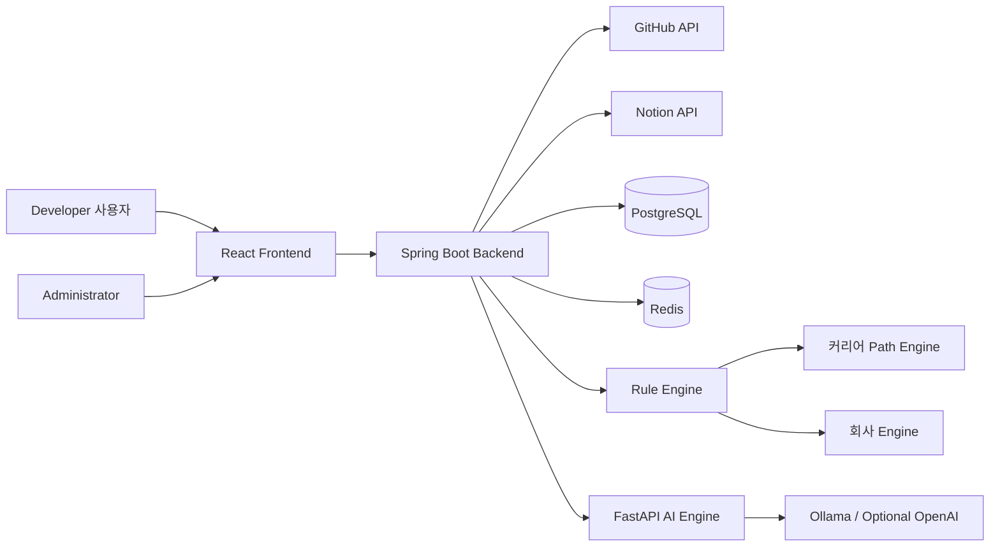

<!--
한국어판 문서입니다. 원본 기준 문서: docs/01_SRS.md
요구사항 ID, 파일 경로, 기술명, 엔진명, 스키마명은 추적성을 위해 원문 표기를 일부 유지합니다.
-->


# DevPath 소프트웨어 요구사항 명세서

- **문서 ID:** DevPath-SRS-001
- **버전:** 1.0
- **상태:** 초안
- **Standard Alignment:** IEEE 29148-style Software Requirements 명세
- **기준 문서:** `docs/00_Project_Context.md`
- **작성일:** 2026-07-20

## 개정 이력

| 버전 | 날짜 | 작성자 | 설명 |
|---|---:|---|---|
| 1.0 | 2026-07-20 | Software 아키텍처 Team | Initial enterprise SRS draft |

## 1. 소개

### 1.1 목적

본 소프트웨어 요구사항 명세서는 DevPath의 기능, 비기능, 인터페이스, 데이터, Rule Engine, Career Engine, AI, Prompt Engineering, 회사 규칙, 운영 및 인수 요구사항을 정의한다. 이 문서는 제품 책임자, 아키텍트, 백엔드 엔지니어, 프론트엔드 엔지니어, AI 엔지니어, QA 엔지니어, 보안 검토자, DevOps 엔지니어, 관리자에게 제공되는 기준 문서이다.

### 1.2 범위

DevPath는 AI 기반 개발자 커리어 인텔리전스 플랫폼이다. GitHub 저장소와 Notion 워크스페이스를 분석하고, 결정적 규칙 기반 엔지니어링 분석을 수행한 뒤, AI는 결과 설명·추천 문구 생성·커리어 산출물 작성에만 사용한다. DevPath는 LLM이 점수를 계산하는 것을 허용하지 않는다.

### 1.3 제품 비전

DevPath는 측정 가능한 엔지니어링 증거, 커리어별 평가, 회사별 준비도 매핑, AI 기반 코칭을 결합하여 지속적인 커리어 개발을 지원하는 장기적인 Developer Operating System이 되어야 한다.

### 1.4 용어, 약어 및 정의

| 용어 | 정의 |
|---|---|
| AI Engine | 프롬프트 구성, LLM 호출, 자연어 생성을 담당하는 서비스 계층이다. |
| Career Path Engine | 커리어별 규칙 세트, 프롬프트, 로드맵 로직을 선택하는 결정적 서비스이다. |
| Company Engine | 회사별 가중치와 추천 매핑을 적용하는 결정적 서비스이다. |
| 증거 | GitHub, Notion, 정규화 데이터 또는 Rule Engine 출력에서 수집된 측정 가능한 산출물이다. |
| LLM | 설명과 생성에만 사용되며 점수 계산에는 절대 사용되지 않는 대규모 언어 모델이다. |
| Rule Engine | 모든 점수와 측정 가능한 스킬 출력을 계산하는 결정적 구성요소이다. |
| Skill Matrix | 기술 스킬, 증거, 성숙도 수준, 점수 값을 구조화해 표현한 모델이다. |

### 1.5 참고 문서

- ISO/IEC/IEEE 29148: Systems and software engineering — Life cycle processes — Requirements engineering
- OAuth 2.0 Authorization Framework
- GitHub REST and GraphQL API documentation
- Notion API documentation
- OWASP Application Security Verification Standard

### 1.6 문서 개요

본 SRS는 컨텍스트, 이해관계자, 시스템 개요, 요구사항, 외부 인터페이스, 데이터 요구사항, 비기능 요구사항, 검증 기준, 추적성을 설명한다. 기능 요구사항은 ID, 제목, 설명, 액터, 사전 조건, 트리거, 흐름, 사후 조건, 규칙, 검증, 인수 기준을 포함하는 필수 구조를 사용한다.

## 2. 전체 설명

### 2.1 제품 관점

DevPath는 React 프론트엔드, Spring Boot 백엔드, PostgreSQL 데이터베이스, Redis 캐시, 결정적 Rule Engine, Career Path Engine, Company Engine, FastAPI 기반 AI 서비스, 선택적 OpenAI API 연동, 선택적 LangChain 연동, Docker·GitHub Actions·Nginx·Oracle Cloud Free 기반 DevOps 인프라로 구성된 웹 기반 플랫폼이다.

### 2.2 제품 기능

DevPath는 사용자 관리, GitHub 연동, Notion 연동, 데이터 수집, 결정적 규칙 분석, 커리어 경로 평가, 회사 준비도 평가, AI 설명 및 산출물 생성, 대시보드 시각화, 검색, 관리 기능을 지원해야 한다.

### 2.3 사용자 유형 및 특성

| 사용자 유형 | 특성 | 주요 목표 |
|---|---|---|
| Computer Science Student | Limited professional history, many learning projects | Understand skill gaps and portfolio readiness |
| Junior Developer | Some production or team experience | Improve engineering maturity and interview readiness |
| 커리어 전환자 | 다양한 이전 배경을 보유한 사용자 | 기존 증거를 목표 개발자 역할에 매핑 |
| Portfolio Builder | Focused on external presentation | Generate portfolio, resume, README improvements |
| Interview Candidate | 회사별 preparation need | Receive targeted interview questions and roadmap |
| Administrator | Internal operator | Manage rules, prompts, careers, companies, logs, and statistics |

### 2.4 운영 환경

- Frontend: React, TypeScript, TailwindCSS, React Query
- Backend: Spring Boot, Spring 보안
- Database: PostgreSQL and Redis
- AI: FastAPI, Ollama, optional OpenAI API, optional LangChain, pgvector
- DevOps: Docker, GitHub Actions, Nginx, Oracle Cloud Free

### 2.5 설계 및 구현 제약사항

- LLM은 절대 점수를 계산해서는 안 된다.
- 모든 점수는 Rule Engine에서 계산되어야 한다.
- 모든 요구사항은 측정 가능하고 테스트 가능해야 한다.
- 모든 요구사항은 안정적인 식별자를 가져야 한다.
- 시스템은 not invent unsupported project functionality.
- 외부 제공자의 제한은 준수되어야 하며, 재시도 가능한 워크플로를 통해 사용자에게 명확히 드러나야 한다.

### 2.6 가정 및 의존성

- Users grant GitHub and/or Notion OAuth permissions.
- 제공자 API는 rate limit을 적용하거나 부분 데이터만 반환할 수 있다.
- Scoring rules are versioned and auditable.
- 회사 and career mappings are administratively configurable.
- AI 출력 품질은 사용 가능한 결정적 증거의 품질에 영향을 받는다.

## 3. 시스템 컨텍스트

## 4. 외부 인터페이스 요구사항

### 4.1 사용자 인터페이스

- UI는 인증된 대시보드, 설정, 연동 연결 화면, 분석 화면, 생성 산출물 미리보기, 검색 화면, 관리자 화면을 제공해야 한다.
- 모든 차트는 접근 가능한 대체 텍스트와 키보드로 탐색 가능한 컨트롤을 제공해야 한다.
- 모든 폼은 가능한 경우 제출 전에 필드 수준 검증 메시지를 제공해야 한다.

### 4.2 하드웨어 인터페이스

No dedicated hardware interfaces are required beyond standard browser-capable client devices and server infrastructure.

### 4.3 소프트웨어 인터페이스

| 인터페이스 | 방향 | 요구사항 |
|---|---|---|
| GitHub API | External inbound collection | OAuth, repositories, commits, branches, pull requests, issues, README, dependencies, directory tree |
| Notion API | External inbound collection | OAuth, workspace, pages, databases, documentation, retrospectives, notes |
| PostgreSQL | Internal persistence | 사용자, integration, normalized, rule, AI, dashboard, search, audit data |
| Redis | Internal cache | Provider responses, dashboard snapshots, job state, rate-limit helpers |
| Ollama | Internal or local AI | Default LLM execution option |
| OpenAI API | Optional external AI | Optional hosted LLM execution option |

### 4.4 통신 인터페이스

- 백엔드 API는 로컬이 아닌 환경에서 HTTPS를 사용해야 한다.
- OAuth 리다이렉트는 state 파라미터를 검증해야 한다.
- 내부 서비스 통신은 운영 환경에서 인증된 네트워크 경로를 사용해야 한다.

## 5. 데이터 요구사항

### 5.1 데이터 엔티티

시스템은 사용자, 프로필, 연동, 저장소, 커밋, 브랜치, Pull Request, 이슈, Notion 워크스페이스, Notion 페이지, 정규화된 증거, 기술, 규칙, 규칙 버전, 점수, Skill Matrix 항목, 커리어 프로필, 회사 프로필, AI 프롬프트, AI 응답, 생성 산출물, 대시보드 스냅샷, 검색 인덱스, 로그, 지표, 감사 이벤트 엔티티를 관리해야 한다.

### 5.2 데이터 보존

- 원시 제공자 데이터는 관리자가 설정한 보존 정책에 따라 보관되어야 한다.
- 파생 점수는 규칙 버전, 입력 스냅샷 ID, 계산 타임스탬프를 보존해야 한다.
- 감사 로그는 일반 사용자가 변경할 수 없어야 한다.

### 5.3 데이터 품질

- 정규화된 레코드는 원천 제공자, 원천 ID, 수집 타임스탬프, 정규화 버전을 포함해야 한다.
- 중복 원천 레코드는 제공자 ID와 콘텐츠 해시를 사용해 탐지되어야 한다.
- 누락 데이터는 명시적으로 표현되어야 하며, 규칙 버전이 해당 동작을 정의하지 않는 한 조용히 0으로 처리되어서는 안 된다.

## 6. 기능 요구사항

Each functional requirement below is atomic, uniquely identified, measurable, and testable. No acceptance criterion permits AI-based score calculation.

## 6.1 사용자 Management Requirements

### FR-001 — GitHub OAuth Login

- **설명:** 시스템은 user management 기능 영역에서 github oauth login을(를) 측정 가능하고, 영속화되며, 감사 가능한 방식으로 제공해야 한다.
- **액터:** Authenticated Developer, Guest 사용자, 시스템 Administrator
- **사전 조건:** 유효한 애플리케이션 세션 또는 OAuth 콜백 컨텍스트가 있어야 한다.
- **트리거:** 사용자 initiates account, profile, preference, career, company, or settings action.
- **기본 흐름:** 1. 요청을 수신한다. 2. 권한과 필수 입력값을 검증한다. 3. github oauth login을(를) 실행한다. 4. 필요한 경우 상태 또는 결과를 저장한다. 5. 추적 가능한 식별자와 함께 사용자가 이해할 수 있는 결과를 반환한다.
- **대체 흐름:** 선택 필터, 부분 데이터 또는 캐시 데이터가 있는 경우, 시스템은 응답에서 적용 범위를 명확히 식별할 때에만 이를 사용해야 한다.
- **예외 흐름:** 검증, 권한, 제공자, 타임아웃 또는 영속화 실패가 발생하면 시스템은 작업을 중단하고 오류 코드를 기록하며 민감하지 않은 실패 메시지를 제공해야 한다.
- **사후 조건:** GitHub OAuth Login 결과는 권한 있는 사용자에게 제공되거나, 재시도 지침과 함께 실패 상태로 기록된다.
- **비즈니스 규칙:** 모든 외부 데이터와 사용자 데이터는 권한, 프라이버시 및 감사 규칙에 따라 처리되어야 한다.
- **검증 규칙:** 필수 식별자는 유효한 UUID 또는 제공자 ID여야 하며, 수치 측정값은 설정된 범위를 사용해야 하고, 텍스트 출력은 스키마·길이·안전 제약을 만족해야 한다.
- **인수 기준:** 유효한 입력이 주어지고 github oauth login 요청이 발생하면, 시스템은 정의된 SLA 내에서 작업을 완료하고 감사 이벤트를 기록하며 결정적 식별자 또는 측정 가능한 결과를 반환해야 한다.

### FR-002 — OAuth Callback Handling

- **설명:** 시스템은 user management 기능 영역에서 oauth callback handling을(를) 측정 가능하고, 영속화되며, 감사 가능한 방식으로 제공해야 한다.
- **액터:** Authenticated Developer, Guest 사용자, 시스템 Administrator
- **사전 조건:** 유효한 애플리케이션 세션 또는 OAuth 콜백 컨텍스트가 있어야 한다.
- **트리거:** 사용자 initiates account, profile, preference, career, company, or settings action.
- **기본 흐름:** 1. 요청을 수신한다. 2. 권한과 필수 입력값을 검증한다. 3. oauth callback handling을(를) 실행한다. 4. 필요한 경우 상태 또는 결과를 저장한다. 5. 추적 가능한 식별자와 함께 사용자가 이해할 수 있는 결과를 반환한다.
- **대체 흐름:** 선택 필터, 부분 데이터 또는 캐시 데이터가 있는 경우, 시스템은 응답에서 적용 범위를 명확히 식별할 때에만 이를 사용해야 한다.
- **예외 흐름:** 검증, 권한, 제공자, 타임아웃 또는 영속화 실패가 발생하면 시스템은 작업을 중단하고 오류 코드를 기록하며 민감하지 않은 실패 메시지를 제공해야 한다.
- **사후 조건:** OAuth Callback Handling 결과는 권한 있는 사용자에게 제공되거나, 재시도 지침과 함께 실패 상태로 기록된다.
- **비즈니스 규칙:** 모든 외부 데이터와 사용자 데이터는 권한, 프라이버시 및 감사 규칙에 따라 처리되어야 한다.
- **검증 규칙:** 필수 식별자는 유효한 UUID 또는 제공자 ID여야 하며, 수치 측정값은 설정된 범위를 사용해야 하고, 텍스트 출력은 스키마·길이·안전 제약을 만족해야 한다.
- **인수 기준:** 유효한 입력이 주어지고 oauth callback handling 요청이 발생하면, 시스템은 정의된 SLA 내에서 작업을 완료하고 감사 이벤트를 기록하며 결정적 식별자 또는 측정 가능한 결과를 반환해야 한다.

### FR-003 — Account Provisioning

- **설명:** 시스템은 user management 기능 영역에서 account provisioning을(를) 측정 가능하고, 영속화되며, 감사 가능한 방식으로 제공해야 한다.
- **액터:** Authenticated Developer, Guest 사용자, 시스템 Administrator
- **사전 조건:** 유효한 애플리케이션 세션 또는 OAuth 콜백 컨텍스트가 있어야 한다.
- **트리거:** 사용자 initiates account, profile, preference, career, company, or settings action.
- **기본 흐름:** 1. 요청을 수신한다. 2. 권한과 필수 입력값을 검증한다. 3. account provisioning을(를) 실행한다. 4. 필요한 경우 상태 또는 결과를 저장한다. 5. 추적 가능한 식별자와 함께 사용자가 이해할 수 있는 결과를 반환한다.
- **대체 흐름:** 선택 필터, 부분 데이터 또는 캐시 데이터가 있는 경우, 시스템은 응답에서 적용 범위를 명확히 식별할 때에만 이를 사용해야 한다.
- **예외 흐름:** 검증, 권한, 제공자, 타임아웃 또는 영속화 실패가 발생하면 시스템은 작업을 중단하고 오류 코드를 기록하며 민감하지 않은 실패 메시지를 제공해야 한다.
- **사후 조건:** Account Provisioning 결과는 권한 있는 사용자에게 제공되거나, 재시도 지침과 함께 실패 상태로 기록된다.
- **비즈니스 규칙:** 모든 외부 데이터와 사용자 데이터는 권한, 프라이버시 및 감사 규칙에 따라 처리되어야 한다.
- **검증 규칙:** 필수 식별자는 유효한 UUID 또는 제공자 ID여야 하며, 수치 측정값은 설정된 범위를 사용해야 하고, 텍스트 출력은 스키마·길이·안전 제약을 만족해야 한다.
- **인수 기준:** 유효한 입력이 주어지고 account provisioning 요청이 발생하면, 시스템은 정의된 SLA 내에서 작업을 완료하고 감사 이벤트를 기록하며 결정적 식별자 또는 측정 가능한 결과를 반환해야 한다.

### FR-004 — 사용자 Session Management

- **설명:** 시스템은 user management 기능 영역에서 user session management을(를) 측정 가능하고, 영속화되며, 감사 가능한 방식으로 제공해야 한다.
- **액터:** Authenticated Developer, Guest 사용자, 시스템 Administrator
- **사전 조건:** 유효한 애플리케이션 세션 또는 OAuth 콜백 컨텍스트가 있어야 한다.
- **트리거:** 사용자 initiates account, profile, preference, career, company, or settings action.
- **기본 흐름:** 1. 요청을 수신한다. 2. 권한과 필수 입력값을 검증한다. 3. user session management을(를) 실행한다. 4. 필요한 경우 상태 또는 결과를 저장한다. 5. 추적 가능한 식별자와 함께 사용자가 이해할 수 있는 결과를 반환한다.
- **대체 흐름:** 선택 필터, 부분 데이터 또는 캐시 데이터가 있는 경우, 시스템은 응답에서 적용 범위를 명확히 식별할 때에만 이를 사용해야 한다.
- **예외 흐름:** 검증, 권한, 제공자, 타임아웃 또는 영속화 실패가 발생하면 시스템은 작업을 중단하고 오류 코드를 기록하며 민감하지 않은 실패 메시지를 제공해야 한다.
- **사후 조건:** 사용자 Session Management 결과는 권한 있는 사용자에게 제공되거나, 재시도 지침과 함께 실패 상태로 기록된다.
- **비즈니스 규칙:** 모든 외부 데이터와 사용자 데이터는 권한, 프라이버시 및 감사 규칙에 따라 처리되어야 한다.
- **검증 규칙:** 필수 식별자는 유효한 UUID 또는 제공자 ID여야 하며, 수치 측정값은 설정된 범위를 사용해야 하고, 텍스트 출력은 스키마·길이·안전 제약을 만족해야 한다.
- **인수 기준:** 유효한 입력이 주어지고 user session management 요청이 발생하면, 시스템은 정의된 SLA 내에서 작업을 완료하고 감사 이벤트를 기록하며 결정적 식별자 또는 측정 가능한 결과를 반환해야 한다.

### FR-005 — Logout

- **설명:** 시스템은 user management 기능 영역에서 logout을(를) 측정 가능하고, 영속화되며, 감사 가능한 방식으로 제공해야 한다.
- **액터:** Authenticated Developer, Guest 사용자, 시스템 Administrator
- **사전 조건:** 유효한 애플리케이션 세션 또는 OAuth 콜백 컨텍스트가 있어야 한다.
- **트리거:** 사용자 initiates account, profile, preference, career, company, or settings action.
- **기본 흐름:** 1. 요청을 수신한다. 2. 권한과 필수 입력값을 검증한다. 3. logout을(를) 실행한다. 4. 필요한 경우 상태 또는 결과를 저장한다. 5. 추적 가능한 식별자와 함께 사용자가 이해할 수 있는 결과를 반환한다.
- **대체 흐름:** 선택 필터, 부분 데이터 또는 캐시 데이터가 있는 경우, 시스템은 응답에서 적용 범위를 명확히 식별할 때에만 이를 사용해야 한다.
- **예외 흐름:** 검증, 권한, 제공자, 타임아웃 또는 영속화 실패가 발생하면 시스템은 작업을 중단하고 오류 코드를 기록하며 민감하지 않은 실패 메시지를 제공해야 한다.
- **사후 조건:** Logout 결과는 권한 있는 사용자에게 제공되거나, 재시도 지침과 함께 실패 상태로 기록된다.
- **비즈니스 규칙:** 모든 외부 데이터와 사용자 데이터는 권한, 프라이버시 및 감사 규칙에 따라 처리되어야 한다.
- **검증 규칙:** 필수 식별자는 유효한 UUID 또는 제공자 ID여야 하며, 수치 측정값은 설정된 범위를 사용해야 하고, 텍스트 출력은 스키마·길이·안전 제약을 만족해야 한다.
- **인수 기준:** 유효한 입력이 주어지고 logout 요청이 발생하면, 시스템은 정의된 SLA 내에서 작업을 완료하고 감사 이벤트를 기록하며 결정적 식별자 또는 측정 가능한 결과를 반환해야 한다.

### FR-006 — 사용자 Profile View

- **설명:** 시스템은 user management 기능 영역에서 user profile view을(를) 측정 가능하고, 영속화되며, 감사 가능한 방식으로 제공해야 한다.
- **액터:** Authenticated Developer, Guest 사용자, 시스템 Administrator
- **사전 조건:** 유효한 애플리케이션 세션 또는 OAuth 콜백 컨텍스트가 있어야 한다.
- **트리거:** 사용자 initiates account, profile, preference, career, company, or settings action.
- **기본 흐름:** 1. 요청을 수신한다. 2. 권한과 필수 입력값을 검증한다. 3. user profile view을(를) 실행한다. 4. 필요한 경우 상태 또는 결과를 저장한다. 5. 추적 가능한 식별자와 함께 사용자가 이해할 수 있는 결과를 반환한다.
- **대체 흐름:** 선택 필터, 부분 데이터 또는 캐시 데이터가 있는 경우, 시스템은 응답에서 적용 범위를 명확히 식별할 때에만 이를 사용해야 한다.
- **예외 흐름:** 검증, 권한, 제공자, 타임아웃 또는 영속화 실패가 발생하면 시스템은 작업을 중단하고 오류 코드를 기록하며 민감하지 않은 실패 메시지를 제공해야 한다.
- **사후 조건:** 사용자 Profile View 결과는 권한 있는 사용자에게 제공되거나, 재시도 지침과 함께 실패 상태로 기록된다.
- **비즈니스 규칙:** 모든 외부 데이터와 사용자 데이터는 권한, 프라이버시 및 감사 규칙에 따라 처리되어야 한다.
- **검증 규칙:** 필수 식별자는 유효한 UUID 또는 제공자 ID여야 하며, 수치 측정값은 설정된 범위를 사용해야 하고, 텍스트 출력은 스키마·길이·안전 제약을 만족해야 한다.
- **인수 기준:** 유효한 입력이 주어지고 user profile view 요청이 발생하면, 시스템은 정의된 SLA 내에서 작업을 완료하고 감사 이벤트를 기록하며 결정적 식별자 또는 측정 가능한 결과를 반환해야 한다.

### FR-007 — 사용자 Profile Update

- **설명:** 시스템은 user management 기능 영역에서 user profile update을(를) 측정 가능하고, 영속화되며, 감사 가능한 방식으로 제공해야 한다.
- **액터:** Authenticated Developer, Guest 사용자, 시스템 Administrator
- **사전 조건:** 유효한 애플리케이션 세션 또는 OAuth 콜백 컨텍스트가 있어야 한다.
- **트리거:** 사용자 initiates account, profile, preference, career, company, or settings action.
- **기본 흐름:** 1. 요청을 수신한다. 2. 권한과 필수 입력값을 검증한다. 3. user profile update을(를) 실행한다. 4. 필요한 경우 상태 또는 결과를 저장한다. 5. 추적 가능한 식별자와 함께 사용자가 이해할 수 있는 결과를 반환한다.
- **대체 흐름:** 선택 필터, 부분 데이터 또는 캐시 데이터가 있는 경우, 시스템은 응답에서 적용 범위를 명확히 식별할 때에만 이를 사용해야 한다.
- **예외 흐름:** 검증, 권한, 제공자, 타임아웃 또는 영속화 실패가 발생하면 시스템은 작업을 중단하고 오류 코드를 기록하며 민감하지 않은 실패 메시지를 제공해야 한다.
- **사후 조건:** 사용자 Profile Update 결과는 권한 있는 사용자에게 제공되거나, 재시도 지침과 함께 실패 상태로 기록된다.
- **비즈니스 규칙:** 모든 외부 데이터와 사용자 데이터는 권한, 프라이버시 및 감사 규칙에 따라 처리되어야 한다.
- **검증 규칙:** 필수 식별자는 유효한 UUID 또는 제공자 ID여야 하며, 수치 측정값은 설정된 범위를 사용해야 하고, 텍스트 출력은 스키마·길이·안전 제약을 만족해야 한다.
- **인수 기준:** 유효한 입력이 주어지고 user profile update 요청이 발생하면, 시스템은 정의된 SLA 내에서 작업을 완료하고 감사 이벤트를 기록하며 결정적 식별자 또는 측정 가능한 결과를 반환해야 한다.

### FR-008 — 커리어 Selection

- **설명:** 시스템은 user management 기능 영역에서 career selection을(를) 측정 가능하고, 영속화되며, 감사 가능한 방식으로 제공해야 한다.
- **액터:** Authenticated Developer, Guest 사용자, 시스템 Administrator
- **사전 조건:** 유효한 애플리케이션 세션 또는 OAuth 콜백 컨텍스트가 있어야 한다.
- **트리거:** 사용자 initiates account, profile, preference, career, company, or settings action.
- **기본 흐름:** 1. 요청을 수신한다. 2. 권한과 필수 입력값을 검증한다. 3. career selection을(를) 실행한다. 4. 필요한 경우 상태 또는 결과를 저장한다. 5. 추적 가능한 식별자와 함께 사용자가 이해할 수 있는 결과를 반환한다.
- **대체 흐름:** 선택 필터, 부분 데이터 또는 캐시 데이터가 있는 경우, 시스템은 응답에서 적용 범위를 명확히 식별할 때에만 이를 사용해야 한다.
- **예외 흐름:** 검증, 권한, 제공자, 타임아웃 또는 영속화 실패가 발생하면 시스템은 작업을 중단하고 오류 코드를 기록하며 민감하지 않은 실패 메시지를 제공해야 한다.
- **사후 조건:** 커리어 Selection 결과는 권한 있는 사용자에게 제공되거나, 재시도 지침과 함께 실패 상태로 기록된다.
- **비즈니스 규칙:** 모든 외부 데이터와 사용자 데이터는 권한, 프라이버시 및 감사 규칙에 따라 처리되어야 한다.
- **검증 규칙:** 필수 식별자는 유효한 UUID 또는 제공자 ID여야 하며, 수치 측정값은 설정된 범위를 사용해야 하고, 텍스트 출력은 스키마·길이·안전 제약을 만족해야 한다.
- **인수 기준:** 유효한 입력이 주어지고 career selection 요청이 발생하면, 시스템은 정의된 SLA 내에서 작업을 완료하고 감사 이벤트를 기록하며 결정적 식별자 또는 측정 가능한 결과를 반환해야 한다.

### FR-009 — 회사 Selection

- **설명:** 시스템은 user management 기능 영역에서 company selection을(를) 측정 가능하고, 영속화되며, 감사 가능한 방식으로 제공해야 한다.
- **액터:** Authenticated Developer, Guest 사용자, 시스템 Administrator
- **사전 조건:** 유효한 애플리케이션 세션 또는 OAuth 콜백 컨텍스트가 있어야 한다.
- **트리거:** 사용자 initiates account, profile, preference, career, company, or settings action.
- **기본 흐름:** 1. 요청을 수신한다. 2. 권한과 필수 입력값을 검증한다. 3. company selection을(를) 실행한다. 4. 필요한 경우 상태 또는 결과를 저장한다. 5. 추적 가능한 식별자와 함께 사용자가 이해할 수 있는 결과를 반환한다.
- **대체 흐름:** 선택 필터, 부분 데이터 또는 캐시 데이터가 있는 경우, 시스템은 응답에서 적용 범위를 명확히 식별할 때에만 이를 사용해야 한다.
- **예외 흐름:** 검증, 권한, 제공자, 타임아웃 또는 영속화 실패가 발생하면 시스템은 작업을 중단하고 오류 코드를 기록하며 민감하지 않은 실패 메시지를 제공해야 한다.
- **사후 조건:** 회사 Selection 결과는 권한 있는 사용자에게 제공되거나, 재시도 지침과 함께 실패 상태로 기록된다.
- **비즈니스 규칙:** 모든 외부 데이터와 사용자 데이터는 권한, 프라이버시 및 감사 규칙에 따라 처리되어야 한다.
- **검증 규칙:** 필수 식별자는 유효한 UUID 또는 제공자 ID여야 하며, 수치 측정값은 설정된 범위를 사용해야 하고, 텍스트 출력은 스키마·길이·안전 제약을 만족해야 한다.
- **인수 기준:** 유효한 입력이 주어지고 company selection 요청이 발생하면, 시스템은 정의된 SLA 내에서 작업을 완료하고 감사 이벤트를 기록하며 결정적 식별자 또는 측정 가능한 결과를 반환해야 한다.

### FR-010 — Settings View

- **설명:** 시스템은 user management 기능 영역에서 settings view을(를) 측정 가능하고, 영속화되며, 감사 가능한 방식으로 제공해야 한다.
- **액터:** Authenticated Developer, Guest 사용자, 시스템 Administrator
- **사전 조건:** 유효한 애플리케이션 세션 또는 OAuth 콜백 컨텍스트가 있어야 한다.
- **트리거:** 사용자 initiates account, profile, preference, career, company, or settings action.
- **기본 흐름:** 1. 요청을 수신한다. 2. 권한과 필수 입력값을 검증한다. 3. settings view을(를) 실행한다. 4. 필요한 경우 상태 또는 결과를 저장한다. 5. 추적 가능한 식별자와 함께 사용자가 이해할 수 있는 결과를 반환한다.
- **대체 흐름:** 선택 필터, 부분 데이터 또는 캐시 데이터가 있는 경우, 시스템은 응답에서 적용 범위를 명확히 식별할 때에만 이를 사용해야 한다.
- **예외 흐름:** 검증, 권한, 제공자, 타임아웃 또는 영속화 실패가 발생하면 시스템은 작업을 중단하고 오류 코드를 기록하며 민감하지 않은 실패 메시지를 제공해야 한다.
- **사후 조건:** Settings View 결과는 권한 있는 사용자에게 제공되거나, 재시도 지침과 함께 실패 상태로 기록된다.
- **비즈니스 규칙:** 모든 외부 데이터와 사용자 데이터는 권한, 프라이버시 및 감사 규칙에 따라 처리되어야 한다.
- **검증 규칙:** 필수 식별자는 유효한 UUID 또는 제공자 ID여야 하며, 수치 측정값은 설정된 범위를 사용해야 하고, 텍스트 출력은 스키마·길이·안전 제약을 만족해야 한다.
- **인수 기준:** 유효한 입력이 주어지고 settings view 요청이 발생하면, 시스템은 정의된 SLA 내에서 작업을 완료하고 감사 이벤트를 기록하며 결정적 식별자 또는 측정 가능한 결과를 반환해야 한다.

### FR-011 — Notification Preference Update

- **설명:** 시스템은 user management 기능 영역에서 notification preference update을(를) 측정 가능하고, 영속화되며, 감사 가능한 방식으로 제공해야 한다.
- **액터:** Authenticated Developer, Guest 사용자, 시스템 Administrator
- **사전 조건:** 유효한 애플리케이션 세션 또는 OAuth 콜백 컨텍스트가 있어야 한다.
- **트리거:** 사용자 initiates account, profile, preference, career, company, or settings action.
- **기본 흐름:** 1. 요청을 수신한다. 2. 권한과 필수 입력값을 검증한다. 3. notification preference update을(를) 실행한다. 4. 필요한 경우 상태 또는 결과를 저장한다. 5. 추적 가능한 식별자와 함께 사용자가 이해할 수 있는 결과를 반환한다.
- **대체 흐름:** 선택 필터, 부분 데이터 또는 캐시 데이터가 있는 경우, 시스템은 응답에서 적용 범위를 명확히 식별할 때에만 이를 사용해야 한다.
- **예외 흐름:** 검증, 권한, 제공자, 타임아웃 또는 영속화 실패가 발생하면 시스템은 작업을 중단하고 오류 코드를 기록하며 민감하지 않은 실패 메시지를 제공해야 한다.
- **사후 조건:** Notification Preference Update 결과는 권한 있는 사용자에게 제공되거나, 재시도 지침과 함께 실패 상태로 기록된다.
- **비즈니스 규칙:** 모든 외부 데이터와 사용자 데이터는 권한, 프라이버시 및 감사 규칙에 따라 처리되어야 한다.
- **검증 규칙:** 필수 식별자는 유효한 UUID 또는 제공자 ID여야 하며, 수치 측정값은 설정된 범위를 사용해야 하고, 텍스트 출력은 스키마·길이·안전 제약을 만족해야 한다.
- **인수 기준:** 유효한 입력이 주어지고 notification preference update 요청이 발생하면, 시스템은 정의된 SLA 내에서 작업을 완료하고 감사 이벤트를 기록하며 결정적 식별자 또는 측정 가능한 결과를 반환해야 한다.

### FR-012 — Data 프라이버시 Preference Update

- **설명:** 시스템은 user management 기능 영역에서 data privacy preference update을(를) 측정 가능하고, 영속화되며, 감사 가능한 방식으로 제공해야 한다.
- **액터:** Authenticated Developer, Guest 사용자, 시스템 Administrator
- **사전 조건:** 유효한 애플리케이션 세션 또는 OAuth 콜백 컨텍스트가 있어야 한다.
- **트리거:** 사용자 initiates account, profile, preference, career, company, or settings action.
- **기본 흐름:** 1. 요청을 수신한다. 2. 권한과 필수 입력값을 검증한다. 3. data privacy preference update을(를) 실행한다. 4. 필요한 경우 상태 또는 결과를 저장한다. 5. 추적 가능한 식별자와 함께 사용자가 이해할 수 있는 결과를 반환한다.
- **대체 흐름:** 선택 필터, 부분 데이터 또는 캐시 데이터가 있는 경우, 시스템은 응답에서 적용 범위를 명확히 식별할 때에만 이를 사용해야 한다.
- **예외 흐름:** 검증, 권한, 제공자, 타임아웃 또는 영속화 실패가 발생하면 시스템은 작업을 중단하고 오류 코드를 기록하며 민감하지 않은 실패 메시지를 제공해야 한다.
- **사후 조건:** Data 프라이버시 Preference Update 결과는 권한 있는 사용자에게 제공되거나, 재시도 지침과 함께 실패 상태로 기록된다.
- **비즈니스 규칙:** 모든 외부 데이터와 사용자 데이터는 권한, 프라이버시 및 감사 규칙에 따라 처리되어야 한다.
- **검증 규칙:** 필수 식별자는 유효한 UUID 또는 제공자 ID여야 하며, 수치 측정값은 설정된 범위를 사용해야 하고, 텍스트 출력은 스키마·길이·안전 제약을 만족해야 한다.
- **인수 기준:** 유효한 입력이 주어지고 data privacy preference update 요청이 발생하면, 시스템은 정의된 SLA 내에서 작업을 완료하고 감사 이벤트를 기록하며 결정적 식별자 또는 측정 가능한 결과를 반환해야 한다.

### FR-013 — Connected Account View

- **설명:** 시스템은 user management 기능 영역에서 connected account view을(를) 측정 가능하고, 영속화되며, 감사 가능한 방식으로 제공해야 한다.
- **액터:** Authenticated Developer, Guest 사용자, 시스템 Administrator
- **사전 조건:** 유효한 애플리케이션 세션 또는 OAuth 콜백 컨텍스트가 있어야 한다.
- **트리거:** 사용자 initiates account, profile, preference, career, company, or settings action.
- **기본 흐름:** 1. 요청을 수신한다. 2. 권한과 필수 입력값을 검증한다. 3. connected account view을(를) 실행한다. 4. 필요한 경우 상태 또는 결과를 저장한다. 5. 추적 가능한 식별자와 함께 사용자가 이해할 수 있는 결과를 반환한다.
- **대체 흐름:** 선택 필터, 부분 데이터 또는 캐시 데이터가 있는 경우, 시스템은 응답에서 적용 범위를 명확히 식별할 때에만 이를 사용해야 한다.
- **예외 흐름:** 검증, 권한, 제공자, 타임아웃 또는 영속화 실패가 발생하면 시스템은 작업을 중단하고 오류 코드를 기록하며 민감하지 않은 실패 메시지를 제공해야 한다.
- **사후 조건:** Connected Account View 결과는 권한 있는 사용자에게 제공되거나, 재시도 지침과 함께 실패 상태로 기록된다.
- **비즈니스 규칙:** 모든 외부 데이터와 사용자 데이터는 권한, 프라이버시 및 감사 규칙에 따라 처리되어야 한다.
- **검증 규칙:** 필수 식별자는 유효한 UUID 또는 제공자 ID여야 하며, 수치 측정값은 설정된 범위를 사용해야 하고, 텍스트 출력은 스키마·길이·안전 제약을 만족해야 한다.
- **인수 기준:** 유효한 입력이 주어지고 connected account view 요청이 발생하면, 시스템은 정의된 SLA 내에서 작업을 완료하고 감사 이벤트를 기록하며 결정적 식별자 또는 측정 가능한 결과를 반환해야 한다.

### FR-014 — Account Reconnection

- **설명:** 시스템은 user management 기능 영역에서 account reconnection을(를) 측정 가능하고, 영속화되며, 감사 가능한 방식으로 제공해야 한다.
- **액터:** Authenticated Developer, Guest 사용자, 시스템 Administrator
- **사전 조건:** 유효한 애플리케이션 세션 또는 OAuth 콜백 컨텍스트가 있어야 한다.
- **트리거:** 사용자 initiates account, profile, preference, career, company, or settings action.
- **기본 흐름:** 1. 요청을 수신한다. 2. 권한과 필수 입력값을 검증한다. 3. account reconnection을(를) 실행한다. 4. 필요한 경우 상태 또는 결과를 저장한다. 5. 추적 가능한 식별자와 함께 사용자가 이해할 수 있는 결과를 반환한다.
- **대체 흐름:** 선택 필터, 부분 데이터 또는 캐시 데이터가 있는 경우, 시스템은 응답에서 적용 범위를 명확히 식별할 때에만 이를 사용해야 한다.
- **예외 흐름:** 검증, 권한, 제공자, 타임아웃 또는 영속화 실패가 발생하면 시스템은 작업을 중단하고 오류 코드를 기록하며 민감하지 않은 실패 메시지를 제공해야 한다.
- **사후 조건:** Account Reconnection 결과는 권한 있는 사용자에게 제공되거나, 재시도 지침과 함께 실패 상태로 기록된다.
- **비즈니스 규칙:** 모든 외부 데이터와 사용자 데이터는 권한, 프라이버시 및 감사 규칙에 따라 처리되어야 한다.
- **검증 규칙:** 필수 식별자는 유효한 UUID 또는 제공자 ID여야 하며, 수치 측정값은 설정된 범위를 사용해야 하고, 텍스트 출력은 스키마·길이·안전 제약을 만족해야 한다.
- **인수 기준:** 유효한 입력이 주어지고 account reconnection 요청이 발생하면, 시스템은 정의된 SLA 내에서 작업을 완료하고 감사 이벤트를 기록하며 결정적 식별자 또는 측정 가능한 결과를 반환해야 한다.

### FR-015 — Account Deactivation

- **설명:** 시스템은 user management 기능 영역에서 account deactivation을(를) 측정 가능하고, 영속화되며, 감사 가능한 방식으로 제공해야 한다.
- **액터:** Authenticated Developer, Guest 사용자, 시스템 Administrator
- **사전 조건:** 유효한 애플리케이션 세션 또는 OAuth 콜백 컨텍스트가 있어야 한다.
- **트리거:** 사용자 initiates account, profile, preference, career, company, or settings action.
- **기본 흐름:** 1. 요청을 수신한다. 2. 권한과 필수 입력값을 검증한다. 3. account deactivation을(를) 실행한다. 4. 필요한 경우 상태 또는 결과를 저장한다. 5. 추적 가능한 식별자와 함께 사용자가 이해할 수 있는 결과를 반환한다.
- **대체 흐름:** 선택 필터, 부분 데이터 또는 캐시 데이터가 있는 경우, 시스템은 응답에서 적용 범위를 명확히 식별할 때에만 이를 사용해야 한다.
- **예외 흐름:** 검증, 권한, 제공자, 타임아웃 또는 영속화 실패가 발생하면 시스템은 작업을 중단하고 오류 코드를 기록하며 민감하지 않은 실패 메시지를 제공해야 한다.
- **사후 조건:** Account Deactivation 결과는 권한 있는 사용자에게 제공되거나, 재시도 지침과 함께 실패 상태로 기록된다.
- **비즈니스 규칙:** 모든 외부 데이터와 사용자 데이터는 권한, 프라이버시 및 감사 규칙에 따라 처리되어야 한다.
- **검증 규칙:** 필수 식별자는 유효한 UUID 또는 제공자 ID여야 하며, 수치 측정값은 설정된 범위를 사용해야 하고, 텍스트 출력은 스키마·길이·안전 제약을 만족해야 한다.
- **인수 기준:** 유효한 입력이 주어지고 account deactivation 요청이 발생하면, 시스템은 정의된 SLA 내에서 작업을 완료하고 감사 이벤트를 기록하며 결정적 식별자 또는 측정 가능한 결과를 반환해야 한다.

### FR-016 — Role Assignment

- **설명:** 시스템은 user management 기능 영역에서 role assignment을(를) 측정 가능하고, 영속화되며, 감사 가능한 방식으로 제공해야 한다.
- **액터:** Authenticated Developer, Guest 사용자, 시스템 Administrator
- **사전 조건:** 유효한 애플리케이션 세션 또는 OAuth 콜백 컨텍스트가 있어야 한다.
- **트리거:** 사용자 initiates account, profile, preference, career, company, or settings action.
- **기본 흐름:** 1. 요청을 수신한다. 2. 권한과 필수 입력값을 검증한다. 3. role assignment을(를) 실행한다. 4. 필요한 경우 상태 또는 결과를 저장한다. 5. 추적 가능한 식별자와 함께 사용자가 이해할 수 있는 결과를 반환한다.
- **대체 흐름:** 선택 필터, 부분 데이터 또는 캐시 데이터가 있는 경우, 시스템은 응답에서 적용 범위를 명확히 식별할 때에만 이를 사용해야 한다.
- **예외 흐름:** 검증, 권한, 제공자, 타임아웃 또는 영속화 실패가 발생하면 시스템은 작업을 중단하고 오류 코드를 기록하며 민감하지 않은 실패 메시지를 제공해야 한다.
- **사후 조건:** Role Assignment 결과는 권한 있는 사용자에게 제공되거나, 재시도 지침과 함께 실패 상태로 기록된다.
- **비즈니스 규칙:** 모든 외부 데이터와 사용자 데이터는 권한, 프라이버시 및 감사 규칙에 따라 처리되어야 한다.
- **검증 규칙:** 필수 식별자는 유효한 UUID 또는 제공자 ID여야 하며, 수치 측정값은 설정된 범위를 사용해야 하고, 텍스트 출력은 스키마·길이·안전 제약을 만족해야 한다.
- **인수 기준:** 유효한 입력이 주어지고 role assignment 요청이 발생하면, 시스템은 정의된 SLA 내에서 작업을 완료하고 감사 이벤트를 기록하며 결정적 식별자 또는 측정 가능한 결과를 반환해야 한다.

### FR-017 — Authorization Enforcement

- **설명:** 시스템은 user management 기능 영역에서 authorization enforcement을(를) 측정 가능하고, 영속화되며, 감사 가능한 방식으로 제공해야 한다.
- **액터:** Authenticated Developer, Guest 사용자, 시스템 Administrator
- **사전 조건:** 유효한 애플리케이션 세션 또는 OAuth 콜백 컨텍스트가 있어야 한다.
- **트리거:** 사용자 initiates account, profile, preference, career, company, or settings action.
- **기본 흐름:** 1. 요청을 수신한다. 2. 권한과 필수 입력값을 검증한다. 3. authorization enforcement을(를) 실행한다. 4. 필요한 경우 상태 또는 결과를 저장한다. 5. 추적 가능한 식별자와 함께 사용자가 이해할 수 있는 결과를 반환한다.
- **대체 흐름:** 선택 필터, 부분 데이터 또는 캐시 데이터가 있는 경우, 시스템은 응답에서 적용 범위를 명확히 식별할 때에만 이를 사용해야 한다.
- **예외 흐름:** 검증, 권한, 제공자, 타임아웃 또는 영속화 실패가 발생하면 시스템은 작업을 중단하고 오류 코드를 기록하며 민감하지 않은 실패 메시지를 제공해야 한다.
- **사후 조건:** Authorization Enforcement 결과는 권한 있는 사용자에게 제공되거나, 재시도 지침과 함께 실패 상태로 기록된다.
- **비즈니스 규칙:** 모든 외부 데이터와 사용자 데이터는 권한, 프라이버시 및 감사 규칙에 따라 처리되어야 한다.
- **검증 규칙:** 필수 식별자는 유효한 UUID 또는 제공자 ID여야 하며, 수치 측정값은 설정된 범위를 사용해야 하고, 텍스트 출력은 스키마·길이·안전 제약을 만족해야 한다.
- **인수 기준:** 유효한 입력이 주어지고 authorization enforcement 요청이 발생하면, 시스템은 정의된 SLA 내에서 작업을 완료하고 감사 이벤트를 기록하며 결정적 식별자 또는 측정 가능한 결과를 반환해야 한다.

### FR-018 — Profile Completeness Check

- **설명:** 시스템은 user management 기능 영역에서 profile completeness check을(를) 측정 가능하고, 영속화되며, 감사 가능한 방식으로 제공해야 한다.
- **액터:** Authenticated Developer, Guest 사용자, 시스템 Administrator
- **사전 조건:** 유효한 애플리케이션 세션 또는 OAuth 콜백 컨텍스트가 있어야 한다.
- **트리거:** 사용자 initiates account, profile, preference, career, company, or settings action.
- **기본 흐름:** 1. 요청을 수신한다. 2. 권한과 필수 입력값을 검증한다. 3. profile completeness check을(를) 실행한다. 4. 필요한 경우 상태 또는 결과를 저장한다. 5. 추적 가능한 식별자와 함께 사용자가 이해할 수 있는 결과를 반환한다.
- **대체 흐름:** 선택 필터, 부분 데이터 또는 캐시 데이터가 있는 경우, 시스템은 응답에서 적용 범위를 명확히 식별할 때에만 이를 사용해야 한다.
- **예외 흐름:** 검증, 권한, 제공자, 타임아웃 또는 영속화 실패가 발생하면 시스템은 작업을 중단하고 오류 코드를 기록하며 민감하지 않은 실패 메시지를 제공해야 한다.
- **사후 조건:** Profile Completeness Check 결과는 권한 있는 사용자에게 제공되거나, 재시도 지침과 함께 실패 상태로 기록된다.
- **비즈니스 규칙:** 모든 외부 데이터와 사용자 데이터는 권한, 프라이버시 및 감사 규칙에 따라 처리되어야 한다.
- **검증 규칙:** 필수 식별자는 유효한 UUID 또는 제공자 ID여야 하며, 수치 측정값은 설정된 범위를 사용해야 하고, 텍스트 출력은 스키마·길이·안전 제약을 만족해야 한다.
- **인수 기준:** 유효한 입력이 주어지고 profile completeness check 요청이 발생하면, 시스템은 정의된 SLA 내에서 작업을 완료하고 감사 이벤트를 기록하며 결정적 식별자 또는 측정 가능한 결과를 반환해야 한다.

### FR-019 — Onboarding Progress Tracking

- **설명:** 시스템은 user management 기능 영역에서 onboarding progress tracking을(를) 측정 가능하고, 영속화되며, 감사 가능한 방식으로 제공해야 한다.
- **액터:** Authenticated Developer, Guest 사용자, 시스템 Administrator
- **사전 조건:** 유효한 애플리케이션 세션 또는 OAuth 콜백 컨텍스트가 있어야 한다.
- **트리거:** 사용자 initiates account, profile, preference, career, company, or settings action.
- **기본 흐름:** 1. 요청을 수신한다. 2. 권한과 필수 입력값을 검증한다. 3. onboarding progress tracking을(를) 실행한다. 4. 필요한 경우 상태 또는 결과를 저장한다. 5. 추적 가능한 식별자와 함께 사용자가 이해할 수 있는 결과를 반환한다.
- **대체 흐름:** 선택 필터, 부분 데이터 또는 캐시 데이터가 있는 경우, 시스템은 응답에서 적용 범위를 명확히 식별할 때에만 이를 사용해야 한다.
- **예외 흐름:** 검증, 권한, 제공자, 타임아웃 또는 영속화 실패가 발생하면 시스템은 작업을 중단하고 오류 코드를 기록하며 민감하지 않은 실패 메시지를 제공해야 한다.
- **사후 조건:** Onboarding Progress Tracking 결과는 권한 있는 사용자에게 제공되거나, 재시도 지침과 함께 실패 상태로 기록된다.
- **비즈니스 규칙:** 모든 외부 데이터와 사용자 데이터는 권한, 프라이버시 및 감사 규칙에 따라 처리되어야 한다.
- **검증 규칙:** 필수 식별자는 유효한 UUID 또는 제공자 ID여야 하며, 수치 측정값은 설정된 범위를 사용해야 하고, 텍스트 출력은 스키마·길이·안전 제약을 만족해야 한다.
- **인수 기준:** 유효한 입력이 주어지고 onboarding progress tracking 요청이 발생하면, 시스템은 정의된 SLA 내에서 작업을 완료하고 감사 이벤트를 기록하며 결정적 식별자 또는 측정 가능한 결과를 반환해야 한다.

### FR-020 — 사용자 Audit Event 로깅

- **설명:** 시스템은 user management 기능 영역에서 user audit event logging을(를) 측정 가능하고, 영속화되며, 감사 가능한 방식으로 제공해야 한다.
- **액터:** Authenticated Developer, Guest 사용자, 시스템 Administrator
- **사전 조건:** 유효한 애플리케이션 세션 또는 OAuth 콜백 컨텍스트가 있어야 한다.
- **트리거:** 사용자 initiates account, profile, preference, career, company, or settings action.
- **기본 흐름:** 1. 요청을 수신한다. 2. 권한과 필수 입력값을 검증한다. 3. user audit event logging을(를) 실행한다. 4. 필요한 경우 상태 또는 결과를 저장한다. 5. 추적 가능한 식별자와 함께 사용자가 이해할 수 있는 결과를 반환한다.
- **대체 흐름:** 선택 필터, 부분 데이터 또는 캐시 데이터가 있는 경우, 시스템은 응답에서 적용 범위를 명확히 식별할 때에만 이를 사용해야 한다.
- **예외 흐름:** 검증, 권한, 제공자, 타임아웃 또는 영속화 실패가 발생하면 시스템은 작업을 중단하고 오류 코드를 기록하며 민감하지 않은 실패 메시지를 제공해야 한다.
- **사후 조건:** 사용자 Audit Event 로깅 결과는 권한 있는 사용자에게 제공되거나, 재시도 지침과 함께 실패 상태로 기록된다.
- **비즈니스 규칙:** 모든 외부 데이터와 사용자 데이터는 권한, 프라이버시 및 감사 규칙에 따라 처리되어야 한다.
- **검증 규칙:** 필수 식별자는 유효한 UUID 또는 제공자 ID여야 하며, 수치 측정값은 설정된 범위를 사용해야 하고, 텍스트 출력은 스키마·길이·안전 제약을 만족해야 한다.
- **인수 기준:** 유효한 입력이 주어지고 user audit event logging 요청이 발생하면, 시스템은 정의된 SLA 내에서 작업을 완료하고 감사 이벤트를 기록하며 결정적 식별자 또는 측정 가능한 결과를 반환해야 한다.

## 6.2 GitHub Integration Requirements

### FR-021 — GitHub OAuth Authorization

- **설명:** 시스템은 github integration 기능 영역에서 github oauth authorization을(를) 측정 가능하고, 영속화되며, 감사 가능한 방식으로 제공해야 한다.
- **액터:** 인증된 개발자, GitHub OAuth 제공자, GitHub Collector
- **사전 조건:** 사용자 has connected or is connecting a GitHub account.
- **트리거:** 사용자 requests repository discovery, synchronization, or repository analysis.
- **기본 흐름:** 1. 요청을 수신한다. 2. 권한과 필수 입력값을 검증한다. 3. github oauth authorization을(를) 실행한다. 4. 필요한 경우 상태 또는 결과를 저장한다. 5. 추적 가능한 식별자와 함께 사용자가 이해할 수 있는 결과를 반환한다.
- **대체 흐름:** 선택 필터, 부분 데이터 또는 캐시 데이터가 있는 경우, 시스템은 응답에서 적용 범위를 명확히 식별할 때에만 이를 사용해야 한다.
- **예외 흐름:** 검증, 권한, 제공자, 타임아웃 또는 영속화 실패가 발생하면 시스템은 작업을 중단하고 오류 코드를 기록하며 민감하지 않은 실패 메시지를 제공해야 한다.
- **사후 조건:** GitHub OAuth Authorization 결과는 권한 있는 사용자에게 제공되거나, 재시도 지침과 함께 실패 상태로 기록된다.
- **비즈니스 규칙:** 모든 외부 데이터와 사용자 데이터는 권한, 프라이버시 및 감사 규칙에 따라 처리되어야 한다.
- **검증 규칙:** 필수 식별자는 유효한 UUID 또는 제공자 ID여야 하며, 수치 측정값은 설정된 범위를 사용해야 하고, 텍스트 출력은 스키마·길이·안전 제약을 만족해야 한다.
- **인수 기준:** 유효한 입력이 주어지고 github oauth authorization 요청이 발생하면, 시스템은 정의된 SLA 내에서 작업을 완료하고 감사 이벤트를 기록하며 결정적 식별자 또는 측정 가능한 결과를 반환해야 한다.

### FR-022 — GitHub Token Storage

- **설명:** 시스템은 github integration 기능 영역에서 github token storage을(를) 측정 가능하고, 영속화되며, 감사 가능한 방식으로 제공해야 한다.
- **액터:** 인증된 개발자, GitHub OAuth 제공자, GitHub Collector
- **사전 조건:** 사용자 has connected or is connecting a GitHub account.
- **트리거:** 사용자 requests repository discovery, synchronization, or repository analysis.
- **기본 흐름:** 1. 요청을 수신한다. 2. 권한과 필수 입력값을 검증한다. 3. github token storage을(를) 실행한다. 4. 필요한 경우 상태 또는 결과를 저장한다. 5. 추적 가능한 식별자와 함께 사용자가 이해할 수 있는 결과를 반환한다.
- **대체 흐름:** 선택 필터, 부분 데이터 또는 캐시 데이터가 있는 경우, 시스템은 응답에서 적용 범위를 명확히 식별할 때에만 이를 사용해야 한다.
- **예외 흐름:** 검증, 권한, 제공자, 타임아웃 또는 영속화 실패가 발생하면 시스템은 작업을 중단하고 오류 코드를 기록하며 민감하지 않은 실패 메시지를 제공해야 한다.
- **사후 조건:** GitHub Token Storage 결과는 권한 있는 사용자에게 제공되거나, 재시도 지침과 함께 실패 상태로 기록된다.
- **비즈니스 규칙:** 모든 외부 데이터와 사용자 데이터는 권한, 프라이버시 및 감사 규칙에 따라 처리되어야 한다.
- **검증 규칙:** 필수 식별자는 유효한 UUID 또는 제공자 ID여야 하며, 수치 측정값은 설정된 범위를 사용해야 하고, 텍스트 출력은 스키마·길이·안전 제약을 만족해야 한다.
- **인수 기준:** 유효한 입력이 주어지고 github token storage 요청이 발생하면, 시스템은 정의된 SLA 내에서 작업을 완료하고 감사 이벤트를 기록하며 결정적 식별자 또는 측정 가능한 결과를 반환해야 한다.

### FR-023 — GitHub Token Refresh

- **설명:** 시스템은 github integration 기능 영역에서 github token refresh을(를) 측정 가능하고, 영속화되며, 감사 가능한 방식으로 제공해야 한다.
- **액터:** 인증된 개발자, GitHub OAuth 제공자, GitHub Collector
- **사전 조건:** 사용자 has connected or is connecting a GitHub account.
- **트리거:** 사용자 requests repository discovery, synchronization, or repository analysis.
- **기본 흐름:** 1. 요청을 수신한다. 2. 권한과 필수 입력값을 검증한다. 3. github token refresh을(를) 실행한다. 4. 필요한 경우 상태 또는 결과를 저장한다. 5. 추적 가능한 식별자와 함께 사용자가 이해할 수 있는 결과를 반환한다.
- **대체 흐름:** 선택 필터, 부분 데이터 또는 캐시 데이터가 있는 경우, 시스템은 응답에서 적용 범위를 명확히 식별할 때에만 이를 사용해야 한다.
- **예외 흐름:** 검증, 권한, 제공자, 타임아웃 또는 영속화 실패가 발생하면 시스템은 작업을 중단하고 오류 코드를 기록하며 민감하지 않은 실패 메시지를 제공해야 한다.
- **사후 조건:** GitHub Token Refresh 결과는 권한 있는 사용자에게 제공되거나, 재시도 지침과 함께 실패 상태로 기록된다.
- **비즈니스 규칙:** 모든 외부 데이터와 사용자 데이터는 권한, 프라이버시 및 감사 규칙에 따라 처리되어야 한다.
- **검증 규칙:** 필수 식별자는 유효한 UUID 또는 제공자 ID여야 하며, 수치 측정값은 설정된 범위를 사용해야 하고, 텍스트 출력은 스키마·길이·안전 제약을 만족해야 한다.
- **인수 기준:** 유효한 입력이 주어지고 github token refresh 요청이 발생하면, 시스템은 정의된 SLA 내에서 작업을 완료하고 감사 이벤트를 기록하며 결정적 식별자 또는 측정 가능한 결과를 반환해야 한다.

### FR-024 — 저장소 List Retrieval

- **설명:** 시스템은 github integration 기능 영역에서 repository list retrieval을(를) 측정 가능하고, 영속화되며, 감사 가능한 방식으로 제공해야 한다.
- **액터:** 인증된 개발자, GitHub OAuth 제공자, GitHub Collector
- **사전 조건:** 사용자 has connected or is connecting a GitHub account.
- **트리거:** 사용자 requests repository discovery, synchronization, or repository analysis.
- **기본 흐름:** 1. 요청을 수신한다. 2. 권한과 필수 입력값을 검증한다. 3. repository list retrieval을(를) 실행한다. 4. 필요한 경우 상태 또는 결과를 저장한다. 5. 추적 가능한 식별자와 함께 사용자가 이해할 수 있는 결과를 반환한다.
- **대체 흐름:** 선택 필터, 부분 데이터 또는 캐시 데이터가 있는 경우, 시스템은 응답에서 적용 범위를 명확히 식별할 때에만 이를 사용해야 한다.
- **예외 흐름:** 검증, 권한, 제공자, 타임아웃 또는 영속화 실패가 발생하면 시스템은 작업을 중단하고 오류 코드를 기록하며 민감하지 않은 실패 메시지를 제공해야 한다.
- **사후 조건:** 저장소 List Retrieval 결과는 권한 있는 사용자에게 제공되거나, 재시도 지침과 함께 실패 상태로 기록된다.
- **비즈니스 규칙:** 모든 외부 데이터와 사용자 데이터는 권한, 프라이버시 및 감사 규칙에 따라 처리되어야 한다.
- **검증 규칙:** 필수 식별자는 유효한 UUID 또는 제공자 ID여야 하며, 수치 측정값은 설정된 범위를 사용해야 하고, 텍스트 출력은 스키마·길이·안전 제약을 만족해야 한다.
- **인수 기준:** 유효한 입력이 주어지고 repository list retrieval 요청이 발생하면, 시스템은 정의된 SLA 내에서 작업을 완료하고 감사 이벤트를 기록하며 결정적 식별자 또는 측정 가능한 결과를 반환해야 한다.

### FR-025 — 저장소 Metadata Import

- **설명:** 시스템은 github integration 기능 영역에서 repository metadata import을(를) 측정 가능하고, 영속화되며, 감사 가능한 방식으로 제공해야 한다.
- **액터:** 인증된 개발자, GitHub OAuth 제공자, GitHub Collector
- **사전 조건:** 사용자 has connected or is connecting a GitHub account.
- **트리거:** 사용자 requests repository discovery, synchronization, or repository analysis.
- **기본 흐름:** 1. 요청을 수신한다. 2. 권한과 필수 입력값을 검증한다. 3. repository metadata import을(를) 실행한다. 4. 필요한 경우 상태 또는 결과를 저장한다. 5. 추적 가능한 식별자와 함께 사용자가 이해할 수 있는 결과를 반환한다.
- **대체 흐름:** 선택 필터, 부분 데이터 또는 캐시 데이터가 있는 경우, 시스템은 응답에서 적용 범위를 명확히 식별할 때에만 이를 사용해야 한다.
- **예외 흐름:** 검증, 권한, 제공자, 타임아웃 또는 영속화 실패가 발생하면 시스템은 작업을 중단하고 오류 코드를 기록하며 민감하지 않은 실패 메시지를 제공해야 한다.
- **사후 조건:** 저장소 Metadata Import 결과는 권한 있는 사용자에게 제공되거나, 재시도 지침과 함께 실패 상태로 기록된다.
- **비즈니스 규칙:** 모든 외부 데이터와 사용자 데이터는 권한, 프라이버시 및 감사 규칙에 따라 처리되어야 한다.
- **검증 규칙:** 필수 식별자는 유효한 UUID 또는 제공자 ID여야 하며, 수치 측정값은 설정된 범위를 사용해야 하고, 텍스트 출력은 스키마·길이·안전 제약을 만족해야 한다.
- **인수 기준:** 유효한 입력이 주어지고 repository metadata import 요청이 발생하면, 시스템은 정의된 SLA 내에서 작업을 완료하고 감사 이벤트를 기록하며 결정적 식별자 또는 측정 가능한 결과를 반환해야 한다.

### FR-026 — 저장소 Synchronization

- **설명:** 시스템은 github integration 기능 영역에서 repository synchronization을(를) 측정 가능하고, 영속화되며, 감사 가능한 방식으로 제공해야 한다.
- **액터:** 인증된 개발자, GitHub OAuth 제공자, GitHub Collector
- **사전 조건:** 사용자 has connected or is connecting a GitHub account.
- **트리거:** 사용자 requests repository discovery, synchronization, or repository analysis.
- **기본 흐름:** 1. 요청을 수신한다. 2. 권한과 필수 입력값을 검증한다. 3. repository synchronization을(를) 실행한다. 4. 필요한 경우 상태 또는 결과를 저장한다. 5. 추적 가능한 식별자와 함께 사용자가 이해할 수 있는 결과를 반환한다.
- **대체 흐름:** 선택 필터, 부분 데이터 또는 캐시 데이터가 있는 경우, 시스템은 응답에서 적용 범위를 명확히 식별할 때에만 이를 사용해야 한다.
- **예외 흐름:** 검증, 권한, 제공자, 타임아웃 또는 영속화 실패가 발생하면 시스템은 작업을 중단하고 오류 코드를 기록하며 민감하지 않은 실패 메시지를 제공해야 한다.
- **사후 조건:** 저장소 Synchronization 결과는 권한 있는 사용자에게 제공되거나, 재시도 지침과 함께 실패 상태로 기록된다.
- **비즈니스 규칙:** 모든 외부 데이터와 사용자 데이터는 권한, 프라이버시 및 감사 규칙에 따라 처리되어야 한다.
- **검증 규칙:** 필수 식별자는 유효한 UUID 또는 제공자 ID여야 하며, 수치 측정값은 설정된 범위를 사용해야 하고, 텍스트 출력은 스키마·길이·안전 제약을 만족해야 한다.
- **인수 기준:** 유효한 입력이 주어지고 repository synchronization 요청이 발생하면, 시스템은 정의된 SLA 내에서 작업을 완료하고 감사 이벤트를 기록하며 결정적 식별자 또는 측정 가능한 결과를 반환해야 한다.

### FR-027 — Commit History Collection

- **설명:** 시스템은 github integration 기능 영역에서 commit history collection을(를) 측정 가능하고, 영속화되며, 감사 가능한 방식으로 제공해야 한다.
- **액터:** 인증된 개발자, GitHub OAuth 제공자, GitHub Collector
- **사전 조건:** 사용자 has connected or is connecting a GitHub account.
- **트리거:** 사용자 requests repository discovery, synchronization, or repository analysis.
- **기본 흐름:** 1. 요청을 수신한다. 2. 권한과 필수 입력값을 검증한다. 3. commit history collection을(를) 실행한다. 4. 필요한 경우 상태 또는 결과를 저장한다. 5. 추적 가능한 식별자와 함께 사용자가 이해할 수 있는 결과를 반환한다.
- **대체 흐름:** 선택 필터, 부분 데이터 또는 캐시 데이터가 있는 경우, 시스템은 응답에서 적용 범위를 명확히 식별할 때에만 이를 사용해야 한다.
- **예외 흐름:** 검증, 권한, 제공자, 타임아웃 또는 영속화 실패가 발생하면 시스템은 작업을 중단하고 오류 코드를 기록하며 민감하지 않은 실패 메시지를 제공해야 한다.
- **사후 조건:** Commit History Collection 결과는 권한 있는 사용자에게 제공되거나, 재시도 지침과 함께 실패 상태로 기록된다.
- **비즈니스 규칙:** 모든 외부 데이터와 사용자 데이터는 권한, 프라이버시 및 감사 규칙에 따라 처리되어야 한다.
- **검증 규칙:** 필수 식별자는 유효한 UUID 또는 제공자 ID여야 하며, 수치 측정값은 설정된 범위를 사용해야 하고, 텍스트 출력은 스키마·길이·안전 제약을 만족해야 한다.
- **인수 기준:** 유효한 입력이 주어지고 commit history collection 요청이 발생하면, 시스템은 정의된 SLA 내에서 작업을 완료하고 감사 이벤트를 기록하며 결정적 식별자 또는 측정 가능한 결과를 반환해야 한다.

### FR-028 — Commit Frequency Analysis

- **설명:** 시스템은 github integration 기능 영역에서 commit frequency analysis을(를) 측정 가능하고, 영속화되며, 감사 가능한 방식으로 제공해야 한다.
- **액터:** 인증된 개발자, GitHub OAuth 제공자, GitHub Collector
- **사전 조건:** 사용자 has connected or is connecting a GitHub account.
- **트리거:** 사용자 requests repository discovery, synchronization, or repository analysis.
- **기본 흐름:** 1. 요청을 수신한다. 2. 권한과 필수 입력값을 검증한다. 3. commit frequency analysis을(를) 실행한다. 4. 필요한 경우 상태 또는 결과를 저장한다. 5. 추적 가능한 식별자와 함께 사용자가 이해할 수 있는 결과를 반환한다.
- **대체 흐름:** 선택 필터, 부분 데이터 또는 캐시 데이터가 있는 경우, 시스템은 응답에서 적용 범위를 명확히 식별할 때에만 이를 사용해야 한다.
- **예외 흐름:** 검증, 권한, 제공자, 타임아웃 또는 영속화 실패가 발생하면 시스템은 작업을 중단하고 오류 코드를 기록하며 민감하지 않은 실패 메시지를 제공해야 한다.
- **사후 조건:** Commit Frequency Analysis 결과는 권한 있는 사용자에게 제공되거나, 재시도 지침과 함께 실패 상태로 기록된다.
- **비즈니스 규칙:** 모든 외부 데이터와 사용자 데이터는 권한, 프라이버시 및 감사 규칙에 따라 처리되어야 한다.
- **검증 규칙:** 필수 식별자는 유효한 UUID 또는 제공자 ID여야 하며, 수치 측정값은 설정된 범위를 사용해야 하고, 텍스트 출력은 스키마·길이·안전 제약을 만족해야 한다.
- **인수 기준:** 유효한 입력이 주어지고 commit frequency analysis 요청이 발생하면, 시스템은 정의된 SLA 내에서 작업을 완료하고 감사 이벤트를 기록하며 결정적 식별자 또는 측정 가능한 결과를 반환해야 한다.

### FR-029 — Branch List Collection

- **설명:** 시스템은 github integration 기능 영역에서 branch list collection을(를) 측정 가능하고, 영속화되며, 감사 가능한 방식으로 제공해야 한다.
- **액터:** 인증된 개발자, GitHub OAuth 제공자, GitHub Collector
- **사전 조건:** 사용자 has connected or is connecting a GitHub account.
- **트리거:** 사용자 requests repository discovery, synchronization, or repository analysis.
- **기본 흐름:** 1. 요청을 수신한다. 2. 권한과 필수 입력값을 검증한다. 3. branch list collection을(를) 실행한다. 4. 필요한 경우 상태 또는 결과를 저장한다. 5. 추적 가능한 식별자와 함께 사용자가 이해할 수 있는 결과를 반환한다.
- **대체 흐름:** 선택 필터, 부분 데이터 또는 캐시 데이터가 있는 경우, 시스템은 응답에서 적용 범위를 명확히 식별할 때에만 이를 사용해야 한다.
- **예외 흐름:** 검증, 권한, 제공자, 타임아웃 또는 영속화 실패가 발생하면 시스템은 작업을 중단하고 오류 코드를 기록하며 민감하지 않은 실패 메시지를 제공해야 한다.
- **사후 조건:** Branch List Collection 결과는 권한 있는 사용자에게 제공되거나, 재시도 지침과 함께 실패 상태로 기록된다.
- **비즈니스 규칙:** 모든 외부 데이터와 사용자 데이터는 권한, 프라이버시 및 감사 규칙에 따라 처리되어야 한다.
- **검증 규칙:** 필수 식별자는 유효한 UUID 또는 제공자 ID여야 하며, 수치 측정값은 설정된 범위를 사용해야 하고, 텍스트 출력은 스키마·길이·안전 제약을 만족해야 한다.
- **인수 기준:** 유효한 입력이 주어지고 branch list collection 요청이 발생하면, 시스템은 정의된 SLA 내에서 작업을 완료하고 감사 이벤트를 기록하며 결정적 식별자 또는 측정 가능한 결과를 반환해야 한다.

### FR-030 — Default Branch Detection

- **설명:** 시스템은 github integration 기능 영역에서 default branch detection을(를) 측정 가능하고, 영속화되며, 감사 가능한 방식으로 제공해야 한다.
- **액터:** 인증된 개발자, GitHub OAuth 제공자, GitHub Collector
- **사전 조건:** 사용자 has connected or is connecting a GitHub account.
- **트리거:** 사용자 requests repository discovery, synchronization, or repository analysis.
- **기본 흐름:** 1. 요청을 수신한다. 2. 권한과 필수 입력값을 검증한다. 3. default branch detection을(를) 실행한다. 4. 필요한 경우 상태 또는 결과를 저장한다. 5. 추적 가능한 식별자와 함께 사용자가 이해할 수 있는 결과를 반환한다.
- **대체 흐름:** 선택 필터, 부분 데이터 또는 캐시 데이터가 있는 경우, 시스템은 응답에서 적용 범위를 명확히 식별할 때에만 이를 사용해야 한다.
- **예외 흐름:** 검증, 권한, 제공자, 타임아웃 또는 영속화 실패가 발생하면 시스템은 작업을 중단하고 오류 코드를 기록하며 민감하지 않은 실패 메시지를 제공해야 한다.
- **사후 조건:** Default Branch Detection 결과는 권한 있는 사용자에게 제공되거나, 재시도 지침과 함께 실패 상태로 기록된다.
- **비즈니스 규칙:** 모든 외부 데이터와 사용자 데이터는 권한, 프라이버시 및 감사 규칙에 따라 처리되어야 한다.
- **검증 규칙:** 필수 식별자는 유효한 UUID 또는 제공자 ID여야 하며, 수치 측정값은 설정된 범위를 사용해야 하고, 텍스트 출력은 스키마·길이·안전 제약을 만족해야 한다.
- **인수 기준:** 유효한 입력이 주어지고 default branch detection 요청이 발생하면, 시스템은 정의된 SLA 내에서 작업을 완료하고 감사 이벤트를 기록하며 결정적 식별자 또는 측정 가능한 결과를 반환해야 한다.

### FR-031 — Pull Request Collection

- **설명:** 시스템은 github integration 기능 영역에서 pull request collection을(를) 측정 가능하고, 영속화되며, 감사 가능한 방식으로 제공해야 한다.
- **액터:** 인증된 개발자, GitHub OAuth 제공자, GitHub Collector
- **사전 조건:** 사용자 has connected or is connecting a GitHub account.
- **트리거:** 사용자 requests repository discovery, synchronization, or repository analysis.
- **기본 흐름:** 1. 요청을 수신한다. 2. 권한과 필수 입력값을 검증한다. 3. pull request collection을(를) 실행한다. 4. 필요한 경우 상태 또는 결과를 저장한다. 5. 추적 가능한 식별자와 함께 사용자가 이해할 수 있는 결과를 반환한다.
- **대체 흐름:** 선택 필터, 부분 데이터 또는 캐시 데이터가 있는 경우, 시스템은 응답에서 적용 범위를 명확히 식별할 때에만 이를 사용해야 한다.
- **예외 흐름:** 검증, 권한, 제공자, 타임아웃 또는 영속화 실패가 발생하면 시스템은 작업을 중단하고 오류 코드를 기록하며 민감하지 않은 실패 메시지를 제공해야 한다.
- **사후 조건:** Pull Request Collection 결과는 권한 있는 사용자에게 제공되거나, 재시도 지침과 함께 실패 상태로 기록된다.
- **비즈니스 규칙:** 모든 외부 데이터와 사용자 데이터는 권한, 프라이버시 및 감사 규칙에 따라 처리되어야 한다.
- **검증 규칙:** 필수 식별자는 유효한 UUID 또는 제공자 ID여야 하며, 수치 측정값은 설정된 범위를 사용해야 하고, 텍스트 출력은 스키마·길이·안전 제약을 만족해야 한다.
- **인수 기준:** 유효한 입력이 주어지고 pull request collection 요청이 발생하면, 시스템은 정의된 SLA 내에서 작업을 완료하고 감사 이벤트를 기록하며 결정적 식별자 또는 측정 가능한 결과를 반환해야 한다.

### FR-032 — Pull Request Review Signal Extraction

- **설명:** 시스템은 github integration 기능 영역에서 pull request review signal extraction을(를) 측정 가능하고, 영속화되며, 감사 가능한 방식으로 제공해야 한다.
- **액터:** 인증된 개발자, GitHub OAuth 제공자, GitHub Collector
- **사전 조건:** 사용자 has connected or is connecting a GitHub account.
- **트리거:** 사용자 requests repository discovery, synchronization, or repository analysis.
- **기본 흐름:** 1. 요청을 수신한다. 2. 권한과 필수 입력값을 검증한다. 3. pull request review signal extraction을(를) 실행한다. 4. 필요한 경우 상태 또는 결과를 저장한다. 5. 추적 가능한 식별자와 함께 사용자가 이해할 수 있는 결과를 반환한다.
- **대체 흐름:** 선택 필터, 부분 데이터 또는 캐시 데이터가 있는 경우, 시스템은 응답에서 적용 범위를 명확히 식별할 때에만 이를 사용해야 한다.
- **예외 흐름:** 검증, 권한, 제공자, 타임아웃 또는 영속화 실패가 발생하면 시스템은 작업을 중단하고 오류 코드를 기록하며 민감하지 않은 실패 메시지를 제공해야 한다.
- **사후 조건:** Pull Request Review Signal Extraction 결과는 권한 있는 사용자에게 제공되거나, 재시도 지침과 함께 실패 상태로 기록된다.
- **비즈니스 규칙:** 모든 외부 데이터와 사용자 데이터는 권한, 프라이버시 및 감사 규칙에 따라 처리되어야 한다.
- **검증 규칙:** 필수 식별자는 유효한 UUID 또는 제공자 ID여야 하며, 수치 측정값은 설정된 범위를 사용해야 하고, 텍스트 출력은 스키마·길이·안전 제약을 만족해야 한다.
- **인수 기준:** 유효한 입력이 주어지고 pull request review signal extraction 요청이 발생하면, 시스템은 정의된 SLA 내에서 작업을 완료하고 감사 이벤트를 기록하며 결정적 식별자 또는 측정 가능한 결과를 반환해야 한다.

### FR-033 — Issue Collection

- **설명:** 시스템은 github integration 기능 영역에서 issue collection을(를) 측정 가능하고, 영속화되며, 감사 가능한 방식으로 제공해야 한다.
- **액터:** 인증된 개발자, GitHub OAuth 제공자, GitHub Collector
- **사전 조건:** 사용자 has connected or is connecting a GitHub account.
- **트리거:** 사용자 requests repository discovery, synchronization, or repository analysis.
- **기본 흐름:** 1. 요청을 수신한다. 2. 권한과 필수 입력값을 검증한다. 3. issue collection을(를) 실행한다. 4. 필요한 경우 상태 또는 결과를 저장한다. 5. 추적 가능한 식별자와 함께 사용자가 이해할 수 있는 결과를 반환한다.
- **대체 흐름:** 선택 필터, 부분 데이터 또는 캐시 데이터가 있는 경우, 시스템은 응답에서 적용 범위를 명확히 식별할 때에만 이를 사용해야 한다.
- **예외 흐름:** 검증, 권한, 제공자, 타임아웃 또는 영속화 실패가 발생하면 시스템은 작업을 중단하고 오류 코드를 기록하며 민감하지 않은 실패 메시지를 제공해야 한다.
- **사후 조건:** Issue Collection 결과는 권한 있는 사용자에게 제공되거나, 재시도 지침과 함께 실패 상태로 기록된다.
- **비즈니스 규칙:** 모든 외부 데이터와 사용자 데이터는 권한, 프라이버시 및 감사 규칙에 따라 처리되어야 한다.
- **검증 규칙:** 필수 식별자는 유효한 UUID 또는 제공자 ID여야 하며, 수치 측정값은 설정된 범위를 사용해야 하고, 텍스트 출력은 스키마·길이·안전 제약을 만족해야 한다.
- **인수 기준:** 유효한 입력이 주어지고 issue collection 요청이 발생하면, 시스템은 정의된 SLA 내에서 작업을 완료하고 감사 이벤트를 기록하며 결정적 식별자 또는 측정 가능한 결과를 반환해야 한다.

### FR-034 — Issue Collaboration Signal Extraction

- **설명:** 시스템은 github integration 기능 영역에서 issue collaboration signal extraction을(를) 측정 가능하고, 영속화되며, 감사 가능한 방식으로 제공해야 한다.
- **액터:** 인증된 개발자, GitHub OAuth 제공자, GitHub Collector
- **사전 조건:** 사용자 has connected or is connecting a GitHub account.
- **트리거:** 사용자 requests repository discovery, synchronization, or repository analysis.
- **기본 흐름:** 1. 요청을 수신한다. 2. 권한과 필수 입력값을 검증한다. 3. issue collaboration signal extraction을(를) 실행한다. 4. 필요한 경우 상태 또는 결과를 저장한다. 5. 추적 가능한 식별자와 함께 사용자가 이해할 수 있는 결과를 반환한다.
- **대체 흐름:** 선택 필터, 부분 데이터 또는 캐시 데이터가 있는 경우, 시스템은 응답에서 적용 범위를 명확히 식별할 때에만 이를 사용해야 한다.
- **예외 흐름:** 검증, 권한, 제공자, 타임아웃 또는 영속화 실패가 발생하면 시스템은 작업을 중단하고 오류 코드를 기록하며 민감하지 않은 실패 메시지를 제공해야 한다.
- **사후 조건:** Issue Collaboration Signal Extraction 결과는 권한 있는 사용자에게 제공되거나, 재시도 지침과 함께 실패 상태로 기록된다.
- **비즈니스 규칙:** 모든 외부 데이터와 사용자 데이터는 권한, 프라이버시 및 감사 규칙에 따라 처리되어야 한다.
- **검증 규칙:** 필수 식별자는 유효한 UUID 또는 제공자 ID여야 하며, 수치 측정값은 설정된 범위를 사용해야 하고, 텍스트 출력은 스키마·길이·안전 제약을 만족해야 한다.
- **인수 기준:** 유효한 입력이 주어지고 issue collaboration signal extraction 요청이 발생하면, 시스템은 정의된 SLA 내에서 작업을 완료하고 감사 이벤트를 기록하며 결정적 식별자 또는 측정 가능한 결과를 반환해야 한다.

### FR-035 — README Retrieval

- **설명:** 시스템은 github integration 기능 영역에서 readme retrieval을(를) 측정 가능하고, 영속화되며, 감사 가능한 방식으로 제공해야 한다.
- **액터:** 인증된 개발자, GitHub OAuth 제공자, GitHub Collector
- **사전 조건:** 사용자 has connected or is connecting a GitHub account.
- **트리거:** 사용자 requests repository discovery, synchronization, or repository analysis.
- **기본 흐름:** 1. 요청을 수신한다. 2. 권한과 필수 입력값을 검증한다. 3. readme retrieval을(를) 실행한다. 4. 필요한 경우 상태 또는 결과를 저장한다. 5. 추적 가능한 식별자와 함께 사용자가 이해할 수 있는 결과를 반환한다.
- **대체 흐름:** 선택 필터, 부분 데이터 또는 캐시 데이터가 있는 경우, 시스템은 응답에서 적용 범위를 명확히 식별할 때에만 이를 사용해야 한다.
- **예외 흐름:** 검증, 권한, 제공자, 타임아웃 또는 영속화 실패가 발생하면 시스템은 작업을 중단하고 오류 코드를 기록하며 민감하지 않은 실패 메시지를 제공해야 한다.
- **사후 조건:** README Retrieval 결과는 권한 있는 사용자에게 제공되거나, 재시도 지침과 함께 실패 상태로 기록된다.
- **비즈니스 규칙:** 모든 외부 데이터와 사용자 데이터는 권한, 프라이버시 및 감사 규칙에 따라 처리되어야 한다.
- **검증 규칙:** 필수 식별자는 유효한 UUID 또는 제공자 ID여야 하며, 수치 측정값은 설정된 범위를 사용해야 하고, 텍스트 출력은 스키마·길이·안전 제약을 만족해야 한다.
- **인수 기준:** 유효한 입력이 주어지고 readme retrieval 요청이 발생하면, 시스템은 정의된 SLA 내에서 작업을 완료하고 감사 이벤트를 기록하며 결정적 식별자 또는 측정 가능한 결과를 반환해야 한다.

### FR-036 — README Quality Signal Extraction

- **설명:** 시스템은 github integration 기능 영역에서 readme quality signal extraction을(를) 측정 가능하고, 영속화되며, 감사 가능한 방식으로 제공해야 한다.
- **액터:** 인증된 개발자, GitHub OAuth 제공자, GitHub Collector
- **사전 조건:** 사용자 has connected or is connecting a GitHub account.
- **트리거:** 사용자 requests repository discovery, synchronization, or repository analysis.
- **기본 흐름:** 1. 요청을 수신한다. 2. 권한과 필수 입력값을 검증한다. 3. readme quality signal extraction을(를) 실행한다. 4. 필요한 경우 상태 또는 결과를 저장한다. 5. 추적 가능한 식별자와 함께 사용자가 이해할 수 있는 결과를 반환한다.
- **대체 흐름:** 선택 필터, 부분 데이터 또는 캐시 데이터가 있는 경우, 시스템은 응답에서 적용 범위를 명확히 식별할 때에만 이를 사용해야 한다.
- **예외 흐름:** 검증, 권한, 제공자, 타임아웃 또는 영속화 실패가 발생하면 시스템은 작업을 중단하고 오류 코드를 기록하며 민감하지 않은 실패 메시지를 제공해야 한다.
- **사후 조건:** README Quality Signal Extraction 결과는 권한 있는 사용자에게 제공되거나, 재시도 지침과 함께 실패 상태로 기록된다.
- **비즈니스 규칙:** 모든 외부 데이터와 사용자 데이터는 권한, 프라이버시 및 감사 규칙에 따라 처리되어야 한다.
- **검증 규칙:** 필수 식별자는 유효한 UUID 또는 제공자 ID여야 하며, 수치 측정값은 설정된 범위를 사용해야 하고, 텍스트 출력은 스키마·길이·안전 제약을 만족해야 한다.
- **인수 기준:** 유효한 입력이 주어지고 readme quality signal extraction 요청이 발생하면, 시스템은 정의된 SLA 내에서 작업을 완료하고 감사 이벤트를 기록하며 결정적 식별자 또는 측정 가능한 결과를 반환해야 한다.

### FR-037 — Dependency Manifest Detection

- **설명:** 시스템은 github integration 기능 영역에서 dependency manifest detection을(를) 측정 가능하고, 영속화되며, 감사 가능한 방식으로 제공해야 한다.
- **액터:** 인증된 개발자, GitHub OAuth 제공자, GitHub Collector
- **사전 조건:** 사용자 has connected or is connecting a GitHub account.
- **트리거:** 사용자 requests repository discovery, synchronization, or repository analysis.
- **기본 흐름:** 1. 요청을 수신한다. 2. 권한과 필수 입력값을 검증한다. 3. dependency manifest detection을(를) 실행한다. 4. 필요한 경우 상태 또는 결과를 저장한다. 5. 추적 가능한 식별자와 함께 사용자가 이해할 수 있는 결과를 반환한다.
- **대체 흐름:** 선택 필터, 부분 데이터 또는 캐시 데이터가 있는 경우, 시스템은 응답에서 적용 범위를 명확히 식별할 때에만 이를 사용해야 한다.
- **예외 흐름:** 검증, 권한, 제공자, 타임아웃 또는 영속화 실패가 발생하면 시스템은 작업을 중단하고 오류 코드를 기록하며 민감하지 않은 실패 메시지를 제공해야 한다.
- **사후 조건:** Dependency Manifest Detection 결과는 권한 있는 사용자에게 제공되거나, 재시도 지침과 함께 실패 상태로 기록된다.
- **비즈니스 규칙:** 모든 외부 데이터와 사용자 데이터는 권한, 프라이버시 및 감사 규칙에 따라 처리되어야 한다.
- **검증 규칙:** 필수 식별자는 유효한 UUID 또는 제공자 ID여야 하며, 수치 측정값은 설정된 범위를 사용해야 하고, 텍스트 출력은 스키마·길이·안전 제약을 만족해야 한다.
- **인수 기준:** 유효한 입력이 주어지고 dependency manifest detection 요청이 발생하면, 시스템은 정의된 SLA 내에서 작업을 완료하고 감사 이벤트를 기록하며 결정적 식별자 또는 측정 가능한 결과를 반환해야 한다.

### FR-038 — Dependency Metadata Extraction

- **설명:** 시스템은 github integration 기능 영역에서 dependency metadata extraction을(를) 측정 가능하고, 영속화되며, 감사 가능한 방식으로 제공해야 한다.
- **액터:** 인증된 개발자, GitHub OAuth 제공자, GitHub Collector
- **사전 조건:** 사용자 has connected or is connecting a GitHub account.
- **트리거:** 사용자 requests repository discovery, synchronization, or repository analysis.
- **기본 흐름:** 1. 요청을 수신한다. 2. 권한과 필수 입력값을 검증한다. 3. dependency metadata extraction을(를) 실행한다. 4. 필요한 경우 상태 또는 결과를 저장한다. 5. 추적 가능한 식별자와 함께 사용자가 이해할 수 있는 결과를 반환한다.
- **대체 흐름:** 선택 필터, 부분 데이터 또는 캐시 데이터가 있는 경우, 시스템은 응답에서 적용 범위를 명확히 식별할 때에만 이를 사용해야 한다.
- **예외 흐름:** 검증, 권한, 제공자, 타임아웃 또는 영속화 실패가 발생하면 시스템은 작업을 중단하고 오류 코드를 기록하며 민감하지 않은 실패 메시지를 제공해야 한다.
- **사후 조건:** Dependency Metadata Extraction 결과는 권한 있는 사용자에게 제공되거나, 재시도 지침과 함께 실패 상태로 기록된다.
- **비즈니스 규칙:** 모든 외부 데이터와 사용자 데이터는 권한, 프라이버시 및 감사 규칙에 따라 처리되어야 한다.
- **검증 규칙:** 필수 식별자는 유효한 UUID 또는 제공자 ID여야 하며, 수치 측정값은 설정된 범위를 사용해야 하고, 텍스트 출력은 스키마·길이·안전 제약을 만족해야 한다.
- **인수 기준:** 유효한 입력이 주어지고 dependency metadata extraction 요청이 발생하면, 시스템은 정의된 SLA 내에서 작업을 완료하고 감사 이벤트를 기록하며 결정적 식별자 또는 측정 가능한 결과를 반환해야 한다.

### FR-039 — Directory Tree Collection

- **설명:** 시스템은 github integration 기능 영역에서 directory tree collection을(를) 측정 가능하고, 영속화되며, 감사 가능한 방식으로 제공해야 한다.
- **액터:** 인증된 개발자, GitHub OAuth 제공자, GitHub Collector
- **사전 조건:** 사용자 has connected or is connecting a GitHub account.
- **트리거:** 사용자 requests repository discovery, synchronization, or repository analysis.
- **기본 흐름:** 1. 요청을 수신한다. 2. 권한과 필수 입력값을 검증한다. 3. directory tree collection을(를) 실행한다. 4. 필요한 경우 상태 또는 결과를 저장한다. 5. 추적 가능한 식별자와 함께 사용자가 이해할 수 있는 결과를 반환한다.
- **대체 흐름:** 선택 필터, 부분 데이터 또는 캐시 데이터가 있는 경우, 시스템은 응답에서 적용 범위를 명확히 식별할 때에만 이를 사용해야 한다.
- **예외 흐름:** 검증, 권한, 제공자, 타임아웃 또는 영속화 실패가 발생하면 시스템은 작업을 중단하고 오류 코드를 기록하며 민감하지 않은 실패 메시지를 제공해야 한다.
- **사후 조건:** Directory Tree Collection 결과는 권한 있는 사용자에게 제공되거나, 재시도 지침과 함께 실패 상태로 기록된다.
- **비즈니스 규칙:** 모든 외부 데이터와 사용자 데이터는 권한, 프라이버시 및 감사 규칙에 따라 처리되어야 한다.
- **검증 규칙:** 필수 식별자는 유효한 UUID 또는 제공자 ID여야 하며, 수치 측정값은 설정된 범위를 사용해야 하고, 텍스트 출력은 스키마·길이·안전 제약을 만족해야 한다.
- **인수 기준:** 유효한 입력이 주어지고 directory tree collection 요청이 발생하면, 시스템은 정의된 SLA 내에서 작업을 완료하고 감사 이벤트를 기록하며 결정적 식별자 또는 측정 가능한 결과를 반환해야 한다.

### FR-040 — 아키텍처 Directory Signal Extraction

- **설명:** 시스템은 github integration 기능 영역에서 architecture directory signal extraction을(를) 측정 가능하고, 영속화되며, 감사 가능한 방식으로 제공해야 한다.
- **액터:** 인증된 개발자, GitHub OAuth 제공자, GitHub Collector
- **사전 조건:** 사용자 has connected or is connecting a GitHub account.
- **트리거:** 사용자 requests repository discovery, synchronization, or repository analysis.
- **기본 흐름:** 1. 요청을 수신한다. 2. 권한과 필수 입력값을 검증한다. 3. architecture directory signal extraction을(를) 실행한다. 4. 필요한 경우 상태 또는 결과를 저장한다. 5. 추적 가능한 식별자와 함께 사용자가 이해할 수 있는 결과를 반환한다.
- **대체 흐름:** 선택 필터, 부분 데이터 또는 캐시 데이터가 있는 경우, 시스템은 응답에서 적용 범위를 명확히 식별할 때에만 이를 사용해야 한다.
- **예외 흐름:** 검증, 권한, 제공자, 타임아웃 또는 영속화 실패가 발생하면 시스템은 작업을 중단하고 오류 코드를 기록하며 민감하지 않은 실패 메시지를 제공해야 한다.
- **사후 조건:** 아키텍처 Directory Signal Extraction 결과는 권한 있는 사용자에게 제공되거나, 재시도 지침과 함께 실패 상태로 기록된다.
- **비즈니스 규칙:** 모든 외부 데이터와 사용자 데이터는 권한, 프라이버시 및 감사 규칙에 따라 처리되어야 한다.
- **검증 규칙:** 필수 식별자는 유효한 UUID 또는 제공자 ID여야 하며, 수치 측정값은 설정된 범위를 사용해야 하고, 텍스트 출력은 스키마·길이·안전 제약을 만족해야 한다.
- **인수 기준:** 유효한 입력이 주어지고 architecture directory signal extraction 요청이 발생하면, 시스템은 정의된 SLA 내에서 작업을 완료하고 감사 이벤트를 기록하며 결정적 식별자 또는 측정 가능한 결과를 반환해야 한다.

### FR-041 — Language Statistics Collection

- **설명:** 시스템은 github integration 기능 영역에서 language statistics collection을(를) 측정 가능하고, 영속화되며, 감사 가능한 방식으로 제공해야 한다.
- **액터:** 인증된 개발자, GitHub OAuth 제공자, GitHub Collector
- **사전 조건:** 사용자 has connected or is connecting a GitHub account.
- **트리거:** 사용자 requests repository discovery, synchronization, or repository analysis.
- **기본 흐름:** 1. 요청을 수신한다. 2. 권한과 필수 입력값을 검증한다. 3. language statistics collection을(를) 실행한다. 4. 필요한 경우 상태 또는 결과를 저장한다. 5. 추적 가능한 식별자와 함께 사용자가 이해할 수 있는 결과를 반환한다.
- **대체 흐름:** 선택 필터, 부분 데이터 또는 캐시 데이터가 있는 경우, 시스템은 응답에서 적용 범위를 명확히 식별할 때에만 이를 사용해야 한다.
- **예외 흐름:** 검증, 권한, 제공자, 타임아웃 또는 영속화 실패가 발생하면 시스템은 작업을 중단하고 오류 코드를 기록하며 민감하지 않은 실패 메시지를 제공해야 한다.
- **사후 조건:** Language Statistics Collection 결과는 권한 있는 사용자에게 제공되거나, 재시도 지침과 함께 실패 상태로 기록된다.
- **비즈니스 규칙:** 모든 외부 데이터와 사용자 데이터는 권한, 프라이버시 및 감사 규칙에 따라 처리되어야 한다.
- **검증 규칙:** 필수 식별자는 유효한 UUID 또는 제공자 ID여야 하며, 수치 측정값은 설정된 범위를 사용해야 하고, 텍스트 출력은 스키마·길이·안전 제약을 만족해야 한다.
- **인수 기준:** 유효한 입력이 주어지고 language statistics collection 요청이 발생하면, 시스템은 정의된 SLA 내에서 작업을 완료하고 감사 이벤트를 기록하며 결정적 식별자 또는 측정 가능한 결과를 반환해야 한다.

### FR-042 — Framework Signal Extraction

- **설명:** 시스템은 github integration 기능 영역에서 framework signal extraction을(를) 측정 가능하고, 영속화되며, 감사 가능한 방식으로 제공해야 한다.
- **액터:** 인증된 개발자, GitHub OAuth 제공자, GitHub Collector
- **사전 조건:** 사용자 has connected or is connecting a GitHub account.
- **트리거:** 사용자 requests repository discovery, synchronization, or repository analysis.
- **기본 흐름:** 1. 요청을 수신한다. 2. 권한과 필수 입력값을 검증한다. 3. framework signal extraction을(를) 실행한다. 4. 필요한 경우 상태 또는 결과를 저장한다. 5. 추적 가능한 식별자와 함께 사용자가 이해할 수 있는 결과를 반환한다.
- **대체 흐름:** 선택 필터, 부분 데이터 또는 캐시 데이터가 있는 경우, 시스템은 응답에서 적용 범위를 명확히 식별할 때에만 이를 사용해야 한다.
- **예외 흐름:** 검증, 권한, 제공자, 타임아웃 또는 영속화 실패가 발생하면 시스템은 작업을 중단하고 오류 코드를 기록하며 민감하지 않은 실패 메시지를 제공해야 한다.
- **사후 조건:** Framework Signal Extraction 결과는 권한 있는 사용자에게 제공되거나, 재시도 지침과 함께 실패 상태로 기록된다.
- **비즈니스 규칙:** 모든 외부 데이터와 사용자 데이터는 권한, 프라이버시 및 감사 규칙에 따라 처리되어야 한다.
- **검증 규칙:** 필수 식별자는 유효한 UUID 또는 제공자 ID여야 하며, 수치 측정값은 설정된 범위를 사용해야 하고, 텍스트 출력은 스키마·길이·안전 제약을 만족해야 한다.
- **인수 기준:** 유효한 입력이 주어지고 framework signal extraction 요청이 발생하면, 시스템은 정의된 SLA 내에서 작업을 완료하고 감사 이벤트를 기록하며 결정적 식별자 또는 측정 가능한 결과를 반환해야 한다.

### FR-043 — 저장소 Activity Timeline

- **설명:** 시스템은 github integration 기능 영역에서 repository activity timeline을(를) 측정 가능하고, 영속화되며, 감사 가능한 방식으로 제공해야 한다.
- **액터:** 인증된 개발자, GitHub OAuth 제공자, GitHub Collector
- **사전 조건:** 사용자 has connected or is connecting a GitHub account.
- **트리거:** 사용자 requests repository discovery, synchronization, or repository analysis.
- **기본 흐름:** 1. 요청을 수신한다. 2. 권한과 필수 입력값을 검증한다. 3. repository activity timeline을(를) 실행한다. 4. 필요한 경우 상태 또는 결과를 저장한다. 5. 추적 가능한 식별자와 함께 사용자가 이해할 수 있는 결과를 반환한다.
- **대체 흐름:** 선택 필터, 부분 데이터 또는 캐시 데이터가 있는 경우, 시스템은 응답에서 적용 범위를 명확히 식별할 때에만 이를 사용해야 한다.
- **예외 흐름:** 검증, 권한, 제공자, 타임아웃 또는 영속화 실패가 발생하면 시스템은 작업을 중단하고 오류 코드를 기록하며 민감하지 않은 실패 메시지를 제공해야 한다.
- **사후 조건:** 저장소 Activity Timeline 결과는 권한 있는 사용자에게 제공되거나, 재시도 지침과 함께 실패 상태로 기록된다.
- **비즈니스 규칙:** 모든 외부 데이터와 사용자 데이터는 권한, 프라이버시 및 감사 규칙에 따라 처리되어야 한다.
- **검증 규칙:** 필수 식별자는 유효한 UUID 또는 제공자 ID여야 하며, 수치 측정값은 설정된 범위를 사용해야 하고, 텍스트 출력은 스키마·길이·안전 제약을 만족해야 한다.
- **인수 기준:** 유효한 입력이 주어지고 repository activity timeline 요청이 발생하면, 시스템은 정의된 SLA 내에서 작업을 완료하고 감사 이벤트를 기록하며 결정적 식별자 또는 측정 가능한 결과를 반환해야 한다.

### FR-044 — 저장소 Staleness Detection

- **설명:** 시스템은 github integration 기능 영역에서 repository staleness detection을(를) 측정 가능하고, 영속화되며, 감사 가능한 방식으로 제공해야 한다.
- **액터:** 인증된 개발자, GitHub OAuth 제공자, GitHub Collector
- **사전 조건:** 사용자 has connected or is connecting a GitHub account.
- **트리거:** 사용자 requests repository discovery, synchronization, or repository analysis.
- **기본 흐름:** 1. 요청을 수신한다. 2. 권한과 필수 입력값을 검증한다. 3. repository staleness detection을(를) 실행한다. 4. 필요한 경우 상태 또는 결과를 저장한다. 5. 추적 가능한 식별자와 함께 사용자가 이해할 수 있는 결과를 반환한다.
- **대체 흐름:** 선택 필터, 부분 데이터 또는 캐시 데이터가 있는 경우, 시스템은 응답에서 적용 범위를 명확히 식별할 때에만 이를 사용해야 한다.
- **예외 흐름:** 검증, 권한, 제공자, 타임아웃 또는 영속화 실패가 발생하면 시스템은 작업을 중단하고 오류 코드를 기록하며 민감하지 않은 실패 메시지를 제공해야 한다.
- **사후 조건:** 저장소 Staleness Detection 결과는 권한 있는 사용자에게 제공되거나, 재시도 지침과 함께 실패 상태로 기록된다.
- **비즈니스 규칙:** 모든 외부 데이터와 사용자 데이터는 권한, 프라이버시 및 감사 규칙에 따라 처리되어야 한다.
- **검증 규칙:** 필수 식별자는 유효한 UUID 또는 제공자 ID여야 하며, 수치 측정값은 설정된 범위를 사용해야 하고, 텍스트 출력은 스키마·길이·안전 제약을 만족해야 한다.
- **인수 기준:** 유효한 입력이 주어지고 repository staleness detection 요청이 발생하면, 시스템은 정의된 SLA 내에서 작업을 완료하고 감사 이벤트를 기록하며 결정적 식별자 또는 측정 가능한 결과를 반환해야 한다.

### FR-045 — Large 저장소 Handling

- **설명:** 시스템은 github integration 기능 영역에서 large repository handling을(를) 측정 가능하고, 영속화되며, 감사 가능한 방식으로 제공해야 한다.
- **액터:** 인증된 개발자, GitHub OAuth 제공자, GitHub Collector
- **사전 조건:** 사용자 has connected or is connecting a GitHub account.
- **트리거:** 사용자 requests repository discovery, synchronization, or repository analysis.
- **기본 흐름:** 1. 요청을 수신한다. 2. 권한과 필수 입력값을 검증한다. 3. large repository handling을(를) 실행한다. 4. 필요한 경우 상태 또는 결과를 저장한다. 5. 추적 가능한 식별자와 함께 사용자가 이해할 수 있는 결과를 반환한다.
- **대체 흐름:** 선택 필터, 부분 데이터 또는 캐시 데이터가 있는 경우, 시스템은 응답에서 적용 범위를 명확히 식별할 때에만 이를 사용해야 한다.
- **예외 흐름:** 검증, 권한, 제공자, 타임아웃 또는 영속화 실패가 발생하면 시스템은 작업을 중단하고 오류 코드를 기록하며 민감하지 않은 실패 메시지를 제공해야 한다.
- **사후 조건:** Large 저장소 Handling 결과는 권한 있는 사용자에게 제공되거나, 재시도 지침과 함께 실패 상태로 기록된다.
- **비즈니스 규칙:** 모든 외부 데이터와 사용자 데이터는 권한, 프라이버시 및 감사 규칙에 따라 처리되어야 한다.
- **검증 규칙:** 필수 식별자는 유효한 UUID 또는 제공자 ID여야 하며, 수치 측정값은 설정된 범위를 사용해야 하고, 텍스트 출력은 스키마·길이·안전 제약을 만족해야 한다.
- **인수 기준:** 유효한 입력이 주어지고 large repository handling 요청이 발생하면, 시스템은 정의된 SLA 내에서 작업을 완료하고 감사 이벤트를 기록하며 결정적 식별자 또는 측정 가능한 결과를 반환해야 한다.

### FR-046 — GitHub Rate Limit Handling

- **설명:** 시스템은 github integration 기능 영역에서 github rate limit handling을(를) 측정 가능하고, 영속화되며, 감사 가능한 방식으로 제공해야 한다.
- **액터:** 인증된 개발자, GitHub OAuth 제공자, GitHub Collector
- **사전 조건:** 사용자 has connected or is connecting a GitHub account.
- **트리거:** 사용자 requests repository discovery, synchronization, or repository analysis.
- **기본 흐름:** 1. 요청을 수신한다. 2. 권한과 필수 입력값을 검증한다. 3. github rate limit handling을(를) 실행한다. 4. 필요한 경우 상태 또는 결과를 저장한다. 5. 추적 가능한 식별자와 함께 사용자가 이해할 수 있는 결과를 반환한다.
- **대체 흐름:** 선택 필터, 부분 데이터 또는 캐시 데이터가 있는 경우, 시스템은 응답에서 적용 범위를 명확히 식별할 때에만 이를 사용해야 한다.
- **예외 흐름:** 검증, 권한, 제공자, 타임아웃 또는 영속화 실패가 발생하면 시스템은 작업을 중단하고 오류 코드를 기록하며 민감하지 않은 실패 메시지를 제공해야 한다.
- **사후 조건:** GitHub Rate Limit Handling 결과는 권한 있는 사용자에게 제공되거나, 재시도 지침과 함께 실패 상태로 기록된다.
- **비즈니스 규칙:** 모든 외부 데이터와 사용자 데이터는 권한, 프라이버시 및 감사 규칙에 따라 처리되어야 한다.
- **검증 규칙:** 필수 식별자는 유효한 UUID 또는 제공자 ID여야 하며, 수치 측정값은 설정된 범위를 사용해야 하고, 텍스트 출력은 스키마·길이·안전 제약을 만족해야 한다.
- **인수 기준:** 유효한 입력이 주어지고 github rate limit handling 요청이 발생하면, 시스템은 정의된 SLA 내에서 작업을 완료하고 감사 이벤트를 기록하며 결정적 식별자 또는 측정 가능한 결과를 반환해야 한다.

### FR-047 — Incremental Sync

- **설명:** 시스템은 github integration 기능 영역에서 incremental sync을(를) 측정 가능하고, 영속화되며, 감사 가능한 방식으로 제공해야 한다.
- **액터:** 인증된 개발자, GitHub OAuth 제공자, GitHub Collector
- **사전 조건:** 사용자 has connected or is connecting a GitHub account.
- **트리거:** 사용자 requests repository discovery, synchronization, or repository analysis.
- **기본 흐름:** 1. 요청을 수신한다. 2. 권한과 필수 입력값을 검증한다. 3. incremental sync을(를) 실행한다. 4. 필요한 경우 상태 또는 결과를 저장한다. 5. 추적 가능한 식별자와 함께 사용자가 이해할 수 있는 결과를 반환한다.
- **대체 흐름:** 선택 필터, 부분 데이터 또는 캐시 데이터가 있는 경우, 시스템은 응답에서 적용 범위를 명확히 식별할 때에만 이를 사용해야 한다.
- **예외 흐름:** 검증, 권한, 제공자, 타임아웃 또는 영속화 실패가 발생하면 시스템은 작업을 중단하고 오류 코드를 기록하며 민감하지 않은 실패 메시지를 제공해야 한다.
- **사후 조건:** Incremental Sync 결과는 권한 있는 사용자에게 제공되거나, 재시도 지침과 함께 실패 상태로 기록된다.
- **비즈니스 규칙:** 모든 외부 데이터와 사용자 데이터는 권한, 프라이버시 및 감사 규칙에 따라 처리되어야 한다.
- **검증 규칙:** 필수 식별자는 유효한 UUID 또는 제공자 ID여야 하며, 수치 측정값은 설정된 범위를 사용해야 하고, 텍스트 출력은 스키마·길이·안전 제약을 만족해야 한다.
- **인수 기준:** 유효한 입력이 주어지고 incremental sync 요청이 발생하면, 시스템은 정의된 SLA 내에서 작업을 완료하고 감사 이벤트를 기록하며 결정적 식별자 또는 측정 가능한 결과를 반환해야 한다.

### FR-048 — Manual Resync

- **설명:** 시스템은 github integration 기능 영역에서 manual resync을(를) 측정 가능하고, 영속화되며, 감사 가능한 방식으로 제공해야 한다.
- **액터:** 인증된 개발자, GitHub OAuth 제공자, GitHub Collector
- **사전 조건:** 사용자 has connected or is connecting a GitHub account.
- **트리거:** 사용자 requests repository discovery, synchronization, or repository analysis.
- **기본 흐름:** 1. 요청을 수신한다. 2. 권한과 필수 입력값을 검증한다. 3. manual resync을(를) 실행한다. 4. 필요한 경우 상태 또는 결과를 저장한다. 5. 추적 가능한 식별자와 함께 사용자가 이해할 수 있는 결과를 반환한다.
- **대체 흐름:** 선택 필터, 부분 데이터 또는 캐시 데이터가 있는 경우, 시스템은 응답에서 적용 범위를 명확히 식별할 때에만 이를 사용해야 한다.
- **예외 흐름:** 검증, 권한, 제공자, 타임아웃 또는 영속화 실패가 발생하면 시스템은 작업을 중단하고 오류 코드를 기록하며 민감하지 않은 실패 메시지를 제공해야 한다.
- **사후 조건:** Manual Resync 결과는 권한 있는 사용자에게 제공되거나, 재시도 지침과 함께 실패 상태로 기록된다.
- **비즈니스 규칙:** 모든 외부 데이터와 사용자 데이터는 권한, 프라이버시 및 감사 규칙에 따라 처리되어야 한다.
- **검증 규칙:** 필수 식별자는 유효한 UUID 또는 제공자 ID여야 하며, 수치 측정값은 설정된 범위를 사용해야 하고, 텍스트 출력은 스키마·길이·안전 제약을 만족해야 한다.
- **인수 기준:** 유효한 입력이 주어지고 manual resync 요청이 발생하면, 시스템은 정의된 SLA 내에서 작업을 완료하고 감사 이벤트를 기록하며 결정적 식별자 또는 측정 가능한 결과를 반환해야 한다.

### FR-049 — Sync Failure Reporting

- **설명:** 시스템은 github integration 기능 영역에서 sync failure reporting을(를) 측정 가능하고, 영속화되며, 감사 가능한 방식으로 제공해야 한다.
- **액터:** 인증된 개발자, GitHub OAuth 제공자, GitHub Collector
- **사전 조건:** 사용자 has connected or is connecting a GitHub account.
- **트리거:** 사용자 requests repository discovery, synchronization, or repository analysis.
- **기본 흐름:** 1. 요청을 수신한다. 2. 권한과 필수 입력값을 검증한다. 3. sync failure reporting을(를) 실행한다. 4. 필요한 경우 상태 또는 결과를 저장한다. 5. 추적 가능한 식별자와 함께 사용자가 이해할 수 있는 결과를 반환한다.
- **대체 흐름:** 선택 필터, 부분 데이터 또는 캐시 데이터가 있는 경우, 시스템은 응답에서 적용 범위를 명확히 식별할 때에만 이를 사용해야 한다.
- **예외 흐름:** 검증, 권한, 제공자, 타임아웃 또는 영속화 실패가 발생하면 시스템은 작업을 중단하고 오류 코드를 기록하며 민감하지 않은 실패 메시지를 제공해야 한다.
- **사후 조건:** Sync Failure Reporting 결과는 권한 있는 사용자에게 제공되거나, 재시도 지침과 함께 실패 상태로 기록된다.
- **비즈니스 규칙:** 모든 외부 데이터와 사용자 데이터는 권한, 프라이버시 및 감사 규칙에 따라 처리되어야 한다.
- **검증 규칙:** 필수 식별자는 유효한 UUID 또는 제공자 ID여야 하며, 수치 측정값은 설정된 범위를 사용해야 하고, 텍스트 출력은 스키마·길이·안전 제약을 만족해야 한다.
- **인수 기준:** 유효한 입력이 주어지고 sync failure reporting 요청이 발생하면, 시스템은 정의된 SLA 내에서 작업을 완료하고 감사 이벤트를 기록하며 결정적 식별자 또는 측정 가능한 결과를 반환해야 한다.

### FR-050 — GitHub Integration Audit 로깅

- **설명:** 시스템은 github integration 기능 영역에서 github integration audit logging을(를) 측정 가능하고, 영속화되며, 감사 가능한 방식으로 제공해야 한다.
- **액터:** 인증된 개발자, GitHub OAuth 제공자, GitHub Collector
- **사전 조건:** 사용자 has connected or is connecting a GitHub account.
- **트리거:** 사용자 requests repository discovery, synchronization, or repository analysis.
- **기본 흐름:** 1. 요청을 수신한다. 2. 권한과 필수 입력값을 검증한다. 3. github integration audit logging을(를) 실행한다. 4. 필요한 경우 상태 또는 결과를 저장한다. 5. 추적 가능한 식별자와 함께 사용자가 이해할 수 있는 결과를 반환한다.
- **대체 흐름:** 선택 필터, 부분 데이터 또는 캐시 데이터가 있는 경우, 시스템은 응답에서 적용 범위를 명확히 식별할 때에만 이를 사용해야 한다.
- **예외 흐름:** 검증, 권한, 제공자, 타임아웃 또는 영속화 실패가 발생하면 시스템은 작업을 중단하고 오류 코드를 기록하며 민감하지 않은 실패 메시지를 제공해야 한다.
- **사후 조건:** GitHub Integration Audit 로깅 결과는 권한 있는 사용자에게 제공되거나, 재시도 지침과 함께 실패 상태로 기록된다.
- **비즈니스 규칙:** 모든 외부 데이터와 사용자 데이터는 권한, 프라이버시 및 감사 규칙에 따라 처리되어야 한다.
- **검증 규칙:** 필수 식별자는 유효한 UUID 또는 제공자 ID여야 하며, 수치 측정값은 설정된 범위를 사용해야 하고, 텍스트 출력은 스키마·길이·안전 제약을 만족해야 한다.
- **인수 기준:** 유효한 입력이 주어지고 github integration audit logging 요청이 발생하면, 시스템은 정의된 SLA 내에서 작업을 완료하고 감사 이벤트를 기록하며 결정적 식별자 또는 측정 가능한 결과를 반환해야 한다.

## 6.3 Notion Integration Requirements

### FR-051 — Notion OAuth Authorization

- **설명:** 시스템은 notion integration 기능 영역에서 notion oauth authorization을(를) 측정 가능하고, 영속화되며, 감사 가능한 방식으로 제공해야 한다.
- **액터:** 인증된 개발자, Notion OAuth 제공자, Notion Collector
- **사전 조건:** 사용자 has connected or is connecting a Notion workspace.
- **트리거:** 사용자 requests workspace, page, documentation, or learning-note analysis.
- **기본 흐름:** 1. 요청을 수신한다. 2. 권한과 필수 입력값을 검증한다. 3. notion oauth authorization을(를) 실행한다. 4. 필요한 경우 상태 또는 결과를 저장한다. 5. 추적 가능한 식별자와 함께 사용자가 이해할 수 있는 결과를 반환한다.
- **대체 흐름:** 선택 필터, 부분 데이터 또는 캐시 데이터가 있는 경우, 시스템은 응답에서 적용 범위를 명확히 식별할 때에만 이를 사용해야 한다.
- **예외 흐름:** 검증, 권한, 제공자, 타임아웃 또는 영속화 실패가 발생하면 시스템은 작업을 중단하고 오류 코드를 기록하며 민감하지 않은 실패 메시지를 제공해야 한다.
- **사후 조건:** Notion OAuth Authorization 결과는 권한 있는 사용자에게 제공되거나, 재시도 지침과 함께 실패 상태로 기록된다.
- **비즈니스 규칙:** 모든 외부 데이터와 사용자 데이터는 권한, 프라이버시 및 감사 규칙에 따라 처리되어야 한다.
- **검증 규칙:** 필수 식별자는 유효한 UUID 또는 제공자 ID여야 하며, 수치 측정값은 설정된 범위를 사용해야 하고, 텍스트 출력은 스키마·길이·안전 제약을 만족해야 한다.
- **인수 기준:** 유효한 입력이 주어지고 notion oauth authorization 요청이 발생하면, 시스템은 정의된 SLA 내에서 작업을 완료하고 감사 이벤트를 기록하며 결정적 식별자 또는 측정 가능한 결과를 반환해야 한다.

### FR-052 — Notion Token Storage

- **설명:** 시스템은 notion integration 기능 영역에서 notion token storage을(를) 측정 가능하고, 영속화되며, 감사 가능한 방식으로 제공해야 한다.
- **액터:** 인증된 개발자, Notion OAuth 제공자, Notion Collector
- **사전 조건:** 사용자 has connected or is connecting a Notion workspace.
- **트리거:** 사용자 requests workspace, page, documentation, or learning-note analysis.
- **기본 흐름:** 1. 요청을 수신한다. 2. 권한과 필수 입력값을 검증한다. 3. notion token storage을(를) 실행한다. 4. 필요한 경우 상태 또는 결과를 저장한다. 5. 추적 가능한 식별자와 함께 사용자가 이해할 수 있는 결과를 반환한다.
- **대체 흐름:** 선택 필터, 부분 데이터 또는 캐시 데이터가 있는 경우, 시스템은 응답에서 적용 범위를 명확히 식별할 때에만 이를 사용해야 한다.
- **예외 흐름:** 검증, 권한, 제공자, 타임아웃 또는 영속화 실패가 발생하면 시스템은 작업을 중단하고 오류 코드를 기록하며 민감하지 않은 실패 메시지를 제공해야 한다.
- **사후 조건:** Notion Token Storage 결과는 권한 있는 사용자에게 제공되거나, 재시도 지침과 함께 실패 상태로 기록된다.
- **비즈니스 규칙:** 모든 외부 데이터와 사용자 데이터는 권한, 프라이버시 및 감사 규칙에 따라 처리되어야 한다.
- **검증 규칙:** 필수 식별자는 유효한 UUID 또는 제공자 ID여야 하며, 수치 측정값은 설정된 범위를 사용해야 하고, 텍스트 출력은 스키마·길이·안전 제약을 만족해야 한다.
- **인수 기준:** 유효한 입력이 주어지고 notion token storage 요청이 발생하면, 시스템은 정의된 SLA 내에서 작업을 완료하고 감사 이벤트를 기록하며 결정적 식별자 또는 측정 가능한 결과를 반환해야 한다.

### FR-053 — Workspace Connection

- **설명:** 시스템은 notion integration 기능 영역에서 workspace connection을(를) 측정 가능하고, 영속화되며, 감사 가능한 방식으로 제공해야 한다.
- **액터:** 인증된 개발자, Notion OAuth 제공자, Notion Collector
- **사전 조건:** 사용자 has connected or is connecting a Notion workspace.
- **트리거:** 사용자 requests workspace, page, documentation, or learning-note analysis.
- **기본 흐름:** 1. 요청을 수신한다. 2. 권한과 필수 입력값을 검증한다. 3. workspace connection을(를) 실행한다. 4. 필요한 경우 상태 또는 결과를 저장한다. 5. 추적 가능한 식별자와 함께 사용자가 이해할 수 있는 결과를 반환한다.
- **대체 흐름:** 선택 필터, 부분 데이터 또는 캐시 데이터가 있는 경우, 시스템은 응답에서 적용 범위를 명확히 식별할 때에만 이를 사용해야 한다.
- **예외 흐름:** 검증, 권한, 제공자, 타임아웃 또는 영속화 실패가 발생하면 시스템은 작업을 중단하고 오류 코드를 기록하며 민감하지 않은 실패 메시지를 제공해야 한다.
- **사후 조건:** Workspace Connection 결과는 권한 있는 사용자에게 제공되거나, 재시도 지침과 함께 실패 상태로 기록된다.
- **비즈니스 규칙:** 모든 외부 데이터와 사용자 데이터는 권한, 프라이버시 및 감사 규칙에 따라 처리되어야 한다.
- **검증 규칙:** 필수 식별자는 유효한 UUID 또는 제공자 ID여야 하며, 수치 측정값은 설정된 범위를 사용해야 하고, 텍스트 출력은 스키마·길이·안전 제약을 만족해야 한다.
- **인수 기준:** 유효한 입력이 주어지고 workspace connection 요청이 발생하면, 시스템은 정의된 SLA 내에서 작업을 완료하고 감사 이벤트를 기록하며 결정적 식별자 또는 측정 가능한 결과를 반환해야 한다.

### FR-054 — Workspace Metadata Import

- **설명:** 시스템은 notion integration 기능 영역에서 workspace metadata import을(를) 측정 가능하고, 영속화되며, 감사 가능한 방식으로 제공해야 한다.
- **액터:** 인증된 개발자, Notion OAuth 제공자, Notion Collector
- **사전 조건:** 사용자 has connected or is connecting a Notion workspace.
- **트리거:** 사용자 requests workspace, page, documentation, or learning-note analysis.
- **기본 흐름:** 1. 요청을 수신한다. 2. 권한과 필수 입력값을 검증한다. 3. workspace metadata import을(를) 실행한다. 4. 필요한 경우 상태 또는 결과를 저장한다. 5. 추적 가능한 식별자와 함께 사용자가 이해할 수 있는 결과를 반환한다.
- **대체 흐름:** 선택 필터, 부분 데이터 또는 캐시 데이터가 있는 경우, 시스템은 응답에서 적용 범위를 명확히 식별할 때에만 이를 사용해야 한다.
- **예외 흐름:** 검증, 권한, 제공자, 타임아웃 또는 영속화 실패가 발생하면 시스템은 작업을 중단하고 오류 코드를 기록하며 민감하지 않은 실패 메시지를 제공해야 한다.
- **사후 조건:** Workspace Metadata Import 결과는 권한 있는 사용자에게 제공되거나, 재시도 지침과 함께 실패 상태로 기록된다.
- **비즈니스 규칙:** 모든 외부 데이터와 사용자 데이터는 권한, 프라이버시 및 감사 규칙에 따라 처리되어야 한다.
- **검증 규칙:** 필수 식별자는 유효한 UUID 또는 제공자 ID여야 하며, 수치 측정값은 설정된 범위를 사용해야 하고, 텍스트 출력은 스키마·길이·안전 제약을 만족해야 한다.
- **인수 기준:** 유효한 입력이 주어지고 workspace metadata import 요청이 발생하면, 시스템은 정의된 SLA 내에서 작업을 완료하고 감사 이벤트를 기록하며 결정적 식별자 또는 측정 가능한 결과를 반환해야 한다.

### FR-055 — Page List Retrieval

- **설명:** 시스템은 notion integration 기능 영역에서 page list retrieval을(를) 측정 가능하고, 영속화되며, 감사 가능한 방식으로 제공해야 한다.
- **액터:** 인증된 개발자, Notion OAuth 제공자, Notion Collector
- **사전 조건:** 사용자 has connected or is connecting a Notion workspace.
- **트리거:** 사용자 requests workspace, page, documentation, or learning-note analysis.
- **기본 흐름:** 1. 요청을 수신한다. 2. 권한과 필수 입력값을 검증한다. 3. page list retrieval을(를) 실행한다. 4. 필요한 경우 상태 또는 결과를 저장한다. 5. 추적 가능한 식별자와 함께 사용자가 이해할 수 있는 결과를 반환한다.
- **대체 흐름:** 선택 필터, 부분 데이터 또는 캐시 데이터가 있는 경우, 시스템은 응답에서 적용 범위를 명확히 식별할 때에만 이를 사용해야 한다.
- **예외 흐름:** 검증, 권한, 제공자, 타임아웃 또는 영속화 실패가 발생하면 시스템은 작업을 중단하고 오류 코드를 기록하며 민감하지 않은 실패 메시지를 제공해야 한다.
- **사후 조건:** Page List Retrieval 결과는 권한 있는 사용자에게 제공되거나, 재시도 지침과 함께 실패 상태로 기록된다.
- **비즈니스 규칙:** 모든 외부 데이터와 사용자 데이터는 권한, 프라이버시 및 감사 규칙에 따라 처리되어야 한다.
- **검증 규칙:** 필수 식별자는 유효한 UUID 또는 제공자 ID여야 하며, 수치 측정값은 설정된 범위를 사용해야 하고, 텍스트 출력은 스키마·길이·안전 제약을 만족해야 한다.
- **인수 기준:** 유효한 입력이 주어지고 page list retrieval 요청이 발생하면, 시스템은 정의된 SLA 내에서 작업을 완료하고 감사 이벤트를 기록하며 결정적 식별자 또는 측정 가능한 결과를 반환해야 한다.

### FR-056 — Database List Retrieval

- **설명:** 시스템은 notion integration 기능 영역에서 database list retrieval을(를) 측정 가능하고, 영속화되며, 감사 가능한 방식으로 제공해야 한다.
- **액터:** 인증된 개발자, Notion OAuth 제공자, Notion Collector
- **사전 조건:** 사용자 has connected or is connecting a Notion workspace.
- **트리거:** 사용자 requests workspace, page, documentation, or learning-note analysis.
- **기본 흐름:** 1. 요청을 수신한다. 2. 권한과 필수 입력값을 검증한다. 3. database list retrieval을(를) 실행한다. 4. 필요한 경우 상태 또는 결과를 저장한다. 5. 추적 가능한 식별자와 함께 사용자가 이해할 수 있는 결과를 반환한다.
- **대체 흐름:** 선택 필터, 부분 데이터 또는 캐시 데이터가 있는 경우, 시스템은 응답에서 적용 범위를 명확히 식별할 때에만 이를 사용해야 한다.
- **예외 흐름:** 검증, 권한, 제공자, 타임아웃 또는 영속화 실패가 발생하면 시스템은 작업을 중단하고 오류 코드를 기록하며 민감하지 않은 실패 메시지를 제공해야 한다.
- **사후 조건:** Database List Retrieval 결과는 권한 있는 사용자에게 제공되거나, 재시도 지침과 함께 실패 상태로 기록된다.
- **비즈니스 규칙:** 모든 외부 데이터와 사용자 데이터는 권한, 프라이버시 및 감사 규칙에 따라 처리되어야 한다.
- **검증 규칙:** 필수 식별자는 유효한 UUID 또는 제공자 ID여야 하며, 수치 측정값은 설정된 범위를 사용해야 하고, 텍스트 출력은 스키마·길이·안전 제약을 만족해야 한다.
- **인수 기준:** 유효한 입력이 주어지고 database list retrieval 요청이 발생하면, 시스템은 정의된 SLA 내에서 작업을 완료하고 감사 이벤트를 기록하며 결정적 식별자 또는 측정 가능한 결과를 반환해야 한다.

### FR-057 — Retrospective Page Detection

- **설명:** 시스템은 notion integration 기능 영역에서 retrospective page detection을(를) 측정 가능하고, 영속화되며, 감사 가능한 방식으로 제공해야 한다.
- **액터:** 인증된 개발자, Notion OAuth 제공자, Notion Collector
- **사전 조건:** 사용자 has connected or is connecting a Notion workspace.
- **트리거:** 사용자 requests workspace, page, documentation, or learning-note analysis.
- **기본 흐름:** 1. 요청을 수신한다. 2. 권한과 필수 입력값을 검증한다. 3. retrospective page detection을(를) 실행한다. 4. 필요한 경우 상태 또는 결과를 저장한다. 5. 추적 가능한 식별자와 함께 사용자가 이해할 수 있는 결과를 반환한다.
- **대체 흐름:** 선택 필터, 부분 데이터 또는 캐시 데이터가 있는 경우, 시스템은 응답에서 적용 범위를 명확히 식별할 때에만 이를 사용해야 한다.
- **예외 흐름:** 검증, 권한, 제공자, 타임아웃 또는 영속화 실패가 발생하면 시스템은 작업을 중단하고 오류 코드를 기록하며 민감하지 않은 실패 메시지를 제공해야 한다.
- **사후 조건:** Retrospective Page Detection 결과는 권한 있는 사용자에게 제공되거나, 재시도 지침과 함께 실패 상태로 기록된다.
- **비즈니스 규칙:** 모든 외부 데이터와 사용자 데이터는 권한, 프라이버시 및 감사 규칙에 따라 처리되어야 한다.
- **검증 규칙:** 필수 식별자는 유효한 UUID 또는 제공자 ID여야 하며, 수치 측정값은 설정된 범위를 사용해야 하고, 텍스트 출력은 스키마·길이·안전 제약을 만족해야 한다.
- **인수 기준:** 유효한 입력이 주어지고 retrospective page detection 요청이 발생하면, 시스템은 정의된 SLA 내에서 작업을 완료하고 감사 이벤트를 기록하며 결정적 식별자 또는 측정 가능한 결과를 반환해야 한다.

### FR-058 — Retrospective Content Analysis

- **설명:** 시스템은 notion integration 기능 영역에서 retrospective content analysis을(를) 측정 가능하고, 영속화되며, 감사 가능한 방식으로 제공해야 한다.
- **액터:** 인증된 개발자, Notion OAuth 제공자, Notion Collector
- **사전 조건:** 사용자 has connected or is connecting a Notion workspace.
- **트리거:** 사용자 requests workspace, page, documentation, or learning-note analysis.
- **기본 흐름:** 1. 요청을 수신한다. 2. 권한과 필수 입력값을 검증한다. 3. retrospective content analysis을(를) 실행한다. 4. 필요한 경우 상태 또는 결과를 저장한다. 5. 추적 가능한 식별자와 함께 사용자가 이해할 수 있는 결과를 반환한다.
- **대체 흐름:** 선택 필터, 부분 데이터 또는 캐시 데이터가 있는 경우, 시스템은 응답에서 적용 범위를 명확히 식별할 때에만 이를 사용해야 한다.
- **예외 흐름:** 검증, 권한, 제공자, 타임아웃 또는 영속화 실패가 발생하면 시스템은 작업을 중단하고 오류 코드를 기록하며 민감하지 않은 실패 메시지를 제공해야 한다.
- **사후 조건:** Retrospective Content Analysis 결과는 권한 있는 사용자에게 제공되거나, 재시도 지침과 함께 실패 상태로 기록된다.
- **비즈니스 규칙:** 모든 외부 데이터와 사용자 데이터는 권한, 프라이버시 및 감사 규칙에 따라 처리되어야 한다.
- **검증 규칙:** 필수 식별자는 유효한 UUID 또는 제공자 ID여야 하며, 수치 측정값은 설정된 범위를 사용해야 하고, 텍스트 출력은 스키마·길이·안전 제약을 만족해야 한다.
- **인수 기준:** 유효한 입력이 주어지고 retrospective content analysis 요청이 발생하면, 시스템은 정의된 SLA 내에서 작업을 완료하고 감사 이벤트를 기록하며 결정적 식별자 또는 측정 가능한 결과를 반환해야 한다.

### FR-059 — Documentation Page Detection

- **설명:** 시스템은 notion integration 기능 영역에서 documentation page detection을(를) 측정 가능하고, 영속화되며, 감사 가능한 방식으로 제공해야 한다.
- **액터:** 인증된 개발자, Notion OAuth 제공자, Notion Collector
- **사전 조건:** 사용자 has connected or is connecting a Notion workspace.
- **트리거:** 사용자 requests workspace, page, documentation, or learning-note analysis.
- **기본 흐름:** 1. 요청을 수신한다. 2. 권한과 필수 입력값을 검증한다. 3. documentation page detection을(를) 실행한다. 4. 필요한 경우 상태 또는 결과를 저장한다. 5. 추적 가능한 식별자와 함께 사용자가 이해할 수 있는 결과를 반환한다.
- **대체 흐름:** 선택 필터, 부분 데이터 또는 캐시 데이터가 있는 경우, 시스템은 응답에서 적용 범위를 명확히 식별할 때에만 이를 사용해야 한다.
- **예외 흐름:** 검증, 권한, 제공자, 타임아웃 또는 영속화 실패가 발생하면 시스템은 작업을 중단하고 오류 코드를 기록하며 민감하지 않은 실패 메시지를 제공해야 한다.
- **사후 조건:** Documentation Page Detection 결과는 권한 있는 사용자에게 제공되거나, 재시도 지침과 함께 실패 상태로 기록된다.
- **비즈니스 규칙:** 모든 외부 데이터와 사용자 데이터는 권한, 프라이버시 및 감사 규칙에 따라 처리되어야 한다.
- **검증 규칙:** 필수 식별자는 유효한 UUID 또는 제공자 ID여야 하며, 수치 측정값은 설정된 범위를 사용해야 하고, 텍스트 출력은 스키마·길이·안전 제약을 만족해야 한다.
- **인수 기준:** 유효한 입력이 주어지고 documentation page detection 요청이 발생하면, 시스템은 정의된 SLA 내에서 작업을 완료하고 감사 이벤트를 기록하며 결정적 식별자 또는 측정 가능한 결과를 반환해야 한다.

### FR-060 — Documentation Quality Signal Extraction

- **설명:** 시스템은 notion integration 기능 영역에서 documentation quality signal extraction을(를) 측정 가능하고, 영속화되며, 감사 가능한 방식으로 제공해야 한다.
- **액터:** 인증된 개발자, Notion OAuth 제공자, Notion Collector
- **사전 조건:** 사용자 has connected or is connecting a Notion workspace.
- **트리거:** 사용자 requests workspace, page, documentation, or learning-note analysis.
- **기본 흐름:** 1. 요청을 수신한다. 2. 권한과 필수 입력값을 검증한다. 3. documentation quality signal extraction을(를) 실행한다. 4. 필요한 경우 상태 또는 결과를 저장한다. 5. 추적 가능한 식별자와 함께 사용자가 이해할 수 있는 결과를 반환한다.
- **대체 흐름:** 선택 필터, 부분 데이터 또는 캐시 데이터가 있는 경우, 시스템은 응답에서 적용 범위를 명확히 식별할 때에만 이를 사용해야 한다.
- **예외 흐름:** 검증, 권한, 제공자, 타임아웃 또는 영속화 실패가 발생하면 시스템은 작업을 중단하고 오류 코드를 기록하며 민감하지 않은 실패 메시지를 제공해야 한다.
- **사후 조건:** Documentation Quality Signal Extraction 결과는 권한 있는 사용자에게 제공되거나, 재시도 지침과 함께 실패 상태로 기록된다.
- **비즈니스 규칙:** 모든 외부 데이터와 사용자 데이터는 권한, 프라이버시 및 감사 규칙에 따라 처리되어야 한다.
- **검증 규칙:** 필수 식별자는 유효한 UUID 또는 제공자 ID여야 하며, 수치 측정값은 설정된 범위를 사용해야 하고, 텍스트 출력은 스키마·길이·안전 제약을 만족해야 한다.
- **인수 기준:** 유효한 입력이 주어지고 documentation quality signal extraction 요청이 발생하면, 시스템은 정의된 SLA 내에서 작업을 완료하고 감사 이벤트를 기록하며 결정적 식별자 또는 측정 가능한 결과를 반환해야 한다.

### FR-061 — Learning Note Detection

- **설명:** 시스템은 notion integration 기능 영역에서 learning note detection을(를) 측정 가능하고, 영속화되며, 감사 가능한 방식으로 제공해야 한다.
- **액터:** 인증된 개발자, Notion OAuth 제공자, Notion Collector
- **사전 조건:** 사용자 has connected or is connecting a Notion workspace.
- **트리거:** 사용자 requests workspace, page, documentation, or learning-note analysis.
- **기본 흐름:** 1. 요청을 수신한다. 2. 권한과 필수 입력값을 검증한다. 3. learning note detection을(를) 실행한다. 4. 필요한 경우 상태 또는 결과를 저장한다. 5. 추적 가능한 식별자와 함께 사용자가 이해할 수 있는 결과를 반환한다.
- **대체 흐름:** 선택 필터, 부분 데이터 또는 캐시 데이터가 있는 경우, 시스템은 응답에서 적용 범위를 명확히 식별할 때에만 이를 사용해야 한다.
- **예외 흐름:** 검증, 권한, 제공자, 타임아웃 또는 영속화 실패가 발생하면 시스템은 작업을 중단하고 오류 코드를 기록하며 민감하지 않은 실패 메시지를 제공해야 한다.
- **사후 조건:** Learning Note Detection 결과는 권한 있는 사용자에게 제공되거나, 재시도 지침과 함께 실패 상태로 기록된다.
- **비즈니스 규칙:** 모든 외부 데이터와 사용자 데이터는 권한, 프라이버시 및 감사 규칙에 따라 처리되어야 한다.
- **검증 규칙:** 필수 식별자는 유효한 UUID 또는 제공자 ID여야 하며, 수치 측정값은 설정된 범위를 사용해야 하고, 텍스트 출력은 스키마·길이·안전 제약을 만족해야 한다.
- **인수 기준:** 유효한 입력이 주어지고 learning note detection 요청이 발생하면, 시스템은 정의된 SLA 내에서 작업을 완료하고 감사 이벤트를 기록하며 결정적 식별자 또는 측정 가능한 결과를 반환해야 한다.

### FR-062 — Learning Note Topic Extraction

- **설명:** 시스템은 notion integration 기능 영역에서 learning note topic extraction을(를) 측정 가능하고, 영속화되며, 감사 가능한 방식으로 제공해야 한다.
- **액터:** 인증된 개발자, Notion OAuth 제공자, Notion Collector
- **사전 조건:** 사용자 has connected or is connecting a Notion workspace.
- **트리거:** 사용자 requests workspace, page, documentation, or learning-note analysis.
- **기본 흐름:** 1. 요청을 수신한다. 2. 권한과 필수 입력값을 검증한다. 3. learning note topic extraction을(를) 실행한다. 4. 필요한 경우 상태 또는 결과를 저장한다. 5. 추적 가능한 식별자와 함께 사용자가 이해할 수 있는 결과를 반환한다.
- **대체 흐름:** 선택 필터, 부분 데이터 또는 캐시 데이터가 있는 경우, 시스템은 응답에서 적용 범위를 명확히 식별할 때에만 이를 사용해야 한다.
- **예외 흐름:** 검증, 권한, 제공자, 타임아웃 또는 영속화 실패가 발생하면 시스템은 작업을 중단하고 오류 코드를 기록하며 민감하지 않은 실패 메시지를 제공해야 한다.
- **사후 조건:** Learning Note Topic Extraction 결과는 권한 있는 사용자에게 제공되거나, 재시도 지침과 함께 실패 상태로 기록된다.
- **비즈니스 규칙:** 모든 외부 데이터와 사용자 데이터는 권한, 프라이버시 및 감사 규칙에 따라 처리되어야 한다.
- **검증 규칙:** 필수 식별자는 유효한 UUID 또는 제공자 ID여야 하며, 수치 측정값은 설정된 범위를 사용해야 하고, 텍스트 출력은 스키마·길이·안전 제약을 만족해야 한다.
- **인수 기준:** 유효한 입력이 주어지고 learning note topic extraction 요청이 발생하면, 시스템은 정의된 SLA 내에서 작업을 완료하고 감사 이벤트를 기록하며 결정적 식별자 또는 측정 가능한 결과를 반환해야 한다.

### FR-063 — Project Note Detection

- **설명:** 시스템은 notion integration 기능 영역에서 project note detection을(를) 측정 가능하고, 영속화되며, 감사 가능한 방식으로 제공해야 한다.
- **액터:** 인증된 개발자, Notion OAuth 제공자, Notion Collector
- **사전 조건:** 사용자 has connected or is connecting a Notion workspace.
- **트리거:** 사용자 requests workspace, page, documentation, or learning-note analysis.
- **기본 흐름:** 1. 요청을 수신한다. 2. 권한과 필수 입력값을 검증한다. 3. project note detection을(를) 실행한다. 4. 필요한 경우 상태 또는 결과를 저장한다. 5. 추적 가능한 식별자와 함께 사용자가 이해할 수 있는 결과를 반환한다.
- **대체 흐름:** 선택 필터, 부분 데이터 또는 캐시 데이터가 있는 경우, 시스템은 응답에서 적용 범위를 명확히 식별할 때에만 이를 사용해야 한다.
- **예외 흐름:** 검증, 권한, 제공자, 타임아웃 또는 영속화 실패가 발생하면 시스템은 작업을 중단하고 오류 코드를 기록하며 민감하지 않은 실패 메시지를 제공해야 한다.
- **사후 조건:** Project Note Detection 결과는 권한 있는 사용자에게 제공되거나, 재시도 지침과 함께 실패 상태로 기록된다.
- **비즈니스 규칙:** 모든 외부 데이터와 사용자 데이터는 권한, 프라이버시 및 감사 규칙에 따라 처리되어야 한다.
- **검증 규칙:** 필수 식별자는 유효한 UUID 또는 제공자 ID여야 하며, 수치 측정값은 설정된 범위를 사용해야 하고, 텍스트 출력은 스키마·길이·안전 제약을 만족해야 한다.
- **인수 기준:** 유효한 입력이 주어지고 project note detection 요청이 발생하면, 시스템은 정의된 SLA 내에서 작업을 완료하고 감사 이벤트를 기록하며 결정적 식별자 또는 측정 가능한 결과를 반환해야 한다.

### FR-064 — Project Note Linkage

- **설명:** 시스템은 notion integration 기능 영역에서 project note linkage을(를) 측정 가능하고, 영속화되며, 감사 가능한 방식으로 제공해야 한다.
- **액터:** 인증된 개발자, Notion OAuth 제공자, Notion Collector
- **사전 조건:** 사용자 has connected or is connecting a Notion workspace.
- **트리거:** 사용자 requests workspace, page, documentation, or learning-note analysis.
- **기본 흐름:** 1. 요청을 수신한다. 2. 권한과 필수 입력값을 검증한다. 3. project note linkage을(를) 실행한다. 4. 필요한 경우 상태 또는 결과를 저장한다. 5. 추적 가능한 식별자와 함께 사용자가 이해할 수 있는 결과를 반환한다.
- **대체 흐름:** 선택 필터, 부분 데이터 또는 캐시 데이터가 있는 경우, 시스템은 응답에서 적용 범위를 명확히 식별할 때에만 이를 사용해야 한다.
- **예외 흐름:** 검증, 권한, 제공자, 타임아웃 또는 영속화 실패가 발생하면 시스템은 작업을 중단하고 오류 코드를 기록하며 민감하지 않은 실패 메시지를 제공해야 한다.
- **사후 조건:** Project Note Linkage 결과는 권한 있는 사용자에게 제공되거나, 재시도 지침과 함께 실패 상태로 기록된다.
- **비즈니스 규칙:** 모든 외부 데이터와 사용자 데이터는 권한, 프라이버시 및 감사 규칙에 따라 처리되어야 한다.
- **검증 규칙:** 필수 식별자는 유효한 UUID 또는 제공자 ID여야 하며, 수치 측정값은 설정된 범위를 사용해야 하고, 텍스트 출력은 스키마·길이·안전 제약을 만족해야 한다.
- **인수 기준:** 유효한 입력이 주어지고 project note linkage 요청이 발생하면, 시스템은 정의된 SLA 내에서 작업을 완료하고 감사 이벤트를 기록하며 결정적 식별자 또는 측정 가능한 결과를 반환해야 한다.

### FR-065 — Notion Incremental Sync

- **설명:** 시스템은 notion integration 기능 영역에서 notion incremental sync을(를) 측정 가능하고, 영속화되며, 감사 가능한 방식으로 제공해야 한다.
- **액터:** 인증된 개발자, Notion OAuth 제공자, Notion Collector
- **사전 조건:** 사용자 has connected or is connecting a Notion workspace.
- **트리거:** 사용자 requests workspace, page, documentation, or learning-note analysis.
- **기본 흐름:** 1. 요청을 수신한다. 2. 권한과 필수 입력값을 검증한다. 3. notion incremental sync을(를) 실행한다. 4. 필요한 경우 상태 또는 결과를 저장한다. 5. 추적 가능한 식별자와 함께 사용자가 이해할 수 있는 결과를 반환한다.
- **대체 흐름:** 선택 필터, 부분 데이터 또는 캐시 데이터가 있는 경우, 시스템은 응답에서 적용 범위를 명확히 식별할 때에만 이를 사용해야 한다.
- **예외 흐름:** 검증, 권한, 제공자, 타임아웃 또는 영속화 실패가 발생하면 시스템은 작업을 중단하고 오류 코드를 기록하며 민감하지 않은 실패 메시지를 제공해야 한다.
- **사후 조건:** Notion Incremental Sync 결과는 권한 있는 사용자에게 제공되거나, 재시도 지침과 함께 실패 상태로 기록된다.
- **비즈니스 규칙:** 모든 외부 데이터와 사용자 데이터는 권한, 프라이버시 및 감사 규칙에 따라 처리되어야 한다.
- **검증 규칙:** 필수 식별자는 유효한 UUID 또는 제공자 ID여야 하며, 수치 측정값은 설정된 범위를 사용해야 하고, 텍스트 출력은 스키마·길이·안전 제약을 만족해야 한다.
- **인수 기준:** 유효한 입력이 주어지고 notion incremental sync 요청이 발생하면, 시스템은 정의된 SLA 내에서 작업을 완료하고 감사 이벤트를 기록하며 결정적 식별자 또는 측정 가능한 결과를 반환해야 한다.

### FR-066 — Notion Permission Validation

- **설명:** 시스템은 notion integration 기능 영역에서 notion permission validation을(를) 측정 가능하고, 영속화되며, 감사 가능한 방식으로 제공해야 한다.
- **액터:** 인증된 개발자, Notion OAuth 제공자, Notion Collector
- **사전 조건:** 사용자 has connected or is connecting a Notion workspace.
- **트리거:** 사용자 requests workspace, page, documentation, or learning-note analysis.
- **기본 흐름:** 1. 요청을 수신한다. 2. 권한과 필수 입력값을 검증한다. 3. notion permission validation을(를) 실행한다. 4. 필요한 경우 상태 또는 결과를 저장한다. 5. 추적 가능한 식별자와 함께 사용자가 이해할 수 있는 결과를 반환한다.
- **대체 흐름:** 선택 필터, 부분 데이터 또는 캐시 데이터가 있는 경우, 시스템은 응답에서 적용 범위를 명확히 식별할 때에만 이를 사용해야 한다.
- **예외 흐름:** 검증, 권한, 제공자, 타임아웃 또는 영속화 실패가 발생하면 시스템은 작업을 중단하고 오류 코드를 기록하며 민감하지 않은 실패 메시지를 제공해야 한다.
- **사후 조건:** Notion Permission Validation 결과는 권한 있는 사용자에게 제공되거나, 재시도 지침과 함께 실패 상태로 기록된다.
- **비즈니스 규칙:** 모든 외부 데이터와 사용자 데이터는 권한, 프라이버시 및 감사 규칙에 따라 처리되어야 한다.
- **검증 규칙:** 필수 식별자는 유효한 UUID 또는 제공자 ID여야 하며, 수치 측정값은 설정된 범위를 사용해야 하고, 텍스트 출력은 스키마·길이·안전 제약을 만족해야 한다.
- **인수 기준:** 유효한 입력이 주어지고 notion permission validation 요청이 발생하면, 시스템은 정의된 SLA 내에서 작업을 완료하고 감사 이벤트를 기록하며 결정적 식별자 또는 측정 가능한 결과를 반환해야 한다.

### FR-067 — Notion Rate Limit Handling

- **설명:** 시스템은 notion integration 기능 영역에서 notion rate limit handling을(를) 측정 가능하고, 영속화되며, 감사 가능한 방식으로 제공해야 한다.
- **액터:** 인증된 개발자, Notion OAuth 제공자, Notion Collector
- **사전 조건:** 사용자 has connected or is connecting a Notion workspace.
- **트리거:** 사용자 requests workspace, page, documentation, or learning-note analysis.
- **기본 흐름:** 1. 요청을 수신한다. 2. 권한과 필수 입력값을 검증한다. 3. notion rate limit handling을(를) 실행한다. 4. 필요한 경우 상태 또는 결과를 저장한다. 5. 추적 가능한 식별자와 함께 사용자가 이해할 수 있는 결과를 반환한다.
- **대체 흐름:** 선택 필터, 부분 데이터 또는 캐시 데이터가 있는 경우, 시스템은 응답에서 적용 범위를 명확히 식별할 때에만 이를 사용해야 한다.
- **예외 흐름:** 검증, 권한, 제공자, 타임아웃 또는 영속화 실패가 발생하면 시스템은 작업을 중단하고 오류 코드를 기록하며 민감하지 않은 실패 메시지를 제공해야 한다.
- **사후 조건:** Notion Rate Limit Handling 결과는 권한 있는 사용자에게 제공되거나, 재시도 지침과 함께 실패 상태로 기록된다.
- **비즈니스 규칙:** 모든 외부 데이터와 사용자 데이터는 권한, 프라이버시 및 감사 규칙에 따라 처리되어야 한다.
- **검증 규칙:** 필수 식별자는 유효한 UUID 또는 제공자 ID여야 하며, 수치 측정값은 설정된 범위를 사용해야 하고, 텍스트 출력은 스키마·길이·안전 제약을 만족해야 한다.
- **인수 기준:** 유효한 입력이 주어지고 notion rate limit handling 요청이 발생하면, 시스템은 정의된 SLA 내에서 작업을 완료하고 감사 이벤트를 기록하며 결정적 식별자 또는 측정 가능한 결과를 반환해야 한다.

### FR-068 — Notion Sync Failure Reporting

- **설명:** 시스템은 notion integration 기능 영역에서 notion sync failure reporting을(를) 측정 가능하고, 영속화되며, 감사 가능한 방식으로 제공해야 한다.
- **액터:** 인증된 개발자, Notion OAuth 제공자, Notion Collector
- **사전 조건:** 사용자 has connected or is connecting a Notion workspace.
- **트리거:** 사용자 requests workspace, page, documentation, or learning-note analysis.
- **기본 흐름:** 1. 요청을 수신한다. 2. 권한과 필수 입력값을 검증한다. 3. notion sync failure reporting을(를) 실행한다. 4. 필요한 경우 상태 또는 결과를 저장한다. 5. 추적 가능한 식별자와 함께 사용자가 이해할 수 있는 결과를 반환한다.
- **대체 흐름:** 선택 필터, 부분 데이터 또는 캐시 데이터가 있는 경우, 시스템은 응답에서 적용 범위를 명확히 식별할 때에만 이를 사용해야 한다.
- **예외 흐름:** 검증, 권한, 제공자, 타임아웃 또는 영속화 실패가 발생하면 시스템은 작업을 중단하고 오류 코드를 기록하며 민감하지 않은 실패 메시지를 제공해야 한다.
- **사후 조건:** Notion Sync Failure Reporting 결과는 권한 있는 사용자에게 제공되거나, 재시도 지침과 함께 실패 상태로 기록된다.
- **비즈니스 규칙:** 모든 외부 데이터와 사용자 데이터는 권한, 프라이버시 및 감사 규칙에 따라 처리되어야 한다.
- **검증 규칙:** 필수 식별자는 유효한 UUID 또는 제공자 ID여야 하며, 수치 측정값은 설정된 범위를 사용해야 하고, 텍스트 출력은 스키마·길이·안전 제약을 만족해야 한다.
- **인수 기준:** 유효한 입력이 주어지고 notion sync failure reporting 요청이 발생하면, 시스템은 정의된 SLA 내에서 작업을 완료하고 감사 이벤트를 기록하며 결정적 식별자 또는 측정 가능한 결과를 반환해야 한다.

### FR-069 — Notion Disconnect

- **설명:** 시스템은 notion integration 기능 영역에서 notion disconnect을(를) 측정 가능하고, 영속화되며, 감사 가능한 방식으로 제공해야 한다.
- **액터:** 인증된 개발자, Notion OAuth 제공자, Notion Collector
- **사전 조건:** 사용자 has connected or is connecting a Notion workspace.
- **트리거:** 사용자 requests workspace, page, documentation, or learning-note analysis.
- **기본 흐름:** 1. 요청을 수신한다. 2. 권한과 필수 입력값을 검증한다. 3. notion disconnect을(를) 실행한다. 4. 필요한 경우 상태 또는 결과를 저장한다. 5. 추적 가능한 식별자와 함께 사용자가 이해할 수 있는 결과를 반환한다.
- **대체 흐름:** 선택 필터, 부분 데이터 또는 캐시 데이터가 있는 경우, 시스템은 응답에서 적용 범위를 명확히 식별할 때에만 이를 사용해야 한다.
- **예외 흐름:** 검증, 권한, 제공자, 타임아웃 또는 영속화 실패가 발생하면 시스템은 작업을 중단하고 오류 코드를 기록하며 민감하지 않은 실패 메시지를 제공해야 한다.
- **사후 조건:** Notion Disconnect 결과는 권한 있는 사용자에게 제공되거나, 재시도 지침과 함께 실패 상태로 기록된다.
- **비즈니스 규칙:** 모든 외부 데이터와 사용자 데이터는 권한, 프라이버시 및 감사 규칙에 따라 처리되어야 한다.
- **검증 규칙:** 필수 식별자는 유효한 UUID 또는 제공자 ID여야 하며, 수치 측정값은 설정된 범위를 사용해야 하고, 텍스트 출력은 스키마·길이·안전 제약을 만족해야 한다.
- **인수 기준:** 유효한 입력이 주어지고 notion disconnect 요청이 발생하면, 시스템은 정의된 SLA 내에서 작업을 완료하고 감사 이벤트를 기록하며 결정적 식별자 또는 측정 가능한 결과를 반환해야 한다.

### FR-070 — Notion Integration Audit 로깅

- **설명:** 시스템은 notion integration 기능 영역에서 notion integration audit logging을(를) 측정 가능하고, 영속화되며, 감사 가능한 방식으로 제공해야 한다.
- **액터:** 인증된 개발자, Notion OAuth 제공자, Notion Collector
- **사전 조건:** 사용자 has connected or is connecting a Notion workspace.
- **트리거:** 사용자 requests workspace, page, documentation, or learning-note analysis.
- **기본 흐름:** 1. 요청을 수신한다. 2. 권한과 필수 입력값을 검증한다. 3. notion integration audit logging을(를) 실행한다. 4. 필요한 경우 상태 또는 결과를 저장한다. 5. 추적 가능한 식별자와 함께 사용자가 이해할 수 있는 결과를 반환한다.
- **대체 흐름:** 선택 필터, 부분 데이터 또는 캐시 데이터가 있는 경우, 시스템은 응답에서 적용 범위를 명확히 식별할 때에만 이를 사용해야 한다.
- **예외 흐름:** 검증, 권한, 제공자, 타임아웃 또는 영속화 실패가 발생하면 시스템은 작업을 중단하고 오류 코드를 기록하며 민감하지 않은 실패 메시지를 제공해야 한다.
- **사후 조건:** Notion Integration Audit 로깅 결과는 권한 있는 사용자에게 제공되거나, 재시도 지침과 함께 실패 상태로 기록된다.
- **비즈니스 규칙:** 모든 외부 데이터와 사용자 데이터는 권한, 프라이버시 및 감사 규칙에 따라 처리되어야 한다.
- **검증 규칙:** 필수 식별자는 유효한 UUID 또는 제공자 ID여야 하며, 수치 측정값은 설정된 범위를 사용해야 하고, 텍스트 출력은 스키마·길이·안전 제약을 만족해야 한다.
- **인수 기준:** 유효한 입력이 주어지고 notion integration audit logging 요청이 발생하면, 시스템은 정의된 SLA 내에서 작업을 완료하고 감사 이벤트를 기록하며 결정적 식별자 또는 측정 가능한 결과를 반환해야 한다.

## 6.4 Data Collection Requirements

### FR-071 — Collection Job Creation

- **설명:** 시스템은 data collection 기능 영역에서 collection job creation을(를) 측정 가능하고, 영속화되며, 감사 가능한 방식으로 제공해야 한다.
- **액터:** Collector Service, Normalizer, Scheduler, Cache Service
- **사전 조건:** 최소 하나의 외부 연동이 승인되어 있어야 한다.
- **트리거:** 예약되었거나 사용자가 요청한 수집 작업이 시작된다.
- **기본 흐름:** 1. 요청을 수신한다. 2. 권한과 필수 입력값을 검증한다. 3. collection job creation을(를) 실행한다. 4. 필요한 경우 상태 또는 결과를 저장한다. 5. 추적 가능한 식별자와 함께 사용자가 이해할 수 있는 결과를 반환한다.
- **대체 흐름:** 선택 필터, 부분 데이터 또는 캐시 데이터가 있는 경우, 시스템은 응답에서 적용 범위를 명확히 식별할 때에만 이를 사용해야 한다.
- **예외 흐름:** 검증, 권한, 제공자, 타임아웃 또는 영속화 실패가 발생하면 시스템은 작업을 중단하고 오류 코드를 기록하며 민감하지 않은 실패 메시지를 제공해야 한다.
- **사후 조건:** Collection Job Creation 결과는 권한 있는 사용자에게 제공되거나, 재시도 지침과 함께 실패 상태로 기록된다.
- **비즈니스 규칙:** 모든 외부 데이터와 사용자 데이터는 권한, 프라이버시 및 감사 규칙에 따라 처리되어야 한다.
- **검증 규칙:** 필수 식별자는 유효한 UUID 또는 제공자 ID여야 하며, 수치 측정값은 설정된 범위를 사용해야 하고, 텍스트 출력은 스키마·길이·안전 제약을 만족해야 한다.
- **인수 기준:** 유효한 입력이 주어지고 collection job creation 요청이 발생하면, 시스템은 정의된 SLA 내에서 작업을 완료하고 감사 이벤트를 기록하며 결정적 식별자 또는 측정 가능한 결과를 반환해야 한다.

### FR-072 — Collection Job Queueing

- **설명:** 시스템은 data collection 기능 영역에서 collection job queueing을(를) 측정 가능하고, 영속화되며, 감사 가능한 방식으로 제공해야 한다.
- **액터:** Collector Service, Normalizer, Scheduler, Cache Service
- **사전 조건:** 최소 하나의 외부 연동이 승인되어 있어야 한다.
- **트리거:** 예약되었거나 사용자가 요청한 수집 작업이 시작된다.
- **기본 흐름:** 1. 요청을 수신한다. 2. 권한과 필수 입력값을 검증한다. 3. collection job queueing을(를) 실행한다. 4. 필요한 경우 상태 또는 결과를 저장한다. 5. 추적 가능한 식별자와 함께 사용자가 이해할 수 있는 결과를 반환한다.
- **대체 흐름:** 선택 필터, 부분 데이터 또는 캐시 데이터가 있는 경우, 시스템은 응답에서 적용 범위를 명확히 식별할 때에만 이를 사용해야 한다.
- **예외 흐름:** 검증, 권한, 제공자, 타임아웃 또는 영속화 실패가 발생하면 시스템은 작업을 중단하고 오류 코드를 기록하며 민감하지 않은 실패 메시지를 제공해야 한다.
- **사후 조건:** Collection Job Queueing 결과는 권한 있는 사용자에게 제공되거나, 재시도 지침과 함께 실패 상태로 기록된다.
- **비즈니스 규칙:** 모든 외부 데이터와 사용자 데이터는 권한, 프라이버시 및 감사 규칙에 따라 처리되어야 한다.
- **검증 규칙:** 필수 식별자는 유효한 UUID 또는 제공자 ID여야 하며, 수치 측정값은 설정된 범위를 사용해야 하고, 텍스트 출력은 스키마·길이·안전 제약을 만족해야 한다.
- **인수 기준:** 유효한 입력이 주어지고 collection job queueing 요청이 발생하면, 시스템은 정의된 SLA 내에서 작업을 완료하고 감사 이벤트를 기록하며 결정적 식별자 또는 측정 가능한 결과를 반환해야 한다.

### FR-073 — Collection Job Scheduling

- **설명:** 시스템은 data collection 기능 영역에서 collection job scheduling을(를) 측정 가능하고, 영속화되며, 감사 가능한 방식으로 제공해야 한다.
- **액터:** Collector Service, Normalizer, Scheduler, Cache Service
- **사전 조건:** 최소 하나의 외부 연동이 승인되어 있어야 한다.
- **트리거:** 예약되었거나 사용자가 요청한 수집 작업이 시작된다.
- **기본 흐름:** 1. 요청을 수신한다. 2. 권한과 필수 입력값을 검증한다. 3. collection job scheduling을(를) 실행한다. 4. 필요한 경우 상태 또는 결과를 저장한다. 5. 추적 가능한 식별자와 함께 사용자가 이해할 수 있는 결과를 반환한다.
- **대체 흐름:** 선택 필터, 부분 데이터 또는 캐시 데이터가 있는 경우, 시스템은 응답에서 적용 범위를 명확히 식별할 때에만 이를 사용해야 한다.
- **예외 흐름:** 검증, 권한, 제공자, 타임아웃 또는 영속화 실패가 발생하면 시스템은 작업을 중단하고 오류 코드를 기록하며 민감하지 않은 실패 메시지를 제공해야 한다.
- **사후 조건:** Collection Job Scheduling 결과는 권한 있는 사용자에게 제공되거나, 재시도 지침과 함께 실패 상태로 기록된다.
- **비즈니스 규칙:** 모든 외부 데이터와 사용자 데이터는 권한, 프라이버시 및 감사 규칙에 따라 처리되어야 한다.
- **검증 규칙:** 필수 식별자는 유효한 UUID 또는 제공자 ID여야 하며, 수치 측정값은 설정된 범위를 사용해야 하고, 텍스트 출력은 스키마·길이·안전 제약을 만족해야 한다.
- **인수 기준:** 유효한 입력이 주어지고 collection job scheduling 요청이 발생하면, 시스템은 정의된 SLA 내에서 작업을 완료하고 감사 이벤트를 기록하며 결정적 식별자 또는 측정 가능한 결과를 반환해야 한다.

### FR-074 — GitHub Collector Execution

- **설명:** 시스템은 data collection 기능 영역에서 github collector execution을(를) 측정 가능하고, 영속화되며, 감사 가능한 방식으로 제공해야 한다.
- **액터:** Collector Service, Normalizer, Scheduler, Cache Service
- **사전 조건:** 최소 하나의 외부 연동이 승인되어 있어야 한다.
- **트리거:** 예약되었거나 사용자가 요청한 수집 작업이 시작된다.
- **기본 흐름:** 1. 요청을 수신한다. 2. 권한과 필수 입력값을 검증한다. 3. github collector execution을(를) 실행한다. 4. 필요한 경우 상태 또는 결과를 저장한다. 5. 추적 가능한 식별자와 함께 사용자가 이해할 수 있는 결과를 반환한다.
- **대체 흐름:** 선택 필터, 부분 데이터 또는 캐시 데이터가 있는 경우, 시스템은 응답에서 적용 범위를 명확히 식별할 때에만 이를 사용해야 한다.
- **예외 흐름:** 검증, 권한, 제공자, 타임아웃 또는 영속화 실패가 발생하면 시스템은 작업을 중단하고 오류 코드를 기록하며 민감하지 않은 실패 메시지를 제공해야 한다.
- **사후 조건:** GitHub Collector Execution 결과는 권한 있는 사용자에게 제공되거나, 재시도 지침과 함께 실패 상태로 기록된다.
- **비즈니스 규칙:** 모든 외부 데이터와 사용자 데이터는 권한, 프라이버시 및 감사 규칙에 따라 처리되어야 한다.
- **검증 규칙:** 필수 식별자는 유효한 UUID 또는 제공자 ID여야 하며, 수치 측정값은 설정된 범위를 사용해야 하고, 텍스트 출력은 스키마·길이·안전 제약을 만족해야 한다.
- **인수 기준:** 유효한 입력이 주어지고 github collector execution 요청이 발생하면, 시스템은 정의된 SLA 내에서 작업을 완료하고 감사 이벤트를 기록하며 결정적 식별자 또는 측정 가능한 결과를 반환해야 한다.

### FR-075 — Notion Collector Execution

- **설명:** 시스템은 data collection 기능 영역에서 notion collector execution을(를) 측정 가능하고, 영속화되며, 감사 가능한 방식으로 제공해야 한다.
- **액터:** Collector Service, Normalizer, Scheduler, Cache Service
- **사전 조건:** 최소 하나의 외부 연동이 승인되어 있어야 한다.
- **트리거:** 예약되었거나 사용자가 요청한 수집 작업이 시작된다.
- **기본 흐름:** 1. 요청을 수신한다. 2. 권한과 필수 입력값을 검증한다. 3. notion collector execution을(를) 실행한다. 4. 필요한 경우 상태 또는 결과를 저장한다. 5. 추적 가능한 식별자와 함께 사용자가 이해할 수 있는 결과를 반환한다.
- **대체 흐름:** 선택 필터, 부분 데이터 또는 캐시 데이터가 있는 경우, 시스템은 응답에서 적용 범위를 명확히 식별할 때에만 이를 사용해야 한다.
- **예외 흐름:** 검증, 권한, 제공자, 타임아웃 또는 영속화 실패가 발생하면 시스템은 작업을 중단하고 오류 코드를 기록하며 민감하지 않은 실패 메시지를 제공해야 한다.
- **사후 조건:** Notion Collector Execution 결과는 권한 있는 사용자에게 제공되거나, 재시도 지침과 함께 실패 상태로 기록된다.
- **비즈니스 규칙:** 모든 외부 데이터와 사용자 데이터는 권한, 프라이버시 및 감사 규칙에 따라 처리되어야 한다.
- **검증 규칙:** 필수 식별자는 유효한 UUID 또는 제공자 ID여야 하며, 수치 측정값은 설정된 범위를 사용해야 하고, 텍스트 출력은 스키마·길이·안전 제약을 만족해야 한다.
- **인수 기준:** 유효한 입력이 주어지고 notion collector execution 요청이 발생하면, 시스템은 정의된 SLA 내에서 작업을 완료하고 감사 이벤트를 기록하며 결정적 식별자 또는 측정 가능한 결과를 반환해야 한다.

### FR-076 — Collector Retry Handling

- **설명:** 시스템은 data collection 기능 영역에서 collector retry handling을(를) 측정 가능하고, 영속화되며, 감사 가능한 방식으로 제공해야 한다.
- **액터:** Collector Service, Normalizer, Scheduler, Cache Service
- **사전 조건:** 최소 하나의 외부 연동이 승인되어 있어야 한다.
- **트리거:** 예약되었거나 사용자가 요청한 수집 작업이 시작된다.
- **기본 흐름:** 1. 요청을 수신한다. 2. 권한과 필수 입력값을 검증한다. 3. collector retry handling을(를) 실행한다. 4. 필요한 경우 상태 또는 결과를 저장한다. 5. 추적 가능한 식별자와 함께 사용자가 이해할 수 있는 결과를 반환한다.
- **대체 흐름:** 선택 필터, 부분 데이터 또는 캐시 데이터가 있는 경우, 시스템은 응답에서 적용 범위를 명확히 식별할 때에만 이를 사용해야 한다.
- **예외 흐름:** 검증, 권한, 제공자, 타임아웃 또는 영속화 실패가 발생하면 시스템은 작업을 중단하고 오류 코드를 기록하며 민감하지 않은 실패 메시지를 제공해야 한다.
- **사후 조건:** Collector Retry Handling 결과는 권한 있는 사용자에게 제공되거나, 재시도 지침과 함께 실패 상태로 기록된다.
- **비즈니스 규칙:** 모든 외부 데이터와 사용자 데이터는 권한, 프라이버시 및 감사 규칙에 따라 처리되어야 한다.
- **검증 규칙:** 필수 식별자는 유효한 UUID 또는 제공자 ID여야 하며, 수치 측정값은 설정된 범위를 사용해야 하고, 텍스트 출력은 스키마·길이·안전 제약을 만족해야 한다.
- **인수 기준:** 유효한 입력이 주어지고 collector retry handling 요청이 발생하면, 시스템은 정의된 SLA 내에서 작업을 완료하고 감사 이벤트를 기록하며 결정적 식별자 또는 측정 가능한 결과를 반환해야 한다.

### FR-077 — Raw Data Persistence

- **설명:** 시스템은 data collection 기능 영역에서 raw data persistence을(를) 측정 가능하고, 영속화되며, 감사 가능한 방식으로 제공해야 한다.
- **액터:** Collector Service, Normalizer, Scheduler, Cache Service
- **사전 조건:** 최소 하나의 외부 연동이 승인되어 있어야 한다.
- **트리거:** 예약되었거나 사용자가 요청한 수집 작업이 시작된다.
- **기본 흐름:** 1. 요청을 수신한다. 2. 권한과 필수 입력값을 검증한다. 3. raw data persistence을(를) 실행한다. 4. 필요한 경우 상태 또는 결과를 저장한다. 5. 추적 가능한 식별자와 함께 사용자가 이해할 수 있는 결과를 반환한다.
- **대체 흐름:** 선택 필터, 부분 데이터 또는 캐시 데이터가 있는 경우, 시스템은 응답에서 적용 범위를 명확히 식별할 때에만 이를 사용해야 한다.
- **예외 흐름:** 검증, 권한, 제공자, 타임아웃 또는 영속화 실패가 발생하면 시스템은 작업을 중단하고 오류 코드를 기록하며 민감하지 않은 실패 메시지를 제공해야 한다.
- **사후 조건:** Raw Data Persistence 결과는 권한 있는 사용자에게 제공되거나, 재시도 지침과 함께 실패 상태로 기록된다.
- **비즈니스 규칙:** 모든 외부 데이터와 사용자 데이터는 권한, 프라이버시 및 감사 규칙에 따라 처리되어야 한다.
- **검증 규칙:** 필수 식별자는 유효한 UUID 또는 제공자 ID여야 하며, 수치 측정값은 설정된 범위를 사용해야 하고, 텍스트 출력은 스키마·길이·안전 제약을 만족해야 한다.
- **인수 기준:** 유효한 입력이 주어지고 raw data persistence 요청이 발생하면, 시스템은 정의된 SLA 내에서 작업을 완료하고 감사 이벤트를 기록하며 결정적 식별자 또는 측정 가능한 결과를 반환해야 한다.

### FR-078 — Raw Data Versioning

- **설명:** 시스템은 data collection 기능 영역에서 raw data versioning을(를) 측정 가능하고, 영속화되며, 감사 가능한 방식으로 제공해야 한다.
- **액터:** Collector Service, Normalizer, Scheduler, Cache Service
- **사전 조건:** 최소 하나의 외부 연동이 승인되어 있어야 한다.
- **트리거:** 예약되었거나 사용자가 요청한 수집 작업이 시작된다.
- **기본 흐름:** 1. 요청을 수신한다. 2. 권한과 필수 입력값을 검증한다. 3. raw data versioning을(를) 실행한다. 4. 필요한 경우 상태 또는 결과를 저장한다. 5. 추적 가능한 식별자와 함께 사용자가 이해할 수 있는 결과를 반환한다.
- **대체 흐름:** 선택 필터, 부분 데이터 또는 캐시 데이터가 있는 경우, 시스템은 응답에서 적용 범위를 명확히 식별할 때에만 이를 사용해야 한다.
- **예외 흐름:** 검증, 권한, 제공자, 타임아웃 또는 영속화 실패가 발생하면 시스템은 작업을 중단하고 오류 코드를 기록하며 민감하지 않은 실패 메시지를 제공해야 한다.
- **사후 조건:** Raw Data Versioning 결과는 권한 있는 사용자에게 제공되거나, 재시도 지침과 함께 실패 상태로 기록된다.
- **비즈니스 규칙:** 모든 외부 데이터와 사용자 데이터는 권한, 프라이버시 및 감사 규칙에 따라 처리되어야 한다.
- **검증 규칙:** 필수 식별자는 유효한 UUID 또는 제공자 ID여야 하며, 수치 측정값은 설정된 범위를 사용해야 하고, 텍스트 출력은 스키마·길이·안전 제약을 만족해야 한다.
- **인수 기준:** 유효한 입력이 주어지고 raw data versioning 요청이 발생하면, 시스템은 정의된 SLA 내에서 작업을 완료하고 감사 이벤트를 기록하며 결정적 식별자 또는 측정 가능한 결과를 반환해야 한다.

### FR-079 — Data Normalization

- **설명:** 시스템은 data collection 기능 영역에서 data normalization을(를) 측정 가능하고, 영속화되며, 감사 가능한 방식으로 제공해야 한다.
- **액터:** Collector Service, Normalizer, Scheduler, Cache Service
- **사전 조건:** 최소 하나의 외부 연동이 승인되어 있어야 한다.
- **트리거:** 예약되었거나 사용자가 요청한 수집 작업이 시작된다.
- **기본 흐름:** 1. 요청을 수신한다. 2. 권한과 필수 입력값을 검증한다. 3. data normalization을(를) 실행한다. 4. 필요한 경우 상태 또는 결과를 저장한다. 5. 추적 가능한 식별자와 함께 사용자가 이해할 수 있는 결과를 반환한다.
- **대체 흐름:** 선택 필터, 부분 데이터 또는 캐시 데이터가 있는 경우, 시스템은 응답에서 적용 범위를 명확히 식별할 때에만 이를 사용해야 한다.
- **예외 흐름:** 검증, 권한, 제공자, 타임아웃 또는 영속화 실패가 발생하면 시스템은 작업을 중단하고 오류 코드를 기록하며 민감하지 않은 실패 메시지를 제공해야 한다.
- **사후 조건:** Data Normalization 결과는 권한 있는 사용자에게 제공되거나, 재시도 지침과 함께 실패 상태로 기록된다.
- **비즈니스 규칙:** 모든 외부 데이터와 사용자 데이터는 권한, 프라이버시 및 감사 규칙에 따라 처리되어야 한다.
- **검증 규칙:** 필수 식별자는 유효한 UUID 또는 제공자 ID여야 하며, 수치 측정값은 설정된 범위를 사용해야 하고, 텍스트 출력은 스키마·길이·안전 제약을 만족해야 한다.
- **인수 기준:** 유효한 입력이 주어지고 data normalization 요청이 발생하면, 시스템은 정의된 SLA 내에서 작업을 완료하고 감사 이벤트를 기록하며 결정적 식별자 또는 측정 가능한 결과를 반환해야 한다.

### FR-080 — 저장소 Entity Normalization

- **설명:** 시스템은 data collection 기능 영역에서 repository entity normalization을(를) 측정 가능하고, 영속화되며, 감사 가능한 방식으로 제공해야 한다.
- **액터:** Collector Service, Normalizer, Scheduler, Cache Service
- **사전 조건:** 최소 하나의 외부 연동이 승인되어 있어야 한다.
- **트리거:** 예약되었거나 사용자가 요청한 수집 작업이 시작된다.
- **기본 흐름:** 1. 요청을 수신한다. 2. 권한과 필수 입력값을 검증한다. 3. repository entity normalization을(를) 실행한다. 4. 필요한 경우 상태 또는 결과를 저장한다. 5. 추적 가능한 식별자와 함께 사용자가 이해할 수 있는 결과를 반환한다.
- **대체 흐름:** 선택 필터, 부분 데이터 또는 캐시 데이터가 있는 경우, 시스템은 응답에서 적용 범위를 명확히 식별할 때에만 이를 사용해야 한다.
- **예외 흐름:** 검증, 권한, 제공자, 타임아웃 또는 영속화 실패가 발생하면 시스템은 작업을 중단하고 오류 코드를 기록하며 민감하지 않은 실패 메시지를 제공해야 한다.
- **사후 조건:** 저장소 Entity Normalization 결과는 권한 있는 사용자에게 제공되거나, 재시도 지침과 함께 실패 상태로 기록된다.
- **비즈니스 규칙:** 모든 외부 데이터와 사용자 데이터는 권한, 프라이버시 및 감사 규칙에 따라 처리되어야 한다.
- **검증 규칙:** 필수 식별자는 유효한 UUID 또는 제공자 ID여야 하며, 수치 측정값은 설정된 범위를 사용해야 하고, 텍스트 출력은 스키마·길이·안전 제약을 만족해야 한다.
- **인수 기준:** 유효한 입력이 주어지고 repository entity normalization 요청이 발생하면, 시스템은 정의된 SLA 내에서 작업을 완료하고 감사 이벤트를 기록하며 결정적 식별자 또는 측정 가능한 결과를 반환해야 한다.

### FR-081 — Commit Entity Normalization

- **설명:** 시스템은 data collection 기능 영역에서 commit entity normalization을(를) 측정 가능하고, 영속화되며, 감사 가능한 방식으로 제공해야 한다.
- **액터:** Collector Service, Normalizer, Scheduler, Cache Service
- **사전 조건:** 최소 하나의 외부 연동이 승인되어 있어야 한다.
- **트리거:** 예약되었거나 사용자가 요청한 수집 작업이 시작된다.
- **기본 흐름:** 1. 요청을 수신한다. 2. 권한과 필수 입력값을 검증한다. 3. commit entity normalization을(를) 실행한다. 4. 필요한 경우 상태 또는 결과를 저장한다. 5. 추적 가능한 식별자와 함께 사용자가 이해할 수 있는 결과를 반환한다.
- **대체 흐름:** 선택 필터, 부분 데이터 또는 캐시 데이터가 있는 경우, 시스템은 응답에서 적용 범위를 명확히 식별할 때에만 이를 사용해야 한다.
- **예외 흐름:** 검증, 권한, 제공자, 타임아웃 또는 영속화 실패가 발생하면 시스템은 작업을 중단하고 오류 코드를 기록하며 민감하지 않은 실패 메시지를 제공해야 한다.
- **사후 조건:** Commit Entity Normalization 결과는 권한 있는 사용자에게 제공되거나, 재시도 지침과 함께 실패 상태로 기록된다.
- **비즈니스 규칙:** 모든 외부 데이터와 사용자 데이터는 권한, 프라이버시 및 감사 규칙에 따라 처리되어야 한다.
- **검증 규칙:** 필수 식별자는 유효한 UUID 또는 제공자 ID여야 하며, 수치 측정값은 설정된 범위를 사용해야 하고, 텍스트 출력은 스키마·길이·안전 제약을 만족해야 한다.
- **인수 기준:** 유효한 입력이 주어지고 commit entity normalization 요청이 발생하면, 시스템은 정의된 SLA 내에서 작업을 완료하고 감사 이벤트를 기록하며 결정적 식별자 또는 측정 가능한 결과를 반환해야 한다.

### FR-082 — Pull Request Entity Normalization

- **설명:** 시스템은 data collection 기능 영역에서 pull request entity normalization을(를) 측정 가능하고, 영속화되며, 감사 가능한 방식으로 제공해야 한다.
- **액터:** Collector Service, Normalizer, Scheduler, Cache Service
- **사전 조건:** 최소 하나의 외부 연동이 승인되어 있어야 한다.
- **트리거:** 예약되었거나 사용자가 요청한 수집 작업이 시작된다.
- **기본 흐름:** 1. 요청을 수신한다. 2. 권한과 필수 입력값을 검증한다. 3. pull request entity normalization을(를) 실행한다. 4. 필요한 경우 상태 또는 결과를 저장한다. 5. 추적 가능한 식별자와 함께 사용자가 이해할 수 있는 결과를 반환한다.
- **대체 흐름:** 선택 필터, 부분 데이터 또는 캐시 데이터가 있는 경우, 시스템은 응답에서 적용 범위를 명확히 식별할 때에만 이를 사용해야 한다.
- **예외 흐름:** 검증, 권한, 제공자, 타임아웃 또는 영속화 실패가 발생하면 시스템은 작업을 중단하고 오류 코드를 기록하며 민감하지 않은 실패 메시지를 제공해야 한다.
- **사후 조건:** Pull Request Entity Normalization 결과는 권한 있는 사용자에게 제공되거나, 재시도 지침과 함께 실패 상태로 기록된다.
- **비즈니스 규칙:** 모든 외부 데이터와 사용자 데이터는 권한, 프라이버시 및 감사 규칙에 따라 처리되어야 한다.
- **검증 규칙:** 필수 식별자는 유효한 UUID 또는 제공자 ID여야 하며, 수치 측정값은 설정된 범위를 사용해야 하고, 텍스트 출력은 스키마·길이·안전 제약을 만족해야 한다.
- **인수 기준:** 유효한 입력이 주어지고 pull request entity normalization 요청이 발생하면, 시스템은 정의된 SLA 내에서 작업을 완료하고 감사 이벤트를 기록하며 결정적 식별자 또는 측정 가능한 결과를 반환해야 한다.

### FR-083 — Issue Entity Normalization

- **설명:** 시스템은 data collection 기능 영역에서 issue entity normalization을(를) 측정 가능하고, 영속화되며, 감사 가능한 방식으로 제공해야 한다.
- **액터:** Collector Service, Normalizer, Scheduler, Cache Service
- **사전 조건:** 최소 하나의 외부 연동이 승인되어 있어야 한다.
- **트리거:** 예약되었거나 사용자가 요청한 수집 작업이 시작된다.
- **기본 흐름:** 1. 요청을 수신한다. 2. 권한과 필수 입력값을 검증한다. 3. issue entity normalization을(를) 실행한다. 4. 필요한 경우 상태 또는 결과를 저장한다. 5. 추적 가능한 식별자와 함께 사용자가 이해할 수 있는 결과를 반환한다.
- **대체 흐름:** 선택 필터, 부분 데이터 또는 캐시 데이터가 있는 경우, 시스템은 응답에서 적용 범위를 명확히 식별할 때에만 이를 사용해야 한다.
- **예외 흐름:** 검증, 권한, 제공자, 타임아웃 또는 영속화 실패가 발생하면 시스템은 작업을 중단하고 오류 코드를 기록하며 민감하지 않은 실패 메시지를 제공해야 한다.
- **사후 조건:** Issue Entity Normalization 결과는 권한 있는 사용자에게 제공되거나, 재시도 지침과 함께 실패 상태로 기록된다.
- **비즈니스 규칙:** 모든 외부 데이터와 사용자 데이터는 권한, 프라이버시 및 감사 규칙에 따라 처리되어야 한다.
- **검증 규칙:** 필수 식별자는 유효한 UUID 또는 제공자 ID여야 하며, 수치 측정값은 설정된 범위를 사용해야 하고, 텍스트 출력은 스키마·길이·안전 제약을 만족해야 한다.
- **인수 기준:** 유효한 입력이 주어지고 issue entity normalization 요청이 발생하면, 시스템은 정의된 SLA 내에서 작업을 완료하고 감사 이벤트를 기록하며 결정적 식별자 또는 측정 가능한 결과를 반환해야 한다.

### FR-084 — Notion Page Normalization

- **설명:** 시스템은 data collection 기능 영역에서 notion page normalization을(를) 측정 가능하고, 영속화되며, 감사 가능한 방식으로 제공해야 한다.
- **액터:** Collector Service, Normalizer, Scheduler, Cache Service
- **사전 조건:** 최소 하나의 외부 연동이 승인되어 있어야 한다.
- **트리거:** 예약되었거나 사용자가 요청한 수집 작업이 시작된다.
- **기본 흐름:** 1. 요청을 수신한다. 2. 권한과 필수 입력값을 검증한다. 3. notion page normalization을(를) 실행한다. 4. 필요한 경우 상태 또는 결과를 저장한다. 5. 추적 가능한 식별자와 함께 사용자가 이해할 수 있는 결과를 반환한다.
- **대체 흐름:** 선택 필터, 부분 데이터 또는 캐시 데이터가 있는 경우, 시스템은 응답에서 적용 범위를 명확히 식별할 때에만 이를 사용해야 한다.
- **예외 흐름:** 검증, 권한, 제공자, 타임아웃 또는 영속화 실패가 발생하면 시스템은 작업을 중단하고 오류 코드를 기록하며 민감하지 않은 실패 메시지를 제공해야 한다.
- **사후 조건:** Notion Page Normalization 결과는 권한 있는 사용자에게 제공되거나, 재시도 지침과 함께 실패 상태로 기록된다.
- **비즈니스 규칙:** 모든 외부 데이터와 사용자 데이터는 권한, 프라이버시 및 감사 규칙에 따라 처리되어야 한다.
- **검증 규칙:** 필수 식별자는 유효한 UUID 또는 제공자 ID여야 하며, 수치 측정값은 설정된 범위를 사용해야 하고, 텍스트 출력은 스키마·길이·안전 제약을 만족해야 한다.
- **인수 기준:** 유효한 입력이 주어지고 notion page normalization 요청이 발생하면, 시스템은 정의된 SLA 내에서 작업을 완료하고 감사 이벤트를 기록하며 결정적 식별자 또는 측정 가능한 결과를 반환해야 한다.

### FR-085 — 기술 Entity Normalization

- **설명:** 시스템은 data collection 기능 영역에서 technology entity normalization을(를) 측정 가능하고, 영속화되며, 감사 가능한 방식으로 제공해야 한다.
- **액터:** Collector Service, Normalizer, Scheduler, Cache Service
- **사전 조건:** 최소 하나의 외부 연동이 승인되어 있어야 한다.
- **트리거:** 예약되었거나 사용자가 요청한 수집 작업이 시작된다.
- **기본 흐름:** 1. 요청을 수신한다. 2. 권한과 필수 입력값을 검증한다. 3. technology entity normalization을(를) 실행한다. 4. 필요한 경우 상태 또는 결과를 저장한다. 5. 추적 가능한 식별자와 함께 사용자가 이해할 수 있는 결과를 반환한다.
- **대체 흐름:** 선택 필터, 부분 데이터 또는 캐시 데이터가 있는 경우, 시스템은 응답에서 적용 범위를 명확히 식별할 때에만 이를 사용해야 한다.
- **예외 흐름:** 검증, 권한, 제공자, 타임아웃 또는 영속화 실패가 발생하면 시스템은 작업을 중단하고 오류 코드를 기록하며 민감하지 않은 실패 메시지를 제공해야 한다.
- **사후 조건:** 기술 Entity Normalization 결과는 권한 있는 사용자에게 제공되거나, 재시도 지침과 함께 실패 상태로 기록된다.
- **비즈니스 규칙:** 모든 외부 데이터와 사용자 데이터는 권한, 프라이버시 및 감사 규칙에 따라 처리되어야 한다.
- **검증 규칙:** 필수 식별자는 유효한 UUID 또는 제공자 ID여야 하며, 수치 측정값은 설정된 범위를 사용해야 하고, 텍스트 출력은 스키마·길이·안전 제약을 만족해야 한다.
- **인수 기준:** 유효한 입력이 주어지고 technology entity normalization 요청이 발생하면, 시스템은 정의된 SLA 내에서 작업을 완료하고 감사 이벤트를 기록하며 결정적 식별자 또는 측정 가능한 결과를 반환해야 한다.

### FR-086 — 증거 Entity Normalization

- **설명:** 시스템은 data collection 기능 영역에서 evidence entity normalization을(를) 측정 가능하고, 영속화되며, 감사 가능한 방식으로 제공해야 한다.
- **액터:** Collector Service, Normalizer, Scheduler, Cache Service
- **사전 조건:** 최소 하나의 외부 연동이 승인되어 있어야 한다.
- **트리거:** 예약되었거나 사용자가 요청한 수집 작업이 시작된다.
- **기본 흐름:** 1. 요청을 수신한다. 2. 권한과 필수 입력값을 검증한다. 3. evidence entity normalization을(를) 실행한다. 4. 필요한 경우 상태 또는 결과를 저장한다. 5. 추적 가능한 식별자와 함께 사용자가 이해할 수 있는 결과를 반환한다.
- **대체 흐름:** 선택 필터, 부분 데이터 또는 캐시 데이터가 있는 경우, 시스템은 응답에서 적용 범위를 명확히 식별할 때에만 이를 사용해야 한다.
- **예외 흐름:** 검증, 권한, 제공자, 타임아웃 또는 영속화 실패가 발생하면 시스템은 작업을 중단하고 오류 코드를 기록하며 민감하지 않은 실패 메시지를 제공해야 한다.
- **사후 조건:** 증거 Entity Normalization 결과는 권한 있는 사용자에게 제공되거나, 재시도 지침과 함께 실패 상태로 기록된다.
- **비즈니스 규칙:** 모든 외부 데이터와 사용자 데이터는 권한, 프라이버시 및 감사 규칙에 따라 처리되어야 한다.
- **검증 규칙:** 필수 식별자는 유효한 UUID 또는 제공자 ID여야 하며, 수치 측정값은 설정된 범위를 사용해야 하고, 텍스트 출력은 스키마·길이·안전 제약을 만족해야 한다.
- **인수 기준:** 유효한 입력이 주어지고 evidence entity normalization 요청이 발생하면, 시스템은 정의된 SLA 내에서 작업을 완료하고 감사 이벤트를 기록하며 결정적 식별자 또는 측정 가능한 결과를 반환해야 한다.

### FR-087 — Duplicate Detection

- **설명:** 시스템은 data collection 기능 영역에서 duplicate detection을(를) 측정 가능하고, 영속화되며, 감사 가능한 방식으로 제공해야 한다.
- **액터:** Collector Service, Normalizer, Scheduler, Cache Service
- **사전 조건:** 최소 하나의 외부 연동이 승인되어 있어야 한다.
- **트리거:** 예약되었거나 사용자가 요청한 수집 작업이 시작된다.
- **기본 흐름:** 1. 요청을 수신한다. 2. 권한과 필수 입력값을 검증한다. 3. duplicate detection을(를) 실행한다. 4. 필요한 경우 상태 또는 결과를 저장한다. 5. 추적 가능한 식별자와 함께 사용자가 이해할 수 있는 결과를 반환한다.
- **대체 흐름:** 선택 필터, 부분 데이터 또는 캐시 데이터가 있는 경우, 시스템은 응답에서 적용 범위를 명확히 식별할 때에만 이를 사용해야 한다.
- **예외 흐름:** 검증, 권한, 제공자, 타임아웃 또는 영속화 실패가 발생하면 시스템은 작업을 중단하고 오류 코드를 기록하며 민감하지 않은 실패 메시지를 제공해야 한다.
- **사후 조건:** Duplicate Detection 결과는 권한 있는 사용자에게 제공되거나, 재시도 지침과 함께 실패 상태로 기록된다.
- **비즈니스 규칙:** 모든 외부 데이터와 사용자 데이터는 권한, 프라이버시 및 감사 규칙에 따라 처리되어야 한다.
- **검증 규칙:** 필수 식별자는 유효한 UUID 또는 제공자 ID여야 하며, 수치 측정값은 설정된 범위를 사용해야 하고, 텍스트 출력은 스키마·길이·안전 제약을 만족해야 한다.
- **인수 기준:** 유효한 입력이 주어지고 duplicate detection 요청이 발생하면, 시스템은 정의된 SLA 내에서 작업을 완료하고 감사 이벤트를 기록하며 결정적 식별자 또는 측정 가능한 결과를 반환해야 한다.

### FR-088 — Cache Read

- **설명:** 시스템은 data collection 기능 영역에서 cache read을(를) 측정 가능하고, 영속화되며, 감사 가능한 방식으로 제공해야 한다.
- **액터:** Collector Service, Normalizer, Scheduler, Cache Service
- **사전 조건:** 최소 하나의 외부 연동이 승인되어 있어야 한다.
- **트리거:** 예약되었거나 사용자가 요청한 수집 작업이 시작된다.
- **기본 흐름:** 1. 요청을 수신한다. 2. 권한과 필수 입력값을 검증한다. 3. cache read을(를) 실행한다. 4. 필요한 경우 상태 또는 결과를 저장한다. 5. 추적 가능한 식별자와 함께 사용자가 이해할 수 있는 결과를 반환한다.
- **대체 흐름:** 선택 필터, 부분 데이터 또는 캐시 데이터가 있는 경우, 시스템은 응답에서 적용 범위를 명확히 식별할 때에만 이를 사용해야 한다.
- **예외 흐름:** 검증, 권한, 제공자, 타임아웃 또는 영속화 실패가 발생하면 시스템은 작업을 중단하고 오류 코드를 기록하며 민감하지 않은 실패 메시지를 제공해야 한다.
- **사후 조건:** Cache Read 결과는 권한 있는 사용자에게 제공되거나, 재시도 지침과 함께 실패 상태로 기록된다.
- **비즈니스 규칙:** 모든 외부 데이터와 사용자 데이터는 권한, 프라이버시 및 감사 규칙에 따라 처리되어야 한다.
- **검증 규칙:** 필수 식별자는 유효한 UUID 또는 제공자 ID여야 하며, 수치 측정값은 설정된 범위를 사용해야 하고, 텍스트 출력은 스키마·길이·안전 제약을 만족해야 한다.
- **인수 기준:** 유효한 입력이 주어지고 cache read 요청이 발생하면, 시스템은 정의된 SLA 내에서 작업을 완료하고 감사 이벤트를 기록하며 결정적 식별자 또는 측정 가능한 결과를 반환해야 한다.

### FR-089 — Cache Write

- **설명:** 시스템은 data collection 기능 영역에서 cache write을(를) 측정 가능하고, 영속화되며, 감사 가능한 방식으로 제공해야 한다.
- **액터:** Collector Service, Normalizer, Scheduler, Cache Service
- **사전 조건:** 최소 하나의 외부 연동이 승인되어 있어야 한다.
- **트리거:** 예약되었거나 사용자가 요청한 수집 작업이 시작된다.
- **기본 흐름:** 1. 요청을 수신한다. 2. 권한과 필수 입력값을 검증한다. 3. cache write을(를) 실행한다. 4. 필요한 경우 상태 또는 결과를 저장한다. 5. 추적 가능한 식별자와 함께 사용자가 이해할 수 있는 결과를 반환한다.
- **대체 흐름:** 선택 필터, 부분 데이터 또는 캐시 데이터가 있는 경우, 시스템은 응답에서 적용 범위를 명확히 식별할 때에만 이를 사용해야 한다.
- **예외 흐름:** 검증, 권한, 제공자, 타임아웃 또는 영속화 실패가 발생하면 시스템은 작업을 중단하고 오류 코드를 기록하며 민감하지 않은 실패 메시지를 제공해야 한다.
- **사후 조건:** Cache Write 결과는 권한 있는 사용자에게 제공되거나, 재시도 지침과 함께 실패 상태로 기록된다.
- **비즈니스 규칙:** 모든 외부 데이터와 사용자 데이터는 권한, 프라이버시 및 감사 규칙에 따라 처리되어야 한다.
- **검증 규칙:** 필수 식별자는 유효한 UUID 또는 제공자 ID여야 하며, 수치 측정값은 설정된 범위를 사용해야 하고, 텍스트 출력은 스키마·길이·안전 제약을 만족해야 한다.
- **인수 기준:** 유효한 입력이 주어지고 cache write 요청이 발생하면, 시스템은 정의된 SLA 내에서 작업을 완료하고 감사 이벤트를 기록하며 결정적 식별자 또는 측정 가능한 결과를 반환해야 한다.

### FR-090 — Cache Invalidation

- **설명:** 시스템은 data collection 기능 영역에서 cache invalidation을(를) 측정 가능하고, 영속화되며, 감사 가능한 방식으로 제공해야 한다.
- **액터:** Collector Service, Normalizer, Scheduler, Cache Service
- **사전 조건:** 최소 하나의 외부 연동이 승인되어 있어야 한다.
- **트리거:** 예약되었거나 사용자가 요청한 수집 작업이 시작된다.
- **기본 흐름:** 1. 요청을 수신한다. 2. 권한과 필수 입력값을 검증한다. 3. cache invalidation을(를) 실행한다. 4. 필요한 경우 상태 또는 결과를 저장한다. 5. 추적 가능한 식별자와 함께 사용자가 이해할 수 있는 결과를 반환한다.
- **대체 흐름:** 선택 필터, 부분 데이터 또는 캐시 데이터가 있는 경우, 시스템은 응답에서 적용 범위를 명확히 식별할 때에만 이를 사용해야 한다.
- **예외 흐름:** 검증, 권한, 제공자, 타임아웃 또는 영속화 실패가 발생하면 시스템은 작업을 중단하고 오류 코드를 기록하며 민감하지 않은 실패 메시지를 제공해야 한다.
- **사후 조건:** Cache Invalidation 결과는 권한 있는 사용자에게 제공되거나, 재시도 지침과 함께 실패 상태로 기록된다.
- **비즈니스 규칙:** 모든 외부 데이터와 사용자 데이터는 권한, 프라이버시 및 감사 규칙에 따라 처리되어야 한다.
- **검증 규칙:** 필수 식별자는 유효한 UUID 또는 제공자 ID여야 하며, 수치 측정값은 설정된 범위를 사용해야 하고, 텍스트 출력은 스키마·길이·안전 제약을 만족해야 한다.
- **인수 기준:** 유효한 입력이 주어지고 cache invalidation 요청이 발생하면, 시스템은 정의된 SLA 내에서 작업을 완료하고 감사 이벤트를 기록하며 결정적 식별자 또는 측정 가능한 결과를 반환해야 한다.

### FR-091 — Sync State Tracking

- **설명:** 시스템은 data collection 기능 영역에서 sync state tracking을(를) 측정 가능하고, 영속화되며, 감사 가능한 방식으로 제공해야 한다.
- **액터:** Collector Service, Normalizer, Scheduler, Cache Service
- **사전 조건:** 최소 하나의 외부 연동이 승인되어 있어야 한다.
- **트리거:** 예약되었거나 사용자가 요청한 수집 작업이 시작된다.
- **기본 흐름:** 1. 요청을 수신한다. 2. 권한과 필수 입력값을 검증한다. 3. sync state tracking을(를) 실행한다. 4. 필요한 경우 상태 또는 결과를 저장한다. 5. 추적 가능한 식별자와 함께 사용자가 이해할 수 있는 결과를 반환한다.
- **대체 흐름:** 선택 필터, 부분 데이터 또는 캐시 데이터가 있는 경우, 시스템은 응답에서 적용 범위를 명확히 식별할 때에만 이를 사용해야 한다.
- **예외 흐름:** 검증, 권한, 제공자, 타임아웃 또는 영속화 실패가 발생하면 시스템은 작업을 중단하고 오류 코드를 기록하며 민감하지 않은 실패 메시지를 제공해야 한다.
- **사후 조건:** Sync State Tracking 결과는 권한 있는 사용자에게 제공되거나, 재시도 지침과 함께 실패 상태로 기록된다.
- **비즈니스 규칙:** 모든 외부 데이터와 사용자 데이터는 권한, 프라이버시 및 감사 규칙에 따라 처리되어야 한다.
- **검증 규칙:** 필수 식별자는 유효한 UUID 또는 제공자 ID여야 하며, 수치 측정값은 설정된 범위를 사용해야 하고, 텍스트 출력은 스키마·길이·안전 제약을 만족해야 한다.
- **인수 기준:** 유효한 입력이 주어지고 sync state tracking 요청이 발생하면, 시스템은 정의된 SLA 내에서 작업을 완료하고 감사 이벤트를 기록하며 결정적 식별자 또는 측정 가능한 결과를 반환해야 한다.

### FR-092 — Incremental Cursor Management

- **설명:** 시스템은 data collection 기능 영역에서 incremental cursor management을(를) 측정 가능하고, 영속화되며, 감사 가능한 방식으로 제공해야 한다.
- **액터:** Collector Service, Normalizer, Scheduler, Cache Service
- **사전 조건:** 최소 하나의 외부 연동이 승인되어 있어야 한다.
- **트리거:** 예약되었거나 사용자가 요청한 수집 작업이 시작된다.
- **기본 흐름:** 1. 요청을 수신한다. 2. 권한과 필수 입력값을 검증한다. 3. incremental cursor management을(를) 실행한다. 4. 필요한 경우 상태 또는 결과를 저장한다. 5. 추적 가능한 식별자와 함께 사용자가 이해할 수 있는 결과를 반환한다.
- **대체 흐름:** 선택 필터, 부분 데이터 또는 캐시 데이터가 있는 경우, 시스템은 응답에서 적용 범위를 명확히 식별할 때에만 이를 사용해야 한다.
- **예외 흐름:** 검증, 권한, 제공자, 타임아웃 또는 영속화 실패가 발생하면 시스템은 작업을 중단하고 오류 코드를 기록하며 민감하지 않은 실패 메시지를 제공해야 한다.
- **사후 조건:** Incremental Cursor Management 결과는 권한 있는 사용자에게 제공되거나, 재시도 지침과 함께 실패 상태로 기록된다.
- **비즈니스 규칙:** 모든 외부 데이터와 사용자 데이터는 권한, 프라이버시 및 감사 규칙에 따라 처리되어야 한다.
- **검증 규칙:** 필수 식별자는 유효한 UUID 또는 제공자 ID여야 하며, 수치 측정값은 설정된 범위를 사용해야 하고, 텍스트 출력은 스키마·길이·안전 제약을 만족해야 한다.
- **인수 기준:** 유효한 입력이 주어지고 incremental cursor management 요청이 발생하면, 시스템은 정의된 SLA 내에서 작업을 완료하고 감사 이벤트를 기록하며 결정적 식별자 또는 측정 가능한 결과를 반환해야 한다.

### FR-093 — Collection Progress Reporting

- **설명:** 시스템은 data collection 기능 영역에서 collection progress reporting을(를) 측정 가능하고, 영속화되며, 감사 가능한 방식으로 제공해야 한다.
- **액터:** Collector Service, Normalizer, Scheduler, Cache Service
- **사전 조건:** 최소 하나의 외부 연동이 승인되어 있어야 한다.
- **트리거:** 예약되었거나 사용자가 요청한 수집 작업이 시작된다.
- **기본 흐름:** 1. 요청을 수신한다. 2. 권한과 필수 입력값을 검증한다. 3. collection progress reporting을(를) 실행한다. 4. 필요한 경우 상태 또는 결과를 저장한다. 5. 추적 가능한 식별자와 함께 사용자가 이해할 수 있는 결과를 반환한다.
- **대체 흐름:** 선택 필터, 부분 데이터 또는 캐시 데이터가 있는 경우, 시스템은 응답에서 적용 범위를 명확히 식별할 때에만 이를 사용해야 한다.
- **예외 흐름:** 검증, 권한, 제공자, 타임아웃 또는 영속화 실패가 발생하면 시스템은 작업을 중단하고 오류 코드를 기록하며 민감하지 않은 실패 메시지를 제공해야 한다.
- **사후 조건:** Collection Progress Reporting 결과는 권한 있는 사용자에게 제공되거나, 재시도 지침과 함께 실패 상태로 기록된다.
- **비즈니스 규칙:** 모든 외부 데이터와 사용자 데이터는 권한, 프라이버시 및 감사 규칙에 따라 처리되어야 한다.
- **검증 규칙:** 필수 식별자는 유효한 UUID 또는 제공자 ID여야 하며, 수치 측정값은 설정된 범위를 사용해야 하고, 텍스트 출력은 스키마·길이·안전 제약을 만족해야 한다.
- **인수 기준:** 유효한 입력이 주어지고 collection progress reporting 요청이 발생하면, 시스템은 정의된 SLA 내에서 작업을 완료하고 감사 이벤트를 기록하며 결정적 식별자 또는 측정 가능한 결과를 반환해야 한다.

### FR-094 — Collection Cancellation

- **설명:** 시스템은 data collection 기능 영역에서 collection cancellation을(를) 측정 가능하고, 영속화되며, 감사 가능한 방식으로 제공해야 한다.
- **액터:** Collector Service, Normalizer, Scheduler, Cache Service
- **사전 조건:** 최소 하나의 외부 연동이 승인되어 있어야 한다.
- **트리거:** 예약되었거나 사용자가 요청한 수집 작업이 시작된다.
- **기본 흐름:** 1. 요청을 수신한다. 2. 권한과 필수 입력값을 검증한다. 3. collection cancellation을(를) 실행한다. 4. 필요한 경우 상태 또는 결과를 저장한다. 5. 추적 가능한 식별자와 함께 사용자가 이해할 수 있는 결과를 반환한다.
- **대체 흐름:** 선택 필터, 부분 데이터 또는 캐시 데이터가 있는 경우, 시스템은 응답에서 적용 범위를 명확히 식별할 때에만 이를 사용해야 한다.
- **예외 흐름:** 검증, 권한, 제공자, 타임아웃 또는 영속화 실패가 발생하면 시스템은 작업을 중단하고 오류 코드를 기록하며 민감하지 않은 실패 메시지를 제공해야 한다.
- **사후 조건:** Collection Cancellation 결과는 권한 있는 사용자에게 제공되거나, 재시도 지침과 함께 실패 상태로 기록된다.
- **비즈니스 규칙:** 모든 외부 데이터와 사용자 데이터는 권한, 프라이버시 및 감사 규칙에 따라 처리되어야 한다.
- **검증 규칙:** 필수 식별자는 유효한 UUID 또는 제공자 ID여야 하며, 수치 측정값은 설정된 범위를 사용해야 하고, 텍스트 출력은 스키마·길이·안전 제약을 만족해야 한다.
- **인수 기준:** 유효한 입력이 주어지고 collection cancellation 요청이 발생하면, 시스템은 정의된 SLA 내에서 작업을 완료하고 감사 이벤트를 기록하며 결정적 식별자 또는 측정 가능한 결과를 반환해야 한다.

### FR-095 — Collector Error Classification

- **설명:** 시스템은 data collection 기능 영역에서 collector error classification을(를) 측정 가능하고, 영속화되며, 감사 가능한 방식으로 제공해야 한다.
- **액터:** Collector Service, Normalizer, Scheduler, Cache Service
- **사전 조건:** 최소 하나의 외부 연동이 승인되어 있어야 한다.
- **트리거:** 예약되었거나 사용자가 요청한 수집 작업이 시작된다.
- **기본 흐름:** 1. 요청을 수신한다. 2. 권한과 필수 입력값을 검증한다. 3. collector error classification을(를) 실행한다. 4. 필요한 경우 상태 또는 결과를 저장한다. 5. 추적 가능한 식별자와 함께 사용자가 이해할 수 있는 결과를 반환한다.
- **대체 흐름:** 선택 필터, 부분 데이터 또는 캐시 데이터가 있는 경우, 시스템은 응답에서 적용 범위를 명확히 식별할 때에만 이를 사용해야 한다.
- **예외 흐름:** 검증, 권한, 제공자, 타임아웃 또는 영속화 실패가 발생하면 시스템은 작업을 중단하고 오류 코드를 기록하며 민감하지 않은 실패 메시지를 제공해야 한다.
- **사후 조건:** Collector Error Classification 결과는 권한 있는 사용자에게 제공되거나, 재시도 지침과 함께 실패 상태로 기록된다.
- **비즈니스 규칙:** 모든 외부 데이터와 사용자 데이터는 권한, 프라이버시 및 감사 규칙에 따라 처리되어야 한다.
- **검증 규칙:** 필수 식별자는 유효한 UUID 또는 제공자 ID여야 하며, 수치 측정값은 설정된 범위를 사용해야 하고, 텍스트 출력은 스키마·길이·안전 제약을 만족해야 한다.
- **인수 기준:** 유효한 입력이 주어지고 collector error classification 요청이 발생하면, 시스템은 정의된 SLA 내에서 작업을 완료하고 감사 이벤트를 기록하며 결정적 식별자 또는 측정 가능한 결과를 반환해야 한다.

### FR-096 — External API Timeout Handling

- **설명:** 시스템은 data collection 기능 영역에서 external api timeout handling을(를) 측정 가능하고, 영속화되며, 감사 가능한 방식으로 제공해야 한다.
- **액터:** Collector Service, Normalizer, Scheduler, Cache Service
- **사전 조건:** 최소 하나의 외부 연동이 승인되어 있어야 한다.
- **트리거:** 예약되었거나 사용자가 요청한 수집 작업이 시작된다.
- **기본 흐름:** 1. 요청을 수신한다. 2. 권한과 필수 입력값을 검증한다. 3. external api timeout handling을(를) 실행한다. 4. 필요한 경우 상태 또는 결과를 저장한다. 5. 추적 가능한 식별자와 함께 사용자가 이해할 수 있는 결과를 반환한다.
- **대체 흐름:** 선택 필터, 부분 데이터 또는 캐시 데이터가 있는 경우, 시스템은 응답에서 적용 범위를 명확히 식별할 때에만 이를 사용해야 한다.
- **예외 흐름:** 검증, 권한, 제공자, 타임아웃 또는 영속화 실패가 발생하면 시스템은 작업을 중단하고 오류 코드를 기록하며 민감하지 않은 실패 메시지를 제공해야 한다.
- **사후 조건:** External API Timeout Handling 결과는 권한 있는 사용자에게 제공되거나, 재시도 지침과 함께 실패 상태로 기록된다.
- **비즈니스 규칙:** 모든 외부 데이터와 사용자 데이터는 권한, 프라이버시 및 감사 규칙에 따라 처리되어야 한다.
- **검증 규칙:** 필수 식별자는 유효한 UUID 또는 제공자 ID여야 하며, 수치 측정값은 설정된 범위를 사용해야 하고, 텍스트 출력은 스키마·길이·안전 제약을 만족해야 한다.
- **인수 기준:** 유효한 입력이 주어지고 external api timeout handling 요청이 발생하면, 시스템은 정의된 SLA 내에서 작업을 완료하고 감사 이벤트를 기록하며 결정적 식별자 또는 측정 가능한 결과를 반환해야 한다.

### FR-097 — 데이터 보존 Enforcement

- **설명:** 시스템은 data collection 기능 영역에서 data retention enforcement을(를) 측정 가능하고, 영속화되며, 감사 가능한 방식으로 제공해야 한다.
- **액터:** Collector Service, Normalizer, Scheduler, Cache Service
- **사전 조건:** 최소 하나의 외부 연동이 승인되어 있어야 한다.
- **트리거:** 예약되었거나 사용자가 요청한 수집 작업이 시작된다.
- **기본 흐름:** 1. 요청을 수신한다. 2. 권한과 필수 입력값을 검증한다. 3. data retention enforcement을(를) 실행한다. 4. 필요한 경우 상태 또는 결과를 저장한다. 5. 추적 가능한 식별자와 함께 사용자가 이해할 수 있는 결과를 반환한다.
- **대체 흐름:** 선택 필터, 부분 데이터 또는 캐시 데이터가 있는 경우, 시스템은 응답에서 적용 범위를 명확히 식별할 때에만 이를 사용해야 한다.
- **예외 흐름:** 검증, 권한, 제공자, 타임아웃 또는 영속화 실패가 발생하면 시스템은 작업을 중단하고 오류 코드를 기록하며 민감하지 않은 실패 메시지를 제공해야 한다.
- **사후 조건:** 데이터 보존 Enforcement 결과는 권한 있는 사용자에게 제공되거나, 재시도 지침과 함께 실패 상태로 기록된다.
- **비즈니스 규칙:** 모든 외부 데이터와 사용자 데이터는 권한, 프라이버시 및 감사 규칙에 따라 처리되어야 한다.
- **검증 규칙:** 필수 식별자는 유효한 UUID 또는 제공자 ID여야 하며, 수치 측정값은 설정된 범위를 사용해야 하고, 텍스트 출력은 스키마·길이·안전 제약을 만족해야 한다.
- **인수 기준:** 유효한 입력이 주어지고 data retention enforcement 요청이 발생하면, 시스템은 정의된 SLA 내에서 작업을 완료하고 감사 이벤트를 기록하며 결정적 식별자 또는 측정 가능한 결과를 반환해야 한다.

### FR-098 — Sensitive Data Filtering

- **설명:** 시스템은 data collection 기능 영역에서 sensitive data filtering을(를) 측정 가능하고, 영속화되며, 감사 가능한 방식으로 제공해야 한다.
- **액터:** Collector Service, Normalizer, Scheduler, Cache Service
- **사전 조건:** 최소 하나의 외부 연동이 승인되어 있어야 한다.
- **트리거:** 예약되었거나 사용자가 요청한 수집 작업이 시작된다.
- **기본 흐름:** 1. 요청을 수신한다. 2. 권한과 필수 입력값을 검증한다. 3. sensitive data filtering을(를) 실행한다. 4. 필요한 경우 상태 또는 결과를 저장한다. 5. 추적 가능한 식별자와 함께 사용자가 이해할 수 있는 결과를 반환한다.
- **대체 흐름:** 선택 필터, 부분 데이터 또는 캐시 데이터가 있는 경우, 시스템은 응답에서 적용 범위를 명확히 식별할 때에만 이를 사용해야 한다.
- **예외 흐름:** 검증, 권한, 제공자, 타임아웃 또는 영속화 실패가 발생하면 시스템은 작업을 중단하고 오류 코드를 기록하며 민감하지 않은 실패 메시지를 제공해야 한다.
- **사후 조건:** Sensitive Data Filtering 결과는 권한 있는 사용자에게 제공되거나, 재시도 지침과 함께 실패 상태로 기록된다.
- **비즈니스 규칙:** 모든 외부 데이터와 사용자 데이터는 권한, 프라이버시 및 감사 규칙에 따라 처리되어야 한다.
- **검증 규칙:** 필수 식별자는 유효한 UUID 또는 제공자 ID여야 하며, 수치 측정값은 설정된 범위를 사용해야 하고, 텍스트 출력은 스키마·길이·안전 제약을 만족해야 한다.
- **인수 기준:** 유효한 입력이 주어지고 sensitive data filtering 요청이 발생하면, 시스템은 정의된 SLA 내에서 작업을 완료하고 감사 이벤트를 기록하며 결정적 식별자 또는 측정 가능한 결과를 반환해야 한다.

### FR-099 — Collection Metrics Recording

- **설명:** 시스템은 data collection 기능 영역에서 collection metrics recording을(를) 측정 가능하고, 영속화되며, 감사 가능한 방식으로 제공해야 한다.
- **액터:** Collector Service, Normalizer, Scheduler, Cache Service
- **사전 조건:** 최소 하나의 외부 연동이 승인되어 있어야 한다.
- **트리거:** 예약되었거나 사용자가 요청한 수집 작업이 시작된다.
- **기본 흐름:** 1. 요청을 수신한다. 2. 권한과 필수 입력값을 검증한다. 3. collection metrics recording을(를) 실행한다. 4. 필요한 경우 상태 또는 결과를 저장한다. 5. 추적 가능한 식별자와 함께 사용자가 이해할 수 있는 결과를 반환한다.
- **대체 흐름:** 선택 필터, 부분 데이터 또는 캐시 데이터가 있는 경우, 시스템은 응답에서 적용 범위를 명확히 식별할 때에만 이를 사용해야 한다.
- **예외 흐름:** 검증, 권한, 제공자, 타임아웃 또는 영속화 실패가 발생하면 시스템은 작업을 중단하고 오류 코드를 기록하며 민감하지 않은 실패 메시지를 제공해야 한다.
- **사후 조건:** Collection Metrics Recording 결과는 권한 있는 사용자에게 제공되거나, 재시도 지침과 함께 실패 상태로 기록된다.
- **비즈니스 규칙:** 모든 외부 데이터와 사용자 데이터는 권한, 프라이버시 및 감사 규칙에 따라 처리되어야 한다.
- **검증 규칙:** 필수 식별자는 유효한 UUID 또는 제공자 ID여야 하며, 수치 측정값은 설정된 범위를 사용해야 하고, 텍스트 출력은 스키마·길이·안전 제약을 만족해야 한다.
- **인수 기준:** 유효한 입력이 주어지고 collection metrics recording 요청이 발생하면, 시스템은 정의된 SLA 내에서 작업을 완료하고 감사 이벤트를 기록하며 결정적 식별자 또는 측정 가능한 결과를 반환해야 한다.

### FR-100 — Collection Audit 로깅

- **설명:** 시스템은 data collection 기능 영역에서 collection audit logging을(를) 측정 가능하고, 영속화되며, 감사 가능한 방식으로 제공해야 한다.
- **액터:** Collector Service, Normalizer, Scheduler, Cache Service
- **사전 조건:** 최소 하나의 외부 연동이 승인되어 있어야 한다.
- **트리거:** 예약되었거나 사용자가 요청한 수집 작업이 시작된다.
- **기본 흐름:** 1. 요청을 수신한다. 2. 권한과 필수 입력값을 검증한다. 3. collection audit logging을(를) 실행한다. 4. 필요한 경우 상태 또는 결과를 저장한다. 5. 추적 가능한 식별자와 함께 사용자가 이해할 수 있는 결과를 반환한다.
- **대체 흐름:** 선택 필터, 부분 데이터 또는 캐시 데이터가 있는 경우, 시스템은 응답에서 적용 범위를 명확히 식별할 때에만 이를 사용해야 한다.
- **예외 흐름:** 검증, 권한, 제공자, 타임아웃 또는 영속화 실패가 발생하면 시스템은 작업을 중단하고 오류 코드를 기록하며 민감하지 않은 실패 메시지를 제공해야 한다.
- **사후 조건:** Collection Audit 로깅 결과는 권한 있는 사용자에게 제공되거나, 재시도 지침과 함께 실패 상태로 기록된다.
- **비즈니스 규칙:** 모든 외부 데이터와 사용자 데이터는 권한, 프라이버시 및 감사 규칙에 따라 처리되어야 한다.
- **검증 규칙:** 필수 식별자는 유효한 UUID 또는 제공자 ID여야 하며, 수치 측정값은 설정된 범위를 사용해야 하고, 텍스트 출력은 스키마·길이·안전 제약을 만족해야 한다.
- **인수 기준:** 유효한 입력이 주어지고 collection audit logging 요청이 발생하면, 시스템은 정의된 SLA 내에서 작업을 완료하고 감사 이벤트를 기록하며 결정적 식별자 또는 측정 가능한 결과를 반환해야 한다.

## 6.5 Rule Engine Requirements

### FR-101 — Language Analysis

- **설명:** 시스템은 rule engine 기능 영역에서 language analysis을(를) 측정 가능하고, 영속화되며, 감사 가능한 방식으로 제공해야 한다.
- **액터:** Rule Engine, Collector Service, 커리어 Path Engine, Administrator
- **사전 조건:** 정규화된 저장소 및 워크스페이스 데이터가 사용 가능해야 한다.
- **트리거:** 분석 작업이 결정적 점수 산출 또는 측정 가능한 증거 추출을 요청한다.
- **기본 흐름:** 1. 요청을 수신한다. 2. 권한과 필수 입력값을 검증한다. 3. language analysis을(를) 실행한다. 4. 필요한 경우 상태 또는 결과를 저장한다. 5. 추적 가능한 식별자와 함께 사용자가 이해할 수 있는 결과를 반환한다.
- **대체 흐름:** 선택 필터, 부분 데이터 또는 캐시 데이터가 있는 경우, 시스템은 응답에서 적용 범위를 명확히 식별할 때에만 이를 사용해야 한다.
- **예외 흐름:** 검증, 권한, 제공자, 타임아웃 또는 영속화 실패가 발생하면 시스템은 작업을 중단하고 오류 코드를 기록하며 민감하지 않은 실패 메시지를 제공해야 한다.
- **사후 조건:** Language Analysis 결과는 권한 있는 사용자에게 제공되거나, 재시도 지침과 함께 실패 상태로 기록된다.
- **비즈니스 규칙:** LLM 구성요소는 점수를 계산해서는 안 되며, 점수 값은 오직 결정적 Rule Engine 출력에서만 비롯되어야 한다.
- **검증 규칙:** 필수 식별자는 유효한 UUID 또는 제공자 ID여야 하며, 수치 측정값은 설정된 범위를 사용해야 하고, 텍스트 출력은 스키마·길이·안전 제약을 만족해야 한다.
- **인수 기준:** 유효한 입력이 주어지고 language analysis 요청이 발생하면, 시스템은 정의된 SLA 내에서 작업을 완료하고 감사 이벤트를 기록하며 결정적 식별자 또는 측정 가능한 결과를 반환해야 한다.

### FR-102 — Primary Language Detection

- **설명:** 시스템은 rule engine 기능 영역에서 primary language detection을(를) 측정 가능하고, 영속화되며, 감사 가능한 방식으로 제공해야 한다.
- **액터:** Rule Engine, Collector Service, 커리어 Path Engine, Administrator
- **사전 조건:** 정규화된 저장소 및 워크스페이스 데이터가 사용 가능해야 한다.
- **트리거:** 분석 작업이 결정적 점수 산출 또는 측정 가능한 증거 추출을 요청한다.
- **기본 흐름:** 1. 요청을 수신한다. 2. 권한과 필수 입력값을 검증한다. 3. primary language detection을(를) 실행한다. 4. 필요한 경우 상태 또는 결과를 저장한다. 5. 추적 가능한 식별자와 함께 사용자가 이해할 수 있는 결과를 반환한다.
- **대체 흐름:** 선택 필터, 부분 데이터 또는 캐시 데이터가 있는 경우, 시스템은 응답에서 적용 범위를 명확히 식별할 때에만 이를 사용해야 한다.
- **예외 흐름:** 검증, 권한, 제공자, 타임아웃 또는 영속화 실패가 발생하면 시스템은 작업을 중단하고 오류 코드를 기록하며 민감하지 않은 실패 메시지를 제공해야 한다.
- **사후 조건:** Primary Language Detection 결과는 권한 있는 사용자에게 제공되거나, 재시도 지침과 함께 실패 상태로 기록된다.
- **비즈니스 규칙:** LLM 구성요소는 점수를 계산해서는 안 되며, 점수 값은 오직 결정적 Rule Engine 출력에서만 비롯되어야 한다.
- **검증 규칙:** 필수 식별자는 유효한 UUID 또는 제공자 ID여야 하며, 수치 측정값은 설정된 범위를 사용해야 하고, 텍스트 출력은 스키마·길이·안전 제약을 만족해야 한다.
- **인수 기준:** 유효한 입력이 주어지고 primary language detection 요청이 발생하면, 시스템은 정의된 SLA 내에서 작업을 완료하고 감사 이벤트를 기록하며 결정적 식별자 또는 측정 가능한 결과를 반환해야 한다.

### FR-103 — Language Diversity 측정 기준

- **설명:** 시스템은 rule engine 기능 영역에서 language diversity measurement을(를) 측정 가능하고, 영속화되며, 감사 가능한 방식으로 제공해야 한다.
- **액터:** Rule Engine, Collector Service, 커리어 Path Engine, Administrator
- **사전 조건:** 정규화된 저장소 및 워크스페이스 데이터가 사용 가능해야 한다.
- **트리거:** 분석 작업이 결정적 점수 산출 또는 측정 가능한 증거 추출을 요청한다.
- **기본 흐름:** 1. 요청을 수신한다. 2. 권한과 필수 입력값을 검증한다. 3. language diversity measurement을(를) 실행한다. 4. 필요한 경우 상태 또는 결과를 저장한다. 5. 추적 가능한 식별자와 함께 사용자가 이해할 수 있는 결과를 반환한다.
- **대체 흐름:** 선택 필터, 부분 데이터 또는 캐시 데이터가 있는 경우, 시스템은 응답에서 적용 범위를 명확히 식별할 때에만 이를 사용해야 한다.
- **예외 흐름:** 검증, 권한, 제공자, 타임아웃 또는 영속화 실패가 발생하면 시스템은 작업을 중단하고 오류 코드를 기록하며 민감하지 않은 실패 메시지를 제공해야 한다.
- **사후 조건:** Language Diversity 측정 기준 결과는 권한 있는 사용자에게 제공되거나, 재시도 지침과 함께 실패 상태로 기록된다.
- **비즈니스 규칙:** LLM 구성요소는 점수를 계산해서는 안 되며, 점수 값은 오직 결정적 Rule Engine 출력에서만 비롯되어야 한다.
- **검증 규칙:** 필수 식별자는 유효한 UUID 또는 제공자 ID여야 하며, 수치 측정값은 설정된 범위를 사용해야 하고, 텍스트 출력은 스키마·길이·안전 제약을 만족해야 한다.
- **인수 기준:** 유효한 입력이 주어지고 language diversity measurement 요청이 발생하면, 시스템은 정의된 SLA 내에서 작업을 완료하고 감사 이벤트를 기록하며 결정적 식별자 또는 측정 가능한 결과를 반환해야 한다.

### FR-104 — Framework Analysis

- **설명:** 시스템은 rule engine 기능 영역에서 framework analysis을(를) 측정 가능하고, 영속화되며, 감사 가능한 방식으로 제공해야 한다.
- **액터:** Rule Engine, Collector Service, 커리어 Path Engine, Administrator
- **사전 조건:** 정규화된 저장소 및 워크스페이스 데이터가 사용 가능해야 한다.
- **트리거:** 분석 작업이 결정적 점수 산출 또는 측정 가능한 증거 추출을 요청한다.
- **기본 흐름:** 1. 요청을 수신한다. 2. 권한과 필수 입력값을 검증한다. 3. framework analysis을(를) 실행한다. 4. 필요한 경우 상태 또는 결과를 저장한다. 5. 추적 가능한 식별자와 함께 사용자가 이해할 수 있는 결과를 반환한다.
- **대체 흐름:** 선택 필터, 부분 데이터 또는 캐시 데이터가 있는 경우, 시스템은 응답에서 적용 범위를 명확히 식별할 때에만 이를 사용해야 한다.
- **예외 흐름:** 검증, 권한, 제공자, 타임아웃 또는 영속화 실패가 발생하면 시스템은 작업을 중단하고 오류 코드를 기록하며 민감하지 않은 실패 메시지를 제공해야 한다.
- **사후 조건:** Framework Analysis 결과는 권한 있는 사용자에게 제공되거나, 재시도 지침과 함께 실패 상태로 기록된다.
- **비즈니스 규칙:** LLM 구성요소는 점수를 계산해서는 안 되며, 점수 값은 오직 결정적 Rule Engine 출력에서만 비롯되어야 한다.
- **검증 규칙:** 필수 식별자는 유효한 UUID 또는 제공자 ID여야 하며, 수치 측정값은 설정된 범위를 사용해야 하고, 텍스트 출력은 스키마·길이·안전 제약을 만족해야 한다.
- **인수 기준:** 유효한 입력이 주어지고 framework analysis 요청이 발생하면, 시스템은 정의된 SLA 내에서 작업을 완료하고 감사 이벤트를 기록하며 결정적 식별자 또는 측정 가능한 결과를 반환해야 한다.

### FR-105 — Frontend Framework Detection

- **설명:** 시스템은 rule engine 기능 영역에서 frontend framework detection을(를) 측정 가능하고, 영속화되며, 감사 가능한 방식으로 제공해야 한다.
- **액터:** Rule Engine, Collector Service, 커리어 Path Engine, Administrator
- **사전 조건:** 정규화된 저장소 및 워크스페이스 데이터가 사용 가능해야 한다.
- **트리거:** 분석 작업이 결정적 점수 산출 또는 측정 가능한 증거 추출을 요청한다.
- **기본 흐름:** 1. 요청을 수신한다. 2. 권한과 필수 입력값을 검증한다. 3. frontend framework detection을(를) 실행한다. 4. 필요한 경우 상태 또는 결과를 저장한다. 5. 추적 가능한 식별자와 함께 사용자가 이해할 수 있는 결과를 반환한다.
- **대체 흐름:** 선택 필터, 부분 데이터 또는 캐시 데이터가 있는 경우, 시스템은 응답에서 적용 범위를 명확히 식별할 때에만 이를 사용해야 한다.
- **예외 흐름:** 검증, 권한, 제공자, 타임아웃 또는 영속화 실패가 발생하면 시스템은 작업을 중단하고 오류 코드를 기록하며 민감하지 않은 실패 메시지를 제공해야 한다.
- **사후 조건:** Frontend Framework Detection 결과는 권한 있는 사용자에게 제공되거나, 재시도 지침과 함께 실패 상태로 기록된다.
- **비즈니스 규칙:** LLM 구성요소는 점수를 계산해서는 안 되며, 점수 값은 오직 결정적 Rule Engine 출력에서만 비롯되어야 한다.
- **검증 규칙:** 필수 식별자는 유효한 UUID 또는 제공자 ID여야 하며, 수치 측정값은 설정된 범위를 사용해야 하고, 텍스트 출력은 스키마·길이·안전 제약을 만족해야 한다.
- **인수 기준:** 유효한 입력이 주어지고 frontend framework detection 요청이 발생하면, 시스템은 정의된 SLA 내에서 작업을 완료하고 감사 이벤트를 기록하며 결정적 식별자 또는 측정 가능한 결과를 반환해야 한다.

### FR-106 — Backend Framework Detection

- **설명:** 시스템은 rule engine 기능 영역에서 backend framework detection을(를) 측정 가능하고, 영속화되며, 감사 가능한 방식으로 제공해야 한다.
- **액터:** Rule Engine, Collector Service, 커리어 Path Engine, Administrator
- **사전 조건:** 정규화된 저장소 및 워크스페이스 데이터가 사용 가능해야 한다.
- **트리거:** 분석 작업이 결정적 점수 산출 또는 측정 가능한 증거 추출을 요청한다.
- **기본 흐름:** 1. 요청을 수신한다. 2. 권한과 필수 입력값을 검증한다. 3. backend framework detection을(를) 실행한다. 4. 필요한 경우 상태 또는 결과를 저장한다. 5. 추적 가능한 식별자와 함께 사용자가 이해할 수 있는 결과를 반환한다.
- **대체 흐름:** 선택 필터, 부분 데이터 또는 캐시 데이터가 있는 경우, 시스템은 응답에서 적용 범위를 명확히 식별할 때에만 이를 사용해야 한다.
- **예외 흐름:** 검증, 권한, 제공자, 타임아웃 또는 영속화 실패가 발생하면 시스템은 작업을 중단하고 오류 코드를 기록하며 민감하지 않은 실패 메시지를 제공해야 한다.
- **사후 조건:** Backend Framework Detection 결과는 권한 있는 사용자에게 제공되거나, 재시도 지침과 함께 실패 상태로 기록된다.
- **비즈니스 규칙:** LLM 구성요소는 점수를 계산해서는 안 되며, 점수 값은 오직 결정적 Rule Engine 출력에서만 비롯되어야 한다.
- **검증 규칙:** 필수 식별자는 유효한 UUID 또는 제공자 ID여야 하며, 수치 측정값은 설정된 범위를 사용해야 하고, 텍스트 출력은 스키마·길이·안전 제약을 만족해야 한다.
- **인수 기준:** 유효한 입력이 주어지고 backend framework detection 요청이 발생하면, 시스템은 정의된 SLA 내에서 작업을 완료하고 감사 이벤트를 기록하며 결정적 식별자 또는 측정 가능한 결과를 반환해야 한다.

### FR-107 — AI Framework Detection

- **설명:** 시스템은 rule engine 기능 영역에서 ai framework detection을(를) 측정 가능하고, 영속화되며, 감사 가능한 방식으로 제공해야 한다.
- **액터:** Rule Engine, Collector Service, 커리어 Path Engine, Administrator
- **사전 조건:** 정규화된 저장소 및 워크스페이스 데이터가 사용 가능해야 한다.
- **트리거:** 분석 작업이 결정적 점수 산출 또는 측정 가능한 증거 추출을 요청한다.
- **기본 흐름:** 1. 요청을 수신한다. 2. 권한과 필수 입력값을 검증한다. 3. ai framework detection을(를) 실행한다. 4. 필요한 경우 상태 또는 결과를 저장한다. 5. 추적 가능한 식별자와 함께 사용자가 이해할 수 있는 결과를 반환한다.
- **대체 흐름:** 선택 필터, 부분 데이터 또는 캐시 데이터가 있는 경우, 시스템은 응답에서 적용 범위를 명확히 식별할 때에만 이를 사용해야 한다.
- **예외 흐름:** 검증, 권한, 제공자, 타임아웃 또는 영속화 실패가 발생하면 시스템은 작업을 중단하고 오류 코드를 기록하며 민감하지 않은 실패 메시지를 제공해야 한다.
- **사후 조건:** AI Framework Detection 결과는 권한 있는 사용자에게 제공되거나, 재시도 지침과 함께 실패 상태로 기록된다.
- **비즈니스 규칙:** LLM 구성요소는 점수를 계산해서는 안 되며, 점수 값은 오직 결정적 Rule Engine 출력에서만 비롯되어야 한다.
- **검증 규칙:** 필수 식별자는 유효한 UUID 또는 제공자 ID여야 하며, 수치 측정값은 설정된 범위를 사용해야 하고, 텍스트 출력은 스키마·길이·안전 제약을 만족해야 한다.
- **인수 기준:** 유효한 입력이 주어지고 ai framework detection 요청이 발생하면, 시스템은 정의된 SLA 내에서 작업을 완료하고 감사 이벤트를 기록하며 결정적 식별자 또는 측정 가능한 결과를 반환해야 한다.

### FR-108 — Mobile Framework Detection

- **설명:** 시스템은 rule engine 기능 영역에서 mobile framework detection을(를) 측정 가능하고, 영속화되며, 감사 가능한 방식으로 제공해야 한다.
- **액터:** Rule Engine, Collector Service, 커리어 Path Engine, Administrator
- **사전 조건:** 정규화된 저장소 및 워크스페이스 데이터가 사용 가능해야 한다.
- **트리거:** 분석 작업이 결정적 점수 산출 또는 측정 가능한 증거 추출을 요청한다.
- **기본 흐름:** 1. 요청을 수신한다. 2. 권한과 필수 입력값을 검증한다. 3. mobile framework detection을(를) 실행한다. 4. 필요한 경우 상태 또는 결과를 저장한다. 5. 추적 가능한 식별자와 함께 사용자가 이해할 수 있는 결과를 반환한다.
- **대체 흐름:** 선택 필터, 부분 데이터 또는 캐시 데이터가 있는 경우, 시스템은 응답에서 적용 범위를 명확히 식별할 때에만 이를 사용해야 한다.
- **예외 흐름:** 검증, 권한, 제공자, 타임아웃 또는 영속화 실패가 발생하면 시스템은 작업을 중단하고 오류 코드를 기록하며 민감하지 않은 실패 메시지를 제공해야 한다.
- **사후 조건:** Mobile Framework Detection 결과는 권한 있는 사용자에게 제공되거나, 재시도 지침과 함께 실패 상태로 기록된다.
- **비즈니스 규칙:** LLM 구성요소는 점수를 계산해서는 안 되며, 점수 값은 오직 결정적 Rule Engine 출력에서만 비롯되어야 한다.
- **검증 규칙:** 필수 식별자는 유효한 UUID 또는 제공자 ID여야 하며, 수치 측정값은 설정된 범위를 사용해야 하고, 텍스트 출력은 스키마·길이·안전 제약을 만족해야 한다.
- **인수 기준:** 유효한 입력이 주어지고 mobile framework detection 요청이 발생하면, 시스템은 정의된 SLA 내에서 작업을 완료하고 감사 이벤트를 기록하며 결정적 식별자 또는 측정 가능한 결과를 반환해야 한다.

### FR-109 — Game Framework Detection

- **설명:** 시스템은 rule engine 기능 영역에서 game framework detection을(를) 측정 가능하고, 영속화되며, 감사 가능한 방식으로 제공해야 한다.
- **액터:** Rule Engine, Collector Service, 커리어 Path Engine, Administrator
- **사전 조건:** 정규화된 저장소 및 워크스페이스 데이터가 사용 가능해야 한다.
- **트리거:** 분석 작업이 결정적 점수 산출 또는 측정 가능한 증거 추출을 요청한다.
- **기본 흐름:** 1. 요청을 수신한다. 2. 권한과 필수 입력값을 검증한다. 3. game framework detection을(를) 실행한다. 4. 필요한 경우 상태 또는 결과를 저장한다. 5. 추적 가능한 식별자와 함께 사용자가 이해할 수 있는 결과를 반환한다.
- **대체 흐름:** 선택 필터, 부분 데이터 또는 캐시 데이터가 있는 경우, 시스템은 응답에서 적용 범위를 명확히 식별할 때에만 이를 사용해야 한다.
- **예외 흐름:** 검증, 권한, 제공자, 타임아웃 또는 영속화 실패가 발생하면 시스템은 작업을 중단하고 오류 코드를 기록하며 민감하지 않은 실패 메시지를 제공해야 한다.
- **사후 조건:** Game Framework Detection 결과는 권한 있는 사용자에게 제공되거나, 재시도 지침과 함께 실패 상태로 기록된다.
- **비즈니스 규칙:** LLM 구성요소는 점수를 계산해서는 안 되며, 점수 값은 오직 결정적 Rule Engine 출력에서만 비롯되어야 한다.
- **검증 규칙:** 필수 식별자는 유효한 UUID 또는 제공자 ID여야 하며, 수치 측정값은 설정된 범위를 사용해야 하고, 텍스트 출력은 스키마·길이·안전 제약을 만족해야 한다.
- **인수 기준:** 유효한 입력이 주어지고 game framework detection 요청이 발생하면, 시스템은 정의된 SLA 내에서 작업을 완료하고 감사 이벤트를 기록하며 결정적 식별자 또는 측정 가능한 결과를 반환해야 한다.

### FR-110 — Embedded Framework Detection

- **설명:** 시스템은 rule engine 기능 영역에서 embedded framework detection을(를) 측정 가능하고, 영속화되며, 감사 가능한 방식으로 제공해야 한다.
- **액터:** Rule Engine, Collector Service, 커리어 Path Engine, Administrator
- **사전 조건:** 정규화된 저장소 및 워크스페이스 데이터가 사용 가능해야 한다.
- **트리거:** 분석 작업이 결정적 점수 산출 또는 측정 가능한 증거 추출을 요청한다.
- **기본 흐름:** 1. 요청을 수신한다. 2. 권한과 필수 입력값을 검증한다. 3. embedded framework detection을(를) 실행한다. 4. 필요한 경우 상태 또는 결과를 저장한다. 5. 추적 가능한 식별자와 함께 사용자가 이해할 수 있는 결과를 반환한다.
- **대체 흐름:** 선택 필터, 부분 데이터 또는 캐시 데이터가 있는 경우, 시스템은 응답에서 적용 범위를 명확히 식별할 때에만 이를 사용해야 한다.
- **예외 흐름:** 검증, 권한, 제공자, 타임아웃 또는 영속화 실패가 발생하면 시스템은 작업을 중단하고 오류 코드를 기록하며 민감하지 않은 실패 메시지를 제공해야 한다.
- **사후 조건:** Embedded Framework Detection 결과는 권한 있는 사용자에게 제공되거나, 재시도 지침과 함께 실패 상태로 기록된다.
- **비즈니스 규칙:** LLM 구성요소는 점수를 계산해서는 안 되며, 점수 값은 오직 결정적 Rule Engine 출력에서만 비롯되어야 한다.
- **검증 규칙:** 필수 식별자는 유효한 UUID 또는 제공자 ID여야 하며, 수치 측정값은 설정된 범위를 사용해야 하고, 텍스트 출력은 스키마·길이·안전 제약을 만족해야 한다.
- **인수 기준:** 유효한 입력이 주어지고 embedded framework detection 요청이 발생하면, 시스템은 정의된 SLA 내에서 작업을 완료하고 감사 이벤트를 기록하며 결정적 식별자 또는 측정 가능한 결과를 반환해야 한다.

### FR-111 — Database Analysis

- **설명:** 시스템은 rule engine 기능 영역에서 database analysis을(를) 측정 가능하고, 영속화되며, 감사 가능한 방식으로 제공해야 한다.
- **액터:** Rule Engine, Collector Service, 커리어 Path Engine, Administrator
- **사전 조건:** 정규화된 저장소 및 워크스페이스 데이터가 사용 가능해야 한다.
- **트리거:** 분석 작업이 결정적 점수 산출 또는 측정 가능한 증거 추출을 요청한다.
- **기본 흐름:** 1. 요청을 수신한다. 2. 권한과 필수 입력값을 검증한다. 3. database analysis을(를) 실행한다. 4. 필요한 경우 상태 또는 결과를 저장한다. 5. 추적 가능한 식별자와 함께 사용자가 이해할 수 있는 결과를 반환한다.
- **대체 흐름:** 선택 필터, 부분 데이터 또는 캐시 데이터가 있는 경우, 시스템은 응답에서 적용 범위를 명확히 식별할 때에만 이를 사용해야 한다.
- **예외 흐름:** 검증, 권한, 제공자, 타임아웃 또는 영속화 실패가 발생하면 시스템은 작업을 중단하고 오류 코드를 기록하며 민감하지 않은 실패 메시지를 제공해야 한다.
- **사후 조건:** Database Analysis 결과는 권한 있는 사용자에게 제공되거나, 재시도 지침과 함께 실패 상태로 기록된다.
- **비즈니스 규칙:** LLM 구성요소는 점수를 계산해서는 안 되며, 점수 값은 오직 결정적 Rule Engine 출력에서만 비롯되어야 한다.
- **검증 규칙:** 필수 식별자는 유효한 UUID 또는 제공자 ID여야 하며, 수치 측정값은 설정된 범위를 사용해야 하고, 텍스트 출력은 스키마·길이·안전 제약을 만족해야 한다.
- **인수 기준:** 유효한 입력이 주어지고 database analysis 요청이 발생하면, 시스템은 정의된 SLA 내에서 작업을 완료하고 감사 이벤트를 기록하며 결정적 식별자 또는 측정 가능한 결과를 반환해야 한다.

### FR-112 — Relational Database Detection

- **설명:** 시스템은 rule engine 기능 영역에서 relational database detection을(를) 측정 가능하고, 영속화되며, 감사 가능한 방식으로 제공해야 한다.
- **액터:** Rule Engine, Collector Service, 커리어 Path Engine, Administrator
- **사전 조건:** 정규화된 저장소 및 워크스페이스 데이터가 사용 가능해야 한다.
- **트리거:** 분석 작업이 결정적 점수 산출 또는 측정 가능한 증거 추출을 요청한다.
- **기본 흐름:** 1. 요청을 수신한다. 2. 권한과 필수 입력값을 검증한다. 3. relational database detection을(를) 실행한다. 4. 필요한 경우 상태 또는 결과를 저장한다. 5. 추적 가능한 식별자와 함께 사용자가 이해할 수 있는 결과를 반환한다.
- **대체 흐름:** 선택 필터, 부분 데이터 또는 캐시 데이터가 있는 경우, 시스템은 응답에서 적용 범위를 명확히 식별할 때에만 이를 사용해야 한다.
- **예외 흐름:** 검증, 권한, 제공자, 타임아웃 또는 영속화 실패가 발생하면 시스템은 작업을 중단하고 오류 코드를 기록하며 민감하지 않은 실패 메시지를 제공해야 한다.
- **사후 조건:** Relational Database Detection 결과는 권한 있는 사용자에게 제공되거나, 재시도 지침과 함께 실패 상태로 기록된다.
- **비즈니스 규칙:** LLM 구성요소는 점수를 계산해서는 안 되며, 점수 값은 오직 결정적 Rule Engine 출력에서만 비롯되어야 한다.
- **검증 규칙:** 필수 식별자는 유효한 UUID 또는 제공자 ID여야 하며, 수치 측정값은 설정된 범위를 사용해야 하고, 텍스트 출력은 스키마·길이·안전 제약을 만족해야 한다.
- **인수 기준:** 유효한 입력이 주어지고 relational database detection 요청이 발생하면, 시스템은 정의된 SLA 내에서 작업을 완료하고 감사 이벤트를 기록하며 결정적 식별자 또는 측정 가능한 결과를 반환해야 한다.

### FR-113 — NoSQL Database Detection

- **설명:** 시스템은 rule engine 기능 영역에서 nosql database detection을(를) 측정 가능하고, 영속화되며, 감사 가능한 방식으로 제공해야 한다.
- **액터:** Rule Engine, Collector Service, 커리어 Path Engine, Administrator
- **사전 조건:** 정규화된 저장소 및 워크스페이스 데이터가 사용 가능해야 한다.
- **트리거:** 분석 작업이 결정적 점수 산출 또는 측정 가능한 증거 추출을 요청한다.
- **기본 흐름:** 1. 요청을 수신한다. 2. 권한과 필수 입력값을 검증한다. 3. nosql database detection을(를) 실행한다. 4. 필요한 경우 상태 또는 결과를 저장한다. 5. 추적 가능한 식별자와 함께 사용자가 이해할 수 있는 결과를 반환한다.
- **대체 흐름:** 선택 필터, 부분 데이터 또는 캐시 데이터가 있는 경우, 시스템은 응답에서 적용 범위를 명확히 식별할 때에만 이를 사용해야 한다.
- **예외 흐름:** 검증, 권한, 제공자, 타임아웃 또는 영속화 실패가 발생하면 시스템은 작업을 중단하고 오류 코드를 기록하며 민감하지 않은 실패 메시지를 제공해야 한다.
- **사후 조건:** NoSQL Database Detection 결과는 권한 있는 사용자에게 제공되거나, 재시도 지침과 함께 실패 상태로 기록된다.
- **비즈니스 규칙:** LLM 구성요소는 점수를 계산해서는 안 되며, 점수 값은 오직 결정적 Rule Engine 출력에서만 비롯되어야 한다.
- **검증 규칙:** 필수 식별자는 유효한 UUID 또는 제공자 ID여야 하며, 수치 측정값은 설정된 범위를 사용해야 하고, 텍스트 출력은 스키마·길이·안전 제약을 만족해야 한다.
- **인수 기준:** 유효한 입력이 주어지고 nosql database detection 요청이 발생하면, 시스템은 정의된 SLA 내에서 작업을 완료하고 감사 이벤트를 기록하며 결정적 식별자 또는 측정 가능한 결과를 반환해야 한다.

### FR-114 — Vector Database Detection

- **설명:** 시스템은 rule engine 기능 영역에서 vector database detection을(를) 측정 가능하고, 영속화되며, 감사 가능한 방식으로 제공해야 한다.
- **액터:** Rule Engine, Collector Service, 커리어 Path Engine, Administrator
- **사전 조건:** 정규화된 저장소 및 워크스페이스 데이터가 사용 가능해야 한다.
- **트리거:** 분석 작업이 결정적 점수 산출 또는 측정 가능한 증거 추출을 요청한다.
- **기본 흐름:** 1. 요청을 수신한다. 2. 권한과 필수 입력값을 검증한다. 3. vector database detection을(를) 실행한다. 4. 필요한 경우 상태 또는 결과를 저장한다. 5. 추적 가능한 식별자와 함께 사용자가 이해할 수 있는 결과를 반환한다.
- **대체 흐름:** 선택 필터, 부분 데이터 또는 캐시 데이터가 있는 경우, 시스템은 응답에서 적용 범위를 명확히 식별할 때에만 이를 사용해야 한다.
- **예외 흐름:** 검증, 권한, 제공자, 타임아웃 또는 영속화 실패가 발생하면 시스템은 작업을 중단하고 오류 코드를 기록하며 민감하지 않은 실패 메시지를 제공해야 한다.
- **사후 조건:** Vector Database Detection 결과는 권한 있는 사용자에게 제공되거나, 재시도 지침과 함께 실패 상태로 기록된다.
- **비즈니스 규칙:** LLM 구성요소는 점수를 계산해서는 안 되며, 점수 값은 오직 결정적 Rule Engine 출력에서만 비롯되어야 한다.
- **검증 규칙:** 필수 식별자는 유효한 UUID 또는 제공자 ID여야 하며, 수치 측정값은 설정된 범위를 사용해야 하고, 텍스트 출력은 스키마·길이·안전 제약을 만족해야 한다.
- **인수 기준:** 유효한 입력이 주어지고 vector database detection 요청이 발생하면, 시스템은 정의된 SLA 내에서 작업을 완료하고 감사 이벤트를 기록하며 결정적 식별자 또는 측정 가능한 결과를 반환해야 한다.

### FR-115 — 아키텍처 Analysis

- **설명:** 시스템은 rule engine 기능 영역에서 architecture analysis을(를) 측정 가능하고, 영속화되며, 감사 가능한 방식으로 제공해야 한다.
- **액터:** Rule Engine, Collector Service, 커리어 Path Engine, Administrator
- **사전 조건:** 정규화된 저장소 및 워크스페이스 데이터가 사용 가능해야 한다.
- **트리거:** 분석 작업이 결정적 점수 산출 또는 측정 가능한 증거 추출을 요청한다.
- **기본 흐름:** 1. 요청을 수신한다. 2. 권한과 필수 입력값을 검증한다. 3. architecture analysis을(를) 실행한다. 4. 필요한 경우 상태 또는 결과를 저장한다. 5. 추적 가능한 식별자와 함께 사용자가 이해할 수 있는 결과를 반환한다.
- **대체 흐름:** 선택 필터, 부분 데이터 또는 캐시 데이터가 있는 경우, 시스템은 응답에서 적용 범위를 명확히 식별할 때에만 이를 사용해야 한다.
- **예외 흐름:** 검증, 권한, 제공자, 타임아웃 또는 영속화 실패가 발생하면 시스템은 작업을 중단하고 오류 코드를 기록하며 민감하지 않은 실패 메시지를 제공해야 한다.
- **사후 조건:** 아키텍처 Analysis 결과는 권한 있는 사용자에게 제공되거나, 재시도 지침과 함께 실패 상태로 기록된다.
- **비즈니스 규칙:** LLM 구성요소는 점수를 계산해서는 안 되며, 점수 값은 오직 결정적 Rule Engine 출력에서만 비롯되어야 한다.
- **검증 규칙:** 필수 식별자는 유효한 UUID 또는 제공자 ID여야 하며, 수치 측정값은 설정된 범위를 사용해야 하고, 텍스트 출력은 스키마·길이·안전 제약을 만족해야 한다.
- **인수 기준:** 유효한 입력이 주어지고 architecture analysis 요청이 발생하면, 시스템은 정의된 SLA 내에서 작업을 완료하고 감사 이벤트를 기록하며 결정적 식별자 또는 측정 가능한 결과를 반환해야 한다.

### FR-116 — Layered 아키텍처 Detection

- **설명:** 시스템은 rule engine 기능 영역에서 layered architecture detection을(를) 측정 가능하고, 영속화되며, 감사 가능한 방식으로 제공해야 한다.
- **액터:** Rule Engine, Collector Service, 커리어 Path Engine, Administrator
- **사전 조건:** 정규화된 저장소 및 워크스페이스 데이터가 사용 가능해야 한다.
- **트리거:** 분석 작업이 결정적 점수 산출 또는 측정 가능한 증거 추출을 요청한다.
- **기본 흐름:** 1. 요청을 수신한다. 2. 권한과 필수 입력값을 검증한다. 3. layered architecture detection을(를) 실행한다. 4. 필요한 경우 상태 또는 결과를 저장한다. 5. 추적 가능한 식별자와 함께 사용자가 이해할 수 있는 결과를 반환한다.
- **대체 흐름:** 선택 필터, 부분 데이터 또는 캐시 데이터가 있는 경우, 시스템은 응답에서 적용 범위를 명확히 식별할 때에만 이를 사용해야 한다.
- **예외 흐름:** 검증, 권한, 제공자, 타임아웃 또는 영속화 실패가 발생하면 시스템은 작업을 중단하고 오류 코드를 기록하며 민감하지 않은 실패 메시지를 제공해야 한다.
- **사후 조건:** Layered 아키텍처 Detection 결과는 권한 있는 사용자에게 제공되거나, 재시도 지침과 함께 실패 상태로 기록된다.
- **비즈니스 규칙:** LLM 구성요소는 점수를 계산해서는 안 되며, 점수 값은 오직 결정적 Rule Engine 출력에서만 비롯되어야 한다.
- **검증 규칙:** 필수 식별자는 유효한 UUID 또는 제공자 ID여야 하며, 수치 측정값은 설정된 범위를 사용해야 하고, 텍스트 출력은 스키마·길이·안전 제약을 만족해야 한다.
- **인수 기준:** 유효한 입력이 주어지고 layered architecture detection 요청이 발생하면, 시스템은 정의된 SLA 내에서 작업을 완료하고 감사 이벤트를 기록하며 결정적 식별자 또는 측정 가능한 결과를 반환해야 한다.

### FR-117 — Modular Structure Detection

- **설명:** 시스템은 rule engine 기능 영역에서 modular structure detection을(를) 측정 가능하고, 영속화되며, 감사 가능한 방식으로 제공해야 한다.
- **액터:** Rule Engine, Collector Service, 커리어 Path Engine, Administrator
- **사전 조건:** 정규화된 저장소 및 워크스페이스 데이터가 사용 가능해야 한다.
- **트리거:** 분석 작업이 결정적 점수 산출 또는 측정 가능한 증거 추출을 요청한다.
- **기본 흐름:** 1. 요청을 수신한다. 2. 권한과 필수 입력값을 검증한다. 3. modular structure detection을(를) 실행한다. 4. 필요한 경우 상태 또는 결과를 저장한다. 5. 추적 가능한 식별자와 함께 사용자가 이해할 수 있는 결과를 반환한다.
- **대체 흐름:** 선택 필터, 부분 데이터 또는 캐시 데이터가 있는 경우, 시스템은 응답에서 적용 범위를 명확히 식별할 때에만 이를 사용해야 한다.
- **예외 흐름:** 검증, 권한, 제공자, 타임아웃 또는 영속화 실패가 발생하면 시스템은 작업을 중단하고 오류 코드를 기록하며 민감하지 않은 실패 메시지를 제공해야 한다.
- **사후 조건:** Modular Structure Detection 결과는 권한 있는 사용자에게 제공되거나, 재시도 지침과 함께 실패 상태로 기록된다.
- **비즈니스 규칙:** LLM 구성요소는 점수를 계산해서는 안 되며, 점수 값은 오직 결정적 Rule Engine 출력에서만 비롯되어야 한다.
- **검증 규칙:** 필수 식별자는 유효한 UUID 또는 제공자 ID여야 하며, 수치 측정값은 설정된 범위를 사용해야 하고, 텍스트 출력은 스키마·길이·안전 제약을 만족해야 한다.
- **인수 기준:** 유효한 입력이 주어지고 modular structure detection 요청이 발생하면, 시스템은 정의된 SLA 내에서 작업을 완료하고 감사 이벤트를 기록하며 결정적 식별자 또는 측정 가능한 결과를 반환해야 한다.

### FR-118 — Clean 아키텍처 Signal Detection

- **설명:** 시스템은 rule engine 기능 영역에서 clean architecture signal detection을(를) 측정 가능하고, 영속화되며, 감사 가능한 방식으로 제공해야 한다.
- **액터:** Rule Engine, Collector Service, 커리어 Path Engine, Administrator
- **사전 조건:** 정규화된 저장소 및 워크스페이스 데이터가 사용 가능해야 한다.
- **트리거:** 분석 작업이 결정적 점수 산출 또는 측정 가능한 증거 추출을 요청한다.
- **기본 흐름:** 1. 요청을 수신한다. 2. 권한과 필수 입력값을 검증한다. 3. clean architecture signal detection을(를) 실행한다. 4. 필요한 경우 상태 또는 결과를 저장한다. 5. 추적 가능한 식별자와 함께 사용자가 이해할 수 있는 결과를 반환한다.
- **대체 흐름:** 선택 필터, 부분 데이터 또는 캐시 데이터가 있는 경우, 시스템은 응답에서 적용 범위를 명확히 식별할 때에만 이를 사용해야 한다.
- **예외 흐름:** 검증, 권한, 제공자, 타임아웃 또는 영속화 실패가 발생하면 시스템은 작업을 중단하고 오류 코드를 기록하며 민감하지 않은 실패 메시지를 제공해야 한다.
- **사후 조건:** Clean 아키텍처 Signal Detection 결과는 권한 있는 사용자에게 제공되거나, 재시도 지침과 함께 실패 상태로 기록된다.
- **비즈니스 규칙:** LLM 구성요소는 점수를 계산해서는 안 되며, 점수 값은 오직 결정적 Rule Engine 출력에서만 비롯되어야 한다.
- **검증 규칙:** 필수 식별자는 유효한 UUID 또는 제공자 ID여야 하며, 수치 측정값은 설정된 범위를 사용해야 하고, 텍스트 출력은 스키마·길이·안전 제약을 만족해야 한다.
- **인수 기준:** 유효한 입력이 주어지고 clean architecture signal detection 요청이 발생하면, 시스템은 정의된 SLA 내에서 작업을 완료하고 감사 이벤트를 기록하며 결정적 식별자 또는 측정 가능한 결과를 반환해야 한다.

### FR-119 — Microservice Signal Detection

- **설명:** 시스템은 rule engine 기능 영역에서 microservice signal detection을(를) 측정 가능하고, 영속화되며, 감사 가능한 방식으로 제공해야 한다.
- **액터:** Rule Engine, Collector Service, 커리어 Path Engine, Administrator
- **사전 조건:** 정규화된 저장소 및 워크스페이스 데이터가 사용 가능해야 한다.
- **트리거:** 분석 작업이 결정적 점수 산출 또는 측정 가능한 증거 추출을 요청한다.
- **기본 흐름:** 1. 요청을 수신한다. 2. 권한과 필수 입력값을 검증한다. 3. microservice signal detection을(를) 실행한다. 4. 필요한 경우 상태 또는 결과를 저장한다. 5. 추적 가능한 식별자와 함께 사용자가 이해할 수 있는 결과를 반환한다.
- **대체 흐름:** 선택 필터, 부분 데이터 또는 캐시 데이터가 있는 경우, 시스템은 응답에서 적용 범위를 명확히 식별할 때에만 이를 사용해야 한다.
- **예외 흐름:** 검증, 권한, 제공자, 타임아웃 또는 영속화 실패가 발생하면 시스템은 작업을 중단하고 오류 코드를 기록하며 민감하지 않은 실패 메시지를 제공해야 한다.
- **사후 조건:** Microservice Signal Detection 결과는 권한 있는 사용자에게 제공되거나, 재시도 지침과 함께 실패 상태로 기록된다.
- **비즈니스 규칙:** LLM 구성요소는 점수를 계산해서는 안 되며, 점수 값은 오직 결정적 Rule Engine 출력에서만 비롯되어야 한다.
- **검증 규칙:** 필수 식별자는 유효한 UUID 또는 제공자 ID여야 하며, 수치 측정값은 설정된 범위를 사용해야 하고, 텍스트 출력은 스키마·길이·안전 제약을 만족해야 한다.
- **인수 기준:** 유효한 입력이 주어지고 microservice signal detection 요청이 발생하면, 시스템은 정의된 SLA 내에서 작업을 완료하고 감사 이벤트를 기록하며 결정적 식별자 또는 측정 가능한 결과를 반환해야 한다.

### FR-120 — Monolith Signal Detection

- **설명:** 시스템은 rule engine 기능 영역에서 monolith signal detection을(를) 측정 가능하고, 영속화되며, 감사 가능한 방식으로 제공해야 한다.
- **액터:** Rule Engine, Collector Service, 커리어 Path Engine, Administrator
- **사전 조건:** 정규화된 저장소 및 워크스페이스 데이터가 사용 가능해야 한다.
- **트리거:** 분석 작업이 결정적 점수 산출 또는 측정 가능한 증거 추출을 요청한다.
- **기본 흐름:** 1. 요청을 수신한다. 2. 권한과 필수 입력값을 검증한다. 3. monolith signal detection을(를) 실행한다. 4. 필요한 경우 상태 또는 결과를 저장한다. 5. 추적 가능한 식별자와 함께 사용자가 이해할 수 있는 결과를 반환한다.
- **대체 흐름:** 선택 필터, 부분 데이터 또는 캐시 데이터가 있는 경우, 시스템은 응답에서 적용 범위를 명확히 식별할 때에만 이를 사용해야 한다.
- **예외 흐름:** 검증, 권한, 제공자, 타임아웃 또는 영속화 실패가 발생하면 시스템은 작업을 중단하고 오류 코드를 기록하며 민감하지 않은 실패 메시지를 제공해야 한다.
- **사후 조건:** Monolith Signal Detection 결과는 권한 있는 사용자에게 제공되거나, 재시도 지침과 함께 실패 상태로 기록된다.
- **비즈니스 규칙:** LLM 구성요소는 점수를 계산해서는 안 되며, 점수 값은 오직 결정적 Rule Engine 출력에서만 비롯되어야 한다.
- **검증 규칙:** 필수 식별자는 유효한 UUID 또는 제공자 ID여야 하며, 수치 측정값은 설정된 범위를 사용해야 하고, 텍스트 출력은 스키마·길이·안전 제약을 만족해야 한다.
- **인수 기준:** 유효한 입력이 주어지고 monolith signal detection 요청이 발생하면, 시스템은 정의된 SLA 내에서 작업을 완료하고 감사 이벤트를 기록하며 결정적 식별자 또는 측정 가능한 결과를 반환해야 한다.

### FR-121 — Testing Analysis

- **설명:** 시스템은 rule engine 기능 영역에서 testing analysis을(를) 측정 가능하고, 영속화되며, 감사 가능한 방식으로 제공해야 한다.
- **액터:** Rule Engine, Collector Service, 커리어 Path Engine, Administrator
- **사전 조건:** 정규화된 저장소 및 워크스페이스 데이터가 사용 가능해야 한다.
- **트리거:** 분석 작업이 결정적 점수 산출 또는 측정 가능한 증거 추출을 요청한다.
- **기본 흐름:** 1. 요청을 수신한다. 2. 권한과 필수 입력값을 검증한다. 3. testing analysis을(를) 실행한다. 4. 필요한 경우 상태 또는 결과를 저장한다. 5. 추적 가능한 식별자와 함께 사용자가 이해할 수 있는 결과를 반환한다.
- **대체 흐름:** 선택 필터, 부분 데이터 또는 캐시 데이터가 있는 경우, 시스템은 응답에서 적용 범위를 명확히 식별할 때에만 이를 사용해야 한다.
- **예외 흐름:** 검증, 권한, 제공자, 타임아웃 또는 영속화 실패가 발생하면 시스템은 작업을 중단하고 오류 코드를 기록하며 민감하지 않은 실패 메시지를 제공해야 한다.
- **사후 조건:** Testing Analysis 결과는 권한 있는 사용자에게 제공되거나, 재시도 지침과 함께 실패 상태로 기록된다.
- **비즈니스 규칙:** LLM 구성요소는 점수를 계산해서는 안 되며, 점수 값은 오직 결정적 Rule Engine 출력에서만 비롯되어야 한다.
- **검증 규칙:** 필수 식별자는 유효한 UUID 또는 제공자 ID여야 하며, 수치 측정값은 설정된 범위를 사용해야 하고, 텍스트 출력은 스키마·길이·안전 제약을 만족해야 한다.
- **인수 기준:** 유효한 입력이 주어지고 testing analysis 요청이 발생하면, 시스템은 정의된 SLA 내에서 작업을 완료하고 감사 이벤트를 기록하며 결정적 식별자 또는 측정 가능한 결과를 반환해야 한다.

### FR-122 — Unit Test Detection

- **설명:** 시스템은 rule engine 기능 영역에서 unit test detection을(를) 측정 가능하고, 영속화되며, 감사 가능한 방식으로 제공해야 한다.
- **액터:** Rule Engine, Collector Service, 커리어 Path Engine, Administrator
- **사전 조건:** 정규화된 저장소 및 워크스페이스 데이터가 사용 가능해야 한다.
- **트리거:** 분석 작업이 결정적 점수 산출 또는 측정 가능한 증거 추출을 요청한다.
- **기본 흐름:** 1. 요청을 수신한다. 2. 권한과 필수 입력값을 검증한다. 3. unit test detection을(를) 실행한다. 4. 필요한 경우 상태 또는 결과를 저장한다. 5. 추적 가능한 식별자와 함께 사용자가 이해할 수 있는 결과를 반환한다.
- **대체 흐름:** 선택 필터, 부분 데이터 또는 캐시 데이터가 있는 경우, 시스템은 응답에서 적용 범위를 명확히 식별할 때에만 이를 사용해야 한다.
- **예외 흐름:** 검증, 권한, 제공자, 타임아웃 또는 영속화 실패가 발생하면 시스템은 작업을 중단하고 오류 코드를 기록하며 민감하지 않은 실패 메시지를 제공해야 한다.
- **사후 조건:** Unit Test Detection 결과는 권한 있는 사용자에게 제공되거나, 재시도 지침과 함께 실패 상태로 기록된다.
- **비즈니스 규칙:** LLM 구성요소는 점수를 계산해서는 안 되며, 점수 값은 오직 결정적 Rule Engine 출력에서만 비롯되어야 한다.
- **검증 규칙:** 필수 식별자는 유효한 UUID 또는 제공자 ID여야 하며, 수치 측정값은 설정된 범위를 사용해야 하고, 텍스트 출력은 스키마·길이·안전 제약을 만족해야 한다.
- **인수 기준:** 유효한 입력이 주어지고 unit test detection 요청이 발생하면, 시스템은 정의된 SLA 내에서 작업을 완료하고 감사 이벤트를 기록하며 결정적 식별자 또는 측정 가능한 결과를 반환해야 한다.

### FR-123 — Integration Test Detection

- **설명:** 시스템은 rule engine 기능 영역에서 integration test detection을(를) 측정 가능하고, 영속화되며, 감사 가능한 방식으로 제공해야 한다.
- **액터:** Rule Engine, Collector Service, 커리어 Path Engine, Administrator
- **사전 조건:** 정규화된 저장소 및 워크스페이스 데이터가 사용 가능해야 한다.
- **트리거:** 분석 작업이 결정적 점수 산출 또는 측정 가능한 증거 추출을 요청한다.
- **기본 흐름:** 1. 요청을 수신한다. 2. 권한과 필수 입력값을 검증한다. 3. integration test detection을(를) 실행한다. 4. 필요한 경우 상태 또는 결과를 저장한다. 5. 추적 가능한 식별자와 함께 사용자가 이해할 수 있는 결과를 반환한다.
- **대체 흐름:** 선택 필터, 부분 데이터 또는 캐시 데이터가 있는 경우, 시스템은 응답에서 적용 범위를 명확히 식별할 때에만 이를 사용해야 한다.
- **예외 흐름:** 검증, 권한, 제공자, 타임아웃 또는 영속화 실패가 발생하면 시스템은 작업을 중단하고 오류 코드를 기록하며 민감하지 않은 실패 메시지를 제공해야 한다.
- **사후 조건:** Integration Test Detection 결과는 권한 있는 사용자에게 제공되거나, 재시도 지침과 함께 실패 상태로 기록된다.
- **비즈니스 규칙:** LLM 구성요소는 점수를 계산해서는 안 되며, 점수 값은 오직 결정적 Rule Engine 출력에서만 비롯되어야 한다.
- **검증 규칙:** 필수 식별자는 유효한 UUID 또는 제공자 ID여야 하며, 수치 측정값은 설정된 범위를 사용해야 하고, 텍스트 출력은 스키마·길이·안전 제약을 만족해야 한다.
- **인수 기준:** 유효한 입력이 주어지고 integration test detection 요청이 발생하면, 시스템은 정의된 SLA 내에서 작업을 완료하고 감사 이벤트를 기록하며 결정적 식별자 또는 측정 가능한 결과를 반환해야 한다.

### FR-124 — End-to-End Test Detection

- **설명:** 시스템은 rule engine 기능 영역에서 end-to-end test detection을(를) 측정 가능하고, 영속화되며, 감사 가능한 방식으로 제공해야 한다.
- **액터:** Rule Engine, Collector Service, 커리어 Path Engine, Administrator
- **사전 조건:** 정규화된 저장소 및 워크스페이스 데이터가 사용 가능해야 한다.
- **트리거:** 분석 작업이 결정적 점수 산출 또는 측정 가능한 증거 추출을 요청한다.
- **기본 흐름:** 1. 요청을 수신한다. 2. 권한과 필수 입력값을 검증한다. 3. end-to-end test detection을(를) 실행한다. 4. 필요한 경우 상태 또는 결과를 저장한다. 5. 추적 가능한 식별자와 함께 사용자가 이해할 수 있는 결과를 반환한다.
- **대체 흐름:** 선택 필터, 부분 데이터 또는 캐시 데이터가 있는 경우, 시스템은 응답에서 적용 범위를 명확히 식별할 때에만 이를 사용해야 한다.
- **예외 흐름:** 검증, 권한, 제공자, 타임아웃 또는 영속화 실패가 발생하면 시스템은 작업을 중단하고 오류 코드를 기록하며 민감하지 않은 실패 메시지를 제공해야 한다.
- **사후 조건:** End-to-End Test Detection 결과는 권한 있는 사용자에게 제공되거나, 재시도 지침과 함께 실패 상태로 기록된다.
- **비즈니스 규칙:** LLM 구성요소는 점수를 계산해서는 안 되며, 점수 값은 오직 결정적 Rule Engine 출력에서만 비롯되어야 한다.
- **검증 규칙:** 필수 식별자는 유효한 UUID 또는 제공자 ID여야 하며, 수치 측정값은 설정된 범위를 사용해야 하고, 텍스트 출력은 스키마·길이·안전 제약을 만족해야 한다.
- **인수 기준:** 유효한 입력이 주어지고 end-to-end test detection 요청이 발생하면, 시스템은 정의된 SLA 내에서 작업을 완료하고 감사 이벤트를 기록하며 결정적 식별자 또는 측정 가능한 결과를 반환해야 한다.

### FR-125 — Test Coverage Signal Extraction

- **설명:** 시스템은 rule engine 기능 영역에서 test coverage signal extraction을(를) 측정 가능하고, 영속화되며, 감사 가능한 방식으로 제공해야 한다.
- **액터:** Rule Engine, Collector Service, 커리어 Path Engine, Administrator
- **사전 조건:** 정규화된 저장소 및 워크스페이스 데이터가 사용 가능해야 한다.
- **트리거:** 분석 작업이 결정적 점수 산출 또는 측정 가능한 증거 추출을 요청한다.
- **기본 흐름:** 1. 요청을 수신한다. 2. 권한과 필수 입력값을 검증한다. 3. test coverage signal extraction을(를) 실행한다. 4. 필요한 경우 상태 또는 결과를 저장한다. 5. 추적 가능한 식별자와 함께 사용자가 이해할 수 있는 결과를 반환한다.
- **대체 흐름:** 선택 필터, 부분 데이터 또는 캐시 데이터가 있는 경우, 시스템은 응답에서 적용 범위를 명확히 식별할 때에만 이를 사용해야 한다.
- **예외 흐름:** 검증, 권한, 제공자, 타임아웃 또는 영속화 실패가 발생하면 시스템은 작업을 중단하고 오류 코드를 기록하며 민감하지 않은 실패 메시지를 제공해야 한다.
- **사후 조건:** Test Coverage Signal Extraction 결과는 권한 있는 사용자에게 제공되거나, 재시도 지침과 함께 실패 상태로 기록된다.
- **비즈니스 규칙:** LLM 구성요소는 점수를 계산해서는 안 되며, 점수 값은 오직 결정적 Rule Engine 출력에서만 비롯되어야 한다.
- **검증 규칙:** 필수 식별자는 유효한 UUID 또는 제공자 ID여야 하며, 수치 측정값은 설정된 범위를 사용해야 하고, 텍스트 출력은 스키마·길이·안전 제약을 만족해야 한다.
- **인수 기준:** 유효한 입력이 주어지고 test coverage signal extraction 요청이 발생하면, 시스템은 정의된 SLA 내에서 작업을 완료하고 감사 이벤트를 기록하며 결정적 식별자 또는 측정 가능한 결과를 반환해야 한다.

### FR-126 — Test Quality Scoring

- **설명:** 시스템은 rule engine 기능 영역에서 test quality scoring을(를) 측정 가능하고, 영속화되며, 감사 가능한 방식으로 제공해야 한다.
- **액터:** Rule Engine, Collector Service, 커리어 Path Engine, Administrator
- **사전 조건:** 정규화된 저장소 및 워크스페이스 데이터가 사용 가능해야 한다.
- **트리거:** 분석 작업이 결정적 점수 산출 또는 측정 가능한 증거 추출을 요청한다.
- **기본 흐름:** 1. 요청을 수신한다. 2. 권한과 필수 입력값을 검증한다. 3. test quality scoring을(를) 실행한다. 4. 필요한 경우 상태 또는 결과를 저장한다. 5. 추적 가능한 식별자와 함께 사용자가 이해할 수 있는 결과를 반환한다.
- **대체 흐름:** 선택 필터, 부분 데이터 또는 캐시 데이터가 있는 경우, 시스템은 응답에서 적용 범위를 명확히 식별할 때에만 이를 사용해야 한다.
- **예외 흐름:** 검증, 권한, 제공자, 타임아웃 또는 영속화 실패가 발생하면 시스템은 작업을 중단하고 오류 코드를 기록하며 민감하지 않은 실패 메시지를 제공해야 한다.
- **사후 조건:** Test Quality Scoring 결과는 권한 있는 사용자에게 제공되거나, 재시도 지침과 함께 실패 상태로 기록된다.
- **비즈니스 규칙:** LLM 구성요소는 점수를 계산해서는 안 되며, 점수 값은 오직 결정적 Rule Engine 출력에서만 비롯되어야 한다.
- **검증 규칙:** 필수 식별자는 유효한 UUID 또는 제공자 ID여야 하며, 수치 측정값은 설정된 범위를 사용해야 하고, 텍스트 출력은 스키마·길이·안전 제약을 만족해야 한다.
- **인수 기준:** 유효한 입력이 주어지고 test quality scoring 요청이 발생하면, 시스템은 정의된 SLA 내에서 작업을 완료하고 감사 이벤트를 기록하며 결정적 식별자 또는 측정 가능한 결과를 반환해야 한다.

### FR-127 — DevOps Analysis

- **설명:** 시스템은 rule engine 기능 영역에서 devops analysis을(를) 측정 가능하고, 영속화되며, 감사 가능한 방식으로 제공해야 한다.
- **액터:** Rule Engine, Collector Service, 커리어 Path Engine, Administrator
- **사전 조건:** 정규화된 저장소 및 워크스페이스 데이터가 사용 가능해야 한다.
- **트리거:** 분석 작업이 결정적 점수 산출 또는 측정 가능한 증거 추출을 요청한다.
- **기본 흐름:** 1. 요청을 수신한다. 2. 권한과 필수 입력값을 검증한다. 3. devops analysis을(를) 실행한다. 4. 필요한 경우 상태 또는 결과를 저장한다. 5. 추적 가능한 식별자와 함께 사용자가 이해할 수 있는 결과를 반환한다.
- **대체 흐름:** 선택 필터, 부분 데이터 또는 캐시 데이터가 있는 경우, 시스템은 응답에서 적용 범위를 명확히 식별할 때에만 이를 사용해야 한다.
- **예외 흐름:** 검증, 권한, 제공자, 타임아웃 또는 영속화 실패가 발생하면 시스템은 작업을 중단하고 오류 코드를 기록하며 민감하지 않은 실패 메시지를 제공해야 한다.
- **사후 조건:** DevOps Analysis 결과는 권한 있는 사용자에게 제공되거나, 재시도 지침과 함께 실패 상태로 기록된다.
- **비즈니스 규칙:** LLM 구성요소는 점수를 계산해서는 안 되며, 점수 값은 오직 결정적 Rule Engine 출력에서만 비롯되어야 한다.
- **검증 규칙:** 필수 식별자는 유효한 UUID 또는 제공자 ID여야 하며, 수치 측정값은 설정된 범위를 사용해야 하고, 텍스트 출력은 스키마·길이·안전 제약을 만족해야 한다.
- **인수 기준:** 유효한 입력이 주어지고 devops analysis 요청이 발생하면, 시스템은 정의된 SLA 내에서 작업을 완료하고 감사 이벤트를 기록하며 결정적 식별자 또는 측정 가능한 결과를 반환해야 한다.

### FR-128 — Docker Usage Detection

- **설명:** 시스템은 rule engine 기능 영역에서 docker usage detection을(를) 측정 가능하고, 영속화되며, 감사 가능한 방식으로 제공해야 한다.
- **액터:** Rule Engine, Collector Service, 커리어 Path Engine, Administrator
- **사전 조건:** 정규화된 저장소 및 워크스페이스 데이터가 사용 가능해야 한다.
- **트리거:** 분석 작업이 결정적 점수 산출 또는 측정 가능한 증거 추출을 요청한다.
- **기본 흐름:** 1. 요청을 수신한다. 2. 권한과 필수 입력값을 검증한다. 3. docker usage detection을(를) 실행한다. 4. 필요한 경우 상태 또는 결과를 저장한다. 5. 추적 가능한 식별자와 함께 사용자가 이해할 수 있는 결과를 반환한다.
- **대체 흐름:** 선택 필터, 부분 데이터 또는 캐시 데이터가 있는 경우, 시스템은 응답에서 적용 범위를 명확히 식별할 때에만 이를 사용해야 한다.
- **예외 흐름:** 검증, 권한, 제공자, 타임아웃 또는 영속화 실패가 발생하면 시스템은 작업을 중단하고 오류 코드를 기록하며 민감하지 않은 실패 메시지를 제공해야 한다.
- **사후 조건:** Docker Usage Detection 결과는 권한 있는 사용자에게 제공되거나, 재시도 지침과 함께 실패 상태로 기록된다.
- **비즈니스 규칙:** LLM 구성요소는 점수를 계산해서는 안 되며, 점수 값은 오직 결정적 Rule Engine 출력에서만 비롯되어야 한다.
- **검증 규칙:** 필수 식별자는 유효한 UUID 또는 제공자 ID여야 하며, 수치 측정값은 설정된 범위를 사용해야 하고, 텍스트 출력은 스키마·길이·안전 제약을 만족해야 한다.
- **인수 기준:** 유효한 입력이 주어지고 docker usage detection 요청이 발생하면, 시스템은 정의된 SLA 내에서 작업을 완료하고 감사 이벤트를 기록하며 결정적 식별자 또는 측정 가능한 결과를 반환해야 한다.

### FR-129 — CI 워크플로 Detection

- **설명:** 시스템은 rule engine 기능 영역에서 ci workflow detection을(를) 측정 가능하고, 영속화되며, 감사 가능한 방식으로 제공해야 한다.
- **액터:** Rule Engine, Collector Service, 커리어 Path Engine, Administrator
- **사전 조건:** 정규화된 저장소 및 워크스페이스 데이터가 사용 가능해야 한다.
- **트리거:** 분석 작업이 결정적 점수 산출 또는 측정 가능한 증거 추출을 요청한다.
- **기본 흐름:** 1. 요청을 수신한다. 2. 권한과 필수 입력값을 검증한다. 3. ci workflow detection을(를) 실행한다. 4. 필요한 경우 상태 또는 결과를 저장한다. 5. 추적 가능한 식별자와 함께 사용자가 이해할 수 있는 결과를 반환한다.
- **대체 흐름:** 선택 필터, 부분 데이터 또는 캐시 데이터가 있는 경우, 시스템은 응답에서 적용 범위를 명확히 식별할 때에만 이를 사용해야 한다.
- **예외 흐름:** 검증, 권한, 제공자, 타임아웃 또는 영속화 실패가 발생하면 시스템은 작업을 중단하고 오류 코드를 기록하며 민감하지 않은 실패 메시지를 제공해야 한다.
- **사후 조건:** CI 워크플로 Detection 결과는 권한 있는 사용자에게 제공되거나, 재시도 지침과 함께 실패 상태로 기록된다.
- **비즈니스 규칙:** LLM 구성요소는 점수를 계산해서는 안 되며, 점수 값은 오직 결정적 Rule Engine 출력에서만 비롯되어야 한다.
- **검증 규칙:** 필수 식별자는 유효한 UUID 또는 제공자 ID여야 하며, 수치 측정값은 설정된 범위를 사용해야 하고, 텍스트 출력은 스키마·길이·안전 제약을 만족해야 한다.
- **인수 기준:** 유효한 입력이 주어지고 ci workflow detection 요청이 발생하면, 시스템은 정의된 SLA 내에서 작업을 완료하고 감사 이벤트를 기록하며 결정적 식별자 또는 측정 가능한 결과를 반환해야 한다.

### FR-130 — Deployment Configuration Detection

- **설명:** 시스템은 rule engine 기능 영역에서 deployment configuration detection을(를) 측정 가능하고, 영속화되며, 감사 가능한 방식으로 제공해야 한다.
- **액터:** Rule Engine, Collector Service, 커리어 Path Engine, Administrator
- **사전 조건:** 정규화된 저장소 및 워크스페이스 데이터가 사용 가능해야 한다.
- **트리거:** 분석 작업이 결정적 점수 산출 또는 측정 가능한 증거 추출을 요청한다.
- **기본 흐름:** 1. 요청을 수신한다. 2. 권한과 필수 입력값을 검증한다. 3. deployment configuration detection을(를) 실행한다. 4. 필요한 경우 상태 또는 결과를 저장한다. 5. 추적 가능한 식별자와 함께 사용자가 이해할 수 있는 결과를 반환한다.
- **대체 흐름:** 선택 필터, 부분 데이터 또는 캐시 데이터가 있는 경우, 시스템은 응답에서 적용 범위를 명확히 식별할 때에만 이를 사용해야 한다.
- **예외 흐름:** 검증, 권한, 제공자, 타임아웃 또는 영속화 실패가 발생하면 시스템은 작업을 중단하고 오류 코드를 기록하며 민감하지 않은 실패 메시지를 제공해야 한다.
- **사후 조건:** Deployment Configuration Detection 결과는 권한 있는 사용자에게 제공되거나, 재시도 지침과 함께 실패 상태로 기록된다.
- **비즈니스 규칙:** LLM 구성요소는 점수를 계산해서는 안 되며, 점수 값은 오직 결정적 Rule Engine 출력에서만 비롯되어야 한다.
- **검증 규칙:** 필수 식별자는 유효한 UUID 또는 제공자 ID여야 하며, 수치 측정값은 설정된 범위를 사용해야 하고, 텍스트 출력은 스키마·길이·안전 제약을 만족해야 한다.
- **인수 기준:** 유효한 입력이 주어지고 deployment configuration detection 요청이 발생하면, 시스템은 정의된 SLA 내에서 작업을 완료하고 감사 이벤트를 기록하며 결정적 식별자 또는 측정 가능한 결과를 반환해야 한다.

### FR-131 — Infrastructure Signal Detection

- **설명:** 시스템은 rule engine 기능 영역에서 infrastructure signal detection을(를) 측정 가능하고, 영속화되며, 감사 가능한 방식으로 제공해야 한다.
- **액터:** Rule Engine, Collector Service, 커리어 Path Engine, Administrator
- **사전 조건:** 정규화된 저장소 및 워크스페이스 데이터가 사용 가능해야 한다.
- **트리거:** 분석 작업이 결정적 점수 산출 또는 측정 가능한 증거 추출을 요청한다.
- **기본 흐름:** 1. 요청을 수신한다. 2. 권한과 필수 입력값을 검증한다. 3. infrastructure signal detection을(를) 실행한다. 4. 필요한 경우 상태 또는 결과를 저장한다. 5. 추적 가능한 식별자와 함께 사용자가 이해할 수 있는 결과를 반환한다.
- **대체 흐름:** 선택 필터, 부분 데이터 또는 캐시 데이터가 있는 경우, 시스템은 응답에서 적용 범위를 명확히 식별할 때에만 이를 사용해야 한다.
- **예외 흐름:** 검증, 권한, 제공자, 타임아웃 또는 영속화 실패가 발생하면 시스템은 작업을 중단하고 오류 코드를 기록하며 민감하지 않은 실패 메시지를 제공해야 한다.
- **사후 조건:** Infrastructure Signal Detection 결과는 권한 있는 사용자에게 제공되거나, 재시도 지침과 함께 실패 상태로 기록된다.
- **비즈니스 규칙:** LLM 구성요소는 점수를 계산해서는 안 되며, 점수 값은 오직 결정적 Rule Engine 출력에서만 비롯되어야 한다.
- **검증 규칙:** 필수 식별자는 유효한 UUID 또는 제공자 ID여야 하며, 수치 측정값은 설정된 범위를 사용해야 하고, 텍스트 출력은 스키마·길이·안전 제약을 만족해야 한다.
- **인수 기준:** 유효한 입력이 주어지고 infrastructure signal detection 요청이 발생하면, 시스템은 정의된 SLA 내에서 작업을 완료하고 감사 이벤트를 기록하며 결정적 식별자 또는 측정 가능한 결과를 반환해야 한다.

### FR-132 — Documentation Analysis

- **설명:** 시스템은 rule engine 기능 영역에서 documentation analysis을(를) 측정 가능하고, 영속화되며, 감사 가능한 방식으로 제공해야 한다.
- **액터:** Rule Engine, Collector Service, 커리어 Path Engine, Administrator
- **사전 조건:** 정규화된 저장소 및 워크스페이스 데이터가 사용 가능해야 한다.
- **트리거:** 분석 작업이 결정적 점수 산출 또는 측정 가능한 증거 추출을 요청한다.
- **기본 흐름:** 1. 요청을 수신한다. 2. 권한과 필수 입력값을 검증한다. 3. documentation analysis을(를) 실행한다. 4. 필요한 경우 상태 또는 결과를 저장한다. 5. 추적 가능한 식별자와 함께 사용자가 이해할 수 있는 결과를 반환한다.
- **대체 흐름:** 선택 필터, 부분 데이터 또는 캐시 데이터가 있는 경우, 시스템은 응답에서 적용 범위를 명확히 식별할 때에만 이를 사용해야 한다.
- **예외 흐름:** 검증, 권한, 제공자, 타임아웃 또는 영속화 실패가 발생하면 시스템은 작업을 중단하고 오류 코드를 기록하며 민감하지 않은 실패 메시지를 제공해야 한다.
- **사후 조건:** Documentation Analysis 결과는 권한 있는 사용자에게 제공되거나, 재시도 지침과 함께 실패 상태로 기록된다.
- **비즈니스 규칙:** LLM 구성요소는 점수를 계산해서는 안 되며, 점수 값은 오직 결정적 Rule Engine 출력에서만 비롯되어야 한다.
- **검증 규칙:** 필수 식별자는 유효한 UUID 또는 제공자 ID여야 하며, 수치 측정값은 설정된 범위를 사용해야 하고, 텍스트 출력은 스키마·길이·안전 제약을 만족해야 한다.
- **인수 기준:** 유효한 입력이 주어지고 documentation analysis 요청이 발생하면, 시스템은 정의된 SLA 내에서 작업을 완료하고 감사 이벤트를 기록하며 결정적 식별자 또는 측정 가능한 결과를 반환해야 한다.

### FR-133 — README Completeness Scoring

- **설명:** 시스템은 rule engine 기능 영역에서 readme completeness scoring을(를) 측정 가능하고, 영속화되며, 감사 가능한 방식으로 제공해야 한다.
- **액터:** Rule Engine, Collector Service, 커리어 Path Engine, Administrator
- **사전 조건:** 정규화된 저장소 및 워크스페이스 데이터가 사용 가능해야 한다.
- **트리거:** 분석 작업이 결정적 점수 산출 또는 측정 가능한 증거 추출을 요청한다.
- **기본 흐름:** 1. 요청을 수신한다. 2. 권한과 필수 입력값을 검증한다. 3. readme completeness scoring을(를) 실행한다. 4. 필요한 경우 상태 또는 결과를 저장한다. 5. 추적 가능한 식별자와 함께 사용자가 이해할 수 있는 결과를 반환한다.
- **대체 흐름:** 선택 필터, 부분 데이터 또는 캐시 데이터가 있는 경우, 시스템은 응답에서 적용 범위를 명확히 식별할 때에만 이를 사용해야 한다.
- **예외 흐름:** 검증, 권한, 제공자, 타임아웃 또는 영속화 실패가 발생하면 시스템은 작업을 중단하고 오류 코드를 기록하며 민감하지 않은 실패 메시지를 제공해야 한다.
- **사후 조건:** README Completeness Scoring 결과는 권한 있는 사용자에게 제공되거나, 재시도 지침과 함께 실패 상태로 기록된다.
- **비즈니스 규칙:** LLM 구성요소는 점수를 계산해서는 안 되며, 점수 값은 오직 결정적 Rule Engine 출력에서만 비롯되어야 한다.
- **검증 규칙:** 필수 식별자는 유효한 UUID 또는 제공자 ID여야 하며, 수치 측정값은 설정된 범위를 사용해야 하고, 텍스트 출력은 스키마·길이·안전 제약을 만족해야 한다.
- **인수 기준:** 유효한 입력이 주어지고 readme completeness scoring 요청이 발생하면, 시스템은 정의된 SLA 내에서 작업을 완료하고 감사 이벤트를 기록하며 결정적 식별자 또는 측정 가능한 결과를 반환해야 한다.

### FR-134 — API Documentation Detection

- **설명:** 시스템은 rule engine 기능 영역에서 api documentation detection을(를) 측정 가능하고, 영속화되며, 감사 가능한 방식으로 제공해야 한다.
- **액터:** Rule Engine, Collector Service, 커리어 Path Engine, Administrator
- **사전 조건:** 정규화된 저장소 및 워크스페이스 데이터가 사용 가능해야 한다.
- **트리거:** 분석 작업이 결정적 점수 산출 또는 측정 가능한 증거 추출을 요청한다.
- **기본 흐름:** 1. 요청을 수신한다. 2. 권한과 필수 입력값을 검증한다. 3. api documentation detection을(를) 실행한다. 4. 필요한 경우 상태 또는 결과를 저장한다. 5. 추적 가능한 식별자와 함께 사용자가 이해할 수 있는 결과를 반환한다.
- **대체 흐름:** 선택 필터, 부분 데이터 또는 캐시 데이터가 있는 경우, 시스템은 응답에서 적용 범위를 명확히 식별할 때에만 이를 사용해야 한다.
- **예외 흐름:** 검증, 권한, 제공자, 타임아웃 또는 영속화 실패가 발생하면 시스템은 작업을 중단하고 오류 코드를 기록하며 민감하지 않은 실패 메시지를 제공해야 한다.
- **사후 조건:** API Documentation Detection 결과는 권한 있는 사용자에게 제공되거나, 재시도 지침과 함께 실패 상태로 기록된다.
- **비즈니스 규칙:** LLM 구성요소는 점수를 계산해서는 안 되며, 점수 값은 오직 결정적 Rule Engine 출력에서만 비롯되어야 한다.
- **검증 규칙:** 필수 식별자는 유효한 UUID 또는 제공자 ID여야 하며, 수치 측정값은 설정된 범위를 사용해야 하고, 텍스트 출력은 스키마·길이·안전 제약을 만족해야 한다.
- **인수 기준:** 유효한 입력이 주어지고 api documentation detection 요청이 발생하면, 시스템은 정의된 SLA 내에서 작업을 완료하고 감사 이벤트를 기록하며 결정적 식별자 또는 측정 가능한 결과를 반환해야 한다.

### FR-135 — 아키텍처 Documentation Detection

- **설명:** 시스템은 rule engine 기능 영역에서 architecture documentation detection을(를) 측정 가능하고, 영속화되며, 감사 가능한 방식으로 제공해야 한다.
- **액터:** Rule Engine, Collector Service, 커리어 Path Engine, Administrator
- **사전 조건:** 정규화된 저장소 및 워크스페이스 데이터가 사용 가능해야 한다.
- **트리거:** 분석 작업이 결정적 점수 산출 또는 측정 가능한 증거 추출을 요청한다.
- **기본 흐름:** 1. 요청을 수신한다. 2. 권한과 필수 입력값을 검증한다. 3. architecture documentation detection을(를) 실행한다. 4. 필요한 경우 상태 또는 결과를 저장한다. 5. 추적 가능한 식별자와 함께 사용자가 이해할 수 있는 결과를 반환한다.
- **대체 흐름:** 선택 필터, 부분 데이터 또는 캐시 데이터가 있는 경우, 시스템은 응답에서 적용 범위를 명확히 식별할 때에만 이를 사용해야 한다.
- **예외 흐름:** 검증, 권한, 제공자, 타임아웃 또는 영속화 실패가 발생하면 시스템은 작업을 중단하고 오류 코드를 기록하며 민감하지 않은 실패 메시지를 제공해야 한다.
- **사후 조건:** 아키텍처 Documentation Detection 결과는 권한 있는 사용자에게 제공되거나, 재시도 지침과 함께 실패 상태로 기록된다.
- **비즈니스 규칙:** LLM 구성요소는 점수를 계산해서는 안 되며, 점수 값은 오직 결정적 Rule Engine 출력에서만 비롯되어야 한다.
- **검증 규칙:** 필수 식별자는 유효한 UUID 또는 제공자 ID여야 하며, 수치 측정값은 설정된 범위를 사용해야 하고, 텍스트 출력은 스키마·길이·안전 제약을 만족해야 한다.
- **인수 기준:** 유효한 입력이 주어지고 architecture documentation detection 요청이 발생하면, 시스템은 정의된 SLA 내에서 작업을 완료하고 감사 이벤트를 기록하며 결정적 식별자 또는 측정 가능한 결과를 반환해야 한다.

### FR-136 — Learning Documentation Signal Detection

- **설명:** 시스템은 rule engine 기능 영역에서 learning documentation signal detection을(를) 측정 가능하고, 영속화되며, 감사 가능한 방식으로 제공해야 한다.
- **액터:** Rule Engine, Collector Service, 커리어 Path Engine, Administrator
- **사전 조건:** 정규화된 저장소 및 워크스페이스 데이터가 사용 가능해야 한다.
- **트리거:** 분석 작업이 결정적 점수 산출 또는 측정 가능한 증거 추출을 요청한다.
- **기본 흐름:** 1. 요청을 수신한다. 2. 권한과 필수 입력값을 검증한다. 3. learning documentation signal detection을(를) 실행한다. 4. 필요한 경우 상태 또는 결과를 저장한다. 5. 추적 가능한 식별자와 함께 사용자가 이해할 수 있는 결과를 반환한다.
- **대체 흐름:** 선택 필터, 부분 데이터 또는 캐시 데이터가 있는 경우, 시스템은 응답에서 적용 범위를 명확히 식별할 때에만 이를 사용해야 한다.
- **예외 흐름:** 검증, 권한, 제공자, 타임아웃 또는 영속화 실패가 발생하면 시스템은 작업을 중단하고 오류 코드를 기록하며 민감하지 않은 실패 메시지를 제공해야 한다.
- **사후 조건:** Learning Documentation Signal Detection 결과는 권한 있는 사용자에게 제공되거나, 재시도 지침과 함께 실패 상태로 기록된다.
- **비즈니스 규칙:** LLM 구성요소는 점수를 계산해서는 안 되며, 점수 값은 오직 결정적 Rule Engine 출력에서만 비롯되어야 한다.
- **검증 규칙:** 필수 식별자는 유효한 UUID 또는 제공자 ID여야 하며, 수치 측정값은 설정된 범위를 사용해야 하고, 텍스트 출력은 스키마·길이·안전 제약을 만족해야 한다.
- **인수 기준:** 유효한 입력이 주어지고 learning documentation signal detection 요청이 발생하면, 시스템은 정의된 SLA 내에서 작업을 완료하고 감사 이벤트를 기록하며 결정적 식별자 또는 측정 가능한 결과를 반환해야 한다.

### FR-137 — Collaboration Analysis

- **설명:** 시스템은 rule engine 기능 영역에서 collaboration analysis을(를) 측정 가능하고, 영속화되며, 감사 가능한 방식으로 제공해야 한다.
- **액터:** Rule Engine, Collector Service, 커리어 Path Engine, Administrator
- **사전 조건:** 정규화된 저장소 및 워크스페이스 데이터가 사용 가능해야 한다.
- **트리거:** 분석 작업이 결정적 점수 산출 또는 측정 가능한 증거 추출을 요청한다.
- **기본 흐름:** 1. 요청을 수신한다. 2. 권한과 필수 입력값을 검증한다. 3. collaboration analysis을(를) 실행한다. 4. 필요한 경우 상태 또는 결과를 저장한다. 5. 추적 가능한 식별자와 함께 사용자가 이해할 수 있는 결과를 반환한다.
- **대체 흐름:** 선택 필터, 부분 데이터 또는 캐시 데이터가 있는 경우, 시스템은 응답에서 적용 범위를 명확히 식별할 때에만 이를 사용해야 한다.
- **예외 흐름:** 검증, 권한, 제공자, 타임아웃 또는 영속화 실패가 발생하면 시스템은 작업을 중단하고 오류 코드를 기록하며 민감하지 않은 실패 메시지를 제공해야 한다.
- **사후 조건:** Collaboration Analysis 결과는 권한 있는 사용자에게 제공되거나, 재시도 지침과 함께 실패 상태로 기록된다.
- **비즈니스 규칙:** LLM 구성요소는 점수를 계산해서는 안 되며, 점수 값은 오직 결정적 Rule Engine 출력에서만 비롯되어야 한다.
- **검증 규칙:** 필수 식별자는 유효한 UUID 또는 제공자 ID여야 하며, 수치 측정값은 설정된 범위를 사용해야 하고, 텍스트 출력은 스키마·길이·안전 제약을 만족해야 한다.
- **인수 기준:** 유효한 입력이 주어지고 collaboration analysis 요청이 발생하면, 시스템은 정의된 SLA 내에서 작업을 완료하고 감사 이벤트를 기록하며 결정적 식별자 또는 측정 가능한 결과를 반환해야 한다.

### FR-138 — Pull Request Collaboration Scoring

- **설명:** 시스템은 rule engine 기능 영역에서 pull request collaboration scoring을(를) 측정 가능하고, 영속화되며, 감사 가능한 방식으로 제공해야 한다.
- **액터:** Rule Engine, Collector Service, 커리어 Path Engine, Administrator
- **사전 조건:** 정규화된 저장소 및 워크스페이스 데이터가 사용 가능해야 한다.
- **트리거:** 분석 작업이 결정적 점수 산출 또는 측정 가능한 증거 추출을 요청한다.
- **기본 흐름:** 1. 요청을 수신한다. 2. 권한과 필수 입력값을 검증한다. 3. pull request collaboration scoring을(를) 실행한다. 4. 필요한 경우 상태 또는 결과를 저장한다. 5. 추적 가능한 식별자와 함께 사용자가 이해할 수 있는 결과를 반환한다.
- **대체 흐름:** 선택 필터, 부분 데이터 또는 캐시 데이터가 있는 경우, 시스템은 응답에서 적용 범위를 명확히 식별할 때에만 이를 사용해야 한다.
- **예외 흐름:** 검증, 권한, 제공자, 타임아웃 또는 영속화 실패가 발생하면 시스템은 작업을 중단하고 오류 코드를 기록하며 민감하지 않은 실패 메시지를 제공해야 한다.
- **사후 조건:** Pull Request Collaboration Scoring 결과는 권한 있는 사용자에게 제공되거나, 재시도 지침과 함께 실패 상태로 기록된다.
- **비즈니스 규칙:** LLM 구성요소는 점수를 계산해서는 안 되며, 점수 값은 오직 결정적 Rule Engine 출력에서만 비롯되어야 한다.
- **검증 규칙:** 필수 식별자는 유효한 UUID 또는 제공자 ID여야 하며, 수치 측정값은 설정된 범위를 사용해야 하고, 텍스트 출력은 스키마·길이·안전 제약을 만족해야 한다.
- **인수 기준:** 유효한 입력이 주어지고 pull request collaboration scoring 요청이 발생하면, 시스템은 정의된 SLA 내에서 작업을 완료하고 감사 이벤트를 기록하며 결정적 식별자 또는 측정 가능한 결과를 반환해야 한다.

### FR-139 — Issue Management Scoring

- **설명:** 시스템은 rule engine 기능 영역에서 issue management scoring을(를) 측정 가능하고, 영속화되며, 감사 가능한 방식으로 제공해야 한다.
- **액터:** Rule Engine, Collector Service, 커리어 Path Engine, Administrator
- **사전 조건:** 정규화된 저장소 및 워크스페이스 데이터가 사용 가능해야 한다.
- **트리거:** 분석 작업이 결정적 점수 산출 또는 측정 가능한 증거 추출을 요청한다.
- **기본 흐름:** 1. 요청을 수신한다. 2. 권한과 필수 입력값을 검증한다. 3. issue management scoring을(를) 실행한다. 4. 필요한 경우 상태 또는 결과를 저장한다. 5. 추적 가능한 식별자와 함께 사용자가 이해할 수 있는 결과를 반환한다.
- **대체 흐름:** 선택 필터, 부분 데이터 또는 캐시 데이터가 있는 경우, 시스템은 응답에서 적용 범위를 명확히 식별할 때에만 이를 사용해야 한다.
- **예외 흐름:** 검증, 권한, 제공자, 타임아웃 또는 영속화 실패가 발생하면 시스템은 작업을 중단하고 오류 코드를 기록하며 민감하지 않은 실패 메시지를 제공해야 한다.
- **사후 조건:** Issue Management Scoring 결과는 권한 있는 사용자에게 제공되거나, 재시도 지침과 함께 실패 상태로 기록된다.
- **비즈니스 규칙:** LLM 구성요소는 점수를 계산해서는 안 되며, 점수 값은 오직 결정적 Rule Engine 출력에서만 비롯되어야 한다.
- **검증 규칙:** 필수 식별자는 유효한 UUID 또는 제공자 ID여야 하며, 수치 측정값은 설정된 범위를 사용해야 하고, 텍스트 출력은 스키마·길이·안전 제약을 만족해야 한다.
- **인수 기준:** 유효한 입력이 주어지고 issue management scoring 요청이 발생하면, 시스템은 정의된 SLA 내에서 작업을 완료하고 감사 이벤트를 기록하며 결정적 식별자 또는 측정 가능한 결과를 반환해야 한다.

### FR-140 — Review Activity Scoring

- **설명:** 시스템은 rule engine 기능 영역에서 review activity scoring을(를) 측정 가능하고, 영속화되며, 감사 가능한 방식으로 제공해야 한다.
- **액터:** Rule Engine, Collector Service, 커리어 Path Engine, Administrator
- **사전 조건:** 정규화된 저장소 및 워크스페이스 데이터가 사용 가능해야 한다.
- **트리거:** 분석 작업이 결정적 점수 산출 또는 측정 가능한 증거 추출을 요청한다.
- **기본 흐름:** 1. 요청을 수신한다. 2. 권한과 필수 입력값을 검증한다. 3. review activity scoring을(를) 실행한다. 4. 필요한 경우 상태 또는 결과를 저장한다. 5. 추적 가능한 식별자와 함께 사용자가 이해할 수 있는 결과를 반환한다.
- **대체 흐름:** 선택 필터, 부분 데이터 또는 캐시 데이터가 있는 경우, 시스템은 응답에서 적용 범위를 명확히 식별할 때에만 이를 사용해야 한다.
- **예외 흐름:** 검증, 권한, 제공자, 타임아웃 또는 영속화 실패가 발생하면 시스템은 작업을 중단하고 오류 코드를 기록하며 민감하지 않은 실패 메시지를 제공해야 한다.
- **사후 조건:** Review Activity Scoring 결과는 권한 있는 사용자에게 제공되거나, 재시도 지침과 함께 실패 상태로 기록된다.
- **비즈니스 규칙:** LLM 구성요소는 점수를 계산해서는 안 되며, 점수 값은 오직 결정적 Rule Engine 출력에서만 비롯되어야 한다.
- **검증 규칙:** 필수 식별자는 유효한 UUID 또는 제공자 ID여야 하며, 수치 측정값은 설정된 범위를 사용해야 하고, 텍스트 출력은 스키마·길이·안전 제약을 만족해야 한다.
- **인수 기준:** 유효한 입력이 주어지고 review activity scoring 요청이 발생하면, 시스템은 정의된 SLA 내에서 작업을 완료하고 감사 이벤트를 기록하며 결정적 식별자 또는 측정 가능한 결과를 반환해야 한다.

### FR-141 — Commit Message Quality Scoring

- **설명:** 시스템은 rule engine 기능 영역에서 commit message quality scoring을(를) 측정 가능하고, 영속화되며, 감사 가능한 방식으로 제공해야 한다.
- **액터:** Rule Engine, Collector Service, 커리어 Path Engine, Administrator
- **사전 조건:** 정규화된 저장소 및 워크스페이스 데이터가 사용 가능해야 한다.
- **트리거:** 분석 작업이 결정적 점수 산출 또는 측정 가능한 증거 추출을 요청한다.
- **기본 흐름:** 1. 요청을 수신한다. 2. 권한과 필수 입력값을 검증한다. 3. commit message quality scoring을(를) 실행한다. 4. 필요한 경우 상태 또는 결과를 저장한다. 5. 추적 가능한 식별자와 함께 사용자가 이해할 수 있는 결과를 반환한다.
- **대체 흐름:** 선택 필터, 부분 데이터 또는 캐시 데이터가 있는 경우, 시스템은 응답에서 적용 범위를 명확히 식별할 때에만 이를 사용해야 한다.
- **예외 흐름:** 검증, 권한, 제공자, 타임아웃 또는 영속화 실패가 발생하면 시스템은 작업을 중단하고 오류 코드를 기록하며 민감하지 않은 실패 메시지를 제공해야 한다.
- **사후 조건:** Commit Message Quality Scoring 결과는 권한 있는 사용자에게 제공되거나, 재시도 지침과 함께 실패 상태로 기록된다.
- **비즈니스 규칙:** LLM 구성요소는 점수를 계산해서는 안 되며, 점수 값은 오직 결정적 Rule Engine 출력에서만 비롯되어야 한다.
- **검증 규칙:** 필수 식별자는 유효한 UUID 또는 제공자 ID여야 하며, 수치 측정값은 설정된 범위를 사용해야 하고, 텍스트 출력은 스키마·길이·안전 제약을 만족해야 한다.
- **인수 기준:** 유효한 입력이 주어지고 commit message quality scoring 요청이 발생하면, 시스템은 정의된 SLA 내에서 작업을 완료하고 감사 이벤트를 기록하며 결정적 식별자 또는 측정 가능한 결과를 반환해야 한다.

### FR-142 — Skill Matrix Generation

- **설명:** 시스템은 rule engine 기능 영역에서 skill matrix generation을(를) 측정 가능하고, 영속화되며, 감사 가능한 방식으로 제공해야 한다.
- **액터:** Rule Engine, Collector Service, 커리어 Path Engine, Administrator
- **사전 조건:** 정규화된 저장소 및 워크스페이스 데이터가 사용 가능해야 한다.
- **트리거:** 분석 작업이 결정적 점수 산출 또는 측정 가능한 증거 추출을 요청한다.
- **기본 흐름:** 1. 요청을 수신한다. 2. 권한과 필수 입력값을 검증한다. 3. skill matrix generation을(를) 실행한다. 4. 필요한 경우 상태 또는 결과를 저장한다. 5. 추적 가능한 식별자와 함께 사용자가 이해할 수 있는 결과를 반환한다.
- **대체 흐름:** 선택 필터, 부분 데이터 또는 캐시 데이터가 있는 경우, 시스템은 응답에서 적용 범위를 명확히 식별할 때에만 이를 사용해야 한다.
- **예외 흐름:** 검증, 권한, 제공자, 타임아웃 또는 영속화 실패가 발생하면 시스템은 작업을 중단하고 오류 코드를 기록하며 민감하지 않은 실패 메시지를 제공해야 한다.
- **사후 조건:** Skill Matrix Generation 결과는 권한 있는 사용자에게 제공되거나, 재시도 지침과 함께 실패 상태로 기록된다.
- **비즈니스 규칙:** LLM 구성요소는 점수를 계산해서는 안 되며, 점수 값은 오직 결정적 Rule Engine 출력에서만 비롯되어야 한다.
- **검증 규칙:** 필수 식별자는 유효한 UUID 또는 제공자 ID여야 하며, 수치 측정값은 설정된 범위를 사용해야 하고, 텍스트 출력은 스키마·길이·안전 제약을 만족해야 한다.
- **인수 기준:** 유효한 입력이 주어지고 skill matrix generation 요청이 발생하면, 시스템은 정의된 SLA 내에서 작업을 완료하고 감사 이벤트를 기록하며 결정적 식별자 또는 측정 가능한 결과를 반환해야 한다.

### FR-143 — Skill 증거 Mapping

- **설명:** 시스템은 rule engine 기능 영역에서 skill evidence mapping을(를) 측정 가능하고, 영속화되며, 감사 가능한 방식으로 제공해야 한다.
- **액터:** Rule Engine, Collector Service, 커리어 Path Engine, Administrator
- **사전 조건:** 정규화된 저장소 및 워크스페이스 데이터가 사용 가능해야 한다.
- **트리거:** 분석 작업이 결정적 점수 산출 또는 측정 가능한 증거 추출을 요청한다.
- **기본 흐름:** 1. 요청을 수신한다. 2. 권한과 필수 입력값을 검증한다. 3. skill evidence mapping을(를) 실행한다. 4. 필요한 경우 상태 또는 결과를 저장한다. 5. 추적 가능한 식별자와 함께 사용자가 이해할 수 있는 결과를 반환한다.
- **대체 흐름:** 선택 필터, 부분 데이터 또는 캐시 데이터가 있는 경우, 시스템은 응답에서 적용 범위를 명확히 식별할 때에만 이를 사용해야 한다.
- **예외 흐름:** 검증, 권한, 제공자, 타임아웃 또는 영속화 실패가 발생하면 시스템은 작업을 중단하고 오류 코드를 기록하며 민감하지 않은 실패 메시지를 제공해야 한다.
- **사후 조건:** Skill 증거 Mapping 결과는 권한 있는 사용자에게 제공되거나, 재시도 지침과 함께 실패 상태로 기록된다.
- **비즈니스 규칙:** LLM 구성요소는 점수를 계산해서는 안 되며, 점수 값은 오직 결정적 Rule Engine 출력에서만 비롯되어야 한다.
- **검증 규칙:** 필수 식별자는 유효한 UUID 또는 제공자 ID여야 하며, 수치 측정값은 설정된 범위를 사용해야 하고, 텍스트 출력은 스키마·길이·안전 제약을 만족해야 한다.
- **인수 기준:** 유효한 입력이 주어지고 skill evidence mapping 요청이 발생하면, 시스템은 정의된 SLA 내에서 작업을 완료하고 감사 이벤트를 기록하며 결정적 식별자 또는 측정 가능한 결과를 반환해야 한다.

### FR-144 — Activity Score Calculation

- **설명:** 시스템은 rule engine 기능 영역에서 activity score calculation을(를) 측정 가능하고, 영속화되며, 감사 가능한 방식으로 제공해야 한다.
- **액터:** Rule Engine, Collector Service, 커리어 Path Engine, Administrator
- **사전 조건:** 정규화된 저장소 및 워크스페이스 데이터가 사용 가능해야 한다.
- **트리거:** 분석 작업이 결정적 점수 산출 또는 측정 가능한 증거 추출을 요청한다.
- **기본 흐름:** 1. 요청을 수신한다. 2. 권한과 필수 입력값을 검증한다. 3. activity score calculation을(를) 실행한다. 4. 필요한 경우 상태 또는 결과를 저장한다. 5. 추적 가능한 식별자와 함께 사용자가 이해할 수 있는 결과를 반환한다.
- **대체 흐름:** 선택 필터, 부분 데이터 또는 캐시 데이터가 있는 경우, 시스템은 응답에서 적용 범위를 명확히 식별할 때에만 이를 사용해야 한다.
- **예외 흐름:** 검증, 권한, 제공자, 타임아웃 또는 영속화 실패가 발생하면 시스템은 작업을 중단하고 오류 코드를 기록하며 민감하지 않은 실패 메시지를 제공해야 한다.
- **사후 조건:** Activity Score Calculation 결과는 권한 있는 사용자에게 제공되거나, 재시도 지침과 함께 실패 상태로 기록된다.
- **비즈니스 규칙:** LLM 구성요소는 점수를 계산해서는 안 되며, 점수 값은 오직 결정적 Rule Engine 출력에서만 비롯되어야 한다.
- **검증 규칙:** 필수 식별자는 유효한 UUID 또는 제공자 ID여야 하며, 수치 측정값은 설정된 범위를 사용해야 하고, 텍스트 출력은 스키마·길이·안전 제약을 만족해야 한다.
- **인수 기준:** 유효한 입력이 주어지고 activity score calculation 요청이 발생하면, 시스템은 정의된 SLA 내에서 작업을 완료하고 감사 이벤트를 기록하며 결정적 식별자 또는 측정 가능한 결과를 반환해야 한다.

### FR-145 — Growth Score Calculation

- **설명:** 시스템은 rule engine 기능 영역에서 growth score calculation을(를) 측정 가능하고, 영속화되며, 감사 가능한 방식으로 제공해야 한다.
- **액터:** Rule Engine, Collector Service, 커리어 Path Engine, Administrator
- **사전 조건:** 정규화된 저장소 및 워크스페이스 데이터가 사용 가능해야 한다.
- **트리거:** 분석 작업이 결정적 점수 산출 또는 측정 가능한 증거 추출을 요청한다.
- **기본 흐름:** 1. 요청을 수신한다. 2. 권한과 필수 입력값을 검증한다. 3. growth score calculation을(를) 실행한다. 4. 필요한 경우 상태 또는 결과를 저장한다. 5. 추적 가능한 식별자와 함께 사용자가 이해할 수 있는 결과를 반환한다.
- **대체 흐름:** 선택 필터, 부분 데이터 또는 캐시 데이터가 있는 경우, 시스템은 응답에서 적용 범위를 명확히 식별할 때에만 이를 사용해야 한다.
- **예외 흐름:** 검증, 권한, 제공자, 타임아웃 또는 영속화 실패가 발생하면 시스템은 작업을 중단하고 오류 코드를 기록하며 민감하지 않은 실패 메시지를 제공해야 한다.
- **사후 조건:** Growth Score Calculation 결과는 권한 있는 사용자에게 제공되거나, 재시도 지침과 함께 실패 상태로 기록된다.
- **비즈니스 규칙:** LLM 구성요소는 점수를 계산해서는 안 되며, 점수 값은 오직 결정적 Rule Engine 출력에서만 비롯되어야 한다.
- **검증 규칙:** 필수 식별자는 유효한 UUID 또는 제공자 ID여야 하며, 수치 측정값은 설정된 범위를 사용해야 하고, 텍스트 출력은 스키마·길이·안전 제약을 만족해야 한다.
- **인수 기준:** 유효한 입력이 주어지고 growth score calculation 요청이 발생하면, 시스템은 정의된 SLA 내에서 작업을 완료하고 감사 이벤트를 기록하며 결정적 식별자 또는 측정 가능한 결과를 반환해야 한다.

### FR-146 — 아키텍처 Score Calculation

- **설명:** 시스템은 rule engine 기능 영역에서 architecture score calculation을(를) 측정 가능하고, 영속화되며, 감사 가능한 방식으로 제공해야 한다.
- **액터:** Rule Engine, Collector Service, 커리어 Path Engine, Administrator
- **사전 조건:** 정규화된 저장소 및 워크스페이스 데이터가 사용 가능해야 한다.
- **트리거:** 분석 작업이 결정적 점수 산출 또는 측정 가능한 증거 추출을 요청한다.
- **기본 흐름:** 1. 요청을 수신한다. 2. 권한과 필수 입력값을 검증한다. 3. architecture score calculation을(를) 실행한다. 4. 필요한 경우 상태 또는 결과를 저장한다. 5. 추적 가능한 식별자와 함께 사용자가 이해할 수 있는 결과를 반환한다.
- **대체 흐름:** 선택 필터, 부분 데이터 또는 캐시 데이터가 있는 경우, 시스템은 응답에서 적용 범위를 명확히 식별할 때에만 이를 사용해야 한다.
- **예외 흐름:** 검증, 권한, 제공자, 타임아웃 또는 영속화 실패가 발생하면 시스템은 작업을 중단하고 오류 코드를 기록하며 민감하지 않은 실패 메시지를 제공해야 한다.
- **사후 조건:** 아키텍처 Score Calculation 결과는 권한 있는 사용자에게 제공되거나, 재시도 지침과 함께 실패 상태로 기록된다.
- **비즈니스 규칙:** LLM 구성요소는 점수를 계산해서는 안 되며, 점수 값은 오직 결정적 Rule Engine 출력에서만 비롯되어야 한다.
- **검증 규칙:** 필수 식별자는 유효한 UUID 또는 제공자 ID여야 하며, 수치 측정값은 설정된 범위를 사용해야 하고, 텍스트 출력은 스키마·길이·안전 제약을 만족해야 한다.
- **인수 기준:** 유효한 입력이 주어지고 architecture score calculation 요청이 발생하면, 시스템은 정의된 SLA 내에서 작업을 완료하고 감사 이벤트를 기록하며 결정적 식별자 또는 측정 가능한 결과를 반환해야 한다.

### FR-147 — Documentation Score Calculation

- **설명:** 시스템은 rule engine 기능 영역에서 documentation score calculation을(를) 측정 가능하고, 영속화되며, 감사 가능한 방식으로 제공해야 한다.
- **액터:** Rule Engine, Collector Service, 커리어 Path Engine, Administrator
- **사전 조건:** 정규화된 저장소 및 워크스페이스 데이터가 사용 가능해야 한다.
- **트리거:** 분석 작업이 결정적 점수 산출 또는 측정 가능한 증거 추출을 요청한다.
- **기본 흐름:** 1. 요청을 수신한다. 2. 권한과 필수 입력값을 검증한다. 3. documentation score calculation을(를) 실행한다. 4. 필요한 경우 상태 또는 결과를 저장한다. 5. 추적 가능한 식별자와 함께 사용자가 이해할 수 있는 결과를 반환한다.
- **대체 흐름:** 선택 필터, 부분 데이터 또는 캐시 데이터가 있는 경우, 시스템은 응답에서 적용 범위를 명확히 식별할 때에만 이를 사용해야 한다.
- **예외 흐름:** 검증, 권한, 제공자, 타임아웃 또는 영속화 실패가 발생하면 시스템은 작업을 중단하고 오류 코드를 기록하며 민감하지 않은 실패 메시지를 제공해야 한다.
- **사후 조건:** Documentation Score Calculation 결과는 권한 있는 사용자에게 제공되거나, 재시도 지침과 함께 실패 상태로 기록된다.
- **비즈니스 규칙:** LLM 구성요소는 점수를 계산해서는 안 되며, 점수 값은 오직 결정적 Rule Engine 출력에서만 비롯되어야 한다.
- **검증 규칙:** 필수 식별자는 유효한 UUID 또는 제공자 ID여야 하며, 수치 측정값은 설정된 범위를 사용해야 하고, 텍스트 출력은 스키마·길이·안전 제약을 만족해야 한다.
- **인수 기준:** 유효한 입력이 주어지고 documentation score calculation 요청이 발생하면, 시스템은 정의된 SLA 내에서 작업을 완료하고 감사 이벤트를 기록하며 결정적 식별자 또는 측정 가능한 결과를 반환해야 한다.

### FR-148 — Overall Score Calculation

- **설명:** 시스템은 rule engine 기능 영역에서 overall score calculation을(를) 측정 가능하고, 영속화되며, 감사 가능한 방식으로 제공해야 한다.
- **액터:** Rule Engine, Collector Service, 커리어 Path Engine, Administrator
- **사전 조건:** 정규화된 저장소 및 워크스페이스 데이터가 사용 가능해야 한다.
- **트리거:** 분석 작업이 결정적 점수 산출 또는 측정 가능한 증거 추출을 요청한다.
- **기본 흐름:** 1. 요청을 수신한다. 2. 권한과 필수 입력값을 검증한다. 3. overall score calculation을(를) 실행한다. 4. 필요한 경우 상태 또는 결과를 저장한다. 5. 추적 가능한 식별자와 함께 사용자가 이해할 수 있는 결과를 반환한다.
- **대체 흐름:** 선택 필터, 부분 데이터 또는 캐시 데이터가 있는 경우, 시스템은 응답에서 적용 범위를 명확히 식별할 때에만 이를 사용해야 한다.
- **예외 흐름:** 검증, 권한, 제공자, 타임아웃 또는 영속화 실패가 발생하면 시스템은 작업을 중단하고 오류 코드를 기록하며 민감하지 않은 실패 메시지를 제공해야 한다.
- **사후 조건:** Overall Score Calculation 결과는 권한 있는 사용자에게 제공되거나, 재시도 지침과 함께 실패 상태로 기록된다.
- **비즈니스 규칙:** LLM 구성요소는 점수를 계산해서는 안 되며, 점수 값은 오직 결정적 Rule Engine 출력에서만 비롯되어야 한다.
- **검증 규칙:** 필수 식별자는 유효한 UUID 또는 제공자 ID여야 하며, 수치 측정값은 설정된 범위를 사용해야 하고, 텍스트 출력은 스키마·길이·안전 제약을 만족해야 한다.
- **인수 기준:** 유효한 입력이 주어지고 overall score calculation 요청이 발생하면, 시스템은 정의된 SLA 내에서 작업을 완료하고 감사 이벤트를 기록하며 결정적 식별자 또는 측정 가능한 결과를 반환해야 한다.

### FR-149 — Rule 버전 Selection

- **설명:** 시스템은 rule engine 기능 영역에서 rule version selection을(를) 측정 가능하고, 영속화되며, 감사 가능한 방식으로 제공해야 한다.
- **액터:** Rule Engine, Collector Service, 커리어 Path Engine, Administrator
- **사전 조건:** 정규화된 저장소 및 워크스페이스 데이터가 사용 가능해야 한다.
- **트리거:** 분석 작업이 결정적 점수 산출 또는 측정 가능한 증거 추출을 요청한다.
- **기본 흐름:** 1. 요청을 수신한다. 2. 권한과 필수 입력값을 검증한다. 3. rule version selection을(를) 실행한다. 4. 필요한 경우 상태 또는 결과를 저장한다. 5. 추적 가능한 식별자와 함께 사용자가 이해할 수 있는 결과를 반환한다.
- **대체 흐름:** 선택 필터, 부분 데이터 또는 캐시 데이터가 있는 경우, 시스템은 응답에서 적용 범위를 명확히 식별할 때에만 이를 사용해야 한다.
- **예외 흐름:** 검증, 권한, 제공자, 타임아웃 또는 영속화 실패가 발생하면 시스템은 작업을 중단하고 오류 코드를 기록하며 민감하지 않은 실패 메시지를 제공해야 한다.
- **사후 조건:** Rule 버전 Selection 결과는 권한 있는 사용자에게 제공되거나, 재시도 지침과 함께 실패 상태로 기록된다.
- **비즈니스 규칙:** LLM 구성요소는 점수를 계산해서는 안 되며, 점수 값은 오직 결정적 Rule Engine 출력에서만 비롯되어야 한다.
- **검증 규칙:** 필수 식별자는 유효한 UUID 또는 제공자 ID여야 하며, 수치 측정값은 설정된 범위를 사용해야 하고, 텍스트 출력은 스키마·길이·안전 제약을 만족해야 한다.
- **인수 기준:** 유효한 입력이 주어지고 rule version selection 요청이 발생하면, 시스템은 정의된 SLA 내에서 작업을 완료하고 감사 이벤트를 기록하며 결정적 식별자 또는 측정 가능한 결과를 반환해야 한다.

### FR-150 — Rule Weight Application

- **설명:** 시스템은 rule engine 기능 영역에서 rule weight application을(를) 측정 가능하고, 영속화되며, 감사 가능한 방식으로 제공해야 한다.
- **액터:** Rule Engine, Collector Service, 커리어 Path Engine, Administrator
- **사전 조건:** 정규화된 저장소 및 워크스페이스 데이터가 사용 가능해야 한다.
- **트리거:** 분석 작업이 결정적 점수 산출 또는 측정 가능한 증거 추출을 요청한다.
- **기본 흐름:** 1. 요청을 수신한다. 2. 권한과 필수 입력값을 검증한다. 3. rule weight application을(를) 실행한다. 4. 필요한 경우 상태 또는 결과를 저장한다. 5. 추적 가능한 식별자와 함께 사용자가 이해할 수 있는 결과를 반환한다.
- **대체 흐름:** 선택 필터, 부분 데이터 또는 캐시 데이터가 있는 경우, 시스템은 응답에서 적용 범위를 명확히 식별할 때에만 이를 사용해야 한다.
- **예외 흐름:** 검증, 권한, 제공자, 타임아웃 또는 영속화 실패가 발생하면 시스템은 작업을 중단하고 오류 코드를 기록하며 민감하지 않은 실패 메시지를 제공해야 한다.
- **사후 조건:** Rule Weight Application 결과는 권한 있는 사용자에게 제공되거나, 재시도 지침과 함께 실패 상태로 기록된다.
- **비즈니스 규칙:** LLM 구성요소는 점수를 계산해서는 안 되며, 점수 값은 오직 결정적 Rule Engine 출력에서만 비롯되어야 한다.
- **검증 규칙:** 필수 식별자는 유효한 UUID 또는 제공자 ID여야 하며, 수치 측정값은 설정된 범위를 사용해야 하고, 텍스트 출력은 스키마·길이·안전 제약을 만족해야 한다.
- **인수 기준:** 유효한 입력이 주어지고 rule weight application 요청이 발생하면, 시스템은 정의된 SLA 내에서 작업을 완료하고 감사 이벤트를 기록하며 결정적 식별자 또는 측정 가능한 결과를 반환해야 한다.

### FR-151 — 커리어 Weight Application

- **설명:** 시스템은 rule engine 기능 영역에서 career weight application을(를) 측정 가능하고, 영속화되며, 감사 가능한 방식으로 제공해야 한다.
- **액터:** Rule Engine, Collector Service, 커리어 Path Engine, Administrator
- **사전 조건:** 정규화된 저장소 및 워크스페이스 데이터가 사용 가능해야 한다.
- **트리거:** 분석 작업이 결정적 점수 산출 또는 측정 가능한 증거 추출을 요청한다.
- **기본 흐름:** 1. 요청을 수신한다. 2. 권한과 필수 입력값을 검증한다. 3. career weight application을(를) 실행한다. 4. 필요한 경우 상태 또는 결과를 저장한다. 5. 추적 가능한 식별자와 함께 사용자가 이해할 수 있는 결과를 반환한다.
- **대체 흐름:** 선택 필터, 부분 데이터 또는 캐시 데이터가 있는 경우, 시스템은 응답에서 적용 범위를 명확히 식별할 때에만 이를 사용해야 한다.
- **예외 흐름:** 검증, 권한, 제공자, 타임아웃 또는 영속화 실패가 발생하면 시스템은 작업을 중단하고 오류 코드를 기록하며 민감하지 않은 실패 메시지를 제공해야 한다.
- **사후 조건:** 커리어 Weight Application 결과는 권한 있는 사용자에게 제공되거나, 재시도 지침과 함께 실패 상태로 기록된다.
- **비즈니스 규칙:** LLM 구성요소는 점수를 계산해서는 안 되며, 점수 값은 오직 결정적 Rule Engine 출력에서만 비롯되어야 한다.
- **검증 규칙:** 필수 식별자는 유효한 UUID 또는 제공자 ID여야 하며, 수치 측정값은 설정된 범위를 사용해야 하고, 텍스트 출력은 스키마·길이·안전 제약을 만족해야 한다.
- **인수 기준:** 유효한 입력이 주어지고 career weight application 요청이 발생하면, 시스템은 정의된 SLA 내에서 작업을 완료하고 감사 이벤트를 기록하며 결정적 식별자 또는 측정 가능한 결과를 반환해야 한다.

### FR-152 — 회사 Weight Application

- **설명:** 시스템은 rule engine 기능 영역에서 company weight application을(를) 측정 가능하고, 영속화되며, 감사 가능한 방식으로 제공해야 한다.
- **액터:** Rule Engine, Collector Service, 커리어 Path Engine, Administrator
- **사전 조건:** 정규화된 저장소 및 워크스페이스 데이터가 사용 가능해야 한다.
- **트리거:** 분석 작업이 결정적 점수 산출 또는 측정 가능한 증거 추출을 요청한다.
- **기본 흐름:** 1. 요청을 수신한다. 2. 권한과 필수 입력값을 검증한다. 3. company weight application을(를) 실행한다. 4. 필요한 경우 상태 또는 결과를 저장한다. 5. 추적 가능한 식별자와 함께 사용자가 이해할 수 있는 결과를 반환한다.
- **대체 흐름:** 선택 필터, 부분 데이터 또는 캐시 데이터가 있는 경우, 시스템은 응답에서 적용 범위를 명확히 식별할 때에만 이를 사용해야 한다.
- **예외 흐름:** 검증, 권한, 제공자, 타임아웃 또는 영속화 실패가 발생하면 시스템은 작업을 중단하고 오류 코드를 기록하며 민감하지 않은 실패 메시지를 제공해야 한다.
- **사후 조건:** 회사 Weight Application 결과는 권한 있는 사용자에게 제공되거나, 재시도 지침과 함께 실패 상태로 기록된다.
- **비즈니스 규칙:** LLM 구성요소는 점수를 계산해서는 안 되며, 점수 값은 오직 결정적 Rule Engine 출력에서만 비롯되어야 한다.
- **검증 규칙:** 필수 식별자는 유효한 UUID 또는 제공자 ID여야 하며, 수치 측정값은 설정된 범위를 사용해야 하고, 텍스트 출력은 스키마·길이·안전 제약을 만족해야 한다.
- **인수 기준:** 유효한 입력이 주어지고 company weight application 요청이 발생하면, 시스템은 정의된 SLA 내에서 작업을 완료하고 감사 이벤트를 기록하며 결정적 식별자 또는 측정 가능한 결과를 반환해야 한다.

### FR-153 — Score Explanation 증거 Packaging

- **설명:** 시스템은 rule engine 기능 영역에서 score explanation evidence packaging을(를) 측정 가능하고, 영속화되며, 감사 가능한 방식으로 제공해야 한다.
- **액터:** Rule Engine, Collector Service, 커리어 Path Engine, Administrator
- **사전 조건:** 정규화된 저장소 및 워크스페이스 데이터가 사용 가능해야 한다.
- **트리거:** 분석 작업이 결정적 점수 산출 또는 측정 가능한 증거 추출을 요청한다.
- **기본 흐름:** 1. 요청을 수신한다. 2. 권한과 필수 입력값을 검증한다. 3. score explanation evidence packaging을(를) 실행한다. 4. 필요한 경우 상태 또는 결과를 저장한다. 5. 추적 가능한 식별자와 함께 사용자가 이해할 수 있는 결과를 반환한다.
- **대체 흐름:** 선택 필터, 부분 데이터 또는 캐시 데이터가 있는 경우, 시스템은 응답에서 적용 범위를 명확히 식별할 때에만 이를 사용해야 한다.
- **예외 흐름:** 검증, 권한, 제공자, 타임아웃 또는 영속화 실패가 발생하면 시스템은 작업을 중단하고 오류 코드를 기록하며 민감하지 않은 실패 메시지를 제공해야 한다.
- **사후 조건:** Score Explanation 증거 Packaging 결과는 권한 있는 사용자에게 제공되거나, 재시도 지침과 함께 실패 상태로 기록된다.
- **비즈니스 규칙:** LLM 구성요소는 점수를 계산해서는 안 되며, 점수 값은 오직 결정적 Rule Engine 출력에서만 비롯되어야 한다.
- **검증 규칙:** 필수 식별자는 유효한 UUID 또는 제공자 ID여야 하며, 수치 측정값은 설정된 범위를 사용해야 하고, 텍스트 출력은 스키마·길이·안전 제약을 만족해야 한다.
- **인수 기준:** 유효한 입력이 주어지고 score explanation evidence packaging 요청이 발생하면, 시스템은 정의된 SLA 내에서 작업을 완료하고 감사 이벤트를 기록하며 결정적 식별자 또는 측정 가능한 결과를 반환해야 한다.

### FR-154 — Score Boundary Validation

- **설명:** 시스템은 rule engine 기능 영역에서 score boundary validation을(를) 측정 가능하고, 영속화되며, 감사 가능한 방식으로 제공해야 한다.
- **액터:** Rule Engine, Collector Service, 커리어 Path Engine, Administrator
- **사전 조건:** 정규화된 저장소 및 워크스페이스 데이터가 사용 가능해야 한다.
- **트리거:** 분석 작업이 결정적 점수 산출 또는 측정 가능한 증거 추출을 요청한다.
- **기본 흐름:** 1. 요청을 수신한다. 2. 권한과 필수 입력값을 검증한다. 3. score boundary validation을(를) 실행한다. 4. 필요한 경우 상태 또는 결과를 저장한다. 5. 추적 가능한 식별자와 함께 사용자가 이해할 수 있는 결과를 반환한다.
- **대체 흐름:** 선택 필터, 부분 데이터 또는 캐시 데이터가 있는 경우, 시스템은 응답에서 적용 범위를 명확히 식별할 때에만 이를 사용해야 한다.
- **예외 흐름:** 검증, 권한, 제공자, 타임아웃 또는 영속화 실패가 발생하면 시스템은 작업을 중단하고 오류 코드를 기록하며 민감하지 않은 실패 메시지를 제공해야 한다.
- **사후 조건:** Score Boundary Validation 결과는 권한 있는 사용자에게 제공되거나, 재시도 지침과 함께 실패 상태로 기록된다.
- **비즈니스 규칙:** LLM 구성요소는 점수를 계산해서는 안 되며, 점수 값은 오직 결정적 Rule Engine 출력에서만 비롯되어야 한다.
- **검증 규칙:** 필수 식별자는 유효한 UUID 또는 제공자 ID여야 하며, 수치 측정값은 설정된 범위를 사용해야 하고, 텍스트 출력은 스키마·길이·안전 제약을 만족해야 한다.
- **인수 기준:** 유효한 입력이 주어지고 score boundary validation 요청이 발생하면, 시스템은 정의된 SLA 내에서 작업을 완료하고 감사 이벤트를 기록하며 결정적 식별자 또는 측정 가능한 결과를 반환해야 한다.

### FR-155 — Missing Data Handling

- **설명:** 시스템은 rule engine 기능 영역에서 missing data handling을(를) 측정 가능하고, 영속화되며, 감사 가능한 방식으로 제공해야 한다.
- **액터:** Rule Engine, Collector Service, 커리어 Path Engine, Administrator
- **사전 조건:** 정규화된 저장소 및 워크스페이스 데이터가 사용 가능해야 한다.
- **트리거:** 분석 작업이 결정적 점수 산출 또는 측정 가능한 증거 추출을 요청한다.
- **기본 흐름:** 1. 요청을 수신한다. 2. 권한과 필수 입력값을 검증한다. 3. missing data handling을(를) 실행한다. 4. 필요한 경우 상태 또는 결과를 저장한다. 5. 추적 가능한 식별자와 함께 사용자가 이해할 수 있는 결과를 반환한다.
- **대체 흐름:** 선택 필터, 부분 데이터 또는 캐시 데이터가 있는 경우, 시스템은 응답에서 적용 범위를 명확히 식별할 때에만 이를 사용해야 한다.
- **예외 흐름:** 검증, 권한, 제공자, 타임아웃 또는 영속화 실패가 발생하면 시스템은 작업을 중단하고 오류 코드를 기록하며 민감하지 않은 실패 메시지를 제공해야 한다.
- **사후 조건:** Missing Data Handling 결과는 권한 있는 사용자에게 제공되거나, 재시도 지침과 함께 실패 상태로 기록된다.
- **비즈니스 규칙:** LLM 구성요소는 점수를 계산해서는 안 되며, 점수 값은 오직 결정적 Rule Engine 출력에서만 비롯되어야 한다.
- **검증 규칙:** 필수 식별자는 유효한 UUID 또는 제공자 ID여야 하며, 수치 측정값은 설정된 범위를 사용해야 하고, 텍스트 출력은 스키마·길이·안전 제약을 만족해야 한다.
- **인수 기준:** 유효한 입력이 주어지고 missing data handling 요청이 발생하면, 시스템은 정의된 SLA 내에서 작업을 완료하고 감사 이벤트를 기록하며 결정적 식별자 또는 측정 가능한 결과를 반환해야 한다.

### FR-156 — Rule Execution Trace 로깅

- **설명:** 시스템은 rule engine 기능 영역에서 rule execution trace logging을(를) 측정 가능하고, 영속화되며, 감사 가능한 방식으로 제공해야 한다.
- **액터:** Rule Engine, Collector Service, 커리어 Path Engine, Administrator
- **사전 조건:** 정규화된 저장소 및 워크스페이스 데이터가 사용 가능해야 한다.
- **트리거:** 분석 작업이 결정적 점수 산출 또는 측정 가능한 증거 추출을 요청한다.
- **기본 흐름:** 1. 요청을 수신한다. 2. 권한과 필수 입력값을 검증한다. 3. rule execution trace logging을(를) 실행한다. 4. 필요한 경우 상태 또는 결과를 저장한다. 5. 추적 가능한 식별자와 함께 사용자가 이해할 수 있는 결과를 반환한다.
- **대체 흐름:** 선택 필터, 부분 데이터 또는 캐시 데이터가 있는 경우, 시스템은 응답에서 적용 범위를 명확히 식별할 때에만 이를 사용해야 한다.
- **예외 흐름:** 검증, 권한, 제공자, 타임아웃 또는 영속화 실패가 발생하면 시스템은 작업을 중단하고 오류 코드를 기록하며 민감하지 않은 실패 메시지를 제공해야 한다.
- **사후 조건:** Rule Execution Trace 로깅 결과는 권한 있는 사용자에게 제공되거나, 재시도 지침과 함께 실패 상태로 기록된다.
- **비즈니스 규칙:** LLM 구성요소는 점수를 계산해서는 안 되며, 점수 값은 오직 결정적 Rule Engine 출력에서만 비롯되어야 한다.
- **검증 규칙:** 필수 식별자는 유효한 UUID 또는 제공자 ID여야 하며, 수치 측정값은 설정된 범위를 사용해야 하고, 텍스트 출력은 스키마·길이·안전 제약을 만족해야 한다.
- **인수 기준:** 유효한 입력이 주어지고 rule execution trace logging 요청이 발생하면, 시스템은 정의된 SLA 내에서 작업을 완료하고 감사 이벤트를 기록하며 결정적 식별자 또는 측정 가능한 결과를 반환해야 한다.

### FR-157 — Rule Regression Test Support

- **설명:** 시스템은 rule engine 기능 영역에서 rule regression test support을(를) 측정 가능하고, 영속화되며, 감사 가능한 방식으로 제공해야 한다.
- **액터:** Rule Engine, Collector Service, 커리어 Path Engine, Administrator
- **사전 조건:** 정규화된 저장소 및 워크스페이스 데이터가 사용 가능해야 한다.
- **트리거:** 분석 작업이 결정적 점수 산출 또는 측정 가능한 증거 추출을 요청한다.
- **기본 흐름:** 1. 요청을 수신한다. 2. 권한과 필수 입력값을 검증한다. 3. rule regression test support을(를) 실행한다. 4. 필요한 경우 상태 또는 결과를 저장한다. 5. 추적 가능한 식별자와 함께 사용자가 이해할 수 있는 결과를 반환한다.
- **대체 흐름:** 선택 필터, 부분 데이터 또는 캐시 데이터가 있는 경우, 시스템은 응답에서 적용 범위를 명확히 식별할 때에만 이를 사용해야 한다.
- **예외 흐름:** 검증, 권한, 제공자, 타임아웃 또는 영속화 실패가 발생하면 시스템은 작업을 중단하고 오류 코드를 기록하며 민감하지 않은 실패 메시지를 제공해야 한다.
- **사후 조건:** Rule Regression Test Support 결과는 권한 있는 사용자에게 제공되거나, 재시도 지침과 함께 실패 상태로 기록된다.
- **비즈니스 규칙:** LLM 구성요소는 점수를 계산해서는 안 되며, 점수 값은 오직 결정적 Rule Engine 출력에서만 비롯되어야 한다.
- **검증 규칙:** 필수 식별자는 유효한 UUID 또는 제공자 ID여야 하며, 수치 측정값은 설정된 범위를 사용해야 하고, 텍스트 출력은 스키마·길이·안전 제약을 만족해야 한다.
- **인수 기준:** 유효한 입력이 주어지고 rule regression test support 요청이 발생하면, 시스템은 정의된 SLA 내에서 작업을 완료하고 감사 이벤트를 기록하며 결정적 식별자 또는 측정 가능한 결과를 반환해야 한다.

### FR-158 — Rule Configuration Validation

- **설명:** 시스템은 rule engine 기능 영역에서 rule configuration validation을(를) 측정 가능하고, 영속화되며, 감사 가능한 방식으로 제공해야 한다.
- **액터:** Rule Engine, Collector Service, 커리어 Path Engine, Administrator
- **사전 조건:** 정규화된 저장소 및 워크스페이스 데이터가 사용 가능해야 한다.
- **트리거:** 분석 작업이 결정적 점수 산출 또는 측정 가능한 증거 추출을 요청한다.
- **기본 흐름:** 1. 요청을 수신한다. 2. 권한과 필수 입력값을 검증한다. 3. rule configuration validation을(를) 실행한다. 4. 필요한 경우 상태 또는 결과를 저장한다. 5. 추적 가능한 식별자와 함께 사용자가 이해할 수 있는 결과를 반환한다.
- **대체 흐름:** 선택 필터, 부분 데이터 또는 캐시 데이터가 있는 경우, 시스템은 응답에서 적용 범위를 명확히 식별할 때에만 이를 사용해야 한다.
- **예외 흐름:** 검증, 권한, 제공자, 타임아웃 또는 영속화 실패가 발생하면 시스템은 작업을 중단하고 오류 코드를 기록하며 민감하지 않은 실패 메시지를 제공해야 한다.
- **사후 조건:** Rule Configuration Validation 결과는 권한 있는 사용자에게 제공되거나, 재시도 지침과 함께 실패 상태로 기록된다.
- **비즈니스 규칙:** LLM 구성요소는 점수를 계산해서는 안 되며, 점수 값은 오직 결정적 Rule Engine 출력에서만 비롯되어야 한다.
- **검증 규칙:** 필수 식별자는 유효한 UUID 또는 제공자 ID여야 하며, 수치 측정값은 설정된 범위를 사용해야 하고, 텍스트 출력은 스키마·길이·안전 제약을 만족해야 한다.
- **인수 기준:** 유효한 입력이 주어지고 rule configuration validation 요청이 발생하면, 시스템은 정의된 SLA 내에서 작업을 완료하고 감사 이벤트를 기록하며 결정적 식별자 또는 측정 가능한 결과를 반환해야 한다.

### FR-159 — Rule Conflict Detection

- **설명:** 시스템은 rule engine 기능 영역에서 rule conflict detection을(를) 측정 가능하고, 영속화되며, 감사 가능한 방식으로 제공해야 한다.
- **액터:** Rule Engine, Collector Service, 커리어 Path Engine, Administrator
- **사전 조건:** 정규화된 저장소 및 워크스페이스 데이터가 사용 가능해야 한다.
- **트리거:** 분석 작업이 결정적 점수 산출 또는 측정 가능한 증거 추출을 요청한다.
- **기본 흐름:** 1. 요청을 수신한다. 2. 권한과 필수 입력값을 검증한다. 3. rule conflict detection을(를) 실행한다. 4. 필요한 경우 상태 또는 결과를 저장한다. 5. 추적 가능한 식별자와 함께 사용자가 이해할 수 있는 결과를 반환한다.
- **대체 흐름:** 선택 필터, 부분 데이터 또는 캐시 데이터가 있는 경우, 시스템은 응답에서 적용 범위를 명확히 식별할 때에만 이를 사용해야 한다.
- **예외 흐름:** 검증, 권한, 제공자, 타임아웃 또는 영속화 실패가 발생하면 시스템은 작업을 중단하고 오류 코드를 기록하며 민감하지 않은 실패 메시지를 제공해야 한다.
- **사후 조건:** Rule Conflict Detection 결과는 권한 있는 사용자에게 제공되거나, 재시도 지침과 함께 실패 상태로 기록된다.
- **비즈니스 규칙:** LLM 구성요소는 점수를 계산해서는 안 되며, 점수 값은 오직 결정적 Rule Engine 출력에서만 비롯되어야 한다.
- **검증 규칙:** 필수 식별자는 유효한 UUID 또는 제공자 ID여야 하며, 수치 측정값은 설정된 범위를 사용해야 하고, 텍스트 출력은 스키마·길이·안전 제약을 만족해야 한다.
- **인수 기준:** 유효한 입력이 주어지고 rule conflict detection 요청이 발생하면, 시스템은 정의된 SLA 내에서 작업을 완료하고 감사 이벤트를 기록하며 결정적 식별자 또는 측정 가능한 결과를 반환해야 한다.

### FR-160 — Rule Output Persistence

- **설명:** 시스템은 rule engine 기능 영역에서 rule output persistence을(를) 측정 가능하고, 영속화되며, 감사 가능한 방식으로 제공해야 한다.
- **액터:** Rule Engine, Collector Service, 커리어 Path Engine, Administrator
- **사전 조건:** 정규화된 저장소 및 워크스페이스 데이터가 사용 가능해야 한다.
- **트리거:** 분석 작업이 결정적 점수 산출 또는 측정 가능한 증거 추출을 요청한다.
- **기본 흐름:** 1. 요청을 수신한다. 2. 권한과 필수 입력값을 검증한다. 3. rule output persistence을(를) 실행한다. 4. 필요한 경우 상태 또는 결과를 저장한다. 5. 추적 가능한 식별자와 함께 사용자가 이해할 수 있는 결과를 반환한다.
- **대체 흐름:** 선택 필터, 부분 데이터 또는 캐시 데이터가 있는 경우, 시스템은 응답에서 적용 범위를 명확히 식별할 때에만 이를 사용해야 한다.
- **예외 흐름:** 검증, 권한, 제공자, 타임아웃 또는 영속화 실패가 발생하면 시스템은 작업을 중단하고 오류 코드를 기록하며 민감하지 않은 실패 메시지를 제공해야 한다.
- **사후 조건:** Rule Output Persistence 결과는 권한 있는 사용자에게 제공되거나, 재시도 지침과 함께 실패 상태로 기록된다.
- **비즈니스 규칙:** LLM 구성요소는 점수를 계산해서는 안 되며, 점수 값은 오직 결정적 Rule Engine 출력에서만 비롯되어야 한다.
- **검증 규칙:** 필수 식별자는 유효한 UUID 또는 제공자 ID여야 하며, 수치 측정값은 설정된 범위를 사용해야 하고, 텍스트 출력은 스키마·길이·안전 제약을 만족해야 한다.
- **인수 기준:** 유효한 입력이 주어지고 rule output persistence 요청이 발생하면, 시스템은 정의된 SLA 내에서 작업을 완료하고 감사 이벤트를 기록하며 결정적 식별자 또는 측정 가능한 결과를 반환해야 한다.

### FR-161 — Rule Output Versioning

- **설명:** 시스템은 rule engine 기능 영역에서 rule output versioning을(를) 측정 가능하고, 영속화되며, 감사 가능한 방식으로 제공해야 한다.
- **액터:** Rule Engine, Collector Service, 커리어 Path Engine, Administrator
- **사전 조건:** 정규화된 저장소 및 워크스페이스 데이터가 사용 가능해야 한다.
- **트리거:** 분석 작업이 결정적 점수 산출 또는 측정 가능한 증거 추출을 요청한다.
- **기본 흐름:** 1. 요청을 수신한다. 2. 권한과 필수 입력값을 검증한다. 3. rule output versioning을(를) 실행한다. 4. 필요한 경우 상태 또는 결과를 저장한다. 5. 추적 가능한 식별자와 함께 사용자가 이해할 수 있는 결과를 반환한다.
- **대체 흐름:** 선택 필터, 부분 데이터 또는 캐시 데이터가 있는 경우, 시스템은 응답에서 적용 범위를 명확히 식별할 때에만 이를 사용해야 한다.
- **예외 흐름:** 검증, 권한, 제공자, 타임아웃 또는 영속화 실패가 발생하면 시스템은 작업을 중단하고 오류 코드를 기록하며 민감하지 않은 실패 메시지를 제공해야 한다.
- **사후 조건:** Rule Output Versioning 결과는 권한 있는 사용자에게 제공되거나, 재시도 지침과 함께 실패 상태로 기록된다.
- **비즈니스 규칙:** LLM 구성요소는 점수를 계산해서는 안 되며, 점수 값은 오직 결정적 Rule Engine 출력에서만 비롯되어야 한다.
- **검증 규칙:** 필수 식별자는 유효한 UUID 또는 제공자 ID여야 하며, 수치 측정값은 설정된 범위를 사용해야 하고, 텍스트 출력은 스키마·길이·안전 제약을 만족해야 한다.
- **인수 기준:** 유효한 입력이 주어지고 rule output versioning 요청이 발생하면, 시스템은 정의된 SLA 내에서 작업을 완료하고 감사 이벤트를 기록하며 결정적 식별자 또는 측정 가능한 결과를 반환해야 한다.

### FR-162 — Rule Recalculation 트리거

- **설명:** 시스템은 rule engine 기능 영역에서 rule recalculation trigger을(를) 측정 가능하고, 영속화되며, 감사 가능한 방식으로 제공해야 한다.
- **액터:** Rule Engine, Collector Service, 커리어 Path Engine, Administrator
- **사전 조건:** 정규화된 저장소 및 워크스페이스 데이터가 사용 가능해야 한다.
- **트리거:** 분석 작업이 결정적 점수 산출 또는 측정 가능한 증거 추출을 요청한다.
- **기본 흐름:** 1. 요청을 수신한다. 2. 권한과 필수 입력값을 검증한다. 3. rule recalculation trigger을(를) 실행한다. 4. 필요한 경우 상태 또는 결과를 저장한다. 5. 추적 가능한 식별자와 함께 사용자가 이해할 수 있는 결과를 반환한다.
- **대체 흐름:** 선택 필터, 부분 데이터 또는 캐시 데이터가 있는 경우, 시스템은 응답에서 적용 범위를 명확히 식별할 때에만 이를 사용해야 한다.
- **예외 흐름:** 검증, 권한, 제공자, 타임아웃 또는 영속화 실패가 발생하면 시스템은 작업을 중단하고 오류 코드를 기록하며 민감하지 않은 실패 메시지를 제공해야 한다.
- **사후 조건:** Rule Recalculation 트리거 결과는 권한 있는 사용자에게 제공되거나, 재시도 지침과 함께 실패 상태로 기록된다.
- **비즈니스 규칙:** LLM 구성요소는 점수를 계산해서는 안 되며, 점수 값은 오직 결정적 Rule Engine 출력에서만 비롯되어야 한다.
- **검증 규칙:** 필수 식별자는 유효한 UUID 또는 제공자 ID여야 하며, 수치 측정값은 설정된 범위를 사용해야 하고, 텍스트 출력은 스키마·길이·안전 제약을 만족해야 한다.
- **인수 기준:** 유효한 입력이 주어지고 rule recalculation trigger 요청이 발생하면, 시스템은 정의된 SLA 내에서 작업을 완료하고 감사 이벤트를 기록하며 결정적 식별자 또는 측정 가능한 결과를 반환해야 한다.

### FR-163 — Rule Engine Performance 측정 기준

- **설명:** 시스템은 rule engine 기능 영역에서 rule engine performance measurement을(를) 측정 가능하고, 영속화되며, 감사 가능한 방식으로 제공해야 한다.
- **액터:** Rule Engine, Collector Service, 커리어 Path Engine, Administrator
- **사전 조건:** 정규화된 저장소 및 워크스페이스 데이터가 사용 가능해야 한다.
- **트리거:** 분석 작업이 결정적 점수 산출 또는 측정 가능한 증거 추출을 요청한다.
- **기본 흐름:** 1. 요청을 수신한다. 2. 권한과 필수 입력값을 검증한다. 3. rule engine performance measurement을(를) 실행한다. 4. 필요한 경우 상태 또는 결과를 저장한다. 5. 추적 가능한 식별자와 함께 사용자가 이해할 수 있는 결과를 반환한다.
- **대체 흐름:** 선택 필터, 부분 데이터 또는 캐시 데이터가 있는 경우, 시스템은 응답에서 적용 범위를 명확히 식별할 때에만 이를 사용해야 한다.
- **예외 흐름:** 검증, 권한, 제공자, 타임아웃 또는 영속화 실패가 발생하면 시스템은 작업을 중단하고 오류 코드를 기록하며 민감하지 않은 실패 메시지를 제공해야 한다.
- **사후 조건:** Rule Engine Performance 측정 기준 결과는 권한 있는 사용자에게 제공되거나, 재시도 지침과 함께 실패 상태로 기록된다.
- **비즈니스 규칙:** LLM 구성요소는 점수를 계산해서는 안 되며, 점수 값은 오직 결정적 Rule Engine 출력에서만 비롯되어야 한다.
- **검증 규칙:** 필수 식별자는 유효한 UUID 또는 제공자 ID여야 하며, 수치 측정값은 설정된 범위를 사용해야 하고, 텍스트 출력은 스키마·길이·안전 제약을 만족해야 한다.
- **인수 기준:** 유효한 입력이 주어지고 rule engine performance measurement 요청이 발생하면, 시스템은 정의된 SLA 내에서 작업을 완료하고 감사 이벤트를 기록하며 결정적 식별자 또는 측정 가능한 결과를 반환해야 한다.

### FR-164 — Rule Engine Error Reporting

- **설명:** 시스템은 rule engine 기능 영역에서 rule engine error reporting을(를) 측정 가능하고, 영속화되며, 감사 가능한 방식으로 제공해야 한다.
- **액터:** Rule Engine, Collector Service, 커리어 Path Engine, Administrator
- **사전 조건:** 정규화된 저장소 및 워크스페이스 데이터가 사용 가능해야 한다.
- **트리거:** 분석 작업이 결정적 점수 산출 또는 측정 가능한 증거 추출을 요청한다.
- **기본 흐름:** 1. 요청을 수신한다. 2. 권한과 필수 입력값을 검증한다. 3. rule engine error reporting을(를) 실행한다. 4. 필요한 경우 상태 또는 결과를 저장한다. 5. 추적 가능한 식별자와 함께 사용자가 이해할 수 있는 결과를 반환한다.
- **대체 흐름:** 선택 필터, 부분 데이터 또는 캐시 데이터가 있는 경우, 시스템은 응답에서 적용 범위를 명확히 식별할 때에만 이를 사용해야 한다.
- **예외 흐름:** 검증, 권한, 제공자, 타임아웃 또는 영속화 실패가 발생하면 시스템은 작업을 중단하고 오류 코드를 기록하며 민감하지 않은 실패 메시지를 제공해야 한다.
- **사후 조건:** Rule Engine Error Reporting 결과는 권한 있는 사용자에게 제공되거나, 재시도 지침과 함께 실패 상태로 기록된다.
- **비즈니스 규칙:** LLM 구성요소는 점수를 계산해서는 안 되며, 점수 값은 오직 결정적 Rule Engine 출력에서만 비롯되어야 한다.
- **검증 규칙:** 필수 식별자는 유효한 UUID 또는 제공자 ID여야 하며, 수치 측정값은 설정된 범위를 사용해야 하고, 텍스트 출력은 스키마·길이·안전 제약을 만족해야 한다.
- **인수 기준:** 유효한 입력이 주어지고 rule engine error reporting 요청이 발생하면, 시스템은 정의된 SLA 내에서 작업을 완료하고 감사 이벤트를 기록하며 결정적 식별자 또는 측정 가능한 결과를 반환해야 한다.

### FR-165 — Rule Engine Audit 로깅

- **설명:** 시스템은 rule engine 기능 영역에서 rule engine audit logging을(를) 측정 가능하고, 영속화되며, 감사 가능한 방식으로 제공해야 한다.
- **액터:** Rule Engine, Collector Service, 커리어 Path Engine, Administrator
- **사전 조건:** 정규화된 저장소 및 워크스페이스 데이터가 사용 가능해야 한다.
- **트리거:** 분석 작업이 결정적 점수 산출 또는 측정 가능한 증거 추출을 요청한다.
- **기본 흐름:** 1. 요청을 수신한다. 2. 권한과 필수 입력값을 검증한다. 3. rule engine audit logging을(를) 실행한다. 4. 필요한 경우 상태 또는 결과를 저장한다. 5. 추적 가능한 식별자와 함께 사용자가 이해할 수 있는 결과를 반환한다.
- **대체 흐름:** 선택 필터, 부분 데이터 또는 캐시 데이터가 있는 경우, 시스템은 응답에서 적용 범위를 명확히 식별할 때에만 이를 사용해야 한다.
- **예외 흐름:** 검증, 권한, 제공자, 타임아웃 또는 영속화 실패가 발생하면 시스템은 작업을 중단하고 오류 코드를 기록하며 민감하지 않은 실패 메시지를 제공해야 한다.
- **사후 조건:** Rule Engine Audit 로깅 결과는 권한 있는 사용자에게 제공되거나, 재시도 지침과 함께 실패 상태로 기록된다.
- **비즈니스 규칙:** LLM 구성요소는 점수를 계산해서는 안 되며, 점수 값은 오직 결정적 Rule Engine 출력에서만 비롯되어야 한다.
- **검증 규칙:** 필수 식별자는 유효한 UUID 또는 제공자 ID여야 하며, 수치 측정값은 설정된 범위를 사용해야 하고, 텍스트 출력은 스키마·길이·안전 제약을 만족해야 한다.
- **인수 기준:** 유효한 입력이 주어지고 rule engine audit logging 요청이 발생하면, 시스템은 정의된 SLA 내에서 작업을 완료하고 감사 이벤트를 기록하며 결정적 식별자 또는 측정 가능한 결과를 반환해야 한다.

### FR-166 — Rule Admin Preview

- **설명:** 시스템은 rule engine 기능 영역에서 rule admin preview을(를) 측정 가능하고, 영속화되며, 감사 가능한 방식으로 제공해야 한다.
- **액터:** Rule Engine, Collector Service, 커리어 Path Engine, Administrator
- **사전 조건:** 정규화된 저장소 및 워크스페이스 데이터가 사용 가능해야 한다.
- **트리거:** 분석 작업이 결정적 점수 산출 또는 측정 가능한 증거 추출을 요청한다.
- **기본 흐름:** 1. 요청을 수신한다. 2. 권한과 필수 입력값을 검증한다. 3. rule admin preview을(를) 실행한다. 4. 필요한 경우 상태 또는 결과를 저장한다. 5. 추적 가능한 식별자와 함께 사용자가 이해할 수 있는 결과를 반환한다.
- **대체 흐름:** 선택 필터, 부분 데이터 또는 캐시 데이터가 있는 경우, 시스템은 응답에서 적용 범위를 명확히 식별할 때에만 이를 사용해야 한다.
- **예외 흐름:** 검증, 권한, 제공자, 타임아웃 또는 영속화 실패가 발생하면 시스템은 작업을 중단하고 오류 코드를 기록하며 민감하지 않은 실패 메시지를 제공해야 한다.
- **사후 조건:** Rule Admin Preview 결과는 권한 있는 사용자에게 제공되거나, 재시도 지침과 함께 실패 상태로 기록된다.
- **비즈니스 규칙:** LLM 구성요소는 점수를 계산해서는 안 되며, 점수 값은 오직 결정적 Rule Engine 출력에서만 비롯되어야 한다.
- **검증 규칙:** 필수 식별자는 유효한 UUID 또는 제공자 ID여야 하며, 수치 측정값은 설정된 범위를 사용해야 하고, 텍스트 출력은 스키마·길이·안전 제약을 만족해야 한다.
- **인수 기준:** 유효한 입력이 주어지고 rule admin preview 요청이 발생하면, 시스템은 정의된 SLA 내에서 작업을 완료하고 감사 이벤트를 기록하며 결정적 식별자 또는 측정 가능한 결과를 반환해야 한다.

### FR-167 — Rule Threshold Management

- **설명:** 시스템은 rule engine 기능 영역에서 rule threshold management을(를) 측정 가능하고, 영속화되며, 감사 가능한 방식으로 제공해야 한다.
- **액터:** Rule Engine, Collector Service, 커리어 Path Engine, Administrator
- **사전 조건:** 정규화된 저장소 및 워크스페이스 데이터가 사용 가능해야 한다.
- **트리거:** 분석 작업이 결정적 점수 산출 또는 측정 가능한 증거 추출을 요청한다.
- **기본 흐름:** 1. 요청을 수신한다. 2. 권한과 필수 입력값을 검증한다. 3. rule threshold management을(를) 실행한다. 4. 필요한 경우 상태 또는 결과를 저장한다. 5. 추적 가능한 식별자와 함께 사용자가 이해할 수 있는 결과를 반환한다.
- **대체 흐름:** 선택 필터, 부분 데이터 또는 캐시 데이터가 있는 경우, 시스템은 응답에서 적용 범위를 명확히 식별할 때에만 이를 사용해야 한다.
- **예외 흐름:** 검증, 권한, 제공자, 타임아웃 또는 영속화 실패가 발생하면 시스템은 작업을 중단하고 오류 코드를 기록하며 민감하지 않은 실패 메시지를 제공해야 한다.
- **사후 조건:** Rule Threshold Management 결과는 권한 있는 사용자에게 제공되거나, 재시도 지침과 함께 실패 상태로 기록된다.
- **비즈니스 규칙:** LLM 구성요소는 점수를 계산해서는 안 되며, 점수 값은 오직 결정적 Rule Engine 출력에서만 비롯되어야 한다.
- **검증 규칙:** 필수 식별자는 유효한 UUID 또는 제공자 ID여야 하며, 수치 측정값은 설정된 범위를 사용해야 하고, 텍스트 출력은 스키마·길이·안전 제약을 만족해야 한다.
- **인수 기준:** 유효한 입력이 주어지고 rule threshold management 요청이 발생하면, 시스템은 정의된 SLA 내에서 작업을 완료하고 감사 이벤트를 기록하며 결정적 식별자 또는 측정 가능한 결과를 반환해야 한다.

### FR-168 — Rule 증거 Minimum Enforcement

- **설명:** 시스템은 rule engine 기능 영역에서 rule evidence minimum enforcement을(를) 측정 가능하고, 영속화되며, 감사 가능한 방식으로 제공해야 한다.
- **액터:** Rule Engine, Collector Service, 커리어 Path Engine, Administrator
- **사전 조건:** 정규화된 저장소 및 워크스페이스 데이터가 사용 가능해야 한다.
- **트리거:** 분석 작업이 결정적 점수 산출 또는 측정 가능한 증거 추출을 요청한다.
- **기본 흐름:** 1. 요청을 수신한다. 2. 권한과 필수 입력값을 검증한다. 3. rule evidence minimum enforcement을(를) 실행한다. 4. 필요한 경우 상태 또는 결과를 저장한다. 5. 추적 가능한 식별자와 함께 사용자가 이해할 수 있는 결과를 반환한다.
- **대체 흐름:** 선택 필터, 부분 데이터 또는 캐시 데이터가 있는 경우, 시스템은 응답에서 적용 범위를 명확히 식별할 때에만 이를 사용해야 한다.
- **예외 흐름:** 검증, 권한, 제공자, 타임아웃 또는 영속화 실패가 발생하면 시스템은 작업을 중단하고 오류 코드를 기록하며 민감하지 않은 실패 메시지를 제공해야 한다.
- **사후 조건:** Rule 증거 Minimum Enforcement 결과는 권한 있는 사용자에게 제공되거나, 재시도 지침과 함께 실패 상태로 기록된다.
- **비즈니스 규칙:** LLM 구성요소는 점수를 계산해서는 안 되며, 점수 값은 오직 결정적 Rule Engine 출력에서만 비롯되어야 한다.
- **검증 규칙:** 필수 식별자는 유효한 UUID 또는 제공자 ID여야 하며, 수치 측정값은 설정된 범위를 사용해야 하고, 텍스트 출력은 스키마·길이·안전 제약을 만족해야 한다.
- **인수 기준:** 유효한 입력이 주어지고 rule evidence minimum enforcement 요청이 발생하면, 시스템은 정의된 SLA 내에서 작업을 완료하고 감사 이벤트를 기록하며 결정적 식별자 또는 측정 가능한 결과를 반환해야 한다.

### FR-169 — Rule Result Export

- **설명:** 시스템은 rule engine 기능 영역에서 rule result export을(를) 측정 가능하고, 영속화되며, 감사 가능한 방식으로 제공해야 한다.
- **액터:** Rule Engine, Collector Service, 커리어 Path Engine, Administrator
- **사전 조건:** 정규화된 저장소 및 워크스페이스 데이터가 사용 가능해야 한다.
- **트리거:** 분석 작업이 결정적 점수 산출 또는 측정 가능한 증거 추출을 요청한다.
- **기본 흐름:** 1. 요청을 수신한다. 2. 권한과 필수 입력값을 검증한다. 3. rule result export을(를) 실행한다. 4. 필요한 경우 상태 또는 결과를 저장한다. 5. 추적 가능한 식별자와 함께 사용자가 이해할 수 있는 결과를 반환한다.
- **대체 흐름:** 선택 필터, 부분 데이터 또는 캐시 데이터가 있는 경우, 시스템은 응답에서 적용 범위를 명확히 식별할 때에만 이를 사용해야 한다.
- **예외 흐름:** 검증, 권한, 제공자, 타임아웃 또는 영속화 실패가 발생하면 시스템은 작업을 중단하고 오류 코드를 기록하며 민감하지 않은 실패 메시지를 제공해야 한다.
- **사후 조건:** Rule Result Export 결과는 권한 있는 사용자에게 제공되거나, 재시도 지침과 함께 실패 상태로 기록된다.
- **비즈니스 규칙:** LLM 구성요소는 점수를 계산해서는 안 되며, 점수 값은 오직 결정적 Rule Engine 출력에서만 비롯되어야 한다.
- **검증 규칙:** 필수 식별자는 유효한 UUID 또는 제공자 ID여야 하며, 수치 측정값은 설정된 범위를 사용해야 하고, 텍스트 출력은 스키마·길이·안전 제약을 만족해야 한다.
- **인수 기준:** 유효한 입력이 주어지고 rule result export 요청이 발생하면, 시스템은 정의된 SLA 내에서 작업을 완료하고 감사 이벤트를 기록하며 결정적 식별자 또는 측정 가능한 결과를 반환해야 한다.

### FR-170 — Rule Determinism Verification

- **설명:** 시스템은 rule engine 기능 영역에서 rule determinism verification을(를) 측정 가능하고, 영속화되며, 감사 가능한 방식으로 제공해야 한다.
- **액터:** Rule Engine, Collector Service, 커리어 Path Engine, Administrator
- **사전 조건:** 정규화된 저장소 및 워크스페이스 데이터가 사용 가능해야 한다.
- **트리거:** 분석 작업이 결정적 점수 산출 또는 측정 가능한 증거 추출을 요청한다.
- **기본 흐름:** 1. 요청을 수신한다. 2. 권한과 필수 입력값을 검증한다. 3. rule determinism verification을(를) 실행한다. 4. 필요한 경우 상태 또는 결과를 저장한다. 5. 추적 가능한 식별자와 함께 사용자가 이해할 수 있는 결과를 반환한다.
- **대체 흐름:** 선택 필터, 부분 데이터 또는 캐시 데이터가 있는 경우, 시스템은 응답에서 적용 범위를 명확히 식별할 때에만 이를 사용해야 한다.
- **예외 흐름:** 검증, 권한, 제공자, 타임아웃 또는 영속화 실패가 발생하면 시스템은 작업을 중단하고 오류 코드를 기록하며 민감하지 않은 실패 메시지를 제공해야 한다.
- **사후 조건:** Rule Determinism Verification 결과는 권한 있는 사용자에게 제공되거나, 재시도 지침과 함께 실패 상태로 기록된다.
- **비즈니스 규칙:** LLM 구성요소는 점수를 계산해서는 안 되며, 점수 값은 오직 결정적 Rule Engine 출력에서만 비롯되어야 한다.
- **검증 규칙:** 필수 식별자는 유효한 UUID 또는 제공자 ID여야 하며, 수치 측정값은 설정된 범위를 사용해야 하고, 텍스트 출력은 스키마·길이·안전 제약을 만족해야 한다.
- **인수 기준:** 유효한 입력이 주어지고 rule determinism verification 요청이 발생하면, 시스템은 정의된 SLA 내에서 작업을 완료하고 감사 이벤트를 기록하며 결정적 식별자 또는 측정 가능한 결과를 반환해야 한다.

### FR-171 — Rule Dependency Mapping

- **설명:** 시스템은 rule engine 기능 영역에서 rule dependency mapping을(를) 측정 가능하고, 영속화되며, 감사 가능한 방식으로 제공해야 한다.
- **액터:** Rule Engine, Collector Service, 커리어 Path Engine, Administrator
- **사전 조건:** 정규화된 저장소 및 워크스페이스 데이터가 사용 가능해야 한다.
- **트리거:** 분석 작업이 결정적 점수 산출 또는 측정 가능한 증거 추출을 요청한다.
- **기본 흐름:** 1. 요청을 수신한다. 2. 권한과 필수 입력값을 검증한다. 3. rule dependency mapping을(를) 실행한다. 4. 필요한 경우 상태 또는 결과를 저장한다. 5. 추적 가능한 식별자와 함께 사용자가 이해할 수 있는 결과를 반환한다.
- **대체 흐름:** 선택 필터, 부분 데이터 또는 캐시 데이터가 있는 경우, 시스템은 응답에서 적용 범위를 명확히 식별할 때에만 이를 사용해야 한다.
- **예외 흐름:** 검증, 권한, 제공자, 타임아웃 또는 영속화 실패가 발생하면 시스템은 작업을 중단하고 오류 코드를 기록하며 민감하지 않은 실패 메시지를 제공해야 한다.
- **사후 조건:** Rule Dependency Mapping 결과는 권한 있는 사용자에게 제공되거나, 재시도 지침과 함께 실패 상태로 기록된다.
- **비즈니스 규칙:** LLM 구성요소는 점수를 계산해서는 안 되며, 점수 값은 오직 결정적 Rule Engine 출력에서만 비롯되어야 한다.
- **검증 규칙:** 필수 식별자는 유효한 UUID 또는 제공자 ID여야 하며, 수치 측정값은 설정된 범위를 사용해야 하고, 텍스트 출력은 스키마·길이·안전 제약을 만족해야 한다.
- **인수 기준:** 유효한 입력이 주어지고 rule dependency mapping 요청이 발생하면, 시스템은 정의된 SLA 내에서 작업을 완료하고 감사 이벤트를 기록하며 결정적 식별자 또는 측정 가능한 결과를 반환해야 한다.

### FR-172 — Rule Deprecation Handling

- **설명:** 시스템은 rule engine 기능 영역에서 rule deprecation handling을(를) 측정 가능하고, 영속화되며, 감사 가능한 방식으로 제공해야 한다.
- **액터:** Rule Engine, Collector Service, 커리어 Path Engine, Administrator
- **사전 조건:** 정규화된 저장소 및 워크스페이스 데이터가 사용 가능해야 한다.
- **트리거:** 분석 작업이 결정적 점수 산출 또는 측정 가능한 증거 추출을 요청한다.
- **기본 흐름:** 1. 요청을 수신한다. 2. 권한과 필수 입력값을 검증한다. 3. rule deprecation handling을(를) 실행한다. 4. 필요한 경우 상태 또는 결과를 저장한다. 5. 추적 가능한 식별자와 함께 사용자가 이해할 수 있는 결과를 반환한다.
- **대체 흐름:** 선택 필터, 부분 데이터 또는 캐시 데이터가 있는 경우, 시스템은 응답에서 적용 범위를 명확히 식별할 때에만 이를 사용해야 한다.
- **예외 흐름:** 검증, 권한, 제공자, 타임아웃 또는 영속화 실패가 발생하면 시스템은 작업을 중단하고 오류 코드를 기록하며 민감하지 않은 실패 메시지를 제공해야 한다.
- **사후 조건:** Rule Deprecation Handling 결과는 권한 있는 사용자에게 제공되거나, 재시도 지침과 함께 실패 상태로 기록된다.
- **비즈니스 규칙:** LLM 구성요소는 점수를 계산해서는 안 되며, 점수 값은 오직 결정적 Rule Engine 출력에서만 비롯되어야 한다.
- **검증 규칙:** 필수 식별자는 유효한 UUID 또는 제공자 ID여야 하며, 수치 측정값은 설정된 범위를 사용해야 하고, 텍스트 출력은 스키마·길이·안전 제약을 만족해야 한다.
- **인수 기준:** 유효한 입력이 주어지고 rule deprecation handling 요청이 발생하면, 시스템은 정의된 SLA 내에서 작업을 완료하고 감사 이벤트를 기록하며 결정적 식별자 또는 측정 가능한 결과를 반환해야 한다.

### FR-173 — Rule Impact Simulation

- **설명:** 시스템은 rule engine 기능 영역에서 rule impact simulation을(를) 측정 가능하고, 영속화되며, 감사 가능한 방식으로 제공해야 한다.
- **액터:** Rule Engine, Collector Service, 커리어 Path Engine, Administrator
- **사전 조건:** 정규화된 저장소 및 워크스페이스 데이터가 사용 가능해야 한다.
- **트리거:** 분석 작업이 결정적 점수 산출 또는 측정 가능한 증거 추출을 요청한다.
- **기본 흐름:** 1. 요청을 수신한다. 2. 권한과 필수 입력값을 검증한다. 3. rule impact simulation을(를) 실행한다. 4. 필요한 경우 상태 또는 결과를 저장한다. 5. 추적 가능한 식별자와 함께 사용자가 이해할 수 있는 결과를 반환한다.
- **대체 흐름:** 선택 필터, 부분 데이터 또는 캐시 데이터가 있는 경우, 시스템은 응답에서 적용 범위를 명확히 식별할 때에만 이를 사용해야 한다.
- **예외 흐름:** 검증, 권한, 제공자, 타임아웃 또는 영속화 실패가 발생하면 시스템은 작업을 중단하고 오류 코드를 기록하며 민감하지 않은 실패 메시지를 제공해야 한다.
- **사후 조건:** Rule Impact Simulation 결과는 권한 있는 사용자에게 제공되거나, 재시도 지침과 함께 실패 상태로 기록된다.
- **비즈니스 규칙:** LLM 구성요소는 점수를 계산해서는 안 되며, 점수 값은 오직 결정적 Rule Engine 출력에서만 비롯되어야 한다.
- **검증 규칙:** 필수 식별자는 유효한 UUID 또는 제공자 ID여야 하며, 수치 측정값은 설정된 범위를 사용해야 하고, 텍스트 출력은 스키마·길이·안전 제약을 만족해야 한다.
- **인수 기준:** 유효한 입력이 주어지고 rule impact simulation 요청이 발생하면, 시스템은 정의된 SLA 내에서 작업을 완료하고 감사 이벤트를 기록하며 결정적 식별자 또는 측정 가능한 결과를 반환해야 한다.

### FR-174 — 기술 Taxonomy Management

- **설명:** 시스템은 rule engine 기능 영역에서 technology taxonomy management을(를) 측정 가능하고, 영속화되며, 감사 가능한 방식으로 제공해야 한다.
- **액터:** Rule Engine, Collector Service, 커리어 Path Engine, Administrator
- **사전 조건:** 정규화된 저장소 및 워크스페이스 데이터가 사용 가능해야 한다.
- **트리거:** 분석 작업이 결정적 점수 산출 또는 측정 가능한 증거 추출을 요청한다.
- **기본 흐름:** 1. 요청을 수신한다. 2. 권한과 필수 입력값을 검증한다. 3. technology taxonomy management을(를) 실행한다. 4. 필요한 경우 상태 또는 결과를 저장한다. 5. 추적 가능한 식별자와 함께 사용자가 이해할 수 있는 결과를 반환한다.
- **대체 흐름:** 선택 필터, 부분 데이터 또는 캐시 데이터가 있는 경우, 시스템은 응답에서 적용 범위를 명확히 식별할 때에만 이를 사용해야 한다.
- **예외 흐름:** 검증, 권한, 제공자, 타임아웃 또는 영속화 실패가 발생하면 시스템은 작업을 중단하고 오류 코드를 기록하며 민감하지 않은 실패 메시지를 제공해야 한다.
- **사후 조건:** 기술 Taxonomy Management 결과는 권한 있는 사용자에게 제공되거나, 재시도 지침과 함께 실패 상태로 기록된다.
- **비즈니스 규칙:** LLM 구성요소는 점수를 계산해서는 안 되며, 점수 값은 오직 결정적 Rule Engine 출력에서만 비롯되어야 한다.
- **검증 규칙:** 필수 식별자는 유효한 UUID 또는 제공자 ID여야 하며, 수치 측정값은 설정된 범위를 사용해야 하고, 텍스트 출력은 스키마·길이·안전 제약을 만족해야 한다.
- **인수 기준:** 유효한 입력이 주어지고 technology taxonomy management 요청이 발생하면, 시스템은 정의된 SLA 내에서 작업을 완료하고 감사 이벤트를 기록하며 결정적 식별자 또는 측정 가능한 결과를 반환해야 한다.

### FR-175 — Score Normalization

- **설명:** 시스템은 rule engine 기능 영역에서 score normalization을(를) 측정 가능하고, 영속화되며, 감사 가능한 방식으로 제공해야 한다.
- **액터:** Rule Engine, Collector Service, 커리어 Path Engine, Administrator
- **사전 조건:** 정규화된 저장소 및 워크스페이스 데이터가 사용 가능해야 한다.
- **트리거:** 분석 작업이 결정적 점수 산출 또는 측정 가능한 증거 추출을 요청한다.
- **기본 흐름:** 1. 요청을 수신한다. 2. 권한과 필수 입력값을 검증한다. 3. score normalization을(를) 실행한다. 4. 필요한 경우 상태 또는 결과를 저장한다. 5. 추적 가능한 식별자와 함께 사용자가 이해할 수 있는 결과를 반환한다.
- **대체 흐름:** 선택 필터, 부분 데이터 또는 캐시 데이터가 있는 경우, 시스템은 응답에서 적용 범위를 명확히 식별할 때에만 이를 사용해야 한다.
- **예외 흐름:** 검증, 권한, 제공자, 타임아웃 또는 영속화 실패가 발생하면 시스템은 작업을 중단하고 오류 코드를 기록하며 민감하지 않은 실패 메시지를 제공해야 한다.
- **사후 조건:** Score Normalization 결과는 권한 있는 사용자에게 제공되거나, 재시도 지침과 함께 실패 상태로 기록된다.
- **비즈니스 규칙:** LLM 구성요소는 점수를 계산해서는 안 되며, 점수 값은 오직 결정적 Rule Engine 출력에서만 비롯되어야 한다.
- **검증 규칙:** 필수 식별자는 유효한 UUID 또는 제공자 ID여야 하며, 수치 측정값은 설정된 범위를 사용해야 하고, 텍스트 출력은 스키마·길이·안전 제약을 만족해야 한다.
- **인수 기준:** 유효한 입력이 주어지고 score normalization 요청이 발생하면, 시스템은 정의된 SLA 내에서 작업을 완료하고 감사 이벤트를 기록하며 결정적 식별자 또는 측정 가능한 결과를 반환해야 한다.

### FR-176 — 증거 Freshness Weighting

- **설명:** 시스템은 rule engine 기능 영역에서 evidence freshness weighting을(를) 측정 가능하고, 영속화되며, 감사 가능한 방식으로 제공해야 한다.
- **액터:** Rule Engine, Collector Service, 커리어 Path Engine, Administrator
- **사전 조건:** 정규화된 저장소 및 워크스페이스 데이터가 사용 가능해야 한다.
- **트리거:** 분석 작업이 결정적 점수 산출 또는 측정 가능한 증거 추출을 요청한다.
- **기본 흐름:** 1. 요청을 수신한다. 2. 권한과 필수 입력값을 검증한다. 3. evidence freshness weighting을(를) 실행한다. 4. 필요한 경우 상태 또는 결과를 저장한다. 5. 추적 가능한 식별자와 함께 사용자가 이해할 수 있는 결과를 반환한다.
- **대체 흐름:** 선택 필터, 부분 데이터 또는 캐시 데이터가 있는 경우, 시스템은 응답에서 적용 범위를 명확히 식별할 때에만 이를 사용해야 한다.
- **예외 흐름:** 검증, 권한, 제공자, 타임아웃 또는 영속화 실패가 발생하면 시스템은 작업을 중단하고 오류 코드를 기록하며 민감하지 않은 실패 메시지를 제공해야 한다.
- **사후 조건:** 증거 Freshness Weighting 결과는 권한 있는 사용자에게 제공되거나, 재시도 지침과 함께 실패 상태로 기록된다.
- **비즈니스 규칙:** LLM 구성요소는 점수를 계산해서는 안 되며, 점수 값은 오직 결정적 Rule Engine 출력에서만 비롯되어야 한다.
- **검증 규칙:** 필수 식별자는 유효한 UUID 또는 제공자 ID여야 하며, 수치 측정값은 설정된 범위를 사용해야 하고, 텍스트 출력은 스키마·길이·안전 제약을 만족해야 한다.
- **인수 기준:** 유효한 입력이 주어지고 evidence freshness weighting 요청이 발생하면, 시스템은 정의된 SLA 내에서 작업을 완료하고 감사 이벤트를 기록하며 결정적 식별자 또는 측정 가능한 결과를 반환해야 한다.

### FR-177 — Multi 저장소 Aggregation

- **설명:** 시스템은 rule engine 기능 영역에서 multi repository aggregation을(를) 측정 가능하고, 영속화되며, 감사 가능한 방식으로 제공해야 한다.
- **액터:** Rule Engine, Collector Service, 커리어 Path Engine, Administrator
- **사전 조건:** 정규화된 저장소 및 워크스페이스 데이터가 사용 가능해야 한다.
- **트리거:** 분석 작업이 결정적 점수 산출 또는 측정 가능한 증거 추출을 요청한다.
- **기본 흐름:** 1. 요청을 수신한다. 2. 권한과 필수 입력값을 검증한다. 3. multi repository aggregation을(를) 실행한다. 4. 필요한 경우 상태 또는 결과를 저장한다. 5. 추적 가능한 식별자와 함께 사용자가 이해할 수 있는 결과를 반환한다.
- **대체 흐름:** 선택 필터, 부분 데이터 또는 캐시 데이터가 있는 경우, 시스템은 응답에서 적용 범위를 명확히 식별할 때에만 이를 사용해야 한다.
- **예외 흐름:** 검증, 권한, 제공자, 타임아웃 또는 영속화 실패가 발생하면 시스템은 작업을 중단하고 오류 코드를 기록하며 민감하지 않은 실패 메시지를 제공해야 한다.
- **사후 조건:** Multi 저장소 Aggregation 결과는 권한 있는 사용자에게 제공되거나, 재시도 지침과 함께 실패 상태로 기록된다.
- **비즈니스 규칙:** LLM 구성요소는 점수를 계산해서는 안 되며, 점수 값은 오직 결정적 Rule Engine 출력에서만 비롯되어야 한다.
- **검증 규칙:** 필수 식별자는 유효한 UUID 또는 제공자 ID여야 하며, 수치 측정값은 설정된 범위를 사용해야 하고, 텍스트 출력은 스키마·길이·안전 제약을 만족해야 한다.
- **인수 기준:** 유효한 입력이 주어지고 multi repository aggregation 요청이 발생하면, 시스템은 정의된 SLA 내에서 작업을 완료하고 감사 이벤트를 기록하며 결정적 식별자 또는 측정 가능한 결과를 반환해야 한다.

### FR-178 — Rule Set Rollback

- **설명:** 시스템은 rule engine 기능 영역에서 rule set rollback을(를) 측정 가능하고, 영속화되며, 감사 가능한 방식으로 제공해야 한다.
- **액터:** Rule Engine, Collector Service, 커리어 Path Engine, Administrator
- **사전 조건:** 정규화된 저장소 및 워크스페이스 데이터가 사용 가능해야 한다.
- **트리거:** 분석 작업이 결정적 점수 산출 또는 측정 가능한 증거 추출을 요청한다.
- **기본 흐름:** 1. 요청을 수신한다. 2. 권한과 필수 입력값을 검증한다. 3. rule set rollback을(를) 실행한다. 4. 필요한 경우 상태 또는 결과를 저장한다. 5. 추적 가능한 식별자와 함께 사용자가 이해할 수 있는 결과를 반환한다.
- **대체 흐름:** 선택 필터, 부분 데이터 또는 캐시 데이터가 있는 경우, 시스템은 응답에서 적용 범위를 명확히 식별할 때에만 이를 사용해야 한다.
- **예외 흐름:** 검증, 권한, 제공자, 타임아웃 또는 영속화 실패가 발생하면 시스템은 작업을 중단하고 오류 코드를 기록하며 민감하지 않은 실패 메시지를 제공해야 한다.
- **사후 조건:** Rule Set Rollback 결과는 권한 있는 사용자에게 제공되거나, 재시도 지침과 함께 실패 상태로 기록된다.
- **비즈니스 규칙:** LLM 구성요소는 점수를 계산해서는 안 되며, 점수 값은 오직 결정적 Rule Engine 출력에서만 비롯되어야 한다.
- **검증 규칙:** 필수 식별자는 유효한 UUID 또는 제공자 ID여야 하며, 수치 측정값은 설정된 범위를 사용해야 하고, 텍스트 출력은 스키마·길이·안전 제약을 만족해야 한다.
- **인수 기준:** 유효한 입력이 주어지고 rule set rollback 요청이 발생하면, 시스템은 정의된 SLA 내에서 작업을 완료하고 감사 이벤트를 기록하며 결정적 식별자 또는 측정 가능한 결과를 반환해야 한다.

### FR-179 — Rule Benchmark Reporting

- **설명:** 시스템은 rule engine 기능 영역에서 rule benchmark reporting을(를) 측정 가능하고, 영속화되며, 감사 가능한 방식으로 제공해야 한다.
- **액터:** Rule Engine, Collector Service, 커리어 Path Engine, Administrator
- **사전 조건:** 정규화된 저장소 및 워크스페이스 데이터가 사용 가능해야 한다.
- **트리거:** 분석 작업이 결정적 점수 산출 또는 측정 가능한 증거 추출을 요청한다.
- **기본 흐름:** 1. 요청을 수신한다. 2. 권한과 필수 입력값을 검증한다. 3. rule benchmark reporting을(를) 실행한다. 4. 필요한 경우 상태 또는 결과를 저장한다. 5. 추적 가능한 식별자와 함께 사용자가 이해할 수 있는 결과를 반환한다.
- **대체 흐름:** 선택 필터, 부분 데이터 또는 캐시 데이터가 있는 경우, 시스템은 응답에서 적용 범위를 명확히 식별할 때에만 이를 사용해야 한다.
- **예외 흐름:** 검증, 권한, 제공자, 타임아웃 또는 영속화 실패가 발생하면 시스템은 작업을 중단하고 오류 코드를 기록하며 민감하지 않은 실패 메시지를 제공해야 한다.
- **사후 조건:** Rule Benchmark Reporting 결과는 권한 있는 사용자에게 제공되거나, 재시도 지침과 함께 실패 상태로 기록된다.
- **비즈니스 규칙:** LLM 구성요소는 점수를 계산해서는 안 되며, 점수 값은 오직 결정적 Rule Engine 출력에서만 비롯되어야 한다.
- **검증 규칙:** 필수 식별자는 유효한 UUID 또는 제공자 ID여야 하며, 수치 측정값은 설정된 범위를 사용해야 하고, 텍스트 출력은 스키마·길이·안전 제약을 만족해야 한다.
- **인수 기준:** 유효한 입력이 주어지고 rule benchmark reporting 요청이 발생하면, 시스템은 정의된 SLA 내에서 작업을 완료하고 감사 이벤트를 기록하며 결정적 식별자 또는 측정 가능한 결과를 반환해야 한다.

### FR-180 — Rule Coverage Reporting

- **설명:** 시스템은 rule engine 기능 영역에서 rule coverage reporting을(를) 측정 가능하고, 영속화되며, 감사 가능한 방식으로 제공해야 한다.
- **액터:** Rule Engine, Collector Service, 커리어 Path Engine, Administrator
- **사전 조건:** 정규화된 저장소 및 워크스페이스 데이터가 사용 가능해야 한다.
- **트리거:** 분석 작업이 결정적 점수 산출 또는 측정 가능한 증거 추출을 요청한다.
- **기본 흐름:** 1. 요청을 수신한다. 2. 권한과 필수 입력값을 검증한다. 3. rule coverage reporting을(를) 실행한다. 4. 필요한 경우 상태 또는 결과를 저장한다. 5. 추적 가능한 식별자와 함께 사용자가 이해할 수 있는 결과를 반환한다.
- **대체 흐름:** 선택 필터, 부분 데이터 또는 캐시 데이터가 있는 경우, 시스템은 응답에서 적용 범위를 명확히 식별할 때에만 이를 사용해야 한다.
- **예외 흐름:** 검증, 권한, 제공자, 타임아웃 또는 영속화 실패가 발생하면 시스템은 작업을 중단하고 오류 코드를 기록하며 민감하지 않은 실패 메시지를 제공해야 한다.
- **사후 조건:** Rule Coverage Reporting 결과는 권한 있는 사용자에게 제공되거나, 재시도 지침과 함께 실패 상태로 기록된다.
- **비즈니스 규칙:** LLM 구성요소는 점수를 계산해서는 안 되며, 점수 값은 오직 결정적 Rule Engine 출력에서만 비롯되어야 한다.
- **검증 규칙:** 필수 식별자는 유효한 UUID 또는 제공자 ID여야 하며, 수치 측정값은 설정된 범위를 사용해야 하고, 텍스트 출력은 스키마·길이·안전 제약을 만족해야 한다.
- **인수 기준:** 유효한 입력이 주어지고 rule coverage reporting 요청이 발생하면, 시스템은 정의된 SLA 내에서 작업을 완료하고 감사 이벤트를 기록하며 결정적 식별자 또는 측정 가능한 결과를 반환해야 한다.

## 6.6 커리어 Path Engine Requirements

### FR-181 — 커리어 Selection

- **설명:** 시스템은 career path engine 기능 영역에서 career selection을(를) 측정 가능하고, 영속화되며, 감사 가능한 방식으로 제공해야 한다.
- **액터:** Authenticated Developer, 커리어 Path Engine, Rule Engine
- **사전 조건:** 사용자 profile and latest rule outputs exist.
- **트리거:** 사용자 selects career, company, or requests roadmap analysis.
- **기본 흐름:** 1. 요청을 수신한다. 2. 권한과 필수 입력값을 검증한다. 3. career selection을(를) 실행한다. 4. 필요한 경우 상태 또는 결과를 저장한다. 5. 추적 가능한 식별자와 함께 사용자가 이해할 수 있는 결과를 반환한다.
- **대체 흐름:** 선택 필터, 부분 데이터 또는 캐시 데이터가 있는 경우, 시스템은 응답에서 적용 범위를 명확히 식별할 때에만 이를 사용해야 한다.
- **예외 흐름:** 검증, 권한, 제공자, 타임아웃 또는 영속화 실패가 발생하면 시스템은 작업을 중단하고 오류 코드를 기록하며 민감하지 않은 실패 메시지를 제공해야 한다.
- **사후 조건:** 커리어 Selection 결과는 권한 있는 사용자에게 제공되거나, 재시도 지침과 함께 실패 상태로 기록된다.
- **비즈니스 규칙:** LLM 구성요소는 점수를 계산해서는 안 되며, 점수 값은 오직 결정적 Rule Engine 출력에서만 비롯되어야 한다.
- **검증 규칙:** 필수 식별자는 유효한 UUID 또는 제공자 ID여야 하며, 수치 측정값은 설정된 범위를 사용해야 하고, 텍스트 출력은 스키마·길이·안전 제약을 만족해야 한다.
- **인수 기준:** 유효한 입력이 주어지고 career selection 요청이 발생하면, 시스템은 정의된 SLA 내에서 작업을 완료하고 감사 이벤트를 기록하며 결정적 식별자 또는 측정 가능한 결과를 반환해야 한다.

### FR-182 — 커리어 Profile Persistence

- **설명:** 시스템은 career path engine 기능 영역에서 career profile persistence을(를) 측정 가능하고, 영속화되며, 감사 가능한 방식으로 제공해야 한다.
- **액터:** Authenticated Developer, 커리어 Path Engine, Rule Engine
- **사전 조건:** 사용자 profile and latest rule outputs exist.
- **트리거:** 사용자 selects career, company, or requests roadmap analysis.
- **기본 흐름:** 1. 요청을 수신한다. 2. 권한과 필수 입력값을 검증한다. 3. career profile persistence을(를) 실행한다. 4. 필요한 경우 상태 또는 결과를 저장한다. 5. 추적 가능한 식별자와 함께 사용자가 이해할 수 있는 결과를 반환한다.
- **대체 흐름:** 선택 필터, 부분 데이터 또는 캐시 데이터가 있는 경우, 시스템은 응답에서 적용 범위를 명확히 식별할 때에만 이를 사용해야 한다.
- **예외 흐름:** 검증, 권한, 제공자, 타임아웃 또는 영속화 실패가 발생하면 시스템은 작업을 중단하고 오류 코드를 기록하며 민감하지 않은 실패 메시지를 제공해야 한다.
- **사후 조건:** 커리어 Profile Persistence 결과는 권한 있는 사용자에게 제공되거나, 재시도 지침과 함께 실패 상태로 기록된다.
- **비즈니스 규칙:** LLM 구성요소는 점수를 계산해서는 안 되며, 점수 값은 오직 결정적 Rule Engine 출력에서만 비롯되어야 한다.
- **검증 규칙:** 필수 식별자는 유효한 UUID 또는 제공자 ID여야 하며, 수치 측정값은 설정된 범위를 사용해야 하고, 텍스트 출력은 스키마·길이·안전 제약을 만족해야 한다.
- **인수 기준:** 유효한 입력이 주어지고 career profile persistence 요청이 발생하면, 시스템은 정의된 SLA 내에서 작업을 완료하고 감사 이벤트를 기록하며 결정적 식별자 또는 측정 가능한 결과를 반환해야 한다.

### FR-183 — 커리어 Rule Set Selection

- **설명:** 시스템은 career path engine 기능 영역에서 career rule set selection을(를) 측정 가능하고, 영속화되며, 감사 가능한 방식으로 제공해야 한다.
- **액터:** Authenticated Developer, 커리어 Path Engine, Rule Engine
- **사전 조건:** 사용자 profile and latest rule outputs exist.
- **트리거:** 사용자 selects career, company, or requests roadmap analysis.
- **기본 흐름:** 1. 요청을 수신한다. 2. 권한과 필수 입력값을 검증한다. 3. career rule set selection을(를) 실행한다. 4. 필요한 경우 상태 또는 결과를 저장한다. 5. 추적 가능한 식별자와 함께 사용자가 이해할 수 있는 결과를 반환한다.
- **대체 흐름:** 선택 필터, 부분 데이터 또는 캐시 데이터가 있는 경우, 시스템은 응답에서 적용 범위를 명확히 식별할 때에만 이를 사용해야 한다.
- **예외 흐름:** 검증, 권한, 제공자, 타임아웃 또는 영속화 실패가 발생하면 시스템은 작업을 중단하고 오류 코드를 기록하며 민감하지 않은 실패 메시지를 제공해야 한다.
- **사후 조건:** 커리어 Rule Set Selection 결과는 권한 있는 사용자에게 제공되거나, 재시도 지침과 함께 실패 상태로 기록된다.
- **비즈니스 규칙:** LLM 구성요소는 점수를 계산해서는 안 되며, 점수 값은 오직 결정적 Rule Engine 출력에서만 비롯되어야 한다.
- **검증 규칙:** 필수 식별자는 유효한 UUID 또는 제공자 ID여야 하며, 수치 측정값은 설정된 범위를 사용해야 하고, 텍스트 출력은 스키마·길이·안전 제약을 만족해야 한다.
- **인수 기준:** 유효한 입력이 주어지고 career rule set selection 요청이 발생하면, 시스템은 정의된 SLA 내에서 작업을 완료하고 감사 이벤트를 기록하며 결정적 식별자 또는 측정 가능한 결과를 반환해야 한다.

### FR-184 — 커리어 Prompt Selection

- **설명:** 시스템은 career path engine 기능 영역에서 career prompt selection을(를) 측정 가능하고, 영속화되며, 감사 가능한 방식으로 제공해야 한다.
- **액터:** Authenticated Developer, 커리어 Path Engine, Rule Engine
- **사전 조건:** 사용자 profile and latest rule outputs exist.
- **트리거:** 사용자 selects career, company, or requests roadmap analysis.
- **기본 흐름:** 1. 요청을 수신한다. 2. 권한과 필수 입력값을 검증한다. 3. career prompt selection을(를) 실행한다. 4. 필요한 경우 상태 또는 결과를 저장한다. 5. 추적 가능한 식별자와 함께 사용자가 이해할 수 있는 결과를 반환한다.
- **대체 흐름:** 선택 필터, 부분 데이터 또는 캐시 데이터가 있는 경우, 시스템은 응답에서 적용 범위를 명확히 식별할 때에만 이를 사용해야 한다.
- **예외 흐름:** 검증, 권한, 제공자, 타임아웃 또는 영속화 실패가 발생하면 시스템은 작업을 중단하고 오류 코드를 기록하며 민감하지 않은 실패 메시지를 제공해야 한다.
- **사후 조건:** 커리어 Prompt Selection 결과는 권한 있는 사용자에게 제공되거나, 재시도 지침과 함께 실패 상태로 기록된다.
- **비즈니스 규칙:** LLM 구성요소는 점수를 계산해서는 안 되며, 점수 값은 오직 결정적 Rule Engine 출력에서만 비롯되어야 한다.
- **검증 규칙:** 필수 식별자는 유효한 UUID 또는 제공자 ID여야 하며, 수치 측정값은 설정된 범위를 사용해야 하고, 텍스트 출력은 스키마·길이·안전 제약을 만족해야 한다.
- **인수 기준:** 유효한 입력이 주어지고 career prompt selection 요청이 발생하면, 시스템은 정의된 SLA 내에서 작업을 완료하고 감사 이벤트를 기록하며 결정적 식별자 또는 측정 가능한 결과를 반환해야 한다.

### FR-185 — 커리어 Recommendation Selection

- **설명:** 시스템은 career path engine 기능 영역에서 career recommendation selection을(를) 측정 가능하고, 영속화되며, 감사 가능한 방식으로 제공해야 한다.
- **액터:** Authenticated Developer, 커리어 Path Engine, Rule Engine
- **사전 조건:** 사용자 profile and latest rule outputs exist.
- **트리거:** 사용자 selects career, company, or requests roadmap analysis.
- **기본 흐름:** 1. 요청을 수신한다. 2. 권한과 필수 입력값을 검증한다. 3. career recommendation selection을(를) 실행한다. 4. 필요한 경우 상태 또는 결과를 저장한다. 5. 추적 가능한 식별자와 함께 사용자가 이해할 수 있는 결과를 반환한다.
- **대체 흐름:** 선택 필터, 부분 데이터 또는 캐시 데이터가 있는 경우, 시스템은 응답에서 적용 범위를 명확히 식별할 때에만 이를 사용해야 한다.
- **예외 흐름:** 검증, 권한, 제공자, 타임아웃 또는 영속화 실패가 발생하면 시스템은 작업을 중단하고 오류 코드를 기록하며 민감하지 않은 실패 메시지를 제공해야 한다.
- **사후 조건:** 커리어 Recommendation Selection 결과는 권한 있는 사용자에게 제공되거나, 재시도 지침과 함께 실패 상태로 기록된다.
- **비즈니스 규칙:** LLM 구성요소는 점수를 계산해서는 안 되며, 점수 값은 오직 결정적 Rule Engine 출력에서만 비롯되어야 한다.
- **검증 규칙:** 필수 식별자는 유효한 UUID 또는 제공자 ID여야 하며, 수치 측정값은 설정된 범위를 사용해야 하고, 텍스트 출력은 스키마·길이·안전 제약을 만족해야 한다.
- **인수 기준:** 유효한 입력이 주어지고 career recommendation selection 요청이 발생하면, 시스템은 정의된 SLA 내에서 작업을 완료하고 감사 이벤트를 기록하며 결정적 식별자 또는 측정 가능한 결과를 반환해야 한다.

### FR-186 — Backend 커리어 Evaluation

- **설명:** 시스템은 career path engine 기능 영역에서 backend career evaluation을(를) 측정 가능하고, 영속화되며, 감사 가능한 방식으로 제공해야 한다.
- **액터:** Authenticated Developer, 커리어 Path Engine, Rule Engine
- **사전 조건:** 사용자 profile and latest rule outputs exist.
- **트리거:** 사용자 selects career, company, or requests roadmap analysis.
- **기본 흐름:** 1. 요청을 수신한다. 2. 권한과 필수 입력값을 검증한다. 3. backend career evaluation을(를) 실행한다. 4. 필요한 경우 상태 또는 결과를 저장한다. 5. 추적 가능한 식별자와 함께 사용자가 이해할 수 있는 결과를 반환한다.
- **대체 흐름:** 선택 필터, 부분 데이터 또는 캐시 데이터가 있는 경우, 시스템은 응답에서 적용 범위를 명확히 식별할 때에만 이를 사용해야 한다.
- **예외 흐름:** 검증, 권한, 제공자, 타임아웃 또는 영속화 실패가 발생하면 시스템은 작업을 중단하고 오류 코드를 기록하며 민감하지 않은 실패 메시지를 제공해야 한다.
- **사후 조건:** Backend 커리어 Evaluation 결과는 권한 있는 사용자에게 제공되거나, 재시도 지침과 함께 실패 상태로 기록된다.
- **비즈니스 규칙:** LLM 구성요소는 점수를 계산해서는 안 되며, 점수 값은 오직 결정적 Rule Engine 출력에서만 비롯되어야 한다.
- **검증 규칙:** 필수 식별자는 유효한 UUID 또는 제공자 ID여야 하며, 수치 측정값은 설정된 범위를 사용해야 하고, 텍스트 출력은 스키마·길이·안전 제약을 만족해야 한다.
- **인수 기준:** 유효한 입력이 주어지고 backend career evaluation 요청이 발생하면, 시스템은 정의된 SLA 내에서 작업을 완료하고 감사 이벤트를 기록하며 결정적 식별자 또는 측정 가능한 결과를 반환해야 한다.

### FR-187 — Frontend 커리어 Evaluation

- **설명:** 시스템은 career path engine 기능 영역에서 frontend career evaluation을(를) 측정 가능하고, 영속화되며, 감사 가능한 방식으로 제공해야 한다.
- **액터:** Authenticated Developer, 커리어 Path Engine, Rule Engine
- **사전 조건:** 사용자 profile and latest rule outputs exist.
- **트리거:** 사용자 selects career, company, or requests roadmap analysis.
- **기본 흐름:** 1. 요청을 수신한다. 2. 권한과 필수 입력값을 검증한다. 3. frontend career evaluation을(를) 실행한다. 4. 필요한 경우 상태 또는 결과를 저장한다. 5. 추적 가능한 식별자와 함께 사용자가 이해할 수 있는 결과를 반환한다.
- **대체 흐름:** 선택 필터, 부분 데이터 또는 캐시 데이터가 있는 경우, 시스템은 응답에서 적용 범위를 명확히 식별할 때에만 이를 사용해야 한다.
- **예외 흐름:** 검증, 권한, 제공자, 타임아웃 또는 영속화 실패가 발생하면 시스템은 작업을 중단하고 오류 코드를 기록하며 민감하지 않은 실패 메시지를 제공해야 한다.
- **사후 조건:** Frontend 커리어 Evaluation 결과는 권한 있는 사용자에게 제공되거나, 재시도 지침과 함께 실패 상태로 기록된다.
- **비즈니스 규칙:** LLM 구성요소는 점수를 계산해서는 안 되며, 점수 값은 오직 결정적 Rule Engine 출력에서만 비롯되어야 한다.
- **검증 규칙:** 필수 식별자는 유효한 UUID 또는 제공자 ID여야 하며, 수치 측정값은 설정된 범위를 사용해야 하고, 텍스트 출력은 스키마·길이·안전 제약을 만족해야 한다.
- **인수 기준:** 유효한 입력이 주어지고 frontend career evaluation 요청이 발생하면, 시스템은 정의된 SLA 내에서 작업을 완료하고 감사 이벤트를 기록하며 결정적 식별자 또는 측정 가능한 결과를 반환해야 한다.

### FR-188 — AI Engineer 커리어 Evaluation

- **설명:** 시스템은 career path engine 기능 영역에서 ai engineer career evaluation을(를) 측정 가능하고, 영속화되며, 감사 가능한 방식으로 제공해야 한다.
- **액터:** Authenticated Developer, 커리어 Path Engine, Rule Engine
- **사전 조건:** 사용자 profile and latest rule outputs exist.
- **트리거:** 사용자 selects career, company, or requests roadmap analysis.
- **기본 흐름:** 1. 요청을 수신한다. 2. 권한과 필수 입력값을 검증한다. 3. ai engineer career evaluation을(를) 실행한다. 4. 필요한 경우 상태 또는 결과를 저장한다. 5. 추적 가능한 식별자와 함께 사용자가 이해할 수 있는 결과를 반환한다.
- **대체 흐름:** 선택 필터, 부분 데이터 또는 캐시 데이터가 있는 경우, 시스템은 응답에서 적용 범위를 명확히 식별할 때에만 이를 사용해야 한다.
- **예외 흐름:** 검증, 권한, 제공자, 타임아웃 또는 영속화 실패가 발생하면 시스템은 작업을 중단하고 오류 코드를 기록하며 민감하지 않은 실패 메시지를 제공해야 한다.
- **사후 조건:** AI Engineer 커리어 Evaluation 결과는 권한 있는 사용자에게 제공되거나, 재시도 지침과 함께 실패 상태로 기록된다.
- **비즈니스 규칙:** LLM 구성요소는 점수를 계산해서는 안 되며, 점수 값은 오직 결정적 Rule Engine 출력에서만 비롯되어야 한다.
- **검증 규칙:** 필수 식별자는 유효한 UUID 또는 제공자 ID여야 하며, 수치 측정값은 설정된 범위를 사용해야 하고, 텍스트 출력은 스키마·길이·안전 제약을 만족해야 한다.
- **인수 기준:** 유효한 입력이 주어지고 ai engineer career evaluation 요청이 발생하면, 시스템은 정의된 SLA 내에서 작업을 완료하고 감사 이벤트를 기록하며 결정적 식별자 또는 측정 가능한 결과를 반환해야 한다.

### FR-189 — DevOps 커리어 Evaluation

- **설명:** 시스템은 career path engine 기능 영역에서 devops career evaluation을(를) 측정 가능하고, 영속화되며, 감사 가능한 방식으로 제공해야 한다.
- **액터:** Authenticated Developer, 커리어 Path Engine, Rule Engine
- **사전 조건:** 사용자 profile and latest rule outputs exist.
- **트리거:** 사용자 selects career, company, or requests roadmap analysis.
- **기본 흐름:** 1. 요청을 수신한다. 2. 권한과 필수 입력값을 검증한다. 3. devops career evaluation을(를) 실행한다. 4. 필요한 경우 상태 또는 결과를 저장한다. 5. 추적 가능한 식별자와 함께 사용자가 이해할 수 있는 결과를 반환한다.
- **대체 흐름:** 선택 필터, 부분 데이터 또는 캐시 데이터가 있는 경우, 시스템은 응답에서 적용 범위를 명확히 식별할 때에만 이를 사용해야 한다.
- **예외 흐름:** 검증, 권한, 제공자, 타임아웃 또는 영속화 실패가 발생하면 시스템은 작업을 중단하고 오류 코드를 기록하며 민감하지 않은 실패 메시지를 제공해야 한다.
- **사후 조건:** DevOps 커리어 Evaluation 결과는 권한 있는 사용자에게 제공되거나, 재시도 지침과 함께 실패 상태로 기록된다.
- **비즈니스 규칙:** LLM 구성요소는 점수를 계산해서는 안 되며, 점수 값은 오직 결정적 Rule Engine 출력에서만 비롯되어야 한다.
- **검증 규칙:** 필수 식별자는 유효한 UUID 또는 제공자 ID여야 하며, 수치 측정값은 설정된 범위를 사용해야 하고, 텍스트 출력은 스키마·길이·안전 제약을 만족해야 한다.
- **인수 기준:** 유효한 입력이 주어지고 devops career evaluation 요청이 발생하면, 시스템은 정의된 SLA 내에서 작업을 완료하고 감사 이벤트를 기록하며 결정적 식별자 또는 측정 가능한 결과를 반환해야 한다.

### FR-190 — 보안 커리어 Evaluation

- **설명:** 시스템은 career path engine 기능 영역에서 security career evaluation을(를) 측정 가능하고, 영속화되며, 감사 가능한 방식으로 제공해야 한다.
- **액터:** Authenticated Developer, 커리어 Path Engine, Rule Engine
- **사전 조건:** 사용자 profile and latest rule outputs exist.
- **트리거:** 사용자 selects career, company, or requests roadmap analysis.
- **기본 흐름:** 1. 요청을 수신한다. 2. 권한과 필수 입력값을 검증한다. 3. security career evaluation을(를) 실행한다. 4. 필요한 경우 상태 또는 결과를 저장한다. 5. 추적 가능한 식별자와 함께 사용자가 이해할 수 있는 결과를 반환한다.
- **대체 흐름:** 선택 필터, 부분 데이터 또는 캐시 데이터가 있는 경우, 시스템은 응답에서 적용 범위를 명확히 식별할 때에만 이를 사용해야 한다.
- **예외 흐름:** 검증, 권한, 제공자, 타임아웃 또는 영속화 실패가 발생하면 시스템은 작업을 중단하고 오류 코드를 기록하며 민감하지 않은 실패 메시지를 제공해야 한다.
- **사후 조건:** 보안 커리어 Evaluation 결과는 권한 있는 사용자에게 제공되거나, 재시도 지침과 함께 실패 상태로 기록된다.
- **비즈니스 규칙:** LLM 구성요소는 점수를 계산해서는 안 되며, 점수 값은 오직 결정적 Rule Engine 출력에서만 비롯되어야 한다.
- **검증 규칙:** 필수 식별자는 유효한 UUID 또는 제공자 ID여야 하며, 수치 측정값은 설정된 범위를 사용해야 하고, 텍스트 출력은 스키마·길이·안전 제약을 만족해야 한다.
- **인수 기준:** 유효한 입력이 주어지고 security career evaluation 요청이 발생하면, 시스템은 정의된 SLA 내에서 작업을 완료하고 감사 이벤트를 기록하며 결정적 식별자 또는 측정 가능한 결과를 반환해야 한다.

### FR-191 — Game 커리어 Evaluation

- **설명:** 시스템은 career path engine 기능 영역에서 game career evaluation을(를) 측정 가능하고, 영속화되며, 감사 가능한 방식으로 제공해야 한다.
- **액터:** Authenticated Developer, 커리어 Path Engine, Rule Engine
- **사전 조건:** 사용자 profile and latest rule outputs exist.
- **트리거:** 사용자 selects career, company, or requests roadmap analysis.
- **기본 흐름:** 1. 요청을 수신한다. 2. 권한과 필수 입력값을 검증한다. 3. game career evaluation을(를) 실행한다. 4. 필요한 경우 상태 또는 결과를 저장한다. 5. 추적 가능한 식별자와 함께 사용자가 이해할 수 있는 결과를 반환한다.
- **대체 흐름:** 선택 필터, 부분 데이터 또는 캐시 데이터가 있는 경우, 시스템은 응답에서 적용 범위를 명확히 식별할 때에만 이를 사용해야 한다.
- **예외 흐름:** 검증, 권한, 제공자, 타임아웃 또는 영속화 실패가 발생하면 시스템은 작업을 중단하고 오류 코드를 기록하며 민감하지 않은 실패 메시지를 제공해야 한다.
- **사후 조건:** Game 커리어 Evaluation 결과는 권한 있는 사용자에게 제공되거나, 재시도 지침과 함께 실패 상태로 기록된다.
- **비즈니스 규칙:** LLM 구성요소는 점수를 계산해서는 안 되며, 점수 값은 오직 결정적 Rule Engine 출력에서만 비롯되어야 한다.
- **검증 규칙:** 필수 식별자는 유효한 UUID 또는 제공자 ID여야 하며, 수치 측정값은 설정된 범위를 사용해야 하고, 텍스트 출력은 스키마·길이·안전 제약을 만족해야 한다.
- **인수 기준:** 유효한 입력이 주어지고 game career evaluation 요청이 발생하면, 시스템은 정의된 SLA 내에서 작업을 완료하고 감사 이벤트를 기록하며 결정적 식별자 또는 측정 가능한 결과를 반환해야 한다.

### FR-192 — Embedded 커리어 Evaluation

- **설명:** 시스템은 career path engine 기능 영역에서 embedded career evaluation을(를) 측정 가능하고, 영속화되며, 감사 가능한 방식으로 제공해야 한다.
- **액터:** Authenticated Developer, 커리어 Path Engine, Rule Engine
- **사전 조건:** 사용자 profile and latest rule outputs exist.
- **트리거:** 사용자 selects career, company, or requests roadmap analysis.
- **기본 흐름:** 1. 요청을 수신한다. 2. 권한과 필수 입력값을 검증한다. 3. embedded career evaluation을(를) 실행한다. 4. 필요한 경우 상태 또는 결과를 저장한다. 5. 추적 가능한 식별자와 함께 사용자가 이해할 수 있는 결과를 반환한다.
- **대체 흐름:** 선택 필터, 부분 데이터 또는 캐시 데이터가 있는 경우, 시스템은 응답에서 적용 범위를 명확히 식별할 때에만 이를 사용해야 한다.
- **예외 흐름:** 검증, 권한, 제공자, 타임아웃 또는 영속화 실패가 발생하면 시스템은 작업을 중단하고 오류 코드를 기록하며 민감하지 않은 실패 메시지를 제공해야 한다.
- **사후 조건:** Embedded 커리어 Evaluation 결과는 권한 있는 사용자에게 제공되거나, 재시도 지침과 함께 실패 상태로 기록된다.
- **비즈니스 규칙:** LLM 구성요소는 점수를 계산해서는 안 되며, 점수 값은 오직 결정적 Rule Engine 출력에서만 비롯되어야 한다.
- **검증 규칙:** 필수 식별자는 유효한 UUID 또는 제공자 ID여야 하며, 수치 측정값은 설정된 범위를 사용해야 하고, 텍스트 출력은 스키마·길이·안전 제약을 만족해야 한다.
- **인수 기준:** 유효한 입력이 주어지고 embedded career evaluation 요청이 발생하면, 시스템은 정의된 SLA 내에서 작업을 완료하고 감사 이벤트를 기록하며 결정적 식별자 또는 측정 가능한 결과를 반환해야 한다.

### FR-193 — Mobile 커리어 Evaluation

- **설명:** 시스템은 career path engine 기능 영역에서 mobile career evaluation을(를) 측정 가능하고, 영속화되며, 감사 가능한 방식으로 제공해야 한다.
- **액터:** Authenticated Developer, 커리어 Path Engine, Rule Engine
- **사전 조건:** 사용자 profile and latest rule outputs exist.
- **트리거:** 사용자 selects career, company, or requests roadmap analysis.
- **기본 흐름:** 1. 요청을 수신한다. 2. 권한과 필수 입력값을 검증한다. 3. mobile career evaluation을(를) 실행한다. 4. 필요한 경우 상태 또는 결과를 저장한다. 5. 추적 가능한 식별자와 함께 사용자가 이해할 수 있는 결과를 반환한다.
- **대체 흐름:** 선택 필터, 부분 데이터 또는 캐시 데이터가 있는 경우, 시스템은 응답에서 적용 범위를 명확히 식별할 때에만 이를 사용해야 한다.
- **예외 흐름:** 검증, 권한, 제공자, 타임아웃 또는 영속화 실패가 발생하면 시스템은 작업을 중단하고 오류 코드를 기록하며 민감하지 않은 실패 메시지를 제공해야 한다.
- **사후 조건:** Mobile 커리어 Evaluation 결과는 권한 있는 사용자에게 제공되거나, 재시도 지침과 함께 실패 상태로 기록된다.
- **비즈니스 규칙:** LLM 구성요소는 점수를 계산해서는 안 되며, 점수 값은 오직 결정적 Rule Engine 출력에서만 비롯되어야 한다.
- **검증 규칙:** 필수 식별자는 유효한 UUID 또는 제공자 ID여야 하며, 수치 측정값은 설정된 범위를 사용해야 하고, 텍스트 출력은 스키마·길이·안전 제약을 만족해야 한다.
- **인수 기준:** 유효한 입력이 주어지고 mobile career evaluation 요청이 발생하면, 시스템은 정의된 SLA 내에서 작업을 완료하고 감사 이벤트를 기록하며 결정적 식별자 또는 측정 가능한 결과를 반환해야 한다.

### FR-194 — Data Engineer 커리어 Evaluation

- **설명:** 시스템은 career path engine 기능 영역에서 data engineer career evaluation을(를) 측정 가능하고, 영속화되며, 감사 가능한 방식으로 제공해야 한다.
- **액터:** Authenticated Developer, 커리어 Path Engine, Rule Engine
- **사전 조건:** 사용자 profile and latest rule outputs exist.
- **트리거:** 사용자 selects career, company, or requests roadmap analysis.
- **기본 흐름:** 1. 요청을 수신한다. 2. 권한과 필수 입력값을 검증한다. 3. data engineer career evaluation을(를) 실행한다. 4. 필요한 경우 상태 또는 결과를 저장한다. 5. 추적 가능한 식별자와 함께 사용자가 이해할 수 있는 결과를 반환한다.
- **대체 흐름:** 선택 필터, 부분 데이터 또는 캐시 데이터가 있는 경우, 시스템은 응답에서 적용 범위를 명확히 식별할 때에만 이를 사용해야 한다.
- **예외 흐름:** 검증, 권한, 제공자, 타임아웃 또는 영속화 실패가 발생하면 시스템은 작업을 중단하고 오류 코드를 기록하며 민감하지 않은 실패 메시지를 제공해야 한다.
- **사후 조건:** Data Engineer 커리어 Evaluation 결과는 권한 있는 사용자에게 제공되거나, 재시도 지침과 함께 실패 상태로 기록된다.
- **비즈니스 규칙:** LLM 구성요소는 점수를 계산해서는 안 되며, 점수 값은 오직 결정적 Rule Engine 출력에서만 비롯되어야 한다.
- **검증 규칙:** 필수 식별자는 유효한 UUID 또는 제공자 ID여야 하며, 수치 측정값은 설정된 범위를 사용해야 하고, 텍스트 출력은 스키마·길이·안전 제약을 만족해야 한다.
- **인수 기준:** 유효한 입력이 주어지고 data engineer career evaluation 요청이 발생하면, 시스템은 정의된 SLA 내에서 작업을 완료하고 감사 이벤트를 기록하며 결정적 식별자 또는 측정 가능한 결과를 반환해야 한다.

### FR-195 — Skill Gap Analysis

- **설명:** 시스템은 career path engine 기능 영역에서 skill gap analysis을(를) 측정 가능하고, 영속화되며, 감사 가능한 방식으로 제공해야 한다.
- **액터:** Authenticated Developer, 커리어 Path Engine, Rule Engine
- **사전 조건:** 사용자 profile and latest rule outputs exist.
- **트리거:** 사용자 selects career, company, or requests roadmap analysis.
- **기본 흐름:** 1. 요청을 수신한다. 2. 권한과 필수 입력값을 검증한다. 3. skill gap analysis을(를) 실행한다. 4. 필요한 경우 상태 또는 결과를 저장한다. 5. 추적 가능한 식별자와 함께 사용자가 이해할 수 있는 결과를 반환한다.
- **대체 흐름:** 선택 필터, 부분 데이터 또는 캐시 데이터가 있는 경우, 시스템은 응답에서 적용 범위를 명확히 식별할 때에만 이를 사용해야 한다.
- **예외 흐름:** 검증, 권한, 제공자, 타임아웃 또는 영속화 실패가 발생하면 시스템은 작업을 중단하고 오류 코드를 기록하며 민감하지 않은 실패 메시지를 제공해야 한다.
- **사후 조건:** Skill Gap Analysis 결과는 권한 있는 사용자에게 제공되거나, 재시도 지침과 함께 실패 상태로 기록된다.
- **비즈니스 규칙:** LLM 구성요소는 점수를 계산해서는 안 되며, 점수 값은 오직 결정적 Rule Engine 출력에서만 비롯되어야 한다.
- **검증 규칙:** 필수 식별자는 유효한 UUID 또는 제공자 ID여야 하며, 수치 측정값은 설정된 범위를 사용해야 하고, 텍스트 출력은 스키마·길이·안전 제약을 만족해야 한다.
- **인수 기준:** 유효한 입력이 주어지고 skill gap analysis 요청이 발생하면, 시스템은 정의된 SLA 내에서 작업을 완료하고 감사 이벤트를 기록하며 결정적 식별자 또는 측정 가능한 결과를 반환해야 한다.

### FR-196 — 커리어 Readiness Calculation

- **설명:** 시스템은 career path engine 기능 영역에서 career readiness calculation을(를) 측정 가능하고, 영속화되며, 감사 가능한 방식으로 제공해야 한다.
- **액터:** Authenticated Developer, 커리어 Path Engine, Rule Engine
- **사전 조건:** 사용자 profile and latest rule outputs exist.
- **트리거:** 사용자 selects career, company, or requests roadmap analysis.
- **기본 흐름:** 1. 요청을 수신한다. 2. 권한과 필수 입력값을 검증한다. 3. career readiness calculation을(를) 실행한다. 4. 필요한 경우 상태 또는 결과를 저장한다. 5. 추적 가능한 식별자와 함께 사용자가 이해할 수 있는 결과를 반환한다.
- **대체 흐름:** 선택 필터, 부분 데이터 또는 캐시 데이터가 있는 경우, 시스템은 응답에서 적용 범위를 명확히 식별할 때에만 이를 사용해야 한다.
- **예외 흐름:** 검증, 권한, 제공자, 타임아웃 또는 영속화 실패가 발생하면 시스템은 작업을 중단하고 오류 코드를 기록하며 민감하지 않은 실패 메시지를 제공해야 한다.
- **사후 조건:** 커리어 Readiness Calculation 결과는 권한 있는 사용자에게 제공되거나, 재시도 지침과 함께 실패 상태로 기록된다.
- **비즈니스 규칙:** LLM 구성요소는 점수를 계산해서는 안 되며, 점수 값은 오직 결정적 Rule Engine 출력에서만 비롯되어야 한다.
- **검증 규칙:** 필수 식별자는 유효한 UUID 또는 제공자 ID여야 하며, 수치 측정값은 설정된 범위를 사용해야 하고, 텍스트 출력은 스키마·길이·안전 제약을 만족해야 한다.
- **인수 기준:** 유효한 입력이 주어지고 career readiness calculation 요청이 발생하면, 시스템은 정의된 SLA 내에서 작업을 완료하고 감사 이벤트를 기록하며 결정적 식별자 또는 측정 가능한 결과를 반환해야 한다.

### FR-197 — 커리어 Roadmap Generation

- **설명:** 시스템은 career path engine 기능 영역에서 career roadmap generation을(를) 측정 가능하고, 영속화되며, 감사 가능한 방식으로 제공해야 한다.
- **액터:** Authenticated Developer, 커리어 Path Engine, Rule Engine
- **사전 조건:** 사용자 profile and latest rule outputs exist.
- **트리거:** 사용자 selects career, company, or requests roadmap analysis.
- **기본 흐름:** 1. 요청을 수신한다. 2. 권한과 필수 입력값을 검증한다. 3. career roadmap generation을(를) 실행한다. 4. 필요한 경우 상태 또는 결과를 저장한다. 5. 추적 가능한 식별자와 함께 사용자가 이해할 수 있는 결과를 반환한다.
- **대체 흐름:** 선택 필터, 부분 데이터 또는 캐시 데이터가 있는 경우, 시스템은 응답에서 적용 범위를 명확히 식별할 때에만 이를 사용해야 한다.
- **예외 흐름:** 검증, 권한, 제공자, 타임아웃 또는 영속화 실패가 발생하면 시스템은 작업을 중단하고 오류 코드를 기록하며 민감하지 않은 실패 메시지를 제공해야 한다.
- **사후 조건:** 커리어 Roadmap Generation 결과는 권한 있는 사용자에게 제공되거나, 재시도 지침과 함께 실패 상태로 기록된다.
- **비즈니스 규칙:** LLM 구성요소는 점수를 계산해서는 안 되며, 점수 값은 오직 결정적 Rule Engine 출력에서만 비롯되어야 한다.
- **검증 규칙:** 필수 식별자는 유효한 UUID 또는 제공자 ID여야 하며, 수치 측정값은 설정된 범위를 사용해야 하고, 텍스트 출력은 스키마·길이·안전 제약을 만족해야 한다.
- **인수 기준:** 유효한 입력이 주어지고 career roadmap generation 요청이 발생하면, 시스템은 정의된 SLA 내에서 작업을 완료하고 감사 이벤트를 기록하며 결정적 식별자 또는 측정 가능한 결과를 반환해야 한다.

### FR-198 — Learning Priority Ranking

- **설명:** 시스템은 career path engine 기능 영역에서 learning priority ranking을(를) 측정 가능하고, 영속화되며, 감사 가능한 방식으로 제공해야 한다.
- **액터:** Authenticated Developer, 커리어 Path Engine, Rule Engine
- **사전 조건:** 사용자 profile and latest rule outputs exist.
- **트리거:** 사용자 selects career, company, or requests roadmap analysis.
- **기본 흐름:** 1. 요청을 수신한다. 2. 권한과 필수 입력값을 검증한다. 3. learning priority ranking을(를) 실행한다. 4. 필요한 경우 상태 또는 결과를 저장한다. 5. 추적 가능한 식별자와 함께 사용자가 이해할 수 있는 결과를 반환한다.
- **대체 흐름:** 선택 필터, 부분 데이터 또는 캐시 데이터가 있는 경우, 시스템은 응답에서 적용 범위를 명확히 식별할 때에만 이를 사용해야 한다.
- **예외 흐름:** 검증, 권한, 제공자, 타임아웃 또는 영속화 실패가 발생하면 시스템은 작업을 중단하고 오류 코드를 기록하며 민감하지 않은 실패 메시지를 제공해야 한다.
- **사후 조건:** Learning Priority Ranking 결과는 권한 있는 사용자에게 제공되거나, 재시도 지침과 함께 실패 상태로 기록된다.
- **비즈니스 규칙:** LLM 구성요소는 점수를 계산해서는 안 되며, 점수 값은 오직 결정적 Rule Engine 출력에서만 비롯되어야 한다.
- **검증 규칙:** 필수 식별자는 유효한 UUID 또는 제공자 ID여야 하며, 수치 측정값은 설정된 범위를 사용해야 하고, 텍스트 출력은 스키마·길이·안전 제약을 만족해야 한다.
- **인수 기준:** 유효한 입력이 주어지고 learning priority ranking 요청이 발생하면, 시스템은 정의된 SLA 내에서 작업을 완료하고 감사 이벤트를 기록하며 결정적 식별자 또는 측정 가능한 결과를 반환해야 한다.

### FR-199 — Milestone Definition

- **설명:** 시스템은 career path engine 기능 영역에서 milestone definition을(를) 측정 가능하고, 영속화되며, 감사 가능한 방식으로 제공해야 한다.
- **액터:** Authenticated Developer, 커리어 Path Engine, Rule Engine
- **사전 조건:** 사용자 profile and latest rule outputs exist.
- **트리거:** 사용자 selects career, company, or requests roadmap analysis.
- **기본 흐름:** 1. 요청을 수신한다. 2. 권한과 필수 입력값을 검증한다. 3. milestone definition을(를) 실행한다. 4. 필요한 경우 상태 또는 결과를 저장한다. 5. 추적 가능한 식별자와 함께 사용자가 이해할 수 있는 결과를 반환한다.
- **대체 흐름:** 선택 필터, 부분 데이터 또는 캐시 데이터가 있는 경우, 시스템은 응답에서 적용 범위를 명확히 식별할 때에만 이를 사용해야 한다.
- **예외 흐름:** 검증, 권한, 제공자, 타임아웃 또는 영속화 실패가 발생하면 시스템은 작업을 중단하고 오류 코드를 기록하며 민감하지 않은 실패 메시지를 제공해야 한다.
- **사후 조건:** Milestone Definition 결과는 권한 있는 사용자에게 제공되거나, 재시도 지침과 함께 실패 상태로 기록된다.
- **비즈니스 규칙:** LLM 구성요소는 점수를 계산해서는 안 되며, 점수 값은 오직 결정적 Rule Engine 출력에서만 비롯되어야 한다.
- **검증 규칙:** 필수 식별자는 유효한 UUID 또는 제공자 ID여야 하며, 수치 측정값은 설정된 범위를 사용해야 하고, 텍스트 출력은 스키마·길이·안전 제약을 만족해야 한다.
- **인수 기준:** 유효한 입력이 주어지고 milestone definition 요청이 발생하면, 시스템은 정의된 SLA 내에서 작업을 완료하고 감사 이벤트를 기록하며 결정적 식별자 또는 측정 가능한 결과를 반환해야 한다.

### FR-200 — 커리어 Progress Tracking

- **설명:** 시스템은 career path engine 기능 영역에서 career progress tracking을(를) 측정 가능하고, 영속화되며, 감사 가능한 방식으로 제공해야 한다.
- **액터:** Authenticated Developer, 커리어 Path Engine, Rule Engine
- **사전 조건:** 사용자 profile and latest rule outputs exist.
- **트리거:** 사용자 selects career, company, or requests roadmap analysis.
- **기본 흐름:** 1. 요청을 수신한다. 2. 권한과 필수 입력값을 검증한다. 3. career progress tracking을(를) 실행한다. 4. 필요한 경우 상태 또는 결과를 저장한다. 5. 추적 가능한 식별자와 함께 사용자가 이해할 수 있는 결과를 반환한다.
- **대체 흐름:** 선택 필터, 부분 데이터 또는 캐시 데이터가 있는 경우, 시스템은 응답에서 적용 범위를 명확히 식별할 때에만 이를 사용해야 한다.
- **예외 흐름:** 검증, 권한, 제공자, 타임아웃 또는 영속화 실패가 발생하면 시스템은 작업을 중단하고 오류 코드를 기록하며 민감하지 않은 실패 메시지를 제공해야 한다.
- **사후 조건:** 커리어 Progress Tracking 결과는 권한 있는 사용자에게 제공되거나, 재시도 지침과 함께 실패 상태로 기록된다.
- **비즈니스 규칙:** LLM 구성요소는 점수를 계산해서는 안 되며, 점수 값은 오직 결정적 Rule Engine 출력에서만 비롯되어야 한다.
- **검증 규칙:** 필수 식별자는 유효한 UUID 또는 제공자 ID여야 하며, 수치 측정값은 설정된 범위를 사용해야 하고, 텍스트 출력은 스키마·길이·안전 제약을 만족해야 한다.
- **인수 기준:** 유효한 입력이 주어지고 career progress tracking 요청이 발생하면, 시스템은 정의된 SLA 내에서 작업을 완료하고 감사 이벤트를 기록하며 결정적 식별자 또는 측정 가능한 결과를 반환해야 한다.

### FR-201 — 커리어 Change Recalculation

- **설명:** 시스템은 career path engine 기능 영역에서 career change recalculation을(를) 측정 가능하고, 영속화되며, 감사 가능한 방식으로 제공해야 한다.
- **액터:** Authenticated Developer, 커리어 Path Engine, Rule Engine
- **사전 조건:** 사용자 profile and latest rule outputs exist.
- **트리거:** 사용자 selects career, company, or requests roadmap analysis.
- **기본 흐름:** 1. 요청을 수신한다. 2. 권한과 필수 입력값을 검증한다. 3. career change recalculation을(를) 실행한다. 4. 필요한 경우 상태 또는 결과를 저장한다. 5. 추적 가능한 식별자와 함께 사용자가 이해할 수 있는 결과를 반환한다.
- **대체 흐름:** 선택 필터, 부분 데이터 또는 캐시 데이터가 있는 경우, 시스템은 응답에서 적용 범위를 명확히 식별할 때에만 이를 사용해야 한다.
- **예외 흐름:** 검증, 권한, 제공자, 타임아웃 또는 영속화 실패가 발생하면 시스템은 작업을 중단하고 오류 코드를 기록하며 민감하지 않은 실패 메시지를 제공해야 한다.
- **사후 조건:** 커리어 Change Recalculation 결과는 권한 있는 사용자에게 제공되거나, 재시도 지침과 함께 실패 상태로 기록된다.
- **비즈니스 규칙:** LLM 구성요소는 점수를 계산해서는 안 되며, 점수 값은 오직 결정적 Rule Engine 출력에서만 비롯되어야 한다.
- **검증 규칙:** 필수 식별자는 유효한 UUID 또는 제공자 ID여야 하며, 수치 측정값은 설정된 범위를 사용해야 하고, 텍스트 출력은 스키마·길이·안전 제약을 만족해야 한다.
- **인수 기준:** 유효한 입력이 주어지고 career change recalculation 요청이 발생하면, 시스템은 정의된 SLA 내에서 작업을 완료하고 감사 이벤트를 기록하며 결정적 식별자 또는 측정 가능한 결과를 반환해야 한다.

### FR-202 — 커리어 Comparison

- **설명:** 시스템은 career path engine 기능 영역에서 career comparison을(를) 측정 가능하고, 영속화되며, 감사 가능한 방식으로 제공해야 한다.
- **액터:** Authenticated Developer, 커리어 Path Engine, Rule Engine
- **사전 조건:** 사용자 profile and latest rule outputs exist.
- **트리거:** 사용자 selects career, company, or requests roadmap analysis.
- **기본 흐름:** 1. 요청을 수신한다. 2. 권한과 필수 입력값을 검증한다. 3. career comparison을(를) 실행한다. 4. 필요한 경우 상태 또는 결과를 저장한다. 5. 추적 가능한 식별자와 함께 사용자가 이해할 수 있는 결과를 반환한다.
- **대체 흐름:** 선택 필터, 부분 데이터 또는 캐시 데이터가 있는 경우, 시스템은 응답에서 적용 범위를 명확히 식별할 때에만 이를 사용해야 한다.
- **예외 흐름:** 검증, 권한, 제공자, 타임아웃 또는 영속화 실패가 발생하면 시스템은 작업을 중단하고 오류 코드를 기록하며 민감하지 않은 실패 메시지를 제공해야 한다.
- **사후 조건:** 커리어 Comparison 결과는 권한 있는 사용자에게 제공되거나, 재시도 지침과 함께 실패 상태로 기록된다.
- **비즈니스 규칙:** LLM 구성요소는 점수를 계산해서는 안 되며, 점수 값은 오직 결정적 Rule Engine 출력에서만 비롯되어야 한다.
- **검증 규칙:** 필수 식별자는 유효한 UUID 또는 제공자 ID여야 하며, 수치 측정값은 설정된 범위를 사용해야 하고, 텍스트 출력은 스키마·길이·안전 제약을 만족해야 한다.
- **인수 기준:** 유효한 입력이 주어지고 career comparison 요청이 발생하면, 시스템은 정의된 SLA 내에서 작업을 완료하고 감사 이벤트를 기록하며 결정적 식별자 또는 측정 가능한 결과를 반환해야 한다.

### FR-203 — 커리어 증거 Mapping

- **설명:** 시스템은 career path engine 기능 영역에서 career evidence mapping을(를) 측정 가능하고, 영속화되며, 감사 가능한 방식으로 제공해야 한다.
- **액터:** Authenticated Developer, 커리어 Path Engine, Rule Engine
- **사전 조건:** 사용자 profile and latest rule outputs exist.
- **트리거:** 사용자 selects career, company, or requests roadmap analysis.
- **기본 흐름:** 1. 요청을 수신한다. 2. 권한과 필수 입력값을 검증한다. 3. career evidence mapping을(를) 실행한다. 4. 필요한 경우 상태 또는 결과를 저장한다. 5. 추적 가능한 식별자와 함께 사용자가 이해할 수 있는 결과를 반환한다.
- **대체 흐름:** 선택 필터, 부분 데이터 또는 캐시 데이터가 있는 경우, 시스템은 응답에서 적용 범위를 명확히 식별할 때에만 이를 사용해야 한다.
- **예외 흐름:** 검증, 권한, 제공자, 타임아웃 또는 영속화 실패가 발생하면 시스템은 작업을 중단하고 오류 코드를 기록하며 민감하지 않은 실패 메시지를 제공해야 한다.
- **사후 조건:** 커리어 증거 Mapping 결과는 권한 있는 사용자에게 제공되거나, 재시도 지침과 함께 실패 상태로 기록된다.
- **비즈니스 규칙:** LLM 구성요소는 점수를 계산해서는 안 되며, 점수 값은 오직 결정적 Rule Engine 출력에서만 비롯되어야 한다.
- **검증 규칙:** 필수 식별자는 유효한 UUID 또는 제공자 ID여야 하며, 수치 측정값은 설정된 범위를 사용해야 하고, 텍스트 출력은 스키마·길이·안전 제약을 만족해야 한다.
- **인수 기준:** 유효한 입력이 주어지고 career evidence mapping 요청이 발생하면, 시스템은 정의된 SLA 내에서 작업을 완료하고 감사 이벤트를 기록하며 결정적 식별자 또는 측정 가능한 결과를 반환해야 한다.

### FR-204 — 커리어 Weakness Identification

- **설명:** 시스템은 career path engine 기능 영역에서 career weakness identification을(를) 측정 가능하고, 영속화되며, 감사 가능한 방식으로 제공해야 한다.
- **액터:** Authenticated Developer, 커리어 Path Engine, Rule Engine
- **사전 조건:** 사용자 profile and latest rule outputs exist.
- **트리거:** 사용자 selects career, company, or requests roadmap analysis.
- **기본 흐름:** 1. 요청을 수신한다. 2. 권한과 필수 입력값을 검증한다. 3. career weakness identification을(를) 실행한다. 4. 필요한 경우 상태 또는 결과를 저장한다. 5. 추적 가능한 식별자와 함께 사용자가 이해할 수 있는 결과를 반환한다.
- **대체 흐름:** 선택 필터, 부분 데이터 또는 캐시 데이터가 있는 경우, 시스템은 응답에서 적용 범위를 명확히 식별할 때에만 이를 사용해야 한다.
- **예외 흐름:** 검증, 권한, 제공자, 타임아웃 또는 영속화 실패가 발생하면 시스템은 작업을 중단하고 오류 코드를 기록하며 민감하지 않은 실패 메시지를 제공해야 한다.
- **사후 조건:** 커리어 Weakness Identification 결과는 권한 있는 사용자에게 제공되거나, 재시도 지침과 함께 실패 상태로 기록된다.
- **비즈니스 규칙:** LLM 구성요소는 점수를 계산해서는 안 되며, 점수 값은 오직 결정적 Rule Engine 출력에서만 비롯되어야 한다.
- **검증 규칙:** 필수 식별자는 유효한 UUID 또는 제공자 ID여야 하며, 수치 측정값은 설정된 범위를 사용해야 하고, 텍스트 출력은 스키마·길이·안전 제약을 만족해야 한다.
- **인수 기준:** 유효한 입력이 주어지고 career weakness identification 요청이 발생하면, 시스템은 정의된 SLA 내에서 작업을 완료하고 감사 이벤트를 기록하며 결정적 식별자 또는 측정 가능한 결과를 반환해야 한다.

### FR-205 — 커리어 Strength Identification

- **설명:** 시스템은 career path engine 기능 영역에서 career strength identification을(를) 측정 가능하고, 영속화되며, 감사 가능한 방식으로 제공해야 한다.
- **액터:** Authenticated Developer, 커리어 Path Engine, Rule Engine
- **사전 조건:** 사용자 profile and latest rule outputs exist.
- **트리거:** 사용자 selects career, company, or requests roadmap analysis.
- **기본 흐름:** 1. 요청을 수신한다. 2. 권한과 필수 입력값을 검증한다. 3. career strength identification을(를) 실행한다. 4. 필요한 경우 상태 또는 결과를 저장한다. 5. 추적 가능한 식별자와 함께 사용자가 이해할 수 있는 결과를 반환한다.
- **대체 흐름:** 선택 필터, 부분 데이터 또는 캐시 데이터가 있는 경우, 시스템은 응답에서 적용 범위를 명확히 식별할 때에만 이를 사용해야 한다.
- **예외 흐름:** 검증, 권한, 제공자, 타임아웃 또는 영속화 실패가 발생하면 시스템은 작업을 중단하고 오류 코드를 기록하며 민감하지 않은 실패 메시지를 제공해야 한다.
- **사후 조건:** 커리어 Strength Identification 결과는 권한 있는 사용자에게 제공되거나, 재시도 지침과 함께 실패 상태로 기록된다.
- **비즈니스 규칙:** LLM 구성요소는 점수를 계산해서는 안 되며, 점수 값은 오직 결정적 Rule Engine 출력에서만 비롯되어야 한다.
- **검증 규칙:** 필수 식별자는 유효한 UUID 또는 제공자 ID여야 하며, 수치 측정값은 설정된 범위를 사용해야 하고, 텍스트 출력은 스키마·길이·안전 제약을 만족해야 한다.
- **인수 기준:** 유효한 입력이 주어지고 career strength identification 요청이 발생하면, 시스템은 정의된 SLA 내에서 작업을 완료하고 감사 이벤트를 기록하며 결정적 식별자 또는 측정 가능한 결과를 반환해야 한다.

### FR-206 — 커리어 Recommendation Traceability

- **설명:** 시스템은 career path engine 기능 영역에서 career recommendation traceability을(를) 측정 가능하고, 영속화되며, 감사 가능한 방식으로 제공해야 한다.
- **액터:** Authenticated Developer, 커리어 Path Engine, Rule Engine
- **사전 조건:** 사용자 profile and latest rule outputs exist.
- **트리거:** 사용자 selects career, company, or requests roadmap analysis.
- **기본 흐름:** 1. 요청을 수신한다. 2. 권한과 필수 입력값을 검증한다. 3. career recommendation traceability을(를) 실행한다. 4. 필요한 경우 상태 또는 결과를 저장한다. 5. 추적 가능한 식별자와 함께 사용자가 이해할 수 있는 결과를 반환한다.
- **대체 흐름:** 선택 필터, 부분 데이터 또는 캐시 데이터가 있는 경우, 시스템은 응답에서 적용 범위를 명확히 식별할 때에만 이를 사용해야 한다.
- **예외 흐름:** 검증, 권한, 제공자, 타임아웃 또는 영속화 실패가 발생하면 시스템은 작업을 중단하고 오류 코드를 기록하며 민감하지 않은 실패 메시지를 제공해야 한다.
- **사후 조건:** 커리어 Recommendation Traceability 결과는 권한 있는 사용자에게 제공되거나, 재시도 지침과 함께 실패 상태로 기록된다.
- **비즈니스 규칙:** LLM 구성요소는 점수를 계산해서는 안 되며, 점수 값은 오직 결정적 Rule Engine 출력에서만 비롯되어야 한다.
- **검증 규칙:** 필수 식별자는 유효한 UUID 또는 제공자 ID여야 하며, 수치 측정값은 설정된 범위를 사용해야 하고, 텍스트 출력은 스키마·길이·안전 제약을 만족해야 한다.
- **인수 기준:** 유효한 입력이 주어지고 career recommendation traceability 요청이 발생하면, 시스템은 정의된 SLA 내에서 작업을 완료하고 감사 이벤트를 기록하며 결정적 식별자 또는 측정 가능한 결과를 반환해야 한다.

### FR-207 — 회사 Selection

- **설명:** 시스템은 career path engine 기능 영역에서 company selection을(를) 측정 가능하고, 영속화되며, 감사 가능한 방식으로 제공해야 한다.
- **액터:** Authenticated Developer, 커리어 Path Engine, Rule Engine
- **사전 조건:** 사용자 profile and latest rule outputs exist.
- **트리거:** 사용자 selects career, company, or requests roadmap analysis.
- **기본 흐름:** 1. 요청을 수신한다. 2. 권한과 필수 입력값을 검증한다. 3. company selection을(를) 실행한다. 4. 필요한 경우 상태 또는 결과를 저장한다. 5. 추적 가능한 식별자와 함께 사용자가 이해할 수 있는 결과를 반환한다.
- **대체 흐름:** 선택 필터, 부분 데이터 또는 캐시 데이터가 있는 경우, 시스템은 응답에서 적용 범위를 명확히 식별할 때에만 이를 사용해야 한다.
- **예외 흐름:** 검증, 권한, 제공자, 타임아웃 또는 영속화 실패가 발생하면 시스템은 작업을 중단하고 오류 코드를 기록하며 민감하지 않은 실패 메시지를 제공해야 한다.
- **사후 조건:** 회사 Selection 결과는 권한 있는 사용자에게 제공되거나, 재시도 지침과 함께 실패 상태로 기록된다.
- **비즈니스 규칙:** LLM 구성요소는 점수를 계산해서는 안 되며, 점수 값은 오직 결정적 Rule Engine 출력에서만 비롯되어야 한다.
- **검증 규칙:** 필수 식별자는 유효한 UUID 또는 제공자 ID여야 하며, 수치 측정값은 설정된 범위를 사용해야 하고, 텍스트 출력은 스키마·길이·안전 제약을 만족해야 한다.
- **인수 기준:** 유효한 입력이 주어지고 company selection 요청이 발생하면, 시스템은 정의된 SLA 내에서 작업을 완료하고 감사 이벤트를 기록하며 결정적 식별자 또는 측정 가능한 결과를 반환해야 한다.

### FR-208 — 회사 Profile Persistence

- **설명:** 시스템은 career path engine 기능 영역에서 company profile persistence을(를) 측정 가능하고, 영속화되며, 감사 가능한 방식으로 제공해야 한다.
- **액터:** Authenticated Developer, 커리어 Path Engine, Rule Engine
- **사전 조건:** 사용자 profile and latest rule outputs exist.
- **트리거:** 사용자 selects career, company, or requests roadmap analysis.
- **기본 흐름:** 1. 요청을 수신한다. 2. 권한과 필수 입력값을 검증한다. 3. company profile persistence을(를) 실행한다. 4. 필요한 경우 상태 또는 결과를 저장한다. 5. 추적 가능한 식별자와 함께 사용자가 이해할 수 있는 결과를 반환한다.
- **대체 흐름:** 선택 필터, 부분 데이터 또는 캐시 데이터가 있는 경우, 시스템은 응답에서 적용 범위를 명확히 식별할 때에만 이를 사용해야 한다.
- **예외 흐름:** 검증, 권한, 제공자, 타임아웃 또는 영속화 실패가 발생하면 시스템은 작업을 중단하고 오류 코드를 기록하며 민감하지 않은 실패 메시지를 제공해야 한다.
- **사후 조건:** 회사 Profile Persistence 결과는 권한 있는 사용자에게 제공되거나, 재시도 지침과 함께 실패 상태로 기록된다.
- **비즈니스 규칙:** LLM 구성요소는 점수를 계산해서는 안 되며, 점수 값은 오직 결정적 Rule Engine 출력에서만 비롯되어야 한다.
- **검증 규칙:** 필수 식별자는 유효한 UUID 또는 제공자 ID여야 하며, 수치 측정값은 설정된 범위를 사용해야 하고, 텍스트 출력은 스키마·길이·안전 제약을 만족해야 한다.
- **인수 기준:** 유효한 입력이 주어지고 company profile persistence 요청이 발생하면, 시스템은 정의된 SLA 내에서 작업을 완료하고 감사 이벤트를 기록하며 결정적 식별자 또는 측정 가능한 결과를 반환해야 한다.

### FR-209 — 회사 Rule Set Selection

- **설명:** 시스템은 career path engine 기능 영역에서 company rule set selection을(를) 측정 가능하고, 영속화되며, 감사 가능한 방식으로 제공해야 한다.
- **액터:** Authenticated Developer, 커리어 Path Engine, Rule Engine
- **사전 조건:** 사용자 profile and latest rule outputs exist.
- **트리거:** 사용자 selects career, company, or requests roadmap analysis.
- **기본 흐름:** 1. 요청을 수신한다. 2. 권한과 필수 입력값을 검증한다. 3. company rule set selection을(를) 실행한다. 4. 필요한 경우 상태 또는 결과를 저장한다. 5. 추적 가능한 식별자와 함께 사용자가 이해할 수 있는 결과를 반환한다.
- **대체 흐름:** 선택 필터, 부분 데이터 또는 캐시 데이터가 있는 경우, 시스템은 응답에서 적용 범위를 명확히 식별할 때에만 이를 사용해야 한다.
- **예외 흐름:** 검증, 권한, 제공자, 타임아웃 또는 영속화 실패가 발생하면 시스템은 작업을 중단하고 오류 코드를 기록하며 민감하지 않은 실패 메시지를 제공해야 한다.
- **사후 조건:** 회사 Rule Set Selection 결과는 권한 있는 사용자에게 제공되거나, 재시도 지침과 함께 실패 상태로 기록된다.
- **비즈니스 규칙:** LLM 구성요소는 점수를 계산해서는 안 되며, 점수 값은 오직 결정적 Rule Engine 출력에서만 비롯되어야 한다.
- **검증 규칙:** 필수 식별자는 유효한 UUID 또는 제공자 ID여야 하며, 수치 측정값은 설정된 범위를 사용해야 하고, 텍스트 출력은 스키마·길이·안전 제약을 만족해야 한다.
- **인수 기준:** 유효한 입력이 주어지고 company rule set selection 요청이 발생하면, 시스템은 정의된 SLA 내에서 작업을 완료하고 감사 이벤트를 기록하며 결정적 식별자 또는 측정 가능한 결과를 반환해야 한다.

### FR-210 — 회사 Weight Application

- **설명:** 시스템은 career path engine 기능 영역에서 company weight application을(를) 측정 가능하고, 영속화되며, 감사 가능한 방식으로 제공해야 한다.
- **액터:** Authenticated Developer, 커리어 Path Engine, Rule Engine
- **사전 조건:** 사용자 profile and latest rule outputs exist.
- **트리거:** 사용자 selects career, company, or requests roadmap analysis.
- **기본 흐름:** 1. 요청을 수신한다. 2. 권한과 필수 입력값을 검증한다. 3. company weight application을(를) 실행한다. 4. 필요한 경우 상태 또는 결과를 저장한다. 5. 추적 가능한 식별자와 함께 사용자가 이해할 수 있는 결과를 반환한다.
- **대체 흐름:** 선택 필터, 부분 데이터 또는 캐시 데이터가 있는 경우, 시스템은 응답에서 적용 범위를 명확히 식별할 때에만 이를 사용해야 한다.
- **예외 흐름:** 검증, 권한, 제공자, 타임아웃 또는 영속화 실패가 발생하면 시스템은 작업을 중단하고 오류 코드를 기록하며 민감하지 않은 실패 메시지를 제공해야 한다.
- **사후 조건:** 회사 Weight Application 결과는 권한 있는 사용자에게 제공되거나, 재시도 지침과 함께 실패 상태로 기록된다.
- **비즈니스 규칙:** LLM 구성요소는 점수를 계산해서는 안 되며, 점수 값은 오직 결정적 Rule Engine 출력에서만 비롯되어야 한다.
- **검증 규칙:** 필수 식별자는 유효한 UUID 또는 제공자 ID여야 하며, 수치 측정값은 설정된 범위를 사용해야 하고, 텍스트 출력은 스키마·길이·안전 제약을 만족해야 한다.
- **인수 기준:** 유효한 입력이 주어지고 company weight application 요청이 발생하면, 시스템은 정의된 SLA 내에서 작업을 완료하고 감사 이벤트를 기록하며 결정적 식별자 또는 측정 가능한 결과를 반환해야 한다.

### FR-211 — Google Readiness Mapping

- **설명:** 시스템은 career path engine 기능 영역에서 google readiness mapping을(를) 측정 가능하고, 영속화되며, 감사 가능한 방식으로 제공해야 한다.
- **액터:** Authenticated Developer, 커리어 Path Engine, Rule Engine
- **사전 조건:** 사용자 profile and latest rule outputs exist.
- **트리거:** 사용자 selects career, company, or requests roadmap analysis.
- **기본 흐름:** 1. 요청을 수신한다. 2. 권한과 필수 입력값을 검증한다. 3. google readiness mapping을(를) 실행한다. 4. 필요한 경우 상태 또는 결과를 저장한다. 5. 추적 가능한 식별자와 함께 사용자가 이해할 수 있는 결과를 반환한다.
- **대체 흐름:** 선택 필터, 부분 데이터 또는 캐시 데이터가 있는 경우, 시스템은 응답에서 적용 범위를 명확히 식별할 때에만 이를 사용해야 한다.
- **예외 흐름:** 검증, 권한, 제공자, 타임아웃 또는 영속화 실패가 발생하면 시스템은 작업을 중단하고 오류 코드를 기록하며 민감하지 않은 실패 메시지를 제공해야 한다.
- **사후 조건:** Google Readiness Mapping 결과는 권한 있는 사용자에게 제공되거나, 재시도 지침과 함께 실패 상태로 기록된다.
- **비즈니스 규칙:** LLM 구성요소는 점수를 계산해서는 안 되며, 점수 값은 오직 결정적 Rule Engine 출력에서만 비롯되어야 한다.
- **검증 규칙:** 필수 식별자는 유효한 UUID 또는 제공자 ID여야 하며, 수치 측정값은 설정된 범위를 사용해야 하고, 텍스트 출력은 스키마·길이·안전 제약을 만족해야 한다.
- **인수 기준:** 유효한 입력이 주어지고 google readiness mapping 요청이 발생하면, 시스템은 정의된 SLA 내에서 작업을 완료하고 감사 이벤트를 기록하며 결정적 식별자 또는 측정 가능한 결과를 반환해야 한다.

### FR-212 — Amazon Readiness Mapping

- **설명:** 시스템은 career path engine 기능 영역에서 amazon readiness mapping을(를) 측정 가능하고, 영속화되며, 감사 가능한 방식으로 제공해야 한다.
- **액터:** Authenticated Developer, 커리어 Path Engine, Rule Engine
- **사전 조건:** 사용자 profile and latest rule outputs exist.
- **트리거:** 사용자 selects career, company, or requests roadmap analysis.
- **기본 흐름:** 1. 요청을 수신한다. 2. 권한과 필수 입력값을 검증한다. 3. amazon readiness mapping을(를) 실행한다. 4. 필요한 경우 상태 또는 결과를 저장한다. 5. 추적 가능한 식별자와 함께 사용자가 이해할 수 있는 결과를 반환한다.
- **대체 흐름:** 선택 필터, 부분 데이터 또는 캐시 데이터가 있는 경우, 시스템은 응답에서 적용 범위를 명확히 식별할 때에만 이를 사용해야 한다.
- **예외 흐름:** 검증, 권한, 제공자, 타임아웃 또는 영속화 실패가 발생하면 시스템은 작업을 중단하고 오류 코드를 기록하며 민감하지 않은 실패 메시지를 제공해야 한다.
- **사후 조건:** Amazon Readiness Mapping 결과는 권한 있는 사용자에게 제공되거나, 재시도 지침과 함께 실패 상태로 기록된다.
- **비즈니스 규칙:** LLM 구성요소는 점수를 계산해서는 안 되며, 점수 값은 오직 결정적 Rule Engine 출력에서만 비롯되어야 한다.
- **검증 규칙:** 필수 식별자는 유효한 UUID 또는 제공자 ID여야 하며, 수치 측정값은 설정된 범위를 사용해야 하고, 텍스트 출력은 스키마·길이·안전 제약을 만족해야 한다.
- **인수 기준:** 유효한 입력이 주어지고 amazon readiness mapping 요청이 발생하면, 시스템은 정의된 SLA 내에서 작업을 완료하고 감사 이벤트를 기록하며 결정적 식별자 또는 측정 가능한 결과를 반환해야 한다.

### FR-213 — Naver Readiness Mapping

- **설명:** 시스템은 career path engine 기능 영역에서 naver readiness mapping을(를) 측정 가능하고, 영속화되며, 감사 가능한 방식으로 제공해야 한다.
- **액터:** Authenticated Developer, 커리어 Path Engine, Rule Engine
- **사전 조건:** 사용자 profile and latest rule outputs exist.
- **트리거:** 사용자 selects career, company, or requests roadmap analysis.
- **기본 흐름:** 1. 요청을 수신한다. 2. 권한과 필수 입력값을 검증한다. 3. naver readiness mapping을(를) 실행한다. 4. 필요한 경우 상태 또는 결과를 저장한다. 5. 추적 가능한 식별자와 함께 사용자가 이해할 수 있는 결과를 반환한다.
- **대체 흐름:** 선택 필터, 부분 데이터 또는 캐시 데이터가 있는 경우, 시스템은 응답에서 적용 범위를 명확히 식별할 때에만 이를 사용해야 한다.
- **예외 흐름:** 검증, 권한, 제공자, 타임아웃 또는 영속화 실패가 발생하면 시스템은 작업을 중단하고 오류 코드를 기록하며 민감하지 않은 실패 메시지를 제공해야 한다.
- **사후 조건:** Naver Readiness Mapping 결과는 권한 있는 사용자에게 제공되거나, 재시도 지침과 함께 실패 상태로 기록된다.
- **비즈니스 규칙:** LLM 구성요소는 점수를 계산해서는 안 되며, 점수 값은 오직 결정적 Rule Engine 출력에서만 비롯되어야 한다.
- **검증 규칙:** 필수 식별자는 유효한 UUID 또는 제공자 ID여야 하며, 수치 측정값은 설정된 범위를 사용해야 하고, 텍스트 출력은 스키마·길이·안전 제약을 만족해야 한다.
- **인수 기준:** 유효한 입력이 주어지고 naver readiness mapping 요청이 발생하면, 시스템은 정의된 SLA 내에서 작업을 완료하고 감사 이벤트를 기록하며 결정적 식별자 또는 측정 가능한 결과를 반환해야 한다.

### FR-214 — Kakao Readiness Mapping

- **설명:** 시스템은 career path engine 기능 영역에서 kakao readiness mapping을(를) 측정 가능하고, 영속화되며, 감사 가능한 방식으로 제공해야 한다.
- **액터:** Authenticated Developer, 커리어 Path Engine, Rule Engine
- **사전 조건:** 사용자 profile and latest rule outputs exist.
- **트리거:** 사용자 selects career, company, or requests roadmap analysis.
- **기본 흐름:** 1. 요청을 수신한다. 2. 권한과 필수 입력값을 검증한다. 3. kakao readiness mapping을(를) 실행한다. 4. 필요한 경우 상태 또는 결과를 저장한다. 5. 추적 가능한 식별자와 함께 사용자가 이해할 수 있는 결과를 반환한다.
- **대체 흐름:** 선택 필터, 부분 데이터 또는 캐시 데이터가 있는 경우, 시스템은 응답에서 적용 범위를 명확히 식별할 때에만 이를 사용해야 한다.
- **예외 흐름:** 검증, 권한, 제공자, 타임아웃 또는 영속화 실패가 발생하면 시스템은 작업을 중단하고 오류 코드를 기록하며 민감하지 않은 실패 메시지를 제공해야 한다.
- **사후 조건:** Kakao Readiness Mapping 결과는 권한 있는 사용자에게 제공되거나, 재시도 지침과 함께 실패 상태로 기록된다.
- **비즈니스 규칙:** LLM 구성요소는 점수를 계산해서는 안 되며, 점수 값은 오직 결정적 Rule Engine 출력에서만 비롯되어야 한다.
- **검증 규칙:** 필수 식별자는 유효한 UUID 또는 제공자 ID여야 하며, 수치 측정값은 설정된 범위를 사용해야 하고, 텍스트 출력은 스키마·길이·안전 제약을 만족해야 한다.
- **인수 기준:** 유효한 입력이 주어지고 kakao readiness mapping 요청이 발생하면, 시스템은 정의된 SLA 내에서 작업을 완료하고 감사 이벤트를 기록하며 결정적 식별자 또는 측정 가능한 결과를 반환해야 한다.

### FR-215 — Toss Readiness Mapping

- **설명:** 시스템은 career path engine 기능 영역에서 toss readiness mapping을(를) 측정 가능하고, 영속화되며, 감사 가능한 방식으로 제공해야 한다.
- **액터:** Authenticated Developer, 커리어 Path Engine, Rule Engine
- **사전 조건:** 사용자 profile and latest rule outputs exist.
- **트리거:** 사용자 selects career, company, or requests roadmap analysis.
- **기본 흐름:** 1. 요청을 수신한다. 2. 권한과 필수 입력값을 검증한다. 3. toss readiness mapping을(를) 실행한다. 4. 필요한 경우 상태 또는 결과를 저장한다. 5. 추적 가능한 식별자와 함께 사용자가 이해할 수 있는 결과를 반환한다.
- **대체 흐름:** 선택 필터, 부분 데이터 또는 캐시 데이터가 있는 경우, 시스템은 응답에서 적용 범위를 명확히 식별할 때에만 이를 사용해야 한다.
- **예외 흐름:** 검증, 권한, 제공자, 타임아웃 또는 영속화 실패가 발생하면 시스템은 작업을 중단하고 오류 코드를 기록하며 민감하지 않은 실패 메시지를 제공해야 한다.
- **사후 조건:** Toss Readiness Mapping 결과는 권한 있는 사용자에게 제공되거나, 재시도 지침과 함께 실패 상태로 기록된다.
- **비즈니스 규칙:** LLM 구성요소는 점수를 계산해서는 안 되며, 점수 값은 오직 결정적 Rule Engine 출력에서만 비롯되어야 한다.
- **검증 규칙:** 필수 식별자는 유효한 UUID 또는 제공자 ID여야 하며, 수치 측정값은 설정된 범위를 사용해야 하고, 텍스트 출력은 스키마·길이·안전 제약을 만족해야 한다.
- **인수 기준:** 유효한 입력이 주어지고 toss readiness mapping 요청이 발생하면, 시스템은 정의된 SLA 내에서 작업을 완료하고 감사 이벤트를 기록하며 결정적 식별자 또는 측정 가능한 결과를 반환해야 한다.

### FR-216 — Coupang Readiness Mapping

- **설명:** 시스템은 career path engine 기능 영역에서 coupang readiness mapping을(를) 측정 가능하고, 영속화되며, 감사 가능한 방식으로 제공해야 한다.
- **액터:** Authenticated Developer, 커리어 Path Engine, Rule Engine
- **사전 조건:** 사용자 profile and latest rule outputs exist.
- **트리거:** 사용자 selects career, company, or requests roadmap analysis.
- **기본 흐름:** 1. 요청을 수신한다. 2. 권한과 필수 입력값을 검증한다. 3. coupang readiness mapping을(를) 실행한다. 4. 필요한 경우 상태 또는 결과를 저장한다. 5. 추적 가능한 식별자와 함께 사용자가 이해할 수 있는 결과를 반환한다.
- **대체 흐름:** 선택 필터, 부분 데이터 또는 캐시 데이터가 있는 경우, 시스템은 응답에서 적용 범위를 명확히 식별할 때에만 이를 사용해야 한다.
- **예외 흐름:** 검증, 권한, 제공자, 타임아웃 또는 영속화 실패가 발생하면 시스템은 작업을 중단하고 오류 코드를 기록하며 민감하지 않은 실패 메시지를 제공해야 한다.
- **사후 조건:** Coupang Readiness Mapping 결과는 권한 있는 사용자에게 제공되거나, 재시도 지침과 함께 실패 상태로 기록된다.
- **비즈니스 규칙:** LLM 구성요소는 점수를 계산해서는 안 되며, 점수 값은 오직 결정적 Rule Engine 출력에서만 비롯되어야 한다.
- **검증 규칙:** 필수 식별자는 유효한 UUID 또는 제공자 ID여야 하며, 수치 측정값은 설정된 범위를 사용해야 하고, 텍스트 출력은 스키마·길이·안전 제약을 만족해야 한다.
- **인수 기준:** 유효한 입력이 주어지고 coupang readiness mapping 요청이 발생하면, 시스템은 정의된 SLA 내에서 작업을 완료하고 감사 이벤트를 기록하며 결정적 식별자 또는 측정 가능한 결과를 반환해야 한다.

### FR-217 — 회사 Interview Focus Mapping

- **설명:** 시스템은 career path engine 기능 영역에서 company interview focus mapping을(를) 측정 가능하고, 영속화되며, 감사 가능한 방식으로 제공해야 한다.
- **액터:** Authenticated Developer, 커리어 Path Engine, Rule Engine
- **사전 조건:** 사용자 profile and latest rule outputs exist.
- **트리거:** 사용자 selects career, company, or requests roadmap analysis.
- **기본 흐름:** 1. 요청을 수신한다. 2. 권한과 필수 입력값을 검증한다. 3. company interview focus mapping을(를) 실행한다. 4. 필요한 경우 상태 또는 결과를 저장한다. 5. 추적 가능한 식별자와 함께 사용자가 이해할 수 있는 결과를 반환한다.
- **대체 흐름:** 선택 필터, 부분 데이터 또는 캐시 데이터가 있는 경우, 시스템은 응답에서 적용 범위를 명확히 식별할 때에만 이를 사용해야 한다.
- **예외 흐름:** 검증, 권한, 제공자, 타임아웃 또는 영속화 실패가 발생하면 시스템은 작업을 중단하고 오류 코드를 기록하며 민감하지 않은 실패 메시지를 제공해야 한다.
- **사후 조건:** 회사 Interview Focus Mapping 결과는 권한 있는 사용자에게 제공되거나, 재시도 지침과 함께 실패 상태로 기록된다.
- **비즈니스 규칙:** LLM 구성요소는 점수를 계산해서는 안 되며, 점수 값은 오직 결정적 Rule Engine 출력에서만 비롯되어야 한다.
- **검증 규칙:** 필수 식별자는 유효한 UUID 또는 제공자 ID여야 하며, 수치 측정값은 설정된 범위를 사용해야 하고, 텍스트 출력은 스키마·길이·안전 제약을 만족해야 한다.
- **인수 기준:** 유효한 입력이 주어지고 company interview focus mapping 요청이 발생하면, 시스템은 정의된 SLA 내에서 작업을 완료하고 감사 이벤트를 기록하며 결정적 식별자 또는 측정 가능한 결과를 반환해야 한다.

### FR-218 — 회사 Recommendation Generation

- **설명:** 시스템은 career path engine 기능 영역에서 company recommendation generation을(를) 측정 가능하고, 영속화되며, 감사 가능한 방식으로 제공해야 한다.
- **액터:** Authenticated Developer, 커리어 Path Engine, Rule Engine
- **사전 조건:** 사용자 profile and latest rule outputs exist.
- **트리거:** 사용자 selects career, company, or requests roadmap analysis.
- **기본 흐름:** 1. 요청을 수신한다. 2. 권한과 필수 입력값을 검증한다. 3. company recommendation generation을(를) 실행한다. 4. 필요한 경우 상태 또는 결과를 저장한다. 5. 추적 가능한 식별자와 함께 사용자가 이해할 수 있는 결과를 반환한다.
- **대체 흐름:** 선택 필터, 부분 데이터 또는 캐시 데이터가 있는 경우, 시스템은 응답에서 적용 범위를 명확히 식별할 때에만 이를 사용해야 한다.
- **예외 흐름:** 검증, 권한, 제공자, 타임아웃 또는 영속화 실패가 발생하면 시스템은 작업을 중단하고 오류 코드를 기록하며 민감하지 않은 실패 메시지를 제공해야 한다.
- **사후 조건:** 회사 Recommendation Generation 결과는 권한 있는 사용자에게 제공되거나, 재시도 지침과 함께 실패 상태로 기록된다.
- **비즈니스 규칙:** LLM 구성요소는 점수를 계산해서는 안 되며, 점수 값은 오직 결정적 Rule Engine 출력에서만 비롯되어야 한다.
- **검증 규칙:** 필수 식별자는 유효한 UUID 또는 제공자 ID여야 하며, 수치 측정값은 설정된 범위를 사용해야 하고, 텍스트 출력은 스키마·길이·안전 제약을 만족해야 한다.
- **인수 기준:** 유효한 입력이 주어지고 company recommendation generation 요청이 발생하면, 시스템은 정의된 SLA 내에서 작업을 완료하고 감사 이벤트를 기록하며 결정적 식별자 또는 측정 가능한 결과를 반환해야 한다.

### FR-219 — 커리어 Engine Audit 로깅

- **설명:** 시스템은 career path engine 기능 영역에서 career engine audit logging을(를) 측정 가능하고, 영속화되며, 감사 가능한 방식으로 제공해야 한다.
- **액터:** Authenticated Developer, 커리어 Path Engine, Rule Engine
- **사전 조건:** 사용자 profile and latest rule outputs exist.
- **트리거:** 사용자 selects career, company, or requests roadmap analysis.
- **기본 흐름:** 1. 요청을 수신한다. 2. 권한과 필수 입력값을 검증한다. 3. career engine audit logging을(를) 실행한다. 4. 필요한 경우 상태 또는 결과를 저장한다. 5. 추적 가능한 식별자와 함께 사용자가 이해할 수 있는 결과를 반환한다.
- **대체 흐름:** 선택 필터, 부분 데이터 또는 캐시 데이터가 있는 경우, 시스템은 응답에서 적용 범위를 명확히 식별할 때에만 이를 사용해야 한다.
- **예외 흐름:** 검증, 권한, 제공자, 타임아웃 또는 영속화 실패가 발생하면 시스템은 작업을 중단하고 오류 코드를 기록하며 민감하지 않은 실패 메시지를 제공해야 한다.
- **사후 조건:** 커리어 Engine Audit 로깅 결과는 권한 있는 사용자에게 제공되거나, 재시도 지침과 함께 실패 상태로 기록된다.
- **비즈니스 규칙:** LLM 구성요소는 점수를 계산해서는 안 되며, 점수 값은 오직 결정적 Rule Engine 출력에서만 비롯되어야 한다.
- **검증 규칙:** 필수 식별자는 유효한 UUID 또는 제공자 ID여야 하며, 수치 측정값은 설정된 범위를 사용해야 하고, 텍스트 출력은 스키마·길이·안전 제약을 만족해야 한다.
- **인수 기준:** 유효한 입력이 주어지고 career engine audit logging 요청이 발생하면, 시스템은 정의된 SLA 내에서 작업을 완료하고 감사 이벤트를 기록하며 결정적 식별자 또는 측정 가능한 결과를 반환해야 한다.

### FR-220 — 커리어 Engine Error Reporting

- **설명:** 시스템은 career path engine 기능 영역에서 career engine error reporting을(를) 측정 가능하고, 영속화되며, 감사 가능한 방식으로 제공해야 한다.
- **액터:** Authenticated Developer, 커리어 Path Engine, Rule Engine
- **사전 조건:** 사용자 profile and latest rule outputs exist.
- **트리거:** 사용자 selects career, company, or requests roadmap analysis.
- **기본 흐름:** 1. 요청을 수신한다. 2. 권한과 필수 입력값을 검증한다. 3. career engine error reporting을(를) 실행한다. 4. 필요한 경우 상태 또는 결과를 저장한다. 5. 추적 가능한 식별자와 함께 사용자가 이해할 수 있는 결과를 반환한다.
- **대체 흐름:** 선택 필터, 부분 데이터 또는 캐시 데이터가 있는 경우, 시스템은 응답에서 적용 범위를 명확히 식별할 때에만 이를 사용해야 한다.
- **예외 흐름:** 검증, 권한, 제공자, 타임아웃 또는 영속화 실패가 발생하면 시스템은 작업을 중단하고 오류 코드를 기록하며 민감하지 않은 실패 메시지를 제공해야 한다.
- **사후 조건:** 커리어 Engine Error Reporting 결과는 권한 있는 사용자에게 제공되거나, 재시도 지침과 함께 실패 상태로 기록된다.
- **비즈니스 규칙:** LLM 구성요소는 점수를 계산해서는 안 되며, 점수 값은 오직 결정적 Rule Engine 출력에서만 비롯되어야 한다.
- **검증 규칙:** 필수 식별자는 유효한 UUID 또는 제공자 ID여야 하며, 수치 측정값은 설정된 범위를 사용해야 하고, 텍스트 출력은 스키마·길이·안전 제약을 만족해야 한다.
- **인수 기준:** 유효한 입력이 주어지고 career engine error reporting 요청이 발생하면, 시스템은 정의된 SLA 내에서 작업을 완료하고 감사 이벤트를 기록하며 결정적 식별자 또는 측정 가능한 결과를 반환해야 한다.

## 6.7 AI Engine Requirements

### FR-221 — Prompt Builder

- **설명:** 시스템은 ai engine 기능 영역에서 prompt builder을(를) 측정 가능하고, 영속화되며, 감사 가능한 방식으로 제공해야 한다.
- **액터:** 인증된 개발자, AI Engine, Prompt Builder, LLM 제공자
- **사전 조건:** Rule Engine 출력과 허용된 컨텍스트가 사용 가능해야 한다.
- **트리거:** 사용자 requests explanation, coaching, generated artifact, or review.
- **기본 흐름:** 1. 요청을 수신한다. 2. 권한과 필수 입력값을 검증한다. 3. prompt builder을(를) 실행한다. 4. 필요한 경우 상태 또는 결과를 저장한다. 5. 추적 가능한 식별자와 함께 사용자가 이해할 수 있는 결과를 반환한다.
- **대체 흐름:** 선택 필터, 부분 데이터 또는 캐시 데이터가 있는 경우, 시스템은 응답에서 적용 범위를 명확히 식별할 때에만 이를 사용해야 한다.
- **예외 흐름:** 검증, 권한, 제공자, 타임아웃 또는 영속화 실패가 발생하면 시스템은 작업을 중단하고 오류 코드를 기록하며 민감하지 않은 실패 메시지를 제공해야 한다.
- **사후 조건:** Prompt Builder 결과는 권한 있는 사용자에게 제공되거나, 재시도 지침과 함께 실패 상태로 기록된다.
- **비즈니스 규칙:** LLM 구성요소는 점수를 계산해서는 안 되며, 점수 값은 오직 결정적 Rule Engine 출력에서만 비롯되어야 한다.
- **검증 규칙:** 필수 식별자는 유효한 UUID 또는 제공자 ID여야 하며, 수치 측정값은 설정된 범위를 사용해야 하고, 텍스트 출력은 스키마·길이·안전 제약을 만족해야 한다.
- **인수 기준:** 유효한 입력이 주어지고 prompt builder 요청이 발생하면, 시스템은 정의된 SLA 내에서 작업을 완료하고 감사 이벤트를 기록하며 결정적 식별자 또는 측정 가능한 결과를 반환해야 한다.

### FR-222 — 시스템 Prompt Composition

- **설명:** 시스템은 ai engine 기능 영역에서 system prompt composition을(를) 측정 가능하고, 영속화되며, 감사 가능한 방식으로 제공해야 한다.
- **액터:** 인증된 개발자, AI Engine, Prompt Builder, LLM 제공자
- **사전 조건:** Rule Engine 출력과 허용된 컨텍스트가 사용 가능해야 한다.
- **트리거:** 사용자 requests explanation, coaching, generated artifact, or review.
- **기본 흐름:** 1. 요청을 수신한다. 2. 권한과 필수 입력값을 검증한다. 3. system prompt composition을(를) 실행한다. 4. 필요한 경우 상태 또는 결과를 저장한다. 5. 추적 가능한 식별자와 함께 사용자가 이해할 수 있는 결과를 반환한다.
- **대체 흐름:** 선택 필터, 부분 데이터 또는 캐시 데이터가 있는 경우, 시스템은 응답에서 적용 범위를 명확히 식별할 때에만 이를 사용해야 한다.
- **예외 흐름:** 검증, 권한, 제공자, 타임아웃 또는 영속화 실패가 발생하면 시스템은 작업을 중단하고 오류 코드를 기록하며 민감하지 않은 실패 메시지를 제공해야 한다.
- **사후 조건:** 시스템 Prompt Composition 결과는 권한 있는 사용자에게 제공되거나, 재시도 지침과 함께 실패 상태로 기록된다.
- **비즈니스 규칙:** LLM 구성요소는 점수를 계산해서는 안 되며, 점수 값은 오직 결정적 Rule Engine 출력에서만 비롯되어야 한다.
- **검증 규칙:** 필수 식별자는 유효한 UUID 또는 제공자 ID여야 하며, 수치 측정값은 설정된 범위를 사용해야 하고, 텍스트 출력은 스키마·길이·안전 제약을 만족해야 한다.
- **인수 기준:** 유효한 입력이 주어지고 system prompt composition 요청이 발생하면, 시스템은 정의된 SLA 내에서 작업을 완료하고 감사 이벤트를 기록하며 결정적 식별자 또는 측정 가능한 결과를 반환해야 한다.

### FR-223 — 커리어 Prompt Composition

- **설명:** 시스템은 ai engine 기능 영역에서 career prompt composition을(를) 측정 가능하고, 영속화되며, 감사 가능한 방식으로 제공해야 한다.
- **액터:** 인증된 개발자, AI Engine, Prompt Builder, LLM 제공자
- **사전 조건:** Rule Engine 출력과 허용된 컨텍스트가 사용 가능해야 한다.
- **트리거:** 사용자 requests explanation, coaching, generated artifact, or review.
- **기본 흐름:** 1. 요청을 수신한다. 2. 권한과 필수 입력값을 검증한다. 3. career prompt composition을(를) 실행한다. 4. 필요한 경우 상태 또는 결과를 저장한다. 5. 추적 가능한 식별자와 함께 사용자가 이해할 수 있는 결과를 반환한다.
- **대체 흐름:** 선택 필터, 부분 데이터 또는 캐시 데이터가 있는 경우, 시스템은 응답에서 적용 범위를 명확히 식별할 때에만 이를 사용해야 한다.
- **예외 흐름:** 검증, 권한, 제공자, 타임아웃 또는 영속화 실패가 발생하면 시스템은 작업을 중단하고 오류 코드를 기록하며 민감하지 않은 실패 메시지를 제공해야 한다.
- **사후 조건:** 커리어 Prompt Composition 결과는 권한 있는 사용자에게 제공되거나, 재시도 지침과 함께 실패 상태로 기록된다.
- **비즈니스 규칙:** LLM 구성요소는 점수를 계산해서는 안 되며, 점수 값은 오직 결정적 Rule Engine 출력에서만 비롯되어야 한다.
- **검증 규칙:** 필수 식별자는 유효한 UUID 또는 제공자 ID여야 하며, 수치 측정값은 설정된 범위를 사용해야 하고, 텍스트 출력은 스키마·길이·안전 제약을 만족해야 한다.
- **인수 기준:** 유효한 입력이 주어지고 career prompt composition 요청이 발생하면, 시스템은 정의된 SLA 내에서 작업을 완료하고 감사 이벤트를 기록하며 결정적 식별자 또는 측정 가능한 결과를 반환해야 한다.

### FR-224 — 회사 Prompt Composition

- **설명:** 시스템은 ai engine 기능 영역에서 company prompt composition을(를) 측정 가능하고, 영속화되며, 감사 가능한 방식으로 제공해야 한다.
- **액터:** 인증된 개발자, AI Engine, Prompt Builder, LLM 제공자
- **사전 조건:** Rule Engine 출력과 허용된 컨텍스트가 사용 가능해야 한다.
- **트리거:** 사용자 requests explanation, coaching, generated artifact, or review.
- **기본 흐름:** 1. 요청을 수신한다. 2. 권한과 필수 입력값을 검증한다. 3. company prompt composition을(를) 실행한다. 4. 필요한 경우 상태 또는 결과를 저장한다. 5. 추적 가능한 식별자와 함께 사용자가 이해할 수 있는 결과를 반환한다.
- **대체 흐름:** 선택 필터, 부분 데이터 또는 캐시 데이터가 있는 경우, 시스템은 응답에서 적용 범위를 명확히 식별할 때에만 이를 사용해야 한다.
- **예외 흐름:** 검증, 권한, 제공자, 타임아웃 또는 영속화 실패가 발생하면 시스템은 작업을 중단하고 오류 코드를 기록하며 민감하지 않은 실패 메시지를 제공해야 한다.
- **사후 조건:** 회사 Prompt Composition 결과는 권한 있는 사용자에게 제공되거나, 재시도 지침과 함께 실패 상태로 기록된다.
- **비즈니스 규칙:** LLM 구성요소는 점수를 계산해서는 안 되며, 점수 값은 오직 결정적 Rule Engine 출력에서만 비롯되어야 한다.
- **검증 규칙:** 필수 식별자는 유효한 UUID 또는 제공자 ID여야 하며, 수치 측정값은 설정된 범위를 사용해야 하고, 텍스트 출력은 스키마·길이·안전 제약을 만족해야 한다.
- **인수 기준:** 유효한 입력이 주어지고 company prompt composition 요청이 발생하면, 시스템은 정의된 SLA 내에서 작업을 완료하고 감사 이벤트를 기록하며 결정적 식별자 또는 측정 가능한 결과를 반환해야 한다.

### FR-225 — Rule Prompt Composition

- **설명:** 시스템은 ai engine 기능 영역에서 rule prompt composition을(를) 측정 가능하고, 영속화되며, 감사 가능한 방식으로 제공해야 한다.
- **액터:** 인증된 개발자, AI Engine, Prompt Builder, LLM 제공자
- **사전 조건:** Rule Engine 출력과 허용된 컨텍스트가 사용 가능해야 한다.
- **트리거:** 사용자 requests explanation, coaching, generated artifact, or review.
- **기본 흐름:** 1. 요청을 수신한다. 2. 권한과 필수 입력값을 검증한다. 3. rule prompt composition을(를) 실행한다. 4. 필요한 경우 상태 또는 결과를 저장한다. 5. 추적 가능한 식별자와 함께 사용자가 이해할 수 있는 결과를 반환한다.
- **대체 흐름:** 선택 필터, 부분 데이터 또는 캐시 데이터가 있는 경우, 시스템은 응답에서 적용 범위를 명확히 식별할 때에만 이를 사용해야 한다.
- **예외 흐름:** 검증, 권한, 제공자, 타임아웃 또는 영속화 실패가 발생하면 시스템은 작업을 중단하고 오류 코드를 기록하며 민감하지 않은 실패 메시지를 제공해야 한다.
- **사후 조건:** Rule Prompt Composition 결과는 권한 있는 사용자에게 제공되거나, 재시도 지침과 함께 실패 상태로 기록된다.
- **비즈니스 규칙:** LLM 구성요소는 점수를 계산해서는 안 되며, 점수 값은 오직 결정적 Rule Engine 출력에서만 비롯되어야 한다.
- **검증 규칙:** 필수 식별자는 유효한 UUID 또는 제공자 ID여야 하며, 수치 측정값은 설정된 범위를 사용해야 하고, 텍스트 출력은 스키마·길이·안전 제약을 만족해야 한다.
- **인수 기준:** 유효한 입력이 주어지고 rule prompt composition 요청이 발생하면, 시스템은 정의된 SLA 내에서 작업을 완료하고 감사 이벤트를 기록하며 결정적 식별자 또는 측정 가능한 결과를 반환해야 한다.

### FR-226 — Output Format Prompt Composition

- **설명:** 시스템은 ai engine 기능 영역에서 output format prompt composition을(를) 측정 가능하고, 영속화되며, 감사 가능한 방식으로 제공해야 한다.
- **액터:** 인증된 개발자, AI Engine, Prompt Builder, LLM 제공자
- **사전 조건:** Rule Engine 출력과 허용된 컨텍스트가 사용 가능해야 한다.
- **트리거:** 사용자 requests explanation, coaching, generated artifact, or review.
- **기본 흐름:** 1. 요청을 수신한다. 2. 권한과 필수 입력값을 검증한다. 3. output format prompt composition을(를) 실행한다. 4. 필요한 경우 상태 또는 결과를 저장한다. 5. 추적 가능한 식별자와 함께 사용자가 이해할 수 있는 결과를 반환한다.
- **대체 흐름:** 선택 필터, 부분 데이터 또는 캐시 데이터가 있는 경우, 시스템은 응답에서 적용 범위를 명확히 식별할 때에만 이를 사용해야 한다.
- **예외 흐름:** 검증, 권한, 제공자, 타임아웃 또는 영속화 실패가 발생하면 시스템은 작업을 중단하고 오류 코드를 기록하며 민감하지 않은 실패 메시지를 제공해야 한다.
- **사후 조건:** Output Format Prompt Composition 결과는 권한 있는 사용자에게 제공되거나, 재시도 지침과 함께 실패 상태로 기록된다.
- **비즈니스 규칙:** LLM 구성요소는 점수를 계산해서는 안 되며, 점수 값은 오직 결정적 Rule Engine 출력에서만 비롯되어야 한다.
- **검증 규칙:** 필수 식별자는 유효한 UUID 또는 제공자 ID여야 하며, 수치 측정값은 설정된 범위를 사용해야 하고, 텍스트 출력은 스키마·길이·안전 제약을 만족해야 한다.
- **인수 기준:** 유효한 입력이 주어지고 output format prompt composition 요청이 발생하면, 시스템은 정의된 SLA 내에서 작업을 완료하고 감사 이벤트를 기록하며 결정적 식별자 또는 측정 가능한 결과를 반환해야 한다.

### FR-227 — Prompt Safety Guardrails

- **설명:** 시스템은 ai engine 기능 영역에서 prompt safety guardrails을(를) 측정 가능하고, 영속화되며, 감사 가능한 방식으로 제공해야 한다.
- **액터:** 인증된 개발자, AI Engine, Prompt Builder, LLM 제공자
- **사전 조건:** Rule Engine 출력과 허용된 컨텍스트가 사용 가능해야 한다.
- **트리거:** 사용자 requests explanation, coaching, generated artifact, or review.
- **기본 흐름:** 1. 요청을 수신한다. 2. 권한과 필수 입력값을 검증한다. 3. prompt safety guardrails을(를) 실행한다. 4. 필요한 경우 상태 또는 결과를 저장한다. 5. 추적 가능한 식별자와 함께 사용자가 이해할 수 있는 결과를 반환한다.
- **대체 흐름:** 선택 필터, 부분 데이터 또는 캐시 데이터가 있는 경우, 시스템은 응답에서 적용 범위를 명확히 식별할 때에만 이를 사용해야 한다.
- **예외 흐름:** 검증, 권한, 제공자, 타임아웃 또는 영속화 실패가 발생하면 시스템은 작업을 중단하고 오류 코드를 기록하며 민감하지 않은 실패 메시지를 제공해야 한다.
- **사후 조건:** Prompt Safety Guardrails 결과는 권한 있는 사용자에게 제공되거나, 재시도 지침과 함께 실패 상태로 기록된다.
- **비즈니스 규칙:** LLM 구성요소는 점수를 계산해서는 안 되며, 점수 값은 오직 결정적 Rule Engine 출력에서만 비롯되어야 한다.
- **검증 규칙:** 필수 식별자는 유효한 UUID 또는 제공자 ID여야 하며, 수치 측정값은 설정된 범위를 사용해야 하고, 텍스트 출력은 스키마·길이·안전 제약을 만족해야 한다.
- **인수 기준:** 유효한 입력이 주어지고 prompt safety guardrails 요청이 발생하면, 시스템은 정의된 SLA 내에서 작업을 완료하고 감사 이벤트를 기록하며 결정적 식별자 또는 측정 가능한 결과를 반환해야 한다.

### FR-228 — Prompt Context Assembly

- **설명:** 시스템은 ai engine 기능 영역에서 prompt context assembly을(를) 측정 가능하고, 영속화되며, 감사 가능한 방식으로 제공해야 한다.
- **액터:** 인증된 개발자, AI Engine, Prompt Builder, LLM 제공자
- **사전 조건:** Rule Engine 출력과 허용된 컨텍스트가 사용 가능해야 한다.
- **트리거:** 사용자 requests explanation, coaching, generated artifact, or review.
- **기본 흐름:** 1. 요청을 수신한다. 2. 권한과 필수 입력값을 검증한다. 3. prompt context assembly을(를) 실행한다. 4. 필요한 경우 상태 또는 결과를 저장한다. 5. 추적 가능한 식별자와 함께 사용자가 이해할 수 있는 결과를 반환한다.
- **대체 흐름:** 선택 필터, 부분 데이터 또는 캐시 데이터가 있는 경우, 시스템은 응답에서 적용 범위를 명확히 식별할 때에만 이를 사용해야 한다.
- **예외 흐름:** 검증, 권한, 제공자, 타임아웃 또는 영속화 실패가 발생하면 시스템은 작업을 중단하고 오류 코드를 기록하며 민감하지 않은 실패 메시지를 제공해야 한다.
- **사후 조건:** Prompt Context Assembly 결과는 권한 있는 사용자에게 제공되거나, 재시도 지침과 함께 실패 상태로 기록된다.
- **비즈니스 규칙:** LLM 구성요소는 점수를 계산해서는 안 되며, 점수 값은 오직 결정적 Rule Engine 출력에서만 비롯되어야 한다.
- **검증 규칙:** 필수 식별자는 유효한 UUID 또는 제공자 ID여야 하며, 수치 측정값은 설정된 범위를 사용해야 하고, 텍스트 출력은 스키마·길이·안전 제약을 만족해야 한다.
- **인수 기준:** 유효한 입력이 주어지고 prompt context assembly 요청이 발생하면, 시스템은 정의된 SLA 내에서 작업을 완료하고 감사 이벤트를 기록하며 결정적 식별자 또는 측정 가능한 결과를 반환해야 한다.

### FR-229 — Rule Output Injection

- **설명:** 시스템은 ai engine 기능 영역에서 rule output injection을(를) 측정 가능하고, 영속화되며, 감사 가능한 방식으로 제공해야 한다.
- **액터:** 인증된 개발자, AI Engine, Prompt Builder, LLM 제공자
- **사전 조건:** Rule Engine 출력과 허용된 컨텍스트가 사용 가능해야 한다.
- **트리거:** 사용자 requests explanation, coaching, generated artifact, or review.
- **기본 흐름:** 1. 요청을 수신한다. 2. 권한과 필수 입력값을 검증한다. 3. rule output injection을(를) 실행한다. 4. 필요한 경우 상태 또는 결과를 저장한다. 5. 추적 가능한 식별자와 함께 사용자가 이해할 수 있는 결과를 반환한다.
- **대체 흐름:** 선택 필터, 부분 데이터 또는 캐시 데이터가 있는 경우, 시스템은 응답에서 적용 범위를 명확히 식별할 때에만 이를 사용해야 한다.
- **예외 흐름:** 검증, 권한, 제공자, 타임아웃 또는 영속화 실패가 발생하면 시스템은 작업을 중단하고 오류 코드를 기록하며 민감하지 않은 실패 메시지를 제공해야 한다.
- **사후 조건:** Rule Output Injection 결과는 권한 있는 사용자에게 제공되거나, 재시도 지침과 함께 실패 상태로 기록된다.
- **비즈니스 규칙:** LLM 구성요소는 점수를 계산해서는 안 되며, 점수 값은 오직 결정적 Rule Engine 출력에서만 비롯되어야 한다.
- **검증 규칙:** 필수 식별자는 유효한 UUID 또는 제공자 ID여야 하며, 수치 측정값은 설정된 범위를 사용해야 하고, 텍스트 출력은 스키마·길이·안전 제약을 만족해야 한다.
- **인수 기준:** 유효한 입력이 주어지고 rule output injection 요청이 발생하면, 시스템은 정의된 SLA 내에서 작업을 완료하고 감사 이벤트를 기록하며 결정적 식별자 또는 측정 가능한 결과를 반환해야 한다.

### FR-230 — 저장소 Summary Generation

- **설명:** 시스템은 ai engine 기능 영역에서 repository summary generation을(를) 측정 가능하고, 영속화되며, 감사 가능한 방식으로 제공해야 한다.
- **액터:** 인증된 개발자, AI Engine, Prompt Builder, LLM 제공자
- **사전 조건:** Rule Engine 출력과 허용된 컨텍스트가 사용 가능해야 한다.
- **트리거:** 사용자 requests explanation, coaching, generated artifact, or review.
- **기본 흐름:** 1. 요청을 수신한다. 2. 권한과 필수 입력값을 검증한다. 3. repository summary generation을(를) 실행한다. 4. 필요한 경우 상태 또는 결과를 저장한다. 5. 추적 가능한 식별자와 함께 사용자가 이해할 수 있는 결과를 반환한다.
- **대체 흐름:** 선택 필터, 부분 데이터 또는 캐시 데이터가 있는 경우, 시스템은 응답에서 적용 범위를 명확히 식별할 때에만 이를 사용해야 한다.
- **예외 흐름:** 검증, 권한, 제공자, 타임아웃 또는 영속화 실패가 발생하면 시스템은 작업을 중단하고 오류 코드를 기록하며 민감하지 않은 실패 메시지를 제공해야 한다.
- **사후 조건:** 저장소 Summary Generation 결과는 권한 있는 사용자에게 제공되거나, 재시도 지침과 함께 실패 상태로 기록된다.
- **비즈니스 규칙:** LLM 구성요소는 점수를 계산해서는 안 되며, 점수 값은 오직 결정적 Rule Engine 출력에서만 비롯되어야 한다.
- **검증 규칙:** 필수 식별자는 유효한 UUID 또는 제공자 ID여야 하며, 수치 측정값은 설정된 범위를 사용해야 하고, 텍스트 출력은 스키마·길이·안전 제약을 만족해야 한다.
- **인수 기준:** 유효한 입력이 주어지고 repository summary generation 요청이 발생하면, 시스템은 정의된 SLA 내에서 작업을 완료하고 감사 이벤트를 기록하며 결정적 식별자 또는 측정 가능한 결과를 반환해야 한다.

### FR-231 — Skill Analysis Explanation

- **설명:** 시스템은 ai engine 기능 영역에서 skill analysis explanation을(를) 측정 가능하고, 영속화되며, 감사 가능한 방식으로 제공해야 한다.
- **액터:** 인증된 개발자, AI Engine, Prompt Builder, LLM 제공자
- **사전 조건:** Rule Engine 출력과 허용된 컨텍스트가 사용 가능해야 한다.
- **트리거:** 사용자 requests explanation, coaching, generated artifact, or review.
- **기본 흐름:** 1. 요청을 수신한다. 2. 권한과 필수 입력값을 검증한다. 3. skill analysis explanation을(를) 실행한다. 4. 필요한 경우 상태 또는 결과를 저장한다. 5. 추적 가능한 식별자와 함께 사용자가 이해할 수 있는 결과를 반환한다.
- **대체 흐름:** 선택 필터, 부분 데이터 또는 캐시 데이터가 있는 경우, 시스템은 응답에서 적용 범위를 명확히 식별할 때에만 이를 사용해야 한다.
- **예외 흐름:** 검증, 권한, 제공자, 타임아웃 또는 영속화 실패가 발생하면 시스템은 작업을 중단하고 오류 코드를 기록하며 민감하지 않은 실패 메시지를 제공해야 한다.
- **사후 조건:** Skill Analysis Explanation 결과는 권한 있는 사용자에게 제공되거나, 재시도 지침과 함께 실패 상태로 기록된다.
- **비즈니스 규칙:** LLM 구성요소는 점수를 계산해서는 안 되며, 점수 값은 오직 결정적 Rule Engine 출력에서만 비롯되어야 한다.
- **검증 규칙:** 필수 식별자는 유효한 UUID 또는 제공자 ID여야 하며, 수치 측정값은 설정된 범위를 사용해야 하고, 텍스트 출력은 스키마·길이·안전 제약을 만족해야 한다.
- **인수 기준:** 유효한 입력이 주어지고 skill analysis explanation 요청이 발생하면, 시스템은 정의된 SLA 내에서 작업을 완료하고 감사 이벤트를 기록하며 결정적 식별자 또는 측정 가능한 결과를 반환해야 한다.

### FR-232 — 저장소 Review Generation

- **설명:** 시스템은 ai engine 기능 영역에서 repository review generation을(를) 측정 가능하고, 영속화되며, 감사 가능한 방식으로 제공해야 한다.
- **액터:** 인증된 개발자, AI Engine, Prompt Builder, LLM 제공자
- **사전 조건:** Rule Engine 출력과 허용된 컨텍스트가 사용 가능해야 한다.
- **트리거:** 사용자 requests explanation, coaching, generated artifact, or review.
- **기본 흐름:** 1. 요청을 수신한다. 2. 권한과 필수 입력값을 검증한다. 3. repository review generation을(를) 실행한다. 4. 필요한 경우 상태 또는 결과를 저장한다. 5. 추적 가능한 식별자와 함께 사용자가 이해할 수 있는 결과를 반환한다.
- **대체 흐름:** 선택 필터, 부분 데이터 또는 캐시 데이터가 있는 경우, 시스템은 응답에서 적용 범위를 명확히 식별할 때에만 이를 사용해야 한다.
- **예외 흐름:** 검증, 권한, 제공자, 타임아웃 또는 영속화 실패가 발생하면 시스템은 작업을 중단하고 오류 코드를 기록하며 민감하지 않은 실패 메시지를 제공해야 한다.
- **사후 조건:** 저장소 Review Generation 결과는 권한 있는 사용자에게 제공되거나, 재시도 지침과 함께 실패 상태로 기록된다.
- **비즈니스 규칙:** LLM 구성요소는 점수를 계산해서는 안 되며, 점수 값은 오직 결정적 Rule Engine 출력에서만 비롯되어야 한다.
- **검증 규칙:** 필수 식별자는 유효한 UUID 또는 제공자 ID여야 하며, 수치 측정값은 설정된 범위를 사용해야 하고, 텍스트 출력은 스키마·길이·안전 제약을 만족해야 한다.
- **인수 기준:** 유효한 입력이 주어지고 repository review generation 요청이 발생하면, 시스템은 정의된 SLA 내에서 작업을 완료하고 감사 이벤트를 기록하며 결정적 식별자 또는 측정 가능한 결과를 반환해야 한다.

### FR-233 — 커리어 Coach Response

- **설명:** 시스템은 ai engine 기능 영역에서 career coach response을(를) 측정 가능하고, 영속화되며, 감사 가능한 방식으로 제공해야 한다.
- **액터:** 인증된 개발자, AI Engine, Prompt Builder, LLM 제공자
- **사전 조건:** Rule Engine 출력과 허용된 컨텍스트가 사용 가능해야 한다.
- **트리거:** 사용자 requests explanation, coaching, generated artifact, or review.
- **기본 흐름:** 1. 요청을 수신한다. 2. 권한과 필수 입력값을 검증한다. 3. career coach response을(를) 실행한다. 4. 필요한 경우 상태 또는 결과를 저장한다. 5. 추적 가능한 식별자와 함께 사용자가 이해할 수 있는 결과를 반환한다.
- **대체 흐름:** 선택 필터, 부분 데이터 또는 캐시 데이터가 있는 경우, 시스템은 응답에서 적용 범위를 명확히 식별할 때에만 이를 사용해야 한다.
- **예외 흐름:** 검증, 권한, 제공자, 타임아웃 또는 영속화 실패가 발생하면 시스템은 작업을 중단하고 오류 코드를 기록하며 민감하지 않은 실패 메시지를 제공해야 한다.
- **사후 조건:** 커리어 Coach Response 결과는 권한 있는 사용자에게 제공되거나, 재시도 지침과 함께 실패 상태로 기록된다.
- **비즈니스 규칙:** LLM 구성요소는 점수를 계산해서는 안 되며, 점수 값은 오직 결정적 Rule Engine 출력에서만 비롯되어야 한다.
- **검증 규칙:** 필수 식별자는 유효한 UUID 또는 제공자 ID여야 하며, 수치 측정값은 설정된 범위를 사용해야 하고, 텍스트 출력은 스키마·길이·안전 제약을 만족해야 한다.
- **인수 기준:** 유효한 입력이 주어지고 career coach response 요청이 발생하면, 시스템은 정의된 SLA 내에서 작업을 완료하고 감사 이벤트를 기록하며 결정적 식별자 또는 측정 가능한 결과를 반환해야 한다.

### FR-234 — Portfolio Generation

- **설명:** 시스템은 ai engine 기능 영역에서 portfolio generation을(를) 측정 가능하고, 영속화되며, 감사 가능한 방식으로 제공해야 한다.
- **액터:** 인증된 개발자, AI Engine, Prompt Builder, LLM 제공자
- **사전 조건:** Rule Engine 출력과 허용된 컨텍스트가 사용 가능해야 한다.
- **트리거:** 사용자 requests explanation, coaching, generated artifact, or review.
- **기본 흐름:** 1. 요청을 수신한다. 2. 권한과 필수 입력값을 검증한다. 3. portfolio generation을(를) 실행한다. 4. 필요한 경우 상태 또는 결과를 저장한다. 5. 추적 가능한 식별자와 함께 사용자가 이해할 수 있는 결과를 반환한다.
- **대체 흐름:** 선택 필터, 부분 데이터 또는 캐시 데이터가 있는 경우, 시스템은 응답에서 적용 범위를 명확히 식별할 때에만 이를 사용해야 한다.
- **예외 흐름:** 검증, 권한, 제공자, 타임아웃 또는 영속화 실패가 발생하면 시스템은 작업을 중단하고 오류 코드를 기록하며 민감하지 않은 실패 메시지를 제공해야 한다.
- **사후 조건:** Portfolio Generation 결과는 권한 있는 사용자에게 제공되거나, 재시도 지침과 함께 실패 상태로 기록된다.
- **비즈니스 규칙:** LLM 구성요소는 점수를 계산해서는 안 되며, 점수 값은 오직 결정적 Rule Engine 출력에서만 비롯되어야 한다.
- **검증 규칙:** 필수 식별자는 유효한 UUID 또는 제공자 ID여야 하며, 수치 측정값은 설정된 범위를 사용해야 하고, 텍스트 출력은 스키마·길이·안전 제약을 만족해야 한다.
- **인수 기준:** 유효한 입력이 주어지고 portfolio generation 요청이 발생하면, 시스템은 정의된 SLA 내에서 작업을 완료하고 감사 이벤트를 기록하며 결정적 식별자 또는 측정 가능한 결과를 반환해야 한다.

### FR-235 — Resume Generation

- **설명:** 시스템은 ai engine 기능 영역에서 resume generation을(를) 측정 가능하고, 영속화되며, 감사 가능한 방식으로 제공해야 한다.
- **액터:** 인증된 개발자, AI Engine, Prompt Builder, LLM 제공자
- **사전 조건:** Rule Engine 출력과 허용된 컨텍스트가 사용 가능해야 한다.
- **트리거:** 사용자 requests explanation, coaching, generated artifact, or review.
- **기본 흐름:** 1. 요청을 수신한다. 2. 권한과 필수 입력값을 검증한다. 3. resume generation을(를) 실행한다. 4. 필요한 경우 상태 또는 결과를 저장한다. 5. 추적 가능한 식별자와 함께 사용자가 이해할 수 있는 결과를 반환한다.
- **대체 흐름:** 선택 필터, 부분 데이터 또는 캐시 데이터가 있는 경우, 시스템은 응답에서 적용 범위를 명확히 식별할 때에만 이를 사용해야 한다.
- **예외 흐름:** 검증, 권한, 제공자, 타임아웃 또는 영속화 실패가 발생하면 시스템은 작업을 중단하고 오류 코드를 기록하며 민감하지 않은 실패 메시지를 제공해야 한다.
- **사후 조건:** Resume Generation 결과는 권한 있는 사용자에게 제공되거나, 재시도 지침과 함께 실패 상태로 기록된다.
- **비즈니스 규칙:** LLM 구성요소는 점수를 계산해서는 안 되며, 점수 값은 오직 결정적 Rule Engine 출력에서만 비롯되어야 한다.
- **검증 규칙:** 필수 식별자는 유효한 UUID 또는 제공자 ID여야 하며, 수치 측정값은 설정된 범위를 사용해야 하고, 텍스트 출력은 스키마·길이·안전 제약을 만족해야 한다.
- **인수 기준:** 유효한 입력이 주어지고 resume generation 요청이 발생하면, 시스템은 정의된 SLA 내에서 작업을 완료하고 감사 이벤트를 기록하며 결정적 식별자 또는 측정 가능한 결과를 반환해야 한다.

### FR-236 — README Improvement Generation

- **설명:** 시스템은 ai engine 기능 영역에서 readme improvement generation을(를) 측정 가능하고, 영속화되며, 감사 가능한 방식으로 제공해야 한다.
- **액터:** 인증된 개발자, AI Engine, Prompt Builder, LLM 제공자
- **사전 조건:** Rule Engine 출력과 허용된 컨텍스트가 사용 가능해야 한다.
- **트리거:** 사용자 requests explanation, coaching, generated artifact, or review.
- **기본 흐름:** 1. 요청을 수신한다. 2. 권한과 필수 입력값을 검증한다. 3. readme improvement generation을(를) 실행한다. 4. 필요한 경우 상태 또는 결과를 저장한다. 5. 추적 가능한 식별자와 함께 사용자가 이해할 수 있는 결과를 반환한다.
- **대체 흐름:** 선택 필터, 부분 데이터 또는 캐시 데이터가 있는 경우, 시스템은 응답에서 적용 범위를 명확히 식별할 때에만 이를 사용해야 한다.
- **예외 흐름:** 검증, 권한, 제공자, 타임아웃 또는 영속화 실패가 발생하면 시스템은 작업을 중단하고 오류 코드를 기록하며 민감하지 않은 실패 메시지를 제공해야 한다.
- **사후 조건:** README Improvement Generation 결과는 권한 있는 사용자에게 제공되거나, 재시도 지침과 함께 실패 상태로 기록된다.
- **비즈니스 규칙:** LLM 구성요소는 점수를 계산해서는 안 되며, 점수 값은 오직 결정적 Rule Engine 출력에서만 비롯되어야 한다.
- **검증 규칙:** 필수 식별자는 유효한 UUID 또는 제공자 ID여야 하며, 수치 측정값은 설정된 범위를 사용해야 하고, 텍스트 출력은 스키마·길이·안전 제약을 만족해야 한다.
- **인수 기준:** 유효한 입력이 주어지고 readme improvement generation 요청이 발생하면, 시스템은 정의된 SLA 내에서 작업을 완료하고 감사 이벤트를 기록하며 결정적 식별자 또는 측정 가능한 결과를 반환해야 한다.

### FR-237 — Interview Question Generation

- **설명:** 시스템은 ai engine 기능 영역에서 interview question generation을(를) 측정 가능하고, 영속화되며, 감사 가능한 방식으로 제공해야 한다.
- **액터:** 인증된 개발자, AI Engine, Prompt Builder, LLM 제공자
- **사전 조건:** Rule Engine 출력과 허용된 컨텍스트가 사용 가능해야 한다.
- **트리거:** 사용자 requests explanation, coaching, generated artifact, or review.
- **기본 흐름:** 1. 요청을 수신한다. 2. 권한과 필수 입력값을 검증한다. 3. interview question generation을(를) 실행한다. 4. 필요한 경우 상태 또는 결과를 저장한다. 5. 추적 가능한 식별자와 함께 사용자가 이해할 수 있는 결과를 반환한다.
- **대체 흐름:** 선택 필터, 부분 데이터 또는 캐시 데이터가 있는 경우, 시스템은 응답에서 적용 범위를 명확히 식별할 때에만 이를 사용해야 한다.
- **예외 흐름:** 검증, 권한, 제공자, 타임아웃 또는 영속화 실패가 발생하면 시스템은 작업을 중단하고 오류 코드를 기록하며 민감하지 않은 실패 메시지를 제공해야 한다.
- **사후 조건:** Interview Question Generation 결과는 권한 있는 사용자에게 제공되거나, 재시도 지침과 함께 실패 상태로 기록된다.
- **비즈니스 규칙:** LLM 구성요소는 점수를 계산해서는 안 되며, 점수 값은 오직 결정적 Rule Engine 출력에서만 비롯되어야 한다.
- **검증 규칙:** 필수 식별자는 유효한 UUID 또는 제공자 ID여야 하며, 수치 측정값은 설정된 범위를 사용해야 하고, 텍스트 출력은 스키마·길이·안전 제약을 만족해야 한다.
- **인수 기준:** 유효한 입력이 주어지고 interview question generation 요청이 발생하면, 시스템은 정의된 SLA 내에서 작업을 완료하고 감사 이벤트를 기록하며 결정적 식별자 또는 측정 가능한 결과를 반환해야 한다.

### FR-238 — Learning Planner Generation

- **설명:** 시스템은 ai engine 기능 영역에서 learning planner generation을(를) 측정 가능하고, 영속화되며, 감사 가능한 방식으로 제공해야 한다.
- **액터:** 인증된 개발자, AI Engine, Prompt Builder, LLM 제공자
- **사전 조건:** Rule Engine 출력과 허용된 컨텍스트가 사용 가능해야 한다.
- **트리거:** 사용자 requests explanation, coaching, generated artifact, or review.
- **기본 흐름:** 1. 요청을 수신한다. 2. 권한과 필수 입력값을 검증한다. 3. learning planner generation을(를) 실행한다. 4. 필요한 경우 상태 또는 결과를 저장한다. 5. 추적 가능한 식별자와 함께 사용자가 이해할 수 있는 결과를 반환한다.
- **대체 흐름:** 선택 필터, 부분 데이터 또는 캐시 데이터가 있는 경우, 시스템은 응답에서 적용 범위를 명확히 식별할 때에만 이를 사용해야 한다.
- **예외 흐름:** 검증, 권한, 제공자, 타임아웃 또는 영속화 실패가 발생하면 시스템은 작업을 중단하고 오류 코드를 기록하며 민감하지 않은 실패 메시지를 제공해야 한다.
- **사후 조건:** Learning Planner Generation 결과는 권한 있는 사용자에게 제공되거나, 재시도 지침과 함께 실패 상태로 기록된다.
- **비즈니스 규칙:** LLM 구성요소는 점수를 계산해서는 안 되며, 점수 값은 오직 결정적 Rule Engine 출력에서만 비롯되어야 한다.
- **검증 규칙:** 필수 식별자는 유효한 UUID 또는 제공자 ID여야 하며, 수치 측정값은 설정된 범위를 사용해야 하고, 텍스트 출력은 스키마·길이·안전 제약을 만족해야 한다.
- **인수 기준:** 유효한 입력이 주어지고 learning planner generation 요청이 발생하면, 시스템은 정의된 SLA 내에서 작업을 완료하고 감사 이벤트를 기록하며 결정적 식별자 또는 측정 가능한 결과를 반환해야 한다.

### FR-239 — Weak Area Explanation

- **설명:** 시스템은 ai engine 기능 영역에서 weak area explanation을(를) 측정 가능하고, 영속화되며, 감사 가능한 방식으로 제공해야 한다.
- **액터:** 인증된 개발자, AI Engine, Prompt Builder, LLM 제공자
- **사전 조건:** Rule Engine 출력과 허용된 컨텍스트가 사용 가능해야 한다.
- **트리거:** 사용자 requests explanation, coaching, generated artifact, or review.
- **기본 흐름:** 1. 요청을 수신한다. 2. 권한과 필수 입력값을 검증한다. 3. weak area explanation을(를) 실행한다. 4. 필요한 경우 상태 또는 결과를 저장한다. 5. 추적 가능한 식별자와 함께 사용자가 이해할 수 있는 결과를 반환한다.
- **대체 흐름:** 선택 필터, 부분 데이터 또는 캐시 데이터가 있는 경우, 시스템은 응답에서 적용 범위를 명확히 식별할 때에만 이를 사용해야 한다.
- **예외 흐름:** 검증, 권한, 제공자, 타임아웃 또는 영속화 실패가 발생하면 시스템은 작업을 중단하고 오류 코드를 기록하며 민감하지 않은 실패 메시지를 제공해야 한다.
- **사후 조건:** Weak Area Explanation 결과는 권한 있는 사용자에게 제공되거나, 재시도 지침과 함께 실패 상태로 기록된다.
- **비즈니스 규칙:** LLM 구성요소는 점수를 계산해서는 안 되며, 점수 값은 오직 결정적 Rule Engine 출력에서만 비롯되어야 한다.
- **검증 규칙:** 필수 식별자는 유효한 UUID 또는 제공자 ID여야 하며, 수치 측정값은 설정된 범위를 사용해야 하고, 텍스트 출력은 스키마·길이·안전 제약을 만족해야 한다.
- **인수 기준:** 유효한 입력이 주어지고 weak area explanation 요청이 발생하면, 시스템은 정의된 SLA 내에서 작업을 완료하고 감사 이벤트를 기록하며 결정적 식별자 또는 측정 가능한 결과를 반환해야 한다.

### FR-240 — Growth Trend Explanation

- **설명:** 시스템은 ai engine 기능 영역에서 growth trend explanation을(를) 측정 가능하고, 영속화되며, 감사 가능한 방식으로 제공해야 한다.
- **액터:** 인증된 개발자, AI Engine, Prompt Builder, LLM 제공자
- **사전 조건:** Rule Engine 출력과 허용된 컨텍스트가 사용 가능해야 한다.
- **트리거:** 사용자 requests explanation, coaching, generated artifact, or review.
- **기본 흐름:** 1. 요청을 수신한다. 2. 권한과 필수 입력값을 검증한다. 3. growth trend explanation을(를) 실행한다. 4. 필요한 경우 상태 또는 결과를 저장한다. 5. 추적 가능한 식별자와 함께 사용자가 이해할 수 있는 결과를 반환한다.
- **대체 흐름:** 선택 필터, 부분 데이터 또는 캐시 데이터가 있는 경우, 시스템은 응답에서 적용 범위를 명확히 식별할 때에만 이를 사용해야 한다.
- **예외 흐름:** 검증, 권한, 제공자, 타임아웃 또는 영속화 실패가 발생하면 시스템은 작업을 중단하고 오류 코드를 기록하며 민감하지 않은 실패 메시지를 제공해야 한다.
- **사후 조건:** Growth Trend Explanation 결과는 권한 있는 사용자에게 제공되거나, 재시도 지침과 함께 실패 상태로 기록된다.
- **비즈니스 규칙:** LLM 구성요소는 점수를 계산해서는 안 되며, 점수 값은 오직 결정적 Rule Engine 출력에서만 비롯되어야 한다.
- **검증 규칙:** 필수 식별자는 유효한 UUID 또는 제공자 ID여야 하며, 수치 측정값은 설정된 범위를 사용해야 하고, 텍스트 출력은 스키마·길이·안전 제약을 만족해야 한다.
- **인수 기준:** 유효한 입력이 주어지고 growth trend explanation 요청이 발생하면, 시스템은 정의된 SLA 내에서 작업을 완료하고 감사 이벤트를 기록하며 결정적 식별자 또는 측정 가능한 결과를 반환해야 한다.

### FR-241 — 회사 Readiness Explanation

- **설명:** 시스템은 ai engine 기능 영역에서 company readiness explanation을(를) 측정 가능하고, 영속화되며, 감사 가능한 방식으로 제공해야 한다.
- **액터:** 인증된 개발자, AI Engine, Prompt Builder, LLM 제공자
- **사전 조건:** Rule Engine 출력과 허용된 컨텍스트가 사용 가능해야 한다.
- **트리거:** 사용자 requests explanation, coaching, generated artifact, or review.
- **기본 흐름:** 1. 요청을 수신한다. 2. 권한과 필수 입력값을 검증한다. 3. company readiness explanation을(를) 실행한다. 4. 필요한 경우 상태 또는 결과를 저장한다. 5. 추적 가능한 식별자와 함께 사용자가 이해할 수 있는 결과를 반환한다.
- **대체 흐름:** 선택 필터, 부분 데이터 또는 캐시 데이터가 있는 경우, 시스템은 응답에서 적용 범위를 명확히 식별할 때에만 이를 사용해야 한다.
- **예외 흐름:** 검증, 권한, 제공자, 타임아웃 또는 영속화 실패가 발생하면 시스템은 작업을 중단하고 오류 코드를 기록하며 민감하지 않은 실패 메시지를 제공해야 한다.
- **사후 조건:** 회사 Readiness Explanation 결과는 권한 있는 사용자에게 제공되거나, 재시도 지침과 함께 실패 상태로 기록된다.
- **비즈니스 규칙:** LLM 구성요소는 점수를 계산해서는 안 되며, 점수 값은 오직 결정적 Rule Engine 출력에서만 비롯되어야 한다.
- **검증 규칙:** 필수 식별자는 유효한 UUID 또는 제공자 ID여야 하며, 수치 측정값은 설정된 범위를 사용해야 하고, 텍스트 출력은 스키마·길이·안전 제약을 만족해야 한다.
- **인수 기준:** 유효한 입력이 주어지고 company readiness explanation 요청이 발생하면, 시스템은 정의된 SLA 내에서 작업을 완료하고 감사 이벤트를 기록하며 결정적 식별자 또는 측정 가능한 결과를 반환해야 한다.

### FR-242 — 커리어 Roadmap Explanation

- **설명:** 시스템은 ai engine 기능 영역에서 career roadmap explanation을(를) 측정 가능하고, 영속화되며, 감사 가능한 방식으로 제공해야 한다.
- **액터:** 인증된 개발자, AI Engine, Prompt Builder, LLM 제공자
- **사전 조건:** Rule Engine 출력과 허용된 컨텍스트가 사용 가능해야 한다.
- **트리거:** 사용자 requests explanation, coaching, generated artifact, or review.
- **기본 흐름:** 1. 요청을 수신한다. 2. 권한과 필수 입력값을 검증한다. 3. career roadmap explanation을(를) 실행한다. 4. 필요한 경우 상태 또는 결과를 저장한다. 5. 추적 가능한 식별자와 함께 사용자가 이해할 수 있는 결과를 반환한다.
- **대체 흐름:** 선택 필터, 부분 데이터 또는 캐시 데이터가 있는 경우, 시스템은 응답에서 적용 범위를 명확히 식별할 때에만 이를 사용해야 한다.
- **예외 흐름:** 검증, 권한, 제공자, 타임아웃 또는 영속화 실패가 발생하면 시스템은 작업을 중단하고 오류 코드를 기록하며 민감하지 않은 실패 메시지를 제공해야 한다.
- **사후 조건:** 커리어 Roadmap Explanation 결과는 권한 있는 사용자에게 제공되거나, 재시도 지침과 함께 실패 상태로 기록된다.
- **비즈니스 규칙:** LLM 구성요소는 점수를 계산해서는 안 되며, 점수 값은 오직 결정적 Rule Engine 출력에서만 비롯되어야 한다.
- **검증 규칙:** 필수 식별자는 유효한 UUID 또는 제공자 ID여야 하며, 수치 측정값은 설정된 범위를 사용해야 하고, 텍스트 출력은 스키마·길이·안전 제약을 만족해야 한다.
- **인수 기준:** 유효한 입력이 주어지고 career roadmap explanation 요청이 발생하면, 시스템은 정의된 SLA 내에서 작업을 완료하고 감사 이벤트를 기록하며 결정적 식별자 또는 측정 가능한 결과를 반환해야 한다.

### FR-243 — Recommendation Card Generation

- **설명:** 시스템은 ai engine 기능 영역에서 recommendation card generation을(를) 측정 가능하고, 영속화되며, 감사 가능한 방식으로 제공해야 한다.
- **액터:** 인증된 개발자, AI Engine, Prompt Builder, LLM 제공자
- **사전 조건:** Rule Engine 출력과 허용된 컨텍스트가 사용 가능해야 한다.
- **트리거:** 사용자 requests explanation, coaching, generated artifact, or review.
- **기본 흐름:** 1. 요청을 수신한다. 2. 권한과 필수 입력값을 검증한다. 3. recommendation card generation을(를) 실행한다. 4. 필요한 경우 상태 또는 결과를 저장한다. 5. 추적 가능한 식별자와 함께 사용자가 이해할 수 있는 결과를 반환한다.
- **대체 흐름:** 선택 필터, 부분 데이터 또는 캐시 데이터가 있는 경우, 시스템은 응답에서 적용 범위를 명확히 식별할 때에만 이를 사용해야 한다.
- **예외 흐름:** 검증, 권한, 제공자, 타임아웃 또는 영속화 실패가 발생하면 시스템은 작업을 중단하고 오류 코드를 기록하며 민감하지 않은 실패 메시지를 제공해야 한다.
- **사후 조건:** Recommendation Card Generation 결과는 권한 있는 사용자에게 제공되거나, 재시도 지침과 함께 실패 상태로 기록된다.
- **비즈니스 규칙:** LLM 구성요소는 점수를 계산해서는 안 되며, 점수 값은 오직 결정적 Rule Engine 출력에서만 비롯되어야 한다.
- **검증 규칙:** 필수 식별자는 유효한 UUID 또는 제공자 ID여야 하며, 수치 측정값은 설정된 범위를 사용해야 하고, 텍스트 출력은 스키마·길이·안전 제약을 만족해야 한다.
- **인수 기준:** 유효한 입력이 주어지고 recommendation card generation 요청이 발생하면, 시스템은 정의된 SLA 내에서 작업을 완료하고 감사 이벤트를 기록하며 결정적 식별자 또는 측정 가능한 결과를 반환해야 한다.

### FR-244 — AI Response Grounding

- **설명:** 시스템은 ai engine 기능 영역에서 ai response grounding을(를) 측정 가능하고, 영속화되며, 감사 가능한 방식으로 제공해야 한다.
- **액터:** 인증된 개발자, AI Engine, Prompt Builder, LLM 제공자
- **사전 조건:** Rule Engine 출력과 허용된 컨텍스트가 사용 가능해야 한다.
- **트리거:** 사용자 requests explanation, coaching, generated artifact, or review.
- **기본 흐름:** 1. 요청을 수신한다. 2. 권한과 필수 입력값을 검증한다. 3. ai response grounding을(를) 실행한다. 4. 필요한 경우 상태 또는 결과를 저장한다. 5. 추적 가능한 식별자와 함께 사용자가 이해할 수 있는 결과를 반환한다.
- **대체 흐름:** 선택 필터, 부분 데이터 또는 캐시 데이터가 있는 경우, 시스템은 응답에서 적용 범위를 명확히 식별할 때에만 이를 사용해야 한다.
- **예외 흐름:** 검증, 권한, 제공자, 타임아웃 또는 영속화 실패가 발생하면 시스템은 작업을 중단하고 오류 코드를 기록하며 민감하지 않은 실패 메시지를 제공해야 한다.
- **사후 조건:** AI Response Grounding 결과는 권한 있는 사용자에게 제공되거나, 재시도 지침과 함께 실패 상태로 기록된다.
- **비즈니스 규칙:** LLM 구성요소는 점수를 계산해서는 안 되며, 점수 값은 오직 결정적 Rule Engine 출력에서만 비롯되어야 한다.
- **검증 규칙:** 필수 식별자는 유효한 UUID 또는 제공자 ID여야 하며, 수치 측정값은 설정된 범위를 사용해야 하고, 텍스트 출력은 스키마·길이·안전 제약을 만족해야 한다.
- **인수 기준:** 유효한 입력이 주어지고 ai response grounding 요청이 발생하면, 시스템은 정의된 SLA 내에서 작업을 완료하고 감사 이벤트를 기록하며 결정적 식별자 또는 측정 가능한 결과를 반환해야 한다.

### FR-245 — AI Hallucination Guardrail

- **설명:** 시스템은 ai engine 기능 영역에서 ai hallucination guardrail을(를) 측정 가능하고, 영속화되며, 감사 가능한 방식으로 제공해야 한다.
- **액터:** 인증된 개발자, AI Engine, Prompt Builder, LLM 제공자
- **사전 조건:** Rule Engine 출력과 허용된 컨텍스트가 사용 가능해야 한다.
- **트리거:** 사용자 requests explanation, coaching, generated artifact, or review.
- **기본 흐름:** 1. 요청을 수신한다. 2. 권한과 필수 입력값을 검증한다. 3. ai hallucination guardrail을(를) 실행한다. 4. 필요한 경우 상태 또는 결과를 저장한다. 5. 추적 가능한 식별자와 함께 사용자가 이해할 수 있는 결과를 반환한다.
- **대체 흐름:** 선택 필터, 부분 데이터 또는 캐시 데이터가 있는 경우, 시스템은 응답에서 적용 범위를 명확히 식별할 때에만 이를 사용해야 한다.
- **예외 흐름:** 검증, 권한, 제공자, 타임아웃 또는 영속화 실패가 발생하면 시스템은 작업을 중단하고 오류 코드를 기록하며 민감하지 않은 실패 메시지를 제공해야 한다.
- **사후 조건:** AI Hallucination Guardrail 결과는 권한 있는 사용자에게 제공되거나, 재시도 지침과 함께 실패 상태로 기록된다.
- **비즈니스 규칙:** LLM 구성요소는 점수를 계산해서는 안 되며, 점수 값은 오직 결정적 Rule Engine 출력에서만 비롯되어야 한다.
- **검증 규칙:** 필수 식별자는 유효한 UUID 또는 제공자 ID여야 하며, 수치 측정값은 설정된 범위를 사용해야 하고, 텍스트 출력은 스키마·길이·안전 제약을 만족해야 한다.
- **인수 기준:** 유효한 입력이 주어지고 ai hallucination guardrail 요청이 발생하면, 시스템은 정의된 SLA 내에서 작업을 완료하고 감사 이벤트를 기록하며 결정적 식별자 또는 측정 가능한 결과를 반환해야 한다.

### FR-246 — AI Score Calculation Prohibition

- **설명:** 시스템은 ai engine 기능 영역에서 ai score calculation prohibition을(를) 측정 가능하고, 영속화되며, 감사 가능한 방식으로 제공해야 한다.
- **액터:** 인증된 개발자, AI Engine, Prompt Builder, LLM 제공자
- **사전 조건:** Rule Engine 출력과 허용된 컨텍스트가 사용 가능해야 한다.
- **트리거:** 사용자 requests explanation, coaching, generated artifact, or review.
- **기본 흐름:** 1. 요청을 수신한다. 2. 권한과 필수 입력값을 검증한다. 3. ai score calculation prohibition을(를) 실행한다. 4. 필요한 경우 상태 또는 결과를 저장한다. 5. 추적 가능한 식별자와 함께 사용자가 이해할 수 있는 결과를 반환한다.
- **대체 흐름:** 선택 필터, 부분 데이터 또는 캐시 데이터가 있는 경우, 시스템은 응답에서 적용 범위를 명확히 식별할 때에만 이를 사용해야 한다.
- **예외 흐름:** 검증, 권한, 제공자, 타임아웃 또는 영속화 실패가 발생하면 시스템은 작업을 중단하고 오류 코드를 기록하며 민감하지 않은 실패 메시지를 제공해야 한다.
- **사후 조건:** AI Score Calculation Prohibition 결과는 권한 있는 사용자에게 제공되거나, 재시도 지침과 함께 실패 상태로 기록된다.
- **비즈니스 규칙:** LLM 구성요소는 점수를 계산해서는 안 되며, 점수 값은 오직 결정적 Rule Engine 출력에서만 비롯되어야 한다.
- **검증 규칙:** 필수 식별자는 유효한 UUID 또는 제공자 ID여야 하며, 수치 측정값은 설정된 범위를 사용해야 하고, 텍스트 출력은 스키마·길이·안전 제약을 만족해야 한다.
- **인수 기준:** 유효한 입력이 주어지고 ai score calculation prohibition 요청이 발생하면, 시스템은 정의된 SLA 내에서 작업을 완료하고 감사 이벤트를 기록하며 결정적 식별자 또는 측정 가능한 결과를 반환해야 한다.

### FR-247 — AI 증거 Citation

- **설명:** 시스템은 ai engine 기능 영역에서 ai evidence citation을(를) 측정 가능하고, 영속화되며, 감사 가능한 방식으로 제공해야 한다.
- **액터:** 인증된 개발자, AI Engine, Prompt Builder, LLM 제공자
- **사전 조건:** Rule Engine 출력과 허용된 컨텍스트가 사용 가능해야 한다.
- **트리거:** 사용자 requests explanation, coaching, generated artifact, or review.
- **기본 흐름:** 1. 요청을 수신한다. 2. 권한과 필수 입력값을 검증한다. 3. ai evidence citation을(를) 실행한다. 4. 필요한 경우 상태 또는 결과를 저장한다. 5. 추적 가능한 식별자와 함께 사용자가 이해할 수 있는 결과를 반환한다.
- **대체 흐름:** 선택 필터, 부분 데이터 또는 캐시 데이터가 있는 경우, 시스템은 응답에서 적용 범위를 명확히 식별할 때에만 이를 사용해야 한다.
- **예외 흐름:** 검증, 권한, 제공자, 타임아웃 또는 영속화 실패가 발생하면 시스템은 작업을 중단하고 오류 코드를 기록하며 민감하지 않은 실패 메시지를 제공해야 한다.
- **사후 조건:** AI 증거 Citation 결과는 권한 있는 사용자에게 제공되거나, 재시도 지침과 함께 실패 상태로 기록된다.
- **비즈니스 규칙:** LLM 구성요소는 점수를 계산해서는 안 되며, 점수 값은 오직 결정적 Rule Engine 출력에서만 비롯되어야 한다.
- **검증 규칙:** 필수 식별자는 유효한 UUID 또는 제공자 ID여야 하며, 수치 측정값은 설정된 범위를 사용해야 하고, 텍스트 출력은 스키마·길이·안전 제약을 만족해야 한다.
- **인수 기준:** 유효한 입력이 주어지고 ai evidence citation 요청이 발생하면, 시스템은 정의된 SLA 내에서 작업을 완료하고 감사 이벤트를 기록하며 결정적 식별자 또는 측정 가능한 결과를 반환해야 한다.

### FR-248 — AI Output Schema Validation

- **설명:** 시스템은 ai engine 기능 영역에서 ai output schema validation을(를) 측정 가능하고, 영속화되며, 감사 가능한 방식으로 제공해야 한다.
- **액터:** 인증된 개발자, AI Engine, Prompt Builder, LLM 제공자
- **사전 조건:** Rule Engine 출력과 허용된 컨텍스트가 사용 가능해야 한다.
- **트리거:** 사용자 requests explanation, coaching, generated artifact, or review.
- **기본 흐름:** 1. 요청을 수신한다. 2. 권한과 필수 입력값을 검증한다. 3. ai output schema validation을(를) 실행한다. 4. 필요한 경우 상태 또는 결과를 저장한다. 5. 추적 가능한 식별자와 함께 사용자가 이해할 수 있는 결과를 반환한다.
- **대체 흐름:** 선택 필터, 부분 데이터 또는 캐시 데이터가 있는 경우, 시스템은 응답에서 적용 범위를 명확히 식별할 때에만 이를 사용해야 한다.
- **예외 흐름:** 검증, 권한, 제공자, 타임아웃 또는 영속화 실패가 발생하면 시스템은 작업을 중단하고 오류 코드를 기록하며 민감하지 않은 실패 메시지를 제공해야 한다.
- **사후 조건:** AI Output Schema Validation 결과는 권한 있는 사용자에게 제공되거나, 재시도 지침과 함께 실패 상태로 기록된다.
- **비즈니스 규칙:** LLM 구성요소는 점수를 계산해서는 안 되며, 점수 값은 오직 결정적 Rule Engine 출력에서만 비롯되어야 한다.
- **검증 규칙:** 필수 식별자는 유효한 UUID 또는 제공자 ID여야 하며, 수치 측정값은 설정된 범위를 사용해야 하고, 텍스트 출력은 스키마·길이·안전 제약을 만족해야 한다.
- **인수 기준:** 유효한 입력이 주어지고 ai output schema validation 요청이 발생하면, 시스템은 정의된 SLA 내에서 작업을 완료하고 감사 이벤트를 기록하며 결정적 식별자 또는 측정 가능한 결과를 반환해야 한다.

### FR-249 — AI Provider Selection

- **설명:** 시스템은 ai engine 기능 영역에서 ai provider selection을(를) 측정 가능하고, 영속화되며, 감사 가능한 방식으로 제공해야 한다.
- **액터:** 인증된 개발자, AI Engine, Prompt Builder, LLM 제공자
- **사전 조건:** Rule Engine 출력과 허용된 컨텍스트가 사용 가능해야 한다.
- **트리거:** 사용자 requests explanation, coaching, generated artifact, or review.
- **기본 흐름:** 1. 요청을 수신한다. 2. 권한과 필수 입력값을 검증한다. 3. ai provider selection을(를) 실행한다. 4. 필요한 경우 상태 또는 결과를 저장한다. 5. 추적 가능한 식별자와 함께 사용자가 이해할 수 있는 결과를 반환한다.
- **대체 흐름:** 선택 필터, 부분 데이터 또는 캐시 데이터가 있는 경우, 시스템은 응답에서 적용 범위를 명확히 식별할 때에만 이를 사용해야 한다.
- **예외 흐름:** 검증, 권한, 제공자, 타임아웃 또는 영속화 실패가 발생하면 시스템은 작업을 중단하고 오류 코드를 기록하며 민감하지 않은 실패 메시지를 제공해야 한다.
- **사후 조건:** AI Provider Selection 결과는 권한 있는 사용자에게 제공되거나, 재시도 지침과 함께 실패 상태로 기록된다.
- **비즈니스 규칙:** LLM 구성요소는 점수를 계산해서는 안 되며, 점수 값은 오직 결정적 Rule Engine 출력에서만 비롯되어야 한다.
- **검증 규칙:** 필수 식별자는 유효한 UUID 또는 제공자 ID여야 하며, 수치 측정값은 설정된 범위를 사용해야 하고, 텍스트 출력은 스키마·길이·안전 제약을 만족해야 한다.
- **인수 기준:** 유효한 입력이 주어지고 ai provider selection 요청이 발생하면, 시스템은 정의된 SLA 내에서 작업을 완료하고 감사 이벤트를 기록하며 결정적 식별자 또는 측정 가능한 결과를 반환해야 한다.

### FR-250 — Ollama Invocation

- **설명:** 시스템은 ai engine 기능 영역에서 ollama invocation을(를) 측정 가능하고, 영속화되며, 감사 가능한 방식으로 제공해야 한다.
- **액터:** 인증된 개발자, AI Engine, Prompt Builder, LLM 제공자
- **사전 조건:** Rule Engine 출력과 허용된 컨텍스트가 사용 가능해야 한다.
- **트리거:** 사용자 requests explanation, coaching, generated artifact, or review.
- **기본 흐름:** 1. 요청을 수신한다. 2. 권한과 필수 입력값을 검증한다. 3. ollama invocation을(를) 실행한다. 4. 필요한 경우 상태 또는 결과를 저장한다. 5. 추적 가능한 식별자와 함께 사용자가 이해할 수 있는 결과를 반환한다.
- **대체 흐름:** 선택 필터, 부분 데이터 또는 캐시 데이터가 있는 경우, 시스템은 응답에서 적용 범위를 명확히 식별할 때에만 이를 사용해야 한다.
- **예외 흐름:** 검증, 권한, 제공자, 타임아웃 또는 영속화 실패가 발생하면 시스템은 작업을 중단하고 오류 코드를 기록하며 민감하지 않은 실패 메시지를 제공해야 한다.
- **사후 조건:** Ollama Invocation 결과는 권한 있는 사용자에게 제공되거나, 재시도 지침과 함께 실패 상태로 기록된다.
- **비즈니스 규칙:** LLM 구성요소는 점수를 계산해서는 안 되며, 점수 값은 오직 결정적 Rule Engine 출력에서만 비롯되어야 한다.
- **검증 규칙:** 필수 식별자는 유효한 UUID 또는 제공자 ID여야 하며, 수치 측정값은 설정된 범위를 사용해야 하고, 텍스트 출력은 스키마·길이·안전 제약을 만족해야 한다.
- **인수 기준:** 유효한 입력이 주어지고 ollama invocation 요청이 발생하면, 시스템은 정의된 SLA 내에서 작업을 완료하고 감사 이벤트를 기록하며 결정적 식별자 또는 측정 가능한 결과를 반환해야 한다.

### FR-251 — OpenAI API Invocation

- **설명:** 시스템은 ai engine 기능 영역에서 openai api invocation을(를) 측정 가능하고, 영속화되며, 감사 가능한 방식으로 제공해야 한다.
- **액터:** 인증된 개발자, AI Engine, Prompt Builder, LLM 제공자
- **사전 조건:** Rule Engine 출력과 허용된 컨텍스트가 사용 가능해야 한다.
- **트리거:** 사용자 requests explanation, coaching, generated artifact, or review.
- **기본 흐름:** 1. 요청을 수신한다. 2. 권한과 필수 입력값을 검증한다. 3. openai api invocation을(를) 실행한다. 4. 필요한 경우 상태 또는 결과를 저장한다. 5. 추적 가능한 식별자와 함께 사용자가 이해할 수 있는 결과를 반환한다.
- **대체 흐름:** 선택 필터, 부분 데이터 또는 캐시 데이터가 있는 경우, 시스템은 응답에서 적용 범위를 명확히 식별할 때에만 이를 사용해야 한다.
- **예외 흐름:** 검증, 권한, 제공자, 타임아웃 또는 영속화 실패가 발생하면 시스템은 작업을 중단하고 오류 코드를 기록하며 민감하지 않은 실패 메시지를 제공해야 한다.
- **사후 조건:** OpenAI API Invocation 결과는 권한 있는 사용자에게 제공되거나, 재시도 지침과 함께 실패 상태로 기록된다.
- **비즈니스 규칙:** LLM 구성요소는 점수를 계산해서는 안 되며, 점수 값은 오직 결정적 Rule Engine 출력에서만 비롯되어야 한다.
- **검증 규칙:** 필수 식별자는 유효한 UUID 또는 제공자 ID여야 하며, 수치 측정값은 설정된 범위를 사용해야 하고, 텍스트 출력은 스키마·길이·안전 제약을 만족해야 한다.
- **인수 기준:** 유효한 입력이 주어지고 openai api invocation 요청이 발생하면, 시스템은 정의된 SLA 내에서 작업을 완료하고 감사 이벤트를 기록하며 결정적 식별자 또는 측정 가능한 결과를 반환해야 한다.

### FR-252 — AI Timeout Handling

- **설명:** 시스템은 ai engine 기능 영역에서 ai timeout handling을(를) 측정 가능하고, 영속화되며, 감사 가능한 방식으로 제공해야 한다.
- **액터:** 인증된 개발자, AI Engine, Prompt Builder, LLM 제공자
- **사전 조건:** Rule Engine 출력과 허용된 컨텍스트가 사용 가능해야 한다.
- **트리거:** 사용자 requests explanation, coaching, generated artifact, or review.
- **기본 흐름:** 1. 요청을 수신한다. 2. 권한과 필수 입력값을 검증한다. 3. ai timeout handling을(를) 실행한다. 4. 필요한 경우 상태 또는 결과를 저장한다. 5. 추적 가능한 식별자와 함께 사용자가 이해할 수 있는 결과를 반환한다.
- **대체 흐름:** 선택 필터, 부분 데이터 또는 캐시 데이터가 있는 경우, 시스템은 응답에서 적용 범위를 명확히 식별할 때에만 이를 사용해야 한다.
- **예외 흐름:** 검증, 권한, 제공자, 타임아웃 또는 영속화 실패가 발생하면 시스템은 작업을 중단하고 오류 코드를 기록하며 민감하지 않은 실패 메시지를 제공해야 한다.
- **사후 조건:** AI Timeout Handling 결과는 권한 있는 사용자에게 제공되거나, 재시도 지침과 함께 실패 상태로 기록된다.
- **비즈니스 규칙:** LLM 구성요소는 점수를 계산해서는 안 되며, 점수 값은 오직 결정적 Rule Engine 출력에서만 비롯되어야 한다.
- **검증 규칙:** 필수 식별자는 유효한 UUID 또는 제공자 ID여야 하며, 수치 측정값은 설정된 범위를 사용해야 하고, 텍스트 출력은 스키마·길이·안전 제약을 만족해야 한다.
- **인수 기준:** 유효한 입력이 주어지고 ai timeout handling 요청이 발생하면, 시스템은 정의된 SLA 내에서 작업을 완료하고 감사 이벤트를 기록하며 결정적 식별자 또는 측정 가능한 결과를 반환해야 한다.

### FR-253 — AI Retry Handling

- **설명:** 시스템은 ai engine 기능 영역에서 ai retry handling을(를) 측정 가능하고, 영속화되며, 감사 가능한 방식으로 제공해야 한다.
- **액터:** 인증된 개발자, AI Engine, Prompt Builder, LLM 제공자
- **사전 조건:** Rule Engine 출력과 허용된 컨텍스트가 사용 가능해야 한다.
- **트리거:** 사용자 requests explanation, coaching, generated artifact, or review.
- **기본 흐름:** 1. 요청을 수신한다. 2. 권한과 필수 입력값을 검증한다. 3. ai retry handling을(를) 실행한다. 4. 필요한 경우 상태 또는 결과를 저장한다. 5. 추적 가능한 식별자와 함께 사용자가 이해할 수 있는 결과를 반환한다.
- **대체 흐름:** 선택 필터, 부분 데이터 또는 캐시 데이터가 있는 경우, 시스템은 응답에서 적용 범위를 명확히 식별할 때에만 이를 사용해야 한다.
- **예외 흐름:** 검증, 권한, 제공자, 타임아웃 또는 영속화 실패가 발생하면 시스템은 작업을 중단하고 오류 코드를 기록하며 민감하지 않은 실패 메시지를 제공해야 한다.
- **사후 조건:** AI Retry Handling 결과는 권한 있는 사용자에게 제공되거나, 재시도 지침과 함께 실패 상태로 기록된다.
- **비즈니스 규칙:** LLM 구성요소는 점수를 계산해서는 안 되며, 점수 값은 오직 결정적 Rule Engine 출력에서만 비롯되어야 한다.
- **검증 규칙:** 필수 식별자는 유효한 UUID 또는 제공자 ID여야 하며, 수치 측정값은 설정된 범위를 사용해야 하고, 텍스트 출력은 스키마·길이·안전 제약을 만족해야 한다.
- **인수 기준:** 유효한 입력이 주어지고 ai retry handling 요청이 발생하면, 시스템은 정의된 SLA 내에서 작업을 완료하고 감사 이벤트를 기록하며 결정적 식별자 또는 측정 가능한 결과를 반환해야 한다.

### FR-254 — AI Error Reporting

- **설명:** 시스템은 ai engine 기능 영역에서 ai error reporting을(를) 측정 가능하고, 영속화되며, 감사 가능한 방식으로 제공해야 한다.
- **액터:** 인증된 개발자, AI Engine, Prompt Builder, LLM 제공자
- **사전 조건:** Rule Engine 출력과 허용된 컨텍스트가 사용 가능해야 한다.
- **트리거:** 사용자 requests explanation, coaching, generated artifact, or review.
- **기본 흐름:** 1. 요청을 수신한다. 2. 권한과 필수 입력값을 검증한다. 3. ai error reporting을(를) 실행한다. 4. 필요한 경우 상태 또는 결과를 저장한다. 5. 추적 가능한 식별자와 함께 사용자가 이해할 수 있는 결과를 반환한다.
- **대체 흐름:** 선택 필터, 부분 데이터 또는 캐시 데이터가 있는 경우, 시스템은 응답에서 적용 범위를 명확히 식별할 때에만 이를 사용해야 한다.
- **예외 흐름:** 검증, 권한, 제공자, 타임아웃 또는 영속화 실패가 발생하면 시스템은 작업을 중단하고 오류 코드를 기록하며 민감하지 않은 실패 메시지를 제공해야 한다.
- **사후 조건:** AI Error Reporting 결과는 권한 있는 사용자에게 제공되거나, 재시도 지침과 함께 실패 상태로 기록된다.
- **비즈니스 규칙:** LLM 구성요소는 점수를 계산해서는 안 되며, 점수 값은 오직 결정적 Rule Engine 출력에서만 비롯되어야 한다.
- **검증 규칙:** 필수 식별자는 유효한 UUID 또는 제공자 ID여야 하며, 수치 측정값은 설정된 범위를 사용해야 하고, 텍스트 출력은 스키마·길이·안전 제약을 만족해야 한다.
- **인수 기준:** 유효한 입력이 주어지고 ai error reporting 요청이 발생하면, 시스템은 정의된 SLA 내에서 작업을 완료하고 감사 이벤트를 기록하며 결정적 식별자 또는 측정 가능한 결과를 반환해야 한다.

### FR-255 — AI Usage 로깅

- **설명:** 시스템은 ai engine 기능 영역에서 ai usage logging을(를) 측정 가능하고, 영속화되며, 감사 가능한 방식으로 제공해야 한다.
- **액터:** 인증된 개발자, AI Engine, Prompt Builder, LLM 제공자
- **사전 조건:** Rule Engine 출력과 허용된 컨텍스트가 사용 가능해야 한다.
- **트리거:** 사용자 requests explanation, coaching, generated artifact, or review.
- **기본 흐름:** 1. 요청을 수신한다. 2. 권한과 필수 입력값을 검증한다. 3. ai usage logging을(를) 실행한다. 4. 필요한 경우 상태 또는 결과를 저장한다. 5. 추적 가능한 식별자와 함께 사용자가 이해할 수 있는 결과를 반환한다.
- **대체 흐름:** 선택 필터, 부분 데이터 또는 캐시 데이터가 있는 경우, 시스템은 응답에서 적용 범위를 명확히 식별할 때에만 이를 사용해야 한다.
- **예외 흐름:** 검증, 권한, 제공자, 타임아웃 또는 영속화 실패가 발생하면 시스템은 작업을 중단하고 오류 코드를 기록하며 민감하지 않은 실패 메시지를 제공해야 한다.
- **사후 조건:** AI Usage 로깅 결과는 권한 있는 사용자에게 제공되거나, 재시도 지침과 함께 실패 상태로 기록된다.
- **비즈니스 규칙:** LLM 구성요소는 점수를 계산해서는 안 되며, 점수 값은 오직 결정적 Rule Engine 출력에서만 비롯되어야 한다.
- **검증 규칙:** 필수 식별자는 유효한 UUID 또는 제공자 ID여야 하며, 수치 측정값은 설정된 범위를 사용해야 하고, 텍스트 출력은 스키마·길이·안전 제약을 만족해야 한다.
- **인수 기준:** 유효한 입력이 주어지고 ai usage logging 요청이 발생하면, 시스템은 정의된 SLA 내에서 작업을 완료하고 감사 이벤트를 기록하며 결정적 식별자 또는 측정 가능한 결과를 반환해야 한다.

### FR-256 — AI Cost 로깅

- **설명:** 시스템은 ai engine 기능 영역에서 ai cost logging을(를) 측정 가능하고, 영속화되며, 감사 가능한 방식으로 제공해야 한다.
- **액터:** 인증된 개발자, AI Engine, Prompt Builder, LLM 제공자
- **사전 조건:** Rule Engine 출력과 허용된 컨텍스트가 사용 가능해야 한다.
- **트리거:** 사용자 requests explanation, coaching, generated artifact, or review.
- **기본 흐름:** 1. 요청을 수신한다. 2. 권한과 필수 입력값을 검증한다. 3. ai cost logging을(를) 실행한다. 4. 필요한 경우 상태 또는 결과를 저장한다. 5. 추적 가능한 식별자와 함께 사용자가 이해할 수 있는 결과를 반환한다.
- **대체 흐름:** 선택 필터, 부분 데이터 또는 캐시 데이터가 있는 경우, 시스템은 응답에서 적용 범위를 명확히 식별할 때에만 이를 사용해야 한다.
- **예외 흐름:** 검증, 권한, 제공자, 타임아웃 또는 영속화 실패가 발생하면 시스템은 작업을 중단하고 오류 코드를 기록하며 민감하지 않은 실패 메시지를 제공해야 한다.
- **사후 조건:** AI Cost 로깅 결과는 권한 있는 사용자에게 제공되거나, 재시도 지침과 함께 실패 상태로 기록된다.
- **비즈니스 규칙:** LLM 구성요소는 점수를 계산해서는 안 되며, 점수 값은 오직 결정적 Rule Engine 출력에서만 비롯되어야 한다.
- **검증 규칙:** 필수 식별자는 유효한 UUID 또는 제공자 ID여야 하며, 수치 측정값은 설정된 범위를 사용해야 하고, 텍스트 출력은 스키마·길이·안전 제약을 만족해야 한다.
- **인수 기준:** 유효한 입력이 주어지고 ai cost logging 요청이 발생하면, 시스템은 정의된 SLA 내에서 작업을 완료하고 감사 이벤트를 기록하며 결정적 식별자 또는 측정 가능한 결과를 반환해야 한다.

### FR-257 — AI Prompt 버전 로깅

- **설명:** 시스템은 ai engine 기능 영역에서 ai prompt version logging을(를) 측정 가능하고, 영속화되며, 감사 가능한 방식으로 제공해야 한다.
- **액터:** 인증된 개발자, AI Engine, Prompt Builder, LLM 제공자
- **사전 조건:** Rule Engine 출력과 허용된 컨텍스트가 사용 가능해야 한다.
- **트리거:** 사용자 requests explanation, coaching, generated artifact, or review.
- **기본 흐름:** 1. 요청을 수신한다. 2. 권한과 필수 입력값을 검증한다. 3. ai prompt version logging을(를) 실행한다. 4. 필요한 경우 상태 또는 결과를 저장한다. 5. 추적 가능한 식별자와 함께 사용자가 이해할 수 있는 결과를 반환한다.
- **대체 흐름:** 선택 필터, 부분 데이터 또는 캐시 데이터가 있는 경우, 시스템은 응답에서 적용 범위를 명확히 식별할 때에만 이를 사용해야 한다.
- **예외 흐름:** 검증, 권한, 제공자, 타임아웃 또는 영속화 실패가 발생하면 시스템은 작업을 중단하고 오류 코드를 기록하며 민감하지 않은 실패 메시지를 제공해야 한다.
- **사후 조건:** AI Prompt 버전 로깅 결과는 권한 있는 사용자에게 제공되거나, 재시도 지침과 함께 실패 상태로 기록된다.
- **비즈니스 규칙:** LLM 구성요소는 점수를 계산해서는 안 되며, 점수 값은 오직 결정적 Rule Engine 출력에서만 비롯되어야 한다.
- **검증 규칙:** 필수 식별자는 유효한 UUID 또는 제공자 ID여야 하며, 수치 측정값은 설정된 범위를 사용해야 하고, 텍스트 출력은 스키마·길이·안전 제약을 만족해야 한다.
- **인수 기준:** 유효한 입력이 주어지고 ai prompt version logging 요청이 발생하면, 시스템은 정의된 SLA 내에서 작업을 완료하고 감사 이벤트를 기록하며 결정적 식별자 또는 측정 가능한 결과를 반환해야 한다.

### FR-258 — AI Response Versioning

- **설명:** 시스템은 ai engine 기능 영역에서 ai response versioning을(를) 측정 가능하고, 영속화되며, 감사 가능한 방식으로 제공해야 한다.
- **액터:** 인증된 개발자, AI Engine, Prompt Builder, LLM 제공자
- **사전 조건:** Rule Engine 출력과 허용된 컨텍스트가 사용 가능해야 한다.
- **트리거:** 사용자 requests explanation, coaching, generated artifact, or review.
- **기본 흐름:** 1. 요청을 수신한다. 2. 권한과 필수 입력값을 검증한다. 3. ai response versioning을(를) 실행한다. 4. 필요한 경우 상태 또는 결과를 저장한다. 5. 추적 가능한 식별자와 함께 사용자가 이해할 수 있는 결과를 반환한다.
- **대체 흐름:** 선택 필터, 부분 데이터 또는 캐시 데이터가 있는 경우, 시스템은 응답에서 적용 범위를 명확히 식별할 때에만 이를 사용해야 한다.
- **예외 흐름:** 검증, 권한, 제공자, 타임아웃 또는 영속화 실패가 발생하면 시스템은 작업을 중단하고 오류 코드를 기록하며 민감하지 않은 실패 메시지를 제공해야 한다.
- **사후 조건:** AI Response Versioning 결과는 권한 있는 사용자에게 제공되거나, 재시도 지침과 함께 실패 상태로 기록된다.
- **비즈니스 규칙:** LLM 구성요소는 점수를 계산해서는 안 되며, 점수 값은 오직 결정적 Rule Engine 출력에서만 비롯되어야 한다.
- **검증 규칙:** 필수 식별자는 유효한 UUID 또는 제공자 ID여야 하며, 수치 측정값은 설정된 범위를 사용해야 하고, 텍스트 출력은 스키마·길이·안전 제약을 만족해야 한다.
- **인수 기준:** 유효한 입력이 주어지고 ai response versioning 요청이 발생하면, 시스템은 정의된 SLA 내에서 작업을 완료하고 감사 이벤트를 기록하며 결정적 식별자 또는 측정 가능한 결과를 반환해야 한다.

### FR-259 — AI Content Moderation

- **설명:** 시스템은 ai engine 기능 영역에서 ai content moderation을(를) 측정 가능하고, 영속화되며, 감사 가능한 방식으로 제공해야 한다.
- **액터:** 인증된 개발자, AI Engine, Prompt Builder, LLM 제공자
- **사전 조건:** Rule Engine 출력과 허용된 컨텍스트가 사용 가능해야 한다.
- **트리거:** 사용자 requests explanation, coaching, generated artifact, or review.
- **기본 흐름:** 1. 요청을 수신한다. 2. 권한과 필수 입력값을 검증한다. 3. ai content moderation을(를) 실행한다. 4. 필요한 경우 상태 또는 결과를 저장한다. 5. 추적 가능한 식별자와 함께 사용자가 이해할 수 있는 결과를 반환한다.
- **대체 흐름:** 선택 필터, 부분 데이터 또는 캐시 데이터가 있는 경우, 시스템은 응답에서 적용 범위를 명확히 식별할 때에만 이를 사용해야 한다.
- **예외 흐름:** 검증, 권한, 제공자, 타임아웃 또는 영속화 실패가 발생하면 시스템은 작업을 중단하고 오류 코드를 기록하며 민감하지 않은 실패 메시지를 제공해야 한다.
- **사후 조건:** AI Content Moderation 결과는 권한 있는 사용자에게 제공되거나, 재시도 지침과 함께 실패 상태로 기록된다.
- **비즈니스 규칙:** LLM 구성요소는 점수를 계산해서는 안 되며, 점수 값은 오직 결정적 Rule Engine 출력에서만 비롯되어야 한다.
- **검증 규칙:** 필수 식별자는 유효한 UUID 또는 제공자 ID여야 하며, 수치 측정값은 설정된 범위를 사용해야 하고, 텍스트 출력은 스키마·길이·안전 제약을 만족해야 한다.
- **인수 기준:** 유효한 입력이 주어지고 ai content moderation 요청이 발생하면, 시스템은 정의된 SLA 내에서 작업을 완료하고 감사 이벤트를 기록하며 결정적 식별자 또는 측정 가능한 결과를 반환해야 한다.

### FR-260 — AI 프라이버시 Filtering

- **설명:** 시스템은 ai engine 기능 영역에서 ai privacy filtering을(를) 측정 가능하고, 영속화되며, 감사 가능한 방식으로 제공해야 한다.
- **액터:** 인증된 개발자, AI Engine, Prompt Builder, LLM 제공자
- **사전 조건:** Rule Engine 출력과 허용된 컨텍스트가 사용 가능해야 한다.
- **트리거:** 사용자 requests explanation, coaching, generated artifact, or review.
- **기본 흐름:** 1. 요청을 수신한다. 2. 권한과 필수 입력값을 검증한다. 3. ai privacy filtering을(를) 실행한다. 4. 필요한 경우 상태 또는 결과를 저장한다. 5. 추적 가능한 식별자와 함께 사용자가 이해할 수 있는 결과를 반환한다.
- **대체 흐름:** 선택 필터, 부분 데이터 또는 캐시 데이터가 있는 경우, 시스템은 응답에서 적용 범위를 명확히 식별할 때에만 이를 사용해야 한다.
- **예외 흐름:** 검증, 권한, 제공자, 타임아웃 또는 영속화 실패가 발생하면 시스템은 작업을 중단하고 오류 코드를 기록하며 민감하지 않은 실패 메시지를 제공해야 한다.
- **사후 조건:** AI 프라이버시 Filtering 결과는 권한 있는 사용자에게 제공되거나, 재시도 지침과 함께 실패 상태로 기록된다.
- **비즈니스 규칙:** LLM 구성요소는 점수를 계산해서는 안 되며, 점수 값은 오직 결정적 Rule Engine 출력에서만 비롯되어야 한다.
- **검증 규칙:** 필수 식별자는 유효한 UUID 또는 제공자 ID여야 하며, 수치 측정값은 설정된 범위를 사용해야 하고, 텍스트 출력은 스키마·길이·안전 제약을 만족해야 한다.
- **인수 기준:** 유효한 입력이 주어지고 ai privacy filtering 요청이 발생하면, 시스템은 정의된 SLA 내에서 작업을 완료하고 감사 이벤트를 기록하며 결정적 식별자 또는 측정 가능한 결과를 반환해야 한다.

### FR-261 — AI Cache Lookup

- **설명:** 시스템은 ai engine 기능 영역에서 ai cache lookup을(를) 측정 가능하고, 영속화되며, 감사 가능한 방식으로 제공해야 한다.
- **액터:** 인증된 개발자, AI Engine, Prompt Builder, LLM 제공자
- **사전 조건:** Rule Engine 출력과 허용된 컨텍스트가 사용 가능해야 한다.
- **트리거:** 사용자 requests explanation, coaching, generated artifact, or review.
- **기본 흐름:** 1. 요청을 수신한다. 2. 권한과 필수 입력값을 검증한다. 3. ai cache lookup을(를) 실행한다. 4. 필요한 경우 상태 또는 결과를 저장한다. 5. 추적 가능한 식별자와 함께 사용자가 이해할 수 있는 결과를 반환한다.
- **대체 흐름:** 선택 필터, 부분 데이터 또는 캐시 데이터가 있는 경우, 시스템은 응답에서 적용 범위를 명확히 식별할 때에만 이를 사용해야 한다.
- **예외 흐름:** 검증, 권한, 제공자, 타임아웃 또는 영속화 실패가 발생하면 시스템은 작업을 중단하고 오류 코드를 기록하며 민감하지 않은 실패 메시지를 제공해야 한다.
- **사후 조건:** AI Cache Lookup 결과는 권한 있는 사용자에게 제공되거나, 재시도 지침과 함께 실패 상태로 기록된다.
- **비즈니스 규칙:** LLM 구성요소는 점수를 계산해서는 안 되며, 점수 값은 오직 결정적 Rule Engine 출력에서만 비롯되어야 한다.
- **검증 규칙:** 필수 식별자는 유효한 UUID 또는 제공자 ID여야 하며, 수치 측정값은 설정된 범위를 사용해야 하고, 텍스트 출력은 스키마·길이·안전 제약을 만족해야 한다.
- **인수 기준:** 유효한 입력이 주어지고 ai cache lookup 요청이 발생하면, 시스템은 정의된 SLA 내에서 작업을 완료하고 감사 이벤트를 기록하며 결정적 식별자 또는 측정 가능한 결과를 반환해야 한다.

### FR-262 — AI Cache Write

- **설명:** 시스템은 ai engine 기능 영역에서 ai cache write을(를) 측정 가능하고, 영속화되며, 감사 가능한 방식으로 제공해야 한다.
- **액터:** 인증된 개발자, AI Engine, Prompt Builder, LLM 제공자
- **사전 조건:** Rule Engine 출력과 허용된 컨텍스트가 사용 가능해야 한다.
- **트리거:** 사용자 requests explanation, coaching, generated artifact, or review.
- **기본 흐름:** 1. 요청을 수신한다. 2. 권한과 필수 입력값을 검증한다. 3. ai cache write을(를) 실행한다. 4. 필요한 경우 상태 또는 결과를 저장한다. 5. 추적 가능한 식별자와 함께 사용자가 이해할 수 있는 결과를 반환한다.
- **대체 흐름:** 선택 필터, 부분 데이터 또는 캐시 데이터가 있는 경우, 시스템은 응답에서 적용 범위를 명확히 식별할 때에만 이를 사용해야 한다.
- **예외 흐름:** 검증, 권한, 제공자, 타임아웃 또는 영속화 실패가 발생하면 시스템은 작업을 중단하고 오류 코드를 기록하며 민감하지 않은 실패 메시지를 제공해야 한다.
- **사후 조건:** AI Cache Write 결과는 권한 있는 사용자에게 제공되거나, 재시도 지침과 함께 실패 상태로 기록된다.
- **비즈니스 규칙:** LLM 구성요소는 점수를 계산해서는 안 되며, 점수 값은 오직 결정적 Rule Engine 출력에서만 비롯되어야 한다.
- **검증 규칙:** 필수 식별자는 유효한 UUID 또는 제공자 ID여야 하며, 수치 측정값은 설정된 범위를 사용해야 하고, 텍스트 출력은 스키마·길이·안전 제약을 만족해야 한다.
- **인수 기준:** 유효한 입력이 주어지고 ai cache write 요청이 발생하면, 시스템은 정의된 SLA 내에서 작업을 완료하고 감사 이벤트를 기록하며 결정적 식별자 또는 측정 가능한 결과를 반환해야 한다.

### FR-263 — AI Conversation Context Handling

- **설명:** 시스템은 ai engine 기능 영역에서 ai conversation context handling을(를) 측정 가능하고, 영속화되며, 감사 가능한 방식으로 제공해야 한다.
- **액터:** 인증된 개발자, AI Engine, Prompt Builder, LLM 제공자
- **사전 조건:** Rule Engine 출력과 허용된 컨텍스트가 사용 가능해야 한다.
- **트리거:** 사용자 requests explanation, coaching, generated artifact, or review.
- **기본 흐름:** 1. 요청을 수신한다. 2. 권한과 필수 입력값을 검증한다. 3. ai conversation context handling을(를) 실행한다. 4. 필요한 경우 상태 또는 결과를 저장한다. 5. 추적 가능한 식별자와 함께 사용자가 이해할 수 있는 결과를 반환한다.
- **대체 흐름:** 선택 필터, 부분 데이터 또는 캐시 데이터가 있는 경우, 시스템은 응답에서 적용 범위를 명확히 식별할 때에만 이를 사용해야 한다.
- **예외 흐름:** 검증, 권한, 제공자, 타임아웃 또는 영속화 실패가 발생하면 시스템은 작업을 중단하고 오류 코드를 기록하며 민감하지 않은 실패 메시지를 제공해야 한다.
- **사후 조건:** AI Conversation Context Handling 결과는 권한 있는 사용자에게 제공되거나, 재시도 지침과 함께 실패 상태로 기록된다.
- **비즈니스 규칙:** LLM 구성요소는 점수를 계산해서는 안 되며, 점수 값은 오직 결정적 Rule Engine 출력에서만 비롯되어야 한다.
- **검증 규칙:** 필수 식별자는 유효한 UUID 또는 제공자 ID여야 하며, 수치 측정값은 설정된 범위를 사용해야 하고, 텍스트 출력은 스키마·길이·안전 제약을 만족해야 한다.
- **인수 기준:** 유효한 입력이 주어지고 ai conversation context handling 요청이 발생하면, 시스템은 정의된 SLA 내에서 작업을 완료하고 감사 이벤트를 기록하며 결정적 식별자 또는 측정 가능한 결과를 반환해야 한다.

### FR-264 — AI Feedback Capture

- **설명:** 시스템은 ai engine 기능 영역에서 ai feedback capture을(를) 측정 가능하고, 영속화되며, 감사 가능한 방식으로 제공해야 한다.
- **액터:** 인증된 개발자, AI Engine, Prompt Builder, LLM 제공자
- **사전 조건:** Rule Engine 출력과 허용된 컨텍스트가 사용 가능해야 한다.
- **트리거:** 사용자 requests explanation, coaching, generated artifact, or review.
- **기본 흐름:** 1. 요청을 수신한다. 2. 권한과 필수 입력값을 검증한다. 3. ai feedback capture을(를) 실행한다. 4. 필요한 경우 상태 또는 결과를 저장한다. 5. 추적 가능한 식별자와 함께 사용자가 이해할 수 있는 결과를 반환한다.
- **대체 흐름:** 선택 필터, 부분 데이터 또는 캐시 데이터가 있는 경우, 시스템은 응답에서 적용 범위를 명확히 식별할 때에만 이를 사용해야 한다.
- **예외 흐름:** 검증, 권한, 제공자, 타임아웃 또는 영속화 실패가 발생하면 시스템은 작업을 중단하고 오류 코드를 기록하며 민감하지 않은 실패 메시지를 제공해야 한다.
- **사후 조건:** AI Feedback Capture 결과는 권한 있는 사용자에게 제공되거나, 재시도 지침과 함께 실패 상태로 기록된다.
- **비즈니스 규칙:** LLM 구성요소는 점수를 계산해서는 안 되며, 점수 값은 오직 결정적 Rule Engine 출력에서만 비롯되어야 한다.
- **검증 규칙:** 필수 식별자는 유효한 UUID 또는 제공자 ID여야 하며, 수치 측정값은 설정된 범위를 사용해야 하고, 텍스트 출력은 스키마·길이·안전 제약을 만족해야 한다.
- **인수 기준:** 유효한 입력이 주어지고 ai feedback capture 요청이 발생하면, 시스템은 정의된 SLA 내에서 작업을 완료하고 감사 이벤트를 기록하며 결정적 식별자 또는 측정 가능한 결과를 반환해야 한다.

### FR-265 — AI Recommendation Regeneration

- **설명:** 시스템은 ai engine 기능 영역에서 ai recommendation regeneration을(를) 측정 가능하고, 영속화되며, 감사 가능한 방식으로 제공해야 한다.
- **액터:** 인증된 개발자, AI Engine, Prompt Builder, LLM 제공자
- **사전 조건:** Rule Engine 출력과 허용된 컨텍스트가 사용 가능해야 한다.
- **트리거:** 사용자 requests explanation, coaching, generated artifact, or review.
- **기본 흐름:** 1. 요청을 수신한다. 2. 권한과 필수 입력값을 검증한다. 3. ai recommendation regeneration을(를) 실행한다. 4. 필요한 경우 상태 또는 결과를 저장한다. 5. 추적 가능한 식별자와 함께 사용자가 이해할 수 있는 결과를 반환한다.
- **대체 흐름:** 선택 필터, 부분 데이터 또는 캐시 데이터가 있는 경우, 시스템은 응답에서 적용 범위를 명확히 식별할 때에만 이를 사용해야 한다.
- **예외 흐름:** 검증, 권한, 제공자, 타임아웃 또는 영속화 실패가 발생하면 시스템은 작업을 중단하고 오류 코드를 기록하며 민감하지 않은 실패 메시지를 제공해야 한다.
- **사후 조건:** AI Recommendation Regeneration 결과는 권한 있는 사용자에게 제공되거나, 재시도 지침과 함께 실패 상태로 기록된다.
- **비즈니스 규칙:** LLM 구성요소는 점수를 계산해서는 안 되며, 점수 값은 오직 결정적 Rule Engine 출력에서만 비롯되어야 한다.
- **검증 규칙:** 필수 식별자는 유효한 UUID 또는 제공자 ID여야 하며, 수치 측정값은 설정된 범위를 사용해야 하고, 텍스트 출력은 스키마·길이·안전 제약을 만족해야 한다.
- **인수 기준:** 유효한 입력이 주어지고 ai recommendation regeneration 요청이 발생하면, 시스템은 정의된 SLA 내에서 작업을 완료하고 감사 이벤트를 기록하며 결정적 식별자 또는 측정 가능한 결과를 반환해야 한다.

### FR-266 — AI Report Export Text

- **설명:** 시스템은 ai engine 기능 영역에서 ai report export text을(를) 측정 가능하고, 영속화되며, 감사 가능한 방식으로 제공해야 한다.
- **액터:** 인증된 개발자, AI Engine, Prompt Builder, LLM 제공자
- **사전 조건:** Rule Engine 출력과 허용된 컨텍스트가 사용 가능해야 한다.
- **트리거:** 사용자 requests explanation, coaching, generated artifact, or review.
- **기본 흐름:** 1. 요청을 수신한다. 2. 권한과 필수 입력값을 검증한다. 3. ai report export text을(를) 실행한다. 4. 필요한 경우 상태 또는 결과를 저장한다. 5. 추적 가능한 식별자와 함께 사용자가 이해할 수 있는 결과를 반환한다.
- **대체 흐름:** 선택 필터, 부분 데이터 또는 캐시 데이터가 있는 경우, 시스템은 응답에서 적용 범위를 명확히 식별할 때에만 이를 사용해야 한다.
- **예외 흐름:** 검증, 권한, 제공자, 타임아웃 또는 영속화 실패가 발생하면 시스템은 작업을 중단하고 오류 코드를 기록하며 민감하지 않은 실패 메시지를 제공해야 한다.
- **사후 조건:** AI Report Export Text 결과는 권한 있는 사용자에게 제공되거나, 재시도 지침과 함께 실패 상태로 기록된다.
- **비즈니스 규칙:** LLM 구성요소는 점수를 계산해서는 안 되며, 점수 값은 오직 결정적 Rule Engine 출력에서만 비롯되어야 한다.
- **검증 규칙:** 필수 식별자는 유효한 UUID 또는 제공자 ID여야 하며, 수치 측정값은 설정된 범위를 사용해야 하고, 텍스트 출력은 스키마·길이·안전 제약을 만족해야 한다.
- **인수 기준:** 유효한 입력이 주어지고 ai report export text 요청이 발생하면, 시스템은 정의된 SLA 내에서 작업을 완료하고 감사 이벤트를 기록하며 결정적 식별자 또는 측정 가능한 결과를 반환해야 한다.

### FR-267 — AI Report Export Markdown

- **설명:** 시스템은 ai engine 기능 영역에서 ai report export markdown을(를) 측정 가능하고, 영속화되며, 감사 가능한 방식으로 제공해야 한다.
- **액터:** 인증된 개발자, AI Engine, Prompt Builder, LLM 제공자
- **사전 조건:** Rule Engine 출력과 허용된 컨텍스트가 사용 가능해야 한다.
- **트리거:** 사용자 requests explanation, coaching, generated artifact, or review.
- **기본 흐름:** 1. 요청을 수신한다. 2. 권한과 필수 입력값을 검증한다. 3. ai report export markdown을(를) 실행한다. 4. 필요한 경우 상태 또는 결과를 저장한다. 5. 추적 가능한 식별자와 함께 사용자가 이해할 수 있는 결과를 반환한다.
- **대체 흐름:** 선택 필터, 부분 데이터 또는 캐시 데이터가 있는 경우, 시스템은 응답에서 적용 범위를 명확히 식별할 때에만 이를 사용해야 한다.
- **예외 흐름:** 검증, 권한, 제공자, 타임아웃 또는 영속화 실패가 발생하면 시스템은 작업을 중단하고 오류 코드를 기록하며 민감하지 않은 실패 메시지를 제공해야 한다.
- **사후 조건:** AI Report Export Markdown 결과는 권한 있는 사용자에게 제공되거나, 재시도 지침과 함께 실패 상태로 기록된다.
- **비즈니스 규칙:** LLM 구성요소는 점수를 계산해서는 안 되며, 점수 값은 오직 결정적 Rule Engine 출력에서만 비롯되어야 한다.
- **검증 규칙:** 필수 식별자는 유효한 UUID 또는 제공자 ID여야 하며, 수치 측정값은 설정된 범위를 사용해야 하고, 텍스트 출력은 스키마·길이·안전 제약을 만족해야 한다.
- **인수 기준:** 유효한 입력이 주어지고 ai report export markdown 요청이 발생하면, 시스템은 정의된 SLA 내에서 작업을 완료하고 감사 이벤트를 기록하며 결정적 식별자 또는 측정 가능한 결과를 반환해야 한다.

### FR-268 — AI Korean Output Support

- **설명:** 시스템은 ai engine 기능 영역에서 ai korean output support을(를) 측정 가능하고, 영속화되며, 감사 가능한 방식으로 제공해야 한다.
- **액터:** 인증된 개발자, AI Engine, Prompt Builder, LLM 제공자
- **사전 조건:** Rule Engine 출력과 허용된 컨텍스트가 사용 가능해야 한다.
- **트리거:** 사용자 requests explanation, coaching, generated artifact, or review.
- **기본 흐름:** 1. 요청을 수신한다. 2. 권한과 필수 입력값을 검증한다. 3. ai korean output support을(를) 실행한다. 4. 필요한 경우 상태 또는 결과를 저장한다. 5. 추적 가능한 식별자와 함께 사용자가 이해할 수 있는 결과를 반환한다.
- **대체 흐름:** 선택 필터, 부분 데이터 또는 캐시 데이터가 있는 경우, 시스템은 응답에서 적용 범위를 명확히 식별할 때에만 이를 사용해야 한다.
- **예외 흐름:** 검증, 권한, 제공자, 타임아웃 또는 영속화 실패가 발생하면 시스템은 작업을 중단하고 오류 코드를 기록하며 민감하지 않은 실패 메시지를 제공해야 한다.
- **사후 조건:** AI Korean Output Support 결과는 권한 있는 사용자에게 제공되거나, 재시도 지침과 함께 실패 상태로 기록된다.
- **비즈니스 규칙:** LLM 구성요소는 점수를 계산해서는 안 되며, 점수 값은 오직 결정적 Rule Engine 출력에서만 비롯되어야 한다.
- **검증 규칙:** 필수 식별자는 유효한 UUID 또는 제공자 ID여야 하며, 수치 측정값은 설정된 범위를 사용해야 하고, 텍스트 출력은 스키마·길이·안전 제약을 만족해야 한다.
- **인수 기준:** 유효한 입력이 주어지고 ai korean output support 요청이 발생하면, 시스템은 정의된 SLA 내에서 작업을 완료하고 감사 이벤트를 기록하며 결정적 식별자 또는 측정 가능한 결과를 반환해야 한다.

### FR-269 — AI English Output Support

- **설명:** 시스템은 ai engine 기능 영역에서 ai english output support을(를) 측정 가능하고, 영속화되며, 감사 가능한 방식으로 제공해야 한다.
- **액터:** 인증된 개발자, AI Engine, Prompt Builder, LLM 제공자
- **사전 조건:** Rule Engine 출력과 허용된 컨텍스트가 사용 가능해야 한다.
- **트리거:** 사용자 requests explanation, coaching, generated artifact, or review.
- **기본 흐름:** 1. 요청을 수신한다. 2. 권한과 필수 입력값을 검증한다. 3. ai english output support을(를) 실행한다. 4. 필요한 경우 상태 또는 결과를 저장한다. 5. 추적 가능한 식별자와 함께 사용자가 이해할 수 있는 결과를 반환한다.
- **대체 흐름:** 선택 필터, 부분 데이터 또는 캐시 데이터가 있는 경우, 시스템은 응답에서 적용 범위를 명확히 식별할 때에만 이를 사용해야 한다.
- **예외 흐름:** 검증, 권한, 제공자, 타임아웃 또는 영속화 실패가 발생하면 시스템은 작업을 중단하고 오류 코드를 기록하며 민감하지 않은 실패 메시지를 제공해야 한다.
- **사후 조건:** AI English Output Support 결과는 권한 있는 사용자에게 제공되거나, 재시도 지침과 함께 실패 상태로 기록된다.
- **비즈니스 규칙:** LLM 구성요소는 점수를 계산해서는 안 되며, 점수 값은 오직 결정적 Rule Engine 출력에서만 비롯되어야 한다.
- **검증 규칙:** 필수 식별자는 유효한 UUID 또는 제공자 ID여야 하며, 수치 측정값은 설정된 범위를 사용해야 하고, 텍스트 출력은 스키마·길이·안전 제약을 만족해야 한다.
- **인수 기준:** 유효한 입력이 주어지고 ai english output support 요청이 발생하면, 시스템은 정의된 SLA 내에서 작업을 완료하고 감사 이벤트를 기록하며 결정적 식별자 또는 측정 가능한 결과를 반환해야 한다.

### FR-270 — AI Tone Control

- **설명:** 시스템은 ai engine 기능 영역에서 ai tone control을(를) 측정 가능하고, 영속화되며, 감사 가능한 방식으로 제공해야 한다.
- **액터:** 인증된 개발자, AI Engine, Prompt Builder, LLM 제공자
- **사전 조건:** Rule Engine 출력과 허용된 컨텍스트가 사용 가능해야 한다.
- **트리거:** 사용자 requests explanation, coaching, generated artifact, or review.
- **기본 흐름:** 1. 요청을 수신한다. 2. 권한과 필수 입력값을 검증한다. 3. ai tone control을(를) 실행한다. 4. 필요한 경우 상태 또는 결과를 저장한다. 5. 추적 가능한 식별자와 함께 사용자가 이해할 수 있는 결과를 반환한다.
- **대체 흐름:** 선택 필터, 부분 데이터 또는 캐시 데이터가 있는 경우, 시스템은 응답에서 적용 범위를 명확히 식별할 때에만 이를 사용해야 한다.
- **예외 흐름:** 검증, 권한, 제공자, 타임아웃 또는 영속화 실패가 발생하면 시스템은 작업을 중단하고 오류 코드를 기록하며 민감하지 않은 실패 메시지를 제공해야 한다.
- **사후 조건:** AI Tone Control 결과는 권한 있는 사용자에게 제공되거나, 재시도 지침과 함께 실패 상태로 기록된다.
- **비즈니스 규칙:** LLM 구성요소는 점수를 계산해서는 안 되며, 점수 값은 오직 결정적 Rule Engine 출력에서만 비롯되어야 한다.
- **검증 규칙:** 필수 식별자는 유효한 UUID 또는 제공자 ID여야 하며, 수치 측정값은 설정된 범위를 사용해야 하고, 텍스트 출력은 스키마·길이·안전 제약을 만족해야 한다.
- **인수 기준:** 유효한 입력이 주어지고 ai tone control 요청이 발생하면, 시스템은 정의된 SLA 내에서 작업을 완료하고 감사 이벤트를 기록하며 결정적 식별자 또는 측정 가능한 결과를 반환해야 한다.

### FR-271 — AI Length Control

- **설명:** 시스템은 ai engine 기능 영역에서 ai length control을(를) 측정 가능하고, 영속화되며, 감사 가능한 방식으로 제공해야 한다.
- **액터:** 인증된 개발자, AI Engine, Prompt Builder, LLM 제공자
- **사전 조건:** Rule Engine 출력과 허용된 컨텍스트가 사용 가능해야 한다.
- **트리거:** 사용자 requests explanation, coaching, generated artifact, or review.
- **기본 흐름:** 1. 요청을 수신한다. 2. 권한과 필수 입력값을 검증한다. 3. ai length control을(를) 실행한다. 4. 필요한 경우 상태 또는 결과를 저장한다. 5. 추적 가능한 식별자와 함께 사용자가 이해할 수 있는 결과를 반환한다.
- **대체 흐름:** 선택 필터, 부분 데이터 또는 캐시 데이터가 있는 경우, 시스템은 응답에서 적용 범위를 명확히 식별할 때에만 이를 사용해야 한다.
- **예외 흐름:** 검증, 권한, 제공자, 타임아웃 또는 영속화 실패가 발생하면 시스템은 작업을 중단하고 오류 코드를 기록하며 민감하지 않은 실패 메시지를 제공해야 한다.
- **사후 조건:** AI Length Control 결과는 권한 있는 사용자에게 제공되거나, 재시도 지침과 함께 실패 상태로 기록된다.
- **비즈니스 규칙:** LLM 구성요소는 점수를 계산해서는 안 되며, 점수 값은 오직 결정적 Rule Engine 출력에서만 비롯되어야 한다.
- **검증 규칙:** 필수 식별자는 유효한 UUID 또는 제공자 ID여야 하며, 수치 측정값은 설정된 범위를 사용해야 하고, 텍스트 출력은 스키마·길이·안전 제약을 만족해야 한다.
- **인수 기준:** 유효한 입력이 주어지고 ai length control 요청이 발생하면, 시스템은 정의된 SLA 내에서 작업을 완료하고 감사 이벤트를 기록하며 결정적 식별자 또는 측정 가능한 결과를 반환해야 한다.

### FR-272 — AI Interview Difficulty Control

- **설명:** 시스템은 ai engine 기능 영역에서 ai interview difficulty control을(를) 측정 가능하고, 영속화되며, 감사 가능한 방식으로 제공해야 한다.
- **액터:** 인증된 개발자, AI Engine, Prompt Builder, LLM 제공자
- **사전 조건:** Rule Engine 출력과 허용된 컨텍스트가 사용 가능해야 한다.
- **트리거:** 사용자 requests explanation, coaching, generated artifact, or review.
- **기본 흐름:** 1. 요청을 수신한다. 2. 권한과 필수 입력값을 검증한다. 3. ai interview difficulty control을(를) 실행한다. 4. 필요한 경우 상태 또는 결과를 저장한다. 5. 추적 가능한 식별자와 함께 사용자가 이해할 수 있는 결과를 반환한다.
- **대체 흐름:** 선택 필터, 부분 데이터 또는 캐시 데이터가 있는 경우, 시스템은 응답에서 적용 범위를 명확히 식별할 때에만 이를 사용해야 한다.
- **예외 흐름:** 검증, 권한, 제공자, 타임아웃 또는 영속화 실패가 발생하면 시스템은 작업을 중단하고 오류 코드를 기록하며 민감하지 않은 실패 메시지를 제공해야 한다.
- **사후 조건:** AI Interview Difficulty Control 결과는 권한 있는 사용자에게 제공되거나, 재시도 지침과 함께 실패 상태로 기록된다.
- **비즈니스 규칙:** LLM 구성요소는 점수를 계산해서는 안 되며, 점수 값은 오직 결정적 Rule Engine 출력에서만 비롯되어야 한다.
- **검증 규칙:** 필수 식별자는 유효한 UUID 또는 제공자 ID여야 하며, 수치 측정값은 설정된 범위를 사용해야 하고, 텍스트 출력은 스키마·길이·안전 제약을 만족해야 한다.
- **인수 기준:** 유효한 입력이 주어지고 ai interview difficulty control 요청이 발생하면, 시스템은 정의된 SLA 내에서 작업을 완료하고 감사 이벤트를 기록하며 결정적 식별자 또는 측정 가능한 결과를 반환해야 한다.

### FR-273 — AI Resume Role Targeting

- **설명:** 시스템은 ai engine 기능 영역에서 ai resume role targeting을(를) 측정 가능하고, 영속화되며, 감사 가능한 방식으로 제공해야 한다.
- **액터:** 인증된 개발자, AI Engine, Prompt Builder, LLM 제공자
- **사전 조건:** Rule Engine 출력과 허용된 컨텍스트가 사용 가능해야 한다.
- **트리거:** 사용자 requests explanation, coaching, generated artifact, or review.
- **기본 흐름:** 1. 요청을 수신한다. 2. 권한과 필수 입력값을 검증한다. 3. ai resume role targeting을(를) 실행한다. 4. 필요한 경우 상태 또는 결과를 저장한다. 5. 추적 가능한 식별자와 함께 사용자가 이해할 수 있는 결과를 반환한다.
- **대체 흐름:** 선택 필터, 부분 데이터 또는 캐시 데이터가 있는 경우, 시스템은 응답에서 적용 범위를 명확히 식별할 때에만 이를 사용해야 한다.
- **예외 흐름:** 검증, 권한, 제공자, 타임아웃 또는 영속화 실패가 발생하면 시스템은 작업을 중단하고 오류 코드를 기록하며 민감하지 않은 실패 메시지를 제공해야 한다.
- **사후 조건:** AI Resume Role Targeting 결과는 권한 있는 사용자에게 제공되거나, 재시도 지침과 함께 실패 상태로 기록된다.
- **비즈니스 규칙:** LLM 구성요소는 점수를 계산해서는 안 되며, 점수 값은 오직 결정적 Rule Engine 출력에서만 비롯되어야 한다.
- **검증 규칙:** 필수 식별자는 유효한 UUID 또는 제공자 ID여야 하며, 수치 측정값은 설정된 범위를 사용해야 하고, 텍스트 출력은 스키마·길이·안전 제약을 만족해야 한다.
- **인수 기준:** 유효한 입력이 주어지고 ai resume role targeting 요청이 발생하면, 시스템은 정의된 SLA 내에서 작업을 완료하고 감사 이벤트를 기록하며 결정적 식별자 또는 측정 가능한 결과를 반환해야 한다.

### FR-274 — AI Portfolio Project Selection

- **설명:** 시스템은 ai engine 기능 영역에서 ai portfolio project selection을(를) 측정 가능하고, 영속화되며, 감사 가능한 방식으로 제공해야 한다.
- **액터:** 인증된 개발자, AI Engine, Prompt Builder, LLM 제공자
- **사전 조건:** Rule Engine 출력과 허용된 컨텍스트가 사용 가능해야 한다.
- **트리거:** 사용자 requests explanation, coaching, generated artifact, or review.
- **기본 흐름:** 1. 요청을 수신한다. 2. 권한과 필수 입력값을 검증한다. 3. ai portfolio project selection을(를) 실행한다. 4. 필요한 경우 상태 또는 결과를 저장한다. 5. 추적 가능한 식별자와 함께 사용자가 이해할 수 있는 결과를 반환한다.
- **대체 흐름:** 선택 필터, 부분 데이터 또는 캐시 데이터가 있는 경우, 시스템은 응답에서 적용 범위를 명확히 식별할 때에만 이를 사용해야 한다.
- **예외 흐름:** 검증, 권한, 제공자, 타임아웃 또는 영속화 실패가 발생하면 시스템은 작업을 중단하고 오류 코드를 기록하며 민감하지 않은 실패 메시지를 제공해야 한다.
- **사후 조건:** AI Portfolio Project Selection 결과는 권한 있는 사용자에게 제공되거나, 재시도 지침과 함께 실패 상태로 기록된다.
- **비즈니스 규칙:** LLM 구성요소는 점수를 계산해서는 안 되며, 점수 값은 오직 결정적 Rule Engine 출력에서만 비롯되어야 한다.
- **검증 규칙:** 필수 식별자는 유효한 UUID 또는 제공자 ID여야 하며, 수치 측정값은 설정된 범위를 사용해야 하고, 텍스트 출력은 스키마·길이·안전 제약을 만족해야 한다.
- **인수 기준:** 유효한 입력이 주어지고 ai portfolio project selection 요청이 발생하면, 시스템은 정의된 SLA 내에서 작업을 완료하고 감사 이벤트를 기록하며 결정적 식별자 또는 측정 가능한 결과를 반환해야 한다.

### FR-275 — AI README Section Generation

- **설명:** 시스템은 ai engine 기능 영역에서 ai readme section generation을(를) 측정 가능하고, 영속화되며, 감사 가능한 방식으로 제공해야 한다.
- **액터:** 인증된 개발자, AI Engine, Prompt Builder, LLM 제공자
- **사전 조건:** Rule Engine 출력과 허용된 컨텍스트가 사용 가능해야 한다.
- **트리거:** 사용자 requests explanation, coaching, generated artifact, or review.
- **기본 흐름:** 1. 요청을 수신한다. 2. 권한과 필수 입력값을 검증한다. 3. ai readme section generation을(를) 실행한다. 4. 필요한 경우 상태 또는 결과를 저장한다. 5. 추적 가능한 식별자와 함께 사용자가 이해할 수 있는 결과를 반환한다.
- **대체 흐름:** 선택 필터, 부분 데이터 또는 캐시 데이터가 있는 경우, 시스템은 응답에서 적용 범위를 명확히 식별할 때에만 이를 사용해야 한다.
- **예외 흐름:** 검증, 권한, 제공자, 타임아웃 또는 영속화 실패가 발생하면 시스템은 작업을 중단하고 오류 코드를 기록하며 민감하지 않은 실패 메시지를 제공해야 한다.
- **사후 조건:** AI README Section Generation 결과는 권한 있는 사용자에게 제공되거나, 재시도 지침과 함께 실패 상태로 기록된다.
- **비즈니스 규칙:** LLM 구성요소는 점수를 계산해서는 안 되며, 점수 값은 오직 결정적 Rule Engine 출력에서만 비롯되어야 한다.
- **검증 규칙:** 필수 식별자는 유효한 UUID 또는 제공자 ID여야 하며, 수치 측정값은 설정된 범위를 사용해야 하고, 텍스트 출력은 스키마·길이·안전 제약을 만족해야 한다.
- **인수 기준:** 유효한 입력이 주어지고 ai readme section generation 요청이 발생하면, 시스템은 정의된 SLA 내에서 작업을 완료하고 감사 이벤트를 기록하며 결정적 식별자 또는 측정 가능한 결과를 반환해야 한다.

### FR-276 — AI Learning Resource Structuring

- **설명:** 시스템은 ai engine 기능 영역에서 ai learning resource structuring을(를) 측정 가능하고, 영속화되며, 감사 가능한 방식으로 제공해야 한다.
- **액터:** 인증된 개발자, AI Engine, Prompt Builder, LLM 제공자
- **사전 조건:** Rule Engine 출력과 허용된 컨텍스트가 사용 가능해야 한다.
- **트리거:** 사용자 requests explanation, coaching, generated artifact, or review.
- **기본 흐름:** 1. 요청을 수신한다. 2. 권한과 필수 입력값을 검증한다. 3. ai learning resource structuring을(를) 실행한다. 4. 필요한 경우 상태 또는 결과를 저장한다. 5. 추적 가능한 식별자와 함께 사용자가 이해할 수 있는 결과를 반환한다.
- **대체 흐름:** 선택 필터, 부분 데이터 또는 캐시 데이터가 있는 경우, 시스템은 응답에서 적용 범위를 명확히 식별할 때에만 이를 사용해야 한다.
- **예외 흐름:** 검증, 권한, 제공자, 타임아웃 또는 영속화 실패가 발생하면 시스템은 작업을 중단하고 오류 코드를 기록하며 민감하지 않은 실패 메시지를 제공해야 한다.
- **사후 조건:** AI Learning Resource Structuring 결과는 권한 있는 사용자에게 제공되거나, 재시도 지침과 함께 실패 상태로 기록된다.
- **비즈니스 규칙:** LLM 구성요소는 점수를 계산해서는 안 되며, 점수 값은 오직 결정적 Rule Engine 출력에서만 비롯되어야 한다.
- **검증 규칙:** 필수 식별자는 유효한 UUID 또는 제공자 ID여야 하며, 수치 측정값은 설정된 범위를 사용해야 하고, 텍스트 출력은 스키마·길이·안전 제약을 만족해야 한다.
- **인수 기준:** 유효한 입력이 주어지고 ai learning resource structuring 요청이 발생하면, 시스템은 정의된 SLA 내에서 작업을 완료하고 감사 이벤트를 기록하며 결정적 식별자 또는 측정 가능한 결과를 반환해야 한다.

### FR-277 — AI Engine Audit 로깅

- **설명:** 시스템은 ai engine 기능 영역에서 ai engine audit logging을(를) 측정 가능하고, 영속화되며, 감사 가능한 방식으로 제공해야 한다.
- **액터:** 인증된 개발자, AI Engine, Prompt Builder, LLM 제공자
- **사전 조건:** Rule Engine 출력과 허용된 컨텍스트가 사용 가능해야 한다.
- **트리거:** 사용자 requests explanation, coaching, generated artifact, or review.
- **기본 흐름:** 1. 요청을 수신한다. 2. 권한과 필수 입력값을 검증한다. 3. ai engine audit logging을(를) 실행한다. 4. 필요한 경우 상태 또는 결과를 저장한다. 5. 추적 가능한 식별자와 함께 사용자가 이해할 수 있는 결과를 반환한다.
- **대체 흐름:** 선택 필터, 부분 데이터 또는 캐시 데이터가 있는 경우, 시스템은 응답에서 적용 범위를 명확히 식별할 때에만 이를 사용해야 한다.
- **예외 흐름:** 검증, 권한, 제공자, 타임아웃 또는 영속화 실패가 발생하면 시스템은 작업을 중단하고 오류 코드를 기록하며 민감하지 않은 실패 메시지를 제공해야 한다.
- **사후 조건:** AI Engine Audit 로깅 결과는 권한 있는 사용자에게 제공되거나, 재시도 지침과 함께 실패 상태로 기록된다.
- **비즈니스 규칙:** LLM 구성요소는 점수를 계산해서는 안 되며, 점수 값은 오직 결정적 Rule Engine 출력에서만 비롯되어야 한다.
- **검증 규칙:** 필수 식별자는 유효한 UUID 또는 제공자 ID여야 하며, 수치 측정값은 설정된 범위를 사용해야 하고, 텍스트 출력은 스키마·길이·안전 제약을 만족해야 한다.
- **인수 기준:** 유효한 입력이 주어지고 ai engine audit logging 요청이 발생하면, 시스템은 정의된 SLA 내에서 작업을 완료하고 감사 이벤트를 기록하며 결정적 식별자 또는 측정 가능한 결과를 반환해야 한다.

### FR-278 — AI Source Limitation Enforcement

- **설명:** 시스템은 ai engine 기능 영역에서 ai source limitation enforcement을(를) 측정 가능하고, 영속화되며, 감사 가능한 방식으로 제공해야 한다.
- **액터:** 인증된 개발자, AI Engine, Prompt Builder, LLM 제공자
- **사전 조건:** Rule Engine 출력과 허용된 컨텍스트가 사용 가능해야 한다.
- **트리거:** 사용자 requests explanation, coaching, generated artifact, or review.
- **기본 흐름:** 1. 요청을 수신한다. 2. 권한과 필수 입력값을 검증한다. 3. ai source limitation enforcement을(를) 실행한다. 4. 필요한 경우 상태 또는 결과를 저장한다. 5. 추적 가능한 식별자와 함께 사용자가 이해할 수 있는 결과를 반환한다.
- **대체 흐름:** 선택 필터, 부분 데이터 또는 캐시 데이터가 있는 경우, 시스템은 응답에서 적용 범위를 명확히 식별할 때에만 이를 사용해야 한다.
- **예외 흐름:** 검증, 권한, 제공자, 타임아웃 또는 영속화 실패가 발생하면 시스템은 작업을 중단하고 오류 코드를 기록하며 민감하지 않은 실패 메시지를 제공해야 한다.
- **사후 조건:** AI Source Limitation Enforcement 결과는 권한 있는 사용자에게 제공되거나, 재시도 지침과 함께 실패 상태로 기록된다.
- **비즈니스 규칙:** LLM 구성요소는 점수를 계산해서는 안 되며, 점수 값은 오직 결정적 Rule Engine 출력에서만 비롯되어야 한다.
- **검증 규칙:** 필수 식별자는 유효한 UUID 또는 제공자 ID여야 하며, 수치 측정값은 설정된 범위를 사용해야 하고, 텍스트 출력은 스키마·길이·안전 제약을 만족해야 한다.
- **인수 기준:** 유효한 입력이 주어지고 ai source limitation enforcement 요청이 발생하면, 시스템은 정의된 SLA 내에서 작업을 완료하고 감사 이벤트를 기록하며 결정적 식별자 또는 측정 가능한 결과를 반환해야 한다.

### FR-279 — AI Prompt Injection Resistance

- **설명:** 시스템은 ai engine 기능 영역에서 ai prompt injection resistance을(를) 측정 가능하고, 영속화되며, 감사 가능한 방식으로 제공해야 한다.
- **액터:** 인증된 개발자, AI Engine, Prompt Builder, LLM 제공자
- **사전 조건:** Rule Engine 출력과 허용된 컨텍스트가 사용 가능해야 한다.
- **트리거:** 사용자 requests explanation, coaching, generated artifact, or review.
- **기본 흐름:** 1. 요청을 수신한다. 2. 권한과 필수 입력값을 검증한다. 3. ai prompt injection resistance을(를) 실행한다. 4. 필요한 경우 상태 또는 결과를 저장한다. 5. 추적 가능한 식별자와 함께 사용자가 이해할 수 있는 결과를 반환한다.
- **대체 흐름:** 선택 필터, 부분 데이터 또는 캐시 데이터가 있는 경우, 시스템은 응답에서 적용 범위를 명확히 식별할 때에만 이를 사용해야 한다.
- **예외 흐름:** 검증, 권한, 제공자, 타임아웃 또는 영속화 실패가 발생하면 시스템은 작업을 중단하고 오류 코드를 기록하며 민감하지 않은 실패 메시지를 제공해야 한다.
- **사후 조건:** AI Prompt Injection Resistance 결과는 권한 있는 사용자에게 제공되거나, 재시도 지침과 함께 실패 상태로 기록된다.
- **비즈니스 규칙:** LLM 구성요소는 점수를 계산해서는 안 되며, 점수 값은 오직 결정적 Rule Engine 출력에서만 비롯되어야 한다.
- **검증 규칙:** 필수 식별자는 유효한 UUID 또는 제공자 ID여야 하며, 수치 측정값은 설정된 범위를 사용해야 하고, 텍스트 출력은 스키마·길이·안전 제약을 만족해야 한다.
- **인수 기준:** 유효한 입력이 주어지고 ai prompt injection resistance 요청이 발생하면, 시스템은 정의된 SLA 내에서 작업을 완료하고 감사 이벤트를 기록하며 결정적 식별자 또는 측정 가능한 결과를 반환해야 한다.

### FR-280 — AI Generated Artifact Persistence

- **설명:** 시스템은 ai engine 기능 영역에서 ai generated artifact persistence을(를) 측정 가능하고, 영속화되며, 감사 가능한 방식으로 제공해야 한다.
- **액터:** 인증된 개발자, AI Engine, Prompt Builder, LLM 제공자
- **사전 조건:** Rule Engine 출력과 허용된 컨텍스트가 사용 가능해야 한다.
- **트리거:** 사용자 requests explanation, coaching, generated artifact, or review.
- **기본 흐름:** 1. 요청을 수신한다. 2. 권한과 필수 입력값을 검증한다. 3. ai generated artifact persistence을(를) 실행한다. 4. 필요한 경우 상태 또는 결과를 저장한다. 5. 추적 가능한 식별자와 함께 사용자가 이해할 수 있는 결과를 반환한다.
- **대체 흐름:** 선택 필터, 부분 데이터 또는 캐시 데이터가 있는 경우, 시스템은 응답에서 적용 범위를 명확히 식별할 때에만 이를 사용해야 한다.
- **예외 흐름:** 검증, 권한, 제공자, 타임아웃 또는 영속화 실패가 발생하면 시스템은 작업을 중단하고 오류 코드를 기록하며 민감하지 않은 실패 메시지를 제공해야 한다.
- **사후 조건:** AI Generated Artifact Persistence 결과는 권한 있는 사용자에게 제공되거나, 재시도 지침과 함께 실패 상태로 기록된다.
- **비즈니스 규칙:** LLM 구성요소는 점수를 계산해서는 안 되며, 점수 값은 오직 결정적 Rule Engine 출력에서만 비롯되어야 한다.
- **검증 규칙:** 필수 식별자는 유효한 UUID 또는 제공자 ID여야 하며, 수치 측정값은 설정된 범위를 사용해야 하고, 텍스트 출력은 스키마·길이·안전 제약을 만족해야 한다.
- **인수 기준:** 유효한 입력이 주어지고 ai generated artifact persistence 요청이 발생하면, 시스템은 정의된 SLA 내에서 작업을 완료하고 감사 이벤트를 기록하며 결정적 식별자 또는 측정 가능한 결과를 반환해야 한다.

## 6.8 Dashboard Requirements

### FR-281 — Dashboard Home View

- **설명:** 시스템은 dashboard 기능 영역에서 dashboard home view을(를) 측정 가능하고, 영속화되며, 감사 가능한 방식으로 제공해야 한다.
- **액터:** 인증된 개발자, Dashboard UI, Backend API
- **사전 조건:** 사용자 is authenticated and analysis data exists or is being prepared.
- **트리거:** 사용자 opens dashboard, report, graph, card, or readiness view.
- **기본 흐름:** 1. 요청을 수신한다. 2. 권한과 필수 입력값을 검증한다. 3. dashboard home view을(를) 실행한다. 4. 필요한 경우 상태 또는 결과를 저장한다. 5. 추적 가능한 식별자와 함께 사용자가 이해할 수 있는 결과를 반환한다.
- **대체 흐름:** 선택 필터, 부분 데이터 또는 캐시 데이터가 있는 경우, 시스템은 응답에서 적용 범위를 명확히 식별할 때에만 이를 사용해야 한다.
- **예외 흐름:** 검증, 권한, 제공자, 타임아웃 또는 영속화 실패가 발생하면 시스템은 작업을 중단하고 오류 코드를 기록하며 민감하지 않은 실패 메시지를 제공해야 한다.
- **사후 조건:** Dashboard Home View 결과는 권한 있는 사용자에게 제공되거나, 재시도 지침과 함께 실패 상태로 기록된다.
- **비즈니스 규칙:** LLM 구성요소는 점수를 계산해서는 안 되며, 점수 값은 오직 결정적 Rule Engine 출력에서만 비롯되어야 한다.
- **검증 규칙:** 필수 식별자는 유효한 UUID 또는 제공자 ID여야 하며, 수치 측정값은 설정된 범위를 사용해야 하고, 텍스트 출력은 스키마·길이·안전 제약을 만족해야 한다.
- **인수 기준:** 유효한 입력이 주어지고 dashboard home view 요청이 발생하면, 시스템은 정의된 SLA 내에서 작업을 완료하고 감사 이벤트를 기록하며 결정적 식별자 또는 측정 가능한 결과를 반환해야 한다.

### FR-282 — Skill Matrix View

- **설명:** 시스템은 dashboard 기능 영역에서 skill matrix view을(를) 측정 가능하고, 영속화되며, 감사 가능한 방식으로 제공해야 한다.
- **액터:** 인증된 개발자, Dashboard UI, Backend API
- **사전 조건:** 사용자 is authenticated and analysis data exists or is being prepared.
- **트리거:** 사용자 opens dashboard, report, graph, card, or readiness view.
- **기본 흐름:** 1. 요청을 수신한다. 2. 권한과 필수 입력값을 검증한다. 3. skill matrix view을(를) 실행한다. 4. 필요한 경우 상태 또는 결과를 저장한다. 5. 추적 가능한 식별자와 함께 사용자가 이해할 수 있는 결과를 반환한다.
- **대체 흐름:** 선택 필터, 부분 데이터 또는 캐시 데이터가 있는 경우, 시스템은 응답에서 적용 범위를 명확히 식별할 때에만 이를 사용해야 한다.
- **예외 흐름:** 검증, 권한, 제공자, 타임아웃 또는 영속화 실패가 발생하면 시스템은 작업을 중단하고 오류 코드를 기록하며 민감하지 않은 실패 메시지를 제공해야 한다.
- **사후 조건:** Skill Matrix View 결과는 권한 있는 사용자에게 제공되거나, 재시도 지침과 함께 실패 상태로 기록된다.
- **비즈니스 규칙:** LLM 구성요소는 점수를 계산해서는 안 되며, 점수 값은 오직 결정적 Rule Engine 출력에서만 비롯되어야 한다.
- **검증 규칙:** 필수 식별자는 유효한 UUID 또는 제공자 ID여야 하며, 수치 측정값은 설정된 범위를 사용해야 하고, 텍스트 출력은 스키마·길이·안전 제약을 만족해야 한다.
- **인수 기준:** 유효한 입력이 주어지고 skill matrix view 요청이 발생하면, 시스템은 정의된 SLA 내에서 작업을 완료하고 감사 이벤트를 기록하며 결정적 식별자 또는 측정 가능한 결과를 반환해야 한다.

### FR-283 — Skill Matrix Detail Drilldown

- **설명:** 시스템은 dashboard 기능 영역에서 skill matrix detail drilldown을(를) 측정 가능하고, 영속화되며, 감사 가능한 방식으로 제공해야 한다.
- **액터:** 인증된 개발자, Dashboard UI, Backend API
- **사전 조건:** 사용자 is authenticated and analysis data exists or is being prepared.
- **트리거:** 사용자 opens dashboard, report, graph, card, or readiness view.
- **기본 흐름:** 1. 요청을 수신한다. 2. 권한과 필수 입력값을 검증한다. 3. skill matrix detail drilldown을(를) 실행한다. 4. 필요한 경우 상태 또는 결과를 저장한다. 5. 추적 가능한 식별자와 함께 사용자가 이해할 수 있는 결과를 반환한다.
- **대체 흐름:** 선택 필터, 부분 데이터 또는 캐시 데이터가 있는 경우, 시스템은 응답에서 적용 범위를 명확히 식별할 때에만 이를 사용해야 한다.
- **예외 흐름:** 검증, 권한, 제공자, 타임아웃 또는 영속화 실패가 발생하면 시스템은 작업을 중단하고 오류 코드를 기록하며 민감하지 않은 실패 메시지를 제공해야 한다.
- **사후 조건:** Skill Matrix Detail Drilldown 결과는 권한 있는 사용자에게 제공되거나, 재시도 지침과 함께 실패 상태로 기록된다.
- **비즈니스 규칙:** LLM 구성요소는 점수를 계산해서는 안 되며, 점수 값은 오직 결정적 Rule Engine 출력에서만 비롯되어야 한다.
- **검증 규칙:** 필수 식별자는 유효한 UUID 또는 제공자 ID여야 하며, 수치 측정값은 설정된 범위를 사용해야 하고, 텍스트 출력은 스키마·길이·안전 제약을 만족해야 한다.
- **인수 기준:** 유효한 입력이 주어지고 skill matrix detail drilldown 요청이 발생하면, 시스템은 정의된 SLA 내에서 작업을 완료하고 감사 이벤트를 기록하며 결정적 식별자 또는 측정 가능한 결과를 반환해야 한다.

### FR-284 — Growth Graph View

- **설명:** 시스템은 dashboard 기능 영역에서 growth graph view을(를) 측정 가능하고, 영속화되며, 감사 가능한 방식으로 제공해야 한다.
- **액터:** 인증된 개발자, Dashboard UI, Backend API
- **사전 조건:** 사용자 is authenticated and analysis data exists or is being prepared.
- **트리거:** 사용자 opens dashboard, report, graph, card, or readiness view.
- **기본 흐름:** 1. 요청을 수신한다. 2. 권한과 필수 입력값을 검증한다. 3. growth graph view을(를) 실행한다. 4. 필요한 경우 상태 또는 결과를 저장한다. 5. 추적 가능한 식별자와 함께 사용자가 이해할 수 있는 결과를 반환한다.
- **대체 흐름:** 선택 필터, 부분 데이터 또는 캐시 데이터가 있는 경우, 시스템은 응답에서 적용 범위를 명확히 식별할 때에만 이를 사용해야 한다.
- **예외 흐름:** 검증, 권한, 제공자, 타임아웃 또는 영속화 실패가 발생하면 시스템은 작업을 중단하고 오류 코드를 기록하며 민감하지 않은 실패 메시지를 제공해야 한다.
- **사후 조건:** Growth Graph View 결과는 권한 있는 사용자에게 제공되거나, 재시도 지침과 함께 실패 상태로 기록된다.
- **비즈니스 규칙:** LLM 구성요소는 점수를 계산해서는 안 되며, 점수 값은 오직 결정적 Rule Engine 출력에서만 비롯되어야 한다.
- **검증 규칙:** 필수 식별자는 유효한 UUID 또는 제공자 ID여야 하며, 수치 측정값은 설정된 범위를 사용해야 하고, 텍스트 출력은 스키마·길이·안전 제약을 만족해야 한다.
- **인수 기준:** 유효한 입력이 주어지고 growth graph view 요청이 발생하면, 시스템은 정의된 SLA 내에서 작업을 완료하고 감사 이벤트를 기록하며 결정적 식별자 또는 측정 가능한 결과를 반환해야 한다.

### FR-285 — Activity Graph View

- **설명:** 시스템은 dashboard 기능 영역에서 activity graph view을(를) 측정 가능하고, 영속화되며, 감사 가능한 방식으로 제공해야 한다.
- **액터:** 인증된 개발자, Dashboard UI, Backend API
- **사전 조건:** 사용자 is authenticated and analysis data exists or is being prepared.
- **트리거:** 사용자 opens dashboard, report, graph, card, or readiness view.
- **기본 흐름:** 1. 요청을 수신한다. 2. 권한과 필수 입력값을 검증한다. 3. activity graph view을(를) 실행한다. 4. 필요한 경우 상태 또는 결과를 저장한다. 5. 추적 가능한 식별자와 함께 사용자가 이해할 수 있는 결과를 반환한다.
- **대체 흐름:** 선택 필터, 부분 데이터 또는 캐시 데이터가 있는 경우, 시스템은 응답에서 적용 범위를 명확히 식별할 때에만 이를 사용해야 한다.
- **예외 흐름:** 검증, 권한, 제공자, 타임아웃 또는 영속화 실패가 발생하면 시스템은 작업을 중단하고 오류 코드를 기록하며 민감하지 않은 실패 메시지를 제공해야 한다.
- **사후 조건:** Activity Graph View 결과는 권한 있는 사용자에게 제공되거나, 재시도 지침과 함께 실패 상태로 기록된다.
- **비즈니스 규칙:** LLM 구성요소는 점수를 계산해서는 안 되며, 점수 값은 오직 결정적 Rule Engine 출력에서만 비롯되어야 한다.
- **검증 규칙:** 필수 식별자는 유효한 UUID 또는 제공자 ID여야 하며, 수치 측정값은 설정된 범위를 사용해야 하고, 텍스트 출력은 스키마·길이·안전 제약을 만족해야 한다.
- **인수 기준:** 유효한 입력이 주어지고 activity graph view 요청이 발생하면, 시스템은 정의된 SLA 내에서 작업을 완료하고 감사 이벤트를 기록하며 결정적 식별자 또는 측정 가능한 결과를 반환해야 한다.

### FR-286 — 기술 Distribution View

- **설명:** 시스템은 dashboard 기능 영역에서 technology distribution view을(를) 측정 가능하고, 영속화되며, 감사 가능한 방식으로 제공해야 한다.
- **액터:** 인증된 개발자, Dashboard UI, Backend API
- **사전 조건:** 사용자 is authenticated and analysis data exists or is being prepared.
- **트리거:** 사용자 opens dashboard, report, graph, card, or readiness view.
- **기본 흐름:** 1. 요청을 수신한다. 2. 권한과 필수 입력값을 검증한다. 3. technology distribution view을(를) 실행한다. 4. 필요한 경우 상태 또는 결과를 저장한다. 5. 추적 가능한 식별자와 함께 사용자가 이해할 수 있는 결과를 반환한다.
- **대체 흐름:** 선택 필터, 부분 데이터 또는 캐시 데이터가 있는 경우, 시스템은 응답에서 적용 범위를 명확히 식별할 때에만 이를 사용해야 한다.
- **예외 흐름:** 검증, 권한, 제공자, 타임아웃 또는 영속화 실패가 발생하면 시스템은 작업을 중단하고 오류 코드를 기록하며 민감하지 않은 실패 메시지를 제공해야 한다.
- **사후 조건:** 기술 Distribution View 결과는 권한 있는 사용자에게 제공되거나, 재시도 지침과 함께 실패 상태로 기록된다.
- **비즈니스 규칙:** LLM 구성요소는 점수를 계산해서는 안 되며, 점수 값은 오직 결정적 Rule Engine 출력에서만 비롯되어야 한다.
- **검증 규칙:** 필수 식별자는 유효한 UUID 또는 제공자 ID여야 하며, 수치 측정값은 설정된 범위를 사용해야 하고, 텍스트 출력은 스키마·길이·안전 제약을 만족해야 한다.
- **인수 기준:** 유효한 입력이 주어지고 technology distribution view 요청이 발생하면, 시스템은 정의된 SLA 내에서 작업을 완료하고 감사 이벤트를 기록하며 결정적 식별자 또는 측정 가능한 결과를 반환해야 한다.

### FR-287 — AI Recommendation Card View

- **설명:** 시스템은 dashboard 기능 영역에서 ai recommendation card view을(를) 측정 가능하고, 영속화되며, 감사 가능한 방식으로 제공해야 한다.
- **액터:** 인증된 개발자, Dashboard UI, Backend API
- **사전 조건:** 사용자 is authenticated and analysis data exists or is being prepared.
- **트리거:** 사용자 opens dashboard, report, graph, card, or readiness view.
- **기본 흐름:** 1. 요청을 수신한다. 2. 권한과 필수 입력값을 검증한다. 3. ai recommendation card view을(를) 실행한다. 4. 필요한 경우 상태 또는 결과를 저장한다. 5. 추적 가능한 식별자와 함께 사용자가 이해할 수 있는 결과를 반환한다.
- **대체 흐름:** 선택 필터, 부분 데이터 또는 캐시 데이터가 있는 경우, 시스템은 응답에서 적용 범위를 명확히 식별할 때에만 이를 사용해야 한다.
- **예외 흐름:** 검증, 권한, 제공자, 타임아웃 또는 영속화 실패가 발생하면 시스템은 작업을 중단하고 오류 코드를 기록하며 민감하지 않은 실패 메시지를 제공해야 한다.
- **사후 조건:** AI Recommendation Card View 결과는 권한 있는 사용자에게 제공되거나, 재시도 지침과 함께 실패 상태로 기록된다.
- **비즈니스 규칙:** LLM 구성요소는 점수를 계산해서는 안 되며, 점수 값은 오직 결정적 Rule Engine 출력에서만 비롯되어야 한다.
- **검증 규칙:** 필수 식별자는 유효한 UUID 또는 제공자 ID여야 하며, 수치 측정값은 설정된 범위를 사용해야 하고, 텍스트 출력은 스키마·길이·안전 제약을 만족해야 한다.
- **인수 기준:** 유효한 입력이 주어지고 ai recommendation card view 요청이 발생하면, 시스템은 정의된 SLA 내에서 작업을 완료하고 감사 이벤트를 기록하며 결정적 식별자 또는 측정 가능한 결과를 반환해야 한다.

### FR-288 — 커리어 Progress View

- **설명:** 시스템은 dashboard 기능 영역에서 career progress view을(를) 측정 가능하고, 영속화되며, 감사 가능한 방식으로 제공해야 한다.
- **액터:** 인증된 개발자, Dashboard UI, Backend API
- **사전 조건:** 사용자 is authenticated and analysis data exists or is being prepared.
- **트리거:** 사용자 opens dashboard, report, graph, card, or readiness view.
- **기본 흐름:** 1. 요청을 수신한다. 2. 권한과 필수 입력값을 검증한다. 3. career progress view을(를) 실행한다. 4. 필요한 경우 상태 또는 결과를 저장한다. 5. 추적 가능한 식별자와 함께 사용자가 이해할 수 있는 결과를 반환한다.
- **대체 흐름:** 선택 필터, 부분 데이터 또는 캐시 데이터가 있는 경우, 시스템은 응답에서 적용 범위를 명확히 식별할 때에만 이를 사용해야 한다.
- **예외 흐름:** 검증, 권한, 제공자, 타임아웃 또는 영속화 실패가 발생하면 시스템은 작업을 중단하고 오류 코드를 기록하며 민감하지 않은 실패 메시지를 제공해야 한다.
- **사후 조건:** 커리어 Progress View 결과는 권한 있는 사용자에게 제공되거나, 재시도 지침과 함께 실패 상태로 기록된다.
- **비즈니스 규칙:** LLM 구성요소는 점수를 계산해서는 안 되며, 점수 값은 오직 결정적 Rule Engine 출력에서만 비롯되어야 한다.
- **검증 규칙:** 필수 식별자는 유효한 UUID 또는 제공자 ID여야 하며, 수치 측정값은 설정된 범위를 사용해야 하고, 텍스트 출력은 스키마·길이·안전 제약을 만족해야 한다.
- **인수 기준:** 유효한 입력이 주어지고 career progress view 요청이 발생하면, 시스템은 정의된 SLA 내에서 작업을 완료하고 감사 이벤트를 기록하며 결정적 식별자 또는 측정 가능한 결과를 반환해야 한다.

### FR-289 — 회사 Readiness View

- **설명:** 시스템은 dashboard 기능 영역에서 company readiness view을(를) 측정 가능하고, 영속화되며, 감사 가능한 방식으로 제공해야 한다.
- **액터:** 인증된 개발자, Dashboard UI, Backend API
- **사전 조건:** 사용자 is authenticated and analysis data exists or is being prepared.
- **트리거:** 사용자 opens dashboard, report, graph, card, or readiness view.
- **기본 흐름:** 1. 요청을 수신한다. 2. 권한과 필수 입력값을 검증한다. 3. company readiness view을(를) 실행한다. 4. 필요한 경우 상태 또는 결과를 저장한다. 5. 추적 가능한 식별자와 함께 사용자가 이해할 수 있는 결과를 반환한다.
- **대체 흐름:** 선택 필터, 부분 데이터 또는 캐시 데이터가 있는 경우, 시스템은 응답에서 적용 범위를 명확히 식별할 때에만 이를 사용해야 한다.
- **예외 흐름:** 검증, 권한, 제공자, 타임아웃 또는 영속화 실패가 발생하면 시스템은 작업을 중단하고 오류 코드를 기록하며 민감하지 않은 실패 메시지를 제공해야 한다.
- **사후 조건:** 회사 Readiness View 결과는 권한 있는 사용자에게 제공되거나, 재시도 지침과 함께 실패 상태로 기록된다.
- **비즈니스 규칙:** LLM 구성요소는 점수를 계산해서는 안 되며, 점수 값은 오직 결정적 Rule Engine 출력에서만 비롯되어야 한다.
- **검증 규칙:** 필수 식별자는 유효한 UUID 또는 제공자 ID여야 하며, 수치 측정값은 설정된 범위를 사용해야 하고, 텍스트 출력은 스키마·길이·안전 제약을 만족해야 한다.
- **인수 기준:** 유효한 입력이 주어지고 company readiness view 요청이 발생하면, 시스템은 정의된 SLA 내에서 작업을 완료하고 감사 이벤트를 기록하며 결정적 식별자 또는 측정 가능한 결과를 반환해야 한다.

### FR-290 — 저장소 Detail View

- **설명:** 시스템은 dashboard 기능 영역에서 repository detail view을(를) 측정 가능하고, 영속화되며, 감사 가능한 방식으로 제공해야 한다.
- **액터:** 인증된 개발자, Dashboard UI, Backend API
- **사전 조건:** 사용자 is authenticated and analysis data exists or is being prepared.
- **트리거:** 사용자 opens dashboard, report, graph, card, or readiness view.
- **기본 흐름:** 1. 요청을 수신한다. 2. 권한과 필수 입력값을 검증한다. 3. repository detail view을(를) 실행한다. 4. 필요한 경우 상태 또는 결과를 저장한다. 5. 추적 가능한 식별자와 함께 사용자가 이해할 수 있는 결과를 반환한다.
- **대체 흐름:** 선택 필터, 부분 데이터 또는 캐시 데이터가 있는 경우, 시스템은 응답에서 적용 범위를 명확히 식별할 때에만 이를 사용해야 한다.
- **예외 흐름:** 검증, 권한, 제공자, 타임아웃 또는 영속화 실패가 발생하면 시스템은 작업을 중단하고 오류 코드를 기록하며 민감하지 않은 실패 메시지를 제공해야 한다.
- **사후 조건:** 저장소 Detail View 결과는 권한 있는 사용자에게 제공되거나, 재시도 지침과 함께 실패 상태로 기록된다.
- **비즈니스 규칙:** LLM 구성요소는 점수를 계산해서는 안 되며, 점수 값은 오직 결정적 Rule Engine 출력에서만 비롯되어야 한다.
- **검증 규칙:** 필수 식별자는 유효한 UUID 또는 제공자 ID여야 하며, 수치 측정값은 설정된 범위를 사용해야 하고, 텍스트 출력은 스키마·길이·안전 제약을 만족해야 한다.
- **인수 기준:** 유효한 입력이 주어지고 repository detail view 요청이 발생하면, 시스템은 정의된 SLA 내에서 작업을 완료하고 감사 이벤트를 기록하며 결정적 식별자 또는 측정 가능한 결과를 반환해야 한다.

### FR-291 — 저장소 Score Breakdown

- **설명:** 시스템은 dashboard 기능 영역에서 repository score breakdown을(를) 측정 가능하고, 영속화되며, 감사 가능한 방식으로 제공해야 한다.
- **액터:** 인증된 개발자, Dashboard UI, Backend API
- **사전 조건:** 사용자 is authenticated and analysis data exists or is being prepared.
- **트리거:** 사용자 opens dashboard, report, graph, card, or readiness view.
- **기본 흐름:** 1. 요청을 수신한다. 2. 권한과 필수 입력값을 검증한다. 3. repository score breakdown을(를) 실행한다. 4. 필요한 경우 상태 또는 결과를 저장한다. 5. 추적 가능한 식별자와 함께 사용자가 이해할 수 있는 결과를 반환한다.
- **대체 흐름:** 선택 필터, 부분 데이터 또는 캐시 데이터가 있는 경우, 시스템은 응답에서 적용 범위를 명확히 식별할 때에만 이를 사용해야 한다.
- **예외 흐름:** 검증, 권한, 제공자, 타임아웃 또는 영속화 실패가 발생하면 시스템은 작업을 중단하고 오류 코드를 기록하며 민감하지 않은 실패 메시지를 제공해야 한다.
- **사후 조건:** 저장소 Score Breakdown 결과는 권한 있는 사용자에게 제공되거나, 재시도 지침과 함께 실패 상태로 기록된다.
- **비즈니스 규칙:** LLM 구성요소는 점수를 계산해서는 안 되며, 점수 값은 오직 결정적 Rule Engine 출력에서만 비롯되어야 한다.
- **검증 규칙:** 필수 식별자는 유효한 UUID 또는 제공자 ID여야 하며, 수치 측정값은 설정된 범위를 사용해야 하고, 텍스트 출력은 스키마·길이·안전 제약을 만족해야 한다.
- **인수 기준:** 유효한 입력이 주어지고 repository score breakdown 요청이 발생하면, 시스템은 정의된 SLA 내에서 작업을 완료하고 감사 이벤트를 기록하며 결정적 식별자 또는 측정 가능한 결과를 반환해야 한다.

### FR-292 — Documentation Score View

- **설명:** 시스템은 dashboard 기능 영역에서 documentation score view을(를) 측정 가능하고, 영속화되며, 감사 가능한 방식으로 제공해야 한다.
- **액터:** 인증된 개발자, Dashboard UI, Backend API
- **사전 조건:** 사용자 is authenticated and analysis data exists or is being prepared.
- **트리거:** 사용자 opens dashboard, report, graph, card, or readiness view.
- **기본 흐름:** 1. 요청을 수신한다. 2. 권한과 필수 입력값을 검증한다. 3. documentation score view을(를) 실행한다. 4. 필요한 경우 상태 또는 결과를 저장한다. 5. 추적 가능한 식별자와 함께 사용자가 이해할 수 있는 결과를 반환한다.
- **대체 흐름:** 선택 필터, 부분 데이터 또는 캐시 데이터가 있는 경우, 시스템은 응답에서 적용 범위를 명확히 식별할 때에만 이를 사용해야 한다.
- **예외 흐름:** 검증, 권한, 제공자, 타임아웃 또는 영속화 실패가 발생하면 시스템은 작업을 중단하고 오류 코드를 기록하며 민감하지 않은 실패 메시지를 제공해야 한다.
- **사후 조건:** Documentation Score View 결과는 권한 있는 사용자에게 제공되거나, 재시도 지침과 함께 실패 상태로 기록된다.
- **비즈니스 규칙:** LLM 구성요소는 점수를 계산해서는 안 되며, 점수 값은 오직 결정적 Rule Engine 출력에서만 비롯되어야 한다.
- **검증 규칙:** 필수 식별자는 유효한 UUID 또는 제공자 ID여야 하며, 수치 측정값은 설정된 범위를 사용해야 하고, 텍스트 출력은 스키마·길이·안전 제약을 만족해야 한다.
- **인수 기준:** 유효한 입력이 주어지고 documentation score view 요청이 발생하면, 시스템은 정의된 SLA 내에서 작업을 완료하고 감사 이벤트를 기록하며 결정적 식별자 또는 측정 가능한 결과를 반환해야 한다.

### FR-293 — 아키텍처 Score View

- **설명:** 시스템은 dashboard 기능 영역에서 architecture score view을(를) 측정 가능하고, 영속화되며, 감사 가능한 방식으로 제공해야 한다.
- **액터:** 인증된 개발자, Dashboard UI, Backend API
- **사전 조건:** 사용자 is authenticated and analysis data exists or is being prepared.
- **트리거:** 사용자 opens dashboard, report, graph, card, or readiness view.
- **기본 흐름:** 1. 요청을 수신한다. 2. 권한과 필수 입력값을 검증한다. 3. architecture score view을(를) 실행한다. 4. 필요한 경우 상태 또는 결과를 저장한다. 5. 추적 가능한 식별자와 함께 사용자가 이해할 수 있는 결과를 반환한다.
- **대체 흐름:** 선택 필터, 부분 데이터 또는 캐시 데이터가 있는 경우, 시스템은 응답에서 적용 범위를 명확히 식별할 때에만 이를 사용해야 한다.
- **예외 흐름:** 검증, 권한, 제공자, 타임아웃 또는 영속화 실패가 발생하면 시스템은 작업을 중단하고 오류 코드를 기록하며 민감하지 않은 실패 메시지를 제공해야 한다.
- **사후 조건:** 아키텍처 Score View 결과는 권한 있는 사용자에게 제공되거나, 재시도 지침과 함께 실패 상태로 기록된다.
- **비즈니스 규칙:** LLM 구성요소는 점수를 계산해서는 안 되며, 점수 값은 오직 결정적 Rule Engine 출력에서만 비롯되어야 한다.
- **검증 규칙:** 필수 식별자는 유효한 UUID 또는 제공자 ID여야 하며, 수치 측정값은 설정된 범위를 사용해야 하고, 텍스트 출력은 스키마·길이·안전 제약을 만족해야 한다.
- **인수 기준:** 유효한 입력이 주어지고 architecture score view 요청이 발생하면, 시스템은 정의된 SLA 내에서 작업을 완료하고 감사 이벤트를 기록하며 결정적 식별자 또는 측정 가능한 결과를 반환해야 한다.

### FR-294 — Testing Score View

- **설명:** 시스템은 dashboard 기능 영역에서 testing score view을(를) 측정 가능하고, 영속화되며, 감사 가능한 방식으로 제공해야 한다.
- **액터:** 인증된 개발자, Dashboard UI, Backend API
- **사전 조건:** 사용자 is authenticated and analysis data exists or is being prepared.
- **트리거:** 사용자 opens dashboard, report, graph, card, or readiness view.
- **기본 흐름:** 1. 요청을 수신한다. 2. 권한과 필수 입력값을 검증한다. 3. testing score view을(를) 실행한다. 4. 필요한 경우 상태 또는 결과를 저장한다. 5. 추적 가능한 식별자와 함께 사용자가 이해할 수 있는 결과를 반환한다.
- **대체 흐름:** 선택 필터, 부분 데이터 또는 캐시 데이터가 있는 경우, 시스템은 응답에서 적용 범위를 명확히 식별할 때에만 이를 사용해야 한다.
- **예외 흐름:** 검증, 권한, 제공자, 타임아웃 또는 영속화 실패가 발생하면 시스템은 작업을 중단하고 오류 코드를 기록하며 민감하지 않은 실패 메시지를 제공해야 한다.
- **사후 조건:** Testing Score View 결과는 권한 있는 사용자에게 제공되거나, 재시도 지침과 함께 실패 상태로 기록된다.
- **비즈니스 규칙:** LLM 구성요소는 점수를 계산해서는 안 되며, 점수 값은 오직 결정적 Rule Engine 출력에서만 비롯되어야 한다.
- **검증 규칙:** 필수 식별자는 유효한 UUID 또는 제공자 ID여야 하며, 수치 측정값은 설정된 범위를 사용해야 하고, 텍스트 출력은 스키마·길이·안전 제약을 만족해야 한다.
- **인수 기준:** 유효한 입력이 주어지고 testing score view 요청이 발생하면, 시스템은 정의된 SLA 내에서 작업을 완료하고 감사 이벤트를 기록하며 결정적 식별자 또는 측정 가능한 결과를 반환해야 한다.

### FR-295 — DevOps Score View

- **설명:** 시스템은 dashboard 기능 영역에서 devops score view을(를) 측정 가능하고, 영속화되며, 감사 가능한 방식으로 제공해야 한다.
- **액터:** 인증된 개발자, Dashboard UI, Backend API
- **사전 조건:** 사용자 is authenticated and analysis data exists or is being prepared.
- **트리거:** 사용자 opens dashboard, report, graph, card, or readiness view.
- **기본 흐름:** 1. 요청을 수신한다. 2. 권한과 필수 입력값을 검증한다. 3. devops score view을(를) 실행한다. 4. 필요한 경우 상태 또는 결과를 저장한다. 5. 추적 가능한 식별자와 함께 사용자가 이해할 수 있는 결과를 반환한다.
- **대체 흐름:** 선택 필터, 부분 데이터 또는 캐시 데이터가 있는 경우, 시스템은 응답에서 적용 범위를 명확히 식별할 때에만 이를 사용해야 한다.
- **예외 흐름:** 검증, 권한, 제공자, 타임아웃 또는 영속화 실패가 발생하면 시스템은 작업을 중단하고 오류 코드를 기록하며 민감하지 않은 실패 메시지를 제공해야 한다.
- **사후 조건:** DevOps Score View 결과는 권한 있는 사용자에게 제공되거나, 재시도 지침과 함께 실패 상태로 기록된다.
- **비즈니스 규칙:** LLM 구성요소는 점수를 계산해서는 안 되며, 점수 값은 오직 결정적 Rule Engine 출력에서만 비롯되어야 한다.
- **검증 규칙:** 필수 식별자는 유효한 UUID 또는 제공자 ID여야 하며, 수치 측정값은 설정된 범위를 사용해야 하고, 텍스트 출력은 스키마·길이·안전 제약을 만족해야 한다.
- **인수 기준:** 유효한 입력이 주어지고 devops score view 요청이 발생하면, 시스템은 정의된 SLA 내에서 작업을 완료하고 감사 이벤트를 기록하며 결정적 식별자 또는 측정 가능한 결과를 반환해야 한다.

### FR-296 — Collaboration Score View

- **설명:** 시스템은 dashboard 기능 영역에서 collaboration score view을(를) 측정 가능하고, 영속화되며, 감사 가능한 방식으로 제공해야 한다.
- **액터:** 인증된 개발자, Dashboard UI, Backend API
- **사전 조건:** 사용자 is authenticated and analysis data exists or is being prepared.
- **트리거:** 사용자 opens dashboard, report, graph, card, or readiness view.
- **기본 흐름:** 1. 요청을 수신한다. 2. 권한과 필수 입력값을 검증한다. 3. collaboration score view을(를) 실행한다. 4. 필요한 경우 상태 또는 결과를 저장한다. 5. 추적 가능한 식별자와 함께 사용자가 이해할 수 있는 결과를 반환한다.
- **대체 흐름:** 선택 필터, 부분 데이터 또는 캐시 데이터가 있는 경우, 시스템은 응답에서 적용 범위를 명확히 식별할 때에만 이를 사용해야 한다.
- **예외 흐름:** 검증, 권한, 제공자, 타임아웃 또는 영속화 실패가 발생하면 시스템은 작업을 중단하고 오류 코드를 기록하며 민감하지 않은 실패 메시지를 제공해야 한다.
- **사후 조건:** Collaboration Score View 결과는 권한 있는 사용자에게 제공되거나, 재시도 지침과 함께 실패 상태로 기록된다.
- **비즈니스 규칙:** LLM 구성요소는 점수를 계산해서는 안 되며, 점수 값은 오직 결정적 Rule Engine 출력에서만 비롯되어야 한다.
- **검증 규칙:** 필수 식별자는 유효한 UUID 또는 제공자 ID여야 하며, 수치 측정값은 설정된 범위를 사용해야 하고, 텍스트 출력은 스키마·길이·안전 제약을 만족해야 한다.
- **인수 기준:** 유효한 입력이 주어지고 collaboration score view 요청이 발생하면, 시스템은 정의된 SLA 내에서 작업을 완료하고 감사 이벤트를 기록하며 결정적 식별자 또는 측정 가능한 결과를 반환해야 한다.

### FR-297 — Weak Area View

- **설명:** 시스템은 dashboard 기능 영역에서 weak area view을(를) 측정 가능하고, 영속화되며, 감사 가능한 방식으로 제공해야 한다.
- **액터:** 인증된 개발자, Dashboard UI, Backend API
- **사전 조건:** 사용자 is authenticated and analysis data exists or is being prepared.
- **트리거:** 사용자 opens dashboard, report, graph, card, or readiness view.
- **기본 흐름:** 1. 요청을 수신한다. 2. 권한과 필수 입력값을 검증한다. 3. weak area view을(를) 실행한다. 4. 필요한 경우 상태 또는 결과를 저장한다. 5. 추적 가능한 식별자와 함께 사용자가 이해할 수 있는 결과를 반환한다.
- **대체 흐름:** 선택 필터, 부분 데이터 또는 캐시 데이터가 있는 경우, 시스템은 응답에서 적용 범위를 명확히 식별할 때에만 이를 사용해야 한다.
- **예외 흐름:** 검증, 권한, 제공자, 타임아웃 또는 영속화 실패가 발생하면 시스템은 작업을 중단하고 오류 코드를 기록하며 민감하지 않은 실패 메시지를 제공해야 한다.
- **사후 조건:** Weak Area View 결과는 권한 있는 사용자에게 제공되거나, 재시도 지침과 함께 실패 상태로 기록된다.
- **비즈니스 규칙:** LLM 구성요소는 점수를 계산해서는 안 되며, 점수 값은 오직 결정적 Rule Engine 출력에서만 비롯되어야 한다.
- **검증 규칙:** 필수 식별자는 유효한 UUID 또는 제공자 ID여야 하며, 수치 측정값은 설정된 범위를 사용해야 하고, 텍스트 출력은 스키마·길이·안전 제약을 만족해야 한다.
- **인수 기준:** 유효한 입력이 주어지고 weak area view 요청이 발생하면, 시스템은 정의된 SLA 내에서 작업을 완료하고 감사 이벤트를 기록하며 결정적 식별자 또는 측정 가능한 결과를 반환해야 한다.

### FR-298 — Strength Area View

- **설명:** 시스템은 dashboard 기능 영역에서 strength area view을(를) 측정 가능하고, 영속화되며, 감사 가능한 방식으로 제공해야 한다.
- **액터:** 인증된 개발자, Dashboard UI, Backend API
- **사전 조건:** 사용자 is authenticated and analysis data exists or is being prepared.
- **트리거:** 사용자 opens dashboard, report, graph, card, or readiness view.
- **기본 흐름:** 1. 요청을 수신한다. 2. 권한과 필수 입력값을 검증한다. 3. strength area view을(를) 실행한다. 4. 필요한 경우 상태 또는 결과를 저장한다. 5. 추적 가능한 식별자와 함께 사용자가 이해할 수 있는 결과를 반환한다.
- **대체 흐름:** 선택 필터, 부분 데이터 또는 캐시 데이터가 있는 경우, 시스템은 응답에서 적용 범위를 명확히 식별할 때에만 이를 사용해야 한다.
- **예외 흐름:** 검증, 권한, 제공자, 타임아웃 또는 영속화 실패가 발생하면 시스템은 작업을 중단하고 오류 코드를 기록하며 민감하지 않은 실패 메시지를 제공해야 한다.
- **사후 조건:** Strength Area View 결과는 권한 있는 사용자에게 제공되거나, 재시도 지침과 함께 실패 상태로 기록된다.
- **비즈니스 규칙:** LLM 구성요소는 점수를 계산해서는 안 되며, 점수 값은 오직 결정적 Rule Engine 출력에서만 비롯되어야 한다.
- **검증 규칙:** 필수 식별자는 유효한 UUID 또는 제공자 ID여야 하며, 수치 측정값은 설정된 범위를 사용해야 하고, 텍스트 출력은 스키마·길이·안전 제약을 만족해야 한다.
- **인수 기준:** 유효한 입력이 주어지고 strength area view 요청이 발생하면, 시스템은 정의된 SLA 내에서 작업을 완료하고 감사 이벤트를 기록하며 결정적 식별자 또는 측정 가능한 결과를 반환해야 한다.

### FR-299 — Learning Roadmap View

- **설명:** 시스템은 dashboard 기능 영역에서 learning roadmap view을(를) 측정 가능하고, 영속화되며, 감사 가능한 방식으로 제공해야 한다.
- **액터:** 인증된 개발자, Dashboard UI, Backend API
- **사전 조건:** 사용자 is authenticated and analysis data exists or is being prepared.
- **트리거:** 사용자 opens dashboard, report, graph, card, or readiness view.
- **기본 흐름:** 1. 요청을 수신한다. 2. 권한과 필수 입력값을 검증한다. 3. learning roadmap view을(를) 실행한다. 4. 필요한 경우 상태 또는 결과를 저장한다. 5. 추적 가능한 식별자와 함께 사용자가 이해할 수 있는 결과를 반환한다.
- **대체 흐름:** 선택 필터, 부분 데이터 또는 캐시 데이터가 있는 경우, 시스템은 응답에서 적용 범위를 명확히 식별할 때에만 이를 사용해야 한다.
- **예외 흐름:** 검증, 권한, 제공자, 타임아웃 또는 영속화 실패가 발생하면 시스템은 작업을 중단하고 오류 코드를 기록하며 민감하지 않은 실패 메시지를 제공해야 한다.
- **사후 조건:** Learning Roadmap View 결과는 권한 있는 사용자에게 제공되거나, 재시도 지침과 함께 실패 상태로 기록된다.
- **비즈니스 규칙:** LLM 구성요소는 점수를 계산해서는 안 되며, 점수 값은 오직 결정적 Rule Engine 출력에서만 비롯되어야 한다.
- **검증 규칙:** 필수 식별자는 유효한 UUID 또는 제공자 ID여야 하며, 수치 측정값은 설정된 범위를 사용해야 하고, 텍스트 출력은 스키마·길이·안전 제약을 만족해야 한다.
- **인수 기준:** 유효한 입력이 주어지고 learning roadmap view 요청이 발생하면, 시스템은 정의된 SLA 내에서 작업을 완료하고 감사 이벤트를 기록하며 결정적 식별자 또는 측정 가능한 결과를 반환해야 한다.

### FR-300 — Portfolio Preview View

- **설명:** 시스템은 dashboard 기능 영역에서 portfolio preview view을(를) 측정 가능하고, 영속화되며, 감사 가능한 방식으로 제공해야 한다.
- **액터:** 인증된 개발자, Dashboard UI, Backend API
- **사전 조건:** 사용자 is authenticated and analysis data exists or is being prepared.
- **트리거:** 사용자 opens dashboard, report, graph, card, or readiness view.
- **기본 흐름:** 1. 요청을 수신한다. 2. 권한과 필수 입력값을 검증한다. 3. portfolio preview view을(를) 실행한다. 4. 필요한 경우 상태 또는 결과를 저장한다. 5. 추적 가능한 식별자와 함께 사용자가 이해할 수 있는 결과를 반환한다.
- **대체 흐름:** 선택 필터, 부분 데이터 또는 캐시 데이터가 있는 경우, 시스템은 응답에서 적용 범위를 명확히 식별할 때에만 이를 사용해야 한다.
- **예외 흐름:** 검증, 권한, 제공자, 타임아웃 또는 영속화 실패가 발생하면 시스템은 작업을 중단하고 오류 코드를 기록하며 민감하지 않은 실패 메시지를 제공해야 한다.
- **사후 조건:** Portfolio Preview View 결과는 권한 있는 사용자에게 제공되거나, 재시도 지침과 함께 실패 상태로 기록된다.
- **비즈니스 규칙:** LLM 구성요소는 점수를 계산해서는 안 되며, 점수 값은 오직 결정적 Rule Engine 출력에서만 비롯되어야 한다.
- **검증 규칙:** 필수 식별자는 유효한 UUID 또는 제공자 ID여야 하며, 수치 측정값은 설정된 범위를 사용해야 하고, 텍스트 출력은 스키마·길이·안전 제약을 만족해야 한다.
- **인수 기준:** 유효한 입력이 주어지고 portfolio preview view 요청이 발생하면, 시스템은 정의된 SLA 내에서 작업을 완료하고 감사 이벤트를 기록하며 결정적 식별자 또는 측정 가능한 결과를 반환해야 한다.

### FR-301 — Resume Preview View

- **설명:** 시스템은 dashboard 기능 영역에서 resume preview view을(를) 측정 가능하고, 영속화되며, 감사 가능한 방식으로 제공해야 한다.
- **액터:** 인증된 개발자, Dashboard UI, Backend API
- **사전 조건:** 사용자 is authenticated and analysis data exists or is being prepared.
- **트리거:** 사용자 opens dashboard, report, graph, card, or readiness view.
- **기본 흐름:** 1. 요청을 수신한다. 2. 권한과 필수 입력값을 검증한다. 3. resume preview view을(를) 실행한다. 4. 필요한 경우 상태 또는 결과를 저장한다. 5. 추적 가능한 식별자와 함께 사용자가 이해할 수 있는 결과를 반환한다.
- **대체 흐름:** 선택 필터, 부분 데이터 또는 캐시 데이터가 있는 경우, 시스템은 응답에서 적용 범위를 명확히 식별할 때에만 이를 사용해야 한다.
- **예외 흐름:** 검증, 권한, 제공자, 타임아웃 또는 영속화 실패가 발생하면 시스템은 작업을 중단하고 오류 코드를 기록하며 민감하지 않은 실패 메시지를 제공해야 한다.
- **사후 조건:** Resume Preview View 결과는 권한 있는 사용자에게 제공되거나, 재시도 지침과 함께 실패 상태로 기록된다.
- **비즈니스 규칙:** LLM 구성요소는 점수를 계산해서는 안 되며, 점수 값은 오직 결정적 Rule Engine 출력에서만 비롯되어야 한다.
- **검증 규칙:** 필수 식별자는 유효한 UUID 또는 제공자 ID여야 하며, 수치 측정값은 설정된 범위를 사용해야 하고, 텍스트 출력은 스키마·길이·안전 제약을 만족해야 한다.
- **인수 기준:** 유효한 입력이 주어지고 resume preview view 요청이 발생하면, 시스템은 정의된 SLA 내에서 작업을 완료하고 감사 이벤트를 기록하며 결정적 식별자 또는 측정 가능한 결과를 반환해야 한다.

### FR-302 — README Improvement View

- **설명:** 시스템은 dashboard 기능 영역에서 readme improvement view을(를) 측정 가능하고, 영속화되며, 감사 가능한 방식으로 제공해야 한다.
- **액터:** 인증된 개발자, Dashboard UI, Backend API
- **사전 조건:** 사용자 is authenticated and analysis data exists or is being prepared.
- **트리거:** 사용자 opens dashboard, report, graph, card, or readiness view.
- **기본 흐름:** 1. 요청을 수신한다. 2. 권한과 필수 입력값을 검증한다. 3. readme improvement view을(를) 실행한다. 4. 필요한 경우 상태 또는 결과를 저장한다. 5. 추적 가능한 식별자와 함께 사용자가 이해할 수 있는 결과를 반환한다.
- **대체 흐름:** 선택 필터, 부분 데이터 또는 캐시 데이터가 있는 경우, 시스템은 응답에서 적용 범위를 명확히 식별할 때에만 이를 사용해야 한다.
- **예외 흐름:** 검증, 권한, 제공자, 타임아웃 또는 영속화 실패가 발생하면 시스템은 작업을 중단하고 오류 코드를 기록하며 민감하지 않은 실패 메시지를 제공해야 한다.
- **사후 조건:** README Improvement View 결과는 권한 있는 사용자에게 제공되거나, 재시도 지침과 함께 실패 상태로 기록된다.
- **비즈니스 규칙:** LLM 구성요소는 점수를 계산해서는 안 되며, 점수 값은 오직 결정적 Rule Engine 출력에서만 비롯되어야 한다.
- **검증 규칙:** 필수 식별자는 유효한 UUID 또는 제공자 ID여야 하며, 수치 측정값은 설정된 범위를 사용해야 하고, 텍스트 출력은 스키마·길이·안전 제약을 만족해야 한다.
- **인수 기준:** 유효한 입력이 주어지고 readme improvement view 요청이 발생하면, 시스템은 정의된 SLA 내에서 작업을 완료하고 감사 이벤트를 기록하며 결정적 식별자 또는 측정 가능한 결과를 반환해야 한다.

### FR-303 — Interview Question View

- **설명:** 시스템은 dashboard 기능 영역에서 interview question view을(를) 측정 가능하고, 영속화되며, 감사 가능한 방식으로 제공해야 한다.
- **액터:** 인증된 개발자, Dashboard UI, Backend API
- **사전 조건:** 사용자 is authenticated and analysis data exists or is being prepared.
- **트리거:** 사용자 opens dashboard, report, graph, card, or readiness view.
- **기본 흐름:** 1. 요청을 수신한다. 2. 권한과 필수 입력값을 검증한다. 3. interview question view을(를) 실행한다. 4. 필요한 경우 상태 또는 결과를 저장한다. 5. 추적 가능한 식별자와 함께 사용자가 이해할 수 있는 결과를 반환한다.
- **대체 흐름:** 선택 필터, 부분 데이터 또는 캐시 데이터가 있는 경우, 시스템은 응답에서 적용 범위를 명확히 식별할 때에만 이를 사용해야 한다.
- **예외 흐름:** 검증, 권한, 제공자, 타임아웃 또는 영속화 실패가 발생하면 시스템은 작업을 중단하고 오류 코드를 기록하며 민감하지 않은 실패 메시지를 제공해야 한다.
- **사후 조건:** Interview Question View 결과는 권한 있는 사용자에게 제공되거나, 재시도 지침과 함께 실패 상태로 기록된다.
- **비즈니스 규칙:** LLM 구성요소는 점수를 계산해서는 안 되며, 점수 값은 오직 결정적 Rule Engine 출력에서만 비롯되어야 한다.
- **검증 규칙:** 필수 식별자는 유효한 UUID 또는 제공자 ID여야 하며, 수치 측정값은 설정된 범위를 사용해야 하고, 텍스트 출력은 스키마·길이·안전 제약을 만족해야 한다.
- **인수 기준:** 유효한 입력이 주어지고 interview question view 요청이 발생하면, 시스템은 정의된 SLA 내에서 작업을 완료하고 감사 이벤트를 기록하며 결정적 식별자 또는 측정 가능한 결과를 반환해야 한다.

### FR-304 — Sync 상태 View

- **설명:** 시스템은 dashboard 기능 영역에서 sync status view을(를) 측정 가능하고, 영속화되며, 감사 가능한 방식으로 제공해야 한다.
- **액터:** 인증된 개발자, Dashboard UI, Backend API
- **사전 조건:** 사용자 is authenticated and analysis data exists or is being prepared.
- **트리거:** 사용자 opens dashboard, report, graph, card, or readiness view.
- **기본 흐름:** 1. 요청을 수신한다. 2. 권한과 필수 입력값을 검증한다. 3. sync status view을(를) 실행한다. 4. 필요한 경우 상태 또는 결과를 저장한다. 5. 추적 가능한 식별자와 함께 사용자가 이해할 수 있는 결과를 반환한다.
- **대체 흐름:** 선택 필터, 부분 데이터 또는 캐시 데이터가 있는 경우, 시스템은 응답에서 적용 범위를 명확히 식별할 때에만 이를 사용해야 한다.
- **예외 흐름:** 검증, 권한, 제공자, 타임아웃 또는 영속화 실패가 발생하면 시스템은 작업을 중단하고 오류 코드를 기록하며 민감하지 않은 실패 메시지를 제공해야 한다.
- **사후 조건:** Sync 상태 View 결과는 권한 있는 사용자에게 제공되거나, 재시도 지침과 함께 실패 상태로 기록된다.
- **비즈니스 규칙:** LLM 구성요소는 점수를 계산해서는 안 되며, 점수 값은 오직 결정적 Rule Engine 출력에서만 비롯되어야 한다.
- **검증 규칙:** 필수 식별자는 유효한 UUID 또는 제공자 ID여야 하며, 수치 측정값은 설정된 범위를 사용해야 하고, 텍스트 출력은 스키마·길이·안전 제약을 만족해야 한다.
- **인수 기준:** 유효한 입력이 주어지고 sync status view 요청이 발생하면, 시스템은 정의된 SLA 내에서 작업을 완료하고 감사 이벤트를 기록하며 결정적 식별자 또는 측정 가능한 결과를 반환해야 한다.

### FR-305 — Analysis History View

- **설명:** 시스템은 dashboard 기능 영역에서 analysis history view을(를) 측정 가능하고, 영속화되며, 감사 가능한 방식으로 제공해야 한다.
- **액터:** 인증된 개발자, Dashboard UI, Backend API
- **사전 조건:** 사용자 is authenticated and analysis data exists or is being prepared.
- **트리거:** 사용자 opens dashboard, report, graph, card, or readiness view.
- **기본 흐름:** 1. 요청을 수신한다. 2. 권한과 필수 입력값을 검증한다. 3. analysis history view을(를) 실행한다. 4. 필요한 경우 상태 또는 결과를 저장한다. 5. 추적 가능한 식별자와 함께 사용자가 이해할 수 있는 결과를 반환한다.
- **대체 흐름:** 선택 필터, 부분 데이터 또는 캐시 데이터가 있는 경우, 시스템은 응답에서 적용 범위를 명확히 식별할 때에만 이를 사용해야 한다.
- **예외 흐름:** 검증, 권한, 제공자, 타임아웃 또는 영속화 실패가 발생하면 시스템은 작업을 중단하고 오류 코드를 기록하며 민감하지 않은 실패 메시지를 제공해야 한다.
- **사후 조건:** Analysis History View 결과는 권한 있는 사용자에게 제공되거나, 재시도 지침과 함께 실패 상태로 기록된다.
- **비즈니스 규칙:** LLM 구성요소는 점수를 계산해서는 안 되며, 점수 값은 오직 결정적 Rule Engine 출력에서만 비롯되어야 한다.
- **검증 규칙:** 필수 식별자는 유효한 UUID 또는 제공자 ID여야 하며, 수치 측정값은 설정된 범위를 사용해야 하고, 텍스트 출력은 스키마·길이·안전 제약을 만족해야 한다.
- **인수 기준:** 유효한 입력이 주어지고 analysis history view 요청이 발생하면, 시스템은 정의된 SLA 내에서 작업을 완료하고 감사 이벤트를 기록하며 결정적 식별자 또는 측정 가능한 결과를 반환해야 한다.

### FR-306 — Comparison View

- **설명:** 시스템은 dashboard 기능 영역에서 comparison view을(를) 측정 가능하고, 영속화되며, 감사 가능한 방식으로 제공해야 한다.
- **액터:** 인증된 개발자, Dashboard UI, Backend API
- **사전 조건:** 사용자 is authenticated and analysis data exists or is being prepared.
- **트리거:** 사용자 opens dashboard, report, graph, card, or readiness view.
- **기본 흐름:** 1. 요청을 수신한다. 2. 권한과 필수 입력값을 검증한다. 3. comparison view을(를) 실행한다. 4. 필요한 경우 상태 또는 결과를 저장한다. 5. 추적 가능한 식별자와 함께 사용자가 이해할 수 있는 결과를 반환한다.
- **대체 흐름:** 선택 필터, 부분 데이터 또는 캐시 데이터가 있는 경우, 시스템은 응답에서 적용 범위를 명확히 식별할 때에만 이를 사용해야 한다.
- **예외 흐름:** 검증, 권한, 제공자, 타임아웃 또는 영속화 실패가 발생하면 시스템은 작업을 중단하고 오류 코드를 기록하며 민감하지 않은 실패 메시지를 제공해야 한다.
- **사후 조건:** Comparison View 결과는 권한 있는 사용자에게 제공되거나, 재시도 지침과 함께 실패 상태로 기록된다.
- **비즈니스 규칙:** LLM 구성요소는 점수를 계산해서는 안 되며, 점수 값은 오직 결정적 Rule Engine 출력에서만 비롯되어야 한다.
- **검증 규칙:** 필수 식별자는 유효한 UUID 또는 제공자 ID여야 하며, 수치 측정값은 설정된 범위를 사용해야 하고, 텍스트 출력은 스키마·길이·안전 제약을 만족해야 한다.
- **인수 기준:** 유효한 입력이 주어지고 comparison view 요청이 발생하면, 시스템은 정의된 SLA 내에서 작업을 완료하고 감사 이벤트를 기록하며 결정적 식별자 또는 측정 가능한 결과를 반환해야 한다.

### FR-307 — Filter by 저장소

- **설명:** 시스템은 dashboard 기능 영역에서 filter by repository을(를) 측정 가능하고, 영속화되며, 감사 가능한 방식으로 제공해야 한다.
- **액터:** 인증된 개발자, Dashboard UI, Backend API
- **사전 조건:** 사용자 is authenticated and analysis data exists or is being prepared.
- **트리거:** 사용자 opens dashboard, report, graph, card, or readiness view.
- **기본 흐름:** 1. 요청을 수신한다. 2. 권한과 필수 입력값을 검증한다. 3. filter by repository을(를) 실행한다. 4. 필요한 경우 상태 또는 결과를 저장한다. 5. 추적 가능한 식별자와 함께 사용자가 이해할 수 있는 결과를 반환한다.
- **대체 흐름:** 선택 필터, 부분 데이터 또는 캐시 데이터가 있는 경우, 시스템은 응답에서 적용 범위를 명확히 식별할 때에만 이를 사용해야 한다.
- **예외 흐름:** 검증, 권한, 제공자, 타임아웃 또는 영속화 실패가 발생하면 시스템은 작업을 중단하고 오류 코드를 기록하며 민감하지 않은 실패 메시지를 제공해야 한다.
- **사후 조건:** Filter by 저장소 결과는 권한 있는 사용자에게 제공되거나, 재시도 지침과 함께 실패 상태로 기록된다.
- **비즈니스 규칙:** LLM 구성요소는 점수를 계산해서는 안 되며, 점수 값은 오직 결정적 Rule Engine 출력에서만 비롯되어야 한다.
- **검증 규칙:** 필수 식별자는 유효한 UUID 또는 제공자 ID여야 하며, 수치 측정값은 설정된 범위를 사용해야 하고, 텍스트 출력은 스키마·길이·안전 제약을 만족해야 한다.
- **인수 기준:** 유효한 입력이 주어지고 filter by repository 요청이 발생하면, 시스템은 정의된 SLA 내에서 작업을 완료하고 감사 이벤트를 기록하며 결정적 식별자 또는 측정 가능한 결과를 반환해야 한다.

### FR-308 — Filter by Time Range

- **설명:** 시스템은 dashboard 기능 영역에서 filter by time range을(를) 측정 가능하고, 영속화되며, 감사 가능한 방식으로 제공해야 한다.
- **액터:** 인증된 개발자, Dashboard UI, Backend API
- **사전 조건:** 사용자 is authenticated and analysis data exists or is being prepared.
- **트리거:** 사용자 opens dashboard, report, graph, card, or readiness view.
- **기본 흐름:** 1. 요청을 수신한다. 2. 권한과 필수 입력값을 검증한다. 3. filter by time range을(를) 실행한다. 4. 필요한 경우 상태 또는 결과를 저장한다. 5. 추적 가능한 식별자와 함께 사용자가 이해할 수 있는 결과를 반환한다.
- **대체 흐름:** 선택 필터, 부분 데이터 또는 캐시 데이터가 있는 경우, 시스템은 응답에서 적용 범위를 명확히 식별할 때에만 이를 사용해야 한다.
- **예외 흐름:** 검증, 권한, 제공자, 타임아웃 또는 영속화 실패가 발생하면 시스템은 작업을 중단하고 오류 코드를 기록하며 민감하지 않은 실패 메시지를 제공해야 한다.
- **사후 조건:** Filter by Time Range 결과는 권한 있는 사용자에게 제공되거나, 재시도 지침과 함께 실패 상태로 기록된다.
- **비즈니스 규칙:** LLM 구성요소는 점수를 계산해서는 안 되며, 점수 값은 오직 결정적 Rule Engine 출력에서만 비롯되어야 한다.
- **검증 규칙:** 필수 식별자는 유효한 UUID 또는 제공자 ID여야 하며, 수치 측정값은 설정된 범위를 사용해야 하고, 텍스트 출력은 스키마·길이·안전 제약을 만족해야 한다.
- **인수 기준:** 유효한 입력이 주어지고 filter by time range 요청이 발생하면, 시스템은 정의된 SLA 내에서 작업을 완료하고 감사 이벤트를 기록하며 결정적 식별자 또는 측정 가능한 결과를 반환해야 한다.

### FR-309 — Filter by 커리어

- **설명:** 시스템은 dashboard 기능 영역에서 filter by career을(를) 측정 가능하고, 영속화되며, 감사 가능한 방식으로 제공해야 한다.
- **액터:** 인증된 개발자, Dashboard UI, Backend API
- **사전 조건:** 사용자 is authenticated and analysis data exists or is being prepared.
- **트리거:** 사용자 opens dashboard, report, graph, card, or readiness view.
- **기본 흐름:** 1. 요청을 수신한다. 2. 권한과 필수 입력값을 검증한다. 3. filter by career을(를) 실행한다. 4. 필요한 경우 상태 또는 결과를 저장한다. 5. 추적 가능한 식별자와 함께 사용자가 이해할 수 있는 결과를 반환한다.
- **대체 흐름:** 선택 필터, 부분 데이터 또는 캐시 데이터가 있는 경우, 시스템은 응답에서 적용 범위를 명확히 식별할 때에만 이를 사용해야 한다.
- **예외 흐름:** 검증, 권한, 제공자, 타임아웃 또는 영속화 실패가 발생하면 시스템은 작업을 중단하고 오류 코드를 기록하며 민감하지 않은 실패 메시지를 제공해야 한다.
- **사후 조건:** Filter by 커리어 결과는 권한 있는 사용자에게 제공되거나, 재시도 지침과 함께 실패 상태로 기록된다.
- **비즈니스 규칙:** LLM 구성요소는 점수를 계산해서는 안 되며, 점수 값은 오직 결정적 Rule Engine 출력에서만 비롯되어야 한다.
- **검증 규칙:** 필수 식별자는 유효한 UUID 또는 제공자 ID여야 하며, 수치 측정값은 설정된 범위를 사용해야 하고, 텍스트 출력은 스키마·길이·안전 제약을 만족해야 한다.
- **인수 기준:** 유효한 입력이 주어지고 filter by career 요청이 발생하면, 시스템은 정의된 SLA 내에서 작업을 완료하고 감사 이벤트를 기록하며 결정적 식별자 또는 측정 가능한 결과를 반환해야 한다.

### FR-310 — Filter by 회사

- **설명:** 시스템은 dashboard 기능 영역에서 filter by company을(를) 측정 가능하고, 영속화되며, 감사 가능한 방식으로 제공해야 한다.
- **액터:** 인증된 개발자, Dashboard UI, Backend API
- **사전 조건:** 사용자 is authenticated and analysis data exists or is being prepared.
- **트리거:** 사용자 opens dashboard, report, graph, card, or readiness view.
- **기본 흐름:** 1. 요청을 수신한다. 2. 권한과 필수 입력값을 검증한다. 3. filter by company을(를) 실행한다. 4. 필요한 경우 상태 또는 결과를 저장한다. 5. 추적 가능한 식별자와 함께 사용자가 이해할 수 있는 결과를 반환한다.
- **대체 흐름:** 선택 필터, 부분 데이터 또는 캐시 데이터가 있는 경우, 시스템은 응답에서 적용 범위를 명확히 식별할 때에만 이를 사용해야 한다.
- **예외 흐름:** 검증, 권한, 제공자, 타임아웃 또는 영속화 실패가 발생하면 시스템은 작업을 중단하고 오류 코드를 기록하며 민감하지 않은 실패 메시지를 제공해야 한다.
- **사후 조건:** Filter by 회사 결과는 권한 있는 사용자에게 제공되거나, 재시도 지침과 함께 실패 상태로 기록된다.
- **비즈니스 규칙:** LLM 구성요소는 점수를 계산해서는 안 되며, 점수 값은 오직 결정적 Rule Engine 출력에서만 비롯되어야 한다.
- **검증 규칙:** 필수 식별자는 유효한 UUID 또는 제공자 ID여야 하며, 수치 측정값은 설정된 범위를 사용해야 하고, 텍스트 출력은 스키마·길이·안전 제약을 만족해야 한다.
- **인수 기준:** 유효한 입력이 주어지고 filter by company 요청이 발생하면, 시스템은 정의된 SLA 내에서 작업을 완료하고 감사 이벤트를 기록하며 결정적 식별자 또는 측정 가능한 결과를 반환해야 한다.

### FR-311 — Dashboard Loading State

- **설명:** 시스템은 dashboard 기능 영역에서 dashboard loading state을(를) 측정 가능하고, 영속화되며, 감사 가능한 방식으로 제공해야 한다.
- **액터:** 인증된 개발자, Dashboard UI, Backend API
- **사전 조건:** 사용자 is authenticated and analysis data exists or is being prepared.
- **트리거:** 사용자 opens dashboard, report, graph, card, or readiness view.
- **기본 흐름:** 1. 요청을 수신한다. 2. 권한과 필수 입력값을 검증한다. 3. dashboard loading state을(를) 실행한다. 4. 필요한 경우 상태 또는 결과를 저장한다. 5. 추적 가능한 식별자와 함께 사용자가 이해할 수 있는 결과를 반환한다.
- **대체 흐름:** 선택 필터, 부분 데이터 또는 캐시 데이터가 있는 경우, 시스템은 응답에서 적용 범위를 명확히 식별할 때에만 이를 사용해야 한다.
- **예외 흐름:** 검증, 권한, 제공자, 타임아웃 또는 영속화 실패가 발생하면 시스템은 작업을 중단하고 오류 코드를 기록하며 민감하지 않은 실패 메시지를 제공해야 한다.
- **사후 조건:** Dashboard Loading State 결과는 권한 있는 사용자에게 제공되거나, 재시도 지침과 함께 실패 상태로 기록된다.
- **비즈니스 규칙:** LLM 구성요소는 점수를 계산해서는 안 되며, 점수 값은 오직 결정적 Rule Engine 출력에서만 비롯되어야 한다.
- **검증 규칙:** 필수 식별자는 유효한 UUID 또는 제공자 ID여야 하며, 수치 측정값은 설정된 범위를 사용해야 하고, 텍스트 출력은 스키마·길이·안전 제약을 만족해야 한다.
- **인수 기준:** 유효한 입력이 주어지고 dashboard loading state 요청이 발생하면, 시스템은 정의된 SLA 내에서 작업을 완료하고 감사 이벤트를 기록하며 결정적 식별자 또는 측정 가능한 결과를 반환해야 한다.

### FR-312 — Dashboard Empty State

- **설명:** 시스템은 dashboard 기능 영역에서 dashboard empty state을(를) 측정 가능하고, 영속화되며, 감사 가능한 방식으로 제공해야 한다.
- **액터:** 인증된 개발자, Dashboard UI, Backend API
- **사전 조건:** 사용자 is authenticated and analysis data exists or is being prepared.
- **트리거:** 사용자 opens dashboard, report, graph, card, or readiness view.
- **기본 흐름:** 1. 요청을 수신한다. 2. 권한과 필수 입력값을 검증한다. 3. dashboard empty state을(를) 실행한다. 4. 필요한 경우 상태 또는 결과를 저장한다. 5. 추적 가능한 식별자와 함께 사용자가 이해할 수 있는 결과를 반환한다.
- **대체 흐름:** 선택 필터, 부분 데이터 또는 캐시 데이터가 있는 경우, 시스템은 응답에서 적용 범위를 명확히 식별할 때에만 이를 사용해야 한다.
- **예외 흐름:** 검증, 권한, 제공자, 타임아웃 또는 영속화 실패가 발생하면 시스템은 작업을 중단하고 오류 코드를 기록하며 민감하지 않은 실패 메시지를 제공해야 한다.
- **사후 조건:** Dashboard Empty State 결과는 권한 있는 사용자에게 제공되거나, 재시도 지침과 함께 실패 상태로 기록된다.
- **비즈니스 규칙:** LLM 구성요소는 점수를 계산해서는 안 되며, 점수 값은 오직 결정적 Rule Engine 출력에서만 비롯되어야 한다.
- **검증 규칙:** 필수 식별자는 유효한 UUID 또는 제공자 ID여야 하며, 수치 측정값은 설정된 범위를 사용해야 하고, 텍스트 출력은 스키마·길이·안전 제약을 만족해야 한다.
- **인수 기준:** 유효한 입력이 주어지고 dashboard empty state 요청이 발생하면, 시스템은 정의된 SLA 내에서 작업을 완료하고 감사 이벤트를 기록하며 결정적 식별자 또는 측정 가능한 결과를 반환해야 한다.

### FR-313 — Dashboard Error State

- **설명:** 시스템은 dashboard 기능 영역에서 dashboard error state을(를) 측정 가능하고, 영속화되며, 감사 가능한 방식으로 제공해야 한다.
- **액터:** 인증된 개발자, Dashboard UI, Backend API
- **사전 조건:** 사용자 is authenticated and analysis data exists or is being prepared.
- **트리거:** 사용자 opens dashboard, report, graph, card, or readiness view.
- **기본 흐름:** 1. 요청을 수신한다. 2. 권한과 필수 입력값을 검증한다. 3. dashboard error state을(를) 실행한다. 4. 필요한 경우 상태 또는 결과를 저장한다. 5. 추적 가능한 식별자와 함께 사용자가 이해할 수 있는 결과를 반환한다.
- **대체 흐름:** 선택 필터, 부분 데이터 또는 캐시 데이터가 있는 경우, 시스템은 응답에서 적용 범위를 명확히 식별할 때에만 이를 사용해야 한다.
- **예외 흐름:** 검증, 권한, 제공자, 타임아웃 또는 영속화 실패가 발생하면 시스템은 작업을 중단하고 오류 코드를 기록하며 민감하지 않은 실패 메시지를 제공해야 한다.
- **사후 조건:** Dashboard Error State 결과는 권한 있는 사용자에게 제공되거나, 재시도 지침과 함께 실패 상태로 기록된다.
- **비즈니스 규칙:** LLM 구성요소는 점수를 계산해서는 안 되며, 점수 값은 오직 결정적 Rule Engine 출력에서만 비롯되어야 한다.
- **검증 규칙:** 필수 식별자는 유효한 UUID 또는 제공자 ID여야 하며, 수치 측정값은 설정된 범위를 사용해야 하고, 텍스트 출력은 스키마·길이·안전 제약을 만족해야 한다.
- **인수 기준:** 유효한 입력이 주어지고 dashboard error state 요청이 발생하면, 시스템은 정의된 SLA 내에서 작업을 완료하고 감사 이벤트를 기록하며 결정적 식별자 또는 측정 가능한 결과를 반환해야 한다.

### FR-314 — Dashboard Export

- **설명:** 시스템은 dashboard 기능 영역에서 dashboard export을(를) 측정 가능하고, 영속화되며, 감사 가능한 방식으로 제공해야 한다.
- **액터:** 인증된 개발자, Dashboard UI, Backend API
- **사전 조건:** 사용자 is authenticated and analysis data exists or is being prepared.
- **트리거:** 사용자 opens dashboard, report, graph, card, or readiness view.
- **기본 흐름:** 1. 요청을 수신한다. 2. 권한과 필수 입력값을 검증한다. 3. dashboard export을(를) 실행한다. 4. 필요한 경우 상태 또는 결과를 저장한다. 5. 추적 가능한 식별자와 함께 사용자가 이해할 수 있는 결과를 반환한다.
- **대체 흐름:** 선택 필터, 부분 데이터 또는 캐시 데이터가 있는 경우, 시스템은 응답에서 적용 범위를 명확히 식별할 때에만 이를 사용해야 한다.
- **예외 흐름:** 검증, 권한, 제공자, 타임아웃 또는 영속화 실패가 발생하면 시스템은 작업을 중단하고 오류 코드를 기록하며 민감하지 않은 실패 메시지를 제공해야 한다.
- **사후 조건:** Dashboard Export 결과는 권한 있는 사용자에게 제공되거나, 재시도 지침과 함께 실패 상태로 기록된다.
- **비즈니스 규칙:** LLM 구성요소는 점수를 계산해서는 안 되며, 점수 값은 오직 결정적 Rule Engine 출력에서만 비롯되어야 한다.
- **검증 규칙:** 필수 식별자는 유효한 UUID 또는 제공자 ID여야 하며, 수치 측정값은 설정된 범위를 사용해야 하고, 텍스트 출력은 스키마·길이·안전 제약을 만족해야 한다.
- **인수 기준:** 유효한 입력이 주어지고 dashboard export 요청이 발생하면, 시스템은 정의된 SLA 내에서 작업을 완료하고 감사 이벤트를 기록하며 결정적 식별자 또는 측정 가능한 결과를 반환해야 한다.

### FR-315 — Responsive Dashboard Layout

- **설명:** 시스템은 dashboard 기능 영역에서 responsive dashboard layout을(를) 측정 가능하고, 영속화되며, 감사 가능한 방식으로 제공해야 한다.
- **액터:** 인증된 개발자, Dashboard UI, Backend API
- **사전 조건:** 사용자 is authenticated and analysis data exists or is being prepared.
- **트리거:** 사용자 opens dashboard, report, graph, card, or readiness view.
- **기본 흐름:** 1. 요청을 수신한다. 2. 권한과 필수 입력값을 검증한다. 3. responsive dashboard layout을(를) 실행한다. 4. 필요한 경우 상태 또는 결과를 저장한다. 5. 추적 가능한 식별자와 함께 사용자가 이해할 수 있는 결과를 반환한다.
- **대체 흐름:** 선택 필터, 부분 데이터 또는 캐시 데이터가 있는 경우, 시스템은 응답에서 적용 범위를 명확히 식별할 때에만 이를 사용해야 한다.
- **예외 흐름:** 검증, 권한, 제공자, 타임아웃 또는 영속화 실패가 발생하면 시스템은 작업을 중단하고 오류 코드를 기록하며 민감하지 않은 실패 메시지를 제공해야 한다.
- **사후 조건:** Responsive Dashboard Layout 결과는 권한 있는 사용자에게 제공되거나, 재시도 지침과 함께 실패 상태로 기록된다.
- **비즈니스 규칙:** LLM 구성요소는 점수를 계산해서는 안 되며, 점수 값은 오직 결정적 Rule Engine 출력에서만 비롯되어야 한다.
- **검증 규칙:** 필수 식별자는 유효한 UUID 또는 제공자 ID여야 하며, 수치 측정값은 설정된 범위를 사용해야 하고, 텍스트 출력은 스키마·길이·안전 제약을 만족해야 한다.
- **인수 기준:** 유효한 입력이 주어지고 responsive dashboard layout 요청이 발생하면, 시스템은 정의된 SLA 내에서 작업을 완료하고 감사 이벤트를 기록하며 결정적 식별자 또는 측정 가능한 결과를 반환해야 한다.

### FR-316 — Accessible Chart Text

- **설명:** 시스템은 dashboard 기능 영역에서 accessible chart text을(를) 측정 가능하고, 영속화되며, 감사 가능한 방식으로 제공해야 한다.
- **액터:** 인증된 개발자, Dashboard UI, Backend API
- **사전 조건:** 사용자 is authenticated and analysis data exists or is being prepared.
- **트리거:** 사용자 opens dashboard, report, graph, card, or readiness view.
- **기본 흐름:** 1. 요청을 수신한다. 2. 권한과 필수 입력값을 검증한다. 3. accessible chart text을(를) 실행한다. 4. 필요한 경우 상태 또는 결과를 저장한다. 5. 추적 가능한 식별자와 함께 사용자가 이해할 수 있는 결과를 반환한다.
- **대체 흐름:** 선택 필터, 부분 데이터 또는 캐시 데이터가 있는 경우, 시스템은 응답에서 적용 범위를 명확히 식별할 때에만 이를 사용해야 한다.
- **예외 흐름:** 검증, 권한, 제공자, 타임아웃 또는 영속화 실패가 발생하면 시스템은 작업을 중단하고 오류 코드를 기록하며 민감하지 않은 실패 메시지를 제공해야 한다.
- **사후 조건:** Accessible Chart Text 결과는 권한 있는 사용자에게 제공되거나, 재시도 지침과 함께 실패 상태로 기록된다.
- **비즈니스 규칙:** LLM 구성요소는 점수를 계산해서는 안 되며, 점수 값은 오직 결정적 Rule Engine 출력에서만 비롯되어야 한다.
- **검증 규칙:** 필수 식별자는 유효한 UUID 또는 제공자 ID여야 하며, 수치 측정값은 설정된 범위를 사용해야 하고, 텍스트 출력은 스키마·길이·안전 제약을 만족해야 한다.
- **인수 기준:** 유효한 입력이 주어지고 accessible chart text 요청이 발생하면, 시스템은 정의된 SLA 내에서 작업을 완료하고 감사 이벤트를 기록하며 결정적 식별자 또는 측정 가능한 결과를 반환해야 한다.

### FR-317 — Dashboard Data Refresh

- **설명:** 시스템은 dashboard 기능 영역에서 dashboard data refresh을(를) 측정 가능하고, 영속화되며, 감사 가능한 방식으로 제공해야 한다.
- **액터:** 인증된 개발자, Dashboard UI, Backend API
- **사전 조건:** 사용자 is authenticated and analysis data exists or is being prepared.
- **트리거:** 사용자 opens dashboard, report, graph, card, or readiness view.
- **기본 흐름:** 1. 요청을 수신한다. 2. 권한과 필수 입력값을 검증한다. 3. dashboard data refresh을(를) 실행한다. 4. 필요한 경우 상태 또는 결과를 저장한다. 5. 추적 가능한 식별자와 함께 사용자가 이해할 수 있는 결과를 반환한다.
- **대체 흐름:** 선택 필터, 부분 데이터 또는 캐시 데이터가 있는 경우, 시스템은 응답에서 적용 범위를 명확히 식별할 때에만 이를 사용해야 한다.
- **예외 흐름:** 검증, 권한, 제공자, 타임아웃 또는 영속화 실패가 발생하면 시스템은 작업을 중단하고 오류 코드를 기록하며 민감하지 않은 실패 메시지를 제공해야 한다.
- **사후 조건:** Dashboard Data Refresh 결과는 권한 있는 사용자에게 제공되거나, 재시도 지침과 함께 실패 상태로 기록된다.
- **비즈니스 규칙:** LLM 구성요소는 점수를 계산해서는 안 되며, 점수 값은 오직 결정적 Rule Engine 출력에서만 비롯되어야 한다.
- **검증 규칙:** 필수 식별자는 유효한 UUID 또는 제공자 ID여야 하며, 수치 측정값은 설정된 범위를 사용해야 하고, 텍스트 출력은 스키마·길이·안전 제약을 만족해야 한다.
- **인수 기준:** 유효한 입력이 주어지고 dashboard data refresh 요청이 발생하면, 시스템은 정의된 SLA 내에서 작업을 완료하고 감사 이벤트를 기록하며 결정적 식별자 또는 측정 가능한 결과를 반환해야 한다.

### FR-318 — Dashboard Cache Usage

- **설명:** 시스템은 dashboard 기능 영역에서 dashboard cache usage을(를) 측정 가능하고, 영속화되며, 감사 가능한 방식으로 제공해야 한다.
- **액터:** 인증된 개발자, Dashboard UI, Backend API
- **사전 조건:** 사용자 is authenticated and analysis data exists or is being prepared.
- **트리거:** 사용자 opens dashboard, report, graph, card, or readiness view.
- **기본 흐름:** 1. 요청을 수신한다. 2. 권한과 필수 입력값을 검증한다. 3. dashboard cache usage을(를) 실행한다. 4. 필요한 경우 상태 또는 결과를 저장한다. 5. 추적 가능한 식별자와 함께 사용자가 이해할 수 있는 결과를 반환한다.
- **대체 흐름:** 선택 필터, 부분 데이터 또는 캐시 데이터가 있는 경우, 시스템은 응답에서 적용 범위를 명확히 식별할 때에만 이를 사용해야 한다.
- **예외 흐름:** 검증, 권한, 제공자, 타임아웃 또는 영속화 실패가 발생하면 시스템은 작업을 중단하고 오류 코드를 기록하며 민감하지 않은 실패 메시지를 제공해야 한다.
- **사후 조건:** Dashboard Cache Usage 결과는 권한 있는 사용자에게 제공되거나, 재시도 지침과 함께 실패 상태로 기록된다.
- **비즈니스 규칙:** LLM 구성요소는 점수를 계산해서는 안 되며, 점수 값은 오직 결정적 Rule Engine 출력에서만 비롯되어야 한다.
- **검증 규칙:** 필수 식별자는 유효한 UUID 또는 제공자 ID여야 하며, 수치 측정값은 설정된 범위를 사용해야 하고, 텍스트 출력은 스키마·길이·안전 제약을 만족해야 한다.
- **인수 기준:** 유효한 입력이 주어지고 dashboard cache usage 요청이 발생하면, 시스템은 정의된 SLA 내에서 작업을 완료하고 감사 이벤트를 기록하며 결정적 식별자 또는 측정 가능한 결과를 반환해야 한다.

### FR-319 — Dashboard Permission Enforcement

- **설명:** 시스템은 dashboard 기능 영역에서 dashboard permission enforcement을(를) 측정 가능하고, 영속화되며, 감사 가능한 방식으로 제공해야 한다.
- **액터:** 인증된 개발자, Dashboard UI, Backend API
- **사전 조건:** 사용자 is authenticated and analysis data exists or is being prepared.
- **트리거:** 사용자 opens dashboard, report, graph, card, or readiness view.
- **기본 흐름:** 1. 요청을 수신한다. 2. 권한과 필수 입력값을 검증한다. 3. dashboard permission enforcement을(를) 실행한다. 4. 필요한 경우 상태 또는 결과를 저장한다. 5. 추적 가능한 식별자와 함께 사용자가 이해할 수 있는 결과를 반환한다.
- **대체 흐름:** 선택 필터, 부분 데이터 또는 캐시 데이터가 있는 경우, 시스템은 응답에서 적용 범위를 명확히 식별할 때에만 이를 사용해야 한다.
- **예외 흐름:** 검증, 권한, 제공자, 타임아웃 또는 영속화 실패가 발생하면 시스템은 작업을 중단하고 오류 코드를 기록하며 민감하지 않은 실패 메시지를 제공해야 한다.
- **사후 조건:** Dashboard Permission Enforcement 결과는 권한 있는 사용자에게 제공되거나, 재시도 지침과 함께 실패 상태로 기록된다.
- **비즈니스 규칙:** LLM 구성요소는 점수를 계산해서는 안 되며, 점수 값은 오직 결정적 Rule Engine 출력에서만 비롯되어야 한다.
- **검증 규칙:** 필수 식별자는 유효한 UUID 또는 제공자 ID여야 하며, 수치 측정값은 설정된 범위를 사용해야 하고, 텍스트 출력은 스키마·길이·안전 제약을 만족해야 한다.
- **인수 기준:** 유효한 입력이 주어지고 dashboard permission enforcement 요청이 발생하면, 시스템은 정의된 SLA 내에서 작업을 완료하고 감사 이벤트를 기록하며 결정적 식별자 또는 측정 가능한 결과를 반환해야 한다.

### FR-320 — Dashboard Audit Event 로깅

- **설명:** 시스템은 dashboard 기능 영역에서 dashboard audit event logging을(를) 측정 가능하고, 영속화되며, 감사 가능한 방식으로 제공해야 한다.
- **액터:** 인증된 개발자, Dashboard UI, Backend API
- **사전 조건:** 사용자 is authenticated and analysis data exists or is being prepared.
- **트리거:** 사용자 opens dashboard, report, graph, card, or readiness view.
- **기본 흐름:** 1. 요청을 수신한다. 2. 권한과 필수 입력값을 검증한다. 3. dashboard audit event logging을(를) 실행한다. 4. 필요한 경우 상태 또는 결과를 저장한다. 5. 추적 가능한 식별자와 함께 사용자가 이해할 수 있는 결과를 반환한다.
- **대체 흐름:** 선택 필터, 부분 데이터 또는 캐시 데이터가 있는 경우, 시스템은 응답에서 적용 범위를 명확히 식별할 때에만 이를 사용해야 한다.
- **예외 흐름:** 검증, 권한, 제공자, 타임아웃 또는 영속화 실패가 발생하면 시스템은 작업을 중단하고 오류 코드를 기록하며 민감하지 않은 실패 메시지를 제공해야 한다.
- **사후 조건:** Dashboard Audit Event 로깅 결과는 권한 있는 사용자에게 제공되거나, 재시도 지침과 함께 실패 상태로 기록된다.
- **비즈니스 규칙:** LLM 구성요소는 점수를 계산해서는 안 되며, 점수 값은 오직 결정적 Rule Engine 출력에서만 비롯되어야 한다.
- **검증 규칙:** 필수 식별자는 유효한 UUID 또는 제공자 ID여야 하며, 수치 측정값은 설정된 범위를 사용해야 하고, 텍스트 출력은 스키마·길이·안전 제약을 만족해야 한다.
- **인수 기준:** 유효한 입력이 주어지고 dashboard audit event logging 요청이 발생하면, 시스템은 정의된 SLA 내에서 작업을 완료하고 감사 이벤트를 기록하며 결정적 식별자 또는 측정 가능한 결과를 반환해야 한다.

## 6.9 Search Requirements

### FR-321 — Global Search

- **설명:** 시스템은 search 기능 영역에서 global search을(를) 측정 가능하고, 영속화되며, 감사 가능한 방식으로 제공해야 한다.
- **액터:** 인증된 개발자, Search Service, Backend API
- **사전 조건:** 인덱싱된 저장소, 보고서, 추천, 문서가 사용 가능해야 한다.
- **트리거:** 사용자 submits keyword, filter, or semantic search request.
- **기본 흐름:** 1. 요청을 수신한다. 2. 권한과 필수 입력값을 검증한다. 3. global search을(를) 실행한다. 4. 필요한 경우 상태 또는 결과를 저장한다. 5. 추적 가능한 식별자와 함께 사용자가 이해할 수 있는 결과를 반환한다.
- **대체 흐름:** 선택 필터, 부분 데이터 또는 캐시 데이터가 있는 경우, 시스템은 응답에서 적용 범위를 명확히 식별할 때에만 이를 사용해야 한다.
- **예외 흐름:** 검증, 권한, 제공자, 타임아웃 또는 영속화 실패가 발생하면 시스템은 작업을 중단하고 오류 코드를 기록하며 민감하지 않은 실패 메시지를 제공해야 한다.
- **사후 조건:** Global Search 결과는 권한 있는 사용자에게 제공되거나, 재시도 지침과 함께 실패 상태로 기록된다.
- **비즈니스 규칙:** 모든 외부 데이터와 사용자 데이터는 권한, 프라이버시 및 감사 규칙에 따라 처리되어야 한다.
- **검증 규칙:** 필수 식별자는 유효한 UUID 또는 제공자 ID여야 하며, 수치 측정값은 설정된 범위를 사용해야 하고, 텍스트 출력은 스키마·길이·안전 제약을 만족해야 한다.
- **인수 기준:** 유효한 입력이 주어지고 global search 요청이 발생하면, 시스템은 정의된 SLA 내에서 작업을 완료하고 감사 이벤트를 기록하며 결정적 식별자 또는 측정 가능한 결과를 반환해야 한다.

### FR-322 — 저장소 Search

- **설명:** 시스템은 search 기능 영역에서 repository search을(를) 측정 가능하고, 영속화되며, 감사 가능한 방식으로 제공해야 한다.
- **액터:** 인증된 개발자, Search Service, Backend API
- **사전 조건:** 인덱싱된 저장소, 보고서, 추천, 문서가 사용 가능해야 한다.
- **트리거:** 사용자 submits keyword, filter, or semantic search request.
- **기본 흐름:** 1. 요청을 수신한다. 2. 권한과 필수 입력값을 검증한다. 3. repository search을(를) 실행한다. 4. 필요한 경우 상태 또는 결과를 저장한다. 5. 추적 가능한 식별자와 함께 사용자가 이해할 수 있는 결과를 반환한다.
- **대체 흐름:** 선택 필터, 부분 데이터 또는 캐시 데이터가 있는 경우, 시스템은 응답에서 적용 범위를 명확히 식별할 때에만 이를 사용해야 한다.
- **예외 흐름:** 검증, 권한, 제공자, 타임아웃 또는 영속화 실패가 발생하면 시스템은 작업을 중단하고 오류 코드를 기록하며 민감하지 않은 실패 메시지를 제공해야 한다.
- **사후 조건:** 저장소 Search 결과는 권한 있는 사용자에게 제공되거나, 재시도 지침과 함께 실패 상태로 기록된다.
- **비즈니스 규칙:** 모든 외부 데이터와 사용자 데이터는 권한, 프라이버시 및 감사 규칙에 따라 처리되어야 한다.
- **검증 규칙:** 필수 식별자는 유효한 UUID 또는 제공자 ID여야 하며, 수치 측정값은 설정된 범위를 사용해야 하고, 텍스트 출력은 스키마·길이·안전 제약을 만족해야 한다.
- **인수 기준:** 유효한 입력이 주어지고 repository search 요청이 발생하면, 시스템은 정의된 SLA 내에서 작업을 완료하고 감사 이벤트를 기록하며 결정적 식별자 또는 측정 가능한 결과를 반환해야 한다.

### FR-323 — Recommendation Search

- **설명:** 시스템은 search 기능 영역에서 recommendation search을(를) 측정 가능하고, 영속화되며, 감사 가능한 방식으로 제공해야 한다.
- **액터:** 인증된 개발자, Search Service, Backend API
- **사전 조건:** 인덱싱된 저장소, 보고서, 추천, 문서가 사용 가능해야 한다.
- **트리거:** 사용자 submits keyword, filter, or semantic search request.
- **기본 흐름:** 1. 요청을 수신한다. 2. 권한과 필수 입력값을 검증한다. 3. recommendation search을(를) 실행한다. 4. 필요한 경우 상태 또는 결과를 저장한다. 5. 추적 가능한 식별자와 함께 사용자가 이해할 수 있는 결과를 반환한다.
- **대체 흐름:** 선택 필터, 부분 데이터 또는 캐시 데이터가 있는 경우, 시스템은 응답에서 적용 범위를 명확히 식별할 때에만 이를 사용해야 한다.
- **예외 흐름:** 검증, 권한, 제공자, 타임아웃 또는 영속화 실패가 발생하면 시스템은 작업을 중단하고 오류 코드를 기록하며 민감하지 않은 실패 메시지를 제공해야 한다.
- **사후 조건:** Recommendation Search 결과는 권한 있는 사용자에게 제공되거나, 재시도 지침과 함께 실패 상태로 기록된다.
- **비즈니스 규칙:** 모든 외부 데이터와 사용자 데이터는 권한, 프라이버시 및 감사 규칙에 따라 처리되어야 한다.
- **검증 규칙:** 필수 식별자는 유효한 UUID 또는 제공자 ID여야 하며, 수치 측정값은 설정된 범위를 사용해야 하고, 텍스트 출력은 스키마·길이·안전 제약을 만족해야 한다.
- **인수 기준:** 유효한 입력이 주어지고 recommendation search 요청이 발생하면, 시스템은 정의된 SLA 내에서 작업을 완료하고 감사 이벤트를 기록하며 결정적 식별자 또는 측정 가능한 결과를 반환해야 한다.

### FR-324 — Report Search

- **설명:** 시스템은 search 기능 영역에서 report search을(를) 측정 가능하고, 영속화되며, 감사 가능한 방식으로 제공해야 한다.
- **액터:** 인증된 개발자, Search Service, Backend API
- **사전 조건:** 인덱싱된 저장소, 보고서, 추천, 문서가 사용 가능해야 한다.
- **트리거:** 사용자 submits keyword, filter, or semantic search request.
- **기본 흐름:** 1. 요청을 수신한다. 2. 권한과 필수 입력값을 검증한다. 3. report search을(를) 실행한다. 4. 필요한 경우 상태 또는 결과를 저장한다. 5. 추적 가능한 식별자와 함께 사용자가 이해할 수 있는 결과를 반환한다.
- **대체 흐름:** 선택 필터, 부분 데이터 또는 캐시 데이터가 있는 경우, 시스템은 응답에서 적용 범위를 명확히 식별할 때에만 이를 사용해야 한다.
- **예외 흐름:** 검증, 권한, 제공자, 타임아웃 또는 영속화 실패가 발생하면 시스템은 작업을 중단하고 오류 코드를 기록하며 민감하지 않은 실패 메시지를 제공해야 한다.
- **사후 조건:** Report Search 결과는 권한 있는 사용자에게 제공되거나, 재시도 지침과 함께 실패 상태로 기록된다.
- **비즈니스 규칙:** 모든 외부 데이터와 사용자 데이터는 권한, 프라이버시 및 감사 규칙에 따라 처리되어야 한다.
- **검증 규칙:** 필수 식별자는 유효한 UUID 또는 제공자 ID여야 하며, 수치 측정값은 설정된 범위를 사용해야 하고, 텍스트 출력은 스키마·길이·안전 제약을 만족해야 한다.
- **인수 기준:** 유효한 입력이 주어지고 report search 요청이 발생하면, 시스템은 정의된 SLA 내에서 작업을 완료하고 감사 이벤트를 기록하며 결정적 식별자 또는 측정 가능한 결과를 반환해야 한다.

### FR-325 — Skill Search

- **설명:** 시스템은 search 기능 영역에서 skill search을(를) 측정 가능하고, 영속화되며, 감사 가능한 방식으로 제공해야 한다.
- **액터:** 인증된 개발자, Search Service, Backend API
- **사전 조건:** 인덱싱된 저장소, 보고서, 추천, 문서가 사용 가능해야 한다.
- **트리거:** 사용자 submits keyword, filter, or semantic search request.
- **기본 흐름:** 1. 요청을 수신한다. 2. 권한과 필수 입력값을 검증한다. 3. skill search을(를) 실행한다. 4. 필요한 경우 상태 또는 결과를 저장한다. 5. 추적 가능한 식별자와 함께 사용자가 이해할 수 있는 결과를 반환한다.
- **대체 흐름:** 선택 필터, 부분 데이터 또는 캐시 데이터가 있는 경우, 시스템은 응답에서 적용 범위를 명확히 식별할 때에만 이를 사용해야 한다.
- **예외 흐름:** 검증, 권한, 제공자, 타임아웃 또는 영속화 실패가 발생하면 시스템은 작업을 중단하고 오류 코드를 기록하며 민감하지 않은 실패 메시지를 제공해야 한다.
- **사후 조건:** Skill Search 결과는 권한 있는 사용자에게 제공되거나, 재시도 지침과 함께 실패 상태로 기록된다.
- **비즈니스 규칙:** 모든 외부 데이터와 사용자 데이터는 권한, 프라이버시 및 감사 규칙에 따라 처리되어야 한다.
- **검증 규칙:** 필수 식별자는 유효한 UUID 또는 제공자 ID여야 하며, 수치 측정값은 설정된 범위를 사용해야 하고, 텍스트 출력은 스키마·길이·안전 제약을 만족해야 한다.
- **인수 기준:** 유효한 입력이 주어지고 skill search 요청이 발생하면, 시스템은 정의된 SLA 내에서 작업을 완료하고 감사 이벤트를 기록하며 결정적 식별자 또는 측정 가능한 결과를 반환해야 한다.

### FR-326 — 기술 Search

- **설명:** 시스템은 search 기능 영역에서 technology search을(를) 측정 가능하고, 영속화되며, 감사 가능한 방식으로 제공해야 한다.
- **액터:** 인증된 개발자, Search Service, Backend API
- **사전 조건:** 인덱싱된 저장소, 보고서, 추천, 문서가 사용 가능해야 한다.
- **트리거:** 사용자 submits keyword, filter, or semantic search request.
- **기본 흐름:** 1. 요청을 수신한다. 2. 권한과 필수 입력값을 검증한다. 3. technology search을(를) 실행한다. 4. 필요한 경우 상태 또는 결과를 저장한다. 5. 추적 가능한 식별자와 함께 사용자가 이해할 수 있는 결과를 반환한다.
- **대체 흐름:** 선택 필터, 부분 데이터 또는 캐시 데이터가 있는 경우, 시스템은 응답에서 적용 범위를 명확히 식별할 때에만 이를 사용해야 한다.
- **예외 흐름:** 검증, 권한, 제공자, 타임아웃 또는 영속화 실패가 발생하면 시스템은 작업을 중단하고 오류 코드를 기록하며 민감하지 않은 실패 메시지를 제공해야 한다.
- **사후 조건:** 기술 Search 결과는 권한 있는 사용자에게 제공되거나, 재시도 지침과 함께 실패 상태로 기록된다.
- **비즈니스 규칙:** 모든 외부 데이터와 사용자 데이터는 권한, 프라이버시 및 감사 규칙에 따라 처리되어야 한다.
- **검증 규칙:** 필수 식별자는 유효한 UUID 또는 제공자 ID여야 하며, 수치 측정값은 설정된 범위를 사용해야 하고, 텍스트 출력은 스키마·길이·안전 제약을 만족해야 한다.
- **인수 기준:** 유효한 입력이 주어지고 technology search 요청이 발생하면, 시스템은 정의된 SLA 내에서 작업을 완료하고 감사 이벤트를 기록하며 결정적 식별자 또는 측정 가능한 결과를 반환해야 한다.

### FR-327 — Notion Document Search

- **설명:** 시스템은 search 기능 영역에서 notion document search을(를) 측정 가능하고, 영속화되며, 감사 가능한 방식으로 제공해야 한다.
- **액터:** 인증된 개발자, Search Service, Backend API
- **사전 조건:** 인덱싱된 저장소, 보고서, 추천, 문서가 사용 가능해야 한다.
- **트리거:** 사용자 submits keyword, filter, or semantic search request.
- **기본 흐름:** 1. 요청을 수신한다. 2. 권한과 필수 입력값을 검증한다. 3. notion document search을(를) 실행한다. 4. 필요한 경우 상태 또는 결과를 저장한다. 5. 추적 가능한 식별자와 함께 사용자가 이해할 수 있는 결과를 반환한다.
- **대체 흐름:** 선택 필터, 부분 데이터 또는 캐시 데이터가 있는 경우, 시스템은 응답에서 적용 범위를 명확히 식별할 때에만 이를 사용해야 한다.
- **예외 흐름:** 검증, 권한, 제공자, 타임아웃 또는 영속화 실패가 발생하면 시스템은 작업을 중단하고 오류 코드를 기록하며 민감하지 않은 실패 메시지를 제공해야 한다.
- **사후 조건:** Notion Document Search 결과는 권한 있는 사용자에게 제공되거나, 재시도 지침과 함께 실패 상태로 기록된다.
- **비즈니스 규칙:** 모든 외부 데이터와 사용자 데이터는 권한, 프라이버시 및 감사 규칙에 따라 처리되어야 한다.
- **검증 규칙:** 필수 식별자는 유효한 UUID 또는 제공자 ID여야 하며, 수치 측정값은 설정된 범위를 사용해야 하고, 텍스트 출력은 스키마·길이·안전 제약을 만족해야 한다.
- **인수 기준:** 유효한 입력이 주어지고 notion document search 요청이 발생하면, 시스템은 정의된 SLA 내에서 작업을 완료하고 감사 이벤트를 기록하며 결정적 식별자 또는 측정 가능한 결과를 반환해야 한다.

### FR-328 — Learning Note Search

- **설명:** 시스템은 search 기능 영역에서 learning note search을(를) 측정 가능하고, 영속화되며, 감사 가능한 방식으로 제공해야 한다.
- **액터:** 인증된 개발자, Search Service, Backend API
- **사전 조건:** 인덱싱된 저장소, 보고서, 추천, 문서가 사용 가능해야 한다.
- **트리거:** 사용자 submits keyword, filter, or semantic search request.
- **기본 흐름:** 1. 요청을 수신한다. 2. 권한과 필수 입력값을 검증한다. 3. learning note search을(를) 실행한다. 4. 필요한 경우 상태 또는 결과를 저장한다. 5. 추적 가능한 식별자와 함께 사용자가 이해할 수 있는 결과를 반환한다.
- **대체 흐름:** 선택 필터, 부분 데이터 또는 캐시 데이터가 있는 경우, 시스템은 응답에서 적용 범위를 명확히 식별할 때에만 이를 사용해야 한다.
- **예외 흐름:** 검증, 권한, 제공자, 타임아웃 또는 영속화 실패가 발생하면 시스템은 작업을 중단하고 오류 코드를 기록하며 민감하지 않은 실패 메시지를 제공해야 한다.
- **사후 조건:** Learning Note Search 결과는 권한 있는 사용자에게 제공되거나, 재시도 지침과 함께 실패 상태로 기록된다.
- **비즈니스 규칙:** 모든 외부 데이터와 사용자 데이터는 권한, 프라이버시 및 감사 규칙에 따라 처리되어야 한다.
- **검증 규칙:** 필수 식별자는 유효한 UUID 또는 제공자 ID여야 하며, 수치 측정값은 설정된 범위를 사용해야 하고, 텍스트 출력은 스키마·길이·안전 제약을 만족해야 한다.
- **인수 기준:** 유효한 입력이 주어지고 learning note search 요청이 발생하면, 시스템은 정의된 SLA 내에서 작업을 완료하고 감사 이벤트를 기록하며 결정적 식별자 또는 측정 가능한 결과를 반환해야 한다.

### FR-329 — Interview Question Search

- **설명:** 시스템은 search 기능 영역에서 interview question search을(를) 측정 가능하고, 영속화되며, 감사 가능한 방식으로 제공해야 한다.
- **액터:** 인증된 개발자, Search Service, Backend API
- **사전 조건:** 인덱싱된 저장소, 보고서, 추천, 문서가 사용 가능해야 한다.
- **트리거:** 사용자 submits keyword, filter, or semantic search request.
- **기본 흐름:** 1. 요청을 수신한다. 2. 권한과 필수 입력값을 검증한다. 3. interview question search을(를) 실행한다. 4. 필요한 경우 상태 또는 결과를 저장한다. 5. 추적 가능한 식별자와 함께 사용자가 이해할 수 있는 결과를 반환한다.
- **대체 흐름:** 선택 필터, 부분 데이터 또는 캐시 데이터가 있는 경우, 시스템은 응답에서 적용 범위를 명확히 식별할 때에만 이를 사용해야 한다.
- **예외 흐름:** 검증, 권한, 제공자, 타임아웃 또는 영속화 실패가 발생하면 시스템은 작업을 중단하고 오류 코드를 기록하며 민감하지 않은 실패 메시지를 제공해야 한다.
- **사후 조건:** Interview Question Search 결과는 권한 있는 사용자에게 제공되거나, 재시도 지침과 함께 실패 상태로 기록된다.
- **비즈니스 규칙:** 모든 외부 데이터와 사용자 데이터는 권한, 프라이버시 및 감사 규칙에 따라 처리되어야 한다.
- **검증 규칙:** 필수 식별자는 유효한 UUID 또는 제공자 ID여야 하며, 수치 측정값은 설정된 범위를 사용해야 하고, 텍스트 출력은 스키마·길이·안전 제약을 만족해야 한다.
- **인수 기준:** 유효한 입력이 주어지고 interview question search 요청이 발생하면, 시스템은 정의된 SLA 내에서 작업을 완료하고 감사 이벤트를 기록하며 결정적 식별자 또는 측정 가능한 결과를 반환해야 한다.

### FR-330 — Portfolio Content Search

- **설명:** 시스템은 search 기능 영역에서 portfolio content search을(를) 측정 가능하고, 영속화되며, 감사 가능한 방식으로 제공해야 한다.
- **액터:** 인증된 개발자, Search Service, Backend API
- **사전 조건:** 인덱싱된 저장소, 보고서, 추천, 문서가 사용 가능해야 한다.
- **트리거:** 사용자 submits keyword, filter, or semantic search request.
- **기본 흐름:** 1. 요청을 수신한다. 2. 권한과 필수 입력값을 검증한다. 3. portfolio content search을(를) 실행한다. 4. 필요한 경우 상태 또는 결과를 저장한다. 5. 추적 가능한 식별자와 함께 사용자가 이해할 수 있는 결과를 반환한다.
- **대체 흐름:** 선택 필터, 부분 데이터 또는 캐시 데이터가 있는 경우, 시스템은 응답에서 적용 범위를 명확히 식별할 때에만 이를 사용해야 한다.
- **예외 흐름:** 검증, 권한, 제공자, 타임아웃 또는 영속화 실패가 발생하면 시스템은 작업을 중단하고 오류 코드를 기록하며 민감하지 않은 실패 메시지를 제공해야 한다.
- **사후 조건:** Portfolio Content Search 결과는 권한 있는 사용자에게 제공되거나, 재시도 지침과 함께 실패 상태로 기록된다.
- **비즈니스 규칙:** 모든 외부 데이터와 사용자 데이터는 권한, 프라이버시 및 감사 규칙에 따라 처리되어야 한다.
- **검증 규칙:** 필수 식별자는 유효한 UUID 또는 제공자 ID여야 하며, 수치 측정값은 설정된 범위를 사용해야 하고, 텍스트 출력은 스키마·길이·안전 제약을 만족해야 한다.
- **인수 기준:** 유효한 입력이 주어지고 portfolio content search 요청이 발생하면, 시스템은 정의된 SLA 내에서 작업을 완료하고 감사 이벤트를 기록하며 결정적 식별자 또는 측정 가능한 결과를 반환해야 한다.

### FR-331 — Resume Content Search

- **설명:** 시스템은 search 기능 영역에서 resume content search을(를) 측정 가능하고, 영속화되며, 감사 가능한 방식으로 제공해야 한다.
- **액터:** 인증된 개발자, Search Service, Backend API
- **사전 조건:** 인덱싱된 저장소, 보고서, 추천, 문서가 사용 가능해야 한다.
- **트리거:** 사용자 submits keyword, filter, or semantic search request.
- **기본 흐름:** 1. 요청을 수신한다. 2. 권한과 필수 입력값을 검증한다. 3. resume content search을(를) 실행한다. 4. 필요한 경우 상태 또는 결과를 저장한다. 5. 추적 가능한 식별자와 함께 사용자가 이해할 수 있는 결과를 반환한다.
- **대체 흐름:** 선택 필터, 부분 데이터 또는 캐시 데이터가 있는 경우, 시스템은 응답에서 적용 범위를 명확히 식별할 때에만 이를 사용해야 한다.
- **예외 흐름:** 검증, 권한, 제공자, 타임아웃 또는 영속화 실패가 발생하면 시스템은 작업을 중단하고 오류 코드를 기록하며 민감하지 않은 실패 메시지를 제공해야 한다.
- **사후 조건:** Resume Content Search 결과는 권한 있는 사용자에게 제공되거나, 재시도 지침과 함께 실패 상태로 기록된다.
- **비즈니스 규칙:** 모든 외부 데이터와 사용자 데이터는 권한, 프라이버시 및 감사 규칙에 따라 처리되어야 한다.
- **검증 규칙:** 필수 식별자는 유효한 UUID 또는 제공자 ID여야 하며, 수치 측정값은 설정된 범위를 사용해야 하고, 텍스트 출력은 스키마·길이·안전 제약을 만족해야 한다.
- **인수 기준:** 유효한 입력이 주어지고 resume content search 요청이 발생하면, 시스템은 정의된 SLA 내에서 작업을 완료하고 감사 이벤트를 기록하며 결정적 식별자 또는 측정 가능한 결과를 반환해야 한다.

### FR-332 — Search Filter by 작성일

- **설명:** 시스템은 search 기능 영역에서 search filter by date을(를) 측정 가능하고, 영속화되며, 감사 가능한 방식으로 제공해야 한다.
- **액터:** 인증된 개발자, Search Service, Backend API
- **사전 조건:** 인덱싱된 저장소, 보고서, 추천, 문서가 사용 가능해야 한다.
- **트리거:** 사용자 submits keyword, filter, or semantic search request.
- **기본 흐름:** 1. 요청을 수신한다. 2. 권한과 필수 입력값을 검증한다. 3. search filter by date을(를) 실행한다. 4. 필요한 경우 상태 또는 결과를 저장한다. 5. 추적 가능한 식별자와 함께 사용자가 이해할 수 있는 결과를 반환한다.
- **대체 흐름:** 선택 필터, 부분 데이터 또는 캐시 데이터가 있는 경우, 시스템은 응답에서 적용 범위를 명확히 식별할 때에만 이를 사용해야 한다.
- **예외 흐름:** 검증, 권한, 제공자, 타임아웃 또는 영속화 실패가 발생하면 시스템은 작업을 중단하고 오류 코드를 기록하며 민감하지 않은 실패 메시지를 제공해야 한다.
- **사후 조건:** Search Filter by 작성일 결과는 권한 있는 사용자에게 제공되거나, 재시도 지침과 함께 실패 상태로 기록된다.
- **비즈니스 규칙:** 모든 외부 데이터와 사용자 데이터는 권한, 프라이버시 및 감사 규칙에 따라 처리되어야 한다.
- **검증 규칙:** 필수 식별자는 유효한 UUID 또는 제공자 ID여야 하며, 수치 측정값은 설정된 범위를 사용해야 하고, 텍스트 출력은 스키마·길이·안전 제약을 만족해야 한다.
- **인수 기준:** 유효한 입력이 주어지고 search filter by date 요청이 발생하면, 시스템은 정의된 SLA 내에서 작업을 완료하고 감사 이벤트를 기록하며 결정적 식별자 또는 측정 가능한 결과를 반환해야 한다.

### FR-333 — Search Filter by 커리어

- **설명:** 시스템은 search 기능 영역에서 search filter by career을(를) 측정 가능하고, 영속화되며, 감사 가능한 방식으로 제공해야 한다.
- **액터:** 인증된 개발자, Search Service, Backend API
- **사전 조건:** 인덱싱된 저장소, 보고서, 추천, 문서가 사용 가능해야 한다.
- **트리거:** 사용자 submits keyword, filter, or semantic search request.
- **기본 흐름:** 1. 요청을 수신한다. 2. 권한과 필수 입력값을 검증한다. 3. search filter by career을(를) 실행한다. 4. 필요한 경우 상태 또는 결과를 저장한다. 5. 추적 가능한 식별자와 함께 사용자가 이해할 수 있는 결과를 반환한다.
- **대체 흐름:** 선택 필터, 부분 데이터 또는 캐시 데이터가 있는 경우, 시스템은 응답에서 적용 범위를 명확히 식별할 때에만 이를 사용해야 한다.
- **예외 흐름:** 검증, 권한, 제공자, 타임아웃 또는 영속화 실패가 발생하면 시스템은 작업을 중단하고 오류 코드를 기록하며 민감하지 않은 실패 메시지를 제공해야 한다.
- **사후 조건:** Search Filter by 커리어 결과는 권한 있는 사용자에게 제공되거나, 재시도 지침과 함께 실패 상태로 기록된다.
- **비즈니스 규칙:** 모든 외부 데이터와 사용자 데이터는 권한, 프라이버시 및 감사 규칙에 따라 처리되어야 한다.
- **검증 규칙:** 필수 식별자는 유효한 UUID 또는 제공자 ID여야 하며, 수치 측정값은 설정된 범위를 사용해야 하고, 텍스트 출력은 스키마·길이·안전 제약을 만족해야 한다.
- **인수 기준:** 유효한 입력이 주어지고 search filter by career 요청이 발생하면, 시스템은 정의된 SLA 내에서 작업을 완료하고 감사 이벤트를 기록하며 결정적 식별자 또는 측정 가능한 결과를 반환해야 한다.

### FR-334 — Search Filter by 회사

- **설명:** 시스템은 search 기능 영역에서 search filter by company을(를) 측정 가능하고, 영속화되며, 감사 가능한 방식으로 제공해야 한다.
- **액터:** 인증된 개발자, Search Service, Backend API
- **사전 조건:** 인덱싱된 저장소, 보고서, 추천, 문서가 사용 가능해야 한다.
- **트리거:** 사용자 submits keyword, filter, or semantic search request.
- **기본 흐름:** 1. 요청을 수신한다. 2. 권한과 필수 입력값을 검증한다. 3. search filter by company을(를) 실행한다. 4. 필요한 경우 상태 또는 결과를 저장한다. 5. 추적 가능한 식별자와 함께 사용자가 이해할 수 있는 결과를 반환한다.
- **대체 흐름:** 선택 필터, 부분 데이터 또는 캐시 데이터가 있는 경우, 시스템은 응답에서 적용 범위를 명확히 식별할 때에만 이를 사용해야 한다.
- **예외 흐름:** 검증, 권한, 제공자, 타임아웃 또는 영속화 실패가 발생하면 시스템은 작업을 중단하고 오류 코드를 기록하며 민감하지 않은 실패 메시지를 제공해야 한다.
- **사후 조건:** Search Filter by 회사 결과는 권한 있는 사용자에게 제공되거나, 재시도 지침과 함께 실패 상태로 기록된다.
- **비즈니스 규칙:** 모든 외부 데이터와 사용자 데이터는 권한, 프라이버시 및 감사 규칙에 따라 처리되어야 한다.
- **검증 규칙:** 필수 식별자는 유효한 UUID 또는 제공자 ID여야 하며, 수치 측정값은 설정된 범위를 사용해야 하고, 텍스트 출력은 스키마·길이·안전 제약을 만족해야 한다.
- **인수 기준:** 유효한 입력이 주어지고 search filter by company 요청이 발생하면, 시스템은 정의된 SLA 내에서 작업을 완료하고 감사 이벤트를 기록하며 결정적 식별자 또는 측정 가능한 결과를 반환해야 한다.

### FR-335 — Search Filter by 저장소

- **설명:** 시스템은 search 기능 영역에서 search filter by repository을(를) 측정 가능하고, 영속화되며, 감사 가능한 방식으로 제공해야 한다.
- **액터:** 인증된 개발자, Search Service, Backend API
- **사전 조건:** 인덱싱된 저장소, 보고서, 추천, 문서가 사용 가능해야 한다.
- **트리거:** 사용자 submits keyword, filter, or semantic search request.
- **기본 흐름:** 1. 요청을 수신한다. 2. 권한과 필수 입력값을 검증한다. 3. search filter by repository을(를) 실행한다. 4. 필요한 경우 상태 또는 결과를 저장한다. 5. 추적 가능한 식별자와 함께 사용자가 이해할 수 있는 결과를 반환한다.
- **대체 흐름:** 선택 필터, 부분 데이터 또는 캐시 데이터가 있는 경우, 시스템은 응답에서 적용 범위를 명확히 식별할 때에만 이를 사용해야 한다.
- **예외 흐름:** 검증, 권한, 제공자, 타임아웃 또는 영속화 실패가 발생하면 시스템은 작업을 중단하고 오류 코드를 기록하며 민감하지 않은 실패 메시지를 제공해야 한다.
- **사후 조건:** Search Filter by 저장소 결과는 권한 있는 사용자에게 제공되거나, 재시도 지침과 함께 실패 상태로 기록된다.
- **비즈니스 규칙:** 모든 외부 데이터와 사용자 데이터는 권한, 프라이버시 및 감사 규칙에 따라 처리되어야 한다.
- **검증 규칙:** 필수 식별자는 유효한 UUID 또는 제공자 ID여야 하며, 수치 측정값은 설정된 범위를 사용해야 하고, 텍스트 출력은 스키마·길이·안전 제약을 만족해야 한다.
- **인수 기준:** 유효한 입력이 주어지고 search filter by repository 요청이 발생하면, 시스템은 정의된 SLA 내에서 작업을 완료하고 감사 이벤트를 기록하며 결정적 식별자 또는 측정 가능한 결과를 반환해야 한다.

### FR-336 — Search Result Ranking

- **설명:** 시스템은 search 기능 영역에서 search result ranking을(를) 측정 가능하고, 영속화되며, 감사 가능한 방식으로 제공해야 한다.
- **액터:** 인증된 개발자, Search Service, Backend API
- **사전 조건:** 인덱싱된 저장소, 보고서, 추천, 문서가 사용 가능해야 한다.
- **트리거:** 사용자 submits keyword, filter, or semantic search request.
- **기본 흐름:** 1. 요청을 수신한다. 2. 권한과 필수 입력값을 검증한다. 3. search result ranking을(를) 실행한다. 4. 필요한 경우 상태 또는 결과를 저장한다. 5. 추적 가능한 식별자와 함께 사용자가 이해할 수 있는 결과를 반환한다.
- **대체 흐름:** 선택 필터, 부분 데이터 또는 캐시 데이터가 있는 경우, 시스템은 응답에서 적용 범위를 명확히 식별할 때에만 이를 사용해야 한다.
- **예외 흐름:** 검증, 권한, 제공자, 타임아웃 또는 영속화 실패가 발생하면 시스템은 작업을 중단하고 오류 코드를 기록하며 민감하지 않은 실패 메시지를 제공해야 한다.
- **사후 조건:** Search Result Ranking 결과는 권한 있는 사용자에게 제공되거나, 재시도 지침과 함께 실패 상태로 기록된다.
- **비즈니스 규칙:** 모든 외부 데이터와 사용자 데이터는 권한, 프라이버시 및 감사 규칙에 따라 처리되어야 한다.
- **검증 규칙:** 필수 식별자는 유효한 UUID 또는 제공자 ID여야 하며, 수치 측정값은 설정된 범위를 사용해야 하고, 텍스트 출력은 스키마·길이·안전 제약을 만족해야 한다.
- **인수 기준:** 유효한 입력이 주어지고 search result ranking 요청이 발생하면, 시스템은 정의된 SLA 내에서 작업을 완료하고 감사 이벤트를 기록하며 결정적 식별자 또는 측정 가능한 결과를 반환해야 한다.

### FR-337 — Search Result Highlighting

- **설명:** 시스템은 search 기능 영역에서 search result highlighting을(를) 측정 가능하고, 영속화되며, 감사 가능한 방식으로 제공해야 한다.
- **액터:** 인증된 개발자, Search Service, Backend API
- **사전 조건:** 인덱싱된 저장소, 보고서, 추천, 문서가 사용 가능해야 한다.
- **트리거:** 사용자 submits keyword, filter, or semantic search request.
- **기본 흐름:** 1. 요청을 수신한다. 2. 권한과 필수 입력값을 검증한다. 3. search result highlighting을(를) 실행한다. 4. 필요한 경우 상태 또는 결과를 저장한다. 5. 추적 가능한 식별자와 함께 사용자가 이해할 수 있는 결과를 반환한다.
- **대체 흐름:** 선택 필터, 부분 데이터 또는 캐시 데이터가 있는 경우, 시스템은 응답에서 적용 범위를 명확히 식별할 때에만 이를 사용해야 한다.
- **예외 흐름:** 검증, 권한, 제공자, 타임아웃 또는 영속화 실패가 발생하면 시스템은 작업을 중단하고 오류 코드를 기록하며 민감하지 않은 실패 메시지를 제공해야 한다.
- **사후 조건:** Search Result Highlighting 결과는 권한 있는 사용자에게 제공되거나, 재시도 지침과 함께 실패 상태로 기록된다.
- **비즈니스 규칙:** 모든 외부 데이터와 사용자 데이터는 권한, 프라이버시 및 감사 규칙에 따라 처리되어야 한다.
- **검증 규칙:** 필수 식별자는 유효한 UUID 또는 제공자 ID여야 하며, 수치 측정값은 설정된 범위를 사용해야 하고, 텍스트 출력은 스키마·길이·안전 제약을 만족해야 한다.
- **인수 기준:** 유효한 입력이 주어지고 search result highlighting 요청이 발생하면, 시스템은 정의된 SLA 내에서 작업을 완료하고 감사 이벤트를 기록하며 결정적 식별자 또는 측정 가능한 결과를 반환해야 한다.

### FR-338 — Search Empty State

- **설명:** 시스템은 search 기능 영역에서 search empty state을(를) 측정 가능하고, 영속화되며, 감사 가능한 방식으로 제공해야 한다.
- **액터:** 인증된 개발자, Search Service, Backend API
- **사전 조건:** 인덱싱된 저장소, 보고서, 추천, 문서가 사용 가능해야 한다.
- **트리거:** 사용자 submits keyword, filter, or semantic search request.
- **기본 흐름:** 1. 요청을 수신한다. 2. 권한과 필수 입력값을 검증한다. 3. search empty state을(를) 실행한다. 4. 필요한 경우 상태 또는 결과를 저장한다. 5. 추적 가능한 식별자와 함께 사용자가 이해할 수 있는 결과를 반환한다.
- **대체 흐름:** 선택 필터, 부분 데이터 또는 캐시 데이터가 있는 경우, 시스템은 응답에서 적용 범위를 명확히 식별할 때에만 이를 사용해야 한다.
- **예외 흐름:** 검증, 권한, 제공자, 타임아웃 또는 영속화 실패가 발생하면 시스템은 작업을 중단하고 오류 코드를 기록하며 민감하지 않은 실패 메시지를 제공해야 한다.
- **사후 조건:** Search Empty State 결과는 권한 있는 사용자에게 제공되거나, 재시도 지침과 함께 실패 상태로 기록된다.
- **비즈니스 규칙:** 모든 외부 데이터와 사용자 데이터는 권한, 프라이버시 및 감사 규칙에 따라 처리되어야 한다.
- **검증 규칙:** 필수 식별자는 유효한 UUID 또는 제공자 ID여야 하며, 수치 측정값은 설정된 범위를 사용해야 하고, 텍스트 출력은 스키마·길이·안전 제약을 만족해야 한다.
- **인수 기준:** 유효한 입력이 주어지고 search empty state 요청이 발생하면, 시스템은 정의된 SLA 내에서 작업을 완료하고 감사 이벤트를 기록하며 결정적 식별자 또는 측정 가능한 결과를 반환해야 한다.

### FR-339 — Search Permission Enforcement

- **설명:** 시스템은 search 기능 영역에서 search permission enforcement을(를) 측정 가능하고, 영속화되며, 감사 가능한 방식으로 제공해야 한다.
- **액터:** 인증된 개발자, Search Service, Backend API
- **사전 조건:** 인덱싱된 저장소, 보고서, 추천, 문서가 사용 가능해야 한다.
- **트리거:** 사용자 submits keyword, filter, or semantic search request.
- **기본 흐름:** 1. 요청을 수신한다. 2. 권한과 필수 입력값을 검증한다. 3. search permission enforcement을(를) 실행한다. 4. 필요한 경우 상태 또는 결과를 저장한다. 5. 추적 가능한 식별자와 함께 사용자가 이해할 수 있는 결과를 반환한다.
- **대체 흐름:** 선택 필터, 부분 데이터 또는 캐시 데이터가 있는 경우, 시스템은 응답에서 적용 범위를 명확히 식별할 때에만 이를 사용해야 한다.
- **예외 흐름:** 검증, 권한, 제공자, 타임아웃 또는 영속화 실패가 발생하면 시스템은 작업을 중단하고 오류 코드를 기록하며 민감하지 않은 실패 메시지를 제공해야 한다.
- **사후 조건:** Search Permission Enforcement 결과는 권한 있는 사용자에게 제공되거나, 재시도 지침과 함께 실패 상태로 기록된다.
- **비즈니스 규칙:** 모든 외부 데이터와 사용자 데이터는 권한, 프라이버시 및 감사 규칙에 따라 처리되어야 한다.
- **검증 규칙:** 필수 식별자는 유효한 UUID 또는 제공자 ID여야 하며, 수치 측정값은 설정된 범위를 사용해야 하고, 텍스트 출력은 스키마·길이·안전 제약을 만족해야 한다.
- **인수 기준:** 유효한 입력이 주어지고 search permission enforcement 요청이 발생하면, 시스템은 정의된 SLA 내에서 작업을 완료하고 감사 이벤트를 기록하며 결정적 식별자 또는 측정 가능한 결과를 반환해야 한다.

### FR-340 — Search Audit 로깅

- **설명:** 시스템은 search 기능 영역에서 search audit logging을(를) 측정 가능하고, 영속화되며, 감사 가능한 방식으로 제공해야 한다.
- **액터:** 인증된 개발자, Search Service, Backend API
- **사전 조건:** 인덱싱된 저장소, 보고서, 추천, 문서가 사용 가능해야 한다.
- **트리거:** 사용자 submits keyword, filter, or semantic search request.
- **기본 흐름:** 1. 요청을 수신한다. 2. 권한과 필수 입력값을 검증한다. 3. search audit logging을(를) 실행한다. 4. 필요한 경우 상태 또는 결과를 저장한다. 5. 추적 가능한 식별자와 함께 사용자가 이해할 수 있는 결과를 반환한다.
- **대체 흐름:** 선택 필터, 부분 데이터 또는 캐시 데이터가 있는 경우, 시스템은 응답에서 적용 범위를 명확히 식별할 때에만 이를 사용해야 한다.
- **예외 흐름:** 검증, 권한, 제공자, 타임아웃 또는 영속화 실패가 발생하면 시스템은 작업을 중단하고 오류 코드를 기록하며 민감하지 않은 실패 메시지를 제공해야 한다.
- **사후 조건:** Search Audit 로깅 결과는 권한 있는 사용자에게 제공되거나, 재시도 지침과 함께 실패 상태로 기록된다.
- **비즈니스 규칙:** 모든 외부 데이터와 사용자 데이터는 권한, 프라이버시 및 감사 규칙에 따라 처리되어야 한다.
- **검증 규칙:** 필수 식별자는 유효한 UUID 또는 제공자 ID여야 하며, 수치 측정값은 설정된 범위를 사용해야 하고, 텍스트 출력은 스키마·길이·안전 제약을 만족해야 한다.
- **인수 기준:** 유효한 입력이 주어지고 search audit logging 요청이 발생하면, 시스템은 정의된 SLA 내에서 작업을 완료하고 감사 이벤트를 기록하며 결정적 식별자 또는 측정 가능한 결과를 반환해야 한다.

## 6.10 Administration Requirements

### FR-341 — Admin Login Authorization

- **설명:** 시스템은 administration 기능 영역에서 admin login authorization을(를) 측정 가능하고, 영속화되며, 감사 가능한 방식으로 제공해야 한다.
- **액터:** 시스템 Administrator, Admin UI, Audit Logger
- **사전 조건:** 관리자가 필요한 역할로 인증되어 있어야 한다.
- **트리거:** 관리자가 규칙, 프롬프트, 커리어, 회사, 로그 또는 통계를 관리한다.
- **기본 흐름:** 1. 요청을 수신한다. 2. 권한과 필수 입력값을 검증한다. 3. admin login authorization을(를) 실행한다. 4. 필요한 경우 상태 또는 결과를 저장한다. 5. 추적 가능한 식별자와 함께 사용자가 이해할 수 있는 결과를 반환한다.
- **대체 흐름:** 선택 필터, 부분 데이터 또는 캐시 데이터가 있는 경우, 시스템은 응답에서 적용 범위를 명확히 식별할 때에만 이를 사용해야 한다.
- **예외 흐름:** 검증, 권한, 제공자, 타임아웃 또는 영속화 실패가 발생하면 시스템은 작업을 중단하고 오류 코드를 기록하며 민감하지 않은 실패 메시지를 제공해야 한다.
- **사후 조건:** Admin Login Authorization 결과는 권한 있는 사용자에게 제공되거나, 재시도 지침과 함께 실패 상태로 기록된다.
- **비즈니스 규칙:** 모든 외부 데이터와 사용자 데이터는 권한, 프라이버시 및 감사 규칙에 따라 처리되어야 한다.
- **검증 규칙:** 필수 식별자는 유효한 UUID 또는 제공자 ID여야 하며, 수치 측정값은 설정된 범위를 사용해야 하고, 텍스트 출력은 스키마·길이·안전 제약을 만족해야 한다.
- **인수 기준:** 유효한 입력이 주어지고 admin login authorization 요청이 발생하면, 시스템은 정의된 SLA 내에서 작업을 완료하고 감사 이벤트를 기록하며 결정적 식별자 또는 측정 가능한 결과를 반환해야 한다.

### FR-342 — Rule Management View

- **설명:** 시스템은 administration 기능 영역에서 rule management view을(를) 측정 가능하고, 영속화되며, 감사 가능한 방식으로 제공해야 한다.
- **액터:** 시스템 Administrator, Admin UI, Audit Logger
- **사전 조건:** 관리자가 필요한 역할로 인증되어 있어야 한다.
- **트리거:** 관리자가 규칙, 프롬프트, 커리어, 회사, 로그 또는 통계를 관리한다.
- **기본 흐름:** 1. 요청을 수신한다. 2. 권한과 필수 입력값을 검증한다. 3. rule management view을(를) 실행한다. 4. 필요한 경우 상태 또는 결과를 저장한다. 5. 추적 가능한 식별자와 함께 사용자가 이해할 수 있는 결과를 반환한다.
- **대체 흐름:** 선택 필터, 부분 데이터 또는 캐시 데이터가 있는 경우, 시스템은 응답에서 적용 범위를 명확히 식별할 때에만 이를 사용해야 한다.
- **예외 흐름:** 검증, 권한, 제공자, 타임아웃 또는 영속화 실패가 발생하면 시스템은 작업을 중단하고 오류 코드를 기록하며 민감하지 않은 실패 메시지를 제공해야 한다.
- **사후 조건:** Rule Management View 결과는 권한 있는 사용자에게 제공되거나, 재시도 지침과 함께 실패 상태로 기록된다.
- **비즈니스 규칙:** 모든 외부 데이터와 사용자 데이터는 권한, 프라이버시 및 감사 규칙에 따라 처리되어야 한다.
- **검증 규칙:** 필수 식별자는 유효한 UUID 또는 제공자 ID여야 하며, 수치 측정값은 설정된 범위를 사용해야 하고, 텍스트 출력은 스키마·길이·안전 제약을 만족해야 한다.
- **인수 기준:** 유효한 입력이 주어지고 rule management view 요청이 발생하면, 시스템은 정의된 SLA 내에서 작업을 완료하고 감사 이벤트를 기록하며 결정적 식별자 또는 측정 가능한 결과를 반환해야 한다.

### FR-343 — Rule Create

- **설명:** 시스템은 administration 기능 영역에서 rule create을(를) 측정 가능하고, 영속화되며, 감사 가능한 방식으로 제공해야 한다.
- **액터:** 시스템 Administrator, Admin UI, Audit Logger
- **사전 조건:** 관리자가 필요한 역할로 인증되어 있어야 한다.
- **트리거:** 관리자가 규칙, 프롬프트, 커리어, 회사, 로그 또는 통계를 관리한다.
- **기본 흐름:** 1. 요청을 수신한다. 2. 권한과 필수 입력값을 검증한다. 3. rule create을(를) 실행한다. 4. 필요한 경우 상태 또는 결과를 저장한다. 5. 추적 가능한 식별자와 함께 사용자가 이해할 수 있는 결과를 반환한다.
- **대체 흐름:** 선택 필터, 부분 데이터 또는 캐시 데이터가 있는 경우, 시스템은 응답에서 적용 범위를 명확히 식별할 때에만 이를 사용해야 한다.
- **예외 흐름:** 검증, 권한, 제공자, 타임아웃 또는 영속화 실패가 발생하면 시스템은 작업을 중단하고 오류 코드를 기록하며 민감하지 않은 실패 메시지를 제공해야 한다.
- **사후 조건:** Rule Create 결과는 권한 있는 사용자에게 제공되거나, 재시도 지침과 함께 실패 상태로 기록된다.
- **비즈니스 규칙:** 모든 외부 데이터와 사용자 데이터는 권한, 프라이버시 및 감사 규칙에 따라 처리되어야 한다.
- **검증 규칙:** 필수 식별자는 유효한 UUID 또는 제공자 ID여야 하며, 수치 측정값은 설정된 범위를 사용해야 하고, 텍스트 출력은 스키마·길이·안전 제약을 만족해야 한다.
- **인수 기준:** 유효한 입력이 주어지고 rule create 요청이 발생하면, 시스템은 정의된 SLA 내에서 작업을 완료하고 감사 이벤트를 기록하며 결정적 식별자 또는 측정 가능한 결과를 반환해야 한다.

### FR-344 — Rule Update

- **설명:** 시스템은 administration 기능 영역에서 rule update을(를) 측정 가능하고, 영속화되며, 감사 가능한 방식으로 제공해야 한다.
- **액터:** 시스템 Administrator, Admin UI, Audit Logger
- **사전 조건:** 관리자가 필요한 역할로 인증되어 있어야 한다.
- **트리거:** 관리자가 규칙, 프롬프트, 커리어, 회사, 로그 또는 통계를 관리한다.
- **기본 흐름:** 1. 요청을 수신한다. 2. 권한과 필수 입력값을 검증한다. 3. rule update을(를) 실행한다. 4. 필요한 경우 상태 또는 결과를 저장한다. 5. 추적 가능한 식별자와 함께 사용자가 이해할 수 있는 결과를 반환한다.
- **대체 흐름:** 선택 필터, 부분 데이터 또는 캐시 데이터가 있는 경우, 시스템은 응답에서 적용 범위를 명확히 식별할 때에만 이를 사용해야 한다.
- **예외 흐름:** 검증, 권한, 제공자, 타임아웃 또는 영속화 실패가 발생하면 시스템은 작업을 중단하고 오류 코드를 기록하며 민감하지 않은 실패 메시지를 제공해야 한다.
- **사후 조건:** Rule Update 결과는 권한 있는 사용자에게 제공되거나, 재시도 지침과 함께 실패 상태로 기록된다.
- **비즈니스 규칙:** 모든 외부 데이터와 사용자 데이터는 권한, 프라이버시 및 감사 규칙에 따라 처리되어야 한다.
- **검증 규칙:** 필수 식별자는 유효한 UUID 또는 제공자 ID여야 하며, 수치 측정값은 설정된 범위를 사용해야 하고, 텍스트 출력은 스키마·길이·안전 제약을 만족해야 한다.
- **인수 기준:** 유효한 입력이 주어지고 rule update 요청이 발생하면, 시스템은 정의된 SLA 내에서 작업을 완료하고 감사 이벤트를 기록하며 결정적 식별자 또는 측정 가능한 결과를 반환해야 한다.

### FR-345 — Rule Disable

- **설명:** 시스템은 administration 기능 영역에서 rule disable을(를) 측정 가능하고, 영속화되며, 감사 가능한 방식으로 제공해야 한다.
- **액터:** 시스템 Administrator, Admin UI, Audit Logger
- **사전 조건:** 관리자가 필요한 역할로 인증되어 있어야 한다.
- **트리거:** 관리자가 규칙, 프롬프트, 커리어, 회사, 로그 또는 통계를 관리한다.
- **기본 흐름:** 1. 요청을 수신한다. 2. 권한과 필수 입력값을 검증한다. 3. rule disable을(를) 실행한다. 4. 필요한 경우 상태 또는 결과를 저장한다. 5. 추적 가능한 식별자와 함께 사용자가 이해할 수 있는 결과를 반환한다.
- **대체 흐름:** 선택 필터, 부분 데이터 또는 캐시 데이터가 있는 경우, 시스템은 응답에서 적용 범위를 명확히 식별할 때에만 이를 사용해야 한다.
- **예외 흐름:** 검증, 권한, 제공자, 타임아웃 또는 영속화 실패가 발생하면 시스템은 작업을 중단하고 오류 코드를 기록하며 민감하지 않은 실패 메시지를 제공해야 한다.
- **사후 조건:** Rule Disable 결과는 권한 있는 사용자에게 제공되거나, 재시도 지침과 함께 실패 상태로 기록된다.
- **비즈니스 규칙:** 모든 외부 데이터와 사용자 데이터는 권한, 프라이버시 및 감사 규칙에 따라 처리되어야 한다.
- **검증 규칙:** 필수 식별자는 유효한 UUID 또는 제공자 ID여야 하며, 수치 측정값은 설정된 범위를 사용해야 하고, 텍스트 출력은 스키마·길이·안전 제약을 만족해야 한다.
- **인수 기준:** 유효한 입력이 주어지고 rule disable 요청이 발생하면, 시스템은 정의된 SLA 내에서 작업을 완료하고 감사 이벤트를 기록하며 결정적 식별자 또는 측정 가능한 결과를 반환해야 한다.

### FR-346 — Rule 버전 Publish

- **설명:** 시스템은 administration 기능 영역에서 rule version publish을(를) 측정 가능하고, 영속화되며, 감사 가능한 방식으로 제공해야 한다.
- **액터:** 시스템 Administrator, Admin UI, Audit Logger
- **사전 조건:** 관리자가 필요한 역할로 인증되어 있어야 한다.
- **트리거:** 관리자가 규칙, 프롬프트, 커리어, 회사, 로그 또는 통계를 관리한다.
- **기본 흐름:** 1. 요청을 수신한다. 2. 권한과 필수 입력값을 검증한다. 3. rule version publish을(를) 실행한다. 4. 필요한 경우 상태 또는 결과를 저장한다. 5. 추적 가능한 식별자와 함께 사용자가 이해할 수 있는 결과를 반환한다.
- **대체 흐름:** 선택 필터, 부분 데이터 또는 캐시 데이터가 있는 경우, 시스템은 응답에서 적용 범위를 명확히 식별할 때에만 이를 사용해야 한다.
- **예외 흐름:** 검증, 권한, 제공자, 타임아웃 또는 영속화 실패가 발생하면 시스템은 작업을 중단하고 오류 코드를 기록하며 민감하지 않은 실패 메시지를 제공해야 한다.
- **사후 조건:** Rule 버전 Publish 결과는 권한 있는 사용자에게 제공되거나, 재시도 지침과 함께 실패 상태로 기록된다.
- **비즈니스 규칙:** 모든 외부 데이터와 사용자 데이터는 권한, 프라이버시 및 감사 규칙에 따라 처리되어야 한다.
- **검증 규칙:** 필수 식별자는 유효한 UUID 또는 제공자 ID여야 하며, 수치 측정값은 설정된 범위를 사용해야 하고, 텍스트 출력은 스키마·길이·안전 제약을 만족해야 한다.
- **인수 기준:** 유효한 입력이 주어지고 rule version publish 요청이 발생하면, 시스템은 정의된 SLA 내에서 작업을 완료하고 감사 이벤트를 기록하며 결정적 식별자 또는 측정 가능한 결과를 반환해야 한다.

### FR-347 — 커리어 Management View

- **설명:** 시스템은 administration 기능 영역에서 career management view을(를) 측정 가능하고, 영속화되며, 감사 가능한 방식으로 제공해야 한다.
- **액터:** 시스템 Administrator, Admin UI, Audit Logger
- **사전 조건:** 관리자가 필요한 역할로 인증되어 있어야 한다.
- **트리거:** 관리자가 규칙, 프롬프트, 커리어, 회사, 로그 또는 통계를 관리한다.
- **기본 흐름:** 1. 요청을 수신한다. 2. 권한과 필수 입력값을 검증한다. 3. career management view을(를) 실행한다. 4. 필요한 경우 상태 또는 결과를 저장한다. 5. 추적 가능한 식별자와 함께 사용자가 이해할 수 있는 결과를 반환한다.
- **대체 흐름:** 선택 필터, 부분 데이터 또는 캐시 데이터가 있는 경우, 시스템은 응답에서 적용 범위를 명확히 식별할 때에만 이를 사용해야 한다.
- **예외 흐름:** 검증, 권한, 제공자, 타임아웃 또는 영속화 실패가 발생하면 시스템은 작업을 중단하고 오류 코드를 기록하며 민감하지 않은 실패 메시지를 제공해야 한다.
- **사후 조건:** 커리어 Management View 결과는 권한 있는 사용자에게 제공되거나, 재시도 지침과 함께 실패 상태로 기록된다.
- **비즈니스 규칙:** 모든 외부 데이터와 사용자 데이터는 권한, 프라이버시 및 감사 규칙에 따라 처리되어야 한다.
- **검증 규칙:** 필수 식별자는 유효한 UUID 또는 제공자 ID여야 하며, 수치 측정값은 설정된 범위를 사용해야 하고, 텍스트 출력은 스키마·길이·안전 제약을 만족해야 한다.
- **인수 기준:** 유효한 입력이 주어지고 career management view 요청이 발생하면, 시스템은 정의된 SLA 내에서 작업을 완료하고 감사 이벤트를 기록하며 결정적 식별자 또는 측정 가능한 결과를 반환해야 한다.

### FR-348 — 커리어 Rule Mapping Update

- **설명:** 시스템은 administration 기능 영역에서 career rule mapping update을(를) 측정 가능하고, 영속화되며, 감사 가능한 방식으로 제공해야 한다.
- **액터:** 시스템 Administrator, Admin UI, Audit Logger
- **사전 조건:** 관리자가 필요한 역할로 인증되어 있어야 한다.
- **트리거:** 관리자가 규칙, 프롬프트, 커리어, 회사, 로그 또는 통계를 관리한다.
- **기본 흐름:** 1. 요청을 수신한다. 2. 권한과 필수 입력값을 검증한다. 3. career rule mapping update을(를) 실행한다. 4. 필요한 경우 상태 또는 결과를 저장한다. 5. 추적 가능한 식별자와 함께 사용자가 이해할 수 있는 결과를 반환한다.
- **대체 흐름:** 선택 필터, 부분 데이터 또는 캐시 데이터가 있는 경우, 시스템은 응답에서 적용 범위를 명확히 식별할 때에만 이를 사용해야 한다.
- **예외 흐름:** 검증, 권한, 제공자, 타임아웃 또는 영속화 실패가 발생하면 시스템은 작업을 중단하고 오류 코드를 기록하며 민감하지 않은 실패 메시지를 제공해야 한다.
- **사후 조건:** 커리어 Rule Mapping Update 결과는 권한 있는 사용자에게 제공되거나, 재시도 지침과 함께 실패 상태로 기록된다.
- **비즈니스 규칙:** 모든 외부 데이터와 사용자 데이터는 권한, 프라이버시 및 감사 규칙에 따라 처리되어야 한다.
- **검증 규칙:** 필수 식별자는 유효한 UUID 또는 제공자 ID여야 하며, 수치 측정값은 설정된 범위를 사용해야 하고, 텍스트 출력은 스키마·길이·안전 제약을 만족해야 한다.
- **인수 기준:** 유효한 입력이 주어지고 career rule mapping update 요청이 발생하면, 시스템은 정의된 SLA 내에서 작업을 완료하고 감사 이벤트를 기록하며 결정적 식별자 또는 측정 가능한 결과를 반환해야 한다.

### FR-349 — 회사 Rule Management View

- **설명:** 시스템은 administration 기능 영역에서 company rule management view을(를) 측정 가능하고, 영속화되며, 감사 가능한 방식으로 제공해야 한다.
- **액터:** 시스템 Administrator, Admin UI, Audit Logger
- **사전 조건:** 관리자가 필요한 역할로 인증되어 있어야 한다.
- **트리거:** 관리자가 규칙, 프롬프트, 커리어, 회사, 로그 또는 통계를 관리한다.
- **기본 흐름:** 1. 요청을 수신한다. 2. 권한과 필수 입력값을 검증한다. 3. company rule management view을(를) 실행한다. 4. 필요한 경우 상태 또는 결과를 저장한다. 5. 추적 가능한 식별자와 함께 사용자가 이해할 수 있는 결과를 반환한다.
- **대체 흐름:** 선택 필터, 부분 데이터 또는 캐시 데이터가 있는 경우, 시스템은 응답에서 적용 범위를 명확히 식별할 때에만 이를 사용해야 한다.
- **예외 흐름:** 검증, 권한, 제공자, 타임아웃 또는 영속화 실패가 발생하면 시스템은 작업을 중단하고 오류 코드를 기록하며 민감하지 않은 실패 메시지를 제공해야 한다.
- **사후 조건:** 회사 Rule Management View 결과는 권한 있는 사용자에게 제공되거나, 재시도 지침과 함께 실패 상태로 기록된다.
- **비즈니스 규칙:** 모든 외부 데이터와 사용자 데이터는 권한, 프라이버시 및 감사 규칙에 따라 처리되어야 한다.
- **검증 규칙:** 필수 식별자는 유효한 UUID 또는 제공자 ID여야 하며, 수치 측정값은 설정된 범위를 사용해야 하고, 텍스트 출력은 스키마·길이·안전 제약을 만족해야 한다.
- **인수 기준:** 유효한 입력이 주어지고 company rule management view 요청이 발생하면, 시스템은 정의된 SLA 내에서 작업을 완료하고 감사 이벤트를 기록하며 결정적 식별자 또는 측정 가능한 결과를 반환해야 한다.

### FR-350 — 회사 Weight Update

- **설명:** 시스템은 administration 기능 영역에서 company weight update을(를) 측정 가능하고, 영속화되며, 감사 가능한 방식으로 제공해야 한다.
- **액터:** 시스템 Administrator, Admin UI, Audit Logger
- **사전 조건:** 관리자가 필요한 역할로 인증되어 있어야 한다.
- **트리거:** 관리자가 규칙, 프롬프트, 커리어, 회사, 로그 또는 통계를 관리한다.
- **기본 흐름:** 1. 요청을 수신한다. 2. 권한과 필수 입력값을 검증한다. 3. company weight update을(를) 실행한다. 4. 필요한 경우 상태 또는 결과를 저장한다. 5. 추적 가능한 식별자와 함께 사용자가 이해할 수 있는 결과를 반환한다.
- **대체 흐름:** 선택 필터, 부분 데이터 또는 캐시 데이터가 있는 경우, 시스템은 응답에서 적용 범위를 명확히 식별할 때에만 이를 사용해야 한다.
- **예외 흐름:** 검증, 권한, 제공자, 타임아웃 또는 영속화 실패가 발생하면 시스템은 작업을 중단하고 오류 코드를 기록하며 민감하지 않은 실패 메시지를 제공해야 한다.
- **사후 조건:** 회사 Weight Update 결과는 권한 있는 사용자에게 제공되거나, 재시도 지침과 함께 실패 상태로 기록된다.
- **비즈니스 규칙:** 모든 외부 데이터와 사용자 데이터는 권한, 프라이버시 및 감사 규칙에 따라 처리되어야 한다.
- **검증 규칙:** 필수 식별자는 유효한 UUID 또는 제공자 ID여야 하며, 수치 측정값은 설정된 범위를 사용해야 하고, 텍스트 출력은 스키마·길이·안전 제약을 만족해야 한다.
- **인수 기준:** 유효한 입력이 주어지고 company weight update 요청이 발생하면, 시스템은 정의된 SLA 내에서 작업을 완료하고 감사 이벤트를 기록하며 결정적 식별자 또는 측정 가능한 결과를 반환해야 한다.

### FR-351 — Prompt Management View

- **설명:** 시스템은 administration 기능 영역에서 prompt management view을(를) 측정 가능하고, 영속화되며, 감사 가능한 방식으로 제공해야 한다.
- **액터:** 시스템 Administrator, Admin UI, Audit Logger
- **사전 조건:** 관리자가 필요한 역할로 인증되어 있어야 한다.
- **트리거:** 관리자가 규칙, 프롬프트, 커리어, 회사, 로그 또는 통계를 관리한다.
- **기본 흐름:** 1. 요청을 수신한다. 2. 권한과 필수 입력값을 검증한다. 3. prompt management view을(를) 실행한다. 4. 필요한 경우 상태 또는 결과를 저장한다. 5. 추적 가능한 식별자와 함께 사용자가 이해할 수 있는 결과를 반환한다.
- **대체 흐름:** 선택 필터, 부분 데이터 또는 캐시 데이터가 있는 경우, 시스템은 응답에서 적용 범위를 명확히 식별할 때에만 이를 사용해야 한다.
- **예외 흐름:** 검증, 권한, 제공자, 타임아웃 또는 영속화 실패가 발생하면 시스템은 작업을 중단하고 오류 코드를 기록하며 민감하지 않은 실패 메시지를 제공해야 한다.
- **사후 조건:** Prompt Management View 결과는 권한 있는 사용자에게 제공되거나, 재시도 지침과 함께 실패 상태로 기록된다.
- **비즈니스 규칙:** 모든 외부 데이터와 사용자 데이터는 권한, 프라이버시 및 감사 규칙에 따라 처리되어야 한다.
- **검증 규칙:** 필수 식별자는 유효한 UUID 또는 제공자 ID여야 하며, 수치 측정값은 설정된 범위를 사용해야 하고, 텍스트 출력은 스키마·길이·안전 제약을 만족해야 한다.
- **인수 기준:** 유효한 입력이 주어지고 prompt management view 요청이 발생하면, 시스템은 정의된 SLA 내에서 작업을 완료하고 감사 이벤트를 기록하며 결정적 식별자 또는 측정 가능한 결과를 반환해야 한다.

### FR-352 — Prompt Create

- **설명:** 시스템은 administration 기능 영역에서 prompt create을(를) 측정 가능하고, 영속화되며, 감사 가능한 방식으로 제공해야 한다.
- **액터:** 시스템 Administrator, Admin UI, Audit Logger
- **사전 조건:** 관리자가 필요한 역할로 인증되어 있어야 한다.
- **트리거:** 관리자가 규칙, 프롬프트, 커리어, 회사, 로그 또는 통계를 관리한다.
- **기본 흐름:** 1. 요청을 수신한다. 2. 권한과 필수 입력값을 검증한다. 3. prompt create을(를) 실행한다. 4. 필요한 경우 상태 또는 결과를 저장한다. 5. 추적 가능한 식별자와 함께 사용자가 이해할 수 있는 결과를 반환한다.
- **대체 흐름:** 선택 필터, 부분 데이터 또는 캐시 데이터가 있는 경우, 시스템은 응답에서 적용 범위를 명확히 식별할 때에만 이를 사용해야 한다.
- **예외 흐름:** 검증, 권한, 제공자, 타임아웃 또는 영속화 실패가 발생하면 시스템은 작업을 중단하고 오류 코드를 기록하며 민감하지 않은 실패 메시지를 제공해야 한다.
- **사후 조건:** Prompt Create 결과는 권한 있는 사용자에게 제공되거나, 재시도 지침과 함께 실패 상태로 기록된다.
- **비즈니스 규칙:** 모든 외부 데이터와 사용자 데이터는 권한, 프라이버시 및 감사 규칙에 따라 처리되어야 한다.
- **검증 규칙:** 필수 식별자는 유효한 UUID 또는 제공자 ID여야 하며, 수치 측정값은 설정된 범위를 사용해야 하고, 텍스트 출력은 스키마·길이·안전 제약을 만족해야 한다.
- **인수 기준:** 유효한 입력이 주어지고 prompt create 요청이 발생하면, 시스템은 정의된 SLA 내에서 작업을 완료하고 감사 이벤트를 기록하며 결정적 식별자 또는 측정 가능한 결과를 반환해야 한다.

### FR-353 — Prompt Update

- **설명:** 시스템은 administration 기능 영역에서 prompt update을(를) 측정 가능하고, 영속화되며, 감사 가능한 방식으로 제공해야 한다.
- **액터:** 시스템 Administrator, Admin UI, Audit Logger
- **사전 조건:** 관리자가 필요한 역할로 인증되어 있어야 한다.
- **트리거:** 관리자가 규칙, 프롬프트, 커리어, 회사, 로그 또는 통계를 관리한다.
- **기본 흐름:** 1. 요청을 수신한다. 2. 권한과 필수 입력값을 검증한다. 3. prompt update을(를) 실행한다. 4. 필요한 경우 상태 또는 결과를 저장한다. 5. 추적 가능한 식별자와 함께 사용자가 이해할 수 있는 결과를 반환한다.
- **대체 흐름:** 선택 필터, 부분 데이터 또는 캐시 데이터가 있는 경우, 시스템은 응답에서 적용 범위를 명확히 식별할 때에만 이를 사용해야 한다.
- **예외 흐름:** 검증, 권한, 제공자, 타임아웃 또는 영속화 실패가 발생하면 시스템은 작업을 중단하고 오류 코드를 기록하며 민감하지 않은 실패 메시지를 제공해야 한다.
- **사후 조건:** Prompt Update 결과는 권한 있는 사용자에게 제공되거나, 재시도 지침과 함께 실패 상태로 기록된다.
- **비즈니스 규칙:** 모든 외부 데이터와 사용자 데이터는 권한, 프라이버시 및 감사 규칙에 따라 처리되어야 한다.
- **검증 규칙:** 필수 식별자는 유효한 UUID 또는 제공자 ID여야 하며, 수치 측정값은 설정된 범위를 사용해야 하고, 텍스트 출력은 스키마·길이·안전 제약을 만족해야 한다.
- **인수 기준:** 유효한 입력이 주어지고 prompt update 요청이 발생하면, 시스템은 정의된 SLA 내에서 작업을 완료하고 감사 이벤트를 기록하며 결정적 식별자 또는 측정 가능한 결과를 반환해야 한다.

### FR-354 — Prompt 버전 Publish

- **설명:** 시스템은 administration 기능 영역에서 prompt version publish을(를) 측정 가능하고, 영속화되며, 감사 가능한 방식으로 제공해야 한다.
- **액터:** 시스템 Administrator, Admin UI, Audit Logger
- **사전 조건:** 관리자가 필요한 역할로 인증되어 있어야 한다.
- **트리거:** 관리자가 규칙, 프롬프트, 커리어, 회사, 로그 또는 통계를 관리한다.
- **기본 흐름:** 1. 요청을 수신한다. 2. 권한과 필수 입력값을 검증한다. 3. prompt version publish을(를) 실행한다. 4. 필요한 경우 상태 또는 결과를 저장한다. 5. 추적 가능한 식별자와 함께 사용자가 이해할 수 있는 결과를 반환한다.
- **대체 흐름:** 선택 필터, 부분 데이터 또는 캐시 데이터가 있는 경우, 시스템은 응답에서 적용 범위를 명확히 식별할 때에만 이를 사용해야 한다.
- **예외 흐름:** 검증, 권한, 제공자, 타임아웃 또는 영속화 실패가 발생하면 시스템은 작업을 중단하고 오류 코드를 기록하며 민감하지 않은 실패 메시지를 제공해야 한다.
- **사후 조건:** Prompt 버전 Publish 결과는 권한 있는 사용자에게 제공되거나, 재시도 지침과 함께 실패 상태로 기록된다.
- **비즈니스 규칙:** 모든 외부 데이터와 사용자 데이터는 권한, 프라이버시 및 감사 규칙에 따라 처리되어야 한다.
- **검증 규칙:** 필수 식별자는 유효한 UUID 또는 제공자 ID여야 하며, 수치 측정값은 설정된 범위를 사용해야 하고, 텍스트 출력은 스키마·길이·안전 제약을 만족해야 한다.
- **인수 기준:** 유효한 입력이 주어지고 prompt version publish 요청이 발생하면, 시스템은 정의된 SLA 내에서 작업을 완료하고 감사 이벤트를 기록하며 결정적 식별자 또는 측정 가능한 결과를 반환해야 한다.

### FR-355 — Log View

- **설명:** 시스템은 administration 기능 영역에서 log view을(를) 측정 가능하고, 영속화되며, 감사 가능한 방식으로 제공해야 한다.
- **액터:** 시스템 Administrator, Admin UI, Audit Logger
- **사전 조건:** 관리자가 필요한 역할로 인증되어 있어야 한다.
- **트리거:** 관리자가 규칙, 프롬프트, 커리어, 회사, 로그 또는 통계를 관리한다.
- **기본 흐름:** 1. 요청을 수신한다. 2. 권한과 필수 입력값을 검증한다. 3. log view을(를) 실행한다. 4. 필요한 경우 상태 또는 결과를 저장한다. 5. 추적 가능한 식별자와 함께 사용자가 이해할 수 있는 결과를 반환한다.
- **대체 흐름:** 선택 필터, 부분 데이터 또는 캐시 데이터가 있는 경우, 시스템은 응답에서 적용 범위를 명확히 식별할 때에만 이를 사용해야 한다.
- **예외 흐름:** 검증, 권한, 제공자, 타임아웃 또는 영속화 실패가 발생하면 시스템은 작업을 중단하고 오류 코드를 기록하며 민감하지 않은 실패 메시지를 제공해야 한다.
- **사후 조건:** Log View 결과는 권한 있는 사용자에게 제공되거나, 재시도 지침과 함께 실패 상태로 기록된다.
- **비즈니스 규칙:** 모든 외부 데이터와 사용자 데이터는 권한, 프라이버시 및 감사 규칙에 따라 처리되어야 한다.
- **검증 규칙:** 필수 식별자는 유효한 UUID 또는 제공자 ID여야 하며, 수치 측정값은 설정된 범위를 사용해야 하고, 텍스트 출력은 스키마·길이·안전 제약을 만족해야 한다.
- **인수 기준:** 유효한 입력이 주어지고 log view 요청이 발생하면, 시스템은 정의된 SLA 내에서 작업을 완료하고 감사 이벤트를 기록하며 결정적 식별자 또는 측정 가능한 결과를 반환해야 한다.

### FR-356 — Audit Log Search

- **설명:** 시스템은 administration 기능 영역에서 audit log search을(를) 측정 가능하고, 영속화되며, 감사 가능한 방식으로 제공해야 한다.
- **액터:** 시스템 Administrator, Admin UI, Audit Logger
- **사전 조건:** 관리자가 필요한 역할로 인증되어 있어야 한다.
- **트리거:** 관리자가 규칙, 프롬프트, 커리어, 회사, 로그 또는 통계를 관리한다.
- **기본 흐름:** 1. 요청을 수신한다. 2. 권한과 필수 입력값을 검증한다. 3. audit log search을(를) 실행한다. 4. 필요한 경우 상태 또는 결과를 저장한다. 5. 추적 가능한 식별자와 함께 사용자가 이해할 수 있는 결과를 반환한다.
- **대체 흐름:** 선택 필터, 부분 데이터 또는 캐시 데이터가 있는 경우, 시스템은 응답에서 적용 범위를 명확히 식별할 때에만 이를 사용해야 한다.
- **예외 흐름:** 검증, 권한, 제공자, 타임아웃 또는 영속화 실패가 발생하면 시스템은 작업을 중단하고 오류 코드를 기록하며 민감하지 않은 실패 메시지를 제공해야 한다.
- **사후 조건:** Audit Log Search 결과는 권한 있는 사용자에게 제공되거나, 재시도 지침과 함께 실패 상태로 기록된다.
- **비즈니스 규칙:** 모든 외부 데이터와 사용자 데이터는 권한, 프라이버시 및 감사 규칙에 따라 처리되어야 한다.
- **검증 규칙:** 필수 식별자는 유효한 UUID 또는 제공자 ID여야 하며, 수치 측정값은 설정된 범위를 사용해야 하고, 텍스트 출력은 스키마·길이·안전 제약을 만족해야 한다.
- **인수 기준:** 유효한 입력이 주어지고 audit log search 요청이 발생하면, 시스템은 정의된 SLA 내에서 작업을 완료하고 감사 이벤트를 기록하며 결정적 식별자 또는 측정 가능한 결과를 반환해야 한다.

### FR-357 — Statistics View

- **설명:** 시스템은 administration 기능 영역에서 statistics view을(를) 측정 가능하고, 영속화되며, 감사 가능한 방식으로 제공해야 한다.
- **액터:** 시스템 Administrator, Admin UI, Audit Logger
- **사전 조건:** 관리자가 필요한 역할로 인증되어 있어야 한다.
- **트리거:** 관리자가 규칙, 프롬프트, 커리어, 회사, 로그 또는 통계를 관리한다.
- **기본 흐름:** 1. 요청을 수신한다. 2. 권한과 필수 입력값을 검증한다. 3. statistics view을(를) 실행한다. 4. 필요한 경우 상태 또는 결과를 저장한다. 5. 추적 가능한 식별자와 함께 사용자가 이해할 수 있는 결과를 반환한다.
- **대체 흐름:** 선택 필터, 부분 데이터 또는 캐시 데이터가 있는 경우, 시스템은 응답에서 적용 범위를 명확히 식별할 때에만 이를 사용해야 한다.
- **예외 흐름:** 검증, 권한, 제공자, 타임아웃 또는 영속화 실패가 발생하면 시스템은 작업을 중단하고 오류 코드를 기록하며 민감하지 않은 실패 메시지를 제공해야 한다.
- **사후 조건:** Statistics View 결과는 권한 있는 사용자에게 제공되거나, 재시도 지침과 함께 실패 상태로 기록된다.
- **비즈니스 규칙:** 모든 외부 데이터와 사용자 데이터는 권한, 프라이버시 및 감사 규칙에 따라 처리되어야 한다.
- **검증 규칙:** 필수 식별자는 유효한 UUID 또는 제공자 ID여야 하며, 수치 측정값은 설정된 범위를 사용해야 하고, 텍스트 출력은 스키마·길이·안전 제약을 만족해야 한다.
- **인수 기준:** 유효한 입력이 주어지고 statistics view 요청이 발생하면, 시스템은 정의된 SLA 내에서 작업을 완료하고 감사 이벤트를 기록하며 결정적 식별자 또는 측정 가능한 결과를 반환해야 한다.

### FR-358 — 시스템 Health View

- **설명:** 시스템은 administration 기능 영역에서 system health view을(를) 측정 가능하고, 영속화되며, 감사 가능한 방식으로 제공해야 한다.
- **액터:** 시스템 Administrator, Admin UI, Audit Logger
- **사전 조건:** 관리자가 필요한 역할로 인증되어 있어야 한다.
- **트리거:** 관리자가 규칙, 프롬프트, 커리어, 회사, 로그 또는 통계를 관리한다.
- **기본 흐름:** 1. 요청을 수신한다. 2. 권한과 필수 입력값을 검증한다. 3. system health view을(를) 실행한다. 4. 필요한 경우 상태 또는 결과를 저장한다. 5. 추적 가능한 식별자와 함께 사용자가 이해할 수 있는 결과를 반환한다.
- **대체 흐름:** 선택 필터, 부분 데이터 또는 캐시 데이터가 있는 경우, 시스템은 응답에서 적용 범위를 명확히 식별할 때에만 이를 사용해야 한다.
- **예외 흐름:** 검증, 권한, 제공자, 타임아웃 또는 영속화 실패가 발생하면 시스템은 작업을 중단하고 오류 코드를 기록하며 민감하지 않은 실패 메시지를 제공해야 한다.
- **사후 조건:** 시스템 Health View 결과는 권한 있는 사용자에게 제공되거나, 재시도 지침과 함께 실패 상태로 기록된다.
- **비즈니스 규칙:** 모든 외부 데이터와 사용자 데이터는 권한, 프라이버시 및 감사 규칙에 따라 처리되어야 한다.
- **검증 규칙:** 필수 식별자는 유효한 UUID 또는 제공자 ID여야 하며, 수치 측정값은 설정된 범위를 사용해야 하고, 텍스트 출력은 스키마·길이·안전 제약을 만족해야 한다.
- **인수 기준:** 유효한 입력이 주어지고 system health view 요청이 발생하면, 시스템은 정의된 SLA 내에서 작업을 완료하고 감사 이벤트를 기록하며 결정적 식별자 또는 측정 가능한 결과를 반환해야 한다.

### FR-359 — Admin Permission Enforcement

- **설명:** 시스템은 administration 기능 영역에서 admin permission enforcement을(를) 측정 가능하고, 영속화되며, 감사 가능한 방식으로 제공해야 한다.
- **액터:** 시스템 Administrator, Admin UI, Audit Logger
- **사전 조건:** 관리자가 필요한 역할로 인증되어 있어야 한다.
- **트리거:** 관리자가 규칙, 프롬프트, 커리어, 회사, 로그 또는 통계를 관리한다.
- **기본 흐름:** 1. 요청을 수신한다. 2. 권한과 필수 입력값을 검증한다. 3. admin permission enforcement을(를) 실행한다. 4. 필요한 경우 상태 또는 결과를 저장한다. 5. 추적 가능한 식별자와 함께 사용자가 이해할 수 있는 결과를 반환한다.
- **대체 흐름:** 선택 필터, 부분 데이터 또는 캐시 데이터가 있는 경우, 시스템은 응답에서 적용 범위를 명확히 식별할 때에만 이를 사용해야 한다.
- **예외 흐름:** 검증, 권한, 제공자, 타임아웃 또는 영속화 실패가 발생하면 시스템은 작업을 중단하고 오류 코드를 기록하며 민감하지 않은 실패 메시지를 제공해야 한다.
- **사후 조건:** Admin Permission Enforcement 결과는 권한 있는 사용자에게 제공되거나, 재시도 지침과 함께 실패 상태로 기록된다.
- **비즈니스 규칙:** 모든 외부 데이터와 사용자 데이터는 권한, 프라이버시 및 감사 규칙에 따라 처리되어야 한다.
- **검증 규칙:** 필수 식별자는 유효한 UUID 또는 제공자 ID여야 하며, 수치 측정값은 설정된 범위를 사용해야 하고, 텍스트 출력은 스키마·길이·안전 제약을 만족해야 한다.
- **인수 기준:** 유효한 입력이 주어지고 admin permission enforcement 요청이 발생하면, 시스템은 정의된 SLA 내에서 작업을 완료하고 감사 이벤트를 기록하며 결정적 식별자 또는 측정 가능한 결과를 반환해야 한다.

### FR-360 — Admin Audit 로깅

- **설명:** 시스템은 administration 기능 영역에서 admin audit logging을(를) 측정 가능하고, 영속화되며, 감사 가능한 방식으로 제공해야 한다.
- **액터:** 시스템 Administrator, Admin UI, Audit Logger
- **사전 조건:** 관리자가 필요한 역할로 인증되어 있어야 한다.
- **트리거:** 관리자가 규칙, 프롬프트, 커리어, 회사, 로그 또는 통계를 관리한다.
- **기본 흐름:** 1. 요청을 수신한다. 2. 권한과 필수 입력값을 검증한다. 3. admin audit logging을(를) 실행한다. 4. 필요한 경우 상태 또는 결과를 저장한다. 5. 추적 가능한 식별자와 함께 사용자가 이해할 수 있는 결과를 반환한다.
- **대체 흐름:** 선택 필터, 부분 데이터 또는 캐시 데이터가 있는 경우, 시스템은 응답에서 적용 범위를 명확히 식별할 때에만 이를 사용해야 한다.
- **예외 흐름:** 검증, 권한, 제공자, 타임아웃 또는 영속화 실패가 발생하면 시스템은 작업을 중단하고 오류 코드를 기록하며 민감하지 않은 실패 메시지를 제공해야 한다.
- **사후 조건:** Admin Audit 로깅 결과는 권한 있는 사용자에게 제공되거나, 재시도 지침과 함께 실패 상태로 기록된다.
- **비즈니스 규칙:** 모든 외부 데이터와 사용자 데이터는 권한, 프라이버시 및 감사 규칙에 따라 처리되어야 한다.
- **검증 규칙:** 필수 식별자는 유효한 UUID 또는 제공자 ID여야 하며, 수치 측정값은 설정된 범위를 사용해야 하고, 텍스트 출력은 스키마·길이·안전 제약을 만족해야 한다.
- **인수 기준:** 유효한 입력이 주어지고 admin audit logging 요청이 발생하면, 시스템은 정의된 SLA 내에서 작업을 완료하고 감사 이벤트를 기록하며 결정적 식별자 또는 측정 가능한 결과를 반환해야 한다.

## 7. Rule Engine 전용 요구사항

| ID | 제목 | 요구사항 | 측정 기준 |
|---|---|---|---|
| RR-001 | 언어 분석 | Rule Engine은 제공자 통계와 파일 증거를 기반으로 저장소의 프로그래밍 언어를 식별해야 한다. | 저장소 스냅샷별 언어 비율 합계는 100% ± 0.5% 범위여야 한다. |
| RR-002 | 프레임워크 분석 | Rule Engine은 의존성, 파일 구조, 설정 파일을 기반으로 프레임워크를 탐지해야 한다. | 탐지 결과는 프레임워크명, 가능한 경우 버전, 증거 출처, 신뢰도 구간을 포함해야 한다. |
| RR-003 | 데이터베이스 분석 | Rule Engine은 관계형, NoSQL, 캐시, 벡터 데이터베이스 사용 여부를 탐지해야 한다. | 탐지된 데이터베이스는 증거 경로, 의존성 또는 설정 참조를 포함해야 한다. |
| RR-004 | 아키텍처 분석 | Rule Engine은 디렉터리 구조, 모듈 경계, 명명 규칙, 설정을 기반으로 아키텍처 신호를 평가해야 한다. | 동일한 정규화 스냅샷과 규칙 버전에 대해 아키텍처 점수는 재현 가능해야 한다. |
| RR-005 | 테스트 분석 | Rule Engine은 테스트 존재 여부, 테스트 유형, 테스트 밀도 신호, CI 테스트 실행 증거를 평가해야 한다. | 테스트 출력은 가능한 경우 테스트 수, 테스트 프레임워크, 증거 범주를 포함해야 한다. |
| RR-006 | DevOps 분석 | Rule Engine은 Docker, CI/CD, 배포 설정, 인프라 신호, 환경 관리 신호를 평가해야 한다. | DevOps 출력은 이진 지표와 가중 점수 구성요소를 포함해야 한다. |
| RR-007 | 문서화 분석 | Rule Engine은 README, API 문서, 아키텍처 문서, 학습 노트를 평가해야 한다. | 문서화 점수는 측정 가능한 완성도 검사와 증거 참조를 포함해야 한다. |
| RR-008 | 협업 분석 | Rule Engine은 Pull Request, 리뷰 활동, 이슈 관리, 커밋 메시지 품질, 팀 신호를 평가해야 한다. | 협업 출력은 건수, 비율, 시간 범위 메타데이터를 포함해야 한다. |
| RR-009 | Skill Matrix 생성 | Rule Engine은 결정적 증거와 설정된 점수 규칙을 기반으로 Skill Matrix를 생성해야 한다. | 모든 Skill Matrix 항목은 점수, 수준, 증거 ID, 규칙 버전, 타임스탬프를 포함해야 한다. |
| RR-010 | 전체 점수 계산 | Rule Engine은 설정된 구성요소 가중치를 사용해 전체 점수를 계산해야 한다. | 전체 점수는 규칙 버전에 정의된 정밀도에 따라 가중 구성요소 공식과 정확히 일치해야 한다. |

## 8. Career Path Engine 요구사항

| ID | 제목 | 요구사항 | 측정 기준 |
|---|---|---|---|
| CR-001 | 커리어 선택 | 사용자는 지원되는 커리어 목록에서 하나의 목표 커리어를 선택할 수 있어야 한다. | 선택값은 저장되고 이후 분석 요청에 반영되어야 한다. |
| CR-002 | 커리어별 규칙 | 엔진은 Backend, Frontend, AI Engineer, DevOps, Security, Game, Embedded, Mobile, Data Engineer에 대해 커리어별 규칙 세트를 선택해야 한다. | 선택된 규칙 세트 ID는 모든 커리어 평가에 저장되어야 한다. |
| CR-003 | 회사 선택 | 사용자는 Google, Amazon, Naver, Kakao, Toss, Coupang 중 하나의 목표 회사를 선택할 수 있어야 한다. | 선택값은 저장되고 회사 준비도 화면에 반영되어야 한다. |
| CR-004 | 회사별 규칙 | 엔진은 회사별 가중치와 추천 매핑을 적용해야 한다. | 회사 가중치 버전은 준비도 출력에서 추적 가능해야 한다. |
| CR-005 | 스킬 갭 분석 | 엔진은 현재 Skill Matrix를 목표 커리어 및 회사 기대 역량과 비교해야 한다. | 갭 보고서는 누락, 약함, 충분, 강점 범주를 포함해야 한다. |
| CR-006 | 학습 로드맵 | 엔진은 결정적 갭과 설정된 템플릿을 기반으로 측정 가능한 학습 로드맵을 생성해야 한다. | 로드맵은 마일스톤, 우선순위, 근거, 완료 기준을 포함해야 한다. |

## 9. AI 요구사항

| ID | 제목 | 요구사항 | 측정 기준 |
|---|---|---|---|
| AI-001 | Prompt Builder | AI Engine은 시스템, 커리어, 회사, 규칙, 출력 형식 프롬프트 구성요소를 기반으로 프롬프트를 구성해야 한다. | 프롬프트 로그는 구성요소 ID와 프롬프트 버전을 포함해야 한다. |
| AI-002 | 저장소 요약 | AI Engine은 Rule Engine 출력과 수집된 증거만을 사용해 저장소를 요약해야 한다. | 가능한 경우 요약은 최소 하나 이상의 증거 또는 규칙 출력 ID를 참조해야 한다. |
| AI-003 | 스킬 분석 설명 | AI Engine은 점수를 계산하지 않고 Skill Matrix 결과를 설명해야 한다. | 출력에는 추적 불가능한 점수 값이 포함되어서는 안 된다. |
| AI-004 | 저장소 리뷰 | AI Engine은 측정 가능한 발견사항을 기반으로 저장소 리뷰 문구를 생성해야 한다. | 리뷰 섹션은 아키텍처, 테스트, DevOps, 문서화, 협업 증거와 매핑되어야 한다. |
| AI-005 | 포트폴리오 생성 | AI Engine은 선택된 저장소와 증거를 기반으로 포트폴리오 콘텐츠를 생성해야 한다. | 포트폴리오 출력은 프로젝트 제목, 역할, 기술 스택, 영향, 증거 참조를 포함해야 한다. |
| AI-006 | 이력서 생성 | AI Engine은 검증된 사용자 및 프로젝트 데이터를 기반으로 이력서용 콘텐츠를 생성해야 한다. | 이력서 출력은 근거 없는 주장을 제외하고 누락된 사용자 프로필 데이터를 표시해야 한다. |
| AI-007 | 면접 질문 생성 | AI Engine은 커리어 및 회사 맥락에 맞는 면접 질문을 생성해야 한다. | 질문은 난이도, 주제, 기대 평가 신호, 출처 근거를 포함해야 한다. |
| AI-008 | 학습 플래너 | AI Engine은 결정적 로드맵을 실행 가능한 언어로 설명해야 한다. | 계획은 순서, 목표, 실습 과제, 측정 가능한 완료 신호를 포함해야 한다. |

## 10. Prompt Engineering 요구사항

| ID | 제목 | 요구사항 | 측정 기준 |
|---|---|---|---|
| PR-001 | 시스템 프롬프트 | 시스템 프롬프트는 DevPath 철학, 안전 제한, 점수 계산 금지 정책을 강제해야 한다. | 점수 계산 금지 규칙이 없는 프롬프트는 검증 단계에서 거부되어야 한다. |
| PR-002 | 커리어 프롬프트 | 커리어 프롬프트는 선택된 커리어 컨텍스트와 허용된 추천 경계를 주입해야 한다. | 커리어 프롬프트 구성요소 ID는 선택된 커리어와 일치해야 한다. |
| PR-003 | 회사 프롬프트 | 회사 프롬프트는 선택된 회사 컨텍스트와 면접 초점을 주입해야 한다. | 회사 프롬프트 구성요소 ID는 선택된 회사와 일치해야 한다. |
| PR-004 | 규칙 프롬프트 | 규칙 프롬프트는 결정적 Rule Engine 출력과 증거 요약을 주입해야 한다. | 규칙 프롬프트는 규칙 출력 ID를 포함하고 원시 비밀정보를 제외해야 한다. |
| PR-005 | 출력 형식 | 출력 형식 프롬프트는 AI 응답을 승인된 스키마로 제한해야 한다. | AI 응답은 저장 전에 선택된 스키마에 대해 검증되어야 한다. |

## 11. 회사별 규칙 요구사항

| 회사 | 요구사항 | 측정 기준 |
|---|---|---|
| Google | Company Engine은 알고리즘 깊이, 시스템 설계, 테스트 성숙도, 확장 가능한 아키텍처 신호를 강조해야 한다. | 준비도 출력은 가중 구성요소와 면접 초점 태그를 포함해야 한다. |
| Amazon | Company Engine은 오너십, 운영 우수성, 백엔드 신뢰성, 확장 가능한 서비스 설계 신호를 강조해야 한다. | 준비도 출력은 운영 및 아키텍처 증거 참조를 포함해야 한다. |
| Naver | Company Engine은 웹 서비스 엔지니어링, 검색/데이터 친숙도, 백엔드/프론트엔드 깊이, 문서화를 강조해야 한다. | 설정된 경우 준비도 출력은 현지화된 추천 템플릿을 포함해야 한다. |
| Kakao | Company Engine은 제품 엔지니어링, 협업, 서비스 신뢰성, 사용자 대상 서비스 제공 증거를 강조해야 한다. | 준비도 출력은 협업 및 제품 준비도 증거를 포함해야 한다. |
| Toss | Company Engine은 핀테크 신뢰성, 빠른 반복, 테스트 규율, 백엔드/프론트엔드 품질, 영향 명확성을 강조해야 한다. | 준비도 출력은 신뢰성, 테스트, 영향 중심 추천을 포함해야 한다. |
| Coupang | Company Engine은 대규모 커머스, 데이터 기반 시스템, DevOps, 신뢰성, 운영 성장성을 강조해야 한다. | 준비도 출력은 확장성, DevOps, 데이터 증거 참조를 포함해야 한다. |

## 12. 비기능 요구사항

| ID | 범주 | 요구사항 | 측정 기준 |
|---|---|---|---|
| NFR-001 | 보안 | 시스템은 OAuth 토큰을 암호화된 저장소로 보호해야 한다. | 데이터베이스 검사 또는 로그에서 평문 OAuth 토큰이 발견되지 않아야 한다. |
| NFR-002 | 보안 | 시스템은 사용자 및 관리자 API에 역할 기반 접근 제어를 적용해야 한다. | 권한 없는 요청은 자동화 테스트에서 401 또는 403을 반환해야 한다. |
| NFR-003 | 프라이버시 | 시스템은 AI 프롬프트 조립 전에 비밀정보와 민감한 콘텐츠를 필터링해야 한다. | 프롬프트 검증은 설정된 비밀정보 패턴을 차단해야 한다. |
| NFR-004 | 성능 | 대시보드 요약 API는 정상 부하에서 캐시된 결과를 2초 이내에 응답해야 한다. | 95 백분위 지연시간은 성능 테스트에서 2초 이하여야 한다. |
| NFR-005 | 확장성 | 수집 작업은 비동기로 처리되어야 한다. | 사용자 요청을 차단하지 않고 최소 100개의 대기 작업을 수락할 수 있어야 한다. |
| NFR-006 | 신뢰성 | 실패한 제공자 호출은 제한된 backoff 재시도를 지원해야 한다. | 작업별 재시도 횟수와 최종 상태가 기록되어야 한다. |
| NFR-007 | 유지보수성 | 규칙, 프롬프트, 커리어, 회사 설정은 버전 관리되어야 한다. | 출력은 사용된 정확한 버전을 참조해야 한다. |
| NFR-008 | 모니터링 | 시스템은 상태, 지표, 오류 지표를 제공해야 한다. | 상태 엔드포인트와 지표는 권한 있는 운영자가 조회할 수 있어야 한다. |
| NFR-009 | 로깅 | 보안, 연동, 점수 산정, AI, 관리자 작업은 감사 이벤트를 발행해야 한다. | 감사 이벤트는 액터, 작업, 타임스탬프, 대상, 결과를 포함해야 한다. |
| NFR-010 | 백업 | 영속 데이터는 예약 백업과 복원 절차를 지원해야 한다. | 복원 리허설은 목표 복구 시점과 복구 시간을 검증해야 한다. |
| NFR-011 | 접근성 | 사용자 화면은 키보드 조작과 접근 가능한 차트 설명을 지원해야 한다. | 접근성 검사는 적용 가능한 WCAG 2.1 AA 기준을 통과해야 한다. |

## 13. 검증 및 확인

- 각 기능 요구사항은 요구사항 ID와 매핑된 자동 또는 수동 테스트 케이스를 가져야 한다.
- Rule Engine 계산은 결정적 fixture 스냅샷으로 검증되어야 한다.
- AI Engine 테스트는 스키마 준수, 증거 기반 grounding, 점수 계산 금지 준수를 검증해야 한다.
- 연동 테스트는 성공, 부분 데이터, rate limit, 타임아웃, 권한 실패 상황에 대해 제공자 mock을 사용해야 한다.
- Dashboard 테스트는 로딩, 빈 상태, 성공, 오류 상태를 검증해야 한다.
- Administration 테스트는 역할 적용, 감사 로깅, 버전 추적성을 검증해야 한다.

## 14. 추적성 매트릭스

| 출처 영역 | 요구사항 ID |
|---|---|
| 사용자 Management | FR-001–FR-020 |
| GitHub Integration | FR-021–FR-050 |
| Notion Integration | FR-051–FR-070 |
| Data Collection | FR-071–FR-100 |
| Rule Engine | FR-101–FR-180, RR-001–RR-010 |
| 커리어 Path Engine | FR-181–FR-220, CR-001–CR-006 |
| 회사 Engine | FR-027, FR-029–FR-038, CR-003–CR-004, 회사 Rule Requirements |
| AI Engine | FR-221–FR-280, AI-001–AI-008, PR-001–PR-005 |
| Dashboard | FR-281–FR-320 |
| Search | FR-321–FR-340 |
| Administration | FR-341–FR-360 |

## 15. 부록

### 15.1 Score Governance

모든 점수는 결정적 Rule Engine 출력이다. AI 구성요소는 점수를 기반으로 설명, 재구성, 요약, 추천을 수행할 수 있지만 점수 값을 생성, 수정, 추론 또는 재계산해서는 안 된다.

### 15.2 Measurability Principle

모든 요구사항은 구현이 측정 가능한 결과, 검증 조건, 인수 기준 또는 감사 추적을 제공하기 전까지 완료된 것으로 간주해서는 안 된다.

### 15.3 Future Documents

다음 문서들은 본 SRS와 충돌하지 않는 범위에서 아키텍처와 구현 설계를 상세화해야 한다:

- `docs/02_Rule_Engine.md`
- `docs/03_Career_Path_Engine.md`
- `docs/04_AI_Architecture.md`
- `docs/05_Database_Design.md`
- `docs/06_API_Specification.md`
- `docs/07_Backend_Architecture.md`
- `docs/08_Frontend_Architecture.md`
- `docs/09_UI_UX.md`
- `docs/10_Deployment.md`
- `docs/11_Test_Plan.md`

